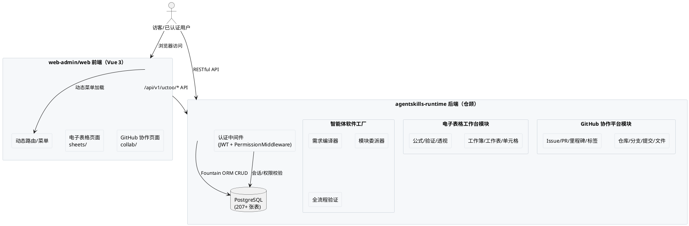

# Agentic Software Factory Hackathon — 技术设计文档

> **文档定位**：本文档为 `spec.md`（需求规格，6 节组件定位 + EARS 验收）的「怎么做」配套，定义 Agentic Software Factory Hackathon 参赛系统的增量技术设计方案。
>
> **赛事**：ArcBench Agentic Software Factory Hackathon | **参赛队伍**：UCTooCom
> **后端实现**：`apps/agentskills-runtime`（仓颉语言 + Fountain ORM + PostgreSQL）
> **前端实现**：`apps/web-admin/web`（Vue 3 + Vite + pinia-orm + OpenTiny）
> **开发规范**：遵循 `docs/uctoo-v4` + `skills/uctoo-dev-manual` 模块开发规范、`skills/sdd` 技能规范驱动开发流程；业务模块二次开发优先 `plugingen` 做成插件（铁律 14 二次开发底座优先）
> **赛题来源**：`arcbench-hackathon-requirements/` 目录下两个 `requirements.yaml`（GitHub 赛题 47 个原子需求 / Sheet 赛题 24 个原子需求，合计 71 个）
> **版本**：1.0.1 | **日期**：2026-10-01 | **最近修订**：2026-10-03 按 SDD v1.2.0 铁律 14 对齐工具链（plugingen 插件优先、loaddbinfo 第一步、生成后补 RBAC 授权）+ 铁律 15 拆分评估说明

---

# 一、需求与存量功能关系分析

## 1.1 需求功能与存量功能对比

### 1.1.1 已实现功能（直接复用，不重造）

> 以下基础设施已在 `agentskills-runtime` 后端（74 个 PO/DAO、201 个 Service、107 个 Controller、93 个 Route）与 `web-admin/web` 前端（70+ 个 store 模型、23 个 views 目录、17 个路由模块）中完整实现，含五层架构（Model/DAO/Service/Controller/Route）、前端 store 模型与 CRUD 管理界面，**本次增量开发直接复用，禁止重写**。

| 需求功能（REQ-###） | 存量功能 | 代码 / 文档位置 | 匹配度 |
|---|---|---|---|
| 账户注册/登录/会话/登出/改密 | `uctoo_user` + `uctoo_session` + JWT 中间件 + `UctooUserAuthController` | `src/app/models/uctoo/UctooUserPO.cj` / `controllers/UctooUserAuthController.cj` / `routes/UctooUserRoute.cj` | 100% |
| 密码恢复（固定验证码 123456） | `uctoo_user` + 现有恢复流程 | `UctooUserAuthController.cj` 恢复入口 | 95%（需适配固定验证码逻辑） |
| 组织管理（创建/成员/Owner） | `company` 表 + `user_has_company`（owner/admin/member/follower） | `src/app/models/uctoo/CompanyPO.cj` / `controllers/CompanyController.cj` | 90%（需扩展 GitHub 组织语义） |
| 团队管理（创建/成员/层级） | `user_group` + `user_has_group` | `src/app/models/uctoo/UserGroupPO.cj` / `UserHasGroupPO.cj` | 85%（需适配仓库访问授权） |
| 权限体系（菜单即路由） | `permissions` + `role_has_permission` + `data_access_authorization` | `src/app/models/uctoo/PermissionsPO.cj` / `middlewares/permission/PermissionMiddleware.cj` | 100% |
| Issue 载体（标题/描述/指派/状态） | `tasks` 表 + `user_has_tasks`（creator/assignee/participant/follower/watcher） | `src/app/models/uctoo/TasksPO.cj` / `controllers/TasksController.cj` | 80%（需扩展 Issue 语义：标签/里程碑） |
| 文件上传管理 | `attachments` 表 + 五层模块 | `src/app/models/uctoo/AttachmentsPO.cj` | 100% |
| 操作审计 | `operate_log` 表 + 五层模块 | `src/app/models/uctoo/OperateLogPO.cj` | 100% |
| 国际化 | `i18` + `lang` + vue-i18n | 后端 `src/app/models/uctoo/I18PO.cj` / 前端 `src/store/modules/locales.ts` | 100% |
| 定时任务 | `crontab` + `crontab_log` | `src/app/models/uctoo/CrontabPO.cj` | 100% |
| LLM 用量/定价/配额 | `llm_usage_logs` + `model_pricing` + `usage_quotas` | `src/app/models/uctoo/` | 100% |
| SDD 项目管理 | `sdd_projects` 表 + 五层模块 + 前端 store 模型 | `src/app/models/uctoo/SddProjectsPO.cj` / 前端 `src/store/models/uctoo/sdd_projects.ts` | 100% |
| 智能体任务编排 | `agent_tasks` + `orchestration_plans` + `orchestration_steps` | `src/app/models/uctoo/AgentTasksPO.cj` | 100% |
| 智能体分组/执行器 | `agent_groups` + `agent_group_members` + `agent_executors` | `src/app/models/uctoo/AgentGroupsPO.cj` | 100% |
| 验证记录/执行证据 | `agent_verification_records` + `execution_evidences` | `src/app/models/uctoo/` | 100% |
| 前端动态路由/菜单 | `permissions` 表 + `src/router/guard/menu.ts` 的 `flushRouter()` + `user_menu` store 模型 | 前端 `src/store/modules/router.ts` / `src/store/models/uctoo/permissions.ts` | 100% |
| 前端 ORM 状态管理 | pinia-orm + `@pinia-orm/axios` + `useAxiosRepo(Model).api()` | 前端 `src/store/models/uctoo/` 下 70+ 模型 | 100% |
| 前端 API 调用层 | axios + `/api/v1/uctoo/` 前缀 + `src/api/request.ts` 去重/节流 | 前端 `src/api/` 下 15 个文件 | 100% |
| xlsx 库 | `xlsx@^0.18.0` 已安装 | 前端 `package.json` | 100%（CSV 导入导出可复用） |

### 1.1.2 需要扩展的功能（复用为主，少量适配）

| 需求功能 | 说明 | 扩展方向 |
|---|---|---|
| 组织语义扩展 | `company` 表已有 `org_description/member_count/task_count/org_type/tags` 字段 | 填充 GitHub 组织语义，无需改表结构 |
| Issue 扩展 | `tasks` 表已有 `title/description/task_type/task_status/priority/company_id/creator_id/assignee_id` | 通过 `task_type='issue'` 区分 Issue；标签/里程碑通过关联表实现 |
| 仓库权限规则 | `data_access_authorization` 行级数据权限已有 | 新增 `repository` 表的权限规则数据 |
| 菜单/路由扩展 | `permissions` 表 + 前端动态路由机制已有 | 新增模块菜单通过 DDL 插入 `permissions` 表 |
| 智能体软件工厂 | `agent_tasks` + `orchestration_plans` + `agent_groups` + `agent_executors` 已有 | 新增编译技能（skills/ 目录）和委派策略 |

### 1.1.3 需要新增的功能或接口（本次交付范围）

| 需求功能 | 说明 | 交付物 |
|---|---|---|
| GitHub 仓库资产管理 | 仓库/分支/提交/文件树 CRUD | `repository` / `branch` / `commit` / `repository_file` 四张表 + 五层模块 + 前端 store 模型 + views |
| GitHub Issue 与 PR 管理 | Issue/PR/评审/里程碑/标签/分支保护 | `issue`（或复用 `tasks`）/ `issue_comment` / `milestone` / `label` / `pull_request` / `pr_review` / `branch_protection` 七张表 + 五层模块 + 前端 |
| 电子表格工作台 | 工作簿/工作表/单元格/验证/透视表 | `workbook` / `worksheet` / `cell` / `validation_rule` / `pivot_table` 五张表 + 五层模块 + 前端电子表格组件 |
| 公式计算引擎 | SUM/AVERAGE/COUNT/MAX/MIN/IF 等聚合函数 + 依赖重算 | 前端公式引擎（复用 xlsx 库 + 自定义计算器） |
| 种子数据初始化 | 赛题要求的预定义账户/组织/仓库/Issue/PR/工作簿 | `sql/incremental/hackathon_seed_data.sql` |
| 智能体需求编译器 | 将大型需求 YAML 拆解为原子任务 | 复用 `agent_tasks` + `orchestration_plans`，新增编译技能 |

---

## 1.2 存量功能详细分析（复用依据）

### 1.2.1 后端五层架构现状

`agentskills-runtime` 采用仓颉语言（cangjie 1.1.3）+ Fountain ORM 实现，遵循 uctoo-v4 五层 CRUD 架构规范：

| 层级 | 路径 | 数量 | 说明 |
|------|------|------|------|
| Model (PO) | `src/app/models/uctoo/` | 74 | 数据模型定义，ORM 映射，每个 PO 对应一张数据库表 |
| DAO | `src/app/dao/uctoo/` | 74 | 数据访问对象，封装 SQL 查询/插入/更新/删除 |
| Service | `src/app/services/` | 201 | 业务逻辑处理，组合 DAO 调用 |
| Controller | `src/app/controllers/` | 107 | HTTP 请求处理，参数验证，响应封装 |
| Route | `src/app/routes/` | 93 | 路由定义，中间件配置 |

核心基础设施位于 `src/app/core/`：HTTPServer、Router、Middleware、DatabaseConnection、Response、Cache、Query、ErrorHandler。

**仓颉项目配置**（`cjpm.toml`）：
- package 名称：`magic`，版本 `0.0.28`
- 关键依赖：`fountain ORM` / `f_data` / `charset4cj` / `jwt4cj` / `logcj` / `pgsql` / `json4cj` / `cos` / `blowfish`
- 三个可执行工具：`crudgen` / `crudweb` / `loaddbinfo`；插件脚手架：`plugingen`（业务模块优先做成插件，`magic.plugin.tools.plugingen`）、`pluginuninstall`（下线插件，`magic.plugin.tools.pluginuninstall`，禁止手删 `skills/{name}/`）

**数据库现状**：
- `uctooDB.sql` 含 207 张 `CREATE TABLE` 语句
- `sql/incremental/` 目录已有 38 个增量 DDL 文件
- `db_info` 表存储统一数据库表结构元数据，`loaddbinfo` 工具负责刷新

### 1.2.2 前端 UMI 架构现状

`web-admin/web` 采用 Vue 3.5 + Vite 6 + Pinia 2 + pinia-orm 技术栈：

| 维度 | 现状 |
|------|------|
| 技术栈 | Vue 3.5 + Vite 6 + Pinia 2 + pinia-orm ^1.10.2 + @pinia-orm/axios + OpenTiny Vue ^3.32 + ant-design-vue ^4.2 + vue-i18n ^11 + xlsx ^0.18 |
| Store 模型 | `src/store/models/uctoo/` 下 70+ 个 pinia-orm 模型，每个模型在 `static config.axiosApi` 中定义 RESTful API 动作 |
| Views 目录 | `src/views/` 下 23 个目录，其中 `database/uctoo/` 下约 40 个按模型生成的 CRUD 子目录 |
| 路由模块 | `src/router/routes/modules/` 下 17 个路由文件 |
| API 调用 | `src/api/` 下 15 个文件，API 前缀统一 `/api/v1/uctoo/`，`request.ts` 提供去重/节流 |
| 动态菜单 | `src/router/guard/menu.ts` 的 `flushRouter()` → `menuStore.getMenuList()` → `toRoutes()` 动态注册，数据来自 `POST /api/v1/uctoo/permissions/user/menu` |
| 国际化 | vue-i18n + 后端驱动，`src/store/modules/locales.ts` 管理语言数据，`useI18n().mergeLocaleMessage()` 合并 |
| 组件 | OpenTiny 全家桶（@opentiny/vue / vue-huicharts / vue-icon / vue-locale / vue-search-box / vue-theme）+ 自定义组件（Breadcrumb / TransitionFade / navbar / menu / footer / global-setting / theme / Vcode） |

### 1.2.3 用户与认证体系（完全复用）

`uctoo_user` 表已支持 `username/email/password/avatar/status/user_type/agent_id` 字段，满足赛题账户注册/登录/会话/密码恢复全部需求。

| 表 | 用途 | 复用方式 |
|----|------|----------|
| `uctoo_user` | 用户账户 | 直接复用，满足注册/登录/会话/智能体用户需求 |
| `uctoo_session` | 登录会话管理 | 直接复用，满足会话创建/销毁/过期需求 |
| `uctoo_role` | 角色定义 | 直接复用，扩展 GitHub 协作平台角色 |
| `user_has_roles` | 用户-角色关联 | 直接复用 |
| `user_has_account` | 用户-账户关联 | 直接复用 |
| `login_log` | 登录日志 | 直接复用 |

**关键实现位置**：`UctooUserAuthController.cj`（注册/登录/登出/恢复）、`UctooSessionController.cj`（会话管理）、JWT 中间件（`PermissionMiddleware.cj` 内集成）。

### 1.2.4 权限体系（完全复用）

| 表 | 用途 | 复用方式 |
|----|------|----------|
| `permissions` | 菜单即路由（permission_name/level/icon/module/component/path/method/meta） | 直接复用，新增模块菜单通过 DDL 插入此表 |
| `role_has_permission` | 角色-权限关联 | 直接复用 |
| `group_has_permission` | 组-权限关联 | 直接复用，映射为团队仓库权限 |
| `data_access_authorization` | 行级数据权限 | 直接复用，满足仓库可见性控制 |
| `user_group` / `user_has_group` | 用户组 | 直接复用，可映射为团队 |

**权限中间件**：`src/app/middlewares/permission/PermissionMiddleware.cj`，所有写操作自动检查当前会话和目标对象的权限。

### 1.2.5 aibuilder 模块（部分复用）

aibuilder 模块已实现组织/任务/消息管理，是 GitHub 协作平台的核心复用基础：

| 表 | 用途 | 复用方式 |
|----|------|----------|
| `company` | 组织实体（已扩展 org_description/member_count/task_count/follower_count/is_verified/org_type/tags） | **复用为 GitHub 组织**，无需新建组织表 |
| `user_has_company` | 用户-组织关联（owner/admin/member/follower） | **复用为组织成员管理** |
| `tasks` | 任务表（title/description/task_type/task_status/priority/company_id/creator_id/assignee_id/tags/extra_data） | **复用为 Issue 载体**，通过 `task_type='issue'` 区分 |
| `user_has_tasks` | 用户-任务关联（creator/assignee/participant/follower/watcher） | **复用为 Issue 指派/关注** |
| `messages` | 消息通知 | 直接复用 |

`tasks.extra_data` 为 jsonb 字段，可收纳 Issue 的 `labels`/`milestone_id`/`repository_id` 等扩展属性，避免新建 `issue` 表。但赛题对 Issue 的标签/里程碑管理有独立 CRUD 需求，因此评估后决定：

- **Issue 基础信息**：复用 `tasks` 表（`task_type='issue'`），不新建 `issue` 表
- **标签/里程碑/PR/评审**：新建独立表，通过 `repository_id` 关联

### 1.2.6 代码生成工具链（完全复用）

标准开发流程（见 `docs/uctoo-v4/uctoo-v4-module-development.md`）：

```
DDL → sql/incremental/xxx.sql
  → loaddbinfo（第一步：刷新 db_info 表元数据）
  → 【业务模块优先】plugingen（magic.plugin.tools.plugingen，默认 L3 进程隔离轨 process，需退回内嵌 sync 轨显式加 --mode sync；生成插件五层骨架）
  → 【宿主公共基础设施】crudgen（生成后端五层模块：PO/DAO/Service/Controller/Route）
  → crudweb（生成前端 store 模型 + views CRUD 页面）
  → 最小适配（生成物当骨架做最小改造，禁止手撸五层）
  → 补授权（sql/incremental/ 增量 DDL 登记 permissions + role_has_permission，否则新增路由 403）
  → 迭代定制（手写业务逻辑）
```

**工具位置**：`src/app/tools/`（确定性脚手架）
- `crudgen/`：含 `Controller/DAO/Model/Route/Service` 模板及 `CrudGenerator.cj`（宿主公共基础设施优先）
- `crudweb/`：含 Vue/TS 模板及 `WebCrudGenerator.cj`
- `loaddbinfo/loaddbinfo.cj`：刷新 `db_info` 表（DDL 后的第一步）
- `plugingen` / `pluginuninstall`：插件脚手架（`magic.plugin.tools.*`），业务模块优先做成插件，下线走对称卸载而非手删目录

### 1.2.7 智能体基础设施（完全复用）

| 表 | 用途 | 复用方式 |
|----|------|----------|
| `agents` | 智能体定义（agent_type/system_prompt/tools/model/parent_id/max_turns） | 直接复用，作为需求编译器与模块委派器的执行单元 |
| `agent_skills` | 技能注册（source/version/install_path/runtime_status） | 直接复用，47 个已安装技能可直接调用 |
| `agent_tasks` | 任务管理（status/priority/payload/result/parent_task_id） | 直接复用，作为需求拆解任务的载体 |
| `agent_contexts` / `agent_messages` / `agent_memories` | 上下文/消息/记忆 | 直接复用 |
| `agent_groups` / `agent_group_members` | 智能体分组 | 直接复用，可映射为模块委派组 |
| `agent_executors` / `agent_kanban_tasks` | 执行器/看板任务 | 直接复用 |
| `agent_verification_records` / `execution_evidences` | 验证记录/执行证据 | 直接复用，满足全流程可验证需求 |
| `orchestration_plans` / `orchestration_steps` | 编排计划/步骤 | 直接复用，作为需求编译的编排引擎 |
| `composition_executions` / `skill_compositions` | 技能组合执行 | 直接复用 |

### 1.2.8 API 规范与文档（完全复用）

`docs/uctoo-v4/` 下 17 个规范文档覆盖全部开发维度：

| 文档 | 用途 |
|------|------|
| `uctoo-v4-api-specification.md` | RESTful API 设计规范（列表键名 = 表名 + s，响应格式，错误码） |
| `uctoo-v4-module-development.md` | 模块开发规范（DDL → loaddbinfo → 优先 plugingen 做成插件 → crudweb → 最小适配 → 补 permissions/role_has_permission；crudgen 仅宿主公共基础设施） |
| `uctoo-v4-orm-specification.md` | ORM 规范（Fountain ORM 映射规则） |
| `uctoo-v4-middleware-guide.md` | 中间件指南（JWT/权限/CORS/日志） |
| `user-permission-system.md` | 权限体系规范 |
| `row-level-permission-system.md` | 行级数据权限规范 |
| `uctoo-database-design-specification.md` | 数据库设计规范（UUID 主键/timestamptz/creator/软删除） |
| `crud-generator-v2.md` | 代码生成器使用指南 |

---

# 二、增量设计方案

## 2.1 实现模型

### 2.1.1 上下文视图



### 2.1.2 服务/组件总体架构

```
apps/agentskills-runtime/                      # 后端仓颉项目
├── src/app/
│   ├── models/uctoo/                           # PO 层（现有 74 + 新增 16 = 90）
│   │   ├── RepositoryPO.cj                     # 【新增】仓库
│   │   ├── BranchPO.cj                         # 【新增】分支
│   │   ├── CommitPO.cj                         # 【新增】提交
│   │   ├── RepositoryFilePO.cj                 # 【新增】文件树
│   │   ├── IssueCommentPO.cj                   # 【新增】Issue 评论
│   │   ├── MilestonePO.cj                      # 【新增】里程碑
│   │   ├── LabelPO.cj                          # 【新增】标签
│   │   ├── PullRequestPO.cj                   # 【新增】PR
│   │   ├── PrReviewPO.cj                       # 【新增】PR 评审
│   │   ├── BranchProtectionPO.cj              # 【新增】分支保护
│   │   ├── WorkbookPO.cj                       # 【新增】工作簿
│   │   ├── WorksheetPO.cj                      # 【新增】工作表
│   │   ├── CellPO.cj                           # 【新增】单元格
│   │   ├── ValidationRulePO.cj                # 【新增】验证规则
│   │   └── PivotTablePO.cj                    # 【新增】透视表
│   ├── dao/uctoo/                              # DAO 层（同 PO 数量）
│   ├── services/                               # Service 层
│   │   ├── github/                             # 【新增】GitHub 协作平台业务逻辑
│   │   └── sheets/                             # 【新增】电子表格工作台业务逻辑
│   ├── controllers/                            # Controller 层
│   │   ├── RepositoryController.cj            # 【新增】
│   │   ├── BranchController.cj               # 【新增】
│   │   ├── ...（GitHub + Sheets 各模块 Controller）
│   ├── routes/                                 # Route 层
│   │   ├── RepositoryRoute.cj                 # 【新增】
│   │   ├── ...（GitHub + Sheets 各模块 Route）
│   ├── middlewares/permission/                 # 权限中间件（复用）
│   └── tools/                                  # 代码生成工具（复用）
├── sql/incremental/                            # 增量 DDL
│   ├── hackathon_github_repository.sql        # 【新增】GitHub 仓库/分支/提交/文件
│   ├── hackathon_github_issue_pr.sql          # 【新增】Issue/PR/评审/里程碑/标签/分支保护
│   ├── hackathon_sheets_workbook.sql           # 【新增】工作簿/工作表/单元格/验证/透视表
│   ├── hackathon_permissions_menu.sql         # 【新增】菜单与权限
│   └── hackathon_seed_data.sql                # 【新增】种子数据
├── docs/uctoo-v4/                              # 开发规范文档（复用）
└── skills/                                     # 智能体技能
    └── hackathon-compiler/                     # 【新增】需求编译技能

apps/web-admin/web/                             # 前端 Vue 3 项目
├── src/
│   ├── store/models/uctoo/                     # Store 模型（现有 70+ + 新增 16）
│   │   ├── repository.ts                       # 【新增】
│   │   ├── branch.ts                           # 【新增】
│   │   ├── ...（GitHub + Sheets 各模块 store 模型）
│   ├── views/                                  # 页面
│   │   ├── collab/                             # 【新增】GitHub 协作平台页面
│   │   │   ├── repositories/                   # 仓库列表/详情/文件树/提交历史
│   │   │   ├── issues/                         # Issue 列表/详情
│   │   │   ├── pull-requests/                  # PR 列表/详情/比较/评审
│   │   │   └── organizations/                 # 组织/团队管理
│   │   └── sheets/                             # 【新增】电子表格工作台页面
│   │       ├── workbooks/                      # 工作簿列表/编辑器
│   │       └── components/                    # 公式栏/网格/标签/工具栏
│   ├── router/routes/modules/                  # 路由模块
│   │   ├── collab.ts                           # 【新增】GitHub 协作平台路由
│   │   └── sheets.ts                           # 【新增】电子表格工作台路由
│   ├── api/                                    # API 调用层（复用）
│   └── components/                             # 通用组件（复用）
```

### 2.1.3 关键组件设计

- **GitHub 协作平台 Service 层**：`src/app/services/github/` 下按模块组织，RepositoryService 负责仓库 CRUD + 可见性控制 + Fork，BranchService 负责分支管理 + 保护规则，CommitService 负责提交历史 + 差异，PullRequestService 负责 PR 生命周期 + 合并 + 评审。
- **电子表格工作台 Service 层**：`src/app/services/sheets/` 下，WorkbookService 负责工作簿 CRUD + CSV 导入导出，WorksheetService 负责工作表管理，CellService 负责单元格 CRUD + 批量操作，FormulaService 负责公式解析 + 计算 + 依赖重算，PivotTableService 负责透视表聚合。
- **前端公式引擎**：纯前端实现，复用 `xlsx@^0.18.0` 库的 CSV 解析能力 + 自定义公式计算器（支持 SUM/AVERAGE/COUNT/MAX/MIN/IF/STDEV/HYPERLINK/SIN/SUMIF/PMT 等函数 + 相对引用调整 + 依赖链重算 + 循环引用检测 + 错误标识 #DIV/0!/#REF!/#CIRC!）。

---

## 2.2 数据设计

### 2.2.1 GitHub 协作平台增量表设计

> 所有 DDL 放置于 `sql/incremental/hackathon_github_repository.sql` 和 `hackathon_github_issue_pr.sql`，遵循 uctoo-v4 数据库设计规范（UUID 主键、timestamptz、creator 行级权限、软删除）。

#### 2.2.1.1 repository（仓库）

```sql
CREATE TABLE "public"."repository" (
  "id" uuid NOT NULL DEFAULT gen_random_uuid(),
  "name" varchar(128) NOT NULL,
  "description" varchar(350),
  "visibility" varchar(20) NOT NULL DEFAULT 'public',  -- public / private
  "default_branch" varchar(128) NOT NULL DEFAULT 'main',
  "owner_type" varchar(20) NOT NULL DEFAULT 'user',     -- user / organization
  "owner_id" uuid NOT NULL,                              -- uctoo_user.id 或 company.id
  "is_fork" bool NOT NULL DEFAULT false,
  "forked_from_id" uuid,                                 -- 源仓库 ID（Fork 时填）
  "language" varchar(64),
  "star_count" int4 NOT NULL DEFAULT 0,
  "fork_count" int4 NOT NULL DEFAULT 0,
  "topics" jsonb NOT NULL DEFAULT '[]'::jsonb,
  "creator" uuid,
  "owner_user_id" uuid,
  "created_at" timestamptz(6) NOT NULL DEFAULT CURRENT_TIMESTAMP,
  "updated_at" timestamptz(6) NOT NULL DEFAULT CURRENT_TIMESTAMP,
  "deleted_at" timestamptz(6)
);
COMMENT ON TABLE "public"."repository" IS 'GitHub风格仓库：name在owner_id下唯一，visibility控制可见性';
CREATE UNIQUE INDEX "uq_repository_owner_name"
  ON "public"."repository" ("owner_id", "name") WHERE "deleted_at" IS NULL;
CREATE INDEX "idx_repository_visibility"
  ON "public"."repository" ("visibility") WHERE "deleted_at" IS NULL;
CREATE INDEX "idx_repository_owner"
  ON "public"."repository" ("owner_id") WHERE "deleted_at" IS NULL;
```

#### 2.2.1.2 branch（分支）

```sql
CREATE TABLE "public"."branch" (
  "id" uuid NOT NULL DEFAULT gen_random_uuid(),
  "name" varchar(128) NOT NULL,
  "repository_id" uuid NOT NULL,
  "is_default" bool NOT NULL DEFAULT false,
  "created_from_commit_id" uuid,                        -- 从哪个提交创建
  "creator" uuid,
  "owner_user_id" uuid,
  "created_at" timestamptz(6) NOT NULL DEFAULT CURRENT_TIMESTAMP,
  "updated_at" timestamptz(6) NOT NULL DEFAULT CURRENT_TIMESTAMP,
  "deleted_at" timestamptz(6)
);
COMMENT ON TABLE "public"."branch" IS '仓库分支：name在repository_id下唯一';
CREATE UNIQUE INDEX "uq_branch_repo_name"
  ON "public"."branch" ("repository_id", "name") WHERE "deleted_at" IS NULL;
CREATE INDEX "idx_branch_repository"
  ON "public"."branch" ("repository_id") WHERE "deleted_at" IS NULL;
```

#### 2.2.1.3 commit（提交）

```sql
CREATE TABLE "public"."commit" (
  "id" uuid NOT NULL DEFAULT gen_random_uuid(),
  "hash" varchar(40) NOT NULL,                           -- SHA-1 哈希
  "repository_id" uuid NOT NULL,
  "branch_id" uuid NOT NULL,
  "author_id" uuid NOT NULL,                             -- uctoo_user.id
  "message" text,
  "parent_commit_ids" jsonb NOT NULL DEFAULT '[]'::jsonb, -- 父提交 ID 列表
  "diff" jsonb NOT NULL DEFAULT '{}'::jsonb,             -- 文件级变更差异
  "verified" bool NOT NULL DEFAULT false,
  "committed_at" timestamptz(6) NOT NULL DEFAULT CURRENT_TIMESTAMP,
  "creator" uuid,
  "owner_user_id" uuid,
  "created_at" timestamptz(6) NOT NULL DEFAULT CURRENT_TIMESTAMP,
  "updated_at" timestamptz(6) NOT NULL DEFAULT CURRENT_TIMESTAMP,
  "deleted_at" timestamptz(6)
);
COMMENT ON TABLE "public"."commit" IS '代码提交记录：含哈希/差异/验证标识/父提交链';
CREATE UNIQUE INDEX "uq_commit_hash"
  ON "public"."commit" ("repository_id", "hash") WHERE "deleted_at" IS NULL;
CREATE INDEX "idx_commit_branch"
  ON "public"."commit" ("branch_id") WHERE "deleted_at" IS NULL;
CREATE INDEX "idx_commit_author"
  ON "public"."commit" ("author_id") WHERE "deleted_at" IS NULL;
```

#### 2.2.1.4 repository_file（文件树）

```sql
CREATE TABLE "public"."repository_file" (
  "id" uuid NOT NULL DEFAULT gen_random_uuid(),
  "repository_id" uuid NOT NULL,
  "branch_id" uuid NOT NULL,
  "path" varchar(512) NOT NULL,                         -- 文件路径（如 src/main.cj）
  "file_name" varchar(256) NOT NULL,
  "is_directory" bool NOT NULL DEFAULT false,
  "content" text,                                        -- 文件内容（目录为 NULL）
  "size" int8 NOT NULL DEFAULT 0,
  "last_commit_id" uuid,                                 -- 最后修改提交 ID
  "creator" uuid,
  "owner_user_id" uuid,
  "created_at" timestamptz(6) NOT NULL DEFAULT CURRENT_TIMESTAMP,
  "updated_at" timestamptz(6) NOT NULL DEFAULT CURRENT_TIMESTAMP,
  "deleted_at" timestamptz(6)
);
COMMENT ON TABLE "public"."repository_file" IS '仓库文件树节点：支持在线编辑';
CREATE INDEX "idx_repo_file_branch_path"
  ON "public"."repository_file" ("branch_id", "path") WHERE "deleted_at" IS NULL;
```

#### 2.2.1.5 issue_comment / milestone / label / pull_request / pr_review / branch_protection

```sql
-- Issue 评论
CREATE TABLE "public"."issue_comment" (
  "id" uuid NOT NULL DEFAULT gen_random_uuid(),
  "task_id" uuid NOT NULL,                              -- 关联 tasks.id（Issue）
  "commenter_id" uuid NOT NULL,                         -- uctoo_user.id
  "content" text,
  "creator" uuid, "owner_user_id" uuid,
  "created_at" timestamptz(6) NOT NULL DEFAULT CURRENT_TIMESTAMP,
  "updated_at" timestamptz(6) NOT NULL DEFAULT CURRENT_TIMESTAMP,
  "deleted_at" timestamptz(6)
);
COMMENT ON TABLE "public"."issue_comment" IS 'Issue评论：关联tasks表';
CREATE INDEX "idx_issue_comment_task"
  ON "public"."issue_comment" ("task_id") WHERE "deleted_at" IS NULL;

-- 里程碑
CREATE TABLE "public"."milestone" (
  "id" uuid NOT NULL DEFAULT gen_random_uuid(),
  "title" varchar(256) NOT NULL,
  "description" text,
  "status" varchar(20) NOT NULL DEFAULT 'open',          -- open / closed
  "repository_id" uuid NOT NULL,
  "due_date" timestamptz(6),
  "creator" uuid, "owner_user_id" uuid,
  "created_at" timestamptz(6) NOT NULL DEFAULT CURRENT_TIMESTAMP,
  "updated_at" timestamptz(6) NOT NULL DEFAULT CURRENT_TIMESTAMP,
  "deleted_at" timestamptz(6)
);
COMMENT ON TABLE "public"."milestone" IS '里程碑：关联Issue和PR';
CREATE INDEX "idx_milestone_repository"
  ON "public"."milestone" ("repository_id") WHERE "deleted_at" IS NULL;

-- 标签
CREATE TABLE "public"."label" (
  "id" uuid NOT NULL DEFAULT gen_random_uuid(),
  "name" varchar(64) NOT NULL,
  "color" varchar(7) NOT NULL DEFAULT '#6366f1',        -- 十六进制颜色
  "description" varchar(256),
  "repository_id" uuid NOT NULL,
  "creator" uuid, "owner_user_id" uuid,
  "created_at" timestamptz(6) NOT NULL DEFAULT CURRENT_TIMESTAMP,
  "updated_at" timestamptz(6) NOT NULL DEFAULT CURRENT_TIMESTAMP,
  "deleted_at" timestamptz(6)
);
COMMENT ON TABLE "public"."label" IS '仓库标签';
CREATE UNIQUE INDEX "uq_label_repo_name"
  ON "public"."label" ("repository_id", "name") WHERE "deleted_at" IS NULL;

-- Pull Request
CREATE TABLE "public"."pull_request" (
  "id" uuid NOT NULL DEFAULT gen_random_uuid(),
  "title" varchar(256) NOT NULL,
  "description" text,
  "status" varchar(20) NOT NULL DEFAULT 'open',          -- open / closed / merged
  "is_draft" bool NOT NULL DEFAULT false,
  "repository_id" uuid NOT NULL,
  "base_branch_id" uuid NOT NULL,                       -- 目标分支
  "compare_branch_id" uuid NOT NULL,                    -- 源分支
  "mergeable" bool,
  "merged_at" timestamptz(6),
  "merged_by_id" uuid,
  "milestone_id" uuid,
  "creator" uuid, "owner_user_id" uuid,
  "created_at" timestamptz(6) NOT NULL DEFAULT CURRENT_TIMESTAMP,
  "updated_at" timestamptz(6) NOT NULL DEFAULT CURRENT_TIMESTAMP,
  "deleted_at" timestamptz(6)
);
COMMENT ON TABLE "public"."pull_request" IS 'PR：base/compare分支/评审/合并状态';
CREATE INDEX "idx_pr_repository"
  ON "public"."pull_request" ("repository_id") WHERE "deleted_at" IS NULL;
CREATE INDEX "idx_pr_status"
  ON "public"."pull_request" ("status") WHERE "deleted_at" IS NULL;

-- PR 评审
CREATE TABLE "public"."pr_review" (
  "id" uuid NOT NULL DEFAULT gen_random_uuid(),
  "pull_request_id" uuid NOT NULL,
  "reviewer_id" uuid NOT NULL,                           -- uctoo_user.id
  "status" varchar(20) NOT NULL DEFAULT 'pending',      -- pending / approved / request_changes / comment
  "content" text,
  "line_number" int4,                                    -- 评审针对的代码行
  "file_path" varchar(512),
  "creator" uuid, "owner_user_id" uuid,
  "created_at" timestamptz(6) NOT NULL DEFAULT CURRENT_TIMESTAMP,
  "updated_at" timestamptz(6) NOT NULL DEFAULT CURRENT_TIMESTAMP,
  "deleted_at" timestamptz(6)
);
COMMENT ON TABLE "public"."pr_review" IS 'PR评审：Approve/Request Changes/Comment';
CREATE INDEX "idx_pr_review_pr"
  ON "public"."pr_review" ("pull_request_id") WHERE "deleted_at" IS NULL;

-- 分支保护规则
CREATE TABLE "public"."branch_protection" (
  "id" uuid NOT NULL DEFAULT gen_random_uuid(),
  "branch_id" uuid NOT NULL,
  "pattern" varchar(128),                                -- 分支名匹配模式（如 main / release/*）
  "require_reviews" bool NOT NULL DEFAULT false,
  "required_review_count" int4 NOT NULL DEFAULT 1,
  "require_status_checks" bool NOT NULL DEFAULT false,
  "enforce_admins" bool NOT NULL DEFAULT false,
  "creator" uuid, "owner_user_id" uuid,
  "created_at" timestamptz(6) NOT NULL DEFAULT CURRENT_TIMESTAMP,
  "updated_at" timestamptz(6) NOT NULL DEFAULT CURRENT_TIMESTAMP,
  "deleted_at" timestamptz(6)
);
COMMENT ON TABLE "public"."branch_protection" IS '分支保护规则：要求评审通过和状态检查';
CREATE INDEX "idx_branch_protection_branch"
  ON "public"."branch_protection" ("branch_id") WHERE "deleted_at" IS NULL;
```

### 2.2.2 电子表格工作台增量表设计

> DDL 放置于 `sql/incremental/hackathon_sheets_workbook.sql`。

```sql
-- 工作簿
CREATE TABLE "public"."workbook" (
  "id" uuid NOT NULL DEFAULT gen_random_uuid(),
  "name" varchar(256) NOT NULL,
  "owner_id" uuid NOT NULL,                             -- uctoo_user.id
  "last_updated" timestamptz(6) NOT NULL DEFAULT CURRENT_TIMESTAMP,
  "source_type" varchar(20) NOT NULL DEFAULT 'blank',   -- blank / csv / gsheets
  "creator" uuid, "owner_user_id" uuid,
  "created_at" timestamptz(6) NOT NULL DEFAULT CURRENT_TIMESTAMP,
  "updated_at" timestamptz(6) NOT NULL DEFAULT CURRENT_TIMESTAMP,
  "deleted_at" timestamptz(6)
);
COMMENT ON TABLE "public"."workbook" IS '电子表格工作簿：顶层容器';
CREATE INDEX "idx_workbook_owner"
  ON "public"."workbook" ("owner_id") WHERE "deleted_at" IS NULL;

-- 工作表
CREATE TABLE "public"."worksheet" (
  "id" uuid NOT NULL DEFAULT gen_random_uuid(),
  "name" varchar(128) NOT NULL,
  "workbook_id" uuid NOT NULL,
  "position" int4 NOT NULL DEFAULT 0,                    -- 顺序序号
  "row_count" int4 NOT NULL DEFAULT 100,
  "col_count" int4 NOT NULL DEFAULT 26,
  "creator" uuid, "owner_user_id" uuid,
  "created_at" timestamptz(6) NOT NULL DEFAULT CURRENT_TIMESTAMP,
  "updated_at" timestamptz(6) NOT NULL DEFAULT CURRENT_TIMESTAMP,
  "deleted_at" timestamptz(6)
);
COMMENT ON TABLE "public"."worksheet" IS '工作表：name在workbook_id下唯一';
CREATE UNIQUE INDEX "uq_worksheet_name"
  ON "public"."worksheet" ("workbook_id", "name") WHERE "deleted_at" IS NULL;
CREATE INDEX "idx_worksheet_workbook"
  ON "public"."worksheet" ("workbook_id", "position") WHERE "deleted_at" IS NULL;

-- 单元格
CREATE TABLE "public"."cell" (
  "id" uuid NOT NULL DEFAULT gen_random_uuid(),
  "worksheet_id" uuid NOT NULL,
  "coordinate" varchar(10) NOT NULL,                    -- 坐标（如 A1 / B3）
  "row_index" int4 NOT NULL,
  "col_index" int4 NOT NULL,
  "value" text,                                          -- 显示值（计算结果或原始值）
  "formula" text,                                        -- 公式表达式（以 = 开头）
  "data_type" varchar(20) NOT NULL DEFAULT 'text',     -- text / number / boolean / error
  "error_type" varchar(20),                             -- #DIV/0! / #REF! / #CIRC!
  "style" jsonb NOT NULL DEFAULT '{}'::jsonb,           -- 样式信息
  "creator" uuid, "owner_user_id" uuid,
  "created_at" timestamptz(6) NOT NULL DEFAULT CURRENT_TIMESTAMP,
  "updated_at" timestamptz(6) NOT NULL DEFAULT CURRENT_TIMESTAMP,
  "deleted_at" timestamptz(6)
);
COMMENT ON TABLE "public"."cell" IS '单元格：coordinate在worksheet_id下唯一';
CREATE UNIQUE INDEX "uq_cell_coord"
  ON "public"."cell" ("worksheet_id", "coordinate") WHERE "deleted_at" IS NULL;
CREATE INDEX "idx_cell_worksheet"
  ON "public"."cell" ("worksheet_id") WHERE "deleted_at" IS NULL;

-- 数据验证规则
CREATE TABLE "public"."validation_rule" (
  "id" uuid NOT NULL DEFAULT gen_random_uuid(),
  "worksheet_id" uuid NOT NULL,
  "range_start" varchar(10) NOT NULL,                   -- 区域起始坐标（如 A1）
  "range_end" varchar(10) NOT NULL,                     -- 区域结束坐标（如 A10）
  "validation_type" varchar(20) NOT NULL DEFAULT 'dropdown', -- dropdown / numeric
  "constraints" jsonb NOT NULL DEFAULT '{}'::jsonb,     -- 下拉列表值集合或数值范围 {min, max}
  "error_message" varchar(256),
  "creator" uuid, "owner_user_id" uuid,
  "created_at" timestamptz(6) NOT NULL DEFAULT CURRENT_TIMESTAMP,
  "updated_at" timestamptz(6) NOT NULL DEFAULT CURRENT_TIMESTAMP,
  "deleted_at" timestamptz(6)
);
COMMENT ON TABLE "public"."validation_rule" IS '数据验证规则：下拉列表/数值范围';
CREATE INDEX "idx_validation_worksheet"
  ON "public"."validation_rule" ("worksheet_id") WHERE "deleted_at" IS NULL;

-- 透视表
CREATE TABLE "public"."pivot_table" (
  "id" uuid NOT NULL DEFAULT gen_random_uuid(),
  "worksheet_id" uuid NOT NULL,                         -- 透视表所在工作表
  "source_worksheet_id" uuid NOT NULL,                  -- 源数据工作表
  "source_range_start" varchar(10) NOT NULL,
  "source_range_end" varchar(10) NOT NULL,
  "row_dimension" varchar(128) NOT NULL,               -- 行维度字段
  "column_dimension" varchar(128) NOT NULL,            -- 列维度字段
  "value_field" varchar(128) NOT NULL,                  -- 值字段
  "aggregation" varchar(20) NOT NULL DEFAULT 'SUM',    -- SUM / COUNT / AVERAGE
  "result_range_start" varchar(10),                     -- 结果显示区域起始坐标
  "creator" uuid, "owner_user_id" uuid,
  "created_at" timestamptz(6) NOT NULL DEFAULT CURRENT_TIMESTAMP,
  "updated_at" timestamptz(6) NOT NULL DEFAULT CURRENT_TIMESTAMP,
  "deleted_at" timestamptz(6)
);
COMMENT ON TABLE "public"."pivot_table" IS '透视表：行列维度+值聚合+独立结果区域';
CREATE INDEX "idx_pivot_worksheet"
  ON "public"."pivot_table" ("worksheet_id") WHERE "deleted_at" IS NULL;
```

### 2.2.3 种子数据设计

> DDL 放置于 `sql/incremental/hackathon_seed_data.sql`，预置赛题要求的隔离浏览器会话种子数据。

种子数据覆盖以下实体（均为预定义 UUID，保证跨会话一致）：

| 实体 | 数量 | 关键字段 |
|------|------|----------|
| 账户（uctoo_user） | 5+ | username/email/password（合规密码）/email_verified=true/status=available |
| 组织（company） | 2+ | company_name/org_type='github-org'/member_count |
| 仓库（repository） | 5+ | name/visibility=public/private/default_branch=main |
| 分支（branch） | 8+ | name/repository_id/is_default |
| 提交（commit） | 10+ | hash/message/author_id/verified |
| 文件（repository_file） | 15+ | path/content/branch_id |
| Issue（tasks, task_type='issue'） | 8+ | title/description/task_status/priority |
| PR（pull_request） | 4+ | title/status/base_branch/compare_branch |
| 工作簿（workbook） | 3+ | name/owner_id/last_updated |
| 工作表（worksheet） | 5+ | name/workbook_id/position |
| 单元格（cell） | 50+ | coordinate/value/formula |

### 2.2.4 菜单权限数据设计

> DDL 放置于 `sql/incremental/hackathon_permissions_menu.sql`，通过插入 `permissions` 表注册前端动态路由。

```sql
-- GitHub 协作平台菜单（一级菜单 + 二级子菜单）
INSERT INTO "public"."permissions" ("permission_name", "parent_id", "level", "icon", "module",
  "component", "path", "method", "meta", "creator", "created_at", "updated_at")
VALUES
  ('collab', NULL, 1, 'icon-git-branch', 'collab', 'Layout', '/collab', 'GET', '{"title":"协作平台"}'::jsonb, ...),
  ('collab-repositories', 'collab-id', 2, 'icon-folder', 'collab', 'collab/repositories/index', 'repositories', 'GET', '{"title":"仓库"}'::jsonb, ...),
  ('collab-issues', 'collab-id', 2, 'icon-task', 'collab', 'collab/issues/index', 'issues', 'GET', '{"title":"Issue"}'::jsonb, ...),
  ('collab-pull-requests', 'collab-id', 2, 'icon-merge', 'collab', 'collab/pull-requests/index', 'pull-requests', 'GET', '{"title":"Pull Request"}'::jsonb, ...),
  ('collab-organizations', 'collab-id', 2, 'icon-organization', 'collab', 'collab/organizations/index', 'organizations', 'GET', '{"title":"组织"}'::jsonb, ...);

-- 电子表格工作台菜单
INSERT INTO "public"."permissions" ("permission_name", "parent_id", "level", "icon", "module",
  "component", "path", "method", "meta", "creator", "created_at", "updated_at")
VALUES
  ('sheets', NULL, 1, 'icon-sheet', 'sheets', 'Layout', '/sheets', 'GET', '{"title":"电子表格"}'::jsonb, ...),
  ('sheets-workbooks', 'sheets-id', 2, 'icon-folder', 'sheets', 'sheets/workbooks/index', 'workbooks', 'GET', '{"title":"工作簿"}'::jsonb, ...);

-- 角色-权限关联（注册登录用户角色）
INSERT INTO "public"."role_has_permission" ("role_id", "permission_id", "creator", "created_at", "updated_at")
SELECT r.id, p.id, ..., ..., ... FROM "public"."uctoo_role" r, "public"."permissions" p
WHERE r.role_name = '注册登录用户' AND p.module IN ('collab', 'sheets');
```

---

## 2.3 API 设计

### 2.3.1 API 规范约定

遵循 `docs/uctoo-v4/uctoo-v4-api-specification.md` 规范：

| 约定 | 规则 |
|------|------|
| 基础路径 | `/api/v1/uctoo/{table_name}` |
| 列表键名 | 表名 + `s`（如 `repositories` / `branches` / `workbooks`） |
| 响应格式 | `{ "data": {}, "currentPage": 1, "totalCount": 100, "totalPage": 10 }` |
| 错误响应 | `{ "errno": "40001", "errmsg": "参数错误" }` |
| HTTP 方法 | GET（查询）/ POST（创建）/ PUT（更新）/ DELETE（删除） |
| 资源路径 | `/api/v1/uctoo/{table}/{id}` |
| 操作路径 | `/api/v1/uctoo/{table}/{action}` |

### 2.3.2 GitHub 协作平台 API 列表

| 方法 | 路径 | 描述 |
|------|------|------|
| GET | `/api/v1/uctoo/repositories` | 仓库列表（支持搜索/筛选/排序） |
| POST | `/api/v1/uctoo/repositories` | 创建仓库 |
| GET | `/api/v1/uctoo/repositories/:id` | 仓库详情 |
| PUT | `/api/v1/uctoo/repositories/:id` | 更新仓库（含可见性变更） |
| POST | `/api/v1/uctoo/repositories/:id/fork` | Fork 仓库 |
| GET | `/api/v1/uctoo/repositories/:id/branches` | 分支列表 |
| POST | `/api/v1/uctoo/repositories/:id/branches` | 创建分支 |
| GET | `/api/v1/uctoo/repositories/:id/commits` | 提交历史 |
| GET | `/api/v1/uctoo/repositories/:id/files` | 文件树（按分支） |
| PUT | `/api/v1/uctoo/repositories/:id/files/:file_id` | 在线编辑文件 |
| GET | `/api/v1/uctoo/repositories/:id/issues` | Issue 列表（复用 tasks 表） |
| POST | `/api/v1/uctoo/repositories/:id/issues` | 创建 Issue |
| GET | `/api/v1/uctoo/repositories/:id/pull-requests` | PR 列表 |
| POST | `/api/v1/uctoo/repositories/:id/pull-requests` | 创建 PR |
| POST | `/api/v1/uctoo/pull-requests/:id/reviews` | 提交 PR 评审 |
| POST | `/api/v1/uctoo/pull-requests/:id/merge` | 合并 PR |
| GET | `/api/v1/uctoo/repositories/:id/milestones` | 里程碑列表 |
| GET | `/api/v1/uctoo/repositories/:id/labels` | 标签列表 |
| POST | `/api/v1/uctoo/repositories/:id/branch-protections` | 设置分支保护 |

### 2.3.3 电子表格工作台 API 列表

| 方法 | 路径 | 描述 |
|------|------|------|
| GET | `/api/v1/uctoo/workbooks` | 工作簿列表（含 Last updated） |
| POST | `/api/v1/uctoo/workbooks` | 创建空白工作簿 |
| GET | `/api/v1/uctoo/workbooks/:id` | 打开工作簿（含工作表/单元格完整状态） |
| PUT | `/api/v1/uctoo/workbooks/:id` | 重命名工作簿 |
| POST | `/api/v1/uctoo/workbooks/import-csv` | CSV 导入（上传文件 → 解析 → 创建工作簿） |
| GET | `/api/v1/uctoo/workbooks/:id/export-csv` | CSV 导出当前活动工作表 |
| POST | `/api/v1/uctoo/workbooks/:id/worksheets` | 添加工作表 |
| PUT | `/api/v1/uctoo/worksheets/:id` | 重命名/删除工作表 |
| GET | `/api/v1/uctoo/worksheets/:id/cells` | 获取工作表所有单元格 |
| PUT | `/api/v1/uctoo/worksheets/:id/cells` | 批量更新单元格（含公式） |
| POST | `/api/v1/uctoo/worksheets/:id/cells/batch` | 批量操作（插入/删除行列/粘贴） |
| POST | `/api/v1/uctoo/worksheets/:id/validation-rules` | 设置数据验证规则 |
| POST | `/api/v1/uctoo/worksheets/:id/pivot-tables` | 创建透视表 |
| POST | `/api/v1/uctoo/worksheets/:id/pivot-tables/:pt_id/refresh` | 刷新透视表 |

---

## 2.4 前端设计

### 2.4.1 GitHub 协作平台前端

```
src/views/collab/
├── repositories/
│   ├── index.vue                 # 仓库列表（搜索/筛选/排序）
│   ├── detail.vue                # 仓库主页（文件树/提交历史/Issue/PR 标签）
│   ├── create.vue                # 创建仓库表单（Owner/名称/可见性/初始化选项）
│   └── components/
│       ├── file-tree.vue         # 文件树组件（按分支切换）
│       ├── commit-history.vue    # 提交历史列表
│       ├── commit-diff.vue       # 提交差异对比
│       └── web-editor.vue        # 在线文件编辑器
├── issues/
│   ├── index.vue                 # Issue 列表（状态/标签/指派人筛选）
│   └── detail.vue                # Issue 详情（讨论区/属性面板）
├── pull-requests/
│   ├── index.vue                 # PR 列表
│   ├── detail.vue                # PR 概览（提交列表/差异/评审）
│   ├── compare.vue               # 分支比较视图
│   └── components/
│       ├── review-panel.vue      # 评审面板（Approve/Request Changes/Comment）
│       └── branch-protection.vue # 分支保护规则设置
└── organizations/
    ├── index.vue                 # 组织列表
    ├── detail.vue                # 组织详情（成员/团队/仓库）
    └── components/
        ├── team-manager.vue      # 团队管理（创建/成员/层级）
        └── member-list.vue       # 成员列表（添加/移除/角色）
```

### 2.4.2 电子表格工作台前端

```
src/views/sheets/
├── workbooks/
│   ├── index.vue                 # 工作簿首页（列表 + New blank + Import CSV）
│   ├── editor.vue                # 工作簿编辑器（核心页面）
│   └── components/
│       ├── sheet-tabs.vue        # 工作表标签（ARIA tab 角色 + aria-selected）
│       ├── worksheet-grid.vue    # 网格组件（ARIA grid + aria-multiselectable）
│       ├── cell.vue              # 单元格组件（ARIA gridcell + 坐标可访问名称）
│       ├── formula-bar.vue       # 公式栏（显示当前单元格值或公式）
│       ├── toolbar.vue           # 工具栏（排序/筛选/验证/透视表入口）
│       ├── csv-import-dialog.vue # CSV 导入对话框
│       ├── rename-dialog.vue     # 重命名对话框
│       └── pivot-panel.vue       # 透视表面板
└── composables/
    ├── useFormula.ts             # 公式计算引擎（SUM/AVERAGE/COUNT/MAX/MIN/IF 等）
    ├── useCellSelection.ts       # 单元格选择/矩形区域/复制/剪切/粘贴
    ├── useUndoRedo.ts            # 撤销/重做栈
    └── useValidation.ts          # 数据验证逻辑
```

### 2.4.3 Store 模型设计

每个新增表对应一个 pinia-orm store 模型，遵循 UMI 架构同构设计：

```typescript
// src/store/models/uctoo/repository.ts
import { Model } from 'pinia-orm';
import { AxiosRequestConfig } from '@pinia-orm/axios';

export default class Repository extends Model {
  static entity = 'repositories';
  static primaryKey = 'id';

  static fields() {
    return {
      id: this.string(null),
      name: this.string(''),
      description: this.string(''),
      visibility: this.string('public'),
      default_branch: this.string('main'),
      owner_type: this.string('user'),
      owner_id: this.string(null),
      is_fork: this.boolean(false),
      // ... 其他字段
      created_at: this.string(''),
      updated_at: this.string(''),
    };
  }

  static config: AxiosRequestConfig = {
    axiosApi: {
      index: { url: '/api/v1/uctoo/repositories', method: 'get' },
      create: { url: '/api/v1/uctoo/repositories', method: 'post' },
      show: { url: '/api/v1/uctoo/repositories/:id', method: 'get' },
      update: { url: '/api/v1/uctoo/repositories/:id', method: 'put' },
      fork: { url: '/api/v1/uctoo/repositories/:id/fork', method: 'post' },
    },
  };
}
```

### 2.4.4 路由与菜单设计

新增两个路由模块文件：

- `src/router/routes/modules/collab.ts` — GitHub 协作平台路由（Layout + 子路由）
- `src/router/routes/modules/sheets.ts` — 电子表格工作台路由

路由通过 `permissions` 表动态加载（`flushRouter()` → `menuStore.getMenuList()` → `toRoutes()`），无需手动注册。

---

## 2.5 安全设计

### 2.5.1 认证机制

复用现有 JWT 认证中间件（`PermissionMiddleware.cj`）：

1. **注册**：校验用户名格式（1-39 个小写 ASCII 字母/数字/单连字符）、邮箱格式、密码复杂度（12-128 字符，含大写/小写/数字/特殊字符）；校验通过后存储账户并标记 `email_verified=true`
2. **登录**：验证凭据，失败时返回统一消息 `"Invalid credentials"`（不透露账户是否存在）；成功后创建 `uctoo_session` 记录
3. **登出**：立即销毁当前会话，后续请求需重新认证
4. **密码恢复**：提交邮箱后直接显示固定验证码 `123456` 和密码重置表单

### 2.5.2 权限控制

复用 `data_access_authorization` 行级数据权限 + `role_has_permission` 角色权限：

| 操作 | 权限要求 |
|------|----------|
| 浏览公开仓库 | 无需认证（访客可访问） |
| 创建仓库/组织/Issue/PR/工作簿 | 已认证用户 |
| 更改仓库可见性/删除仓库 | 仓库 Admin |
| 管理 PR 评审 | 授权评审者 |
| 合并 PR | 满足分支保护要求（评审通过 + 状态检查通过） |
| 管理组织成员/团队 | 组织 Owner |
| 编辑工作簿 | 工作簿 owner 或授权用户 |

### 2.5.3 数据安全

1. **密码安全**：禁止在任何页面、错误消息或恢复流程中显示完整密码；注册/登录/恢复失败后不重新显示密码字段
2. **SQL 注入防护**：Fountain ORM 参数化查询，禁止拼接 SQL
3. **XSS 防护**：Vue 3 模板自动转义 + CSP 头部
4. **会话安全**：登出、密码变更和恢复后立即改变后续请求可见的会话状态

---

## 2.6 性能设计

### 2.6.1 性能目标

| 指标 | 目标 | 对应 spec.md DFX |
|------|------|------------------|
| 核心页面首次加载 | ≤ 3 秒 | §4.1-1 |
| 列表查询接口响应 | ≤ 1 秒（单页 30 条） | §4.1-2 |
| 仓库文件树加载 | ≤ 2 秒（文件数 ≤ 1000） | §4.1-3 |
| 单元格编辑延迟 | ≤ 100 毫秒（前端即时反馈） | §4.1-4 |
| 公式重算延迟 | ≤ 500 毫秒（依赖链深度 ≤ 10） | §4.1-5 |

### 2.6.2 优化策略

| 策略 | 说明 |
|------|------|
| 数据库索引 | 所有查询路径均有对应索引（唯一索引 + 普通索引 + 软删除过滤索引） |
| 分页查询 | 列表 API 默认分页（pageSize=30），避免全量返回 |
| 前端虚拟滚动 | 文件树/单元格网格超 1000 行时启用虚拟滚动 |
| 公式增量重算 | 仅重算依赖链上的单元格，不全量重算 |
| CSV 流式解析 | 大文件 CSV 导入使用流式解析，避免内存溢出 |
| CDN 静态资源 | 前端静态资源通过 CDN 分发 |

---

## 2.7 智能体软件工厂核心设计

> 本节对应 spec.md §5 中「智能体软件工厂核心增量」需求，复用已有智能体基础设施，通过新增编译技能实现需求拆解、模块委派和全流程验证。

### 2.7.1 需求编译器

复用 `agent_tasks` + `orchestration_plans` + `orchestration_steps` 三张表，新增编译技能 `skills/hackathon-compiler/`：

```
skills/hackathon-compiler/
├── SKILL.md                    # 技能定义（SOP：需求 YAML 解析 → 模块拆解 → 原子任务生成）
└── scripts/
    └── parse_requirements.py   # 解析 requirements.yaml → 输出原子任务 JSON
```

**编译流程**：

1. 读取 `arcbench-hackathon-requirements/hackathon--github/requirements.yaml` 和 `hackathon--sheet/requirements.yaml`
2. 解析 YAML 树形结构（FOLDER → ATOMIC），提取 71 个原子需求
3. 按模块映射到 GitHub 协作平台和电子表格工作台两个执行轨道
4. 为每个原子需求创建 `agent_tasks` 子任务（`parent_task_id` = 根任务）
5. 生成 `orchestration_plans` + `orchestration_steps` 编排计划

### 2.7.2 模块委派器

复用 `agent_groups` + `agent_group_members` + `agent_executors` 三张表：

| 委派组 | 成员 | 执行轨道 |
|--------|------|----------|
| GitHub 协作 Agent 组 | repository/branch/commit/file 各模块执行器 | GitHub 赛题 47 个原子需求 |
| Sheets 工作台 Agent 组 | workbook/worksheet/cell/formula/pivot 各模块执行器 | Sheet 赛题 24 个原子需求 |

**委派策略**：按模块依赖关系（spec.md §7.2 五个开发阶段）顺序委派，每阶段完成后由全流程验证器校验。

### 2.7.3 全流程验证

复用 `agent_verification_records` + `execution_evidences` 两张表：

| 验证维度 | 校验内容 |
|----------|----------|
| 结构验证 | 每个新增表五层模块齐全（PO/DAO/Service/Controller/Route） |
| API 验证 | 每个 API 端点可访问且返回符合 uctoo-v4 规范 |
| 数据验证 | 种子数据完整且跨会话一致 |
| E2E 验证 | 赛题 GIVEN/WHEN/THEN 场景全通过 |
| 持久化验证 | 刷新/重开后操作结果保持 |

---

## 2.8 约束与防回退机制

1. **复用优先**：所有用户/权限/数据库/智能体/aibuilder/CMS 基础设施直接复用，禁止重写已有五层模块
2. **规范开发（二次开发底座优先，铁律 14）**：新增表必须先 `loaddbinfo` 刷新元数据；业务模块优先用 `plugingen` 做成插件（sync/dylib/process 三轨），`crudgen` 仅用于宿主公共基础设施；生成后必须补 `sql/incremental/` 增量 DDL + 新增路由的 `permissions`/`role_has_permission` 授权，否则 403
3. **五层完整**：每个新增表必须完整实现 Model/DAO/Service/Controller/Route 五层
4. **UMI 同构**：前端 store 模型与后端 PO 一一对应，遵循 pinia-orm + UMI 架构
5. **菜单即路由**：新增模块菜单通过 DDL 插入 `permissions` 表，前端动态加载
6. **软删除规范**：所有新增表必须包含 `created_at` / `updated_at` / `deleted_at` / `creator` 四个标准列
7. **Issue 不新建表**：Issue 基础信息复用 `tasks` 表（`task_type='issue'`），仅标签/里程碑/PR 等独立实体新建表
8. **公式前端计算**：公式计算在前端完成（纯前端引擎），后端仅存储公式表达式和计算结果
9. **CSV 规范**：CSV 导入支持 UTF-8 中文/英文/数字文本，正确处理双引号包裹的逗号、转义双引号对和字段内换行
10. **种子数据隔离**：种子数据中的预定义账户通过隔离浏览器会话提供
11. **赛题需求为真**：以 `arcbench-hackathon-requirements/` 目录下 YAML 为唯一真实来源，spec.md 为规格依据，design.md 为实现方案
12. **禁止半成品**：每个原子需求即使种子配置不完整也必须保持启用
13. **大工程拆分评估（铁律 15）**：本工程为单一 SDD 工程（GitHub 6 模块 + Sheet 5 模块，合计 71 原子需求、tasks ≤ 40），未触发多子系统拆分红线（一级子系统 ≤ 6、双向接口 < 5）；若后续新增跨域交付面（如独立部署的评测服务），须先定集成契约再按铁律 15 拆为子系统并行 SDD

---

# 附录

## 附录 A：参考文档与实现文件

| 用途 | 文件 / 文档 | 说明 |
|---|---|---|
| 需求规格 | `specs/AgenticSoftwareFactoryHackathon/spec.md` | 6 节组件定位 + EARS 验收 |
| 赛题原始需求 | `arcbench-hackathon-requirements/hackathon--github/requirements.yaml` | GitHub 赛题 47 个原子需求（6 模块） |
| 赛题原始需求 | `arcbench-hackathon-requirements/hackathon--sheet/requirements.yaml` | Sheet 赛题 24 个原子需求（5 模块） |
| 赛题参考截图 | `arcbench-hackathon-requirements/hackathon--github/reference/` | GitHub 赛题参考截图同名 markdown 文档 |
| 赛题参考截图 | `arcbench-hackathon-requirements/hackathon--sheet/reference/` | Sheet 赛题参考截图同名 markdown 文档 |
| API 规范 | `docs/uctoo-v4/uctoo-v4-api-specification.md` | RESTful API 设计规范 |
| 模块开发规范 | `docs/uctoo-v4/uctoo-v4-module-development.md` + `skills/uctoo-dev-manual` | 二次开发底座优先：loaddbinfo 第一步 → 优先 plugingen 插件 → crudweb → 最小适配 → 补 RBAC 授权 |
| 数据库设计规范 | `docs/uctoo-v4/uctoo-database-design-specification.md` | UUID 主键/timestamptz/creator/软删除 |
| 权限体系规范 | `docs/uctoo-v4/user-permission-system.md` | 权限/角色/行级数据权限 |
| 行级权限规范 | `docs/uctoo-v4/row-level-permission-system.md` | data_access_authorization 行级权限 |
| SDD 技能规范 | `skills/sdd/SKILL.md` | 规范驱动开发六步流水线 |
| SDD 设计模板 | `skills/sdd/templates/design_template.md` | 技术设计文档模板 |
| SDD 设计原则 | `skills/sdd/templates/design-principles.md` | 分层/模块化/依赖注入/命名规范 |
| 后端五层架构 | `src/app/{models,dao,services,controllers,routes}/uctoo/` | 现有 74 PO/DAO + 201 Service + 107 Controller + 93 Route |
| 前端 UMI 架构 | `web-admin/web/src/store/models/uctoo/` | 现有 70+ pinia-orm store 模型 |
| 前端动态路由 | `web-admin/web/src/router/guard/menu.ts` | flushRouter() 动态菜单加载 |
| 代码生成工具 | `src/app/tools/{crudgen,crudweb,loaddbinfo}/` + `magic.plugin.tools.{plugingen,pluginuninstall}` | 后端五层 + 前端 CRUD 生成；业务模块优先插件化 |
| 数据库基线 | `sql/uctooDB.sql` | 207 张表 DDL + db_info 元数据 |
| 增量 SQL 目录 | `sql/incremental/` | 38 个已有增量文件 + 5 个本次新增 |
| aibuilder 模块 | `sql/aibuilder_init.sql` + `src/app/models/uctoo/CompanyPO.cj` 等 | 组织/任务/消息复用基础 |

## 附录 B：赛题原子需求与模块映射总表

### GitHub 赛题（47 个原子需求 → 6 模块）

| 模块 | REQ ID | 原子需求数 | 后端模块 | 前端目录 |
|------|--------|-----------|----------|----------|
| Identity and Access | REQ-1 | ~8 | 复用 uctoo_user/uctoo_session | login/ 注册页 |
| Organization and Governance | REQ-2 | ~8 | 复用 company/user_has_company + user_group | collab/organizations/ |
| Repository Asset Management | REQ-3 | ~8 | 新建 repository/repository_file | collab/repositories/ |
| Code and Version Control | REQ-4 | ~8 | 新建 branch/commit/repository_file | collab/repositories/ 文件树 |
| Work Planning and Issue Management | REQ-5 | ~8 | 复用 tasks + 新建 issue_comment/milestone/label | collab/issues/ |
| Change Review and Merge Control | REQ-6 | ~7 | 新建 pull_request/pr_review/branch_protection | collab/pull-requests/ |

### Sheet 赛题（24 个原子需求 → 5 模块）

| 模块 | REQ ID | 原子需求数 | 后端模块 | 前端目录 |
|------|--------|-----------|----------|----------|
| Workbook Access and Lifecycle | REQ-1 | ~5 | 新建 workbook + CSV 导入导出 | sheets/workbooks/ |
| Worksheets and Table Structure | REQ-2 | ~4 | 新建 worksheet | sheets/workbooks/ 组件 |
| Cell and Range Editing | REQ-3 | ~6 | 新建 cell + 批量操作 | sheets/workbooks/ 网格 |
| Formula Calculation | REQ-4 | ~5 | cell.formula + 前端公式引擎 | sheets/composables/useFormula.ts |
| Data Organization and Analysis | REQ-5 | ~4 | 新建 validation_rule/pivot_table | sheets/workbooks/ 工具栏 |

## 附录 C：变更历史

| 版本 | 日期 | 作者 | 变更说明 |
|------|------|------|----------|
| 1.0.0 | 2026-10-01 | UCTooCom | 初始版本：存量分析 + 增量设计（数据/API/前端/安全/性能/智能体工厂） |
