# Agentic Software Factory Hackathon — 需求规格说明书

> **赛事**：ArcBench Agentic Software Factory Hackathon
> **参赛队伍**：UCTooCom
> **后端实现**：`apps/agentskills-runtime`（仓颉语言 + Fountain ORM + PostgreSQL）
> **前端实现**：`apps/web-admin/web`（Vue 3 + Vite + pinia-orm + OpenTiny）
> **开发规范**：遵循 `skills/uctoo-dev-manual`（二次开发底座优先，渐进式六层手册）+ `docs/uctoo-v4` 模块开发规范；新增模块/表/界面优先走 `loaddbinfo → plugingen（插件优先）→ crudweb` 确定性工具链，禁止手撸五层骨架（SDD 铁律 14）
> **赛题来源**：`arcbench-hackathon-requirements/` 目录下两个 `requirements.yaml`

---

# **1. 组件定位**

## **1.1 核心职责**
本组件负责构建一个智能体软件工厂系统，将大型需求编译为两个可靠的业务应用：GitHub 风格的软件工程协作平台和 Google Sheets 风格的在线电子表格数据工作台，实现需求拆解、模块委派、全流程可验证的核心价值。

## **1.2 核心输入**
1. **用户注册/登录请求**：访客通过注册页面提交用户名、邮箱、密码；已注册用户通过登录页面提交凭据
2. **组织/团队管理指令**：已认证用户创建组织、团队、添加/移除成员、授权仓库访问
3. **仓库操作请求**：用户创建/Fork 仓库、浏览文件、管理分支、提交代码变更
4. **Issue/PR 管理请求**：用户创建/编辑/评论 Issue、创建/评审/合并 Pull Request
5. **工作簿操作请求**：用户创建/打开/重命名/导入/导出工作簿
6. **工作表与单元格编辑指令**：用户编辑单元格、插入/删除行列、输入公式、排序/筛选/验证数据
7. **种子数据**：预定义的账户、组织、团队、仓库、分支、文件、提交、Issue、里程碑、PR 及权限关系

## **1.3 核心输出**
1. **页面响应**：返回注册/登录/仪表盘/仓库/Issue/PR/工作簿/工作表等页面给用户
2. **业务操作结果**：创建/更新/删除操作的成功或失败提示，含字段级错误消息
3. **列表与详情数据**：仓库列表、文件树、提交历史、Issue/PR 列表、工作簿列表、单元格数据等
4. **会话状态**：登录会话令牌、账户菜单显示、权限可见性控制
5. **CSV 导出文件**：将当前活动工作表导出为 CSV 格式文件

## **1.4 职责边界**
- **不负责**实时协作（多用户同时编辑的实时同步、协作光标）
- **不负责**GitHub Actions/CI/CD 流水线、Packages、Wiki、项目看板
- **不负责**通知投递（邮件/推送通知的实际发送）
- **不负责**外部 Git 远程协议（git push/pull/clone 的原生协议实现）
- **不负责**电子表格的高级可视化（图表）、宏脚本、与外部办公套件的集成
- **不负责**版本历史恢复（电子表格的版本回滚）
- **不负责**电子邮件验证页面、邮件投递服务、外部验证码服务（注册直接标记邮箱已验证，密码恢复直接显示固定验证码 `123456`）
- **不负责**重写已有基础设施：用户体系、权限体系、数据库管理、智能体基础设施、aibuilder 模块、官网模块、web 管理平台均已完整实现，本次增量开发仅在其基础上扩展业务模块

## **1.5 已有基础设施复用清单**

> 以下基础设施已在 `agentskills-runtime` 后端与 `web-admin/web` 前端完整实现，含五层架构（Model/DAO/Service/Controller/Route）、前端 store 模型与 CRUD 管理界面，**本次增量开发直接复用，禁止重写**。

### **1.5.1 用户与认证体系（完全复用）**
| 已有表 | 用途 | 复用方式 |
|--------|------|----------|
| `uctoo_user` | 用户账户（username/email/password/avatar/status/user_type/agent_id） | 直接复用，满足注册/登录/会话/智能体用户需求 |
| `uctoo_session` | 登录会话管理 | 直接复用，满足会话创建/销毁/过期需求 |
| `uctoo_role` | 角色定义（超级管理员/内容运营/注册登录用户等） | 直接复用，扩展 GitHub 协作平台角色 |
| `user_has_roles` | 用户-角色关联 | 直接复用 |
| `user_has_account` | 用户-账户关联 | 直接复用 |
| `login_log` | 登录日志 | 直接复用 |

### **1.5.2 权限体系（完全复用）**
| 已有表 | 用途 | 复用方式 |
|--------|------|----------|
| `permissions` | 菜单即路由（permission_name/level/icon/module/component/path/method/meta） | 直接复用，新增模块菜单通过 DDL 插入此表 |
| `role_has_permission` | 角色-权限关联 | 直接复用 |
| `group_has_permission` | 组-权限关联 | 直接复用 |
| `data_access_authorization` | 行级数据权限 | 直接复用，满足仓库可见性控制 |
| `user_group` / `user_has_group` | 用户组 | 直接复用，可映射为团队 |

### **1.5.3 数据库管理与代码生成（完全复用）**

> 工具链口径（SDD 铁律 14「二次开发底座优先」）：新增业务能力**优先做成插件**（`plugingen`，默认 L3 进程隔离轨 process，需退回内嵌 sync 轨显式加 `--mode sync`），不要往宿主 `src/app/`（存量冻结、只减不增）加东西；`crudgen` **仅**用于往宿主 `src/app/` 补公共基础设施；管理界面用 `crudweb`；表结构变更后第一步永远是先跑 `loaddbinfo` 把结构灌进 `db_info`（后续生成工具都从它读）；下线插件走对称的 `pluginuninstall`，禁止手删 `skills/{name}/` 目录（会留 DB 痕迹）。生成后必补 `sql/incremental/` 增量 DDL 与新增宿主路由的 `permissions` / `role_has_permission` 登记（否则 403）。

| 已有表/工具 | 用途 | 复用方式 |
|-------------|------|----------|
| `db_connection` | 多数据库连接管理 | 直接复用 |
| `db_info` | 统一数据库表结构元数据 | 新表建好后第一步跑 `loaddbinfo` 刷新，后续生成工具都从它读 |
| `plugingen` | 功能拓展优先做成插件 | 本次 GitHub 协作平台 / 电子表格等新业务模块优先走插件（三轨：sync / dylib / process），不污染宿主 `src/app/` |
| `crudgen` | 宿主公共基础设施 CRUD 代码生成 | **仅**用于往宿主 `src/app/` 补公共基础设施；业务表不首选它 |
| `crudweb` | 前端管理界面生成 | 新增表用此工具生成 store 模型与页面 |
| `pluginuninstall` | 插件对称下线 | 下线本次新增插件用，禁止手动删 `skills/{name}` 目录 |

### **1.5.4 智能体基础设施（完全复用）**
| 已有表 | 用途 | 复用方式 |
|--------|------|----------|
| `agents` | 智能体定义（agent_type/system_prompt/tools/model/parent_id/max_turns） | 直接复用，作为需求编译器与模块委派器的执行单元 |
| `agent_skills` | 技能注册（source/version/install_path/runtime_status） | 直接复用，47 个已安装技能可直接调用 |
| `agent_tasks` | 任务管理（status/priority/payload/result/parent_task_id） | 直接复用，作为需求拆解任务的载体 |
| `agent_contexts` / `agent_messages` / `agent_memories` | 上下文/消息/记忆 | 直接复用 |
| `agent_groups` / `agent_group_members` | 智能体分组 | 直接复用，可映射为模块委派组 |
| `agent_executors` / `agent_kanban_tasks` | 执行器/看板任务 | 直接复用 |
| `agent_verification_records` / `execution_evidences` | 验证记录/执行证据 | 直接复用，满足全流程可验证需求 |
| `orchestration_plans` / `orchestration_steps` | 编排计划/步骤 | 直接复用，作为需求编译的编排引擎 |
| `composition_executions` / `skill_compositions` | 技能组合执行 | 直接复用 |

### **1.5.5 aibuilder 模块（部分复用）**
| 已有表 | 用途 | 复用方式 |
|--------|------|----------|
| `company` | 组织实体（扩展了 org_description/member_count/task_count/org_type/tags） | **复用为 GitHub 组织**，无需新建组织表 |
| `user_has_company` | 用户-组织关联（owner/admin/member/follower） | **复用为组织成员管理** |
| `tasks` | 任务表（title/description/task_type/task_status/priority/company_id/creator_id/assignee_id） | **复用为 Issue 载体**，通过 task_type 区分 |
| `user_has_tasks` | 用户-任务关联（creator/assignee/participant/follower/watcher） | **复用为 Issue 指派/关注** |
| `messages` | 消息通知 | 直接复用 |

### **1.5.6 其他可复用基础设施**
| 已有表/模块 | 用途 | 复用方式 |
|-------------|------|----------|
| `attachments` | 附件管理 | 直接复用，满足文件上传需求 |
| `i18` / `lang` | 国际化 | 直接复用 |
| `operate_log` | 操作日志 | 直接复用，满足审计需求 |
| `crontab` / `crontab_log` | 定时任务 | 直接复用 |
| `sync_log` | 同步日志 | 直接复用 |
| `llm_usage_logs` / `model_pricing` / `usage_quotas` | LLM 用量/定价/配额 | 直接复用 |
| `retrievers` | 检索器 | 直接复用 |
| `sdd_projects` | SDD 项目 | 直接复用，关联 spec/design/tasks 文档 |
| CMS 系列（`cms_articles`/`cms_banners`/`cms_category` 等） | 官网内容管理 | 直接复用 |

## **1.6 增量开发边界**

> 以下为本次黑客松需要**新建**的业务模块，均遵循 uctoo-v4 五层架构开发规范与 SDD 铁律 14「二次开发底座优先」：先落 `sql/incremental/` 增量 DDL → 跑 `loaddbinfo` 灌表结构 → **优先 `plugingen` 做成插件**（业务模块不走 `crudgen`）→ `crudweb` 生成前端管理界面 → 在生成物上做最小适配 → 补 `permissions` / `role_has_permission` 路由授权。

### **1.6.1 GitHub 协作平台增量模块**
| 新增表 | 对应已有表/复用关系 | 说明 |
|--------|---------------------|------|
| `repository` | owner 复用 `uctoo_user` 或 `company` | 仓库资产，含可见性/默认分支/描述 |
| `branch` | 关联 `repository` | 分支管理，含是否默认/保护规则 |
| `commit` | author 复用 `uctoo_user` | 提交记录，含哈希/差异/验证标识 |
| `repository_file` | 关联 `repository`/`branch` | 文件树节点，支持在线编辑 |
| `issue` | **复用 `tasks` 表扩展** 或新建 | 若新建，关联 `repository`，含状态/标签/指派/里程碑 |
| `issue_comment` | commenter 复用 `uctoo_user` | Issue 评论 |
| `milestone` | 关联 `repository` | 里程碑，关联 Issue/PR |
| `pull_request` | 关联 `repository`/`branch` | PR，含 base/compare 分支/评审/合并状态 |
| `pr_review` | reviewer 复用 `uctoo_user` | PR 评审评论 |
| `label` | 关联 `repository` | 标签管理 |
| `branch_protection` | 关联 `branch` | 分支保护规则 |

### **1.6.2 电子表格工作台增量模块**
| 新增表 | 说明 |
|--------|------|
| `workbook` | 工作簿，含名称/最后更新时间/所有者 |
| `worksheet` | 工作表，关联 `workbook`，含名称/位置/ARIA 角色 |
| `cell` | 单元格，关联 `worksheet`，含坐标/值/公式 |
| `validation_rule` | 数据验证规则，关联 `worksheet`/区域 |
| `pivot_table` | 透视表配置，关联 `worksheet`/源区域 |

### **1.6.3 智能体软件工厂核心增量（复用为主）**
| 功能 | 复用已有表 | 增量说明 |
|------|-----------|----------|
| 需求编译器 | `agent_tasks` + `orchestration_plans` + `orchestration_steps` | 新增编译技能（skills/ 目录），将大型需求 YAML 拆解为原子任务 |
| 模块委派器 | `agent_groups` + `agent_group_members` + `agent_executors` | 新增委派策略，将任务分配给 GitHub 协作 Agent 和 Sheets Agent |
| 全流程验证 | `agent_verification_records` + `execution_evidences` | 新增验证规则，对每个原子需求生成验收证据 |
| 种子数据初始化 | `uctoo_user` + `company` + `repository` 等 | 新增种子数据 SQL，预置赛题要求的账户/组织/仓库 |

---

# **2. 领域术语**

**账户（Account）**
: 持久的个人身份，存储用户名、已验证邮箱和凭据状态，是访问系统的前提。

**会话（Session）**
: 账户成功登录后创建的当前浏览器登录状态记录，用于确定后续请求的当前用户和权限。

**账户菜单（Account Menu）**
: 页面右上角的控件，显示当前登录账户、组织列表和登出入口。

**组织（Organization）**
: 由已认证用户创建的持久实体，拥有名称和成员列表，是仓库和团队的命名空间。

**团队（Team）**
: 组织下的成员分组，可被授予仓库访问权限，支持层级结构（子团队）。

**仓库（Repository）**
: 属于用户或组织的代码资产，具有可见性（Public/Private）、默认分支、文件树和提交历史。

**分支（Branch）**
: 仓库中的代码版本线，有默认分支和非默认分支，可设置分支保护规则。

**提交（Commit）**
: 代码变更的原子记录，含作者、时间戳、哈希值、变更差异和验证标识。

**Issue**
: 仓库中的工作项，具有标题、描述、状态（Open/Closed）、标签、指派人、里程碑。

**里程碑（Milestone）**
: Issue 和 Pull Request 的集合，用于跟踪特定版本或项目的进度。

**Pull Request（PR）**
: 请求将一个分支的变更合并到另一个分支，含评审、差异对比和合并状态。

**评审（Review）**
: 对 PR 中变更代码行的审查评论，可提交为 Approve/Request Changes/Comment。

**工作簿（Workbook）**
: 电子表格的顶层容器，含名称、最后更新时间、一个或多个工作表。

**工作表（Worksheet）**
: 工作簿中的单个表格页，含行列结构和单元格数据，使用 ARIA tab 角色。

**单元格（Cell）**
: 工作表中行与列交叉的数据单元，用坐标（如 A1）作为可访问名称，可存储值或公式。

**公式（Formula）**
: 以 `=` 开起的单元格表达式，支持基本运算和聚合函数（SUM/AVERAGE/COUNT/MAX/MIN/IF 等），含相对引用和依赖重算。

**权限角色（Permission Role）**
: 组织 Owner、仓库 Admin/Write/Maintain/Triage/Read 等操作特定权限角色，非自动累积阶梯。

---

# **3. 角色与边界**

## **3.1 核心角色**
- **访客（Visitor）**：未认证用户，可访问注册、登录、密码恢复页面，以及公开仓库的只读视图
- **已认证用户（Authenticated User）**：已登录的账户持有者，可创建组织/仓库/Issue/PR/工作簿，管理自己拥有的资源
- **组织 Owner**：组织的创建者，可管理组织成员、团队、仓库和权限
- **仓库 Admin**：对仓库拥有管理权限的用户，可更改仓库设置、可见性、删除仓库
- **仓库 Write/Maintain/Triage/Read**：对仓库拥有不同操作权限的角色，按操作特定规则确定可执行的操作

## **3.2 外部系统**
- **PostgreSQL 数据库**：持久化存储所有业务数据，遵循 uctoo-v4 数据库设计规范（UUID 主键、timestamptz、creator 行级权限、软删除）
- **前端 Web 应用**：Vue 3 + Vite + pinia-orm 管理界面，通过 RESTful API 与后端交互
- **文件存储**：CSV 导入/导出的文件处理服务

## **3.3 交互上下文**

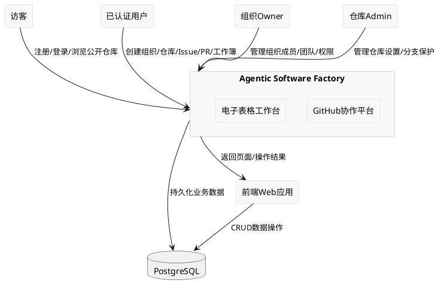

---

# **4. DFX约束**

## **4.1 性能**
1. 核心页面首次加载响应时间上限：3 秒（含服务端渲染）
2. 列表查询接口响应时间上限：1 秒（单页 30 条记录）
3. 单个仓库文件树加载时间上限：2 秒（文件数 ≤ 1000）
4. 电子表格单元格编辑延迟上限：100 毫秒（前端即时反馈）
5. 公式重算延迟上限：500 毫秒（依赖链深度 ≤ 10）

## **4.2 可靠性**
1. 系统可用性目标：99.5%（比赛期间）
2. 所有写操作必须持久化到服务器，检查当前会话和目标对象权限，原子完成
3. 刷新或重新打开页面后，成功的操作结果必须保持持久化
4. 失败的操作不得创建部分记录，原始状态必须保持不变
5. 每个原子需求即使种子配置不完整也必须保持启用

## **4.3 安全性**
1. 任何页面、错误消息或恢复流程禁止显示完整密码
2. 登录失败必须返回统一消息"Invalid credentials"，不透露账户是否存在或哪个凭据错误
3. 密码必须包含 12-128 字符，至少 1 个大写字母、1 个小写字母、1 个数字、1 个特殊字符，不含空白
4. 用户名必须由 1-39 个小写 ASCII 字母、数字或单个连字符组成，不以连字符开头或结尾
5. 密码恢复后提交邮箱直接显示固定验证码 `123456` 和密码重置表单
6. 登出、密码变更和恢复必须立即改变后续请求可见的会话状态
7. 所有写操作必须检查当前会话和目标对象的权限

## **4.4 可维护性**
1. 后端遵循 uctoo-v4 五层 CRUD 架构（PO/DAO/Service/Controller/Route）
2. 前端遵循 UMI 架构 store 设计模式，使用 pinia-orm 进行 ORM 状态管理
3. 数据库变更需在 `sql/incremental/` 目录生成 DDL 文件
4. 新增业务能力优先 `plugingen` 做成插件（三轨 sync / dylib / process）；前端管理界面用 `crudweb` 生成；`crudgen` 仅用于往宿主 `src/app/` 补公共基础设施；禁止手撸五层骨架
5. 页面路由地址动态来自 permissions 表（菜单即路由）

## **4.5 兼容性**
1. RESTful API 遵循 uctoo-v4 API 规范（列表键名 = 表名 + s）
2. 前端使用 ARIA 语义角色（tab/grid/gridcell），确保可访问性
3. CSV 导入支持 UTF-8 中文文本、英文文本、数字文本，正确处理双引号包裹的逗号、转义双引号对和字段内换行
4. 种子数据中的预定义账户、组织、团队等通过隔离浏览器会话提供

---
# **5. 核心能力**

## **5.1 身份与访问管理（GitHub 赛题 REQ-1）**

### **5.1.1 业务规则**

1. **账户注册规则**：访客在注册页面填写 Username、Email、Password、Confirm password 并勾选"Agree to the terms"后提交。系统必须校验用户名格式（1-39 个小写 ASCII 字母/数字/单连字符，不以连字符开头或结尾）、邮箱格式（含一个 @，不超过 254 字符，@ 后至少一个点和非空域标签）、密码复杂度（12-128 字符，含大写/小写/数字/特殊字符，无空白）、确认密码一致性。校验通过后直接存储可登录账户并标记邮箱已验证，跳转登录页。
   a. 验收条件：[访客提交合规注册信息] → [系统创建账户、标记邮箱已验证、跳转登录页，不显示密码]
   b. 验收条件：[用户名或邮箱冲突/字段缺失/邮箱格式无效/未同意条款/密码不合规/确认不匹配] → [系统保留用户名和邮箱输入，在对应字段旁显示分项错误消息，不创建账户]

2. **登录规则**：访客在登录页输入用户名或邮箱和密码提交。系统查找账户并验证凭据和可用状态。认证失败时必须返回统一消息"Invalid credentials"，不透露账户是否存在或哪个凭据错误，不创建会话。认证成功后存储会话（含唯一会话标识、账户标识、活跃状态），跳转工作台。
   a. 验收条件：[访客输入正确凭据] → [系统创建会话、跳转工作台、账户菜单显示用户名]
   b. 验收条件：[未知账户/错误密码/不可用账户] → [系统显示"Invalid credentials"、留在登录页、不显示账户菜单]

3. **密码恢复规则**：访客在密码恢复页提交邮箱后，页面直接显示固定验证码 `123456` 和密码重置表单。只有正确验证码配合合规新密码才更新同一账户的密码。
   a. 验收条件：[访客提交已注册邮箱] → [页面显示验证码 123456 和密码重置表单]
   b. 验收条件：[正确验证码 + 合规新密码] → [更新账户密码，可使用新密码登录]

4. **登出规则**：已登录用户从账户菜单选择登出，系统必须立即销毁当前会话，后续请求需重新认证。
   a. 验收条件：[用户点击登出] → [会话销毁、跳转首页、受保护页面需重新登录]

5. **修改密码规则**：已登录用户在安全设置页修改密码，新密码必须满足复杂度要求，修改后立即影响后续登录。
   a. 验收条件：[用户提交合规新密码] → [密码更新成功，旧密码无法登录]

6. **禁止项**：禁止在任何页面、错误消息或恢复流程中显示完整密码。禁止在注册/登录/恢复失败后重新显示密码和确认密码字段的已提交值。

### **5.1.2 交互流程**

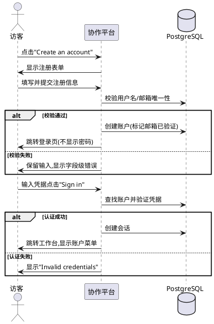

### **5.1.3 异常场景**

1. **用户名/邮箱冲突**
   a. 触发条件：注册时用户名或邮箱已被占用
   b. 系统行为：拒绝创建，保留用户名和邮箱输入
   c. 用户感知：对应字段旁显示"Username already exists"或"Email format is invalid"

2. **账户不可用**
   a. 触发条件：登录时账户状态为不可用
   b. 系统行为：拒绝登录，不创建会话
   c. 用户感知：显示"Invalid credentials"

3. **会话过期**
   a. 触发条件：访问受保护页面时会话已失效
   b. 系统行为：重定向到登录页
   c. 用户感知：显示登录页面

---

## **5.2 组织与治理管理（GitHub 赛题 REQ-2）**

### **5.2.1 业务规则**

1. **创建组织规则**：已认证用户可创建组织，组织名称必须唯一。创建者自动成为组织 Owner。
   a. 验收条件：[已认证用户提交唯一组织名称] → [创建组织，用户成为 Owner]

2. **团队管理规则**：组织 Owner 可创建团队、添加/移除成员、设置团队层级（子团队）。团队可被授予仓库访问权限。
   a. 验收条件：[Owner 创建团队并添加成员] → [团队创建成功，成员可见该团队]

3. **成员管理规则**：组织 Owner 可直接添加用户为组织成员、移除成员。被移除的成员立即失去组织下所有仓库的访问权限。
   a. 验收条件：[Owner 移除成员] → [被移除用户立即无法访问组织仓库]

4. **仓库访问授权规则**：可向人员或团队授予仓库的 Read/Triage/Write/Maintain/Admin 权限。权限角色非自动累积阶梯，按操作特定规则确定。
   a. 验收条件：[向用户授予 Write 权限] → [该用户可推送代码但不可更改仓库设置]

5. **禁止项**：禁止非 Owner 用户创建/删除组织。禁止非授权用户管理团队成员。

### **5.2.2 交互流程**

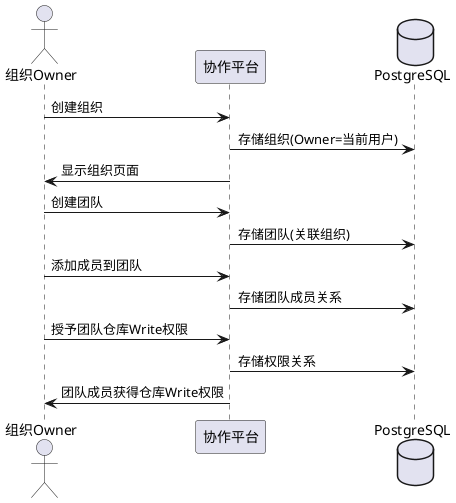

### **5.2.3 异常场景**

1. **组织名称冲突**
   a. 触发条件：创建组织时名称已被使用
   b. 系统行为：拒绝创建
   c. 用户感知：显示"Organization name already exists"

2. **权限不足**
   a. 触发条件：非 Owner 尝试管理组织
   b. 系统行为：拒绝操作
   c. 用户感知：显示权限不足提示

---

## **5.3 仓库资产管理（GitHub 赛题 REQ-3）**

### **5.3.1 业务规则**

1. **创建仓库规则**：已认证用户选择 Owner（个人或组织）、输入仓库名、选择可见性（Public/Private）、可选添加 README/.gitignore/license。仓库名在同一 Owner 下必须唯一。创建后仓库立即可访问。
   a. 验收条件：[用户提交唯一仓库名和可见性] → [创建仓库，显示仓库主页]

2. **Fork 仓库规则**：用户可将他人仓库 Fork 到自己的命名空间。Fork 是仓库的副本，保留原始仓库的关联关系。
   a. 验收条件：[用户 Fork 公开仓库] → [在用户命名空间下创建仓库副本]

3. **仓库搜索规则**：用户可通过全局搜索按关键词查找仓库，支持按语言、星标数等筛选和排序。
   a. 验收条件：[用户输入关键词搜索] → [返回匹配的仓库列表，含名称、描述、语言、星标数]

4. **更改可见性规则**：仓库 Admin 可更改仓库可见性（Public↔Private），需权限检查。
   a. 验收条件：[Admin 将 Public 仓库改为 Private] → [非授权用户无法访问该仓库]

5. **克隆值复制规则**：用户可从 Code 下拉菜单复制仓库的 HTTPS/SSH 克隆 URL。
   a. 验收条件：[用户点击复制按钮] → [克隆 URL 复制到剪贴板]

6. **禁止项**：禁止非 Admin 用户更改仓库可见性或删除仓库。禁止创建同名仓库。

### **5.3.2 交互流程**

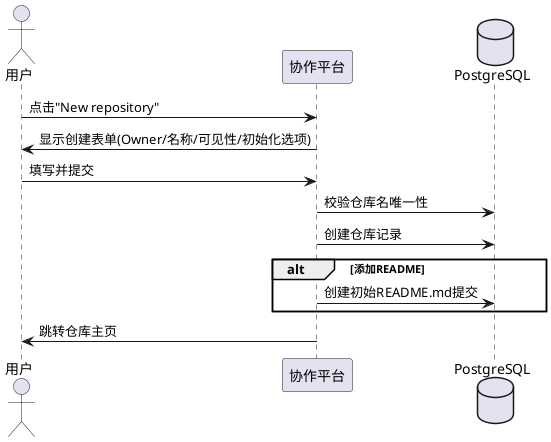

### **5.3.3 异常场景**

1. **仓库名冲突**
   a. 触发条件：同一 Owner 下仓库名已存在
   b. 系统行为：拒绝创建
   c. 用户感知：显示"Repository name already exists"

2. **Fork 权限不足**
   a. 触发条件：尝试 Fork 私有仓库但无访问权限
   b. 系统行为：拒绝 Fork
   c. 用户感知：显示权限不足提示

---

## **5.4 代码与版本控制（GitHub 赛题 REQ-4）**

### **5.4.1 业务规则**

1. **文件浏览规则**：用户可在仓库主页浏览文件树，按分支切换查看不同分支的文件。文件列表显示文件名、最后提交信息和时间。
   a. 验收条件：[用户选择分支并浏览] → [显示该分支的文件树和最近提交信息]

2. **提交历史规则**：用户可查看仓库的提交历史列表，按时间倒序排列，含作者、提交信息、时间戳、验证标识、哈希值。支持按分支、用户、时间筛选。
   a. 验收条件：[用户打开提交历史] → [显示按时间倒序的提交列表]

3. **提交差异规则**：用户可查看单次提交的代码差异，含变更文件列表和逐文件的新增/删除行对比。
   a. 验收条件：[用户点击提交] → [显示提交详情和代码差异对比]

4. **分支管理规则**：用户可列出/切换/创建分支。创建分支需指定来源修订。可更改默认分支（需 Admin 权限）。
   a. 验收条件：[用户从 main 创建新分支 feature-x] → [新分支创建成功，可切换浏览]

5. **Web 文件编辑规则**：用户可在线编辑仓库文件，提交变更时需填写提交信息。变更提交到当前分支。
   a. 验收条件：[用户编辑文件并提交] → [创建新提交，文件内容更新]

6. **代码搜索规则**：用户可在仓库内搜索代码，支持搜索语法（如 `repo:owner/name keyword`）。
   a. 验收条件：[用户输入搜索语法] → [返回匹配的代码片段列表]

7. **禁止项**：禁止向受保护分支直接推送（需通过 PR）。禁止非 Admin 用户更改默认分支。

### **5.4.2 交互流程**

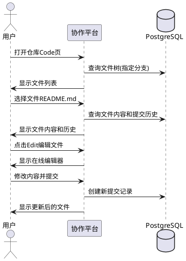

### **5.4.3 异常场景**

1. **分支不存在**
   a. 触发条件：切换到不存在的分支
   b. 系统行为：显示错误
   c. 用户感知：提示分支不存在

2. **受保护分支推送被拒**
   a. 触发条件：尝试直接推送受保护分支
   b. 系统行为：拒绝推送
   c. 用户感知：提示需通过 Pull Request

---

## **5.5 Issue 与工作规划管理（GitHub 赛题 REQ-5）**

### **5.5.1 业务规则**

1. **Issue 列表规则**：用户可查看仓库的 Issue 列表，支持按状态（Open/Closed）、作者、标签、里程碑、指派人筛选和排序。
   a. 验收条件：[用户打开 Issue 列表] → [显示 Issue 列表，含状态、标题、标签、指派人]

2. **创建 Issue 规则**：用户可创建 Issue，需填写标题（必填）和描述（可选），可设置指派人、标签、项目、里程碑。
   a. 验收条件：[用户填写标题并提交] → [创建 Issue，显示在列表中]

3. **编辑 Issue 规则**：可编辑 Issue 标题和描述，可添加评论，可指派/取消指派参与者，可应用/移除标签，可分配/移除里程碑。
   a. 验收条件：[用户编辑 Issue 标题] → [标题更新，变更持久化]

4. **关闭/重开 Issue 规则**：可关闭或重开 Issue，状态变更持久化。
   a. 验收条件：[用户关闭 Issue] → [状态变为 Closed，刷新后保持]

5. **里程碑管理规则**：可创建里程碑，将 Issue 和 PR 分配到里程碑，跟踪进度。
   a. 验收条件：[创建里程碑并分配 Issue] → [里程碑显示关联的 Issue 列表和进度]

6. **禁止项**：禁止创建无标题的 Issue。禁止非授权用户编辑他人 Issue 的属性。

### **5.5.2 交互流程**

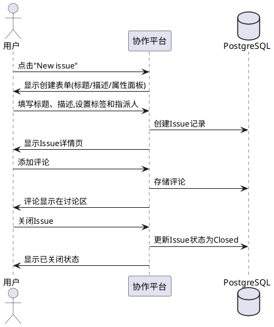

### **5.5.3 异常场景**

1. **标题为空**
   a. 触发条件：创建 Issue 时未填写标题
   b. 系统行为：拒绝创建
   c. 用户感知：标题字段旁显示必填提示

2. **标签不存在**
   a. 触发条件：应用不存在的标签
   b. 系统行为：拒绝应用
   c. 用户感知：提示标签不存在

---

## **5.6 Pull Request 与分支保护（GitHub 赛题 REQ-6）**

### **5.6.1 业务规则**

1. **PR 列表规则**：用户可查看仓库的 PR 列表，支持按状态（Open/Closed/Merged）、作者、标签、里程碑筛选。
   a. 验收条件：[用户打开 PR 列表] → [显示 PR 列表，含状态、标题、作者、分支信息]

2. **分支比较规则**：用户可选择 base 和 compare 分支进行比较，查看差异文件和聚合 diff。两个相同分支时提示无可比较内容。
   a. 验收条件：[用户选择不同分支比较] → [显示变更文件列表和代码差异]

3. **创建 PR 规则**：从比较结果创建 PR，需填写标题和描述，可设为草稿。创建后显示 PR 概览和提交列表。
   a. 验收条件：[用户从比较结果创建 PR] → [PR 创建成功，显示概览页]

4. **PR 评审规则**：评审者可对变更代码行添加评审评论，提交评审为 Approve/Request Changes/Comment。可请求/移除评审者。
   a. 验收条件：[评审者提交 Approve] → [PR 显示已批准状态]

5. **合并 PR 规则**：满足分支保护要求（评审通过、状态检查通过）的 PR 可被合并。合并后变更进入目标分支。
   a. 验收条件：[合规 PR 被合并] → [变更进入目标分支，PR 状态变为 Merged]

6. **分支保护规则**：可设置分支保护规则，要求评审通过和状态检查通过才能合并。受保护分支禁止直接推送。
   a. 验收条件：[设置 main 分支保护规则] → [main 分支禁止直接推送，需通过 PR 合并]

7. **关闭/重开 PR 规则**：可不合并直接关闭 PR，也可重开已关闭的 PR。
   a. 验收条件：[用户关闭 PR 不合并] → [PR 状态变为 Closed，变更不进入目标分支]

8. **禁止项**：禁止合并不满足分支保护要求的 PR。禁止非授权用户提交评审。

### **5.6.2 交互流程**

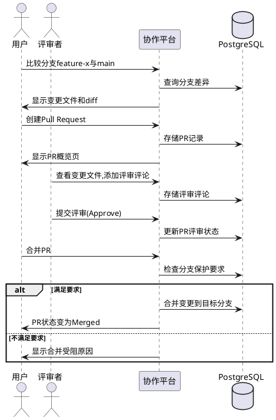

### **5.6.3 异常场景**

1. **合并冲突**
   a. 触发条件：PR 存在合并冲突
   b. 系统行为：阻止合并
   c. 用户感知：显示冲突提示，需解决冲突后重试

2. **分支保护不满足**
   a. 触发条件：PR 未获得足够评审批准或状态检查未通过
   b. 系统行为：阻止合并
   c. 用户感知：显示缺少评审/检查未通过的具体原因

3. **无差异分支比较**
   a. 触发条件：比较两个相同分支
   b. 系统行为：显示提示
   c. 用户感知：显示"There isn't anything to compare"

---
## **5.7 工作簿访问与生命周期（Sheet 赛题 REQ-1）**

### **5.7.1 业务规则**

1. **查看与打开工作簿规则**：用户在工作簿首页查看可用工作簿列表，每条记录显示"Last updated: <时间>"和以工作簿名为可访问名称的链接。点击链接后编辑器显示同一"Last updated"值、工作簿名、工作表标签和顺序、当前活动工作表、行列结构、网格值、公式栏内容、筛选视图、验证入口和透视表结果。当前编辑器页面条目必须可直接访问，刷新后仍标识同一工作簿。
   a. 验收条件：[用户点击工作簿链接] → [编辑器显示该工作簿的完整状态，不含其他工作簿数据]
   b. 验收条件：[刷新或重新打开编辑器页面] → [恢复同一工作簿的最近成功状态，无需从首页导航]

2. **创建空白工作簿规则**：首页提供可访问名称为"New blank workbook"的按钮，点击后打开创建页，提交按钮名为"Create"。创建成功后编辑器打开，仅显示名为 Sheet1 的空白工作表，Sheet1 活动且 A1 选中。
   a. 验收条件：[用户点击"New blank workbook"并提交] → [编辑器打开，显示空白 Sheet1，A1 选中]
   b. 验收条件：[创建失败] → [显示错误，用户保持可重试状态，首页不出现不完整的工作簿记录]

3. **重命名工作簿规则**：编辑器标题旁有可访问名称为"Rename workbook"的按钮，点击显示预填上次保存名称的"Workbook name"文本框和"Save"按钮。去除首尾空格后名称不能为空。成功后编辑器标题和首页链接均显示新名称。
   a. 验收条件：[用户输入非空名称并保存] → [编辑器标题和首页链接更新为新名称]
   b. 验收条件：[用户输入空名称] → [拒绝并显示"Workbook name cannot be empty"]

4. **CSV 导入规则**：首页有"Import CSV"按钮，点击后显示含"CSV file"文件控件和"Confirm import"按钮的"Import CSV"对话框。系统按原始行列顺序解析数据，保留空字段，支持 UTF-8 中文/英文/数字文本，正确处理双引号包裹的逗号、转义双引号对和字段内换行。以双引号开头但无闭合双引号的字段为无效 CSV。成功导入后创建新工作簿（名称为去掉 .csv 扩展名的文件名），Sheet1 打开显示完整 CSV 数据。
   a. 验收条件：[用户导入合法 CSV] → [创建新工作簿，Sheet1 显示完整导入数据，刷新后保持]
   b. 验收条件：[用户导入无效 CSV] → [显示"Invalid CSV file format. Import failed."，不创建工作簿]

5. **CSV 导出规则**：可将当前活动工作表导出为 CSV。导出仅读取当前活动工作表，不改变工作簿内容或当前界面状态。
   a. 验收条件：[用户导出 CSV] → [下载当前活动工作表的 CSV 文件，工作簿内容不变]

6. **禁止项**：禁止在导入失败时显示或保留部分导入结果。禁止在首页出现导入失败的工作簿链接。

### **5.7.2 交互流程**

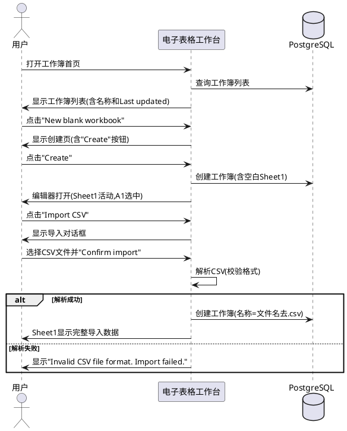

### **5.7.3 异常场景**

1. **工作簿不存在**
   a. 触发条件：访问已删除的工作簿 URL
   b. 系统行为：显示错误
   c. 用户感知：提示工作簿不存在或已删除

2. **CSV 格式无效**
   a. 触发条件：CSV 文件含未闭合的双引号
   b. 系统行为：拒绝导入，不创建工作簿
   c. 用户感知：显示"Invalid CSV file format. Import failed."

3. **工作簿名称为空**
   a. 触发条件：重命名时去除首尾空格后名称为空
   b. 系统行为：拒绝保存
   c. 用户感知：显示"Workbook name cannot be empty"

---

## **5.8 工作表管理（Sheet 赛题 REQ-2）**

### **5.8.1 业务规则**

1. **添加工作表规则**：可在当前工作簿中添加新工作表，新工作表名称自动生成（如 Sheet2、Sheet3），添加后成为活动工作表。
   a. 验收条件：[用户添加工作表] → [新工作表创建并成为活动工作表]

2. **切换工作表规则**：工作表标签使用 ARIA tab 角色，活动标签由 aria-selected="true" 指示。点击标签切换活动工作表，显示对应网格内容。
   a. 验收条件：[用户点击工作表标签] → [对应工作表变为活动，网格显示其内容]

3. **重命名工作表规则**：可通过右键菜单重命名工作表，名称在同一工作簿内必须唯一。
   a. 验收条件：[用户输入唯一名称] → [工作表名称更新]

4. **删除工作表规则**：可通过右键菜单删除工作表。工作簿必须至少保留一个工作表。
   a. 验收条件：[用户删除非唯一工作表] → [工作表删除，切换到相邻工作表]
   b. 验收条件：[用户尝试删除唯一工作表] → [拒绝删除]

5. **禁止项**：禁止删除工作簿中的最后一个工作表。禁止工作表名称重复。

### **5.8.2 交互流程**

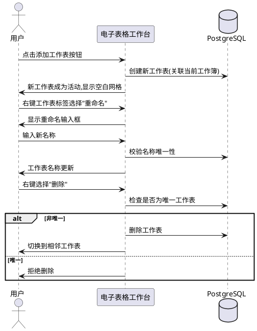

### **5.8.3 异常场景**

1. **工作表名称冲突**
   a. 触发条件：重命名为已存在的名称
   b. 系统行为：拒绝重命名
   c. 用户感知：提示名称已存在

2. **删除唯一工作表**
   a. 触发条件：尝试删除工作簿中最后一个工作表
   b. 系统行为：拒绝删除
   c. 用户感知：提示至少保留一个工作表

---

## **5.9 数据编辑与单元格操作（Sheet 赛题 REQ-3）**

### **5.9.1 业务规则**

1. **插入/删除行列规则**：可通过右键菜单在指定位置插入行/列或删除行/列。插入时原有数据相应移动。
   a. 验收条件：[用户在行3上方插入1行] → [原行3及以下数据下移，新空行出现在行3位置]

2. **编辑单元格规则**：可通过网格直接编辑或通过公式栏编辑单元格内容。当前单元格和选定矩形区域内每个单元格通过 aria-selected="true" 暴露，区域外单元格 aria-selected="false"。网格使用 ARIA grid 角色，可访问名称"Worksheet grid"，aria-multiselectable="true"。单元格使用 ARIA gridcell 角色，以坐标（如 A1）为可访问名称。
   a. 验收条件：[用户在单元格输入值] → [值存储并显示在网格和公式栏]

3. **粘贴二维数据规则**：可粘贴二维表格数据到指定起始单元格，数据按行列展开填充。
   a. 验收条件：[用户粘贴 3×3 数据到 A1] → [A1:C3 区域填充对应数据]

4. **选择矩形区域规则**：可选择矩形单元格区域，区域通过 aria-selected="true" 标识。
   a. 验收条件：[用户拖选 A1:C3] → [A1:C3 区域高亮，各单元格 aria-selected="true"]

5. **复制/剪切/粘贴规则**：可对选定区域执行复制、剪切和粘贴操作。剪切后原区域数据清除。
   a. 验收条件：[用户复制 A1:B2 并粘贴到 C1] → [C1:D2 显示 A1:B2 的数据，A1:B2 数据保留]
   b. 验收条件：[用户剪切 A1:B2 并粘贴到 C1] → [C1:D2 显示原数据，A1:B2 数据清除]

6. **撤销/重做规则**：可撤销和重做最近的操作。
   a. 验收条件：[用户执行操作后撤销] → [恢复到操作前状态]
   b. 验收条件：[用户撤销后重做] → [恢复到撤销前状态]

7. **禁止项**：禁止粘贴超出工作表边界的数据导致数据丢失。

### **5.9.2 交互流程**

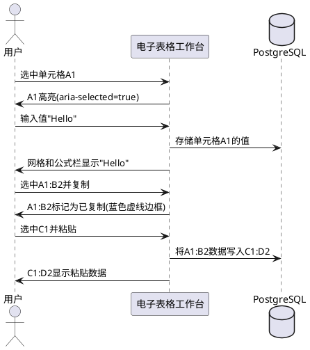

### **5.9.3 异常场景**

1. **粘贴区域超出边界**
   a. 触发条件：粘贴数据超出工作表行列边界
   b. 系统行为：仅粘贴边界内部分
   c. 用户感知：超出部分数据不写入

---

## **5.10 公式计算（Sheet 赛题 REQ-4）**

### **5.10.1 业务规则**

1. **基本表达式与聚合函数规则**：单元格可输入以 `=` 开头的公式，支持基本算术运算（+、-、*、/）和聚合函数（SUM、AVERAGE、COUNT、MAX、MIN、IF、STDEV、HYPERLINK、SIN、SUMIF、PMT 等）。公式计算结果显示在单元格中，公式本身显示在公式栏。
   a. 验收条件：[用户在 A3 输入 =SUM(A1:A2)] → [A3 显示 A1+A2 的计算结果，公式栏显示 =SUM(A1:A2)]

2. **公式复制与相对引用规则**：复制含公式的单元格并粘贴时，公式中的相对引用按偏移量自动调整。
   a. 验收条件：[用户复制 A3(=SUM(A1:A2)) 到 B3] → [B3 显示 =SUM(B1:B2) 的计算结果]

3. **依赖公式重算规则**：当源数据变更时，所有依赖该数据的公式必须自动重算并更新结果。
   a. 验收条件：[用户修改 A1 的值] → [所有引用 A1 的公式单元格自动更新计算结果]

4. **公式错误显示规则**：公式计算出错时（如除以零、引用无效单元格），单元格显示错误标识，用户可查看错误详情并修复。
   a. 验收条件：[用户输入 =1/0] → [单元格显示错误标识（如 #DIV/0!）]
   b. 验收条件：[用户修复公式] → [错误消除，显示正确结果]

5. **禁止项**：禁止显示未计算的公式文本（必须显示计算结果或错误标识）。

### **5.10.2 交互流程**

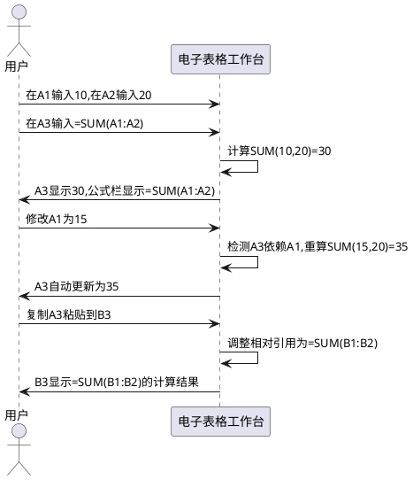

### **5.10.3 异常场景**

1. **除以零**
   a. 触发条件：公式中除数为 0
   b. 系统行为：计算中断
   c. 用户感知：单元格显示 #DIV/0! 错误

2. **引用无效单元格**
   a. 触发条件：公式引用已删除的单元格
   b. 系统行为：计算中断
   c. 用户感知：单元格显示 #REF! 错误

3. **循环引用**
   a. 触发条件：公式直接或间接引用自身
   b. 系统行为：检测循环引用，终止计算
   c. 用户感知：单元格显示 #CIRC! 错误

---

## **5.11 数据操作：排序、筛选与验证（Sheet 赛题 REQ-5）**

### **5.11.1 业务规则**

1. **排序规则**：可按指定列对数据区域进行升序或降序排序，支持自定义排序（多列排序条件）。排序不改变列结构，仅重排行顺序。
   a. 验收条件：[用户按 A 列升序排序] → [行按 A 列值升序重新排列]

2. **筛选规则**：可按值或条件筛选行，仅显示满足条件的行。可清除筛选重新显示所有行。
   a. 验收条件：[用户设置 A 列筛选值"East"] → [仅显示 A 列值为"East"的行]
   b. 验收条件：[用户清除筛选] → [所有行重新显示]

3. **数据验证规则**：可为区域设置下拉列表验证或数值验证。输入不符合验证规则的数据时拒绝并提示。
   a. 验收条件：[用户为 A1:A10 设置下拉列表["East","West","North"]] → [仅允许输入列表中的值]
   b. 验收条件：[用户输入不在列表中的值] → [拒绝输入并显示验证错误]

4. **禁止项**：禁止排序/筛选操作修改原始数据值（仅改变显示顺序或可见性）。

### **5.11.2 交互流程**

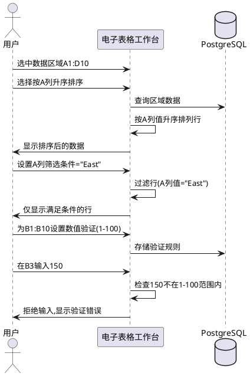

### **5.11.3 异常场景**

1. **验证失败**
   a. 触发条件：输入不符合验证规则的数据
   b. 系统行为：拒绝输入
   c. 用户感知：显示验证错误提示

2. **筛选无匹配**
   a. 触发条件：筛选条件无任何行匹配
   b. 系统行为：显示空结果
   c. 用户感知：显示无匹配数据提示

---

## **5.12 透视分析（Sheet 赛题 REQ-6）**

### **5.12.1 业务规则**

1. **创建透视表规则**：可基于数据区域创建基本透视表，指定行维度、列维度和值聚合方式（SUM/COUNT/AVERAGE 等）。透视表在独立区域显示聚合结果。
   a. 验收条件：[用户选择数据区域并指定行列维度和聚合方式] → [生成透视表显示聚合结果]

2. **刷新透视表规则**：源数据变更后可刷新透视表，重新计算聚合结果。
   a. 验收条件：[源数据变更后用户刷新透视表] → [透视表显示更新后的聚合结果]

3. **禁止项**：禁止透视表修改源数据。禁止透视表引用不存在的工作表或区域。

### **5.12.2 交互流程**

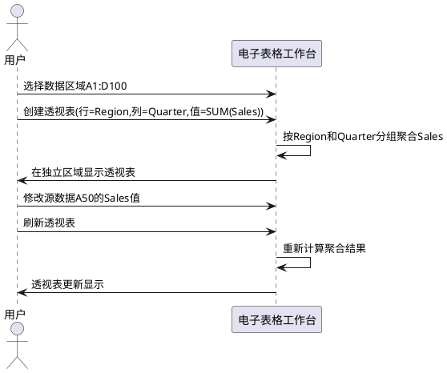

### **5.12.3 异常场景**

1. **源区域无效**
   a. 触发条件：透视表引用的区域不存在或为空
   b. 系统行为：拒绝创建
   c. 用户感知：提示选择有效数据区域

---

# **6. 数据约束**

## **6.1 账户（Account）**
1. **username**：1-39 个小写 ASCII 字母、数字或单个连字符（`-`），不以连字符开头或结尾，全局唯一
2. **email**：去除首尾空格后含一个 `@`，不超过 254 字符，`@` 后至少一个点和非空域标签，全局唯一
3. **password**：12-128 字符，含至少 1 个大写字母、1 个小写字母、1 个数字、1 个非字母数字特殊字符，不含空白字符
4. **email_verified**：注册成功后直接标记为 true
5. **status**：账户可用状态（available/unavailable）

## **6.2 会话（Session）**
1. **session_id**：全局唯一标识
2. **account_id**：关联账户 ID
3. **active**：布尔值，表示会话是否活跃
4. **created_at**：会话创建时间

## **6.3 组织（Organization）**
1. **name**：非空字符串，全局唯一
2. **owner**：创建者账户 ID，自动成为 Organization Owner
3. **members**：组织成员列表，每个成员有角色（Owner/Member）

## **6.4 团队（Team）**
1. **name**：非空字符串，组织内唯一
2. **organization_id**：所属组织 ID
3. **parent_team_id**：可选的父团队 ID（支持层级结构）
4. **members**：团队成员列表

## **6.5 仓库（Repository）**
1. **name**：非空字符串，同一 Owner 下唯一
2. **owner**：个人用户或组织 ID
3. **visibility**：Public 或 Private
4. **default_branch**：默认分支名称（如 main）
5. **description**：可选，不超过 350 字符
6. **created_at/updated_at**：创建和更新时间

## **6.6 分支（Branch）**
1. **name**：非空字符串，仓库内唯一
2. **repository_id**：所属仓库 ID
3. **is_default**：布尔值，是否为默认分支
4. **protection_rules**：可选的分支保护规则集

## **6.7 提交（Commit）**
1. **hash**：唯一哈希值
2. **author**：提交者账户 ID
3. **message**：提交信息
4. **timestamp**：提交时间
5. **verified**：验证标识（布尔值）
6. **parent_commit_ids**：父提交 ID 列表
7. **diff**：变更差异（文件级新增/删除行）

## **6.8 Issue**
1. **title**：非空字符串（必填）
2. **description**：可选文本
3. **status**：Open 或 Closed
4. **labels**：标签列表
5. **assignees**：指派人列表
6. **milestone_id**：可选的里程碑 ID
7. **repository_id**：所属仓库 ID
8. **created_at/updated_at**：创建和更新时间

## **6.9 里程碑（Milestone）**
1. **title**：非空字符串
2. **status**：Open 或 Closed
3. **repository_id**：所属仓库 ID
4. **issues**：关联的 Issue 列表
5. **pull_requests**：关联的 PR 列表

## **6.10 Pull Request**
1. **title**：非空字符串
2. **description**：可选文本
3. **status**：Open、Closed 或 Merged
4. **is_draft**：布尔值，是否为草稿
5. **base_branch**：目标分支
6. **compare_branch**：源分支
7. **repository_id**：所属仓库 ID
8. **reviews**：评审列表（含评审者、状态、评论）
9. **mergeable**：布尔值，是否可合并

## **6.11 工作簿（Workbook）**
1. **name**：去除首尾空格后非空，首页和编辑器标题一致显示
2. **last_updated**：最后更新时间，首页和编辑器一致显示
3. **worksheets**：工作表列表，有序排列
4. **active_worksheet**：当前活动工作表
5. **worksheet_order**：工作表顺序，返回首页后保持一致

## **6.12 工作表（Worksheet）**
1. **name**：非空字符串，工作簿内唯一
2. **workbook_id**：所属工作簿 ID
3. **position**：在工作簿中的位置序号
4. **aria_role**：tab 角色，活动标签 aria-selected="true"

## **6.13 单元格（Cell）**
1. **coordinate**：坐标标识（如 A1、B3），由列字母和行数字组成
2. **value**：显示值（计算结果或原始值）
3. **formula**：可选的公式表达式（以 `=` 开头）
4. **aria_role**：gridcell 角色，以坐标为可访问名称
5. **aria_selected**：布尔值，当前单元格和选定区域内为 true，区域外为 false

## **6.14 公式（Formula）**
1. **expression**：以 `=` 开头的表达式
2. **supported_functions**：SUM、AVERAGE、COUNT、MAX、MIN、IF、STDEV、HYPERLINK、SIN、SUMIF、PMT 等
3. **relative_references**：复制时按偏移量自动调整
4. **dependencies**：引用的单元格列表，源数据变更时触发重算
5. **error_types**：#DIV/0!（除以零）、#REF!（无效引用）、#CIRC!（循环引用）等

## **6.15 数据验证规则（Validation Rule）**
1. **range**：应用的单元格区域
2. **type**：dropdown（下拉列表）或 numeric（数值范围）
3. **constraints**：下拉列表值集合或数值范围（min/max）
4. **violation_behavior**：拒绝输入并显示验证错误

## **6.16 透视表（Pivot Table）**
1. **source_range**：源数据区域
2. **row_dimension**：行维度字段
3. **column_dimension**：列维度字段
4. **value_aggregation**：值聚合方式（SUM/COUNT/AVERAGE 等）
5. **result_area**：独立的结果显示区域
6. **refreshable**：源数据变更后可刷新重算

---

# **7. 增量开发计划与优先级**

> 本章基于对 `agentskills-runtime` 后端（93 个 Controller / 74 个 PO / 74 个 DAO / 84 个 Service / 84 个 Route）与 `web-admin/web` 前端（79 个 store 模型 / 17 个路由模块 / 25 个 views 目录）的完整调研结果，制定增量迭代开发计划。

## **7.1 开发原则**

1. **复用优先**：所有用户/权限/数据库/智能体/aibuilder/CMS 基础设施直接复用，禁止重写
2. **规范开发（铁律 14 二次开发底座优先）**：新增业务能力优先 `plugingen` 做成插件；只有往宿主 `src/app/` 补公共基础设施才用 `crudgen`；前端管理界面用 `crudweb`；表结构变更后先 `loaddbinfo` 刷新 `db_info`；生成物当骨架做最小适配，再补 `sql/incremental/` 增量 DDL 与新增路由的 `permissions` / `role_has_permission` 登记
3. **五层架构**：每个新增表必须完整实现 Model/DAO/Service/Controller/Route 五层
4. **UMI 同构**：前端 store 模型与后端 PO 一一对应，遵循 pinia-orm + UMI 架构
5. **菜单即路由**：新增模块菜单通过 DDL 插入 `permissions` 表，前端动态加载
6. **软删除规范**：所有新增表必须包含 `created_at`/`updated_at`/`deleted_at`/`creator` 四个标准列

## **7.2 开发阶段与优先级**

### **阶段一：GitHub 协作平台基础（P0，复用度最高）**

| 序号 | 任务 | 复用/新增 | 依赖 |
|------|------|-----------|------|
| 1.1 | 扩展 `company` 表为 GitHub 组织语义 | 复用 `company` + `user_has_company` | 无 |
| 1.2 | 新建 `repository` 表及五层模块 | 新增 | 1.1 |
| 1.3 | 新建 `branch` 表及五层模块 | 新增 | 1.2 |
| 1.4 | 新建 `commit` 表及五层模块 | 新增 | 1.3 |
| 1.5 | 新建 `repository_file` 表及五层模块 | 新增 | 1.3 |
| 1.6 | 前端 `views/collab` 目录与路由 | 新增（复用 layout/components） | 1.2-1.5 |

### **阶段二：Issue 与 PR 管理（P0）**

| 序号 | 任务 | 复用/新增 | 依赖 |
|------|------|-----------|------|
| 2.1 | 复用 `tasks` 表为 Issue 或新建 `issue` 表 | 复用 `tasks` 扩展 或 新增 | 阶段一 |
| 2.2 | 新建 `issue_comment` 表及五层模块 | 新增 | 2.1 |
| 2.3 | 新建 `milestone` 表及五层模块 | 新增 | 2.1 |
| 2.4 | 新建 `label` 表及五层模块 | 新增 | 2.1 |
| 2.5 | 新建 `pull_request` 表及五层模块 | 新增 | 1.3 |
| 2.6 | 新建 `pr_review` 表及五层模块 | 新增 | 2.5 |
| 2.7 | 新建 `branch_protection` 表及五层模块 | 新增 | 1.3 |

### **阶段三：电子表格工作台（P0）**

| 序号 | 任务 | 复用/新增 | 依赖 |
|------|------|-----------|------|
| 3.1 | 新建 `workbook` 表及五层模块 | 新增 | 复用 `uctoo_user` |
| 3.2 | 新建 `worksheet` 表及五层模块 | 新增 | 3.1 |
| 3.3 | 新建 `cell` 表及五层模块 | 新增 | 3.2 |
| 3.4 | 新建 `validation_rule` 表及五层模块 | 新增 | 3.2 |
| 3.5 | 新建 `pivot_table` 表及五层模块 | 新增 | 3.2 |
| 3.6 | 前端 `views/sheets` 目录与电子表格组件 | 新增（复用 OpenTiny 组件库） | 3.1-3.5 |

### **阶段四：智能体软件工厂核心（P1，复用为主）**

| 序号 | 任务 | 复用/新增 | 依赖 |
|------|------|-----------|------|
| 4.1 | 需求编译技能开发 | 复用 `agent_tasks`/`orchestration_plans` | 无 |
| 4.2 | 模块委派策略配置 | 复用 `agent_groups`/`agent_executors` | 4.1 |
| 4.3 | 全流程验证规则 | 复用 `agent_verification_records` | 4.1 |
| 4.4 | 种子数据 SQL 生成 | 复用 `uctoo_user`/`company`/`repository` 等 | 阶段一至三 |

### **阶段五：集成与验收（P1）**

| 序号 | 任务 | 复用/新增 | 依赖 |
|------|------|-----------|------|
| 5.1 | permissions 菜单 DDL 注入 | 复用 `permissions` 表 | 阶段一至三 |
| 5.2 | 前端路由与菜单动态加载 | 复用 router/menus 机制 | 5.1 |
| 5.3 | API 联调与 E2E 验收 | 复用测试基础设施 | 全部 |

## **7.3 数据库变更清单**

> 所有 DDL 文件放置于 `sql/incremental/` 目录，由人工执行后用 `loaddbinfo` 刷新 `db_info` 表。

| DDL 文件 | 内容 | 涉及表 |
|----------|------|--------|
| `hackathon_github_repository.sql` | GitHub 仓库/分支/提交/文件 | `repository`, `branch`, `commit`, `repository_file` |
| `hackathon_github_issue_pr.sql` | Issue/PR/评审/里程碑/标签/分支保护 | `issue`, `issue_comment`, `milestone`, `label`, `pull_request`, `pr_review`, `branch_protection` |
| `hackathon_sheets_workbook.sql` | 工作簿/工作表/单元格/验证/透视表 | `workbook`, `worksheet`, `cell`, `validation_rule`, `pivot_table` |
| `hackathon_permissions_menu.sql` | 新增模块菜单与权限 | `permissions`（插入记录）, `role_has_permission`（插入记录） |
| `hackathon_seed_data.sql` | 赛题种子数据 | `uctoo_user`, `company`, `repository`, `issue`, `pull_request`, `workbook` 等（插入记录） |

## **7.4 复用映射总表**

| 赛题需求 | 已有基础设施 | 增量开发 |
|----------|-------------|----------|
| 账户注册/登录/会话 | `uctoo_user` + `uctoo_session` + JWT 中间件 | 无（直接复用） |
| 密码恢复 | `uctoo_user` + 现有恢复流程 | 无（直接复用） |
| 组织管理 | `company` + `user_has_company` | 扩展组织语义（已有 aibuilder 字段） |
| 团队管理 | `user_group` + `user_has_group` | 无（直接复用） |
| 仓库权限 | `data_access_authorization` + `role_has_permission` | 新增 `repository` 表的权限规则 |
| 仓库 CRUD | — | 新建 `repository`/`branch`/`commit`/`repository_file` |
| Issue 管理 | `tasks` + `user_has_tasks` | 复用或新建 `issue` 表 |
| PR 管理 | — | 新建 `pull_request`/`pr_review`/`branch_protection` |
| 里程碑 | — | 新建 `milestone` 表 |
| 工作簿 CRUD | — | 新建 `workbook`/`worksheet`/`cell` |
| 公式计算 | — | 前端公式引擎（复用 OpenTiny 组件） |
| 数据验证 | — | 新建 `validation_rule` 表 |
| 透视表 | — | 新建 `pivot_table` 表 |
| 需求编译 | `agent_tasks` + `orchestration_plans` | 新增编译技能 |
| 模块委派 | `agent_groups` + `agent_executors` | 新增委派策略 |
| 全流程验证 | `agent_verification_records` | 新增验证规则 |
| 文件上传 | `attachments` | 无（直接复用） |
| 国际化 | `i18` + `lang` | 无（直接复用） |
| 操作审计 | `operate_log` | 无（直接复用） |
| 菜单/路由 | `permissions` + 前端动态路由 | 新增模块菜单 DDL |

---

> **文档版本**：1.1.1
> **创建日期**：2026-10-01
> **最近修订**：2026-10-03 按 SDD v1.2.0 铁律 14「二次开发底座优先」对齐工具链口径（`loaddbinfo` 第一步、`plugingen` 插件优先、`crudgen` 仅宿主公共基础设施、生成后补 `sql/incremental/` 增量 DDL + `permissions`/`role_has_permission` RBAC 授权），并校正原子需求计数（GitHub 47 / Sheet 24，合计 71）
> **赛题来源**：`arcbench-hackathon-requirements/hackathon--github/requirements.yaml`（GitHub 赛题 47 个原子需求）、`arcbench-hackathon-requirements/hackathon--sheet/requirements.yaml`（Sheet 赛题 24 个原子需求，合计 71 个）
> **参考截图描述**：已将 36 张参考截图转换为同名 markdown 文档，存放于各赛题 `reference/` 目录中
> **实现技术栈**：后端仓颉+Fountain ORM+PostgreSQL（遵循 uctoo-v4 规范），前端 Vue 3+Vite+pinia-orm+OpenTiny（遵循 UMI 架构）