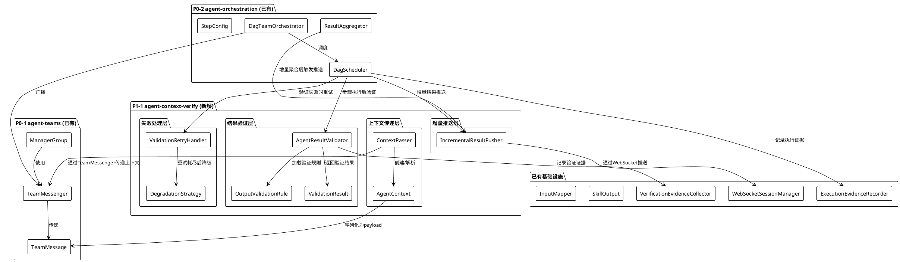

# Agent间上下文传递与结果验证 - 技术设计文档

## 一、需求与存量功能关系分析

### 1.1 需求功能与存量功能对比

#### 1.1.1 已实现功能

| 需求 | 存量功能 | 代码位置 | 匹配度 |
|------|---------|---------|--------|
| Agent间消息传递 | TeamMessenger.send/broadcast/request | `agent_group/team_messenger.cj` | 80% - 已有发送/广播/请求机制，但payload为String，缺少结构化上下文 |
| 消息类型定义 | MessageType枚举(TASK_ASSIGN/RESULT_REPORT/STATUS_UPDATE/ERROR_REPORT) | `agent_group/team_message.cj` | 60% - 缺少CONTEXT_PASS和VALIDATION_RESULT类型 |
| 技能输出结构 | SkillOutput(files/data/metrics/errors/rawOutput) | `skill/skill_output.cj` | 70% - 已有结构化输出，但无验证标记 |
| 技能输入映射 | InputMapper.mapStepOutputs | `skill/input_mapper.cj` | 75% - 已有步骤间数据映射，但无上下文约束传递 |
| 执行证据记录 | ExecutionEvidenceRecorder.recordStart/recordEnd/recordError | `interaction/execution_evidence_recorder.cj` | 60% - 已有执行记录，但无验证结果记录 |
| 验证证据收集 | VerificationEvidenceCollector.recordBuild/Lint/Test/BusinessRule | `interaction/verification_evidence_collector.cj` | 50% - 已有验证证据收集，但面向构建/测试，非Agent输出验证 |
| DAG步骤重试 | DagScheduler.executeStep中retryCount逻辑 | `agent_executor/dag_scheduler.cj` | 40% - 已有简单重试，但无验证驱动的重试和降级 |
| 增量结果聚合 | ResultAggregator.incrementalAggregate | `agent_executor/result_aggregator.cj` | 50% - 已有增量聚合逻辑，但无WebSocket推送 |
| WebSocket推送 | WebSocketSessionManager + WebSocketMessage | `app/services/bridge/websocket_session_manager.cj` | 80% - 已有完整的WebSocket基础设施 |
| DAG编排 | DagScheduler + DagTeamOrchestrator | `agent_executor/dag_scheduler.cj`, `dag_team_orchestrator.cj` | 70% - 已有编排引擎，需嵌入验证环节 |

#### 1.1.2 需要扩展的功能

| 存量功能 | 差异说明 | 扩展方向 |
|---------|---------|---------|
| TeamMessage | payload为String，无法携带结构化上下文 | 扩展payload支持JsonValue，或新增context字段 |
| MessageType | 缺少上下文传递和验证相关消息类型 | 新增CONTEXT_PASS、VALIDATION_RESULT、DEGRADATION_NOTICE |
| VerificationEvidenceCollector | 面向Build/Lint/Test/BusinessRule，非Agent输出验证 | 新增AgentOutput验证类型，或新建AgentResultValidator |
| DagScheduler.executeStep | 重试仅基于异常，无验证驱动的重试 | 在步骤执行后插入验证环节，验证失败触发重试 |
| ResultAggregator.incrementalAggregate | 仅内存聚合，无推送 | 接入WebSocket推送增量结果 |
| ExecutionEvidence | 无验证结果字段 | 扩展metadata或新增验证相关字段 |
| SkillOutput | 无验证状态标记 | 新增validationStatus字段 |

#### 1.1.3 需要新增的功能或接口

| 新增模块 | 职责 | 对应需求 |
|---------|------|---------|
| AgentContext | 结构化上下文对象，承载taskId/parentId/input/constraints/metadata | REQ-ACV-001 |
| ContextPasser | 上下文传递器，封装上下文的创建、序列化、传递 | REQ-ACV-001 |
| OutputValidationRule | 输出验证规则，从SKILL.md的outputs字段解析 | REQ-ACV-002 |
| AgentResultValidator | Agent结果验证器，执行验证规则并返回验证结果 | REQ-ACV-002 |
| ValidationRetryHandler | 验证失败重试处理器，支持可配置重试次数和降级策略 | REQ-ACV-003 |
| DegradationStrategy | 降级策略定义和执行 | REQ-ACV-003 |
| IncrementalResultPusher | 增量结果推送器，通过WebSocket推送中间结果 | REQ-ACV-004 |
| agent_verification_records表 | 验证记录持久化 | REQ-ACV-002/003 |

### 1.2 存量功能详细分析

#### 1.2.1 TeamMessenger 接口契约

```
TeamMessenger (magic.agent_group)
- send(from: String, to: String, message: TeamMessage): Unit
- broadcast(from: String, role: AgentRole, message: TeamMessage): Unit
- request(from: String, to: String, message: TeamMessage): Option<TeamMessage>
- subscribe(handler: (TeamMessage) -> Unit): Unit
- getMessagesTo(receiver: String): ArrayList<TeamMessage>
```

**扩展点**: subscribe机制可用于上下文传递和验证结果通知。TeamMessage.payload为String类型，需扩展为支持JsonValue或新增structuredPayload字段。

**约束**: TeamMessenger为内存实现，无持久化；subscribe回调在notifySubscribers中同步调用。

#### 1.2.2 TeamMessage 接口契约

```
TeamMessage (magic.agent_group)
- sender: String
- receiver: String
- messageType: MessageType
- payload: String
- timestamp: DateTime
```

**扩展点**: MessageType枚举可扩展；payload需支持结构化数据。

**约束**: payload为String，序列化/反序列化需调用方自行处理。

#### 1.2.3 VerificationEvidenceCollector 接口契约

```
VerificationEvidenceCollector (magic.interaction)
- recordBuild/Lint/Test/BusinessRule(...): String
- getSessionSummary(sessionId: String): SessionVerificationSummary
- getEvidence(evidenceId: String): Option<VerificationEvidence>
```

**扩展点**: 可新增recordAgentOutput方法，或独立新建AgentResultValidator。

**约束**: VerificationType枚举为Build/Lint/Test/BusinessRule，与Agent输出验证语义不同。建议新建独立验证器而非扩展现有枚举，避免职责混淆。

#### 1.2.4 DagScheduler.executeStep 重试机制

```
DagScheduler.executeStep(step: StepConfig, globalInput: JsonValue): StepResult
- retryCount从StepConfig.retryCount获取
- while循环: retryCount >= 0 && !executionSuccess
- 仅捕获Exception触发重试
```

**扩展点**: 在skill.execute返回后、标记Completed前插入验证环节。验证失败时递减retryCount重试。

**约束**: 当前重试逻辑与步骤执行紧耦合，需重构为"执行-验证-重试"三段式。

#### 1.2.5 ResultAggregator.incrementalAggregate

```
ResultAggregator.incrementalAggregate(existing: HashMap<String, JsonValue>, newResult: StepResult): HashMap<String, JsonValue>
```

**扩展点**: 在增量聚合后调用WebSocket推送。

**约束**: 当前为纯内存操作，需注入WebSocketSessionManager依赖。

#### 1.2.6 WebSocketSessionManager 推送机制

```
WebSocketSessionManager (magic.app.services.bridge)
- registerSession/unregisterSession
- getSession(sessionId: String): Option<WebSocketSession>
- sendApprovalRequest(sessionId, approvalId, question, approvalType, timeoutMs): Option<String>
- resolveApproval(approvalId, response): Unit
```

**扩展点**: 新增broadcastToAll方法用于推送增量结果；复用WebSocketMessage的messageType机制。

**约束**: WebSocketSessionManager为单例，通过ConcurrentHashMap管理session。

## 二、增量设计方案

### 2.1 实现模型

#### 2.1.1 上下文视图



#### 2.1.2 服务/组件总体架构

```plantuml
@startuml AgentContextVerify_ClassDiagram
!theme plain
skinparam classAttributeIconSize 0

package magic.context_verify {

    class AgentContext <<struct>> {
        + taskId: String
        + parentId: Option<String>
        + input: JsonValue
        + constraints: HashMap<String, String>
        + metadata: HashMap<String, String>
        + createdAt: DateTime
        + toJsonValue(): JsonValue
        + static fromJsonValue(json: JsonValue): Option<AgentContext>
    }

    class ContextPasser {
        - messenger: TeamMessenger
        - evidenceRecorder: ExecutionEvidenceRecorder
        + init(messenger!: TeamMessenger, evidenceRecorder!: ExecutionEvidenceRecorder)
        + passContext(from: String, to: String, context: AgentContext): String
        + broadcastContext(from: String, role: AgentRole, context: AgentContext): Unit
        + receiveContext(receiver: String): Option<AgentContext>
        + createContext(taskId: String, input: JsonValue, constraints: HashMap<String, String>): AgentContext
        + createChildContext(parentContext: AgentContext, input: JsonValue): AgentContext
    }

    enum ValidationStatus {
        Valid
        Invalid
        Partial
    }

    class OutputValidationRule {
        + name: String
        + ruleType: ValidationRuleType
        + expression: String
        + required: Bool
        + toJsonValue(): JsonValue
        + static fromJsonValue(json: JsonValue): Option<OutputValidationRule>
    }

    enum ValidationRuleType {
        SchemaCheck
        AssertionCheck
        FieldRequired
        TypeCheck
        CustomExpression
    }

    class ValidationResult {
        + ruleName: String
        + status: ValidationStatus
        + details: String
        + actualValue: Option<JsonValue>
        + toJsonValue(): JsonValue
    }

    class AgentResultValidator {
        - evidenceCollector: VerificationEvidenceCollector
        + init(evidenceCollector!: VerificationEvidenceCollector)
        + validate(output: SkillOutput, rules: ArrayList<OutputValidationRule>): AgentValidationSummary
        + validateStepResult(result: StepResult, rules: ArrayList<OutputValidationRule>): AgentValidationSummary
        + loadRulesFromSkillOutputs(outputsDef: JsonValue): ArrayList<OutputValidationRule>
    }

    class AgentValidationSummary {
        + overallStatus: ValidationStatus
        + results: ArrayList<ValidationResult>
        + validCount: Int64
        + invalidCount: Int64
        + partialCount: Int64
        + toJsonValue(): JsonValue
    }

    enum DegradationStrategyType {
        SkipStep
        UseDefault
        RetryWithSimplerInput
        FallbackToAlternative
    }

    class DegradationConfig {
        + strategy: DegradationStrategyType
        + defaultValue: Option<JsonValue>
        + alternativeStep: Option<String>
        + simplerInput: Option<JsonValue>
        + toJsonValue(): JsonValue
        + static fromJsonValue(json: JsonValue): Option<DegradationConfig>
    }

    class ValidationRetryHandler {
        - maxRetries: Int64
        - degradationConfig: Option<DegradationConfig>
        - evidenceRecorder: ExecutionEvidenceRecorder
        + init(maxRetries!: Int64, degradationConfig!: Option<DegradationConfig>, evidenceRecorder!: ExecutionEvidenceRecorder)
        + shouldRetry(summary: AgentValidationSummary, attemptCount: Int64): Bool
        + executeDegradation(step: StepConfig, context: AgentContext): StepResult
        + getMaxRetries(): Int64
    }

    class IncrementalResultPusher {
        - sessionManager: WebSocketSessionManager
        - resultAggregator: ResultAggregator
        + init(sessionManager!: WebSocketSessionManager, resultAggregator!: ResultAggregator)
        + pushIncrementalResult(sessionId: String, stepName: String, result: StepResult): Unit
        + pushValidationResult(sessionId: String, stepName: String, summary: AgentValidationSummary): Unit
        + pushContextPass(sessionId: String, from: String, to: String, context: AgentContext): Unit
        + broadcastIncrementalResult(stepName: String, result: StepResult): Unit
    }
}

AgentResultValidator --> OutputValidationRule : 加载规则
AgentResultValidator --> AgentValidationSummary : 生成
AgentValidationSummary --> ValidationResult : 包含
ValidationRetryHandler --> DegradationConfig : 降级配置
ContextPasser --> AgentContext : 创建/传递
IncrementalResultPusher ..> WebSocketSessionManager : 使用

@enduml
```



### 2.2 接口设计

#### 2.2.1 总体设计

本工程采用分层架构，从下到上分为：

1. **上下文传递层** (magic.context_verify): AgentContext结构化上下文 + ContextPasser传递器，复用TeamMessenger
2. **结果验证层** (magic.context_verify): AgentResultValidator验证器 + OutputValidationRule规则，复用VerificationEvidenceCollector
3. **失败处理层** (magic.context_verify): ValidationRetryHandler重试处理器 + DegradationConfig降级策略
4. **增量推送层** (magic.context_verify): IncrementalResultPusher推送器，复用WebSocketSessionManager

与DagScheduler的集成方式：在DagScheduler.executeStep中嵌入"执行→验证→重试/降级"流程；在DagTeamOrchestrator.orchestrateWithTeam中嵌入上下文传递和增量推送。

#### 2.2.2 接口清单

##### AgentContext (struct)

| 方法签名 | 参数 | 返回值 | 说明 |
|---------|------|--------|------|
| `init(taskId!: String, input!: JsonValue)` | taskId, input | - | 基础构造 |
| `init(taskId!: String, parentId!: Option<String>, input!: JsonValue, constraints!: HashMap<String, String>, metadata!: HashMap<String, String>)` | 全部字段 | - | 完整构造 |
| `toJsonValue(): JsonValue` | - | JsonValue | 序列化 |
| `static fromJsonValue(json: JsonValue): Option<AgentContext>` | json | Option<AgentContext> | 反序列化 |

##### ContextPasser

| 方法签名 | 参数 | 返回值 | 说明 |
|---------|------|--------|------|
| `init(messenger!: TeamMessenger, evidenceRecorder!: ExecutionEvidenceRecorder)` | messenger, evidenceRecorder | - | 构造 |
| `passContext(from: String, to: String, context: AgentContext): String` | from, to, context | evidenceId | 通过TeamMessenger发送上下文 |
| `broadcastContext(from: String, role: AgentRole, context: AgentContext): Unit` | from, role, context | - | 广播上下文 |
| `receiveContext(receiver: String): Option<AgentContext>` | receiver | Option<AgentContext> | 接收并解析上下文 |
| `createContext(taskId: String, input: JsonValue, constraints: HashMap<String, String>): AgentContext` | taskId, input, constraints | AgentContext | 创建根上下文 |
| `createChildContext(parentContext: AgentContext, input: JsonValue): AgentContext` | parentContext, input | AgentContext | 创建子上下文(继承约束) |

##### OutputValidationRule

| 方法签名 | 参数 | 返回值 | 说明 |
|---------|------|--------|------|
| `init(name!: String, ruleType!: ValidationRuleType, expression!: String, required!: Bool)` | 全部字段 | - | 构造 |
| `toJsonValue(): JsonValue` | - | JsonValue | 序列化 |
| `static fromJsonValue(json: JsonValue): Option<OutputValidationRule>` | json | Option<OutputValidationRule> | 反序列化 |

##### AgentResultValidator

| 方法签名 | 参数 | 返回值 | 说明 |
|---------|------|--------|------|
| `init(evidenceCollector!: VerificationEvidenceCollector)` | evidenceCollector | - | 构造 |
| `validate(output: SkillOutput, rules: ArrayList<OutputValidationRule>): AgentValidationSummary` | output, rules | summary | 验证SkillOutput |
| `validateStepResult(result: StepResult, rules: ArrayList<OutputValidationRule>): AgentValidationSummary` | result, rules | summary | 验证StepResult |
| `loadRulesFromSkillOutputs(outputsDef: JsonValue): ArrayList<OutputValidationRule>` | outputsDef | rules | 从SKILL.md的outputs字段解析规则 |

##### ValidationRetryHandler

| 方法签名 | 参数 | 返回值 | 说明 |
|---------|------|--------|------|
| `init(maxRetries!: Int64, degradationConfig!: Option<DegradationConfig>, evidenceRecorder!: ExecutionEvidenceRecorder)` | maxRetries, degradationConfig, evidenceRecorder | - | 构造 |
| `shouldRetry(summary: AgentValidationSummary, attemptCount: Int64): Bool` | summary, attemptCount | Bool | 判断是否应重试 |
| `executeDegradation(step: StepConfig, context: AgentContext): StepResult` | step, context | StepResult | 执行降级策略 |

##### IncrementalResultPusher

| 方法签名 | 参数 | 返回值 | 说明 |
|---------|------|--------|------|
| `init(sessionManager!: WebSocketSessionManager, resultAggregator!: ResultAggregator)` | sessionManager, resultAggregator | - | 构造 |
| `pushIncrementalResult(sessionId: String, stepName: String, result: StepResult): Unit` | sessionId, stepName, result | - | 推送增量步骤结果 |
| `pushValidationResult(sessionId: String, stepName: String, summary: AgentValidationSummary): Unit` | sessionId, stepName, summary | - | 推送验证结果 |
| `pushContextPass(sessionId: String, from: String, to: String, context: AgentContext): Unit` | sessionId, from, to, context | - | 推送上下文传递通知 |
| `broadcastIncrementalResult(stepName: String, result: StepResult): Unit` | stepName, result | - | 广播增量结果到所有session |

### 2.3 数据模型

#### 2.3.1 设计目标

1. 持久化Agent间验证记录，支持事后审计和回溯
2. 记录验证规则、验证结果、重试次数、降级策略等关键信息
3. 与执行证据链关联，支持端到端追踪
4. 符合uctoo-v4数据库规范

#### 2.3.2 模型实现

##### DDL: agent_verification_records

```sql
CREATE TABLE IF NOT EXISTS "public"."agent_verification_records" (
    "id" uuid NOT NULL DEFAULT gen_random_uuid(),
    "session_id" varchar(128) COLLATE "pg_catalog"."default" NOT NULL,
    "step_name" varchar(256) COLLATE "pg_catalog"."default" NOT NULL,
    "agent_name" varchar(256) COLLATE "pg_catalog"."default" NOT NULL,
    "evidence_id" varchar(128) COLLATE "pg_catalog"."default",
    "validation_status" varchar(32) COLLATE "pg_catalog"."default" NOT NULL,
    "validation_rules" jsonb,
    "validation_results" jsonb,
    "retry_count" int DEFAULT 0,
    "max_retries" int DEFAULT 3,
    "degradation_strategy" varchar(64) COLLATE "pg_catalog"."default",
    "degradation_result" jsonb,
    "context_task_id" varchar(128) COLLATE "pg_catalog"."default",
    "parent_context_id" varchar(128) COLLATE "pg_catalog"."default",
    "input_snapshot" jsonb,
    "output_snapshot" jsonb,
    "constraints" jsonb,
    "metadata" jsonb,
    "creator" uuid,
    "created_at" timestamptz(6) NOT NULL DEFAULT CURRENT_TIMESTAMP,
    "updated_at" timestamptz(6) NOT NULL DEFAULT CURRENT_TIMESTAMP,
    "deleted_at" timestamptz(6)
)
;

COMMENT ON TABLE "public"."agent_verification_records" IS 'Agent间上下文验证记录';
COMMENT ON COLUMN "public"."agent_verification_records"."id" IS '验证记录唯一标识';
COMMENT ON COLUMN "public"."agent_verification_records"."session_id" IS '会话ID，关联执行证据链';
COMMENT ON COLUMN "public"."agent_verification_records"."step_name" IS 'DAG步骤名称';
COMMENT ON COLUMN "public"."agent_verification_records"."agent_name" IS '执行Agent名称';
COMMENT ON COLUMN "public"."agent_verification_records"."evidence_id" IS '关联的执行证据ID';
COMMENT ON COLUMN "public"."agent_verification_records"."validation_status" IS '验证状态: valid/invalid/partial';
COMMENT ON COLUMN "public"."agent_verification_records"."validation_rules" IS '验证规则定义(JSONB)';
COMMENT ON COLUMN "public"."agent_verification_records"."validation_results" IS '验证结果详情(JSONB)';
COMMENT ON COLUMN "public"."agent_verification_records"."retry_count" IS '已重试次数';
COMMENT ON COLUMN "public"."agent_verification_records"."max_retries" IS '最大重试次数';
COMMENT ON COLUMN "public"."agent_verification_records"."degradation_strategy" IS '降级策略: skip_step/use_default/retry_simpler/fallback_alternative';
COMMENT ON COLUMN "public"."agent_verification_records"."degradation_result" IS '降级执行结果(JSONB)';
COMMENT ON COLUMN "public"."agent_verification_records"."context_task_id" IS '上下文任务ID';
COMMENT ON COLUMN "public"."agent_verification_records"."parent_context_id" IS '父上下文任务ID';
COMMENT ON COLUMN "public"."agent_verification_records"."input_snapshot" IS '输入快照(JSONB)';
COMMENT ON COLUMN "public"."agent_verification_records"."output_snapshot" IS '输出快照(JSONB)';
COMMENT ON COLUMN "public"."agent_verification_records"."constraints" IS '约束条件(JSONB)';
COMMENT ON COLUMN "public"."agent_verification_records"."metadata" IS '扩展元数据(JSONB)';
COMMENT ON COLUMN "public"."agent_verification_records"."creator" IS '创建人';
COMMENT ON COLUMN "public"."agent_verification_records"."created_at" IS '创建时间';
COMMENT ON COLUMN "public"."agent_verification_records"."updated_at" IS '更新时间';
COMMENT ON COLUMN "public"."agent_verification_records"."deleted_at" IS '删除时间';

CREATE INDEX IF NOT EXISTS idx_avr_session_id ON "public"."agent_verification_records"("session_id");
CREATE INDEX IF NOT EXISTS idx_avr_step_name ON "public"."agent_verification_records"("step_name");
CREATE INDEX IF NOT EXISTS idx_avr_agent_name ON "public"."agent_verification_records"("agent_name");
CREATE INDEX IF NOT EXISTS idx_avr_context_task_id ON "public"."agent_verification_records"("context_task_id");
CREATE INDEX IF NOT EXISTS idx_avr_validation_status ON "public"."agent_verification_records"("validation_status");
CREATE INDEX IF NOT EXISTS idx_avr_created_at ON "public"."agent_verification_records"("created_at");
```

##### 仓颉PO映射: AgentVerificationRecordsPO

```
AgentVerificationRecordsPO (magic.app.models.uctoo)
- id: String                          ← uuid
- sessionId: String                   ← varchar(128)
- stepName: String                    ← varchar(256)
- agentName: String                   ← varchar(256)
- evidenceId: Option<String>          ← varchar(128)
- validationStatus: String            ← varchar(32)
- validationRules: Option<JsonValue>  ← jsonb
- validationResults: Option<JsonValue> ← jsonb
- retryCount: Int64                   ← int
- maxRetries: Int64                   ← int
- degradationStrategy: Option<String> ← varchar(64)
- degradationResult: Option<JsonValue> ← jsonb
- contextTaskId: Option<String>       ← varchar(128)
- parentContextId: Option<String>     ← varchar(128)
- inputSnapshot: Option<JsonValue>   ← jsonb
- outputSnapshot: Option<JsonValue>  ← jsonb
- constraints: Option<JsonValue>     ← jsonb
- metadata: Option<JsonValue>        ← jsonb
- creator: String                     ← uuid
- createdAt: DateTime                 ← timestamptz(6)
- updatedAt: DateTime                 ← timestamptz(6)
- deletedAt: Option<DateTime>         ← timestamptz(6)
```

### 2.4 与DagScheduler集成设计

#### 2.4.1 验证增强步骤执行流程

在DagScheduler.executeStep中嵌入验证环节，改造为"执行→验证→重试/降级"三段式：

```
executeStep(step, globalInput):
  1. 解析上下文 → AgentContext
  2. 执行技能/Agent → StepResult
  3. 加载验证规则 → OutputValidationRule[]
  4. 验证结果 → AgentValidationSummary
  5. IF validationStatus == Invalid:
     a. shouldRetry? → 重新执行(回到步骤2)
     b. 重试耗尽? → executeDegradation
  6. 推送增量结果 → IncrementalResultPusher
  7. 记录验证证据 → VerificationEvidenceCollector
  8. 返回StepResult(含验证状态)
```

#### 2.4.2 上下文传递集成

在DagTeamOrchestrator.orchestrateWithTeam中：

1. 创建根AgentContext(taskId=DAG名称, input=全局输入)
2. 每个步骤执行前通过ContextPasser创建子上下文
3. 通过TeamMessenger传递上下文到目标Agent
4. 步骤执行后推送增量结果

#### 2.4.3 MessageType扩展

在`agent_group/team_message.cj`的MessageType枚举中新增：

```
| CONTEXT_PASS          // 上下文传递
| VALIDATION_RESULT     // 验证结果通知
| DEGRADATION_NOTICE    // 降级执行通知
| INCREMENTAL_RESULT    // 增量结果推送
```

### 2.5 SKILL.md outputs字段验证规则格式

在SKILL.md的outputs字段中定义验证规则：

```yaml
outputs:
  - name: code_files
    type: array
    required: true
    validation:
      - rule: field_required
        expression: "files.size > 0"
      - rule: type_check
        expression: "array"
  - name: error_count
    type: integer
    required: true
    validation:
      - rule: assertion_check
        expression: "metrics.error_count == 0"
  - name: raw_output
    type: string
    required: false
    validation:
      - rule: schema_check
        expression: "raw_output.contains('success')"
```

解析为`ArrayList<OutputValidationRule>`，每条规则包含name、ruleType、expression、required字段。