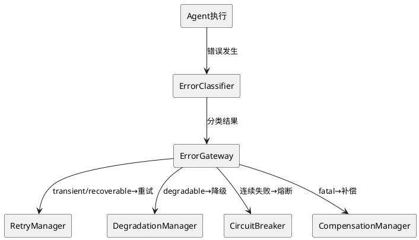

# 错误恢复与自愈系统 - 技术设计文档

## 一、需求与存量功能关系分析

### 1.1 已实现功能

| 需求功能 | 存量功能 | 代码位置 | 匹配度 |
|---------|---------|---------|--------|
| 重试机制 | RetryManager（同步系统） | src/app/ | 50% |
| 事件处理 | EventHandlerManager | src/interaction/ | 75% |
| HITL处理 | @handler/@interact/@asyncInteract | src/interaction/ | 75% |

### 1.2 需要新增的功能

| 需求功能 | 说明 | 扩展方向 |
|---------|------|---------|
| 错误分类 | transient/recoverable/degradable/fatal | 新增ErrorClassifier |
| 智能重试 | 扩展RetryManager为通用组件 | 扩展现有RetryManager |
| 降级执行 | Agent/技能不可用时自动降级 | 新增DegradationManager |
| 熔断器 | 连续失败时熔断保护 | 新增CircuitBreaker |
| 补偿事务 | 编排失败时按逆序补偿 | 新增CompensationManager |

## 二、增量设计方案

### 2.1 实现模型



### 2.2 接口设计

**ErrorClassifier**：
```cangjie
public class ErrorClassifier {
    public func classify(error: Exception): Option<ErrorCategory>
}
```

**CircuitBreaker**：
```cangjie
public class CircuitBreaker {
    public func allowRequest(agentId: String): Bool
    public func recordSuccess(agentId: String): Unit
    public func recordFailure(agentId: String): Unit
    public func getState(agentId: String): Option<CircuitState>
}
```

### 2.3 数据模型

本工程不涉及新的数据库表，复用execution_evidences和operate_log表。