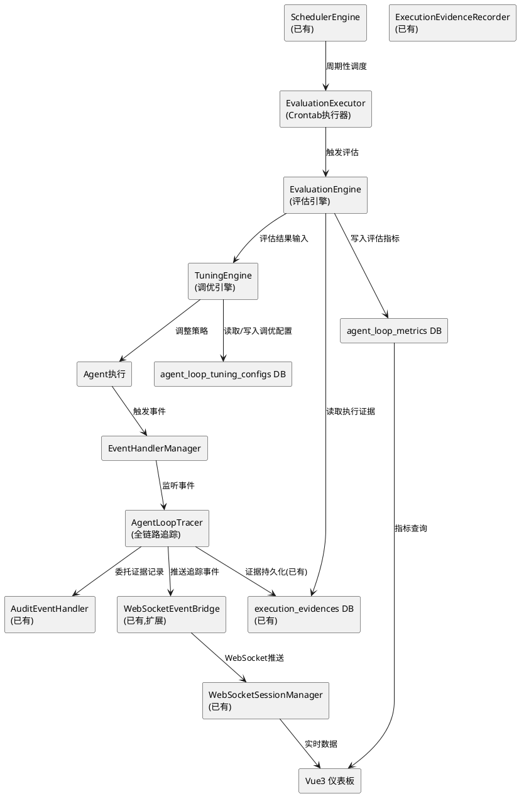
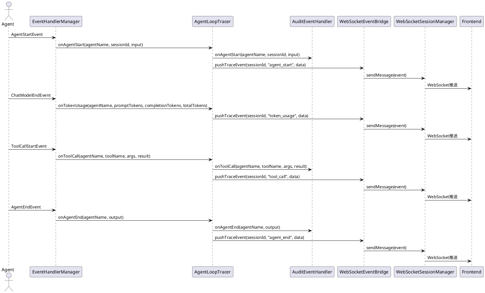
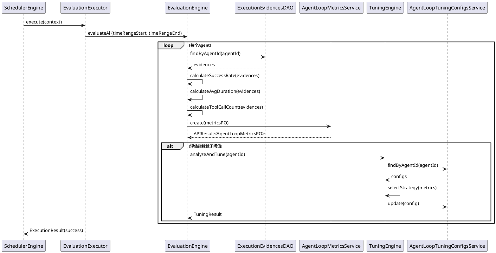

# AgentLoop观测评估飞轮 - 技术设计文档

## 一、需求与存量功能关系分析

### 1.1 需求功能与存量功能对比

#### 1.1.1 已实现功能

| 需求功能 | 存量功能 | 代码位置 | 匹配度 |
|---------|---------|---------|--------|
| 执行证据记录 | ExecutionEvidenceRecorder | src/interaction/execution_evidence_recorder.cj | 90% |
| 副作用追踪 | SideEffectTracker | src/interaction/side_effect_tracker.cj | 85% |
| 哈希链校验 | AuditHashChain | src/interaction/audit_hash_chain.cj | 80% |
| 验证证据收集 | VerificationEvidenceCollector | src/interaction/verification_evidence_collector.cj | 75% |
| 审计事件集成 | AuditEventHandler | src/interaction/audit_event_handler.cj | 70% |
| 三级事件系统 | EventHandlerManager | src/interaction/event_handler_manager.cj | 100% |
| WebSocket事件桥接 | WebSocketEventBridge | src/app/services/bridge/websocket_event_bridge.cj | 80% |
| WebSocket会话管理 | WebSocketSessionManager | src/app/services/bridge/websocket_session_manager.cj | 100% |
| Crontab调度器 | SchedulerEngine + CrontabSchedulerService | src/app/services/crontab/ | 95% |
| 执行器注册表 | ExecutorRegistry | src/app/services/crontab/executor/ | 100% |
| Agent执行器 | AgentExecutionExecutor | src/app/services/crontab/executor/ | 90% |
| 团队消息 | TeamMessenger | src/agent_group/team_messenger.cj | 60% |
| 执行证据PO/DAO/Service | ExecutionEvidencesPO/DAO/Service | src/app/models,dao,services/uctoo/ | 100% |
| 验证证据PO/DAO/Service | VerificationEvidencesPO/DAO/Service | src/app/models,dao,services/uctoo/ | 100% |

#### 1.1.2 需要扩展的功能

| 需求功能 | 存量功能 | 差异说明 | 扩展方向 |
|---------|---------|---------|---------|
| 全链路追踪 | AuditEventHandler仅内存追踪 | 缺少持久化全链路、缺少Token消耗统计 | 扩展AgentLoopTracer，整合证据链+Token统计+WebSocket推送 |
| 周期性评估 | CrontabScheduler仅调度Agent对话 | 无评估逻辑、无指标聚合 | 新增EvaluationExecutor注册到ExecutorRegistry，复用调度能力 |
| 评估结果持久化 | CrontabLog仅记录调度日志 | 无评估指标结构化存储 | 新增agent_loop_metrics表 |
| 实时观测推送 | WebSocketEventBridge仅缓冲事件 | 无指标推送、无仪表板数据通道 | 扩展推送评估指标和运行状态事件 |
| 策略调优 | 无 | Agent策略完全静态 | 新增TuningEngine，基于评估结果调整策略 |

#### 1.1.3 需要新增的功能或接口

1. **AgentLoopTracer**: 全链路追踪器，整合证据链+Token消耗+副作用，通过WebSocket实时推送
2. **EvaluationEngine**: 评估引擎，基于执行证据链计算成功率/平均耗时/Token消耗/工具调用次数
3. **EvaluationExecutor**: Crontab执行器，注册到ExecutorRegistry，周期性触发评估
4. **TuningEngine**: 自进化调优引擎，基于评估结果自动调整Agent策略
5. **TuningStrategy**: 调优策略配置，支持提示词优化/工具选择优化/执行路径优化
6. **AgentLoopMetricsPO/DAO/Service**: 评估指标持久化层
7. **agent_loop_metrics表**: 评估指标数据库表
8. **agent_loop_tuning_configs表**: 调优策略配置表
9. **Vue 3仪表板**: Agent运行状态实时展示前端

### 1.2 存量功能详细分析

**AuditEventHandler**（src/interaction/audit_event_handler.cj）：
- **接口契约**: onAgentStart/onAgentEnd/onAgentError/onToolCall/onFileWrite/onDbChange/onVerification/onTeamMessage
- **业务规则**: 通过_evidenceRecorder记录证据，通过_sideEffectTracker追踪副作用，通过_hashChain校验完整性
- **扩展点**: 可注册为EventHandlerManager的观察者，获取Agent生命周期事件
- **约束**: 当前仅内存存储，不持久化到数据库；不统计Token消耗

**WebSocketEventBridge**（src/app/services/bridge/websocket_event_bridge.cj）：
- **接口契约**: registerGlobalHandlers()注册9种事件处理器，pushEvent()缓冲事件
- **业务规则**: 通过EventHandlerManager.global注册处理器，事件缓冲到sessionBuffers
- **扩展点**: 可新增评估指标事件类型，可新增仪表板数据推送通道
- **约束**: 仅缓冲事件，不直接推送WebSocket消息（需配合WebSocketSessionManager）

**SchedulerEngine**（src/app/services/crontab/SchedulerEngine.cj）：
- **接口契约**: initialize()/loadAllActiveTasks()/reloadTask()/triggerTask()/executeTask()
- **业务规则**: 通过ExecutorRegistry分发任务到不同执行器，支持重试、超时、并发控制
- **扩展点**: 可注册新的Executor类型（如evaluation类型），可新增BuiltinTaskHandler
- **约束**: 执行器需实现CrontabExecutor接口，需在initExecutors()中注册

**CrontabExecutor接口**（src/app/services/crontab/executor/）：
- **接口契约**: validate(taskUri: String): Bool, execute(context: CrontabExecutionContext): ExecutionResult
- **业务规则**: 每种任务类型对应一个执行器实现
- **扩展点**: 新增EvaluationExecutor实现CrontabExecutor接口即可

**ExecutionEvidencesPO**（src/app/models/uctoo/ExecutionEvidencesPO.cj）：
- **接口契约**: @DataAssist[fields] + @QueryMappersGenerator["execution_evidences"]，标准PO字段
- **业务规则**: id(uuid), agent_id, session_id, step_id, step_type, input(jsonb), output(jsonb), duration_ms, side_effects(jsonb), hash, creator, created_at, updated_at, deleted_at
- **扩展点**: 可基于session_id聚合统计指标

## 二、增量设计方案

### 2.1 实现模型

#### 2.1.1 上下文视图



#### 2.1.2 服务/组件总体架构

```plantuml
@startuml

package "agent-loop (P1-3 新增)" {
    class AgentLoopTracer {
        + tracerId: String
        - auditEventHandler: AuditEventHandler
        - wsBridge: WebSocketEventBridge
        - tokenAccumulator: HashMap<String, TokenUsage>
        + onAgentStart(agentName: String, sessionId: String, input: Option<JsonValue>): String
        + onAgentEnd(agentName: String, output: Option<JsonValue>): Unit
        + onToolCall(agentName: String, toolName: String, args: Option<JsonValue>, result: Option<JsonValue>): Unit
        + onTokenUsage(agentName: String, promptTokens: Int64, completionTokens: Int64, totalTokens: Int64): Unit
        + getSessionTrace(sessionId: String): SessionTrace
        + getActiveTraces(): ArrayList<SessionTrace>
        + pushTraceEvent(sessionId: String, eventType: String, data: JsonValue): Unit
    }

    class SessionTrace {
        + sessionId: String
        + agentName: String
        + startTime: DateTime
        + endTime: Option<DateTime>
        + status: String
        + evidenceIds: ArrayList<String>
        + tokenUsage: TokenUsage
        + toolCallCount: Int64
        + sideEffectCount: Int64
        + toJsonValue(): JsonValue
    }

    class TokenUsage {
        + promptTokens: Int64
        + completionTokens: Int64
        + totalTokens: Int64
        + toJsonValue(): JsonValue
    }

    class EvaluationEngine {
        - evidenceService: ExecutionEvidencesService
        - metricsService: AgentLoopMetricsService
        + evaluateSession(sessionId: String): Option<AgentLoopMetricsPO>
        + evaluateAgent(agentId: String, timeRangeStart: DateTime, timeRangeEnd: DateTime): Option<AgentLoopMetricsPO>
        + evaluateAll(timeRangeStart: DateTime, timeRangeEnd: DateTime): ArrayList<AgentLoopMetricsPO>
        - calculateSuccessRate(evidences: ArrayList<ExecutionEvidencesPO>): Float64
        - calculateAvgDuration(evidences: ArrayList<ExecutionEvidencesPO>): Int64
        - calculateTokenUsage(metrics: ArrayList<AgentLoopMetricsPO>): TokenUsage
        - calculateToolCallCount(evidences: ArrayList<ExecutionEvidencesPO>): Int64
    }

    class EvaluationExecutor <<CrontabExecutor>> {
        + validate(taskUri: String): Bool
        + execute(context: CrontabExecutionContext): ExecutionResult
    }

    class TuningEngine {
        - metricsService: AgentLoopMetricsService
        - tuningConfigService: AgentLoopTuningConfigsService
        + analyzeAndTune(agentId: String): Option<TuningResult>
        + applyTuning(agentId: String, strategy: TuningStrategy): Bool
        + getTuningHistory(agentId: String): ArrayList<TuningResult>
        - selectStrategy(metrics: AgentLoopMetricsPO): Option<TuningStrategy>
    }

    class TuningStrategy {
        + strategyType: String
        + promptOptimization: Option<PromptOptimization>
        + toolSelectionOptimization: Option[ToolSelectionOptimization]
        + executionPathOptimization: Option[ExecutionPathOptimization]
        + toJsonValue(): JsonValue
    }

    class PromptOptimization {
        + templateId: String
        + adjustments: HashMap<String, String>
        + toJsonValue(): JsonValue
    }

    class ToolSelectionOptimization {
        + preferredTools: ArrayList<String>
        + excludedTools: ArrayList<String>
        + toJsonValue(): JsonValue
    }

    class ExecutionPathOptimization {
        + maxRetries: Int64
        + timeoutMs: Int64
        + parallelism: Int64
        + toJsonValue(): JsonValue
    }

    class TuningResult {
        + agentId: String
        + strategy: TuningStrategy
        + beforeMetrics: Option<AgentLoopMetricsPO>
        + afterMetrics: Option<AgentLoopMetricsPO>
        + appliedAt: DateTime
        + toJsonValue(): JsonValue
    }

    class AgentLoopMetricsPO {
        + id: String
        + agentId: String
        + sessionId: String
        + evaluationType: String
        + successRate: Float64
        + avgDurationMs: Int64
        + promptTokens: Int64
        + completionTokens: Int64
        + totalTokens: Int64
        + toolCallCount: Int64
        + sideEffectCount: Int64
        + metricsDetail: Option<String>
        + creator: String
        + createdAt: DateTime
        + updatedAt: DateTime
        + deletedAt: Option<DateTime>
    }

    class AgentLoopTuningConfigsPO {
        + id: String
        + agentId: String
        + strategyType: String
        + config: String
        + isEnabled: Bool
        + lastAppliedAt: Option<DateTime>
        + creator: String
        + createdAt: DateTime
        + updatedAt: DateTime
        + deletedAt: Option<DateTime>
    }
}

package "已有基础设施" {
    class AuditEventHandler
    class ExecutionEvidenceRecorder
    class SideEffectTracker
    class AuditHashChain
    class VerificationEvidenceCollector
    class EventHandlerManager
    class WebSocketEventBridge
    class WebSocketSessionManager
    class SchedulerEngine
    class ExecutorRegistry
    class CrontabSchedulerService
    class TeamMessenger
}

AgentLoopTracer --> AuditEventHandler : 委托证据记录
AgentLoopTracer --> WebSocketEventBridge : 推送追踪事件
EvaluationExecutor --> EvaluationEngine : 触发评估
EvaluationEngine --> TuningEngine : 评估结果驱动调优
TuningEngine --> TuningStrategy : 选择调优策略

@enduml
```



### 2.2 接口设计

#### 2.2.1 总体设计

AgentLoop观测评估飞轮采用**事件驱动+定时评估+反馈调优**的三层架构：

1. **追踪层（AgentLoopTracer）**: 通过EventHandlerManager监听Agent生命周期事件，委托AuditEventHandler记录证据，累计Token消耗，通过WebSocket实时推送追踪数据
2. **评估层（EvaluationEngine）**: 注册为Crontab执行器，周期性从execution_evidences表聚合计算评估指标，持久化到agent_loop_metrics表
3. **调优层（TuningEngine）**: 基于评估结果选择调优策略，调整Agent的提示词/工具选择/执行路径

#### 2.2.2 接口清单

**AgentLoopTracer**（src/interaction/agent_loop_tracer.cj）:

| 方法签名 | 参数 | 返回值 | 说明 |
|---------|------|--------|------|
| onAgentStart(agentName: String, sessionId: String, input: Option<JsonValue>) | agentName, sessionId, input | String | Agent启动追踪，返回traceId |
| onAgentEnd(agentName: String, output: Option<JsonValue>) | agentName, output | Unit | Agent结束追踪 |
| onToolCall(agentName: String, toolName: String, args: Option<JsonValue>, result: Option<JsonValue>) | agentName, toolName, args, result | Unit | 工具调用追踪 |
| onTokenUsage(agentName: String, promptTokens: Int64, completionTokens: Int64, totalTokens: Int64) | agentName, promptTokens, completionTokens, totalTokens | Unit | Token消耗累计 |
| getSessionTrace(sessionId: String) | sessionId | Option<SessionTrace> | 获取会话追踪 |
| getActiveTraces() | 无 | ArrayList<SessionTrace> | 获取活跃追踪列表 |
| pushTraceEvent(sessionId: String, eventType: String, data: JsonValue) | sessionId, eventType, data | Unit | 推送追踪事件到WebSocket |

**EvaluationEngine**（src/interaction/evaluation_engine.cj）:

| 方法签名 | 参数 | 返回值 | 说明 |
|---------|------|--------|------|
| evaluateSession(sessionId: String) | sessionId | Option<AgentLoopMetricsPO> | 评估单个会话 |
| evaluateAgent(agentId: String, timeRangeStart: DateTime, timeRangeEnd: DateTime) | agentId, timeRangeStart, timeRangeEnd | Option<AgentLoopMetricsPO> | 评估Agent在时间范围内的表现 |
| evaluateAll(timeRangeStart: DateTime, timeRangeEnd: DateTime) | timeRangeStart, timeRangeEnd | ArrayList<AgentLoopMetricsPO> | 评估所有Agent |

**EvaluationExecutor**（src/app/services/crontab/executor/EvaluationExecutor.cj）:

| 方法签名 | 参数 | 返回值 | 说明 |
|---------|------|--------|------|
| validate(taskUri: String) | taskUri | Bool | 验证evaluation://URI |
| execute(context: CrontabExecutionContext) | context | ExecutionResult | 执行评估任务 |

**TuningEngine**（src/interaction/tuning_engine.cj）:

| 方法签名 | 参数 | 返回值 | 说明 |
|---------|------|--------|------|
| analyzeAndTune(agentId: String) | agentId | Option<TuningResult> | 分析评估结果并应用调优 |
| applyTuning(agentId: String, strategy: TuningStrategy) | agentId, strategy | Bool | 应用调优策略 |
| getTuningHistory(agentId: String) | agentId | ArrayList<TuningResult> | 获取调优历史 |

**AgentLoopMetricsService**（src/app/services/uctoo/AgentLoopMetricsService.cj）:

| 方法签名 | 参数 | 返回值 | 说明 |
|---------|------|--------|------|
| create(entity: AgentLoopMetricsPO, creatorId: String) | entity, creatorId | APIResult<AgentLoopMetricsPO> | 创建评估指标 |
| getById(entityId: String) | entityId | APIResult<AgentLoopMetricsPO> | 获取指标详情 |
| getListWithFilter(page, pageSize, sort, filter) | 分页参数 | (ArrayList<AgentLoopMetricsPO>, Int64) | 分页查询 |
| findByAgentId(agentId: String) | agentId | ArrayList<AgentLoopMetricsPO> | 按Agent查询指标 |
| findBySessionId(sessionId: String) | sessionId | ArrayList<AgentLoopMetricsPO> | 按会话查询指标 |

**AgentLoopController**（src/app/controllers/uctoo/agent_loop_metrics/AgentLoopMetricsController.cj）:

| 方法签名 | HTTP方法 | 路径 | 说明 |
|---------|---------|------|------|
| create() | POST | /api/agent-loop-metrics | 创建评估指标 |
| getById() | GET | /api/agent-loop-metrics/:id | 获取指标详情 |
| getList() | GET | /api/agent-loop-metrics | 分页查询指标 |
| triggerEvaluation() | POST | /api/agent-loop-metrics/evaluate | 手动触发评估 |
| getDashboardData() | GET | /api/agent-loop-metrics/dashboard | 仪表板数据 |

### 2.3 数据模型

#### 2.3.1 设计目标

1. 评估指标持久化，支持按Agent/会话/时间范围查询
2. 调优策略配置持久化，支持启用/禁用策略
3. 与execution-audit工程的execution_evidences表关联
4. 符合uctoo-v4数据库规范

#### 2.3.2 模型实现

```sql
-- ============================================================
-- GOAI2026 赛事 P1-3 AgentLoop观测评估飞轮 - 增量DDL脚本
-- 版本: 1.0.0
-- 日期: 2026-07-26
-- 说明: 新增agent_loop_metrics和agent_loop_tuning_configs表
-- 关联: execution_evidences表(P0-3)
-- 后续操作: 执行后需运行loaddbinfo → crudgen → crudweb重新生成
-- ============================================================

BEGIN;

-- ============================================================
-- 1. agent_loop_metrics - Agent评估指标表
-- ============================================================

CREATE TABLE IF NOT EXISTS "public"."agent_loop_metrics" (
    "id" uuid NOT NULL DEFAULT gen_random_uuid(),
    "agent_id" uuid NOT NULL,
    "session_id" varchar(100) COLLATE "pg_catalog"."default",
    "evaluation_type" varchar(20) COLLATE "pg_catalog"."default" NOT NULL DEFAULT 'session'::character varying,
    "success_rate" float8 NOT NULL DEFAULT 0.0,
    "avg_duration_ms" int8 NOT NULL DEFAULT 0,
    "prompt_tokens" int8 NOT NULL DEFAULT 0,
    "completion_tokens" int8 NOT NULL DEFAULT 0,
    "total_tokens" int8 NOT NULL DEFAULT 0,
    "tool_call_count" int8 NOT NULL DEFAULT 0,
    "side_effect_count" int8 NOT NULL DEFAULT 0,
    "metrics_detail" jsonb,
    "time_range_start" timestamptz(6),
    "time_range_end" timestamptz(6),
    "creator" uuid,
    "created_at" timestamptz(6) NOT NULL DEFAULT CURRENT_TIMESTAMP,
    "updated_at" timestamptz(6) NOT NULL DEFAULT CURRENT_TIMESTAMP,
    "deleted_at" timestamptz(6)
)
;

COMMENT ON COLUMN "public"."agent_loop_metrics"."id" IS '指标记录唯一标识';
COMMENT ON COLUMN "public"."agent_loop_metrics"."agent_id" IS '关联agents表id';
COMMENT ON COLUMN "public"."agent_loop_metrics"."session_id" IS '执行会话ID，evaluation_type=session时必填';
COMMENT ON COLUMN "public"."agent_loop_metrics"."evaluation_type" IS '评估类型：session/agent/global';
COMMENT ON COLUMN "public"."agent_loop_metrics"."success_rate" IS '成功率(0.0~1.0)';
COMMENT ON COLUMN "public"."agent_loop_metrics"."avg_duration_ms" IS '平均执行耗时(毫秒)';
COMMENT ON COLUMN "public"."agent_loop_metrics"."prompt_tokens" IS 'Prompt Token消耗';
COMMENT ON COLUMN "public"."agent_loop_metrics"."completion_tokens" IS 'Completion Token消耗';
COMMENT ON COLUMN "public"."agent_loop_metrics"."total_tokens" IS '总Token消耗';
COMMENT ON COLUMN "public"."agent_loop_metrics"."tool_call_count" IS '工具调用次数';
COMMENT ON COLUMN "public"."agent_loop_metrics"."side_effect_count" IS '副作用数量';
COMMENT ON COLUMN "public"."agent_loop_metrics"."metrics_detail" IS '指标详情(JSONB)，包含各步骤明细';
COMMENT ON COLUMN "public"."agent_loop_metrics"."time_range_start" IS '评估时间范围起始';
COMMENT ON COLUMN "public"."agent_loop_metrics"."time_range_end" IS '评估时间范围结束';
COMMENT ON COLUMN "public"."agent_loop_metrics"."creator" IS '创建人';
COMMENT ON COLUMN "public"."agent_loop_metrics"."created_at" IS '创建时间';
COMMENT ON COLUMN "public"."agent_loop_metrics"."updated_at" IS '更新时间';
COMMENT ON COLUMN "public"."agent_loop_metrics"."deleted_at" IS '删除时间';
COMMENT ON TABLE "public"."agent_loop_metrics" IS 'Agent评估指标表。存储Agent执行质量的评估指标，支持按会话/Agent/全局维度评估。';

CREATE INDEX IF NOT EXISTS idx_al_metrics_agent ON "public"."agent_loop_metrics"(agent_id);
CREATE INDEX IF NOT EXISTS idx_al_metrics_session ON "public"."agent_loop_metrics"(session_id);
CREATE INDEX IF NOT EXISTS idx_al_metrics_type ON "public"."agent_loop_metrics"(evaluation_type);
CREATE INDEX IF NOT EXISTS idx_al_metrics_created ON "public"."agent_loop_metrics"(created_at);

-- ============================================================
-- 2. agent_loop_tuning_configs - Agent调优策略配置表
-- ============================================================

CREATE TABLE IF NOT EXISTS "public"."agent_loop_tuning_configs" (
    "id" uuid NOT NULL DEFAULT gen_random_uuid(),
    "agent_id" uuid NOT NULL,
    "strategy_type" varchar(30) COLLATE "pg_catalog"."default" NOT NULL DEFAULT 'prompt_optimization'::character varying,
    "config" jsonb NOT NULL DEFAULT '{}'::jsonb,
    "is_enabled" bool NOT NULL DEFAULT true,
    "last_applied_at" timestamptz(6),
    "creator" uuid,
    "created_at" timestamptz(6) NOT NULL DEFAULT CURRENT_TIMESTAMP,
    "updated_at" timestamptz(6) NOT NULL DEFAULT CURRENT_TIMESTAMP,
    "deleted_at" timestamptz(6)
)
;

COMMENT ON COLUMN "public"."agent_loop_tuning_configs"."id" IS '配置唯一标识';
COMMENT ON COLUMN "public"."agent_loop_tuning_configs"."agent_id" IS '关联agents表id';
COMMENT ON COLUMN "public"."agent_loop_tuning_configs"."strategy_type" IS '策略类型：prompt_optimization/tool_selection_optimization/execution_path_optimization';
COMMENT ON COLUMN "public"."agent_loop_tuning_configs"."config" IS '策略配置(JSONB)，包含具体调优参数';
COMMENT ON COLUMN "public"."agent_loop_tuning_configs"."is_enabled" IS '是否启用';
COMMENT ON COLUMN "public"."agent_loop_tuning_configs"."last_applied_at" IS '最近一次应用时间';
COMMENT ON COLUMN "public"."agent_loop_tuning_configs"."creator" IS '创建人';
COMMENT ON COLUMN "public"."agent_loop_tuning_configs"."created_at" IS '创建时间';
COMMENT ON COLUMN "public"."agent_loop_tuning_configs"."updated_at" IS '更新时间';
COMMENT ON COLUMN "public"."agent_loop_tuning_configs"."deleted_at" IS '删除时间';
COMMENT ON TABLE "public"."agent_loop_tuning_configs" IS 'Agent调优策略配置表。存储Agent自进化调优的策略配置，支持提示词优化/工具选择优化/执行路径优化。';

CREATE INDEX IF NOT EXISTS idx_al_tuning_agent ON "public"."agent_loop_tuning_configs"(agent_id);
CREATE INDEX IF NOT EXISTS idx_al_tuning_type ON "public"."agent_loop_tuning_configs"(strategy_type);
CREATE INDEX IF NOT EXISTS idx_al_tuning_enabled ON "public"."agent_loop_tuning_configs"(is_enabled);

-- ============================================================
-- 3. Crontab任务注册 - 评估执行器
-- ============================================================

INSERT INTO "public"."crontab_task_registry" ("type", "prefix", "name", "description", "parameters_template", "status")
VALUES ('evaluation', 'evaluation://', 'evaluation-executor', 'AgentLoop评估执行器，周期性评估Agent执行质量', '{"agentId": "", "evaluationType": "agent", "timeRangeHours": 24}', 1)
ON CONFLICT ("name") WHERE "deleted_at" IS NULL DO NOTHING;

-- ============================================================
-- 4. Crontab定时任务 - AgentLoop评估 (每小时)
-- ============================================================

INSERT INTO "public"."crontab" ("name", "group_name", "task", "cron", "tactics", "remark", "status", "timeout", "max_retries", "concurrentable", "once", "priority", "parameters", "misfire_threshold")
VALUES ('agent-loop-evaluation', '2', 'evaluation://global', '0 0 * * * *', 'IGNORE', 'AgentLoop周期性评估，每小时评估所有Agent执行质量', 2, 120, 1, false, false, 7, '{"evaluationType": "global", "timeRangeHours": 1}', 1800);

COMMIT;
```

### 2.4 仓颉PO映射

**AgentLoopMetricsPO**（src/app/models/uctoo/AgentLoopMetricsPO.cj）:

```cangjie
@DataAssist[fields]
@QueryMappersGenerator["agent_loop_metrics"]
public class AgentLoopMetricsPO {
    @ORMField['id']
    public var id: String = ""

    @ORMField['agent_id']
    public var agentId: String = ""

    @ORMField['session_id']
    public var sessionId: Option<String> = None<String>

    @ORMField['evaluation_type']
    public var evaluationType: String = "session"

    @ORMField['success_rate']
    public var successRate: Float64 = 0.0

    @ORMField['avg_duration_ms']
    public var avgDurationMs: Int64 = 0

    @ORMField['prompt_tokens']
    public var promptTokens: Int64 = 0

    @ORMField['completion_tokens']
    public var completionTokens: Int64 = 0

    @ORMField['total_tokens']
    public var totalTokens: Int64 = 0

    @ORMField['tool_call_count']
    public var toolCallCount: Int64 = 0

    @ORMField['side_effect_count']
    public var sideEffectCount: Int64 = 0

    @ORMField['metrics_detail']
    public var metricsDetail: Option<String> = None<String>

    @ORMField['time_range_start']
    public var timeRangeStart: Option<DateTime> = None<DateTime>

    @ORMField['time_range_end']
    public var timeRangeEnd: Option<DateTime> = None<DateTime>

    @ORMField['creator']
    public var creator: String = ""

    @ORMField['created_at']
    public var createdAt: DateTime = DateTime.now()

    @ORMField['updated_at']
    public var updatedAt: DateTime = DateTime.now()

    @ORMField['deleted_at']
    public var deletedAt: Option<DateTime> = None<DateTime>
}
```

**AgentLoopTuningConfigsPO**（src/app/models/uctoo/AgentLoopTuningConfigsPO.cj）:

```cangjie
@DataAssist[fields]
@QueryMappersGenerator["agent_loop_tuning_configs"]
public class AgentLoopTuningConfigsPO {
    @ORMField['id']
    public var id: String = ""

    @ORMField['agent_id']
    public var agentId: String = ""

    @ORMField['strategy_type']
    public var strategyType: String = "prompt_optimization"

    @ORMField['config']
    public var config: String = "{}"

    @ORMField['is_enabled']
    public var isEnabled: Bool = true

    @ORMField['last_applied_at']
    public var lastAppliedAt: Option<DateTime> = None<DateTime>

    @ORMField['creator']
    public var creator: String = ""

    @ORMField['created_at']
    public var createdAt: DateTime = DateTime.now()

    @ORMField['updated_at']
    public var updatedAt: DateTime = DateTime.now()

    @ORMField['deleted_at']
    public var deletedAt: Option<DateTime> = None<DateTime>
}
```

### 2.5 关键交互流程

#### 2.5.1 全链路追踪流程



#### 2.5.2 周期性评估流程



### 2.6 与已有基础设施的集成点

| 集成点 | 已有组件 | 集成方式 | 变更范围 |
|--------|---------|---------|---------|
| 事件监听 | EventHandlerManager.global | AgentLoopTracer注册为事件处理器 | 新增handler注册，不修改已有代码 |
| 证据记录 | AuditEventHandler | AgentLoopTracer委托AuditEventHandler | 不修改已有代码，仅调用 |
| WebSocket推送 | WebSocketEventBridge | 新增trace事件类型 | 扩展pushEvent调用，不修改已有代码 |
| Crontab调度 | SchedulerEngine + ExecutorRegistry | 新增EvaluationExecutor | 新增执行器注册，不修改已有代码 |
| 评估数据源 | ExecutionEvidencesDAO | EvaluationEngine读取执行证据 | 仅调用已有DAO查询方法 |
| 调优配置 | agent_loop_tuning_configs | TuningEngine读写配置 | 新增表和CRUD模块 |