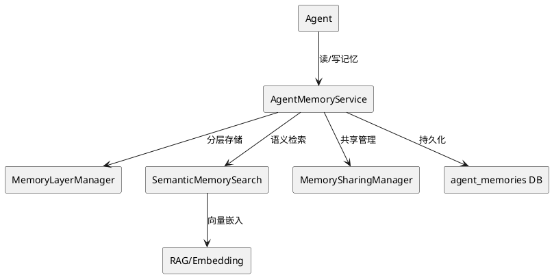

# 记忆持久化与跨会话共享 - 技术设计文档

## 一、需求与存量功能关系分析

### 1.1 已实现功能

| 需求功能 | 存量功能 | 代码位置 | 匹配度 |
|---------|---------|---------|--------|
| Memory接口 | Memory.update/search定义 | src/memory/ | 25% |
| ShortMemory | 短期记忆实现 | src/memory/short_memory.cj | 50% |
| RAG向量搜索 | 向量嵌入和语义搜索 | src/rag/ | 75% |
| WorkspaceLoader | 工作空间加载 | src/memory/workspace/ | 50% |
| DatabaseMemory | 数据库持久化记忆 | src/agent/memory/database/database_memory.cj | 75% |
| TieredMemory | 分层记忆策略 | src/agent/memory/tiered/tiered_memory.cj | 75% |
| LayeredMemory | 分层记忆实现 | src/agent/memory/tiered/layered_memory.cj | 75% |
| agent_memories表 | 记忆持久化表（已有） | uctooDB.sql | 75% |

### 1.2 需要新增的功能

| 需求功能 | 说明 | 扩展方向 |
|---------|------|---------|
| 记忆持久化 | 扩展已有agent_memories表 | ALTER TABLE新增字段，复用DatabaseMemory |
| 记忆分层 | 四层记忆区分 | 复用TieredMemory/LayeredMemory，扩展分层策略 |
| 语义检索 | 基于向量的语义记忆检索 | 复用RAG能力，新增记忆嵌入 |
| 跨会话记忆 | Agent重启后加载历史记忆 | 复用DatabaseMemory，新增MemoryLoader |
| Agent间记忆共享 | private/shared/global三种共享范围 | 新增MemorySharingManager，复用agent_memories.sharing字段 |

## 二、增量设计方案

### 2.1 实现模型



### 2.2 接口设计

**AgentMemoryService内部接口**：
```cangjie
import std.collection.ArrayList

public class AgentMemoryService {
    public func store(agentId: String, memory: AgentMemory): Option<String>
    public func retrieve(agentId: String, query: String, limit!: Int64 = 10): ArrayList<AgentMemory>
    public func search(agentId: String, query: String, scope!: String = "private"): ArrayList<AgentMemory>
    public func delete(memoryId: String): Unit
    public func share(memoryId: String, sharingScope: String): Unit
}
```

### 2.3 数据模型

> **复核修订说明**（2026-07-24 design-review.md）：
> - agent_memories表已存在于uctooDB.sql，不新建表，改为ALTER TABLE增量扩展
> - 已有字段：id(varchar(36))、agent_id(varchar(36))、content、embedding_vector(text)、scope、weight、tags(jsonb)、metadata(jsonb)、task_id、session_id、creator(varchar(36))
> - 新增字段：sharing、access_count、source_session、source_agent、expires_at
> - 复用src/agent/memory/database/database_memory.cj的DatabaseMemory实现
> - 复用src/agent/memory/tiered/的TieredMemory/LayeredMemory分层策略

**DDL**：

```sql
-- 扩展已有agent_memories表，新增字段支持跨会话共享和访问统计
ALTER TABLE "public"."agent_memories" ADD COLUMN IF NOT EXISTS "sharing" varchar(20) COLLATE "pg_catalog"."default" NOT NULL DEFAULT 'private'::character varying;
ALTER TABLE "public"."agent_memories" ADD COLUMN IF NOT EXISTS "access_count" int4 NOT NULL DEFAULT 0;
ALTER TABLE "public"."agent_memories" ADD COLUMN IF NOT EXISTS "source_session" varchar(100) COLLATE "pg_catalog"."default";
ALTER TABLE "public"."agent_memories" ADD COLUMN IF NOT EXISTS "source_agent" varchar(36) COLLATE "pg_catalog"."default";
ALTER TABLE "public"."agent_memories" ADD COLUMN IF NOT EXISTS "expires_at" timestamptz(6);

COMMENT ON COLUMN "public"."agent_memories"."sharing" IS '共享范围：private/shared/global';
COMMENT ON COLUMN "public"."agent_memories"."access_count" IS '访问次数';
COMMENT ON COLUMN "public"."agent_memories"."source_session" IS '来源会话ID';
COMMENT ON COLUMN "public"."agent_memories"."source_agent" IS '来源Agent ID，关联agents.id';
COMMENT ON COLUMN "public"."agent_memories"."expires_at" IS '过期时间，NULL表示永不过期';

-- 新增索引
CREATE INDEX IF NOT EXISTS idx_memories_sharing ON "public"."agent_memories"(sharing);
CREATE INDEX IF NOT EXISTS idx_memories_session ON "public"."agent_memories"(session_id);
```