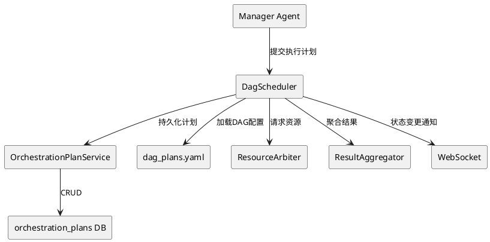
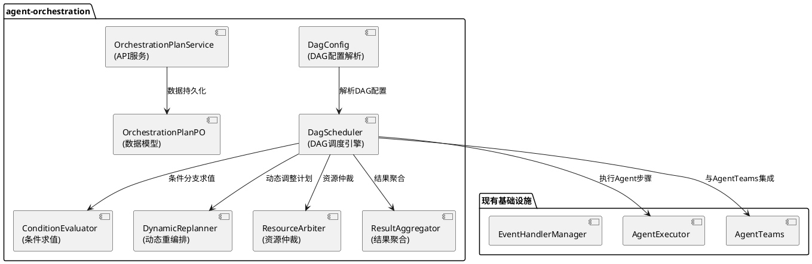
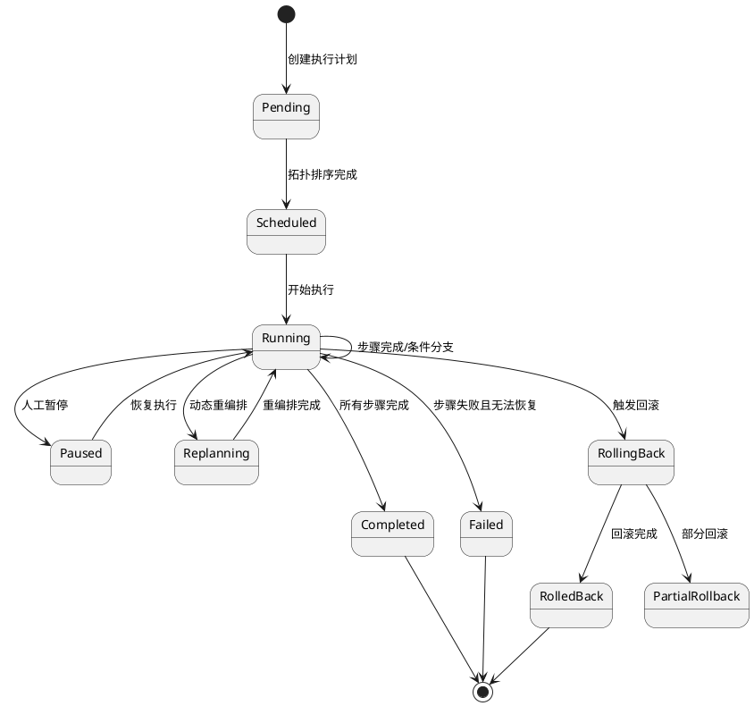
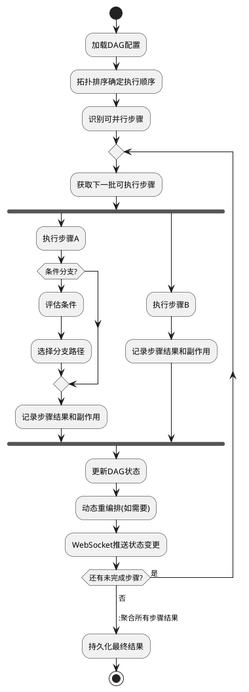
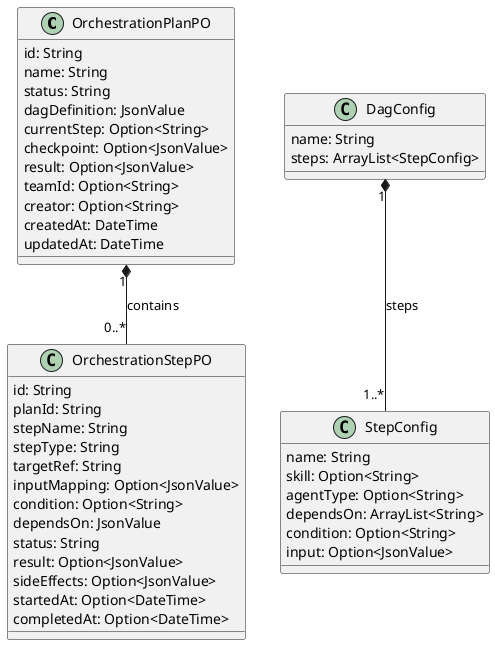

# 任务分解与DAG编排引擎 - 技术设计文档

## 一、需求与存量功能关系分析

### 1.1 需求功能与存量功能对比

#### 1.1.1 已实现功能

| 需求功能 | 存量功能 | 代码位置 | 匹配度 |
|---------|---------|---------|--------|
| Agent执行引擎 | AgentExecutor（react/plan-react模式） | src/agent_executor/ | 75% |
| AgentGroup协作 | LinearGroup/LeaderGroup/FreeGroup | src/agent_group/ | 50% |
| 执行计划数据模型 | orchestration_plans/steps表定义（spec中） | .codeartsdoer/specs/agent-orchestration/spec.md | 25% |
| WebSocket推送 | 已有WebSocket实时通信 | src/app/ | 100% |
| 事件系统 | EventHandlerManager | src/interaction/event_handler_manager.cj | 75% |

#### 1.1.2 需要扩展的功能

| 需求功能 | 存量功能 | 差异说明 | 扩展方向 |
|---------|---------|---------|---------|
| DAG调度引擎 | 无 | 当前Agent执行是即时性的，无DAG调度 | 新增DagScheduler核心引擎 |
| 条件分支 | 无 | 无基于前序结果的条件执行 | 新增ConditionEvaluator |
| 动态重编排 | 无 | 运行时无法调整执行计划 | 新增DynamicReplanner |
| 资源仲裁 | 无 | 多Agent竞争资源无仲裁 | 新增ResourceArbiter |
| 结果聚合框架 | 无 | 各Agent结果合并无结构化支持 | 新增ResultAggregator |
| 执行回滚 | 无 | 编排失败无法回滚 | 新增RollbackManager（与GOAI-009审批回滚工程协作） |
| DAG配置驱动 | 无 | 执行步骤硬编码 | 新增dag_plans.yaml配置 |

#### 1.1.3 需要新增的功能或接口

1. **DagScheduler**: DAG解析、拓扑排序、并行调度核心引擎（复用CompositionExecutor的并行/条件执行能力）
2. **ConditionEvaluator**: 条件表达式解析和求值
3. **DynamicReplanner**: 运行时动态调整执行计划
4. **ResourceArbiter**: 资源锁和配额管理
5. **ResultAggregator**: 结构化结果聚合
6. **OrchestrationPlanService**: 执行计划CRUD和调度API
7. **数据库表**: orchestration_plans、orchestration_steps

### 1.2 存量功能详细分析

**AgentExecutor**（src/agent_executor/）：
- **接口契约**: 支持react和plan-react两种执行模式
- **业务规则**: react模式即时执行，plan-react模式先规划后执行
- **扩展点**: plan-react模式可扩展为DAG调度
- **约束**: 当前规划结果不持久化，无法恢复执行

**EventHandlerManager**（src/interaction/event_handler_manager.cj）：
- **接口契约**: @handler/@interact/@asyncInteract三级事件处理
- **业务规则**: handler自动处理、interact暂停等待人工、asyncInteract异步等待
- **扩展点**: 可扩展为DAG步骤的状态变更事件
- **约束**: 事件不持久化，无法回溯

## 二、增量设计方案

### 2.1 实现模型

#### 2.1.1 上下文视图



#### 2.1.2 服务/组件总体架构



#### 2.1.3 实现设计文档

**DAG执行状态机**：



**DAG步骤执行流程**：



### 2.2 接口设计

#### 2.2.1 总体设计

| 接口分类 | 接口名称 | 稳定性 | 说明 |
|---------|---------|--------|------|
| 执行计划API | POST /api/v1/uctoo/orchestration_plans/add | 稳定 | 创建执行计划 |
| 执行计划API | GET /api/v1/uctoo/orchestration_plans/:id | 稳定 | 查询计划详情 |
| 执行计划API | GET /api/v1/uctoo/orchestration_plans/:limit/:page | 稳定 | 分页查询 |
| 执行调度API | POST /api/v1/uctoo/orchestration_plans/:id/execute | 稳定 | 执行计划 |
| 执行调度API | POST /api/v1/uctoo/orchestration_plans/:id/pause | 稳定 | 暂停执行 |
| 执行调度API | POST /api/v1/uctoo/orchestration_plans/:id/replan | 实验 | 动态重编排 |
| 执行步骤API | GET /api/v1/uctoo/orchestration_steps/:limit/:page | 稳定 | 查询步骤 |
| 内部接口 | DagScheduler.schedule() | 实验 | DAG调度 |
| 内部接口 | ConditionEvaluator.evaluate() | 实验 | 条件求值 |

#### 2.2.2 接口清单

**创建执行计划接口**：

```
POST /api/v1/uctoo/orchestration_plans/add
```

- **业务说明**: 创建一个新的DAG执行计划
- **前置条件**: dag_plans.yaml配置已就绪或请求中包含dag_definition
- **后置条件**: 计划写入orchestration_plans表，步骤写入orchestration_steps表
- **请求体**:
  ```json
  {
    "name": "full-stack-code-gen",
    "dag_definition": {
      "steps": [
        {"name": "load-db-info", "skill": "loaddbinfo", "depends_on": []},
        {"name": "gen-crud", "skill": "crudgen", "depends_on": ["load-db-info"]},
        {"name": "gen-web", "skill": "crudweb", "depends_on": ["load-db-info"]},
        {"name": "optimize", "skill": "cangjie-coder", "depends_on": ["gen-crud", "gen-web"]}
      ]
    }
  }
  ```
- **响应**: 计划详情（含步骤列表）

**执行计划接口**：

```
POST /api/v1/uctoo/orchestration_plans/:id/execute
```

- **业务说明**: 启动DAG执行计划
- **前置条件**: 计划状态为draft或paused
- **后置条件**: 计划状态变为running，步骤按DAG顺序执行
- **请求体**:
  ```json
  {
    "input": {"table_name": "employee", "database": "uctoo"},
    "team_id": 1
  }
  ```
- **响应**: 执行状态和初始步骤信息

**DagScheduler内部接口**：

```cangjie
open public class DagScheduler {
    public func schedule(plan: OrchestrationPlanPO): Option<Unit>
    public func getReadySteps(planId: String): ArrayList<OrchestrationStepPO>
    public func completeStep(stepId: String, result: StepResult): Unit
    public func failStep(stepId: String, error: StepError): Unit
    public func replan(planId: String, adjustment: PlanAdjustment): Option<Unit>
}
```

### 2.3 数据模型

#### 2.3.1 设计目标

- 支持DAG执行计划的持久化存储
- 支持步骤间的依赖关系和条件分支
- 支持执行状态的实时追踪
- 与AgentTeams的agent_teams表关联

#### 2.3.2 模型实现



**uctoo-v4 模块开发规范约束**：
- PO类需使用 `@DataAssist[fields]` 和 `@QueryMappersGenerator["table_name"]` 注解
- PO类字段使用 `public var` 声明，可选字段使用 `Option<T>` 类型
- PO类需提供 `toJsonValue(): JsonValue` 和 `toJson(): String` 序列化方法
- DAO接口需使用 `@DAO` 注解并继承 `RootDAO`，声明 `prop executor: SqlExecutor`
- DAO查询方法返回 `Option<T>`（单条）或 `ArrayList<T>`（列表）或 `Pagination<T>`（分页）
- Service类方法返回 `APIResult<T>`，使用 `try { ... } catch (e: Exception) { ... }` 错误处理
- Controller方法签名统一为 `public func add(req: HttpRequest, res: HttpResponse): Unit`
- 包名规范：`magic.app.models.uctoo`、`magic.app.dao.uctoo`、`magic.app.services.uctoo`、`magic.app.controllers.uctoo`
- 导入规范：`import std.time.DateTime`、`import stdx.encoding.json.{JsonValue, JsonObject, JsonArray}`、`import std.collection.*`、`import f_orm.*`

**DDL**：

> **复核修订说明**（2026-07-24 design-review.md）：
> - 所有id/外键字段从BIGSERIAL/BIGINT改为uuid，与uctooDB.sql规范对齐
> - 所有时间字段从TIMESTAMP改为timestamptz(6)，与uctooDB.sql规范对齐
> - creator从BIGINT改为uuid，与uctooDB.sql规范对齐
> - team_id关联agent_groups.id（uuid类型），而非agent_teams.id
> - depends_on从TEXT[]改为jsonb，与uctooDB.sql规范对齐

```sql
CREATE TABLE "public"."orchestration_plans" (
    "id" uuid NOT NULL DEFAULT gen_random_uuid(),
    "name" varchar(100) COLLATE "pg_catalog"."default" NOT NULL,
    "status" varchar(20) COLLATE "pg_catalog"."default" NOT NULL DEFAULT 'draft'::character varying,
    "dag_definition" jsonb NOT NULL,
    "current_step" varchar(100) COLLATE "pg_catalog"."default",
    "checkpoint" jsonb,
    "result" jsonb,
    "team_id" uuid,
    "creator" uuid,
    "created_at" timestamptz(6) NOT NULL DEFAULT CURRENT_TIMESTAMP,
    "updated_at" timestamptz(6) NOT NULL DEFAULT CURRENT_TIMESTAMP,
    "deleted_at" timestamptz(6)
)
;

COMMENT ON COLUMN "public"."orchestration_plans"."id" IS '执行计划唯一标识';
COMMENT ON COLUMN "public"."orchestration_plans"."name" IS '计划名称';
COMMENT ON COLUMN "public"."orchestration_plans"."status" IS '状态：draft/scheduled/running/paused/completed/failed/rolling_back';
COMMENT ON COLUMN "public"."orchestration_plans"."dag_definition" IS 'DAG定义(JSONB)，包含步骤和依赖关系';
COMMENT ON COLUMN "public"."orchestration_plans"."current_step" IS '当前执行步骤名称';
COMMENT ON COLUMN "public"."orchestration_plans"."checkpoint" IS '检查点(JSONB)，用于恢复执行';
COMMENT ON COLUMN "public"."orchestration_plans"."result" IS '执行结果(JSONB)';
COMMENT ON COLUMN "public"."orchestration_plans"."team_id" IS '关联agent_groups表id';
COMMENT ON COLUMN "public"."orchestration_plans"."creator" IS '创建人';
COMMENT ON COLUMN "public"."orchestration_plans"."created_at" IS '创建时间';
COMMENT ON COLUMN "public"."orchestration_plans"."updated_at" IS '更新时间';
COMMENT ON COLUMN "public"."orchestration_plans"."deleted_at" IS '删除时间';
COMMENT ON TABLE "public"."orchestration_plans" IS 'DAG执行计划表。存储任务编排的执行计划和状态。';

CREATE TABLE "public"."orchestration_steps" (
    "id" uuid NOT NULL DEFAULT gen_random_uuid(),
    "plan_id" uuid NOT NULL REFERENCES "public"."orchestration_plans"(id),
    "step_name" varchar(100) COLLATE "pg_catalog"."default" NOT NULL,
    "step_type" varchar(20) COLLATE "pg_catalog"."default" NOT NULL,
    "target_ref" varchar(200) COLLATE "pg_catalog"."default" NOT NULL,
    "input_mapping" jsonb,
    "condition" varchar(500) COLLATE "pg_catalog"."default",
    "depends_on" jsonb NOT NULL DEFAULT '[]'::jsonb,
    "status" varchar(20) COLLATE "pg_catalog"."default" NOT NULL DEFAULT 'pending'::character varying,
    "result" jsonb,
    "side_effects" jsonb,
    "started_at" timestamptz(6),
    "completed_at" timestamptz(6),
    "creator" uuid,
    "created_at" timestamptz(6) NOT NULL DEFAULT CURRENT_TIMESTAMP,
    "updated_at" timestamptz(6) NOT NULL DEFAULT CURRENT_TIMESTAMP,
    "deleted_at" timestamptz(6)
)
;

COMMENT ON COLUMN "public"."orchestration_steps"."id" IS '步骤唯一标识';
COMMENT ON COLUMN "public"."orchestration_steps"."plan_id" IS '关联orchestration_plans表id';
COMMENT ON COLUMN "public"."orchestration_steps"."step_name" IS '步骤名称';
COMMENT ON COLUMN "public"."orchestration_steps"."step_type" IS '步骤类型：skill/agent/condition/subplan';
COMMENT ON COLUMN "public"."orchestration_steps"."target_ref" IS '目标引用（技能名或Agent类型）';
COMMENT ON COLUMN "public"."orchestration_steps"."input_mapping" IS '输入映射(JSONB)';
COMMENT ON COLUMN "public"."orchestration_steps"."condition" IS '条件表达式';
COMMENT ON COLUMN "public"."orchestration_steps"."depends_on" IS '依赖步骤列表(JSONB数组)';
COMMENT ON COLUMN "public"."orchestration_steps"."status" IS '状态：pending/running/completed/failed/skipped';
COMMENT ON COLUMN "public"."orchestration_steps"."result" IS '步骤执行结果(JSONB)';
COMMENT ON COLUMN "public"."orchestration_steps"."side_effects" IS '副作用记录(JSONB)';
COMMENT ON COLUMN "public"."orchestration_steps"."started_at" IS '开始时间';
COMMENT ON COLUMN "public"."orchestration_steps"."completed_at" IS '完成时间';
COMMENT ON COLUMN "public"."orchestration_steps"."creator" IS '创建人';
COMMENT ON COLUMN "public"."orchestration_steps"."created_at" IS '创建时间';
COMMENT ON COLUMN "public"."orchestration_steps"."updated_at" IS '更新时间';
COMMENT ON COLUMN "public"."orchestration_steps"."deleted_at" IS '删除时间';
COMMENT ON TABLE "public"."orchestration_steps" IS 'DAG执行步骤表。存储执行计划中每个步骤的定义和状态。';

CREATE INDEX idx_orch_steps_plan ON "public"."orchestration_steps"(plan_id);
CREATE INDEX idx_orch_steps_status ON "public"."orchestration_steps"(status);
CREATE INDEX idx_orch_plans_team ON "public"."orchestration_plans"(team_id);
```