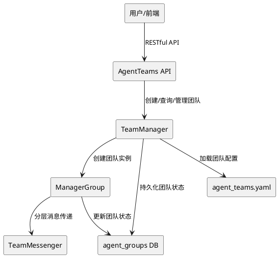
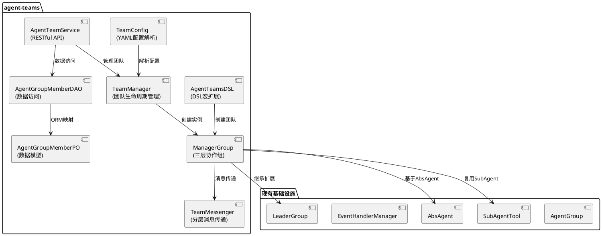
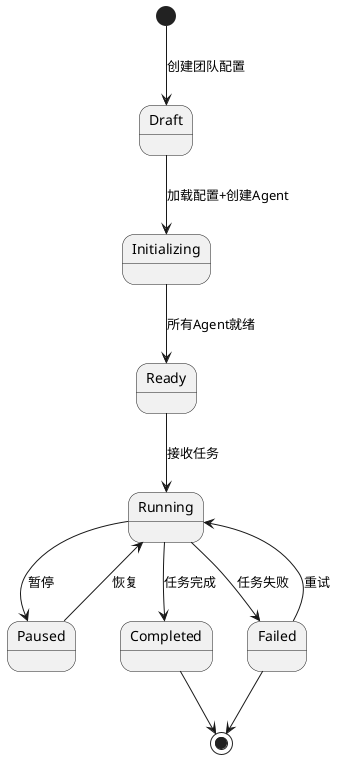
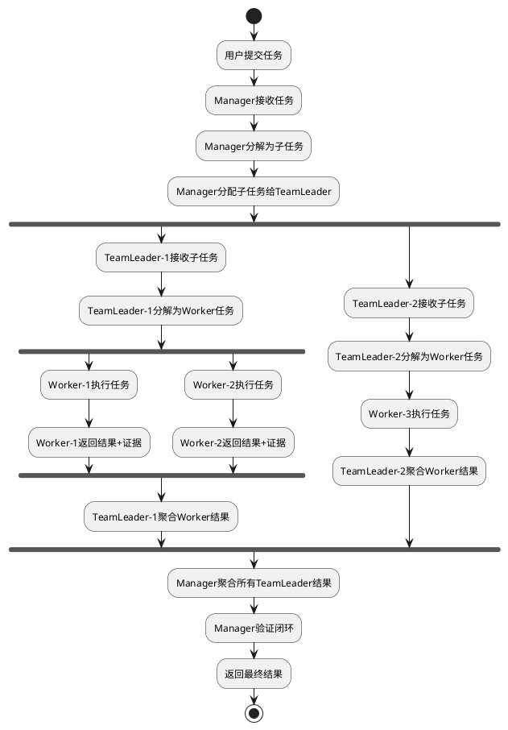
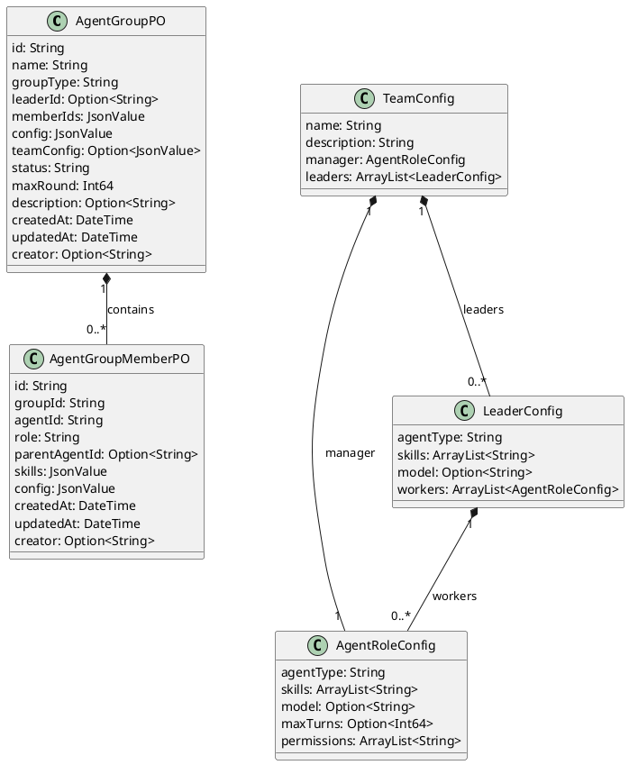

# AgentTeams 分层协作架构 - 技术设计文档

## 一、需求与存量功能关系分析

### 1.1 需求功能与存量功能对比

#### 1.1.1 已实现功能

| 需求功能 | 存量功能 | 代码位置 | 匹配度 |
|---------|---------|---------|--------|
| Agent协作框架 | AgentGroup接口及多种实现 | src/agent_group/ | 75% |
| Leader-Follower协作 | LeaderGroup（Leader管理Follower） | src/agent_group/leader_group.cj | 50% |
| Agent DSL运算符 | AgentCollaboration接口（<=、()、|） | src/agent_group/agent_group_dsl.cj | 50% |
| Agent作为工具调用 | AgentAsTool（将Agent封装为Tool） | src/tool/agent_as_tool.cj | 75% |
| SubAgent执行 | SubAgentTool（执行子Agent任务） | src/tool/sub_agent_tool.cj | 50% |
| Agent基础类 | AbsAgent、BaseAgent、SkillAwareAgent | src/agent/base/ | 100% |
| 事件处理系统 | EventHandlerManager三级事件 | src/interaction/event_handler_manager.cj | 75% |
| Agent动态加载 | 从agents.md动态生成Agent | src/dsl/ | 75% |
| 协作组持久化 | agent_groups表（已有） | uctooDB.sql | 75% |

#### 1.1.2 需要扩展的功能

| 需求功能 | 存量功能 | 差异说明 | 扩展方向 |
|---------|---------|---------|---------|
| Manager-TeamLeader-Worker三层架构 | LeaderGroup两层架构 | 缺少Manager层，LeaderGroup仅Leader→Follower | 新增ManagerGroup，扩展为三层 |
| YAML配置驱动团队定义 | 代码硬编码Agent协作 | 当前协作关系在代码中定义，无法配置化 | 新增agent_teams.yaml解析和加载 |
| 分层消息传递 | Agent间通过AgentAsTool调用 | 缺少结构化的层级消息传递机制 | 新增TeamMessage和TeamMessenger |
| 动态组队 | 运行时固定Agent组 | 无法运行时动态创建/销毁Team | 新增TeamManager动态组队管理 |
| 团队持久化 | agent_groups表（已有） | 团队配置通过config JSONB存储，缺少结构化成员角色 | 扩展agent_groups表，新增agent_group_members表 |

#### 1.1.3 需要新增的功能或接口

**核心新增模块**：
1. **ManagerGroup**: Manager-TeamLeader-Worker三层协作组
2. **TeamConfig**: agent_teams.yaml配置解析器
3. **TeamManager**: 团队生命周期管理器（创建/运行/暂停/销毁）
4. **TeamMessenger**: 分层消息传递器
5. **AgentTeamsDSL**: @agentTeams宏和DSL扩展
6. **AgentTeamService**: 团队持久化RESTful API
7. **数据库表**: 扩展agent_groups表（新增team_config字段）、新增agent_group_members表

### 1.2 存量功能详细分析

**LeaderGroup**（src/agent_group/leader_group.cj）：
- **接口契约**: 构造函数接收leader和members，chat方法委托给leader
- **业务规则**: leader通过AgentAsTool调用members，members作为leader的工具
- **扩展点**: 继承AgentGroup接口，可扩展为ManagerGroup
- **约束**: 仅两层架构，leader直接管理所有members

**AgentGroup DSL**（src/agent_group/agent_group_dsl.cj）：
- **接口契约**: AgentCollaboration接口定义<=、()、|运算符
- **业务规则**: <=创建LeaderGroup，()创建LinearGroup，|创建FreeGroup
- **扩展点**: 可新增@agentTeams宏和对应运算符
- **约束**: 运算符重载仅支持现有三种Group类型

**SubAgentTool**（src/tool/sub_agent_tool.cj）：
- **接口契约**: skill_path、question、input_files、output_dir参数
- **业务规则**: 创建子Agent执行任务，收集执行日志和计时
- **扩展点**: 可扩展为TeamWorkerTool，支持角色和层级信息
- **约束**: 当前为扁平执行，无层级概念

## 二、增量设计方案

### 2.1 实现模型

#### 2.1.1 上下文视图



#### 2.1.2 服务/组件总体架构



#### 2.1.3 实现设计文档

**ManagerGroup 状态机设计**：



**分层任务执行流程**：



### 2.2 接口设计

#### 2.2.1 总体设计

| 接口分类 | 接口名称 | 稳定性 | 说明 |
|---------|---------|--------|------|
| 团队管理API | POST /api/v1/uctoo/agent_groups/add | 稳定 | 创建团队（group_type=manager） |
| 团队管理API | POST /api/v1/uctoo/agent_groups/edit | 稳定 | 更新团队配置 |
| 团队管理API | POST /api/v1/uctoo/agent_groups/del | 稳定 | 删除团队 |
| 团队管理API | GET /api/v1/uctoo/agent_groups/:id | 稳定 | 查询团队详情 |
| 团队管理API | GET /api/v1/uctoo/agent_groups/:limit/:page | 稳定 | 分页查询团队 |
| 团队执行API | POST /api/v1/uctoo/agent_groups/:id/execute | 稳定 | 执行团队任务 |
| 团队执行API | POST /api/v1/uctoo/agent_groups/:id/pause | 稳定 | 暂停团队执行 |
| 团队执行API | POST /api/v1/uctoo/agent_groups/:id/resume | 稳定 | 恢复团队执行 |
| 团队成员API | GET /api/v1/uctoo/agent_group_members/:limit/:page | 稳定 | 查询团队成员 |
| 内部接口 | TeamManager.createTeam() | 实验 | 动态创建团队 |
| 内部接口 | TeamMessenger.send() | 实验 | 分层消息发送 |

#### 2.2.2 接口清单

**创建团队接口**：

```
POST /api/v1/uctoo/agent_groups/add
```

- **业务说明**: 创建一个新的Agent团队（group_type=manager），根据配置自动创建Manager/TeamLeader/Worker Agent
- **前置条件**: agent_teams.yaml配置文件已就绪或请求中包含team_config字段
- **后置条件**: 团队记录写入agent_groups表（group_type='manager'），成员写入agent_group_members表，Agent实例创建完成
- **请求体**:
  ```json
  {
    "name": "dev-team",
    "description": "AI驱动开发团队",
    "config": { "team": { "name": "dev-team", "manager": {...}, "leaders": [...] } }
  }
  ```
- **响应**: 团队详情（含manager_agent_id）
- **异常映射**: 配置解析错误→400，Agent创建失败→500

**执行团队任务接口**：

```
POST /api/v1/uctoo/agent_groups/:id/execute
```

- **业务说明**: 向指定团队提交任务，Manager接收并分解执行
- **前置条件**: 团队状态为Ready或Running
- **后置条件**: 团队状态变为Running，任务开始执行
- **请求体**:
  ```json
  {
    "task": "开发一个员工管理模块",
    "context": { "project_path": "/path/to/project" }
  }
  ```
- **响应**: 执行ID和初始状态
- **异常映射**: 团队不存在→404，团队状态不允许→409

**TeamManager内部接口**：

```cangjie
import std.collection.ArrayList

open public class TeamManager {
    public func createTeam(config: TeamConfig): Option<ManagerGroup>
    public func destroyTeam(teamId: String): Unit
    public func addWorker(teamId: String, leaderId: String, workerConfig: AgentConfig): Option<Agent>
    public func removeWorker(teamId: String, workerId: String): Unit
    public func getTeamStatus(teamId: String): Option<TeamStatus>
    public func listTeams(): ArrayList<TeamInfo>
}
```

**TeamMessenger内部接口**：

```cangjie
open public class TeamMessenger {
    public func send(from: String, to: String, message: TeamMessage): Unit
    public func broadcast(from: String, role: AgentRole, message: TeamMessage): Unit
    public func request(from: String, to: String, message: TeamMessage): Option<TeamMessage>
}
```

### 2.3 数据模型

#### 2.3.1 设计目标

- 支持团队配置的持久化存储和查询
- 支持团队成员（Agent）的角色和层级关系
- 支持团队状态的生命周期管理
- 与现有agents表兼容，通过agent_id关联

#### 2.3.2 模型实现



**持久化策略**：
- 复用已有 agent_groups 表，扩展 group_type='manager' 支持三层架构
- 新增 agent_group_members 表存储结构化的成员角色和层级关系
- AgentGroupPO（复用已有）和 AgentGroupMemberPO（新增）使用 Fountain ORM 持久化到 PostgreSQL
- 遵循 uctoo-v4 模块开发规范：Model→DAO→Service→Controller→Route
- 使用 crudgen 生成标准 CRUD 代码骨架
- config/team_config 字段使用 jsonb 类型存储团队配置

**uctoo-v4 模块开发规范约束**：
- PO类需使用 `@DataAssist[fields]` 和 `@QueryMappersGenerator["table_name"]` 注解
- PO类字段使用 `public var` 声明，可选字段使用 `Option<T>` 类型
- PO类需提供 `toJsonValue(): JsonValue` 和 `toJson(): String` 序列化方法
- DAO接口需使用 `@DAO` 注解并继承 `RootDAO`，声明 `prop executor: SqlExecutor`
- DAO查询方法返回 `Option<T>`（单条）或 `ArrayList<T>`（列表）或 `Pagination<T>`（分页）
- Service类方法返回 `APIResult<T>`，使用 `try { ... } catch (e: Exception) { ... }` 错误处理
- Controller方法签名统一为 `public func add(req: HttpRequest, res: HttpResponse): Unit`
- 包名规范：`magic.app.models.uctoo`、`magic.app.dao.uctoo`、`magic.app.services.uctoo`、`magic.app.controllers.uctoo`
- 导入规范：`import std.time.DateTime`、`import stdx.encoding.json.{JsonValue, JsonObject, JsonArray}`、`import std.collection.*`、`import f_orm.*`

**DDL**：

> **复核修订说明**（2026-07-24 design-review.md）：
> - 原设计新建agent_teams表，与已有agent_groups表功能重叠，改为扩展agent_groups表
> - 所有id/外键字段从BIGSERIAL/BIGINT改为uuid，与uctooDB.sql规范对齐
> - 所有时间字段从TIMESTAMP改为timestamptz(6)，与uctooDB.sql规范对齐
> - creator从BIGINT改为uuid，与uctooDB.sql规范对齐
> - skills从TEXT[]改为jsonb，与agent_groups.member_ids保持一致

```sql
-- 方案：扩展已有agent_groups表，新增group_type='manager'支持三层架构
-- agent_groups表已存在于uctooDB.sql，无需新建
-- 仅需新增agent_group_members表支持结构化的成员角色和层级关系

-- agent_group_members 表（新增）
CREATE TABLE "public"."agent_group_members" (
    "id" uuid NOT NULL DEFAULT gen_random_uuid(),
    "group_id" uuid NOT NULL,
    "agent_id" uuid NOT NULL,
    "role" varchar(20) COLLATE "pg_catalog"."default" NOT NULL DEFAULT 'worker'::character varying,
    "parent_agent_id" uuid,
    "skills" jsonb NOT NULL DEFAULT '[]'::jsonb,
    "config" jsonb NOT NULL DEFAULT '{}'::jsonb,
    "creator" uuid,
    "created_at" timestamptz(6) NOT NULL DEFAULT CURRENT_TIMESTAMP,
    "updated_at" timestamptz(6) NOT NULL DEFAULT CURRENT_TIMESTAMP,
    "deleted_at" timestamptz(6)
)
;

COMMENT ON COLUMN "public"."agent_group_members"."id" IS '成员记录唯一标识';
COMMENT ON COLUMN "public"."agent_group_members"."group_id" IS '关联agent_groups表id';
COMMENT ON COLUMN "public"."agent_group_members"."agent_id" IS '关联agents表id';
COMMENT ON COLUMN "public"."agent_group_members"."role" IS '角色：manager/team_leader/worker';
COMMENT ON COLUMN "public"."agent_group_members"."parent_agent_id" IS '上级Agent ID，Worker关联TeamLeader，TeamLeader关联Manager';
COMMENT ON COLUMN "public"."agent_group_members"."skills" IS '技能列表(JSON数组)';
COMMENT ON COLUMN "public"."agent_group_members"."config" IS '成员配置(JSON)';
COMMENT ON COLUMN "public"."agent_group_members"."creator" IS '创建人';
COMMENT ON COLUMN "public"."agent_group_members"."created_at" IS '创建时间';
COMMENT ON COLUMN "public"."agent_group_members"."updated_at" IS '更新时间';
COMMENT ON COLUMN "public"."agent_group_members"."deleted_at" IS '删除时间';
COMMENT ON TABLE "public"."agent_group_members" IS 'Agent协作组成员表。存储团队成员的角色和层级关系，支持Manager-TeamLeader-Worker三层架构。';

CREATE INDEX idx_group_members_group ON "public"."agent_group_members"(group_id);
CREATE INDEX idx_group_members_agent ON "public"."agent_group_members"(agent_id);
CREATE INDEX idx_group_members_role ON "public"."agent_group_members"(role);

-- agent_groups表扩展（ALTER TABLE添加新字段，支持三层架构配置）
-- 注意：agent_groups表已存在，以下为增量变更
ALTER TABLE "public"."agent_groups" ADD COLUMN IF NOT EXISTS "team_config" jsonb DEFAULT '{}'::jsonb;
COMMENT ON COLUMN "public"."agent_groups"."team_config" IS '团队层级配置(JSON)，定义manager/leaders/workers结构，仅group_type=manager时使用';
```