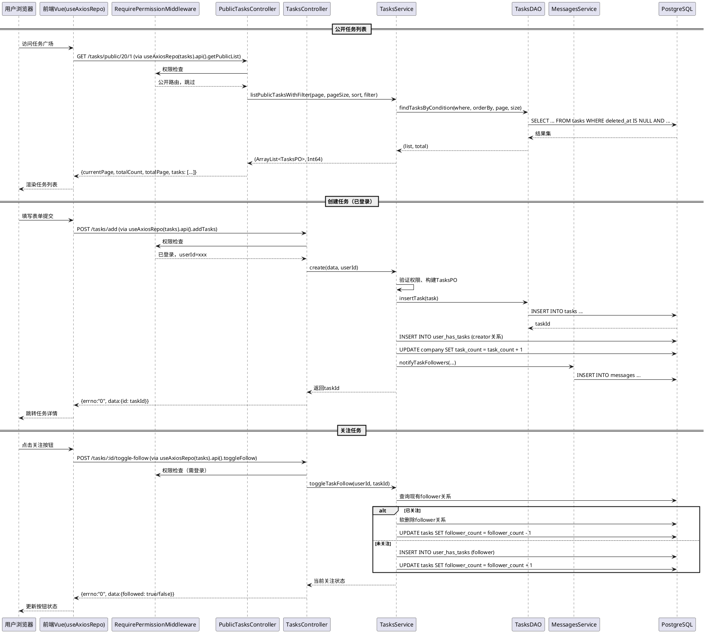

# AI Builder 平台 - 实现方案文档

# **0. 开发流程约定（V4通用模块开发流程）**

> **严格遵循 uctoo-v4-module-development.md 中的「通用模块开发流程」章节**

```
步骤1：数据库建模 → 在sql目录创建DDL文件（aibuilder_init.sql + aibuilder_points_update_20260628.sql）
   ↓
步骤2：人工执行数据库结构新增和变更（由人工执行aibuilder_init.sql和aibuilder_points_update_20260628.sql）
   ↓
步骤3：调用 /api/v1/uctoo/db_info/load-db-info 接口刷新db_info表数据库信息
   ↓
步骤4：使用crudgen生成新增表的标准crud模块（tasks、user_has_company、user_has_tasks、messages、point_transactions、task_settlements六张新表 + 已有user_score表生成CRUD模块，注意company表是扩展字段）
   ↓
步骤4.1（可选）：使用crudweb生成web项目中的数据库表管理界面和Pinia-ORM模型
   ↓
步骤4.2：在web项目的`src/store/models/uctoo/`目录创建/更新Pinia-ORM模型文件（遵循UMI同构规范），在`//#region Human-Code Preservation`区域添加定制API方法
   ↓
步骤5：在生成的标准模块基础上进行迭代开发（扩展Company模块、复用UserScore模块管理用户积分、添加公开API、积分业务逻辑、计划任务、前端页面）
```

**重要说明**：
- tasks、user_has_company、user_has_tasks、messages、point_transactions、task_settlements 六张表的标准CRUD代码（PO/DAO/Service/Controller/Route五层）**由crudgen自动生成**，不需要手动编写
- user_score表已存在但未生成CRUD模块，需要使用crudgen生成标准CRUD模块
- company表扩展points_balance字段需要在生成的基础上手动添加（或重新生成对应模块后合并定制代码）
- **不修改uctoo_user表结构**，用户积分复用已有的user_score表（total_score字段，from_umodel固定为'uctoo_user'）
- 所有定制业务逻辑必须写在 `//#region AutoCreateCode` 之外的「定制开发区域」，确保后续重新生成代码时不会被覆盖
- 公开API（PublicTasksController/PublicCompaniesController）为定制开发内容，在crudgen生成标准模块后手动添加
- 积分业务逻辑（冻结、结算、退还、流水记录）为定制开发，在Service层的AutoCreateCode区域外实现
- 超期任务积分退还使用crontab计划任务（每小时执行一次），通过BuiltinTaskHandler机制注册，任务URI为`builtin://aibuilder-task-refund`
- 前端页面为定制开发内容，crudweb生成的管理界面可作为参考
- **前端严格遵循UMI同构规范**：所有API调用通过Pinia-ORM模型的`useAxiosRepo(table_name).api().method()`模式，禁止创建独立的api/*.ts文件

---

# **1. 实现模型**

## **1.1 上下文视图**

### 1.1.1 系统上下文

AI Builder 平台基于 agentskills-runtime V4 架构和 web-admin Vue 3 前端实现，复用现有基础设施（用户认证、RBAC 权限、文件上传等），通过新增 Tasks、扩展 Company、新增关联表和消息表实现完整的 AI Agent 开发者协作平台功能。

**核心技术路线**：
- 后端严格遵循 V4 模块分层架构：Model → DAO → Service → Controller → Route
- 复用现有 company 表作为组织实体，新增 org_* 扩展字段
- 新建 tasks、user_has_company、user_has_tasks、messages、point_transactions、task_settlements 六张新表（标准CRUD由crudgen生成）
- 复用已有user_score表存储用户积分（total_score字段，from_umodel='uctoo_user'），需使用crudgen生成user_score的标准CRUD模块
- company表扩展points_balance字段（积分余额）
- 公开 API 路径统一使用 `/api/v1/uctoo/tasks/public/*` 和 `/api/v1/uctoo/company/public/*` 前缀（路径前缀与表名一致，使用单数形式）
- 积分系统采用冻结-结算模式：发布任务时冻结积分→单人审核通过直接结算→多人任务支持分配比例结算→超期无人承接自动退还
- 超期退还使用crontab计划任务（每小时执行一次，通过BuiltinTaskHandler机制注册，URI为builtin://aibuilder-task-refund）
- 积分变动记录在point_transactions流水表，确保可追溯
- 后端在 RequirePermissionMiddleware.isPublicRoute 中配置公开路由
- 前端在 Vue Router 中为公开页面设置 `meta: { requiresAuth: false }`
- 前端新建公开页面布局（无后台侧边栏），登录页面复用现有 DefaultLayout 或新建布局
- **前端严格遵循UMI同构规范**：所有API调用通过Pinia-ORM模型的`useAxiosRepo(table_name).api().method()`模式，在`src/store/models/uctoo/`目录下创建模型文件，不创建独立的api/*.ts文件

**数据库列名规范（避免关键字冲突）**：
- 所有列名不使用SQL保留字（如 `type`、`status`等），统一加表名/业务前缀：
  - tasks表：`task_type`（任务类型）、`task_status`（任务状态，不是status）
  - user_has_company表：`member_role`（成员角色，不是role）
  - messages表：`message_type`（消息类型）、`msg_related_type`（关联类型，不是related_type）
  - company表：`org_type`（组织类型）
  - tasks表：`reward_type`（奖励类型）
  - user_has_tasks表：`relation_type`（关系类型）

**当前代码状态评估**：

后端现有可复用基础设施：
1. `UctooUserAuthController/Route/Service` — 用户注册登录认证，已存在
2. `RequirePermissionMiddleware` — RBAC 权限中间件，需扩展公开路由配置
3. `CompanyPO/CompanyDAO/CompanyService/CompanyController/CompanyRoute` — 公司模块已存在，需扩展字段和方法
4. `Attachments` 模块 — 文件上传，已存在
5. Fountain ORM / f_orm — 数据持久层框架，已存在
6. `crudgen` 代码生成器 — 可用于生成标准 CRUD 模块骨架（生成四张新表的标准代码）
7. `QueryBuilderService` — 查询构建工具类
8. `ErrorHandler` — 统一错误处理工具类

后端需要新增/改造的模块：
9. Tasks 模块（TasksPO/DAO/Service/Controller/Route）— crudgen生成标准CRUD + 定制业务逻辑（积分冻结、状态机、审核、结算）
10. UserHasCompany 模块 — crudgen生成标准CRUD + 定制业务逻辑
11. UserHasTasks 模块 — crudgen生成标准CRUD + 定制业务逻辑（承接、提交、审核、分配比例）
12. Messages 模块 — crudgen生成标准CRUD + 定制业务逻辑
13. PointTransactions 模块 — crudgen生成标准CRUD + 定制业务逻辑（积分流水、账户操作）
14. TaskSettlements 模块 — crudgen生成标准CRUD + 定制业务逻辑（多人结算）
15. Company 模块扩展字段和方法 — 在生成代码基础上手动扩展org_*字段、points_balance和定制方法
16. UserScore 模块 — 已有user_score表，使用crudgen生成标准CRUD模块（用户积分存储）
17. UctooUser 模块 — 不修改表结构，仅添加myPoints查询接口（内部查询user_score表）
18. RequirePermissionMiddleware 扩展公开路由 — 小改造
19. Crontab 计划任务注册 — 注册builtin://aibuilder-task-refund BuiltinTaskHandler
20. 新增 PublicTasksController 和 PublicCompaniesController 处理公开API（定制开发，在AutoCreateCode区域外）

前端现有可复用基础设施：
16. Vue 3 + Vite + TypeScript + TinyVue 技术栈 — 已存在
17. Pinia + pinia-orm + @pinia-orm/axios 状态管理 — 已存在
18. Pinia-ORM Axios 请求（useAxiosRepo）— 已存在，统一API调用入口
19. Vue Router 路由配置和权限守卫 — 已存在
20. 登录/注册页面组件 — 已存在
21. DefaultLayout 布局组件 — 已存在（用于登录后的页面）
22. uctoo_user.ts 等已有Pinia-ORM模型 — 已存在，参照模板

前端需要新增/改造的内容：
23. 公开页面布局组件（PublicLayout）— 新增
24. 首页/任务广场页面 — 新增
25. 任务列表页面 — 新增
26. 任务详情页面 — 新增
27. 创建任务页面（含预览确认）— 新增
28. 组织列表页面 — 新增
29. 组织详情页面 — 新增
30. 组织成长页面 — 新增
31. 创建组织页面 — 新增
32. 个人中心页面 — 新增
33. 消息列表页面 — 新增
34. 我的关注页面 — 新增
35. 我的任务页面 — 新增
36. Pinia-ORM模型文件（tasks.ts、company.ts、user_has_company.ts、user_has_tasks.ts、messages.ts）— 新增（遵循UMI规范，在Human-Code区域添加定制方法）
37. uctoo_user.ts模型扩展 — 修改（在Human-Code区域添加getMyPoints方法，个人资料复用getCurrentUser/editUctooUser）
38. store/models/uctoo/index.ts导出 — 修改
39. 路由配置扩展 — 修改
40. 国际化文案（zh-CN.ts / en-US.ts）扩展 — 修改

```plantuml
@startuml
skinparam componentStyle rectangle

rectangle "前端 (web-admin)" {
  package "公开页面（requiresAuth: false）" {
    [首页/任务广场] as Home
    [任务列表] as TaskList
    [任务详情] as TaskDetail
    [组织列表] as OrgList
    [组织详情] as OrgDetail
    [组织成长] as OrgGrowth
  }
  package "登录用户页面" {
    [创建任务] as TaskCreate
    [创建组织] as OrgCreate
    [个人中心] as Profile
    [消息中心] as Messages
    [我的关注] as Follows
    [我的任务] as MyTasks
  }
  package "前端基础设施（已有）" {
    [Vue Router 权限守卫] as RouterGuard
    [Pinia ORM Axios] as PiniaOrm
    [Pinia Store] as Store
    [登录/注册页面] as Login
    [DefaultLayout] as DefaultLayout
  }
  [PublicLayout 公开布局] as PublicLayout
  package "Pinia-ORM Models (store/models/uctoo)" {
    [tasks.ts 新增模型] as TasksModel
    [company.ts 新增/扩展模型] as CompanyModel
    [messages.ts 新增模型] as MessagesModel
    [user_has_tasks.ts 新增模型] as UHTModel
    [user_has_company.ts 新增模型] as UHCModel
    [uctoo_user.ts 扩展模型] as UserModel
  }
}

rectangle "后端 (agentskills-runtime)" {
  package "Controller 层" {
    [TasksController (crudgen生成+定制)] as TaskCtrl
    [PublicTasksController (定制)] as PubTaskCtrl
    [CompaniesController (crudgen生成+扩展)] as CompCtrl
    [PublicCompaniesController (定制)] as PubCompCtrl
    [UserHasCompanyController (crudgen生成+定制)] as UHCCtrl
    [UserHasTasksController (crudgen生成+定制)] as UHTCtrl
    [MessagesController (crudgen生成+定制)] as MsgCtrl
  }
  package "Service 层" {
    [TasksService (crudgen生成+定制)] as TaskSvc
    [CompaniesService 扩展] as CompSvc
    [UserHasCompanyService (crudgen生成+定制)] as UHCSvc
    [UserHasTasksService (crudgen生成+定制)] as UHTSvc
    [MessagesService (crudgen生成+定制)] as MsgSvc
  }
  package "DAO 层" {
    [TasksDAO (crudgen生成+定制)] as TaskDAO
    [CompanyDAO 扩展] as CompDAO
    [UserHasCompanyDAO (crudgen生成+定制)] as UHCDAO
    [UserHasTasksDAO (crudgen生成+定制)] as UHTDAO
    [MessagesDAO (crudgen生成+定制)] as MsgDAO
  }
  package "Model 层" {
    [TasksPO (crudgen生成)] as TaskPO
    [CompanyPO 扩展] as CompPO
    [UserHasCompanyPO (crudgen生成)] as UHCPO
    [UserHasTasksPO (crudgen生成)] as UHTPO
    [MessagesPO (crudgen生成)] as MsgPO
  }
  package "已有基础设施" {
    [RequirePermissionMiddleware] as RBAC
    [UctooUserAuth 模块] as Auth
    [Attachments 模块] as Attach
    [crudgen 代码生成器] as CrudGen
  }
}

database "PostgreSQL (uctoo)" as DB
note over DB
  执行 aibuilder_init.sql 后
  调用 load-db-info 刷新元数据
end note

actor "游客" as Guest
actor "登录用户" as User
actor "开发者" as Dev

Dev -> CrudGen : 执行crudgen生成标准模块
CrudGen -> DB : 读取db_info表元数据
CrudGen --> TaskPO : 生成
CrudGen --> TaskDAO : 生成
CrudGen --> TaskSvc : 生成
CrudGen --> TaskCtrl : 生成
CrudGen --> TaskCtrl : 生成标准CRUD路由

Guest --> Home : 访问
Guest --> TaskList : 浏览
Guest --> TaskDetail : 查看
Guest --> OrgList : 浏览
Guest --> OrgDetail : 查看
Guest --> OrgGrowth : 查看
Guest --> Login : 登录/注册

User --> Home : 浏览
User --> TaskCreate : 创建任务
User --> OrgCreate : 创建组织
User --> Profile : 个人中心
User --> Messages : 消息
User --> Follows : 关注
User --> MyTasks : 我的任务

Home --> PublicLayout
TaskList --> PublicLayout
TaskDetail --> PublicLayout
OrgList --> PublicLayout
OrgDetail --> PublicLayout
OrgGrowth --> PublicLayout
TaskCreate --> DefaultLayout
OrgCreate --> DefaultLayout
Profile --> DefaultLayout
Messages --> DefaultLayout
Follows --> DefaultLayout
MyTasks --> DefaultLayout

Home --> TasksModel
TaskList --> TasksModel
TaskDetail --> TasksModel
TaskDetail --> CompanyModel
OrgList --> CompanyModel
OrgDetail --> CompanyModel
OrgGrowth --> CompanyModel
TaskCreate --> TasksModel
OrgCreate --> CompanyModel
Profile --> UserModel
Profile --> TasksModel
Profile --> CompanyModel
Messages --> MessagesModel
Follows --> TasksModel
Follows --> CompanyModel
MyTasks --> TasksModel
TasksModel --> PiniaOrm
CompanyModel --> PiniaOrm
MessagesModel --> PiniaOrm
UserModel --> PiniaOrm
UHTModel --> PiniaOrm
UHCModel --> PiniaOrm
PiniaOrm --> PubTaskCtrl : 公开API
PiniaOrm --> PubCompCtrl : 公开API
PiniaOrm --> TaskCtrl : 需认证API
PiniaOrm --> CompCtrl : 需认证API
PiniaOrm --> UHCCtrl : 需认证API
PiniaOrm --> UHTCtrl : 需认证API
PiniaOrm --> MsgCtrl : 需认证API

PubTaskCtrl --> RBAC : 公开路由跳过
PubCompCtrl --> RBAC : 公开路由跳过
TaskCtrl --> RBAC : 权限检查
CompCtrl --> RBAC : 权限检查
UHCCtrl --> RBAC : 权限检查
UHTCtrl --> RBAC : 权限检查
MsgCtrl --> RBAC : 权限检查

PubTaskCtrl --> TaskSvc
PubCompCtrl --> CompSvc
TaskCtrl --> TaskSvc
CompCtrl --> CompSvc
UHCCtrl --> UHCSvc
UHTCtrl --> UHTSvc
MsgCtrl --> MsgSvc

TaskSvc --> TaskDAO
CompSvc --> CompDAO
UHCSvc --> UHCDAO
UHTSvc --> UHTDAO
MsgSvc --> MsgDAO

TaskDAO --> DB
CompDAO --> DB
UHCDAO --> DB
UHTDAO --> DB
MsgDAO --> DB
Auth --> DB

@enduml
```

## **1.2 服务/组件总体架构**

### 1.2.1 核心架构决策

#### 决策1：使用crudgen生成标准模块代码，定制代码写在AutoCreateCode区域外

**问题**：如何确保新模块符合V4规范且减少重复劳动？

**方案**：严格遵循V4通用模块开发流程：
1. 先执行DDL创建表结构（aibuilder_init.sql）
2. 调用load-db-info刷新数据库元数据
3. 使用crudgen为tasks、user_has_company、user_has_tasks、messages四张新表生成标准CRUD模块（PO/DAO/Service/Controller/Route）
4. 标准代码在`//#region AutoCreateCode`区域内，crudgen可以安全覆盖
5. 定制业务逻辑（公开API、关注逻辑、消息通知、计数维护等）写在AutoCreateCode区域外的「定制开发区域」
6. company表扩展需要手动在生成的CompanyPO/DAO/Service中添加字段和方法，或重新生成后合并定制代码

**理由**：
- 遵循V4规范，代码风格与现有模块一致
- 大幅减少重复代码编写工作量
- AutoCreateCode保护机制确保定制代码不被覆盖
- 标准CRUD方法（add/edit/del/getSingle/getList）已由生成器实现，只需关注业务逻辑

#### 决策2：公开API路径设计

**问题**：如何区分公开API和需要认证的API，同时复用同一Service层业务逻辑？

**方案**：采用路径分离策略：
- 公开API路径：`/api/v1/uctoo/tasks/public/*` 和 `/api/v1/uctoo/company/public/*`（路径前缀与表名一致，使用单数形式）
- 需认证API路径：crudgen生成的标准路径（`/api/v1/uctoo/tasks/add`、`/api/v1/uctoo/tasks/:id`等）
- 公开API在**独立的PublicTasksController/PublicCompaniesController**中实现（定制开发，不被crudgen覆盖）
- 两种Controller都注入同一个Service，复用业务逻辑
- 公开API不获取userId，需认证API从req.getLocals("userId")获取当前用户
- 在RequirePermissionMiddleware.isPublicRoute中添加路径匹配：`route.contains("/tasks/public") || route.contains("/company/public")`

**理由**：
- 职责清晰：公开API和认证API在不同Controller中，易于维护
- 安全：不会因为路由配置错误导致敏感API泄露
- 复用：Service层共用，不重复实现业务逻辑
- 不破坏crudgen生成的标准Controller结构

#### 决策3：company表扩展而非新建org表

**问题**：现有company表是企业信息表，字段偏向企业认证信息，是否应该新建org表？

**方案**：**复用并扩展company表**，而不是新建org表。理由：
- 用户已明确指示"可以复用company表对应aibuilder的组织org"
- 新建org表会导致数据冗余，且企业和组织概念在平台中可统一
- 原有企业认证字段（social_credit_code、legal_representative等）保留，用于企业实名认证
- 新增org_*前缀字段用于开源组织展示（org_description、org_type、member_count、task_count、follower_count、is_verified、tags）
- 查询时通过org_type字段区分组织类型
- 现有Company模块已有完整的CRUD代码，crudgen可重新生成Company模块后合并定制代码

#### 决策4：用户-组织-任务关系表设计

**问题**：如何设计用户与组织、用户与任务的多对多关系？

**方案**：
- **user_has_company表**：支持同一用户在同一组织拥有不同角色（通过member_role字段区分owner/admin/member/follower），使用(user_id, company_id, member_role)联合唯一约束。follower角色表示关注关系，member表示正式成员。
- **user_has_tasks表**：支持同一用户与同一任务有多种关系（creator/assignee/participant/follower），使用(user_id, task_id, relation_type)联合唯一约束。creator关系在创建任务时自动建立。
- **company与tasks一对多**：通过tasks表的company_id外键实现，不需要中间表。
- 计数冗余：在company表维护member_count、task_count、follower_count，在tasks表维护participant_count、follower_count、view_count、comment_count，避免每次查询都COUNT。计数维护在Service层的定制方法中实现。

#### 决策5：前端布局策略

**问题**：公开页面（首页、任务列表/详情、组织列表/详情）是否使用后台管理布局？

**方案**：公开页面使用独立的PublicLayout布局组件：
- **PublicLayout**：简洁的顶部导航栏（Logo、导航菜单、登录/注册按钮），无侧边栏，适合公开浏览
- **DefaultLayout**：现有后台管理布局（有侧边栏、顶部导航），用于登录后的个人中心、创建任务/组织、消息等页面

#### 决策6：数据库列名避免关键字

**问题**：`type`、`status`等是SQL保留字或常用关键字，直接作为列名可能导致冲突。

**方案**：所有可能引起歧义的列名统一加业务前缀：
- `status` → `task_status`（tasks表中）
- `role` → `member_role`（user_has_company表中）
- `type`相关字段统一加前缀：`task_type`、`org_type`、`reward_type`、`message_type`、`msg_related_type`、`relation_type`
- 仓颉代码中使用camelCase映射：taskStatus、memberRole、messageType、msgRelatedType等

#### 决策7：前端API调用遵循UMI同构规范（useAxiosRepo模式）

**问题**：前端如何调用后端API，是创建独立api/*.ts文件还是遵循项目已有的UMI同构规范？

**方案**：**严格遵循UMI同构规范**，使用Pinia-ORM模型的`useAxiosRepo(table_name).api().method()`模式：
- 每个数据库表对应一个Pinia-ORM Model类，位于`src/store/models/uctoo/`目录
- Model类继承`pinia-orm`的`Model`，使用`@pinia-orm/axios`的`useAxiosRepo`进行API调用
- 标准CRUD方法（getList/get/add/edit/del）参照现有模型（sms_log.ts、agent_tasks.ts）模板手写
- 定制方法（公开API、关注/加入/状态更新等）写在`//#region Human-Code Preservation`区域内
- 公开API方法不携带Authorization头；需认证API携带Bearer Token
- 列表方法设置dataKey为表名直接加"s"（不做英文复数变化）：sms_log→sms_logs, uctoo_user→uctoo_users, entity→entitys, agent_tasks→agent_taskss, tasks→taskss, company→companys, user_has_company→user_has_companys, user_has_tasks→user_has_taskss, messages→messagess
- 模型创建后在`src/store/models/uctoo/index.ts`中export
- **禁止创建独立的api/*.ts文件**，所有API调用都通过Model.api()进行
- 页面组件中通过`import { useAxiosRepo } from '@pinia-orm/axios'`和`import { tasks } from '@/store/models/uctoo'`调用

**理由**：
- 与项目现有代码风格完全一致（参照sms_log.ts中sendEmailCode的用法）
- Pinia-ORM提供数据缓存、状态管理、响应式更新等能力
- 模型与数据库表一一对应，实现UMI全栈模型同构
- Authorization头和baseURL配置在模型中统一管理，无需重复

#### 决策8：积分系统采用冻结-结算模式

**问题**：如何设计积分流转机制，确保任务发布时有足够积分、完成时正确结算、超期时自动退还？用户积分存储在哪里？

**方案**：采用**冻结-结算（Escrow）模式**：
1. **积分存储**：
   - **用户积分**：复用已有的`user_score`表，使用`total_score`字段（int4）记录用户可用积分余额，`from_umodel`固定为`'uctoo_user'`。不修改`uctoo_user`表结构。
   - **公司积分**：在`company`表添加`points_balance`字段（int8）记录公司可用积分余额。
   - **冻结积分**：在`tasks`表使用`points_frozen`字段记录该任务冻结的积分，不冗余存储在company表。
2. **发布冻结**：公司发布带reward_points的任务时，立即从company.points_balance中扣减对应积分，记录到tasks.points_frozen，记录freeze类型流水。余额不足则拒绝发布。
3. **单人结算**：单人任务（max_participants=1）审核通过后，直接将冻结积分转给承接者：公司points_frozen清零、user_score.total_score增加、任务状态更新为settled，记录双方流水。
4. **多人结算**：多人任务所有承接者审核完成后，公司设置分配比例（allocation_ratio总和≤100%），确认结算时按比例分配给通过审核的用户，未分配部分退还公司，在task_settlements表记录分配明细。
5. **超期退还**：accept_deadline已过且任务仍为open状态（无人承接），crontab定时任务自动将冻结积分退还公司（refund流水），任务标记为expired。
6. **审核拒绝**：不触发积分结算，承接者可重新提交。

**理由**：
- 不修改uctoo_user核心表结构，复用已有user_score表，降低风险
- 资金安全：发布即冻结，避免公司发任务后积分不足
- 可追溯：所有积分变动通过point_transactions流水表记录
- 灵活支持：单人任务直接结算，多人任务支持自定义分配比例
- 自动处理：超期无人承接通过计划任务自动退还，无需人工干预

#### 决策9：任务状态机与承接状态机设计

**问题**：任务从发布到结算有多个阶段，如何设计清晰的状态流转？

**方案**：采用**双状态机**设计：

**任务状态机（tasks.task_status）**：
- `open` → 待承接（发布后初始状态）
- `in_progress` → 进行中（至少有1人承接，且未到max_participants或全部承接后）
- `submitted` → 已提交（单人任务承接者提交，或多人任务所有人提交）
- `reviewing` → 审核中（公司开始审核）
- `completed` → 已完成（审核通过且积分已结算）
- `expired` → 已过期（accept_deadline超期无人承接，积分已退还）
- `closed` → 已关闭（公司主动取消等其他情况）

**用户承接状态机（user_has_tasks.join_status）**：
- `applied` → 申请承接（用户点击承接后初始状态）
- `accepted` → 已接受（公司确认/自动确认，开始执行）
- `submitted` → 已提交成果（用户提交工作成果）
- `approved` → 审核通过（公司审核通过，待结算）
- `rejected` → 审核拒绝（公司审核拒绝，可重新提交）
- `completed` → 已结算（积分已到账）
- `left` → 已退出（中途退出任务）

**理由**：
- 双状态机清晰分离任务整体状态和个体参与状态
- 支持多人任务中不同参与者处于不同状态
- 状态枚举值明确，便于前端展示和后端逻辑判断

#### 决策10：超期任务处理使用crontab计划任务

**问题**：如何处理accept_deadline超期无人承接的任务？是实时检查还是定时扫描？

**方案**：使用项目已有的crontab模块，通过BuiltinTaskHandler机制注册定时任务：
- 新建AibuilderTaskRefundHandler实现BuiltinTaskHandler接口
- 在SchedulerEngine.initExecutors()中注册：`builtinExecutor.registerBuiltinTask("aibuilder-task-refund", AibuilderTaskRefundHandler())`
- 任务URI格式：`builtin://aibuilder-task-refund`
- cron表达式：`0 0 * * * *`（每小时整点执行一次）
- 执行逻辑：查询accept_deadline < NOW()且task_status = 'open'且points_frozen > 0的任务，逐个执行退还流程
- 退还流程使用事务：更新任务状态→退还积分到公司账户→记录积分流水→发送消息通知公司
- 每次执行限制处理数量（如100条），避免长时间阻塞

**理由**：
- 项目已有完整的crontab实现，BuiltinTaskHandler是标准扩展机制，无需修改crontab核心代码
- 每小时一次的频率对业务场景足够（任务承接截止时间一般以天为单位）
- 可通过crontab管理界面灵活调整执行频率或禁用
- 执行记录写入crontab_log，便于排查问题

### 1.2.2 后端架构分层（V4标准）

```plantuml
@startuml
skinparam componentStyle rectangle

package "Routes 层 (magic.app.routes.uctoo)" {
  [TasksRoute (crudgen+定制)]
  [PublicTasksRoute (定制)]
  [CompaniesRoute (crudgen+定制)]
  [PublicCompaniesRoute (定制)]
  [UserHasCompanyRoute (crudgen+定制)]
  [UserHasTasksRoute (crudgen+定制)]
  [MessagesRoute (crudgen+定制)]
}

package "Controller 层 (magic.app.controllers.uctoo)" {
  [TasksController (crudgen+定制)]
  [PublicTasksController (定制)]
  [CompaniesController (crudgen+扩展)]
  [PublicCompaniesController (定制)]
  [UserHasCompanyController (crudgen+定制)]
  [UserHasTasksController (crudgen+定制)]
  [MessagesController (crudgen+定制)]
}

package "Service 层 (magic.app.services.uctoo)" {
  [TasksService (crudgen+定制)]
  [CompaniesService (crudgen+扩展)]
  [UserHasCompanyService (crudgen+定制)]
  [UserHasTasksService (crudgen+定制)]
  [MessagesService (crudgen+定制)]
}

package "DAO 层 (magic.app.dao.uctoo)" {
  [TasksDAO (crudgen+定制)]
  [CompanyDAO (crudgen+扩展)]
  [UserHasCompanyDAO (crudgen+定制)]
  [UserHasTasksDAO (crudgen+定制)]
  [MessagesDAO (crudgen+定制)]
}

package "Model 层 (magic.app.models.uctoo)" {
  [TasksPO (crudgen)]
  [CompanyPO (crudgen+扩展)]
  [UserHasCompanyPO (crudgen)]
  [UserHasTasksPO (crudgen)]
  [MessagesPO (crudgen)]
}

package "Middleware 层" {
  [RequirePermissionMiddleware 扩展]
}

Routes --> Controllers : 路由分发
Controllers --> Services : 业务调用
Services --> DAOs : 数据访问
DAOs --> Models : ORM映射
RequirePermissionMiddleware --> Routes : 权限拦截

note right of "Routes 层"
  crudgen生成标准CRUD路由
  （/add, /edit, /del, /:id, /:limit/:page）
  公开路由在定制区域注册
end note

note right of "DAO 层"
  标准CRUD方法在AutoCreateCode区域
  定制查询方法（分页筛选、计数增减等）
  在定制开发区域
end note

@enduml
```

### 1.2.3 新增/修改组件清单

**说明**：标注「crudgen生成」的文件由代码生成器自动创建标准CRUD骨架，标注「定制」的文件或方法需要手动编写。

| 组件 | 类型 | 文件路径 | 包名 | 生成方式 | 说明 |
|------|------|---------|------|---------|------|
| TasksPO | 新建 | `src/app/models/uctoo/TasksPO.cj` | `magic.app.models.uctoo` | crudgen生成+扩展 | 任务数据模型 |
| TasksDAO | 新建 | `src/app/dao/uctoo/TasksDAO.cj` | `magic.app.dao.uctoo` | crudgen生成+定制 | 任务数据访问层 |
| TasksService | 新建 | `src/app/services/uctoo/TasksService.cj` | `magic.app.services.uctoo` | crudgen生成+定制 | 任务业务逻辑层 |
| TasksController | 新建 | `src/app/controllers/uctoo/tasks/TasksController.cj` | `magic.app.controllers.uctoo.tasks` | crudgen生成+定制 | 任务需认证API控制器 |
| TasksRoute | 新建 | `src/app/routes/uctoo/tasks/TasksRoute.cj` | `magic.app.routes.uctoo.tasks` | crudgen生成+定制 | 任务路由注册 |
| PublicTasksController | 新建 | `src/app/controllers/uctoo/tasks/PublicTasksController.cj` | `magic.app.controllers.uctoo.tasks` | 定制 | 任务公开API控制器（不被crudgen覆盖） |
| PublicTasksRoute | 新建 | `src/app/routes/uctoo/tasks/PublicTasksRoute.cj` | `magic.app.routes.uctoo.tasks` | 定制 | 任务公开路由注册 |
| UserHasCompanyPO | 新建 | `src/app/models/uctoo/UserHasCompanyPO.cj` | `magic.app.models.uctoo` | crudgen生成 | 用户-组织关系模型 |
| UserHasCompanyDAO | 新建 | `src/app/dao/uctoo/UserHasCompanyDAO.cj` | `magic.app.dao.uctoo` | crudgen生成+定制 | 用户-组织关系数据访问 |
| UserHasCompanyService | 新建 | `src/app/services/uctoo/UserHasCompanyService.cj` | `magic.app.services.uctoo` | crudgen生成+定制 | 用户-组织关系业务逻辑 |
| UserHasCompanyController | 新建 | `src/app/controllers/uctoo/user_has_company/UserHasCompanyController.cj` | `magic.app.controllers.uctoo.user_has_company` | crudgen生成+定制 | 用户-组织关系控制器 |
| UserHasCompanyRoute | 新建 | `src/app/routes/uctoo/user_has_company/UserHasCompanyRoute.cj` | `magic.app.routes.uctoo.user_has_company` | crudgen生成+定制 | 用户-组织关系路由 |
| UserHasTasksPO | 新建 | `src/app/models/uctoo/UserHasTasksPO.cj` | `magic.app.models.uctoo` | crudgen生成 | 用户-任务关系模型 |
| UserHasTasksDAO | 新建 | `src/app/dao/uctoo/UserHasTasksDAO.cj` | `magic.app.dao.uctoo` | crudgen生成+定制 | 用户-任务关系数据访问 |
| UserHasTasksService | 新建 | `src/app/services/uctoo/UserHasTasksService.cj` | `magic.app.services.uctoo` | crudgen生成+定制 | 用户-任务关系业务逻辑（含关注逻辑） |
| UserHasTasksController | 新建 | `src/app/controllers/uctoo/user_has_tasks/UserHasTasksController.cj` | `magic.app.controllers.uctoo.user_has_tasks` | crudgen生成+定制 | 用户-任务关系控制器 |
| UserHasTasksRoute | 新建 | `src/app/routes/uctoo/user_has_tasks/UserHasTasksRoute.cj` | `magic.app.routes.uctoo.user_has_tasks` | crudgen生成+定制 | 用户-任务关系路由 |
| MessagesPO | 新建 | `src/app/models/uctoo/MessagesPO.cj` | `magic.app.models.uctoo` | crudgen生成 | 消息通知模型 |
| MessagesDAO | 新建 | `src/app/dao/uctoo/MessagesDAO.cj` | `magic.app.dao.uctoo` | crudgen生成+定制 | 消息数据访问层 |
| MessagesService | 新建 | `src/app/services/uctoo/MessagesService.cj` | `magic.app.services.uctoo` | crudgen生成+定制 | 消息业务逻辑层 |
| MessagesController | 新建 | `src/app/controllers/uctoo/messages/MessagesController.cj` | `magic.app.controllers.uctoo.messages` | crudgen生成+定制 | 消息控制器 |
| MessagesRoute | 新建 | `src/app/routes/uctoo/messages/MessagesRoute.cj` | `magic.app.routes.uctoo.messages` | crudgen生成+定制 | 消息路由 |
| PointTransactionsPO | 新建 | `src/app/models/uctoo/PointTransactionsPO.cj` | `magic.app.models.uctoo` | crudgen生成 | 积分流水模型 |
| PointTransactionsDAO | 新建 | `src/app/dao/uctoo/PointTransactionsDAO.cj` | `magic.app.dao.uctoo` | crudgen生成+定制 | 积分流水数据访问 |
| PointTransactionsService | 新建 | `src/app/services/uctoo/PointTransactionsService.cj` | `magic.app.services.uctoo` | crudgen生成+定制 | 积分业务核心逻辑（冻结/结算/退还） |
| PointTransactionsController | 新建 | `src/app/controllers/uctoo/point_transactions/PointTransactionsController.cj` | `magic.app.controllers.uctoo.point_transactions` | crudgen生成+定制 | 积分流水控制器 |
| PointTransactionsRoute | 新建 | `src/app/routes/uctoo/point_transactions/PointTransactionsRoute.cj` | `magic.app.routes.uctoo.point_transactions` | crudgen生成+定制 | 积分流水路由 |
| TaskSettlementsPO | 新建 | `src/app/models/uctoo/TaskSettlementsPO.cj` | `magic.app.models.uctoo` | crudgen生成 | 任务结算模型 |
| TaskSettlementsDAO | 新建 | `src/app/dao/uctoo/TaskSettlementsDAO.cj` | `magic.app.dao.uctoo` | crudgen生成+定制 | 任务结算数据访问 |
| TaskSettlementsService | 新建 | `src/app/services/uctoo/TaskSettlementsService.cj` | `magic.app.services.uctoo` | crudgen生成+定制 | 多人任务分配结算逻辑 |
| TaskSettlementsController | 新建 | `src/app/controllers/uctoo/task_settlements/TaskSettlementsController.cj` | `magic.app.controllers.uctoo.task_settlements` | crudgen生成+定制 | 任务结算控制器 |
| TaskSettlementsRoute | 新建 | `src/app/routes/uctoo/task_settlements/TaskSettlementsRoute.cj` | `magic.app.routes.uctoo.task_settlements` | crudgen生成+定制 | 任务结算路由 |
| UserScorePO | 新建 | `src/app/models/uctoo/UserScorePO.cj` | `magic.app.models.uctoo` | crudgen生成 | 用户积分模型（复用已有表） |
| UserScoreDAO | 新建 | `src/app/dao/uctoo/UserScoreDAO.cj` | `magic.app.dao.uctoo` | crudgen生成+定制 | 用户积分数据访问 |
| UserScoreService | 新建 | `src/app/services/uctoo/UserScoreService.cj` | `magic.app.services.uctoo` | crudgen生成+定制 | 用户积分查询/增减操作（操作total_score字段） |
| UserScoreController | 新建 | `src/app/controllers/uctoo/user_score/UserScoreController.cj` | `magic.app.controllers.uctoo.user_score` | crudgen生成+定制 | 用户积分控制器（可能不需要独立API，通过PointTransactionsService调用） |
| UserScoreRoute | 新建 | `src/app/routes/uctoo/user_score/UserScoreRoute.cj` | `magic.app.routes.uctoo.user_score` | crudgen生成+定制 | 用户积分路由 |
| CompanyPO | 修改 | `src/app/models/uctoo/CompanyPO.cj` | `magic.app.models.uctoo` | crudgen重新生成+合并 | 新增org_*扩展字段、points_balance字段 |
| CompanyDAO | 修改 | `src/app/dao/uctoo/CompanyDAO.cj` | `magic.app.dao.uctoo` | crudgen重新生成+定制 | 新增公开查询方法和计数更新方法 |
| CompaniesService | 修改 | `src/app/services/uctoo/CompaniesService.cj` | `magic.app.services.uctoo` | crudgen重新生成+定制 | 新增公开查询、组织创建、成员管理方法 |
| CompanyController | 修改 | `src/app/controllers/uctoo/company/CompanyController.cj` | `magic.app.controllers.uctoo.company` | crudgen重新生成+定制 | 新增公开API方法和组织管理方法 |
| CompanyRoute | 修改 | `src/app/routes/uctoo/company/CompanyRoute.cj` | `magic.app.routes.uctoo.company` | crudgen重新生成+定制 | 新增公开路由和组织管理路由 |
| PublicCompaniesController | 新建 | `src/app/controllers/uctoo/company/PublicCompaniesController.cj` | `magic.app.controllers.uctoo.company` | 定制 | 组织公开API控制器 |
| PublicCompaniesRoute | 新建 | `src/app/routes/uctoo/company/PublicCompaniesRoute.cj` | `magic.app.routes.uctoo.company` | 定制 | 组织公开路由 |
| RequirePermissionMiddleware | 修改 | `src/app/middlewares/auth/RequirePermissionMiddleware.cj` | `magic.app.middlewares.auth` | 定制 | 扩展isPublicRoute添加AI Builder公开路由 |

### 1.2.4 前端架构分层（UMI同构规范）

```plantuml
@startuml
skinparam componentStyle rectangle

package "Views 页面层" {
  package "公开页面 (PublicLayout)" {
    [aibuilder/home/index.vue] as HomePage
    [aibuilder/tasks/list.vue] as TaskListPage
    [aibuilder/tasks/detail.vue] as TaskDetailPage
    [aibuilder/orgs/list.vue] as OrgListPage
    [aibuilder/orgs/detail.vue] as OrgDetailPage
    [aibuilder/orgs/growth.vue] as OrgGrowthPage
  }
  package "登录页面 (DefaultLayout)" {
    [aibuilder/tasks/create.vue] as TaskCreatePage
    [aibuilder/tasks/create-confirm.vue] as TaskConfirmPage
    [aibuilder/orgs/create.vue] as OrgCreatePage
    [aibuilder/profile/index.vue] as ProfilePage
    [aibuilder/messages/index.vue] as MessagesPage
    [aibuilder/follows/index.vue] as FollowsPage
    [aibuilder/my-tasks/index.vue] as MyTasksPage
  }
}

package "Layout 布局" {
  [PublicLayout 新增] as PublicLayout
  [DefaultLayout 已有] as DefaultLayout
}

package "Pinia-ORM Models 层 (store/models/uctoo)" {
  [tasks.ts 新增/扩展] as TasksModel
  [company.ts 新增/扩展] as CompanyModel
  [messages.ts 新增] as MessagesModel
  [user_has_tasks.ts 新增/扩展] as UHTModel
  [user_has_company.ts 新增] as UHCModel
  [point_transactions.ts 新增] as PTModel
  [task_settlements.ts 新增] as TSModel
  [user_score.ts 新增] as USModel
}

package "Router" {
  [router/routes/modules/aibuilder.ts 新增] as AiRoutes
  [router/guard/permission.ts 已有] as PermissionGuard
}

package "i18n" {
  [lang/zh-CN.ts 修改] as ZhCN
  [lang/en-US.ts 修改] as EnUS
}

HomePage --> PublicLayout
TaskListPage --> PublicLayout
TaskDetailPage --> PublicLayout
OrgListPage --> PublicLayout
OrgDetailPage --> PublicLayout
OrgGrowthPage --> PublicLayout
TaskCreatePage --> DefaultLayout
TaskConfirmPage --> DefaultLayout
OrgCreatePage --> DefaultLayout
ProfilePage --> DefaultLayout
MessagesPage --> DefaultLayout
FollowsPage --> DefaultLayout
MyTasksPage --> DefaultLayout

HomePage --> TasksModel : useAxiosRepo(tasks).api()
TaskListPage --> TasksModel
TaskDetailPage --> TasksModel
TaskDetailPage --> CompanyModel
OrgListPage --> CompanyModel
OrgDetailPage --> CompanyModel
TaskCreatePage --> TasksModel
ProfilePage --> UserModel
MessagesPage --> MessagesModel
AiRoutes --> PermissionGuard

note right of TasksModel
  标准CRUD方法: getTasksList, getTasks,
  addTasks, editTasks, deleteTasks,
  batchDeleteTasks, batchRestoreTasks, emptyRecycleBin
  定制方法(Human-Code区域):
  getHomeStats, getPublicList, getPublicDetail,
  toggleFollow, joinTask, updateStatus, getMyTasks
  公开API不携带Authorization头
  dataKey: 'taskss'（表名直接加s）
end note

@enduml
```



## **1.3 实现设计文档**

### 1.3.1 REQ-AI-01：数据模型扩展与新建

#### 实现思路

**按照V4通用模块开发流程执行**：
1. DDL文件已创建在 `sql/aibuilder_init.sql`
2. 人工执行aibuilder_init.sql到PostgreSQL数据库
3. 调用 `/api/v1/uctoo/db_info/load-db-info` 刷新数据库元数据
4. 使用crudgen为tasks、user_has_company、user_has_tasks、messages四张表生成标准CRUD模块
5. 重新生成company模块（crudgen会覆盖AutoCreateCode区域），然后在定制区域添加扩展方法
6. 手动添加org_*字段到CompanyPO

**关键列名映射（避免关键字冲突）**：

| 数据库列名 | 仓颉字段名(camelCase) | 说明 |
|-----------|---------------------|------|
| task_type | taskType | 任务类型 |
| task_status | taskStatus | 任务状态（不是status） |
| member_role | memberRole | 成员角色（不是role） |
| message_type | messageType | 消息类型 |
| msg_related_type | msgRelatedType | 关联对象类型（不是related_type） |
| relation_type | relationType | 关系类型 |
| org_type | orgType | 组织类型 |
| reward_type | rewardType | 奖励类型 |

**crudgen生成后的扩展内容**：
- TasksPO：crudgen生成基础字段后，确认JSON字段（tags、skills_required等）的映射正确
- TasksDAO：在定制区域添加分页筛选查询、计数增减、首页统计等方法
- CompanyPO：手动添加org_description、member_count、task_count、follower_count、is_verified、org_type、tags字段
- CompanyDAO：在定制区域添加公开组织查询、计数增减等方法

#### TasksPO 关键字段（crudgen生成后确认）

```cangjie
// crudgen会根据数据库表结构自动生成以下字段映射
@ORMField['id']           public var id: String = ""
@ORMField['title']        public var title: String = ""
@ORMField['description']  public var description: String = ""
@ORMField['task_type']    public var taskType: String = "development"
@ORMField['task_status']  public var taskStatus: String = "open"
@ORMField['priority']     public var priority: String = "normal"
@ORMField['company_id']   public var companyId: Option<String> = None<String>
@ORMField['creator_id']   public var creatorId: String = ""
@ORMField['assignee_id']  public var assigneeId: Option<String> = None<String>
@ORMField['participant_count'] public var participantCount: Int32 = 0
@ORMField['follower_count']    public var followerCount: Int32 = 0
@ORMField['view_count']        public var viewCount: Int32 = 0
@ORMField['comment_count']     public var commentCount: Int32 = 0
@ORMField['reward_type']       public var rewardType: Option<String> = None<String>
@ORMField['reward_amount']     public var rewardAmount: Option<String> = None<String>
@ORMField['deadline']          public var deadline: Option<DateTime> = None<DateTime>
@ORMField['tags']              public var tags: String = "[]"
@ORMField['skills_required']   public var skillsRequired: String = "[]"
// 标准字段：creator, createdAt, updatedAt, deletedAt
```

### 1.3.2 REQ-AI-02/03/04：公开API实现

#### 实现思路

公开API与认证API分离在不同Controller中。**PublicTasksController和PublicCompaniesController为完全定制开发**，在crudgen生成标准模块后手动创建，代码写在AutoCreateCode区域外。

#### 公开路由配置（RequirePermissionMiddleware改造）

在isPublicRoute方法中添加：

```cangjie
// AI Builder公开API
if (route.contains("/tasks/public") || route.contains("/company/public")) {
    return true
}
```

#### PublicTasksController 关键方法设计（定制开发）

```cangjie
package magic.app.controllers.uctoo.tasks

import magic.app.core.http.{HttpRequest, HttpResponse}
import magic.app.services.uctoo.TasksService
import magic.log.LogUtils
import magic.app.core.http.ErrorHandler
import stdx.encoding.json.{JsonObject, JsonString, JsonInt}

// ========== 定制开发区域（PublicTasksController不被crudgen覆盖）==========

public class PublicTasksController {
    private var service: TasksService

    public init(service: TasksService) {
        this.service = service
    }

    /**
     * GET /api/v1/uctoo/tasks/public/home-stats
     * 获取首页统计数据
     */
    public func getHomeStats(req: HttpRequest, res: HttpResponse): Unit {
        // 调用service.getHomeStats()
    }

    /**
     * GET /api/v1/uctoo/tasks/public/:limit/:page
     * 获取公开任务列表（路径参数分页、filter过滤、sort排序）
     */
    public func getPublicList(req: HttpRequest, res: HttpResponse): Unit {
        // 解析路径参数：limit, page
        // 解析查询参数：sort（排序）、filter（JSON格式过滤条件）
        // 可选获取userId（已登录用户）
    }

    /**
     * GET /api/v1/uctoo/tasks/public/:id
     * 获取公开任务详情
     */
    public func getPublicDetail(req: HttpRequest, res: HttpResponse): Unit {
        let taskId = req.getPathParam("id") ?? ""
        // 可选获取userId
    }
}
```

#### TasksService 定制方法（在AutoCreateCode区域外添加）

```cangjie
// ========== 定制开发方法 ==========

public func listPublicTasksWithFilter(
    page: Int32, pageSize: Int32,
    sort: String, filter: String
): (ArrayList<TasksPO>, Int64) {
    // 复用 requestParser 解析 filter 和 sort
    // 调用 DAO 的 findTasksByCondition 查询
}

public func getPublicTaskDetail(taskId: String, userId: String): APIResult<JsonObject> {
    // 查询任务，增加view_count，关联查询创建者和组织信息
}

public func createTask(userId: String, data: JsonObject): APIResult<String> {
    // 验证、插入任务、创建creator关系、更新计数、发送通知
}
```

### 1.3.3 REQ-AI-05/06：需认证的任务/组织创建与管理

#### 实现思路

crudgen生成标准CRUD后，在Controller/Service的定制区域添加业务方法：
- 创建任务：扩展add方法或新增createTask定制方法
- 更新任务状态：新增定制路由和方法
- 关注/取消关注：新增定制路由和方法
- 创建组织：扩展CompanyController的add方法，根据org_type区分

#### 关注功能实现（UserHasTasksService定制方法）

```cangjie
// ========== 定制开发方法 ==========

/**
 * 切换任务关注状态
 * @return true=已关注, false=已取消关注
 */
public func toggleTaskFollow(userId: String, taskId: String): APIResult<Bool> {
    // 查询是否已存在follower关系
    // 存在：软删除关系，task.follower_count - 1
    // 不存在：创建follower关系，task.follower_count + 1
}
```

### 1.3.4 REQ-AI-08：消息通知实现

#### 实现思路

MessagesService的标准CRUD由crudgen生成，在定制区域添加批量通知和业务触发方法。在TasksService和CompaniesService的关键业务动作（创建任务、状态变更、加入组织等）中调用MessagesService发送通知。

#### MessagesService 定制方法

```cangjie
// ========== 定制开发方法 ==========

public func notifyTaskFollowers(taskId: String, excludeUserId: String, title: String, content: String): Unit {
    // 查询任务所有follower，批量创建messages记录
}

public func getUnreadCount(userId: String): APIResult<Int64> {
    // 调用DAO定制方法
}

public func markAllAsRead(userId: String): APIResult<Bool> {
    // 批量更新is_read=true
}
```

### 1.3.5 REQ-AI-10：前端页面与路由实现（UMI同构规范）

#### 前端路由配置（router/routes/modules/aibuilder.ts）

```typescript
import type { RouteRecordRaw } from 'vue-router'
import PublicLayout from '@/layout/public-layout.vue'

export default [
  {
    path: import.meta.env.VITE_CONTEXT + 'aibuilder',
    component: PublicLayout,
    meta: { requiresAuth: false },
    children: [
      { path: '', name: 'aibuilder-home', component: () => import('@/views/aibuilder/home/index.vue'), meta: { requiresAuth: false, title: 'AI Builder' } },
      { path: 'tasks', name: 'aibuilder-tasks', component: () => import('@/views/aibuilder/tasks/list.vue'), meta: { requiresAuth: false, title: '任务广场' } },
      { path: 'task/:id', name: 'aibuilder-task-detail', component: () => import('@/views/aibuilder/tasks/detail.vue'), meta: { requiresAuth: false, title: '任务详情' } },
      { path: 'orgs', name: 'aibuilder-orgs', component: () => import('@/views/aibuilder/orgs/list.vue'), meta: { requiresAuth: false, title: '组织' } },
      { path: 'org/:id', name: 'aibuilder-org-detail', component: () => import('@/views/aibuilder/orgs/detail.vue'), meta: { requiresAuth: false, title: '组织详情' } },
      { path: 'org/:id/growth', name: 'aibuilder-org-growth', component: () => import('@/views/aibuilder/orgs/growth.vue'), meta: { requiresAuth: false, title: '组织成长' } }
    ]
  },
  {
    path: import.meta.env.VITE_CONTEXT + 'aibuilder',
    component: () => import('@/layout/default-layout.vue'),
    meta: { requiresAuth: true },
    children: [
      { path: 'tasks/create', name: 'aibuilder-task-create', component: () => import('@/views/aibuilder/tasks/create.vue'), meta: { requiresAuth: true, title: '创建任务' } },
      { path: 'tasks/create/confirm', name: 'aibuilder-task-create-confirm', component: () => import('@/views/aibuilder/tasks/create-confirm.vue'), meta: { requiresAuth: true, title: '确认创建' } },
      { path: 'orgs/create', name: 'aibuilder-org-create', component: () => import('@/views/aibuilder/orgs/create.vue'), meta: { requiresAuth: true, title: '创建组织' } },
      { path: 'profile', name: 'aibuilder-profile', component: () => import('@/views/aibuilder/profile/index.vue'), meta: { requiresAuth: true, title: '个人中心' } },
      { path: 'messages', name: 'aibuilder-messages', component: () => import('@/views/aibuilder/messages/index.vue'), meta: { requiresAuth: true, title: '消息' } },
      { path: 'follows', name: 'aibuilder-follows', component: () => import('@/views/aibuilder/follows/index.vue'), meta: { requiresAuth: true, title: '我的关注' } },
      { path: 'my-tasks', name: 'aibuilder-my-tasks', component: () => import('@/views/aibuilder/my-tasks/index.vue'), meta: { requiresAuth: true, title: '我的任务' } }
    ]
  }
] as RouteRecordRaw[]
```

#### 前端Pinia-ORM模型（store/models/uctoo/，遵循UMI同构规范）

**严格遵循UMI同构规范**：所有后端API调用必须通过Pinia-ORM模型的`useAxiosRepo(table_name).api().method()`模式进行，模型文件位于`src/store/models/uctoo/`目录，标准CRUD方法参照现有模型模板（如sms_log.ts、agent_tasks.ts）手写，定制方法写在`//#region Human-Code Preservation`区域。**禁止创建独立的api/*.ts文件**。

每个模型文件遵循统一模板（严格参照sms_log.ts、agent_tasks.ts、uctoo_user.ts等现有模型文件）：
- 文件顶部保留空的`//#region Human-Code Preservation`区域
- 使用注释说明apiURL用途（如`// 使用 VITE_BACKEND_URL（install.html 配置的后端服务域名）`）
- 使用`const apiURL = import.meta.env.VITE_BACKEND_URL || 'https://localhost:443';`
- 标准CRUD方法命名：`get{Entity}List(page, pageSize, searchParams)`、`get{Entity}(id)`、`add{Entity}(data)`、`edit{Entity}(data)`、`delete{Entity}(data)`
- 可选标准批量方法：`batchDelete{Entity}(params: { ids: string; force?: number })`、`batchRestore{Entity}(ids: string[])`、`emptyRecycleBin()`
- 列表方法设置`dataKey`为表名直接加"s"（不做英文复数变化）：sms_log→sms_logs, uctoo_user→uctoo_users, entity→entitys, agent_tasks→agent_taskss, tasks→taskss, company→companys, messages→messagess
- 需认证API方法携带`'Authorization': \`Bearer ${localStorage.getItem('accessToken')}\``头；公开API方法不携带Authorization头
- 所有方法都携带`'Content-Type': 'application/json;charset=utf-8'`头
- 定制方法写在actions中标准CRUD方法之后的`//#region Human-Code Preservation`区域内
- 模型创建后在`src/store/models/uctoo/index.ts`中使用`export * from './filename';`导出

**tasks.ts 模型示例**（核心结构，标准CRUD+Human-Code定制方法）：

```ts
import { Model } from 'pinia-orm';
import { Attr, Str, Uid, Num } from 'pinia-orm/decorators';
import { useAxiosRepo } from '@pinia-orm/axios';

//#region Human-Code Preservation

//#endregion Human-Code Preservation

// 使用 VITE_BACKEND_URL（install.html 配置的后端服务域名）
const apiURL = import.meta.env.VITE_BACKEND_URL || 'https://localhost:443';

export class tasks extends Model {
  static override entity = 'tasks'

  @Uid() declare id: string
  @Str('') declare title: string
  @Str('') declare description: string
  @Str('development') declare task_type: string
  @Str('open') declare task_status: string
  @Str('normal') declare priority: string
  @Uid() declare company_id: string | null
  @Uid() declare creator_id: string
  @Uid() declare assignee_id: string | null
  @Num(0) declare participant_count: number
  @Num(0) declare follower_count: number
  @Num(0) declare view_count: number
  @Num(0) declare comment_count: number
  @Str('none') declare reward_type: string | null
  @Str('') declare reward_amount: string | null
  @Attr('') declare deadline: string | null
  @Str('[]') declare tags: string
  @Str('[]') declare skills_required: string
  @Uid() declare creator: string | null
  @Attr('') declare created_at: string
  @Attr('') declare updated_at: string
  @Attr('') declare completed_at: string | null
  @Attr('') declare deleted_at: string | null


  static override config = {
    axiosApi: {
      actions: {
        getTasksList(page: number, pageSize: number, searchParams?: any) {
          return useAxiosRepo(tasks).api().get(`/api/v1/uctoo/tasks/${pageSize}/${page}`, {
            params: searchParams,
            headers: {
              'Content-Type': 'application/json;charset=utf-8',
              'Authorization': `Bearer ${localStorage.getItem('accessToken')}`
            },
            baseURL: apiURL,
            dataKey: 'taskss'
          })
        },

        getTasks(id: string) {
          return useAxiosRepo(tasks).api().get(`/api/v1/uctoo/tasks/${id}`, {
            headers: {
              'Content-Type': 'application/json;charset=utf-8',
              'Authorization': `Bearer ${localStorage.getItem('accessToken')}`
            },
            baseURL: apiURL,
          })
        },

        addTasks(data: any) {
          return useAxiosRepo(tasks).api().post('/api/v1/uctoo/tasks/add', data, {
            headers: {
              'Content-Type': 'application/json;charset=utf-8',
              'Authorization': `Bearer ${localStorage.getItem('accessToken')}`
            },
            baseURL: apiURL,
          })
        },

        editTasks(data: any) {
          return useAxiosRepo(tasks).api().post('/api/v1/uctoo/tasks/edit', data, {
            headers: {
              'Content-Type': 'application/json;charset=utf-8',
              'Authorization': `Bearer ${localStorage.getItem('accessToken')}`
            },
            baseURL: apiURL,
          })
        },

        deleteTasks(data: any) {
          return useAxiosRepo(tasks).api().post('/api/v1/uctoo/tasks/del', data, {
            headers: {
              'Content-Type': 'application/json;charset=utf-8',
              'Authorization': `Bearer ${localStorage.getItem('accessToken')}`
            },
            baseURL: apiURL,
          })
        },

        batchDeleteTasks(params: { ids: string; force?: number }) {
          return useAxiosRepo(tasks).api().post('/api/v1/uctoo/tasks/del', params, {
            headers: {
              'Content-Type': 'application/json;charset=utf-8',
              'Authorization': `Bearer ${localStorage.getItem('accessToken')}`
            },
            baseURL: apiURL,
          })
        },

        batchRestoreTasks(ids: string[]) {
          return useAxiosRepo(tasks).api().post('/api/v1/uctoo/tasks/edit', { ids: JSON.stringify(ids), deleted_at: '0' }, {
            headers: {
              'Content-Type': 'application/json;charset=utf-8',
              'Authorization': `Bearer ${localStorage.getItem('accessToken')}`
            },
            baseURL: apiURL,
          })
        },

        emptyRecycleBin() {
          return useAxiosRepo(tasks).api().post('/api/v1/uctoo/tasks/empty-recycle-bin', {}, {
            headers: {
              'Content-Type': 'application/json;charset=utf-8',
              'Authorization': `Bearer ${localStorage.getItem('accessToken')}`
            },
            baseURL: apiURL,
          })
        },

//#region Human-Code Preservation
        getHomeStats() {
          return useAxiosRepo(tasks).api().get('/api/v1/uctoo/tasks/public/home-stats', {
            headers: { 'Content-Type': 'application/json;charset=utf-8' },
            baseURL: apiURL
          })
        },
        getPublicList(page: number, pageSize: number, params?: any) {
          return useAxiosRepo(tasks).api().get(`/api/v1/uctoo/tasks/public/${pageSize}/${page}`, {
            params,
            headers: { 'Content-Type': 'application/json;charset=utf-8' },
            baseURL: apiURL,
            dataKey: 'tasks'
          })
        },
        getPublicDetail(id: string) {
          return useAxiosRepo(tasks).api().get(`/api/v1/uctoo/tasks/public/${id}`, {
            headers: { 'Content-Type': 'application/json;charset=utf-8' },
            baseURL: apiURL
          })
        },
        toggleFollow(id: string) {
          return useAxiosRepo(tasks).api().post(`/api/v1/uctoo/tasks/${id}/toggle-follow`, {}, {
            headers: {
              'Content-Type': 'application/json;charset=utf-8',
              'Authorization': `Bearer ${localStorage.getItem('accessToken')}`
            },
            baseURL: apiURL
          })
        },
        joinTask(id: string) {
          return useAxiosRepo(tasks).api().post(`/api/v1/uctoo/tasks/${id}/join`, {}, {
            headers: {
              'Content-Type': 'application/json;charset=utf-8',
              'Authorization': `Bearer ${localStorage.getItem('accessToken')}`
            },
            baseURL: apiURL
          })
        },
        updateStatus(id: string, task_status: string) {
          return useAxiosRepo(tasks).api().post(`/api/v1/uctoo/tasks/${id}/update-status`, { task_status }, {
            headers: {
              'Content-Type': 'application/json;charset=utf-8',
              'Authorization': `Bearer ${localStorage.getItem('accessToken')}`
            },
            baseURL: apiURL
          })
        },
        getMyTasks(params?: any) {
          return useAxiosRepo(tasks).api().get('/api/v1/uctoo/tasks/my', {
            params,
            headers: {
              'Content-Type': 'application/json;charset=utf-8',
              'Authorization': `Bearer ${localStorage.getItem('accessToken')}`
            },
            baseURL: apiURL
          })
        },
//#endregion Human-Code Preservation
      }
    }
  }
}
```

**其他模型Human-Code区域定制方法清单**：

| 模型文件 | 定制方法 | 是否需Auth | 对应后端API路径 |
|---------|---------|-----------|---------------|
| company.ts | getPublicList(page, pageSize, params?) | 否 | GET /api/v1/uctoo/company/public/:limit/:page |
| company.ts | getPublicDetail(id) | 否 | GET /api/v1/uctoo/company/public/:id |
| company.ts | getPublicTasks(id, page, pageSize, params?) | 否 | GET /api/v1/uctoo/company/public/:id/tasks/:limit/:page |
| company.ts | getOrgGrowth(id) | 否 | GET /api/v1/uctoo/company/public/:id/growth |
| company.ts | toggleFollow(id) | 是 | POST /api/v1/uctoo/company/:id/toggle-follow |
| company.ts | joinCompany(id) | 是 | POST /api/v1/uctoo/company/:id/join |
| company.ts | leaveCompany(id) | 是 | POST /api/v1/uctoo/company/:id/leave |
| company.ts | getMyCompanies(page, pageSize, params?) | 是 | GET /api/v1/uctoo/company/my/:limit/:page |
| messages.ts | getUnreadCount() | 是 | GET /api/v1/uctoo/messages/unread-count |
| messages.ts | markRead(id) | 是 | POST /api/v1/uctoo/messages/:id/mark-read |
| messages.ts | markAllRead() | 是 | POST /api/v1/uctoo/messages/mark-all-read |
| messages.ts | getMyList(page, pageSize, params?) | 是 | GET /api/v1/uctoo/messages/my/:limit/:page |
| uctoo_user.ts | getMyPoints() | 是 | GET /api/v1/uctoo/user/my-points（在现有模型Human-Code区域扩展，个人资料复用getCurrentUser/editUctooUser） |

**页面中调用示例（UMI规范）**：

```ts
import { useAxiosRepo } from '@pinia-orm/axios'
import { tasks, company, messages, uctoo_user } from '@/store/models/uctoo'

const res = await useAxiosRepo(tasks).api().getHomeStats()
await useAxiosRepo(tasks).api().addTasks({ title, description, task_type })
await useAxiosRepo(tasks).api().toggleFollow(taskId)
// 个人中心：复用现有 getCurrentUser / editUctooUser
await useAxiosRepo(uctoo_user).api().getCurrentUser()
await useAxiosRepo(uctoo_user).api().editUctooUser({ id: userId, avatar, name })
```

### 1.3.6 数据流图



---

## **2. 数据库DDL变更清单**

| 序号 | 变更类型 | 表名 | 说明 | DDL文件 |
|------|---------|------|------|---------|
| 1 | ALTER TABLE | company | 新增org_description、member_count、task_count、follower_count、is_verified、org_type、tags字段 | sql/aibuilder_init.sql |
| 2 | CREATE TABLE | tasks | 新建任务表（含task_type、task_status等带前缀列名） | sql/aibuilder_init.sql |
| 3 | CREATE TABLE | user_has_company | 新建用户-组织关联表（member_role） | sql/aibuilder_init.sql |
| 4 | CREATE TABLE | user_has_tasks | 新建用户-任务关联表（relation_type） | sql/aibuilder_init.sql |
| 5 | CREATE TABLE | messages | 新建消息通知表（message_type、msg_related_type） | sql/aibuilder_init.sql |
| 6 | CREATE INDEX | tasks | company_id、creator_id、task_status、created_at索引 | sql/aibuilder_init.sql |
| 7 | CREATE INDEX | user_has_company | user_id、company_id索引 | sql/aibuilder_init.sql |
| 8 | CREATE INDEX | user_has_tasks | user_id、task_id索引 | sql/aibuilder_init.sql |
| 9 | CREATE INDEX | messages | user_id、is_read、created_at索引 | sql/aibuilder_init.sql |

---

## **3. crudgen生成模块清单**

执行DDL和load-db-info后，使用crudgen为以下4张新表生成标准CRUD模块：

| 表名 | 生成的模块 | 说明 |
|------|----------|------|
| tasks | TasksPO/DAO/Service/Controller/Route | 任务模块标准CRUD |
| user_has_company | UserHasCompanyPO/DAO/Service/Controller/Route | 用户-组织关系标准CRUD |
| user_has_tasks | UserHasTasksPO/DAO/Service/Controller/Route | 用户-任务关系标准CRUD |
| messages | MessagesPO/DAO/Service/Controller/Route | 消息模块标准CRUD |

company模块建议使用crudgen重新生成以获取新字段映射，然后将原有定制代码合并到AutoCreateCode区域外。

---

## **4. 定制开发清单（crudgen生成后手动添加）**

### 4.1 后端定制开发

| 定制项 | 文件 | 位置 | 说明 |
|-------|------|------|------|
| CompanyPO扩展字段 | CompanyPO.cj | 类体内 | 添加org_*字段映射 |
| TasksDAO定制查询 | TasksDAO.cj | AutoCreateCode外 | 公开列表分页筛选、计数增减、统计 |
| UserHasCompanyDAO定制查询 | UserHasCompanyDAO.cj | AutoCreateCode外 | 成员查询、角色判断 |
| UserHasTasksDAO定制查询 | UserHasTasksDAO.cj | AutoCreateCode外 | 关注者查询、关系判断 |
| MessagesDAO定制方法 | MessagesDAO.cj | AutoCreateCode外 | 未读统计、批量已读、批量插入 |
| CompanyDAO定制方法 | CompanyDAO.cj | AutoCreateCode外 | 公开列表查询、计数增减 |
| TasksService业务逻辑 | TasksService.cj | AutoCreateCode外 | 创建任务、公开查询、状态更新、计数维护 |
| CompaniesService业务逻辑 | CompaniesService.cj | AutoCreateCode外 | 公开查询、组织创建、成员管理 |
| UserHasCompanyService业务逻辑 | UserHasCompanyService.cj | AutoCreateCode外 | 加入/退出组织、关注/取消关注 |
| UserHasTasksService业务逻辑 | UserHasTasksService.cj | AutoCreateCode外 | 关注/取消关注、参与任务 |
| MessagesService业务逻辑 | MessagesService.cj | AutoCreateCode外 | 批量通知、未读统计、已读管理 |
| PublicTasksController | 新建文件 | 全部定制 | 公开任务API |
| PublicCompaniesController | 新建文件 | 全部定制 | 公开组织API |
| 各Controller定制方法 | 各Controller.cj | AutoCreateCode外 | 关注、加入、状态更新、我的列表等 |
| 公开路由注册 | 各Route.cj | registerCustomRoutes | 注册public/*路径 |
| RequirePermissionMiddleware | 修改文件 | isPublicRoute | 添加public路径判断 |

### 4.2 前端Pinia-ORM模型定制开发（UMI同构规范）

| 定制项 | 文件 | 位置 | 说明 |
|-------|------|------|------|
| tasks.ts模型 | store/models/uctoo/tasks.ts | 新建 | 标准CRUD + Human-Code区域定制方法（公开API、关注/加入/状态更新） |
| company.ts模型 | store/models/uctoo/company.ts | 新建 | 标准CRUD + Human-Code区域定制方法（公开API、关注/加入组织） |
| user_has_tasks.ts模型 | store/models/uctoo/user_has_tasks.ts | 新建 | 标准CRUD即可，关系通过后端Service维护 |
| user_has_company.ts模型 | store/models/uctoo/user_has_company.ts | 新建 | 标准CRUD即可，关系通过后端Service维护 |
| messages.ts模型 | store/models/uctoo/messages.ts | 新建 | 标准CRUD + Human-Code区域定制方法（未读数、标记已读） |
| uctoo_user.ts扩展 | store/models/uctoo/uctoo_user.ts | 修改 | Human-Code区域添加getMyPoints方法（个人资料复用getCurrentUser/editUctooUser） |
| index.ts导出 | store/models/uctoo/index.ts | 修改 | 添加新模型export |

---

## **5. 前端新增页面清单**

| 页面 | 路由 | 是否需登录 | 布局 | 对应截图 | 调用的主要模型方法 |
|------|------|----------|------|---------|-----------------|
| 首页/任务广场 | /aibuilder | 否 | PublicLayout | task_index.png | tasks.getHomeStats, tasks.getPublicList |
| 任务列表 | /aibuilder/tasks | 否 | PublicLayout | task_index.png | tasks.getPublicList |
| 任务详情 | /aibuilder/task/:id | 否 | PublicLayout | task-detail.png | tasks.getPublicDetail, tasks.toggleFollow, tasks.joinTask |
| 创建任务 | /aibuilder/tasks/create | 是 | DefaultLayout | tasks-create.png | tasks.addTasks, company.getMyCompanies |
| 创建任务确认 | /aibuilder/tasks/create/confirm | 是 | DefaultLayout | task-create-confirm.png | tasks.addTasks |
| 组织列表 | /aibuilder/orgs | 否 | PublicLayout | company-index.png | company.getPublicList |
| 组织详情 | /aibuilder/org/:id | 否 | PublicLayout | org_index.png | company.getPublicDetail, company.getPublicTasks, company.toggleFollow |
| 组织成长 | /aibuilder/org/:id/growth | 否 | PublicLayout | org_growth.png | company.getOrgGrowth |
| 创建组织 | /aibuilder/orgs/create | 是 | DefaultLayout | - | company.addCompany, company.getMyCompanies |
| 个人中心 | /aibuilder/profile | 是 | DefaultLayout | profile.png | uctoo_user.getCurrentUser/editUctooUser/getMyPoints, tasks.getMyTasks |
| 消息列表 | /aibuilder/messages | 是 | DefaultLayout | messageslist.png | messages.getMessagesList, messages.markRead/markAllRead, messages.getUnreadCount |
| 我的关注 | /aibuilder/follows | 是 | DefaultLayout | guanzhu.png | tasks.getMyTasks(type=follow), company.getMyCompanies(role=follower) |
| 我的任务 | /aibuilder/my-tasks | 是 | DefaultLayout | opencangjie-tasks.png | tasks.getMyTasks |

---

## **6. 后端API清单**

### crudgen生成的标准API（需认证）

| 方法 | 路径 | 说明 |
|------|------|------|
| POST | /api/v1/uctoo/tasks/add | 创建任务（含积分冻结） |
| POST | /api/v1/uctoo/tasks/edit | 编辑任务 |
| POST | /api/v1/uctoo/tasks/del | 删除任务 |
| GET | /api/v1/uctoo/tasks/:id | 获取单条任务 |
| GET | /api/v1/uctoo/tasks/:limit/:page | 分页查询任务 |
| POST | /api/v1/uctoo/user_has_company/add | 创建用户-组织关系 |
| POST | /api/v1/uctoo/user_has_tasks/add | 创建用户-任务关系 |
| POST | /api/v1/uctoo/messages/add | 创建消息 |
| POST | /api/v1/uctoo/company/add | 创建公司/组织（扩展） |
| POST | /api/v1/uctoo/point_transactions/add | 创建积分流水（系统内部用） |
| GET | /api/v1/uctoo/point_transactions/:limit/:page | 分页查询积分流水 |
| POST | /api/v1/uctoo/task_settlements/add | 创建结算单 |
| POST | /api/v1/uctoo/task_settlements/edit | 编辑结算单（设置分配比例） |
| POST | /api/v1/uctoo/task_settlements/del | 删除结算单 |
| GET | /api/v1/uctoo/task_settlements/:id | 获取结算单详情 |
| GET | /api/v1/uctoo/user_score/:limit/:page | 分页查询用户积分（管理用） |

### 公开API（定制开发，无需登录）

| 方法 | 路径 | 说明 |
|------|------|------|
| GET | /api/v1/uctoo/tasks/public/home-stats | 首页统计数据 |
| GET | /api/v1/uctoo/tasks/public/:limit/:page | 公开任务列表（路径分页，filter/sort查询参数） |
| GET | /api/v1/uctoo/tasks/public/:id | 任务详情 |
| GET | /api/v1/uctoo/company/public/:limit/:page | 公开组织列表（路径分页，filter/sort查询参数） |
| GET | /api/v1/uctoo/company/public/:id | 组织详情 |
| GET | /api/v1/uctoo/company/public/:id/tasks/:limit/:page | 组织下的公开任务（路径分页） |
| GET | /api/v1/uctoo/company/public/:id/growth | 组织成长数据 |

### 定制需认证API（定制开发）

| 方法 | 路径 | 说明 |
|------|------|------|
| POST | /api/v1/uctoo/tasks/:id/update-status | 更新任务状态 |
| POST | /api/v1/uctoo/tasks/:id/toggle-follow | 关注/取消关注任务 |
| POST | /api/v1/uctoo/tasks/:id/join | 申请承接任务 |
| POST | /api/v1/uctoo/tasks/:id/submit | 承接者提交成果 |
| POST | /api/v1/uctoo/tasks/:id/review | 公司审核提交（通过/拒绝） |
| POST | /api/v1/uctoo/tasks/:id/confirm-settlement | 单人任务确认结算（审核通过自动触发） |
| POST | /api/v1/uctoo/tasks/:id/leave | 退出任务承接 |
| GET | /api/v1/uctoo/tasks/my/:limit/:page | 我的任务列表（路径分页，relation_type参数筛选） |
| GET | /api/v1/uctoo/tasks/:id/participants | 获取任务参与者列表 |
| POST | /api/v1/uctoo/task_settlements/:id/confirm | 确认多人任务结算（按分配比例转账） |
| GET | /api/v1/uctoo/point_transactions/my/:limit/:page | 我的积分流水（路径分页） |
| GET | /api/v1/uctoo/point_transactions/company/:id/:limit/:page | 公司积分流水（路径分页） |
| GET | /api/v1/uctoo/user/my-points | 获取当前用户积分余额（查询user_score.total_score） |
| GET | /api/v1/uctoo/company/:id/points | 获取公司积分余额 |
| POST | /api/v1/uctoo/company/:id/recharge-points | 公司积分充值（后续扩展） |
| POST | /api/v1/uctoo/company/:id/toggle-follow | 关注/取消关注组织 |
| POST | /api/v1/uctoo/company/:id/join | 加入组织 |
| POST | /api/v1/uctoo/company/:id/leave | 退出组织 |
| GET | /api/v1/uctoo/company/my/:limit/:page | 我的组织列表（路径分页，role参数筛选） |
| GET | /api/v1/uctoo/messages/my/:limit/:page | 我的消息列表（路径分页，filter过滤） |
| GET | /api/v1/uctoo/messages/unread-count | 未读消息数 |
| POST | /api/v1/uctoo/messages/:id/mark-read | 标记消息已读 |
| POST | /api/v1/uctoo/messages/mark-all-read | 标记所有消息已读 |
| GET | /api/v1/uctoo/follows/my/:limit/:page | 我的关注列表（路径分页） |
