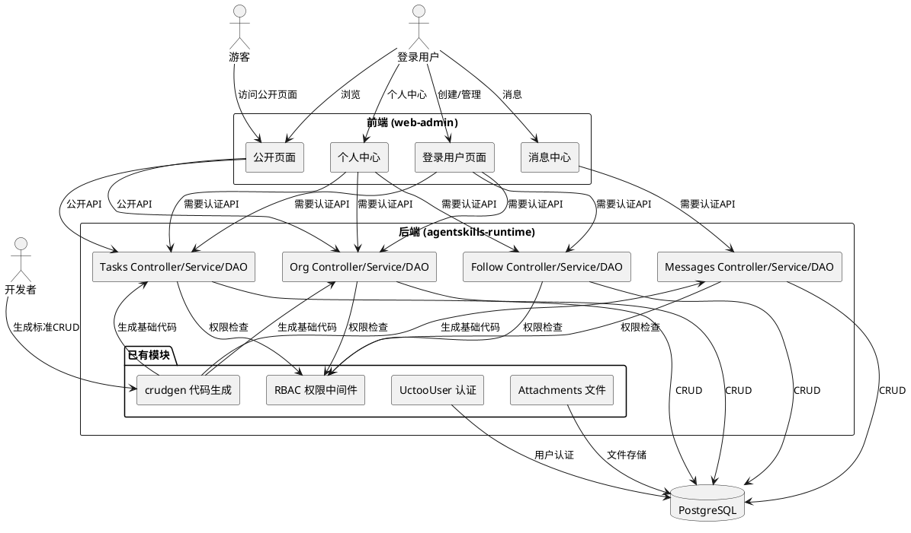
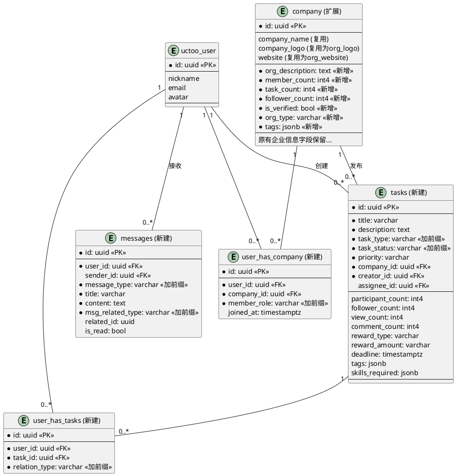
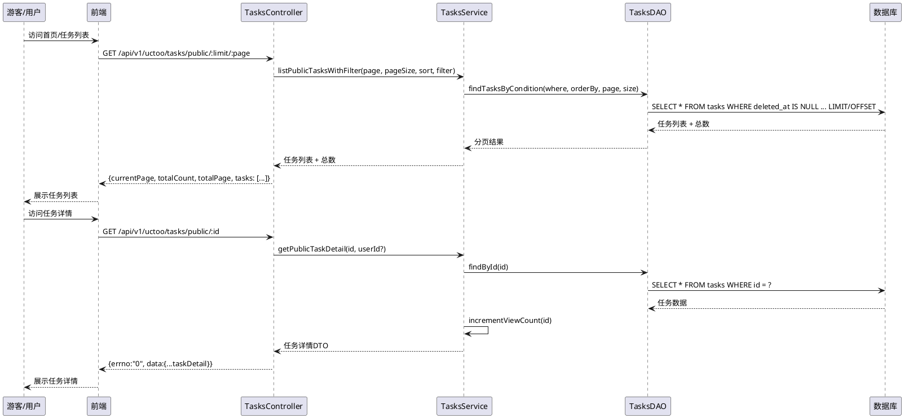
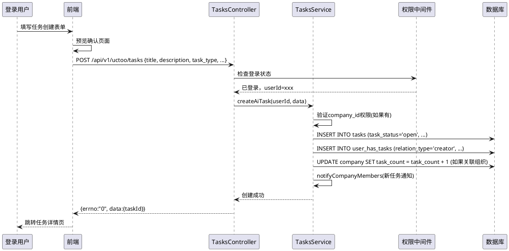

# AI Builder 平台 - 需求规格文档

## 1. 组件定位

### 1.1 核心职责

本组件负责实现 AI Builder 类 AI Agent 开发者协作平台的完整功能，包括公开的任务广场、组织展示、任务详情浏览，以及登录后的任务创建、组织管理、个人中心、消息通知等功能。平台复用现有 company 表作为组织（Org）实体，新增任务（Tasks）、用户-组织关联、用户-任务关联、消息通知等数据模型，实现一个完整的 AI Agent 任务协作和开源社区平台。

### 1.2 核心输入

1. **未登录用户访问**：浏览公开页面（任务广场、任务详情、组织列表、组织首页）
2. **登录用户操作**：创建组织、创建任务、参与任务、关注组织/任务、查看个人中心、查看消息通知
3. **用户认证信息**：通过 JWT Token 获取当前登录用户身份
4. **任务和组织数据**：用户创建的任务、组织信息，以及任务与组织的关联关系

### 1.3 核心输出

1. **公开页面数据**：任务列表、任务详情、组织列表、组织详情（无需登录）
2. **个人中心数据**：用户参与的任务、创建的组织、关注列表、个人资料
3. **消息通知**：系统消息、任务相关通知、组织相关通知
4. **创建/更新操作结果**：任务创建、组织创建、关注操作等 API 响应

### 1.4 职责边界

- **不负责**：AI Agent 运行时核心功能（由 agentskills-runtime 现有模块承担）
- **不负责**：用户注册登录认证（由现有 UctooUserAuth 模块承担）
- **不负责**：文件上传存储（由现有 attachments 模块承担）
- **不负责**：权限系统底层实现（复用现有 RBAC 权限体系）
- **负责**：AI Builder 平台特有的业务逻辑（任务、组织、关注、消息）
- **负责**：公开页面的路由配置和数据展示
- **负责**：登录用户的任务管理、组织管理、个人中心功能

---

## 2. 领域术语

**组织 (Org/Company)**
: 对应现有 company 表，表示一个开发者社区或开源组织。一个组织可以发布多个任务，拥有多个成员。公开页面可浏览组织信息，登录用户可创建和管理组织。

**任务 (Task)**
: 平台的核心实体，表示一个 AI Agent 开发任务或项目需求。任务可关联到组织，可被用户浏览、参与、关注。公开页面可浏览任务列表和详情，登录用户可创建任务。

**任务广场 (Task Marketplace)**
: 平台首页，展示热门任务、推荐组织、最新动态。未登录用户可访问，是平台的主要入口。

**关注 (Follow/Star)**
: 用户对组织或任务的关注/收藏关系，用于快速访问感兴趣的内容，相关更新会推送给关注者。

**消息通知 (Messages)**
: 系统向用户推送的通知，包括任务更新、组织动态、系统公告等。登录用户可在消息列表查看。

**个人中心 (Profile)**
: 登录用户的个人页面，展示用户基本信息、参与的任务、创建的组织、关注列表等。

**公开页面 (Public Pages)**
: 不需要登录即可访问的页面，包括首页/任务广场、任务列表、任务详情、组织列表、组织首页。这些页面的 API 在 RequirePermissionMiddleware 中配置为公开路由。

---

## 3. 角色与边界

### 3.1 核心角色

- **游客（未登录用户）**：浏览公开页面（任务广场、任务详情、组织列表、组织首页），不能进行创建、关注、参与等操作
- **登录用户**：除浏览公开页面外，可创建组织、创建任务、关注组织/任务、参与任务、查看个人中心、查看消息通知
- **组织创建者**：创建组织的用户，默认为组织管理员，可管理组织信息和组织下的任务
- **任务创建者**：创建任务的用户，可管理任务信息、确认任务完成、邀请参与者

### 3.2 外部系统

- **agentskills-runtime 后端**：提供 HTTP API 服务，包含控制器、服务、DAO、模型各层
- **web-admin 前端**：Vue 3 前端应用，提供页面展示和用户交互
- **UctooUser 模块**：用户认证和用户基础信息管理（已存在）
- **Permissions/RBAC 模块**：权限控制中间件（已存在，需扩展公开路由配置）
- **Attachments 模块**：文件上传和存储（已存在，用于组织logo、任务附件等）
- **PostgreSQL 数据库**：数据持久化存储
- **crudgen 代码生成工具**：根据数据库表结构自动生成标准CRUD模块代码（Model/DAO/Service/Controller/Route）

### 3.3 交互上下文



---

## 4. DFX约束

### 4.1 性能

- 公开页面（任务列表、组织列表）API 响应时间 ≤ 300ms
- 任务详情、组织详情 API 响应时间 ≤ 200ms
- 列表分页查询每页默认 20 条，最大支持 50 条
- 首页任务广场数据支持缓存，缓存时间 5 分钟

### 4.2 可靠性

- 公开 API 不依赖用户登录状态，即使认证服务异常也应能返回公开数据
- 创建/更新操作使用数据库事务保证数据一致性
- 软删除机制保证数据可恢复
- 分页查询必须处理边界情况（page < 1, pageSize > 最大值）

### 4.3 安全性

- 所有非公开 API 必须经过 RequirePermissionMiddleware 认证
- 公开路由必须在 isPublicRoute 方法中显式配置
- 用户只能管理自己创建的组织和任务（除非有特殊权限）
- SQL 注入防护：使用 ORM 参数化查询
- XSS 防护：前端输出时转义用户输入内容
- **禁止使用SQL保留字作为列名**：`type`、`status`等关键字必须加实体前缀（如task_type、task_status、member_role、message_type、msg_related_type）

### 4.4 可维护性

- 严格遵循 uctoo-v4 模块开发规范（Model → DAO → Service → Controller → Route 分层）
- **严格遵循V4通用模块开发流程**：数据库DDL → 执行DDL → load-db-info → crudgen生成标准CRUD → 在AutoCreateCode区域外迭代开发
- 复用现有基础设施，不重复造轮子
- 所有 CRUD 操作支持软删除
- **统一遵循 uctoo-v4 API 规范**：列表查询使用路径参数分页（`/:limit/:page`）+ Prisma 风格 `filter`/`sort` 查询参数，响应格式为 `{currentPage, totalCount, totalPage, entitys}`
- 日志记录结构化，关键操作记录 INFO 级别日志
- **crudgen生成的标准CRUD代码位于`//#region AutoCreateCode`区域，定制业务代码必须写在区域外**

### 4.5 兼容性

- 复用现有 company 表作为组织表，通过添加字段扩展而非重建表
- 数据库字段命名使用 snake_case（且避免SQL保留字），仓颉代码使用 camelCase
- API 路径遵循 `/api/v1/uctoo/{module}/...` 规范
- 前端路由遵循现有 Vue Router 配置规范，公开页面设置 `meta: { requiresAuth: false }`

### 4.6 仓颉代码开发约束

- 所有仓颉（.cj）代码必须使用 **cangjie-coder 技能** 编写
- 遵循 V4 模块结构：models → dao → services → controllers → routes
- 数据库列名使用 snake_case（task_type、task_status、member_role），仓颉代码使用 camelCase（taskType、taskStatus、memberRole）
- `type` 是仓颉保留关键字，需用反引号转义 `` `type` ``；作为列名时必须加前缀避免冲突
- String 的 trim 方法是 `trimAscii()`
- HashMap 使用 `add()` 方法而不是 `put()`
- 同包内的类默认可见，不需要显式 import，避免循环依赖
- DAO层使用setSql方法构建查询，不使用链式调用（FROM().WHERE().first()）
- 统一使用APIResult作为Service层返回类型
- 统一使用ErrorHandler处理Controller层错误

---

## 5. 核心能力

### 5.1 数据模型扩展与新建

#### 5.1.1 业务规则

1. **Company表扩展规则**：复用现有 company 表作为组织（Org）实体，新增以下字段支持 AI Builder 平台需求：
   - `org_description`: 组织简介（text类型，区别于企业信息的company_introduction）
   - `org_logo`: 组织Logo（URL，复用company_logo字段）
   - `org_website`: 组织官网（复用website字段）
   - `member_count`: 成员数量（int4，默认0）
   - `task_count`: 任务数量（int4，默认0）
   - `follower_count`: 关注者数量（int4，默认0）
   - `is_verified`: 是否认证组织（bool，默认false）
   - `org_type`: 组织类型（varchar，如"opensource"/"company"/"community"，加org_前缀避免关键字）
   - `tags`: 标签（jsonb数组）
   
   a. 验收条件：[数据库执行DDL] → [company表新增上述字段，原有企业信息字段保留兼容]

2. **Tasks表新建规则**：新建 tasks 表存储任务信息，包含字段（**status/type等关键字均加task_前缀**）：
   - `id`: UUID主键
   - `title`: 任务标题（varchar，必填）
   - `description`: 任务详细描述（text，必填）
   - `task_type`: 任务类型（varchar，如"development"/"design"/"marketing"/"other"，加task_前缀避免type关键字）
   - `task_status`: 任务状态（varchar，默认"open"：open/in_progress/completed/closed，加task_前缀避免status关键字）
   - `priority`: 优先级（varchar，默认"normal"：low/normal/high/urgent）
   - `company_id`: 关联组织ID（uuid，可选，任务可不属于任何组织）
   - `creator_id`: 创建者用户ID（uuid，必填）
   - `assignee_id`: 负责人/承接者用户ID（uuid，可选）
   - `participant_count`: 参与者数量（int4，默认0）
   - `follower_count`: 关注者数量（int4，默认0）
   - `view_count`: 浏览次数（int4，默认0）
   - `comment_count`: 评论数（int4，默认0）
   - `reward_type`: 奖励类型（varchar，可选，如"money"/"reputation"/"equity"/"none"）
   - `reward_amount`: 奖励金额/数量（varchar，可选）
   - `deadline`: 截止时间（timestamptz，可选）
   - `started_at`: 开始时间（timestamptz，可选）
   - `completed_at`: 完成时间（timestamptz，可选）
   - `tags`: 标签（jsonb数组）
   - `skills_required`: 所需技能（jsonb数组）
   - `attachments`: 附件列表（jsonb数组）
   - `extra_data`: 扩展数据（jsonb）
   - `creator`: 创建人（兼容V4规范，uuid）
   - `created_at`: 创建时间
   - `updated_at`: 更新时间
   - `deleted_at`: 删除时间（软删除）
   
   a. 验收条件：[数据库执行DDL] → [tasks表创建成功，包含所有上述字段，列名无SQL保留字]

3. **UserHasCompany表新建规则**：新建 user_has_company 表存储用户与组织的多对多关系，包含字段（**role加member_前缀**）：
   - `id`: UUID主键
   - `user_id`: 用户ID（uuid，必填）
   - `company_id`: 组织ID（uuid，必填）
   - `member_role`: 成员角色（varchar，如"owner"/"admin"/"member"/"follower"，默认"member"，加member_前缀避免role关键字）
   - `joined_at`: 加入时间（timestamptz，默认当前时间）
   - `creator`: 创建人
   - `created_at`: 创建时间
   - `updated_at`: 更新时间
   - `deleted_at`: 删除时间
   - **唯一约束**：(user_id, company_id, member_role) 组合唯一，防止重复加入
   
   a. 验收条件：[数据库执行DDL] → [user_has_company表创建成功，支持用户在同一组织拥有不同角色，列名为member_role]

4. **UserHasTasks表新建规则**：新建 user_has_tasks 表存储用户与任务的多对多关系，包含字段（**relation加relation_前缀避免与保留字冲突**）：
   - `id`: UUID主键
   - `user_id`: 用户ID（uuid，必填）
   - `task_id`: 任务ID（uuid，必填）
   - `relation_type`: 关系类型（varchar，如"creator"/"assignee"/"participant"/"follower"/"watcher"，加relation_前缀）
   - `created_at`: 创建时间
   - `updated_at`: 更新时间
   - `deleted_at`: 删除时间
   - **唯一约束**：(user_id, task_id, relation_type) 组合唯一
   
   a. 验收条件：[数据库执行DDL] → [user_has_tasks表创建成功，支持用户与任务的多种关系类型]

5. **CompanyHasTasks关联规则**：company与tasks通过tasks表的company_id字段关联（一对多关系：一个组织可有多个任务，一个任务属于一个组织），不需要新建中间表。
   
   a. 验收条件：[检查tasks表] → [tasks表包含company_id外键字段]

6. **Messages表新建规则**：新建 messages 表存储用户消息通知，包含字段（**type/related_type均加前缀**）：
   - `id`: UUID主键
   - `user_id`: 接收消息的用户ID（uuid，必填）
   - `sender_id`: 发送者ID（uuid，可选，系统消息可为空）
   - `message_type`: 消息类型（varchar，如"system"/"task"/"org"/"comment"/"follow"/"invite"，加message_前缀避免type关键字）
   - `title`: 消息标题（varchar，必填）
   - `content`: 消息内容（text，必填）
   - `msg_related_type`: 关联对象类型（varchar，可选，如"task"/"company"，加msg_前缀避免type关键字）
   - `related_id`: 关联对象ID（uuid，可选）
   - `is_read`: 是否已读（bool，默认false）
   - `read_at`: 阅读时间（timestamptz，可选）
   - `creator`: 创建人
   - `created_at`: 创建时间
   - `updated_at`: 更新时间
   - `deleted_at`: 删除时间
   
   a. 验收条件：[数据库执行DDL] → [messages表创建成功，支持多种消息类型，列名无SQL保留字]

7. **禁止项**：禁止删除现有company表的任何字段，只能新增字段扩展
   
   a. 验收条件：[对比原有company表结构] → [原有字段全部保留，仅新增字段]

8. **开发流程规则**：所有新表创建后，必须通过crudgen工具生成标准CRUD模块，定制业务逻辑在AutoCreateCode区域外开发。
   
   a. 验收条件：[执行crudgen] → [生成标准PO/DAO/Service/Controller/Route文件，定制代码位于区域外]

#### 5.1.2 数据模型关系图



### 5.2 公开页面 - 任务广场首页

#### 5.2.1 业务规则

1. **任务广场数据规则**：When 用户访问首页 `/aibuilder`（公开页面），the 系统 shall 返回首页展示数据，包括：推荐任务列表、热门组织、最新任务、统计数据（总任务数、总组织数、总用户数）
   
   a. 验收条件：[游客访问首页API] → [返回推荐任务、热门组织、统计数据，无需登录]

2. **任务列表分页规则**：When 获取任务列表，the 系统 shall 支持路径参数分页（`/:limit/:page`）、Prisma 风格 `filter` 查询参数（JSON 格式，支持 task_type, task_status, priority, company_id, tags 等过滤）、`sort` 排序参数（逗号分隔，负号降序）
   
   a. 验收条件：[GET /api/v1/uctoo/tasks/public/20/1?sort=-created_at] → [返回分页任务列表，按创建时间倒序]

3. **任务详情公开访问规则**：When 用户访问任务详情页 `/aibuilder/task/:id`，the 系统 shall 返回任务完整信息，包括创建者信息、关联组织信息、参与者数量、关注状态（登录用户）
   
   a. 验收条件：[游客访问GET /api/v1/uctoo/tasks/public/:id] → [返回任务详情，view_count+1，不要求登录]
   b. 验收条件：[登录用户访问GET /api/v1/uctoo/tasks/public/:id] → [返回任务详情，额外包含当前用户是否已关注/参与]

4. **浏览计数规则**：When 访问任务详情，the 系统 shall 将任务的 view_count + 1（同一用户短时间内重复访问不重复计数）
   
   a. 验收条件：[访问任务详情] → [view_count增加1]

5. **公开路由配置规则**：The 后端 RequirePermissionMiddleware.isPublicRoute shall 添加对 `/tasks/public` 和 `/company/public` 路径的公开访问支持
   
   a. 验收条件：[检查isPublicRoute方法] → [包含"/tasks/public"和"/company/public"路径匹配]

6. **禁止项**：禁止公开API返回敏感信息（如用户邮箱、手机号等）
   
   a. 验收条件：[检查公开API返回数据] → [不包含用户隐私字段]

#### 5.2.2 交互流程



### 5.3 公开页面 - 组织列表与详情

#### 5.3.1 业务规则

1. **组织列表公开规则**：When 用户访问组织列表，the 系统 shall 返回组织列表，支持路径参数分页（`/:limit/:page`）、Prisma 风格 `filter` 查询参数（JSON 格式，支持 org_type, is_verified, tags 等过滤）、`sort` 排序参数（逗号分隔，负号降序，支持 follower_count, task_count, created_at 等）
   
   a. 验收条件：[GET /api/v1/uctoo/company/public/20/1?sort=-follower_count] → [返回分页组织列表，按关注数倒序，无需登录]

2. **组织详情公开规则**：When 用户访问组织详情页 `/aibuilder/org/:id`，the 系统 shall 返回组织完整信息，包括组织简介、成员数、任务数、组织下的公开任务列表、组织成长数据
   
   a. 验收条件：[游客访问GET /api/v1/uctoo/company/public/:id] → [返回组织详情和组织任务列表，不要求登录]

3. **组织成长数据规则**：When 获取组织详情，the 系统 shall 返回组织成长趋势数据（如近30天新增任务数、新增成员数趋势），用于org_growth页面展示
   
   a. 验收条件：[GET /api/v1/uctoo/company/public/:id/growth] → [返回成长趋势数据]

4. **禁止项**：禁止公开API返回组织的敏感企业信息（如统一社会信用代码、法人信息、营业执照等企业认证字段）
   
   a. 验收条件：[检查公开API返回的组织数据] → [只包含org_*字段和基础信息，不包含企业认证敏感字段]

### 5.4 登录用户 - 任务创建与管理

#### 5.4.1 业务规则

1. **创建任务规则**：When 登录用户提交任务创建表单，the 系统 shall 创建新任务，设置creator_id为当前用户ID，初始task_status为"open"，并自动在user_has_tasks表中创建relation_type=creator关系记录
   
   a. 验收条件：[登录用户POST /api/v1/uctoo/tasks/add] → [任务创建成功，用户自动成为创建者]
   b. 验收条件：[未登录用户POST /api/v1/uctoo/tasks/add] → [返回401未登录错误]

2. **任务关联组织规则**：If 创建任务时指定了company_id，the 系统 shall 验证用户是否为该组织成员（拥有owner/admin/member的member_role），非成员不能以该组织名义发布任务
   
   a. 验收条件：[非组织成员创建任务指定company_id] → [返回403无权限错误]
   b. 验收条件：[组织成员创建任务指定company_id] → [任务关联到该组织，组织task_count+1]

3. **任务状态流转规则**：任务状态task_status包括 open（招募中）→ in_progress（进行中）→ completed（已完成）/ closed（已关闭）。只有任务创建者或组织管理员可以更新任务状态
   
   a. 验收条件：[创建者调用POST /api/v1/uctoo/tasks/:id/update-status] → [状态更新成功]
   b. 验收条件：[非创建者调用状态更新API] → [返回403无权限错误]

4. **任务确认创建规则**：When 用户创建任务时，系统应支持两步流程：先预览确认（task-create-confirm页面），再提交创建。确认页面API返回任务预览数据，与创建API分离
   
   a. 验收条件：[前端任务创建流程] → [支持预览确认后提交]

5. **更新任务规则**：When 登录用户更新任务信息，the 系统 shall 验证用户是否为任务创建者或关联组织管理员，只有有权限的用户才能更新
   
   a. 验收条件：[创建者更新任务] → [更新成功]
   b. 验收条件：[其他用户更新任务] → [返回403错误]

6. **我的任务列表规则**：When 登录用户访问个人中心的任务列表，the 系统 shall 返回用户相关的任务，支持按 relation_type 筛选（relation_type=creator/assignee/participant/follower），支持路径参数分页和 Prisma 风格 filter/sort
   
   a. 验收条件：[GET /api/v1/uctoo/tasks/my/20/1?relation_type=creator] → [返回当前用户创建的任务列表]

#### 5.4.2 交互流程



### 5.5 登录用户 - 组织创建与管理

#### 5.5.1 业务规则

1. **创建组织规则**：When 登录用户提交组织创建表单，the 系统 shall 在company表创建新组织记录（填写org_*相关字段），并自动在user_has_company表中创建member_role为owner的关系记录
   
   a. 验收条件：[登录用户POST /api/v1/uctoo/company/add] → [组织创建成功，用户成为owner]

2. **组织成员管理规则**：组织owner和admin可以添加/移除成员、更改member_role。普通成员只能退出组织
   
   a. 验收条件：[owner邀请成员加入] → [user_has_company表新增member_role=member记录，member_count+1]
   b. 验收条件：[成员退出组织] → [软删除user_has_company记录，member_count-1]

3. **我的组织列表规则**：When 登录用户访问个人中心的组织列表，the 系统 shall 返回用户加入/创建的组织列表，支持按 role 筛选（member_role=owner/admin/member/follower），支持路径参数分页和 Prisma 风格 filter/sort
   
   a. 验收条件：[GET /api/v1/uctoo/company/my/20/1?role=owner] → [返回当前用户创建的组织列表]

### 5.6 登录用户 - 关注功能

#### 5.6.1 业务规则

1. **关注任务规则**：When 登录用户点击关注任务按钮，the 系统 shall 在user_has_tasks表中创建relation_type=follower关系记录，并将任务follower_count+1；再次点击取消关注
   
   a. 验收条件：[POST /api/v1/uctoo/tasks/:id/toggle-follow] → [关注成功，follower_count+1]
   b. 验收条件：[已关注用户再次调用toggle-follow] → [取消关注，follower_count-1]

2. **关注组织规则**：When 登录用户点击关注组织按钮，the 系统 shall 在user_has_company表中创建member_role=follower角色记录，并将组织follower_count+1；再次点击取消关注
   
   a. 验收条件：[POST /api/v1/uctoo/company/:id/toggle-follow] → [关注成功，follower_count+1]

3. **参与任务规则**：When 登录用户点击参与任务，the 系统 shall 在user_has_tasks表中创建relation_type=participant记录，participant_count+1
   
   a. 验收条件：[POST /api/v1/uctoo/tasks/:id/join] → [参与成功]

4. **加入组织规则**：When 登录用户点击加入组织，the 系统 shall 在user_has_company表中创建member_role=member记录，member_count+1（owner不能退出组织）
   
   a. 验收条件：[POST /api/v1/uctoo/company/:id/join] → [加入成功]

5. **我的关注列表规则**：When 登录用户访问个人中心关注页面（/aibuilder/follows），the 系统 shall 返回用户关注的任务和组织列表
   
   a. 验收条件：[GET /api/v1/uctoo/follows/my] → [返回关注的任务和组织]

### 5.7 登录用户 - 消息通知

#### 5.7.1 业务规则

1. **消息列表规则**：When 登录用户访问消息列表页面（/aibuilder/messages），the 系统 shall 返回当前用户的消息列表，支持按 message_type 筛选（通过 filter 参数）、路径参数分页，按 created_at 时间倒序排列
   
   a. 验收条件：[GET /api/v1/uctoo/messages/my/20/1?filter={"message_type":"task"}] → [返回消息列表]

2. **未读消息计数规则**：The 系统 shall 提供API获取当前用户未读消息数量，用于前端显示红点/角标
   
   a. 验收条件：[GET /api/v1/uctoo/messages/unread-count] → [返回{count: N}]

3. **标记已读规则**：When 用户查看消息，the 系统 shall 支持单条标记已读和全部标记已读
   
   a. 验收条件：[POST /api/v1/uctoo/messages/:id/mark-read] → [单条消息标记已读]
   b. 验收条件：[POST /api/v1/uctoo/messages/mark-all-read] → [所有消息标记已读]

4. **消息触发规则**：以下事件应触发消息通知：
   - 用户创建的任务有新参与者加入
   - 用户关注的任务有task_status更新
   - 用户关注的组织发布新任务
   - 用户被邀请加入组织
   - 系统公告
   
   a. 验收条件：[任务状态更新] → [任务关注者收到消息通知]

### 5.8 登录用户 - 个人中心

#### 5.8.1 业务规则

1. **个人资料规则**：When 登录用户访问个人中心页面（/aibuilder/profile），the 系统 shall 返回用户基本信息（昵称、头像、简介）、统计数据（创建任务数、参与任务数、关注数、粉丝数）
   
   a. 验收条件：[GET /api/v1/uctoo/user/profile] → [返回个人资料和统计数据]

2. **更新个人资料规则**：When 登录用户更新个人简介、头像等信息，the 系统 shall 更新uctoo_user表对应用户记录
   
   a. 验收条件：[POST /api/v1/uctoo/user/profile/edit] → [个人资料更新成功]

3. **个人中心聚合数据规则**：个人中心页面应聚合展示：我创建的任务、我参与的任务、我创建/加入的组织、我的关注列表
   
   a. 验收条件：[访问个人中心] → [展示各类聚合数据摘要]

### 5.9 前端页面与路由

#### 5.9.1 业务规则

1. **前端公开路由规则**：前端Vue Router中为AI Builder公开页面配置路由，设置`meta: { requiresAuth: false }`，路由路径包括：
   - `/aibuilder` - 首页/任务广场（task_index）
   - `/aibuilder/tasks` - 任务列表
   - `/aibuilder/task/:id` - 任务详情（task-detail）
   - `/aibuilder/orgs` - 组织列表（company-index）
   - `/aibuilder/org/:id` - 组织详情（org_index）
   - `/aibuilder/org/:id/growth` - 组织成长（org_growth）
   
   a. 验收条件：[检查前端路由配置] → [上述路由配置了requiresAuth: false]

2. **前端需登录路由规则**：需要登录的页面配置默认的requiresAuth: true，路由路径包括：
   - `/aibuilder/tasks/create` - 创建任务（tasks-create）
   - `/aibuilder/tasks/create/confirm` - 创建任务确认（task-create-confirm）
   - `/aibuilder/orgs/create` - 创建组织
   - `/aibuilder/profile` - 个人中心（profile）
   - `/aibuilder/messages` - 消息列表（messageslist）
   - `/aibuilder/follows` - 我的关注（guanzhu）
   - `/aibuilder/tasks/my` - 我的任务（opencangjie-tasks、tasks-UMI-ORM等分类展示）
   
   a. 验收条件：[未登录用户访问这些路由] → [跳转到登录页]

3. **页面布局规则**：公开页面使用简洁的公开布局（类似landing page风格，PublicLayout），不需要后台管理侧边栏；登录后的页面可使用现有DefaultLayout或新建简洁布局
   
   a. 验收条件：[访问公开页面] → [展示公开页面布局，无管理后台侧边栏]

4. **前端API调用规范（UMI同构规范）**：前端API调用严格遵循UMI全栈模型同构规范，使用Pinia-ORM模型的`useAxiosRepo(table_name).api().method()`模式进行，模型文件位于`src/store/models/uctoo/`目录，禁止创建独立的api/*.ts文件。
   
   a. 验收条件：[检查前端代码] → [所有API调用通过useAxiosRepo模式进行，无独立api/aibuilder.ts文件，模型包含标准CRUD方法和Human-Code定制方法]

---

## 6. 数据约束

### 6.1 Tasks表字段约束

1. **title**: 必填，varchar(200)，任务标题，1-200字符
2. **description**: 必填，text类型，任务详细描述
3. **task_type**: 必填，varchar(20)，枚举值：development/design/marketing/other（注意列名为task_type，非type）
4. **task_status**: 必填，varchar(20)，默认"open"，枚举值：open/in_progress/completed/closed（注意列名为task_status，非status）
5. **priority**: 必填，varchar(20)，默认"normal"，枚举值：low/normal/high/urgent
6. **company_id**: 可选，uuid，外键关联company.id
7. **creator_id**: 必填，uuid，外键关联uctoo_user.id
8. **tags**: jsonb数组，存储标签字符串，如["仓颉", "Agent", "开源"]
9. **skills_required**: jsonb数组，存储所需技能字符串

### 6.2 UserHasCompany表字段约束

1. **user_id**: 必填，uuid
2. **company_id**: 必填，uuid
3. **member_role**: 必填，varchar(20)，枚举值：owner/admin/member/follower（注意列名为member_role，非role）
4. **唯一约束**: (user_id, company_id, member_role) 联合唯一

### 6.3 UserHasTasks表字段约束

1. **user_id**: 必填，uuid
2. **task_id**: 必填，uuid
3. **relation_type**: 必填，varchar(20)，枚举值：creator/assignee/participant/follower/watcher
4. **唯一约束**: (user_id, task_id, relation_type) 联合唯一

### 6.4 Messages表字段约束

1. **user_id**: 必填，uuid，接收者ID
2. **message_type**: 必填，varchar(20)，枚举值：system/task/org/comment/follow/invite（注意列名为message_type，非type）
3. **title**: 必填，varchar(200)
4. **content**: 必填，text
5. **msg_related_type**: 可选，varchar(20)，枚举值：task/company（注意列名为msg_related_type，非type/related_type）
6. **is_read**: bool，默认false

### 6.5 API响应格式

所有API严格遵循 uctoo-v4 API 规范，分为标准 CRUD 响应和错误响应两种格式。

**标准列表查询响应（成功）**：
```json
{
  "currentPage": 1,
  "totalCount": 100,
  "totalPage": 10,
  "tasks": []
}
```
- 列表字段名与实体名一致：tasks / companys / messagess（直接加"s"，不做英文复数变化）
- 分页参数通过路径参数传递：`/:limit/:page`
- 过滤参数通过 `filter` 查询参数传递（JSON 格式，Prisma 风格）
- 排序参数通过 `sort` 查询参数传递（逗号分隔，负号表示降序）

**单条查询/创建/更新响应（成功）**：直接返回实体对象的 JSON 数据。

**错误响应**：
```json
{
  "errno": "错误码",
  "errmsg": "错误描述"
}
```

**API 路径规范**：
- 标准 CRUD：`/api/v1/uctoo/{entity}/:limit/:page`（列表）、`/api/v1/uctoo/{entity}/:id`（详情）
- 定制列表接口：`/api/v1/uctoo/{entity}/{subpath}/:limit/:page`（同样使用路径参数分页）
- 示例：
  - 公开任务列表：`GET /api/v1/uctoo/tasks/public/20/1?sort=-created_at&filter={"task_type":"development"}`
  - 公开组织列表：`GET /api/v1/uctoo/company/public/20/1?sort=-follower_count`
  - 我的任务列表：`GET /api/v1/uctoo/tasks/my/20/1?relation_type=creator`
  - 我的消息列表：`GET /api/v1/uctoo/messages/my/20/1?filter={"message_type":"task"}`

---

## 7. 需求追踪矩阵

| 需求ID | 优先级 | 需求标题 |
|--------|--------|---------|
| REQ-AI-01 | P0 | 数据模型扩展与新建（company扩展、tasks/user_has_company/user_has_tasks/messages新建，遵循V4通用模块开发流程） |
| REQ-AI-02 | P0 | 公开页面 - 任务广场首页与任务列表 |
| REQ-AI-03 | P0 | 公开页面 - 任务详情浏览 |
| REQ-AI-04 | P0 | 公开页面 - 组织列表与组织详情 |
| REQ-AI-05 | P0 | 登录用户 - 任务创建与管理 |
| REQ-AI-06 | P0 | 登录用户 - 组织创建与管理、关注/加入 |
| REQ-AI-07 | P1 | 登录用户 - 关注功能（任务/组织）与参与 |
| REQ-AI-08 | P1 | 登录用户 - 消息通知 |
| REQ-AI-09 | P1 | 登录用户 - 个人中心 |
| REQ-AI-10 | P0 | 前端页面与路由配置 |
| REQ-AI-11 | P0 | 后端公开路由配置与V4分层架构实现 |

---

## 8. EARS 格式需求清单

### REQ-AI-01：数据模型扩展与新建 [P0]

**Event-Driven**：When 执行数据库初始化，the 系统 shall 扩展company表新增org相关字段，并新建tasks、user_has_company、user_has_tasks、messages表，列名不得使用SQL保留字。

**Ubiquitous**：The company表原有企业信息字段 shall 全部保留，仅新增org_前缀字段用于AI Builder平台功能。

**Event-Driven**：When 创建任务，the 系统 shall 自动维护user_has_tasks表中的creator关系和company表的task_count计数。

**Event-Driven**：When 用户关注/取消关注任务或组织，the 系统 shall 自动维护follower_count计数。

**Event-Driven**：When 数据库表结构变更完成，开发者 shall 通过crudgen生成标准CRUD模块，再在AutoCreateCode区域外进行定制开发。

**Unwanted Behaviour**：If 删除company表原有字段，the 系统 shall 视此为严重错误并回滚。

**Unwanted Behaviour**：If 使用type/status/role等SQL保留字作为列名而不加前缀，the 系统 shall 视此为规范违反。

### REQ-AI-02：公开页面 - 任务广场首页与任务列表 [P0]

**Ubiquitous**：The 任务广场和任务列表API shall 不需要登录即可访问。

**Event-Driven**：When 用户访问GET /api/v1/uctoo/tasks/public/20/1，the 系统 shall 返回分页任务列表，支持通过 filter 参数按 task_type/task_status/priority 等字段过滤，通过 sort 参数排序。

**Ubiquitous**：The 公开API shall 不返回用户隐私信息。

**Unwanted Behaviour**：If 未登录用户访问需要认证的任务API（如创建任务），the 系统 shall 返回401未登录错误。

### REQ-AI-03：公开页面 - 任务详情浏览 [P0]

**Event-Driven**：When 用户访问GET /api/v1/uctoo/tasks/public/:id，the 系统 shall 返回任务完整详情，并将view_count + 1。

**Event-Driven**：When 登录用户访问任务详情，the 系统 shall 额外返回当前用户与该任务的关系（是否已关注/参与）。

### REQ-AI-04：公开页面 - 组织列表与组织详情 [P0]

**Ubiquitous**：The 组织列表和组织详情API shall 不需要登录即可访问。

**Event-Driven**：When 用户访问GET /api/v1/uctoo/company/public/:id，the 系统 shall 返回组织公开信息和该组织下的公开任务列表。

**Unwanted Behaviour**：If 公开API返回企业认证敏感字段（social_credit_code、legal_representative等），the 系统 shall 视此为安全漏洞并修复。

### REQ-AI-05：登录用户 - 任务创建与管理 [P0]

**Event-Driven**：When 登录用户POST /api/v1/uctoo/tasks/add创建任务，the 系统 shall 创建任务记录，设置creator_id为当前用户，初始task_status为"open"，并创建relation_type=creator的关系记录。

**Unwanted Behaviour**：If 非组织成员尝试以该组织名义发布任务，the 系统 shall 返回403无权限错误。

**Event-Driven**：When 任务创建者或组织管理员更新任务task_status，the 系统 shall 更新tasks表task_status字段，并在状态变更时通知任务关注者。

### REQ-AI-06：登录用户 - 组织创建与管理 [P0]

**Event-Driven**：When 登录用户POST /api/v1/uctoo/company/add创建组织，the 系统 shall 在company表创建记录，并在user_has_company表创建member_role=owner的关系记录。

### REQ-AI-07：登录用户 - 关注与参与功能 [P1]

**Event-Driven**：When 登录用户调用POST /api/v1/uctoo/tasks/:id/toggle-follow，the 系统 shall 切换关注状态（关注/取消关注），并更新follower_count。

**Event-Driven**：When 登录用户调用POST /api/v1/uctoo/company/:id/toggle-follow，the 系统 shall 切换组织关注状态，并更新follower_count。

**Event-Driven**：When 登录用户调用POST /api/v1/uctoo/tasks/:id/join，the 系统 shall 创建participant关系记录，更新participant_count。

### REQ-AI-08：登录用户 - 消息通知 [P1]

**Event-Driven**：When 发生任务task_status更新、组织发布新任务等事件，the 系统 shall 向相关用户发送message_type对应的消息通知。

**Event-Driven**：When 用户调用POST /api/v1/uctoo/messages/:id/mark-read，the 系统 shall 将该消息标记为已读。

**Ubiquitous**：The 系统 shall 提供未读消息计数API供前端显示角标。

### REQ-AI-09：登录用户 - 个人中心 [P1]

**Event-Driven**：When 登录用户访问GET /api/v1/uctoo/user/profile，the 系统 shall 返回用户基本信息、统计数据和聚合数据摘要。

**Event-Driven**：When 登录用户POST /api/v1/uctoo/user/profile/edit更新资料，the 系统 shall 更新用户记录。

### REQ-AI-10：前端页面与路由配置 [P0]

**Ubiquitous**：The 前端公开页面路由 shall 设置meta: { requiresAuth: false }并使用PublicLayout布局。

**Ubiquitous**：The 前端需登录页面路由 shall 配置权限守卫，未登录用户访问时跳转登录页。

**Ubiquitous**：The AI Builder相关API调用 shall 严格遵循UMI同构规范，通过Pinia-ORM模型的`useAxiosRepo(table_name).api().method()`模式进行，禁止创建独立的api/*.ts文件。

### REQ-AI-11：后端公开路由配置与V4分层架构 [P0]

**Event-Driven**：When 配置后端路由，the RequirePermissionMiddleware.isPublicRoute方法 shall 添加对/tasks/public和/company/public路径的公开访问支持。

**Ubiquitous**：The 后端模块 shall 遵循uctoo-v4分层架构规范（Model → DAO → Service → Controller → Route），crudgen生成标准CRUD，定制代码在AutoCreateCode区域外。

### REQ-AI-12：积分系统 - 账户余额 [P0]

**Ubiquitous**：The 系统 shall 为每个用户（复用user_score表，total_score字段，from_umodel固定为'uctoo_user'）和每个公司（company.points_balance）维护积分余额账户。不修改uctoo_user表结构。

**Event-Driven**：When 查询用户/公司信息时，the 系统 shall 返回当前积分余额。用户首次获得积分时如无user_score记录，系统自动创建。

**Ubiquitous**：The 所有积分变动 shall 通过point_transactions表记录流水，包含变动前余额、变动后余额、交易类型、关联任务等信息。

**Unwanted Behaviour**：If 积分余额不足以支付冻结金额，the 系统 shall 拒绝发布任务并返回余额不足错误。

### REQ-AI-13：积分系统 - 任务积分冻结与单人结算 [P0]

**Event-Driven**：When 公司发布设置了reward_points的任务，the 系统 shall 从公司积分余额中冻结对应积分数（points_frozen = reward_points），并记录freeze类型的积分流水。

**Event-Driven**：When 单人任务（max_participants=1）的承接者提交成果且公司审核通过（review_status=approved），the 系统 shall 将冻结积分结算给承接用户：公司账户扣除积分（settle_pay类型流水），用户账户增加积分（settle类型流水），任务状态更新为settled。

**Event-Driven**：When 公司审核拒绝承接者提交的成果，the 系统 shall 不进行积分结算，任务保持in_progress状态，承接者可重新提交。

### REQ-AI-14：积分系统 - 多人任务分配与结算 [P1]

**Ubiquitous**：The 多人任务（max_participants > 1）shall 支持多个用户同时承接，每个承接者在user_has_tasks中有独立记录。

**Event-Driven**：When 多人任务的所有承接者都已提交成果且公司逐个审核完成（部分通过/部分拒绝），the 系统 shall 允许公司设置每个通过审核用户的积分分配比例（allocation_ratio），分配比例总和不超过100%。

**Event-Driven**：When 公司确认结算分配方案，the 系统 shall 按照分配比例将积分转给各用户：points_earned = reward_points × allocation_ratio / 100，未分配的积分退还公司，并在task_settlements表记录结算明细。

### REQ-AI-15：积分系统 - 超期退还与定时任务 [P0]

**Event-Driven**：When 任务的accept_deadline（承接截止时间）已过且任务状态仍为open（无人承接），the 系统 shall 自动将冻结积分退还公司账户（refund类型流水），任务状态更新为expired。

**Event-Driven**：When 超期退还发生，the 系统 shall 使用crontab计划任务（每小时执行一次）自动检查并处理，任务处理器注册为aibuilder://task-expired-refund。

**Ubiquitous**：The 积分退还 shall 记录refund类型的积分流水，points_refunded字段更新为退还数量，settlement_status更新为refunded。

### REQ-AI-16：积分系统 - 任务承接状态机 [P0]

**Ubiquitous**：The 任务状态（task_status）shall 遵循以下状态流转：open(待承接) → in_progress(进行中，有人承接) → submitted(已提交成果) → reviewing(审核中) → completed(已完成/已结算)。

**Ubiquitous**：The 用户承接状态（user_has_tasks.join_status）shall 遵循：applied(申请) → accepted(已接受) → submitted(已提交) → approved(审核通过)/rejected(审核拒绝) → completed(已结算)。

**Event-Driven**：When 第一个用户成功承接任务，the 系统 shall 将任务状态从open更新为in_progress。

**Event-Driven**：When 承接人数达到max_participants，the 系统 shall 不再接受新的承接申请。

**Event-Driven**：When 承接者提交成果，the join_status shall 更新为submitted，任务task_status更新为reviewing。

**Event-Driven**：When 公司审核通过所有承接者（单人任务）或完成多人分配结算，the 任务task_status更新为completed，settlement_status更新为settled。
