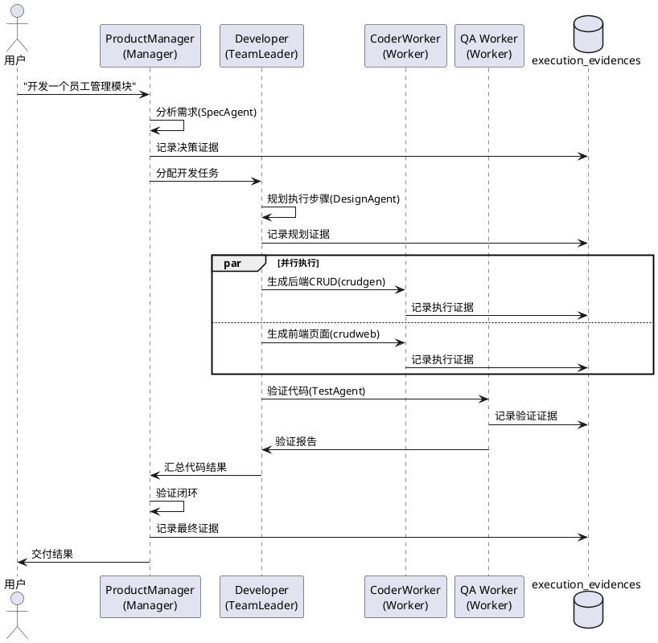

# AI驱动开发全流程Demo场景 - 技术设计文档

## 一、需求与存量功能关系分析

### 1.1 已实现功能

| 需求功能 | 存量功能 | 代码位置 | 匹配度 |
|---------|---------|---------|--------|
| Agent框架 | CangjieMagic @agent DSL | src/dsl/ | 75% |
| 代码生成工具 | crudgen/crudweb/loaddbinfo | src/app/tools/ | 100% |
| cangjie-coder | 代码生成技能 | skills/cangjie-coder/ | 75% |
| WebSocket | 实时通信 | src/app/ | 100% |
| RESTful API | API层 | src/app/controllers/ | 100% |

### 1.2 需要新增的功能

| 需求功能 | 说明 | 扩展方向 |
|---------|------|---------|
| Demo场景配置 | agent_teams.yaml定义Demo团队 | 新增demo-team.yaml |
| Demo入口API | 一键启动Demo的API | 新增DemoController |
| Demo前端页面 | Demo展示界面 | 新增Vue页面 |
| 执行证据展示 | Demo执行过程的可视化 | 复用execution-audit |

## 二、增量设计方案

### 2.1 实现模型

#### 2.1.1 Demo团队配置

```yaml
# demo-team.yaml
team:
  name: "ai-dev-team"
  description: "AI驱动开发全流程Demo团队"
  manager:
    agent_type: "product-manager"
    skills: ["sdd-spec", "requirement-analysis"]
    model: "deepseek"
  leaders:
    - agent_type: "developer"
      skills: ["sdd-design", "sdd-task", "code-generation"]
      workers:
        - agent_type: "coder-worker"
          skills: ["crud-generator", "cangjie-coder"]
        - agent_type: "qa-worker"
          skills: ["sdd-test", "code-gen-verifier"]
```

#### 2.1.2 Demo执行流程



### 2.2 接口设计

**Demo启动API**：
```
POST /api/v1/uctoo/demo/ai-dev/start
```

- **业务说明**: 一键启动AI驱动开发Demo
- **请求体**:
  ```json
  {
    "requirement": "开发一个员工管理模块",
    "database": "uctoo",
    "table_name": "employee"
  }
  ```
- **响应**: 团队ID和执行状态

**Demo状态查询API**：
```
GET /api/v1/uctoo/demo/ai-dev/status/:teamId
```

**Demo证据查询API**：
```
GET /api/v1/uctoo/demo/ai-dev/evidences/:sessionId
```

### 2.3 数据模型

本工程不涉及新的数据库表，复用agent_teams、execution_evidences、orchestration_plans等已有表。