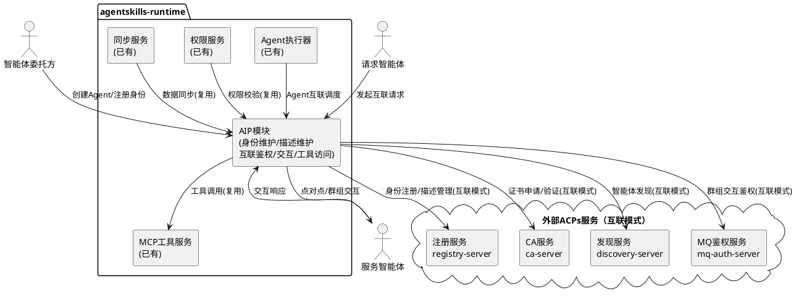
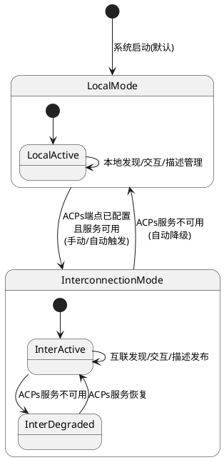
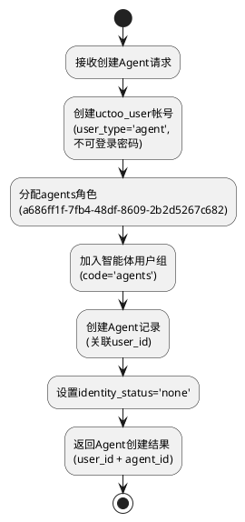
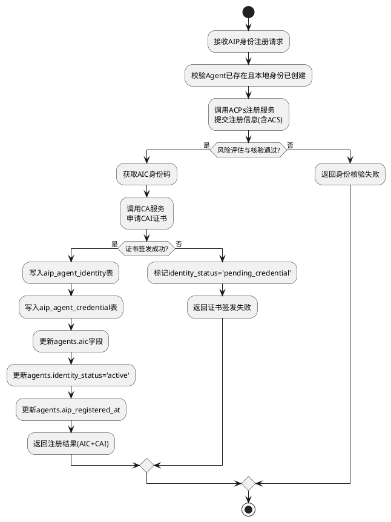
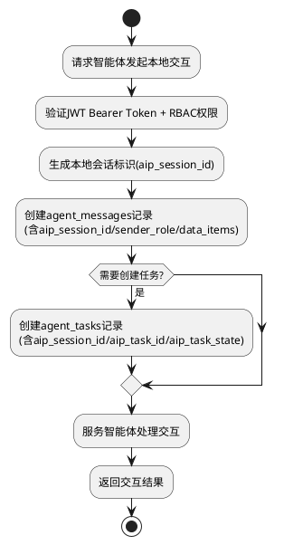
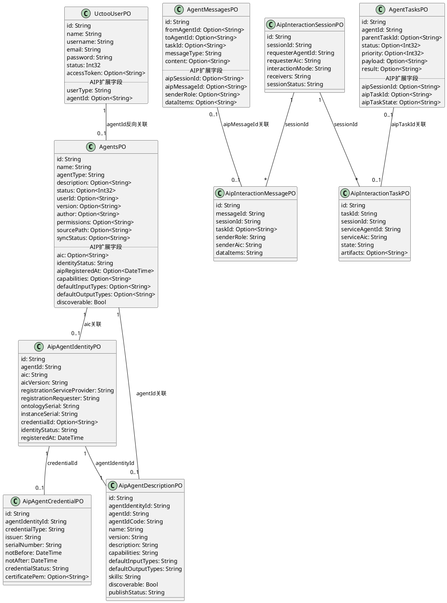

# 智能体互联国家标准（GB/Z 185）实现技术设计文档

## 文档信息
- **项目名称**: agentskills-runtime 智能体互联国家标准增量实现
- **版本**: 1.0.0
- **创建日期**: 2026-07-08
- **作者**: spec-design-agent
- **状态**: 待实现
- **关联需求**: spec.md v1.2.0
- **参考标准**: GB/Z 185.1~185.7-2026《人工智能 智能体互联》
- **参考实现**: ACPs-community v2.1.0

---

# 一、需求与存量功能关系分析

## 1.1 需求功能与存量功能对比

### 1.1.1 已实现功能

| 需求功能 | 存量功能 | 代码位置 | 匹配度 |
|---------|---------|---------|--------|
| Agent 身份标识（本地模式） | agents.id + agents.user_id 关联 uctoo_user 标识 Agent | `models/uctoo/AgentsPO.cj:26,56` `models/uctoo/UctooUserPO.cj:29` | 75% |
| Agent 认证（本地模式 JWT） | uctoo_user.access_token + JWT Bearer Token 认证 | `models/uctoo/UctooUserPO.cj:77-81` | 75% |
| Agent 描述存储 | agents 表 name/description/version/author 字段 | `models/uctoo/AgentsPO.cj:28-92` | 50% |
| Agent 技能存储 | agent_skills 表完整技能信息 | `models/uctoo/AgentSkillsPO.cj:24-182` | 50% |
| Agent 消息传递 | agent_messages 表 from_agent_id/to_agent_id/content | `models/uctoo/AgentMessagesPO.cj:24-56` | 50% |
| Agent 任务管理 | agent_tasks 表 status/priority/payload/result | `models/uctoo/AgentTasksPO.cj:24-62` | 50% |
| RBAC 权限体系 | uctoo_role + user_has_roles + user_group + user_has_group | `models/uctoo/UctooRolePO.cj` `models/uctoo/UserHasRolesPO.cj` | 75% |
| MCP 工具调用体系 | 现有 MCP 工具服务 | `src/app/services/tool/` `src/mcp/` | 75% |
| 文件系统-数据库双向同步 | SyncManager + AOP拦截器 + 变更检测器 | `src/app/services/sync/` | 50% |
| Agent CRUD 模块 | AgentsDAO/AgentsService/AgentsController 完整 CRUD | `src/app/dao/uctoo/AgentsDAO.cj` `src/app/services/uctoo/` | 100% |
| AgentSkills CRUD 模块 | AgentSkillsDAO/AgentSkillsService/AgentSkillsController | `src/app/dao/uctoo/AgentSkillsDAO.cj` | 100% |
| AgentMessages CRUD 模块 | AgentMessagesDAO/AgentMessagesService/AgentMessagesController | `src/app/dao/uctoo/AgentMessagesDAO.cj` | 100% |
| AgentTasks CRUD 模块 | AgentTasksDAO/AgentTasksService/AgentTasksController | `src/app/dao/uctoo/AgentTasksDAO.cj` | 100% |

### 1.1.2 需要扩展的功能

| 需求功能 | 存量功能 | 差异说明 | 扩展方向 |
|---------|---------|---------|---------|
| 智能体身份码（AIC） | agents 表无 aic 字段 | 本地模式无需 AIC，互联模式需要 AIC OID 格式身份码 | agents 表新增 aic/identity_status/aip_registered_at 字段 |
| 智能体用户帐号自动创建 | 创建 Agent 时未自动创建 uctoo_user 帐号 | 现有流程中 Agent 与 uctoo_user 是手动关联，无自动创建机制 | AgentService.create() 中增加自动创建 uctoo_user 帐号逻辑 |
| 智能体无密码自动登录 | 现有登录流程要求用户名+密码 | Agent 帐号需要跳过密码验证，直接生成 JWT token | 新增 AgentAuthService，实现 agent_auto 认证类型 |
| 人类用户限制使用 agents 帐号 | 现有登录接口不区分 user_type | 需要拦截 user_type='agent' 的密码登录请求 | 登录接口增加 user_type 检查 |
| 智能体 ACS 描述字段 | agents 表缺少 capabilities/default_input_types/default_output_types/discoverable 字段 | 现有 agents 表无国标 ACS 标准字段 | agents 表新增 4 个 ACS 标准字段 |
| 智能体 AIP 会话管理 | agent_messages 无 aip_session_id 字段 | 现有消息无会话概念，无法关联同一交互过程的消息 | agent_messages 表新增 aip_session_id/aip_message_id/sender_role/data_items 字段 |
| 智能体 AIP 任务状态 | agent_tasks 无 aip_task_state 字段 | 现有任务状态为数字（0/1/2/3），与国标状态枚举不匹配 | agent_tasks 表新增 aip_session_id/aip_task_id/aip_task_state 字段 |
| uctoo_user 智能体标识 | uctoo_user 无 user_type/agent_id 字段 | 无法区分人类用户和智能体帐号 | uctoo_user 表新增 user_type/agent_id 字段 |
| 智能体用户组 | user_group 表无 agents 用户组 | Agent 帐号未自动加入用户组 | 新建 agents 用户组，Agent 创建时自动加入 |
| 本地智能体发现 | 现有 Agent 列表查询仅支持基础 CRUD | 缺少按技能/能力/描述匹配的发现查询 | 扩展 AgentsService，增加本地发现查询方法 |
| 工具描述对齐 GB/Z 185.7 | 现有 MCP 工具描述格式与国标不完全对齐 | MCP 工具描述缺少国标标准字段 | 扩展 MCP 工具描述，增加国标标准字段映射 |

### 1.1.3 需要新增的功能或接口

#### 身份管理模块（互联模式）
- AIP 身份注册服务：对接 ACPs registry-server，完成 AIC 分配、身份核验、身份注册/更新/锁定/解锁/注销
- AIP 凭证管理服务：对接 ACPs ca-server，完成 CAI 证书签发、更新、吊销
- mTLS 双向认证：互联交互前的身份鉴别
- aip_agent_identity 表：存储完整 AIC 注册数据
- aip_agent_credential 表：存储 CAI 证书数据

#### 描述管理模块（互联模式）
- AIP 描述注册服务：描述注册到 ACPs 注册服务
- AIP 描述发布服务：描述发布到 ACPs 发现服务
- aip_agent_description 表：存储 GB/Z 185.4 完整标准化描述

#### 发现模块（互联模式）
- AIP 发现服务：对接 ACPs discovery-server，跨系统智能体发现
- 发现结果缓存：aip_discovery_cache 表缓存互联发现结果
- 自然语言查询支持

#### 交互模块（互联模式）
- AIP 交互会话管理：aip_interaction_session 表
- AIP 交互任务管理：aip_interaction_task 表（GB/Z 185.6 标准任务结构）
- AIP 交互消息管理：aip_interaction_message 表（GB/Z 185.6 标准消息结构）
- MQ 消息分发对接：群组交互通过 MQ 实现

#### 配置管理模块
- AIP 模式自动判断：根据 ACPs 服务端点配置自动判断运行模式
- AIP 服务配置管理：aip_service_config 表存储 ACPs 各服务端点
- 模式切换机制：本地模式 ↔ 互联模式运行时切换
- 健康检查接口：本地模式和互联模式健康检查

#### AIP API 接口
- 本地模式 API：/api/v1/uctoo/aip/ 路径下的本地发现、本地交互、描述管理接口
- 互联模式 API：/api/v1/uctoo/aip/ 路径下的身份注册、描述发布、互联发现、互联交互接口

## 1.2 存量功能详细分析

### 1.2.1 Agents 模块

**接口契约**：
- AgentsDAO：标准 CRUD（insert/findById/update/softDeleteById/findAllPage/listAll/countAll）
- AgentsService：create/update/delete/getById/list，接受 AgentsPO 实体和 creatorId 参数
- AgentsController：标准 RESTful 路由 `/api/v1/uctoo/agents/`

**业务规则**：
- Agent 创建时通过 userId 字段关联 uctoo_user，但无自动创建用户帐号机制
- Agent 状态通过 status 字段管理（0:停用, 1:运行, 2:暂停）
- Agent 通过 source_path 字段支持文件系统-数据库双向同步

**扩展点**：
- AgentsService.create() 方法可扩展自动创建 uctoo_user 帐号逻辑
- AgentsPO 可通过新增 @ORMField 扩展 AIP 标准字段
- AgentsDAO 可通过添加自定义方法扩展本地发现查询

**约束**：
- AgentsPO 位于 AutoCreateCode 区域，新增字段需在 crudgen 重新生成后手动补充
- agents 表主键为 UUID，由数据库自动生成

### 1.2.2 AgentSkills 模块

**接口契约**：
- AgentSkillsDAO：标准 CRUD + 按 agent_id 查询技能列表
- AgentSkillsService：标准 CRUD + 按 agentId 查询
- AgentSkillsController：标准 RESTful 路由 `/api/v1/uctoo/agent_skills/`

**业务规则**：
- 技能信息包含 name/description/tags/parameters 等丰富字段
- 技能与 Agent 的关联通过 agent_id 外键（但当前 AgentSkillsPO 中无 agent_id 字段，关联关系在 agents 表的 tools 字段或通过中间表维护）
- 技能描述与 GB/Z 185.4 ACS skills 格式存在映射关系

**扩展点**：
- AgentSkillsPO 可扩展国标标准字段（skillId/skillName/skillDescription/inputTypes/outputTypes）
- 可新增 AgentSkillAcsMapper 实现技能信息与 ACS skills 格式双向转换

**约束**：
- agent_skills 表字段已非常丰富（50+字段），新增字段需谨慎评估必要性

### 1.2.3 AgentMessages 模块

**接口契约**：
- AgentMessagesDAO：标准 CRUD
- AgentMessagesService：标准 CRUD
- AgentMessagesController：标准 RESTful 路由 `/api/v1/uctoo/agent_messages/`

**业务规则**：
- 消息通过 from_agent_id/to_agent_id 实现点对点传递
- 消息类型通过 message_type 字段区分
- 消息内容通过 content 字段存储（JSON 格式）

**扩展点**：
- AgentMessagesPO 可新增 aip_session_id/aip_message_id/sender_role/data_items 字段
- AgentMessagesDAO 可新增按 aip_session_id 查询消息列表的方法
- AgentMessagesService 可扩展 AIP 消息创建逻辑

**约束**：
- 现有消息结构简单，扩展字段需保持向后兼容
- 消息无会话概念，aip_session_id 为可选字段

### 1.2.4 AgentTasks 模块

**接口契约**：
- AgentTasksDAO：标准 CRUD
- AgentTasksService：标准 CRUD
- AgentTasksController：标准 RESTful 路由 `/api/v1/uctoo/agent_tasks/`

**业务规则**：
- 任务通过 agent_id 关联执行 Agent
- 任务状态为数字（0:待处理, 1:进行中, 2:完成, 3:失败）
- 任务支持父子关系（parent_task_id）

**扩展点**：
- AgentTasksPO 可新增 aip_session_id/aip_task_id/aip_task_state 字段
- AgentTasksDAO 可新增按 aip_session_id 查询任务列表的方法

**约束**：
- 任务状态数字与国标状态枚举不匹配，aip_task_state 为独立字段

### 1.2.5 UctooUser 模块

**接口契约**：
- UctooUserDAO：标准 CRUD + 登录查询
- UctooUserService：标准 CRUD + 认证逻辑
- UctooUserController：标准 RESTful 路由 `/api/v1/uctoo/uctoo_user/`

**业务规则**：
- 用户认证通过 username+password 登录，获取 JWT access_token
- 用户状态通过 status 字段管理
- 用户与角色关联通过 user_has_roles 表

**扩展点**：
- UctooUserPO 可新增 user_type/agent_id 字段
- UctooUserService 可扩展 Agent 自动登录逻辑
- 登录接口可增加 user_type 检查

**约束**：
- uctoo_user 表是核心用户表，变更需确保向后兼容
- 现有 JWT 认证流程不可破坏

### 1.2.6 RBAC 权限体系

**接口契约**：
- uctoo_role 表：角色定义，已有 agents 角色（id: a686ff1f-7fb4-48df-8609-2b2d5267c682）
- user_has_roles 表：用户-角色关联
- user_group 表：用户组定义
- user_has_group 表：用户-用户组关联

**业务规则**：
- 用户通过 user_has_roles 关联角色
- 用户通过 user_has_group 关联用户组
- 权限通过 permissions 表和 role_has_permission 表管理

**扩展点**：
- user_group 表新增 agents 用户组
- Agent 创建时自动关联 agents 角色和 agents 用户组

**约束**：
- RBAC 体系完整，无需修改表结构，仅需补充数据

### 1.2.7 MCP 工具体系

**接口契约**：
- 现有 MCP 工具服务提供工具列表查询、工具调用等能力
- 工具描述格式与 GB/Z 185.7 部分对齐

**业务规则**：
- 工具通过 MCP 协议调用
- 工具描述包含名称、描述、输入参数、输出参数

**扩展点**：
- 工具描述可扩展国标标准字段（toolId/toolName/toolDescription/toolVersion/toolInputParam/toolOutputParam）
- AIP 工具服务可包装 MCP 工具，提供国标标准接口

**约束**：
- 本地模式完全复用 MCP，不引入额外工具调用机制

### 1.2.8 文件系统-数据库双向同步

**接口契约**：
- SyncManager：同步协调器
- SyncInterceptor：AOP 切面拦截
- ChangeDetector：变更检测
- DataMapper：数据映射

**业务规则**：
- 基于 source_path 进行 upsert 匹配
- 通过 SyncContext 防止循环同步
- 支持拓扑排序处理实体依赖

**扩展点**：
- AIP 模块的同步需求可复用现有同步框架
- Agent 描述变更可通过同步机制自动更新文件系统

**约束**：
- 同步框架已成熟，AIP 模块应作为新的 SyncHandler 注册

---

# 二、增量设计方案

## 2.1 实现模型

### 2.1.1 上下文视图



**通信协议说明**：
- 本地模式：所有交互通过 PostgreSQL 数据库 + 内存传递，无网络延迟
- 互联模式：与 ACPs 服务通过 HTTPS/TLS1.3 通信，与 MQ 服务通过 AMQP/MQTT 协议通信

### 2.1.2 服务/组件总体架构

```plantuml
@startuml
skinparam componentStyle rectangle

package "接入层" {
    component [AipController] as AipCtrl
    component [AipHealthController] as HealthCtrl
}

package "服务层" {
    component [AipIdentityService\n身份管理] as IdentitySvc
    component [AipDescriptionService\n描述管理] as DescSvc
    component [AipDiscoveryService\n智能体发现] as DiscoverySvc
    component [AipInteractionService\n智能体交互] as InterSvc
    component [AipToolService\n工具调用] as ToolSvc
    component [AipConfigService\n配置管理] as ConfigSvc
    component [AipModeManager\n模式管理] as ModeMgr
}

package "适配层（互联模式）" {
    component [AcpsRegistryAdapter\n注册服务适配] as RegistryAdapter
    component [AcpsCaAdapter\nCA服务适配] as CaAdapter
    component [AcpsDiscoveryAdapter\n发现服务适配] as DiscoveryAdapter
    component [AcpsMqAdapter\nMQ服务适配] as MqAdapter
}

package "数据层" {
    component [AipAgentIdentityDAO] as IdentityDAO
    component [AipAgentCredentialDAO] as CredentialDAO
    component [AipAgentDescriptionDAO] as DescDAO
    component [AipInteractionSessionDAO] as SessionDAO
    component [AipInteractionTaskDAO] as TaskDAO
    component [AipInteractionMessageDAO] as MessageDAO
    component [AipServiceConfigDAO] as ConfigDAO
    component [AipDiscoveryCacheDAO] as CacheDAO
    component [AgentsDAO(扩展)] as AgentsDAO
    component [AgentMessagesDAO(扩展)] as MsgDAO
    component [AgentTasksDAO(扩展)] as TaskDAO2
    component [UctooUserDAO(扩展)] as UserDAO
}

package "基础设施层" {
    component [f_orm] as ORM
    component [f_log] as LOG
    component [JWT认证] as JWT
    component [RBAC权限] as RBAC
    component [MCP工具服务] as MCP
    component [同步服务] as SYNC
}

AipCtrl --> IdentitySvc
AipCtrl --> DescSvc
AipCtrl --> DiscoverySvc
AipCtrl --> InterSvc
AipCtrl --> ToolSvc
HealthCtrl --> ConfigSvc

IdentitySvc --> ModeMgr
IdentitySvc --> AgentsDAO
IdentitySvc --> UserDAO
IdentitySvc --> IdentityDAO
IdentitySvc --> RegistryAdapter

DescSvc --> AgentsDAO
DescSvc --> DescDAO
DescSvc --> RegistryAdapter

DiscoverySvc --> AgentsDAO
DiscoverySvc --> CacheDAO
DiscoverySvc --> DiscoveryAdapter

InterSvc --> MsgDAO
InterSvc --> TaskDAO2
InterSvc --> SessionDAO
InterSvc --> TaskDAO
InterSvc --> MessageDAO
InterSvc --> MqAdapter

ToolSvc --> MCP
ConfigSvc --> ConfigDAO
ModeMgr --> ConfigSvc

RegistryAdapter --> ConfigSvc
CaAdapter --> ConfigSvc
DiscoveryAdapter --> ConfigSvc
MqAdapter --> ConfigSvc

@enduml
```



**模块职责说明**：

| 模块 | 职责 | 模式 |
|------|------|------|
| AipIdentityService | Agent 身份管理：本地模式自动创建用户帐号+无密码登录；互联模式 AIC 注册/CAI 签发 | 本地+互联 |
| AipDescriptionService | Agent 描述管理：本地模式扩展 agents 表 ACS 字段；互联模式 aip_agent_description 表+ACPs 注册 | 本地+互联 |
| AipDiscoveryService | 智能体发现：本地模式 agents 表查询；互联模式 ACPs 发现服务+缓存 | 本地+互联 |
| AipInteractionService | 智能体交互：本地模式 agent_messages/agent_tasks 扩展；互联模式 AIP 会话/任务/消息+MQ | 本地+互联 |
| AipToolService | 工具调用：本地模式复用 MCP；互联模式 MCP+GB/Z 185.7 标准化 | 本地+互联 |
| AipConfigService | 配置管理：ACPs 服务端点配置、模式判断、健康检查 | 本地+互联 |
| AipModeManager | 模式管理：本地/互联模式切换、自动降级 | 本地+互联 |
| AcpsRegistryAdapter | ACPs 注册服务适配器（互联模式专用） | 仅互联 |
| AcpsCaAdapter | ACPs CA 服务适配器（互联模式专用） | 仅互联 |
| AcpsDiscoveryAdapter | ACPs 发现服务适配器（互联模式专用） | 仅互联 |
| AcpsMqAdapter | ACPs MQ 服务适配器（互联模式专用） | 仅互联 |

### 2.1.3 实现设计文档

#### 双模式分层架构状态机



**模式切换触发条件**：

| 切换方向 | 触发条件 | 处理策略 |
|---------|---------|---------|
| 默认→本地模式 | 系统启动，未配置 ACPs 端点 | 自动以本地模式运行 |
| 本地→互联模式 | 管理员配置 ACPs 端点并验证可用 | 为需要互联的 Agent 注册 AIC，同步描述到 ACPs |
| 互联→本地模式 | ACPs 服务不可用或管理员手动触发 | 停止互联交互，本地交互继续，保留已缓存数据 |
| 互联降级→互联恢复 | ACPs 服务恢复 | 自动恢复互联功能 |

#### Agent 身份注册流程（本地模式）



#### Agent 身份注册流程（互联模式）



#### AIP 交互会话流程（本地模式）



## 2.2 接口设计

### 2.2.1 总体设计

**接口分类**：

| 接口分类 | 路由前缀 | 模式 | 稳定性 |
|---------|---------|------|--------|
| AIP 身份管理 | `/api/v1/uctoo/aip/identity` | 本地+互联 | 稳定 |
| AIP 描述管理 | `/api/v1/uctoo/aip/description` | 本地+互联 | 稳定 |
| AIP 智能体发现 | `/api/v1/uctoo/aip/discovery` | 本地+互联 | 稳定 |
| AIP 智能体交互 | `/api/v1/uctoo/aip/interaction` | 本地+互联 | 稳定 |
| AIP 工具调用 | `/api/v1/uctoo/aip/tool` | 本地+互联 | 稳定 |
| AIP 配置管理 | `/api/v1/uctoo/aip/config` | 本地+互联 | 稳定 |
| AIP 健康检查 | `/api/v1/uctoo/aip/health` | 本地+互联 | 稳定 |

**接口变更策略**：
- 遵循 uctoo-v4-api-specification 规范
- 所有接口受 JWT 认证 + RBAC 权限保护
- 响应格式统一使用 `APIResult<T>`
- 列表响应使用 `{表名}s` 键名 + 分页信息

### 2.2.2 接口清单

#### AIP 身份管理接口

**1. 创建 Agent 并自动注册本地身份**

```
POST /api/v1/uctoo/aip/identity/register-local
```

- **业务说明**：创建 Agent 时自动创建 uctoo_user 帐号、分配角色和用户组
- **前置条件**：请求者具有 `aip:write` 权限
- **后置条件**：uctoo_user 表新增 agent 帐号，agents 表新增记录，user_has_roles 和 user_has_group 新增关联
- **请求体**：

```json
{
    "name": "智能体名称",
    "agentType": "main",
    "description": "智能体描述",
    "capabilities": {"supportsSSE": true, "supportsAsync": false},
    "defaultInputTypes": ["text"],
    "defaultOutputTypes": ["text"],
    "discoverable": true
}
```

- **响应体**：

```json
{
    "agentId": "uuid",
    "userId": "uuid",
    "identityStatus": "none",
    "createdAt": "2026-07-08T00:00:00Z"
}
```

- **异常映射**：AIP-LOCAL-001（帐号创建失败）

**2. Agent 自动登录获取 Token**

```
POST /api/v1/uctoo/aip/identity/agent-login
```

- **业务说明**：Agent 启动执行任务时自动获取 JWT token，跳过密码验证
- **前置条件**：请求来源为系统内部，agent_id 对应的 Agent 存在且 status 为运行状态
- **后置条件**：uctoo_user.access_token 更新，返回 JWT token
- **请求体**：

```json
{
    "agentId": "uuid"
}
```

- **响应体**：

```json
{
    "accessToken": "jwt_token",
    "authType": "agent_auto",
    "expiresIn": 172800
}
```

- **异常映射**：AUTH-AGENT-001（agent 帐号不支持密码登录）

**3. 互联模式身份注册**

```
POST /api/v1/uctoo/aip/identity/register-interconnection
```

- **业务说明**：向 ACPs 注册服务发起身份注册，获取 AIC 和 CAI
- **前置条件**：Agent 已创建本地身份，互联模式可用
- **后置条件**：aip_agent_identity 表新增记录，aip_agent_credential 表新增记录，agents.aic 更新
- **请求体**：

```json
{
    "agentId": "uuid",
    "acs": {
        "name": "智能体名称",
        "version": "1.0.0",
        "description": "智能体描述",
        "capabilities": {},
        "defaultInputTypes": ["text"],
        "defaultOutputTypes": ["text"],
        "skills": []
    }
}
```

- **响应体**：

```json
{
    "aic": "1.2.156.3088.1.XXXXXX.YYYYYY.ZZZZZZZZZ",
    "identityStatus": "active",
    "credentialId": "uuid",
    "registeredAt": "2026-07-08T00:00:00Z"
}
```

- **异常映射**：AIP-REG-001（注册服务不可用）、AIP-REG-002（身份核验不通过）、AIP-REG-003（证书签发失败）

**4. 互联模式身份更新**

```
POST /api/v1/uctoo/aip/identity/update
```

**5. 互联模式身份锁定/解锁**

```
POST /api/v1/uctoo/aip/identity/lock
POST /api/v1/uctoo/aip/identity/unlock
```

**6. 互联模式身份注销**

```
POST /api/v1/uctoo/aip/identity/revoke
```

**7. 查询 Agent 身份信息**

```
GET /api/v1/uctoo/aip/identity/:agentId
```

#### AIP 描述管理接口

**8. 本地描述注册/更新**

```
POST /api/v1/uctoo/aip/description/register-local
```

- **业务说明**：注册或更新智能体描述到 agents 表和 agent_skills 表
- **前置条件**：Agent 已创建本地身份
- **后置条件**：agents 表的 capabilities/default_input_types/default_output_types/discoverable 字段更新，agent_skills 表同步更新
- **请求体**：

```json
{
    "agentId": "uuid",
    "capabilities": {"supportsSSE": true, "supportsAsync": false},
    "defaultInputTypes": ["text", "file"],
    "defaultOutputTypes": ["text"],
    "discoverable": true,
    "skills": [
        {
            "skillId": "skill-001",
            "skillName": "文档问答",
            "skillDescription": "对用户授权文件中的信息进行问答",
            "tags": ["文档", "问答"],
            "inputTypes": ["text", "file"],
            "outputTypes": ["text"]
        }
    ]
}
```

**9. 互联模式描述注册**

```
POST /api/v1/uctoo/aip/description/register-interconnection
```

**10. 互联模式描述发布**

```
POST /api/v1/uctoo/aip/description/publish
```

**11. 互联模式描述变更**

```
POST /api/v1/uctoo/aip/description/update
```

**12. 查询智能体描述**

```
GET /api/v1/uctoo/aip/description/:agentId
```

#### AIP 智能体发现接口

**13. 本地智能体发现**

```
POST /api/v1/uctoo/aip/discovery/local
```

- **业务说明**：基于 agents 表和 agent_skills 表进行本地发现查询
- **前置条件**：请求者具有 `aip:read` 权限
- **后置条件**：返回匹配的智能体列表
- **请求体**：

```json
{
    "name": "文档",
    "skillKeyword": "问答",
    "descriptionKeyword": "文件",
    "page": 1,
    "limit": 10
}
```

- **响应体**：

```json
{
    "agents": [
        {
            "id": "uuid",
            "name": "文档问答助手",
            "description": "对用户授权文件中的信息进行问答",
            "capabilities": {"supportsSSE": true},
            "defaultInputTypes": ["text", "file"],
            "defaultOutputTypes": ["text"],
            "discoverable": true
        }
    ],
    "currentPage": 1,
    "totalCount": 1,
    "totalPage": 1
}
```

**14. 互联智能体发现**

```
POST /api/v1/uctoo/aip/discovery/interconnection
```

**15. 互联发现缓存查询**

```
GET /api/v1/uctoo/aip/discovery/cache/:queryHash
```

#### AIP 智能体交互接口

**16. 创建本地交互会话**

```
POST /api/v1/uctoo/aip/interaction/session/local
```

- **业务说明**：创建本地交互会话，通过 agent_messages/agent_tasks 传递消息
- **前置条件**：请求者 JWT 认证通过，RBAC 权限校验通过
- **后置条件**：agent_messages 表新增消息记录（含 aip_session_id），agent_tasks 表可选新增任务记录

**17. 发送本地交互消息**

```
POST /api/v1/uctoo/aip/interaction/message/local
```

- **请求体**：

```json
{
    "sessionId": "local_session_uuid",
    "fromAgentId": "uuid",
    "toAgentId": "uuid",
    "senderRole": "requester",
    "dataItems": [{"type": "text", "content": "请帮我分析文档"}],
    "taskId": "uuid"
}
```

**18. 创建互联交互会话**

```
POST /api/v1/uctoo/aip/interaction/session/interconnection
```

**19. 发送互联交互消息**

```
POST /api/v1/uctoo/aip/interaction/message/interconnection
```

**20. 查询交互会话**

```
GET /api/v1/uctoo/aip/interaction/session/:sessionId
```

**21. 关闭交互会话**

```
POST /api/v1/uctoo/aip/interaction/session/:sessionId/close
```

#### AIP 配置管理接口

**22. 获取 AIP 配置**

```
GET /api/v1/uctoo/aip/config
```

**23. 更新 AIP 配置**

```
POST /api/v1/uctoo/aip/config/edit
```

**24. 获取 AIP 运行模式**

```
GET /api/v1/uctoo/aip/config/mode
```

**25. 切换 AIP 运行模式**

```
POST /api/v1/uctoo/aip/config/mode/switch
```

#### AIP 健康检查接口

**26. 本地模式健康检查**

```
GET /api/v1/uctoo/aip/health/local
```

- **响应体**：

```json
{
    "status": "healthy",
    "mode": "local",
    "components": {
        "database": "healthy",
        "localDiscovery": "healthy",
        "localInteraction": "healthy"
    }
}
```

**27. 互联模式健康检查**

```
GET /api/v1/uctoo/aip/health/interconnection
```

- **响应体**：

```json
{
    "status": "healthy",
    "mode": "interconnection",
    "components": {
        "database": "healthy",
        "localDiscovery": "healthy",
        "localInteraction": "healthy",
        "registryService": "healthy",
        "caService": "healthy",
        "discoveryService": "healthy",
        "mqService": "healthy"
    }
}
```

## 2.3 数据模型

### 2.3.1 设计目标

1. **支持双模式分层架构**：现有表扩展字段同时服务于本地模式和互联模式，AIP 协议专属数据独立建表
2. **复用现有基础设施**：agents/agent_messages/agent_tasks/uctoo_user 表通过新增字段扩展，不破坏已有功能
3. **国标合规性**：互联模式专属表严格遵循 GB/Z 185.2~185.7 标准数据结构
4. **数据一致性**：现有表扩展字段与 AIP 独立表通过应用层事务保证一致性
5. **向后兼容**：所有新增字段为可选或有默认值，现有数据无需迁移

### 2.3.2 模型实现

#### 现有表扩展 DDL

**agents 表新增字段**：

```sql
-- AIP 身份管理字段
ALTER TABLE agents ADD COLUMN aic VARCHAR(128) DEFAULT NULL;
ALTER TABLE agents ADD COLUMN identity_status VARCHAR(20) NOT NULL DEFAULT 'none';
ALTER TABLE agents ADD COLUMN aip_registered_at TIMESTAMPTZ DEFAULT NULL;

-- AIP 描述管理字段（GB/Z 185.4 ACS 标准字段）
ALTER TABLE agents ADD COLUMN capabilities JSONB DEFAULT NULL;
ALTER TABLE agents ADD COLUMN default_input_types JSONB DEFAULT NULL;
ALTER TABLE agents ADD COLUMN default_output_types JSONB DEFAULT NULL;
ALTER TABLE agents ADD COLUMN discoverable BOOLEAN NOT NULL DEFAULT true;

-- 索引
CREATE UNIQUE INDEX idx_agents_aic ON agents(aic) WHERE aic IS NOT NULL;
CREATE INDEX idx_agents_identity_status ON agents(identity_status);
CREATE INDEX idx_agents_discoverable ON agents(discoverable) WHERE discoverable = true;
```

**agent_messages 表新增字段**：

```sql
-- AIP 交互关联字段
ALTER TABLE agent_messages ADD COLUMN aip_session_id UUID DEFAULT NULL;
ALTER TABLE agent_messages ADD COLUMN aip_message_id VARCHAR(128) DEFAULT NULL;
ALTER TABLE agent_messages ADD COLUMN sender_role VARCHAR(20) DEFAULT NULL;
ALTER TABLE agent_messages ADD COLUMN data_items JSONB DEFAULT NULL;

-- 索引
CREATE INDEX idx_agent_messages_aip_session_id ON agent_messages(aip_session_id);
CREATE INDEX idx_agent_messages_aip_message_id ON agent_messages(aip_message_id) WHERE aip_message_id IS NOT NULL;
```

**agent_tasks 表新增字段**：

```sql
-- AIP 交互关联字段
ALTER TABLE agent_tasks ADD COLUMN aip_session_id UUID DEFAULT NULL;
ALTER TABLE agent_tasks ADD COLUMN aip_task_id VARCHAR(128) DEFAULT NULL;
ALTER TABLE agent_tasks ADD COLUMN aip_task_state VARCHAR(20) DEFAULT NULL;

-- 索引
CREATE INDEX idx_agent_tasks_aip_session_id ON agent_tasks(aip_session_id);
CREATE INDEX idx_agent_tasks_aip_task_id ON agent_tasks(aip_task_id) WHERE aip_task_id IS NOT NULL;
```

**uctoo_user 表新增字段**：

```sql
-- 智能体帐号标识字段
ALTER TABLE uctoo_user ADD COLUMN user_type VARCHAR(20) NOT NULL DEFAULT 'human';
ALTER TABLE uctoo_user ADD COLUMN agent_id UUID DEFAULT NULL;

-- 索引
CREATE INDEX idx_uctoo_user_user_type ON uctoo_user(user_type);
CREATE INDEX idx_uctoo_user_agent_id ON uctoo_user(agent_id) WHERE agent_id IS NOT NULL;
```

**user_group 表新增数据**：

```sql
-- 新增智能体用户组
INSERT INTO user_group (id, group_name, code, intro, created_at, updated_at)
VALUES (
    gen_random_uuid(),
    '智能体',
    'agents',
    '智能体专用用户组，用于RBAC权限管理',
    NOW(),
    NOW()
);
```

#### AIP 独立新建表 DDL（仅互联模式）

**aip_agent_identity 表**：

```sql
CREATE TABLE aip_agent_identity (
    id UUID PRIMARY KEY DEFAULT gen_random_uuid(),
    agent_id UUID NOT NULL REFERENCES agents(id),
    aic VARCHAR(128) NOT NULL UNIQUE,
    aic_version VARCHAR(10) NOT NULL DEFAULT '1',
    registration_service_provider VARCHAR(64) NOT NULL,
    registration_requester VARCHAR(64) NOT NULL,
    ontology_serial VARCHAR(64) NOT NULL,
    instance_serial VARCHAR(64) NOT NULL DEFAULT '0',
    credential_id UUID DEFAULT NULL REFERENCES aip_agent_credential(id),
    identity_status VARCHAR(20) NOT NULL DEFAULT 'active',
    registered_at TIMESTAMPTZ NOT NULL,
    last_verified_at TIMESTAMPTZ DEFAULT NULL,
    creator UUID NOT NULL,
    created_at TIMESTAMPTZ NOT NULL DEFAULT NOW(),
    updated_at TIMESTAMPTZ NOT NULL DEFAULT NOW(),
    deleted_at TIMESTAMPTZ DEFAULT NULL
);

CREATE INDEX idx_aip_agent_identity_agent_id ON aip_agent_identity(agent_id);
CREATE INDEX idx_aip_agent_identity_status ON aip_agent_identity(identity_status);
```

**aip_agent_credential 表**：

```sql
CREATE TABLE aip_agent_credential (
    id UUID PRIMARY KEY DEFAULT gen_random_uuid(),
    agent_identity_id UUID NOT NULL REFERENCES aip_agent_identity(id),
    credential_type VARCHAR(20) NOT NULL DEFAULT 'x509',
    issuer VARCHAR(256) NOT NULL,
    serial_number VARCHAR(128) NOT NULL UNIQUE,
    not_before TIMESTAMPTZ NOT NULL,
    not_after TIMESTAMPTZ NOT NULL,
    credential_status VARCHAR(20) NOT NULL DEFAULT 'active',
    certificate_pem TEXT DEFAULT NULL,
    public_key TEXT DEFAULT NULL,
    creator UUID NOT NULL,
    created_at TIMESTAMPTZ NOT NULL DEFAULT NOW(),
    updated_at TIMESTAMPTZ NOT NULL DEFAULT NOW(),
    deleted_at TIMESTAMPTZ DEFAULT NULL
);

CREATE INDEX idx_aip_agent_credential_identity_id ON aip_agent_credential(agent_identity_id);
CREATE INDEX idx_aip_agent_credential_status ON aip_agent_credential(credential_status);
```

**aip_agent_description 表**：

```sql
CREATE TABLE aip_agent_description (
    id UUID PRIMARY KEY DEFAULT gen_random_uuid(),
    agent_identity_id UUID NOT NULL REFERENCES aip_agent_identity(id),
    agent_id UUID NOT NULL REFERENCES agents(id),
    agent_id_code VARCHAR(128) NOT NULL,
    name VARCHAR(256) NOT NULL,
    alias VARCHAR(256) DEFAULT NULL,
    version VARCHAR(64) NOT NULL,
    description TEXT NOT NULL,
    icon_address VARCHAR(512) DEFAULT NULL,
    provider JSONB NOT NULL,
    access_address VARCHAR(512) DEFAULT NULL,
    access_method JSONB DEFAULT NULL,
    serving_area JSONB DEFAULT NULL,
    authentication JSONB DEFAULT NULL,
    capabilities JSONB NOT NULL,
    default_input_types JSONB NOT NULL,
    default_output_types JSONB NOT NULL,
    skills JSONB NOT NULL,
    discoverable BOOLEAN NOT NULL DEFAULT true,
    publish_status VARCHAR(20) NOT NULL DEFAULT 'draft',
    published_at TIMESTAMPTZ DEFAULT NULL,
    creator UUID NOT NULL,
    created_at TIMESTAMPTZ NOT NULL DEFAULT NOW(),
    updated_at TIMESTAMPTZ NOT NULL DEFAULT NOW(),
    deleted_at TIMESTAMPTZ DEFAULT NULL
);

CREATE INDEX idx_aip_agent_desc_agent_id ON aip_agent_description(agent_id);
CREATE INDEX idx_aip_agent_desc_identity_id ON aip_agent_description(agent_identity_id);
CREATE INDEX idx_aip_agent_desc_publish_status ON aip_agent_description(publish_status);
```

**aip_interaction_session 表**：

```sql
CREATE TABLE aip_interaction_session (
    id UUID PRIMARY KEY DEFAULT gen_random_uuid(),
    session_id VARCHAR(128) NOT NULL UNIQUE,
    requester_agent_id UUID NOT NULL REFERENCES agents(id),
    requester_aic VARCHAR(128) NOT NULL,
    interaction_mode VARCHAR(20) NOT NULL,
    receivers JSONB NOT NULL,
    context JSONB DEFAULT NULL,
    session_status VARCHAR(20) NOT NULL DEFAULT 'active',
    creator UUID NOT NULL,
    created_at TIMESTAMPTZ NOT NULL DEFAULT NOW(),
    updated_at TIMESTAMPTZ NOT NULL DEFAULT NOW(),
    deleted_at TIMESTAMPTZ DEFAULT NULL
);

CREATE INDEX idx_aip_session_requester ON aip_interaction_session(requester_agent_id);
CREATE INDEX idx_aip_session_status ON aip_interaction_session(session_status);
```

**aip_interaction_task 表**：

```sql
CREATE TABLE aip_interaction_task (
    id UUID PRIMARY KEY DEFAULT gen_random_uuid(),
    task_id VARCHAR(128) NOT NULL,
    session_id VARCHAR(128) NOT NULL REFERENCES aip_interaction_session(session_id),
    service_agent_id UUID NOT NULL REFERENCES agents(id),
    service_aic VARCHAR(128) NOT NULL,
    state VARCHAR(20) NOT NULL,
    state_changed_at TIMESTAMPTZ DEFAULT NULL,
    artifacts JSONB DEFAULT NULL,
    creator UUID NOT NULL,
    created_at TIMESTAMPTZ NOT NULL DEFAULT NOW(),
    updated_at TIMESTAMPTZ NOT NULL DEFAULT NOW(),
    deleted_at TIMESTAMPTZ DEFAULT NULL
);

CREATE INDEX idx_aip_task_session_id ON aip_interaction_task(session_id);
CREATE INDEX idx_aip_task_service_agent ON aip_interaction_task(service_agent_id);
CREATE INDEX idx_aip_task_state ON aip_interaction_task(state);
```

**aip_interaction_message 表**：

```sql
CREATE TABLE aip_interaction_message (
    id UUID PRIMARY KEY DEFAULT gen_random_uuid(),
    message_id VARCHAR(128) NOT NULL,
    session_id VARCHAR(128) NOT NULL REFERENCES aip_interaction_session(session_id),
    task_id VARCHAR(128) DEFAULT NULL,
    sender_role VARCHAR(20) NOT NULL,
    sender_aic VARCHAR(128) NOT NULL,
    artifact VARCHAR(64) DEFAULT NULL,
    final BOOLEAN DEFAULT NULL,
    chunk_index INT4 DEFAULT NULL,
    last_chunk BOOLEAN DEFAULT NULL,
    data_items JSONB NOT NULL,
    creator UUID NOT NULL,
    created_at TIMESTAMPTZ NOT NULL DEFAULT NOW(),
    updated_at TIMESTAMPTZ NOT NULL DEFAULT NOW(),
    deleted_at TIMESTAMPTZ DEFAULT NULL
);

CREATE INDEX idx_aip_msg_session_id ON aip_interaction_message(session_id);
CREATE INDEX idx_aip_msg_message_id ON aip_interaction_message(message_id);
CREATE INDEX idx_aip_msg_sender_aic ON aip_interaction_message(sender_aic);
```

**aip_service_config 表**：

```sql
CREATE TABLE aip_service_config (
    id UUID PRIMARY KEY DEFAULT gen_random_uuid(),
    service_type VARCHAR(20) NOT NULL,
    service_name VARCHAR(128) NOT NULL,
    service_endpoint VARCHAR(512) NOT NULL,
    protocol_version VARCHAR(20) NOT NULL DEFAULT '2.1.0',
    config JSONB DEFAULT NULL,
    enabled BOOLEAN NOT NULL DEFAULT true,
    health_status VARCHAR(20) NOT NULL DEFAULT 'unknown',
    last_health_check_at TIMESTAMPTZ DEFAULT NULL,
    creator UUID NOT NULL,
    created_at TIMESTAMPTZ NOT NULL DEFAULT NOW(),
    updated_at TIMESTAMPTZ NOT NULL DEFAULT NOW(),
    deleted_at TIMESTAMPTZ DEFAULT NULL
);

CREATE INDEX idx_aip_config_service_type ON aip_service_config(service_type);
CREATE UNIQUE INDEX idx_aip_config_service_name ON aip_service_config(service_name) WHERE deleted_at IS NULL;
```

**aip_discovery_cache 表**：

```sql
CREATE TABLE aip_discovery_cache (
    id UUID PRIMARY KEY DEFAULT gen_random_uuid(),
    query_hash VARCHAR(64) NOT NULL,
    query_condition JSONB NOT NULL,
    result_set JSONB NOT NULL,
    result_count INT4 NOT NULL,
    cached_at TIMESTAMPTZ NOT NULL,
    expires_at TIMESTAMPTZ NOT NULL,
    creator UUID NOT NULL,
    created_at TIMESTAMPTZ NOT NULL DEFAULT NOW(),
    updated_at TIMESTAMPTZ NOT NULL DEFAULT NOW(),
    deleted_at TIMESTAMPTZ DEFAULT NULL
);

CREATE INDEX idx_aip_cache_query_hash ON aip_discovery_cache(query_hash);
CREATE INDEX idx_aip_cache_expires ON aip_discovery_cache(expires_at);
```

#### 数据模型类图



## 2.4 仓颉代码模块结构

### 2.4.1 包结构设计

```
src/app/
├── models/uctoo/
│   ├── AipAgentIdentityPO.cj          # 互联模式：身份码记录
│   ├── AipAgentCredentialPO.cj        # 互联模式：凭证记录
│   ├── AipAgentDescriptionPO.cj       # 互联模式：描述记录
│   ├── AipInteractionSessionPO.cj     # 互联模式：交互会话
│   ├── AipInteractionTaskPO.cj        # 互联模式：交互任务
│   ├── AipInteractionMessagePO.cj     # 互联模式：交互消息
│   ├── AipServiceConfigPO.cj          # 互联模式：服务配置
│   ├── AipDiscoveryCachePO.cj         # 互联模式：发现缓存
│   ├── AgentsPO.cj                    # 扩展：新增AIP字段
│   ├── AgentMessagesPO.cj             # 扩展：新增AIP关联字段
│   ├── AgentTasksPO.cj                # 扩展：新增AIP关联字段
│   └── UctooUserPO.cj                 # 扩展：新增智能体标识字段
├── dao/uctoo/
│   ├── AipAgentIdentityDAO.cj
│   ├── AipAgentCredentialDAO.cj
│   ├── AipAgentDescriptionDAO.cj
│   ├── AipInteractionSessionDAO.cj
│   ├── AipInteractionTaskDAO.cj
│   ├── AipInteractionMessageDAO.cj
│   ├── AipServiceConfigDAO.cj
│   ├── AipDiscoveryCacheDAO.cj
│   ├── AgentsDAO.cj                   # 扩展：本地发现查询方法
│   ├── AgentMessagesDAO.cj            # 扩展：按aipSessionId查询
│   ├── AgentTasksDAO.cj               # 扩展：按aipSessionId查询
│   └── UctooUserDAO.cj                # 扩展：按userType查询
├── services/aip/
│   ├── AipIdentityService.cj          # 身份管理服务
│   ├── AipDescriptionService.cj       # 描述管理服务
│   ├── AipDiscoveryService.cj         # 智能体发现服务
│   ├── AipInteractionService.cj       # 智能体交互服务
│   ├── AipToolService.cj              # 工具调用服务
│   ├── AipConfigService.cj            # 配置管理服务
│   ├── AipModeManager.cj              # 模式管理器
│   ├── AgentAuthService.cj            # Agent自动登录服务
│   └── acps/                          # ACPs适配器（互联模式）
│       ├── AcpsRegistryAdapter.cj
│       ├── AcpsCaAdapter.cj
│       ├── AcpsDiscoveryAdapter.cj
│       └── AcpsMqAdapter.cj
├── controllers/aip/
│   ├── AipIdentityController.cj
│   ├── AipDescriptionController.cj
│   ├── AipDiscoveryController.cj
│   ├── AipInteractionController.cj
│   ├── AipToolController.cj
│   ├── AipConfigController.cj
│   └── AipHealthController.cj
└── routes/aip/
    └── AipRoute.cj
```

### 2.4.2 核心接口设计

**AipModeManager（模式管理器）**：

```
interface AipModeManager {
    // 获取当前运行模式
    func getCurrentMode(): AipMode
    
    // 判断是否为互联模式
    func isInterconnectionMode(): Bool
    
    // 切换到互联模式
    func switchToInterconnection(): APIResult<Bool>
    
    // 切换到本地模式
    func switchToLocal(): APIResult<Bool>
    
    // 检查ACPs服务可用性
    func checkAcpsAvailability(): AcpsAvailability
    
    // 自动降级
    func autoDegrade(reason: String): Unit
}

enum AipMode {
    | Local
    | Interconnection
}
```

**AipIdentityService（身份管理服务）**：

```
interface AipIdentityService {
    // 本地模式：创建Agent并自动注册本地身份
    func registerLocalIdentity(request: LocalIdentityRequest): APIResult<LocalIdentityResult>
    
    // 本地模式：Agent自动登录
    func agentAutoLogin(agentId: String): APIResult<AgentLoginResult>
    
    // 互联模式：AIP身份注册
    func registerInterconnectionIdentity(agentId: String, acs: AcsDescription): APIResult<InterconnectionIdentityResult>
    
    // 互联模式：身份更新
    func updateIdentity(agentId: String, updateRequest: IdentityUpdateRequest): APIResult<Bool>
    
    // 互联模式：身份锁定
    func lockIdentity(agentId: String): APIResult<Bool>
    
    // 互联模式：身份解锁
    func unlockIdentity(agentId: String): APIResult<Bool>
    
    // 互联模式：身份注销
    func revokeIdentity(agentId: String): APIResult<Bool>
    
    // 查询身份信息
    func getIdentityInfo(agentId: String): APIResult<IdentityInfo>
}
```

**AipDiscoveryService（智能体发现服务）**：

```
interface AipDiscoveryService {
    // 本地发现
    func discoverLocal(request: LocalDiscoveryRequest): APIResult<DiscoveryResult>
    
    // 互联发现
    func discoverInterconnection(request: InterconnectionDiscoveryRequest): APIResult<DiscoveryResult>
    
    // 查询发现缓存
    func getDiscoveryCache(queryHash: String): APIResult<DiscoveryCacheResult>
}
```

**AipInteractionService（智能体交互服务）**：

```
interface AipInteractionService {
    // 本地模式：创建本地交互会话
    func createLocalSession(request: LocalSessionRequest): APIResult<SessionResult>
    
    // 本地模式：发送本地交互消息
    func sendLocalMessage(request: LocalMessageRequest): APIResult<MessageResult>
    
    // 互联模式：创建互联交互会话
    func createInterconnectionSession(request: InterconnectionSessionRequest): APIResult<SessionResult>
    
    // 互联模式：发送互联交互消息
    func sendInterconnectionMessage(request: InterconnectionMessageRequest): APIResult<MessageResult>
    
    // 查询交互会话
    func getSession(sessionId: String): APIResult<SessionInfo>
    
    // 关闭交互会话
    func closeSession(sessionId: String): APIResult<Bool>
}
```

**AcpsRegistryAdapter（ACPs注册服务适配器）**：

```
interface AcpsRegistryAdapter {
    // 提交身份注册请求
    func submitRegistration(registrationRequest: RegistrationRequest): APIResult<RegistrationResult>
    
    // 提交身份更新请求
    func submitUpdate(updateRequest: UpdateRequest): APIResult<Bool>
    
    // 提交身份注销请求
    func submitRevocation(revocationRequest: RevocationRequest): APIResult<Bool>
    
    // 提交描述注册
    func submitDescription(descriptionRequest: DescriptionRequest): APIResult<Bool>
    
    // 提交描述发布
    func submitPublish(publishRequest: PublishRequest): APIResult<Bool>
    
    // 检查服务连通性
    func checkConnectivity(): Bool
}
```

## 2.5 身份管理设计

### 2.5.1 本地模式身份管理

**核心流程**：创建 Agent 时自动创建 uctoo_user 帐号

1. AgentService.create() 扩展：
   - 在创建 Agent 记录前，先在 uctoo_user 表创建用户帐号
   - username 格式：`agent_{agent_id前8位}`
   - email 格式：`agent_{agent_id前8位}@agents.internal`
   - password 设为不可登录的随机哈希值（不以 $2a$/$2b$ 开头）
   - user_type 设为 "agent"
   - agent_id 设为即将创建的 Agent ID

2. 自动分配角色和用户组：
   - 在 user_has_roles 表插入 agents 角色关联
   - 在 user_has_group 表插入智能体用户组关联

3. Agent 自动登录：
   - AgentAuthService.agentAutoLogin() 验证 agent_id 对应的 uctoo_user.user_type 为 "agent"
   - 直接生成 JWT token，session 中标注 auth_type='agent_auto'
   - 更新 uctoo_user.access_token

4. 人类用户限制：
   - 标准登录接口检查 uctoo_user.user_type，若为 "agent" 则拒绝登录

### 2.5.2 互联模式身份管理

**核心流程**：在本地身份基础上叠加 AIC/CAI

1. AipIdentityService.registerInterconnectionIdentity()：
   - 验证 Agent 已有本地身份（agents.identity_status 为 "none" 或 "active"）
   - 调用 AcpsRegistryAdapter.submitRegistration() 向 ACPs 注册服务提交注册
   - 注册成功后获取 AIC
   - 调用 AcpsCaAdapter 申请 CAI 证书
   - 证书签发后写入 aip_agent_identity 表和 aip_agent_credential 表
   - 更新 agents.aic、agents.identity_status、agents.aip_registered_at

2. 身份生命周期管理：
   - 更新：AIC 不变，更新身份账户信息
   - 锁定/解锁：identity_status 切换
   - 注销：归档注册信息，注销凭证，AIC 标记为已注销

## 2.6 智能体描述设计

### 2.6.1 本地模式描述管理

**核心流程**：扩展 agents 表和 agent_skills 表存储 ACS 标准字段

1. AipDescriptionService.registerLocalDescription()：
   - 更新 agents 表的 capabilities/default_input_types/default_output_types/discoverable 字段
   - 将 skills 数组中的技能信息同步到 agent_skills 表
   - 技能映射规则：
     - ACS skillId → agent_skills.id
     - ACS skillName → agent_skills.name
     - ACS skillDescription → agent_skills.description
     - ACS tags → agent_skills.tags
     - ACS inputTypes/outputTypes → agent_skills.parameters（JSON 格式）

2. 描述变更：直接更新 agents 表和 agent_skills 表

### 2.6.2 互联模式描述管理

**核心流程**：在本地描述基础上叠加完整 ACS 描述和 ACPs 注册

1. AipDescriptionService.registerInterconnectionDescription()：
   - 验证 Agent 已完成 AIP 身份注册（持有 AIC）
   - 将完整 ACS 描述写入 aip_agent_description 表
   - 调用 AcpsRegistryAdapter.submitDescription() 同步到 ACPs 注册服务

2. 描述发布：
   - 调用 AcpsRegistryAdapter.submitPublish() 发布到 ACPs 发现服务
   - 更新 aip_agent_description.publish_status 为 "published"

3. 双向映射：
   - agents + agent_skills → ACS：组合生成 ACS 格式描述
   - ACS → agents + agent_skills：解析 ACS 的 skills 字段，同步写入 agent_skills 表

## 2.7 交互设计

### 2.7.1 本地模式交互

**核心流程**：通过 agent_messages/agent_tasks 扩展字段实现 AIP 交互

1. 会话管理：
   - 生成本地会话标识（UUID 格式），写入 agent_messages.aip_session_id
   - 同一会话的所有消息共享 aip_session_id

2. 消息结构：
   - sender_role：标记发送者角色（requester/service）
   - data_items：GB/Z 185.6 标准数据结构（JSON 数组）
   - aip_message_id：本地消息标识符

3. 任务结构：
   - aip_task_state：国标任务状态（accepted/rejected/completed/failed/cancelled/in_progress）
   - aip_task_id：本地任务标识符

### 2.7.2 互联模式交互

**核心流程**：在本地交互基础上叠加 mTLS 认证、MQ 消息分发、AIP 标准表

1. mTLS 身份鉴别前置：
   - 交互前必须完成 mTLS 双向认证
   - 通过 AcpsCaAdapter 获取证书信息

2. 会话管理：
   - 通过 aip_interaction_session 表管理互联交互会话
   - session_id 为 AIP 协议定义的会话标识符

3. 消息/任务双写：
   - 互联交互产生的消息同时写入 aip_interaction_message 和 agent_messages（通过 aip_message_id 关联）
   - 互联交互产生的任务同时写入 aip_interaction_task 和 agent_tasks（通过 aip_task_id 关联）

4. 群组交互：
   - 通过 AcpsMqAdapter 对接 MQ 消息分发服务
   - 请求智能体负责群组的创建和管理

## 2.8 工具调用设计

### 2.8.1 本地模式工具调用

- 完全复用现有 MCP 工具体系，无需额外实现
- MCP 工具描述参考 GB/Z 185.7 标准格式，增加 toolId/toolName/toolDescription/toolVersion/toolInputParam/toolOutputParam 字段映射

### 2.8.2 互联模式工具调用

- AipToolService 包装 MCP 工具，提供 GB/Z 185.7 标准化工具描述和调用接口
- 支持跨系统工具发现和调用
- AIP 工具服务与 MCP 工具体系互操作

## 2.9 模式切换机制设计

### 2.9.1 配置驱动

**环境变量配置**：

| 配置项 | 说明 | 默认值 |
|--------|------|--------|
| AIP_MODE | 运行模式（local/interconnection/auto） | auto |
| AIP_REGISTRY_ENDPOINT | ACPs 注册服务端点 | 空（未配置） |
| AIP_CA_ENDPOINT | ACPs CA 服务端点 | 空（未配置） |
| AIP_DISCOVERY_ENDPOINT | ACPs 发现服务端点 | 空（未配置） |
| AIP_MQ_ENDPOINT | ACPs MQ 服务端点 | 空（未配置） |
| AIP_SESSION_TIMEOUT | 会话超时时间（秒） | 3600 |
| AIP_DISCOVERY_CACHE_TTL | 发现缓存有效期（秒） | 300 |
| AIP_HEALTH_CHECK_INTERVAL | 健康检查间隔（秒） | 60 |

### 2.9.2 自动判断逻辑

1. 系统启动时：
   - 读取 AIP_MODE 配置
   - 若 AIP_MODE=local，强制本地模式
   - 若 AIP_MODE=interconnection，验证 ACPs 端点配置完整性，配置完整则互联模式，否则降级为本地模式
   - 若 AIP_MODE=auto（默认），检查 AIP_REGISTRY_ENDPOINT 和 AIP_CA_ENDPOINT 是否配置且可用，可用则互联模式，否则本地模式

2. 运行时降级：
   - AipModeManager 定期检查 ACPs 服务可用性
   - 若 ACPs 服务不可用，自动降级为本地模式
   - 降级时记录日志并通知管理员

3. 运行时升级：
   - 管理员手动触发或 Agent 发起互联交互时自动触发
   - 验证 ACPs 服务连通性
   - 为需要互联的 Agent 注册 AIC 身份
   - 同步描述到 ACPs 注册服务
   - 切换到互联模式

## 2.10 配置管理设计

### 2.10.1 配置存储

- ACPs 服务端点配置存储在 aip_service_config 表
- 运行时配置通过环境变量覆盖数据库配置
- 优先级：环境变量 > aip_service_config 表 > 默认值

### 2.10.2 配置热更新

- 修改 aip_service_config 表后，AipConfigService 自动检测变更
- ACPs 端点变更触发 AipModeManager 重新判断运行模式
- 配置变更记录审计日志

## 2.11 安全设计

### 2.11.1 本地模式安全

1. **认证**：JWT Bearer Token + RBAC 权限校验
2. **Agent 帐号隔离**：user_type='agent' 的帐号禁止密码登录
3. **权限隔离**：agents 角色的权限范围与人类用户角色隔离
4. **API 安全**：所有 AIP 接口受 JWT 认证 + RBAC 权限保护

### 2.11.2 互联模式安全

1. **传输安全**：HTTPS/TLS1.3 协议
2. **身份鉴别**：mTLS 双向认证
3. **凭证安全**：CAI 证书使用符合国家标准的数字签名算法
4. **审计日志**：所有身份注册、更新、注销操作生成审计日志
5. **群组安全**：群组交互经过 MQ 鉴权服务的 ACL 校验

## 2.12 实施路线图

### P0 — 本地模式 MVP（必须实现）

| 序号 | 功能 | 涉及模块 | 预估工作量 |
|------|------|---------|-----------|
| 1 | uctoo_user 表新增 user_type/agent_id 字段 | UctooUserPO/UctooUserDAO | 0.5天 |
| 2 | agents 表新增 aic/identity_status/aip_registered_at/capabilities/default_input_types/default_output_types/discoverable 字段 | AgentsPO/AgentsDAO | 1天 |
| 3 | agent_messages 表新增 aip_session_id/aip_message_id/sender_role/data_items 字段 | AgentMessagesPO/AgentMessagesDAO | 0.5天 |
| 4 | agent_tasks 表新增 aip_session_id/aip_task_id/aip_task_state 字段 | AgentTasksPO/AgentTasksDAO | 0.5天 |
| 5 | 新建智能体用户组（user_group 表） | 数据初始化脚本 | 0.5天 |
| 6 | AgentService.create() 扩展自动创建 uctoo_user 帐号 | AipIdentityService | 2天 |
| 7 | AgentAuthService 实现 Agent 无密码自动登录 | AgentAuthService | 1天 |
| 8 | 标准登录接口增加 user_type 检查 | UctooUserService | 0.5天 |
| 9 | 本地描述管理（ACS 字段读写） | AipDescriptionService | 1天 |
| 10 | 本地智能体发现查询 | AipDiscoveryService | 1天 |
| 11 | 本地交互会话管理（aip_session_id 关联） | AipInteractionService | 1.5天 |
| 12 | AIP 模式自动判断 | AipModeManager | 0.5天 |
| 13 | AIP API 接口和路由 | AipController/AipRoute | 1天 |
| 14 | 数据库 DDL 和迁移脚本 | SQL 脚本 | 0.5天 |

**P0 合计**：约 12 天

### P1 — 本地模式增强（应当实现）

| 序号 | 功能 | 涉及模块 | 预估工作量 |
|------|------|---------|-----------|
| 1 | RBAC 权限隔离规则完善 | AipIdentityService | 1天 |
| 2 | 本地模式健康检查接口 | AipHealthController | 0.5天 |
| 3 | Agent 帐号管理接口（查看/禁用） | AipIdentityController | 1天 |
| 4 | 技能与 ACS skills 双向映射 | AipDescriptionService | 1天 |
| 5 | 本地交互消息 GB/Z 185.6 格式校验 | AipInteractionService | 1天 |

**P1 合计**：约 4.5 天

### P2 — 互联模式基础（应当实现）

| 序号 | 功能 | 涉及模块 | 预估工作量 |
|------|------|---------|-----------|
| 1 | AIP 独立新建 8 张表 | PO/DAO/DDL | 3天 |
| 2 | ACPs 注册服务适配器 | AcpsRegistryAdapter | 3天 |
| 3 | CA 服务适配器 | AcpsCaAdapter | 2天 |
| 4 | ACPs 发现服务适配器 | AcpsDiscoveryAdapter | 2天 |
| 5 | 互联身份注册/更新/注销 | AipIdentityService | 2天 |
| 6 | 互联描述注册/发布 | AipDescriptionService | 2天 |
| 7 | 互联智能体发现 | AipDiscoveryService | 1天 |
| 8 | 互联交互会话/消息/任务 | AipInteractionService | 3天 |

**P2 合计**：约 18 天

### P3 — 互联模式增强（可以实现）

| 序号 | 功能 | 涉及模块 | 预估工作量 |
|------|------|---------|-----------|
| 1 | MQ 消息分发适配器 | AcpsMqAdapter | 3天 |
| 2 | 互联模式健康检查 | AipHealthController | 1天 |
| 3 | AIC 合法性验证 | AipIdentityService | 1天 |
| 4 | 运行时模式切换（升级/降级） | AipModeManager | 2天 |
| 5 | 发现缓存管理 | AipDiscoveryService | 1天 |

**P3 合计**：约 8 天

### P4 — 远期规划

| 序号 | 功能 | 涉及模块 |
|------|------|---------|
| 1 | 跨注册中心的联邦发现 | AipDiscoveryService |
| 2 | 智能体监控协议（AMP） | 新模块 |
| 3 | 数据同步协议（DSP） | 新模块 |
| 4 | ACPs 协议版本升级支持 | AcpsAdapters |