# 智能体互联国家标准（GB/Z 185）实现需求规格

## 文档信息
- **版本**: 1.2.0
- **创建日期**: 2026-07-07
- **更新日期**: 2026-07-08
- **变更说明**: 引入双模式分层架构（本地模式+互联模式），重构核心能力与数据约束的分层描述
- **适用范围**: agentskills-runtime 智能体互联国家标准增量实现
- **参考标准**: GB/Z 185.1~185.7-2026《人工智能 智能体互联》
- **参考实现**: ACPs-community v2.1.0

---

# **1. 组件定位**

## **1.1 核心职责**

本组件负责在 agentskills-runtime 中实现 GB/Z 185 智能体互联国家标准，使平台内智能体具备身份注册、能力描述、智能体发现、智能体交互和工具调用等标准化互联能力。

> **双模式分层架构**：本组件采用"本地模式（Local Mode）+ 互联模式（Interconnection Mode）"的双模式分层架构：
> - **本地模式**：面向 agentskills-runtime 内部 Agent 间协作场景，所有 Agent 在同一进程/同一系统中运行。复用现有 uctoo_user + RBAC 体系进行身份管理，复用现有 agent_messages + agent_tasks 进行消息传递，复用国标数据模型（ACS描述格式、交互消息/任务/会话结构）扩展现有表字段。跳过国标中面向分布式基础设施的 AIC 身份码分配、ACPs 注册服务对接、CA 证书/mTLS 认证、发现服务、MQ 消息分发等能力。
> - **互联模式**：面向需要与外部系统智能体互联的场景，在本地模式基础上完整实现 GB/Z 185.2~185.7 所有能力，对接 ACPs 注册服务、CA 服务、发现服务、MQ 服务，叠加 AIC 身份码、CAI 凭证、mTLS 认证等分布式能力。互联模式是本地模式的超集，不是替代。
> - 系统默认运行在本地模式，当 Agent 需要与外部系统智能体互联时，自动或手动切换到互联模式。

## **1.2 核心输入**

### **本地模式输入**

1. **智能体本地注册请求**：智能体委托方在本地系统内创建 Agent 时发起的注册请求，包含智能体名称、功能描述、技能列表等，通过现有 uctoo_user 体系自动完成身份建立
2. **智能体描述注册请求（本地）**：智能体提供方提交的智能体描述（ACS）信息，包含名称、技能列表、能力描述等，扩展存储到现有 agents + agent_skills 表
3. **本地智能体发现请求**：请求智能体发起的本地发现查询，基于本地 agents 表和 agent_skills 表进行能力匹配
4. **本地智能体交互请求**：请求智能体向同系统内服务智能体发起的点对点或群组交互消息，通过现有 agent_messages + agent_tasks 体系传递
5. **工具调用请求**：智能体发起的工具列表获取、工具调用及工具更新请求，复用现有 MCP 工具体系

### **互联模式输入（在本地模式基础上叠加）**

6. **AIP 身份注册请求**：智能体委托方向 ACPs 注册服务发起的身份注册、更新、注销请求，包含智能体功能描述、支持的任务列表及版本号等
7. **智能体描述注册请求（互联）**：智能体提供方提交的符合 GB/Z 185.4 标准的完整 ACS 信息，包含身份码、名称、技能列表等，同步到 ACPs 注册服务和发现服务
8. **互联智能体发现请求**：请求智能体发起的跨系统发现查询，包含自然语言描述、名称、身份码等发现条件，调用 ACPs 发现服务
9. **互联智能体交互请求**：请求智能体向外部系统服务智能体发起的点对点或群组交互消息，通过 mTLS 认证和 MQ 消息分发
10. **身份鉴别请求**：智能体互联过程中的身份验证和凭证验证请求

## **1.3 核心输出**

### **本地模式输出**

1. **本地身份注册响应**：返回智能体在本地系统内的身份信息（user_id、agent_id、JWT token），通过 uctoo_user + RBAC 体系管理
2. **智能体描述响应（本地）**：返回描述注册、变更的结果，扩展存储到 agents + agent_skills 表
3. **本地智能体发现结果**：返回基于本地 agents 表和 agent_skills 表匹配的智能体列表，包含名称、能力描述等
4. **本地智能体交互响应**：返回通过 agent_messages + agent_tasks 体系传递的点对点或群组交互结果
5. **工具调用结果**：返回工具列表、工具执行结果（复用现有 MCP 工具体系）

### **互联模式输出（在本地模式基础上叠加）**

6. **AIP 身份注册响应**：返回智能体身份码（AIC）、智能体凭证（CAI）等国标身份信息
7. **智能体描述响应（互联）**：返回描述注册、发布、变更的结果，同步到 ACPs 注册服务和发现服务
8. **互联智能体发现结果**：返回符合查询条件的跨系统智能体列表，包含名称、身份码、能力描述等
9. **互联智能体交互响应**：返回通过 mTLS 认证和 MQ 消息分发的点对点交互结果或群组消息分发结果
10. **身份鉴别断言**：返回身份鉴别结果，包含鉴别成功/失败、身份属性摘要等

## **1.4 职责边界**

### **通用职责边界**

- **不负责**：替代现有 MCP 协议实现（AIP 与 MCP 并存，MCP 侧重工具调用，AIP 侧重智能体互联）
- **不负责**：实现跨注册中心的联邦发现（首期仅支持单注册中心场景）
- **不负责**：实现智能体监控协议（AMP）和数据同步协议（DSP）（后续迭代）

### **本地模式职责边界**

- **不负责**：实现 AIC 身份码分配（本地模式通过 user_id + agent_id 标识智能体，无需国标 AIC）
- **不负责**：对接 ACPs 注册服务（本地模式无需向外部注册服务注册身份）
- **不负责**：实现 CA 证书/mTLS 认证（本地模式通过 JWT Bearer Token + RBAC 认证，无需国标证书体系）
- **不负责**：对接 ACPs 发现服务（本地模式通过 agents 表和 agent_skills 表进行本地发现）
- **不负责**：对接 MQ 消息分发服务（本地模式通过 agent_messages 表进行内存/数据库消息传递）
- **不负责**：维护 aip_agent_identity / aip_agent_credential / aip_service_config / aip_discovery_cache 等互联模式专属表

### **互联模式职责边界**

- **不负责**：实现独立的 CA 证书服务（复用 ACPs-community 的 ca-server 或对接外部 CA）
- **不负责**：实现独立的 MQ 消息中间件（复用 ACPs-community 的 mq-auth-server 或对接外部 MQ）

---

# **2. 领域术语**

**智能体身份码（AIC）**
: 由智能体身份注册服务方分配给智能体的，用于在特定系统环境或跨系统环境中对智能体进行识别、验证与管理的标识符。采用 OID 分层结构，格式为 `1.2.156.3088.{版本}.{服务方}.{请求方}.{序列号}`。

**智能体能力描述（ACS）**
: 采用标准化格式描述智能体名称、功能、技能等信息的机器及人类可理解的数据结构，对应 GB/Z 185.4 中的智能体描述。

**智能体可信注册（ATR）**
: 智能体在注册服务商完成身份注册并获得身份码（AIC）和身份证书（CAI）的过程，包含本体注册和实体注册两个阶段。

**智能体身份证书（CAI）**
: 由证书授权服务商签发的、用于智能体身份鉴别的数字证书，支持 mTLS 双向认证。

**智能体发现（ADP）**
: 匹配并获得符合业务要求的一个或多个智能体描述的过程，支持基于发现服务和基于预置信息两种方式。

**智能体交互协议（AIP）**
: 定义智能体间交互模式（点对点、群组、混合）、内容元素（数据、消息、任务、会话）及交互流程的协议。

**智能体本体（Agent Ontology）**
: 实现特定功能，与智能体描述配套的可执行程序，注册后供实例化使用。

**智能体实例（Agent Instance）**
: 智能体本体创建的、具有独立状态和生命周期的实体。

**智能体委托方（Agent Delegator）**
: 授权智能体代表其执行任务的实体，通常是人类用户或组织机构。

**请求智能体（Requester Agent）**
: 在智能体交互中发起服务需求的智能体。

**服务智能体（Service Agent）**
: 在智能体交互中提供服务响应与功能支持的智能体。

**过程凭证包（Process Credential Package）**
: 在身份鉴别过程中，由智能体动态生成的、用于证明其身份的数据集合。

**FRAI（功能参考架构接口）**
: 智能体互联功能参考架构中定义的标准接口编号，如 FRAI-01~FRAI-10。

---

# **3. 角色与边界**

## **3.1 核心角色**

- **智能体委托方**：授权智能体执行任务的人类用户或组织机构，通过 agentskills-runtime 的用户系统（uctoo_user）进行身份管理
- **智能体提供方**：生产、维护或利用智能体提供服务的机构或个人，对应 agentskills-runtime 中的 Agent 创建者
- **请求智能体**：发起服务需求的智能体，对应 agentskills-runtime 中的 Agent 实例
- **服务智能体**：提供服务响应的智能体，对应 agentskills-runtime 中的 Agent 实例

## **3.2 外部系统**

- **ACPs 注册服务（registry-server）**：智能体身份注册服务商，处理 AIC 分配、身份核验、描述管理
- **ACPs CA 服务（ca-server）**：证书授权服务商，签发和管理智能体身份证书（CAI）
- **ACPs 发现服务（discovery-server）**：智能体发现服务商，提供智能体能力匹配和发现
- **ACPs MQ 鉴权服务（mq-auth-server）**：消息队列鉴权服务，支持群组交互模式的 ACL 控制
- **agentskills-runtime 现有服务**：包括 Agent 执行器、MCP 工具服务、权限服务等已有基础设施

## **3.3 交互上下文**

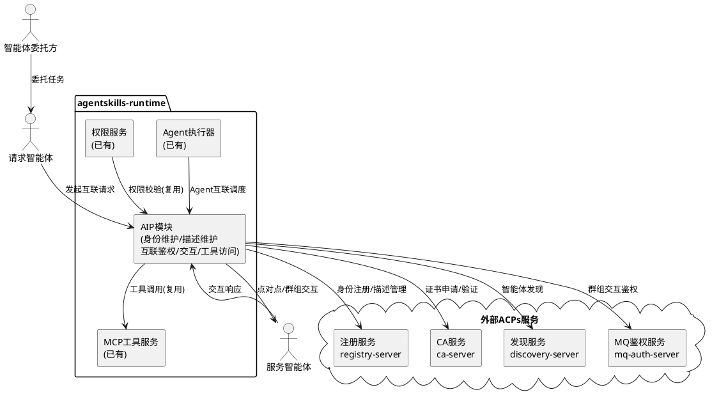

---

# **4. DFX约束**

## **4.1 性能**

1. 智能体身份注册接口响应时间上限：5秒（不含人工审核等待时间）
2. 智能体发现查询接口响应时间上限：3秒（单注册中心场景，1000个已注册智能体以内）
3. 点对点交互消息传输延迟上限：500毫秒
4. 群组交互消息分发延迟上限：2秒（10个群组成员以内）
5. 工具调用接口响应时间上限：与现有 MCP 工具调用性能一致

## **4.2 可靠性**

1. 系统可用性目标：99.5%（依赖外部 ACPs 服务的可用性）
2. 身份注册数据持久化：注册成功后数据不丢失
3. 交互消息至少一次投递保证（群组模式）
4. 外部 ACPs 服务不可用时，已缓存的智能体描述和发现结果仍可使用

## **4.3 安全性**

1. 智能体间通信必须使用 HTTPS/TLS1.3 协议
2. 身份鉴别必须支持 mTLS 双向认证
3. 智能体凭证（CAI）必须经过数字签名，使用符合国家标准的算法
4. 所有身份注册、更新、注销操作必须生成审计日志
5. 群组交互必须经过 MQ 鉴权服务的 ACL 校验
6. 接口认证方式：复用现有 JWT Bearer Token 认证

## **4.4 可维护性**

1. 必须接入现有日志系统，记录 AIP 协议关键操作日志
2. 必须提供 AIP 模块的健康检查接口
3. AIP 模块配置（注册中心地址、CA 地址等）必须可通过环境变量配置
4. 必须支持 ACPs 协议版本的平滑升级

## **4.5 兼容性**

1. AIP 模块与现有 MCP 工具调用机制并存，互不影响
2. 现有 Agent 数据模型（agents 表）必须兼容扩展，不破坏已有功能
3. 现有 AgentSkills 数据模型必须兼容扩展，与 ACS 技能描述对齐
4. AIP 模块的 RESTful API 必须遵循 uctoo-v4-api-specification 规范
5. 数据库变更必须遵循 uctoo-database-design-specification 规范

---

# **5. 核心能力**

## **5.1 智能体身份管理**

> **双模式说明**：
> - **本地模式**：智能体通过现有 uctoo_user + RBAC 体系进行身份管理。创建 Agent 时自动创建用户帐号（user_type='agent'），通过 user_id 关联，使用 JWT Bearer Token 认证，无密码自动登录。无需 AIC 身份码、CAI 证书、mTLS 认证等国标分布式身份基础设施。
> - **互联模式**：在本地模式基础上，叠加 GB/Z 185.2 国标身份注册能力，通过 ACPs 注册服务获取 AIC 身份码，通过 CA 服务签发 CAI 证书，支持 mTLS 双向认证。本地模式的 user_id 体系与互联模式的 AIC 体系并存，通过 agents.aic 字段关联。

### **5.1.1 业务规则**

#### **本地模式业务规则**

1. **本地身份自动创建**：创建 Agent 时，系统必须自动在 uctoo_user 表创建对应的用户帐号，user_type 设为 "agent"，自动分配 agents 角色和智能体用户组
   - 验收条件：[智能体委托方创建 Agent] → [系统自动创建 user_type='agent' 的用户帐号，分配角色和用户组，Agent 可通过 JWT token 认证]

2. **本地无密码自动登录**：Agent 启动执行任务时，系统必须自动为其生成 JWT access_token，跳过密码验证环节，JWT token 的 session 中标注 "auth_type: agent_auto"
   - 验收条件：[Agent 启动执行任务] → [系统验证 user_type='agent' 后直接生成 JWT token，无需密码]

3. **本地身份状态管理**：Agent 的身份状态通过 agents.status 和 uctoo_user.status 管理，无需国标 identity_status
   - 验收条件：[管理员禁用 Agent] → [agents.status 和 uctoo_user.status 同步更新，Agent 无法再获取有效 token]

4. **禁止项**：禁止通过标准登录接口（用户名+密码）登录 user_type 为 "agent" 的帐号
   - 验收条件：[人类用户尝试使用 agent 帐号登录] → [系统拒绝并返回"该帐号为智能体专用帐号，不支持密码登录"]

#### **互联模式业务规则（在本地模式基础上叠加）**

5. **身份码生成与分配**：智能体在注册时，必须通过 ACPs 注册服务获取符合 GB/Z 185.2 的 AIC，AIC 采用 OID 分层结构
   - 验收条件：[智能体发起注册请求] → [系统调用 ACPs 注册服务，返回包含 AIC 的注册结果]

6. **身份注册流程**：智能体身份注册必须包含身份注册发起、风险评估、证据提交与核验、身份建立及凭证发行、身份账户激活五个步骤
   - 验收条件：[智能体委托方提交注册请求] → [系统完成身份核验后分配 AIC 并发行 CAI]

7. **身份更新**：智能体核心代码、功能列表、权限范围等发生变更时，应当发起身份更新流程，更新时 AIC 必须保持不变
   - 验收条件：[智能体提交身份更新请求] → [系统更新身份账户信息，AIC 不变，生成更新日志]

8. **身份锁定与解锁**：身份账户被锁定时，系统必须拒绝与该账户相关的凭证发行和更新请求
   - 验收条件：[管理员或智能体发起身份锁定] → [该智能体的凭证操作被拒绝，凭证验证时视为无效]

9. **身份注销**：身份注销时，必须同时注销关联的智能体凭证，并归档注册信息、历史版本、活动日志
   - 验收条件：[智能体或注册服务方发起身份注销] → [关联凭证被注销，身份信息归档，AIC 标记为已注销]

10. **禁止项**：禁止在身份更新时修改 AIC
    - 验收条件：[身份更新请求中包含 AIC 变更] → [系统拒绝该请求并返回错误]

### **5.1.2 交互流程**

#### **本地模式交互流程**

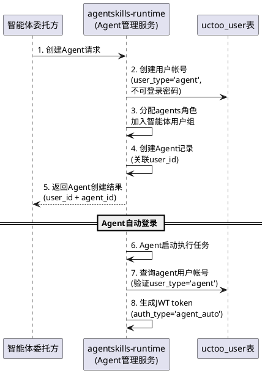

#### **互联模式交互流程**

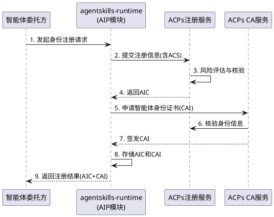

### **5.1.3 异常场景**

#### **本地模式异常场景**

1. **Agent 用户帐号创建失败**
   - 触发条件：uctoo_user 表写入失败（如 username 冲突）
   - 系统行为：回滚 Agent 创建操作，返回具体失败原因
   - 用户感知：错误码 AIP-LOCAL-001，提示"智能体帐号创建失败：{具体原因}"

2. **人类用户尝试登录 Agent 帐号**
   - 触发条件：标准登录接口收到 user_type='agent' 的帐号登录请求
   - 系统行为：拒绝登录请求
   - 用户感知：错误码 AUTH-AGENT-001，提示"该帐号为智能体专用帐号，不支持密码登录"

#### **互联模式异常场景**

3. **注册服务不可用**
   - 触发条件：ACPs 注册服务网络不通或服务宕机
   - 系统行为：返回注册服务不可用错误，缓存注册请求待重试
   - 用户感知：错误码 AIP-REG-001，提示"注册服务暂不可用，请稍后重试"

2. **身份核验不通过**
   - 触发条件：提交的身份核验证明材料不充分或不真实
   - 系统行为：拒绝注册请求，记录核验失败原因
   - 用户感知：错误码 AIP-REG-002，提示"身份核验未通过：{具体原因}"

3. **证书签发失败**
   - 触发条件：CA 服务拒绝签发证书（如 AIC 无效）
   - 系统行为：回滚身份注册状态，标记为待补证
   - 用户感知：错误码 AIP-REG-003，提示"身份证书签发失败，请联系管理员"

## **5.2 智能体描述管理**

> **双模式说明**：
> - **本地模式**：智能体描述通过扩展现有 agents 表和 agent_skills 表实现，增加国标 ACS 标准字段（capabilities、default_input_types、default_output_types 等）。描述的注册、变更、查询均在本地数据库完成，无需对接 ACPs 注册服务和发现服务。技能信息与现有 agent_skills 表双向映射。
> - **互联模式**：在本地模式基础上，增加完整的 GB/Z 185.4 标准化描述管理，通过 aip_agent_description 表存储国标 ACS 完整字段，描述注册和发布需同步到 ACPs 注册服务和发现服务。

### **5.2.1 业务规则**

#### **本地模式业务规则**

1. **本地描述格式规范**：智能体描述应当符合 GB/Z 185.4 表1定义的属性结构中与本地场景相关的字段，包含名称（name）、版本（version）、描述（description）、辅助功能描述（capabilities）、默认输入类型（defaultInputTypes）、默认输出类型（defaultOutputTypes）、技能（skills）等，扩展存储到 agents 表和 agent_skills 表
   - 验收条件：[智能体提交描述注册请求] → [系统校验描述格式中本地相关字段是否完整，扩展存储到现有表]

2. **本地技能描述规范**：技能描述应当包含标识（skillId）、名字（skillName）、技能描述（skillDescription）、标签（tags）、输入类型（inputTypes）、输出类型（outputTypes）等，与现有 agent_skills 表双向映射
   - 验收条件：[智能体描述中包含技能列表] → [系统将技能信息同步到 agent_skills 表，可双向查询]

3. **本地描述变更**：智能体描述变更后，必须同步更新 agents 表和 agent_skills 表中的对应记录
   - 验收条件：[智能体描述变更成功] → [agents 表和 agent_skills 表中的对应记录已更新]

4. **禁止项**：禁止在本地模式下操作 aip_agent_description 表（该表仅用于互联模式）
   - 验收条件：[本地模式下尝试写入 aip_agent_description] → [系统拒绝并提示该表仅在互联模式下使用]

#### **互联模式业务规则（在本地模式基础上叠加）**

5. **描述格式规范（完整）**：智能体描述必须符合 GB/Z 185.4 表1定义的完整属性结构，包含身份码（agentId）、名称（name）、版本（version）、描述（description）、辅助功能描述（capabilities）、默认输入类型（defaultInputTypes）、默认输出类型（defaultOutputTypes）、技能（skills）等必需属性
   - 验收条件：[智能体提交描述注册请求] → [系统校验描述格式是否符合 GB/Z 185.4，不符合则拒绝]

6. **技能描述规范（完整）**：技能描述必须包含标识（skillId）、名字（skillName）、技能描述（skillDescription）、标签（tags）、输入类型（inputTypes）、输出类型（outputTypes）等必需属性
   - 验收条件：[智能体描述中包含技能列表] → [系统校验每个技能的必需属性是否完整]

7. **描述注册（互联）**：智能体提供方必须先完成身份注册获得 AIC 后，才能进行描述注册到 ACPs 注册服务
   - 验收条件：[未持有 AIC 的智能体提交描述注册] → [系统拒绝并提示先完成身份注册]

8. **描述发布**：描述注册通过后，智能体提供方可以申请发布，发布后智能体可被 ACPs 发现服务发现
   - 验收条件：[智能体描述发布成功] → [ACPs 发现服务可查询到该智能体]

9. **描述变更（互联）**：智能体描述变更后，必须同步到 ACPs 发现服务
   - 验收条件：[智能体描述变更成功] → [ACPs 发现服务返回更新后的智能体描述]

10. **与现有 Agent/Skill 模型对齐**：智能体描述中的技能（skills）必须与现有 agent_skills 表中的技能信息对齐，实现双向映射
    - 验收条件：[通过 AIP 注册的技能信息] → [可在 agent_skills 表中查询到对应记录]

11. **禁止项**：禁止发布未通过身份验证的智能体描述
    - 验收条件：[未通过身份验证的智能体申请发布] → [系统拒绝发布请求]

### **5.2.2 交互流程**

#### **本地模式交互流程**

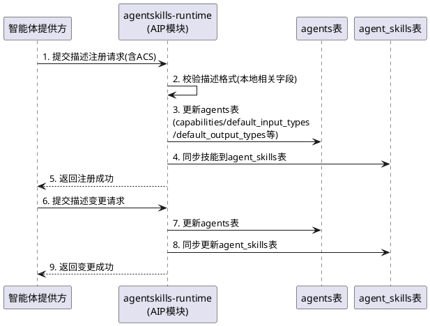

#### **互联模式交互流程**

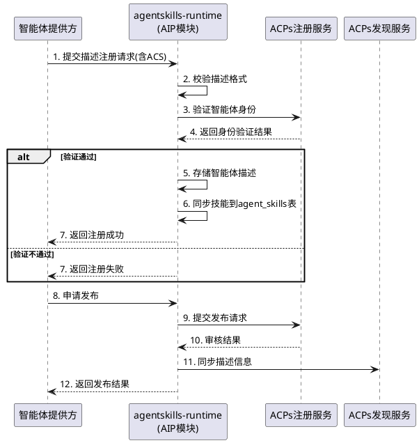

### **5.2.3 异常场景**

#### **本地模式异常场景**

1. **本地描述格式校验失败**
   - 触发条件：提交的智能体描述缺少本地必需属性
   - 系统行为：拒绝注册请求，返回具体校验失败字段
   - 用户感知：错误码 AIP-LOCAL-DESC-001，提示"描述格式校验失败：{缺少的必需属性}"

2. **本地技能映射冲突**
   - 触发条件：ACS 技能与现有 agent_skills 表记录冲突
   - 系统行为：提示冲突详情，由用户决定覆盖或跳过
   - 用户感知：错误码 AIP-LOCAL-DESC-002，提示"技能映射冲突：{冲突详情}"

#### **互联模式异常场景**

3. **描述格式校验失败（完整）**
   - 触发条件：提交的智能体描述缺少必需属性或格式不符合 GB/Z 185.4
   - 系统行为：拒绝注册请求，返回具体校验失败字段
   - 用户感知：错误码 AIP-DESC-001，提示"描述格式校验失败：{缺少的必需属性}"

2. **描述信息同步失败**
   - 触发条件：描述变更后同步到发现服务失败
   - 系统行为：记录同步失败日志，标记为待同步，支持重试
   - 用户感知：错误码 AIP-DESC-002，提示"描述信息同步失败，系统将自动重试"

3. **技能映射冲突**
   - 触发条件：AIP 技能与现有 agent_skills 表记录冲突
   - 系统行为：提示冲突详情，由用户决定覆盖或跳过
   - 用户感知：错误码 AIP-DESC-003，提示"技能映射冲突：{冲突详情}"

## **5.3 智能体发现**

> **双模式说明**：
> - **本地模式**：智能体发现基于本地 agents 表和 agent_skills 表进行能力匹配，无需对接 ACPs 发现服务。支持按名称、技能、描述等条件查询本地已注册的智能体。发现结果直接从本地数据库返回，无网络延迟。
> - **互联模式**：在本地模式基础上，增加跨系统智能体发现能力，调用 ACPs 发现服务查询外部系统的智能体。本地发现结果和互联发现结果合并返回，并缓存互联发现结果用于降级查询。

### **5.3.1 业务规则**

#### **本地模式业务规则**

1. **本地发现方式**：系统必须支持基于本地 agents 表和 agent_skills 表的智能体发现，支持按名称、技能、描述等条件查询
   - 验收条件：[智能体发起本地发现请求] → [系统从 agents 表和 agent_skills 表返回匹配结果]

2. **本地发现条件**：本地发现请求应当支持智能体名称、技能关键词、描述关键词等条件，可组合查询
   - 验收条件：[提交名称+技能的本地发现请求] → [系统返回同时匹配名称和技能的智能体列表]

3. **本地可发现性控制**：智能体描述中应当支持配置是否允许被本地发现
   - 验收条件：[智能体配置为不可发现] → [本地发现查询不返回该智能体]

4. **禁止项**：禁止本地发现返回配置为不可发现的智能体
   - 验收条件：[本地发现请求匹配到不可发现的智能体] → [该智能体不出现在结果集中]

#### **互联模式业务规则（在本地模式基础上叠加）**

5. **互联发现方式**：系统必须支持基于 ACPs 发现服务的跨系统发现，宜支持基于预置信息的发现方式
   - 验收条件：[智能体发起互联发现请求] → [系统调用 ACPs 发现服务返回匹配结果]

6. **互联发现条件**：互联发现请求必须支持自然语言描述作为必要条件，可组合包含智能体名称、身份码等
   - 验收条件：[提交自然语言描述的互联发现请求] → [系统返回匹配的跨系统智能体列表]

7. **发现结果**：互联发现结果集中的每个条目必须至少包含智能体的名称或其他可被用作符合性检查的信息
   - 验收条件：[ACPs 发现服务返回结果] → [每个结果条目包含名称和身份码]

8. **互联可发现性控制**：智能体描述中必须支持配置是否允许被 ACPs 发现服务发现
   - 验收条件：[智能体配置为不可发现] → [ACPs 发现服务不返回该智能体]

9. **本地缓存**：系统应当缓存互联发现结果，在 ACPs 发现服务不可用时提供降级查询
   - 验收条件：[ACPs 发现服务不可用] → [系统从本地缓存返回最近一次的发现结果]

10. **禁止项**：禁止 ACPs 发现服务返回配置为不可发现的智能体
    - 验收条件：[互联发现请求匹配到不可发现的智能体] → [该智能体不出现在结果集中]

### **5.3.2 交互流程**

#### **本地模式交互流程**

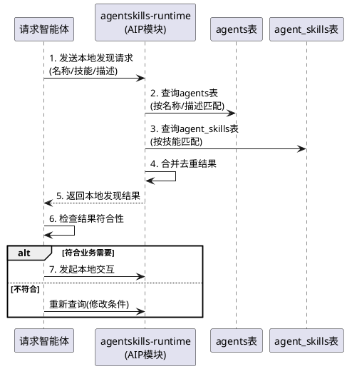

#### **互联模式交互流程**

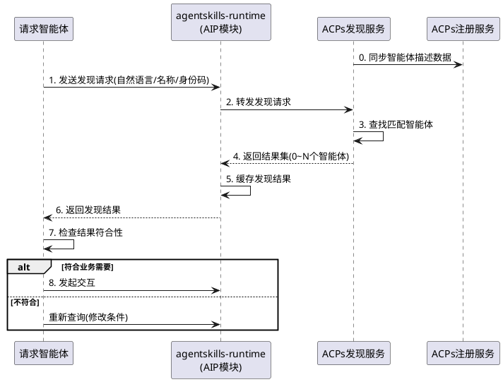

### **5.3.3 异常场景**

#### **本地模式异常场景**

1. **本地无匹配结果**
   - 触发条件：本地发现请求没有匹配到任何智能体
   - 系统行为：返回空结果集，建议修改查询条件
   - 用户感知：正常返回空列表，附带提示"未找到匹配的智能体，建议修改查询条件"

#### **互联模式异常场景**

2. **发现服务不可用**
   - 触发条件：ACPs 发现服务网络不通或服务宕机
   - 系统行为：从本地缓存返回最近一次的发现结果，标记为缓存数据
   - 用户感知：错误码 AIP-DISC-001，提示"发现服务暂不可用，返回缓存数据"

2. **无匹配结果**
   - 触发条件：发现请求没有匹配到任何智能体
   - 系统行为：返回空结果集，建议修改查询条件
   - 用户感知：正常返回空列表，附带提示"未找到匹配的智能体，建议修改查询条件"

3. **发现结果过期**
   - 触发条件：缓存的发现结果超过有效期
   - 系统行为：标记缓存数据为可能过期，尝试重新查询
   - 用户感知：警告 AIP-DISC-002，提示"发现数据可能已过期"

## **5.4 智能体交互**

> **双模式说明**：
> - **本地模式**：智能体交互通过现有 agent_messages + agent_tasks 体系实现，支持点对点和群组交互。交互前无需 mTLS 双向认证，通过 JWT Bearer Token + RBAC 权限校验即可。会话管理扩展 agents 表和 agent_messages/agent_tasks 表的国标标准字段。交互消息/任务结构参考 GB/Z 185.6 标准格式，但通过本地数据库传递而非 MQ 消息分发。
> - **互联模式**：在本地模式基础上，增加完整的 GB/Z 185.6 国标交互能力。交互前必须完成 mTLS 双向身份鉴别，群组交互通过 MQ 消息分发实现，交互消息/任务/会话使用 aip_interaction_session/task/message 表存储国标标准结构。

### **5.4.1 业务规则**

#### **本地模式业务规则**

1. **本地交互模式**：系统必须支持本地点对点模式，宜支持本地群组模式
   - 验收条件：[请求智能体选择本地交互模式] → [系统按对应模式通过 agent_messages/agent_tasks 建立交互]

2. **本地身份校验前置**：智能体本地交互前必须完成 JWT Bearer Token 认证和 RBAC 权限校验
   - 验收条件：[未完成 JWT 认证的智能体发起本地交互] → [系统拒绝并要求先完成认证]

3. **本地会话管理**：每个本地交互过程应当创建会话，会话标识符通过 agent_messages 的 aip_session_id 字段关联
   - 验收条件：[请求智能体发起本地交互] → [系统创建会话并通过 aip_session_id 关联消息]

4. **本地消息结构**：本地交互消息应当参考 GB/Z 185.6 表3定义的消息结构，扩展存储到 agent_messages 表
   - 验收条件：[发送本地交互消息] → [消息包含 senderRole/senderId/sessionId 等国标标准字段]

5. **本地任务管理**：本地交互中的任务应当参考 GB/Z 185.6 表4定义的任务结构，扩展存储到 agent_tasks 表
   - 验收条件：[创建本地交互任务] → [任务包含 taskId/sessionId/state 等国标标准字段]

6. **与现有 Agent 交互对齐**：本地 AIP 交互会话必须与现有 AgentMessages 体系对齐，支持消息历史查询
   - 验收条件：[本地 AIP 交互产生的消息] → [可在 AgentMessages 中查询到对应记录]

7. **禁止项**：禁止未通过 JWT 认证的智能体参与本地交互
   - 验收条件：[未通过 JWT 认证的智能体发送本地交互消息] → [系统拒绝消息并返回认证失败]

#### **互联模式业务规则（在本地模式基础上叠加）**

8. **互联交互模式**：系统必须支持点对点模式，宜支持群组模式和混合模式
   - 验收条件：[请求智能体选择互联交互模式] → [系统按对应模式建立互联交互通道]

9. **身份鉴别前置**：智能体互联交互前必须完成 mTLS 双向身份鉴别
   - 验收条件：[未完成身份鉴别的智能体发起互联交互] → [系统拒绝并要求先完成身份鉴别]

10. **互联会话管理**：每个互联交互过程必须创建会话，会话由请求智能体创建和管理，存储到 aip_interaction_session 表
    - 验收条件：[请求智能体发起互联交互] → [系统创建会话并分配会话标识符，存储到 aip_interaction_session]

11. **互联消息结构**：互联交互消息必须符合 GB/Z 185.6 表3定义的消息结构，包含角色（senderRole）、发送方身份码（senderId）、会话标识符（sessionId）、消息标识符（id）、数据（dataItems）等必需字段
    - 验收条件：[发送互联交互消息] → [系统校验消息结构是否符合 GB/Z 185.6]

12. **互联任务管理**：互联交互中的任务必须符合 GB/Z 185.6 表4定义的任务结构，包含任务标识符、会话标识符、任务状态等必需字段
    - 验收条件：[创建互联交互任务] → [系统校验任务结构完整性]

13. **点对点交互**：点对点模式必须支持远程调用（短连接）、流式（长连接）和通知（异步）三种实现方式
    - 验收条件：[请求智能体选择点对点交互方式] → [系统按选定方式建立连接]

14. **群组交互**：群组模式通过 MQ 消息分发功能模块实现，请求智能体负责群组的创建和管理
    - 验收条件：[请求智能体创建群组] → [系统通过 MQ 消息分发模块建立群组通道]

15. **禁止项**：禁止未通过 mTLS 身份鉴别的智能体参与互联交互
    - 验收条件：[未通过身份鉴别的智能体发送互联交互消息] → [系统拒绝消息并返回身份鉴别失败]

### **5.4.2 交互流程**

#### **本地模式交互流程**

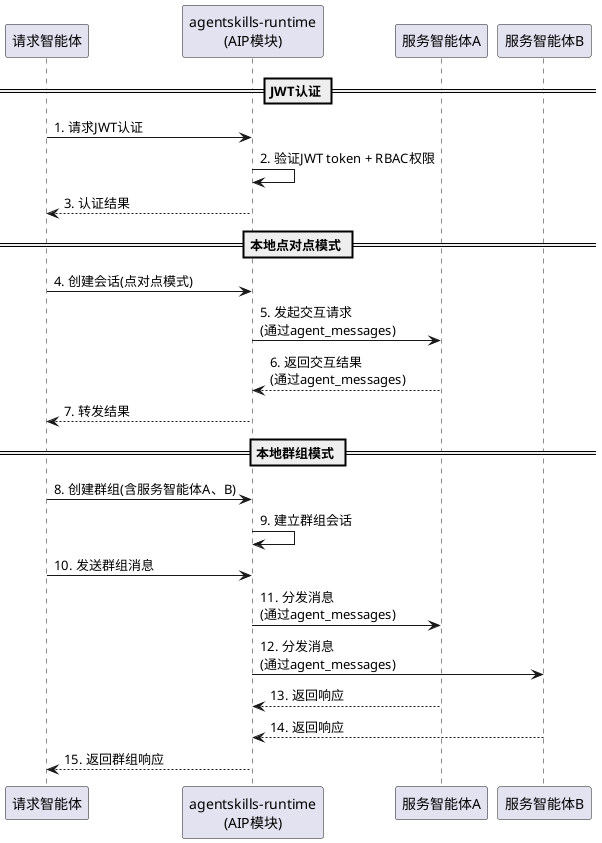

#### **互联模式交互流程**

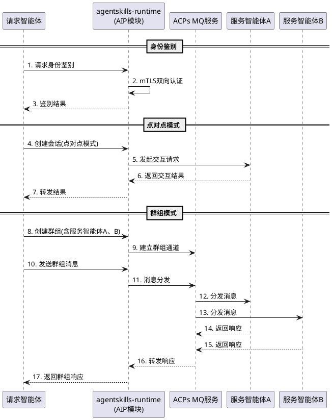

### **5.4.3 异常场景**

#### **本地模式异常场景**

1. **本地 JWT 认证失败**
   - 触发条件：JWT token 无效或过期
   - 系统行为：拒绝交互请求，记录认证失败日志
   - 用户感知：错误码 AIP-LOCAL-INTER-001，提示"认证失败，无法建立本地交互"

2. **本地服务智能体不可达**
   - 触发条件：目标服务智能体在本地系统中不存在或已禁用
   - 系统行为：返回交互失败，建议尝试其他服务智能体
   - 用户感知：错误码 AIP-LOCAL-INTER-002，提示"服务智能体不可用：{agent_id}"

3. **本地消息格式校验失败**
   - 触发条件：本地交互消息不符合 GB/Z 185.6 参考的消息结构
   - 系统行为：拒绝消息，返回具体校验失败字段
   - 用户感知：错误码 AIP-LOCAL-INTER-003，提示"消息格式校验失败：{缺少的必需字段}"

#### **互联模式异常场景**

4. **身份鉴别失败**
   - 触发条件：mTLS 双向认证未通过
   - 系统行为：拒绝交互请求，记录鉴别失败日志
   - 用户感知：错误码 AIP-INTER-001，提示"身份鉴别失败，无法建立交互"

2. **服务智能体不可达**
   - 触发条件：目标服务智能体网络不通或服务宕机
   - 系统行为：返回交互失败，建议尝试其他服务智能体
   - 用户感知：错误码 AIP-INTER-002，提示"服务智能体不可达：{身份码}"

3. **消息格式校验失败**
   - 触发条件：交互消息不符合 GB/Z 185.6 定义的消息结构
   - 系统行为：拒绝消息，返回具体校验失败字段
   - 用户感知：错误码 AIP-INTER-003，提示"消息格式校验失败：{缺少的必需字段}"

4. **群组消息分发失败**
   - 触发条件：MQ 服务不可用或部分群组成员不可达
   - 系统行为：记录分发失败日志，对可达成员继续分发，对不可达成员标记待重试
   - 用户感知：错误码 AIP-INTER-004，提示"群组消息部分分发失败"

5. **会话超时**
   - 触发条件：交互会话超过配置的超时时间无活动
   - 系统行为：自动关闭会话，通知所有参与方
   - 用户感知：错误码 AIP-INTER-005，提示"交互会话已超时关闭"

## **5.5 智能体工具调用**

> **双模式说明**：
> - **本地模式**：工具调用完全复用现有 MCP 工具体系，无需额外实现 AIP 工具服务。工具描述格式参考 GB/Z 185.7 标准与 MCP 工具体系对齐。本地模式下的工具调用与现有 MCP 工具调用无差异。
> - **互联模式**：在本地模式基础上，增加 GB/Z 185.7 标准化工具描述和调用能力，支持跨系统工具发现和调用。AIP 工具服务与 MCP 工具体系互操作。

### **5.5.1 业务规则**

#### **本地模式业务规则**

1. **本地工具调用**：本地模式下工具调用完全复用现有 MCP 工具体系，无需额外实现
   - 验收条件：[本地模式下智能体发起工具调用] → [系统通过现有 MCP 工具体系完成调用]

2. **本地工具描述对齐**：现有 MCP 工具描述应当参考 GB/Z 185.7 标准格式，包含工具标识符、工具名称、工具描述、输入参数、输出参数等字段
   - 验收条件：[查询 MCP 工具列表] → [工具描述包含 GB/Z 185.7 标准字段]

#### **互联模式业务规则（在本地模式基础上叠加）**

3. **工具描述格式（完整）**：工具属性描述必须符合 GB/Z 185.7 表1定义的格式，包含工具标识符（toolId）、工具名称（toolName）、工具描述（toolDescription）、工具版本（toolVersion）、输入参数（toolInputParam）、输出参数（toolOutputParam）
   - 验收条件：[注册工具到 AIP 工具服务] → [系统校验工具描述是否符合 GB/Z 185.7]

4. **工具调用流程**：工具调用必须遵循工具列表获取→工具调用→结果返回的标准流程
   - 验收条件：[智能体发起工具调用] → [系统按标准流程完成调用并返回结果]

5. **与现有 MCP 工具对齐**：AIP 工具调用必须与现有 MCP 工具体系互操作，MCP 工具可被 AIP 工具服务发现和调用
   - 验收条件：[通过 AIP 协议查询工具列表] → [可查询到已注册的 MCP 工具]

6. **工具列表同步**：工具服务必须支持工具列表的获取和增量更新
   - 验收条件：[工具发生变更] → [工具服务发送更新提醒，工具访问同步更新后的列表]

7. **禁止项**：禁止调用未在工具列表中注册的工具
   - 验收条件：[调用未注册的工具] → [系统拒绝调用并返回工具不存在错误]

### **5.5.2 交互流程**

#### **本地模式交互流程**

> 本地模式下工具调用完全复用现有 MCP 工具体系，交互流程与现有 MCP 工具调用流程一致，无需额外实现。

#### **互联模式交互流程**

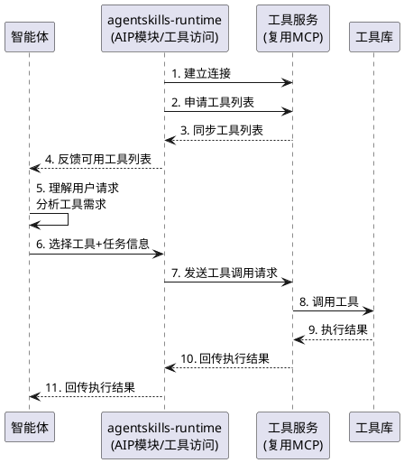

### **5.5.3 异常场景**

#### **本地模式异常场景**

> 本地模式下工具调用异常场景与现有 MCP 工具调用异常场景一致，由 MCP 工具体系处理。

#### **互联模式异常场景**

1. **工具服务不可用**
   - 触发条件：工具服务（MCP 服务）网络不通或服务宕机
   - 系统行为：返回工具服务不可用错误
   - 用户感知：错误码 AIP-TOOL-001，提示"工具服务暂不可用"

2. **工具调用失败**
   - 触发条件：工具执行过程中发生异常
   - 系统行为：返回工具调用失败结果，包含错误状态码和原因
   - 用户感知：错误码 AIP-TOOL-002，提示"工具调用失败：{工具名称}，原因：{错误信息}"

3. **工具列表同步失败**
   - 触发条件：工具更新提醒后同步工具列表失败
   - 系统行为：保留旧版本工具列表，标记为待同步，支持重试
   - 用户感知：警告 AIP-TOOL-003，提示"工具列表同步失败，使用缓存数据"

## **5.6 AIP 配置与管理**

> **双模式说明**：
> - **本地模式**：AIP 配置仅需管理本地模式相关配置（如本地发现开关、本地交互参数等），无需配置 ACPs 服务端点。系统默认运行在本地模式，无需额外配置即可使用。
> - **互联模式**：在本地模式基础上，增加 ACPs 各服务端点配置（注册服务、CA 服务、发现服务、MQ 服务）、协议版本管理、健康检查等互联模式专属配置。互联模式需要配置 ACPs 服务端点，未配置时自动降级为本地模式。

### **5.6.1 业务规则**

#### **本地模式业务规则**

1. **本地模式默认启用**：系统默认运行在本地模式，无需额外配置即可使用本地模式的所有能力
   - 验收条件：[系统启动未配置 ACPs 服务端点] → [系统自动以本地模式运行，本地发现、本地交互等功能可用]

2. **本地模式配置项**：本地模式应当支持配置本地发现开关、本地交互超时时间、本地会话过期时间等参数
   - 验收条件：[配置本地模式参数] → [系统按配置参数运行本地模式]

3. **本地模式健康检查**：本地模式应当提供健康检查接口，返回本地模式各功能的可用性状态
   - 验收条件：[调用本地模式健康检查接口] → [返回本地发现、本地交互等功能的可用性状态]

#### **互联模式业务规则（在本地模式基础上叠加）**

4. **服务端点配置**：必须支持通过环境变量或配置文件配置 ACPs 各服务端点（注册服务、CA 服务、发现服务、MQ 服务）
   - 验收条件：[配置 ACPs 服务端点] → [AIP 模块可连接到对应服务]

5. **协议版本管理**：必须支持 ACPs 协议版本标识，首期实现 v2.1.0
   - 验收条件：[查询 AIP 模块协议版本] → [返回当前支持的 ACPs 协议版本号]

6. **互联模式健康检查**：必须提供互联模式健康检查接口，包含各 ACPs 外部服务连通性状态
   - 验收条件：[调用互联模式健康检查接口] → [返回各 ACPs 服务的连通性状态]

7. **AIC 合法性验证**：必须支持 AIC 格式验证，校验 AIC 前缀、版本、校验码等
   - 验收条件：[输入一个 AIC] → [系统返回 AIC 格式是否合法及解析结果]

8. **模式自动降级**：当 ACPs 服务端点未配置或不可用时，系统必须自动降级为本地模式
   - 验收条件：[ACPs 服务端点不可用] → [系统自动切换到本地模式，互联模式功能不可用但本地模式功能正常]

### **5.6.2 交互流程**

#### **本地模式交互流程**

> 本地模式无需配置 ACPs 服务端点，系统启动即默认以本地模式运行。本地模式配置通过环境变量或配置文件管理。

#### **互联模式交互流程**

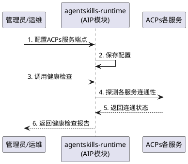

### **5.6.3 异常场景**

#### **本地模式异常场景**

1. **本地模式配置异常**
   - 触发条件：本地模式配置参数格式错误或超出范围
   - 系统行为：使用默认配置值，记录配置异常日志
   - 用户感知：警告 AIP-LOCAL-CONF-001，提示"本地模式配置异常，使用默认值"

#### **互联模式异常场景**

2. **配置缺失**
   - 触发条件：未配置必要的 ACPs 服务端点
   - 系统行为：AIP 模块启动时检查配置，缺失时发出警告
   - 用户感知：警告 AIP-CONF-001，提示"ACPs 服务端点未配置，AIP 功能不可用"

2. **服务连通性异常**
   - 触发条件：ACPs 服务端点配置正确但无法连通
   - 系统行为：健康检查标记为不可用，AIP 功能降级
   - 用户感知：警告 AIP-CONF-002，提示"ACPs {服务名} 不可用"

---

# **6. 数据约束**

> **复用策略说明**：本章节数据约束基于第7章"表结构复用方案"的结论，对现有表标注新增字段，对独立新建表标注完整字段定义。复用策略核心原则：现有表通过新增字段扩展AIP能力，AIP协议专属数据独立建表以保证协议合规性。
>
> **双模式适用性说明**：
> - 🏠 **本地模式+互联模式**：现有表扩展字段（agents/agent_messages/agent_tasks/uctoo_user）同时服务于本地模式和互联模式
> - 🌐 **仅互联模式**：独立新建的AIP表（aip_agent_identity/credential/description/session/task/message/service_config/discovery_cache）仅用于互联模式

## **6.1 现有表扩展 — agents 表（新增AIP字段）** 🏠 本地模式+互联模式

> agents 表已有字段（id, name, agent_type, description, status, config, system_prompt, tools, model, parent_id, user_id, color, background, memory_scope, isolation_mode, max_turns, initial_prompt, creator, created_at, updated_at, deleted_at, version, author, permissions, source_path, sync_status, last_sync_at）保持不变，以下为新增字段：

1. **aic**：智能体身份码，符合 GB/Z 185.2 OID 格式，可选，唯一；未注册AIP身份的智能体此字段为空。【🌐 仅互联模式有值，本地模式下为空】
2. **identity_status**：AIP 身份状态（none/active/locked/revoked），默认值 "none"，必填；"none"表示未注册AIP身份。【🏠 本地模式下始终为 "none"，🌐 互联模式下根据注册状态变更】
3. **aip_registered_at**：AIP 身份注册时间，可选；未注册AIP身份的智能体此字段为空。【🌐 仅互联模式有值，本地模式下为空】
4. **capabilities**：辅助功能描述，JSON 格式，可选；对应 GB/Z 185.4 ACS 的 capabilities 字段。【🏠 本地模式+互联模式，本地模式下存储本地描述信息】
5. **default_input_types**：默认输入类型，JSON 数组格式，可选；对应 GB/Z 185.4 ACS 的 defaultInputTypes 字段。【🏠 本地模式+互联模式】
6. **default_output_types**：默认输出类型，JSON 数组格式，可选；对应 GB/Z 185.4 ACS 的 defaultOutputTypes 字段。【🏠 本地模式+互联模式】
7. **discoverable**：是否允许被发现，布尔值，默认值 true，必填；控制智能体是否可被本地发现查询返回。【🏠 本地模式+互联模式】

## **6.2 现有表扩展 — agent_messages 表（新增AIP关联字段）** 🏠 本地模式+互联模式

> agent_messages 表已有字段（id, from_agent_id, to_agent_id, task_id, message_type, content, status, creator, created_at, updated_at, deleted_at）保持不变，以下为新增字段：

1. **aip_session_id**：关联 aip_interaction_session 表 session_id，可选；非AIP交互消息此字段为空。【🏠 本地模式下用于关联本地会话，🌐 互联模式下用于关联互联会话】
2. **aip_message_id**：AIP 协议消息标识符，可选；非AIP交互消息此字段为空。【🏠 本地模式下存储本地消息标识，🌐 互联模式下存储国标消息标识】
3. **sender_role**：发送者角色（requester/service），可选；对应 GB/Z 185.6 消息结构的 senderRole。【🏠 本地模式+互联模式】
4. **data_items**：数据内容，JSON 数组格式，可选；对应 GB/Z 185.6 消息结构的 dataItems。【🏠 本地模式+互联模式】

## **6.3 现有表扩展 — agent_tasks 表（新增AIP关联字段）** 🏠 本地模式+互联模式

> agent_tasks 表已有字段（id, agent_id, parent_task_id, status, priority, payload, result, error_message, creator, created_at, updated_at, completed_at, deleted_at）保持不变，以下为新增字段：

1. **aip_session_id**：关联 aip_interaction_session 表 session_id，可选；非AIP交互任务此字段为空。【🏠 本地模式下用于关联本地会话，🌐 互联模式下用于关联互联会话】
2. **aip_task_id**：AIP 协议任务标识符，可选；非AIP交互任务此字段为空。【🏠 本地模式下存储本地任务标识，🌐 互联模式下存储国标任务标识】
3. **aip_task_state**：AIP 任务状态（accepted/rejected/completed/failed/cancelled/in_progress），可选；对应 GB/Z 185.6 任务结构的 state。【🏠 本地模式+互联模式】

## **6.4 现有表扩展 — uctoo_user 表（新增智能体帐号标识字段）** 🏠 本地模式+互联模式

> uctoo_user 表已有字段（id, name, username, email, password, avatar, created_at, last_login, auth_provider, creator, deleted_at, last_login_ip, last_login_time, remember_token, status, updated_at, access_token, refresh_token）保持不变，以下为新增字段：

1. **user_type**：用户类型（human/agent），默认值 "human"，必填；用于区分人类用户和智能体帐号
2. **agent_id**：关联 agents 表 id，可选；仅当 user_type 为 "agent" 时有值，用于反向关联智能体

## **6.5 智能体身份码记录（aip_agent_identity）** 🌐 仅互联模式

1. **id**：UUID 主键，必填
2. **agent_id**：关联 agents 表 id，必填，唯一
3. **aic**：智能体身份码，符合 GB/Z 185.2 OID 格式，必填，唯一
4. **aic_version**：智能体身份码版本号，默认值 "1"，必填
5. **registration_service_provider**：注册服务方标识，必填
6. **registration_requester**：注册请求方标识，必填
7. **ontology_serial**：智能体本体序列号，必填
8. **instance_serial**：智能体实例序列号，本体注册时为 "0"，必填
9. **credential_id**：关联 aip_agent_credential 表 id，可选
10. **identity_status**：身份状态（active/locked/revoked），默认值 "active"，必填
11. **registered_at**：注册时间，ISO 8601 格式，必填
12. **last_verified_at**：最近核验时间，可选
13. **creator**：创建人 ID，关联 uctoo_user 表 id，必填
14. **created_at**：创建时间，必填
15. **updated_at**：更新时间，必填
16. **deleted_at**：软删除时间，可选

## **6.6 智能体凭证记录（aip_agent_credential）** 🌐 仅互联模式

1. **id**：UUID 主键，必填
2. **agent_identity_id**：关联 aip_agent_identity 表 id，必填
3. **credential_type**：凭证类型（x509/jwt/other），默认值 "x509"，必填
4. **issuer**：凭证发行方标识，必填
5. **serial_number**：凭证序列号，必填，唯一
6. **not_before**：凭证生效时间，必填
7. **not_after**：凭证过期时间，必填
8. **credential_status**：凭证状态（active/locked/revoked/expired），默认值 "active"，必填
9. **certificate_pem**：PEM 格式证书内容，可选
10. **public_key**：公钥内容，可选
11. **creator**：创建人 ID，必填
12. **created_at**：创建时间，必填
13. **updated_at**：更新时间，必填
14. **deleted_at**：软删除时间，可选

## **6.7 智能体描述记录（aip_agent_description）** 🌐 仅互联模式

1. **id**：UUID 主键，必填
2. **agent_identity_id**：关联 aip_agent_identity 表 id，必填
3. **agent_id**：关联 agents 表 id，必填
4. **agent_id_code**：智能体身份码（冗余存储便于查询），必填
5. **name**：智能体名称，必填
6. **alias**：别名，可选
7. **version**：智能体版本，必填
8. **description**：智能体描述，自然语言表达，必填
9. **icon_address**：图标地址，可选
10. **provider**：提供方信息，JSON 格式，必填
11. **access_address**：访问地址，可选
12. **access_method**：访问方法，JSON 数组格式，可选
13. **serving_area**：服务区域，JSON 格式，可选
14. **authentication**：认证方式，JSON 格式，可选
15. **capabilities**：辅助功能描述，JSON 格式，必填
16. **default_input_types**：默认输入类型，JSON 数组格式，必填
17. **default_output_types**：默认输出类型，JSON 数组格式，必填
18. **skills**：技能列表，JSON 数组格式，必填
19. **discoverable**：是否允许被发现，布尔值，默认值 true，必填
20. **publish_status**：发布状态（draft/published/unpublished），默认值 "draft"，必填
21. **published_at**：发布时间，可选
22. **creator**：创建人 ID，必填
23. **created_at**：创建时间，必填
24. **updated_at**：更新时间，必填
25. **deleted_at**：软删除时间，可选

## **6.8 智能体交互会话（aip_interaction_session）** 🌐 仅互联模式

1. **id**：UUID 主键，必填
2. **session_id**：会话标识符，AIP 协议定义，必填，唯一
3. **requester_agent_id**：请求智能体关联 agents 表 id，必填
4. **requester_aic**：请求智能体身份码，必填
5. **interaction_mode**：交互模式（p2p/group/hybrid），必填
6. **receivers**：服务智能体信息列表，JSON 格式，必填
7. **context**：会话上下文，JSON 格式，可选
8. **session_status**：会话状态（active/closed/expired），默认值 "active"，必填
9. **creator**：创建人 ID，必填
10. **created_at**：创建时间，必填
11. **updated_at**：更新时间，必填
12. **deleted_at**：软删除时间，可选

## **6.9 智能体交互任务（aip_interaction_task）** 🌐 仅互联模式

1. **id**：UUID 主键，必填
2. **task_id**：任务标识符，AIP 协议定义，必填
3. **session_id**：关联 aip_interaction_session 表 session_id，必填
4. **service_agent_id**：服务智能体关联 agents 表 id，必填
5. **service_aic**：服务智能体身份码，必填
6. **state**：任务状态（accepted/rejected/completed/failed/cancelled/in_progress），必填
7. **state_changed_at**：状态更新时间，ISO 8601 格式，可选
8. **artifacts**：依赖信息，JSON 格式，可选
9. **creator**：创建人 ID，必填
10. **created_at**：创建时间，必填
11. **updated_at**：更新时间，必填
12. **deleted_at**：软删除时间，可选

## **6.10 智能体交互消息（aip_interaction_message）** 🌐 仅互联模式

1. **id**：UUID 主键，必填
2. **message_id**：消息标识符，AIP 协议定义，必填
3. **session_id**：关联 aip_interaction_session 表 session_id，必填
4. **task_id**：关联 aip_interaction_task 表 task_id，可选
5. **sender_role**：发送者角色（requester/service），必填
6. **sender_aic**：发送方身份码，必填
7. **artifact**：信息类型标识（communication/work_product），可选
8. **final**：是否最终成果，布尔值，可选
9. **chunk_index**：消息分块索引，整型，可选
10. **last_chunk**：消息是否结束，布尔值，可选
11. **data_items**：数据内容，JSON 数组格式，必填
12. **creator**：创建人 ID，必填
13. **created_at**：创建时间，必填
14. **updated_at**：更新时间，必填
15. **deleted_at**：软删除时间，可选

## **6.11 AIP 服务配置（aip_service_config）** 🌐 仅互联模式

1. **id**：UUID 主键，必填
2. **service_type**：服务类型（registry/ca/discovery/mq），必填
3. **service_name**：服务名称，必填
4. **service_endpoint**：服务端点 URL，必填
5. **protocol_version**：协议版本，默认值 "2.1.0"，必填
6. **config**：额外配置，JSON 格式，可选
7. **enabled**：是否启用，布尔值，默认值 true，必填
8. **health_status**：健康状态（healthy/unhealthy/unknown），默认值 "unknown"，必填
9. **last_health_check_at**：最近健康检查时间，可选
10. **creator**：创建人 ID，必填
11. **created_at**：创建时间，必填
12. **updated_at**：更新时间，必填
13. **deleted_at**：软删除时间，可选

## **6.12 AIP 发现缓存（aip_discovery_cache）** 🌐 仅互联模式

1. **id**：UUID 主键，必填
2. **query_hash**：查询条件哈希，用于缓存匹配，必填
3. **query_condition**：原始查询条件，JSON 格式，必填
4. **result_set**：发现结果集，JSON 格式，必填
5. **result_count**：结果数量，整型，必填
6. **cached_at**：缓存时间，必填
7. **expires_at**：过期时间，必填
8. **creator**：创建人 ID，必填
9. **created_at**：创建时间，必填
10. **updated_at**：更新时间，必填
11. **deleted_at**：软删除时间，可选

---

# **7. 表结构复用方案**

## **7.1 复用策略总览**

| AIP 新表 | 复用策略 | 现有表 | 说明 |
|---|---|---|---|
| aip_agent_identity | 现有表扩展 + 独立新建 | agents | agents 表新增 aic/identity_status/aip_registered_at 字段用于快速查询；aip_agent_identity 独立建表存储完整AIC注册数据 |
| aip_agent_description | 独立新建 | agents + agent_skills | agents 表已有 name/description/version 字段可映射，但 ACS 标准化字段（capabilities/default_input_types/default_output_types 等）无法合并；aip_agent_description 独立建表存储 GB/Z 185.4 标准描述 |
| aip_agent_credential | 独立新建 | 无 | 无现有对应表，必须独立新建 |
| aip_interaction_session | 独立新建 | 无 | 无现有对应表（agent_contexts 是对话上下文，非交互会话），必须独立新建 |
| aip_interaction_task | 独立新建 | agent_tasks | agent_tasks 表新增 aip_session_id/aip_task_id 关联字段；aip_interaction_task 独立建表存储 GB/Z 185.6 标准任务结构 |
| aip_interaction_message | 独立新建 | agent_messages | agent_messages 表新增 aip_session_id/aip_message_id 关联字段；aip_interaction_message 独立建表存储 GB/Z 185.6 标准消息结构 |
| aip_service_config | 独立新建 | 无 | 无现有对应表，必须独立新建 |
| aip_discovery_cache | 独立新建 | 无 | 无现有对应表，必须独立新建 |

## **7.2 aip_agent_identity 与 agents 表复用分析**

### **7.2.1 字段对比**

| aip_agent_identity 字段 | agents 表对应字段 | 复用判定 |
|---|---|---|
| id | id | 各自独立主键 |
| agent_id | id | aip_agent_identity.agent_id 外键关联 agents.id |
| aic | 无 | agents 表新增 aic 字段（冗余存储便于快速查询） |
| aic_version | 无 | 仅AIP协议使用，不合并 |
| registration_service_provider | 无 | 仅AIP协议使用，不合并 |
| registration_requester | 无 | 仅AIP协议使用，不合并 |
| ontology_serial | 无 | 仅AIP协议使用，不合并 |
| instance_serial | 无 | 仅AIP协议使用，不合并 |
| credential_id | 无 | 仅AIP协议使用，不合并 |
| identity_status | 无 | agents 表新增 identity_status 字段（冗余存储便于快速查询） |
| registered_at | 无 | agents 表新增 aip_registered_at 字段（冗余存储便于快速查询） |
| last_verified_at | 无 | 仅AIP协议使用，不合并 |
| creator | creator | 各自独立 |
| created_at | created_at | 各自独立 |
| updated_at | updated_at | 各自独立 |
| deleted_at | deleted_at | 各自独立 |

### **7.2.2 复用结论**

- **agents 表新增 3 个字段**：aic（智能体身份码）、identity_status（AIP身份状态）、aip_registered_at（AIP注册时间），用于业务层快速查询和过滤，避免每次都关联 aip_agent_identity 表
- **aip_agent_identity 独立建表**：存储完整的 GB/Z 185.2 AIC 注册数据，包括注册服务方、请求方、本体序列号、实例序列号等协议专属字段
- **数据一致性保障**：agents.aic 与 aip_agent_identity.aic 必须保持一致，通过应用层事务保证；agents.identity_status 与 aip_agent_identity.identity_status 必须保持同步

## **7.3 aip_agent_description 与 agents + agent_skills 表复用分析**

### **7.3.1 字段对比**

| aip_agent_description 字段 | agents 表对应字段 | agent_skills 表对应字段 | 复用判定 |
|---|---|---|---|
| name | name | 无 | 可映射但不合并（语义不同：agents.name 是内部名称，ACS.name 是标准描述名称） |
| version | version | version | 可映射但不合并（语义不同） |
| description | description | description | 可映射但不合并（语义不同） |
| alias | 无 | 无 | 仅ACS使用 |
| icon_address | 无 | 无 | 仅ACS使用 |
| provider | author | author | 可映射但不合并（ACS.provider 是JSON结构，agents.author 是简单字符串） |
| access_address | 无 | 无 | 仅ACS使用 |
| access_method | 无 | 无 | 仅ACS使用 |
| serving_area | 无 | 无 | 仅ACS使用 |
| authentication | 无 | 无 | 仅ACS使用 |
| capabilities | 无 | 无 | 仅ACS使用 |
| default_input_types | 无 | 无 | 仅ACS使用 |
| default_output_types | 无 | 无 | 仅ACS使用 |
| skills | 无 | 多个字段组合 | 需要从 agent_skills 转换为 ACS skills 格式，但不合并 |
| discoverable | 无 | 无 | 仅ACS使用 |
| publish_status | 无 | 无 | 仅ACS使用 |

### **7.3.2 复用结论**

- **agents 表不新增字段**：agents 表的 name/description/version 字段与 ACS 对应字段语义不同，不直接复用
- **agent_skills 表不新增字段**：agent_skills 的技能信息需要转换为 ACS skills 格式，通过应用层转换逻辑实现映射
- **aip_agent_description 独立建表**：存储完整的 GB/Z 185.4 标准化描述，通过 agent_id 外键关联 agents 表
- **双向映射规则**：
  - agents → ACS：从 agents 表读取基本信息，从 agent_skills 表读取技能列表，组合生成 ACS 格式
  - ACS → agents：从 ACS 的 skills 字段解析技能信息，同步写入 agent_skills 表（参见 5.2.1 业务规则第6条）

## **7.4 aip_interaction_session/task/message 与 agent_messages/agent_tasks 表复用分析**

### **7.4.1 字段对比 — 消息表**

| aip_interaction_message 字段 | agent_messages 对应字段 | 复用判定 |
|---|---|---|
| message_id | 无 | AIP协议专属标识，不合并 |
| session_id | 无 | AIP会话概念，agent_messages 无对应 |
| task_id | task_id | 语义不同：AIP的task_id是协议标识，agent_messages的task_id是关联agent_tasks.id |
| sender_role | 无 | AIP协议专属（requester/service），不合并 |
| sender_aic | from_agent_id | 语义不同：AIC是身份码，from_agent_id是内部ID |
| artifact | 无 | AIP协议专属，不合并 |
| final | 无 | AIP协议专属，不合并 |
| chunk_index | 无 | AIP协议专属，不合并 |
| last_chunk | 无 | AIP协议专属，不合并 |
| data_items | content | 语义不同：data_items是GB/Z 185.6标准数据结构，content是自由JSON |

### **7.4.2 字段对比 — 任务表**

| aip_interaction_task 字段 | agent_tasks 对应字段 | 复用判定 |
|---|---|---|
| task_id | 无 | AIP协议专属标识，不合并 |
| session_id | 无 | AIP会话概念，agent_tasks 无对应 |
| service_agent_id | agent_id | 语义不同：AIP是服务智能体ID，agent_tasks是执行Agent ID |
| service_aic | 无 | AIP协议专属，不合并 |
| state | status | 语义不同：AIP使用accepted/rejected等状态，agent_tasks使用0/1/2/3数字状态 |
| state_changed_at | 无 | AIP协议专属，不合并 |
| artifacts | payload/result | 语义不同：AIP的artifacts是依赖信息，agent_tasks的payload/result是任务内容/结果 |

### **7.4.3 复用结论**

- **agent_messages 表新增 2 个字段**：aip_session_id、aip_message_id，用于关联AIP交互记录，实现内部消息与AIP消息的双向查询
- **agent_tasks 表新增 2 个字段**：aip_session_id、aip_task_id，用于关联AIP交互记录，实现内部任务与AIP任务的双向查询
- **aip_interaction_session 独立新建**：现有 agent_contexts 表是Agent对话上下文，与AIP交互会话概念不同，无法复用
- **aip_interaction_task 独立新建**：存储 GB/Z 185.6 标准任务结构，与 agent_tasks 的内部任务管理职责不同
- **aip_interaction_message 独立新建**：存储 GB/Z 185.6 标准消息结构，与 agent_messages 的内部消息传递职责不同
- **数据关联规则**：
  - AIP 交互产生的消息同时写入 aip_interaction_message 和 agent_messages（通过 aip_message_id 关联）
  - AIP 交互产生的任务同时写入 aip_interaction_task 和 agent_tasks（通过 aip_task_id 关联）
  - 非 AIP 交互仅写入 agent_messages/agent_tasks，aip_session_id 和 aip_message_id/aip_task_id 为空

## **7.5 独立新建表汇总**

以下 AIP 表无现有对应表，必须独立新建：

1. **aip_agent_credential**：智能体凭证管理，存储 x509 证书、JWT 凭证等，无现有对应
2. **aip_interaction_session**：AIP 交互会话管理，现有 agent_contexts 是对话上下文非交互会话
3. **aip_service_config**：AIP 服务端点配置，存储注册服务、CA服务、发现服务、MQ服务的连接信息
4. **aip_discovery_cache**：发现服务查询缓存，用于发现服务不可用时的降级查询

---

# **8. 智能体身份注册与用户帐号体系集成方案**

## **8.1 国标身份注册服务与现有 agents 帐号体系对比分析**

### **8.1.1 国标智能体身份注册服务方（GB/Z 185.2）**

国标定义的智能体身份注册服务方职责：
1. 分配智能体身份码（AIC），采用 OID 分层结构
2. 执行身份注册流程：注册发起 → 风险评估 → 证据提交与核验 → 身份建立及凭证发行 → 身份账户激活
3. 管理身份生命周期：注册、更新、锁定、解锁、注销
4. 发行智能体身份证书（CAI），支持 mTLS 双向认证
5. 维护身份账户信息，包括身份状态、核验记录等

### **8.1.2 现有 agents 帐号注册/登录/注销体系**

现有体系的工作流程：
1. 创建 Agent 时，系统自动在 uctoo_user 表创建对应的用户帐号
2. agents 表通过 user_id 字段关联 uctoo_user 表
3. Agent 使用 uctoo_user 的 access_token 进行 API 认证
4. uctoo_role 表已有 "agents" 角色（id: a686ff1f-7fb4-48df-8609-2b2d5267c682）
5. user_has_roles 表关联用户与角色
6. Agent 帐号的登录/注销跟随 uctoo_user 体系

### **8.1.3 异同分析**

| 维度 | 国标身份注册服务 | 现有 agents 帐号体系 | 差异 |
|---|---|---|---|
| 身份标识 | AIC（OID格式身份码） | uctoo_user.id（UUID） | 格式完全不同，AIC是国标OID，UUID是内部标识 |
| 认证方式 | mTLS双向认证 + CAI证书 | JWT Bearer Token | 安全级别不同，国标要求更高 |
| 注册流程 | 五步流程（风险评估、证据核验等） | 简单创建用户帐号 | 国标流程更严格 |
| 凭证管理 | x509证书、有效期管理、吊销 | JWT token、刷新token | 国标凭证管理更完善 |
| 身份状态 | active/locked/revoked | uctoo_user.status（0/1/999999） | 状态定义不同 |
| 注销流程 | 归档注册信息、注销凭证、标记AIC | 软删除 deleted_at | 国标注销更规范 |

## **8.2 集成方案设计**

### **8.2.1 方案概述**

采用"双轨并行、统一入口"的集成方案：
- **现有用户体系保持不变**：uctoo_user/user_group/user_role 等表结构和认证流程不变
- **AIP 身份注册作为增强层**：在现有体系之上叠加国标身份注册能力
- **统一入口**：Agent 的创建和身份注册通过统一的服务层协调，对外提供一致的接口

### **8.2.2 智能体帐号自动创建流程**

1. **创建 Agent 时自动创建用户帐号**：
   - 在 uctoo_user 表创建记录，user_type 设为 "agent"
   - username 格式：`agent_{agent_id前8位}`，确保唯一性
   - email 格式：`agent_{agent_id前8位}@agents.internal`，标识为内部帐号
   - password 设为不可登录的随机哈希值（格式：`{随机盐}.{不可逆哈希}`，不以 $2a$/$2b$ 开头，与正常密码格式区分）
   - 自动分配 agents 角色（uctoo_role: a686ff1f-7fb4-48df-8609-2b2d5267c682）
   - 自动加入智能体用户组（user_group: code='agents'，需新建）

2. **AIP 身份注册时增强身份信息**：
   - 调用 ACPs 注册服务完成国标身份注册
   - 将 AIC 写入 agents.aic 字段和 aip_agent_identity 表
   - 将 CAI 证书信息写入 aip_agent_credential 表
   - 更新 agents.identity_status 为 "active"

### **8.2.3 智能体无密码登录（自动登录）方案**

1. **自动登录触发场景**：
   - Agent 启动执行任务时，系统自动为其生成 JWT access_token
   - Agent 之间交互时，系统自动完成身份认证

2. **自动登录实现规则**：
   - 验证请求来源为系统内部（通过内部服务标识或管理端口）
   - 验证 agents 表中对应记录存在且 status 为运行状态
   - 验证 uctoo_user 表中 user_type 为 "agent"
   - 直接生成 JWT token，跳过密码验证环节
   - JWT token 的 session 中标注 "auth_type: agent_auto"，与人类用户登录的 session 区分

3. **禁止项**：
   - 禁止通过标准登录接口（用户名+密码）登录 user_type 为 "agent" 的帐号
   - 验收条件：[人类用户尝试使用 agent 帐号登录] → [系统拒绝并返回"该帐号为智能体专用帐号，不支持密码登录"]

### **8.2.4 人类用户限制使用 agents 帐号**

1. **登录接口拦截**：
   - 标准登录接口（POST /api/auth/login）检查 uctoo_user.user_type
   - 若 user_type 为 "agent"，拒绝登录请求，返回错误码 AUTH-AGENT-001
   - 错误提示："该帐号为智能体专用帐号，不支持密码登录"

2. **Token 刷新拦截**：
   - Token 刷新接口检查 session 中的 auth_type
   - 若 auth_type 为 "agent_auto"，仅允许通过内部服务调用刷新

3. **管理接口保护**：
   - 人类管理员可通过管理接口查看 agent 帐号信息，但不能以 agent 帐号身份操作系统

### **8.2.5 智能体用户组自动加入**

1. **新建智能体用户组**：
   - 在 user_group 表新增记录：group_name='智能体', code='agents', intro='智能体专用用户组，用于RBAC权限管理'
   - 该用户组与现有 admin/cms/vmc/guest/login/demo 组并行

2. **自动加入规则**：
   - 创建 Agent 用户帐号时，自动在 user_has_group 表插入关联记录
   - groupable_type = 'uctoo_user'
   - group_id = 智能体用户组的 id
   - groupable_id = 新创建的 uctoo_user.id

3. **同时分配角色**：
   - 创建 Agent 用户帐号时，自动在 user_has_roles 表插入关联记录
   - role_id = agents 角色的 id（a686ff1f-7fb4-48df-8609-2b2d5267c682）
   - user_id = 新创建的 uctoo_user.id

### **8.2.6 复用现有 RBAC 权限体系**

1. **权限模型复用**：
   - 智能体帐号与人类用户共用同一套 RBAC 模型（uctoo_role + user_has_roles + user_group + user_has_group）
   - agents 角色已有独立的权限配置，通过 permissions 字段控制可访问的资源
   - 智能体用户组可配置组级别的权限策略

2. **权限隔离规则**：
   - agents 角色的权限范围应当与人类用户角色隔离
   - 智能体仅能访问其 permissions 声明范围内的资源（如 agents/agent_skills/agent_tasks/agent_messages 等表的读写权限）
   - 智能体不能执行用户管理、系统配置等管理员操作
   - 验收条件：[智能体帐号尝试访问超出权限范围的资源] → [系统返回权限不足错误]

3. **AIP 交互权限**：
   - 智能体发起 AIP 交互时，需同时满足 RBAC 权限和 AIP 身份验证
   - RBAC 权限控制智能体可访问的 API 接口
   - AIP 身份验证控制智能体可参与的交互会话

## **8.3 集成方案交互流程**

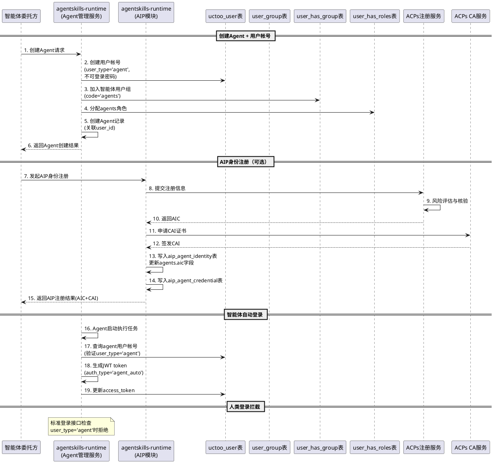

## **8.4 数据初始化要求**

### **8.4.1 新增用户组数据**

在 user_group 表新增智能体用户组：
- group_name: '智能体'
- code: 'agents'
- intro: '智能体专用用户组，用于RBAC权限管理'

### **8.4.2 现有 Agent 帐号适配**

对于已存在的 Agent 记录，需执行数据迁移：
1. 检查 agents 表中 user_id 对应的 uctoo_user 记录
2. 若 uctoo_user 表缺少 user_type 字段值，补充为 "agent"
3. 若 uctoo_user 表缺少 agent_id 字段值，补充为对应的 agents.id
4. 检查 user_has_group 中是否已关联智能体用户组，若未关联则补充
5. 检查 user_has_roles 中是否已关联 agents 角色，若未关联则补充

### **8.4.3 uctoo_user 表新增字段**

- user_type：varchar，默认值 'human'，必填；用于区分人类用户和智能体帐号
- agent_id：uuid，可选；仅当 user_type 为 'agent' 时有值，反向关联 agents 表

---

# **9. 双模式分层架构方案**

> 本章详细阐述本地模式与互联模式的双模式分层架构设计，包括功能对比、详细设计方案、模式切换机制和实施优先级。

## **9.1 架构总览**

### **9.1.1 双模式功能对比**

| 能力维度 | 本地模式（Local Mode） | 互联模式（Interconnection Mode） |
|---|---|---|
| **适用场景** | agentskills-runtime 内部 Agent 间协作，所有 Agent 在同一进程/同一系统中运行 | 需要与外部系统的智能体互联，Agent 需要跨系统通信 |
| **身份管理** | 复用 uctoo_user + RBAC 体系，Agent 通过 user_id 关联用户帐号，无密码自动登录 | 在本地模式基础上叠加 AIC 身份码、CAI 凭证、mTLS 认证 |
| **描述管理** | 扩展现有 agents + agent_skills 表，增加国标 ACS 标准字段 | 在本地模式基础上增加 aip_agent_description 表，存储完整 GB/Z 185.4 标准描述 |
| **智能体发现** | 基于 agents 表和 agent_skills 表进行本地发现 | 在本地发现基础上叠加 ACPs 发现服务跨系统发现 |
| **智能体交互** | 复用 agent_messages + agent_tasks 体系，参考 GB/Z 185.6 消息/任务结构扩展字段 | 在本地交互基础上叠加 mTLS 认证、MQ 消息分发、aip_interaction_session/task/message 表 |
| **工具调用** | 完全复用现有 MCP 工具体系 | 在 MCP 基础上叠加 GB/Z 185.7 标准化工具描述和跨系统工具调用 |
| **AIC 身份码** | 不需要（通过 user_id + agent_id 标识） | 必须通过 ACPs 注册服务获取 |
| **ACPs 注册服务** | 不需要 | 必须对接 |
| **CA 证书/mTLS** | 不需要（通过 JWT Bearer Token 认证） | 必须支持 |
| **发现服务** | 不需要（本地数据库查询） | 必须对接 ACPs 发现服务 |
| **MQ 消息分发** | 不需要（通过 agent_messages 表传递） | 群组交互必须通过 MQ 消息分发 |
| **数据存储** | 现有表扩展字段即可 | 现有表扩展字段 + AIP 独立新建表 |

### **9.1.2 架构分层示意**

```
┌─────────────────────────────────────────────────────────┐
│                    互联模式（Interconnection Mode）        │
│  ┌───────────┐ ┌───────────┐ ┌───────────┐ ┌──────────┐ │
│  │AIC身份码   │ │CAI凭证    │ │ACPs发现   │ │MQ消息分发 │ │
│  │分配与管理  │ │mTLS认证   │ │服务对接    │ │群组交互   │ │
│  └───────────┘ └───────────┘ └───────────┘ └──────────┘ │
│  ┌─────────────────────────────────────────────────────┐ │
│  │  AIP独立新建表（aip_agent_identity/credential/      │ │
│  │  description/session/task/message/service_config/   │ │
│  │  discovery_cache）                                  │ │
│  └─────────────────────────────────────────────────────┘ │
├─────────────────────────────────────────────────────────┤
│                    本地模式（Local Mode）                  │
│  ┌───────────┐ ┌───────────┐ ┌───────────┐ ┌──────────┐ │
│  │uctoo_user │ │agents表   │ │agent_msgs │ │MCP工具   │ │
│  │+RBAC认证  │ │ACS字段扩展│ │+tasks扩展 │ │体系复用  │ │
│  └───────────┘ └───────────┘ └───────────┘ └──────────┘ │
│  ┌─────────────────────────────────────────────────────┐ │
│  │  现有表扩展字段（agents/agent_messages/agent_tasks/  │ │
│  │  uctoo_user 新增国标标准字段）                       │ │
│  └─────────────────────────────────────────────────────┘ │
├─────────────────────────────────────────────────────────┤
│               agentskills-runtime 现有基础设施             │
│  ┌───────────┐ ┌───────────┐ ┌───────────┐ ┌──────────┐ │
│  │Agent执行器 │ │MCP工具服务│ │权限服务    │ │用户服务  │ │
│  └───────────┘ └───────────┘ └───────────┘ └──────────┘ │
└─────────────────────────────────────────────────────────┘
```

## **9.2 本地模式详细设计**

### **9.2.1 身份管理（本地）**

1. **身份标识**：Agent 通过 uctoo_user.id（UUID）+ agents.id（UUID）进行标识，无需国标 AIC 身份码
2. **认证方式**：JWT Bearer Token + RBAC 权限校验，无需 mTLS 双向认证
3. **自动登录**：Agent 启动执行任务时，系统自动生成 JWT token（auth_type='agent_auto'），跳过密码验证
4. **身份状态**：通过 agents.status 和 uctoo_user.status 管理，无需国标 identity_status（始终为 "none"）
5. **人类用户限制**：禁止通过标准登录接口登录 user_type='agent' 的帐号

### **9.2.2 描述管理（本地）**

1. **描述存储**：扩展 agents 表新增 capabilities、default_input_types、default_output_types、discoverable 字段，存储国标 ACS 标准中与本地场景相关的字段
2. **技能映射**：agent_skills 表的技能信息与 ACS skills 格式双向映射，通过应用层转换逻辑实现
3. **描述变更**：变更后直接更新 agents 表和 agent_skills 表中的对应记录
4. **无需发布流程**：本地模式下描述变更即时生效，无需 ACPs 注册服务审核和发布

### **9.2.3 智能体发现（本地）**

1. **发现方式**：基于 agents 表和 agent_skills 表进行本地数据库查询
2. **发现条件**：支持按名称、技能关键词、描述关键词等条件组合查询
3. **可发现性控制**：通过 agents.discoverable 字段控制是否允许被本地发现查询返回
4. **无网络延迟**：所有发现操作在本地数据库完成，无外部服务依赖

### **9.2.4 智能体交互（本地）**

1. **交互方式**：通过 agent_messages 表进行点对点和群组消息传递，通过 agent_tasks 表进行任务管理
2. **会话管理**：通过 agent_messages.aip_session_id 字段关联同一会话的消息
3. **消息结构**：参考 GB/Z 185.6 消息结构，扩展 agent_messages 表新增 sender_role、data_items 字段
4. **任务结构**：参考 GB/Z 185.6 任务结构，扩展 agent_tasks 表新增 aip_task_state 字段
5. **认证前置**：交互前需完成 JWT Bearer Token 认证和 RBAC 权限校验

### **9.2.5 工具调用（本地）**

1. **完全复用 MCP**：本地模式下工具调用完全复用现有 MCP 工具体系，无需额外实现
2. **工具描述对齐**：现有 MCP 工具描述参考 GB/Z 185.7 标准格式

## **9.3 互联模式详细设计**

> 互联模式在本地模式基础上叠加以下分布式能力，不是替代本地模式。

### **9.3.1 身份管理（互联增强）**

1. **AIC 身份码**：通过 ACPs 注册服务获取符合 GB/Z 185.2 的 AIC，写入 agents.aic 字段和 aip_agent_identity 表
2. **CAI 凭证**：通过 CA 服务签发智能体身份证书，存储到 aip_agent_credential 表
3. **mTLS 认证**：互联交互前必须完成 mTLS 双向认证
4. **身份注册流程**：遵循 GB/Z 185.2 五步流程（注册发起→风险评估→证据核验→身份建立及凭证发行→身份账户激活）
5. **身份生命周期**：支持注册、更新、锁定、解锁、注销，通过 aip_agent_identity.identity_status 管理

### **9.3.2 描述管理（互联增强）**

1. **完整 ACS 描述**：通过 aip_agent_description 表存储 GB/Z 185.4 完整标准化描述
2. **描述注册到 ACPs**：描述注册需同步到 ACPs 注册服务
3. **描述发布**：发布后可被 ACPs 发现服务发现
4. **描述同步**：变更后必须同步到 ACPs 发现服务
5. **双向映射**：aip_agent_description 与 agents + agent_skills 表保持双向映射

### **9.3.3 智能体发现（互联增强）**

1. **跨系统发现**：调用 ACPs 发现服务查询外部系统的智能体
2. **发现结果合并**：本地发现结果和互联发现结果合并返回
3. **结果缓存**：互联发现结果缓存到 aip_discovery_cache 表，用于降级查询
4. **自然语言查询**：支持自然语言描述作为发现条件

### **9.3.4 智能体交互（互联增强）**

1. **mTLS 身份鉴别**：互联交互前必须完成 mTLS 双向身份鉴别
2. **会话管理**：通过 aip_interaction_session 表管理互联交互会话
3. **消息结构**：通过 aip_interaction_message 表存储 GB/Z 185.6 标准消息结构
4. **任务结构**：通过 aip_interaction_task 表存储 GB/Z 185.6 标准任务结构
5. **群组交互**：通过 MQ 消息分发实现群组交互
6. **数据双写**：互联交互产生的消息/任务同时写入 AIP 表和现有表，通过关联字段保持一致

### **9.3.5 工具调用（互联增强）**

1. **标准化工具描述**：工具描述符合 GB/Z 185.7 标准格式
2. **跨系统工具调用**：支持发现和调用外部系统的工具
3. **MCP 互操作**：AIP 工具服务与 MCP 工具体系互操作

### **9.3.6 互联模式专属表**

以下表仅在互联模式下使用，本地模式下不创建或不写入数据：

| 表名 | 用途 | 对应国标 |
|---|---|---|
| aip_agent_identity | 智能体身份码记录 | GB/Z 185.2 |
| aip_agent_credential | 智能体凭证记录 | GB/Z 185.2 |
| aip_agent_description | 智能体描述记录 | GB/Z 185.4 |
| aip_interaction_session | 智能体交互会话 | GB/Z 185.6 |
| aip_interaction_task | 智能体交互任务 | GB/Z 185.6 |
| aip_interaction_message | 智能体交互消息 | GB/Z 185.6 |
| aip_service_config | AIP 服务配置 | 运维支撑 |
| aip_discovery_cache | AIP 发现缓存 | GB/Z 185.5 |

## **9.4 模式切换机制**

### **9.4.1 自动降级**

1. **启动时判断**：系统启动时检查 ACPs 服务端点配置，若未配置则自动以本地模式运行
   - 验收条件：[系统启动时未配置 ACPs 服务端点] → [系统自动以本地模式运行]

2. **运行时降级**：运行时若 ACPs 服务不可用，自动降级为本地模式
   - 验收条件：[ACPs 注册服务/发现服务不可用] → [系统自动降级为本地模式，互联功能不可用但本地功能正常]

3. **降级通知**：模式降级时必须记录日志并通知管理员
   - 验收条件：[系统从互联模式降级为本地模式] → [记录降级日志，发送管理员通知]

### **9.4.2 配置驱动**

1. **ACPs 服务端点配置**：通过环境变量或配置文件配置 ACPs 各服务端点
   - 配置项：`AIP_REGISTRY_ENDPOINT`、`AIP_CA_ENDPOINT`、`AIP_DISCOVERY_ENDPOINT`、`AIP_MQ_ENDPOINT`
   - 验收条件：[配置所有 ACPs 服务端点] → [系统以互联模式运行]

2. **模式强制配置**：支持通过 `AIP_MODE` 环境变量强制指定运行模式
   - 可选值：`local`（强制本地模式）、`interconnection`（强制互联模式）、`auto`（自动判断，默认值）
   - 验收条件：[设置 AIP_MODE=local] → [系统强制以本地模式运行，即使配置了 ACPs 服务端点]

3. **单 Agent 模式配置**：支持为单个 Agent 配置是否启用互联模式
   - 验收条件：[Agent 配置为仅本地模式] → [该 Agent 不参与互联交互]

### **9.4.3 运行时切换**

1. **从本地模式升级到互联模式**：
   - 前提条件：已配置 ACPs 服务端点且服务可用
   - 触发方式：管理员手动触发或 Agent 发起互联交互时自动触发
   - 升级步骤：验证 ACPs 服务连通性 → 为需要互联的 Agent 注册 AIC 身份 → 同步描述到 ACPs 注册服务 → 切换到互联模式
   - 验收条件：[管理员触发升级或 Agent 发起互联交互] → [系统完成身份注册和描述同步后切换到互联模式]

2. **从互联模式降级到本地模式**：
   - 触发条件：ACPs 服务不可用或管理员手动触发
   - 降级行为：停止互联交互，本地交互继续正常工作
   - 数据保留：已缓存的互联发现结果和已写入的 AIP 表数据保留
   - 验收条件：[ACPs 服务不可用] → [系统降级为本地模式，本地功能正常，互联功能暂停]

3. **数据模型兼容性**：
   - 本地模式扩展的字段（agents/agent_messages/agent_tasks/uctoo_user）在互联模式下同样有效
   - 互联模式专属表（aip_agent_identity 等）在本地模式下不创建或不写入数据
   - 从本地模式升级到互联模式时，现有数据无需迁移，仅需补充 AIP 专属数据

## **9.5 实施优先级**

### **9.5.1 MVP 阶段 — 本地模式优先实现**

1. **优先级 P0（必须实现）**：
   - 本地身份管理：uctoo_user 表新增 user_type/agent_id 字段，Agent 自动创建用户帐号，无密码自动登录
   - 本地描述管理：agents 表新增 capabilities/default_input_types/default_output_types/discoverable 字段
   - 本地智能体发现：基于 agents 表和 agent_skills 表的本地发现查询
   - 本地智能体交互：agent_messages 表新增 aip_session_id/aip_message_id/sender_role/data_items 字段，agent_tasks 表新增 aip_session_id/aip_task_id/aip_task_state 字段
   - 模式自动判断：系统启动时根据 ACPs 服务端点配置自动判断运行模式

2. **优先级 P1（应当实现）**：
   - 人类用户限制使用 agents 帐号
   - 智能体用户组自动加入
   - RBAC 权限隔离规则
   - 本地模式健康检查接口

### **9.5.2 后续迭代 — 互联模式增量实现**

3. **优先级 P2（互联模式基础）**：
   - AIP 独立新建表创建（aip_agent_identity/credential/description/session/task/message/service_config/discovery_cache）
   - ACPs 注册服务对接（身份注册、描述注册、描述发布）
   - CA 服务对接（CAI 证书签发、mTLS 认证）
   - ACPs 发现服务对接（跨系统智能体发现）

4. **优先级 P3（互联模式增强）**：
   - MQ 消息分发对接（群组交互）
   - 互联模式健康检查
   - AIC 合法性验证
   - 运行时模式切换（从本地模式升级到互联模式）

5. **优先级 P4（远期规划）**：
   - 跨注册中心的联邦发现
   - 智能体监控协议（AMP）
   - 数据同步协议（DSP）
   - ACPs 协议版本升级支持