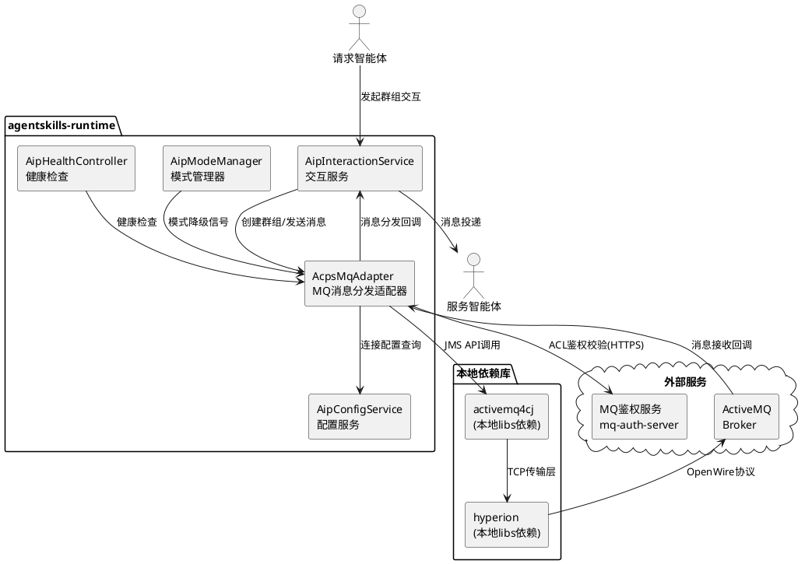
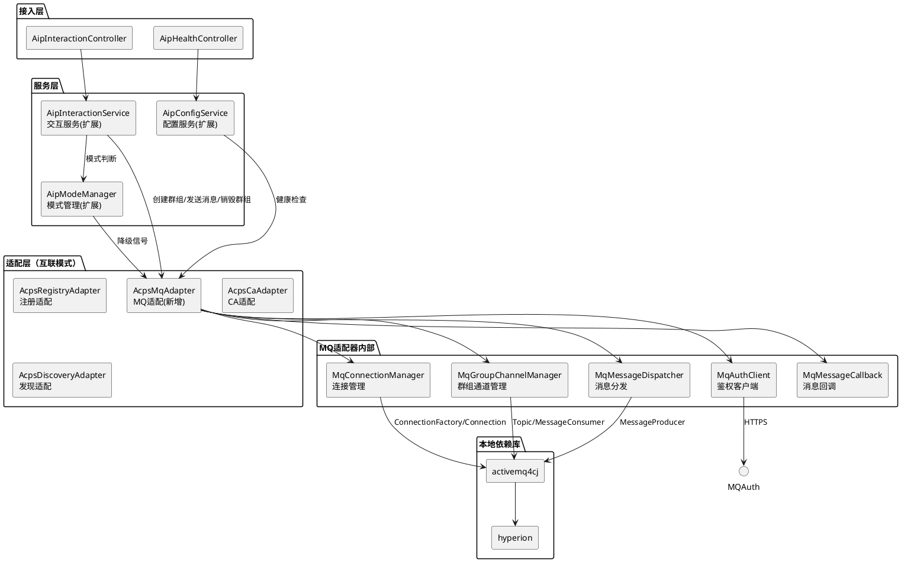
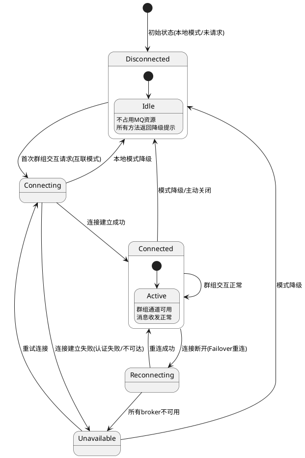
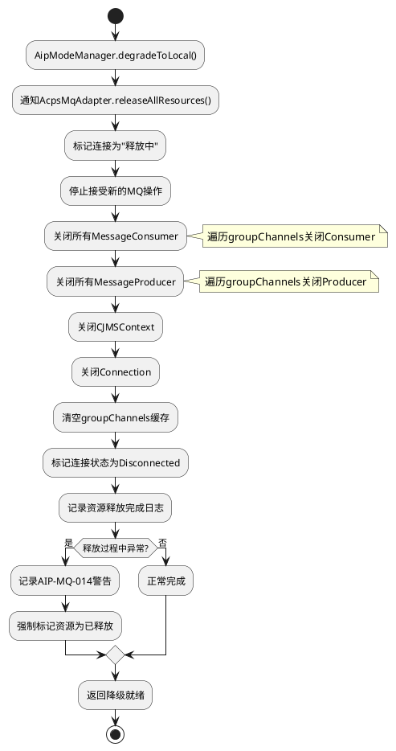
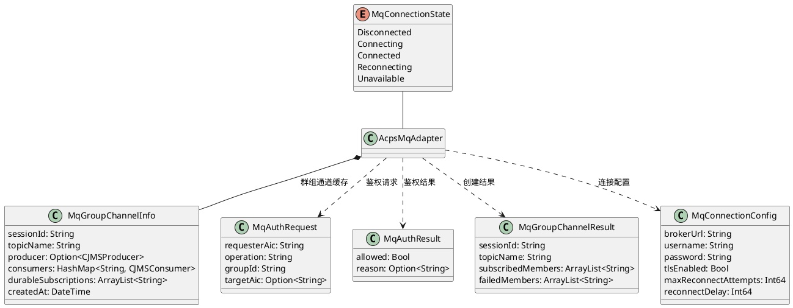

# MQ消息分发适配器实现方案文档

## 文档信息
- **项目名称**: agentskills-runtime AIP 互联模式 MQ 消息分发适配器
- **版本**: 1.0.0
- **创建日期**: 2026-07-10
- **作者**: spec-design-agent
- **状态**: 待实现
- **关联需求**: aip-mq-adapter spec.md v1.1.0
- **关联主设计**: aip-implementation design.md v1.0.0
- **技术基础**: activemq4cj（本地 libs 依赖）+ hyperion（本地 libs 依赖）

---

# 一、需求与存量功能关系分析

## 1.1 需求功能与存量功能对比

### 1.1.1 已实现功能

| 需求功能 | 存量功能 | 代码位置 | 匹配度 |
|---------|---------|---------|--------|
| AIP 模式管理（本地/互联模式判断） | AipModeManager 已实现模式切换、ACPs 可用性检查 | `src/app/services/aip/AipModeManager.cj:14-228` | 75% |
| MQ 端点配置存储 | AipModeManager 已有 mqEndpoint 字段和 getMqEndpoint() 方法 | `src/app/services/aip/AipModeManager.cj:19,150-152` | 75% |
| 互联交互会话管理 | AipInteractionService 已实现 createInterconnectionSession/sendInterconnectionMessage/closeInterconnectionSession | `src/app/services/aip/AipInteractionService.cj:120-229` | 50% |
| 互联交互消息双写 | AipInteractionService.sendInterconnectionMessage() 已实现 aip_interaction_message + agent_messages 双写 | `src/app/services/aip/AipInteractionService.cj:146-207` | 50% |
| AIP 消息格式校验 | AipMessageValidator 已实现 sessionId/senderRole/dataItems 校验 | `src/app/services/aip/AipMessageValidator.cj:1-62` | 50% |
| AIC 身份码校验 | AicValidator 已实现 AIC OID 格式校验和解析 | `src/app/services/aip/AicValidator.cj:1-138` | 75% |
| 互联模式健康检查 | AipConfigService.healthCheckInterconnection() 已实现，但 MQ 组件标记为 "not yet integrated" | `src/app/services/aip/AipConfigService.cj:141-207` | 50% |
| ACPs 适配器模式 | AcpsRegistryAdapter/AcpsCaAdapter/AcpsDiscoveryAdapter 已建立一致的适配器模式（HTTP 通信 + checkConnectivity） | `src/app/services/aip/acps/AcpsRegistryAdapter.cj` `AcpsCaAdapter.cj` `AcpsDiscoveryAdapter.cj` | 75% |
| 本地依赖模式参考 | fountain 库已建立 libs/ 本地依赖模式，cjpm.toml 使用 path 声明 | `libs/fountain/` `cjpm.toml:15-21` | 100% |
| aip_service_config 表 | 已创建，支持 service_type='mq' 的配置记录 | `scripts/migration/aip_interconnection_v1.sql` | 100% |
| aip_interaction_session 表 | 已创建，包含 sessionId/requesterAic/interactionMode/receivers 等字段 | `scripts/migration/aip_interconnection_v1.sql` | 100% |
| aip_interaction_message 表 | 已创建，包含 messageId/sessionId/senderRole/senderAic/dataItems 等字段 | `scripts/migration/aip_interconnection_v1.sql` | 100% |

### 1.1.2 需要扩展的功能

| 需求功能 | 存量功能 | 差异说明 | 扩展方向 |
|---------|---------|---------|---------|
| MQ 连接管理 | AipModeManager 仅有 mqEndpoint 配置字段，无连接建立/关闭/重连逻辑 | 缺少基于 activemq4cj 的 JMS 连接生命周期管理（ConnectionFactory → Connection → CJMSContext） | 新建 AcpsMqAdapter，封装 JMS 连接管理 |
| 群组通道管理 | AipInteractionService.createInterconnectionSession() 仅创建数据库记录，无 MQ Topic 创建 | 缺少 ActiveMQ Topic 创建/销毁、MessageConsumer 创建/关闭逻辑 | AcpsMqAdapter 新增群组通道管理方法，AipInteractionService 集成调用 |
| 群组消息分发 | AipInteractionService.sendInterconnectionMessage() 仅双写数据库，无 MQ 消息发布 | 缺少 JMS MessageProducer 发送消息到 Topic 的逻辑 | AcpsMqAdapter 新增消息发布方法，AipInteractionService 集成调用 |
| MQ 鉴权集成 | 无 MQ ACL 鉴权逻辑 | 缺少调用 mq-auth-server 的 ACL 校验接口 | AcpsMqAdapter 新增 ACL 鉴权方法，群组操作前调用 |
| 模式降级 MQ 资源释放 | AipModeManager.degradeToLocal() 仅切换模式标记，无 MQ 资源释放 | 缺少关闭 MQ Connection/CJMSContext/Producer/Consumer 的逻辑 | AipModeManager 降级时通知 AcpsMqAdapter 释放资源 |
| 互联健康检查 MQ 组件 | AipConfigService.healthCheckInterconnection() 中 MQ 组件标记为 "not yet integrated" | 缺少 MQ 连接状态检查逻辑 | AcpsMqAdapter 新增 checkConnectivity()，AipConfigService 集成调用 |
| AcpsConnectivityResult | 仅有 registry/ca/discovery 可达性字段，无 MQ 可达性字段 | 缺少 mqReachable 字段 | 扩展 AcpsConnectivityResult 新增 mqReachable |
| 本地模式降级兼容 | AipInteractionService 互联模式方法未处理本地模式降级场景 | 缺少本地模式下群组交互的降级处理 | AipInteractionService 检查模式，本地模式走 agent_messages 分发 |
| cjpm.toml 依赖声明 | 当前无 activemq4cj/hyperion 依赖 | 需要新增本地 libs 依赖声明 | cjpm.toml 新增 activemq4cj/hyperion path 依赖 |
| activemq4cj 版本适配 | TPC 原始版本 cjc-version="1.0.0"，项目使用 1.0.4 | 需要适配仓颉 SDK 版本差异 | 本地 libs 中的 activemq4cj/hyperion 更新 cjc-version 并适配编译 |

### 1.1.3 需要新增的功能或接口

#### 本地依赖集成模块
- 将 TPC activemq4cj 源码复制到 `libs/activemq4cj/`
- 将 TPC hyperion 源码复制到 `libs/hyperion/`
- 修改 activemq4cj 的 cjpm.toml：hyperion 依赖从 git 改为 path 方式
- 更新 activemq4cj/hyperion 的 cjc-version 为 "1.0.4"
- 适配仓颉 SDK 1.0.4 编译不通过的代码
- 创建版本适配变更日志 VERSION_ADAPTATION.md

#### AcpsMqAdapter 核心功能
- MQ 连接管理：建立/关闭/重连 JMS 连接
- 群组通道管理：创建/销毁 Topic，创建/关闭 MessageConsumer
- 群组消息分发：通过 MessageProducer 发布消息到 Topic
- MQ 鉴权集成：调用 mq-auth-server ACL 校验
- 消息接收回调：从 MQ 接收消息后回调 AipInteractionService
- 连接健康检查：检查 MQ 连接状态
- 本地模式降级：所有方法返回降级提示

#### MQ 消息接收回调机制
- AcpsMqAdapter 接收 MQ 消息后回调 AipInteractionService
- AipInteractionService 双写 aip_interaction_message 和 agent_messages
- 基于 messageId 的消息去重

#### MQ 相关数据模型
- MqConnectionState 枚举：disconnected/connecting/connected/unavailable
- MqGroupChannelInfo 数据类：群组通道信息
- MqAuthRequest/MqAuthResult 数据类：鉴权请求/结果

#### 错误码体系
- AIP-MQ-001 ~ AIP-MQ-014 完整定义

## 1.2 存量功能详细分析

### 1.2.1 ACPs 适配器层

**接口契约**：
- 三个适配器（AcpsRegistryAdapter/AcpsCaAdapter/AcpsDiscoveryAdapter）均遵循统一模式
- 使用 `getEnv()` 获取服务 URL，返回 `Option<String>` 或 `Bool`
- HTTP 通信通过 `HttpUtils.post()/get()` 实现
- 均提供 `checkConnectivity(): Bool` 方法
- 请求/响应使用 `JsonObject` 传递

**业务规则**：
- 适配器不持有状态，每次调用创建新实例
- 异常捕获后记录日志，返回 None/false
- 认证通过 Bearer Token 环境变量传递

**扩展点**：
- AcpsMqAdapter 需遵循相同模式：getEnv 获取配置、HttpUtils 通信、checkConnectivity 检查连通性
- 但 MQ 适配器需要额外管理 JMS 连接状态（有状态），与现有无状态适配器不同
- MQ 鉴权调用可复用 HttpUtils 模式

**约束**：
- AcpsMqAdapter 不能完全无状态，需要持有 JMS Connection 和 CJMSContext
- 需要线程安全管理连接状态
- 本地模式下所有方法必须返回降级提示，不建立连接

### 1.2.2 AipModeManager

**接口契约**：
- `getCurrentMode(): AipMode` — 获取当前模式
- `isInterconnectionMode(): Bool` — 判断是否互联模式
- `upgradeToInterconnection(): APIResult<Bool>` — 升级到互联模式
- `degradeToLocal(reason: String): APIResult<Bool>` — 降级到本地模式
- `checkAndAutoDegrade(): Bool` — 检查并自动降级
- `checkAcpsConnectivity(): AcpsConnectivityResult` — 检查 ACPs 连通性
- `getMqEndpoint(): Option<String>` — 获取 MQ 端点配置

**业务规则**：
- 启动时根据 AIP_MODE 环境变量和 ACPs 端点配置自动判断模式
- 降级时仅切换 currentMode 标记，不释放外部资源
- AcpsConnectivityResult 包含 registryReachable/caReachable/discoveryReachable/overallAvailable

**扩展点**：
- degradeToLocal() 需扩展：降级前通知 AcpsMqAdapter 释放 MQ 资源
- checkAcpsConnectivity() 需扩展：新增 mqReachable 检查
- AcpsConnectivityResult 需扩展：新增 mqReachable 字段

**约束**：
- 降级流程不能因 MQ 资源释放失败而阻塞
- MQ 连通性检查不应影响 overallAvailable 判定（MQ 为可选依赖）

### 1.2.3 AipInteractionService

**接口契约**：
- `createInterconnectionSession()` — 创建互联会话，写入 aip_interaction_session 表
- `sendInterconnectionMessage()` — 发送互联消息，双写 aip_interaction_message + agent_messages
- `closeInterconnectionSession()` — 关闭互联会话，更新 session_status
- `getSessionMessages()` — 查询会话消息
- `closeSession()` — 关闭本地会话

**业务规则**：
- 互联消息双写：同时写入 AIP 标准表和现有表
- 消息通过 aip_session_id 关联
- 错误码格式：AIP-INTER-001~003

**扩展点**：
- createInterconnectionSession() 需扩展：创建会话后调用 AcpsMqAdapter 创建群组通道
- sendInterconnectionMessage() 需扩展：发送消息后调用 AcpsMqAdapter 发布到 Topic
- closeInterconnectionSession() 需扩展：关闭会话后调用 AcpsMqAdapter 销毁群组通道
- 新增消息接收回调方法：AcpsMqAdapter 回调后双写消息

**约束**：
- MQ 操作失败不应阻塞数据库写入（数据库写入优先）
- 本地模式下群组交互降级为 agent_messages 分发
- 消息去重基于 messageId

### 1.2.4 AipConfigService

**接口契约**：
- `healthCheckInterconnection()` — 互联模式健康检查，返回各 ACPs 服务连通性
- `healthCheckLocal()` — 本地模式健康检查

**业务规则**：
- 互联健康检查包含 database/localDiscovery/localInteraction/registryService/caService/discoveryService/mqService
- 当前 mqService 标记为 "not yet integrated"，状态为 unhealthy

**扩展点**：
- healthCheckInterconnection() 需扩展：调用 AcpsMqAdapter.checkConnectivity() 获取真实 MQ 状态

**约束**：
- MQ 健康检查不应阻塞其他组件检查
- MQ 不可用时应标记为 degraded 而非 unhealthy（MQ 为可选依赖）

### 1.2.5 本地依赖模式（fountain 参考）

**接口契约**：
- libs/fountain/ 包含完整源码和 cjpm.toml
- 项目 cjpm.toml 通过 `path = "./libs/fountain/f_orm"` 等声明依赖
- fountain 包含多个子模块（f_orm/f_data/f_config/f_util/f_ticktock/f_aspect/f_bean）

**业务规则**：
- 本地依赖便于版本适配和代码维护
- cjpm.toml 的 path 方式声明本地依赖

**扩展点**：
- activemq4cj 和 hyperion 采用相同模式：复制到 libs/ 目录，path 方式声明

**约束**：
- activemq4cj 的 cjpm.toml 需将 hyperion 依赖从 git 改为 path
- 需要适配仓颉 SDK 1.0.4 版本
- 版本适配修改需记录在 VERSION_ADAPTATION.md

### 1.2.6 activemq4cj（TPC 原始版本）

**接口契约**：
- JMS 2.0 简化 API：CJMSContext（整合 Connection + Session）
- ConnectionFactory：创建连接（支持用户名/密码认证、TLS）
- MessageProducer/MessageConsumer：消息收发
- Topic/Queue：消息目的地
- TextMessage：文本消息
- DeliveryMode：PERSISTENT/NON_PERSISTENT 投递模式
- SessionAcknowledgeMode：AUTO_ACKNOWLEDGE/CLIENT_ACKNOWLEDGE 等确认模式

**业务规则**：
- cjc-version = "1.0.0"，仅适配仓颉 SDK 1.0.0 LTS
- 依赖 hyperion（git 远程依赖）
- output-type = "static"

**扩展点**：
- cjc-version 需更新为 "1.0.4"
- hyperion 依赖需改为 path 方式
- 可能需要适配仓颉 SDK API 变更

**约束**：
- 版本适配仅修改编译不通过的代码，不重构或优化
- 公共 API 签名不可变更
- 需保留原始 TPC 项目的 git 历史或来源记录

---

# 二、增量设计方案

## 2.1 实现模型

### 2.1.1 上下文视图



**通信协议说明**：
- AcpsMqAdapter → activemq4cj：仓颉本地函数调用（同一进程）
- activemq4cj → hyperion：仓颉本地函数调用（同一进程）
- hyperion → ActiveMQ：OpenWire 协议（TCP/TLS）
- AcpsMqAdapter → mq-auth-server：HTTPS RESTful API
- AcpsMqAdapter → AipInteractionService：仓颉本地函数回调

### 2.1.2 服务/组件总体架构



**模块职责说明**：

| 模块 | 职责 | 新增/扩展 |
|------|------|----------|
| AcpsMqAdapter | MQ 消息分发适配器入口，对外暴露群组操作接口 | 新增 |
| MqConnectionManager | JMS 连接生命周期管理（建立/关闭/重连/健康检查） | 新增（AcpsMqAdapter 内部类） |
| MqGroupChannelManager | 群组通道管理（Topic 创建/销毁、Consumer 创建/关闭） | 新增（AcpsMqAdapter 内部类） |
| MqMessageDispatcher | 群组消息分发（Producer 发送、消息格式转换） | 新增（AcpsMqAdapter 内部类） |
| MqAuthClient | MQ 鉴权客户端（调用 mq-auth-server ACL 校验） | 新增（AcpsMqAdapter 内部类） |
| MqMessageCallback | 消息接收回调（从 MQ 接收消息后回调 AipInteractionService） | 新增（AcpsMqAdapter 内部类） |
| AipInteractionService | 交互服务扩展（集成 MQ 群组交互、消息接收回调） | 扩展 |
| AipModeManager | 模式管理扩展（降级时通知 MQ 释放资源、MQ 连通性检查） | 扩展 |
| AipConfigService | 配置服务扩展（互联健康检查集成 MQ 状态） | 扩展 |

### 2.1.3 实现设计文档

#### MQ 连接状态机



**状态转换触发条件**：

| 当前状态 | 目标状态 | 触发条件 | 处理策略 |
|---------|---------|---------|---------|
| Disconnected | Connecting | 互联模式下首次群组交互请求 | 读取连接配置，建立 JMS 连接 |
| Connecting | Connected | JMS 连接建立成功 | 创建 CJMSContext，返回连接就绪 |
| Connecting | Unavailable | 认证失败或 broker 不可达 | 返回错误码 AIP-MQ-001/AIP-MQ-002 |
| Connected | Reconnecting | 连接断开事件 | Failover 自动重连 |
| Reconnecting | Connected | 重连成功 | 恢复订阅和消费者 |
| Reconnecting | Unavailable | 所有 broker 不可用 | 触发模式降级 |
| Connected | Disconnected | 模式降级信号 | 关闭所有 MQ 资源 |
| Unavailable | Connecting | 重试连接 | 重新建立 JMS 连接 |

#### 群组交互消息分发流程（互联模式）

```plantuml
@startuml
start
:请求智能体发起群组交互;
:AipInteractionService.createInterconnectionSession();
:创建aip_interaction_session记录;

if (AipModeManager.isInterconnectionMode()?) then (是)
    :调用AcpsMqAdapter.createGroupChannel();
    
    if (MQ连接状态?) then (未连接)
        :MqConnectionManager.establishConnection();
        if (连接成功?) then (是)
            :创建CJMSContext;
        else (否)
            :返回错误AIP-MQ-002;
            :回退为本地群组交互;
            stop
        endif
    endif
    
    :MqAuthClient.checkAcl(create_group);
    if (ACL鉴权通过?) then (是)
        :MqGroupChannelManager.createTopic();
        :为每个成员创建MessageConsumer;
        :注册MqMessageCallback;
    else (否)
        :返回错误AIP-MQ-005;
        stop
    endif
else (否-本地模式)
    :降级为本地群组交互;
    :通过agent_messages分发;
    stop
endif

:返回群组创建成功;

== 消息发送 ==
:AipInteractionService.sendInterconnectionMessage();
:双写aip_interaction_message + agent_messages;

if (互联模式且MQ连接可用?) then (是)
    :MqAuthClient.checkAcl(publish_message);
    :MqMessageDispatcher.publishToTopic();
    :消息发布到aip.group.{sessionId};
else (否)
    :跳过MQ发布;
endif

:返回消息发送结果;

== 消息接收 ==
:MQ Consumer接收消息;
:MqMessageCallback.onMessage();
:基于messageId去重;
:回调AipInteractionService.handleMqMessage();
:双写aip_interaction_message + agent_messages;
:投递给服务智能体;

stop
@enduml
```

#### 模式降级 MQ 资源释放流程



## 2.2 接口设计

### 2.2.1 总体设计

**接口分类**：

| 接口分类 | 所属类 | 模式 | 稳定性 |
|---------|--------|------|--------|
| MQ 群组操作接口 | AcpsMqAdapter | 仅互联 | 稳定 |
| MQ 连接管理接口 | AcpsMqAdapter（内部） | 仅互联 | 稳定 |
| MQ 鉴权接口 | AcpsMqAdapter（内部） | 仅互联 | 稳定 |
| MQ 消息回调接口 | AcpsMqAdapter（内部） | 仅互联 | 稳定 |
| MQ 健康检查接口 | AcpsMqAdapter | 本地+互联 | 稳定 |
| 交互服务扩展接口 | AipInteractionService（扩展） | 本地+互联 | 稳定 |
| 模式管理扩展接口 | AipModeManager（扩展） | 本地+互联 | 稳定 |

**接口变更策略**：
- AcpsMqAdapter 为新增类，不影响现有接口
- AipInteractionService/AipModeManager/AipConfigService 为扩展修改，保持现有接口签名不变
- 所有 MQ 操作在本地模式下返回降级提示

### 2.2.2 接口清单

#### AcpsMqAdapter 公共接口

**1. 创建群组通道**

```
func createGroupChannel(sessionId: String, requesterAic: String, memberAics: ArrayList<String>, durable: Bool): APIResult<MqGroupChannelResult>
```

- **业务说明**：在 ActiveMQ 上创建群组 Topic 通道，并为每个成员创建 MessageConsumer
- **前置条件**：互联模式，MQ 连接已建立或可建立，ACL 鉴权通过
- **后置条件**：ActiveMQ 上创建 Topic `aip.group.{sessionId}`，每个成员有对应的 MessageConsumer
- **异常映射**：AIP-MQ-001（认证失败）、AIP-MQ-002（连接失败）、AIP-MQ-005（ACL 鉴权失败）、AIP-MQ-006（通道创建失败）、AIP-MQ-007（部分成员订阅失败）
- **本地模式**：返回错误提示"本地模式不支持MQ群组交互"

**2. 发布群组消息**

```
func publishGroupMessage(sessionId: String, messageId: String, senderAic: String, senderRole: String, dataItems: String, deliveryMode: String, timeToLive: Int64): APIResult<Bool>
```

- **业务说明**：将群组消息发布到 Topic `aip.group.{sessionId}`
- **前置条件**：群组通道已创建，ACL 鉴权通过
- **后置条件**：消息发布到 ActiveMQ Topic，所有订阅者可接收
- **异常映射**：AIP-MQ-005（ACL 鉴权失败）、AIP-MQ-009（消息发送失败）、AIP-MQ-012（事务回滚）
- **本地模式**：返回错误提示"本地模式不支持MQ消息发布"

**3. 订阅群组通道**

```
func subscribeGroupChannel(sessionId: String, subscriberAic: String, durable: Bool): APIResult<Bool>
```

- **业务说明**：为指定智能体创建群组 Topic 的 MessageConsumer
- **前置条件**：群组 Topic 已创建，ACL 鉴权通过
- **后置条件**：智能体可接收群组消息
- **异常映射**：AIP-MQ-005（ACL 鉴权失败）、AIP-MQ-007（订阅失败）
- **本地模式**：返回错误提示"本地模式不支持MQ群组订阅"

**4. 退订群组通道**

```
func unsubscribeGroupChannel(sessionId: String, subscriberAic: String): APIResult<Bool>
```

- **业务说明**：关闭指定智能体的群组 MessageConsumer
- **前置条件**：智能体已订阅群组通道
- **后置条件**：智能体不再接收群组消息
- **异常映射**：AIP-MQ-008（退订失败）
- **本地模式**：返回错误提示"本地模式不支持MQ群组退订"

**5. 销毁群组通道**

```
func destroyGroupChannel(sessionId: String): APIResult<Bool>
```

- **业务说明**：关闭群组所有 Consumer，取消 Topic 订阅，清理资源
- **前置条件**：群组通道已创建
- **后置条件**：群组通道资源释放，Topic 仍存在（ActiveMQ 自动清理无订阅 Topic）
- **异常映射**：AIP-MQ-008（通道销毁失败）
- **本地模式**：返回 true（无需操作）

**6. 释放所有 MQ 资源**

```
func releaseAllResources(): APIResult<Bool>
```

- **业务说明**：关闭所有 MQ 连接、会话、生产者、消费者，释放资源
- **前置条件**：无（可在任何模式下调用）
- **后置条件**：所有 MQ 资源释放，连接状态变为 Disconnected
- **异常映射**：AIP-MQ-014（资源释放异常，已强制标记释放）
- **本地模式**：返回 true（无需操作）

**7. 检查 MQ 连通性**

```
func checkConnectivity(): Bool
```

- **业务说明**：检查 MQ 连接是否可用
- **前置条件**：无
- **后置条件**：返回连通性状态
- **本地模式**：返回 false

**8. 获取 MQ 连接状态**

```
func getConnectionState(): MqConnectionState
```

- **业务说明**：获取当前 MQ 连接状态
- **前置条件**：无
- **后置条件**：返回连接状态枚举
- **本地模式**：返回 Disconnected

**9. 消息接收回调注册**

```
func setMessageCallback(callback: (String, String, String, String, String, ?String) -> APIResult<Bool>): Unit
```

- **业务说明**：注册消息接收回调函数，MQ 消息到达时调用。回调签名为 `(sessionId, messageId, senderAic, senderRole, dataItems, taskId?) -> APIResult<Bool>`
- **前置条件**：无
- **后置条件**：回调函数已注册
- **本地模式**：无操作
- **实现说明**：AcpsMqAdapter 内部实现 `MessageListener` 接口（来自 `activemq4cj.cjms.MessageListener`），在 `onMessage(message: Message): Unit` 方法中解析消息后调用此回调函数。不直接将 MessageListener 暴露给外部。

#### AipInteractionService 扩展接口

**10. 处理 MQ 接收消息（回调）**

```
func handleMqMessage(sessionId: String, messageId: String, senderAic: String, senderRole: String, dataItems: String, taskId: Option<String>): APIResult<Bool>
```

- **业务说明**：AcpsMqAdapter 接收到 MQ 消息后回调此方法，实现消息双写
- **前置条件**：消息格式符合 GB/Z 185.6 标准
- **后置条件**：消息双写到 aip_interaction_message 和 agent_messages
- **异常映射**：AIP-MQ-010（消息处理异常）

#### AipModeManager 扩展接口

**11. 降级时通知 MQ 释放资源**

- 扩展 `degradeToLocal()` 方法内部逻辑
- 降级前调用 `AcpsMqAdapter.releaseAllResources()`

**12. MQ 连通性检查**

- 扩展 `checkAcpsConnectivity()` 方法
- 新增 mqReachable 检查
- 扩展 AcpsConnectivityResult 新增 mqReachable 字段

## 2.3 数据模型

### 2.3.1 设计目标

1. **支持 MQ 连接状态管理**：定义 MqConnectionState 枚举管理连接生命周期
2. **支持群组通道信息缓存**：定义 MqGroupChannelInfo 缓存群组通道的 JMS 资源引用
3. **支持 MQ 鉴权请求/响应**：定义 MqAuthRequest/MqAuthResult 数据类
4. **复用现有 aip_service_config 表**：MQ 配置通过 service_type='mq' 记录存储
5. **复用现有 aip_interaction_session/message 表**：群组交互数据结构不变
6. **不新增数据库表**：所有 MQ 相关数据通过内存缓存和现有表管理

### 2.3.2 模型实现

#### 新增枚举和数据类



#### 仓颉语法定义

**MqConnectionState 枚举**：

```cangjie
public enum MqConnectionState {
    | Disconnected
    | Connecting
    | Connected
    | Reconnecting
    | Unavailable
}
```

**MqGroupChannelInfo 数据类**：

```cangjie
public class MqGroupChannelInfo {
    public let sessionId: String
    public let topicName: String
    public var producer: ?CJMSProducer       // Option<CJMSProducer> 的 ?T 别名
    public var consumers: HashMap<String, CJMSConsumer>
    public let durableSubscriptions: ArrayList<String>
    public let createdAt: DateTime
}
```

**MqAuthRequest 数据类**：

```cangjie
public class MqAuthRequest {
    public let requesterAic: String
    public let operation: String
    public let groupId: String
    public let targetAic: ?String            // Option<String> 的 ?T 别名
}
```

**MqAuthResult 数据类**：

```cangjie
public class MqAuthResult {
    public let allowed: Bool
    public let reason: ?String               // Option<String> 的 ?T 别名
}
```

**MqGroupChannelResult 数据类**：

```cangjie
public class MqGroupChannelResult {
    public let sessionId: String
    public let topicName: String
    public let subscribedMembers: ArrayList<String>
    public let failedMembers: ArrayList<String>
}
```

**MqConnectionConfig 数据类**：

```cangjie
public class MqConnectionConfig {
    public let brokerUrl: String             // Failover 格式：failover:(tcp://host1:61616,tcp://host2:61616)?maxReconnectAttempts=10
    public let username: String
    public let password: String
    public let tlsEnabled: Bool
    public let maxReconnectAttempts: Int64
    public let reconnectDelay: Int64
}
```

**消息回调类型定义**：

```cangjie
// 消息处理回调函数类型
// 参数：sessionId, messageId, senderAic, senderRole, dataItems, taskId?
// 返回：APIResult<Bool>
public type MqMessageCallbackFunc = (String, String, String, String, String, ?String) -> APIResult<Bool>
```

**AcpsMqAdapter 内部 MessageListener 实现**：

```cangjie
// AcpsMqAdapter 内部类，实现 activemq4cj.cjms.MessageListener 接口
// 在 onMessage 中解析 Message 并调用 MqMessageCallbackFunc
internal class MqMessageListener <: MessageListener {
    private let callback: MqMessageCallbackFunc
    private let processedIds: HashSet<String>   // 消息去重缓存

    public func onMessage(message: Message): Unit {
        // 1. 从 message 解析 sessionId/messageId/senderAic/senderRole/dataItems/taskId
        // 2. 基于 messageId 去重检查
        // 3. 调用 callback(sessionId, messageId, senderAic, senderRole, dataItems, taskId)
    }
}
```

#### aip_service_config 表 MQ 配置记录

复用现有 aip_service_config 表，通过 service_type='mq' 存储配置：

| 字段 | 值 | 说明 |
|------|-----|------|
| service_type | 'mq' | 服务类型标识 |
| service_name | 'acps-mq' | 服务名称 |
| service_endpoint | Failover 格式 broker 地址 | ActiveMQ broker 连接地址 |
| protocol_version | '2.1.0' | ACPs 协议版本 |
| config | JSON（含 tlsEnabled/maxReconnectAttempts/reconnectDelay） | 额外配置 |
| enabled | true | 是否启用 |
| health_status | 'healthy'/'unhealthy'/'unknown' | 健康状态 |

#### 环境变量配置

| 环境变量 | 说明 | 默认值 | 必填 |
|---------|------|--------|------|
| AIP_MQ_ENDPOINT | ActiveMQ broker 地址（Failover 格式） | 空 | 互联模式必填 |
| AIP_MQ_USERNAME | MQ 连接用户名 | 空 | 互联模式必填 |
| AIP_MQ_PASSWORD | MQ 连接密码 | 空 | 互联模式必填 |
| AIP_MQ_TLS_ENABLED | 是否启用 TLS | false | 否 |
| AIP_MQ_MAX_RECONNECT_ATTEMPTS | 最大重连次数 | 10 | 否 |
| AIP_MQ_RECONNECT_DELAY | 重连间隔（毫秒） | 5000 | 否 |
| AIP_MQ_AUTH_URL | MQ 鉴权服务地址 | 空 | 互联模式必填 |
| AIP_MQ_AUTH_TOKEN | MQ 鉴权服务认证 Token | 空 | 否 |

## 2.4 本地依赖集成方案

### 2.4.1 libs 目录结构

```
libs/
├── fountain/                          # 已有
├── activemq4cj/                       # 新增
│   ├── .git/                          # 保留原始 git 历史
│   ├── cjpm.toml                      # 修改：cjc-version="1.0.4", hyperion=path依赖
│   ├── LICENSE
│   ├── README.md
│   ├── VERSION_ADAPTATION.md          # 新增：版本适配变更日志
│   ├── src/
│   │   ├── package.cj
│   │   ├── cjms/                      # JMS 2.0 接口定义
│   │   └── client/                    # ActiveMQ 客户端实现
│   ├── docs/
│   ├── samples/
│   └── test/
├── hyperion/                          # 新增
│   ├── .git/                          # 保留原始 git 历史
│   ├── cjpm.toml                      # 修改：cjc-version="1.0.4"
│   ├── LICENSE
│   ├── README.md
│   ├── VERSION_ADAPTATION.md          # 新增：版本适配变更日志
│   └── src/
│       ├── package.cj
│       ├── buffer/
│       ├── transport/
│       ├── threadpool/
│       ├── objectpool/
│       └── logadapter/
└── ...
```

### 2.4.2 cjpm.toml 依赖声明

**项目 cjpm.toml 新增**：

```toml
[dependencies]
  # ... 现有依赖 ...
  activemq4cj = { path = "./libs/activemq4cj", compile-option = "-Woff unused" }
  hyperion = { path = "./libs/hyperion", compile-option = "-Woff unused" }
```

**libs/activemq4cj/cjpm.toml 修改**：

```toml
[dependencies]
  hyperion = { path = "../hyperion" }    # 从 git 远程依赖改为 path 本地依赖

[package]
  cjc-version = "1.0.4"                  # 从 "1.0.0" 更新为 "1.0.4"
  override-compile-option = "-Woff unused"
  output-type = "static"
  # ... 其他不变 ...
```

**libs/hyperion/cjpm.toml 修改**：

```toml
[package]
  cjc-version = "1.0.4"                  # 从 "1.0.0" 更新为 "1.0.4"
  output-type = "static"
  # ... 其他不变 ...
```

### 2.4.3 CANGJIE_STDX_PATH 环境变量依赖

**背景**：activemq4cj 的 cjpm.toml 中 `[target]` 配置依赖 `CANGJIE_STDX_PATH` 环境变量来定位仓颉标准扩展库（stdx）。本地依赖集成方案中必须确保此环境变量正确配置。

**环境变量说明**：

| 环境变量 | 说明 | 配置要求 |
|---------|------|---------|
| CANGJIE_STDX_PATH | 仓颉标准扩展库（stdx）的安装路径 | 编译 activemq4cj/hyperion 时必须配置 |

**配置方式**：

1. **开发环境**：在仓颉 SDK 安装时，`CANGJIE_STDX_PATH` 通常自动配置为 `{SDK_INSTALL_PATH}/stdx`。开发者需确认环境变量已正确设置
2. **CI/CD 环境**：在构建流水线中显式设置 `CANGJIE_STDX_PATH` 环境变量，指向仓颉 SDK 1.0.4 对应的 stdx 路径
3. **编译前检查**：在 `cjpm build` 前检查 `CANGJIE_STDX_PATH` 是否已设置，未设置时给出明确错误提示

**验证命令**：

```bash
# 检查环境变量是否设置
echo $CANGJIE_STDX_PATH
# 预期输出：类似 /path/to/cangjie/sdk/stdx
```

**注意事项**：
- 如果 activemq4cj/hyperion 的 cjpm.toml 中 `[target]` 配置引用了 stdx 包，则 `CANGJIE_STDX_PATH` 必须正确配置
- 版本适配时需确认 stdx 包版本与仓颉 SDK 1.0.4 兼容
- 如 stdx 包不存在或版本不兼容，可能需要从仓颉 SDK 安装包中补充安装

### 2.4.4 版本适配策略

**适配流程**：

1. **复制源码**：从 TPC 目录复制 activemq4cj 和 hyperion 到 libs/
2. **更新 cjc-version**：将两个库的 cjpm.toml 中 cjc-version 改为 "1.0.4"
3. **切换 hyperion 依赖**：activemq4cj 的 cjpm.toml 中 hyperion 从 git 改为 path
4. **编译 hyperion**：执行 `cjpm build`，记录编译错误
5. **适配 hyperion**：仅修改编译不通过的代码，记录变更到 VERSION_ADAPTATION.md
6. **编译 activemq4cj**：执行 `cjpm build`，记录编译错误
7. **适配 activemq4cj**：仅修改编译不通过的代码，记录变更到 VERSION_ADAPTATION.md
8. **编译整个项目**：验证 activemq4cj 和 hyperion 与 agentskills-runtime 集成编译通过
9. **功能等价验证**：使用版本适配后的 activemq4cj 连接 ActiveMQ 测试

**最小化修改原则**：
- 仅修改因仓颉 SDK 版本差异导致编译不通过的代码
- 不进行功能增强、重构或优化
- 不修改公共 API 签名
- 每条修改记录到 VERSION_ADAPTATION.md

**VERSION_ADAPTATION.md 格式**：

```markdown
# 版本适配变更日志

## 上游信息
- 上游仓库：gitcode.com/Cangjie-TPC/activemq4cj
- 上游分支：main
- 上游版本：1.0.0
- 适配目标：仓颉 SDK 1.0.4

## 变更记录

### 1. [文件路径]
- **变更内容**：[具体修改描述]
- **适配原因**：[仓颉 SDK 版本差异导致的不兼容原因]
- **变更日期**：2026-07-10
```

**常见适配场景预估**：
- std 标准库 API 签名变更（如集合操作、字符串处理）
- stdx 扩展包版本不兼容（需更新 stdx 依赖路径）
- 废弃 API 替换（编译器提示替代方案）
- 类型系统更严格（如 Option 处理、空安全检查）

## 2.5 AcpsMqAdapter 类设计

### 2.5.1 类结构

```
AcpsMqAdapter
├── 公共方法
│   ├── createGroupChannel()       — 创建群组通道
│   ├── publishGroupMessage()      — 发布群组消息
│   ├── subscribeGroupChannel()    — 订阅群组通道
│   ├── unsubscribeGroupChannel()  — 退订群组通道
│   ├── destroyGroupChannel()      — 销毁群组通道
│   ├── releaseAllResources()      — 释放所有MQ资源
│   ├── checkConnectivity()        — 检查MQ连通性
│   ├── getConnectionState()       — 获取连接状态
│   └── setMessageCallback()       — 注册消息回调
├── 连接管理（内部）
│   ├── establishConnection()      — 建立JMS连接
│   ├── closeConnection()          — 关闭JMS连接
│   ├── loadConnectionConfig()     — 加载连接配置
│   └── handleConnectionException()— 处理连接异常
├── 鉴权管理（内部）
│   ├── checkAcl()                 — ACL鉴权校验
│   └── getAuthUrl()               — 获取鉴权服务URL
├── 状态管理
│   ├── connectionState            — 连接状态枚举
│   ├── groupChannels              — 群组通道缓存(HashMap)
│   ├── jmsContext                 — JMS上下文引用
│   ├── connection                 — JMS连接引用
│   └── messageCallback            — 消息回调函数引用
└── 模式检查
    └── ensureInterconnectionMode()— 确保互联模式
```

### 2.5.2 MQ 连接管理设计

**连接建立流程**：

1. 检查当前模式（仅互联模式允许建立连接）
2. 加载连接配置（环境变量优先，aip_service_config 表次之）
3. 构建 `ActiveMQConnectionFactory`（传入 Failover 格式 brokerURL）
4. 使用 `factory.createContext(userName, password, AcknowledgeMode.AUTO_ACKNOWLEDGE)` 创建 CJMSContext
5. 注册 ExceptionListener 处理连接异常
6. 更新连接状态为 Connected

**ConnectionFactory 创建方式**：

```cangjie
// ActiveMQConnectionFactory 构造函数接收完整的 brokerURL 字符串
// Failover 格式直接嵌入 brokerURL 中，不分别传 host/port
let factory = ActiveMQConnectionFactory("failover:(tcp://host1:61616,tcp://host2:61616)?maxReconnectAttempts=10")
let context = factory.createContext(userName, password, AcknowledgeMode.AUTO_ACKNOWLEDGE)
```

- `ActiveMQConnectionFactory` 来自 `activemq4cj.client.ActiveMQConnectionFactory`
- `AcknowledgeMode` 枚举来自 `activemq4cj.cjms.AcknowledgeMode`，值为 `AUTO_ACKNOWLEDGE`/`CLIENT_ACKNOWLEDGE`/`DUPS_OK_ACKNOWLEDGE`/`SESSION_TRANSACTED`/`INDIVIDUAL_ACKNOWLEDGE`
- `Topic` 接口来自 `activemq4cj.cjms.Topic`
- `DeliveryMode` 枚举来自 `activemq4cj.cjms.DeliveryMode`，值为 `PERSISTENT`/`NON_PERSISTENT`
- `MessageListener` 接口来自 `activemq4cj.cjms.MessageListener`，方法为 `func onMessage(message: Message): Unit`

**连接配置加载优先级**：
- 环境变量 AIP_MQ_ENDPOINT → aip_service_config 表 service_type='mq' → 报错 AIP-MQ-001

**Failover 策略**：
- brokerUrl 格式：`failover:(tcp://host1:61616,tcp://host2:61616)?maxReconnectAttempts=10&reconnectDelay=5000`
- 由 activemq4cj 内部实现 Failover 逻辑
- AcpsMqAdapter 通过 ExceptionListener 监听连接事件

**连接生命周期**：
- 按需建立：首次群组交互请求时建立
- 自动重连：Failover 机制处理
- 主动关闭：模式降级时调用 releaseAllResources()

### 2.5.3 群组通道管理设计

**Topic 命名规范**：`aip.group.{sessionId}`

**群组通道缓存**：
- 使用 `HashMap<String, MqGroupChannelInfo>` 缓存
- key 为 sessionId，value 包含 Topic 名称、Producer 引用、Consumer 列表
- 群组通道销毁时从缓存移除

**Consumer 管理**：
- 每个群组成员创建独立的 CJMSConsumer
- 支持持久订阅（durable subscription）
- 持久订阅名称格式：`aip.sub.{agentAic}.{sessionId}`
- Consumer 注册 MessageListener 接收消息

**Producer 管理**：
- 每个群组通道创建一个 CJMSProducer
- Producer 配置：DeliveryMode.PERSISTENT、默认 TTL=0、默认 Priority=4

### 2.5.4 群组消息分发设计

**消息发送流程**：

1. ACL 鉴权校验（publish_message 操作）
2. 构建符合 GB/Z 185.6 的消息体（JSON 格式）
3. 创建 TextMessage，设置 JMS 属性（messageId、senderAic 等）
4. 通过 CJMSProducer 发送到 Topic
5. 返回发送结果

**消息格式**：
- JMS TextMessage，body 为 JSON 字符串
- JMS 属性设置：messageId、sessionId、senderAic、senderRole
- 消息体包含：dataItems、taskId 等完整 GB/Z 185.6 字段

**消息接收流程**：

1. CJMSConsumer 的 MessageListener 接收消息
2. 解析 TextMessage 的 body 和 JMS 属性
3. 基于 messageId 去重（内存缓存最近 N 条 messageId）
4. 调用注册的 MqMessageCallbackFunc 回调
5. 回调中 AipInteractionService.handleMqMessage() 双写消息

**消息去重**：
- 使用 `HashSet<String>` 缓存最近处理的 messageId
- 缓存容量上限：1000 条（FIFO 淘汰）
- 去重检查在回调前执行

**事务消息**（可选）：
- 通过 CJMSContext 的事务模式实现
- begin() → send() × N → commit()/rollback()
- 首期实现非事务模式，事务模式作为后续增强

### 2.5.5 MQ 鉴权集成设计

**鉴权调用方式**：
- 通过 HTTP RESTful API 调用 mq-auth-server
- 复用 AcpsRegistryAdapter 的 HttpUtils 通信模式

**鉴权请求格式**：

```json
{
    "requesterAic": "1.2.156.3088.1.XXX.YYY.ZZZ",
    "operation": "create_group",
    "groupId": "session-uuid",
    "targetAic": "1.2.156.3088.1.XXX.YYY.WWW"
}
```

**鉴权操作类型**：
- create_group：创建群组通道
- publish_message：发布群组消息
- subscribe_group：订阅群组通道
- unsubscribe_group：退订群组通道

**鉴权失败处理**：
- 返回错误码 AIP-MQ-005
- 记录鉴权失败日志
- 不执行后续 MQ 操作

**鉴权服务不可用处理**：
- 返回错误码 AIP-MQ-013
- 拒绝所有群组操作
- 防止未授权访问

### 2.5.6 本地模式降级兼容设计

**本地模式行为**：

| 方法 | 本地模式返回 |
|------|------------|
| createGroupChannel() | APIResult 失败，提示"本地模式不支持MQ群组交互" |
| publishGroupMessage() | APIResult 失败，提示"本地模式不支持MQ消息发布" |
| subscribeGroupChannel() | APIResult 失败，提示"本地模式不支持MQ群组订阅" |
| unsubscribeGroupChannel() | APIResult 失败，提示"本地模式不支持MQ群组退订" |
| destroyGroupChannel() | APIResult 成功（无需操作） |
| releaseAllResources() | APIResult 成功（无需操作） |
| checkConnectivity() | false |
| getConnectionState() | MqConnectionState.Disconnected |

**降级流程**：
1. AipModeManager.degradeToLocal() 调用 AcpsMqAdapter.releaseAllResources()
2. AcpsMqAdapter 关闭所有 MQ 资源
3. AipInteractionService 检测到本地模式，群组交互降级为 agent_messages 分发
4. 降级期间正在处理的消息完成处理，未发送的消息标记待重试

**升级流程**：
1. AipModeManager.upgradeToInterconnection() 成功
2. AcpsMqAdapter 不立即建立连接（按需建立）
3. 首次群组交互请求时按需建立 MQ 连接

## 2.6 与现有组件集成设计

### 2.6.1 与 AipInteractionService 集成

**createInterconnectionSession() 扩展**：

```
现有逻辑：
1. 创建 aip_interaction_session 记录
2. 返回 SessionResult

扩展逻辑（在步骤2之前）：
1.5. if (互联模式 && interactionMode == "group") {
       调用 AcpsMqAdapter.createGroupChannel()
       if (失败) { 记录日志，不影响会话创建 }
     }
```

**sendInterconnectionMessage() 扩展**：

```
现有逻辑：
1. 双写 aip_interaction_message + agent_messages
2. 返回 MessageResult

扩展逻辑（在步骤2之前）：
1.5. if (互联模式 && MQ连接可用) {
       调用 AcpsMqAdapter.publishGroupMessage()
       if (失败) { 记录日志，不影响数据库写入 }
     }
```

**closeInterconnectionSession() 扩展**：

```
现有逻辑：
1. 更新 session_status = "closed"
2. 返回成功

扩展逻辑（在步骤2之前）：
1.5. if (互联模式) {
       调用 AcpsMqAdapter.destroyGroupChannel()
       if (失败) { 记录日志，不影响会话关闭 }
     }
```

**新增 handleMqMessage() 方法**：

```
1. 基于 messageId 去重检查
2. 写入 aip_interaction_message 表
3. 写入 agent_messages 表
4. 返回处理结果
```

**关键原则**：MQ 操作失败不阻塞数据库写入，数据库写入优先

### 2.6.2 与 AipModeManager 集成

**degradeToLocal() 扩展**：

```
现有逻辑：
1. 切换 currentMode = Local
2. 返回降级结果

扩展逻辑（在步骤1之前）：
0.5. 调用 AcpsMqAdapter.releaseAllResources()
     if (失败) { 记录警告 AIP-MQ-014，继续降级 }
```

**checkAcpsConnectivity() 扩展**：

```
现有逻辑：
1. 检查 registry/ca/discovery 连通性
2. 返回 AcpsConnectivityResult

扩展逻辑：
1.5. 检查 MQ 连通性：AcpsMqAdapter.checkConnectivity()
     result.mqReachable = 连通性结果
     // MQ 不影响 overallAvailable 判定
```

**AcpsConnectivityResult 扩展**：

```
现有字段：
- registryReachable: Bool
- caReachable: Bool
- discoveryReachable: Bool
- overallAvailable: Bool

新增字段：
- mqReachable: Bool
// overallAvailable 判定逻辑不变（仅 registry + ca）
```

### 2.6.3 与 AipConfigService/AipHealthController 集成

**healthCheckInterconnection() 扩展**：

```
现有逻辑：
- mqService 组件标记为 "not yet integrated"，状态为 unhealthy

扩展逻辑：
- 调用 AcpsMqAdapter.checkConnectivity()
- mqService 状态根据实际连通性返回 healthy/unhealthy
- MQ 不可用时 overallStatus 为 "degraded"（而非 "unhealthy"）
```

## 2.7 错误码体系

| 错误码 | 错误描述 | 触发场景 | 处理建议 |
|--------|---------|---------|---------|
| AIP-MQ-001 | MQ认证失败 | 用户名/密码错误或凭证过期 | 检查 AIP_MQ_USERNAME/AIP_MQ_PASSWORD 环境变量 |
| AIP-MQ-002 | MQ连接建立失败 | broker 不可达、TLS 握手失败 | 检查 AIP_MQ_ENDPOINT 配置和 broker 状态 |
| AIP-MQ-003 | MQ连接中断，正在自动重连 | 网络故障、broker 宕机 | 等待 Failover 自动重连 |
| AIP-MQ-004 | MQ服务不可用，系统已降级为本地模式 | 所有 broker 均不可达 | 检查 broker 集群状态，恢复后手动升级 |
| AIP-MQ-005 | 群组操作ACL鉴权失败 | 无群组创建/发布/订阅权限 | 检查 mq-auth-server ACL 配置 |
| AIP-MQ-006 | 群组通道创建失败 | Topic 已存在、空间不足、权限不足 | 检查 Topic 名称和 broker 状态 |
| AIP-MQ-007 | 群组部分成员订阅失败 | 部分成员 Consumer 创建失败 | 检查失败成员的 AIC 和权限 |
| AIP-MQ-008 | 群组通道销毁异常 | broker 不可达或消费者关闭超时 | 系统后台重试清理 |
| AIP-MQ-009 | 群组消息发送失败 | 连接断开、Topic 不存在、空间不足 | 检查连接状态和 Topic |
| AIP-MQ-010 | 群组消息处理异常 | 回调中数据库写入失败 | 消息将重投递 |
| AIP-MQ-011 | 群组消息已过期 | 消息 TTL 超时 | 检查消息 TTL 设置 |
| AIP-MQ-012 | 群组消息事务回滚 | 事务内部分消息发送失败 | 检查事务内消息 |
| AIP-MQ-013 | MQ鉴权服务暂不可用 | mq-auth-server 网络不通或服务宕机 | 检查鉴权服务状态 |
| AIP-MQ-014 | MQ资源释放异常 | 连接关闭超时或 broker 不可达 | 已强制标记释放，后台清理 |

## 2.8 仓颉代码模块结构

### 2.8.1 新增文件

```
src/app/services/aip/
├── acps/
│   ├── AcpsRegistryAdapter.cj        # 已有
│   ├── AcpsCaAdapter.cj              # 已有
│   ├── AcpsDiscoveryAdapter.cj       # 已有
│   └── AcpsMqAdapter.cj              # 新增：MQ消息分发适配器
├── model/
│   ├── ...（已有12个model文件）
│   ├── MqConnectionState.cj          # 新增：MQ连接状态枚举
│   ├── MqGroupChannelInfo.cj         # 新增：群组通道信息
│   ├── MqAuthRequest.cj              # 新增：MQ鉴权请求
│   ├── MqAuthResult.cj              # 新增：MQ鉴权结果
│   ├── MqGroupChannelResult.cj       # 新增：群组通道创建结果
│   └── MqConnectionConfig.cj         # 新增：MQ连接配置
└── ...（其他已有文件不变）

libs/
├── activemq4cj/                      # 新增：从TPC复制
│   ├── cjpm.toml                     # 修改
│   ├── VERSION_ADAPTATION.md          # 新增
│   └── src/                          # 可能需要适配修改
└── hyperion/                          # 新增：从TPC复制
    ├── cjpm.toml                     # 修改
    ├── VERSION_ADAPTATION.md          # 新增
    └── src/                          # 可能需要适配修改
```

### 2.8.2 修改文件

| 文件 | 修改内容 | 修改范围 |
|------|---------|---------|
| `cjpm.toml` | 新增 activemq4cj/hyperion path 依赖 | dependencies 部分 |
| `AipInteractionService.cj` | 集成 MQ 群组交互、新增 handleMqMessage() | createInterconnectionSession/sendInterconnectionMessage/closeInterconnectionSession 扩展 |
| `AipModeManager.cj` | 降级通知 MQ 释放资源、MQ 连通性检查 | degradeToLocal/checkAcpsConnectivity 扩展、AcpsConnectivityResult 新增字段 |
| `AipConfigService.cj` | 互联健康检查集成 MQ 状态 | healthCheckInterconnection 扩展 |

## 2.9 实施路线图

### Phase 1: 本地依赖集成 [前置条件]

| 序号 | 任务 | 预估工作量 |
|------|------|-----------|
| 1 | 复制 activemq4cj/hyperion 到 libs/ | 0.5h |
| 2 | 修改 cjpm.toml（项目+libs内部） | 0.5h |
| 3 | hyperion 仓颉 1.0.4 版本适配 | 2-4h（视编译错误数量） |
| 4 | activemq4cj 仓颉 1.0.4 版本适配 | 2-4h（视编译错误数量） |
| 5 | 集成编译验证 | 1h |
| 6 | 编写 VERSION_ADAPTATION.md | 0.5h |

**Phase 1 合计**：约 1-2 天

### Phase 2: AcpsMqAdapter 核心实现

> **⚠️ 编码实施要求**：Phase 2 的所有编码任务必须使用 **cangjie-coder 技能**的四步工作流程执行（详见 2.10 编码规范章节）。禁止直接生成仓颉代码，必须先检索现有代码片段或参考文档示例。

| 序号 | 任务 | 预估工作量 | cangjie-coder 要求 |
|------|------|-----------|-------------------|
| 1 | 新增 MQ 数据模型（6个文件） | 1h | Consult：查阅仓颉 enum/class 语法；Retrieval：检索现有 model 文件参考 |
| 2 | AcpsMqAdapter 骨架（模式检查、降级兼容） | 1h | Retrieval：检索 AcpsRegistryAdapter 代码作为适配器模式参考 |
| 3 | MqConnectionManager（连接建立/关闭/重连） | 3h | Consult：查阅 activemq4cj API 文档；Retrieval：检索 CJMSContext/ActiveMQConnectionFactory 用法 |
| 4 | MqAuthClient（ACL 鉴权） | 1.5h | Retrieval：检索 AcpsRegistryAdapter 的 HttpUtils 通信模式参考 |
| 5 | MqGroupChannelManager（Topic/Consumer 管理） | 3h | Consult：查阅 Topic/CJMSConsumer API；Retrieval：检索现有 Consumer 创建代码 |
| 6 | MqMessageDispatcher（消息发布/格式转换） | 2h | Consult：查阅 CJMSProducer/TextMessage API；Retrieval：检索消息格式转换代码 |
| 7 | MqMessageCallback（消息接收/去重/回调） | 2h | Consult：查阅 MessageListener 接口；Retrieval：检索现有回调实现代码 |

**Phase 2 合计**：约 3.5 天

### Phase 3: 集成与扩展

| 序号 | 任务 | 预估工作量 |
|------|------|-----------|
| 1 | AipInteractionService 集成 MQ 群组交互 | 2h |
| 2 | AipModeManager 集成 MQ 降级和连通性 | 1h |
| 3 | AipConfigService 集成 MQ 健康检查 | 0.5h |
| 4 | 编译验证 | 1h |
| 5 | 集成测试 | 2h |

**Phase 3 合计**：约 1.5 天

**总计**：约 6-8 天

## 2.10 编码规范

### 2.10.1 cangjie-coder 技能使用要求

**强制要求**：所有仓颉代码的编写、修改和适配工作，必须使用 **cangjie-coder 技能**的四步工作流程执行。**禁止直接生成仓颉代码**，必须先检索现有代码片段或参考文档示例。

**四步工作流程**：

| 步骤 | 英文名 | 操作 | 说明 |
|------|--------|------|------|
| 1 | Consult（查阅文档） | 先查阅 CangjieSkills 技能获取仓颉语言规范和最佳实践 | 确保代码符合仓颉 SDK 1.0.4 语法规范 |
| 2 | Retrieval（检索代码） | 从代码片段库中检索现有代码作为参考 | 复用项目已有的适配器模式、数据模型、服务模式 |
| 3 | Editing（编辑适配） | 根据项目需求和最佳实践修改代码 | 基于检索到的代码片段进行适配修改 |
| 4 | Writing（写入文件） | 将修改后的代码写入目标文件 | 确保文件编码和格式正确 |

**适用范围**：
- Phase 1：activemq4cj/hyperion 版本适配代码修改
- Phase 2：AcpsMqAdapter 及内部类的新增代码
- Phase 3：AipInteractionService/AipModeManager/AipConfigService 的扩展代码

**违规处理**：
- 未经 cangjie-coder 技能直接生成的仓颉代码，需使用 cangjie-coder 技能重新审查和修正
- 编译错误修复必须使用 cangjie-coder 技能处理

### 2.10.2 仓颉代码规范约束

**基础规范**：

| 规范项 | 要求 | 示例 |
|--------|------|------|
| 文件格式 | 所有 .cj 文件必须符合仓颉词法和语法规范 | 使用 `package` 声明、`import` 导入 |
| 变量声明 | 使用 `let` 优先，仅在需要修改时使用 `var` | `let sessionId = "xxx"` / `var retryCount = 0` |
| 命名规范 | 函数和变量使用 camelCase，类型和常量使用 PascalCase | `createGroupChannel()` / `MqConnectionState` |
| Option 类型 | `Option<T>` 使用 `?T` 别名 | `?String` 代替 `Option<String>` |
| 异常处理 | 使用 `try-catch` | `try { ... } catch (e: Exception) { ... }` |
| 集合操作 | 使用 `ArrayList`/`HashMap`/`HashSet` | `ArrayList<String>()` / `HashMap<String, CJMSConsumer>()` |

**关键约束**：

1. **JsonObject 构造**：`JsonObject` 没有 `add` 方法，必须用 `HashMap<String, JsonValue>` 收集后构造
   ```cangjie
   // 正确方式
   let map = HashMap<String, JsonValue>()
   map.put("key", JsonValue.from("value"))
   let json = JsonObject(map)
   
   // 错误方式（JsonObject 没有 add 方法）
   // let json = JsonObject()
   // json.add("key", "value")  // 编译错误
   ```

2. **时间计算**：使用 `DateTime.now() + Duration.second * n` 进行时间计算
   ```cangjie
   let expiry = DateTime.now() + Duration.second * 3600  // 1小时后过期
   ```

3. **DAO 方法调用**：DAO 方法不在 SqlExecutor 上直接可用，必须 import 对应 DAO 接口
   ```cangjie
   // 正确方式
   import agentskills_runtime.app.dao.aip.AipInteractionSessionDAO
   let session = AipInteractionSessionDAO.findById(sessionId)
   
   // 错误方式
   // let session = SqlExecutor.findById(sessionId)  // 编译错误
   ```

4. **enum 定义**：使用仓颉枚举语法（`|` 分隔枚举值）
   ```cangjie
   public enum MqConnectionState {
       | Disconnected
       | Connecting
       | Connected
       | Reconnecting
       | Unavailable
   }
   ```

5. **接口实现**：使用 `<:` 语法实现接口
   ```cangjie
   public class MqMessageListener <: MessageListener {
       public func onMessage(message: Message): Unit {
           // 实现
       }
   }
   ```

6. **类型别名**：使用 `type` 关键字定义函数类型别名
   ```cangjie
   public type MqMessageCallbackFunc = (String, String, String, String, String, ?String) -> APIResult<Bool>
   ```

### 2.10.3 activemq4cj API 使用规范

**核心类型映射**：

| 设计概念 | activemq4cj 实际类型 | 包路径 |
|---------|---------------------|--------|
| JMS Context | `CJMSContext` | `activemq4cj.cjms.CJMSContext` |
| JMS Producer | `CJMSProducer` | `activemq4cj.cjms.CJMSProducer` |
| JMS Consumer | `CJMSConsumer` | `activemq4cj.cjms.CJMSConsumer` |
| Connection Factory | `ActiveMQConnectionFactory` | `activemq4cj.client.ActiveMQConnectionFactory` |
| Topic | `Topic` | `activemq4cj.cjms.Topic` |
| Delivery Mode | `DeliveryMode` | `activemq4cj.cjms.DeliveryMode` |
| Acknowledge Mode | `AcknowledgeMode` | `activemq4cj.cjms.AcknowledgeMode` |
| Message Listener | `MessageListener` | `activemq4cj.cjms.MessageListener` |
| Text Message | `TextMessage` | `activemq4cj.cjms.TextMessage` |
| Message | `Message` | `activemq4cj.cjms.Message` |

**ConnectionFactory 创建规范**：

```cangjie
// 正确：ActiveMQConnectionFactory 构造函数接收完整的 brokerURL 字符串
// Failover 格式直接嵌入 brokerURL 中，不分别传 host/port
let factory = ActiveMQConnectionFactory("failover:(tcp://host1:61616,tcp://host2:61616)?maxReconnectAttempts=10")
let context = factory.createContext(userName, password, AcknowledgeMode.AUTO_ACKNOWLEDGE)

// 错误：不使用分别传 host/port 的方式
// let factory = ActiveMQConnectionFactory(host, port)  // 不存在此构造函数
```

**AcknowledgeMode 枚举值**：

```cangjie
AcknowledgeMode.AUTO_ACKNOWLEDGE       // 自动确认
AcknowledgeMode.CLIENT_ACKNOWLEDGE     // 客户端确认
AcknowledgeMode.DUPS_OK_ACKNOWLEDGE    // 允许重复确认
AcknowledgeMode.SESSION_TRANSACTED     // 事务模式
AcknowledgeMode.INDIVIDUAL_ACKNOWLEDGE // 单条确认
```

**DeliveryMode 枚举值**：

```cangjie
DeliveryMode.PERSISTENT       // 持久化投递
DeliveryMode.NON_PERSISTENT   // 非持久化投递
```

**MessageListener 接口**：

```cangjie
// 来自 activemq4cj.cjms.MessageListener
// 方法签名：func onMessage(message: Message): Unit
// 实现示例：
public class MqMessageListener <: MessageListener {
    public func onMessage(message: Message): Unit {
        if (message instanceof TextMessage) {
            let textMsg = message as TextMessage
            let body = textMsg.getText()
            // 处理消息
        }
    }
}
```

**CJMSContext 使用规范**：

```cangjie
// 创建 Topic
let topic = context.createTopic("aip.group.${sessionId}")

// 创建 Producer
let producer = context.createProducer()
producer.setDeliveryMode(DeliveryMode.PERSISTENT)
producer.setTimeToLive(0)

// 创建 Consumer（非持久订阅）
let consumer = context.createConsumer(topic)

// 创建 Consumer（持久订阅）
let consumer = context.createDurableConsumer(topic, "aip.sub.${agentAic}.${sessionId}")

// 设置 MessageListener
consumer.setMessageListener(mqMessageListener)

// 发送消息
let message = context.createTextMessage(jsonBody)
message.setStringProperty("messageId", messageId)
message.setStringProperty("sessionId", sessionId)
producer.send(topic, message)

// 关闭资源
producer.close()
consumer.close()
context.close()
```

**import 声明规范**：

```cangjie
import activemq4cj.cjms.CJMSContext
import activemq4cj.cjms.CJMSProducer
import activemq4cj.cjms.CJMSConsumer
import activemq4cj.cjms.Topic
import activemq4cj.cjms.DeliveryMode
import activemq4cj.cjms.AcknowledgeMode
import activemq4cj.cjms.MessageListener
import activemq4cj.cjms.TextMessage
import activemq4cj.cjms.Message
import activemq4cj.client.ActiveMQConnectionFactory
```