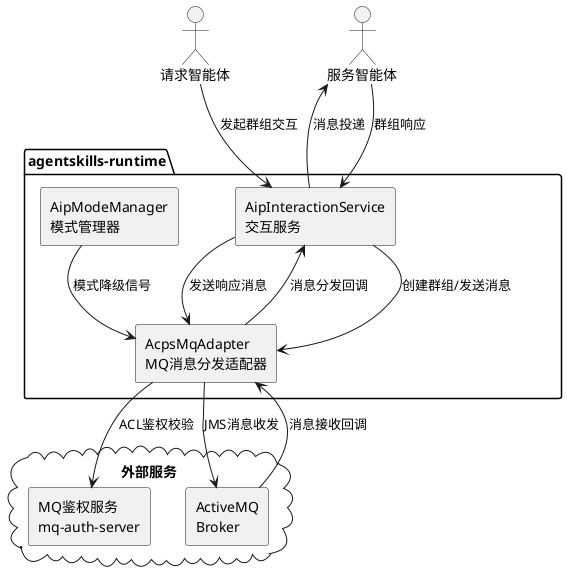
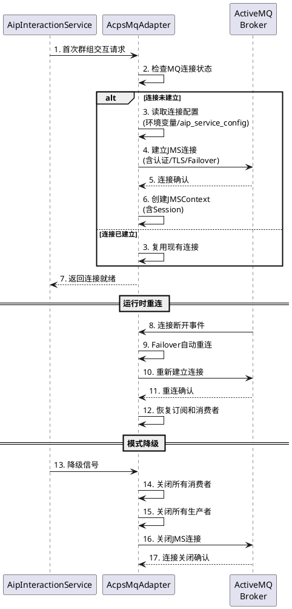
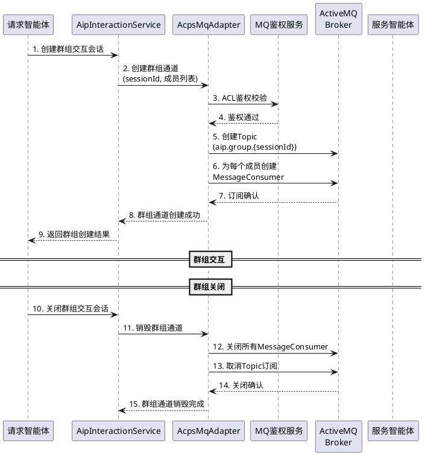
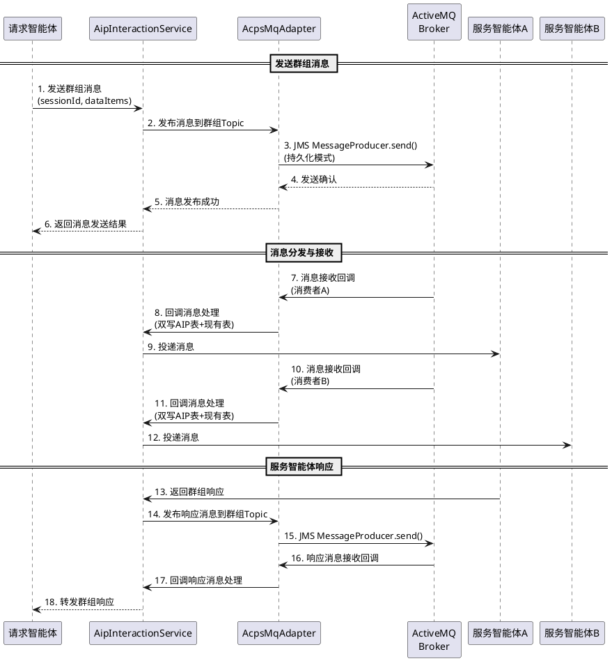
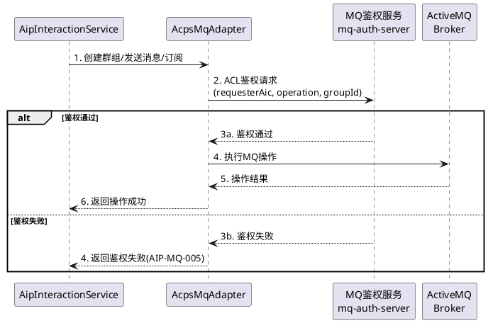
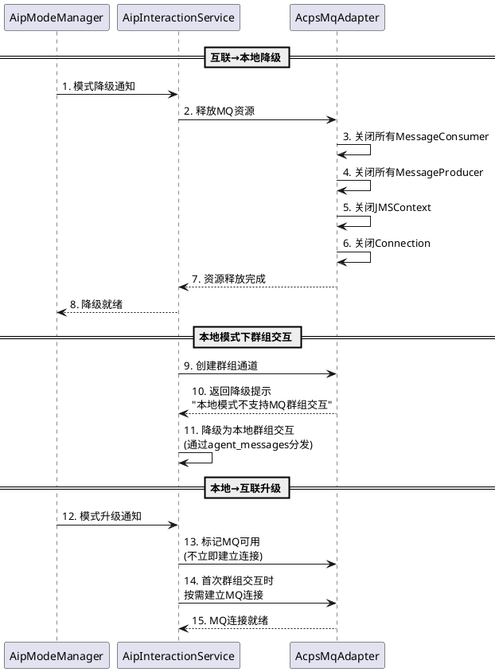
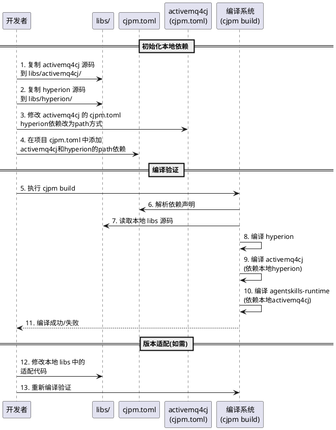
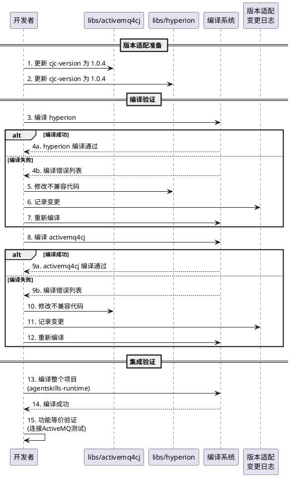

# MQ消息分发适配器需求规格

## 文档信息
- **版本**: 1.1.0
- **创建日期**: 2026-07-10
- **更新日期**: 2026-07-10
- **变更说明**: 引入本地依赖管理机制，将 activemq4cj 和 hyperion 从 TPC git 依赖改为本地 libs 依赖，新增版本适配需求
- **适用范围**: agentskills-runtime AIP 互联模式 MQ 消息分发适配器
- **参考标准**: GB/Z 185.4-2026《人工智能 智能体互联 第4部分：交互协议》
- **关联规格**: aip-implementation spec.md v1.2.0（8.1 MQ消息分发适配器）
- **技术基础**: activemq4cj（仓颉 ActiveMQ SDK，JMS 2.0 规范实现，本地 libs 依赖）+ hyperion（仓颉 TCP 通信框架，activemq4cj 的底层传输依赖，本地 libs 依赖）

---

# **1. 组件定位**

## **1.1 核心职责**

本组件负责在互联模式下通过消息中间件实现智能体间群组交互消息的可靠分发，基于本地 libs 目录中的 activemq4cj 库（及其底层依赖 hyperion）封装 JMS 2.0 标准接口，提供点对点和发布/订阅双模式消息通道。

## **1.2 核心输入**

1. **群组创建请求**：请求智能体发起的群组通道创建请求，包含群组名称、成员列表（AIC身份码）、交互模式、ACL 规则等
2. **群组消息发送请求**：请求智能体或服务智能体向群组通道发送的交互消息，包含 sessionId、senderRole、senderAic、dataItems 等符合 GB/Z 185.6 标准的消息结构
3. **群组订阅请求**：服务智能体发起的群组通道订阅请求，包含群组标识、订阅者身份码、是否持久订阅等
4. **群组退订请求**：服务智能体发起的群组通道退订请求，包含群组标识、退订者身份码
5. **MQ 连接配置**：ActiveMQ broker 地址、认证凭证、TLS 配置、Failover 策略等，通过环境变量或 aip_service_config 表获取
6. **本地模式降级信号**：AipModeManager 发出的模式降级信号，触发 MQ 连接资源释放和消息通道关闭

## **1.3 核心输出**

1. **群组创建结果**：群组通道创建成功/失败响应，包含群组标识符、Topic/Queue 名称、成员订阅状态
2. **消息分发结果**：群组消息分发成功/部分成功/失败响应，包含已送达成员列表、未送达成员列表
3. **消息接收回调**：从 MQ 接收到的群组消息，解析后传递给 AipInteractionService 处理，包含完整的 GB/Z 185.6 消息结构
4. **MQ 连接状态**：MQ 连接健康状态、连接/断连事件、Failover 重连状态
5. **消息持久化确认**：持久消息的存储确认和投递确认

## **1.4 职责边界**

- **不负责**：实现独立的 MQ 消息中间件（复用外部 ActiveMQ 服务）
- **不负责**：实现本地模式的消息传递（本地模式通过 agent_messages 表传递，由 AipInteractionService 负责）
- **不负责**：实现 mTLS 双向认证（由 AcpsCaAdapter 和 AipInteractionService 协同负责）
- **不负责**：实现 MQ 鉴权服务的 ACL 策略管理（由 ACPs mq-auth-server 负责，本组件仅调用鉴权接口）
- **不负责**：实现消息内容的加解密（消息传输安全由 TLS 连接层保证，消息内容安全由上层应用负责）
- **不负责**：实现点对点交互的远程调用、流式、通知三种方式（由 AipInteractionService 直接处理，不经过 MQ）

---

# **2. 领域术语**

**MQ消息分发适配器（AcpsMqAdapter）**
: 基于 activemq4cj 库封装的 JMS 2.0 消息分发适配器，负责在互联模式下通过 ActiveMQ 实现群组交互消息的可靠分发。activemq4cj 和 hyperion 以本地 libs 依赖方式引入项目。

**群组通道（Group Channel）**
: 为一次群组交互创建的 MQ 消息通道，对应一个 JMS Topic（发布/订阅模式）或 Queue（点对点模式），群组内所有成员均可通过该通道收发消息。

**持久订阅（Durable Subscription）**
: JMS 规范中的持久订阅机制，当订阅者离线时，消息中间件为其保留消息，订阅者重新连接后可接收离线期间的消息。

**事务消息（Transacted Message）**
: JMS 规范中的事务机制，一组消息的发送和确认在事务内完成，要么全部成功要么全部回滚，保证消息的原子性投递。

**Failover 自动重连**
: ActiveMQ 的故障转移机制，当主 broker 不可用时自动切换到备用 broker，保证消息服务的连续性。

**消息选择器（Message Selector）**
: JMS 规范中的消息过滤机制，订阅者可基于消息属性设置过滤条件，仅接收符合条件的消息。

**投递模式（Delivery Mode）**
: JMS 规范中的消息持久化策略，分为持久化（PERSISTENT）和非持久化（NON_PERSISTENT）两种模式。持久化消息在 broker 重启后不丢失。

**JMS Context（CJMSContext）**
: JMS 2.0 简化 API 的核心接口，整合了 Connection 和 Session 的功能，支持自动确认和事务管理。

**MQ 鉴权服务（mq-auth-server）**
: ACPs 提供的消息队列鉴权服务，负责群组交互的 ACL 控制，验证智能体是否有权限创建/订阅/发布到特定群组通道。

**本地 libs 依赖（Local libs Dependency）**
: 将第三方开源库的源码复制到项目 `libs/` 目录下，通过 cjpm.toml 的 `path` 方式声明依赖，而非通过 git 远程依赖。与 fountain 库的依赖方式一致。本地依赖便于版本适配和代码维护。

**版本适配（Version Adaptation）**
: 当本地 libs 中的第三方库（activemq4cj、hyperion）与项目使用的仓颉 SDK 版本不兼容时，对本地 libs 中的库代码进行修改升级，使其适配目标仓颉 SDK 版本的过程。

---

# **3. 角色与边界**

## **3.1 核心角色**

- **请求智能体**：群组交互的发起方，负责创建群组通道、发送群组消息、管理群组成员
- **服务智能体**：群组交互的参与方，通过订阅群组通道接收消息并返回响应

## **3.2 外部系统**

- **ActiveMQ Broker**：消息中间件服务，提供 JMS 2.0 标准的消息收发能力，支持 OpenWire 协议
- **ACPs MQ 鉴权服务（mq-auth-server）**：群组交互 ACL 控制服务，验证智能体的群组操作权限
- **AipInteractionService**：AIP 交互服务，MQ 消息接收后的上层业务处理器
- **AipModeManager**：AIP 模式管理器，提供运行模式判断和降级信号

## **3.3 交互上下文**

---

# **4. DFX约束**

## **4.1 性能**

1. 群组消息分发延迟上限：2秒（10个群组成员以内，不含网络传输延迟）
2. 单条消息发送接口响应时间上限：500毫秒（不含 MQ broker 处理时间）
3. MQ 连接建立时间上限：10秒（含 TLS 握手和认证）
4. 消息吞吐量下限：100条/秒（单群组通道）
5. 并发群组通道数上限：50个（单实例）

## **4.2 可靠性**

1. 群组交互消息至少一次投递保证（使用持久化投递模式 + AUTO_ACKNOWLEDGE）
2. 事务消息的原子性保证（群组消息要么全部投递成功，要么全部回滚）
3. MQ 连接断开后自动重连（Failover 机制，重连间隔不超过30秒）
4. 持久订阅者离线期间的消息保留（ActiveMQ 持久订阅机制保证离线消息不丢失）
5. 本地模式降级时，MQ 连接资源必须正确释放，不泄漏连接和会话

## **4.3 安全性**

1. MQ 连接必须支持 TLS 加密（activemq4cj 支持 SSL/TLS 连接）
2. MQ 连接必须使用用户名/密码认证（通过 ConnectionFactory.createConnection(userName, password)）
3. 群组操作必须经过 MQ 鉴权服务的 ACL 校验
4. 消息中禁止包含明文敏感信息（如凭证、密钥等）
5. MQ 连接凭证必须通过环境变量或加密配置获取，禁止硬编码

## **4.4 可维护性**

1. 必须接入现有日志系统，记录 MQ 连接状态、消息收发、异常等关键操作日志
2. 必须提供 MQ 连接健康检查接口，供 AipHealthController 调用
3. MQ 配置（broker 地址、认证信息、Failover 策略等）必须可通过环境变量配置
4. 必须记录消息收发的审计日志，包含 sessionId、messageId、senderAic、时间戳等

## **4.5 兼容性**

1. AcpsMqAdapter 必须与现有 AcpsRegistryAdapter/AcpsCaAdapter/AcpsDiscoveryAdapter 保持一致的适配器模式
2. 本地模式下 AcpsMqAdapter 必须不初始化 MQ 连接，不影响本地模式运行
3. 消息格式必须与 GB/Z 185.6 定义的消息结构兼容，与 AipInteractionService 的消息格式对齐
4. ActiveMQ broker 版本必须兼容 activemq4cj 库支持的 OpenWire 协议版本
5. activemq4cj 和 hyperion 必须以本地 libs 依赖方式引入，与项目现有 fountain 库的依赖模式保持一致
6. activemq4cj 和 hyperion 的本地 libs 副本必须适配仓颉 SDK 1.0.4 版本（原始 TPC 版本仅适配仓颉 SDK 1.0.0 LTS）
7. 本地 libs 中的 activemq4cj 和 hyperion 代码变更必须记录在独立的版本适配变更日志中，便于与上游 TPC 项目同步

---

# **5. 核心能力**

## **5.1 MQ连接管理**

> **双模式说明**：
> - **本地模式**：不初始化 MQ 连接，AcpsMqAdapter 所有方法返回降级提示或空结果
> - **互联模式**：按需建立 MQ 连接，支持连接池、自动重连、连接健康检查

### **5.1.1 业务规则**

1. **连接按需建立**：系统应当在首次群组交互请求时建立 MQ 连接，而非系统启动时
   - 验收条件：[系统启动后无群组交互请求] → [MQ 连接未建立，不占用资源]
   - 验收条件：[首次群组交互请求到达] → [自动建立 MQ 连接并创建群组通道]

2. **连接配置来源**：MQ 连接配置必须优先从环境变量获取，其次从 aip_service_config 表获取
   - 验收条件：[环境变量 AIP_MQ_ENDPOINT 已配置] → [使用环境变量中的 broker 地址]
   - 验收条件：[环境变量未配置但 aip_service_config 表有 mq 类型配置] → [使用数据库中的配置]

3. **连接认证**：MQ 连接必须使用用户名/密码认证，认证信息从环境变量获取
   - 验收条件：[MQ 连接未提供认证信息] → [连接失败并返回错误码 AIP-MQ-001]

4. **TLS 加密**：MQ 连接应当支持 TLS 加密，当配置了 TLS 证书路径时自动启用
   - 验收条件：[配置了 AIP_MQ_TLS_ENABLED=true] → [使用 SSL 协议连接 ActiveMQ]

5. **Failover 自动重连**：MQ 连接必须支持 Failover 自动重连策略，当 broker 不可用时自动切换到备用 broker
   - 验收条件：[主 broker 宕机] → [自动切换到备用 broker，重连间隔不超过30秒]
   - 验收条件：[所有 broker 均不可用] → [返回连接失败错误码 AIP-MQ-002，触发模式降级]

6. **连接生命周期管理**：MQ 连接应当在互联模式降级为本地模式时正确关闭，释放所有资源
   - 验收条件：[AipModeManager 发出降级信号] → [关闭所有 MQ 连接、会话、生产者、消费者，释放资源]

7. **连接健康检查**：系统必须提供 MQ 连接健康检查能力，供 AipHealthController 调用
   - 验收条件：[调用 MQ 健康检查接口] → [返回 MQ 连接状态（connected/disconnected/unavailable）]

8. **禁止项**：禁止在本地模式下建立 MQ 连接
   - 验收条件：[本地模式下调用 MQ 连接建立方法] → [返回错误提示"本地模式不支持MQ连接"]

### **5.1.2 交互流程**

### **5.1.3 异常场景**

1. **MQ 连接建立失败**
   - 触发条件：ActiveMQ broker 不可达、认证失败、TLS 握手失败
   - 系统行为：返回连接失败错误，记录失败原因，不触发自动降级（由 AipModeManager 决定）
   - 用户感知：错误码 AIP-MQ-002，提示"MQ连接建立失败：{具体原因}"

2. **MQ 连接意外断开**
   - 触发条件：网络故障、broker 宕机、连接超时
   - 系统行为：Failover 机制自动重连，重连期间消息缓存待发送，重连成功后恢复
   - 用户感知：错误码 AIP-MQ-003，提示"MQ连接中断，正在自动重连"

3. **MQ 认证失败**
   - 触发条件：用户名/密码错误或凭证过期
   - 系统行为：拒绝连接，记录认证失败日志，不自动重试
   - 用户感知：错误码 AIP-MQ-001，提示"MQ认证失败，请检查连接凭证"

4. **所有 broker 不可用**
   - 触发条件：Failover 列表中所有 broker 均不可达
   - 系统行为：触发 AipModeManager 降级为本地模式
   - 用户感知：错误码 AIP-MQ-004，提示"MQ服务不可用，系统已降级为本地模式"

## **5.2 群组通道管理**

> **双模式说明**：
> - **本地模式**：群组交互通过 agent_messages 表实现，不创建 MQ 群组通道
> - **互联模式**：群组交互通过 MQ Topic/Queue 实现，请求智能体负责群组通道的创建和管理

### **5.2.1 业务规则**

1. **群组通道创建**：请求智能体创建群组时，系统必须通过 AcpsMqAdapter 在 ActiveMQ 上创建对应的 Topic 通道
   - 验收条件：[请求智能体创建群组] → [系统在 ActiveMQ 上创建 Topic，Topic 名称格式为 `aip.group.{sessionId}`]

2. **群组通道命名规范**：群组通道的 Topic 名称必须遵循 `aip.group.{sessionId}` 格式，确保全局唯一
   - 验收条件：[创建群组通道] → [Topic 名称符合 aip.group.{sessionId} 格式，与 aip_interaction_session 表的 session_id 对应]

3. **群组成员订阅**：群组创建后，系统必须为每个群组成员（服务智能体）创建消息消费者，订阅对应的 Topic
   - 验收条件：[群组包含3个服务智能体] → [为每个服务智能体创建独立的 MessageConsumer，订阅群组 Topic]

4. **持久订阅支持**：系统应当支持持久订阅，当服务智能体离线时保留其未消费的消息
   - 验收条件：[服务智能体配置为持久订阅且离线] → [ActiveMQ 保留该智能体的未消费消息，重新连接后可接收]

5. **群组通道销毁**：群组交互会话关闭时，系统必须销毁对应的群组通道，关闭所有消费者的订阅
   - 验收条件：[群组交互会话关闭] → [关闭所有 MessageConsumer，取消 Topic 订阅，清理群组通道资源]

6. **ACL 鉴权前置**：群组通道创建前，必须通过 MQ 鉴权服务校验请求智能体的 ACL 权限
   - 验收条件：[请求智能体无群组创建权限] → [拒绝群组通道创建，返回错误码 AIP-MQ-005]

7. **禁止项**：禁止创建未通过 ACL 鉴权的群组通道
   - 验收条件：[未通过 ACL 鉴权的群组创建请求] → [系统拒绝并返回鉴权失败]

### **5.2.2 交互流程**

### **5.2.3 异常场景**

1. **群组通道创建失败**
   - 触发条件：Topic 已存在、broker 空间不足、权限不足
   - 系统行为：返回群组创建失败，记录失败原因，不创建 aip_interaction_session 记录
   - 用户感知：错误码 AIP-MQ-006，提示"群组通道创建失败：{具体原因}"

2. **成员订阅失败**
   - 触发条件：部分群组成员的 MessageConsumer 创建失败
   - 系统行为：对成功订阅的成员继续分发，对失败成员标记待重试，返回部分成功结果
   - 用户感知：错误码 AIP-MQ-007，提示"群组部分成员订阅失败：{失败成员列表}"

3. **ACL 鉴权失败**
   - 触发条件：请求智能体无群组创建权限或成员无订阅权限
   - 系统行为：拒绝群组通道创建，不创建任何 MQ 资源
   - 用户感知：错误码 AIP-MQ-005，提示"群组ACL鉴权失败：{具体原因}"

4. **群组通道销毁失败**
   - 触发条件：broker 不可达或消费者关闭超时
   - 系统行为：记录销毁失败日志，标记群组通道为待清理，不影响会话关闭
   - 用户感知：警告 AIP-MQ-008，提示"群组通道销毁异常，将在后台重试清理"

## **5.3 群组消息分发**

> **双模式说明**：
> - **本地模式**：群组消息通过 agent_messages 表逐条分发，由 AipInteractionService 负责
> - **互联模式**：群组消息通过 MQ Topic 发布，由 ActiveMQ 负责向所有订阅者分发

### **5.3.1 业务规则**

1. **消息发送**：请求智能体发送群组消息时，系统必须通过 AcpsMqAdapter 将消息发布到群组 Topic
   - 验收条件：[请求智能体发送群组消息] → [消息发布到 aip.group.{sessionId} Topic，所有订阅者可接收]

2. **消息格式**：群组消息必须符合 GB/Z 185.6 定义的消息结构，包含 messageId、sessionId、senderRole、senderAic、dataItems 等必需字段
   - 验收条件：[发送群组消息] → [消息体包含完整的 GB/Z 185.6 标准字段]

3. **消息持久化**：群组交互消息应当使用持久化投递模式（DeliveryMode.PERSISTENT），保证 broker 重启后消息不丢失
   - 验收条件：[使用持久化模式发送消息] → [broker 重启后消息仍可被消费]

4. **事务消息**：系统宜支持事务消息，一组相关的群组消息在事务内发送，保证原子性
   - 验收条件：[启用事务模式发送3条消息] → [3条消息要么全部投递成功，要么全部回滚]

5. **消息接收回调**：AcpsMqAdapter 接收到 MQ 消息后，必须回调 AipInteractionService 进行消息处理，包括双写到 aip_interaction_message 和 agent_messages
   - 验收条件：[AcpsMqAdapter 接收到群组消息] → [回调 AipInteractionService，消息双写到 AIP 表和现有表]

6. **消息去重**：系统应当支持消息去重，基于 messageId 避免重复处理同一消息
   - 验收条件：[接收到重复 messageId 的消息] → [系统识别并丢弃重复消息，不重复写入数据库]

7. **消息超时**：群组消息应当支持设置 TTL（Time To Live），超时消息不再投递
   - 验收条件：[消息 TTL 设为30秒且30秒内未投递] → [消息过期不再投递给消费者]

8. **禁止项**：禁止发送不符合 GB/Z 185.6 消息结构的群组消息
   - 验收条件：[发送缺少必需字段的群组消息] → [系统拒绝发送并返回格式校验失败]

### **5.3.2 交互流程**

### **5.3.3 异常场景**

1. **消息发送失败**
   - 触发条件：MQ 连接断开、Topic 不存在、broker 空间不足
   - 系统行为：返回消息发送失败，记录失败原因，支持重试
   - 用户感知：错误码 AIP-MQ-009，提示"群组消息发送失败：{具体原因}"

2. **消息接收回调异常**
   - 触发条件：消息接收回调中 AipInteractionService 处理异常（如数据库写入失败）
   - 系统行为：记录回调异常日志，消息不确认（不 ACK），触发消息重投递
   - 用户感知：错误码 AIP-MQ-010，提示"群组消息处理异常，消息将重投递"

3. **消息重复投递**
   - 触发条件：MQ 至少一次投递语义导致同一消息被投递多次
   - 系统行为：基于 messageId 去重，丢弃重复消息
   - 用户感知：无感知（系统自动处理）

4. **消息过期**
   - 触发条件：消息 TTL 超时，broker 不再投递
   - 系统行为：记录消息过期日志，不触发重试
   - 用户感知：错误码 AIP-MQ-011，提示"群组消息已过期，未投递到部分成员"

5. **事务回滚**
   - 触发条件：事务内部分消息发送失败
   - 系统行为：回滚整个事务，所有消息不投递
   - 用户感知：错误码 AIP-MQ-012，提示"群组消息事务回滚：{回滚原因}"

6. **群组消息部分分发失败**
   - 触发条件：部分群组成员的消费者不可达或处理超时
   - 系统行为：对可达成员继续分发，对不可达成员标记待重试，持久订阅者离线消息保留
   - 用户感知：错误码 AIP-INTER-004，提示"群组消息部分分发失败"

## **5.4 MQ鉴权集成**

> **双模式说明**：
> - **本地模式**：无需 MQ 鉴权，群组交互通过 RBAC 权限控制
> - **互联模式**：群组操作必须通过 ACPs MQ 鉴权服务的 ACL 校验

### **5.4.1 业务规则**

1. **ACL 鉴权前置**：群组通道创建、消息发布、消息订阅等操作前，必须通过 MQ 鉴权服务校验 ACL 权限
   - 验收条件：[请求智能体创建群组] → [系统先调用 MQ 鉴权服务校验 ACL，通过后再创建群组通道]

2. **鉴权信息传递**：MQ 鉴权请求必须包含请求智能体的 AIC、操作类型、群组标识等信息
   - 验收条件：[发送 ACL 鉴权请求] → [请求体包含 requesterAic、operation、groupId 等信息]

3. **鉴权失败处理**：ACL 鉴权失败时，系统必须拒绝对应的群组操作，记录鉴权失败日志
   - 验收条件：[ACL 鉴权失败] → [拒绝群组操作，返回错误码 AIP-MQ-005，记录鉴权失败日志]

4. **鉴权服务不可用降级**：MQ 鉴权服务不可用时，系统应当拒绝所有群组操作，防止未授权访问
   - 验收条件：[MQ 鉴权服务不可用] → [拒绝所有群组操作，返回鉴权服务不可用错误]

5. **禁止项**：禁止跳过 ACL 鉴权直接执行群组操作
   - 验收条件：[未通过 ACL 鉴权的群组操作] → [系统拒绝操作并返回鉴权失败]

### **5.4.2 交互流程**

### **5.4.3 异常场景**

1. **MQ 鉴权服务不可用**
   - 触发条件：mq-auth-server 网络不通或服务宕机
   - 系统行为：拒绝所有群组操作，返回鉴权服务不可用错误
   - 用户感知：错误码 AIP-MQ-013，提示"MQ鉴权服务暂不可用，群组操作被拒绝"

2. **ACL 权限不足**
   - 触发条件：智能体无群组创建/发布/订阅权限
   - 系统行为：拒绝对应操作，记录权限不足日志
   - 用户感知：错误码 AIP-MQ-005，提示"群组操作ACL鉴权失败：权限不足"

## **5.5 本地模式降级兼容**

> **双模式说明**：
> - **本地模式**：AcpsMqAdapter 不初始化，所有方法返回降级提示
> - **互联模式**：AcpsMqAdapter 正常工作，支持模式切换时的资源管理

### **5.5.1 业务规则**

1. **本地模式跳过 MQ**：本地模式下，AcpsMqAdapter 的所有群组操作方法必须返回降级提示，不建立 MQ 连接
   - 验收条件：[本地模式下调用群组创建方法] → [返回"本地模式不支持MQ群组交互"提示，不建立连接]

2. **互联降级到本地**：当 AipModeManager 触发降级时，AcpsMqAdapter 必须正确释放所有 MQ 资源
   - 验收条件：[互联模式降级为本地模式] → [关闭所有 MQ 连接、会话、生产者、消费者，释放资源]

3. **本地升级到互联**：当 AipModeManager 触发升级时，AcpsMqAdapter 应当在下次群组交互请求时按需建立 MQ 连接
   - 验收条件：[本地模式升级为互联模式后首次群组交互] → [按需建立 MQ 连接，创建群组通道]

4. **降级期间消息处理**：降级过程中正在处理的群组消息必须完成处理，未发送的消息标记为待重试
   - 验收条件：[降级时有3条消息正在处理] → [已完成的消息正常处理，未发送的消息标记待重试]

5. **禁止项**：禁止在本地模式下创建 MQ 连接或群组通道
   - 验收条件：[本地模式下尝试创建 MQ 连接] → [系统拒绝并返回"本地模式不支持MQ连接"]

### **5.5.2 交互流程**

### **5.5.3 异常场景**

1. **降级时资源释放失败**
   - 触发条件：MQ 连接关闭超时或 broker 不可达
   - 系统行为：记录释放失败日志，强制标记资源为已释放，不影响降级流程
   - 用户感知：警告 AIP-MQ-014，提示"MQ资源释放异常，已强制标记释放"

2. **升级后首次连接失败**
   - 触发条件：升级到互联模式后首次群组交互时 MQ 连接建立失败
   - 系统行为：回退为本地群组交互方式，记录连接失败日志
   - 用户感知：错误码 AIP-MQ-002，提示"MQ连接建立失败，回退为本地群组交互"

## **5.6 本地依赖管理**

> **背景说明**：
> - activemq4cj（仓颉 ActiveMQ SDK）和 hyperion（仓颉 TCP 通信框架）是 Cangjie-TPC 开源项目，目前仅适配到仓颉 SDK 1.0.0 LTS 版本，且已有 8~9 个月未更新
> - agentskills-runtime 项目使用仓颉 SDK 1.0.4 版本，与 TPC 原始版本存在兼容性差距
> - 采用与 fountain 库一致的本地 libs 依赖方式，将这两个库复制到项目本地，便于版本适配和维护

### **5.6.1 业务规则**

1. **本地 libs 目录结构**：activemq4cj 和 hyperion 必须存放在项目 `libs/` 目录下，目录结构遵循与 fountain 一致的规范
   - 验收条件：[查看 libs 目录] → [存在 `libs/activemq4cj/` 和 `libs/hyperion/` 目录，各包含完整的源码和 cjpm.toml]

2. **cjpm.toml 依赖声明**：activemq4cj 和 hyperion 必须通过 cjpm.toml 的 `path` 方式声明依赖，与 fountain 的依赖声明模式一致
   - 验收条件：[查看 cjpm.toml 的 dependencies 部分] → [包含 `activemq4cj = { path = "./libs/activemq4cj" }` 和 `hyperion = { path = "./libs/hyperion" }` 声明]

3. **activemq4cj 对 hyperion 的依赖切换**：本地 libs 中的 activemq4cj 的 cjpm.toml 必须将其对 hyperion 的依赖从 git 远程方式改为本地 path 方式
   - 验收条件：[查看 libs/activemq4cj/cjpm.toml] → [hyperion 依赖声明为 `{ path = "../hyperion" }`，而非 git 远程依赖]

4. **源码来源可追溯**：本地 libs 中的 activemq4cj 和 hyperion 必须保留原始 TPC 项目的 git 历史或记录来源信息（上游仓库地址、分支、版本号、复制时间）
   - 验收条件：[查看 libs/activemq4cj/.git 或来源记录文件] → [可追溯上游仓库 gitcode.com/Cangjie-TPC/activemq4cj，分支 main，版本 1.0.0]
   - 验收条件：[查看 libs/hyperion/.git 或来源记录文件] → [可追溯上游仓库 gitcode.com/Cangjie-TPC/hyperion，分支 master，版本 3.0.0]

5. **本地依赖维护责任**：本地 libs 中的 activemq4cj 和 hyperion 的维护由 agentskills-runtime 项目承担，包括版本适配、Bug 修复、与上游同步等
   - 验收条件：[发现 activemq4cj 存在 Bug] → [在本地 libs/activemq4cj 中直接修复，记录变更日志]

6. **禁止项**：禁止通过 git 远程依赖方式引入 activemq4cj 或 hyperion
   - 验收条件：[检查 cjpm.toml] → [不包含 activemq4cj 或 hyperion 的 git 远程依赖声明]

### **5.6.2 交互流程**

### **5.6.3 异常场景**

1. **本地依赖源码缺失**
   - 触发条件：libs/activemq4cj 或 libs/hyperion 目录不存在或源码不完整
   - 系统行为：cjpm build 编译失败，报依赖找不到错误
   - 用户感知：编译错误，提示"dependency activemq4cj not found"

2. **activemq4cj 对 hyperion 依赖未切换**
   - 触发条件：libs/activemq4cj/cjpm.toml 中 hyperion 仍为 git 远程依赖
   - 系统行为：cjpm build 可能因网络问题或版本冲突导致编译失败
   - 用户感知：编译错误或依赖解析冲突

3. **本地依赖版本与上游不一致**
   - 触发条件：上游 TPC 项目发布了新版本，本地 libs 未同步更新
   - 系统行为：不影响当前功能，但可能缺少上游 Bug 修复或新特性
   - 用户感知：无直接感知（需通过版本适配变更日志了解差异）

## **5.7 版本适配**

> **背景说明**：
> - activemq4cj 原始版本（cjc-version = "1.0.0"）和 hyperion 原始版本（cjc-version = "1.0.0"）仅适配仓颉 SDK 1.0.0 LTS
> - agentskills-runtime 项目使用仓颉 SDK 1.0.4（cjc-version = "1.0.4"），可能存在 API 变更、废弃接口、新增约束等兼容性问题
> - 版本适配工作在本地 libs 中的 activemq4cj 和 hyperion 源码上进行，不修改上游 TPC 项目

### **5.7.1 业务规则**

1. **仓颉 SDK 版本声明更新**：本地 libs 中的 activemq4cj 和 hyperion 的 cjpm.toml 必须将 cjc-version 更新为 "1.0.4"
   - 验收条件：[查看 libs/activemq4cj/cjpm.toml] → [cjc-version = "1.0.4"]
   - 验收条件：[查看 libs/hyperion/cjpm.toml] → [cjc-version = "1.0.4"]

2. **编译适配**：本地 libs 中的 activemq4cj 和 hyperion 必须在仓颉 SDK 1.0.4 下编译通过，无编译错误
   - 验收条件：[在仓颉 SDK 1.0.4 环境下执行 cjpm build] → [activemq4cj 和 hyperion 编译成功，无错误]

3. **编译警告处理**：本地 libs 中的编译警告应当通过添加 compile-option 或修改代码方式消除或抑制
   - 验收条件：[编译 activemq4cj] → [无编译警告，或已通过 override-compile-option 抑制已知警告]

4. **版本适配变更记录**：所有因版本适配而对 activemq4cj 或 hyperion 源码进行的修改，必须记录在版本适配变更日志中
   - 验收条件：[查看版本适配变更日志] → [每条变更记录包含：修改文件、修改内容、适配原因、对应仓颉版本]

5. **最小化修改原则**：版本适配修改应当遵循最小化修改原则，仅修改因仓颉 SDK 版本差异导致的不兼容代码，不进行功能增强或重构
   - 验收条件：[审查版本适配变更] → [所有变更均有明确的版本兼容性原因，无功能性变更]

6. **功能等价验证**：版本适配后的 activemq4cj 和 hyperion 必须在功能上与原始 1.0.0 LTS 版本等价，不引入新的功能缺陷
   - 验收条件：[使用版本适配后的 activemq4cj 连接 ActiveMQ] → [JMS 2.0 标准功能（连接、会话、生产者、消费者、消息收发）均正常工作]

7. **禁止项**：禁止在版本适配过程中修改 activemq4cj 或 hyperion 的公共 API 接口
   - 验收条件：[对比版本适配前后的公共接口] → [公共 API 签名无变更]

### **5.7.2 交互流程**

### **5.7.3 异常场景**

1. **仓颉 SDK API 废弃导致编译失败**
   - 触发条件：仓颉 SDK 1.0.4 废弃了 1.0.0 LTS 中的某些 API，activemq4cj 或 hyperion 使用了这些 API
   - 系统行为：编译报错，错误信息包含废弃 API 的替代建议
   - 用户感知：编译错误，需根据替代建议修改本地 libs 代码

2. **仓颉 SDK 行为变更导致运行时异常**
   - 触发条件：仓颉 SDK 1.0.4 修改了某些 API 的行为，导致 activemq4cj 或 hyperion 运行时异常
   - 系统行为：运行时抛出异常或产生非预期结果
   - 用户感知：MQ 连接建立失败、消息收发异常等

3. **stdx 扩展包版本不兼容**
   - 触发条件：activemq4cj 或 hyperion 依赖的 stdx 扩展包与仓颉 SDK 1.0.4 不兼容
   - 系统行为：编译或链接失败
   - 用户感知：编译错误，提示 stdx 相关的链接或符号未找到

4. **版本适配修改范围超出预期**
   - 触发条件：仓颉 SDK 1.0.0 到 1.0.4 之间存在大量不兼容变更，导致版本适配工作量远超预期
   - 系统行为：版本适配周期延长，可能影响项目进度
   - 用户感知：MQ 消息分发适配器交付延期

---

# **6. 数据约束**

## **6.1 MQ连接配置**

1. **brokerUrl**：ActiveMQ broker 连接地址，支持 Failover 格式（如 `failover:(tcp://host1:61616,tcp://host2:61616)?maxReconnectAttempts=10`），必填
2. **username**：MQ 连接用户名，必填
3. **password**：MQ 连接密码，必填
4. **tlsEnabled**：是否启用 TLS 加密，布尔值，默认值 false，可选
5. **tlsTruststorePath**：TLS 信任证书库路径，可选
6. **tlsKeystorePath**：TLS 客户端证书库路径，可选
7. **maxReconnectAttempts**：Failover 最大重连次数，整型，默认值 10，可选
8. **reconnectDelay**：Failover 重连间隔（毫秒），整型，默认值 5000，可选

## **6.2 群组通道标识**

1. **topicName**：群组通道 Topic 名称，格式 `aip.group.{sessionId}`，与 aip_interaction_session 表的 session_id 对应，必填，唯一
2. **sessionId**：群组交互会话标识符，与 aip_interaction_session 表的 session_id 一致，必填
3. **subscriptionName**：持久订阅名称，格式 `aip.sub.{agentAic}.{sessionId}`，用于 JMS 持久订阅标识，可选

## **6.3 群组消息属性**

1. **messageId**：消息标识符，与 aip_interaction_message 表的 message_id 对应，必填，唯一
2. **sessionId**：会话标识符，与群组通道的 sessionId 一致，必填
3. **senderRole**：发送者角色（requester/service），必填
4. **senderAic**：发送方身份码，必填
5. **dataItems**：数据内容，JSON 数组格式，符合 GB/Z 185.6 消息结构，必填
6. **taskId**：关联任务标识符，可选
7. **deliveryMode**：投递模式（PERSISTENT/NON_PERSISTENT），默认值 PERSISTENT，可选
8. **timeToLive**：消息存活时间（毫秒），整型，默认值 0（永不过期），可选
9. **priority**：消息优先级（0-9），整型，默认值 4，可选

## **6.4 MQ鉴权请求**

1. **requesterAic**：请求方智能体身份码，必填
2. **operation**：操作类型（create_group/publish_message/subscribe_group/unsubscribe_group），必填
3. **groupId**：群组标识符，对应 sessionId，必填
4. **targetAic**：目标智能体身份码（订阅/退订操作时使用），可选

## **6.5 aip_service_config 表 MQ 配置记录**

> 以下为 aip_service_config 表中 service_type='mq' 的配置记录约束：

1. **service_type**：必须为 "mq"
2. **service_name**：服务名称，建议 "acps-mq"
3. **service_endpoint**：ActiveMQ broker 连接地址（Failover 格式）
4. **protocol_version**：协议版本，默认值 "2.1.0"
5. **config**：额外配置（JSON 格式），可包含 tlsEnabled、maxReconnectAttempts、reconnectDelay 等
6. **enabled**：是否启用，布尔值，默认值 true
7. **health_status**：健康状态（healthy/unhealthy/unknown），默认值 "unknown"

## **6.6 本地依赖配置**

> 以下为 activemq4cj 和 hyperion 本地 libs 依赖的配置约束：

### **6.6.1 项目 cjpm.toml 依赖声明**

1. **activemq4cj**：依赖声明必须为 `activemq4cj = { path = "./libs/activemq4cj" }`，使用 path 本地依赖方式，必填
2. **hyperion**：依赖声明必须为 `hyperion = { path = "./libs/hyperion" }`，使用 path 本地依赖方式，必填
3. **compile-option**：如需抑制编译警告，可添加 `compile-option = "-Woff unused"` 参数，可选

### **6.6.2 activemq4cj 本地 cjpm.toml 配置约束**

1. **cjc-version**：必须为 "1.0.4"，与项目仓颉 SDK 版本一致
2. **hyperion 依赖**：必须为 `hyperion = { path = "../hyperion" }`，使用相对路径本地依赖方式
3. **override-compile-option**：建议保留 `override-compile-option = "-Woff unused"` 以抑制未使用变量警告
4. **output-type**：必须为 "static"（静态库）

### **6.6.3 hyperion 本地 cjpm.toml 配置约束**

1. **cjc-version**：必须为 "1.0.4"，与项目仓颉 SDK 版本一致
2. **output-type**：必须为 "static"（静态库）
3. **src-dir**：默认值 "src"
4. **target-dir**：默认值 "build"

### **6.6.4 本地 libs 目录结构约束**

1. **libs/activemq4cj/**：必须包含 activemq4cj 完整源码（src/ 目录）、cjpm.toml、LICENSE、README.md
2. **libs/hyperion/**：必须包含 hyperion 完整源码（src/ 目录）、cjpm.toml、LICENSE、README.md
3. **版本适配变更日志**：libs/activemq4cj/ 和 libs/hyperion/ 下各应包含 VERSION_ADAPTATION.md 文件，记录版本适配的所有代码变更

### **6.6.5 版本适配变更日志约束**

1. **变更文件路径**：相对于 libs/activemq4cj/ 或 libs/hyperion/ 的文件路径
2. **变更内容**：具体的代码修改描述
3. **适配原因**：仓颉 SDK 版本差异导致的不兼容原因
4. **上游版本**：原始 TPC 项目的版本号（activemq4cj: 1.0.0, hyperion: 3.0.0）
5. **适配目标版本**：仓颉 SDK 1.0.4
6. **变更日期**：修改日期