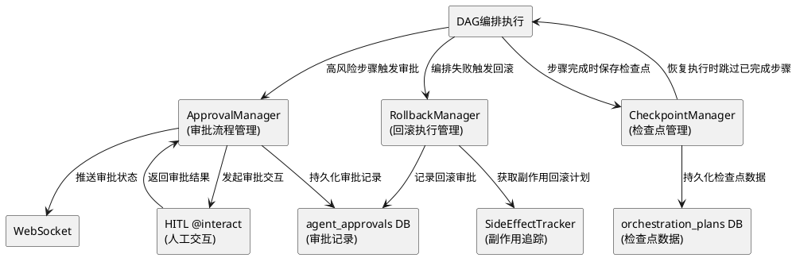
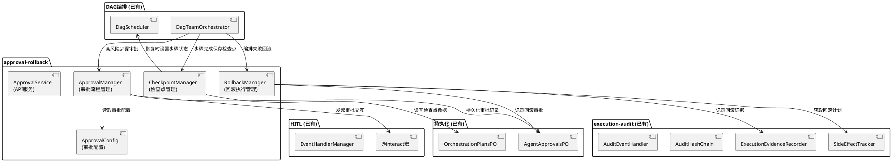
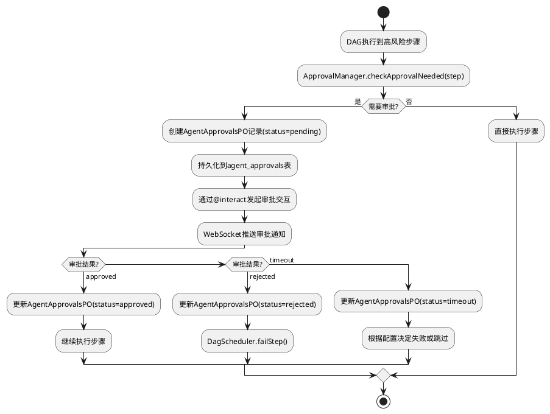
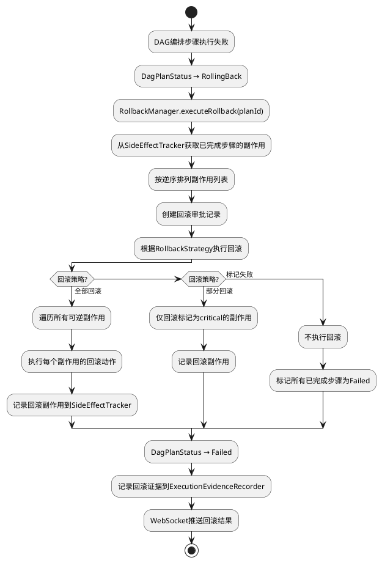
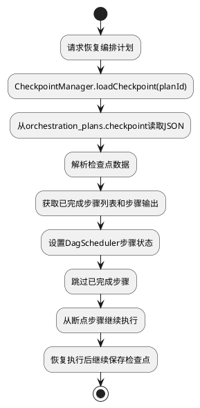
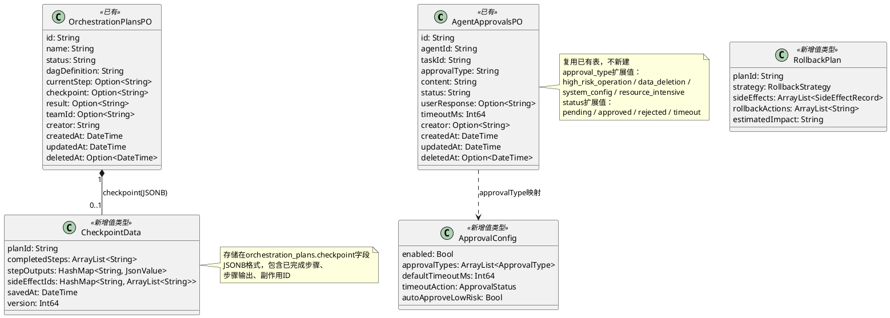

# 审批与回滚机制 - 技术设计文档

## 一、需求与存量功能关系分析

### 1.1 需求功能与存量功能对比

#### 1.1.1 已实现功能

| 需求功能 | 存量功能 | 代码位置 | 匹配度 |
|---------|---------|---------|--------|
| HITL人工交互 | @interact/@asyncInteract宏 + EventHandlerManager | src/dsl/interact.cj, src/interaction/event_handler_manager.cj | 90% |
| 审批记录表 | AgentApprovalsPO + agent_approvals表 | src/app/models/uctoo/AgentApprovalsPO.cj | 80% |
| 副作用追踪 | SideEffectTracker + SideEffectRecord | src/interaction/side_effect_tracker.cj | 85% |
| 执行证据记录 | ExecutionEvidenceRecorder | src/interaction/execution_evidence_recorder.cj | 70% |
| 哈希链校验 | AuditHashChain | src/interaction/audit_hash_chain.cj | 60% |
| DAG编排 | DagScheduler + DagTeamOrchestrator | src/agent_executor/dag_scheduler.cj | 75% |
| 编排计划持久化 | OrchestrationPlansPO(含checkpoint字段) | src/app/models/uctoo/OrchestrationPlansPO.cj | 70% |
| WebSocket推送 | 已有WebSocket实时通信 | src/app/ | 100% |
| 审计集成门面 | AuditEventHandler | src/interaction/audit_event_handler.cj | 60% |

#### 1.1.2 需要扩展的功能

| 需求功能 | 存量功能 | 差异说明 | 扩展方向 |
|---------|---------|---------|---------|
| 审批流程管理 | @interact仅提供事件交互 | 缺少审批状态机、超时处理、条件触发 | 新增ApprovalManager封装审批生命周期 |
| 审批记录持久化 | AgentApprovalsPO仅定义PO | 缺少审批创建/更新/查询的Service层 | 扩展AgentApprovalsDAO/Service |
| 副作用回滚执行 | SideEffectTracker.getRollbackPlan()仅生成回滚计划 | 缺少回滚执行引擎、回滚策略 | 新增RollbackManager执行回滚 |
| 检查点管理 | OrchestrationPlansPO.checkpoint字段已存在但未使用 | 缺少检查点写入/读取/恢复逻辑 | 新增CheckpointManager |
| DAG回滚状态 | DagPlanStatus无RollingBack状态 | 编排回滚时无状态标识 | 扩展DagPlanStatus枚举 |

#### 1.1.3 需要新增的功能或接口

1. **ApprovalManager**: 审批流程管理器，封装审批生命周期（创建→等待→审批/超时→记录）
2. **RollbackManager**: 回滚执行管理器，基于SideEffectTracker执行逆序回滚
3. **CheckpointManager**: 检查点管理器，管理编排计划的检查点写入与恢复
4. **ApprovalConfig**: 审批配置，定义审批触发条件和策略
5. **RollbackStrategy**: 回滚策略枚举（全部回滚/部分回滚/标记失败）
6. **无新数据库表**: 复用agent_approvals和orchestration_plans

### 1.2 存量功能详细分析

**SideEffectTracker**（src/interaction/side_effect_tracker.cj）：
- **接口契约**: 追踪每个步骤的副作用（文件修改、数据库变更、API调用）
- **业务规则**: 每个副作用记录包含beforeState/afterState、isReversible标志、rollbackAction描述
- **扩展点**: getRollbackPlan(evidenceId)已返回逆序回滚动作列表，可直接被RollbackManager消费
- **约束**: 当前仅内存追踪，回滚动作仅为描述字符串，需RollbackManager实现具体执行

**AgentApprovalsPO**（src/app/models/uctoo/AgentApprovalsPO.cj）：
- **接口契约**: agent_approvals表的PO映射，含approval_type/status/user_response/timeout_ms字段
- **业务规则**: status字段可存储pending/approved/rejected/timeout状态
- **扩展点**: approval_type可扩展为high_risk_operation/data_deletion/system_config等审批类型
- **约束**: id使用varchar(36)而非uuid，与uctoo-v4其他表不同

**OrchestrationPlansPO**（src/app/models/uctoo/OrchestrationPlansPO.cj）：
- **接口契约**: 编排计划PO映射，含checkpoint字段（Option<String>，JSONB）
- **业务规则**: checkpoint字段当前未使用，可存储已完成步骤、步骤输出、副作用ID等
- **扩展点**: checkpoint字段可存储结构化JSON，包含stepsCompleted、stepOutputs、sideEffectIds
- **约束**: checkpoint为Option<String>类型，需手动序列化/反序列化JsonValue

**DagScheduler**（src/agent_executor/dag_scheduler.cj）：
- **接口契约**: DAG编排调度，含schedule/completeStep/failStep/getStepStatus等方法
- **业务规则**: DagPlanStatus枚举定义了Draft/Scheduled/Running/Paused/Completed/Failed状态
- **扩展点**: 需新增RollingBack状态表示回滚中；需新增rollbackStep方法
- **约束**: 当前无回滚相关方法，需在DagTeamOrchestrator层面扩展

**@interact宏**（src/dsl/interact.cj）：
- **接口契约**: 声明式事件处理，展开为EventHandlerManager + handler注册
- **业务规则**: 必须包含agent和request属性，case子句类型名必须以Event结尾
- **扩展点**: 可定义ApprovalEvent事件类型，在@interact中处理审批响应
- **约束**: 宏展开为同步代码块，异步审批需使用@asyncInteract

## 二、增量设计方案

### 2.1 实现模型

#### 2.1.1 上下文视图



#### 2.1.2 服务/组件总体架构



#### 2.1.3 实现设计文档

**审批流程**：



**执行回滚流程**：



**检查点恢复流程**：



### 2.2 接口设计

#### 2.2.1 总体设计

| 接口分类 | 接口名称 | 稳定性 | 说明 |
|---------|---------|--------|------|
| 审批API | POST /api/v1/uctoo/agent_approvals | 稳定 | 创建审批记录(crudgen已生成) |
| 审批API | PUT /api/v1/uctoo/agent_approvals/:id | 稳定 | 更新审批结果(crudgen已生成) |
| 审批API | GET /api/v1/uctoo/agent_approvals/:limit/:page | 稳定 | 分页查询审批记录(crudgen已生成) |
| 审批API | POST /api/v1/uctoo/agent_approvals/approve/:id | 实验 | 审批通过 |
| 审批API | POST /api/v1/uctoo/agent_approvals/reject/:id | 实验 | 审批拒绝 |
| 回滚API | POST /api/v1/uctoo/orchestration_plans/rollback/:id | 实验 | 触发编排回滚 |
| 检查点API | POST /api/v1/uctoo/orchestration_plans/checkpoint/:id | 实验 | 保存检查点 |
| 检查点API | POST /api/v1/uctoo/orchestration_plans/recover/:id | 实验 | 从检查点恢复 |
| 内部接口 | ApprovalManager.requestApproval() | 实验 | 请求审批 |
| 内部接口 | RollbackManager.executeRollback() | 实验 | 执行回滚 |
| 内部接口 | CheckpointManager.saveCheckpoint() | 实验 | 保存检查点 |
| 内部接口 | CheckpointManager.recoverFromCheckpoint() | 实验 | 恢复检查点 |

#### 2.2.2 接口清单

**ApprovalManager内部接口**：

```cangjie
public enum ApprovalStatus {
    | Pending | Approved | Rejected | Timeout | Cancelled
}

public enum ApprovalType {
    | HighRiskOperation | DataDeletion | SystemConfig | ResourceIntensive | Custom(String)
}

public class ApprovalConfig {
    public var enabled: Bool
    public var approvalTypes: ArrayList<ApprovalType>
    public var defaultTimeoutMs: Int64
    public var timeoutAction: ApprovalStatus
    public var autoApproveLowRisk: Bool
    public func toJsonValue(): JsonValue
}

public class ApprovalRequest {
    public var agentId: String
    public var taskId: String
    public var approvalType: ApprovalType
    public var content: String
    public var timeoutMs: Int64
    public var metadata: HashMap<String, String>
    public func toJsonValue(): JsonValue
}

public class ApprovalResult {
    public var approvalId: String
    public var status: ApprovalStatus
    public var userResponse: Option<String>
    public var reviewedAt: Option<DateTime>
    public func toJsonValue(): JsonValue
}

public class ApprovalManager {
    private let _approvalDao: AgentApprovalsDAO
    private let _config: ApprovalConfig
    private let _eventHandlerManager: EventHandlerManager

    public init(config!: ApprovalConfig, approvalDao!: AgentApprovalsDAO)

    public func requestApproval(request: ApprovalRequest): Option<ApprovalResult>
    public func checkApprovalNeeded(stepName: String, stepConfig: StepConfig): Bool
    public func approve(approvalId: String, userResponse: Option<String>): Option<ApprovalResult>
    public func reject(approvalId: String, reason: Option<String>): Option<ApprovalResult>
    public func handleTimeout(approvalId: String): Option<ApprovalResult>
    public func getApproval(approvalId: String): Option<AgentApprovalsPO>
    public func getPendingApprovals(agentId: String): ArrayList<AgentApprovalsPO>
    public func getApprovalHistory(taskId: String): ArrayList<AgentApprovalsPO>
}
```

**RollbackManager内部接口**：

```cangjie
public enum RollbackStrategy {
    | FullRollback | PartialRollback | MarkFailed
}

public class RollbackPlan {
    public var planId: String
    public var strategy: RollbackStrategy
    public var sideEffects: ArrayList<SideEffectRecord>
    public var rollbackActions: ArrayList<String>
    public var estimatedImpact: String
    public func toJsonValue(): JsonValue
}

public class RollbackResult {
    public var planId: String
    public var strategy: RollbackStrategy
    public var totalSideEffects: Int64
    public var rolledBack: Int64
    public var failed: Int64
    public var skipped: Int64
    public var rollbackEvidences: ArrayList<String>
    public func toJsonValue(): JsonValue
}

public class RollbackManager {
    private let _sideEffectTracker: SideEffectTracker
    private let _evidenceRecorder: ExecutionEvidenceRecorder
    private let _approvalManager: ApprovalManager
    private let _scheduler: DagScheduler

    public init(sideEffectTracker!: SideEffectTracker, evidenceRecorder!: ExecutionEvidenceRecorder, approvalManager!: ApprovalManager, scheduler!: DagScheduler)

    public func createRollbackPlan(planId: String, strategy: RollbackStrategy): Option<RollbackPlan>
    public func executeRollback(planId: String, strategy: RollbackStrategy): Option<RollbackResult>
    public func rollbackSideEffect(effect: SideEffectRecord): Bool
    public func rollbackFileWrite(effect: SideEffectRecord): Bool
    public func rollbackDbInsert(effect: SideEffectRecord): Bool
    public func rollbackDbUpdate(effect: SideEffectRecord): Bool
    public func rollbackDbDelete(effect: SideEffectRecord): Bool
    public func rollbackApiCall(effect: SideEffectRecord): Bool
    public func getRollbackStatus(planId: String): Option<RollbackResult>
}
```

**CheckpointManager内部接口**：

```cangjie
public class CheckpointData {
    public var planId: String
    public var completedSteps: ArrayList<String>
    public var stepOutputs: HashMap<String, JsonValue>
    public var sideEffectIds: HashMap<String, ArrayList<String>>
    public var savedAt: DateTime
    public var version: Int64
    public func toJsonValue(): JsonValue
    public static func fromJsonValue(json: JsonValue): Option<CheckpointData>
}

public class CheckpointManager {
    private let _orchestrationDao: OrchestrationPlansDAO
    private let _scheduler: DagScheduler
    private let _sideEffectTracker: SideEffectTracker

    public init(orchestrationDao!: OrchestrationPlansDAO, scheduler!: DagScheduler, sideEffectTracker!: SideEffectTracker)

    public func saveCheckpoint(planId: String, completedSteps: ArrayList<String>, stepOutputs: HashMap<String, JsonValue>): Bool
    public func loadCheckpoint(planId: String): Option<CheckpointData>
    public func recoverFromCheckpoint(planId: String): Bool
    public func clearCheckpoint(planId: String): Bool
    public func getCheckpointHistory(planId: String): ArrayList<CheckpointData>
}
```

**DagPlanStatus扩展**：

```cangjie
public enum DagPlanStatus {
    | Draft | Scheduled | Running | Paused | Completed | Failed | RollingBack
}
```

### 2.3 数据模型

#### 2.3.1 设计目标

- 复用已有agent_approvals表存储审批记录，不新建审批相关表
- 复用已有orchestration_plans.checkpoint字段存储检查点数据
- 检查点数据使用结构化JSON格式，支持版本化和增量更新
- 回滚副作用通过SideEffectTracker记录，形成完整的审计闭环

#### 2.3.2 模型实现



**CheckpointData JSONB结构**：

```json
{
  "planId": "uuid-string",
  "completedSteps": ["step1", "step2", "step3"],
  "stepOutputs": {
    "step1": { "result": "..." },
    "step2": { "result": "..." }
  },
  "sideEffectIds": {
    "step1": ["effect-id-1", "effect-id-2"],
    "step2": ["effect-id-3"]
  },
  "savedAt": "2026-07-26T10:30:00.000Z",
  "version": 1
}
```

**AgentApprovalsPO approval_type扩展值**：

| approval_type值 | 说明 | 触发条件 |
|----------------|------|---------|
| high_risk_operation | 高风险操作 | 步骤配置标记为highRisk |
| data_deletion | 数据删除 | 操作涉及DELETE语句 |
| system_config | 系统配置变更 | 修改系统级配置 |
| resource_intensive | 资源密集型操作 | 操作预估耗时>阈值 |
| rollback_operation | 回滚操作 | 执行回滚时自动创建 |

**uctoo-v4 模块开发规范约束**：
- PO类需使用 `@DataAssist[fields]` 和 `@QueryMappersGenerator["table_name"]` 注解
- PO类字段使用 `public var` 声明，可选字段使用 `Option<T>` 类型
- PO类需提供 `toJsonValue(): JsonValue` 和 `toJson(): String` 序列化方法
- DAO接口需使用 `@DAO` 注解并继承 `RootDAO`，声明 `prop executor: SqlExecutor`
- DAO查询方法返回 `Option<T>`（单条）或 `ArrayList<T>`（列表）或 `Pagination<T>`（分页）
- Service类方法返回 `APIResult<T>`，使用 `try { ... } catch (e: Exception) { ... }` 错误处理
- Controller方法签名统一为 `public func add(req: HttpRequest, res: HttpResponse): Unit`
- 包名规范：`magic.app.models.uctoo`、`magic.app.dao.uctoo`、`magic.app.services.uctoo`、`magic.app.controllers.uctoo`
- 导入规范：`import std.time.DateTime`、`import stdx.encoding.json.{JsonValue, JsonObject, JsonArray}`、`import std.collection.*`、`import f_orm.*`
- JSONB字段对应 `JsonValue` 类型，PO中用 `Option<String>` 存储，Service层负责序列化/反序列化

**DDL**：

> 本工程不新建数据库表，复用已有agent_approvals和orchestration_plans表。
> agent_approvals表已存在，approval_type字段新增扩展值（high_risk_operation/data_deletion/system_config/resource_intensive/rollback_operation）。
> orchestration_plans表已存在，checkpoint字段已定义但未使用，本工程启用该字段。

如需对agent_approvals表添加索引以优化审批查询性能：

```sql
CREATE INDEX IF NOT EXISTS idx_approvals_agent_id ON "public"."agent_approvals"(agent_id);
CREATE INDEX IF NOT EXISTS idx_approvals_task_id ON "public"."agent_approvals"(task_id);
CREATE INDEX IF NOT EXISTS idx_approvals_status ON "public"."agent_approvals"(status);
CREATE INDEX IF NOT EXISTS idx_approvals_type ON "public"."agent_approvals"(approval_type);
```