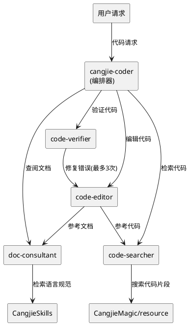
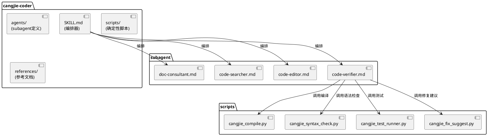
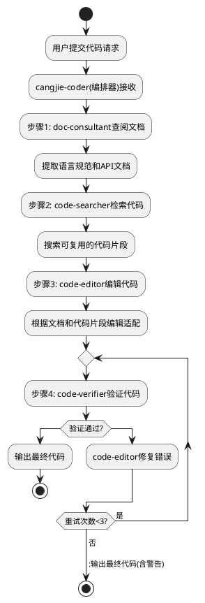

# cangjie-coder agents子目录完善 - 技术设计文档

## 一、需求与存量功能关系分析

### 1.1 需求功能与存量功能对比

#### 1.1.1 已实现功能

| 需求功能 | 存量功能 | 代码位置 | 匹配度 |
|---------|---------|---------|--------|
| SKILL.md标准 | cangjie-coder已有SKILL.md | skills/cangjie-coder/SKILL.md | 100% |
| 四步工作流 | 查阅→检索→编辑→写入 | skills/cangjie-coder/SKILL.md | 75% |
| 依赖声明 | dependencies字段声明cangjie-language-guide | skills/cangjie-coder/SKILL.md | 50% |
| subagent机制 | skill-creator已有agents子目录 | skills/skill-creator/agents/ | 75% |
| 脚本机制 | skill-creator已有scripts子目录 | skills/skill-creator/scripts/ | 75% |
| 文件操作工具 | file_read/file_write/file_search | src/tool/file_tools.cj | 100% |
| CLI执行工具 | cli_execute | src/tool/cli_tool.cj | 100% |

#### 1.1.2 需要扩展的功能

| 需求功能 | 存量功能 | 差异说明 | 扩展方向 |
|---------|---------|---------|---------|
| agents子目录 | 无 | cangjie-coder缺少agents子目录 | 新增4个subagent定义文件 |
| scripts子目录 | 无 | cangjie-coder缺少scripts子目录 | 新增4个Python脚本 |
| references子目录 | 无 | cangjie-coder缺少references子目录 | 新增文档索引 |
| 编排器 | SKILL.md静态描述 | 四步工作流由大模型自行遵循 | 更新SKILL.md为编排器模式 |
| 自动修复闭环 | 无 | 验证失败无自动修复 | 新增修复闭环逻辑 |

#### 1.1.3 需要新增的功能或接口

1. **agents/doc-consultant.md**: 文档查阅subagent定义
2. **agents/code-searcher.md**: 代码检索subagent定义
3. **agents/code-editor.md**: 代码编辑subagent定义
4. **agents/code-verifier.md**: 代码验证subagent定义
5. **scripts/cangjie_compile.py**: 编译验证脚本
6. **scripts/cangjie_syntax_check.py**: 语法检查脚本
7. **scripts/cangjie_test_runner.py**: 测试运行脚本
8. **scripts/cangjie_fix_suggest.py**: 修复建议脚本
9. **references/language_guide_index.md**: 语言指南索引
10. **references/code_patterns.md**: 代码模式库

### 1.2 存量功能详细分析

**skill-creator agents子目录**（skills/skill-creator/agents/）：
- **接口契约**: 每个agent通过YAML frontmatter声明（name、agent_type、description、tools、model等）
- **业务规则**: subagent通过parent_id关联到主Agent，权限最小化
- **扩展点**: cangjie-coder可复用相同的声明模式
- **约束**: 每个subagent只负责一个明确的任务

## 二、增量设计方案

### 2.1 实现模型

#### 2.1.1 上下文视图



#### 2.1.2 服务/组件总体架构



#### 2.1.3 实现设计文档

**cangjie-coder编排流程**：



### 2.2 接口设计

#### 2.2.1 subagent定义

**doc-consultant.md**：
```yaml
---
name: doc-consultant
agent_type: sub
description: 仓颉语言文档查阅Agent
version: 1.0.0
tools:
  - file_read
  - file_search
model: deepseek
maxTurns: 50
memory: session
parent_id: MainAgent
permissions:
  - database.uctoo.agents:read
---
```

**code-searcher.md**：
```yaml
---
name: code-searcher
agent_type: sub
description: 仓颉代码片段检索Agent
version: 1.0.0
tools:
  - file_read
  - file_search
  - directory_list
model: deepseek
maxTurns: 50
memory: session
parent_id: MainAgent
permissions:
  - database.uctoo.agents:read
---
```

**code-editor.md**：
```yaml
---
name: code-editor
agent_type: sub
description: 仓颉代码编辑Agent
version: 1.0.0
tools:
  - file_read
  - file_write
  - file_edit
model: deepseek
maxTurns: 100
memory: session
parent_id: MainAgent
permissions:
  - database.uctoo.agents:read
  - database.uctoo.agent_tasks:write
---
```

**code-verifier.md**：
```yaml
---
name: code-verifier
agent_type: sub
description: 仓颉代码验证Agent
version: 1.0.0
tools:
  - file_read
  - cli_execute
  - file_edit
model: deepseek
maxTurns: 100
memory: session
parent_id: MainAgent
permissions:
  - database.uctoo.agents:read
  - database.uctoo.agent_tasks:write
  - database.uctoo.agent_tasks:execute
---
```

### 2.3 数据模型

本工程不涉及数据库表变更，主要是技能文件（SKILL.md、agents/、scripts/、references/）的创建。

**目标目录结构**：
```
cangjie-coder/
├── SKILL.md                    # 主技能定义（更新为编排器模式）
├── agents/                     # subagent定义
│   ├── doc-consultant.md       # 文档查阅Agent
│   ├── code-searcher.md        # 代码检索Agent
│   ├── code-editor.md          # 代码编辑Agent
│   └── code-verifier.md        # 代码验证Agent
├── scripts/                    # 确定性脚本
│   ├── cangjie_syntax_check.py # 仓颉语法检查
│   ├── cangjie_compile.py      # 编译验证
│   ├── cangjie_test_runner.py  # 测试运行
│   └── cangjie_fix_suggest.py  # 修复建议
├── references/                 # 参考文档索引
│   ├── language_guide_index.md # 语言指南索引
│   └── code_patterns.md        # 代码模式库
└── assets/                     # 资源文件
    └── templates/              # 代码模板
```