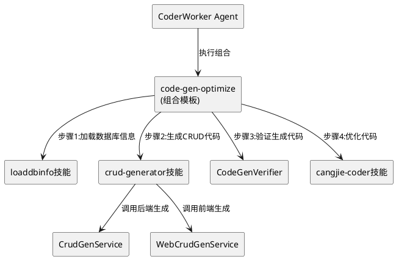

# 代码生成工具Skills化封装 - 技术设计文档

## 一、需求与存量功能关系分析

### 1.1 需求功能与存量功能对比

#### 1.1.1 已实现功能

| 需求功能 | 存量功能 | 代码位置 | 匹配度 |
|---------|---------|---------|--------|
| 后端CRUD代码生成 | CrudGenService + TemplateEngine | src/app/tools/crudgen/ | 100% |
| 前端CRUD页面生成 | WebCrudGenService + TemplateEngine | src/app/tools/crudweb/ | 100% |
| 数据库信息加载 | LoadDbInfoService | src/app/tools/loaddbinfo/ | 100% |
| RESTful API | 已有CRUD生成和Web生成的API | src/app/controllers/ | 100% |
| crud-generator技能 | 已有SKILL.md（基础版） | skills/crud-generator/SKILL.md | 75% |

#### 1.1.2 需要扩展的功能

| 需求功能 | 存量功能 | 差异说明 | 扩展方向 |
|---------|---------|---------|---------|
| Skills化封装 | 内置工具硬编码 | crudgen/crudweb是内置工具，非技能 | 更新SKILL.md，增加skills标准字段 |
| 组合模板 | 无 | 代码生成工具的组合模式无法模板化 | 新增COMPOSITION.yaml |
| 闭环验证 | 无 | 代码生成后无自动验证 | 新增CodeGenVerifier |
| Agent调用接口 | 无 | CoderWorker无法通过技能调用 | 通过SkillToToolAdapter桥接 |

#### 1.1.3 需要新增的功能或接口

1. **crud-generator SKILL.md更新**: 增加标准化的输入输出定义
2. **loaddbinfo SKILL.md**: 新建技能定义文件
3. **COMPOSITION.yaml**: code-gen-optimize组合模板
4. **CodeGenVerifier**: 代码生成闭环验证器

### 1.2 存量功能详细分析

**CrudGenService**（src/app/tools/crudgen/）：
- **接口契约**: 接收table_name和database参数，生成5层代码
- **业务规则**: Model→DAO→Service→Controller→Route按模板生成
- **扩展点**: 模板可自定义
- **约束**: 当前仅通过RESTful API调用，无技能化接口

## 二、增量设计方案

### 2.1 实现模型

#### 2.1.1 上下文视图



### 2.2 接口设计

**crud-generator SKILL.md更新**：
```yaml
---
name: crud-generator
version: 2.0.0
description: 全栈CRUD代码生成技能
inputs:
  - name: table_name
    type: string
    required: true
  - name: database
    type: string
    required: true
  - name: generate_backend
    type: boolean
    default: true
  - name: generate_frontend
    type: boolean
    default: true
outputs:
  - name: files
    type: string[]
    description: 生成的文件路径列表
  - name: api_endpoints
    type: string[]
    description: 生成的API端点列表
dependencies:
  - loaddbinfo
---
```

**COMPOSITION.yaml**：
```yaml
composition:
  name: code-gen-optimize
  description: 全栈代码生成+优化组合
  steps:
    - name: load-db-info
      skill: loaddbinfo
      input:
        database: ${args.database}
    - name: gen-crud
      skill: crud-generator
      depends_on: [load-db-info]
      input:
        table_name: ${args.table_name}
        database: ${args.database}
    - name: verify-code
      skill: code-gen-verifier
      depends_on: [gen-crud]
      input:
        files: ${gen-crud.output.files}
    - name: optimize-code
      skill: cangjie-coder
      depends_on: [verify-code]
      input:
        files: ${gen-crud.output.files}
        action: optimize
  output:
    files: ${optimize-code.output.files}
```

### 2.3 数据模型

本工程不涉及数据库表变更，主要是技能文件和组合模板的创建。

**目标目录结构**：
```
skills/
├── crud-generator/
│   ├── SKILL.md              # 更新为v2.0.0
│   ├── COMPOSITION.yaml      # 新增组合模板
│   ├── assets/
│   ├── references/
│   ├── scripts/
│   └── templates/
├── loaddbinfo/
│   └── SKILL.md              # 新建
└── code-gen-verifier/
    └── SKILL.md              # 新建
```