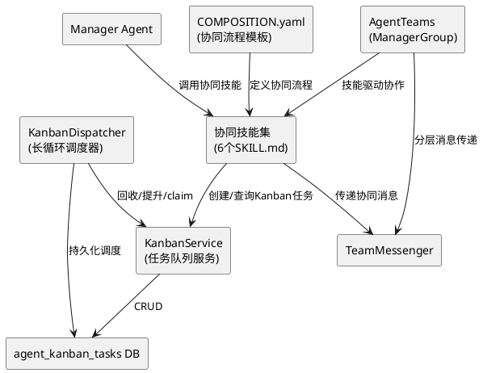
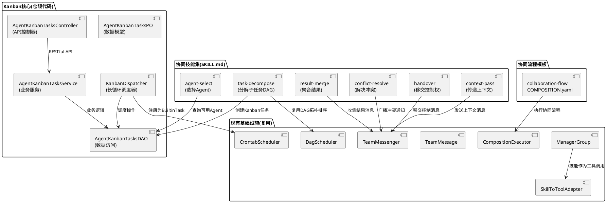
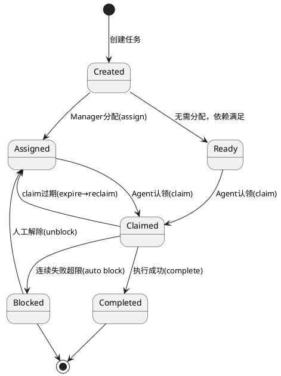
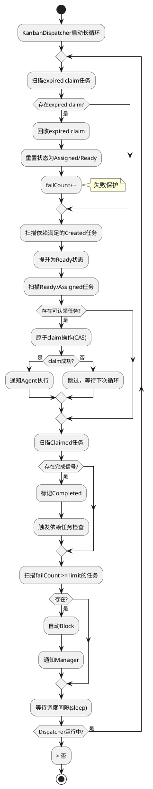
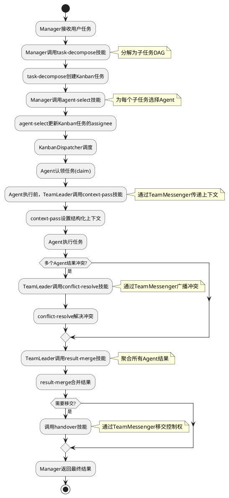
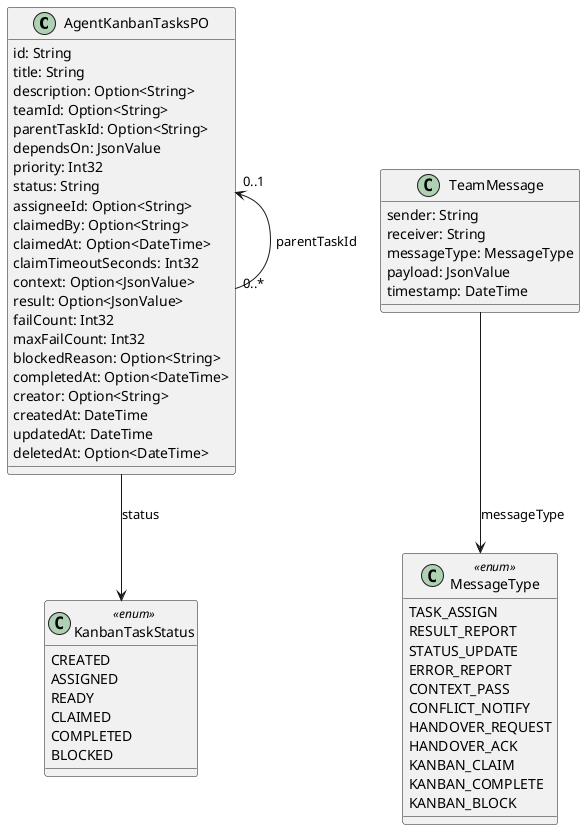

# 协同技能集与Kanban - 技术设计文档

## 一、需求与存量功能关系分析

### 1.1 需求功能与存量功能对比

#### 1.1.1 已实现功能

| 需求功能 | 存量功能 | 代码位置 | 匹配度 |
|---------|---------|---------|--------|
| Agent协作框架 | AgentGroup接口（LinearGroup/LeaderGroup/FreeGroup） | src/agent_group/ | 50% |
| 三层协作架构 | ManagerGroup（Manager-TeamLeader-Worker） | src/agent_group/manager_group.cj | 60% |
| 分层消息传递 | TeamMessenger（send/broadcast/request） | src/agent_group/team_messenger.cj | 50% |
| 任务消息类型 | TeamMessage + MessageType枚举 | src/agent_group/team_message.cj | 40% |
| DAG编排引擎 | DagScheduler + DagConfig + StepConfig | src/agent_executor/dag_scheduler.cj | 50% |
| DAG与团队集成 | DagTeamOrchestrator | src/agent_executor/dag_team_orchestrator.cj | 40% |
| 技能系统 | SKILL.md格式 + SkillToToolAdapter | src/skill/skill_to_tool_adapter.cj | 75% |
| 技能组合引擎 | CompositionExecutor + COMPOSITION.yaml | src/skill/composition_executor.cj | 60% |
| 任务持久化 | agent_tasks表 + AgentTasksPO/DAO/Service | src/app/models/uctoo/AgentTasksPO.cj | 40% |
| 周期调度引擎 | CrontabScheduler + BuiltinExecutor | src/app/services/crontab/SchedulerEngine.cj | 30% |
| 团队配置 | TeamConfig + YamlTeamConfigParser | src/agent_group/team_config.cj | 50% |
| 团队生命周期 | TeamManager | src/agent_group/team_manager.cj | 40% |

#### 1.1.2 需要扩展的功能

| 需求功能 | 存量功能 | 差异说明 | 扩展方向 |
|---------|---------|---------|---------|
| 协同技能集(task-decompose等6个) | 无 | 当前协作是固定程序式，无动态协同技能 | 新增6个SKILL.md技能文件 |
| Kanban任务队列 | agent_tasks表（简单状态0-3） | agent_tasks仅支持4种状态，无assign/claim/block流程 | 新增agent_kanban_tasks表，扩展任务生命周期 |
| 任务分配/认领机制 | 无 | agent_tasks无assignee和claim概念 | 新增KanbanDAO的claim/assign原子操作 |
| 失败保护 | 无 | 连续失败无自动阻塞机制 | KanbanDispatcher中实现failCount计数和自动block |
| Dispatcher调度器 | CrontabScheduler（CRON触发） | CrontabScheduler基于时间触发，非任务队列驱动 | 新增KanbanDispatcher长循环调度器 |
| 协同技能与AgentTeams集成 | ManagerGroup固定流程 | ManagerGroup的chat方法是固定程序式，无技能驱动 | 通过TeamMessenger传递协同技能消息 |
| TeamMessage扩展 | payload为String | 协同技能需要结构化上下文传递 | payload扩展为JsonValue，新增协同消息类型 |

#### 1.1.3 需要新增的功能或接口

**核心新增模块**：
1. **6个协同技能SKILL.md**: task-decompose、agent-select、context-pass、result-merge、conflict-resolve、handover
2. **agent_kanban_tasks表**: Kanban任务持久化，生命周期create→assign→claim→complete/block
3. **KanbanDispatcher**: 长循环调度器，回收过期claim、提升ready任务、原子claim、失败保护
4. **KanbanDAO/Service/Controller/Route**: 标准CRUD模块
5. **协同COMPOSITION.yaml模板**: 定义协同流程组合模板
6. **TeamMessage扩展**: 新增协同消息类型，payload扩展为JsonValue

### 1.2 存量功能详细分析

**ManagerGroup**（src/agent_group/manager_group.cj）：
- **接口契约**: 构造时组装Manager/TeamLeader/Worker三层，chat方法委托给Manager
- **业务规则**: Manager通过AgentAsTool调用TeamLeader，TeamLeader通过AgentAsTool调用Worker
- **扩展点**: chat方法中Manager的任务分解逻辑可替换为task-decompose技能驱动
- **约束**: 当前任务分解和分配是LLM隐式推理，无显式技能调用

**TeamMessenger**（src/agent_group/team_messenger.cj）：
- **接口契约**: send/broadcast/request三种消息传递模式
- **业务规则**: 消息存储在内存ArrayList中，subscribe支持消息订阅
- **扩展点**: 可新增Kanban消息类型，与KanbanDispatcher联动
- **约束**: 消息不持久化，重启丢失；payload为String类型

**TeamMessage**（src/agent_group/team_message.cj）：
- **接口契约**: sender/receiver/messageType/payload/timestamp字段
- **业务规则**: MessageType枚举定义TASK_ASSIGN/RESULT_REPORT/STATUS_UPDATE/ERROR_REPORT
- **扩展点**: 新增CONTEXT_PASS/CONFLICT_RESOLVE/HANDOVER等协同消息类型
- **约束**: payload为String，无法承载结构化上下文数据

**DagScheduler**（src/agent_executor/dag_scheduler.cj）：
- **接口契约**: schedule/getReadySteps/completeStep/failStep方法
- **业务规则**: 拓扑排序确定执行顺序，getReadySteps返回依赖满足的步骤
- **扩展点**: 可复用拓扑排序逻辑实现Kanban任务的依赖调度
- **约束**: 步骤状态在内存中管理，不持久化到Kanban表

**agent_tasks表**（已有）：
- **接口契约**: id/agent_id/parent_task_id/status/priority/payload/result/error_message字段
- **业务规则**: status为0-3（待处理/进行中/完成/失败），priority为1-5
- **扩展点**: 可扩展status枚举支持assign/claim/block状态
- **约束**: 无assignee字段、无claim时间戳、无失败计数、无过期机制；与Kanban需求差异较大，新建agent_kanban_tasks表更合理

**CrontabScheduler**（src/app/services/crontab/SchedulerEngine.cj）：
- **接口契约**: 基于Ticktock的CRON调度，register/trigger/reload方法
- **业务规则**: CRON表达式触发，通过ExecutorRegistry分发到Script/Http/Builtin执行器
- **扩展点**: BuiltinExecutor支持动态注册BuiltinTaskHandler，可注册Kanban调度处理器
- **约束**: 基于时间触发，非任务队列驱动；不适合作为Kanban长循环调度器

**CompositionExecutor**（src/skill/composition_executor.cj）：
- **接口契约**: execute/executeStep方法，支持串行/并行/条件执行
- **业务规则**: 按COMPOSITION.yaml定义的步骤和依赖执行技能组合
- **扩展点**: 协同流程可通过COMPOSITION.yaml定义，由CompositionExecutor执行
- **约束**: 当前步骤类型为skill，需扩展支持agent类型步骤

## 二、增量设计方案

### 2.1 实现模型

#### 2.1.1 上下文视图



#### 2.1.2 服务/组件总体架构



#### 2.1.3 实现设计文档

**Kanban任务生命周期状态机**：



**KanbanDispatcher调度循环流程**：



**协同技能与AgentTeams集成流程**：



### 2.2 接口设计

#### 2.2.1 总体设计

| 接口分类 | 接口名称 | 稳定性 | 说明 |
|---------|---------|--------|------|
| Kanban管理API | POST /api/v1/uctoo/agent_kanban_tasks/add | 稳定 | 创建Kanban任务 |
| Kanban管理API | POST /api/v1/uctoo/agent_kanban_tasks/edit | 稳定 | 更新Kanban任务 |
| Kanban管理API | POST /api/v1/uctoo/agent_kanban_tasks/del | 稳定 | 删除Kanban任务 |
| Kanban管理API | GET /api/v1/uctoo/agent_kanban_tasks/:id | 稳定 | 查询Kanban任务详情 |
| Kanban管理API | GET /api/v1/uctoo/agent_kanban_tasks/:limit/:page | 稳定 | 分页查询Kanban任务 |
| Kanban调度API | POST /api/v1/uctoo/agent_kanban_tasks/:id/claim | 稳定 | 原子认领任务 |
| Kanban调度API | POST /api/v1/uctoo/agent_kanban_tasks/:id/complete | 稳定 | 完成任务 |
| Kanban调度API | POST /api/v1/uctoo/agent_kanban_tasks/:id/block | 稳定 | 阻塞任务 |
| Kanban调度API | POST /api/v1/uctoo/agent_kanban_tasks/:id/unblock | 稳定 | 解除阻塞 |
| Kanban调度API | POST /api/v1/uctoo/agent_kanban_tasks/dispatch | 实验 | 手动触发调度循环 |
| Kanban查询API | GET /api/v1/uctoo/agent_kanban_tasks/by_status/:status | 稳定 | 按状态查询任务 |
| Kanban查询API | GET /api/v1/uctoo/agent_kanban_tasks/by_agent/:agentId | 稳定 | 按Agent查询任务 |
| 内部接口 | KanbanDispatcher.runLoop() | 实验 | 调度循环 |
| 内部接口 | KanbanDispatcher.reclaimExpired() | 实验 | 回收过期claim |
| 内部接口 | KanbanDispatcher.promoteReady() | 实验 | 提升ready任务 |
| 内部接口 | KanbanDispatcher.atomicClaim() | 实验 | 原子claim操作 |
| 技能接口 | task-decompose (SKILL.md) | 实验 | 分解子任务DAG |
| 技能接口 | agent-select (SKILL.md) | 实验 | 选择Agent |
| 技能接口 | context-pass (SKILL.md) | 实验 | 传递上下文 |
| 技能接口 | result-merge (SKILL.md) | 实验 | 聚合结果 |
| 技能接口 | conflict-resolve (SKILL.md) | 实验 | 解决冲突 |
| 技能接口 | handover (SKILL.md) | 实验 | 移交控制权 |

#### 2.2.2 接口清单

**创建Kanban任务接口**：

```
POST /api/v1/uctoo/agent_kanban_tasks/add
```

- **业务说明**: 创建一个新的Kanban任务，状态初始为created
- **前置条件**: 无
- **后置条件**: 任务记录写入agent_kanban_tasks表，状态为created
- **请求体**:
  ```json
  {
    "title": "实现AgentKanbanTasksDAO",
    "description": "实现Kanban任务的DAO层",
    "team_id": "uuid-of-agent-group",
    "parent_task_id": null,
    "depends_on": ["uuid-of-parent-task"],
    "priority": 3,
    "assignee_id": null,
    "context": { "spec_path": "/path/to/spec.md" },
    "claim_timeout_seconds": 300,
    "max_fail_count": 3
  }
  ```
- **响应**: 任务详情（含id和初始状态）
- **异常映射**: 参数错误→400，team_id不存在→404

**原子认领任务接口**：

```
POST /api/v1/uctoo/agent_kanban_tasks/:id/claim
```

- **业务说明**: Agent原子认领一个Ready/Assigned状态的任务，CAS操作防止并发冲突
- **前置条件**: 任务状态为ready或assigned，且未被其他Agent认领
- **后置条件**: 任务状态变为claimed，claimed_at更新为当前时间，claimed_by更新为当前Agent
- **请求体**:
  ```json
  {
    "agent_id": "uuid-of-agent"
  }
  ```
- **响应**: 认领结果（成功/失败）
- **异常映射**: 任务不存在→404，任务状态不允许→409，已被认领→409

**完成任务接口**：

```
POST /api/v1/uctoo/agent_kanban_tasks/:id/complete
```

- **业务说明**: 标记任务为完成，并触发依赖任务的状态检查
- **前置条件**: 任务状态为claimed，且当前Agent是认领者
- **后置条件**: 任务状态变为completed，completed_at更新，依赖此任务的任务可能被提升为ready
- **请求体**:
  ```json
  {
    "result": { "files_created": ["src/xxx.cj"], "status": "success" }
  }
  ```
- **响应**: 任务详情

**KanbanDispatcher内部接口**：

```cangjie
import std.collection.ArrayList
import std.time.DateTime
import stdx.encoding.json.JsonValue

public class KanbanDispatcher {
    private let _kanbanService: AgentKanbanTasksService
    private var _running: Bool = false
    private let _dispatchIntervalMs: Int64 = 5000
    private let _claimTimeoutSeconds: Int64 = 300
    private let _maxFailCount: Int32 = 3

    public func start(): Unit
    public func stop(): Unit
    public func runOnce(): Unit
    public func reclaimExpired(): Int64
    public func promoteReady(): Int64
    public func atomicClaim(taskId: String, agentId: String): Option<Bool>
    public func checkAndBlockOverdue(): Int64
}
```

**KanbanService扩展接口**：

```cangjie
public class AgentKanbanTasksService {
    public func createTask(task: AgentKanbanTasksPO): APIResult<AgentKanbanTasksPO>
    public func claimTask(taskId: String, agentId: String): APIResult<AgentKanbanTasksPO>
    public func completeTask(taskId: String, result: JsonValue): APIResult<AgentKanbanTasksPO>
    public func blockTask(taskId: String, reason: String): APIResult<AgentKanbanTasksPO>
    public func unblockTask(taskId: String): APIResult<AgentKanbanTasksPO>
    public func assignTask(taskId: String, agentId: String): APIResult<AgentKanbanTasksPO>
    public func getTasksByStatus(status: String): APIResult<ArrayList<AgentKanbanTasksPO>>
    public func getTasksByAgent(agentId: String): APIResult<ArrayList<AgentKanbanTasksPO>>
    public func getReadyTasksForAgent(agentId: String): APIResult<ArrayList<AgentKanbanTasksPO>>
    public func triggerDependentTasks(taskId: String): APIResult<Int64>
}
```

**KanbanDAO扩展接口**：

```cangjie
@DAO
public interface AgentKanbanTasksDAO <: RootDAO {
    prop executor: SqlExecutor

    func atomicClaim(taskId: String, agentId: String, claimTimeoutSeconds: Int64): Option<AgentKanbanTasksPO>
    func findExpiredClaims(timeoutSeconds: Int64): ArrayList<AgentKanbanTasksPO>
    func findReadyTasks(): ArrayList<AgentKanbanTasksPO>
    func findAssignedWithoutClaim(): ArrayList<AgentKanbanTasksPO>
    func findOverdueFailed(maxFailCount: Int32): ArrayList<AgentKanbanTasksPO>
    func findByTeamId(teamId: String): ArrayList<AgentKanbanTasksPO>
    func countByStatusAndTeam(teamId: String, status: String): Int64
    func incrementFailCount(taskId: String): Option<AgentKanbanTasksPO>
}
```

**TeamMessage扩展**：

```cangjie
public enum MessageType {
    | TASK_ASSIGN | RESULT_REPORT | STATUS_UPDATE | ERROR_REPORT
    | CONTEXT_PASS | CONFLICT_NOTIFY | HANDOVER_REQUEST | HANDOVER_ACK
    | KANBAN_CLAIM | KANBAN_COMPLETE | KANBAN_BLOCK
}
```

> **扩展说明**: 在现有MessageType枚举中新增6个协同消息类型。payload字段从String扩展为JsonValue类型，承载结构化上下文数据。保持向后兼容，现有消息类型不受影响。

### 2.3 数据模型

#### 2.3.1 设计目标

- 支持Kanban任务的完整生命周期（create→assign→claim→complete/block）
- 支持任务间的DAG依赖关系
- 支持原子claim操作（CAS防并发）
- 支持失败保护和自动阻塞
- 支持claim超时回收
- 与agent_groups表关联（team_id）
- 与agents表关联（assignee_id/claimed_by）

#### 2.3.2 模型实现



**持久化策略**：
- 新增 agent_kanban_tasks 表存储Kanban任务，与 agent_tasks 表并存（agent_tasks用于简单任务，agent_kanban_tasks用于协同Kanban任务）
- 使用 Fountain ORM 持久化到 PostgreSQL
- 遵循 uctoo-v4 模块开发规范：Model→DAO→Service→Controller→Route
- 使用 crudgen 生成标准 CRUD 代码骨架
- context/result/depends_on 字段使用 jsonb 类型
- 原子claim操作通过SQL UPDATE ... WHERE status IN ('ready','assigned') AND (claimed_by IS NULL OR claimed_at < NOW() - interval) 实现

**uctoo-v4 模块开发规范约束**：
- PO类需使用 `@DataAssist[fields]` 和 `@QueryMappersGenerator["agent_kanban_tasks"]` 注解
- PO类字段使用 `public var` 声明，可选字段使用 `Option<T>` 类型
- PO类需提供 `toJsonValue(): JsonValue` 和 `toJson(): String` 序列化方法
- DAO接口需使用 `@DAO` 注解并继承 `RootDAO`，声明 `prop executor: SqlExecutor`
- DAO查询方法返回 `Option<T>`（单条）或 `ArrayList<T>`（列表）或 `Pagination<T>`（分页）
- Service类方法返回 `APIResult<T>`，使用 `try { ... } catch (e: Exception) { ... }` 错误处理
- Controller方法签名统一为 `public func add(req: HttpRequest, res: HttpResponse): Unit`
- 包名规范：`magic.app.models.uctoo`、`magic.app.dao.uctoo`、`magic.app.services.uctoo`、`magic.app.controllers.uctoo`
- 导入规范：`import std.time.DateTime`、`import stdx.encoding.json.{JsonValue, JsonObject, JsonArray}`、`import std.collection.*`、`import f_orm.*`

**DDL**：

```sql
CREATE TABLE "public"."agent_kanban_tasks" (
    "id" uuid NOT NULL DEFAULT gen_random_uuid(),
    "title" varchar(200) COLLATE "pg_catalog"."default" NOT NULL,
    "description" varchar(2048) COLLATE "pg_catalog"."default",
    "team_id" uuid,
    "parent_task_id" uuid,
    "depends_on" jsonb NOT NULL DEFAULT '[]'::jsonb,
    "priority" int4 NOT NULL DEFAULT 3,
    "status" varchar(20) COLLATE "pg_catalog"."default" NOT NULL DEFAULT 'created'::character varying,
    "assignee_id" uuid,
    "claimed_by" uuid,
    "claimed_at" timestamptz(6),
    "claim_timeout_seconds" int4 NOT NULL DEFAULT 300,
    "context" jsonb,
    "result" jsonb,
    "fail_count" int4 NOT NULL DEFAULT 0,
    "max_fail_count" int4 NOT NULL DEFAULT 3,
    "blocked_reason" varchar(500) COLLATE "pg_catalog"."default",
    "completed_at" timestamptz(6),
    "creator" uuid,
    "created_at" timestamptz(6) NOT NULL DEFAULT CURRENT_TIMESTAMP,
    "updated_at" timestamptz(6) NOT NULL DEFAULT CURRENT_TIMESTAMP,
    "deleted_at" timestamptz(6),
    CONSTRAINT "agent_kanban_tasks_pkey" PRIMARY KEY ("id"),
    CONSTRAINT "agent_kanban_tasks_team_id_fkey" FOREIGN KEY ("team_id") REFERENCES "public"."agent_groups"("id") ON DELETE SET NULL,
    CONSTRAINT "agent_kanban_tasks_parent_task_id_fkey" FOREIGN KEY ("parent_task_id") REFERENCES "public"."agent_kanban_tasks"("id") ON DELETE SET NULL,
    CONSTRAINT "agent_kanban_tasks_assignee_id_fkey" FOREIGN KEY ("assignee_id") REFERENCES "public"."agents"("id") ON DELETE SET NULL,
    CONSTRAINT "agent_kanban_tasks_claimed_by_fkey" FOREIGN KEY ("claimed_by") REFERENCES "public"."agents"("id") ON DELETE SET NULL
)
;

COMMENT ON COLUMN "public"."agent_kanban_tasks"."id" IS 'Kanban任务唯一标识';
COMMENT ON COLUMN "public"."agent_kanban_tasks"."title" IS '任务标题';
COMMENT ON COLUMN "public"."agent_kanban_tasks"."description" IS '任务描述';
COMMENT ON COLUMN "public"."agent_kanban_tasks"."team_id" IS '关联agent_groups表id';
COMMENT ON COLUMN "public"."agent_kanban_tasks"."parent_task_id" IS '父任务ID，支持子任务分解';
COMMENT ON COLUMN "public"."agent_kanban_tasks"."depends_on" IS '依赖任务ID列表(JSONB数组)';
COMMENT ON COLUMN "public"."agent_kanban_tasks"."priority" IS '优先级1-5，数字越小优先级越高';
COMMENT ON COLUMN "public"."agent_kanban_tasks"."status" IS '状态：created/assigned/ready/claimed/completed/blocked';
COMMENT ON COLUMN "public"."agent_kanban_tasks"."assignee_id" IS '分配的Agent ID，关联agents表';
COMMENT ON COLUMN "public"."agent_kanban_tasks"."claimed_by" IS '实际认领的Agent ID，关联agents表';
COMMENT ON COLUMN "public"."agent_kanban_tasks"."claimed_at" IS '认领时间';
COMMENT ON COLUMN "public"."agent_kanban_tasks"."claim_timeout_seconds" IS '认领超时秒数，超时后回收';
COMMENT ON COLUMN "public"."agent_kanban_tasks"."context" IS '任务上下文(JSONB)，协同技能传递的结构化数据';
COMMENT ON COLUMN "public"."agent_kanban_tasks"."result" IS '执行结果(JSONB)';
COMMENT ON COLUMN "public"."agent_kanban_tasks"."fail_count" IS '连续失败次数';
COMMENT ON COLUMN "public"."agent_kanban_tasks"."max_fail_count" IS '最大允许失败次数，超过自动block';
COMMENT ON COLUMN "public"."agent_kanban_tasks"."blocked_reason" IS '阻塞原因';
COMMENT ON COLUMN "public"."agent_kanban_tasks"."completed_at" IS '完成时间';
COMMENT ON COLUMN "public"."agent_kanban_tasks"."creator" IS '创建人';
COMMENT ON COLUMN "public"."agent_kanban_tasks"."created_at" IS '创建时间';
COMMENT ON COLUMN "public"."agent_kanban_tasks"."updated_at" IS '更新时间';
COMMENT ON COLUMN "public"."agent_kanban_tasks"."deleted_at" IS '删除时间';
COMMENT ON TABLE "public"."agent_kanban_tasks" IS 'Agent Kanban任务队列表。存储多Agent协同任务的完整生命周期，支持分配、认领、完成、阻塞等状态流转。';

CREATE INDEX idx_kanban_tasks_status ON "public"."agent_kanban_tasks"(status);
CREATE INDEX idx_kanban_tasks_team ON "public"."agent_kanban_tasks"(team_id);
CREATE INDEX idx_kanban_tasks_assignee ON "public"."agent_kanban_tasks"(assignee_id);
CREATE INDEX idx_kanban_tasks_claimed_by ON "public"."agent_kanban_tasks"(claimed_by);
CREATE INDEX idx_kanban_tasks_parent ON "public"."agent_kanban_tasks"(parent_task_id);
CREATE INDEX idx_kanban_tasks_priority ON "public"."agent_kanban_tasks"(priority);
CREATE INDEX idx_kanban_tasks_claimed_at ON "public"."agent_kanban_tasks"(claimed_at) WHERE "claimed_at" IS NOT NULL;
```

**6个协同技能SKILL.md设计**：

| 技能名 | 输入 | 输出 | 调用的Kanban/TeamMessenger接口 | 说明 |
|--------|------|------|-------------------------------|------|
| task-decompose | task_description, team_id | sub_tasks[], dag_edges[] | KanbanService.createTask() | 将复杂任务分解为子任务DAG，创建Kanban任务 |
| agent-select | task_id, candidate_agents[] | selected_agent_id | KanbanService.assignTask() | 根据子任务特征选择最合适的Agent |
| context-pass | from_agent_id, to_agent_id, context_data | pass_result | TeamMessenger.send() | 在Agent间传递结构化上下文 |
| result-merge | task_ids[], merge_strategy | merged_result | TeamMessenger.getMessagesTo() | 聚合多个Agent的执行结果 |
| conflict-resolve | conflicting_results[], resolve_strategy | resolved_result | TeamMessenger.broadcast() | 解决Agent间的执行冲突 |
| handover | from_agent_id, to_agent_id, task_id | handover_result | TeamMessenger.send() | 将控制权移交给另一个Agent |

**协同流程COMPOSITION.yaml模板**：

```yaml
name: collaboration-flow
description: Standard collaboration flow with Kanban task queue
version: 1.0.0
steps:
  - name: decompose-task
    skill: task-decompose
    step_type: skill
    depends_on: []
    input:
      task_description: "${input.task_description}"
      team_id: "${input.team_id}"
  - name: select-agents
    skill: agent-select
    step_type: skill
    depends_on: [decompose-task]
    input:
      task_id: "${decompose-task.output.sub_tasks[0].id}"
      candidate_agents: "${input.candidate_agents}"
  - name: pass-context
    skill: context-pass
    step_type: skill
    depends_on: [select-agents]
    input:
      from_agent_id: "${input.manager_agent_id}"
      to_agent_id: "${select-agents.output.selected_agent_id}"
      context_data: "${decompose-task.output.sub_tasks[0].context}"
  - name: merge-results
    skill: result-merge
    step_type: skill
    depends_on: [pass-context]
    input:
      task_ids: "${decompose-task.output.sub_task_ids}"
      merge_strategy: "hierarchical"
  - name: resolve-conflicts
    skill: conflict-resolve
    step_type: skill
    depends_on: [merge-results]
    condition: "${merge-results.output.has_conflicts} == true"
    input:
      conflicting_results: "${merge-results.output.conflicts}"
      resolve_strategy: "priority_based"
  - name: handover
    skill: handover
    step_type: skill
    depends_on: [resolve-conflicts]
    condition: "${input.requires_handover} == true"
    input:
      from_agent_id: "${input.current_agent_id}"
      to_agent_id: "${input.next_agent_id}"
      task_id: "${input.task_id}"
outputs:
  final_result: "${merge-results.output.merged_result}"
  sub_tasks: "${decompose-task.output.sub_tasks}"
  has_conflicts: "${merge-results.output.has_conflicts}"
```