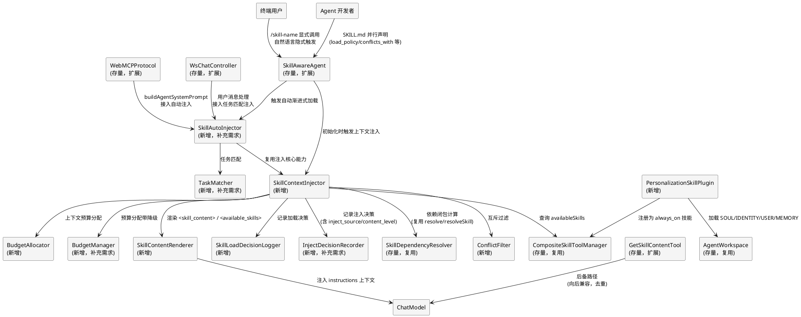
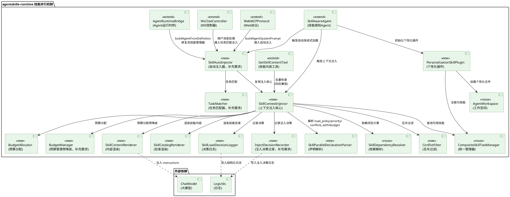
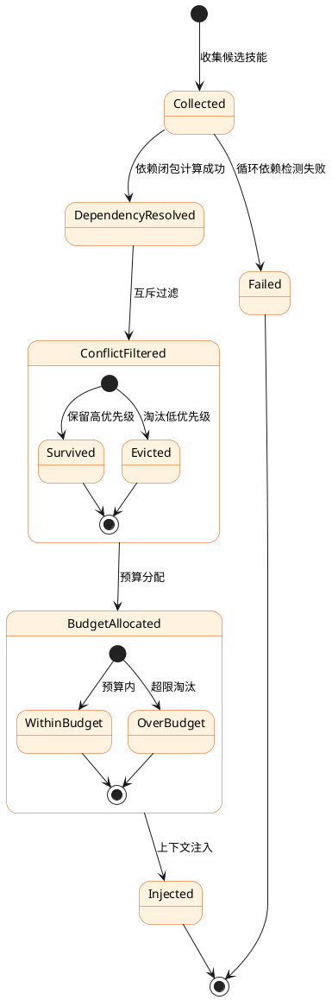
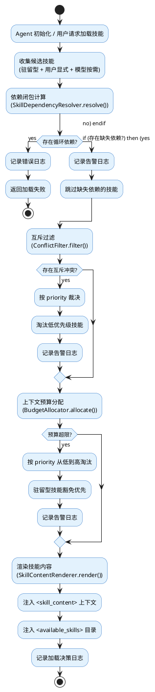
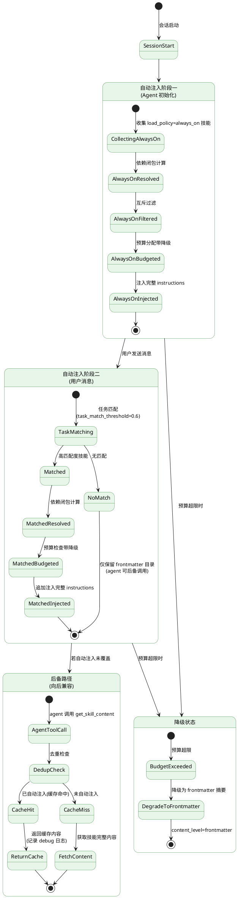

# 技能并行机制技术设计文档

> **工程目录**: `.codeartsdoer/specs/concurrent_skills/`
> **生成日期**: 2026-10-05
> **更新日期**: 2026-10-05（纳入 spec.md 第 5.6 节"技能内容自动渐进式加载"补充需求）
> **上游文档**: `research.md`（研究报告）、`spec.md`（需求规格，含 5.6 节补充需求）
> **设计范围**: agentskills-runtime 上下文级技能并行机制 + 技能内容自动渐进式加载
> **技术栈**: Cangjie（仓颉）+ cjpm + fountain 框架
> **本次更新摘要**: 修复"渐进式加载设计漂移"——将技能完整内容加载从"agent 主动调用 `get_skill_content` 工具"恢复为"框架自动注入到上下文"；新增 `SkillAutoInjector`/`TaskMatcher`/`BudgetManager`/`InjectDecisionRecorder` 四个组件；补充 `WebMCPProtocol`/`WsChatController`/`AgentRuntimeBridge` 集成方案；保留 `get_skill_content` 工具作为后备机制（向后兼容）

---

# 一、需求与存量功能关系分析

## 1.1 需求功能与存量功能对比

### 1.1.1 已实现功能

| 需求功能 | 存量功能 | 代码位置 | 匹配度 |
|---------|---------|---------|--------|
| 技能依赖闭包计算 | `SkillDependencyResolver.resolve()` 已实现依赖提取、拓扑排序、循环检测、缺失检测 | `src/skill/dependency_resolver.cj:86-130` | 75% |
| 传递依赖递归收集 | `collectSkillsRecursive()` 已实现递归收集依赖闭包 | `src/skill/dependency_resolver.cj:217-231` | 100% |
| 循环依赖检测 | `detectCycles()` + `dfsCycle()` DFS 三色标记法 | `src/skill/dependency_resolver.cj:198-338` | 100% |
| 拓扑排序 | `topologicalSort()` Kahn 算法 | `src/skill/dependency_resolver.cj:233-285` | 100% |
| 技能可用/已启用查询 | `CompositeSkillToolManager.availableSkills` / `enabledSkills` 属性 | `src/skill/composite_skill_tool_manager.cj:69-75` | 100% |
| 技能启用/禁用 | `enableSkill()` / `disableSkill()` 已实现 | `src/skill/composite_skill_tool_manager.cj:125-139` | 100% |
| 个性化文件加载 | `AgentWorkspace` 支持 8 类工作空间文件（SOUL/IDENTITY/USER/MEMORY 等） | `src/memory/workspace/agent_workspace.cj:49-140` | 75% |
| 个性化文件合并注入 | `getCombinedMemory()` 合并 SOUL/IDENTITY/USER/MEMORY 等文件内容 | `src/memory/workspace/agent_workspace.cj:115-139` | 75% |
| 技能内容按需获取 | `GetSkillContentTool` 内置工具，模型可按需获取技能完整内容 | `src/tool/get_skill_content_tool.cj:25-189` | 50% |
| 技能注册为工具 | `SkillAwareAgent._registerSkillsAsTools()` 把所有技能注册为工具 | `src/skill/skill_aware_agent.cj:63-102` | 50% |
| 编排级步骤类型枚举 | `StepType.Parallel` 枚举值已存在 | `src/skill/composition_definition.cj:17-21` | 25% |
| 技能元数据扩展承载 | `Skill.metadata: HashMap<String, String>` 可承载任意扩展字段 | `src/core/skill/skill.cj:37` | 100% |
| 技能 frontmatter 注入（第1段） | `WebMCPProtocol.buildAgentSystemPrompt()` L1963-1983 注入技能 frontmatter（name+description）到系统提示 | `src/protocol/web_mcp_protocol.cj:1963-1983` | 100% |
| get_skill_content 工具说明注入（第2段） | `WsChatController` L412-423 注入 `get_skill_content` 工具调用引导语 | `src/controller/ws_chat_controller.cj:412-423` | 100% |
| 技能完整内容按需获取（第3段，漂移点） | `GetSkillContentTool` 内置工具，agent 主动调用获取技能完整内容 | `src/tool/get_skill_content_tool.cj:25-189` | 50% |
| 启动时技能自动发现 | `ProgressiveSkillLoader` 自动扫描目录发现并加载 SKILL.md 文件 | `src/skill/progressive_skill_loader.cj` | 100% |
| Agent 创建路径（buildAgent） | `AgentRuntimeBridge.buildAgent()` 创建 agent 并加载技能 | `src/runtime/agent_runtime_bridge.cj` | 75% |

### 1.1.2 需要扩展的功能

| 需求功能 | 存量功能 | 差异说明 | 扩展方向 |
|---------|---------|---------|---------|
| 依赖技能同载 | `SkillDependencyResolver` 能解析依赖但只产出 `loadOrder`，不触发实际加载 | 现有解析器只返回加载顺序列表，没有"加载到上下文"的动作；`extractDependencies()` L174-185 把 `allowedTools` 也当依赖，混淆了"技能依赖技能"与"技能依赖工具" | 新增 `SkillContextInjector` 消费 `loadOrder` 并执行上下文注入；`extractDependencies()` 增加参数区分技能依赖与工具依赖 |
| 互斥技能过滤 | 无任何互斥关系建模 | 现有 `SkillDependencyResolver` 只有依赖图，没有互斥图；`Skill` 接口的 `metadata` 可承载 `conflicts_with` 字段但无消费方 | 新增 `ConflictFilter` 组件，从 `metadata.conflicts_with` 提取互斥关系，按 `priority` 裁决 |
| 驻留型技能自动加载 | `SkillAwareAgent._registerSkillsAsTools()` 在初始化时注册所有技能为工具，但不是"注入上下文" | 现有机制是"工具级并行"（模型可调用多个工具），不是架构师所说的"上下文级并行"（指令体注入上下文）；没有 `load_policy=always_on` 的概念 | 新增 `load_policy` 字段解析，`SkillContextInjector` 在 Agent 初始化时收集 `always_on` 技能并注入上下文 |
| 上下文预算管理 | 无 token 预算分配机制 | 现有 `CompositeSkillToolManager` 有 `ResourceLimits`（内存/CPU/网络/文件），但没有上下文 token 预算；`SecurityPolicy` 也不涉及上下文 | 新增 `BudgetAllocator` 组件，按 `priority` 和 `context_budget_tokens` 分配预算 |
| personalization 技能插件 | `AgentWorkspace` 有个性化文件，但未抽象为技能插件 | 现有 `getCombinedMemory()` 直接合并文件内容注入，没有 SKILL.md 包装，没有 `load_policy=always_on` 声明，不参与依赖/互斥/预算体系 | 新增 `PersonalizationSkillPlugin`，将 `AgentWorkspace` 包装为 `load_policy=always_on` 的技能插件 |
| 技能内容渲染为 `<skill_content>` | `GetSkillContentTool._buildSkillContentJson()` 返回 JSON 格式，不是 `<skill_content>` XML 块 | 现有工具返回 JSON 供模型 tool call 消费，不是 instructions 形式上下文注入；deepseek-harness 的 `renderSkillContent()` 是参考实现 | 新增 `SkillContentRenderer`，渲染 `<skill_content>` XML 块作为 instructions 注入 |
| 技能目录 `<available_skills>` 注入 | `WebMCPProtocol` L1965-1970 和 `WsChatController` L415 有"已安装的技能知识库"提示，但格式不是 `<available_skills>` XML | 现有注入是"调用 get_skill_content 工具获取完整说明"的引导语，不是技能目录清单；且分散在两处，未统一 | 新增 `SkillCatalogRenderer`，统一渲染 `<available_skills>` 目录注入 |
| 加载决策结构化日志 | `LogUtils.info/error/warn` 有日志但非结构化决策记录 | 现有日志是散落的 info/error，没有 `decision` / `reason` / `session_id` 的结构化记录；无法事后归因 | 新增 `SkillLoadDecisionLogger`，记录结构化加载决策 |
| 技能溯源标记 | 无溯源机制 | 现有机制无法标注模型输出受哪些技能指令影响 | 新增 `ProvenanceTracker`（P3 优先级，本期可仅设计接口不实现） |
| 技能完整内容自动注入（漂移修复） | `WebMCPProtocol`/`WsChatController` 实现"三段渐进式加载"，但第3段（完整内容）依赖 agent 主动调用 `get_skill_content` 工具，非框架自动 | 现有第1段（frontmatter）和第2段（工具说明）已框架自动注入，第3段（完整内容）漂移为"agent 主动调用"；注释明确写"agent 按需调用工具获取" | 新增 `SkillAutoInjector`，在 Agent 初始化和用户消息阶段由框架自动注入完整 instructions；修改 `WebMCPProtocol.buildAgentSystemPrompt()` 和 `WsChatController` 接入自动注入 |
| 任务匹配自动注入 | 无任务匹配机制 | 现有机制无"根据用户任务描述自动匹配技能 description 并注入"的能力；模型需自行判断并调用 `get_skill_content` | 新增 `TaskMatcher`，按 `keyword` 策略匹配用户输入与技能 `description`，匹配度超过阈值（默认 0.6）的技能自动注入完整内容 |
| 预算降级为摘要注入 | `BudgetAllocator`（本期设计）只做"超限淘汰"，无"降级为 frontmatter 摘要"能力 | 现有预算超限策略是淘汰技能（完全不入上下文），补充需求要求"降级为摘要注入"（保留 frontmatter，不注入完整 instructions） | 扩展 `BudgetAllocator` 为 `BudgetManager`，新增 `degradeToFrontmatter()` 方法，超限技能降级为摘要注入而非完全淘汰 |
| 注入决策记录扩展 | `SkillLoadDecisionLogger`（本期设计）记录 decision/reason/sessionId，缺 `inject_source` 和 `content_level` | 现有决策记录无法区分"自动注入"与"agent 主动调用"，无法区分"完整内容"与"摘要" | 扩展 `SkillLoadDecisionLogger` 为 `InjectDecisionRecorder`，新增 `inject_source`（auto_init/auto_task_match/auto_dependency/agent_tool_call）和 `content_level`（full/frontmatter）字段 |
| get_skill_content 向后兼容去重 | `GetSkillContentTool` 无去重机制 | 现有工具每次调用都返回完整内容，即使该技能已被框架自动注入；补充需求要求"重复注入时去重，返回缓存" | 扩展 `GetSkillContentTool`，新增已注入技能缓存检查，已自动注入的技能返回缓存内容并记录 debug 日志 |
| buildAgentFromDefinition 路径修复 | `AgentRuntimeBridge.buildAgentFromDefinition()` L184 创建 `CompositeSkillToolManager()` 空管理器，该路径创建的 agent 未加载任何技能 | 现有 `buildAgentFromDefinition` 路径创建空技能管理器，自动注入流程无法生效 | 修改 `AgentRuntimeBridge.buildAgentFromDefinition()`，检测空技能管理器时记录告警，或复用 `buildAgent` 路径的技能加载逻辑 |

### 1.1.3 需要新增的功能或接口

按业务模块分组：

**模块 A：上下文注入核心（SkillContextInjector）**
- `collectAlwaysOnSkills()`：从 `availableSkills` 过滤 `load_policy=always_on` 的技能
  - 输入：无（从 `CompositeSkillToolManager.availableSkills` 读取）
  - 输出：`Array<Skill>`（驻留型技能列表）
  - 核心逻辑：遍历 `availableSkills`，解析 `metadata.load_policy`，过滤 `always_on`
- `resolveDependencyClosure(skills)`：计算依赖闭包
  - 输入：`Array<Skill>`（待加载技能）
  - 输出：`DependencyResolutionResult`（含 `loadOrder`、`hasCycles`、`missingSkills`）
  - 核心逻辑：复用 `SkillDependencyResolver.resolve()`
- `filterConflicts(skills)`：互斥过滤
  - 输入：`Array<Skill>`（依赖闭包计算后的技能）
  - 输出：`ConflictFilterResult`（含 `survived`、`evicted`、`conflictPairs`）
  - 核心逻辑：构建互斥图，按 `priority` 裁决，保留高优先级
- `allocateBudget(skills, totalBudget)`：上下文预算分配
  - 输入：`Array<Skill>`、`Int64`（总预算）
  - 输出：`BudgetAllocationResult`（含 `allocated`、`evicted`、`usedTokens`）
  - 核心逻辑：累计 `context_budget_tokens`，超限时按 `priority` 从低到高淘汰
- `injectToContext(skills)`：上下文注入
  - 输入：`Array<Skill>`（最终存活技能）
  - 输出：`String`（渲染后的 `<skill_content>` 上下文块）
  - 核心逻辑：调用 `SkillContentRenderer.render()` 渲染每个技能

**模块 B：互斥过滤（ConflictFilter）**
- `buildConflictGraph(skills)`：构建互斥关系图
  - 输入：`Array<Skill>`
  - 输出：`HashMap<String, Array<String>>`（技能名 → 互斥技能名列表）
  - 核心逻辑：从 `metadata.conflicts_with` 提取互斥关系
- `resolveConflicts(graph, skills)`：裁决互斥冲突
  - 输入：互斥图、待裁决技能
  - 输出：`ConflictFilterResult`
  - 核心逻辑：按 `priority` 裁决，优先级相同时按加载顺序（先到先得）

**模块 C：上下文预算（BudgetAllocator）**
- `calculateUsedTokens(skills)`：计算已用 token
  - 输入：`Array<Skill>`
  - 输出：`Int64`（总 token 数）
  - 核心逻辑：累加 `metadata.context_budget_tokens`
- `evictForBudget(skills, totalBudget)`：预算超限淘汰
  - 输入：`Array<Skill>`、`Int64`
  - 输出：`BudgetAllocationResult`
  - 核心逻辑：按 `priority` 从低到高淘汰，驻留型技能豁免优先

**模块 D：技能内容渲染（SkillContentRenderer）**
- `renderSkillContent(skill)`：渲染单个技能为 `<skill_content>` XML 块
  - 输入：`Skill`
  - 输出：`String`（XML 块）
  - 核心逻辑：借鉴 deepseek-harness 的 `renderSkillContent()` 格式
- `renderSkillCatalog(skills)`：渲染技能目录为 `<available_skills>` XML 块
  - 输入：`Array<Skill>`
  - 输出：`String`（XML 块）
  - 核心逻辑：列出技能 name + description

**模块 E：personalization 技能插件（PersonalizationSkillPlugin）**
- `loadFromWorkspace(workspace)`：从 `AgentWorkspace` 加载个性化文件
  - 输入：`AgentWorkspace`
  - 输出：`Skill`（personalization 技能实例）
  - 核心逻辑：将 SOUL/IDENTITY/USER/MEMORY 文件内容合并为技能 instructions
- `wrapAsSkill(content)`：包装为技能实例
  - 输入：`String`（合并后的内容）
  - 输出：`Skill`
  - 核心逻辑：构造 `BaseSkill`，设置 `load_policy=always_on`、`priority=high`

**模块 F：加载决策记录（SkillLoadDecisionLogger）**
- `logDecision(skillName, decision, reason, sessionId)`：记录加载决策
  - 输入：技能名、决策（loaded/skipped/evicted/rejected）、原因、会话 ID
  - 输出：无（写入结构化日志）
  - 核心逻辑：格式化为结构化日志并写入

**模块 G：SKILL.md 扩展字段解析**
- `parseLoadPolicy(metadata)`：解析加载策略
  - 输入：`HashMap<String, String>`（metadata）
  - 输出：`LoadPolicy`（always_on / on_demand / conditional）
  - 核心逻辑：从 `metadata.load_policy` 读取，默认 `on_demand`
- `parsePriority(metadata)`：解析优先级
- `parseConflictsWith(metadata)`：解析互斥技能列表
- `parseContextBudgetTokens(metadata)`：解析上下文预算

**模块 H：自动注入器（SkillAutoInjector）** — 补充需求 5.6 节新增
- `injectOnInitialization(sessionId)`：Agent 初始化阶段自动注入
  - 输入：`String`（会话 ID）
  - 输出：`SkillInjectionResult`（含注入的完整 instructions 上下文）
  - 核心逻辑：收集 `load_policy=always_on` 技能 → 依赖闭包 → 互斥过滤 → 预算分配 → 渲染完整 instructions → 注入上下文
- `injectOnUserMessage(taskDescription, sessionId)`：用户消息阶段任务匹配自动注入
  - 输入：`String`（用户任务描述）、`String`（会话 ID）
  - 输出：`SkillInjectionResult`（含匹配技能的完整 instructions）
  - 核心逻辑：调用 `TaskMatcher.match()` 匹配技能 → 收集高匹配度技能 → 依赖闭包 → 预算检查 → 渲染完整 instructions → 追加注入上下文
- `injectExplicit(skillName, sessionId)`：用户显式 `/skill-name` 调用自动注入
  - 输入：`String`（技能名）、`String`（会话 ID）
  - 输出：`SkillInjectionResult`
  - 核心逻辑：直接加载该技能完整 instructions → 依赖闭包 → 预算检查 → 注入上下文（无需 agent 调用 `get_skill_content`）

**模块 I：任务匹配器（TaskMatcher）** — 补充需求 5.6 节新增
- `match(taskDescription, skills)`：任务匹配
  - 输入：`String`（用户任务描述）、`Array<Skill>`（候选技能）
  - 输出：`Array<TaskMatchResult>`（含技能名、匹配度、匹配策略）
  - 核心逻辑：按 `task_match_strategy`（默认 `keyword`）计算匹配度，过滤超过 `task_match_threshold`（默认 0.6）的技能，按匹配度降序排序，取前 `max_auto_inject_skills`（默认 5）个
- `matchByKeyword(taskDescription, skillDescription)`：关键词匹配
  - 输入：`String`、`String`
  - 输出：`Float64`（匹配度 0.0-1.0）
  - 核心逻辑：分词后计算关键词重叠率（Jaccard 系数或 TF-IDF 余弦相似度）

**模块 J：预算管理器（BudgetManager）** — 扩展模块 C
- `allocateWithDegrade(skills, totalBudget)`：预算分配带降级
  - 输入：`Array<Skill>`、`Int64`（总预算）
  - 输出：`BudgetAllocationResult`（含 `allocated`、`degraded`、`evicted`、`usedTokens`）
  - 核心逻辑：累计 `context_budget_tokens`，超限时先尝试将低优先级技能降级为 frontmatter 摘要（占用预算减少），仍超限则淘汰
- `degradeToFrontmatter(skill)`：降级为摘要
  - 输入：`Skill`
  - 输出：`Skill`（仅含 frontmatter 的降级技能）
  - 核心逻辑：保留 name + description，清空 instructions，标记 `content_level=frontmatter`

**模块 K：注入决策记录器（InjectDecisionRecorder）** — 扩展模块 F
- `logInjectionDecision(skillName, decision, reason, sessionId, injectSource, contentLevel)`：记录注入决策
  - 输入：技能名、决策（loaded/skipped/evicted/rejected/degraded）、原因、会话 ID、注入来源（auto_init/auto_task_match/auto_dependency/agent_tool_call）、内容级别（full/frontmatter）
  - 输出：无（写入结构化日志）
  - 核心逻辑：格式化为结构化日志并写入，支持事后归因区分"自动注入"与"agent 主动调用"
- `queryInjections(sessionId, injectSource?)`：按注入来源查询
  - 输入：会话 ID、可选注入来源过滤
  - 输出：`Array<InjectionDecisionRecord>`
  - 核心逻辑：支持查询"哪些技能是自动注入的"、"哪些是 agent 主动调用的"

**模块 L：自动注入配置（AutoInjectConfig）** — 补充需求 6.4 节
- `auto_inject_enabled`：是否启用自动渐进式加载，默认 `true`
- `task_match_threshold`：任务匹配度阈值，默认 0.6
- `task_match_strategy`：任务匹配策略，默认 `keyword`
- `max_auto_inject_skills`：单次自动注入技能数上限，默认 5
- `fallback_tool_retained`：是否保留 `get_skill_content` 后备工具，默认 `true`
- `dedup_on_reinject`：重复注入是否去重，默认 `true`

## 1.2 存量功能详细分析

### 1.2.1 SkillDependencyResolver（依赖解析器）

**接口契约**：
- 入参：`ArrayList<Skill>` 或技能名 `String`
- 出参：`DependencyResolutionResult`（含 `loadOrder`、`dependencyInfos`、`hasCycles`、`cyclePath`、`missingSkills`、`allResolved`）
- 异常：不抛异常，通过 `hasCycles=true` / `allResolved=false` 表达错误
- 副作用：无（纯计算）

**业务规则**：
- 依赖提取来源：`metadata.dependencies`（逗号分隔）+ `allowedTools`（空格分隔）
- 拓扑排序：Kahn 算法（BFS），入度为 0 的节点先入队
- 循环检测：DFS 三色标记法（0=未访问、1=访问中、2=已完成）
- 缺失检测：依赖技能不在 `_skillManager.availableSkills` 中则记为 missing

**扩展点**：
- `extractDependencies()` 是 `public` 方法，可被覆盖以扩展依赖来源
- `DependencyResolutionResult` 是数据类，可扩展字段

**约束**：
- 依赖图节点必须存在于 `depGraph` 中才参与拓扑排序（L245 `if (depGraph.contains(dep))`）
- `allowedTools` 被当作依赖加入（L174-185），这混淆了"技能依赖技能"与"技能依赖工具"——**这是需要扩展的差异点**
- 线程安全：无同步机制，假设单线程调用

### 1.2.2 CompositeSkillToolManager（统一管理器）

**接口契约**：
- 实现 `SkillManager` + `ToolManager` 双接口
- `availableSkills: HashMap<String, Skill>`（所有已注册技能）
- `enabledSkills: Array<String>`（已启用技能名）
- `findTool(name)` / `filterTool(question, filter)` / `addTool` / `delTool`

**业务规则**：
- 初始化时所有技能默认加入 `_enabledSkills`（L40 `_enabledSkills.add(skill.name)`）
- `findTool()` 先查技能（需 enabled 且有 capabilities），再委托 `_toolManager`
- `filterTool()` 返回所有工具 + 已启用技能适配器

**扩展点**：
- `enableSkill()` / `disableSkill()` 可用于控制技能是否参与上下文注入
- `_skillSecurityPolicies` / `_skillResourceLimits` / `_skillCapabilities` 已有扩展位

**约束**：
- 技能名唯一（`HashMap` key）
- `addSkill()` 会同时注册为工具（L81 `_toolManager.addTool(SkillToToolAdapter(skill: skill))`）

### 1.2.3 AgentWorkspace（工作空间个性化文件）

**接口契约**：
- 8 类文件：`Agents` / `Soul` / `Tools` / `Identity` / `User` / `Memory` / `Heartbeat` / `DailyMemory`
- `getFile(fileType)` 获取单类文件
- `getCombinedMemory()` 合并所有文件内容为字符串

**业务规则**：
- `getCombinedMemory()` 合并顺序：Soul → Identity → User → Memory → Heartbeat → Tools → Agents
- 缺失文件跳过（`part.isSome()` 判断）
- 文件间用 `\n\n` 分隔

**扩展点**：
- `WorkspaceFileType` 枚举可扩展
- `getCombinedMemory()` 可被覆盖以改变合并策略

**约束**：
- 文件内容为 `Option<String>`，可能缺失
- 无依赖/互斥/优先级概念——**这是需要扩展的差异点**

### 1.2.4 SkillAwareAgent._registerSkillsAsTools()（技能注册为工具）

**接口契约**：
- 私有方法，在 `init` 时调用
- 遍历 `_skillManagerVar.availableSkills`，逐个包装为 `SkillToToolAdapter` 注册到 `_toolManager`

**业务规则**：
- `long-running-task` 技能特殊处理：有工厂则用专用工具，无工厂则用适配器
- 其他技能统一用 `SkillToToolAdapter` 包装

**约束**：
- 这是"技能即工具"机制——模型通过 tool calling 选择技能，不是通过上下文注入感知技能
- **这是"工具级并行"不是"上下文级并行"**——架构师诉求的核心差异点
- 注册后技能作为工具存在，不作为 instructions 注入上下文

### 1.2.5 GetSkillContentTool（技能内容获取工具）

**接口契约**：
- 内置工具，name=`get_skill_content`
- 参数：`skill_name`（必填）、`section`（可选）
- 返回：技能内容的 JSON 字符串

**业务规则**：
- 通过 `setSkillManager()` 静态注入 `SkillManager`
- `_buildSkillContentJson()` 构建 JSON：name + description + license + compatibility + allowedTools + skillPath + metadata + instructions
- `_extractSection()` 按 `## Section` 标记提取章节

**扩展点**：
- 返回格式是 JSON，不是 `<skill_content>` XML 块——**这是需要扩展的差异点**
- 可新增渲染方法输出 XML 格式

### 1.2.6 StepType.Parallel 枚举（编排级并行）

**接口契约**：
- 枚举值 `Sequential` / `Parallel` / `Conditional`
- `CompositionStep.stepType` 字段使用

**业务规则**：
- `CompositionExecutor.execute()` L140 对所有步骤统一 `topologicalSort()`，然后 `for (step in sortedSteps)` 串行执行
- `Parallel` 枚举值只是元数据标记，执行器没有并行分支

**约束**：
- 文件头注释（L4-12）明确指出本文件是"DB 存储态 schema"，与文件态 COMPOSITION.yaml "不同源、不兼容"
- **本组件不涉及编排级并行的实现**——架构师诉求是上下文级并行，不是编排级并行

### 1.2.7 Skill 接口（技能核心接口）

**接口契约**：
- `name` / `description` / `license` / `compatibility` / `metadata` / `allowedTools` / `instructions` / `skillPath`
- `execute(args)` 执行技能

**扩展点**：
- `metadata: HashMap<String, String>` 可承载任意扩展字段——**这是 SKILL.md 扩展字段的天然承载位**
- `load_policy` / `priority` / `depends_on` / `conflicts_with` / `context_budget_tokens` / `compatible_with` 均可通过 `metadata` 承载，无需修改 `Skill` 接口

**约束**：
- `metadata` 值类型为 `String`，列表型字段（如 `depends_on`）需用逗号分隔存储
- 接口稳定，不建议修改——通过 `metadata` 扩展是最低侵入方案

### 1.2.8 WebMCPProtocol.buildAgentSystemPrompt()（系统提示构建，漂移点）

**接口契约**：
- 入参：Agent 定义、会话上下文
- 出参：`String`（系统提示词）
- 副作用：注入技能 frontmatter 和 `get_skill_content` 工具说明到系统提示

**业务规则**：
- L1963-1983 实现"三段渐进式加载"的第1段和第2段：
  - 第1段：技能 frontmatter（name + description）注入系统提示——**框架自动** ✅
  - 第2段：`get_skill_content` 工具说明注入——**框架自动** ✅
  - 第3段：技能完整内容——**agent 主动调用工具获取** ❌（漂移点）
- 注释明确写"遵循 agentskills 开放标准的三段渐进式加载"

**扩展点**：
- `buildAgentSystemPrompt()` 是系统提示构建的入口，可在此接入 `SkillAutoInjector.injectOnInitialization()`
- 第3段漂移修复方案：用 `SkillAutoInjector` 自动注入完整 instructions 替换"agent 主动调用"模式

**约束**：
- 系统提示长度有限，不能无限制注入所有技能完整内容——**需要预算管理**
- 现有注入逻辑分散在 `WebMCPProtocol` 和 `WsChatController` 两处，需统一到 `SkillAutoInjector`

### 1.2.9 WsChatController（WebSocket 聊天控制器，漂移点）

**接口契约**：
- 入参：WebSocket 消息、会话上下文
- 出参：流式响应
- 副作用：注入技能目录和 `get_skill_content` 工具引导语

**业务规则**：
- L412-423 实现与 `WebMCPProtocol` 类似的"三段渐进式加载"引导
- 注入"调用 get_skill_content 工具获取完整说明"的引导语

**扩展点**：
- 用户消息处理是任务匹配自动注入的入口点
- 可在用户消息处理阶段调用 `SkillAutoInjector.injectOnUserMessage()` 实现任务匹配自动注入

**约束**：
- 流式响应场景下，自动注入需在首帧前完成，注入延迟 < 100ms
- 与 `WebMCPProtocol` 的注入逻辑需统一，避免双重注入

### 1.2.10 AgentRuntimeBridge.buildAgentFromDefinition()（Agent 创建路径缺陷）

**接口契约**：
- 入参：Agent 定义（`AgentDefinition`）
- 出参：`Agent` 实例
- 副作用：创建 agent 及其技能管理器

**业务规则**：
- L184 创建 `CompositeSkillToolManager()` 空管理器
- 该路径创建的 agent 未加载任何技能，自动注入流程无法生效

**扩展点**：
- 可修改为复用 `buildAgent()` 路径的技能加载逻辑
- 或检测空技能管理器时记录告警，跳过自动注入

**约束**：
- 该路径与 `buildAgent()` 路径并存，需明确何时使用哪个路径
- **这是自动注入失效的潜在根因**——需修复或显式告警

### 1.2.11 ProgressiveSkillLoader（启动时技能自动发现）

**接口契约**：
- 入参：技能目录路径
- 出参：`Array<Skill>`（已加载的技能列表）
- 副作用：扫描目录、解析 SKILL.md、注册到技能管理器

**业务规则**：
- 自动扫描目录发现并加载 SKILL.md 文件，实现即插即用
- 这是**启动时技能发现层面**的渐进式加载，已正确实现

**约束**：
- 这是"渐进式加载"的第一层含义（启动时自动发现），与第二层含义（运行时自动注入）需区分
- 本组件不修改此层，仅在其发现的技能基础上实现运行时自动注入

---
# 二、增量设计方案

## 2.1 实现模型

### 2.1.1 上下文视图



**通信协议与调用频率**：
- `SkillAwareAgent → SkillContextInjector`：Agent 初始化时 1 次 + 每轮推理前 1 次
- `SkillAwareAgent → SkillAutoInjector`：Agent 初始化时 1 次 + 每轮用户消息时 1 次
- `SkillAutoInjector → TaskMatcher`：每轮用户消息时 1 次
- `SkillAutoInjector → SkillContextInjector`：每次自动注入时 1 次（复用核心注入能力）
- `SkillContextInjector → SkillDependencyResolver`：每次技能加载时 1 次
- `SkillContextInjector → ConflictFilter`：每次技能加载时 1 次
- `SkillContextInjector → BudgetAllocator`：每次技能加载时 1 次
- `SkillContextInjector → BudgetManager`：每次自动注入时 1 次（带降级）
- `SkillContentRenderer → ChatModel`：每轮推理前 1 次
- `PersonalizationSkillPlugin → AgentWorkspace`：Agent 初始化时 1 次
- `WebMCPProtocol → SkillAutoInjector`：Agent 初始化时 1 次（接入自动注入替换第3段漂移）
- `WsChatController → SkillAutoInjector`：每轮用户消息时 1 次（接入任务匹配自动注入）
- `GetSkillContentTool → ChatModel`：后备路径，agent 主动调用时 1 次（去重检查）

### 2.1.2 服务/组件总体架构



**模块划分与职责**：

| 模块 | 职责 | 复用/新增 | 优先级 |
|------|------|----------|--------|
| `SkillContextInjector` | 上下文注入核心，编排各子模块 | 新增 | P0 |
| `SkillAutoInjector` | 自动注入器，编排初始化/任务匹配/显式调用三种自动注入场景 | 新增（补充需求） | P0 |
| `TaskMatcher` | 任务匹配器，按 keyword 策略匹配用户输入与技能 description | 新增（补充需求） | P0 |
| `SkillParallelDeclarationParser` | 解析 SKILL.md 扩展字段 | 新增 | P0 |
| `ConflictFilter` | 互斥技能过滤 | 新增 | P1 |
| `BudgetAllocator` | 上下文预算分配 | 新增 | P2 |
| `BudgetManager` | 预算管理带降级（扩展 BudgetAllocator，支持降级为 frontmatter 摘要） | 新增（补充需求） | P2 |
| `SkillContentRenderer` | 渲染 `<skill_content>` XML 块 | 新增 | P0 |
| `SkillCatalogRenderer` | 渲染 `<available_skills>` 目录 | 新增 | P0 |
| `PersonalizationSkillPlugin` | 个性化文件抽象为技能插件 | 新增 | P1 |
| `SkillLoadDecisionLogger` | 结构化加载决策日志 | 新增 | P1 |
| `InjectDecisionRecorder` | 注入决策记录（扩展 Logger，含 inject_source/content_level） | 新增（补充需求） | P1 |
| `SkillDependencyResolver` | 依赖解析、拓扑排序、循环检测 | 复用 | - |
| `CompositeSkillToolManager` | 技能/工具统一管理 | 复用 | - |
| `AgentWorkspace` | 个性化文件加载 | 复用 | - |
| `SkillAwareAgent` | 技能感知 Agent（扩展触发点） | 扩展 | - |
| `WebMCPProtocol` | Web 协议（扩展接入自动注入替换第3段漂移） | 扩展（补充需求） | P0 |
| `WsChatController` | WS 控制器（扩展接入任务匹配自动注入） | 扩展（补充需求） | P0 |
| `AgentRuntimeBridge` | Agent 运行时桥（修复 buildAgentFromDefinition 空技能管理器） | 扩展（补充需求） | P1 |
| `GetSkillContentTool` | 技能内容工具（扩展去重机制，向后兼容） | 扩展（补充需求） | P1 |

**配置项及取值策略**：

| 配置项 | 默认值 | 取值范围 | 说明 |
|--------|--------|----------|------|
| `total_budget_tokens` | 8192 | 正整数 | 上下文预算总上限 |
| `reserved_for_always_on` | 0.3 | 0.0-1.0 | 驻留型技能保留预算比例 |
| `default_load_policy` | `on_demand` | `always_on`/`on_demand`/`conditional` | 默认加载策略 |
| `default_priority` | `medium` | `high`/`medium`/`low` | 默认优先级 |
| `default_context_budget_tokens` | 2000 | 正整数 | 默认单技能上下文预算 |
| `enable_conflict_filter` | true | bool | 是否启用互斥过滤 |
| `enable_budget_allocator` | true | bool | 是否启用预算分配 |
| `auto_inject_enabled` | true | bool | 是否启用自动渐进式加载；关闭时回退为纯 `get_skill_content` 工具模式（补充需求 6.4） |
| `task_match_threshold` | 0.6 | 0.0-1.0 | 任务匹配度阈值，超过此值的技能自动注入完整内容（补充需求 6.4） |
| `task_match_strategy` | `keyword` | `keyword`/`semantic`/`hybrid` | 任务匹配策略（补充需求 6.4） |
| `max_auto_inject_skills` | 5 | 正整数 | 单次自动注入的技能数量上限（补充需求 6.4） |
| `fallback_tool_retained` | true | bool | 是否保留 `get_skill_content` 后备工具（补充需求 6.4） |
| `dedup_on_reinject` | true | bool | 重复注入是否去重（补充需求 6.4） |

### 2.1.3 实现设计文档

#### 技能加载状态机



**状态说明**：
- `Collected`：已收集候选技能（驻留型 + 用户显式 + 模型按需）
- `DependencyResolved`：依赖闭包已计算，所有传递依赖已加入
- `ConflictFiltered`：互斥冲突已裁决，低优先级技能已淘汰
- `BudgetAllocated`：上下文预算已分配，超限技能已淘汰
- `Injected`：技能内容已渲染并注入上下文
- `Failed`：循环依赖检测失败，中止加载

#### 技能加载流程（活动图）



#### 事务设计

**事务边界**：技能加载决策是**幂等的**——同一会话内重复加载同一技能不会产生副作用。因此无需持久化事务，但需保证：
1. **原子性**：一次加载决策要么全部注入成功，要么全部回滚（不注入部分技能）
2. **一致性**：注入后上下文中的技能集合与决策日志记录一致
3. **可观测性**：每次决策都记录结构化日志，支持事后归因

**回滚策略**：若注入过程中发生异常，回滚到注入前的上下文状态，记录错误日志，不影响现有工具注册机制。

#### 自动渐进式加载状态机（补充需求 5.6 节）



**状态说明**：
- `SessionStart`：会话启动，触发自动注入阶段一
- `Phase1`：Agent 初始化阶段，自动注入驻留型技能完整内容
- `Phase2`：用户消息阶段，任务匹配自动注入高匹配度技能完整内容
- `Phase3`：后备路径，agent 主动调用 `get_skill_content` 工具（向后兼容，去重）
- `Degraded`：降级状态，预算超限时技能降级为 frontmatter 摘要注入

#### 自动渐进式加载活动图（补充需求 5.6 节）

```plantuml
@startuml
skinparam activity {
    BackgroundColor #F3E5F5
    BorderColor #6A1B9A
}

start
:会话启动 / 用户消息到达;

if (会话启动?) then (yes, 阶段一)
  :收集 load_policy=always_on 技能;
  :依赖闭包计算;
  if (循环依赖?) then (yes)
    :记录错误，跳过;
  else (no) endif
  :互斥过滤;
  :预算分配带降级\n(BudgetManager.allocateWithDegrade);
  if (预算超限?) then (yes)
    :低优先级技能降级为 frontmatter;
    :记录降级决策\n(content_level=frontmatter);
  else (no) endif
  :渲染完整 instructions\n(SkillContentRenderer);
  :注入上下文\n(inject_source=auto_init);
else (no, 阶段二)
  :任务匹配\n(TaskMatcher.match, threshold=0.6);
  if (有高匹配度技能?) then (yes)
    :收集高匹配度技能\n(最多 max_auto_inject_skills=5);
    :依赖闭包计算;
    :预算检查带降级;
    :渲染完整 instructions;
    :追加注入上下文\n(inject_source=auto_task_match);
  else (no)
    :仅保留 frontmatter 目录;
    :agent 可后备调用 get_skill_content;
  endif
endif

:记录注入决策\n(InjectDecisionRecorder);

stop

note right
  后备路径（向后兼容）：
  agent 调用 get_skill_content 时
  → 去重检查（dedup_on_reinject）
  → 已自动注入则返回缓存
  → 未自动注入则获取并返回
  → inject_source=agent_tool_call
end note

@enduml
```

#### 漂移修复策略（补充需求 5.6 节）

**漂移现象**：现有 `WebMCPProtocol.buildAgentSystemPrompt()` L1963-1983 和 `WsChatController` L412-423 实现的"三段渐进式加载"中，第3段（技能完整内容）依赖 agent 主动调用 `get_skill_content` 工具，非框架自动注入。

**修复方案**：
1. **第1段保留**：技能 frontmatter（name + description）注入系统提示——框架自动 ✅（无需修改）
2. **第2段保留**：`get_skill_content` 工具说明注入——框架自动 ✅（无需修改，作为后备机制）
3. **第3段修复**：用 `SkillAutoInjector` 自动注入完整 instructions 替换"agent 主动调用"模式
   - `WebMCPProtocol.buildAgentSystemPrompt()` 调用 `SkillAutoInjector.injectOnInitialization()` 自动注入驻留型技能完整内容
   - `WsChatController` 用户消息处理调用 `SkillAutoInjector.injectOnUserMessage()` 自动注入任务匹配技能完整内容
   - `get_skill_content` 工具保留作为后备机制（向后兼容），增加去重逻辑

**修复约束**：
- 不破坏现有第1段和第2段的注入逻辑
- `get_skill_content` 工具保留，不删除（向后兼容）
- `auto_inject_enabled=false` 时回退为纯 `get_skill_content` 工具模式

## 2.2 接口设计

### 2.2.1 总体设计

**接口分类依据**：按职责层划分为声明解析层、核心编排层、过滤分配层、渲染层、插件层。

| 接口/类 | 分类 | 稳定性 | 优先级 |
|---------|------|--------|--------|
| `SkillParallelDeclarationParser` | 声明解析 | 稳定 | P0 |
| `SkillContextInjector` | 核心编排 | 稳定 | P0 |
| `SkillAutoInjector` | 自动注入编排（补充需求） | 稳定 | P0 |
| `TaskMatcher` | 任务匹配（补充需求） | 稳定 | P0 |
| `ConflictFilter` | 过滤 | 稳定 | P1 |
| `BudgetAllocator` | 分配 | 稳定 | P2 |
| `BudgetManager` | 预算管理带降级（补充需求） | 稳定 | P2 |
| `SkillContentRenderer` | 渲染 | 稳定 | P0 |
| `SkillCatalogRenderer` | 渲染 | 稳定 | P0 |
| `PersonalizationSkillPlugin` | 插件 | 稳定 | P1 |
| `SkillLoadDecisionLogger` | 日志 | 稳定 | P1 |
| `InjectDecisionRecorder` | 注入决策记录（补充需求） | 稳定 | P1 |
| `LoadPolicy`（枚举） | 声明 | 稳定 | P0 |
| `SkillPriority`（枚举） | 声明 | 稳定 | P0 |
| `SkillLoadDecision`（枚举） | 声明 | 稳定 | P1 |
| `InjectSource`（枚举，补充需求） | 声明 | 稳定 | P1 |
| `ContentLevel`（枚举，补充需求） | 声明 | 稳定 | P1 |
| `TaskMatchStrategy`（枚举，补充需求） | 声明 | 稳定 | P0 |
| `ConflictFilterResult` | 数据 | 稳定 | P1 |
| `BudgetAllocationResult` | 数据 | 稳定 | P2 |
| `SkillInjectionResult` | 数据 | 稳定 | P0 |
| `TaskMatchResult`（补充需求） | 数据 | 稳定 | P0 |
| `AutoInjectConfig`（补充需求） | 配置 | 稳定 | P0 |

**接口变更策略**：
- 新增接口不影响现有 `Skill` / `SkillManager` / `ToolManager` 接口
- `SkillAwareAgent` 扩展：新增 `skillContextInjector` 字段和 `_injectSkillContext()` 私有方法，不修改现有 `_registerSkillsAsTools()` 签名
- `SkillDependencyResolver` 扩展：`extractDependencies()` 新增重载方法支持区分技能依赖与工具依赖，保留原方法向后兼容
- `WebMCPProtocol` 扩展：`buildAgentSystemPrompt()` 新增调用 `SkillAutoInjector.injectOnInitialization()`，不修改方法签名，仅修改方法体内第3段注入逻辑
- `WsChatController` 扩展：用户消息处理新增调用 `SkillAutoInjector.injectOnUserMessage()`，不修改现有方法签名
- `AgentRuntimeBridge` 扩展：`buildAgentFromDefinition()` 修复空技能管理器问题，检测空管理器时记录告警或复用 `buildAgent` 路径技能加载逻辑
- `GetSkillContentTool` 扩展：新增已注入技能缓存检查（去重），不修改工具签名，仅修改 `execute()` 方法内增加去重逻辑
- `auto_inject_enabled=false` 时所有自动注入扩展点不生效，回退为纯 `get_skill_content` 工具模式（向后兼容）

### 2.2.2 接口清单

#### 2.2.2.1 SkillParallelDeclarationParser（声明解析器）

**接口签名**：
```cangjie
public class SkillParallelDeclarationParser {
    public static func parseLoadPolicy(metadata: HashMap<String, String>): LoadPolicy
    public static func parsePriority(metadata: HashMap<String, String>): SkillPriority
    public static func parseDependsOn(metadata: HashMap<String, String>): Array<String>
    public static func parseConflictsWith(metadata: HashMap<String, String>): Array<String>
    public static func parseContextBudgetTokens(metadata: HashMap<String, String>): Int64
    public static func parseCompatibleWith(metadata: HashMap<String, String>): Array<String>
}
```

**业务说明**：从 `Skill.metadata` 解析并行声明字段，缺失时返回默认值。

**前置条件**：`metadata` 非 null。
**后置条件**：返回值符合枚举/类型约束。

**异常映射**：不抛异常，缺失字段返回默认值（`on_demand` / `medium` / 空数组 / 2000）。

#### 2.2.2.2 SkillContextInjector（上下文注入核心）

**接口签名**：
```cangjie
public class SkillContextInjector {
    public init(
        skillManager: CompositeSkillToolManager,
        dependencyResolver: SkillDependencyResolver,
        conflictFilter: ConflictFilter,
        budgetAllocator: BudgetAllocator,
        contentRenderer: SkillContentRenderer,
        catalogRenderer: SkillCatalogRenderer,
        decisionLogger: SkillLoadDecisionLogger,
        config: SkillParallelConfig
    )

    // Agent 初始化时注入驻留型技能
    public func injectAlwaysOnSkills(sessionId: String): SkillInjectionResult

    // 用户显式/模型按需加载技能时注入
    public func injectSkills(skillNames: Array<String>, sessionId: String): SkillInjectionResult

    // 获取当前上下文中存活的技能
    public prop activeSkills: Array<String>

    // 获取渲染后的技能目录
    public func renderCatalog(): String
}
```

**业务说明**：上下文注入核心，编排依赖解析、互斥过滤、预算分配、内容渲染。

**前置条件**：`skillManager` 已注册技能。
**后置条件**：返回 `SkillInjectionResult`，包含注入的上下文文本和加载决策列表。

**异常映射**：
- 循环依赖 → 返回 `SkillInjectionResult` with `status=Failed`，`reason=circular_dependency`
- 缺失依赖 → 跳过该技能，记录 `decision=skipped`，`reason=missing_dependency`
- 互斥冲突 → 淘汰低优先级，记录 `decision=evicted`，`reason=conflict`
- 预算超限 → 淘汰低优先级，记录 `decision=evicted`，`reason=budget_exceeded`

#### 2.2.2.3 ConflictFilter（互斥过滤）

**接口签名**：
```cangjie
public class ConflictFilter {
    public init()

    public func filter(
        skills: Array<Skill>,
        loadOrder: Array<String>
    ): ConflictFilterResult
}

public class ConflictFilterResult {
    public prop survived: Array<String>    // 存活技能名
    public prop evicted: Array<String>     // 被淘汰技能名
    public prop conflictPairs: Array<(String, String)>  // 冲突对
}
```

**业务说明**：检测 `conflicts_with` 互斥关系，按 `priority` 裁决，优先级相同时按 `loadOrder` 先到先得。

**前置条件**：`skills` 非空。
**后置条件**：`survived` 中无互斥对，`evicted` 中为被淘汰技能。

**异常映射**：双向互斥声明不一致时记录告警，按声明的方向处理。

#### 2.2.2.4 BudgetAllocator（预算分配）

**接口签名**：
```cangjie
public class BudgetAllocator {
    public init(config: SkillParallelConfig)

    public func allocate(skills: Array<Skill>): BudgetAllocationResult
}

public class BudgetAllocationResult {
    public prop allocated: Array<String>      // 分配预算成功的技能名
    public prop evicted: Array<String>        // 因预算超限被淘汰的技能名
    public prop usedTokens: Int64             // 实际使用 token 数
    public prop totalBudget: Int64            // 总预算
}
```

**业务说明**：累计 `context_budget_tokens`，超限时按 `priority` 从低到高淘汰，驻留型技能豁免优先。

**前置条件**：`config.totalBudgetTokens > 0`。
**后置条件**：`usedTokens <= totalBudget`。

#### 2.2.2.5 SkillContentRenderer（技能内容渲染）

**接口签名**：
```cangjie
public class SkillContentRenderer {
    public init()

    // 渲染单个技能为 <skill_content> XML 块
    public func renderSkillContent(skill: Skill): String

    // 渲染多个技能为合并的 <skill_content> 块
    public func renderMultipleSkills(skills: Array<Skill>): String
}
```

**业务说明**：借鉴 deepseek-harness 的 `renderSkillContent()` 格式，将技能渲染为 `<skill_content>` XML 块作为 instructions 注入上下文。

**前置条件**：`skill.instructions` 非空。
**后置条件**：返回的 XML 块格式符合 `<skill_content name="...">...</skill_content>` 规范。

**调用示例**（渲染输出格式）：
```xml
<skill_content name="sdd">
<skill_instructions>
{技能 SKILL.md 正文}
</skill_instructions>
</skill_content>
```

#### 2.2.2.6 SkillCatalogRenderer（技能目录渲染）

**接口签名**：
```cangjie
public class SkillCatalogRenderer {
    public init()

    // 渲染技能目录为 <available_skills> XML 块
    public func renderCatalog(skills: Array<Skill>): String
}
```

**业务说明**：渲染技能目录注入上下文，供模型感知可用技能。

**调用示例**（渲染输出格式）：
```xml
<available_skills>
- `sdd`: Spec-Driven Development 六步流水线
- `cangjie-coder`: 仓颉代码编写技能
- `personalization`: 个性化技能插件
</available_skills>
```

#### 2.2.2.7 PersonalizationSkillPlugin（个性化技能插件）

**接口签名**：
```cangjie
public class PersonalizationSkillPlugin {
    public init()

    // 从 AgentWorkspace 加载个性化文件并包装为技能
    public func loadFromWorkspace(workspace: AgentWorkspace): Option<Skill>

    // 判断是否为个性化技能
    public static func isPersonalizationSkill(skill: Skill): Bool
}
```

**业务说明**：将 `AgentWorkspace` 的 SOUL/IDENTITY/USER/MEMORY 文件抽象为 `load_policy=always_on`、`priority=high` 的技能插件。

**前置条件**：`workspace` 非 null。
**后置条件**：返回的 `Skill` 的 `metadata.load_policy = "always_on"`，`metadata.priority = "high"`。

**异常映射**：所有个性化文件缺失时返回 `None`（无个性化内容可注入）。

#### 2.2.2.8 SkillLoadDecisionLogger（加载决策日志）

**接口签名**：
```cangjie
public class SkillLoadDecisionLogger {
    public init()

    public func logDecision(
        skillName: String,
        decision: SkillLoadDecision,
        reason: String,
        sessionId: String
    ): Unit

    // 查询会话的加载决策历史
    public func queryDecisions(sessionId: String): Array<SkillLoadDecisionRecord>
}

public enum SkillLoadDecision {
    | Loaded
    | Skipped
    | Evicted
    | Rejected
}

public class SkillLoadDecisionRecord {
    public prop skillName: String
    public prop decision: SkillLoadDecision
    public prop reason: String
    public prop sessionId: String
    public prop timestamp: Int64
}
```

**业务说明**：记录结构化加载决策日志，支持事后归因。

#### 2.2.2.9 枚举与配置类型

**接口签名**：
```cangjie
public enum LoadPolicy {
    | AlwaysOn    // 驻留型：会话生命周期内持续生效
    | OnDemand    // 按需型：显式触发时加载
    | Conditional // 条件型：满足条件时加载
}

public enum SkillPriority {
    | High
    | Medium
    | Low
}

public class SkillParallelConfig {
    public prop totalBudgetTokens: Int64
    public prop reservedForAlwaysOn: Float64
    public prop defaultLoadPolicy: LoadPolicy
    public prop defaultPriority: SkillPriority
    public prop defaultContextBudgetTokens: Int64
    public prop enableConflictFilter: Bool
    public prop enableBudgetAllocator: Bool

    public static func default(): SkillParallelConfig
}

public class SkillInjectionResult {
    public prop status: SkillInjectionStatus  // Success / Partial / Failed
    public prop injectedContext: String        // 注入的上下文文本
    public prop activeSkills: Array<String>    // 存活技能名
    public prop decisions: Array<SkillLoadDecisionRecord>  // 加载决策
    public prop errorMessage: Option<String>
}
```

#### 2.2.2.10 SkillAutoInjector（自动注入器，补充需求 5.6 节）

**接口签名**：
```cangjie
public class SkillAutoInjector {
    public init(
        contextInjector: SkillContextInjector,
        taskMatcher: TaskMatcher,
        budgetManager: BudgetManager,
        decisionRecorder: InjectDecisionRecorder,
        config: AutoInjectConfig
    )

    // 阶段一：Agent 初始化时自动注入驻留型技能完整内容
    public func injectOnInitialization(sessionId: String): SkillInjectionResult

    // 阶段二：用户消息阶段任务匹配自动注入
    public func injectOnUserMessage(taskDescription: String, sessionId: String): SkillInjectionResult

    // 用户显式 /skill-name 调用自动注入完整内容
    public func injectExplicit(skillName: String, sessionId: String): SkillInjectionResult

    // 检查技能是否已自动注入（供 GetSkillContentTool 去重使用）
    public func isAlreadyInjected(skillName: String, sessionId: String): Bool

    // 获取已自动注入的技能缓存内容（去重时返回缓存）
    public func getInjectedCache(skillName: String, sessionId: String): Option<String>
}
```

**业务说明**：自动注入器，编排初始化/任务匹配/显式调用三种自动注入场景，修复"渐进式加载设计漂移"。

**前置条件**：`config.autoInjectEnabled = true`；`contextInjector` 已初始化。
**后置条件**：返回 `SkillInjectionResult`，包含自动注入的完整 instructions 上下文。

**异常映射**：
- `auto_inject_enabled=false` → 返回空 `SkillInjectionResult`，回退为纯工具模式
- 任务匹配无结果 → 返回空 `SkillInjectionResult`，仅保留 frontmatter 目录
- 预算超限 → 低优先级技能降级为 frontmatter 摘要，高优先级保留完整内容
- `buildAgentFromDefinition` 路径空技能管理器 → 记告警，跳过自动注入

#### 2.2.2.11 TaskMatcher（任务匹配器，补充需求 5.6 节）

**接口签名**：
```cangjie
public class TaskMatcher {
    public init(config: AutoInjectConfig)

    // 任务匹配主入口
    public func match(
        taskDescription: String,
        skills: Array<Skill>
    ): Array<TaskMatchResult>

    // 关键词匹配策略
    public func matchByKeyword(
        taskDescription: String,
        skillDescription: String
    ): Float64

    // 语义匹配策略（未来扩展，本期仅设计接口）
    public func matchBySemantic(
        taskDescription: String,
        skillDescription: String
    ): Float64
}

public class TaskMatchResult {
    public prop skillName: String
    public prop matchScore: Float64       // 匹配度 0.0-1.0
    public prop matchStrategy: TaskMatchStrategy  // 匹配策略
    public prop matchedKeywords: Array<String>   // 匹配到的关键词（keyword 策略）
}
```

**业务说明**：按 `task_match_strategy`（默认 `keyword`）计算用户任务描述与技能 `description` 的匹配度，过滤超过 `task_match_threshold`（默认 0.6）的技能，按匹配度降序排序，取前 `max_auto_inject_skills`（默认 5）个。

**前置条件**：`taskDescription` 非空；`skills` 非空。
**后置条件**：返回的 `TaskMatchResult` 数组按 `matchScore` 降序排序，长度 ≤ `max_auto_inject_skills`。

**异常映射**：不抛异常，无匹配时返回空数组。

**调用示例**（keyword 匹配算法）：
```
输入：taskDescription="编写仓颉代码实现用户登录"
     skillDescription="仓颉代码编写技能，提供 cj 语言的代码生成和审查能力"
处理：分词 → 计算关键词重叠率（Jaccard 系数）
     任务词集 = {编写, 仓颉, 代码, 实现, 用户, 登录}
     技能词集 = {仓颉, 代码, 编写, 技能, 提供, cj, 语言, 代码, 生成, 审查, 能力}
     交集 = {编写, 仓颉, 代码}
     Jaccard = |交集| / |并集| = 3 / 10 = 0.3
     （低于阈值 0.6，不自动注入）
```

#### 2.2.2.12 BudgetManager（预算管理器带降级，补充需求 5.6 节）

**接口签名**：
```cangjie
public class BudgetManager {
    public init(config: SkillParallelConfig)

    // 预算分配带降级
    public func allocateWithDegrade(
        skills: Array<Skill>,
        totalBudget: Int64
    ): BudgetAllocationResult

    // 降级为 frontmatter 摘要
    public func degradeToFrontmatter(skill: Skill): Skill

    // 计算技能完整内容 token 数
    public func calculateFullTokens(skills: Array<Skill>): Int64

    // 计算技能 frontmatter 摘要 token 数
    public func calculateFrontmatterTokens(skills: Array<Skill>): Int64
}

public class BudgetAllocationResult {
    public prop allocated: Array<String>      // 完整内容分配成功的技能名
    public prop degraded: Array<String>       // 降级为 frontmatter 的技能名
    public prop evicted: Array<String>        // 完全淘汰的技能名
    public prop usedTokens: Int64             // 实际使用 token 数
    public prop totalBudget: Int64            // 总预算
    public prop contentLevels: HashMap<String, ContentLevel>  // 技能名 → 内容级别
}
```

**业务说明**：扩展 `BudgetAllocator`，新增"降级为 frontmatter 摘要"能力。预算超限时先尝试将低优先级技能降级为摘要（占用预算减少），仍超限则完全淘汰。

**前置条件**：`totalBudget > 0`。
**后置条件**：`usedTokens <= totalBudget`；`contentLevels` 标注每个技能的内容级别。

**异常映射**：不抛异常，空列表返回空结果。

#### 2.2.2.13 InjectDecisionRecorder（注入决策记录器，补充需求 5.6 节）

**接口签名**：
```cangjie
public class InjectDecisionRecorder {
    public init()

    // 记录注入决策（扩展 SkillLoadDecisionLogger，新增 injectSource 和 contentLevel）
    public func logInjectionDecision(
        skillName: String,
        decision: SkillLoadDecision,
        reason: String,
        sessionId: String,
        injectSource: InjectSource,
        contentLevel: ContentLevel
    ): Unit

    // 按注入来源查询
    public func queryByInjectSource(
        sessionId: String,
        injectSource: InjectSource
    ): Array<InjectionDecisionRecord>

    // 查询会话所有注入决策
    public func queryAll(sessionId: String): Array<InjectionDecisionRecord>
}

public enum InjectSource {
    | AutoInit         // Agent 初始化自动注入
    | AutoTaskMatch    // 任务匹配自动注入
    | AutoDependency   // 依赖闭包自动注入
    | AgentToolCall    // agent 主动调用后备工具
}

public enum ContentLevel {
    | Full            // 完整 instructions
    | Frontmatter     // 仅 frontmatter 摘要
}

public class InjectionDecisionRecord {
    public prop skillName: String
    public prop decision: SkillLoadDecision
    public prop reason: String
    public prop sessionId: String
    public prop timestamp: Int64
    public prop injectSource: InjectSource
    public prop contentLevel: ContentLevel
}
```

**业务说明**：扩展 `SkillLoadDecisionLogger`，新增 `injectSource` 和 `contentLevel` 字段，支持区分"自动注入"与"agent 主动调用"、"完整内容"与"摘要"。

**前置条件**：无。
**后置条件**：决策记录写入结构化日志，支持事后归因查询。

#### 2.2.2.14 AutoInjectConfig 与补充枚举（补充需求 6.4 节）

**接口签名**：
```cangjie
public class AutoInjectConfig {
    public prop autoInjectEnabled: Bool          // 默认 true
    public prop taskMatchThreshold: Float64      // 默认 0.6
    public prop taskMatchStrategy: TaskMatchStrategy  // 默认 keyword
    public prop maxAutoInjectSkills: Int64       // 默认 5
    public prop fallbackToolRetained: Bool       // 默认 true
    public prop dedupOnReinject: Bool            // 默认 true

    public static func default(): AutoInjectConfig
}

public enum TaskMatchStrategy {
    | Keyword    // 关键词匹配（本期实现）
    | Semantic   // 语义匹配（未来扩展）
    | Hybrid     // 混合匹配（未来扩展）
}
```

**业务说明**：自动渐进式加载配置，对应 spec.md 6.4 节。`autoInjectEnabled=false` 时回退为纯 `get_skill_content` 工具模式。

#### 2.2.2.15 GetSkillContentTool 扩展（向后兼容去重，补充需求 5.6 节）

**扩展接口签名**：
```cangjie
// GetSkillContentTool 扩展（不修改原签名，仅扩展 execute 内部逻辑）
public class GetSkillContentTool {
    // 原有接口不变
    public func execute(args: ToolArgs): ToolResult

    // 新增：设置自动注入器引用（用于去重检查）
    public func setAutoInjector(injector: SkillAutoInjector): Unit

    // 新增：去重检查
    public func checkDedup(skillName: String, sessionId: String): Option<String>
}
```

**业务说明**：扩展 `GetSkillContentTool`，新增去重机制。agent 调用 `get_skill_content` 获取已自动注入的技能时，返回缓存内容而非重复注入，记录 debug 日志。

**前置条件**：`autoInjector` 已设置（通过 `setAutoInjector`）。
**后置条件**：已自动注入的技能返回缓存内容；未自动注入的技能正常获取。

**异常映射**：不抛异常，去重检查失败时正常获取（降级为原行为）。

## 2.3 数据模型

### 2.3.1 设计目标

**需要支持的业务场景**：
1. 多技能同时注入上下文，模型综合多技能指令行为
2. 驻留型技能会话生命周期内持续生效
3. 依赖技能同载、互斥技能避载
4. 上下文预算管理，防止上下文膨胀
5. 个性化文件抽象为技能插件
6. **技能完整内容自动注入**（补充需求 5.6）：Agent 初始化时驻留型技能完整 instructions 自动注入，无需 agent 调用 `get_skill_content`
7. **任务匹配自动注入**（补充需求 5.6）：用户消息阶段根据任务描述自动匹配技能 description，高匹配度技能完整 instructions 自动注入
8. **预算降级为摘要**（补充需求 5.6）：预算超限时技能降级为 frontmatter 摘要注入，而非完全淘汰
9. **向后兼容后备机制**（补充需求 5.6）：`get_skill_content` 工具保留，已自动注入的技能去重返回缓存

**性能、容量、扩展性目标**：
- 上下文注入延迟 < 100ms
- 依赖闭包计算 < 50ms
- 互斥过滤 < 30ms
- 预算检查 < 20ms
- 支持同时存活技能数 ≥ 10

**与存量数据的兼容策略**：
- SKILL.md 扩展字段通过 `metadata` 承载，现有 49 个技能无需修改（缺失字段按默认值处理）
- 不修改 `Skill` 接口、`SkillManager` 接口、`ToolManager` 接口
- 不修改数据库表结构（本期纯内存计算，决策日志走 `LogUtils`）

### 2.3.2 模型实现

```plantuml
@startuml
skinparam class {
    BackgroundColor #F3E5F5
    BorderColor #6A1B9A
}
skinparam shadowing false

class SkillContextInjector {
    - skillManager: CompositeSkillToolManager
    - dependencyResolver: SkillDependencyResolver
    - conflictFilter: ConflictFilter
    - budgetAllocator: BudgetAllocator
    - contentRenderer: SkillContentRenderer
    - catalogRenderer: SkillCatalogRenderer
    - decisionLogger: SkillLoadDecisionLogger
    - config: SkillParallelConfig
    - activeSkills: ArrayList<String>
    + injectAlwaysOnSkills(sessionId: String): SkillInjectionResult
    + injectSkills(skillNames: Array<String>, sessionId: String): SkillInjectionResult
    + renderCatalog(): String
}

class SkillAutoInjector {
    - contextInjector: SkillContextInjector
    - taskMatcher: TaskMatcher
    - budgetManager: BudgetManager
    - decisionRecorder: InjectDecisionRecorder
    - config: AutoInjectConfig
    - injectedCache: HashMap<String, String>
    + injectOnInitialization(sessionId: String): SkillInjectionResult
    + injectOnUserMessage(taskDescription: String, sessionId: String): SkillInjectionResult
    + injectExplicit(skillName: String, sessionId: String): SkillInjectionResult
    + isAlreadyInjected(skillName: String, sessionId: String): Bool
    + getInjectedCache(skillName: String, sessionId: String): Option<String>
}

class TaskMatcher {
    - config: AutoInjectConfig
    + match(taskDescription: String, skills: Array<Skill>): Array<TaskMatchResult>
    + matchByKeyword(taskDescription: String, skillDescription: String): Float64
    + matchBySemantic(taskDescription: String, skillDescription: String): Float64
}

class ConflictFilter {
    + filter(skills: Array<Skill>, loadOrder: Array<String>): ConflictFilterResult
    - buildConflictGraph(skills: Array<Skill>): HashMap<String, Array<String>>
    - resolveConflicts(graph, skills): ConflictFilterResult
}

class BudgetAllocator {
    - config: SkillParallelConfig
    + allocate(skills: Array<Skill>): BudgetAllocationResult
    - calculateUsedTokens(skills: Array<Skill>): Int64
    - evictForBudget(skills, totalBudget): BudgetAllocationResult
}

class BudgetManager {
    - config: SkillParallelConfig
    + allocateWithDegrade(skills: Array<Skill>, totalBudget: Int64): BudgetAllocationResult
    + degradeToFrontmatter(skill: Skill): Skill
    + calculateFullTokens(skills: Array<Skill>): Int64
    + calculateFrontmatterTokens(skills: Array<Skill>): Int64
}

class SkillContentRenderer {
    + renderSkillContent(skill: Skill): String
    + renderMultipleSkills(skills: Array<Skill>): String
}

class SkillCatalogRenderer {
    + renderCatalog(skills: Array<Skill>): String
}

class PersonalizationSkillPlugin {
    + loadFromWorkspace(workspace: AgentWorkspace): Option<Skill>
    + {static} isPersonalizationSkill(skill: Skill): Bool
}

class SkillLoadDecisionLogger {
    - records: ArrayList<SkillLoadDecisionRecord>
    + logDecision(skillName, decision, reason, sessionId): Unit
    + queryDecisions(sessionId: String): Array<SkillLoadDecisionRecord>
}

class InjectDecisionRecorder {
    - records: ArrayList<InjectionDecisionRecord>
    + logInjectionDecision(skillName, decision, reason, sessionId, injectSource, contentLevel): Unit
    + queryByInjectSource(sessionId, injectSource): Array<InjectionDecisionRecord>
    + queryAll(sessionId: String): Array<InjectionDecisionRecord>
}

class SkillParallelDeclarationParser {
    + {static} parseLoadPolicy(metadata): LoadPolicy
    + {static} parsePriority(metadata): SkillPriority
    + {static} parseConflictsWith(metadata): Array<String>
    + {static} parseContextBudgetTokens(metadata): Int64
}

class SkillInjectionResult {
    + status: SkillInjectionStatus
    + injectedContext: String
    + activeSkills: Array<String>
    + decisions: Array<SkillLoadDecisionRecord>
    + errorMessage: Option<String>
}

class ConflictFilterResult {
    + survived: Array<String>
    + evicted: Array<String>
    + conflictPairs: Array<(String, String)>
}

class BudgetAllocationResult {
    + allocated: Array<String>
    + degraded: Array<String>
    + evicted: Array<String>
    + usedTokens: Int64
    + totalBudget: Int64
    + contentLevels: HashMap<String, ContentLevel>
}

class TaskMatchResult {
    + skillName: String
    + matchScore: Float64
    + matchStrategy: TaskMatchStrategy
    + matchedKeywords: Array<String>
}

class InjectionDecisionRecord {
    + skillName: String
    + decision: SkillLoadDecision
    + reason: String
    + sessionId: String
    + timestamp: Int64
    + injectSource: InjectSource
    + contentLevel: ContentLevel
}

class AutoInjectConfig {
    + autoInjectEnabled: Bool
    + taskMatchThreshold: Float64
    + taskMatchStrategy: TaskMatchStrategy
    + maxAutoInjectSkills: Int64
    + fallbackToolRetained: Bool
    + dedupOnReinject: Bool
}

SkillContextInjector --> ConflictFilter
SkillContextInjector --> BudgetAllocator
SkillContextInjector --> SkillContentRenderer
SkillContextInjector --> SkillCatalogRenderer
SkillContextInjector --> SkillLoadDecisionLogger
SkillContextInjector --> SkillParallelDeclarationParser : uses static methods
SkillAutoInjector --> SkillContextInjector
SkillAutoInjector --> TaskMatcher
SkillAutoInjector --> BudgetManager
SkillAutoInjector --> InjectDecisionRecorder
BudgetManager --> BudgetAllocator : extends

@enduml
```



**对象之间的关系**：
- `SkillContextInjector` 聚合 `ConflictFilter`、`BudgetAllocator`、`SkillContentRenderer`、`SkillCatalogRenderer`、`SkillLoadDecisionLogger`（组合关系，生命周期一致）
- `SkillContextInjector` 依赖 `SkillParallelDeclarationParser`（静态工具类，无生命周期关系）
- `SkillAutoInjector` 聚合 `SkillContextInjector`、`TaskMatcher`、`BudgetManager`、`InjectDecisionRecorder`（组合关系）
- `BudgetManager` 继承/扩展 `BudgetAllocator`（is-a 关系，新增降级能力）
- `InjectDecisionRecorder` 扩展 `SkillLoadDecisionLogger`（新增 `injectSource` 和 `contentLevel` 字段）
- `PersonalizationSkillPlugin` 依赖 `AgentWorkspace`（运行时传入，不持有）
- `SkillInjectionResult`、`ConflictFilterResult`、`BudgetAllocationResult`、`TaskMatchResult`、`InjectionDecisionRecord` 是值对象，无生命周期

**对象创建和销毁策略**：
- `SkillContextInjector` 在 `SkillAwareAgent.init` 时创建，会话生命周期内单例
- `SkillAutoInjector` 在 `SkillAwareAgent.init` 时创建，持有 `SkillContextInjector` 引用，会话生命周期内单例
- `TaskMatcher`、`BudgetManager`、`InjectDecisionRecorder` 在 `SkillAutoInjector.init` 时创建
- `ConflictFilter`、`BudgetAllocator`、`SkillContentRenderer`、`SkillCatalogRenderer`、`SkillLoadDecisionLogger` 在 `SkillContextInjector.init` 时创建
- `PersonalizationSkillPlugin` 在 `SkillAwareAgent.init` 时创建并执行 `loadFromWorkspace()`
- `SkillAutoInjector.injectedCache` 在会话生命周期内维护，用于去重检查
- 所有对象随会话结束销毁，无持久化需求

**持久化策略**：
- 本期纯内存计算，不涉及数据库变更
- 加载决策日志通过 `LogUtils` 输出到日志文件，不持久化到数据库
- 注入决策记录（含 `injectSource`/`contentLevel`）同样走 `LogUtils`，不持久化
- `SkillAutoInjector.injectedCache` 是内存缓存，会话结束即销毁
- 未来如需持久化加载决策，可新增 `skill_load_decision` 表（本期不实现）

---

## 2.4 合并顺序与依赖关系

### 2.4.1 实施阶段划分

| 阶段 | 内容 | 依赖 | 优先级 |
|------|------|------|--------|
| 阶段 1 | `SkillParallelDeclarationParser` + 枚举类型 + `SkillParallelConfig` | 无 | P0 |
| 阶段 2 | `SkillContentRenderer` + `SkillCatalogRenderer` | 阶段 1 | P0 |
| 阶段 3 | `SkillContextInjector`（仅驻留型注入 + 依赖闭包） | 阶段 1、2 + `SkillDependencyResolver` | P0 |
| 阶段 4 | `SkillAwareAgent` 扩展（接入 `SkillContextInjector`） | 阶段 3 | P0 |
| 阶段 5 | `ConflictFilter` + 接入 `SkillContextInjector` | 阶段 3 | P1 |
| 阶段 6 | `PersonalizationSkillPlugin` + 接入 `SkillAwareAgent` | 阶段 4 + `AgentWorkspace` | P1 |
| 阶段 7 | `SkillLoadDecisionLogger` + 接入 `SkillContextInjector` | 阶段 3 | P1 |
| 阶段 8 | `BudgetAllocator` + 接入 `SkillContextInjector` | 阶段 5 | P2 |
| 阶段 9（补充需求） | `AutoInjectConfig` + `TaskMatcher` + `TaskMatchStrategy` 枚举 | 阶段 1 | P0 |
| 阶段 10（补充需求） | `InjectDecisionRecorder` + `InjectSource`/`ContentLevel` 枚举 | 阶段 7 | P1 |
| 阶段 11（补充需求） | `BudgetManager`（扩展 `BudgetAllocator` 带降级） | 阶段 8 | P2 |
| 阶段 12（补充需求） | `SkillAutoInjector`（自动注入器，编排阶段一/二/显式调用） | 阶段 3、9、10、11 | P0 |
| 阶段 13（补充需求） | `WebMCPProtocol` 扩展（接入 `SkillAutoInjector.injectOnInitialization`） | 阶段 12 | P0 |
| 阶段 14（补充需求） | `WsChatController` 扩展（接入 `SkillAutoInjector.injectOnUserMessage`） | 阶段 12 | P0 |
| 阶段 15（补充需求） | `GetSkillContentTool` 扩展（去重机制，向后兼容） | 阶段 12 | P1 |
| 阶段 16（补充需求） | `AgentRuntimeBridge.buildAgentFromDefinition` 修复（空技能管理器） | 阶段 12 | P1 |

### 2.4.2 合并顺序

```
阶段 1 (声明解析) ──→ 阶段 2 (渲染) ──→ 阶段 3 (注入核心) ──→ 阶段 4 (Agent 扩展)
                                              │
                                              ├──→ 阶段 5 (互斥过滤)
                                              ├──→ 阶段 6 (个性化插件)
                                              ├──→ 阶段 7 (决策日志)
                                              └──→ 阶段 8 (预算分配)

阶段 1 ──→ 阶段 9 (AutoInjectConfig+TaskMatcher) ──┐
阶段 7 ──→ 阶段 10 (InjectDecisionRecorder) ────────┤
阶段 8 ──→ 阶段 11 (BudgetManager 带降级) ──────────┤
                                                      ├──→ 阶段 12 (SkillAutoInjector)
阶段 3 ──────────────────────────────────────────────┘
           │
           ├──→ 阶段 13 (WebMCPProtocol 扩展)
           ├──→ 阶段 14 (WsChatController 扩展)
           ├──→ 阶段 15 (GetSkillContentTool 去重)
           └──→ 阶段 16 (AgentRuntimeBridge 修复)
```

**关键约束**：
- 阶段 1-4 是 P0 最小可用路径，实现驻留型技能 + 依赖闭包 + 上下文注入
- 阶段 5-7 是 P1 增强路径，实现互斥过滤 + 个性化插件 + 决策日志
- 阶段 8 是 P2 完善路径，实现预算分配
- 阶段 9-12 是补充需求 P0 路径，实现自动渐进式加载（漂移修复核心）
- 阶段 13-14 是补充需求 P0 路径，实现 WebMCPProtocol/WsChatController 集成（漂移修复接入点）
- 阶段 15-16 是补充需求 P1 路径，实现向后兼容去重和 buildAgentFromDefinition 修复
- 每个阶段可独立合并，不影响后续阶段
- **漂移修复最小路径**：阶段 1 → 2 → 3 → 9 → 12 → 13 → 14（实现驻留型技能完整内容自动注入替换第3段漂移）

## 2.5 回滚方案

### 2.5.1 回滚策略

| 场景 | 回滚方式 |
|------|----------|
| 功能开关回滚 | `SkillParallelConfig.enableConflictFilter = false` / `enableBudgetAllocator = false` 可关闭新功能 |
| 整体回滚 | `SkillAwareAgent` 中 `SkillContextInjector` 设为 `Option`，`None` 时退回现有机制（仅工具注册，无上下文注入） |
| SKILL.md 兼容回滚 | 扩展字段缺失时按默认值处理（`load_policy=on_demand` / `priority=medium`），现有 49 个技能无需修改 |
| 注入异常回滚 | `SkillContextInjector.injectSkills()` 异常时返回 `SkillInjectionResult` with `status=Failed`，不影响现有工具注册机制 |
| 自动注入回滚（补充需求） | `AutoInjectConfig.autoInjectEnabled = false` 时所有自动注入扩展点不生效，回退为纯 `get_skill_content` 工具模式（漂移前行为） |
| 任务匹配回滚（补充需求） | `AutoInjectConfig.taskMatchThreshold = 1.0` 时无技能可匹配，等价于关闭任务匹配自动注入 |
| WebMCPProtocol 回滚（补充需求） | `autoInjectEnabled = false` 时 `buildAgentSystemPrompt()` 退回原"三段渐进式加载"逻辑（第3段依赖 agent 主动调用） |
| WsChatController 回滚（补充需求） | `autoInjectEnabled = false` 时用户消息处理不调用 `injectOnUserMessage`，退回原行为 |
| GetSkillContentTool 回滚（补充需求） | `AutoInjectConfig.dedupOnReinject = false` 或 `fallbackToolRetained = true` 时去重不生效，退回原每次调用都获取行为 |
| buildAgentFromDefinition 回滚（补充需求） | 修复失败时退回原空技能管理器行为，仅记录告警，不阻断 agent 创建 |

### 2.5.2 回滚安全性

- **不修改现有接口**：`Skill` / `SkillManager` / `ToolManager` / `SkillAwareAgent._registerSkillsAsTools()` 签名不变
- **不修改数据库**：本期无 DDL，无需数据库回滚
- **不修改现有 SKILL.md**：扩展字段可选，现有技能无需修改
- **功能开关可控**：通过 `SkillParallelConfig` 和 `AutoInjectConfig` 可逐功能开关
- **漂移修复可回退**：`autoInjectEnabled = false` 时完全回退为漂移前行为（agent 主动调用 `get_skill_content`），无副作用
- **向后兼容保证**：`get_skill_content` 工具保留，`fallbackToolRetained = true`（默认），agent 仍可主动调用获取技能内容
- **去重不影响正确性**：去重机制仅返回缓存内容，内容与重新获取一致，不影响 agent 行为

## 2.6 测试策略

### 2.6.1 单元测试

| 模块 | 测试重点 | 测试用例 |
|------|----------|----------|
| `SkillParallelDeclarationParser` | 字段解析正确性、默认值 | 有字段/无字段/非法值 |
| `ConflictFilter` | 互斥裁决正确性 | 无冲突/单冲突/多冲突/优先级相同/双向声明不一致 |
| `BudgetAllocator` | 预算分配正确性 | 预算内/超限/全驻留超限/空列表 |
| `SkillContentRenderer` | 渲染格式正确性 | 单技能/多技能/空指令 |
| `SkillCatalogRenderer` | 目录格式正确性 | 空列表/多技能 |
| `PersonalizationSkillPlugin` | 个性化文件包装 | 全文件存在/部分缺失/全缺失 |
| `SkillContextInjector` | 端到端注入流程 | 驻留型注入/依赖闭包/互斥过滤/预算超限/循环依赖 |
| `TaskMatcher`（补充需求） | 任务匹配正确性 | 高匹配/低匹配/无匹配/阈值边界/多技能排序/上限截断 |
| `TaskMatcher.matchByKeyword`（补充需求） | 关键词匹配算法 | 完全匹配/部分匹配/无交集/空输入 |
| `BudgetManager`（补充需求） | 预算分配带降级 | 预算内/超限降级/超限淘汰/全降级仍超限 |
| `BudgetManager.degradeToFrontmatter`（补充需求） | 降级正确性 | 降级后仅含 frontmatter/降级后 token 减少 |
| `SkillAutoInjector`（补充需求） | 自动注入流程 | 初始化注入/任务匹配注入/显式调用注入/空技能管理器/缓存去重 |
| `SkillAutoInjector.injectOnInitialization`（补充需求） | 驻留型自动注入 | 有驻留型/无驻留型/驻留型依赖闭包/驻留型互斥 |
| `SkillAutoInjector.injectOnUserMessage`（补充需求） | 任务匹配自动注入 | 有匹配/无匹配/匹配数超上限/匹配技能依赖闭包 |
| `InjectDecisionRecorder`（补充需求） | 注入决策记录 | 记录正确性/按来源查询/全量查询 |
| `GetSkillContentTool 去重`（补充需求） | 去重机制 | 已自动注入返回缓存/未自动注入正常获取/去重开关关闭 |

### 2.6.2 集成测试

| 场景 | 验证点 |
|------|--------|
| Agent 初始化 + 驻留型技能注入 | `personalization` 技能自动注入上下文 |
| 多技能并行（sdd + cangjie-coder + personalization） | 三者同时存在于上下文 |
| 依赖闭包加载（A depends_on B） | 加载 A 时 B 也注入 |
| 互斥技能过滤（A conflicts_with B） | 只保留高优先级 |
| 预算超限淘汰 | 低优先级技能被淘汰 |
| 循环依赖检测 | 报错且不崩溃 |
| 现有技能兼容（49 个技能无扩展字段） | 按默认值处理，不报错 |
| 漂移修复：驻留型完整内容自动注入（补充需求） | Agent 初始化后驻留型技能完整 instructions 在上下文中，agent 无需调用 `get_skill_content` |
| 漂移修复：任务匹配自动注入（补充需求） | 用户输入任务后高匹配度技能完整 instructions 自动注入上下文 |
| 漂移修复：用户显式 /skill-name 自动注入（补充需求） | 用户输入 `/skill-name` 后该技能完整 instructions 自动注入，无需 agent 调用工具 |
| 向后兼容：get_skill_content 后备（补充需求） | 自动注入生效后 agent 仍调用 `get_skill_content` 正常返回，不报错 |
| 向后兼容：去重（补充需求） | 已自动注入的技能 agent 调用 `get_skill_content` 返回缓存内容，记录 debug 日志 |
| 预算降级为摘要（补充需求） | 预算超限时低优先级技能降级为 frontmatter 摘要注入，高优先级保留完整内容 |
| buildAgentFromDefinition 路径修复（补充需求） | 通过该路径创建 agent 时技能管理器非空，自动注入生效或记录告警 |
| auto_inject_enabled=false 回退（补充需求） | 关闭自动注入后退回纯 `get_skill_content` 工具模式，行为与漂移前一致 |
| WebMCPProtocol 集成（补充需求） | `buildAgentSystemPrompt()` 调用 `injectOnInitialization`，系统提示含驻留型技能完整 instructions |
| WsChatController 集成（补充需求） | 用户消息处理调用 `injectOnUserMessage`，任务匹配技能完整 instructions 注入上下文 |

### 2.6.3 性能测试

| 指标 | 目标 | 测试方法 |
|------|------|----------|
| 上下文注入延迟 | < 100ms | 10 技能注入耗时测量 |
| 依赖闭包计算 | < 50ms | 5 层依赖链计算耗时 |
| 互斥过滤 | < 30ms | 10 技能 5 互斥对过滤耗时 |
| 预算检查 | < 20ms | 10 技能预算分配耗时 |
| 任务匹配耗时（补充需求） | < 50ms | 50 技能 keyword 匹配耗时 |
| 自动注入端到端延迟（补充需求） | < 200ms | 初始化注入 + 任务匹配注入总耗时 |
| 去重检查耗时（补充需求） | < 5ms | 缓存命中检查耗时 |

### 2.6.4 回归测试

- 现有 `SkillAwareAgent._registerSkillsAsTools()` 行为不变
- 现有 `CompositionExecutor.execute()` 串行编排行为不变
- 现有 `GetSkillContentTool` 工具调用行为不变（去重仅影响性能，不影响正确性）
- 现有 49 个技能无扩展字段时正常加载
- 现有 `WebMCPProtocol.buildAgentSystemPrompt()` 第1段和第2段注入行为不变（仅第3段漂移修复）
- 现有 `WsChatController` 流式响应行为不变（自动注入在首帧前完成）
- `auto_inject_enabled=false` 时所有行为与补充需求前一致

---

## 2.7 风险与约束

| 风险 | 影响 | 缓解措施 |
|------|------|----------|
| 上下文膨胀 | 多技能注入导致上下文超窗口 | 预算硬限制 + 驻留型技能豁免优先 |
| 指令冲突 | 多技能给出矛盾指令 | 互斥过滤（本期）+ 语义级冲突检测（未来 P3） |
| 归因困难 | 模型行为归因复杂 | 加载决策日志（本期）+ 溯源标记（未来 P3） |
| 性能影响 | 上下文注入增加每轮推理成本 | 注入延迟 < 100ms 目标 + 功能开关可控 |
| 向后兼容 | 扩展 SKILL.md 字段影响现有技能 | 字段可选 + 默认值 + 不修改 Skill 接口 |
| 漂移修复引入新风险（补充需求） | 自动注入替换 agent 主动调用，可能改变模型行为 | `auto_inject_enabled=false` 可回退 + `get_skill_content` 保留作后备 + 去重保证一致性 |
| 任务匹配误判（补充需求） | 低匹配度技能被误注入或高匹配度技能被漏注入 | 阈值可配置（默认 0.6）+ 匹配策略可切换 + 无匹配时仅保留 frontmatter 目录 |
| 自动注入上下文膨胀（补充需求） | 驻留型 + 任务匹配技能完整内容总和超预算 | `BudgetManager` 带降级 + `max_auto_inject_skills` 上限（默认 5）+ 降级为 frontmatter 摘要 |
| buildAgentFromDefinition 路径缺陷（补充需求） | 该路径创建空技能管理器，自动注入不生效 | 修复为复用 buildAgent 路径技能加载 + 检测空管理器记录告警 |
| 去重缓存一致性（补充需求） | 缓存内容与技能实际内容不一致（技能更新后） | 缓存会话生命周期内有效 + 技能更新需重启会话 + 去重失败时降级为重新获取 |
| WebMCPProtocol/WsChatController 双重注入（补充需求） | 两处都接入自动注入可能导致重复注入 | 统一到 `SkillAutoInjector` + 去重机制 + 注入幂等性保证 |

---

**文档状态**: design.md 已更新（纳入 spec.md 第 5.6 节"技能内容自动渐进式加载"补充需求），等待用户确认
**本次更新摘要**: 
- 修复"渐进式加载设计漂移"——将技能完整内容加载从"agent 主动调用 `get_skill_content` 工具"恢复为"框架自动注入到上下文"
- 新增 4 个组件：`SkillAutoInjector`（自动注入器）、`TaskMatcher`（任务匹配器）、`BudgetManager`（预算管理带降级）、`InjectDecisionRecorder`（注入决策记录）
- 补充 3 个存量组件扩展：`WebMCPProtocol`/`WsChatController`（接入自动注入替换第3段漂移）、`AgentRuntimeBridge`（修复 buildAgentFromDefinition 空技能管理器）、`GetSkillContentTool`（去重机制向后兼容）
- 新增 8 个实施阶段（阶段 9-16），漂移修复最小路径：阶段 1 → 2 → 3 → 9 → 12 → 13 → 14
- 保留 `get_skill_content` 工具作为后备机制（`fallbackToolRetained=true` 默认），`auto_inject_enabled=false` 可回退为纯工具模式
**下一步**: 用户确认后，可进入 SDD task 步生成任务分解 tasks.md（需同步更新 tasks.md 纳入补充需求的任务分解）