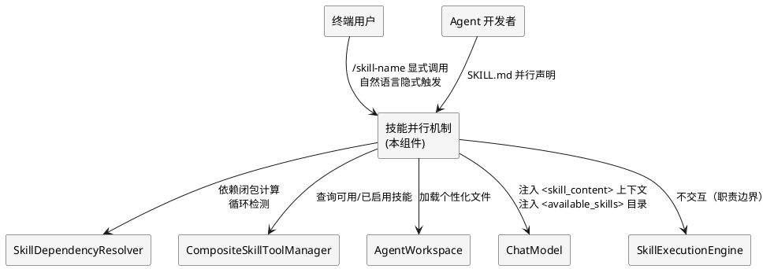
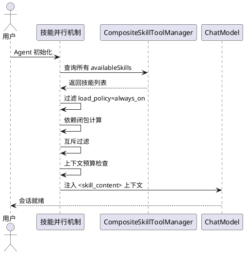
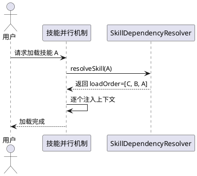
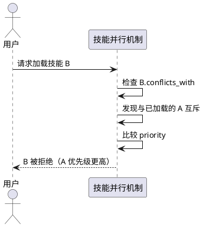
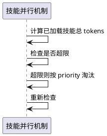
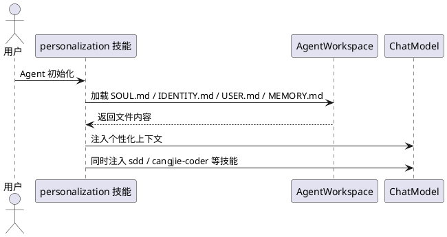
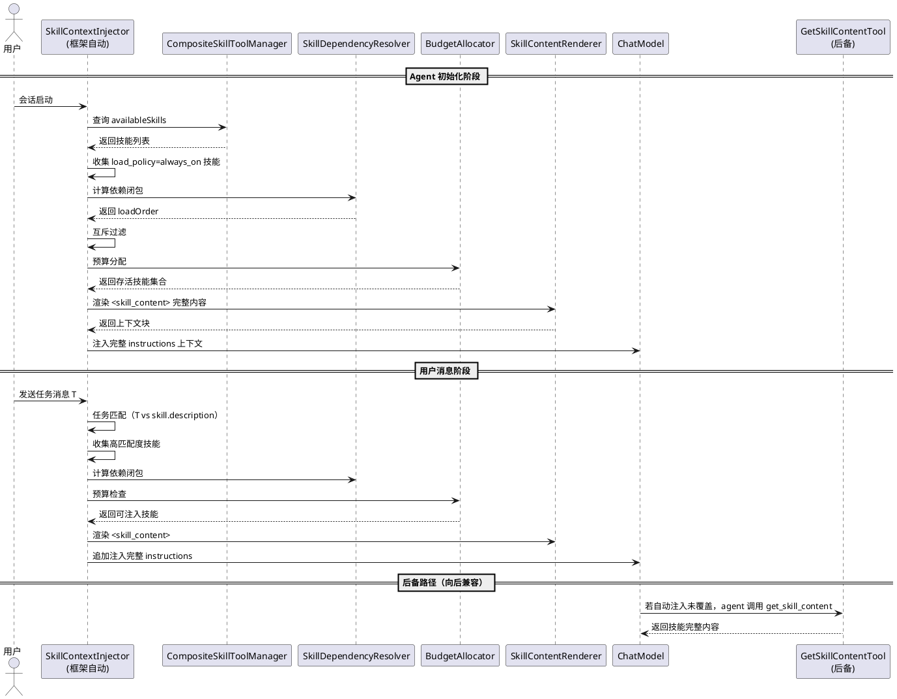

# 技能并行机制需求规格

> **工程目录**: `.codeartsdoer/specs/concurrent_skills/`
> **研究报告**: `research.md`（已完成）
> **生成日期**: 2026-10-05
> **架构师观点来源**: `docs/ref/ConcurrentSkills.md`
> **补充需求日期**: 2026-10-05（新增第 5.6 节"技能内容自动渐进式加载"，修复渐进式加载设计漂移）

---

## 补充需求背景：渐进式加载设计漂移分析

### 漂移现象

用户观察发现：当前通过 web-admin 聊天组件与 agent 对话时，当 agent 需要读取技能完整内容，**必须主动调用 `get_skill_content` 工具**去加载完整技能内容。这一行为与最初在 runtime 中添加 agentskills 标准支持时设计的"自动渐进式加载"目标不一致。

### 原始设计目标

`003-agentskills-enhancement/progressive_loading_design.md` 中描述的 `ProgressiveSkillLoader` 设计目标是：**自动扫描目录发现并加载 SKILL.md 文件**，实现即插即用、无需手动配置。这是**启动时技能发现层面**的渐进式加载，已正确实现。

但"渐进式加载"在运行时层面还有一层含义：**当大模型需要技能完整内容时，框架自动注入，而非要求 agent 主动调用工具**。这一层含义在实现中发生了漂移。

### 当前实现（漂移后）

`WebMCPProtocol.buildAgentSystemPrompt()`（L1963-1983）和 `WsChatController`（L412-423）实现了"三段渐进式加载"，其注释明确写道：

```
遵循 agentskills 开放标准的三段渐进式加载：
  第1段 frontmatter（此处注入）→ 第2段 get_skill_content 工具说明（此处注入）→ 第3段 完整内容（agent 按需调用工具获取）
```

- **第1段**：技能 frontmatter（name + description）注入系统提示——**框架自动** ✅
- **第2段**：`get_skill_content` 工具说明注入——**框架自动** ✅
- **第3段**：技能完整内容——**agent 主动调用工具获取** ❌（漂移点：非框架自动）

### 漂移根因

1. **概念混淆**：`ProgressiveSkillLoader` 的"渐进式"指启动时自动发现；运行时"模型需要时自动注入"是另一层概念，两者未被区分
2. **注入时机难题**：运行时自动注入完整内容需解决"何时注入"——全量注入导致上下文爆炸，按需注入需判断"模型何时需要"
3. **务实妥协**：当前实现选择"让模型自己决定"——提供 `get_skill_content` 工具，模型按需调用，这是一种务实的妥协，但偏离了"框架自动"的目标
4. **`buildAgentFromDefinition` 路径缺陷**：`AgentRuntimeBridge.buildAgentFromDefinition()`（L184）创建 `CompositeSkillToolManager()` 空管理器，该路径创建的 agent 未加载任何技能

### 修复目标

恢复"框架自动渐进式加载"的设计目标：在模型需要技能完整内容时，由框架自动注入到上下文，而非依赖 agent 主动调用 `get_skill_content` 工具。同时保留 `get_skill_content` 工具作为后备机制（向后兼容）。

---

# **1. 组件定位**

## **1.1 核心职责**
本组件负责实现 agentskills-runtime 的技能上下文级并行机制，使多个技能可同时注入大模型上下文并协同生效，实现"一切皆技能"设计哲学下的技能并行使用。

## **1.2 核心输入**
1. **SKILL.md 声明文件**：技能的并行声明（`load_policy` / `depends_on` / `conflicts_with` / `priority` / `context_budget_tokens`）
2. **用户显式调用**：`/skill-name` 语法触发的技能加载请求
3. **模型按需加载**：模型通过 `skill` 工具主动加载技能的请求
4. **Agent 初始化信号**：会话启动时触发驻留型技能（`load_policy=always_on`）加载
5. **个性化配置文件**：SOUL.md / IDENTITY.md / USER.md / MEMORY.md 等工作空间文件

## **1.3 核心输出**
1. **上下文注入**：将存活技能的指令体渲染为 `<skill_content>` 块注入模型上下文
2. **技能目录**：`<available_skills>` 列表注入模型上下文，供模型感知可用技能
3. **加载决策**：技能加载/淘汰/折叠的决策日志
4. **冲突告警**：互斥技能冲突、上下文预算超限的告警
5. **溯源标记**：标注模型输出受哪些技能指令影响

## **1.4 职责边界**
本组件**不负责**以下事项：
1. 技能的具体执行逻辑（由 `SkillExecutionEngine` 负责）
2. 技能的持久化存储（由 `SkillRepository` 负责）
3. 编排级并行（由 `CompositionExecutor` / `LrtCompositionRunner` 负责）
4. 多 Agent 协作（由 `CollaborationSkills` 负责）
5. 大模型推理过程（由 `ChatModel` 负责）

---

# **2. 领域术语**

**上下文级并行**
: 多个技能的 prompt 片段同时占据大模型上下文窗口，使模型在生成时可综合多个技能的指令行为。
: 备注：这是架构师所说的"技能并行"的精确含义，区别于程序并发。

**编排级并行**
: 多个技能或多个步骤通过程序并发机制（线程/协程/异步 IO）并行执行。
: 备注：由 `CompositionExecutor` 的 `StepType.Parallel` 支持，本组件不涉及。

**驻留型技能**
: `load_policy=always_on` 的技能，在会话生命周期内持续生效，无需每次显式加载。
: 备注：如 personalization 技能插件。

**依赖技能**
: 通过 `depends_on` 声明的技能，要求被依赖技能必须同时加载到上下文。
: 备注：复用现有 `SkillDependencyResolver` 的拓扑排序能力。

**互斥技能**
: 通过 `conflicts_with` 声明的技能，要求互斥技能不能同时加载到上下文。
: 备注：本组件新增能力，现有机制无此声明。

**上下文预算**
: 多技能注入时的 token 分配限额，用于防止上下文膨胀超窗口。
: 备注：每个技能可声明 `context_budget_tokens`。

**技能溯源**
: 标注模型生成行为受哪些技能指令影响，用于事后归因和技能效果评估。

**personalization 技能插件**
: 将 SOUL.md / IDENTITY.md / USER.md / MEMORY.md 等个性化配置文件抽象为技能插件，实现一直加载有效使用。
: 备注：与其他智能体项目的 user.md / profile.md 机制实现相同效果。

---

# **3. 角色与边界**

## **3.1 核心角色**
- **终端用户**：通过 `/skill-name` 语法显式调用技能，或通过自然语言隐式触发技能加载
- **Agent 开发者**：在 SKILL.md 中声明技能的并行属性（`load_policy` / `depends_on` / `conflicts_with`）

## **3.2 外部系统**
- **SkillDependencyResolver**：提供依赖解析、拓扑排序、循环检测能力
- **CompositeSkillToolManager**：提供 `availableSkills` / `enabledSkills` 管理
- **AgentWorkspace**：提供个性化配置文件加载（SOUL.md / IDENTITY.md 等）
- **ChatModel**：消费注入的技能上下文，执行推理
- **SkillExecutionEngine**：执行技能的具体逻辑（本组件只负责注入，不负责执行）

## **3.3 交互上下文**



---

# **4. DFX约束**

## **4.1 性能**
1. **上下文注入延迟**：技能上下文注入必须在 **100ms** 内完成（不含模型推理时间）
2. **依赖闭包计算**：单次依赖闭包计算必须在 **50ms** 内完成
3. **互斥过滤**：单次互斥过滤必须在 **30ms** 内完成
4. **上下文预算检查**：单次预算检查必须在 **20ms** 内完成

## **4.2 可靠性**
1. **加载可追溯**：所有技能加载/淘汰/折叠决策必须记录结构化日志
2. **冲突不崩溃**：互斥冲突或预算超限时不得崩溃，必须降级保留高优先级技能
3. **循环依赖检测**：依赖关系存在环时必须明确报错，不得静默加载

## **4.3 安全性**
1. **技能内容可信**：注入上下文的技能内容必须来自已验证的 SKILL.md，禁止注入未验证内容
2. **上下文不泄露**：技能注入不得泄露其他会话的上下文信息
3. **预算硬限制**：上下文预算超限时必须强制淘汰，不得突破

## **4.4 可维护性**
1. **加载决策可观测**：提供技能加载决策的查询接口，支持事后归因
2. **溯源标记**：模型输出应标注受哪些技能指令影响
3. **告警规范**：冲突告警、预算告警必须遵循统一日志格式

## **4.5 兼容性**
1. **SKILL.md 向后兼容**：扩展字段（`load_policy` / `conflicts_with` 等）对现有 49 个技能可选，缺失时按默认值处理
2. **现有机制兼容**：不破坏现有 `SkillAwareAgent._registerSkillsAsTools()` 的工具注册机制
3. **COMPOSITION.yaml 兼容**：不影响现有 SDD 等技能的串行编排

---

# **5. 核心能力**

## **5.1 驻留型技能加载**

### **5.1.1 业务规则**
1. **驻留型技能自动加载**：`load_policy=always_on` 的技能必须在 Agent 初始化时自动加载到上下文
   a. 验收条件：[Agent 初始化] → [所有 `load_policy=always_on` 技能的指令体已注入上下文]
2. **驻留型技能持续生效**：驻留型技能在会话生命周期内持续存在于上下文，不被淘汰
   a. 验收条件：[会话进行中] → [驻留型技能仍在上下文中，除非显式禁用]
3. **禁止项**：禁止将非驻留型技能自动加载
   a. 验收条件：[`load_policy != always_on` 的技能] → [不自动加载，需显式触发]

### **5.1.2 交互流程**


### **5.1.3 异常场景**
1. **驻留型技能依赖缺失**
   a. 触发条件：驻留型技能的 `depends_on` 中有未安装的技能
   b. 系统行为：记录告警，跳过该驻留型技能，继续加载其他驻留型技能
   c. 用户感知：告警日志"驻留型技能 X 因依赖 Y 缺失未加载"
2. **驻留型技能互斥冲突**
   a. 触发条件：两个驻留型技能声明 `conflicts_with` 互斥
   b. 系统行为：按 `priority` 保留高优先级技能，淘汰低优先级技能
   c. 用户感知：告警日志"驻留型技能 X 与 Y 互斥，保留 X（priority=high）"
3. **驻留型技能上下文预算超限**
   a. 触发条件：所有驻留型技能的 `context_budget_tokens` 总和超过上下文预算
   b. 系统行为：按 `priority` 从低到高淘汰，直到满足预算
   c. 用户感知：告警日志"驻留型技能 X 因预算超限被淘汰"

## **5.2 依赖技能闭包加载**

### **5.2.1 业务规则**
1. **依赖闭包完整性**：加载技能 A 时，若 A 依赖 B，则 B 必须同时加载
   a. 验收条件：[加载技能 A，A depends_on B] → [B 已在上下文中]
2. **传递依赖处理**：若 B 依赖 C，则加载 A 时 C 也必须加载
   a. 验收条件：[A depends_on B, B depends_on C, 加载 A] → [B 和 C 均在上下文中]
3. **循环依赖检测**：依赖关系存在环时必须报错
   a. 验收条件：[A depends_on B, B depends_on A] → [报错"循环依赖：A → B → A"]
4. **禁止项**：禁止加载依赖闭包不完整的技能
   a. 验收条件：[依赖闭包有缺失] → [报错并拒绝加载]

### **5.2.2 交互流程**


### **5.2.3 异常场景**
1. **循环依赖**
   a. 触发条件：技能依赖关系形成环
   b. 系统行为：`SkillDependencyResolver.detectCycles()` 检测到环，报错
   c. 用户感知：错误"循环依赖：A → B → C → A"
2. **依赖技能未安装**
   a. 触发条件：`depends_on` 中的技能未安装
   b. 系统行为：记录缺失技能，提示安装
   c. 用户感知：错误"技能 X 依赖未安装的技能 Y，请先安装 Y"

## **5.3 互斥技能过滤**

### **5.3.1 业务规则**
1. **互斥技能不共存**：若技能 A 与 B 互斥，则 A 和 B 不能同时存在于上下文
   a. 验收条件：[A conflicts_with B, 加载 A 后尝试加载 B] → [B 被拒绝]
2. **优先级裁决**：互斥冲突时按 `priority` 保留高优先级技能
   a. 验收条件：[A conflicts_with B, A.priority > B.priority] → [保留 A，淘汰 B]
3. **先到先得**：优先级相同时先加载的技能保留
   a. 验收条件：[A conflicts_with B, A.priority == B.priority, A 先加载] → [保留 A，拒绝 B]
4. **禁止项**：禁止互斥技能同时存在于上下文
   a. 验收条件：[互斥技能同时存在] → [系统错误]

### **5.3.2 交互流程**


### **5.3.3 异常场景**
1. **双向互斥声明不一致**
   a. 触发条件：A.conflicts_with 包含 B，但 B.conflicts_with 不包含 A
   b. 系统行为：记录告警，按 A 的声明处理
   c. 用户感知：告警"互斥声明不一致：A 声明与 B 互斥，但 B 未声明"

## **5.4 上下文预算管理**

### **5.4.1 业务规则**
1. **预算硬限制**：所有已加载技能的 `context_budget_tokens` 总和不得超过上下文预算上限
   a. 验收条件：[Σ context_budget_tokens > 上限] → [按 priority 淘汰低优先级技能]
2. **驻留型技能豁免**：驻留型技能在预算超限时优先保留
   a. 验收条件：[预算超限, 淘汰候选含驻留型和非驻留型] → [先淘汰非驻留型]
3. **预算可配置**：上下文预算上限必须可配置
   a. 验收条件：[配置预算上限为 X] → [实际预算上限为 X]

### **5.4.2 交互流程**


### **5.4.3 异常场景**
1. **所有技能都是驻留型且超限**
   a. 触发条件：所有技能 `load_policy=always_on`，总 tokens 超限
   b. 系统行为：按 `priority` 从低到高淘汰驻留型技能，记录告警
   c. 用户感知：告警"驻留型技能过多，已淘汰低优先级技能"

## **5.5 personalization 技能插件**

### **5.5.1 业务规则**
1. **个性化文件抽象为技能**：SOUL.md / IDENTITY.md / USER.md / MEMORY.md 必须可包装为 personalization 技能插件
   a. 验收条件：[存在 SOUL.md] → [personalization 技能可加载 SOUL.md 内容]
2. **personalization 驻留生效**：personalization 技能必须 `load_policy=always_on`
   a. 验收条件：[Agent 初始化] → [personalization 技能已加载]
3. **与其他技能并行**：personalization 技能与 sdd / cangjie-coder 等开发技能可同时生效
   a. 验收条件：[加载 personalization + sdd] → [两者同时存在于上下文]

### **5.5.2 交互流程**


### **5.5.3 异常场景**
1. **个性化文件缺失**
   a. 触发条件：SOUL.md / IDENTITY.md 等文件不存在
   b. 系统行为：跳过缺失文件，加载存在的文件
   c. 用户感知：无告警（文件可选）

## **5.6 技能内容自动渐进式加载（补充需求）**

> 本节为补充需求，修复"渐进式加载设计漂移"问题。目标：将技能完整内容的加载从"agent 主动调用 `get_skill_content` 工具"恢复为"框架自动注入到上下文"。

### **5.6.1 业务规则**

1. **驻留型技能完整内容自动注入**：`load_policy=always_on` 的技能，其完整 instructions 必须在 Agent 初始化时由框架自动注入上下文，而非仅注入 frontmatter 摘要
   a. 验收条件：[Agent 初始化，存在 `load_policy=always_on` 技能 X] → [X 的完整 instructions 已作为 `<skill_content>` 块注入上下文，无需 agent 调用 `get_skill_content`]

2. **用户显式调用自动注入完整内容**：用户通过 `/skill-name` 语法显式调用技能时，框架必须自动注入该技能的完整 instructions 到上下文，而非依赖 agent 调用 `get_skill_content`
   a. 验收条件：[用户输入 `/skill-name`] → [skill-name 的完整 instructions 已注入上下文，agent 无需再调用 `get_skill_content`]

3. **任务匹配自动注入**：框架必须能根据用户输入的任务描述，自动匹配技能的 `description` 字段，对高匹配度技能自动注入完整 instructions
   a. 验收条件：[用户输入任务 T，技能 X 的 description 与 T 匹配度超过阈值] → [X 的完整 instructions 自动注入上下文]
   b. 验收条件：[用户输入任务 T，无技能 description 与 T 匹配] → [不自动注入任何技能完整内容，仅保留 frontmatter 目录]

4. **依赖闭包自动注入**：加载技能 A 时，若 A 依赖 B（`depends_on`），则 B 的完整 instructions 必须随 A 自动注入上下文
   a. 验收条件：[自动注入技能 A，A depends_on B] → [B 的完整 instructions 同时注入上下文]

5. **上下文预算约束自动注入**：自动注入完整内容时必须遵守上下文预算，超限时按 `priority` 淘汰低优先级技能的完整内容，降级为仅保留 frontmatter
   a. 验收条件：[自动注入技能集合总 tokens 超预算] → [低优先级技能降级为 frontmatter 摘要，高优先级技能保留完整内容]

6. **`get_skill_content` 工具向后兼容保留**：自动渐进式加载机制生效后，`get_skill_content` 工具必须保留作为后备机制，供 agent 在自动注入未覆盖时主动获取
   a. 验收条件：[自动注入机制已生效，agent 仍调用 `get_skill_content`] → [正常返回技能完整内容，不报错]

7. **禁止项**：禁止在系统提示中注入所有技能的完整 instructions（防止上下文爆炸）
   a. 验收条件：[已安装技能数 > 预算可容纳数] → [仅注入驻留型 + 高匹配度技能的完整内容，其余仅保留 frontmatter 目录]

8. **禁止项**：禁止自动注入未通过验证的技能完整内容
   a. 验收条件：[技能 X 未通过 `SkillValidationService` 验证] → [X 的完整内容不注入上下文，仅记录告警]

### **5.6.2 交互流程**



### **5.6.3 异常场景**

1. **任务匹配无结果**
   a. 触发条件：用户输入的任务描述与所有技能的 description 匹配度均低于阈值
   b. 系统行为：不自动注入任何技能完整内容，仅保留 frontmatter 目录，agent 可通过 `get_skill_content` 后备工具主动获取
   c. 用户感知：无告警（正常降级，agent 仍可自主调用工具）

2. **自动注入导致上下文预算超限**
   a. 触发条件：驻留型 + 高匹配度技能的完整内容总和超过上下文预算
   b. 系统行为：按 `priority` 从低到高淘汰，被淘汰技能降级为 frontmatter 摘要；驻留型技能优先保留完整内容
   c. 用户感知：告警日志"技能 X 因预算超限降级为摘要注入"

3. **技能完整内容验证失败**
   a. 触发条件：待自动注入的技能未通过 `SkillValidationService` 验证
   b. 系统行为：跳过该技能的完整内容注入，仅注入 frontmatter，记录告警
   c. 用户感知：告警日志"技能 X 验证失败，仅注入摘要"

4. **`buildAgentFromDefinition` 路径技能管理器为空**
   a. 触发条件：通过 `AgentRuntimeBridge.buildAgentFromDefinition()` 创建 agent 时，`CompositeSkillToolManager()` 为空，无技能可自动注入
   b. 系统行为：检测到空技能管理器时，记录告警，跳过自动注入流程
   c. 用户感知：告警日志"Agent 创建时技能管理器为空，自动渐进式加载未生效"

5. **自动注入与 agent 主动调用冲突**
   a. 触发条件：框架已自动注入技能 X 的完整内容，agent 仍调用 `get_skill_content` 获取 X
   b. 系统行为：正常返回内容，不重复注入（去重），记录 debug 日志
   c. 用户感知：无异常（向后兼容，幂等处理）

---

# **6. 数据约束**

## **6.1 技能并行声明（SKILL.md 扩展字段）**
1. **load_policy**：技能加载策略，取值 `always_on` / `on_demand` / `conditional`，默认 `on_demand`
2. **priority**：技能优先级，取值 `high` / `medium` / `low`，默认 `medium`
3. **depends_on**：依赖技能名称列表，必须为已安装技能
4. **conflicts_with**：互斥技能名称列表，必须为已安装技能
5. **context_budget_tokens**：该技能占用的上下文 token 预算，必须为正整数
6. **compatible_with**：显式声明兼容技能名称列表（可选）

## **6.2 上下文预算配置**
1. **total_budget_tokens**：上下文预算总上限，必须为正整数
2. **reserved_for_always_on**：为驻留型技能保留的预算比例，取值 0.0-1.0，默认 0.3

## **6.3 技能加载决策记录**
1. **skill_name**：技能名称
2. **decision**：加载决策，取值 `loaded` / `skipped` / `evicted` / `rejected` / `degraded`（降级为摘要）
3. **reason**：决策原因，如 `always_on` / `dependency` / `conflict` / `budget_exceeded` / `task_match` / `validation_failed`
4. **timestamp**：决策时间戳
5. **session_id**：会话 ID
6. **inject_source**：注入来源，取值 `auto_init`（初始化自动）/ `auto_task_match`（任务匹配自动）/ `auto_dependency`（依赖闭包自动）/ `agent_tool_call`（agent 主动调用后备工具）
7. **content_level**：注入内容级别，取值 `full`（完整 instructions）/ `frontmatter`（仅摘要）

## **6.4 自动渐进式加载配置（补充需求）**
1. **auto_inject_enabled**：是否启用自动渐进式加载，默认 `true`；关闭时回退为纯 `get_skill_content` 工具模式（向后兼容）
2. **task_match_threshold**：任务匹配度阈值，取值 0.0-1.0，默认 0.6；匹配度超过此值的技能自动注入完整内容
3. **task_match_strategy**：任务匹配策略，取值 `keyword`（关键词匹配）/ `semantic`（语义匹配）/ `hybrid`（混合），默认 `keyword`
4. **max_auto_inject_skills**：单次自动注入的技能数量上限，默认 5；防止过多技能完整内容注入导致上下文膨胀
5. **fallback_tool_retained**：是否保留 `get_skill_content` 后备工具，默认 `true`；向后兼容
6. **dedup_on_reinject**：重复注入是否去重，默认 `true`；agent 主动调用获取已自动注入的技能时返回缓存而非重复注入

---

**文档状态**: spec.md 已更新（含补充需求第 5.6 节"技能内容自动渐进式加载"），等待用户确认
**补充需求摘要**: 修复渐进式加载设计漂移——将技能完整内容加载从"agent 主动调用 `get_skill_content` 工具"恢复为"框架自动注入到上下文"，保留工具作为后备
**下一步**: 用户确认后，可进入 SDD design 步生成设计方案 design.md（需同步更新 design.md 增加自动渐进式加载的设计方案）