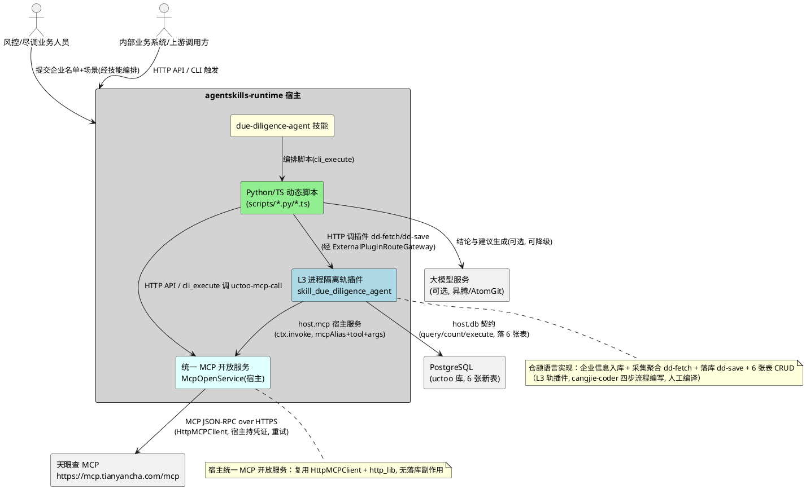
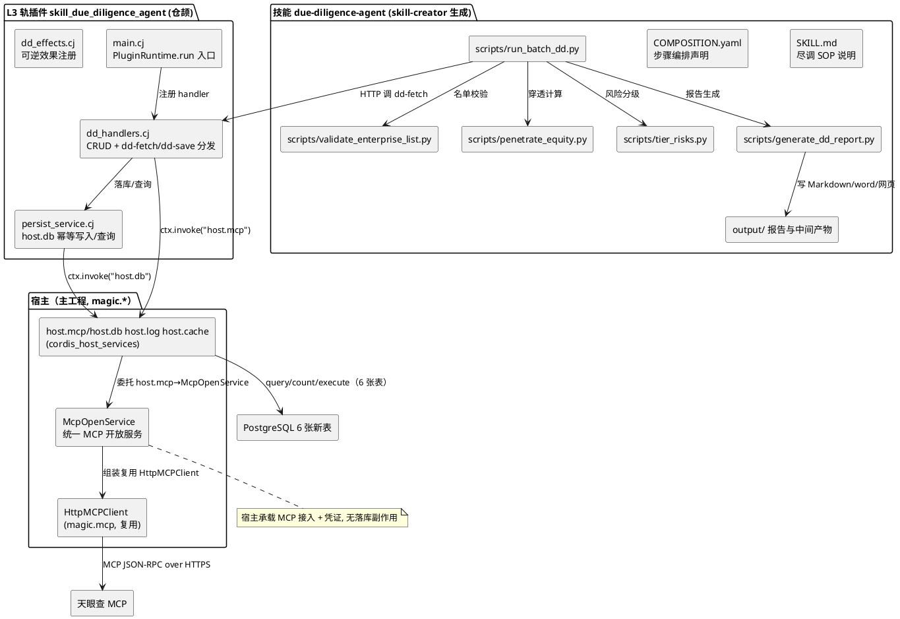
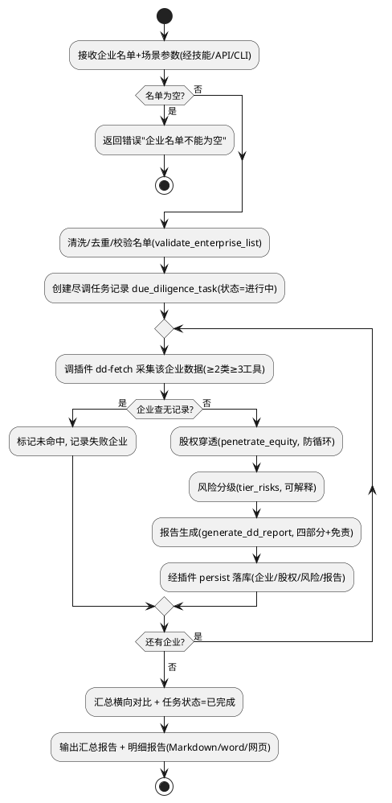
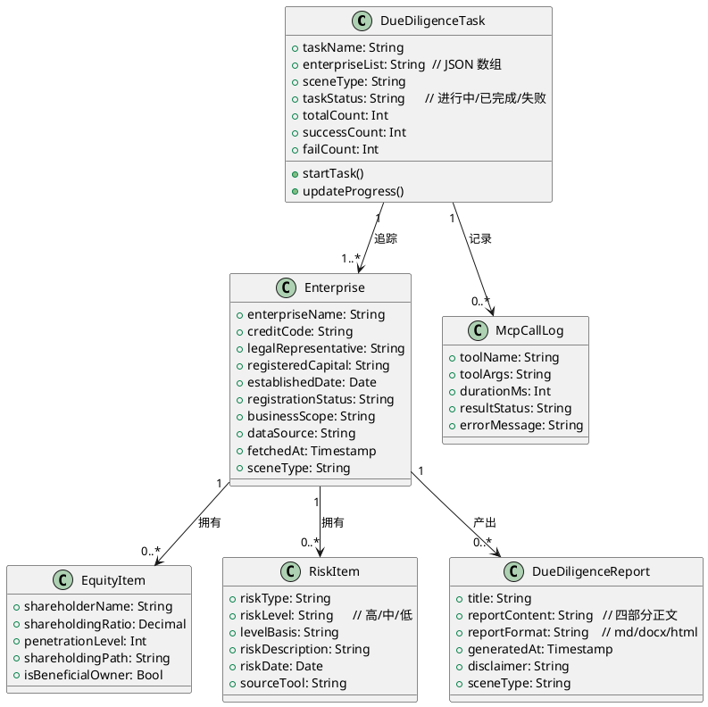

# 企业信用与风控尽调智能体 技术设计文档

> **文档定位**：本文档定义「企业信用与风控尽调智能体」的"如何构建"（How to Build），将需求规格（spec.md）翻译为可落地的架构设计。聚焦与存量代码的关系分析与增量实现方案，不包含逐行代码实现。
>
> **配套文档**：需求规格见同目录 `spec.md`。
> **运行底座**：agentskills-runtime（仓颉语言，L3 进程隔离轨插件机制 / 一切皆技能）。
> **版本**：v1.0 | **日期**：2026-09-08

---

# 一、需求与存量功能关系分析

> 本章明确新需求与现有代码的关系，是增量设计的基础。对比分析以代码位置为证据，匹配度评估附判定依据。

## 1.1 需求功能与存量功能对比

### 1.1.1 已实现功能（直接复用）

| 需求功能 | 存量功能 | 代码位置 | 匹配度 |
|---------|---------|---------|--------|
| L3 进程隔离轨插件运行底座（故障隔离、stdin/stdout JSON-RPC 通道拉起） | cordis-cj 插件运行时（`PluginRuntime.run` 显式入口、`ctx.invoke("host.db", …)` 访问宿主 DB） | `skills/codelabs/src/main.cj`、`skills/codelabs/src/handlers.cj` | 100%（直接对标） |
| 五层 CRUD 插件（PO/DAO/Service/Controller/Route 或插件侧 handler 分发） | codelabs L3 轨 CRUD 插件参考实现（dispatch 路由分发 + host.db 调用） | `skills/codelabs/src/handlers.cj:46-94` | 100%（作为模板复用） |
| V4 API 列表/分页/单查/增删改查路由 | codelabs 插件 6 条标准路由 | `skills/codelabs/plugin.yaml:7-19` | 100%（规范完全一致） |
| host.db 服务契约（query/count/execute）与 `$raw:` 前缀约定 | 插件系统宿主侧服务代理契约 | `skills/uctoo-dev-manual/SKILL.md:298-308` | 100%（直接使用） |
| 动态脚本（Python）通过 CLI 编排 SOP、脚本输出 JSON/Markdown 产物 | 智能投研助手六步 SOP 脚本体系（fetch/clean/extract/generate/persist） | `skills/investment-research-assistant/scripts/*.py` | 75%（脚本模式复用，业务内容替换为尽调流程） |
| 技能编排声明（COMPOSITION.yaml 步骤依赖） | 投研助手 COMPOSITION.yaml（steps/depends_on/input 模板） | `skills/investment-research-assistant/COMPOSITION.yaml` | 100%（声明格式复用） |
| 大模型结论生成（带模板降级） | `generate_report.py` 内置 LLM 调用 + 模板降级 | `skills/investment-research-assistant/scripts/generate_report.py` | 75%（复用"LLM 不可用降级模板"策略） |
| 企业信息落库到 company/tasks 表 | 投研助手 `save_report_to_db.py`（`--sql-only` 或直连） | `skills/investment-research-assistant/scripts/save_report_to_db.py` | 50%（落库思想复用，但本需求需新增自有表，不复用 company/tasks 表） |
| 仓颉代码编写规范（四步工作流程） | cangjie-coder 技能 | `skills/cangjie-coder/SKILL.md:107-439` | 100%（强制约束） |
| 技能生成/评估/优化方法论 | skill-creator 技能（draft → test prompts → eval → rewrite → benchmark） | `skills/skill-creator/SKILL.md` | 100%（强制约束） |

### 1.1.2 需要扩展的功能

| 需求功能 | 存量功能 | 差异说明 | 扩展方向 |
|---------|---------|---------|---------|
| 天眼查 MCP 接入（6 大类工具调用、鉴权、重试、调用清单） | 投研助手仅接公开 HTTP 行情接口（`fetch_market_data.py`、`web_fetch`/`http_request`）；主工程 `src/mcp` 已有基于 http_lib 的 MCP 客户端封装（`HttpMCPClient`，`magic.mcp`） | ① L3 轨插件侧无法 import `magic.mcp`（独立 executable 工程）；② 存量无凭证鉴权头集中管理；③ 存量无"≥2 类别、≥3 工具调用清单"的强制记录契约 | 宿主侧新增统一 MCP 开放服务（**直接复用 `src/mcp/http_mcp_client.cj` 的 `HttpMCPClient` + http_lib，零移植**），L3 插件经 `host.mcp` 调用；实现鉴权头注入、有限次重试、调用日志经 `host.db` 落表 `due_diligence_mcp_call_log`（详见 §2.0） |
| 企业信息"入库保存"（去重/更新、幂等） | 投研助手按公司 upsert 到 `company` 表 + 研报写 `tasks` 表 | ① 需求要求新增自有数据表承载任务/企业/股权/风险/报告/MCP 日志六类数据，不复用 company/tasks（它们字段语义不匹配）；② 需按统一社会信用代码/企业名做幂等去重 | 新增 L3 轨插件承载 6 张新表 CRUD，通过 host.db `execute`（INSERT/UPDATE）在插件侧实现"先查后写"幂等刷新 |
| 对外服务暴露（供 Python/TS 脚本调用宿主能力） | 存量 `cli_execute` 是"宿主→脚本"执行通道（`src/tool/cli_tool.cj`）；宿主 fountain `Router`+`*Routes` 已能注册 HTTP API（`WebMCPRoutes`/`AIRoutes`）；L3 插件 service 通道已有 `host.db/host.log/host.cache` | 需求要求提供 API 与 CLI 两种形态供脚本稳定调用（spec 4.5.2）；原"脚本 subprocess 拉起插件 exe"与 L3「宿主托管进程 + stdin/stdout JSON-RPC」隔离语义冲突（插件 `main()` 直入 `PluginRuntime.run` 事件循环，无 argv CLI 分发） | 由**宿主**统一提供三种对外形态：HTTP API `/api/v1/uctoo/mcp/open/call` + `host.mcp` 宿主服务 + CLI `uctoo-mcp-call`（复用 http_lib/fountain/`cli_execute` 机制）；脚本经 HTTP 或 `cli_execute` 调宿主，不再 subprocess 拉起插件 exe（详见 §2.0） |
| 股权穿透 + 风险分级规则引擎 | 投研助手仅做要素提取，无穿透/分级逻辑 | 需求要求逐层穿透（防循环）、风险按规则分级（可解释） | 由 Python/TS 脚本承载穿透与分级纯逻辑（易迭代），仓颉插件只提供数据底座（企业/股权/风险数据读写） |
| 报告多格式（Markdown/word/网页） | 投研助手仅 Markdown | 需求要求至少 Markdown + word/网页 | 脚本以 Markdown 为核心产物，word/网页格式由脚本内转档（pandoc/python-docx 可选依赖，无依赖则降级仅 Markdown） |

### 1.1.3 需要新增的功能或接口

按业务模块分组，列出需从零新增的能力（存量代码无对应实现）。

**A. 天眼查 MCP 接入层（宿主统一 MCP 开放服务，见 §2.0 架构方向性决策）**
- A1. 统一 MCP 开放服务（宿主侧）：宿主复用 `src/mcp/http_mcp_client.cj`（`HttpMCPClient`，Streamable HTTP 传输）+ `src/utils/http/http_cj.cj`（http_lib）向 `https://mcp.tianyancha.com/mcp` 发起 MCP `initialize`/`tools/list`/`tools/call`，对外以 **HTTP API / `host.mcp` 宿主服务 / CLI 三种形态**暴露（详见 §2.0）。
- A2. 凭证管理（宿主集中）：天眼查 API Key 仅存宿主配置（`.env`/`EnvFileService`/配置中心），按 `mcpAlias → {endpoint, credentialRef}` 映射管理，插件与脚本不接触凭证本体，不下钻日志/报告。
- A3. 调用重试：网络超时/临时错误有限次重试，耗尽后标记失败并记录。
- A4. 调用清单与日志：每次工具调用的元数据（工具名、入参、耗时、结果状态）由 L3 插件在采集流程中经 `host.db` 落表 `due_diligence_mcp_call_log`（表归属插件，开放服务本身不落库）。

**B. 企业信息持久化层（仓颉插件内，L3 轨 + host.db）**
- B1. 6 张新表的写能力：任务/企业/股权/风险/报告/MCP 日志的 INSERT/UPDATE（幂等去重）。
- B2. 6 张新表的读能力：V4 列表/单查，供内部业务系统与脚本复用（列表键名遵循"表名+s"）。

**C. 对外 API / CLI（仓颉插件暴露，供脚本调用）**
- C1. HTTP API：`/api/v1/uctoo/due_diligence_*` 系列标准 CRUD 路由（plugingen 生成）。
- C2. 插件 HTTP 路由：`dd-fetch`/`dd-save` 经宿主 `ExternalPluginRouteGateway` 转发，供脚本/内部系统 HTTP 调用（MCP 调用本身走宿主开放服务 CLI/API，见 §2.0）。

**D. 尽调业务编排层（Python/TypeScript 脚本，技能内 scripts/）**
- D1. 名单校验/清洗/去重（`validate_enterprise_list.py`）。
- D2. 股权穿透计算（`penetrate_equity.py`，防循环、层级上限）。
- D3. 风险分级研判（`tier_risks.py`，分级规则 + 可解释依据）。
- D4. 尽调报告生成（`generate_dd_report.py`，四部分结构，LLM 增强 + 模板降级，含免责声明）。
- D5. 批量任务编排（`run_batch_dd.py`，逐企业执行、部分失败隔离、进度反馈、横向对比）。

**E. 技能层（skill-creator 生成/评估/优化）**
- E1. `due-diligence-agent` 技能：SKILL.md + COMPOSITION.yaml 编排 D 层脚本与 C 层仓颉插件调用。
- E2. 技能评估测试用例：固化"企业名单→报告+入库"的验收样本，用于 skill-creator 的 benchmark/eval 迭代。

## 1.2 存量功能详细分析

> 针对上节"已实现/需扩展"功能的深入解读，聚焦接口契约、业务规则、扩展点与约束，作为增量设计的事实依据。

### 1.2.1 codelabs L3 轨 CRUD 插件（直接对标模板）

- **接口契约**：
  - 入口：`PluginRuntime.run("codelabs", inject, provide, { ctx => … })`（`skills/codelabs/src/main.cj:16-25`），`inject`/`provide` 为空数组，服务名 = 插件名。
  - 路由分发：`ctx.registerHandler("codelabs", { method, args => dispatch(method, args) })`，`args[0]` 为 `ExternalRequest { method, path, queryParams, body, userId, permissions }`（`handlers.cj:35-51`）。
  - DB 访问：`ctx.invoke("host.db", …)`，`execute` 参数含 `table/subOp/where/data/userId/permissions`，`data` 中 `"$raw:gen_random_uuid()"` 等值经 `jsonValueToSqlLiteral` 去前缀后作为原始 SQL 片段（`SKILL.md:298-308`）。
- **业务规则**：INSERT 时插件显式设置 `creator = userId`；可写字段走白名单（`handlers.cj:28-33`），排除 id/created_at/updated_at（库自维护）。
- **约束**：stdout 是 JSON-RPC 通道（NewlineFraming），**诊断信息必须走 stderr**（`main.cj:12-13`）；编译产物路径由 `plugin.yaml` 的 `command: ./target/release/bin/skill_codelabs.exe` 指定（`plugin.yaml:5`）。
- **扩展点**：`dispatch` 路由匹配可增加自定义 path（如 `/dd-fetch/:name`），handler 内部可叠加 MCP Client 调用。

### 1.2.2 智能投研助手脚本体系（业务编排参考）

- **接口契约**：每步脚本标准 CLI（`--input`/`--outdir` 等），产物为 `output/{raw|clean|factors|brief}/{date}.{json|md}`（`investment-research-assistant/scripts/README.md:20-26`）。
- **业务规则**：六步 SOP 串行依赖，缺数据降级，LLM 不可用降级模板（`SKILL.md:57-125`）；落库支持 `--sql-only` 生成 SQL 文件避免依赖 psycopg2、直连需 `DATABASE_URL`（`README.md:53-57`）。
- **约束**：工作目录 = 技能根目录；脚本优先用 `cli_execute` 运行，环境不具备才降级内置工具。
- **扩展点**：COMPOSITION.yaml 的 `step_type: script` + `depends_on` 声明可平移复用于尽调技能编排。

### 1.2.3 确定性代码生成工具链（约束与顺序）

- **工具链顺序**（`uctoo-dev-manual/SKILL.md:60-72`）：`loaddbinfo` → `crudgen`（宿主，仅扩展公共基础设施时用）/`plugingen`（插件，优先）→ `crudweb`（Web 界面）→ `pluginuninstall`。
- **关键约束**：
  - `cjpm run --skip-build --name magic.plugin.tools.plugingen --run-args "--mode process"` 生成独立 cjpm executable 工程（`output-type = "executable"`，依赖 `ystyle::cordis_plugin`/`ystyle::cordis_core`/`jsonvalue`/`ystyle::jsonrpc`），**不进宿主编译图**。
  - 表结构变更须先人工在 `sql/incremental/` 目录落 DDL 并执行，再 `cjpm run --skip-build --name magic.app.tools.loaddbinfo --run-args "--db uctoo"` 加载表结构到 `db_info`，之后工具才能读结构生成代码。
  - DDL 规范：主键 `id uuid DEFAULT gen_random_uuid()`、时间戳 `created_at/updated_at/deleted_at timestamptz`、行级权限 `creator uuid`（关联 `uctoo_user.id`）、软删除 `deleted_at`（NULL=未删）。
  - 样例 DDL/数据格式参考 `sql/incremental/20260807_fintech_demo_company.sql`、`20260902_codelabs_sample_data.sql`。

### 1.2.4 cangjie-coder 与 skill-creator（强制流程约束）

- **cangjie-coder 四步流程**（`cangjie-coder/SKILL.md:38-50`）：`doc-consultant`（查阅 CangjieSkills 文档，路径 `apps/CangjieSkills/.opencode/skills`）→ `code-searcher`（检索 `apps/CangjieMagic/resource` 代码片段）→ `code-editor`（编辑适配 + 写入）→ `code-verifier`（验证，失败自动修复最多 3 次）。**严禁直接大模型生成仓颉代码，必须先检索到确定编码依据**。
- **编译铁律**：开发工具内**严禁运行 `cjpm build`**（长时间编译超时），编译验证须由人工在独立 cmd 环境执行并反馈结果。
- **skill-creator 流程**（`skill-creator/SKILL.md:10-28`）：写草稿 → 造测试 prompt 运行 → 定性+定量评估（`eval-viewer/generate_review.py`）→ 依据反馈重写 → 扩大到更大测试集，循环至满意。

### 1.2.5 天眼查 MCP 接入的首选实现依据：agentskills-runtime 中基于 http_lib 的库

> 本需求「天眼查 MCP 接入层」在仓颉侧需实现 MCP 客户端。经 `http-lib-migration` 项目（`.codeartsdoer/specs/http-lib-migration/`）改造，agentskills-runtime 主工程已完成 `stdx.net.http` → `http_lib` 的迁移，`src/mcp/` 与 `src/utils/http/` 下已存在**基于 http_lib 的、可直接作为编码依据的 MCP 客户端与 HTTP 封装**。因此天眼查 MCP 接入的**首选实现依据是复用主工程这些基于 http_lib 的库**，而非 `CangjieMagic/src/examples` 中基于 `stdx.net.http`/`stdx.net.tls` 手写 HTTPS 的示例（后者降级为"备选参考"）。

**迁移背景（http-lib-migration）**：
- `http_lib`：纯仓颉 `std` 实现的 HTTP 协议封装库，零 `stdx` 依赖、零 C FFI，支持 HTTP/1.0/1.1/2，客户端侧提供 `HttpClient`（声明式 `HttpClientConfig`）、`HttpRequestBuilder`、`TlsConfig`（基于 JinguiSSL），用于替代 `stdx.net.http` 的 `ClientBuilder`/`HttpRequestBuilder`。
- 依赖链已本地化：`http_lib` 与其传递依赖（`kaca_json`、`jinguissl`、`jinguissl_core`、`kaca_cookies`、`compress4cj`、`quic_cj`）全部克隆至 `apps/agentskills-runtime/libs/`，`cjpm.toml` 以 path 声明（`http_lib/cjpm.toml` name=`http_lib`、output-type=`static`）。
- 已完成客户端迁移：`src/utils/http/http_cj.cj` 已从 `ClientBuilder().tlsConfig().connector().build()` 迁移为 `HttpClient(config)` + `HttpRequestBuilder().withUrl().withJson().withHeader().build()`，`readHttpBody` 改用 `resp.bodyAsString()`（详见 `http-lib-migration/design.md` §2.4 客户端 API 映射表）。

**首选可复用封装清单（agentskills-runtime 内部）**：

| 位置 | 关键文件 | 角色 | 对本需求的复用点 |
|------|---------|------|----------------|
| `src/utils/http/` | `http_cj.cj` | 基于 http_lib 的 HTTP 客户端封装（`HttpUtilsImpl`） | HTTPS POST 的 `HttpClient`/`HttpClientConfig`/`HttpRequestBuilder`/`TlsConfig` 用法，`enableHttp2=false` 规避 10054，`response.status.code`/`isSuccess()` 状态判断，`bodyAsString()` 读响应体 |
| `src/utils/http/` | `http_utils.cj` | `HttpUtils` 静态封装（get/post/asyncGet/asyncPost/hybridPost/sseConnect），`HttpResult` 类型 | 出站 HTTP 调用的统一入口与结果封装范式 |
| `src/mcp/` | `protocol.cj` | MCP 协议消息类型（`InitialRequest`/`ListToolsRequest`/`ListToolsResponse`/`CallToolRequest`/`CallToolResponse`/`MCPTool`/`CallToolResult` + `getRequestID()`） | MCP JSON-RPC 消息结构定义（`initialize`/`tools/list`/`tools/call`），`@jsonable` 序列化范式 |
| `src/mcp/` | `abs_mcp_client.cj` | `AbsMCPClient` 抽象类：协议核心（initialize/listTools/callTool、结果内容合并、isError 处理、请求 id 自增） | MCP 客户端会话交互范式（发送/接收匹配、结果 content 合并） |
| `src/mcp/` | `http_mcp_client.cj` | `HttpMCPClient <: AbsMCPClient`：Streamable HTTP 传输（`HttpUtils.hybridPost`），处理 `mcp-session-id`、SSE 流 | 远端 HTTP MCP 端点连接的完整范式（最贴近天眼查 MCP 端点） |
| `src/mcp/` | `sse_mcp_client.cj` | `SseMCPClient`：SSE 传输 | 备选（天眼查为 HTTP 端点，非 SSE，仅作协议参考） |
| `src/mcp/` | `mcp_client.cj` | `MCPClient <: Toolset` 接口（`callTool`/`listTools`） | MCP 客户端对外接口契约 |
| `src/mcp/` | `mcp_tool_wrapper.cj`、`mcp_exception.cj` | `MCPToolWrapper`、`MCPException` | 工具包装与异常类型 |

**关键适配结论**：
- 上述 `src/mcp/*.cj` 与 `src/utils/http/*.cj` 均属 `magic.*` 包（`magic.mcp`/`magic.utils.http`），依赖 `magic.jsonable`/`magic.core.tool`/`magic.log` 等主工程框架代码，**L3 轨插件（cordis 独立 executable 工程）无法直接 import 主工程包**。
- 因此天眼查 MCP 接入采用「**L3 轨插件内自建 `mcp_client.cj`，传输层直接引用 `http_lib` 库（path 依赖 `libs/http_lib`），MCP 协议消息与客户端交互逻辑按 cangjie-coder `code-editor` 阶段将 `src/mcp/protocol.cj`/`abs_mcp_client.cj`/`http_mcp_client.cj` 的范式适配移植进插件**」的策略。`http_lib` 库本身是静态库，L3 轨插件可在 `cjpm.toml` 以 path 引用（详见 2.1.3(1-附) 与 2.3.3 步骤 2/3）。
- **`CangjieMagic/src/examples` 降级为备选参考**：其 `token_retrieval_tool.cj` 手写 HTTPS 客户端基于已被替换的 `stdx.net.http`/`stdx.net.tls`，与主工程当前 http_lib 技术栈不一致，仅在需要"意图→端点映射/鉴权头注入"业务范式时作二次对照，不作为首选编码依据。

> **架构方向修正（重要，本版新增结论）**：既然宿主 `src/mcp/http_mcp_client.cj` 已具备 `HttpMCPClient` 这一「通过 Streamable HTTP 调用任意 MCP 端点并执行工具」的通用能力，而 L3 插件无法 import `magic.mcp`，更优解是**方案 B——在宿主侧实现统一 MCP 开放服务**（宿主在原 `magic.mcp` 包内直接组装 `HttpMCPClient` + http_lib，零移植成本），L3 插件经新增的 `host.mcp` 宿主服务或 HTTP API / 宿主 CLI 调用，**不再在插件内移植 MCP 客户端**。该方向的可行性结论、基础设施清单、方案 A vs B 对比与推荐、服务契约、凭证安全、落库关系、脚本调用方式，统一集中在新增的 **§2.0「架构方向性决策」**。原「插件内自建 mcp_client.cj」写法仅作为方案 A 的历史分析记录保留，实际实现采用方案 B。

---

（第一章完）

# 二、增量设计方案

> 本章将 spec.md 的核心能力翻译为可落地的技术方案。组织原则：先整体后局部、接口先于数据模型、方案决策附选择理由。

## 2.0 架构方向性决策：MCP 接入方式与服务暴露方式

> 本版新增的架构研究方向结论。回答两个问题：① 宿主能否抽象出「统一 MCP 开放服务」供 L3 插件与动态脚本复用？② 相较原「插件内自建 MCP 客户端」（方案 A）与「宿主统一开放服务」（方案 B），应如何取舍。本节为 §2.1~§2.3 的架构前置裁决。

### 2.0.1 可行性结论

**结论：可行（明确推荐方案 B）。** 宿主已具备「通过 HTTP/Streamable HTTP 调用任意 MCP 端点并执行工具」的完整通用能力，抽象「统一 MCP 开放服务」本质是**组装现有积木 + 新增一层路由/CLI 入口 + 凭证安全 + 日志落库约定**，而非从零开发。

判定依据（均已检索到确定代码证据）：
1. **MCP 客户端能力齐备**：`src/mcp/http_mcp_client.cj` 的 `HttpMCPClient <: AbsMCPClient` 已实现 Streamable HTTP 传输下的 `initialize`（protocolVersion 校验 + `notifications/initialized`）→ `listTools` → `callTool`（`tools/call`、id 匹配、`result.content` 合并、`isError` 处理）、`mcp-session-id` 会话管理、SSE 流处理；且 `HttpMCPInitParams{ url, header }` 原生支持**自定义鉴权头注入**。这等价于「输入端点 + 凭证 + 工具名 + 工具参数 → 返回结构化结果」的通用能力。
2. **HTTP 层已迁移 http_lib 且成熟**：`src/utils/http/http_cj.cj`（`HttpClient`/`HttpClientConfig`/`HttpRequestBuilder`/`TlsConfig`，readTimeout=5min、enableHttp2=false 规避 10054）+ `src/utils/http/http_utils.cj`（`HttpUtils.hybridPost` 等）。
3. **宿主对外暴露机制现成**：fountain `Router` + `*Routes.cj` + `*Controller` 模式（`WebMCPRoutes`/`AIRoutes`/`WebMCPController` 均为可复用范式）；`WebMCPController` 非流式分支已验证 `res.json()`/`res.send()` 同步声明式返回范式。
4. **L3 插件宿主服务通道现成**：`cordis_host_services.cj` 已有 `host.db`/`host.log`/`host.cache` 三服务 + `registerFor(instance, pluginId)` 注册点，**新增 `host.mcp` 服务**是同一机制的同构扩展。
5. **凭证配置能力现成**：`EnvFileService.cj`（`readEnvValue`/`writeEnvKeyValue`）可作宿主侧天眼查 API Key 的集中读取点。

### 2.0.2 检索到的宿主 MCP/HTTP 基础设施清单

| 类别 | 文件路径 | 关键能力 | 对本需求复用点 |
|------|---------|---------|-------------|
| MCP 客户端（通用） | `src/mcp/http_mcp_client.cj` | `HttpMCPClient <: AbsMCPClient`，Streamable HTTP 传输，`HttpMCPInitParams{url,header}` 鉴权头注入，会话/SSE 流管理 | **宿主统一开放服务的核心调用组件（直接复用，零移植）** |
| MCP 客户端抽象 | `src/mcp/abs_mcp_client.cj` | `initialize`/`listTools`/`callTool`、结果合并、`isError`、请求 id 自增 | 协议交互范式（已由 HttpMCPClient 实现） |
| MCP 协议消息 | `src/mcp/protocol.cj` | `InitialRequest`/`ListToolsRequest`/`CallToolRequest`/`CallToolResponse`/`MCPTool`/`CallToolResult`/`getRequestID()` | JSON-RPC 消息结构契约（复用） |
| MCP 接口契约 | `src/mcp/mcp_client.cj` | `MCPClient <: Toolset`（`callTool`/`listTools`） | 开放服务内部接口抽象 |
| MCP 其他传输/服务端 | `src/mcp/{stdio_mcp_client,stdio_mcp_server,sse_mcp_client,sse_mcp_server,abs_mcp_server,mcp_tool_wrapper,mcp_exception}.cj` | stdio/SSE 传输、服务端、工具包装、异常 | 备选（天眼查为 HTTP 端点，仅作参考） |
| HTTP 客户端封装 | `src/utils/http/http_cj.cj` | `HttpUtilsImpl`：http_lib `HttpClient`/`HttpClientConfig`/`HttpRequestBuilder`/`TlsConfig`，超时/`enableHttp2=false`/证书校验 | 宿主开放服务的传输底座 |
| HTTP 工具入口 | `src/utils/http/http_utils.cj` | `HttpUtils`（get/post/asyncGet/asyncPost/hybridPost/sseConnect）+ `HttpResult` | 出站 HTTP 统一入口 |
| 流式/平台适配 | `src/utils/http/{http_stream,sse_stream,http_curl,http_ohos}.cj` | HttpStream/SSE/curl/ohos 适配 | 备选 |
| fountain 路由 | `src/app/core/router/Router.cj` + `src/app/routes/*/{WebMCPRoutes,AIRoutes,SkillRoutes}.cj` | Controller+Routes 注册、`res.json()/res.send()` | 宿主开放服务 HTTP API 的注册范式 |
| MCP 端点示范 | `src/app/controllers/uctoo/webmcp/WebMCPController.cj` + `src/app/routes/webmcp/WebMCPRoutes.cj` | `POST /api/v1/uctoo/webmcp/mcp` 解析 JSON-RPC body、非流式 `res.json()` 同步返回、真流式 `req.takenOver` 劫持（**反面约束：本项目禁止用于新增同步路由**） | 开放服务路由正反两面范式 |
| L3 插件宿主服务 | `src/plugin/cordis_host_services.cj` | `host.db`/`host.log`/`host.cache` + `registerFor(instance, pluginId)` | **新增 `host.mcp` 的注册点与同构范式** |
| 插件路由网关 | `src/plugin/external_plugin_route_gateway.cj` | 读取 plugin.yaml routes → 注册宿主 Router → ExternalRequest 序列化 → JSON-RPC invoke 插件 → 回写 V4 响应 | 插件 HTTP 路由（dd-fetch 等）的四态转发机制 |
| CLI 工具入口 | `src/tool/cli_tool.cj` | `cli_execute` 内置工具：`newProcess` 执行任意命令 + 捕获 stdout/stderr（Windows cmd.exe /C 包裹 + UTF-8 容错） | 脚本经 `cli_execute` 调宿主 CLI 的通道 |
| 凭证配置 | `src/app/services/uctoo/EnvFileService.cj` | `.env` key-value 读写 | 天眼查 API Key 宿主侧集中读取 |

### 2.0.3 方案 A vs 方案 B 对比

**方案 A（原 design.md 方案）**：L3 插件内用仓颉 + http_lib（path 依赖 `libs/http_lib`）自建 MCP 客户端，把 `src/mcp/{protocol,abs_mcp_client,http_mcp_client}.cj` 范式移植进插件，插件对外暴露 `dd-fetch`/`dd-mcp-call`/`dd-save` CLI 子命令，脚本 subprocess 拉起插件 exe 调用。见 §2.1.3(1-附) 的移植映射。

**方案 B（本版推荐）**：宿主侧统一实现「天眼查 MCP 开放服务」（HTTP API + `host.mcp` 宿主服务 + CLI），复用宿主 `HttpMCPClient`；L3 插件只做业务编排 + 企业数据落库（经 `host.db`），MCP 调用经宿主开放服务；Python/TS 脚本通过 HTTP API 或 `cli_execute` 调宿主 CLI。

| 对比维度 | 方案 A（插件内自建 MCP） | 方案 B（宿主统一 MCP 开放服务） | 结论 |
|---------|------------------------|------------------------------|------|
| 复用度 | 低：需在插件内移植 protocol/abs/http 三文件，`magic.mcp` 不可 import | 高：宿主在 `magic.mcp` 包内直接组装 `HttpMCPClient`，零移植 | 方案 B 胜 |
| 凭证安全 | 弱：凭证须下沉到插件运行时配置，插件进程可接触，泄漏面广 | 强：凭证仅存宿主（`.env`/配置中心），插件与脚本均不接触凭证本体 | 方案 B 胜 |
| L3 隔离语义 | **不自洽**：插件 `main()` 直入 `PluginRuntime.run` 的 stdin/stdout JSON-RPC 事件循环（见 `skills/codelabs/src/main.cj`），脚本 subprocess 再拉起 exe 会脱离宿主 RPC 会话 → `host.db`/`host.log` 不可用、MCP 日志无法落库；插件 exe 无 argv CLI 子命令分发先例 | 自洽：插件/脚本统一经宿主 HTTP API 或 `host.mcp`/`cli_execute`，仍走宿主托管生命周期 | 方案 B 胜 |
| 开发工作量 | 大：插件移植 MCP 客户端（cangjie-coder 全流程）+ CLI 子命令 argv 分发（无先例，且与 JSON-RPC 通道冲突） | 中：宿主新增 `McpOpenService` + `Controller` + `Route`（复用现成 MCP 客户端，cangjie-coder 专注业务层）+ `host.mcp` 服务 + CLI 工具（仿 `cli_execute`） | 方案 B 胜 |
| 可扩展性 | 差：每接新 MCP 源都要在插件内重复移植 | 好：宿主统一 MCP 网关可按 `mcpAlias` 服务任意 MCP 源，L3 插件/技能复用 | 方案 B 胜 |
| MCP 日志落库 | 只能经 `host.db` 写插件表 | 开放服务「纯调用不落库」，日志由插件经 `host.db` 写 `due_diligence_mcp_call_log`（表归属插件） | 方案 B 胜 |

### 2.0.4 推荐结论

**推荐方案 B，并保留方案 A 中「L3 插件承载 6 张表 CRUD + 业务编排」的部分。** 最终架构为：宿主统一 MCP 开放服务（MCP 接入 + 凭证）+ L3 插件（6 张表 CRUD + 采集聚合 `dd-fetch` + 落库 `dd-save`，经 `host.mcp`/`host.db`）+ Python/TS 脚本（名单校验、股权穿透、风险分级、报告生成，经 HTTP/CLI 调宿主开放服务与插件 API）。

方案 B 落地后的边界不变：L3 插件仍然是 6 张表（含 `due_diligence_mcp_call_log`）的领域归属方，MCP 开放服务是**无状态、无落库副作用**的「调用网关」。spec 4.4/4.5 要求的「API 与 CLI 两种调用形态」由宿主开放服务直接满足（原 spec 措辞不限定实现位置）。

### 2.0.5 统一 MCP 开放服务契约（宿主侧）

**服务定位**：`McpOpenService`（宿主主工程内，`magic.app.services.mcp` 或 `magic.mcp` 扩展），对任意 `mcpAlias` 注册的 MCP 源执行 `initialize → tools/list(可选) → tools/call`，返回结构化结果 + 调用元数据。**无落库副作用**（调用日志由调用方落库）。

**对外三种形态**（背后统一走同一 `McpOpenService`）：
1. **HTTP API（主通道）**：`POST /api/v1/uctoo/mcp/open/call`
   - 请求 `{ "mcpAlias": "tianyancha", "tool": "registration-info", "arguments": {"searchKey":"xxx公司"} }`
   - 响应 `{ errno:0, data:{...结构化结果...}, meta:{ tool, durationMs, status } }`；错误 `{ errno, errmsg }`
   - **响应方式约束**：同步 JSON 请求/响应，宿主 Controller 用 `res.json()`/`res.send()` 返回；**严禁 `req.takenOver=true` + `ConnectionController.write()` 连接劫持**（对齐 WebMCP 已确认的约束）。
   - 鉴权：宿主 `RequirePermission` 中间件 + 可选限流；`mcpAlias` 白名单校验。
2. **`host.mcp` 宿主服务（L3 插件通道）**：扩展 `src/plugin/cordis_host_services.cj`，在 `registerFor` 内新增 `client.registerRequestHandler("host.mcp", …)`，方法 `call`，params `{ mcpAlias, tool, arguments }`，返回 `{ data, meta }` 或 `{ error }`。插件经 `ctx.invoke("host.mcp", "call", args)` 调用——**L3 插件调用 MCP 的正规通道**（与 `host.db` 并列，凭证由宿主持有，插件不接触）。
3. **CLI 工具（脚本通道）**：宿主 CLI 子命令（可经 `cli_execute` 调用）
   ```bash
   # 脚本经 cli_execute 或宿主聚合工具调用
uctoo-mcp-call --alias tianyancha --tool registration-info --args '{"searchKey":"xxx公司"}'
   ```
   stdout 输出 `{ data, meta }` JSON；亦可由脚本直接 HTTP 调形态 1 的 API。

**凭证传递与安全**：
- 凭证由宿主统一持有，来源：`EnvFileService` 读 `.env`（如 `TIANYANCHA_MCP_TOKEN`）或配置中心；经 `mcpAlias → { endpoint, credentialRef }` 映射解析，**调用方只传 `mcpAlias + tool + arguments`，绝不传凭证本体**。
- `McpOpenService` 组装 `HttpMCPInitParams{ url: endpoint, header: {Authorization:…或天眼查约定头} }` 时从映射注入凭证；凭证**脱敏**后写日志、绝不出现在 `arguments`/响应/报告。
- 传输证书校验：生产 `TlsConfig()`（校验），`TlsConfig.insecure()` 仅限测试态（沿用 `http_cj.cj` 语义）。

### 2.0.6 落库关系（6 张新表归属）

| 表 | 归属方 | 写入通道 | 关键说明 |
|----|-------|---------|---------|
| `due_diligence_task` | L3 插件 | `host.db` | 任务记录（单/批量），脚本发起、插件落库 |
| `due_diligence_enterprise` | L3 插件 | `host.db` | 企业信息，`dd-save` 幂等 upsert |
| `due_diligence_equity` | L3 插件 | `host.db` | 股权条目，脚本穿透计算后经 `dd-save` 落库 |
| `due_diligence_risk` | L3 插件 | `host.db` | 风险条目，脚本分级后经 `dd-save` 落库 |
| `due_diligence_report` | L3 插件 | `host.db` | 报告，脚本生成后经 `dd-save` 落库 |
| `due_diligence_mcp_call_log` | L3 插件 | `host.db` | MCP 调用日志（工具名/入参/耗时/结果状态），**由插件在 `dd-fetch` 阶段，据 `host.mcp`/开放服务返回的 `meta` 写入**；宿主开放服务本身不落库 |

> 设计原则：宿主 MCP 开放服务保持「纯调用、无落库副作用」，保证可复用/可缓存/可测试；6 张表（含日志）统一收敛到 L3 插件，保持「表归属插件」领域边界与 `host.db` 行级权限（`creator` 由插件从 `ExternalRequest.userId` 显式写入）。`tool_args` 落库时不包含凭证。

### 2.0.7 L3 插件与动态脚本如何调用宿主开放服务

1. **L3 插件（仓颉，`dd-fetch` handler 内）**：`dd-fetch` 聚合采集 = ① 经 `ctx.invoke("host.mcp", "call", [{mcpAlias:"tianyancha", tool, arguments}])` 依次调用 ≥2 类 ≥3 工具（registration-info / shareholder-info / judicial-case 等，参数 `searchKey` 传企业名或统一社会信用代码）；② 每次调用据返回 `meta`（tool/durationMs/status）经 `ctx.invoke("host.db", …)` 写 `due_diligence_mcp_call_log`；③ 汇总结构化结果经 `host.db` 落企业（或返回给脚本由 `dd-save` 落库）。
2. **Python/TS 脚本（业务编排）**：默认经宿主 HTTP API `POST /api/v1/uctoo/mcp/open/call`（`requests`/`fetch`），或经 `cli_execute` 调宿主 CLI `uctoo-mcp-call`。脚本**只做编排**（名单校验、穿透、分级、报告），不直接持有天眼查凭证、不实现 JSON-RPC。
3. **调用链路总览**（沿用 §2.1.1 上下文视图）：`脚本/上游 → (HTTP API | host.mcp | CLI) → 宿主 McpOpenService → HttpMCPClient → 天眼查 MCP`；`采集结果 → 插件 host.db → 6 张表`。

## 2.1 实现模型

### 2.1.1 上下文视图

本组件作为 agentskills-runtime 上的一个 **L3 进程隔离轨插件 + 技能 + 动态脚本** 组合体，与外部系统的交互关系如下：



**通信协议与调用频率**：
- 插件 ↔ 宿主：JSON-RPC over stdio（NewlineFraming），插件存活期持续，单企业尽调约 3~6 次 `host.db` + 3~6 次 `host.mcp` 调用。
- 插件/脚本 ↔ 宿主 MCP 开放服务 → 天眼查 MCP：MCP JSON-RPC over HTTPS（`initialize`/`tools/list`/`tools/call`，宿主 `HttpMCPClient` 发起），单企业 ≥3 次工具调用，批量 50 企业约 150~300 次（受天眼查限流约束）。
- 脚本 ↔ 插件：HTTP 调插件 `dd-fetch`/`dd-save` 路由（经宿主 `ExternalPluginRouteGateway` 转发），或脚本直接走宿主开放服务 HTTP API；**不再 subprocess 拉起插件 exe**。
- 脚本 ↔ 宿主：`cli_execute` 内置工具拉起 Python/TS 脚本，及脚本反向调宿主 CLI `uctoo-mcp-call`。

### 2.1.2 服务/组件总体架构



**模块划分与职责**：

| 模块 | 语言 | 职责 | 依赖 |
|------|------|------|------|
| `McpOpenService`（宿主） | 仓颉 | 统一 MCP 开放服务：按 `mcpAlias` 组装凭证 → `HttpMCPClient` 调 `tools/call`，返回结构化结果 + `meta`，无落库副作用 | `magic.mcp.HttpMCPClient`、http_lib、EnvFileService |
| `host.mcp`（宿主，`cordis_host_services.cj` 新增） | 仓颉 | L3 插件经 `ctx.invoke("host.mcp", "call", …)` 调用 MCP 的宿主服务 handler | McpOpenService |
| `main.cj` | 仓颉 | L3 轨插件显式入口 | cordis_plugin |
| `dd_handlers.cj` | 仓颉 | 路由分发（CRUD + dd-fetch/dd-save），dd-fetch 内调 `host.mcp` 聚合采集 | host.mcp、persist_service |
| `persist_service.cj` | 仓颉 | 6 张新表幂等读写（host.db 封装，含 mcp_call_log 落库） | host.db |
| `dd_effects.cj` | 仓颉 | ctx.effect 可逆效果注册框架 | cordis_plugin |
| `scripts/*.py(.ts)` | Python/TS | 名单校验、穿透、分级、报告、批量编排 | 宿主 HTTP API/CLI、插件 dd-fetch/dd-save、LLM(可选) |
| `SKILL.md`+`COMPOSITION.yaml` | 声明式 | 尽调 SOP 与步骤编排 | skill-creator |

**关键技术选型理由**：
1. **宿主统一 MCP 开放服务承载 MCP 接入与凭证（方案 B）**：宿主 `magic.mcp` 已具备 `HttpMCPClient`，直接复用零移植；凭证集中宿主持有，插件与脚本不接触；对外以 HTTP API / `host.mcp` / CLI 三形态服务，满足 spec 4.5.2「API 与 CLI 两种形态」要求。详见 §2.0。
2. **L3 轨插件（process）承载 6 张表 CRUD 与采集聚合/落库**：`cjpm run --skip-build --name magic.plugin.tools.plugingen --run-args "--mode process"` 提供确定性骨架；插件经 `host.mcp` 调 MCP、经 `host.db` 落库，保持「表归属插件」领域边界与故障隔离定位。
3. **Python/TS 脚本承载业务流程（穿透/分级/报告）**：纯逻辑规则迭代频繁，脚本改动能避开仓颉重编译成本，且与投研助手已验证的脚本 SOP 模式一致。
4. **host.db 通道落库而非插件直连 DB**：遵守插件系统六限制条件，插件不持数据库连接，统一经宿主 `host.db` 代理，享受宿主行级权限与软删除能力。

### 2.1.3 实现设计文档

#### (1) 天眼查 MCP 调用流程（状态机）

```plantuml
@startuml
skinparam stateDiagramUML

[*] --> 初始化连接 : dd-fetch 经 host.mcp 触发(宿主 McpOpenService)
初始化连接 --> 鉴权中 : 宿主注入 API Key 头
鉴权中 --> 鉴权失败 : 401/403
鉴权中 --> 工具调用中 : 鉴权通过
工具调用中 --> 重试等待 : 超时/5xx
重试等待 --> 工具调用中 : 未超最大次数(≤3)
重试等待 --> 调用失败 : 重试耗尽
工具调用中 --> 记录日志 : 返回结果+meta
记录日志 --> [*] : 成功(含耗时/结果状态)
鉴权失败 --> [*]
调用失败 --> [*] : 标错并回传
@enduml
```

- **触发条件**：`process` 插件 `dd-fetch` 聚合入口经 `ctx.invoke("host.mcp", "call", …)` 触发宿主 `McpOpenService`（脚本侧亦可直接 HTTP/CLI 触发，见 §2.0）。
- **重试策略**：网络超时/5xx 有限次（默认 3 次），指数退避；4xx（含鉴权失败）不重试直接失败。
- **日志契约**：`McpOpenService` 返回 `meta`（工具名、耗时 ms、结果状态、错误信息），由 L3 插件经 `host.db` 写 `due_diligence_mcp_call_log`，作为赛事评分凭证与审计依据。

#### (1-附) 天眼查 MCP 接入实现参考（对标 agentskills-runtime 中基于 http_lib 的库）

> **附注（本版）**：本节为**方案 A（插件内自建 MCP 客户端）的历史移植映射**，作为备选参考保留；实际实现已选定**方案 B**（宿主侧复用 `HttpMCPClient` 的统一开放服务，零移植），见 §2.0。本节仅用于说明「若回归方案 A」时的编码依据。

> 本附节聚焦 `mcp_client.cj` 的实现依据，将 agentskills-runtime 主工程中**已完成 http_lib 迁移的 HTTP/MCP 封装**映射到天眼查 MCP 端点 `https://mcp.tianyancha.com/mcp`（MCP over HTTP 的 JSON-RPC）。以下为 cangjie-coder `code-searcher` 阶段应检索的**首选确定编码依据**，`code-editor` 按其适配移植进 L3 轨插件。

**传输层/协议层实现依据与选型**：

| 实现层次 | 首选依据 | 复用/移植方式 | 是否采用 |
|---------|---------|-------------|---------|
| 传输层（HTTPS POST） | `src/utils/http/http_cj.cj`（`HttpUtilsImpl`，已迁移到 `http_lib.client`） | L3 轨插件 `cjpm.toml` 直接 path 引用 `http_lib` 库，`mcp_client.cj` 按其 `HttpClient`/`HttpClientConfig`/`HttpRequestBuilder`/`TlsConfig` 用法实现 | **采用** |
| MCP 协议消息定义（JSON-RPC） | `src/mcp/protocol.cj`（`InitialRequest`/`ListToolsRequest`/`CallToolRequest` 等 `@jsonable` 类型） | 按 `protocol.cj` 结构在插件内重建对应消息类型（`magic.mcp` 包不可直接 import，需适配移植） | **采用（移植）** |
| MCP 客户端交互（initialize/tools/list/tools/call、结果合并） | `src/mcp/abs_mcp_client.cj` + `src/mcp/http_mcp_client.cj` | 按其会话范式移植（发送/接收匹配、`tools/list` 拉清单、`tools/call` content 合并、`isError` 处理） | **采用（移植）** |
| MCP 接口契约 | `src/mcp/mcp_client.cj`（`callTool`/`listTools`） | 插件内定义同构的 MCP 调用接口 | **采用（参照）** |
| 备选参考（降级） | `CangjieMagic/src/examples`（`token_retrieval_tool.cj`/`mcp_adapter.cj`） | 仅在鉴权头注入、意图→端点映射等业务范式上二次对照（其底层为已被替换的 `stdx.net.http`） | 备选 |

**决策理由**：主工程已完成 `stdx.net.http` → `http_lib` 迁移（`http-lib-migration` 项目），`http_lib` 库已本地化在 `libs/http_lib/`，且 `src/utils/http/http_cj.cj`、`src/mcp/*` 已有基于 http_lib 的成熟封装。天眼查 MCP 接入应**优先复用同一 http_lib 技术栈**，避免在 L3 轨插件内重新引入已废弃的 `stdx.net.http`/`stdx.net.tls` 手写 HTTPS 客户端，从而保证与主工程 HTTP 层（10053 根除、连接生命周期可观测、`HttpClient` 统一超时/重试语义）一致。

**可复用的编码依据速查（code-editor 适配用，均来自 agentskills-runtime 已迁移代码）**：

1. **HTTP 客户端构造（http_lib）**（`src/utils/http/http_cj.cj:20-39`）：`HttpClientConfig` 设读超时（`config.readTimeout = Duration.minute * 5`）、`config.enableHttp2 = false`（规避 DeepSeek/OpenAI 兼容 API 的既有 HTTP/2 preface 10054 问题，天眼查同理）、HTTPS 时 `config.tlsConfig = if (verify) TlsConfig() else TlsConfig.insecure()`，`HttpClient(config: config)` 构造。

2. **请求构造（http_lib）**（`http_cj.cj:41-58`）：`HttpRequestBuilder().withUrl(endpoint)` + `withJson(b.toJsonString())` + `post()`/`get()` + 遍历 headers `withHeader(k, v)` + `build()`；JSON-RPC 请求体为 `{"jsonrpc":"2.0","id":<自增>,"method":"tools/call","params":{"name":<工具名>,"arguments":<参数对象>}}`。

3. **发送与状态判断（http_lib）**（`http_cj.cj:60-90`）：`client.send(req)`；`response.status.code != 200 && != 202` 则抛异常（映射为本设计重试/失败状态）；`response.isSuccess()` 状态判断；`resp.bodyAsString()` 读响应体（替代 stdx `StringReader(resp.body).readToEnd()`）。

4. **MCP 协议消息（移植依据）**（`src/mcp/protocol.cj`）：`LATEST_PROTOCOL_VERSION`/`JSONRPC_VERSION = "2.0"`/`getRequestID()` 自增 id；`InitialRequest{ method="initialize" }`、`InitializedNotification{ method="notifications/initialized" }`、`ListToolsRequest{ method="tools/list" }`、`CallToolRequest{ method="tools/call", params: {name, arguments} }`；响应 `CallToolResponse{ result: {content: [...], isError} }`。

5. **MCP 客户端交互（移植依据）**（`src/mcp/abs_mcp_client.cj`、`http_mcp_client.cj`）：`initialize()` 校验 `protocolVersion` 一致 → 发 `notifications/initialized`；`listTools()` 返回 `tools`；`callTool()` 发 `tools/call`、`req.id == resp.id` 校验、遍历 `result.content` 合并（`ToolCallContent.getValue()`）、`isError` 标记。

6. **鉴权头注入（业务范式）**（`src/mcp/http_mcp_client.cj buildHeaders`）：`HashMap` 构造 headers，`Content-Type: application/json`、`Accept: application/json, text/event-stream`，业务自定义头（如天眼查 API Key）经 `initParams.header` 注入；凭证从运行时配置读取、响应/日志中脱敏、不下钻报告。

**天眼查 MCP 接入映射表**：

| 天眼查 MCP 接入要点 | 实现方式 | 参考依据 |
|-------------------|---------|---------|
| 端点/传输 | HTTPS POST JSON-RPC 到 `https://mcp.tianyancha.com/mcp`（http_lib `HttpClient`） | `src/utils/http/http_cj.cj` |
| 握手/发现 | `initialize` + `notifications/initialized`，`tools/list` 拉取 6 大类工具清单，勾选 ≥2 类 ≥3 工具 | `src/mcp/protocol.cj` + `abs_mcp_client.cj` |
| 工具调用 | `tools/call` 传 `name`+`arguments`（企业名/信用代码），合并 `result.content` | `src/mcp/abs_mcp_client.cj` + `protocol.cj`（`CallToolResult`） |
| 鉴权 | API Key 经鉴权头注入，脱敏、不下钻日志/报告 | `src/mcp/http_mcp_client.cj buildHeaders` |
| 重试/降级 | 超时/5xx 指数退避 ≤3 次，4xx 不重试；耗尽标失败 | 本设计 (1) 状态机 + `http_cj.cj` 超时/状态判断 |
| 结果落库 | 归一化为标准 JSON，经 `host.db` 写 6 张表（含 `due_diligence_mcp_call_log`） | `persist_service.cj` 设计 |

**约束强调**：
1. **HTTP 技术栈一致性**：生产接入天眼查须启用证书校验（`TlsConfig()` 而非 `TlsConfig.insecure()`）；`TlsConfig.insecure()` 仅限测试态。
2. **http_lib 客户端关键配置**：`readTimeout` 需显式设置；`enableHttp2 = false` 沿用主工程既有经验（规避 HTTP/2 preface 造成的连接被服务端强制关闭）。
3. **凭证脱敏**：HTTP 请求头/体中的凭证一律脱敏后写入日志，不下钻报告。
4. **仓颉实现流程**：L3 轨插件内 `mcp_client.cj` 仍走 cangjie-coder 四步流程（`doc-consultant` 查阅 `libs/http_lib/docs/client` 使用手册 + `code-searcher` 检索 `src/utils/http/http_cj.cj` 与 `src/mcp/*`），编译由人工在独立 cmd 环境执行。
5. **严禁连接劫持（WebMCP 已知约束）**：天眼查 MCP「出站 HTTP 调用」属 `HttpClient` 客户端侧行为，天然不涉及 `req.takenOver` 连接劫持。宿主开放服务 HTTP 路由与插件对外路由（见 2.2.2 组 B）在服务端响应时**必须用 `res.json()`/`res.send()` 声明式返回，严禁 `req.takenOver = true` + `ConnectionController.write()` 劫持连接**（该模式会污染 http_lib 连接状态，详见主工程 `WebMCPController.cj` 真流式分支的既有约束）。

#### (2) 尽调任务编排流程（活动图）



- **部分失败隔离**：单企业失败不中断批量，`due_diligence_task.fail_count` 递增，汇总报告标注失败企业及原因。
- **进度反馈**：任务状态机 `进行中 → 已完成/失败`，进度 = `success_count + fail_count` 相对 `total_count`。

#### (3) 幂等入库设计（事务思路）

- **幂等键**：企业表以 `credit_code`（信用代码，可得时）+ `enterprise_name` 联合判重；股权/风险以 `enterprise_id + shareholder_name/风险唯一特征` 判重。
- **策略**：插件侧"先查（`host.db` query）→ 命中则 UPDATE、未命中则 INSERT"，避免重复数据（spec 5.6.2）。
- **数据一致性**：单企业入库视为一个逻辑事务，任一步失败不影响报告输出（入库失败仅回传告警，可重试）；`creator` 由插件从 `ExternalRequest.userId` 显式写入以满足行级权限。

## 2.2 接口设计

### 2.2.1 总体设计

接口分三类，命名与业务语言一致，均遵循 uctoo V4 API 规范（列表键名 = 表名 + s；错误返回 `{ errno, errmsg }`）：

| 接口分类 | 暴露形态 | 稳定性 | 说明 |
|---------|---------|--------|------|
| 数据 CRUD 接口 | HTTP（V4 路由，`/api/v1/uctoo/due_diligence_*`） | 稳定 | plugingen 从 6 张表结构确定性生成，供前端/内部系统/脚本复用 |
| 宿主统一 MCP 开放服务接口 | HTTP API（`/api/v1/uctoo/mcp/open/...`）+ `host.mcp` 宿主服务 + CLI（`uctoo-mcp-call`） | 稳定 | 宿主承载天眼查 MCP 接入与凭证，供插件/脚本/内部系统复用（§2.0） |
| 插件采集/落库接口 | HTTP 自定义路由（`dd-fetch`/`dd-save`，经 `ExternalPluginRouteGateway` 转发） | 稳定 | 插件承载采集聚合与 6 张表落库 |
| 业务编排接口 | 技能脚本 CLI（`run_batch_dd.py` 等） | 稳定 | 尽调全流程入口，供 `cli_execute`/命令行调用 |

**接口变更策略**：V4 CRUD 路由与 MCP 调用 CLI 的对外出参保持向后兼容；新增工具/字段以"新增参数带默认值"方式演进，不破坏既有调用。

### 2.2.2 接口清单

#### 组 A：数据 CRUD 接口（plugingen 生成，6 张表）

以企业表 `due_diligence_enterprise` 为例，其余 5 表同构：

| 方法 | 路径 | 说明 |
|------|------|------|
| GET | `/api/v1/uctoo/due_diligence_enterprise/:limit/:page` | 分页列表，返回 `{ currentPage, totalCount, totalPage, due_diligence_enterprises }` |
| GET | `/api/v1/uctoo/due_diligence_enterprise/:id` | 单条查询 |
| POST | `/api/v1/uctoo/due_diligence_enterprise/add` | 创建 |
| POST | `/api/v1/uctoo/due_diligence_enterprise/edit` | 更新（含批量/恢复） |
| POST | `/api/v1/uctoo/due_diligence_enterprise/del` | 删除（软删/批量/硬删） |
| POST | `/api/v1/uctoo/due_diligence_enterprise/empty-recycle-bin` | 清空回收站 |

- **前置条件**：鉴权通过（宿主中间件），行级权限 `creator` 约束由 host.db 附加。
- **后置条件**：成功返回数据对象；错误返回 `{ errno, errmsg }`。
- **异常映射**：`40001 提交数据格式错误`、`auth 鉴权失败` 等沿用 V4 错误码。

#### 组 B：宿主统一 MCP 开放服务接口（宿主侧，§2.0）

**(B0) 宿主统一 MCP 开放服务（三形态，供插件/脚本/内部系统复用）**

```bash
# 形态 1：HTTP API（主通道）
POST /api/v1/uctoo/mcp/open/call
body: { "mcpAlias": "tianyancha", "tool": "registration-info", "arguments": {"searchKey":"xxx公司"} }
resp: { "errno":0, "data":{...}, "meta":{ "tool","durationMs","status" } }

# 形态 2：host.mcp 宿主服务（L3 插件通道）
ctx.invoke("host.mcp", "call", [{ "mcpAlias":"tianyancha", "tool":"registration-info", "arguments":{"searchKey":"xxx公司"} }])

# 形态 3：CLI（脚本经 cli_execute 或直接调用）
uctoo-mcp-call --alias tianyancha --tool registration-info --args '{"searchKey":"xxx公司"}'
```

- **前置条件**：`mcpAlias` 已在宿主配置注册（`mcpAlias → { endpoint, credentialRef }`），凭证经 `EnvFileService`/配置中心读取；HTTP 形态需过宿主 `RequirePermission` 鉴权。
- **后置条件**：成功 → 返回结构化结果 + `meta`；失败 → `{ errno, errmsg }`。**服务本身无落库副作用**（调用日志由插件落库）。
- **异常映射**：`超时/5xx` → 重试 ≤3 → 失败标记；`401/403` → 鉴权失败，凭证不外泄；`企业未命中` → `meta.status="not_found"`，调用方标 `"未查询到该企业信息"`。
- **响应方式约束（WebMCP 已知约束）**：HTTP 形态为**同步 JSON 请求/响应**，宿主 Controller 须用声明式 `res.json()`/`res.send()` 返回，**严禁 `req.takenOver = true` + `ConnectionController.write()` 连接劫持**（该模式会污染 http_lib 连接状态，参见 `WebMCPController.cj` 真流式分支历史约束）。天眼查 MCP 采集本身的「出站 HTTP 调用」由宿主 `HttpMCPClient`（http_lib 客户端侧）完成，不涉及连接劫持。

**(B1) 插件采集/落库接口（L3 插件，经 `ExternalPluginRouteGateway` 转发）**

| 方法 | 路径 | 说明 |
|------|------|------|
| POST | `/api/v1/uctoo/due_diligence_agent/dd-fetch` | 单企业采集聚合（body: `{ enterprise, scene }`），内部经 `host.mcp` 调 ≥2 类 ≥3 工具 + 经 `host.db` 写 `mcp_call_log`/企业表 |
| POST | `/api/v1/uctoo/due_diligence_agent/dd-save` | 落库（body: 标准化企业/股权/风险/报告数据 JSON），经 `host.db` 幂等 upsert |

- **前置条件**：插件进程由宿主 `CordisHostManager` 拉起且 Active（`ExternalPluginRouteGateway` 校验）。
- **后置条件**：`dd-fetch` → 返回结构化企业数据 + 落 `due_diligence_mcp_call_log`；`dd-save` → 返回更新/新增统计 + 落企业/股权/风险/报告表。
- **异常映射**：插件 invoke 超时 → 504、Unreachable → 503（网关兜底）；`host.mcp` 失败 → `{ errno, errmsg }` 回传。
- **响应方式约束**：插件 handler 返回值经 `ExternalPluginRouteGateway.writeV4Response` 声明式 `res.json()` 回写，插件进程本身不直接操作 HTTP 连接，天然不涉连接劫持。

#### 组 C：业务编排脚本接口

```bash
# 批量尽调全流程入口
python scripts/run_batch_dd.py --enterprises "A公司,B公司,C公司" --scene "supplier" --outdir output/

# 单步脚本（可独立运行）
python scripts/validate_enterprise_list.py --input "<名单JSON或逗号分隔>"
python scripts/penetrate_equity.py --input output/raw/{name}.json --max-depth 5
python scripts/tier_risks.py --input output/raw/{name}.json
python scripts/generate_dd_report.py --factors output/factors/{name}.json --format md,docx,html
```

- **后置条件**：产出 `output/` 下 `raw/`（天眼查原始 JSON）、`penetration/`（穿透结果）、`risks/`（分级风险）、`report/`（Markdown/word/网页）。
- **异常映射**：LLM 未配置 → `generate_dd_report.py` 降级模板结论；单企业失败 → 汇总报告标注，不中断批次。

## 2.3 数据模型

### 2.3.1 设计目标

- **业务场景**：支撑企业信息采集、股权穿透、风险分级、报告生成、批量对比、入库复用（对应 spec 第 5/6 章）。
- **与存量数据兼容**：6 张新表独立命名空间（`due_diligence_*`），不复用 `company`/`tasks`（字段语义不匹配），避免污染既有投研数据。
- **规模目标**：批量 50 企业、每企业 3~6 次 MCP 调用、约 50~150 条股权/风险子记录，单任务峰值写入量可控（< 千级行）。
- **一致性目标**：企业↔股权↔风险↔报告以 `enterprise_id`（逻辑外键）关联，MCP 日志以 `task_id` 关联任务，保证可追溯。

### 2.3.2 模型实现

核心领域对象关系（类图，仅显示领域属性与方法签名，不含技术字段 id/create_time 等展示细节）：



**持久化策略（表结构，遵循数据库设计规范）**：

所有表统一遵循规范字段骨架：主键 `id uuid DEFAULT gen_random_uuid()`、`creator uuid`（行级权限，关联 `uctoo_user.id`）、`created_at/updated_at/deleted_at timestamptz`（软删除）。

| 表名 | 关键业务字段（类型/约束） | 说明 |
|------|--------------------------|------|
| `due_diligence_task` | `task_name varchar NOT NULL`、`enterprise_list jsonb`、`scene_type varchar`、`task_status varchar`、`total_count int`、`success_count int`、`fail_count int` | 尽调任务（单/批量） |
| `due_diligence_enterprise` | `enterprise_name varchar NOT NULL`、`credit_code varchar`（唯一性辅助，非空时需符合 18 位）、`legal_representative varchar`、`registered_capital varchar`、`established_date date`、`registration_status varchar`、`business_scope text`、`data_source varchar NOT NULL`、`fetched_at timestamptz NOT NULL`、`scene_type varchar`、`task_id uuid` | 企业基础信息（spec 6.1） |
| `due_diligence_equity` | `enterprise_id uuid NOT NULL`、`shareholder_name varchar NOT NULL`、`shareholding_ratio numeric(5,2)`（0~100）、`penetration_level int NOT NULL`（默认 0）、`shareholding_path text NOT NULL`、`is_beneficial_owner varchar`（是/否） | 股权结构条目（spec 6.2） |
| `due_diligence_risk` | `enterprise_id uuid NOT NULL`、`risk_type varchar NOT NULL`、`risk_level varchar NOT NULL`（高/中/低）、`level_basis text NOT NULL`、`risk_description text NOT NULL`、`risk_date date`、`source_tool varchar NOT NULL` | 风险条目（spec 6.3） |
| `due_diligence_report` | `enterprise_id uuid NOT NULL`、`title varchar NOT NULL`、`report_content text NOT NULL`（四部分）、`report_format varchar NOT NULL`（md/docx/html）、`generated_at timestamptz NOT NULL`、`disclaimer text NOT NULL`、`scene_type varchar` | 尽调报告（spec 6.4） |
| `due_diligence_mcp_call_log` | `task_id uuid`、`tool_name varchar NOT NULL`、`tool_args text`、`duration_ms int`、`result_status varchar NOT NULL`、`error_message text` | MCP 调用清单/日志（spec 4.4） |

> 注：具体字段类型/索引/默认值以 `sql/incremental/` 目录 DDL 为准（人工编写并执行）。类图不展示技术字段（id/create_time 等）以聚焦领域模型。

### 2.3.3 确定性代码生成工具使用步骤（全流程）

> 本赛题采用 L3 轨插件（`cjpm run --skip-build --name magic.plugin.tools.plugingen --run-args "--mode process"`），数据库表结构变更须在 `sql/incremental` 目录生成 DDL 并由人工操作。仓颉代码全程走 cangjie-coder 四步流程。

```
【步骤 0】人工：在 sql/incremental/ 编写 6 张表 DDL（遵循规范骨架字段），并在 PostgreSQL 执行
【步骤 1】cjpm run --skip-build --name magic.app.tools.loaddbinfo --run-args "--db uctoo"
           → 从 information_schema 读取 6 张新表结构，写入 db_info 表
【步骤 2】宿主侧：实现统一 MCP 开放服务（方案 B，复用 magic.mcp 现成能力）
           2a. cangjie-coder 四步流程编写 McpOpenService（magic.app.services.mcp 或 magic.mcp 扩展）：
               ① doc-consultant 查阅 http_lib 使用手册（libs/http_lib/docs/client/）+ CangjieSkills 文档
               ② code-searcher 检索（首选依据，均为宿主既有代码，无需移植）：
                  src/mcp/http_mcp_client.cj（HttpMCPClient 组装复用）+ src/mcp/mcp_client.cj + src/utils/http/{http_cj,http_utils}.cj
                  备选：CangjieMagic/examples（降级）
               ③ code-editor 编辑适配 McpOpenService（封装 mcpAlias→{endpoint,credentialRef} 解析 + HttpMCPClient 调用 + 重试 + 返回 {data,meta}）并写入
               ④ code-verifier 验证（失败自动修复 ≤3 次）
           2b. 新增 McpOpenController + McpOpenRoute：POST /api/v1/uctoo/mcp/open/call（res.json() 返回，严禁 req.takenOver 劫持）
           2c. 扩展 src/plugin/cordis_host_services.cj：registerFor 内新增 registerRequestHandler("host.mcp", …)（call 方法，委托 McpOpenService）
           2d. 新增宿主 CLI 工具 uctoo-mcp-call（仿 cli_tool.cj 的 newProcess 模式，或经 cli_execute 聚合）
【步骤 3】cjpm run --skip-build --name magic.plugin.tools.plugingen --run-args "--name due_diligence_agent --db uctoo --table due_diligence_enterprise --mode process"
           → 生成 L3 轨进程插件骨架到 skills/due_diligence_agent/
           → （含 plugin.yaml + cjpm.toml + src/main.cj + handlers.cj + effects.cj）
           → 其余 5 张表的 handler 分发逻辑由 cangjie-coder 在 dd_handlers.cj 内补充
           → 插件 cjpm.toml 仅依赖 cordis_plugin/cordis_core/jsonvalue/jsonrpc（无需 http_lib，插件不再自建 MCP 客户端）
【步骤 4】cangjie-coder 四步流程编写插件仓颉代码（严格顺序）：
            ① doc-consultant 查阅 CangjieSkills 文档（json 等）
            ② code-searcher 检索（首选依据）：skills/codelabs/src/handlers.cj（host.db 调用+hander 分发范式）；src/plugin/cordis_host_services.cj（host.mcp 契约）
            ③ code-editor 编辑适配 dd_handlers.cj（CRUD 分发 + dd-fetch 经 ctx.invoke("host.mcp") 聚合采集 + 写 mcp_call_log、dd-save 落库）/ persist_service.cj 并写入
            ④ code-verifier 验证（失败自动修复 ≤3 次）
【步骤 5】人工：在独立 cmd 环境执行 cjpm build 编译（项目铁律：开发工具内严禁 cjpm build）
           → 宿主主工程与插件工程分别由人工在独立 cmd 编译并反馈结果
【步骤 6】skill-creator 生成 due-diligence-agent 技能：
           draft SKILL.md + COMPOSITION.yaml → 造测试 prompt 运行 → eval 评估 → 重写迭代 → benchmark
【步骤 7】人工：若需 Web 管理界面，cjpm run --skip-build --name magic.app.tools.crudweb --run-args "--db uctoo --table due_diligence_enterprise" 生成（可选）
【步骤 8】卸载（如需回退）：cjpm run --skip-build --name magic.plugin.tools.pluginuninstall --run-args "--name due_diligence_agent"
```

**依赖关系**：步骤 1 依赖步骤 0 的 DDL 已入库；步骤 2（宿主开放服务）与步骤 3（插件骨架）都依赖步骤 1 的 db_info 就绪、可并行；步骤 4 依赖步骤 2（host.mcp 契约）与步骤 3（骨架）；步骤 5 为步骤 2/4 的验证闸门（人工执行并反馈结果后再继续）；步骤 6 依赖步骤 4/5。

---

（全文完）