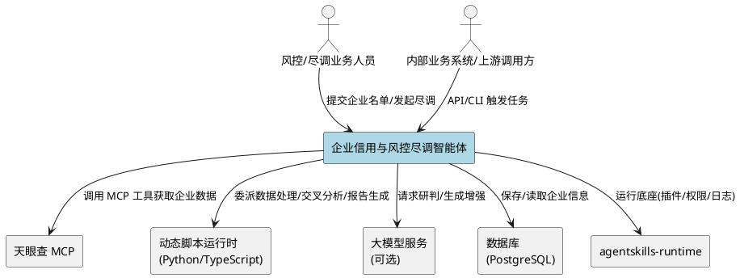
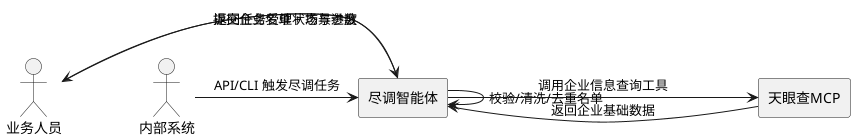
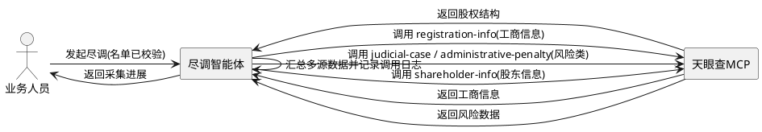
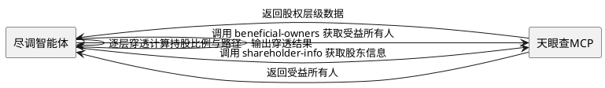
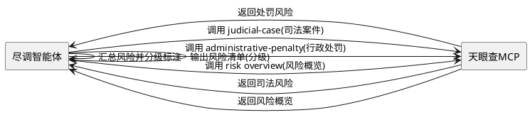
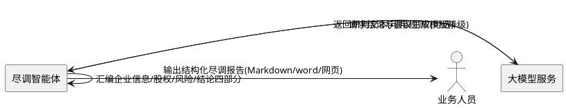
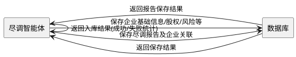
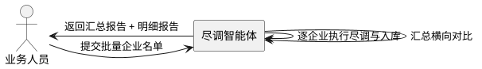

# 企业信用与风控尽调智能体 需求规格文档

> **文档定位**：本文档定义「企业信用与风控尽调智能体」的"做什么"（What to Build），聚焦系统对外业务行为、业务规则与验收条件，不包含任何设计实现细节（How to Build）。
>
> **比赛**：华为云首届企业级智能体创新赛
> **赛题**：基础赛题 —— 企业信用与风控尽调智能体（接入天眼查 MCP）
> **运行底座**：agentskills-runtime（仓颉编程语言 AI 驱动开发框架，L3 进程隔离轨插件机制 / 一切皆技能）
> **版本**：v1.0 | **日期**：2026-09-08

---

# **1. 组件定位**

## **1.1 核心职责**

本组件负责【自动采集与交叉研判企业信用数据】，实现【从"企业名称/一批企业名单"到"结构化风控尽调报告 + 入库企业信息"的端到端闭环】。

## **1.2 核心输入**

1. **企业名单**：用户提交的单个企业名称，或一批企业名称（批量尽调）。来源为用户操作指令或上游调用方（API/CLI）请求。
2. **尽调场景参数**：可选的尽调场景维度（供应商尽调 / 客户授信初筛 / 投资标的画像 / 竞对情报 / 关联风险穿透）。
3. **天眼查企业数据**：天眼查 MCP（服务端点 `https://mcp.tianyancha.com/mcp`）返回的 6 大类企业数据（企业、风险、知识产权、经营、历史、董监高）。
4. **脚本调用请求**：动态脚本（Python / TypeScript）通过 API 或 CLI 发起的尽调任务触发请求。

## **1.3 核心输出**

1. **结构化尽调报告**：至少包含「企业基本信息、股权结构（含穿透）、风险清单（分级标注）、结论与建议」四部分，输出格式支持 Markdown（核心）、word、网页。
2. **入库企业信息**：持久化保存的、由天眼查 MCP 获取到的各类企业信息数据（新增数据库表），可供后续查询、比对与内部业务系统复用。
3. **调用清单与日志**：天眼查 MCP 的工具调用清单与调用日志（赛事评分凭证）。
4. **响应结果**：返回给调用方（用户 / 上游脚本）的结构化尽调结果。

## **1.4 职责边界**

本组件**不负责**以下事项：

- **不生产企业原始数据**：企业信息的原始数据由天眼查 MCP 提供，本组件仅采集、交叉分析与研判。
- **不替代业务终审决策**：输出结论与建议仅作风控研判参考，不构成授信/投资/准入的最终决策（报告须含免责声明）。
- **不新建办公提效与多智能体协作能力**：进阶题（办公提效助手、多智能体协作）不在本组件职责范围内，复用既有 `fintech-agent-hackathon` 成果。
- **不负责天眼查 MCP 自身的接入资格**：仅约定作为外部系统的对接契约，具体证书/鉴权配置不属于本规格的范围。

---

# **2. 领域术语**

**企业信用与风控尽调（Enterprise Credit & Risk Due-Diligence）**
: 面向供应商准入、客户授信、投资尽调、竞对分析、合规排查等场景，对企业信用与风险信息进行采集、交叉分析与分级研判的过程。

**尽调主体（Due-Diligence Target）**
: 用户提交的、本次尽调所针对的企业对象，以企业名称或统一社会信用代码作为唯一标识。

**企业名单（Enterprise List）**
: 一次尽调任务所提交的一个或多个尽调主体的集合，支持批量提交。

**天眼查 MCP（Tianyancha MCP）**
: 提供企业商业数据查询能力的标准化 MCP 服务（服务端点 `https://mcp.tianyancha.com/mcp`），本组件通过其 6 大类（企业、风险、知识产权、经营、历史、董监高）标准化工具获取企业信息。

**股权穿透（Equity Penetration）**
: 从目标企业出发，沿股权关系逐层追溯至最终受益人的分析过程。
: 备注：涉及股东、持股比例、直接/间接持股、受益所有人（beneficial-owners）等。

**风险清单分级（Risk Tiering）**
: 对识别出的各类风险条目按严重程度进行分级标注（如高风险/中风险/低风险）的过程。

**尽调报告（Due-Diligence Report）**
: 尽调任务完成后产出的结构化成果物，至少包含企业基本信息、股权结构（含穿透）、风险清单（分级标注）、结论与建议四部分。

**动态脚本（Dynamic Script）**
: 综合使用 Python 或 TypeScript 编写的、用于完成数据获取、交叉分析与报告生成的脚本。
: 备注：区别于仓颉语言编写的核心能力，脚本聚焦业务流程编排与数据处理。

---

# **3. 角色与边界**

## **3.1 核心角色**

- **风控/尽调业务人员**：提交企业名称或一批企业名单，发起尽调任务，查看并导出结构化尽调报告。
- **内部业务系统 / 上游调用方**：通过 API 或 CLI 触发尽调任务，获取结构化结果用于供应商准入、客户授信等内部流程。
- **Agent 智能体**：自动编排数据获取、交叉分析、风险研判、报告生成与入库的完整流程。

## **3.2 外部系统**

- **agentskills-runtime**：本组件运行底座，提供插件运行环境、数据库访问、日志、鉴权与权限体系等基础设施能力。
- **天眼查 MCP**：企业商业数据查询服务，本组件通过标准化工具获取企业、风险、知识产权、经营、历史、董监高 6 类数据。
- **动态脚本运行时（Python / TypeScript）**：执行企业信息处理、交叉分析与报告生成的脚本运行环境。
- **数据库（PostgreSQL）**：持久化保存由天眼查 MCP 获取到的企业信息数据，供查询与复用。
- **大模型服务（可选）**：用于结论与建议、风险研判等自然语言生成增强（未配置时可降级为规则/模板生成）。

## **3.3 交互上下文**

使用 PlantUML 绘制系统上下文图：

---

# **4. DFX约束**

## **4.1 性能**

1. **单企业尽调**：The system shall 在 60 秒内完成单个企业的数据采集、分析与报告生成（不含外部 MCP 网络抖动）。
2. **批量尽调**：The system shall 支持不少于 50 个企业名单的批量任务，并以并发/串行可控方式在合理时限内完成。
3. **响应及时性**：While 尽调任务执行中, the system shall 实时反馈任务进度状态（进行中/已完成/失败）。

## **4.2 可靠性**

1. **MCP 调用重试**：If 天眼查 MCP 调用发生网络超时或临时性错误, the system shall 自动重试（有限次数）并在重试耗尽后明确失败。
2. **数据完整性**：The system shall 保证入库企业信息与实际返回数据一致，不得出现半截写入或字段错位。
3. **部分失败隔离**：If 批量尽调中某企业失败, the system shall 隔离该企业失败而不影响其余企业继续执行，并在报告中标注失败企业。

## **4.3 安全性**

1. **MCP 鉴权**：The system shall 通过凭证（API Key 等）对天眼查 MCP 进行鉴权访问，凭证不得以明文写入报告或日志。
2. **敏感信息保护**：The system shall 确保企业联络人、个人受益人等敏感信息仅用于报告所需范围内呈现，避免过度暴露。
3. **审计留痕**：The system shall 对每次尽调任务、MCP 调用、数据入库操作记录审计日志，保留操作人、时间与结果。

## **4.4 可维护性**

1. **调用清单与日志**：The system shall 生成结构化的天眼查 MCP 工具调用清单与调用日志（工具名、参数、耗时、结果状态），作为赛事评分凭证与运维排查依据。
2. **日志规范**：The system shall 对关键环节（名单校验、MCP 调用、分级研判、入库、报告生成）输出可追踪的过程日志。
3. **可配置性**：The system shall 支持对 MCP 端点、鉴权凭证、报告输出目录等运行参数进行配置化管理。

## **4.5 兼容性**

1. **报告格式兼容**：The system shall 支持输出 Markdown、word、网页至少三种格式的尽调报告。
2. **接口兼容**：The system shall 提供 API 与 CLI 两种调用形态，供 Python/TypeScript 动态脚本稳定调用，接口变更须保持向后兼容。

---

# **5. 核心能力**

## **5.1 尽调任务发起（企业名单录入与校验）**

### **5.1.1 业务规则**

1. **名单非空校验**：系统必须拒绝空的企业名单并提示用户重新输入。
   - 验收条件：When 用户提交空的企业名单, the system shall 返回错误提示"企业名单不能为空"。
2. **名单格式校验**：系统必须校验每一条企业名称的合法性（非空、去除首尾空白、无非法字符）。
   - 验收条件：When 企业名单中存在空白或非法字符条目, the system shall 清洗后校验，非法条目单独标注。
3. **名单去重**：系统必须对一批名单中的重复企业名称自动去重后执行。
   - 验收条件：When 用户提交的名单中存在重复企业, the system shall 自动去重，仅保留一条并提示去重结果。
4. **场景维度选择**：系统应当支持用户选择尽调场景（供应商尽调/客户授信初筛/投资标的画像/竞对情报/关联风险穿透）以调整研判侧重。
   - 验收条件：When 用户选择一个尽调场景, the system shall 按该场景的研判侧重执行并影响报告结论部分。
5. **批量规模约束**：系统必须支持单个企业与批量名单两种模式。
   - 验收条件：When 用户提交单个企业名称, the system shall 启动单企业尽调；When 用户提交一批企业名单, the system shall 启动批量尽调任务。

### **5.1.2 交互流程**

### **5.1.3 异常场景**

1. **名单为空**
   - 触发条件：用户提交的名单为空或全为空白字符。
   - 系统行为：拒绝发起任务，中止流程。
   - 用户感知：返回错误提示"企业名单不能为空，请重新输入"。
2. **非法企业名称**
   - 触发条件：名单中存在含非法字符或格式异常的企业名称。
   - 系统行为：清洗可修复项，无法修复的条目单独标记为"无效条目"。
   - 用户感知：返回包含无效条目清单的校验结果，允许用户修正后重试。

## **5.2 企业信息采集（天眼查 MCP 多类别工具调用）**

### **5.2.1 业务规则**

1. **多类别采集**：系统必须至少调用天眼查 MCP 中 2 个类别、3 个不同工具获取企业信息。
   - 验收条件：When 执行尽调任务, the system shall 实际调用不少于 2 个类别、3 个不同工具（例如工商信息、股权树、司法案件、行政处罚等）并记录调用清单。
2. **工商信息采集**：系统必须采集目标企业的基础工商信息（统一社会信用代码、法定代表人、注册资本、成立日期、登记状态、经营范围等）。
   - 验收条件：When 尽调一个企业, the system shall 返回包含上述基础工商信息的结构化数据。
3. **扩展工具支持**：系统应当支持调用受益所有人（beneficial-owners）、关联路径（relation-path）、风险概览（risk overview）等深度工具。
   - 验收条件：Where 需要股权穿透或关联风险研判时, the system shall 调用对应深度工具以支撑分析。
4. **调用记录**：系统必须记录每次 MCP 调用的工具名、入参、耗时与结果状态。
   - 验收条件：When 完成一次尽调, the system shall 生成完整的 MCP 调用清单与调用日志。

### **5.2.2 交互流程**

### **5.2.3 异常场景**

1. **MCP 工具调用超时**
   - 触发条件：天眼查 MCP 调用超过超时阈值或网络不可达。
   - 系统行为：自动重试有限次数，重试耗尽后标记该工具调用失败。
   - 用户感知：返回"企业信息获取失败（工具名）"及失败原因，允许重试。
2. **企业查无记录**
   - 触发条件：目标企业名称在天眼查中无匹配记录。
   - 系统行为：标记该企业为"未命中"，跳过后续分析。
   - 用户感知：返回"未查询到该企业信息"，并在报告中标注该企业为未命中。
3. **鉴权失败**
   - 触发条件：MCP 鉴权凭证无效或过期。
   - 系统行为：停止所有 MCP 调用，保护凭证不外泄。
   - 用户感知：返回"天眼查 MCP 鉴权失败，请检查凭证配置"。

## **5.3 股权结构穿透分析**

### **5.3.1 业务规则**

1. **股权穿透计算**：系统必须沿股权关系逐层追溯，输出目标企业的股权结构及其穿透结果。
   - 验收条件：When 获取股权树数据后, the system shall 输出直接股东、间接股东及穿透后的最终受益人。
2. **持股比例呈现**：系统必须准确呈现各层级的持股比例与持股路径。
   - 验收条件：When 计算股权结构, the system shall 呈现完整的持股比例与持股层级路径。
3. **受益所有人识别**：系统应当在数据可得时识别最终受益所有人。
   - 验收条件：Where 天眼查提供 beneficial-owners 数据时, the system shall 识别并呈现最终受益所有人。
4. **穿透深度约束**：系统必须设定合理的穿透层级上限，避免无限穿透。
   - 验收条件：When 股权穿透达到预设层级上限或穿透至自然人/最终实体, the system shall 终止穿透并标注终止原因。

### **5.3.2 交互流程**

### **5.3.3 异常场景**

1. **股权数据缺失**
   - 触发条件：目标企业无股权结构数据或数据不完整。
   - 系统行为：在报告中标注"股权结构数据缺失"，仅输出可得部分。
   - 用户感知：报告股权结构章节提示数据不完整。
2. **穿透死循环风险**
   - 触发条件：股权关系存在循环持股。
   - 系统行为：命中已访问节点即终止，防止循环穿透。
   - 用户感知：报告标注"存在循环持股，穿透终止于该节点"。

## **5.4 风险清单分级研判**

### **5.4.1 业务规则**

1. **多源风险采集**：系统必须从司法案件、行政处罚、经营异常等多类风险数据源采集风险条目。
   - 验收条件：When 执行风险研判, the system shall 采集并汇总司法、行政处罚、经营等多类风险数据。
2. **风险分级规则**：系统必须依据明确规则将风险条目分为高风险/中风险/低风险（或多级）并标注。
   - 验收条件：When 识别到风险条目, the system shall 按明确分级规则标注等级（如高风险/中风险/低风险），分级依据可追溯。
3. **风险分级可解释**：系统必须说明每条风险的分级依据（规则或模型）。
   - 验收条件：When 输出风险清单, the system shall 附每条风险的分级依据说明。
4. **关联风险穿透**：系统应当在数据可得时输出关联方（如股东、董监高关联企业）的风险穿透结果。
   - 验收条件：Where 调用 relation-path 或关联工具时, the system shall 输出关联风险穿透结果。

### **5.4.2 交互流程**

### **5.4.3 异常场景**

1. **风险分级规则缺失依据**
   - 触发条件：某风险条目缺少可用的分级依据数据。
   - 系统行为：将该条目标注为"分级待定"并说明原因。
   - 用户感知：报告风险清单中出现"分级待定"标注及原因说明。
2. **风险数据源调用失败**
   - 触发条件：某类风险数据工具调用失败。
   - 系统行为：在报告中标注该类风险数据不可得，不影响其他类风险输出。
   - 用户感知：报告风险清单提示该类风险数据缺失。

## **5.5 尽调报告生成**

### **5.5.1 业务规则**

1. **报告结构完整**：系统必须生成至少包含「企业基本信息、股权结构（含穿透）、风险清单（分级标注）、结论与建议」四部分的结构化尽调报告。
   - 验收条件：When 完成尽调分析与研判, the system shall 输出包含上述四部分的完整报告，缺一不可。
2. **多格式输出**：系统必须支持输出 Markdown、word、网页至少一种格式（Markdown 为核心）。
   - 验收条件：When 用户需要导出报告, the system shall 提供 Markdown 及 word/网页 等格式输出。
3. **结论与建议**：系统必须基于风险研判结果生成结论与风险提示建议。
   - 验收条件：When 生成报告, the system shall 输出与风险清单一致的结论与建议。
4. **免责声明**：系统必须在报告中包含"仅供参考、不构成投资/授信/准入决策"的免责声明。
   - 验收条件：When 生成最终报告, the system shall 输出免责声明。
5. **失败企业标注**：系统必须在批量报告中标注未能完成尽调的企业。
   - 验收条件：While 批量尽调中存在失败企业, the system shall 在报告中明确标注失败企业及原因。

### **5.5.2 交互流程**

### **5.5.3 异常场景**

1. **报告生成内容缺失**
   - 触发条件：某部分数据（如股权或风险）完全不可得。
   - 系统行为：以"数据缺失/不可得"占位标注，不静默省略该部分。
   - 用户感知：报告对应章节提示数据缺失，保证四部分结构完整。
2. **大模型服务不可用**
   - 触发条件：大模型服务调用失败或未配置。
   - 系统行为：降级为规则/模板生成结论与建议，不影响报告输出。
   - 用户感知：报告正常生成，结论与建议为规则生成模式。

## **5.6 企业信息持久化（入库保存）**

### **5.6.1 业务规则**

1. **入库保存**：系统必须将天眼查 MCP 获取到的各类企业信息（企业、风险、知识产权、经营、历史、董监高、股权等）持久化保存。
   - 验收条件：When 完成数据采集, the system shall 将获取到的企业信息保存至数据库，可供后续查询。
2. **重复入库处理**：系统必须对同一企业的重复采集进行去重/更新处理，保证数据一致。
   - 验收条件：When 同一企业重复执行尽调, the system shall 更新既有记录而非产生重复数据。
3. **尽调报告持久化**：系统必须将生成的尽调报告与关联企业信息一并保存，便于追溯。
   - 验收条件：When 生成尽调报告, the system shall 保存报告与企业的关联关系，支持按企业检索历史报告。
4. **数据可复用**：系统应当支持入库企业信息被内部业务系统（模拟数据亦可）查询与复用。
   - 验收条件：When 内部业务系统查询企业信息时, the system shall 返回已入库的企业信息数据。

### **5.6.2 交互流程**

### **5.6.3 异常场景**

1. **入库失败**
   - 触发条件：数据库写入失败（连接中断、约束冲突等）。
   - 系统行为：回滚当前写入，记录失败原因，不影响报告输出。
   - 用户感知：返回"数据入库失败"及原因，提示可重试入库。
2. **重复入库冲突**
   - 触发条件：同一企业并发执行尽调导致写入冲突。
   - 系统行为：按幂等策略去重/更新，保证数据一致。
   - 用户感知：返回更新结果，避免产生重复记录。

## **5.7 批量企业对比分析**

### **5.7.1 业务规则**

1. **批量对比输出**：系统应当支持对一批企业输出横向对比结果（如风险等级分布、股权集中度等对比）。
   - 验收条件：When 提交批量企业名单, the system shall 输出企业间横向对比结果。
2. **批量进度反馈**：系统必须反馈批量任务的进度状态。
   - 验收条件：While 批量尽调执行中, the system shall 提供进度反馈（已完成/失败/剩余数量）。
3. **汇总报告**：系统必须生成批量尽调的汇总报告与单企业明细报告。
   - 验收条件：When 批量尽调完成, the system shall 输出汇总报告及各企业明细报告。

### **5.7.2 交互流程**

### **5.7.3 异常场景**

1. **批量任务部分失败**
   - 触发条件：批量尽调中部分企业获取失败。
   - 系统行为：隔离失败企业，继续处理其余企业。
   - 用户感知：汇总报告标注失败企业，明细报告仅输出成功企业。

---

# **6. 数据约束**

> 本节定义核心领域对象的业务逻辑约束（字段业务含义、取值、格式、唯一性/必填性），不含数据库实现细节（字段类型、索引、外键等）。

## **6.1 尽调主体（企业）**

1. **企业名称**：必填；作为用户提交与企业匹配的主要标识，去除首尾空白；同一尽调任务内须唯一（去重后）。
2. **统一社会信用代码**：企业唯一性辅助标识；格式须符合 18 位统一社会信用代码规范；数据可得时必填。
3. **法定代表人**：企业法定代表人姓名；可空（数据不可得时）。
4. **注册资本**：企业注册资本；含金额与币种；可空。
5. **成立日期**：企业成立日期；格式为日期；可空。
6. **登记状态**：企业当前登记状态（如存续/注销/吊销等）；可空。
7. **经营范围**：企业经营范围文本；可空。
8. **数据来源**：标识数据的来源（天眼查 MCP 及具体工具名）；必填，用于审计与调用清单生成。
9. **获取时间**：数据获取时间戳；必填。

## **6.2 股权结构条目**

1. **股东名称**：股东（自然人或法人）名称；必填。
2. **持股比例**：直接或间接持股比例，取值须在 0～100% 之间；必填。
3. **穿透层级**：该股东在穿透树中的层级深度（0 为直接股东）；必填。
4. **持股路径**：从目标企业到该股东的完整持股路径描述；必填。
5. **是否最终受益人**：标识是否为最终受益所有人；取值"是/否"。
6. **关联企业**：该股东若为法人时，关联的目标企业唯一标识；可空。

## **6.3 风险条目**

1. **风险类型**：风险所属类别（如司法案件、行政处罚、经营异常等）；必填。
2. **风险等级**：分级标注结果，取值须为"高风险/中风险/低风险"（或明确定义的多级枚举）；必填。
3. **分级依据**：该风险条目的分级判定依据（规则或模型说明）；必填，保证可解释。
4. **风险描述**：风险的具体描述；必填。
5. **发生/发布日期**：风险发生或披露日期；可空。
6. **来源工具**：产生该风险的天眼查 MCP 工具名；必填，用于调用清单追溯。

## **6.4 尽调报告**

1. **报告标题**：报告标题，建议含企业名称与尽调时间；必填。
2. **企业标识**：报告关联的目标企业唯一标识；必填。
3. **报告正文**：结构化正文，含企业基本信息、股权结构（含穿透）、风险清单（分级标注）、结论与建议四部分；必填，四部分缺一不可。
4. **报告格式**：输出格式，取值须为 Markdown / word / 网页中的一种或多种；必填。
5. **生成时间**：报告生成时间戳；必填。
6. **免责声明**：报告所含免责声明文本；必填。
7. **场景维度**：本次尽调采用的场景维度（可选）；影响结论与建议侧重。