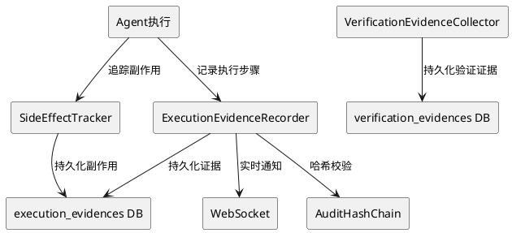
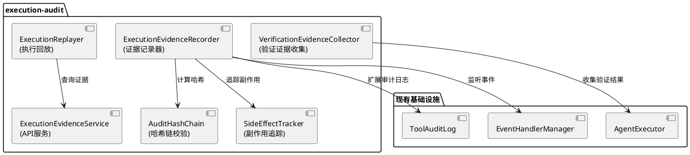
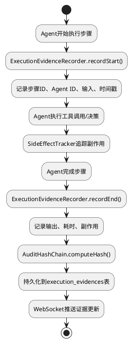
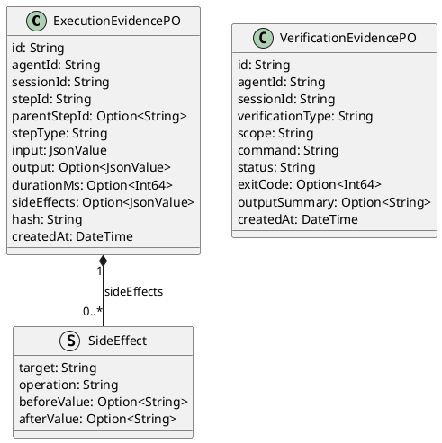

# 执行证据链与审计系统 - 技术设计文档

## 一、需求与存量功能关系分析

### 1.1 需求功能与存量功能对比

#### 1.1.1 已实现功能

| 需求功能 | 存量功能 | 代码位置 | 匹配度 |
|---------|---------|---------|--------|
| 审计日志 | operate_log表和ToolAuditLog | src/tool/tool_audit_log.cj | 50% |
| 事件系统 | EventHandlerManager三级事件 | src/interaction/event_handler_manager.cj | 75% |
| WebSocket推送 | 已有WebSocket实时通信 | src/app/ | 100% |
| Agent执行追踪 | AgentStartEvent/AgentEndEvent | src/interaction/events.cj | 50% |
| 审计提供者接口 | AuditProvider | src/tool/audit_provider.cj | 50% |

#### 1.1.2 需要扩展的功能

| 需求功能 | 存量功能 | 差异说明 | 扩展方向 |
|---------|---------|---------|---------|
| 执行轨迹记录 | operate_log仅记录工具调用 | 缺少Agent决策、任务流转记录 | 扩展为ExecutionEvidence |
| 证据链完整性 | 无哈希校验 | 审计日志可被修改 | 新增哈希链校验 |
| 副作用追踪 | 无副作用记录 | 步骤的副作用无追踪 | 新增SideEffectTracker |
| 验证证据账本 | 无验证记录 | 编译/测试验证结果无结构化记录 | 新增VerificationEvidence |
| 执行回放 | 无回放能力 | 无法回放Agent执行过程 | 新增ExecutionReplayer |

#### 1.1.3 需要新增的功能或接口

1. **ExecutionEvidenceRecorder**: 执行证据记录器
2. **SideEffectTracker**: 副作用追踪器
3. **AuditHashChain**: 哈希链校验
4. **VerificationEvidenceCollector**: 验证证据收集器
5. **ExecutionReplayer**: 执行回放器
6. **数据库表**: execution_evidences、verification_evidences

### 1.2 存量功能详细分析

**ToolAuditLog**（src/tool/tool_audit_log.cj）：
- **接口契约**: 记录工具调用的审计日志
- **业务规则**: 记录工具名、参数、结果、耗时
- **扩展点**: 可扩展为记录Agent决策和任务流转
- **约束**: 仅记录工具调用，不记录Agent决策过程

## 二、增量设计方案

### 2.1 实现模型

#### 2.1.1 上下文视图



#### 2.1.2 服务/组件总体架构



#### 2.1.3 实现设计文档

**证据记录流程**：



**验证证据收集流程**：

```plantuml
@startuml
start
:Agent执行验证操作;
if (验证类型?) then
  (compile)
  :执行cjpm build;
  :记录编译结果;
else if (验证类型?) then
  (test)
  :执行测试脚本;
  :记录测试结果;
else if (验证类型?) then
  (business_rule)
  :执行业务规则检查;
  :记录检查结果;
endif

:VerificationEvidenceCollector.collect();
:持久化到verification_evidences表;
:被动设计 - 不阻止Agent继续;

stop
@enduml
```

### 2.2 接口设计

#### 2.2.1 总体设计

| 接口分类 | 接口名称 | 稳定性 | 说明 |
|---------|---------|--------|------|
| 证据查询API | GET /api/v1/uctoo/execution_evidences/:limit/:page | 稳定 | 分页查询证据 |
| 证据查询API | GET /api/v1/uctoo/execution_evidences/session/:sessionId | 稳定 | 按会话查询 |
| 验证证据API | GET /api/v1/uctoo/verification_evidences/:limit/:page | 稳定 | 分页查询验证证据 |
| 回放API | GET /api/v1/uctoo/execution_evidences/replay/:sessionId | 实验 | 执行回放 |
| 内部接口 | ExecutionEvidenceRecorder.record() | 实验 | 记录证据 |
| 内部接口 | VerificationEvidenceCollector.collect() | 实验 | 收集验证证据 |

#### 2.2.2 接口清单

**ExecutionEvidenceRecorder内部接口**：

```cangjie
public class ExecutionEvidenceRecorder {
    public func recordStart(agentId: String, sessionId: String, stepType: String, input: JsonValue): Option<String>
    public func recordEnd(stepId: String, output: JsonValue, sideEffects: ArrayList<SideEffect>): Unit
    public func recordError(stepId: String, error: String): Unit
    public func getEvidenceChain(sessionId: String): ArrayList<ExecutionEvidence>
    public func verifyIntegrity(sessionId: String): Option<Bool>
}
```

**VerificationEvidenceCollector内部接口**：

```cangjie
public class VerificationEvidenceCollector {
    public func collect(agentId: String, sessionId: String, verificationType: String, command: String, status: String, exitCode: Int64, outputSummary: String): Unit
    public func getSessionSummary(sessionId: String): Option<VerificationSummary>
    public func getRepositorySummary(): VerificationSummary
}
```

### 2.3 数据模型

#### 2.3.1 设计目标

- 支持执行证据的完整记录和查询
- 支持证据链的哈希校验
- 支持副作用的追踪和回滚
- 支持验证证据的结构化记录

#### 2.3.2 模型实现



**uctoo-v4 模块开发规范约束**：
- PO类需使用 `@DataAssist[fields]` 和 `@QueryMappersGenerator["table_name"]` 注解
- PO类字段使用 `public var` 声明，可选字段使用 `Option<T>` 类型
- PO类需提供 `toJsonValue(): JsonValue` 和 `toJson(): String` 序列化方法
- DAO接口需使用 `@DAO` 注解并继承 `RootDAO`，声明 `prop executor: SqlExecutor`
- DAO查询方法返回 `Option<T>`（单条）或 `ArrayList<T>`（列表）或 `Pagination<T>`（分页）
- Service类方法返回 `APIResult<T>`，使用 `try { ... } catch (e: Exception) { ... }` 错误处理
- Controller方法签名统一为 `public func add(req: HttpRequest, res: HttpResponse): Unit`
- 包名规范：`magic.app.models.uctoo`、`magic.app.dao.uctoo`、`magic.app.services.uctoo`、`magic.app.controllers.uctoo`
- 导入规范：`import std.time.DateTime`、`import stdx.encoding.json.{JsonValue, JsonObject, JsonArray}`、`import std.collection.*`、`import f_orm.*`

**DDL**：

> **复核修订说明**（2026-07-24 design-review.md）：
> - 所有id/外键字段从BIGSERIAL/BIGINT改为uuid，与uctooDB.sql规范对齐
> - 所有时间字段从TIMESTAMP改为timestamptz(6)，与uctooDB.sql规范对齐
> - creator从BIGINT改为uuid，与uctooDB.sql规范对齐
> - agent_id改为uuid，关联agents.id
> - 补充COMMENT ON COLUMN和COMMENT ON TABLE
> - 补充必要的索引

```sql
CREATE TABLE "public"."execution_evidences" (
    "id" uuid NOT NULL DEFAULT gen_random_uuid(),
    "agent_id" uuid NOT NULL,
    "session_id" varchar(100) COLLATE "pg_catalog"."default" NOT NULL,
    "step_id" varchar(100) COLLATE "pg_catalog"."default" NOT NULL,
    "parent_step_id" varchar(100) COLLATE "pg_catalog"."default",
    "step_type" varchar(20) COLLATE "pg_catalog"."default" NOT NULL,
    "input" jsonb NOT NULL,
    "output" jsonb,
    "duration_ms" int8,
    "side_effects" jsonb,
    "hash" varchar(64) COLLATE "pg_catalog"."default" NOT NULL,
    "creator" uuid,
    "created_at" timestamptz(6) NOT NULL DEFAULT CURRENT_TIMESTAMP,
    "updated_at" timestamptz(6) NOT NULL DEFAULT CURRENT_TIMESTAMP,
    "deleted_at" timestamptz(6)
)
;

COMMENT ON COLUMN "public"."execution_evidences"."id" IS '证据唯一标识';
COMMENT ON COLUMN "public"."execution_evidences"."agent_id" IS '关联agents表id';
COMMENT ON COLUMN "public"."execution_evidences"."session_id" IS '执行会话ID';
COMMENT ON COLUMN "public"."execution_evidences"."step_id" IS '步骤ID';
COMMENT ON COLUMN "public"."execution_evidences"."parent_step_id" IS '父步骤ID';
COMMENT ON COLUMN "public"."execution_evidences"."step_type" IS '步骤类型：decision/tool_call/task_transfer';
COMMENT ON COLUMN "public"."execution_evidences"."input" IS '步骤输入(JSONB)';
COMMENT ON COLUMN "public"."execution_evidences"."output" IS '步骤输出(JSONB)';
COMMENT ON COLUMN "public"."execution_evidences"."duration_ms" IS '执行耗时(毫秒)';
COMMENT ON COLUMN "public"."execution_evidences"."side_effects" IS '副作用记录(JSONB)';
COMMENT ON COLUMN "public"."execution_evidences"."hash" IS '哈希链校验值(SHA-256)';
COMMENT ON COLUMN "public"."execution_evidences"."creator" IS '创建人';
COMMENT ON COLUMN "public"."execution_evidences"."created_at" IS '创建时间';
COMMENT ON COLUMN "public"."execution_evidences"."updated_at" IS '更新时间';
COMMENT ON COLUMN "public"."execution_evidences"."deleted_at" IS '删除时间';
COMMENT ON TABLE "public"."execution_evidences" IS '执行证据表。记录Agent执行的每个步骤的完整证据链。';

CREATE TABLE "public"."verification_evidences" (
    "id" uuid NOT NULL DEFAULT gen_random_uuid(),
    "agent_id" uuid NOT NULL,
    "session_id" varchar(100) COLLATE "pg_catalog"."default" NOT NULL,
    "verification_type" varchar(20) COLLATE "pg_catalog"."default" NOT NULL,
    "scope" varchar(20) COLLATE "pg_catalog"."default" NOT NULL DEFAULT 'session'::character varying,
    "command" varchar(500) COLLATE "pg_catalog"."default",
    "status" varchar(20) COLLATE "pg_catalog"."default" NOT NULL,
    "exit_code" int4,
    "output_summary" text COLLATE "pg_catalog"."default",
    "creator" uuid,
    "created_at" timestamptz(6) NOT NULL DEFAULT CURRENT_TIMESTAMP,
    "updated_at" timestamptz(6) NOT NULL DEFAULT CURRENT_TIMESTAMP,
    "deleted_at" timestamptz(6)
)
;

COMMENT ON COLUMN "public"."verification_evidences"."id" IS '验证证据唯一标识';
COMMENT ON COLUMN "public"."verification_evidences"."agent_id" IS '关联agents表id';
COMMENT ON COLUMN "public"."verification_evidences"."session_id" IS '执行会话ID';
COMMENT ON COLUMN "public"."verification_evidences"."verification_type" IS '验证类型：compile/test/business_rule';
COMMENT ON COLUMN "public"."verification_evidences"."scope" IS '验证范围：session/repository';
COMMENT ON COLUMN "public"."verification_evidences"."command" IS '验证命令';
COMMENT ON COLUMN "public"."verification_evidences"."status" IS '验证状态：passed/failed/error';
COMMENT ON COLUMN "public"."verification_evidences"."exit_code" IS '退出码';
COMMENT ON COLUMN "public"."verification_evidences"."output_summary" IS '输出摘要';
COMMENT ON COLUMN "public"."verification_evidences"."creator" IS '创建人';
COMMENT ON COLUMN "public"."verification_evidences"."created_at" IS '创建时间';
COMMENT ON COLUMN "public"."verification_evidences"."updated_at" IS '更新时间';
COMMENT ON COLUMN "public"."verification_evidences"."deleted_at" IS '删除时间';
COMMENT ON TABLE "public"."verification_evidences" IS '验证证据表。记录编译、测试、业务规则验证的结构化结果。';

CREATE INDEX idx_evidences_session ON "public"."execution_evidences"(session_id);
CREATE INDEX idx_evidences_agent ON "public"."execution_evidences"(agent_id);
CREATE INDEX idx_evidences_step ON "public"."execution_evidences"(step_id);
CREATE INDEX idx_verification_session ON "public"."verification_evidences"(session_id);
CREATE INDEX idx_verification_type ON "public"."verification_evidences"(verification_type);
CREATE INDEX idx_verification_agent ON "public"."verification_evidences"(agent_id);
```