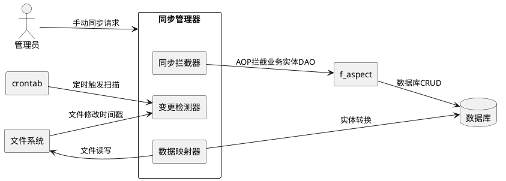
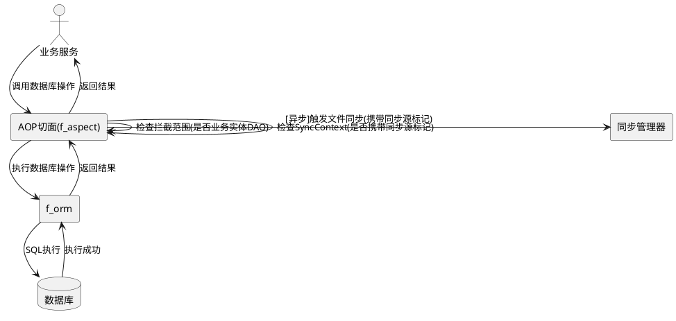
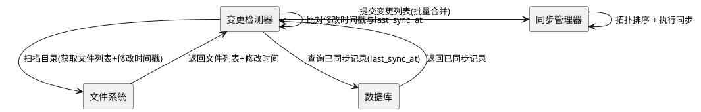
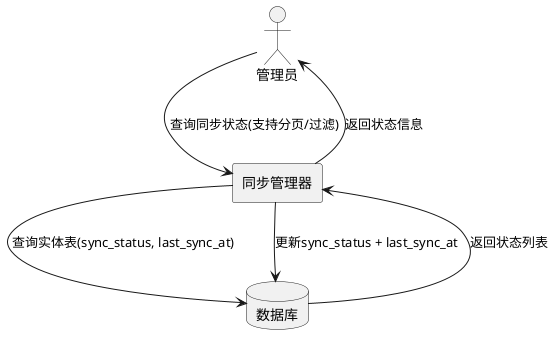

# 文件系统与数据库双向同步需求规格（MVP）

**版本**: v1.0.0-mvp  
**创建日期**: 2026-06-03  
**最后更新**: 2026-06-03  
**状态**: 待设计和实现  
**关联模块**: agents、agent_skills  
**基线版本**: v2.0.0（本版本为 v2.0.0 的简化 MVP，省略版本向量、三路合并、content-hash、同步防抖窗口、背压、熔断、分布式追踪等复杂机制）

---

# **1. 组件定位**

## **1.1 核心职责**

本组件负责文件系统与数据库之间 Agent/AgentSkill 实体的双向数据同步，确保两侧数据最终一致性，采用"最后写入胜出"策略解决冲突。

## **1.2 核心输入**

1. **应用启动事件**：runtime 启动时从文件加载生成 agent/subagent 时，触发文件系统→数据库的初始化同步
2. **数据库变更事件**：用户从 web 界面操作数据库数据后，通过 AOP 拦截触发的数据库→文件系统同步
3. **手动同步请求**：通过 API 触发的同步指令（单实体/批量）
4. **定时同步任务**：周期性检查并同步差异（基于文件修改时间戳检测）

## **1.3 核心输出**

1. **数据库记录**：同步后的 Agent/AgentSkill 结构化元数据
2. **文件系统文件**：同步后的 Markdown 定义文件
3. **同步日志**：记录同步操作的详细日志（含同步源、方向、耗时、结果）
4. **同步状态**：每个实体的同步状态（synced/pending/error）与全局同步概览

## **1.4 职责边界**

1. **负责**：文件系统与数据库之间的数据同步协调、基于时间戳的变更检测、last-write-wins 冲突解决、同步状态管理、同步日志记录
2. **不负责**：
   - 不负责具体业务逻辑的实现（如 Agent 执行、Skill 运行）
   - 不负责数据库基础 CRUD 操作（复用现有 f_orm ORM 框架）
   - 不负责文件系统的底层读写（复用现有文件操作工具）
   - 不负责权限校验（复用现有权限机制）
   - 不负责同步系统自身数据的业务语义校验（仅负责传输一致性）
   - 不负责版本向量、三路合并、content-hash 等高级冲突检测（MVP 不实现）
   - 不负责同步防抖窗口、背压、熔断等高级流量控制（MVP 不实现）
   - 不负责分布式追踪、Metrics 指标等高级可观测性（MVP 仅记录日志）

---

# **2. 领域术语**

**同步源**
: 数据变更的起始位置（文件系统或数据库），用于标识变更的发起方，是循环同步防护的基础概念。

**同步目标**
: 数据变更的接收位置（数据库或文件系统），与同步源互为对端。

**同步方向**
: 数据流动方向，取值为：文件→数据库（fs_to_db）、数据库→文件（db_to_fs）。

**同步上下文（SyncContext）**
: 携带同步任务元信息的上下文对象，包含同步源标记，用于循环同步防护。MVP 中通过线程本地变量或请求上下文传递。

**同步源标记**
: 标识当前变更由同步系统自身触发的标记，用于区分"业务变更"和"同步系统触发的变更"，是防止循环同步的核心机制。

**变更检测器**
: 检测文件系统变更的组件，MVP 阶段基于文件修改时间戳检测变更。

**同步拦截器**
: AOP 切面，拦截业务实体 DAO 的数据变更事件触发同步，排除同步系统自身 DAO 操作。MVP 阶段复用 f_aspect 框架。

**同步管理器**
: 协调和调度同步任务的核心组件，MVP 阶段负责拓扑排序、upsert 幂等性保证。

**数据映射器**
: 文件格式与数据库实体的双向转换组件。

**最后写入胜出（Last-Write-Wins）**
: 冲突解决策略，当文件侧与数据库侧并发修改同一实体时，以最后修改时间戳较晚的版本为准，丢弃较早版本的修改。
: 备注：MVP 阶段的简化冲突解决策略，v2.0.0 将升级为基于版本向量的三路合并。

**实体依赖拓扑**
: 实体之间的依赖关系图（如 agent_skill 依赖 agent），同步时必须按拓扑排序执行，确保被依赖实体先同步。

**同步幂等性**
: 同一同步任务对同一实体执行多次与执行一次的效果等价，MVP 通过 upsert 语义保证。

**source_path**
: 文件系统中实体定义文件的相对路径，作为文件系统与数据库同步的首要数据唯一标识。
: 备注：有文件系统和数据库同步需求的模块，数据库表设计都应有此字段。

---

# **3. 角色与边界**

## **3.1 核心角色**

| 角色 | 职责 | 交互方式 |
|------|------|----------|
| **同步管理器** | 协调同步任务、管理同步状态、拓扑排序、upsert 幂等性保证 | 内部 API 调用 |
| **变更检测器** | 基于文件修改时间戳检测文件变更 | 定时扫描 |
| **同步拦截器** | AOP 切面拦截业务实体 DAO 变更，触发数据库→文件同步 | 切面织入（f_aspect） |
| **数据映射器** | 文件格式与数据库实体的双向转换 | 字段映射、格式转换 |

## **3.2 外部系统**

| 系统 | 职责 | 交互方式 |
|------|------|----------|
| **文件系统** | 存储 Agent/AgentSkill 的 Markdown 定义文件 | 文件读写操作 |
| **数据库（PostgreSQL）** | 存储 Agent/AgentSkill 的结构化元数据 | f_orm DAO 操作 |
| **f_aspect 框架** | AOP 切面织入，提供同步拦截能力 | 切面注册 |
| **crontab 框架** | 定时任务调度，驱动变更检测扫描 | 定时任务注册 |
| **f_orm 框架** | ORM 数据访问层 | DAO 调用 |

## **3.3 交互上下文**



---

# **4. DFX约束**

## **4.1 性能**

1. 单条实体同步端到端耗时 ≤ 200ms（P99）
2. 批量同步 100 条实体耗时 ≤ 10 秒（P99）
3. 同步操作不得阻塞主线程，所有同步任务异步执行
4. 变更检测扫描间隔可配置，默认 60 秒
5. 启动全量同步不得阻塞应用启动，启动超时阈值可配置，默认 30 秒，超时后应用正常启动、同步后台继续

## **4.2 可靠性**

1. 同步失败自动重试，最多 3 次，重试间隔采用指数退避（1s, 2s, 4s）
2. 同步操作必须幂等：同一实体执行 upsert 任意次数，最终状态与执行一次等价
3. 同步失败必须记录详细日志，包含实体类型、source_path、同步方向、错误码、错误详情、重试次数
4. 支持手动重试失败的同步任务
5. 同步系统触发的变更不得触发反向同步（同步源标记规则）

## **4.3 安全性**

1. 同步操作必须记录操作者信息（同步源、触发方式）
2. 同步操作受权限控制（sync:read / sync:write）
3. 同步 API 必须认证鉴权，未授权请求返回 401
4. 同步拦截器仅拦截业务实体 DAO，禁止拦截同步系统自身 DAO

## **4.4 可维护性**

1. 同步逻辑模块化，支持扩展新实体类型（注册 SyncHandler 即可）
2. 提供同步状态监控 API（状态概览、实体状态列表）
3. 同步配置可通过环境变量或配置文件调整
4. 同步系统必须提供健康检查端点，返回同步系统运行状态

## **4.5 兼容性**

1. 保持现有 API 的向后兼容，新增 API 版本化（/api/v1/）
2. 同步功能可配置开关，关闭时系统行为与无同步模块完全一致
3. 数据映射版本向前兼容：映射规则升级后，旧格式文件仍可正确解析

---

# **5. 核心能力**

## **5.1 双向同步机制**

### **5.1.1 业务规则**

1. **文件系统→数据库同步**：
   - When runtime 启动时从文件加载生成 agent/subagent，the system shall 将文件数据写入数据库（upsert 语义）
   - 同步语义：不存在则创建，存在则更新（upsert 语义），删除则软删除
   - 触发时机：应用启动初始化、定时扫描检测到变更、手动触发
   - 以 source_path 作为首要的数据唯一标识进行 upsert 匹配

2. **数据库→文件系统同步**：
   - When 用户从 web 界面操作数据库数据后，the system shall 通过 AOP 拦截将数据库数据更新到文件系统
   - 同步语义：不存在则创建文件，存在则覆盖，删除则删除文件
   - 触发时机：数据库 INSERT/UPDATE/DELETE 操作（通过 AOP 拦截）

3. **循环同步防护规则**：
   - 同步系统触发的变更必须携带同步源标记（SyncContext），标记为同步系统触发的变更不得触发反向同步
   - SyncContext 通过线程本地变量或请求上下文传递
   - MVP 不实现熔断机制，仅通过同步源标记防止直接循环

4. **幂等性保证规则**：
   - 同步操作必须采用 upsert 语义（不存在则创建，存在则更新），确保重复执行结果一致
   - upsert 匹配键为 source_path（文件路径），同一 source_path 的实体在数据库中唯一
   - 同步结果必须基于实体内容而非操作次数判定

5. **实体依赖拓扑排序规则**：
   - 存在依赖关系的实体必须按拓扑排序同步，被依赖实体先同步
   - 依赖关系：agent_skill 依赖 agent（agent_skill 的 agent_id 字段引用 agent）
   - 拓扑排序必须在批量同步和启动全量同步时执行
   - 循环依赖检测：若实体间存在循环依赖，系统必须记录告警并跳过循环部分

### **5.1.2 交互流程**

```plantuml
@startuml
actor "文件系统" as fs
actor "数据库" as db
rectangle "同步管理器" as syncMgr

== 文件系统→数据库（启动时/定时扫描） ==
fs -> syncMgr : 文件变更(基于修改时间戳检测) + SyncContext
syncMgr -> syncMgr : 检查同步源标记(非同步系统触发)
syncMgr -> syncMgr : 读取文件内容 + 转换为实体对象
syncMgr -> db : UPSERT(以source_path为匹配键, 携带同步源标记)
syncMgr -> syncMgr : 更新同步状态(synced/pending/error)

== 数据库→文件系统（AOP拦截） ==
db -> syncMgr : 数据变更事件(INSERT/UPDATE/DELETE) + SyncContext
syncMgr -> syncMgr : 检查同步源标记(非同步系统触发)
syncMgr -> syncMgr : 读取实体对象 + 转换为文件格式
syncMgr -> fs : 写入/更新/删除文件(携带同步源标记)
syncMgr -> syncMgr : 更新同步状态

== 冲突处理（Last-Write-Wins） ==
syncMgr -> syncMgr : 比对文件修改时间戳与数据库updated_at
syncMgr -> syncMgr : 保留时间戳较晚的版本
@enduml
```

### **5.1.3 异常场景**

1. **循环同步**
   - 触发条件：同步系统写入数据库后，AOP 拦截再次触发反向同步
   - 系统行为：同步源标记检查发现 SyncContext，拒绝反向同步
   - 用户感知：无感知，同步系统触发的数据库操作不产生反向同步

2. **依赖顺序错误**
   - 触发条件：agent_skill 在其依赖的 agent 之前同步
   - 系统行为：拓扑排序确保 agent 先同步；若 agent 不存在，agent_skill 同步标记为"依赖缺失"，等待依赖实体同步后重试
   - 用户感知：agent_skill 同步状态为"依赖缺失"，依赖满足后自动恢复

3. **文件读取失败**
   - 触发条件：文件权限不足、文件被占用、文件损坏
   - 系统行为：记录错误日志，标记同步状态为 error，按重试策略重试
   - 用户感知：同步状态为"error"，错误码标识具体原因

4. **数据库写入失败**
   - 触发条件：数据库连接异常、约束违反
   - 系统行为：记录错误日志，标记同步状态为 error，按重试策略重试
   - 用户感知：同步状态为"error"，错误码标识具体原因

5. **格式转换失败**
   - 触发条件：文件格式不符合 Markdown Frontmatter 语法、字段类型不匹配
   - 系统行为：记录错误日志，标记同步状态为 error，需人工修复源文件
   - 用户感知：同步状态为"error"，错误详情包含具体字段和原因

## **5.2 AOP 切面同步拦截**

### **5.2.1 业务规则**

1. **数据库操作拦截**：通过 f_aspect AOP 切面拦截业务实体（Agent、AgentSkill）相关的数据库 CRUD 操作
2. **后置通知**：在数据库操作成功后触发文件系统同步，数据库操作失败时不触发同步
3. **异步执行**：同步操作异步执行，不阻塞数据库操作返回
4. **拦截范围限定规则**：
   - 仅拦截业务实体 DAO（AgentDAO、AgentSkillDAO），通过实体类型白名单配置
   - 禁止拦截同步系统自身 DAO（SyncStatusDAO、SyncLogDAO），通过包路径排除规则实现
   - 拦截范围可配置扩展，新增实体类型时仅需添加白名单条目
5. **同步上下文检查规则**：
   - AOP 切面触发同步前，必须检查当前线程/请求的 SyncContext
   - 若当前操作已携带同步源标记（即由同步系统触发），切面必须跳过拦截，防止递归
   - SyncContext 通过线程本地变量或请求上下文传递

### **5.2.2 交互流程**



### **5.2.3 异常场景**

1. **拦截递归**
   - 触发条件：同步系统写入数据库时，AOP 切面再次拦截触发反向同步
   - 系统行为：SyncContext 检查发现同步源标记，跳过拦截
   - 用户感知：无感知，同步系统触发的数据库操作不产生反向同步

2. **切面执行异常**
   - 触发条件：AOP 切面自身执行异常（如反射失败、参数解析失败）
   - 系统行为：捕获异常，记录告警日志，不影响原数据库操作
   - 用户感知：数据库操作正常返回，同步可能未触发，可通过定时扫描补偿

## **5.3 文件系统变更检测**

### **5.3.1 业务规则**

1. **定时扫描**：通过 crontab 定期扫描 Agent/AgentSkill 目录，检测文件变更
2. **变更检测策略**：MVP 阶段仅支持基于文件修改时间戳的检测
   - 比对文件最后修改时间与数据库记录的 last_sync_at，变更当且仅当修改时间晚于同步时间
3. **批量合并规则**：
   - 一次扫描中检测到的多个变更，合并为一次批量同步请求
   - 批量同步按实体依赖拓扑排序执行

### **5.3.2 交互流程**



### **5.3.3 异常场景**

1. **目录不存在**
   - 触发条件：配置的同步目录路径不存在
   - 系统行为：记录警告日志，跳过该目录扫描，不影响其他目录同步
   - 用户感知：该目录下实体不同步，同步状态为"目录缺失"

2. **权限不足**
   - 触发条件：同步进程无文件系统读写权限
   - 系统行为：记录错误日志，跳过扫描，标记受影响实体同步状态为 error
   - 用户感知：同步状态为"error"，错误码标识权限不足

3. **扫描超时**
   - 触发条件：目录文件数过多或文件系统响应慢
   - 系统行为：中断当前扫描，记录告警日志，下次扫描继续
   - 用户感知：部分实体可能延迟同步，最终一致

## **5.4 数据映射与转换**

### **5.4.1 业务规则**

1. **文件→实体转换**：将 Markdown Frontmatter 文件解析为数据库实体
2. **实体→文件转换**：将数据库实体序列化为 Markdown Frontmatter 文件
3. **字段映射**：定义文件字段与数据库字段的映射关系，映射关系可配置
4. **格式兼容**：支持 Markdown Frontmatter 格式（YAML frontmatter + Markdown 内容）
5. **映射版本兼容性规则**：
   - 映射规则升级后（新增字段、字段重命名），旧格式文件仍可正确解析（向前兼容）
   - 映射版本号必须记录在同步状态中，用于追踪兼容性问题
6. **部分映射规则**：
   - When 文件中缺少某些字段，the system shall 数据库对应字段保持原值（不覆盖为空值）
   - When 数据库中缺少某些字段，the system shall 文件输出时使用默认值或省略该字段
   - 部分映射行为可配置：严格模式（字段缺失视为错误）/ 宽容模式（字段缺失使用默认值）

7. **source_path 映射规则**：
   - Agent 实体：source_path 为 AGENTS.md 或 agents 目录下 .md 文件的相对路径
   - AgentSkill 实体：source_path 为 .codeartsdoer/skills 目录下技能定义文件的相对路径
   - source_path 在数据库中作为首要的数据唯一标识

### **5.4.2 交互流程**

```plantuml
@startuml
rectangle "数据映射器" as mapper
rectangle "文件解析器" as parser
rectangle "实体序列化器" as serializer

== 文件→实体 ==
mapper -> parser : 文件内容 + source_path
parser -> parser : 解析Markdown Frontmatter
parser -> parser : 向前兼容处理(缺失字段降级)
parser --> mapper : 解析结果
mapper -> mapper : 字段映射(部分映射规则)
mapper --> mapper : 返回实体对象(含source_path)

== 实体→文件 ==
mapper -> serializer : 实体对象
serializer -> serializer : 序列化为Markdown Frontmatter
serializer --> mapper : 文件内容
mapper --> mapper : 返回文件内容
@enduml
```

### **5.4.3 异常场景**

1. **文件格式错误**
   - 触发条件：文件内容不符合 Markdown Frontmatter 语法
   - 系统行为：记录错误日志，标记同步状态为 error，错误详情包含行号和语法错误
   - 用户感知：同步状态为"error"，需人工修复源文件

2. **字段映射缺失**
   - 触发条件：文件中存在数据库无对应字段的字段，或数据库字段在文件中无映射
   - 系统行为：严格模式下标记同步状态为 error；宽容模式下使用默认值或跳过，记录警告日志
   - 用户感知：严格模式下同步失败；宽容模式下同步成功，但部分字段可能未同步

3. **序列化失败**
   - 触发条件：实体对象包含不可序列化的字段值
   - 系统行为：记录错误日志，标记同步状态为 error
   - 用户感知：同步状态为"error"

## **5.5 冲突解决机制（Last-Write-Wins）**

### **5.5.1 业务规则**

1. **冲突检测**：基于文件修改时间戳与数据库 updated_at 比对检测并发修改
   - When 文件修改时间戳与数据库 updated_at 均晚于 last_sync_at，判定为并发修改冲突

2. **冲突解决策略**：MVP 阶段采用"最后写入胜出"（last-write-wins）
   - 比较文件修改时间戳与数据库 updated_at，保留时间戳较晚的版本
   - 文件侧较新时，以文件侧数据覆盖数据库侧
   - 数据库侧较新时，以数据库侧数据覆盖文件侧

3. **冲突记录**：冲突详情必须记录到同步日志，包含实体类型、source_path、两侧时间戳、解决结果

### **5.5.2 交互流程**

```plantuml
@startuml
rectangle "同步管理器" as syncMgr
rectangle "文件系统" as fs
database "数据库" as db

syncMgr -> fs : 获取文件修改时间戳
syncMgr -> db : 获取updated_at + last_sync_at
syncMgr -> syncMgr : 比对时间戳检测冲突
alt 文件侧较新
    syncMgr -> db : 以文件侧数据覆盖数据库
else 数据库侧较新
    syncMgr -> fs : 以数据库侧数据覆盖文件
end
syncMgr -> syncMgr : 记录冲突解决日志
@enduml
```

### **5.5.3 异常场景**

1. **时间戳不可比**
   - 触发条件：文件修改时间戳或数据库 updated_at 为空（首次同步、数据异常）
   - 系统行为：视为非冲突，按正常同步流程处理（upsert）
   - 用户感知：同步正常完成

2. **两侧时间戳相同**
   - 触发条件：文件修改时间戳与数据库 updated_at 相同
   - 系统行为：视为无变更，跳过同步
   - 用户感知：同步状态保持"已同步"

## **5.6 同步状态管理**

### **5.6.1 业务规则**

1. **状态追踪**：追踪每个实体的同步状态，状态取值：pending（待同步）、synced（已同步）、error（同步失败）、dependency_missing（依赖缺失）
2. **状态持久化**：同步状态通过实体表的 sync_status 和 last_sync_at 字段持久化，应用重启后可恢复
3. **状态查询**：提供 API 查询同步状态（全局概览、按实体类型、按实体ID、按状态过滤）
4. **状态更新**：同步操作完成后必须更新 sync_status 和 last_sync_at

### **5.6.2 交互流程**



### **5.6.3 异常场景**

1. **状态更新失败**
   - 触发条件：数据库写入失败导致状态更新失败
   - 系统行为：记录错误日志，标记状态可能不一致，下次同步时重新计算状态
   - 用户感知：状态查询可能返回过期数据，最终一致

---

# **6. 数据约束**

## **6.1 Agent 实体**

1. **source_path**：Agent 定义文件的相对路径（如 AGENTS.md、agents/analyzer.md），字符串，最大长度 512，有文件同步需求的实体必填，作为首要的数据唯一标识
2. **sync_status**：同步状态，取值范围 {synced, pending, error, dependency_missing}，默认 pending
3. **last_sync_at**：最后成功同步时间，时间戳，可为空（从未同步时）
4. **唯一性约束**：source_path 非空时，source_path 在 agents 表内唯一

## **6.2 AgentSkill 实体**

1. **source_path**：AgentSkill 技能定义文件的相对路径（如 .codeartsdoer/skills/cangjie-coder/skill.md），字符串，最大长度 512，有文件同步需求的实体必填，作为首要的数据唯一标识
2. **sync_status**：同步状态，取值范围 {synced, pending, error, dependency_missing}，默认 pending
3. **last_sync_at**：最后成功同步时间，时间戳，可为空（从未同步时）
4. **唯一性约束**：source_path 非空时，source_path 在 agent_skills 表内唯一
5. **关系约束**：agent_skill 的 agent_id 字段引用 agent，agent 必须存在（依赖约束）

## **6.3 同步日志**

1. **entity_type**：实体类型标识，取值范围 {agent, agent_skill}，必填
2. **source_path**：实体文件路径，字符串，最大长度 512，必填
3. **operation**：操作类型，取值范围 {create, update, delete, sync}，必填
4. **direction**：同步方向，取值范围 {fs_to_db, db_to_fs}，必填
5. **status**：操作结果，取值范围 {success, failed}，必填
6. **message**：操作消息，文本，最大长度 1000，可为空
7. **error_detail**：错误详情，文本，最大长度 4000，可为空
8. **sync_source**：同步源标记，取值范围 {business, sync_system, manual, startup}，必填
9. **duration_ms**：同步耗时（毫秒），非负整数，可为空
10. **created_at**：日志创建时间，时间戳，必填，单调递增

---

# **7. 验收标准**

## **7.1 双向同步功能验收**

- [ ] When runtime 启动并从 AGENTS.md 加载生成主 agent，the system shall 将 AGENTS.md 数据写入 agents 数据库表（upsert 语义）
- [ ] When runtime 启动并从 agents 目录下 .md 文件加载生成 subagent，the system shall 将文件数据写入 agents 数据库表（upsert 语义）
- [ ] When runtime 启动并从 .codeartsdoer/skills 目录加载技能定义，the system shall 将技能数据写入 agent_skills 数据库表（upsert 语义）
- [ ] When 用户从 web 界面创建 Agent 记录，the system shall 在文件系统中自动创建对应 Markdown 文件
- [ ] When 用户从 web 界面修改 Agent 记录，the system shall 在文件系统中自动更新对应 Markdown 文件
- [ ] When 用户从 web 界面删除 Agent 记录，the system shall 在文件系统中自动删除对应 Markdown 文件
- [ ] When 手动触发同步请求，the system shall 执行同步并返回同步任务ID
- [ ] While 同步功能开关关闭，the system shall 不触发任何同步操作，系统行为与无同步模块一致

## **7.2 循环同步防护验收**

- [ ] When 同步系统写入数据库，the system shall 携带同步源标记（SyncContext），AOP 切面 shall 不触发反向同步
- [ ] When 当前操作携带同步源标记，the system shall AOP 切面跳过拦截

## **7.3 幂等性验收**

- [ ] While 同步操作采用 upsert 语义（以 source_path 为匹配键），the system shall 不因重复执行产生重复记录或数据不一致
- [ ] When 同一实体的同步操作执行多次，the system shall 最终状态与执行一次等价

## **7.4 AOP 拦截验收**

- [ ] When 业务实体 DAO（AgentDAO、AgentSkillDAO）执行 INSERT/UPDATE/DELETE，the system shall 拦截并触发文件同步
- [ ] When 同步系统自身 DAO 执行操作，the system shall 不拦截，不触发同步
- [ ] When 当前操作携带同步源标记，the system shall AOP 切面跳过拦截
- [ ] If AOP 切面执行异常，the system shall 不影响原数据库操作，记录告警日志

## **7.5 变更检测验收**

- [ ] When 文件修改时间戳晚于数据库 last_sync_at，the system shall 检测到变更并触发同步
- [ ] When 文件修改时间戳不晚于数据库 last_sync_at，the system shall 不触发同步
- [ ] When 定时扫描检测到多个变更，the system shall 合并为一次批量同步请求

## **7.6 冲突解决验收**

- [ ] When 文件修改时间戳与数据库 updated_at 均晚于 last_sync_at（并发修改），the system shall 采用 last-write-wins 策略，保留时间戳较晚的版本
- [ ] When 文件侧修改时间戳较新，the system shall 以文件侧数据覆盖数据库侧
- [ ] When 数据库侧 updated_at 较新，the system shall 以数据库侧数据覆盖文件侧

## **7.7 数据映射验收**

- [ ] When 映射规则升级后解析旧格式文件，the system shall 正确解析（向前兼容）
- [ ] While 严格模式下文件字段缺失，the system shall 标记同步状态为 error
- [ ] While 宽容模式下文件字段缺失，the system shall 使用默认值继续同步
- [ ] When Agent 实体同步，the system shall 将 AGENTS.md 或 agents 目录下 .md 文件的相对路径写入 source_path 字段
- [ ] When AgentSkill 实体同步，the system shall 将 .codeartsdoer/skills 目录下技能定义文件的相对路径写入 source_path 字段

## **7.8 实体依赖验收**

- [ ] When 批量同步包含 agent 和 agent_skill，the system shall 先同步 agent 再同步 agent_skill
- [ ] When agent_skill 的依赖 agent 不存在，the system shall 标记 agent_skill 的 sync_status 为 dependency_missing
- [ ] When 依赖实体同步完成，the system shall 自动重试 dependency_missing 状态的实体同步

## **7.9 source_path 唯一标识验收**

- [ ] When 同步 Agent 实体到数据库，the system shall 以 source_path 作为 upsert 匹配键，同一 source_path 不产生重复记录
- [ ] When 同步 AgentSkill 实体到数据库，the system shall 以 source_path 作为 upsert 匹配键，同一 source_path 不产生重复记录
- [ ] When 数据库中已存在相同 source_path 的记录，the system shall 更新该记录而非创建新记录

## **7.10 性能验收**

- [ ] When 单条实体同步执行，the system shall 端到端耗时 ≤ 200ms（P99）
- [ ] When 批量同步 100 条实体，the system shall 耗时 ≤ 10 秒（P99）
- [ ] While 同步操作执行，the system shall 不阻塞主线程

## **7.11 可靠性验收**

- [ ] When 同步失败，the system shall 自动重试最多 3 次，重试间隔采用指数退避（1s, 2s, 4s）
- [ ] When 同步失败，the system shall 记录详细日志（实体类型、source_path、同步方向、错误码、错误详情、重试次数）
- [ ] When 手动重试失败的同步任务，the system shall 重新执行同步

## **7.12 API 验收**

- [ ] When 请求同步状态列表 API，the system shall 支持分页参数（page, pageSize）和过滤参数（sync_status, entity_type）
- [ ] When 手动触发同步 API，the system shall 返回同步任务ID（taskId）
- [ ] When 未授权请求同步 API，the system shall 返回 401

## **7.13 数据库设计验收**

- [ ] When agents 表设计，the system shall 包含 source_path、sync_status、last_sync_at 字段
- [ ] When agent_skills 表设计，the system shall 包含 source_path、sync_status、last_sync_at 字段
- [ ] When source_path 非空时，the system shall source_path 在对应表内唯一

---

# **8. MVP 与 v2.0.0 差异说明**

| 能力领域 | v2.0.0 | v1.0.0-mvp | 简化原因 |
|----------|--------|------------|----------|
| 冲突检测 | 版本向量（Vector Clock） | 文件修改时间戳 | MVP 简化，时间戳足以覆盖大多数场景 |
| 冲突解决 | 三路合并 + 多策略 | last-write-wins | MVP 简化，单一策略降低实现复杂度 |
| 变更检测 | content-hash + timestamp + hybrid | 仅 timestamp | MVP 简化，时间戳检测实现简单 |
| 同步防抖 | 防抖窗口（500ms）+ 节流（100 QPS） | 无 | MVP 简化，定时扫描已天然防抖 |
| 背压机制 | 降级/延迟/拒绝三策略 | 无 | MVP 简化，MVP 规模下不需要 |
| 熔断机制 | 循环同步检测 + 熔断 + 自动恢复 | 仅同步源标记防护 | MVP 简化，SyncContext 足以防止直接循环 |
| 幂等性 | upsert + 任务去重表 | 仅 upsert | MVP 简化，upsert 语义已保证幂等 |
| 可观测性 | Metrics + Tracing + 告警 | 仅同步日志 | MVP 简化，日志满足基本排查需求 |
| 任务优先级 | 高/中/低三级 + 优先级调度 | 无优先级区分 | MVP 简化，MVP 规模下不需要 |
| 事件溯源 | 领域事件 + 事件溯源 | 无 | MVP 简化，v2.0.0 迭代时实现 |

---

# **9. 参考资料**

## **9.1 内部文档**

- [v2.0.0 文件系统与数据库同步需求规格](../filesystem-database-sync/spec.md)
- [Agent 动态生成与多 Agent 协作系统需求规格](../agents/spec.md)
- [UCTOO V4 架构设计](../../docs/uctoo-v4/uctoo-v4-architecture.md)
- [UCTOO V4 API 规范](../../docs/uctoo-v4/uctoo-v4-api-specification.md)

## **9.2 基础设施参考**

- f_aspect AOP 框架：复用现有切面织入能力
- crontab 定时任务框架：复用现有定时调度能力
- f_orm ORM 框架：复用现有数据访问层
- crudgen 生成器：复用现有标准 CRUD 模块生成能力

## **9.3 业界参考**

- Last-Write-Wins 冲突解决策略（Cassandra、Riak 等分布式系统常用）
- Eventual Consistency 最终一致性模型

---

**文档维护者**: UCToo Team  
**最后更新**: 2026-06-03