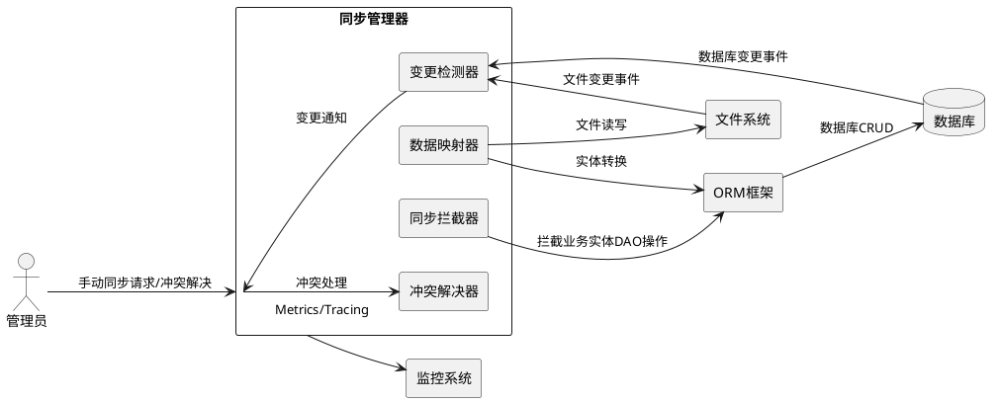
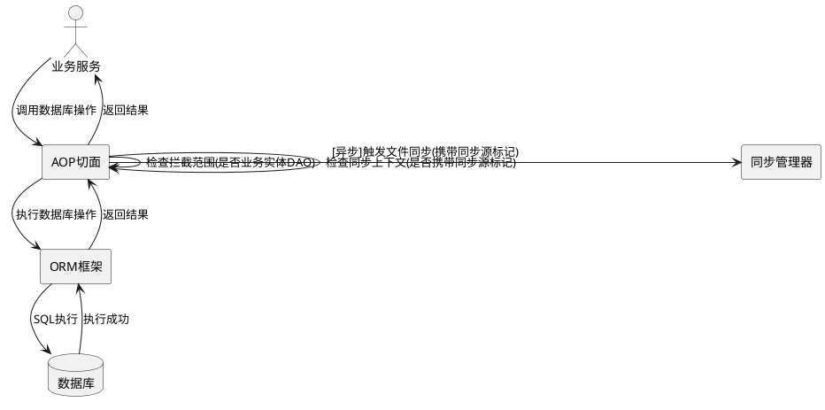
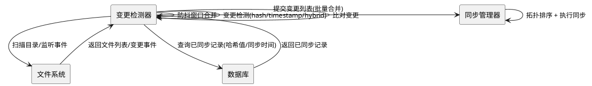
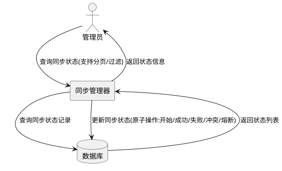

# 文件系统与数据库双向同步需求规格

**版本**: v2.0.0  
**创建日期**: 2026-06-02  
**最后更新**: 2026-06-02  
**状态**: 待设计和实现  
**关联模块**: agents、agent_skills、skills

---

# **1. 组件定位**

## **1.1 核心职责**

本组件负责文件系统与数据库之间 Agent/Skill 等实体的双向数据同步，确保两侧数据最终一致性，并提供冲突检测、自动解决与可观测性能力。

## **1.2 核心输入**

1. **文件系统变更事件**：Agent/Skill 定义文件的创建、修改、删除事件
2. **数据库变更事件**：数据库记录的创建、修改、删除事件（通过 AOP 拦截）
3. **应用启动事件**：触发初始化全量同步（从文件系统加载到数据库）
4. **手动同步请求**：通过 API 或 CLI 触发的同步指令
5. **定时同步任务**：周期性检查并同步差异
6. **冲突解决指令**：人工指定冲突解决策略的请求
7. **同步取消请求**：取消正在执行的同步任务

## **1.3 核心输出**

1. **数据库记录**：同步后的 Agent/Skill 结构化元数据
2. **文件系统文件**：同步后的 Markdown/JSON/YAML 定义文件
3. **同步日志**：记录同步操作的详细日志（含同步源、方向、耗时、结果）
4. **同步状态**：每个实体的同步状态与全局同步概览
5. **领域事件**：同步完成、同步失败、冲突检测、冲突解决等事件
6. **可观测性数据**：同步 Metrics（成功率、延迟分布、冲突率、队列深度）与分布式 Tracing 数据

## **1.4 职责边界**

1. **负责**：文件系统与数据库之间的数据同步协调、冲突检测与解决、同步状态管理、可观测性
2. **不负责任务**：
   - 不负责具体业务逻辑的实现（如 Agent 执行、Skill 运行）
   - 不负责数据库基础 CRUD 操作（复用现有 ORM 框架）
   - 不负责文件系统的底层读写（复用现有文件操作工具）
   - 不负责权限校验（复用现有权限机制）
   - 不负责同步系统自身数据的业务语义校验（仅负责传输一致性）

---

# **2. 领域术语**

**同步源**
: 数据变更的起始位置（文件系统或数据库），用于标识变更的发起方，是循环同步防护的基础概念。

**同步目标**
: 数据变更的接收位置（数据库或文件系统），与同步源互为对端。

**同步方向**
: 数据流动方向，取值为：文件→数据库、数据库→文件、双向。

**同步上下文**
: 携带同步任务元信息的上下文对象，包含同步源标记、同步触发链路、同步任务ID等，用于循环同步防护和分布式追踪。

**同步源标记**
: 标识当前变更由同步系统自身触发的标记，用于区分"业务变更"和"同步系统触发的变更"，是防止循环同步的核心机制。

**变更检测器**
: 检测文件系统或数据库变更的组件，支持内容寻址（content-hash）和时间戳两种检测策略。

**同步拦截器**
: AOP 切面，拦截业务实体 DAO 的数据变更事件触发同步，排除同步系统自身 DAO 操作。

**同步管理器**
: 协调和调度同步任务的核心组件，负责拓扑排序、幂等性保证、并发互斥、限流背压等。

**内容寻址（Content-Hash）**
: 基于文件内容计算哈希值（如 SHA-256）来检测变更的方法，超越简单时间戳比对，可跨文件系统、跨时区可靠工作。
: 备注：参考 Git 内部模型的 content-addressable 存储。

**版本向量**
: 为每个实体维护的分布式版本向量，记录各同步源（文件侧/数据库侧）的修改逻辑时钟，用于精确检测并发冲突。
: 备注：参考向量时钟（Vector Clock）与 CRDT 思想。

**三路合并**
: 当检测到冲突时，以两个版本的最近公共祖先（Base）作为参考，与文件侧版本（Ours）和数据库侧版本（Theirs）进行三方合并的冲突解决方法。
: 备注：参考 Git 三路合并（3-way merge）。

**同步防抖窗口**
: 文件变更事件触发同步前的等待时间窗口，窗口内同一实体的多次变更合并为一次同步，用于应对文件变更风暴。

**同步幂等性**
: 同一同步任务对同一实体执行多次与执行一次的效果等价，通过 upsert 语义和任务去重保证。

**实体依赖拓扑**
: 实体之间的依赖关系图（如 agent_skill 依赖 agent），同步时必须按拓扑排序执行，确保被依赖实体先同步。

**背压**
: 当同步队列深度超过阈值时，系统采取的降级策略（如降级为仅记录变更、延迟同步、拒绝新同步请求），防止系统过载。

---

# **3. 角色与边界**

## **3.1 核心角色**

| 角色 | 职责 | 交互方式 |
|------|------|----------|
| **同步管理器** | 协调同步任务、管理同步状态、拓扑排序、幂等性保证 | 内部 API 调用 |
| **变更检测器** | 检测文件/数据库变更，支持 content-hash 与时间戳策略 | 事件监听、定时扫描 |
| **同步拦截器** | AOP 切面拦截业务实体 DAO 变更，触发反向同步 | 切面织入 |
| **数据映射器** | 文件格式与数据库实体的双向转换，维护映射版本兼容 | 字段映射、格式转换 |
| **冲突解决器** | 基于版本向量检测冲突，支持三路合并与多种解决策略 | 策略选择、人工干预 |

## **3.2 外部系统**

| 系统 | 职责 | 交互方式 |
|------|------|----------|
| **文件系统** | 存储 Agent/Skill 的 Markdown/JSON/YAML 定义 | 文件读写操作 |
| **数据库** | 存储 Agent/Skill 的结构化元数据 | ORM 操作 |
| **ORM 框架** | 数据库访问层 | DAO 调用 |
| **日志系统** | 记录同步操作日志 | 日志写入 |
| **监控系统** | 接收同步 Metrics 和 Tracing 数据 | Metrics/Tracing 上报 |

## **3.3 交互上下文**



---

# **4. DFX约束**

## **4.1 性能**

1. 单条实体同步端到端耗时 ≤ 100ms（P99）
2. 批量同步 100 条实体耗时 ≤ 5 秒（P99）
3. 批量同步 1000 条实体耗时 ≤ 30 秒（P99）
4. 同步操作不得阻塞主线程，所有同步任务异步执行
5. 变更检测扫描间隔可配置，默认 30 秒，最小 5 秒
6. 启动全量同步不得阻塞应用启动，启动超时阈值可配置，默认 60 秒，超时后应用正常启动、同步后台继续
7. 同步任务队列深度上限可配置，默认 10000
8. 文件变更防抖窗口默认 500ms，可配置范围 [100ms, 5000ms]
9. 同步限流 QPS 上限可配置，默认 100 QPS

## **4.2 可靠性**

1. 同步失败自动重试，最多 3 次，重试间隔采用指数退避（1s, 2s, 4s）
2. 同步操作必须幂等：同一同步任务对同一实体执行任意次数，最终状态与执行一次等价
3. 同步失败必须记录详细日志，包含实体类型、实体ID、同步方向、错误码、错误详情、重试次数
4. 支持手动重试失败的同步任务
5. 应用重启后自动恢复未完成的同步任务（从同步状态表恢复）
6. 数据最终一致性 SLA：同步触发后，目标侧数据在 10 秒内（P99）与源侧一致
7. 循环同步检测阈值：同一实体在 10 秒内触发超过 3 次双向同步时，系统必须熔断该实体的同步
8. 同步系统触发的变更不得触发反向同步（同步源标记规则）

## **4.3 安全性**

1. 同步操作必须记录操作者信息（同步源、触发方式、操作者ID）
2. 敏感字段（如 API Key、Token）在日志中必须脱敏
3. 同步操作受权限控制（sync:read / sync:write）
4. 同步 API 必须认证鉴权，未授权请求返回 401
5. 同步拦截器仅拦截业务实体 DAO，禁止拦截同步系统自身 DAO

## **4.4 可维护性**

1. 同步逻辑模块化，支持扩展新实体类型（注册 SyncHandler 即可）
2. 提供同步状态监控 API（状态概览、实体状态、冲突列表、运行中任务）
3. 同步配置可通过环境变量或配置文件调整，支持运行时热更新（限流阈值、防抖窗口等）
4. 同步系统必须发布领域事件（SyncCompleted、SyncFailed、ConflictDetected、ConflictResolved），供外部系统订阅
5. 同步系统必须提供健康检查端点，返回同步系统运行状态

## **4.5 可观测性**

1. **Metrics 指标**：同步成功率、同步失败率、同步延迟分布（P50/P95/P99）、冲突率、同步队列深度、限流拒绝数
2. **分布式 Tracing**：每个同步任务生成 TraceID，跨文件变更检测→同步管理器→数据映射→目标写入全链路追踪
3. **健康检查**：暴露 `/health/sync` 端点，返回同步系统状态（运行中/降级/熔断）、队列深度、最近失败数
4. **告警规则**：同步失败率 > 5% 持续 1 分钟触发告警；冲突率 > 10% 触发告警；队列深度 > 80% 上限触发告警

## **4.6 兼容性**

1. 保持现有 API 的向后兼容，新增 API 版本化（/api/v1/）
2. 同步功能可配置开关，关闭时系统行为与无同步模块完全一致
3. 支持部分同步（仅同步指定字段），未同步字段保持目标侧原值
4. 数据映射版本向前兼容：映射规则升级后，旧格式文件仍可正确解析
5. 数据映射版本向后兼容：映射规则升级后，新格式文件可降级为旧格式输出

## **4.7 数据一致性 SLA**

1. **单实体一致性**：同步完成后，文件侧与数据库侧对应实体的业务字段值必须一致
2. **批量一致性**：批量同步完成后，所有已同步实体的状态均为"已同步"
3. **冲突一致性**：冲突解决后，保留版本必须与冲突解决策略的语义一致
4. **状态一致性**：同步状态表中记录的状态必须与实体实际同步结果一致

---

# **5. 核心能力**

## **5.1 双向同步机制**

### **5.1.1 业务规则**

1. **文件系统→数据库同步**：
   - 当文件系统中的 Agent/Skill 文件被创建/修改/删除时，系统必须自动同步到数据库
   - 触发时机：文件创建、文件修改、文件删除、应用启动初始化
   - 同步语义：不存在则创建，存在则更新（upsert 语义），删除则软删除

2. **数据库→文件系统同步**：
   - 当数据库中的 Agent/Skill 记录被创建/修改/删除时，系统必须自动同步到文件系统
   - 触发时机：数据库 INSERT/UPDATE/DELETE 操作（通过 AOP 拦截）
   - 同步语义：不存在则创建文件，存在则覆盖，删除则删除文件

3. **双向同步一致性**：
   - 支持配置同步方向（单向文件→数据库 / 单向数据库→文件 / 双向）
   - 双向同步时必须检测冲突，冲突检测基于版本向量而非简单时间戳

4. **循环同步防护规则**：
   - 同步系统触发的变更必须携带同步源标记，标记为同步系统触发的变更不得触发反向同步
   - 同步上下文必须包含同步触发链路（触发源→同步方向→目标），用于检测循环
   - 同一实体在检测窗口（默认 10 秒）内双向同步触发次数超过阈值（默认 3 次）时，系统必须熔断该实体的自动同步，转为仅记录变更
   - 熔断恢复：熔断持续时间可配置（默认 60 秒），超时后自动恢复，或通过 API 手动恢复

5. **幂等性保证规则**：
   - 同步操作必须采用 upsert 语义（不存在则创建，存在则更新），确保重复执行结果一致
   - 同步任务必须携带唯一任务ID，同一任务ID的重复提交必须被去重，仅执行一次
   - 同步结果必须基于实体内容而非操作次数判定

6. **实体依赖拓扑排序规则**：
   - 存在依赖关系的实体必须按拓扑排序同步，被依赖实体先同步
   - 依赖关系：agent_skill 依赖 agent（agent_skill 的 agent_id 字段引用 agent）
   - 拓扑排序必须在批量同步和启动全量同步时执行
   - 循环依赖检测：若实体间存在循环依赖，系统必须记录告警并跳过循环部分

7. **并发同步互斥规则**：
   - 同一实体同一时刻仅允许一个同步任务执行
   - 后续对同一实体的同步请求必须等待或合并（若变更内容兼容）
   - 互斥范围：同一实体类型 + 同一实体ID

### **5.1.2 交互流程**

```plantuml
@startuml
actor "文件系统" as fs
actor "数据库" as db
rectangle "同步管理器" as syncMgr

== 文件系统→数据库 ==
fs -> syncMgr : 文件变更事件(created/updated/deleted) + 同步上下文
syncMgr -> syncMgr : 检查同步源标记(非同步系统触发)
syncMgr -> syncMgr : 检查并发互斥(同一实体无运行中任务)
syncMgr -> syncMgr : 读取文件内容 + 计算content-hash
syncMgr -> syncMgr : 转换为实体对象
syncMgr -> db : UPSERT/DELETE(携带同步源标记)
syncMgr -> syncMgr : 更新版本向量 + 同步状态

== 数据库→文件系统 ==
db -> syncMgr : 数据变更事件(INSERT/UPDATE/DELETE) + 同步上下文
syncMgr -> syncMgr : 检查同步源标记(非同步系统触发)
syncMgr -> syncMgr : 检查并发互斥(同一实体无运行中任务)
syncMgr -> syncMgr : 读取实体对象
syncMgr -> syncMgr : 转换为文件格式
syncMgr -> fs : 写入/更新/删除文件(携带同步源标记)
syncMgr -> syncMgr : 更新版本向量 + 同步状态

== 冲突检测与处理 ==
syncMgr -> syncMgr : 比对版本向量(非简单时间戳)
syncMgr -> syncMgr : 检测并发修改冲突
syncMgr -> syncMgr : 按策略处理(三路合并/源优先/手动干预)
@enduml
```

### **5.1.3 异常场景**

1. **循环同步**
   - 触发条件：同步系统写入数据库后，AOP 拦截再次触发反向同步
   - 系统行为：同步源标记检查拒绝反向同步；若检测窗口内超过阈值，熔断该实体自动同步
   - 用户感知：同步状态标记为"熔断"，可通过 API 查看熔断原因和恢复时间

2. **并发竞争**
   - 触发条件：同一实体同时收到来自文件侧和数据库侧的同步请求
   - 系统行为：互斥锁保证仅执行一个同步任务，另一个排队或合并
   - 用户感知：后到的同步请求状态为"排队中"，延迟执行

3. **依赖顺序错误**
   - 触发条件：agent_skill 在其依赖的 agent 之前同步
   - 系统行为：拓扑排序确保 agent 先同步；若 agent 不存在，agent_skill 同步标记为"依赖缺失"，等待依赖实体同步后重试
   - 用户感知：agent_skill 同步状态为"依赖缺失"，依赖满足后自动恢复

4. **幂等性冲突**
   - 触发条件：同一同步任务ID被重复提交
   - 系统行为：任务去重，仅执行一次，重复提交返回已有结果
   - 用户感知：重复请求返回与首次相同的结果，无副作用

5. **文件读取失败**
   - 触发条件：文件权限不足、文件被占用、文件损坏
   - 系统行为：记录错误日志，标记同步失败，按重试策略重试
   - 用户感知：同步状态为"失败"，错误码标识具体原因

6. **数据库写入失败**
   - 触发条件：数据库连接异常、约束违反、死锁
   - 系统行为：记录错误日志，标记同步失败，按重试策略重试
   - 用户感知：同步状态为"失败"，错误码标识具体原因

7. **格式转换失败**
   - 触发条件：文件格式不符合规范、字段类型不匹配
   - 系统行为：记录错误日志，标记同步失败，需人工修复源文件
   - 用户感知：同步状态为"失败"，错误详情包含具体字段和原因

## **5.2 AOP 切面同步拦截**

### **5.2.1 业务规则**

1. **数据库操作拦截**：通过 AOP 切面拦截业务实体（Agent、AgentSkill、Skill）相关的数据库 CRUD 操作
2. **后置通知**：在数据库操作成功后触发文件系统同步，数据库操作失败时不触发同步
3. **异步执行**：同步操作异步执行，不阻塞数据库操作返回
4. **拦截范围限定规则**：
   - 仅拦截业务实体 DAO（AgentDAO、AgentSkillDAO、SkillDAO），通过实体类型白名单配置
   - 禁止拦截同步系统自身 DAO（SyncStatusDAO、SyncLogDAO），通过包路径排除规则实现
   - 拦截范围可配置扩展，新增实体类型时仅需添加白名单条目
5. **同步上下文检查规则**：
   - AOP 切面触发同步前，必须检查当前线程/请求的同步上下文
   - 若当前操作已携带同步源标记（即由同步系统触发），切面必须跳过拦截，防止递归
   - 同步上下文必须通过线程本地变量或请求上下文传递

### **5.2.2 交互流程**



### **5.2.3 异常场景**

1. **拦截递归**
   - 触发条件：同步系统写入数据库时，AOP 切面再次拦截触发反向同步
   - 系统行为：同步上下文检查发现同步源标记，跳过拦截
   - 用户感知：无感知，同步系统触发的数据库操作不产生反向同步

2. **切面执行异常**
   - 触发条件：AOP 切面自身执行异常（如反射失败、参数解析失败）
   - 系统行为：捕获异常，记录告警日志，不影响原数据库操作
   - 用户感知：数据库操作正常返回，同步可能未触发，可通过定时扫描补偿

3. **异步任务队列满**
   - 触发条件：同步任务队列深度达到上限
   - 系统行为：根据背压策略处理（降级为仅记录变更/延迟入队/拒绝并告警）
   - 用户感知：同步延迟执行或暂时拒绝，同步状态为"排队中"或"背压降级"

## **5.3 文件系统变更检测**

### **5.3.1 业务规则**

1. **定时扫描**：定期扫描 Agent/Skill 目录，检测文件变更
2. **事件监听**：监听文件系统事件（创建/修改/删除），作为实时变更源
3. **变更检测策略**：支持三种可配置策略，默认 hybrid：
   - **hash 策略**：计算文件内容 SHA-256 哈希值，与上次同步的哈希值比对，变更当且仅当哈希值不同
   - **timestamp 策略**：比对文件最后修改时间与数据库记录的同步时间，变更当且仅当修改时间晚于同步时间
   - **hybrid 策略**：先比对时间戳（快速排除未变更文件），时间戳有变化时再比对哈希值（确认内容是否真正变更）
4. **防抖规则**：
   - 文件变更事件触发同步前，必须等待防抖窗口（默认 500ms）
   - 防抖窗口内同一实体的多次变更事件合并为一次同步
   - 防抖窗口结束时的变更内容为最终同步内容
5. **节流规则**：
   - 同步触发 QPS 不得超过配置上限（默认 100 QPS）
   - 超出 QPS 上限的同步请求排队等待，队列满时按背压策略处理
6. **批量合并规则**：
   - 防抖窗口内多个不同实体的变更事件，合并为一次批量同步请求
   - 批量同步按实体依赖拓扑排序执行

### **5.3.2 交互流程**



### **5.3.3 异常场景**

1. **文件变更风暴**
   - 触发条件：短时间内大量文件变更（如 git checkout、批量部署）
   - 系统行为：防抖窗口合并变更；节流限流控制 QPS；批量合并减少同步次数
   - 用户感知：同步延迟但最终一致，可通过 Metrics 查看队列深度和限流拒绝数

2. **哈希冲突**
   - 触发条件：不同文件内容计算出相同 SHA-256 哈希值（理论概率极低）
   - 系统行为：SHA-256 冲突概率 < 2^-128，可忽略；若需绝对安全，hybrid 策略下时间戳不同仍可检测变更
   - 用户感知：无感知，hybrid 策略下即使哈希冲突也不会漏检

3. **目录不存在**
   - 触发条件：配置的同步目录路径不存在
   - 系统行为：记录警告日志，跳过该目录扫描，不影响其他目录同步
   - 用户感知：该目录下实体不同步，同步状态为"目录缺失"

4. **权限不足**
   - 触发条件：同步进程无文件系统读写权限
   - 系统行为：记录错误日志，跳过扫描，标记受影响实体同步失败
   - 用户感知：同步状态为"失败"，错误码标识权限不足

5. **扫描超时**
   - 触发条件：目录文件数过多或文件系统响应慢
   - 系统行为：中断当前扫描，记录告警日志，下次扫描继续
   - 用户感知：部分实体可能延迟同步，最终一致

## **5.4 数据映射与转换**

### **5.4.1 业务规则**

1. **文件→实体转换**：将 Markdown/JSON/YAML 文件解析为数据库实体
2. **实体→文件转换**：将数据库实体序列化为 Markdown/JSON/YAML 文件
3. **字段映射**：定义文件字段与数据库字段的映射关系，映射关系可配置
4. **格式兼容**：支持多种文件格式（Markdown Frontmatter、JSON、YAML）
5. **映射版本兼容性规则**：
   - 映射规则升级后（新增字段、字段重命名），旧格式文件仍可正确解析（向前兼容）
   - 映射规则升级后，新格式文件序列化时可指定目标版本，降级输出旧格式（向后兼容）
   - 映射版本号必须记录在同步状态中，用于追踪兼容性问题
6. **部分映射规则**：
   - 当文件中缺少某些字段时，数据库对应字段保持原值（不覆盖为空值）
   - 当数据库中缺少某些字段时，文件输出时使用默认值或省略该字段
   - 部分映射行为可配置：严格模式（字段缺失视为错误）/ 宽容模式（字段缺失使用默认值）

### **5.4.2 交互流程**

```plantuml
@startuml
rectangle "数据映射器" as mapper
rectangle "文件解析器" as parser
rectangle "实体序列化器" as serializer

== 文件→实体 ==
mapper -> parser : 文件内容 + 映射版本号
parser -> parser : 解析格式(MD/JSON/YAML)
parser -> parser : 向前兼容处理(缺失字段降级)
parser --> mapper : 解析结果
mapper -> mapper : 字段映射(部分映射规则)
mapper --> mapper : 返回实体对象

== 实体→文件 ==
mapper -> serializer : 实体对象 + 目标映射版本号
serializer -> serializer : 向后兼容处理(降级输出)
serializer -> serializer : 序列化格式
serializer --> mapper : 文件内容
mapper --> mapper : 返回文件内容
@enduml
```

### **5.4.3 异常场景**

1. **文件格式错误**
   - 触发条件：文件内容不符合 Markdown Frontmatter/JSON/YAML 语法
   - 系统行为：记录错误日志，标记同步失败，错误详情包含行号和语法错误
   - 用户感知：同步状态为"失败"，需人工修复源文件

2. **字段映射缺失**
   - 触发条件：文件中存在数据库无对应字段的字段，或数据库字段在文件中无映射
   - 系统行为：严格模式下标记同步失败；宽容模式下使用默认值或跳过，记录警告日志
   - 用户感知：严格模式下同步失败；宽容模式下同步成功，但部分字段可能未同步

3. **序列化失败**
   - 触发条件：实体对象包含不可序列化的字段值
   - 系统行为：记录错误日志，标记同步失败
   - 用户感知：同步状态为"失败"

4. **映射版本不兼容**
   - 触发条件：文件映射版本与当前系统支持的版本范围不匹配
   - 系统行为：尝试向前兼容解析；若无法兼容，标记同步失败并记录映射版本不匹配告警
   - 用户感知：同步状态为"失败"或"降级同步"

## **5.5 冲突解决机制**

### **5.5.1 业务规则**

1. **冲突检测**：基于版本向量检测并发修改冲突，超越简单时间戳比对
   - 每个实体维护版本向量，记录文件侧修改时钟（V_file）和数据库侧修改时钟（V_db）
   - 冲突判定：当 V_file 和 V_db 均大于上次同步时的基线版本，且两者不可比较（并发修改）时，判定为冲突
   - 非冲突判定：当一侧修改时钟大于另一侧，且另一侧自上次同步后未修改，则非冲突（后者已过时）

2. **冲突解决策略**：
   - **三路合并**：以两个版本的最近公共祖先（Base）为参考，与文件侧版本（Ours）和数据库侧版本（Theirs）进行三方合并。若可自动合并（无重叠修改），则自动合并；若存在重叠修改，则标记为需人工解决
   - **源优先**：保留指定来源（文件/数据库）的版本，丢弃另一侧修改
   - **时间戳优先**：保留最后修改的版本（作为降级策略，当版本向量不可用时）
   - **手动解决**：记录冲突，等待人工通过 API 指定保留版本或合并内容

3. **冲突记录**：冲突详情必须持久化，包含实体类型、实体ID、两侧版本内容、版本向量、冲突时间、解决状态

4. **冲突自动降级规则**：
   - 当冲突无法自动解决时，系统必须保留两侧数据，不丢失任何一方修改
   - 冲突实体标记为"冲突待解决"状态，不影响其他实体同步
   - 冲突超过可配置时长（默认 24 小时）未解决时，触发告警

### **5.5.2 交互流程**

```plantuml
@startuml
rectangle "同步管理器" as syncMgr
rectangle "冲突解决器" as resolver
rectangle "数据库" as db
rectangle "文件系统" as fs

syncMgr -> resolver : 检测到版本向量冲突
resolver -> db : 获取数据库侧版本 + V_db
resolver -> fs : 获取文件侧版本 + V_file
resolver -> resolver : 获取最近公共祖先(Base)
resolver -> resolver : 三路合并(Ours=文件, Theirs=数据库, Base)
alt 自动合并成功
    resolver -> syncMgr : 返回合并结果
    syncMgr -> db/fs : 写入合并后版本
else 存在重叠修改
    resolver -> syncMgr : 标记为需人工解决
    syncMgr -> db : 持久化冲突记录(保留两侧数据)
end
@enduml
```

### **5.5.3 异常场景**

1. **三路合并冲突**
   - 触发条件：两侧修改了同一字段的不同值，无法自动合并
   - 系统行为：标记为需人工解决，保留两侧数据，记录冲突详情
   - 用户感知：实体状态为"冲突待解决"，可通过 API 查看冲突详情并手动解决

2. **版本向量丢失**
   - 触发条件：同步状态表损坏或版本向量字段为空
   - 系统行为：降级为时间戳优先策略，记录降级告警
   - 用户感知：冲突检测精度降低，但同步不中断

3. **公共祖先不可用**
   - 触发条件：无法找到两侧版本的最近公共祖先（如首次同步、基线版本被清理）
   - 系统行为：降级为源优先策略或时间戳优先策略
   - 用户感知：冲突解决策略降级，同步继续

4. **策略配置错误**
   - 触发条件：配置的冲突解决策略不存在或参数无效
   - 系统行为：使用默认策略（三路合并，失败则降级为时间戳优先），记录配置错误告警
   - 用户感知：冲突解决策略可能非预期，需修正配置

5. **冲突数据丢失**
   - 触发条件：冲突解决过程中一侧数据意外丢失
   - 系统行为：记录严重错误日志，触发告警，保留剩余数据
   - 用户感知：数据可能不完整，需人工介入恢复

## **5.6 同步状态管理**

### **5.6.1 业务规则**

1. **状态追踪**：追踪每个实体的同步状态，状态取值：待同步、同步中、已同步、同步失败、冲突、熔断、依赖缺失
2. **状态持久化**：同步状态必须持久化到数据库，应用重启后可恢复
3. **状态查询**：提供 API 查询同步状态（全局概览、按实体类型、按实体ID、按状态过滤）
4. **状态更新**：同步操作完成后必须更新状态，状态更新必须原子性
5. **运行中任务管理**：记录当前运行中的同步任务，支持查询和取消

### **5.6.2 交互流程**



### **5.6.3 异常场景**

1. **状态更新失败**
   - 触发条件：数据库写入失败导致状态更新失败
   - 系统行为：记录错误日志，标记状态可能不一致，下次同步时重新计算状态
   - 用户感知：状态查询可能返回过期数据，最终一致

2. **状态查询超时**
   - 触发条件：同步状态表数据量过大或数据库负载高
   - 系统行为：返回缓存的状态信息（若可用），标记数据可能过期
   - 用户感知：状态信息可能非实时，标注"数据截止时间"

## **5.7 可观测性**

### **5.7.1 业务规则**

1. **同步 Metrics**：
   - 同步请求总数（按实体类型、同步方向、结果分类）
   - 同步成功率 = 成功数 / 总数
   - 同步延迟分布（P50、P95、P99）
   - 冲突率 = 冲突数 / 总同步数
   - 同步队列当前深度 / 队列深度上限
   - 限流拒绝数
   - 熔断实体数
   - 防抖合并率 = 被合并的事件数 / 原始事件数

2. **分布式 Tracing**：
   - 每个同步任务生成唯一 TraceID
   - Span 链路：变更检测 → 同步管理器 → 数据映射 → 目标写入 → 状态更新
   - 同步上下文中的 TraceID 必须传递到同步源标记中，用于关联双向同步链路

3. **健康检查**：
   - 暴露健康检查端点，返回同步系统运行状态
   - 状态取值：正常（所有组件运行）、降级（部分功能受限）、熔断（同步暂停）
   - 返回信息包含：队列深度、最近 1 分钟失败数、熔断实体数、最后成功同步时间

### **5.7.2 异常场景**

1. **Metrics 上报失败**
   - 触发条件：监控系统不可达
   - 系统行为：本地缓存 Metrics 数据，监控系统恢复后补报
   - 用户感知：监控面板可能出现数据断点

2. **Tracing 采样率过高**
   - 触发条件：同步量大导致 Tracing 数据过多
   - 系统行为：支持配置 Tracing 采样率（默认 10%），错误链路 100% 采样
   - 用户感知：部分正常同步链路无 Tracing 数据

## **5.8 同步限流与背压**

### **5.8.1 业务规则**

1. **限流规则**：
   - 同步触发 QPS 不得超过配置上限（默认 100 QPS）
   - 限流算法：令牌桶（允许短时突发）或滑动窗口（严格限制平均 QPS），可配置选择
   - 限流维度：全局 QPS 限流 + 单实体类型 QPS 限流

2. **背压机制**：
   - 当同步队列深度超过高水位阈值（默认 80% 上限）时，触发背压
   - 背压策略（可配置）：
     - **降级策略**：新同步请求仅记录变更事件，不立即执行同步，队列空闲时补偿执行
     - **延迟策略**：新同步请求延迟入队，等待队列水位下降
     - **拒绝策略**：拒绝新同步请求并返回错误，调用方决定是否重试

3. **优先级调度规则**：
   - 同步任务支持优先级：高（手动触发、冲突解决）、中（事件监听触发）、低（定时扫描触发）
   - 队列调度按优先级排序，同优先级按 FIFO
   - 启动全量同步优先级最低，避免影响正常业务同步

### **5.8.2 异常场景**

1. **持续限流**
   - 触发条件：同步请求持续超过 QPS 上限
   - 系统行为：按背压策略处理，记录限流 Metrics
   - 用户感知：同步延迟，可通过 Metrics 查看限流拒绝数和队列深度

2. **队列满**
   - 触发条件：同步任务队列深度达到上限
   - 系统行为：按背压策略处理（降级/延迟/拒绝）
   - 用户感知：新同步请求可能被延迟或拒绝，已有同步任务继续执行

3. **优先级反转**
   - 触发条件：低优先级任务长时间占用同步资源，阻塞高优先级任务
   - 系统行为：优先级调度确保高优先级任务优先执行，低优先级任务可被抢占
   - 用户感知：手动触发的同步（高优先级）不受定时扫描（低优先级）影响

---

# **6. API 设计**

## **6.1 API 端点清单**

| 方法 | 路径 | 说明 | 权限 |
|------|------|------|------|
| GET | `/api/v1/uctoo/sync/status` | 获取同步状态概览 | sync:read |
| GET | `/api/v1/uctoo/sync/entities` | 获取所有实体的同步状态（分页） | sync:read |
| GET | `/api/v1/uctoo/sync/entities/:type` | 获取指定类型实体的同步状态（分页） | sync:read |
| GET | `/api/v1/uctoo/sync/entities/:type/:id` | 获取单个实体的同步状态 | sync:read |
| POST | `/api/v1/uctoo/sync/entities/:type/:id` | 手动触发单个实体同步 | sync:write |
| DELETE | `/api/v1/uctoo/sync/tasks/:taskId` | 取消正在执行的同步任务 | sync:write |
| POST | `/api/v1/uctoo/sync/entities/:type/batch` | 批量同步指定类型的实体 | sync:write |
| POST | `/api/v1/uctoo/sync/batch` | 批量同步所有实体 | sync:write |
| GET | `/api/v1/uctoo/sync/conflicts` | 获取冲突列表（分页） | sync:read |
| GET | `/api/v1/uctoo/sync/conflicts/:id` | 获取冲突详情 | sync:read |
| POST | `/api/v1/uctoo/sync/conflicts/:id/resolve` | 手动解决冲突 | sync:write |
| GET | `/api/v1/uctoo/sync/logs` | 查询同步日志（分页） | sync:read |
| DELETE | `/api/v1/uctoo/sync/logs` | 清理同步日志 | sync:write |
| GET | `/api/v1/uctoo/sync/health` | 同步系统健康检查 | sync:read |

## **6.2 请求/响应示例**

### **手动触发同步**

**请求**:
```json
POST /api/v1/uctoo/sync/entities/agent/agent-123
{
  "direction": "bidirectional",
  "force": false,
  "priority": "high"
}
```

**响应**:
```json
{
  "taskId": "sync-task-uuid-001",
  "entityType": "agent",
  "entityId": "agent-123",
  "status": "pending",
  "message": "同步任务已提交",
  "timestamp": "2026-06-02T10:30:00Z"
}
```

### **同步状态查询**

**请求**:
```json
GET /api/v1/uctoo/sync/status
```

**响应**:
```json
{
  "systemStatus": "normal",
  "totalEntities": 150,
  "syncedCount": 145,
  "pendingCount": 3,
  "failedCount": 2,
  "conflictCount": 0,
  "circuitBreakerCount": 0,
  "queueDepth": 5,
  "queueCapacity": 10000,
  "lastSyncAt": "2026-06-02T10:25:00Z"
}
```

### **实体同步状态列表（分页）**

**请求**:
```json
GET /api/v1/uctoo/sync/entities?page=1&pageSize=20&status=failed&type=agent
```

**响应**:
```json
{
  "total": 2,
  "page": 1,
  "pageSize": 20,
  "items": [
    {
      "entityType": "agent",
      "entityId": "agent-456",
      "syncStatus": "failed",
      "lastSyncAt": "2026-06-02T10:20:00Z",
      "errorMessage": "文件格式错误: 第3行YAML语法无效",
      "retryCount": 3
    }
  ]
}
```

### **批量同步**

**请求**:
```json
POST /api/v1/uctoo/sync/entities/agent/batch
{
  "direction": "fs_to_db",
  "force": false,
  "priority": "low"
}
```

**响应**:
```json
{
  "taskId": "sync-batch-uuid-002",
  "entityType": "agent",
  "totalEntities": 50,
  "status": "in_progress",
  "message": "批量同步任务已提交",
  "timestamp": "2026-06-02T10:30:00Z"
}
```

### **取消同步任务**

**请求**:
```json
DELETE /api/v1/uctoo/sync/tasks/sync-task-uuid-001
```

**响应**:
```json
{
  "taskId": "sync-task-uuid-001",
  "status": "cancelled",
  "message": "同步任务已取消",
  "timestamp": "2026-06-02T10:31:00Z"
}
```

### **冲突列表（分页）**

**请求**:
```json
GET /api/v1/uctoo/sync/conflicts?page=1&pageSize=20&type=agent
```

**响应**:
```json
{
  "total": 1,
  "page": 1,
  "pageSize": 20,
  "items": [
    {
      "conflictId": "conflict-uuid-001",
      "entityType": "agent",
      "entityId": "agent-789",
      "detectedAt": "2026-06-02T10:15:00Z",
      "status": "pending",
      "strategy": "three_way_merge"
    }
  ]
}
```

### **健康检查**

**请求**:
```json
GET /api/v1/uctoo/sync/health
```

**响应**:
```json
{
  "status": "normal",
  "queueDepth": 5,
  "queueCapacity": 10000,
  "recentFailCount1m": 0,
  "circuitBreakerCount": 0,
  "lastSuccessfulSyncAt": "2026-06-02T10:29:00Z"
}
```

---

# **7. 数据约束**

## **7.1 同步状态**

1. **entity_type**：实体类型标识，取值范围 {agent, agent_skill, skill}，必填
2. **entity_id**：实体唯一标识，字符串，最大长度 100，必填
3. **file_path**：文件系统路径，字符串，最大长度 512，可为空（实体未关联文件时）
4. **content_hash**：文件内容 SHA-256 哈希值，固定长度 64（十六进制），可为空（首次同步前）
5. **db_version_clock**：数据库侧修改逻辑时钟，非负整数，单调递增
6. **file_version_clock**：文件侧修改逻辑时钟，非负整数，单调递增
7. **sync_status**：同步状态，取值范围 {pending, syncing, synced, failed, conflict, circuit_breaker, dependency_missing}，默认 pending
8. **sync_direction**：同步方向，取值范围 {fs_to_db, db_to_fs, bidirectional}，默认 bidirectional
9. **last_sync_at**：最后成功同步时间，时间戳，可为空（从未同步时）
10. **error_message**：错误信息，文本，最大长度 2000，可为空
11. **retry_count**：重试次数，非负整数，默认 0，最大值 3
12. **mapping_version**：映射版本号，正整数，默认 1
13. **唯一性约束**：(entity_type, entity_id) 组合唯一
14. **关系约束**：entity_type = agent_skill 时，对应的 agent 实体必须存在（依赖约束）

## **7.2 同步日志**

1. **entity_type**：实体类型标识，取值范围 {agent, agent_skill, skill}，必填
2. **entity_id**：实体唯一标识，字符串，最大长度 100，必填
3. **operation**：操作类型，取值范围 {create, update, delete, sync, merge, conflict_resolve}，必填
4. **direction**：同步方向，取值范围 {fs_to_db, db_to_fs, bidirectional}，必填
5. **status**：操作结果，取值范围 {success, failed, conflict, circuit_breaker}，必填
6. **message**：操作消息，文本，最大长度 1000，可为空
7. **error_detail**：错误详情，文本，最大长度 4000，可为空
8. **operator_id**：操作者ID，字符串，最大长度 100，可为空（系统触发时）
9. **sync_source**：同步源标记，取值范围 {business, sync_system, manual, startup}，必填
10. **trace_id**：分布式追踪ID，字符串，最大长度 64，可为空
11. **task_id**：同步任务ID，字符串，最大长度 64，可为空
12. **duration_ms**：同步耗时（毫秒），非负整数，可为空
13. **created_at**：日志创建时间，时间戳，必填，单调递增

## **7.3 冲突记录**

1. **entity_type**：实体类型标识，取值范围 {agent, agent_skill, skill}，必填
2. **entity_id**：实体唯一标识，字符串，最大长度 100，必填
3. **conflict_status**：冲突状态，取值范围 {detected, auto_resolved, manual_resolved, pending}，默认 detected
4. **resolution_strategy**：解决策略，取值范围 {three_way_merge, source_priority, timestamp_priority, manual}，可为空
5. **base_version_hash**：公共祖先版本哈希，固定长度 64，可为空（无公共祖先时）
6. **ours_version_hash**：文件侧版本哈希，固定长度 64，必填
7. **theirs_version_hash**：数据库侧版本哈希，固定长度 64，必填
8. **resolved_version_hash**：解决后版本哈希，固定长度 64，可为空（未解决时）
9. **detected_at**：冲突检测时间，时间戳，必填
10. **resolved_at**：冲突解决时间，时间戳，可为空（未解决时）
11. **唯一性约束**：(entity_type, entity_id, detected_at) 组合唯一（同一实体同一时刻仅一个冲突）

## **7.4 同步任务**

1. **task_id**：同步任务唯一标识，字符串，最大长度 64，全局唯一，必填
2. **task_type**：任务类型，取值范围 {single, batch, full_sync}，必填
3. **entity_type**：实体类型标识，可为空（full_sync 类型时）
4. **entity_id**：实体唯一标识，可为空（batch/full_sync 类型时）
5. **direction**：同步方向，取值范围 {fs_to_db, db_to_fs, bidirectional}，必填
6. **priority**：优先级，取值范围 {high, medium, low}，默认 medium
7. **task_status**：任务状态，取值范围 {pending, running, completed, failed, cancelled}，默认 pending
8. **sync_source**：同步源标记，取值范围 {business, sync_system, manual, startup}，必填
9. **trace_id**：分布式追踪ID，字符串，最大长度 64，必填
10. **created_at**：任务创建时间，时间戳，必填
11. **started_at**：任务开始时间，时间戳，可为空
12. **completed_at**：任务完成时间，时间戳，可为空
13. **唯一性约束**：task_id 全局唯一
14. **幂等性约束**：同一 task_id 的重复提交必须返回已有结果，不重复执行

---

# **8. 验收标准**

## **8.1 双向同步功能验收**

- [ ] When 文件系统中创建 Agent 文件，the system shall 在数据库中自动创建对应记录
- [ ] When 文件系统中修改 Agent 文件，the system shall 在数据库中自动更新对应记录
- [ ] When 文件系统中删除 Agent 文件，the system shall 在数据库中自动软删除对应记录
- [ ] When 数据库中创建 Agent 记录，the system shall 在文件系统中自动创建对应文件
- [ ] When 数据库中修改 Agent 记录，the system shall 在文件系统中自动更新对应文件
- [ ] When 数据库中删除 Agent 记录，the system shall 在文件系统中自动删除对应文件
- [ ] When 应用启动，the system shall 自动同步文件系统中的所有 Agent/Skill 到数据库
- [ ] When 手动触发同步请求，the system shall 执行同步并返回同步任务ID
- [ ] While 同步功能开关关闭，the system shall 不触发任何同步操作，系统行为与无同步模块一致

## **8.2 循环同步防护验收**

- [ ] When 同步系统写入数据库，the system shall 携带同步源标记，AOP 切面 shall 不触发反向同步
- [ ] When 同一实体在 10 秒内双向同步触发超过 3 次，the system shall 熔断该实体的自动同步
- [ ] While 实体同步处于熔断状态，the system shall 仅记录变更事件，不执行自动同步
- [ ] When 熔断持续时间超过 60 秒，the system shall 自动恢复该实体的自动同步
- [ ] When 手动请求恢复熔断实体，the system shall 立即恢复该实体的自动同步

## **8.3 幂等性验收**

- [ ] When 同一同步任务ID被重复提交，the system shall 返回与首次相同的结果，不重复执行
- [ ] When 同一实体的同步操作执行多次，the system shall 最终状态与执行一次等价
- [ ] While 同步操作采用 upsert 语义，the system shall 不因重复执行产生重复记录或数据不一致

## **8.4 AOP 拦截验收**

- [ ] When 业务实体 DAO 执行 INSERT/UPDATE/DELETE，the system shall 拦截并触发文件同步
- [ ] When 同步系统自身 DAO 执行操作，the system shall 不拦截，不触发同步
- [ ] When 当前操作携带同步源标记，the system shall AOP 切面跳过拦截
- [ ] If AOP 切面执行异常，the system shall 不影响原数据库操作，记录告警日志

## **8.5 变更检测验收**

- [ ] When 文件内容发生变化，the system shall 通过 content-hash 检测到变更
- [ ] When 文件仅修改时间戳但内容未变，the system shall 在 hybrid 策略下不触发同步
- [ ] When 短时间内同一文件多次变更，the system shall 在防抖窗口内合并为一次同步
- [ ] When 同步触发 QPS 超过上限，the system shall 按限流规则排队或拒绝

## **8.6 冲突解决验收**

- [ ] When 文件侧与数据库侧并发修改同一实体，the system shall 基于版本向量检测冲突
- [ ] When 冲突可通过三路合并自动解决，the system shall 自动合并并同步
- [ ] When 冲突无法自动合并，the system shall 标记为待人工解决，保留两侧数据
- [ ] When 冲突超过 24 小时未解决，the system shall 触发告警

## **8.7 限流与背压验收**

- [ ] When 同步触发 QPS 超过配置上限，the system shall 按限流算法控制同步速率
- [ ] When 同步队列深度超过高水位阈值，the system shall 触发背压策略
- [ ] When 高优先级同步任务提交，the system shall 优先于低优先级任务执行
- [ ] When 手动触发同步（高优先级），the system shall 不受定时扫描（低优先级）阻塞

## **8.8 性能验收**

- [ ] When 单条实体同步执行，the system shall 端到端耗时 ≤ 100ms（P99）
- [ ] When 批量同步 100 条实体，the system shall 耗时 ≤ 5 秒（P99）
- [ ] When 批量同步 1000 条实体，the system shall 耗时 ≤ 30 秒（P99）
- [ ] While 同步操作执行，the system shall 不阻塞主线程

## **8.9 可靠性验收**

- [ ] When 同步失败，the system shall 自动重试最多 3 次，重试间隔采用指数退避
- [ ] When 同步失败，the system shall 记录详细日志（实体类型、实体ID、同步方向、错误码、错误详情、重试次数）
- [ ] When 手动重试失败的同步任务，the system shall 重新执行同步
- [ ] When 应用重启，the system shall 自动恢复未完成的同步任务
- [ ] While 同步触发后，the system shall 目标侧数据在 10 秒内（P99）与源侧一致

## **8.10 可观测性验收**

- [ ] When 同步操作执行，the system shall 上报同步 Metrics（成功率、延迟分布、冲突率、队列深度）
- [ ] When 同步任务执行，the system shall 生成 TraceID 并贯穿全链路追踪
- [ ] When 请求健康检查端点，the system shall 返回同步系统运行状态、队列深度、最近失败数
- [ ] While 同步失败率 > 5% 持续 1 分钟，the system shall 触发告警
- [ ] While 冲突率 > 10%，the system shall 触发告警
- [ ] While 队列深度 > 80% 上限，the system shall 触发告警

## **8.11 API 验收**

- [ ] When 请求同步状态列表 API，the system shall 支持分页参数（page, pageSize）和过滤参数（status, type）
- [ ] When 手动触发同步 API，the system shall 返回同步任务ID（taskId）
- [ ] When 请求取消同步任务 API，the system shall 取消指定任务并返回取消结果
- [ ] When 请求冲突列表 API，the system shall 返回分页的冲突记录
- [ ] When 请求清理同步日志 API，the system shall 删除指定条件的日志记录
- [ ] When 未授权请求同步 API，the system shall 返回 401

## **8.12 数据映射验收**

- [ ] When 映射规则升级后解析旧格式文件，the system shall 正确解析（向前兼容）
- [ ] When 映射规则升级后序列化实体，the system shall 支持指定目标版本降级输出（向后兼容）
- [ ] While 严格模式下文件字段缺失，the system shall 标记同步失败
- [ ] While 宽容模式下文件字段缺失，the system shall 使用默认值继续同步

## **8.13 实体依赖验收**

- [ ] When 批量同步包含 agent 和 agent_skill，the system shall 先同步 agent 再同步 agent_skill
- [ ] When agent_skill 的依赖 agent 不存在，the system shall 标记 agent_skill 为"依赖缺失"
- [ ] When 依赖实体同步完成，the system shall 自动重试"依赖缺失"的实体同步

---

# **9. 领域事件定义**

## **9.1 事件清单**

| 事件名称 | 触发条件 | 事件载荷 | 用途 |
|----------|----------|----------|------|
| **SyncCompleted** | 同步操作成功完成 | entityType, entityId, direction, taskId, traceId, durationMs | 通知外部系统同步完成 |
| **SyncFailed** | 同步操作失败（重试耗尽） | entityType, entityId, direction, taskId, traceId, errorCode, errorMessage, retryCount | 通知外部系统同步失败，触发告警 |
| **ConflictDetected** | 检测到同步冲突 | entityType, entityId, conflictId, oursVersion, theirsVersion, baseVersion | 通知外部系统存在冲突，触发人工介入 |
| **ConflictResolved** | 冲突被解决（自动或手动） | entityType, entityId, conflictId, resolutionStrategy, resolvedVersion | 通知外部系统冲突已解决 |
| **SyncCircuitBreakerTriggered** | 实体同步被熔断 | entityType, entityId, triggerCount, windowSeconds | 通知外部系统循环同步被熔断 |
| **SyncCircuitBreakerRecovered** | 熔断恢复 | entityType, entityId, recoveryType (auto/manual) | 通知外部系统熔断已恢复 |
| **SyncBackpressureTriggered** | 背压策略触发 | queueDepth, queueCapacity, strategy | 通知外部系统同步队列过载 |
| **SyncTaskCancelled** | 同步任务被取消 | taskId, entityType, entityId, reason | 通知外部系统同步任务被取消 |

## **9.2 事件约束**

1. 所有领域事件必须包含事件ID、事件时间戳、事件源（sync-system）
2. 事件必须按发生顺序发布，同一实体的事件顺序必须与操作顺序一致
3. 事件发布失败不得影响同步操作本身，事件必须持久化后异步发布
4. 事件载荷中的敏感字段必须脱敏

## **9.3 事件溯源支持（可选）**

1. 同步系统可选择启用事件溯源模式，将所有领域事件持久化到事件日志表
2. 启用事件溯源后，可通过重放事件日志重建任意时刻的同步状态
3. 事件日志表必须支持按实体类型、实体ID、时间范围查询

---

# **10. 参考资料**

## **10.1 架构与API规范**

- [UCTOO V4 架构设计](../../docs/uctoo-v4/uctoo-v4-architecture.md)
- [UCTOO V4 API 规范](../../docs/uctoo-v4/uctoo-v4-api-specification.md)
- [UCTOO V4 ORM 规范](../../docs/uctoo-v4/uctoo-v4-orm-specification.md)

## **10.2 数据库设计规范**

- [UCTOO V4 数据库设计规范](../../docs/uctoo-v4/uctoo-database-design-specification.md)
- [UCTOO V4 数据库设计文档](../../docs/uctoo-v4/uctoo-database-design-document.md)

## **10.3 模块开发规范**

- [UCTOO V4 模块开发指南](../../docs/uctoo-v4/uctoo-v4-module-development.md)
- [CRUD 生成器 V2 规范](../../docs/uctoo-v4/crud-generator-v2.md)

## **10.4 权限系统规范**

- [用户权限系统设计](../../docs/uctoo-v4/user-permission-system.md)
- [行级权限系统设计](../../docs/uctoo-v4/row-level-permission-system.md)

## **10.5 业界参考**

- Git Content-Addressable Storage（内容寻址存储模型）
- Event Sourcing & CQRS 模式（事件溯源与命令查询职责分离）
- Vector Clock / Version Vector（向量时钟/版本向量，分布式冲突检测）
- CRDT（Conflict-Free Replicated Data Types，无冲突复制数据类型）
- Git 3-Way Merge（三路合并算法）
- Token Bucket / Sliding Window Rate Limiting（令牌桶/滑动窗口限流）

## **10.6 相关设计文档**

- [计划任务调度引擎设计](../../.codeartsdoer/specs/crontab_sched/design.md)

---

**文档维护者**: UCToo Team  
**最后更新**: 2026-06-02
