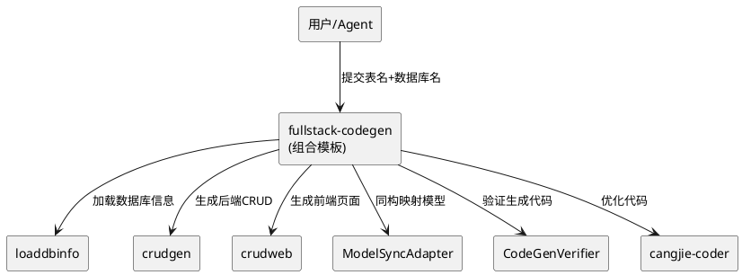

# 全栈代码生成闭环 - 技术设计文档

## 一、需求与存量功能关系分析

### 1.1 已实现功能

| 需求功能 | 存量功能 | 代码位置 | 匹配度 |
|---------|---------|---------|--------|
| 后端CRUD生成 | CrudGenService + TemplateEngine | src/app/tools/crudgen/ | 100% |
| 前端CRUD生成 | WebCrudGenService + TemplateEngine | src/app/tools/crudweb/ | 100% |
| 数据库信息加载 | LoadDbInfoService | src/app/tools/loaddbinfo/ | 100% |
| AutoCreateCode标记 | 模板中已有#region标记 | src/app/tools/crudgen/templates/ | 75% |
| UMI模型同构 | 设计理念已有，实现部分 | docs/uctoo-v4/ | 50% |

### 1.2 需要新增的功能

| 需求功能 | 说明 | 扩展方向 |
|---------|------|---------|
| 全栈闭环流程 | 自动化loaddbinfo→crudgen→crudweb→cangjie-coder | 新增fullstack-codegen组合模板 |
| 前后端模型同构 | 后端PO→前端ORM自动映射 | 新增ModelSyncAdapter |
| 增量代码生成 | 不覆盖自定义代码 | 扩展crudgen模板，增强AutoCreateCode区域处理 |
| 构建验证闭环 | 生成后自动验证 | 复用code-gen-skills的CodeGenVerifier |

## 二、增量设计方案

### 2.1 实现模型



### 2.2 接口设计

**fullstack-codegen COMPOSITION.yaml**：
```yaml
composition:
  name: fullstack-codegen
  description: 全栈代码生成闭环
  steps:
    - name: load-db-info
      skill: loaddbinfo
      input:
        database: ${args.database}
    - name: gen-backend
      skill: crud-generator
      depends_on: [load-db-info]
      input:
        table_name: ${args.table_name}
        database: ${args.database}
        generate_backend: true
        generate_frontend: false
    - name: gen-frontend
      skill: crud-generator
      depends_on: [load-db-info]
      input:
        table_name: ${args.table_name}
        database: ${args.database}
        generate_backend: false
        generate_frontend: true
    - name: sync-models
      skill: model-sync
      depends_on: [gen-backend, gen-frontend]
      input:
        backend_model_path: ${gen-backend.output.files}
        frontend_model_path: ${gen-frontend.output.files}
    - name: verify
      skill: code-gen-verifier
      depends_on: [sync-models]
      input:
        files: ${gen-backend.output.files}
    - name: optimize
      skill: cangjie-coder
      depends_on: [verify]
      input:
        files: ${gen-backend.output.files}
  output:
    backend_files: ${gen-backend.output.files}
    frontend_files: ${gen-frontend.output.files}
```

### 2.3 数据模型

本工程不涉及数据库表变更。核心是组合模板和ModelSyncAdapter的实现。