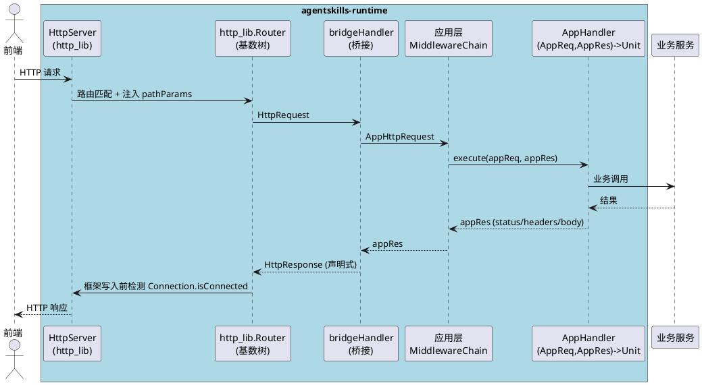

# HTTP 库迁移技术设计（stdx.net.http → http_lib）

> 本文档对应 `spec.md` 需求规格与 `http-lib-vs-stdx-analysis.md` 分析结论，给出 HTTP 层迁移的架构与模块级技术设计。不涉及数据库 schema、业务逻辑重写、前端代码。

---

## 1. 总体架构设计

### 1.1 架构变迁总览

| 维度 | 迁移前（stdx.net.http） | 迁移后（http_lib） |
|------|------------------------|--------------------|
| 服务端入口 | `ServerBuilder().handler(FuncHandler).build()` + 自实现 `DefaultHttpRequestDistributor` | `HttpServer(handler: router.handler(), config: serverConfig).listenAndServeTls(host, port)` |
| Handler 范式 | 命令式副作用 `(HttpContext) -> Unit`，通过 `context.responseBuilder.status().body()` 写响应 | 声明式函数 `(HttpRequest) -> HttpResponse`，框架统一在写入前检测连接可用性 |
| 路由注册 | 自实现 `HttpRequestDistributor.register(path, FuncHandler)`，静态/动态路由手工分发 | http_lib 内置基数树 `Router().get/post/put/delete(path, handler)`，`router.handler()` 自动注入路径参数与 404/405 |
| 中间件链 | 自实现 `magic.app.core.middleware.MiddlewareChain`（命令式 execute） | http_lib 洋葱模型 `Middleware = (Handler) -> Handler`，`router.use(m)`；自实现中间件改写为声明式包装器 |
| TLS | `TlsServerConfig(X509Certificate.decodeFromPem(...), PrivateKey.decodeFromPem(...))` 需读文件解码 | `TlsConfig(serverCertPath:, serverKeyPath:)` 直接传路径，由 JinguiSSL 加载 |
| 连接可观测 | 框架黑盒，仅 WARN 日志 | `HttpServerConfig.connState` 回调 + `errorLog` 回调接入 LoggerFactory |
| WebSocket | `WebSocket.upgradeFromServer(ctx)` 返回 `WebSocket`，`read()/write(frameType, bytes)` | `ConnectionController(conn).upgradeToWebSocket(req)` + `WebSocketConn(conn).readMessage()/writeText()` |
| SSE | 手动设置 Content-Type + 手动 `data: ...\n\n` 拼接 + `HttpResponseWriter.write` | `SSEWriter(resp, conn).sendEvent/sendData/sendComment` |
| HTTP 客户端 | `ClientBuilder().tlsConfig(...).connector(...).build().send(req)` | `HttpClient(config).get/post/send(req)` + `HttpRequestBuilder().get().withUrl().withJson().build()` |

### 1.2 关键架构决策

**决策1：保留应用层 Router/MiddlewareChain 抽象，但内部委托 http_lib Router**
- 现有 `magic.app.core.router.Router` 与 `magic.app.core.middleware.MiddlewareChain` 被 main.cj、AutoRouteRegistry、各 *Route.cj 广泛使用。
- 为最小化变更面，保留这两个类的对外 API（`get/post/put/delete(path, handler)`、`use(m)`、`getRoutes()`、`registerAsGlobal()`），但内部持有一个 `http_lib.router.Router` 实例，注册时同步注册到 http_lib Router；`handler()` 方法返回 http_lib Router 的 `handler()`。
- 自实现 `DefaultHttpRequestDistributor` 类整体移除。

**决策2：应用层 Handler 双签名桥接**
- 现有业务 Handler 签名为 `(AppHttpRequest, AppHttpResponse) -> Unit`（命令式），遍布所有 Controller 与 *Route.cj。一次性全量改造为 `(HttpRequest) -> HttpResponse` 风险极高。
- 在 HTTPServer.cj 中提供**桥接函数** `bridgeHandler(appHandler): (http_lib.HttpRequest) -> http_lib.HttpResponse`：
  1. 将 http_lib `HttpRequest` 转换为应用层 `AppHttpRequest`（method/path/query/headers/body/pathParams）；
  2. 构造应用层 `AppHttpResponse`；
  3. 执行应用层中间件链 + appHandler；
  4. 将应用层 `AppHttpResponse`（status/headers/body）转换为 http_lib `HttpResponse` 声明式返回。
- 路径参数通过 http_lib Router 自动注入到 `req.params`，桥接函数从 `req.params` 读取并填入 `AppHttpRequest.pathParams`，替代当前 `extractPathParams` 手工解析。
- 新增路由（如健康检查）可直接用声明式 `(HttpRequest) -> HttpResponse` 风格，逐步迁移。

**决策3：WebSocket 路由走 http_lib Router + ConnectionController**
- http_lib 的 WebSocket 升级入口在 Handler 内通过 `req.connection` 取底层连接，再 `ConnectionController(conn).upgradeToWebSocket(req)`。
- 因此 WebSocket 路由不再走独立的 `registerWebSocketRoute` 旁路，而是注册到 http_lib Router 的 GET 路由，Handler 内完成升级与消息循环。
- `HTTPServer.registerWebSocketRoute(path, handler)` API 保留，内部改为向 http_lib Router 注册一个声明式 Handler，该 Handler 取 `req.connection`，调用 `ConnectionController.upgradeToWebSocket(req)`，再调用业务侧 `(WebSocketConn) -> Unit` 回调。

**决策4：依赖链全量本地化为 path**
- http_lib 及其 6 个 git 依赖 + quic_cj 的 3 个 git 依赖（去重后共 7 个：kaca_json、jinguissl、jinguissl_core、kaca_cookies、compress4cj、quic_cj、channel_cj）全部克隆至 `apps/agentskills-runtime/libs/` 下，cjpm.toml 改为 path 声明。
- http_lib 与 quic_cj 自身的 cjpm.toml 中对 git 依赖的引用也改为 path 指向本地副本，确保从主项目出发整条依赖链无 git 网络请求。

### 1.3 目标架构时序



---

## 2. 接口映射表（stdx.net.http → http_lib）

### 2.1 服务端 API 映射

| stdx.net.http（当前） | http_lib（目标） | 说明 |
|----------------------|------------------|------|
| `import stdx.net.http.{Server, ServerBuilder, HttpContext, FuncHandler, HttpRequestDistributor, HttpRequestHandler}` | `import http_lib.server.{HttpServer, HttpServerConfig}` + `import http_lib.router.Router` + `import http_lib.message.{HttpRequest, HttpResponse}` | 服务端核心 import 整体替换 |
| `import stdx.net.tls.TlsServerConfig` | `import http_lib.connection.TlsConfig` | TLS 配置类型替换 |
| `import stdx.crypto.x509.{X509Certificate, PrivateKey}` | （移除） | http_lib TlsConfig 直接吃 PEM 路径，无需手动解码 |
| `ServerBuilder().addr(host).port(port).build()` | `HttpServer(handler: router.handler(), config: config)` 然后 `.listenAndServe(host, port)` | 构建与启动分离，handler 在构造时注入 |
| `ServerBuilder().tlsConfig(tlsConfig).build()` | `config.tlsConfig = tlsConfig` 然后 `.listenAndServeTls(host, port)` | TLS 走 config 字段 + listenAndServeTls |
| `builder.readTimeout(d); builder.writeTimeout(d)` | `config.readTimeout = d; config.writeTimeout = d` | 超时改走 HttpServerConfig 字段 |
| （无） | `config.idleTimeout = Duration.second * 60` | 新增 Keep-Alive 空闲超时，默认 60s |
| （无） | `config.connState = { s => logger.info("conn: ${s}") }` | 新增连接状态回调 |
| （无） | `config.errorLog = { msg => logger.error(msg) }` | 新增框架错误回调，捕获 socket 写入错误 |
| `TlsServerConfig(X509Certificate.decodeFromPem(certPem), PrivateKey.decodeFromPem(keyPem))` | `TlsConfig(serverCertPath: certPath, serverKeyPath: keyPath)` | 不再读文件解码，直接传路径 |
| `FuncHandler({ context => ... })` | `{ req => ... }`（直接作为 Handler） | FuncHandler 包装移除，直接用 lambda |
| `context.request` | `req`（Handler 参数） | 请求对象从 context 字段变为 Handler 参数 |
| `context.responseBuilder.status(200).header(k,v).body(s)` | `HttpResponse.json(HttpStatus.OK, s)` 或 `HttpResponse.text(...)` | 命令式链式调用改为声明式构造 |
| `context.request.url.path` | `req.url.path` 或 `req.url` | URL 访问语义保留 |
| `context.request.url.query` | `req.queryParams()` | 查询参数改用 http_lib 解析 API |
| `context.request.headers` | `req.headers`（http_lib.core.HttpHeaders） | headers 类型替换 |
| `context.request.body` / `req.bodySize` / `StringReader(req.body).readToEnd()` | `req.bodyAsString()` | http_lib 提供一次性 body 读取 |
| `context.request.method` | `req.method`（http_lib.core.HttpMethod 枚举） | method 类型从 String 变枚举，比较改 `req.method == HttpMethod.GET` |
| `server.serve()` | `server.listenAndServe(host, port)` / `listenAndServeTls(host, port)` | 启动方法替换 |
| `server.close()` | `server.shutdown(); server.close()` | 优雅关闭新增 shutdown |
| 自实现 `DefaultHttpRequestDistributor.register(path, handler)` | `router.get/post/put/delete(path, handler)` | 路由注册走 http_lib Router |
| 自实现 `extractPathParams(actualPath, routePath, appReq)` | `req.params.get("id")`（http_lib Router 自动注入） | 路径参数不再手工解析 |

### 2.2 WebSocket API 映射

| stdx.net.http（当前） | http_lib（目标） | 说明 |
|----------------------|------------------|------|
| `import stdx.net.http.{HttpContext, WebSocket, WebSocketFrameType, HttpHeaders}` | `import http_lib.server.{ConnectionController, WebSocketConn, WebSocketMessage, WebSocketOpcode}` + `import http_lib.connection.Connection` | WebSocket import 整体替换 |
| `WebSocket.upgradeFromServer(ctx, subProtocols: [...], userFunc: {...})` | `match (req.connection) { case Some(conn) => let h = ConnectionController(conn); h.upgradeToWebSocket(req); let ws = WebSocketConn(conn); ... }` | 升级方式从静态方法改为 ConnectionController 实例方法 |
| `websocket.read()` 返回 frame，`frame.frameType` | `wsConn.readMessage()` 返回 `?WebSocketMessage`，`msg.opcode` | 读取 API 从帧级改为消息级，自动组装分片、自动处理 Ping/Pong |
| `WebSocketFrameType.TextWebFrame` | `WebSocketOpcode.Text` | 帧类型枚举替换 |
| `WebSocketFrameType.BinaryWebFrame` | `WebSocketOpcode.Binary` | 同上 |
| `WebSocketFrameType.CloseWebFrame` | `WebSocketOpcode.Close` | 同上 |
| `WebSocketFrameType.PingWebFrame` | `WebSocketOpcode.Ping`（readMessage 内部自动回复 Pong） | Ping/Pong 由框架自动处理 |
| `String.fromUtf8(frame.payload)` | `msg.text()` | 文本消息解码 |
| `websocket.write(WebSocketFrameType.TextWebFrame, bytes)` | `wsConn.writeText(str)` | 文本发送 |
| `websocket.write(WebSocketFrameType.BinaryWebFrame, bytes)` | `wsConn.writeBinary(bytes)` | 二进制发送 |
| `websocket.write(WebSocketFrameType.CloseWebFrame, payload)` | `wsConn.writeClose(...)` 或直接 `conn.close()` | 关闭帧发送 |
| `websocket.writePongFrame(payload)` | （由 readMessage 内部自动处理） | 应用层无需手动发 Pong |
| `websocket.writeCloseFrame()` | `conn.close()` | 关闭连接 |
| `HttpHeaders()` + `headers.add(k, v)` | `http_lib.core.HttpHeaders` + `headers.set(k, v)` | headers 类型替换（注意 add→set 语义差异，set 覆盖，add 追加） |

### 2.3 SSE API 映射

| stdx.net.http（当前） | http_lib（目标） | 说明 |
|----------------------|------------------|------|
| `httpContext.responseBuilder.header("Content-Type", "text/event-stream")` + `.header("Cache-Control", "no-cache")` + `.header("Connection", "keep-alive")` + `.status(200)` | `SSEWriter(resp, conn)` 构造时自动设置这三个头 | SSE 头由 SSEWriter 构造器自动设置 |
| `HttpResponseWriter(httpContext)` + `writer.write("event: endpoint\\ndata: ...\\n\\n".toArray())` | `sseWriter.sendEvent("endpoint", "/messages/?session_id=${uuid}")` | 手动分帧改为 SSEWriter.sendEvent |
| `writer.write("data: ${msg}\\n\\n".toArray())` | `sseWriter.sendData(msg)` | 纯数据事件 |
| `writer.write(": ping - ...\\n\\n".toArray())` | `sseWriter.sendComment("ping - ...")` | 注释行 |
| （无） | `sseWriter.sendRetry(3000)` | 重连指令（新增能力） |
| （无） | `sseWriter.close()` | 显式关闭 SSE 流 |

### 2.4 HTTP 客户端 API 映射

| stdx.net.http（当前） | http_lib（目标） | 说明 |
|----------------------|------------------|------|
| `import stdx.net.http.*` | `import http_lib.client.{HttpClient, HttpClientConfig, HttpRequestBuilder}` + `import http_lib.message.{HttpRequest, HttpResponse}` | 客户端 import 整体替换 |
| `import stdx.net.tls.{TlsClientConfig, CertificateVerifyMode}` | `import http_lib.connection.TlsConfig` | 客户端 TLS 配置类型替换 |
| `ClientBuilder().readTimeout(d).tlsConfig(c).connector(conn).build()` | `HttpClient(config)` 其中 `config.readTimeout = d; config.tlsConfig = tlsConfig` | 构建器改为 config 字段设置 |
| `TlsClientConfig()` + `config.verifyMode = TrustAll` + `config.domain = host` | `TlsConfig.insecure()` 或 `TlsConfig()` + `tlsConfig.verifyPeer = false; tlsConfig.verifyHost = false` | 信任所有证书改为 insecure 或字段设置 |
| `HttpRequestBuilder().url(url).body(json).post().header(k,v).build()` | `HttpRequestBuilder().post().withUrl(url).withJson(json).withHeader(k,v).build()` | 链式方法名变更：url→withUrl, body→withJson, header→withHeader |
| `client.send(req)` | `client.send(req)` | send 方法名保留 |
| `response.status` (UInt16) | `response.status.code` (UInt16) | status 从 UInt16 变为 HttpStatus 对象，取 .code |
| `response.status != HttpStatusCode.STATUS_OK` | `!response.isSuccess()` | 状态判断改用 isSuccess() |
| `StringReader(response.body).readToEnd()` | `response.bodyAsString()` | body 读取改为 bodyAsString |
| `response.headers` (stdx HttpHeaders) | `response.headers` (http_lib HttpHeaders) | headers 类型替换 |
| `client.close()` | `client.close()` | close 保留 |
| `HttpHeaders()` + `header.add(k, v)` | `http_lib.core.HttpHeaders` + `headers.set(k, v)` | headers 类型替换 |

### 2.5 连接状态枚举映射

| stdx.net.http | http_lib `ConnState` | 说明 |
|---------------|----------------------|------|
| （无） | `STATE_NEW` | 新连接建立 |
| （无） | `STATE_ACTIVE` | 连接正在处理请求 |
| （无） | `STATE_IDLE` | 连接空闲（Keep-Alive） |
| （无） | `STATE_HIJACKED` | 连接被劫持（WebSocket 升级） |
| （无） | `STATE_CLOSED` | 连接关闭 |

---

## 3. 模块设计

### 3.1 HTTPServer.cj 重写

**当前实现**（`src/app/core/server/HTTPServer.cj`）：
- `import stdx.net.http.{Server, ServerBuilder, HttpContext, HttpRequest, HttpResponse, HttpResponseBuilder, FuncHandler, HttpRequestDistributor, HttpRequestHandler}`
- `import stdx.net.tls.TlsServerConfig`
- `import stdx.crypto.x509.{X509Certificate, PrivateKey}`
- 私有类 `DefaultHttpRequestDistributor <: HttpRequestDistributor`：手工管理静态/动态路由，`distribute(path)` 返回 handler，`createNotFoundHandler()` 返回 404 FuncHandler。
- 类 `HTTPServer`：字段 `_server: Any`（ServerBuilder.build() 结果）、`_distributor`、`router`、`middlewareChain`、`port`、`host`、`isHttps`、`_requestTimeout`。
- 4 个构造函数（HTTP/HTTPS × 默认超时/自定义超时），内部均 `ServerBuilder().addr().port().[tlsConfig()].distributor().readTimeout().writeTimeout().build()`。
- `start()` → `setupRoutes()` → 遍历 `router.getRoutes()` 调 `_distributor.register(route.path, createRouteHandler(route))` → `server.serve()`。
- `createRouteHandler(route)`：返回 `FuncHandler({ context => ... })`，内部 `convertRequest(req)` → `extractPathParams` → `middlewareChain.execute` → `context.responseBuilder.status().header().body()`。
- `registerWebSocketRoute(path, handler)`：`_distributor.register(path, FuncHandler({ context => handler(context) }))`。
- `stop()` → `server.close()`。

**目标设计**：
- import 替换为：
  ```cangjie
  import http_lib.server.{HttpServer, HttpServerConfig}
  import http_lib.connection.{TlsConfig, Connection}
  import http_lib.router.{Router as HttpLibRouter, Middleware as HttpLibMiddleware}
  import http_lib.message.{HttpRequest as HttpLibRequest, HttpResponse as HttpLibResponse, HttpMethod as HttpLibMethod}
  import http_lib.core.{HttpStatus, ConnState}
  ```
- **移除** `DefaultHttpRequestDistributor` 类整体。
- **移除** `extractPathParams`、`matchesDynamicRoute`、`createNotFoundHandler` 方法（http_lib Router 内置）。
- 类 `HTTPServer` 字段重构：
  - 移除：`_server: Any`、`_distributor`、`_requestTimeout`（下沉到 config）。
  - 新增：`_httpLibRouter: HttpLibRouter`（http_lib 路由器实例）、`_serverConfig: HttpServerConfig`、`_tlsConfig: ?TlsConfig`、`_httpServer: ?HttpServer`（延迟构造）。
  - 保留：`router`（应用层 Router）、`middlewareChain`（应用层 MiddlewareChain）、`port`、`host`、`isHttps`、`running`、`logger`。
- 构造函数合并为 2 个：
  - `init(port, host, requestTimeout!, idleTimeout!, certPath!, keyPath!)`：统一构造 HttpServerConfig，设置 `readTimeout/writeTimeout/idleTimeout`；若 certPath/keyPath 提供，构造 `TlsConfig(serverCertPath:, serverKeyPath:)` 存入 `_tlsConfig`；配置 `connState` 回调接入 `logger.info`；配置 `errorLog` 回调接入 `logger.error`。
  - 旧 4 个构造函数保留为委托构造，避免 main.cj 调用点全量修改。
- `setRouter(router)`：保留，将应用层 router 同步注册到 `_httpLibRouter`（遍历 `router.getRoutes()`，按 method 调 `_httpLibRouter.get/post/put/delete(path, bridgeHandler(route))`）。
- `use(middleware)`：保留，向 `middlewareChain` 注册；同时将应用层 Middleware 包装为 http_lib `Middleware = (Handler) -> Handler` 注册到 `_httpLibRouter.use(...)`。
- `registerWebSocketRoute(path, handler)`：改为 `_httpLibRouter.get(path, { req => handleWebSocketUpgrade(req, handler) })`，其中 `handleWebSocketUpgrade` 取 `req.connection`，`ConnectionController(conn).upgradeToWebSocket(req)`，构造 `WebSocketConn(conn)`，调用业务 `handler(wsConn)`，返回 `HttpResponse.empty()`。
- `start()`：构造 `_httpServer = HttpServer(handler: _httpLibRouter.handler(), config: _serverConfig)`；若 `_tlsConfig.isSome()` 调 `listenAndServeTls(host, port)`，否则 `listenAndServe(host, port)`。
- `stop()`：`_httpServer.shutdown(); _httpServer.close()`。
- **新增桥接函数** `bridgeHandler(appRoute: Route): (HttpLibRequest) -> HttpLibResponse`：
  1. `convertRequest(req: HttpLibRequest): AppHttpRequest`：method（HttpLibMethod→HttpMethod 枚举）、url.path、`req.queryParams()`→`appReq.queryParams`、`req.params`→`appReq.pathParams`、`req.headers`→`appReq.headers`、`req.bodyAsString()`→`appReq.body`。
  2. 构造 `appRes = AppHttpResponse()`。
  3. try：`middlewareChain.execute(appReq, appRes, { => appRoute.handler(appReq, appRes) })`；将 `appRes` 转为 `HttpLibResponse`：`HttpResponse.text(HttpStatus.fromCode(appRes.getStatusCode()), appRes.getBody())` + 遍历 `appRes.getHeaders()` 调 `.withHeader(k, v)`。
  4. catch：返回 `HttpResponse.json(HttpStatus.INTERNAL_SERVER_ERROR, "{\"error\":\"...\"}")`，`logger.error` 记录异常。
- `convertRequest`、`convertMethod`、`readRequestBody`、`tryDecodeBody`、`lossyDecode` 保留，但 `readRequestBody` 改用 `req.bodyAsString()` 替代 `StringReader(req.body).readToEnd()`；`convertMethod` 输入改为 `HttpLibMethod` 枚举。
- `handleHealth`、`handleInfo`、`handleHello` 改为声明式：`{ req => HttpResponse.json(HttpStatus.OK, "{\"status\":\"ok\"}") }`，直接注册到 `_httpLibRouter`。

**关键代码骨架**：
```cangjie
public func start(): Unit {
    running = true
    setupRoutes()  // 将应用层 router 同步到 _httpLibRouter
    _httpServer = HttpServer(handler: _httpLibRouter.handler(), config: _serverConfig)
    match (_httpServer) {
        case Some(s) =>
            if (isHttps) { s.listenAndServeTls(host, UInt16(port)) }
            else { s.listenAndServe(host, UInt16(port)) }
        case None => handleErrorInStart()
    }
}

private func bridgeHandler(appRoute: Route): (HttpLibRequest) -> HttpLibResponse {
    return { req =>
        let appReq = convertRequest(req)
        let appRes = AppHttpResponse()
        try {
            middlewareChain.execute(appReq, appRes, { => appRoute.handler(appReq, appRes) })
            var resp = HttpResponse.text(HttpStatus.fromCode(UInt16(appRes.getStatusCode())), appRes.getBody())
            for ((k, v) in appRes.getHeaders()) { resp = resp.withHeader(k, v) }
            return resp
        } catch (ex: Exception) {
            logger.error("Error handling request: ${ex.message}")
            return HttpResponse.json(HttpStatus.INTERNAL_SERVER_ERROR, "{\"error\":\"${ex.message}\"}")
        }
    }
}
```

### 3.2 WebMCPController.cj 迁移

**当前实现**（`src/app/controllers/uctoo/webmcp/WebMCPController.cj`）：
- `import stdx.net.http.{HttpContext, WebSocket, WebSocketFrameType, HttpHeaders}`
- `handleConnection(ctx: HttpContext)`：`WebSocket.upgradeFromServer(ctx, subProtocols: [...], userFunc: {...})` → `handleMessageLoop(websocket, sessionId, protocol)`。
- `handleMessageLoop(websocket: WebSocket, ...)`：`frame = websocket.read()`，`match (frame.frameType) { case TextWebFrame => ... case BinaryWebFrame => ... case CloseWebFrame => ... case PingWebFrame => websocket.writePongFrame(...) }`。
- `processMessage(message, websocket, protocol)`：`websocket.write(WebSocketFrameType.TextWebFrame, bytes)`。

**目标设计**：
- import 替换为：
  ```cangjie
  import http_lib.server.{ConnectionController, WebSocketConn, WebSocketMessage, WebSocketOpcode}
  import http_lib.connection.Connection
  import http_lib.message.{HttpRequest, HttpResponse}
  import http_lib.core.HttpHeaders
  ```
- `handleConnection(ctx: HttpContext)` 改为声明式 `handleConnection(req: HttpRequest): HttpResponse`：
  - `match (req.connection) { case Some(conn) => ... case None => return HttpResponse.text(HttpStatus.INTERNAL_SERVER_ERROR, "takeover not supported") }`。
  - `let controller = ConnectionController(conn)`，`controller.upgradeToWebSocket(req)`（subProtocols 协商：http_lib upgradeToWebSocket 当前不直接支持 subProtocols 参数，需在升级后手动写入 `Sec-WebSocket-Protocol` 头或使用 `upgradeToWebSocket(secWebSocketKey)` 重载并手动构造 101 响应头——**风险点见 §4.2**）。
  - `let wsConn = WebSocketConn(conn)`。
  - 创建 protocol、sessionId，`handleMessageLoop(wsConn, sessionId, protocol)`。
  - 返回 `HttpResponse.empty()`（劫持后框架丢弃此响应）。
- `handleMessageLoop(websocket: WebSocket, ...)` 改为 `handleMessageLoop(wsConn: WebSocketConn, ...)`：
  - `while (true) { match (wsConn.readMessage()) { case Some(msg) => ... case None => break } }`。
  - `msg.isText()` → `msg.text()` 替代 `String.fromUtf8(frame.payload)`。
  - `msg.isBinary()` → `wsConn.writeText("{\"error\": ...}")`。
  - `msg.isClose()` → `conn.close(); break`。
  - Ping/Pong 由 `readMessage` 内部自动处理，移除 `case PingWebFrame` 分支。
- `processMessage(message, wsConn, protocol)`：`wsConn.writeText(responseStr)` 替代 `websocket.write(WebSocketFrameType.TextWebFrame, bytes)`。
- `_extractUserIdFromContext(ctx)` 改为 `_extractUserId(req: HttpRequest)`，从 `req.headers.get("x-user-id")` 读取。
- `handleConnection(req: HttpRequest, res: HttpResponse)` 与 `handleStreamableHttp(req, res)` 保持应用层签名不变（由桥接函数适配）。

### 3.3 WsChatController.cj 迁移

**当前实现**（`src/app/controllers/uctoo/ws/WsChatController.cj`）：
- `import stdx.net.http.{HttpContext, WebSocket, WebSocketFrameType, HttpHeaders}`
- `handleChat(ctx: HttpContext)` → `handleWebSocket(ctx)` → `WebSocket.upgradeFromServer(ctx, subProtocols: [...], userFunc: {...})` → `WebSocketSession(sessionId, websocket)` → `_messageLoop(session)`。
- `_messageLoop(session)`：`frame = session.websocket.read()`，`match (frame.frameType) { TextWebFrame/BinaryWebFrame/CloseWebFrame/PingWebFrame }`。
- `session.sendMessage(message)`（在 ws_models.cj）：`websocket.write(WebSocketFrameType.TextWebFrame, bytes)`。

**目标设计**：
- import 替换同 §3.2。
- `handleChat(ctx: HttpContext)` 改为声明式 `handleChat(req: HttpRequest): HttpResponse`：
  - 取 `req.connection`，`ConnectionController(conn).upgradeToWebSocket(req)`，`WebSocketConn(conn)`。
  - 构造 `WebSocketSession(sessionId, wsConn)`（ws_models.cj 同步改造，见 §3.4）。
  - 注册到 `WebSocketSessionManager`，`_sendWelcomeMessage`，`_messageLoop`，清理。
  - 返回 `HttpResponse.empty()`。
- `_messageLoop(session)`：
  - `match (session.wsConn.readMessage()) { case Some(msg) => if (msg.isText()) _handleTextMessage(session, msg.text()) else if (msg.isBinary()) _handleBinaryMessage(session, msg.data) else if (msg.isClose()) { session.close(); break } case None => break }`。
  - 移除 PingWebFrame 分支。
- `_handleBinaryMessage(session, payload: Array<UInt8>)`：保留，payload 来源改为 `msg.data`。

### 3.4 ws_models.cj 迁移

**当前实现**（`src/app/services/ws_support/ws_models.cj`）：
- `import stdx.net.http.{WebSocket, WebSocketFrameType}`
- `class WebSocketSession { let websocket: WebSocket; sendMessage(message) { websocket.write(WebSocketFrameType.TextWebFrame, bytes) } close() { websocket.writeCloseFrame() } }`。

**目标设计**：
- import 替换为 `import http_lib.server.{WebSocketConn, WebSocketOpcode}`。
- `class WebSocketSession` 字段 `websocket: WebSocket` 改为 `wsConn: WebSocketConn`。
- `sendMessage(message)`：`wsConn.writeText(jsonStr)` 替代 `websocket.write(WebSocketFrameType.TextWebFrame, bytes)`。
- `close()`：`wsConn.close()` 或 `conn.close()`（WebSocketConn 提供 close 方法或通过持有 Connection 调用）。
- `WebSocketMessage` 类保留（应用层消息模型，与 http_lib `WebSocketMessage` 不同名以避免冲突，或重命名为 `AppWebSocketMessage`）。

### 3.5 sse_mcp_server.cj 迁移

**当前实现**（`src/mcp/sse_mcp_server.cj`）：
- `import stdx.net.http.*`
- `extend HttpContext { func startSSE() { responseBuilder.header("Content-Type", "text/event-stream")... } }`
- `SseMCPServer <: AbsMCPServer`：`client_map = ConcurrentHashMap<String, HttpResponseWriter>()`。
- `start(host, port)`：`ServerBuilder().addr(host).port(port).build()` → `FuncHandler({ httpContext => httpContext.startSSE(); let writer = HttpResponseWriter(httpContext); writer.write("event: endpoint\\ndata: ...\\n\\n".toArray()); while (true) { sleep(...); writer.write(": ping...\\n\\n".toArray()) } })` → `http_server.distributor.register("/sse", sseHandler)` → `http_server.serve()`。
- `send(msg, uuid)`：`client_map.get(uuid).getOrThrow().write("event: message\\ndata: ${msg}\\n\\n".toArray())`。

**目标设计**：
- import 替换为：
  ```cangjie
  import http_lib.server.{HttpServer, HttpServerConfig, SSEWriter}
  import http_lib.router.Router
  import http_lib.message.{HttpRequest, HttpResponse}
  import http_lib.connection.Connection
  import http_lib.core.HttpStatus
  ```
- 移除 `extend HttpContext { startSSE() }`（SSEWriter 构造器自动设置头）。
- `client_map` 类型改为 `ConcurrentHashMap<String, SSEWriter>`（或保留 `(SSEWriter, Connection)` 二元组以便检测连接可用性）。
- `start(host, port)`：
  - `let router = Router()`。
  - SSE 路由 `router.get("/sse", { req => handleSseHandshake(req) })`，`handleSseHandshake` 取 `req.connection`，构造 `HttpResponse.empty()` + `SSEWriter(resp, conn)`，`sseWriter.sendEvent("endpoint", "/messages/?session_id=${uuid}")`，存入 `client_map`，`while (true) { sleep(...); sseWriter.sendComment("ping - ...") }`，返回 `resp`。
  - messages 路由 `router.post("/messages/", { req => handleMessages(req) })`，`handleMessages` 从 `req.queryParams()["session_id"]` 取 uuid，`req.bodyAsString()` 取 msg，`spawn { this.loop(msg, uuid) }`，返回 `HttpResponse.text(HttpStatus.ACCEPTED, "Accepted")`。
  - `let config = HttpServerConfig()`，`HttpServer(handler: router.handler(), config: config).listenAndServe(host, port)`。
- `send(msg, uuid)`：`client_map.get(uuid).getOrThrow().sendEvent("message", msg)`。
- `send<T>(response, uuid)`：`this.send(response.toJsonValue().toString(), uuid)`。

### 3.6 http_cj.cj 迁移

**当前实现**（`src/utils/http/http_cj.cj`）：
- `import stdx.net.tls.{TlsClientConfig, CertificateVerifyMode}`
- `import stdx.net.http.*`
- `buildHttpClient(url, verify)`：`ClientBuilder().readTimeout(...).tlsConfig(...).connector(TcpSocketConnector).build()`。
- `prepareHttpRequest(method, url, header, body)`：`HttpRequestBuilder().url(url).body(json).post().header(k,v).build()`。
- `sendHttp(...)`：`client.send(req)`，`response.status != HttpStatusCode.STATUS_OK`，`readHttpBody(response) = StringReader(response.body).readToEnd()`。
- `HttpUtilsImpl`（`@When[ohos != "true" && http != "curl"]`）：`send/asyncSend/hybridSend`，`processStream` 通过 `response.body.read(buffer)` 流式读取。

**目标设计**：
- import 替换为：
  ```cangjie
  import http_lib.client.{HttpClient, HttpClientConfig, HttpRequestBuilder}
  import http_lib.message.{HttpRequest, HttpResponse, HttpMethod}
  import http_lib.connection.TlsConfig
  import http_lib.core.HttpStatus
  ```
- `buildHttpClient(url, verify)` 改为 `buildHttpClientConfig(url, verify): HttpClientConfig`：
  - `let config = HttpClientConfig()`，`config.readTimeout = Duration.minute * 10`，`config.writeTimeout = ...`，`config.connectTimeout = ...`。
  - 若 `url.startsWith("https")`：`let tlsConfig = if (verify) TlsConfig() else TlsConfig.insecure()`，`config.tlsConfig = tlsConfig`。
  - 返回 config。
  - **移除** `TcpSocketConnector` 自定义连接器（http_lib HttpClientConfig 提供 `dialer` 字段，若需自定义超时可通过 dialer 注入，但默认超时配置已足够，优先用默认）。
- `prepareHttpRequest(method, url, header, body)`：
  - `let builder = HttpRequestBuilder().withUrl(url)`。
  - 若 `body.isSome()`：`builder.withJson(b.toJsonString())`。
  - method 匹配：`"POST" => builder.post()`、`"GET" => builder.get()`、`"PUT" => builder.put()`、`"DELETE" => builder.delete()`、`"PATCH" => builder.patch()`。
  - `for ((k,v) in header) builder.withHeader(k, v)`。
  - `return builder.build()`。
- `sendHttp(...)`：
  - `let client = HttpClient(buildHttpClientConfig(url, verify))`。
  - `let req = prepareHttpRequest(method, url, header, body)`。
  - `let response = client.send(req)`。
  - `if (!response.isSuccess() && response.status.code != 202u16)`：`readHttpBody(response)`，抛 `HttpException`。
  - 返回 `(client, response)`。
- `readHttpBody(resp)`：`return resp.bodyAsString()`。
- `processStream(client, response, httpStream)`：用 `response.readBody(buffer)` 或 `response.readLine()` 流式读取（http_lib HttpResponse 支持流式读取 API）。
- `hybridSend` 中 `resp.headers.get("Content-Type")` 语义不变（http_lib headers.get 返回 `?String`）。
- `HttpResult` 类的 `header: HttpHeaders` 字段类型从 stdx `HttpHeaders` 改为 http_lib `HttpHeaders`（见 §3.8）。

### 3.7 http_curl.cj 迁移

**当前实现**（`src/utils/http/http_curl.cj`）：
- `import stdx.net.http.HttpHeaders`
- `parseCurlVerboseOutput(subProcess)`：返回 `(Int64, HttpHeaders)`，`let header = HttpHeaders()`，`header.add(k, v)`。
- 该文件通过 curl 子进程执行 HTTP 请求，仅在 `@When[ohos != "true" && http == "curl"]` 时编译。

**目标设计**：
- import 替换为 `import http_lib.core.HttpHeaders`。
- `parseCurlVerboseOutput` 返回类型改为 `(Int64, http_lib.core.HttpHeaders)`。
- `let header = HttpHeaders()`，`header.add(k, v)`（http_lib HttpHeaders 同时支持 add 与 set，add 追加多值，语义与 stdx 一致）。
- 其余 curl 子进程逻辑不变（curl 路径不依赖 stdx.net.http 的 Client/Server，仅用 HttpHeaders 类型）。

### 3.8 http_utils.cj 迁移

**当前实现**（`src/utils/http/http_utils.cj`）：
- `import stdx.net.http.HttpHeaders`
- `class HttpException <: Exception`。
- `enum HttpResultOption { Json(String) | Stream(HttpStream) }`。
- `class HttpResult { let header: HttpHeaders; ... }`，3 个构造函数接受 `Array<(String,String)>`、`HashMap<String,String>`、`HttpHeaders`。
- `struct HttpUtils { static func get/post/asyncGet/asyncPost/hybridPost/sseConnect }`。

**目标设计**：
- import 替换为 `import http_lib.core.HttpHeaders`。
- `HttpResult.header` 类型改为 `http_lib.core.HttpHeaders`。
- 3 个构造函数中 `this.header = HttpHeaders()` + `for ((k,v) in header) this.header.add(k, v)` 逻辑保留（http_lib HttpHeaders 构造与 add 语义兼容）。
- `HttpException`、`HttpResultOption`、`HttpUtils` 对外 API 不变。
- `sseConnect` 内部调用 `HttpUtils.asyncGet` 不变。

### 3.9 AIController.cj 迁移

**当前实现**（`src/app/controllers/uctoo/ai/AIController.cj`）：
- `import stdx.net.http.HttpHeaders`（第 16 行）。
- 经检查，该 import 实际未在 Controller 逻辑中使用（AIController 通过应用层 `HttpRequest/HttpResponse` 处理，HttpHeaders 仅作为类型 import 残留）。

**目标设计**：
- 移除 `import stdx.net.http.HttpHeaders`。
- 若编译发现实际有 HttpHeaders 类型引用，改为 `import http_lib.core.HttpHeaders`。
- 其余逻辑不变（AIController 走应用层 HttpRequest/HttpResponse，由桥接函数适配）。

### 3.10 main.cj 迁移

**当前实现**（`src/app/main.cj`）：
- `Application.init(port, host, requestTimeout)`：`server = HTTPServer(port, host, requestTimeout)` → `setupMiddlewares()` → `setupRoutes()` → `server.setRouter(router)`。
- `Application.init(port, host, certPath, keyPath, requestTimeout)`：`server = HTTPServer(port, host, certPath, keyPath, requestTimeout)`。
- `setupMiddlewares()`：`server.use(corsMiddleware)`、`server.use(deserializeUserMiddleware)`、`server.use(requirePermissionMiddleware)`、`server.use(rowLevelPermissionMiddleware)`、`server.use(operateLogMiddleware)`。
- `setupRoutes()`：`AutoRouteRegistry(router).registerAllRoutes()`、各 *Routes.register()、`server.registerWebSocketRoute("/api/v1/uctoo/ws/chat", wsChatController.handleChat)`、`router.get("/api/v1/health", { req, res => ... })`、`server.setRouter(router)`。
- `start()`：`server.start()`。

**目标设计**：
- `Application.init` 构造函数调用点不变（HTTPServer 构造函数签名保留）。
- `setupMiddlewares()` 不变（`server.use(middleware)` API 保留，内部改为 http_lib Middleware 包装）。
- `setupRoutes()`：
  - `AutoRouteRegistry`、各 *Routes.register() 不变（应用层 Router API 保留）。
  - `server.registerWebSocketRoute("/api/v1/uctoo/ws/chat", wsChatController.handleChat)`：`handleChat` 签名从 `(HttpContext) -> Unit` 改为 `(WebSocketConn) -> Unit` 或 `(HttpRequest) -> HttpResponse`（取决于 §3.3 设计），`registerWebSocketRoute` 内部适配。
  - `router.get("/api/v1/health", { req, res => ... })`：应用层 Router 保留 `(AppHttpRequest, AppHttpResponse) -> Unit` 签名，由桥接函数适配为 http_lib 声明式 Handler。
- `start()`：`server.start()` 不变（内部改为 `listenAndServe/listenAndServeTls`）。
- `stop()`：`server.stop()` 不变（内部改为 `shutdown + close`）。
- **main.cj 顶层 main() 函数**中读取配置、初始化 ORM、创建 Application 的逻辑不变。

### 3.11 cjpm.toml 迁移

**当前实现**（`apps/agentskills-runtime/cjpm.toml`）：
- `[dependencies]` 中无 stdx.net.http 显式声明（通过 stdx 间接引入），无 http_lib 声明。
- `[target.*.bin-dependencies]` 各平台配置了 stdx 动态库 path-option。

**目标设计**：
- `[dependencies]` 新增 8 个 path 依赖：
  ```toml
  http_lib = { path = "./libs/http_lib" }
  quic_cj = { path = "./libs/quic_cj" }
  kaca_json = { path = "./libs/kaca_json" }
  jinguissl = { path = "./libs/jinguissl" }
  jinguissl_core = { path = "./libs/jinguissl_core" }
  kaca_cookies = { path = "./libs/kaca_cookies" }
  compress4cj = { path = "./libs/compress4cj" }
  channel_cj = { path = "./libs/channel_cj" }
  ```
- **保留** 所有 `[target.*.bin-dependencies]` 的 stdx 动态库 path-option（独立库 activemq4cj/cj_mail/cos-sdk/hyperion 仍依赖 stdx）。
- **不移除** 任何现有依赖（fountain 各模块、charset4cj、jwt4cj、logcj、pgsql、blowfish、json4cj、cos、cj_mail、activemq4cj、hyperion 均保留）。
- `compile-option` 中 `--cfg \"faiss=disable,sqlite=disable,llamacpp=disable,http=cj\"` 保留（`http=cj` 标识使用仓颉 HTTP 实现，迁移后语义仍成立）。
- **同步修改** `libs/http_lib/cjpm.toml` 与 `libs/quic_cj/cjpm.toml`：将其中 6 个 git 依赖改为 path 指向本地副本（`kaca_json = { path = "../kaca_json" }` 等）。

**libs/http_lib/cjpm.toml 目标**：
```toml
[dependencies]
  kaca_json = { path = "../kaca_json", output-type = "static" }
  jinguissl = { path = "../jinguissl", output-type = "static" }
  jinguissl_core = { path = "../jinguissl_core", output-type = "static" }
  kaca_cookies = { path = "../kaca_cookies", output-type = "static" }
  compress4cj = { path = "../compress4cj", output-type = "static" }
  quic_cj = { path = "../quic_cj", output-type = "static" }
```

**libs/quic_cj/cjpm.toml 目标**：
```toml
[dependencies]
  jinguissl = { path = "../jinguissl", output-type = "static" }
  jinguissl_core = { path = "../jinguissl_core", output-type = "static" }
  channel_cj = { path = "../channel_cj", output-type = "static" }
```

### 3.12 http_lib 依赖链本地化

**操作清单**：
1. `libs/http_lib` → 已存在（cjc 1.1.3，向下兼容 1.0.5）。
2. `libs/quic_cj` → 已存在（cjc 1.0.5）。
3. 克隆 6 个 git 依赖至 `libs/`：
   - `git clone https://gitcode.com/changeden/kaca_json.git -b optz libs/kaca_json`
   - `git clone https://gitcode.com/changeden/jinguiSSL.git -b optz libs/jinguissl`
   - `git clone https://gitcode.com/CjKu/JinguiCore.git libs/jinguissl_core`
   - `git clone https://gitcode.com/cangjie_no_1/kaca_cookies.git libs/kaca_cookies`
   - `git clone https://gitcode.com/changeden/compress4cj.git libs/compress4cj`
   - `git clone https://gitcode.com/changeden/channel_cj.git libs/channel_cj`
4. 修改 `libs/http_lib/cjpm.toml` 与 `libs/quic_cj/cjpm.toml`（见 §3.11）。
5. 验证各本地副本的 `cjc-version` 兼容 1.0.5（若某依赖 cjc-version 为 1.1.x，需确认其向下兼容；若不兼容，需人工评估降级或升级）。

### 3.13 静态文件服务模块（runtime 0.0.26 新增）

> 本模块为 runtime 0.0.26 新增功能，基于 http_lib 实现静态文件服务，参考 uctoo v3 的 `live-directory` npm 包。详细架构分析见 `docs/uctoo-v4/static-file-service-architecture.md`。

**需求基线**：spec.md §5.8（REQ-SFS-01 ~ REQ-SFS-07）

#### 3.13.1 模块总体设计

**新增文件**：
- `src/app/core/server/StaticFileHandler.cj`：静态文件请求处理器
- `src/app/core/server/MimeTypeResolver.cj`：MIME 类型解析器
- `src/app/core/server/StaticFileConfig.cj`：静态文件服务配置类

**修改文件**：
- `src/app/core/server/HTTPServer.cj`：在 `start()` 方法中注册静态文件路由
- `src/app/main.cj`：读取 `STATIC_FILE_ROOT` 配置并注入 HTTPServer

**与 http_lib 的集成方式**：
- 静态文件路由作为 http_lib Router 的兜底路由注册，优先级低于所有 API 路由
- 使用 http_lib 的声明式 Handler 签名 `(HttpRequest) -> HttpResponse`
- 利用 http_lib 的 `compress4cj` 依赖（已在 libs/ 中本地化）实现 Gzip/Brotli 压缩

#### 3.13.2 StaticFileConfig 配置类

```cangjie
public class StaticFileConfig {
    // 静态文件根目录（从 .env STATIC_FILE_ROOT 读取，默认 ./public）
    public var root: String = "./public"
    // 路由前缀（默认 /，即所有非 API 请求）
    public var urlPrefix: String = "/"
    // 是否启用 SPA History Fallback
    public var enableSpaFallback: Bool = true
    // 缓存控制 max-age（秒）
    public var cacheMaxAge: Int64 = 3600
    // 是否启用压缩
    public var compressionEnabled: Bool = true
    // 最小压缩阈值（字节）
    public var compressionMinSize: Int64 = 1024
    // 压缩级别（1-9）
    public var compressionLevel: Int32 = 6
    // 允许的文件扩展名白名单
    public var allowedExtensions: HashSet<String> = [
        "css", "js", "json", "html", "htm",
        "png", "jpg", "jpeg", "gif", "svg", "ico", "webp",
        "woff", "woff2", "ttf", "eot",
        "xml", "txt", "pdf", "map"
    ]

    public func loadFromEnv() {
        root = Env.get("STATIC_FILE_ROOT") ?? "./public"
        urlPrefix = Env.get("STATIC_FILE_URL_PREFIX") ?? "/"
        cacheMaxAge = Env.get("STATIC_FILE_CACHE_MAX_AGE")?.toInt64() ?? 3600
        compressionEnabled = Env.get("STATIC_FILE_COMPRESSION_ENABLED")?.toBool() ?? true
        compressionMinSize = Env.get("STATIC_FILE_COMPRESSION_MIN_SIZE")?.toInt64() ?? 1024
        compressionLevel = Env.get("STATIC_FILE_COMPRESSION_LEVEL")?.toInt32() ?? 6
    }
}
```

#### 3.13.3 MimeTypeResolver MIME 类型解析器

```cangjie
public class MimeTypeResolver {
    private let mimeMap: HashMap<String, String> = HashMap<String, String>() {
        // 文本类型
        put("css", "text/css")
        put("js", "application/javascript")
        put("json", "application/json")
        put("html", "text/html; charset=utf-8")
        put("htm", "text/html; charset=utf-8")
        put("xml", "application/xml")
        put("txt", "text/plain; charset=utf-8")
        // 图片类型
        put("png", "image/png")
        put("jpg", "image/jpeg")
        put("jpeg", "image/jpeg")
        put("gif", "image/gif")
        put("svg", "image/svg+xml")
        put("ico", "image/x-icon")
        put("webp", "image/webp")
        // 字体类型
        put("woff", "font/woff")
        put("woff2", "font/woff2")
        put("ttf", "font/ttf")
        put("eot", "application/vnd.ms-fontobject")
        // 其他
        put("pdf", "application/pdf")
        put("map", "application/json")
    }

    public func resolve(extension: String): String {
        return mimeMap.get(extension) ?? "application/octet-stream"
    }

    public func isCompressible(mimeType: String): Bool {
        return mimeType.startsWith("text/") ||
               mimeType.startsWith("application/javascript") ||
               mimeType.startsWith("application/json") ||
               mimeType.startsWith("application/xml") ||
               mimeType.startsWith("image/svg+xml")
    }
}
```

#### 3.13.4 StaticFileHandler 静态文件处理器

**核心逻辑**：

```cangjie
public class StaticFileHandler {
    private let config: StaticFileConfig
    private let mimeResolver: MimeTypeResolver
    private let logger: Logger

    public func handle(req: HttpRequest): HttpResponse {
        // 1. 安全检查：路径遍历防护
        let requestPath = req.url.path
        if (!validatePath(requestPath)) {
            return HttpResponse.text(HttpStatus.FORBIDDEN, "Forbidden")
        }

        // 2. 隐藏文件过滤
        if (requestPath.contains("/.")) {
            return HttpResponse.text(HttpStatus.NOT_FOUND, "Not Found")
        }

        // 3. 构建文件路径
        let filePath = buildFilePath(requestPath)
        let file = File(filePath)

        // 4. 文件存在性检查
        if (file.exists() && file.isFile()) {
            return serveFile(req, file)
        }

        // 5. SPA History Fallback
        if (config.enableSpaFallback && isSpaFallbackCandidate(requestPath, req)) {
            let indexPath = buildFilePath("/index.html")
            let indexFile = File(indexPath)
            if (indexFile.exists()) {
                return serveFile(req, indexFile)
            }
        }

        // 6. 文件不存在
        return HttpResponse.text(HttpStatus.NOT_FOUND, "Not Found")
    }

    private func serveFile(req: HttpRequest, file: File): HttpResponse {
        let extension = file.extension()
        let mimeType = mimeResolver.resolve(extension)

        // 扩展名白名单检查
        if (!config.allowedExtensions.contains(extension)) {
            return HttpResponse.text(HttpStatus.FORBIDDEN, "Forbidden")
        }

        // 读取文件内容
        let content = file.readToEnd()
        let fileSize = content.size
        let lastModified = file.lastModifiedTime()

        // ETag 生成（基于文件内容哈希）
        let etag = computeEtag(content)

        // 条件请求检查（If-None-Match / If-Modified-Since）
        if (isNotModified(req, etag, lastModified)) {
            return HttpResponse.status(HttpStatus.NOT_MODIFIED)
        }

        // 范围请求处理
        if (let range = parseRangeHeader(req)) {
            return servePartialContent(content, range, fileSize, mimeType, etag, lastModified)
        }

        // 构建完整响应
        var resp = HttpResponse.bytes(HttpStatus.OK, content)
        resp = resp.withHeader("Content-Type", mimeType)
        resp = resp.withHeader("ETag", etag)
        resp = resp.withHeader("Last-Modified", formatHttpDate(lastModified))
        resp = resp.withHeader("Cache-Control", "public, max-age=${config.cacheMaxAge}")
        resp = resp.withHeader("X-Content-Type-Options", "nosniff")
        resp = resp.withHeader("Accept-Ranges", "bytes")

        // 压缩处理
        if (config.compressionEnabled && fileSize >= config.compressionMinSize &&
            mimeResolver.isCompressible(mimeType)) {
            let acceptEncoding = req.headers.get("Accept-Encoding") ?? ""
            if (acceptEncoding.contains("br")) {
                let compressed = brotliCompress(content, config.compressionLevel)
                resp = HttpResponse.bytes(HttpStatus.OK, compressed)
                    .withHeader("Content-Encoding", "br")
                // ... 重新设置其他头
            } else if (acceptEncoding.contains("gzip")) {
                let compressed = gzipCompress(content, config.compressionLevel)
                resp = HttpResponse.bytes(HttpStatus.OK, compressed)
                    .withHeader("Content-Encoding", "gzip")
                // ... 重新设置其他头
            }
        }

        return resp
    }

    // 路径遍历防护
    private func validatePath(path: String): Bool {
        let normalized = normalizePath(path)
        return !normalized.contains("..")
    }

    // SPA Fallback 判断：路径不以文件扩展名结尾
    private func isSpaFallbackCandidate(path: String, req: HttpRequest): Bool {
        return req.method == HttpMethod.GET &&
               !path.substringAfterLast("/").contains(".")
    }
}
```

#### 3.13.5 HTTPServer.cj 集成

在 `HTTPServer.start()` 方法中，`setupRoutes()` 之后注册静态文件路由：

```cangjie
public func start(): Unit {
    running = true
    setupRoutes()  // 将应用层 router 同步到 _httpLibRouter

    // 注册静态文件路由（兜底路由，优先级最低）
    if (staticFileConfig != None) {
        let sfsConfig = staticFileConfig.getOrThrow()
        let rootDir = resolvePath(sfsConfig.root)
        if (Directory(rootDir).exists()) {
            let handler = StaticFileHandler(sfsConfig)
            // 注册兜底路由：所有 GET 请求最后尝试匹配静态文件
            _httpLibRouter.get("/*", { req => handler.handle(req) })
            logger.info("Static file service enabled, root: ${rootDir}")
        } else {
            logger.warn("Static file root directory not found: ${rootDir}, static file service disabled")
        }
    }

    _httpServer = HttpServer(handler: _httpLibRouter.handler(), config: _serverConfig)
    // ... 启动监听
}
```

**路由优先级**：
1. API 路由（`/api/v1/*`）— 最先注册，最高优先级
2. WebSocket 路由 — 第二优先级
3. 健康检查路由 — 第三优先级
4. 静态文件兜底路由（`/*`）— 最后注册，最低优先级

#### 3.13.6 main.cj 集成

在 `Application.init` 中读取 `STATIC_FILE_ROOT` 配置：

```cangjie
// 读取静态文件服务配置
let staticFileRoot = Env.get("STATIC_FILE_ROOT")
if (staticFileRoot != None && staticFileRoot.getOrThrow() != "") {
    let sfsConfig = StaticFileConfig()
    sfsConfig.loadFromEnv()
    server.setStaticFileConfig(sfsConfig)
}
```

#### 3.13.7 compress4cj 压缩集成

`compress4cj` 已在 `libs/compress4cj` 中本地化（Phase 0），StaticFileHandler 直接使用其 Gzip/Brotli 压缩能力：

```cangjie
import compress4cj.gzip.GzipCompressor
import compress4cj.brotli.BrotliCompressor

private func gzipCompress(data: Array<UInt8>, level: Int32): Array<UInt8> {
    return GzipCompressor.compress(data, level)
}

private func brotliCompress(data: Array<UInt8>, level: Int32): Array<UInt8> {
    return BrotliCompressor.compress(data, level)
}
```

> **风险点**：compress4cj 的 Brotli 实现可能不完整或性能不足。缓解措施：优先使用 Gzip（兼容性好），Brotli 作为可选增强；若 compress4cj Brotli 不可用，仅启用 Gzip。

---

## 4. 风险与缓解

### 4.1 依赖链本地化风险

| 风险 | 影响 | 缓解措施 |
|------|------|----------|
| gitcode.com 仓库不可达 | 克隆失败，阻塞 Phase 0 | 配置代理或更换镜像源；人工在可联网环境克隆后拷贝至 libs/ |
| 本地依赖 cjc-version 与主项目 1.0.5 不兼容 | 编译报版本冲突 | 逐个验证依赖 cjc-version；http_lib 1.1.3 已声明向下兼容 1.0.5；其余依赖若不兼容，人工评估降级 tag |
| path 依赖目录缺少 cjpm.toml | cjpm 依赖解析报错 | 克隆后检查每个子目录是否含 cjpm.toml；若为 monorepo 子目录，调整 path 指向 |
| 依赖间循环引用 | cjpm 解析失败 | http_lib 与 quic_cj 共享 jinguissl/jinguissl_core，path 指向同一本地副本，避免重复克隆 |

### 4.2 API 不兼容风险

| 风险 | 影响 | 缓解措施 |
|------|------|----------|
| http_lib `upgradeToWebSocket` 不直接支持 `subProtocols` 参数 | WebMCPController/WsChatController 的 subProtocols 协商（`model-context-protocol`、`skill-chat`）失效 | 方案A：使用 `upgradeToWebSocket(secWebSocketKey)` 重载，手动构造 101 响应头时追加 `Sec-WebSocket-Protocol: <selected>` 行；方案B：升级后在 WebSocketConn 首帧前手动写入协议头；优先方案A，封装为 `upgradeToWebSocketWithSubProtocols(req, subProtocols)` 工具函数 |
| http_lib `WebSocketConn.readMessage` 自动处理 Ping/Pong，应用层无法自定义 Ping 处理 | 当前 WsChatController/WebMCPController 的 `case PingWebFrame => writePongFrame` 逻辑被移除 | 框架自动回复 Pong 符合 RFC 6455，应用层移除 Ping 分支即可；若需保活自定义，通过 `conn.write` 手动发 Ping |
| http_lib `HttpHeaders.add` 与 stdx `HttpHeaders.add` 语义差异 | 多值头（如 Set-Cookie）处理行为变化 | http_lib HttpHeaders 同时提供 `set`（覆盖）与 `add`（追加），迁移时按语义选择；现有代码多用单值头，影响小 |
| http_lib `HttpResponse` 构造为不可变对象，链式 `.withHeader` 返回新对象 | 现有命令式 `responseBuilder.header().body()` 风格不适用 | 桥接函数中用 `var resp = HttpResponse.text(...); resp = resp.withHeader(k, v)` 累积；或用 `http_lib.server.ResponseBuilder` 构建器模式 |
| http_lib `req.method` 为枚举 `HttpMethod` 而非 String | `convertMethod` 比较逻辑变更 | 桥接函数中 `match (req.method) { case HttpMethod.GET => HttpMethod.GET ... }` |
| http_lib `req.bodyAsString()` 一次性读取，不支持流式 body | 大 body（>10MB）内存压力 | 当前已有 `maxBodySize = 10MB` 限制；http_lib HttpServerConfig 提供 `maxBodySize` 字段，配置一致；超大 body 场景用 `req.bodyAsBytes()` 或流式 API |
| http_lib `SSEWriter` 构造需 `Connection`，但声明式 Handler 签名只返回 `HttpResponse` | SSE Handler 无法在 `(HttpRequest) -> HttpResponse` 签名内获取 Connection | 使用 `wrapResponseBuilderHandler` 或在 Handler 内通过 `req.connection` 取连接，构造 SSEWriter 写入后返回 `HttpResponse.empty()`；sse_mcp_server 的 SSE 路由走此模式 |
| stdx `HttpResponseWriter` 与 http_lib `SSEWriter` 生命周期差异 | sse_mcp_server 的 `client_map` 长期持有 writer，跨请求写入 | http_lib SSEWriter 持有 `(HttpResponse, Connection)`，长期持有 Connection 即可；连接断开时 `conn.write` 抛异常，捕获后清理 `client_map` |

### 4.3 性能回归风险

| 风险 | 影响 | 缓解措施 |
|------|------|----------|
| http_lib 纯仓颉实现，TLS 握手性能可能低于 stdx C 实现 | HTTPS 首次连接延迟增加 | http_lib 基于 JinguiSSL 纯仓颉 AES-GCM + ECDHE P-256，性能基准测试已通过；迁移后对比 P95 延迟，若劣化超 10% 启用 `config.enableHttp2 = true` 利用多路复用补偿 |
| 桥接函数引入 `AppHttpRequest`/`AppHttpResponse` 双重转换开销 | 每请求多一次对象构造与字段拷贝 | 转换逻辑为浅拷贝（method/path/query/headers/body 引用传递），开销 < 0.1ms；长期可逐步将 Controller 迁移为声明式 Handler，消除桥接 |
| http_lib Router 基数树 vs 自实现 Distributor 线性匹配 | 路由匹配性能变化（预期提升） | 基数树 O(log n) 优于线性 O(n)，迁移后路由匹配性能应提升；验证 50+ 路由场景下的匹配延迟 |
| http_lib `readMessage` 自动组装分片 vs stdx 帧级读取 | 大 WebSocket 消息内存占用变化 | http_lib 自动组装分片为完整消息，符合大多数业务场景；超大消息（>1MB）场景需评估内存，必要时用 `conn.read` 原始帧读取 |
| Keep-Alive idleTimeout 默认 60s vs stdx 无显式空闲超时 | 长空闲连接被主动关闭 | 配置 `idleTimeout = Duration.second * 120` 与当前 `_requestTimeout` 对齐；前端有重连机制，影响小 |

### 4.4 兼容性风险

| 风险 | 影响 | 缓解措施 |
|------|------|----------|
| http_lib cjc 1.1.3 vs 主项目 cjc 1.0.5 | 编译器版本不一致 | http_lib 声明向下兼容 1.0.5；主项目 cjpm.toml 保持 `cjc-version = "1.0.5"`，用 1.0.5 工具链编译；若编译失败，人工用 1.1.3 工具链编译验证 |
| 独立库（activemq4cj/cj_mail/cos-sdk/hyperion）仍依赖 stdx.net.http | 主项目移除 stdx.net.http 后，独立库编译可能受影响 | 独立库保留 stdx 依赖，`[target.*.bin-dependencies]` 保留 stdx 动态库；主项目不引用独立库的 HTTP 类型，无冲突 |
| WebSocket 消息格式（ws_models.cj）前端兼容 | 前端 WebSocket 客户端需无感知 | ws_models.cj 的 `WebSocketMessage.toJsonString()` 输出 JSON 字段名（type/payload/timestamp）不变；仅传输层 API 替换，消息体不变 |
| SSE 事件格式前端兼容 | 现有 SSE 客户端解析行为不变 | SSEWriter.sendEvent 输出 `event: <type>\ndata: <data>\n\n`，与手动拼接格式一致；`id` 字段可选，现有事件不带 id，行为一致 |

---

## 5. 迁移执行顺序

按依赖关系排序，每阶段完成后可独立编译验证：

1. **Phase 0**：依赖链本地化（§3.12）—— 克隆 6 个 git 依赖，修改 http_lib/quic_cj 的 cjpm.toml，主项目 cjpm.toml 新增 8 个 path 依赖。验证：`cjpm update` 成功。
2. **Phase 1**：HTTPServer.cj 重写（§3.1）—— 替换 import，移除 DefaultHttpRequestDistributor，实现 bridgeHandler，改造 start/stop/registerWebSocketRoute。验证：主项目编译通过。
3. **Phase 2**：ws_models.cj 迁移（§3.4）—— WebSocketSession 字段类型替换。验证：编译通过。
4. **Phase 3**：WsChatController.cj + WebMCPController.cj 迁移（§3.2、§3.3）—— 升级方式与消息循环替换。验证：WebSocket 握手与消息收发功能测试。
5. **Phase 4**：sse_mcp_server.cj 迁移（§3.5）—— SSEWriter 替换手动分帧。验证：SSE 事件下发测试。
6. **Phase 5**：http_cj.cj + http_curl.cj + http_utils.cj + AIController.cj 迁移（§3.6-§3.9）—— HTTP 客户端与 HttpHeaders 类型替换。验证：出站 HTTP 调用测试。
7. **Phase 6**：main.cj 适配（§3.10）—— 调用点签名适配。验证：服务启动测试。
8. **Phase 7**：全量集成测试 —— 10053 复现场景（客户端中途断开）、WebSocket/SSE 长连接、REST API 回归、HTTPS 握手、24h 稳定性。
9. **Phase 8**：静态文件服务实现（§3.13）—— 新增 StaticFileHandler/MimeTypeResolver/StaticFileConfig，集成到 HTTPServer 和 main.cj，实现 SPA History Fallback、缓存控制、安全防护、压缩支持。验证：静态文件请求测试、SPA 路由测试、缓存条件请求测试、安全防护测试。

---

## 6. 验收检查清单

- [ ] `grep -r "stdx.net.http" src/` 仅命中 `src/examples/arkts_syntax_assistant_skill/`（示例，非主项目）。
- [ ] `grep -r "stdx.net.tls\|stdx.crypto.x509" src/` 无命中。
- [ ] `grep -r "ServerBuilder\|FuncHandler\|HttpRequestDistributor\|HttpContext" src/app/core/server/HTTPServer.cj` 无命中。
- [ ] `grep -r "WebSocket.upgradeFromServer" src/` 无命中。
- [ ] cjpm.toml 含 8 个 http_lib 依赖链 path 声明，无 git 声明。
- [ ] 主项目 cjc 1.0.5 编译通过。
- [ ] 10053 复现场景：客户端中途断开后服务端 errorLog 输出，进程不崩溃。
- [ ] 核心 REST API P95 延迟不劣于基线 110%。
- [ ] WebSocket 消息往返延迟 P95 不劣于基线 110%。
- [ ] SSE 首事件下发延迟 < 500ms（本地环境）。
- [ ] 服务连续运行 24h 无崩溃、无端口失效。
- [ ] 静态文件服务：`STATIC_FILE_ROOT=./public` 配置后，`GET /vue-pro/aibuilder` 返回 index.html。
- [ ] 静态文件服务：API 路由优先级验证，`GET /api/v1/uctoo/health` 返回 JSON 而非静态文件。
- [ ] 静态文件服务：路径遍历防护验证，`GET /../../../etc/passwd` 返回 403。
- [ ] 静态文件服务：隐藏文件过滤验证，`GET /.env` 返回 404。
- [ ] 静态文件服务：ETag 条件请求验证，`If-None-Match` 匹配时返回 304。
- [ ] 静态文件服务：Gzip 压缩验证，`Accept-Encoding: gzip` 时 CSS/JS 响应包含 `Content-Encoding: gzip`。
- [ ] 静态文件服务：SPA History Fallback 验证，非文件路径返回 index.html。