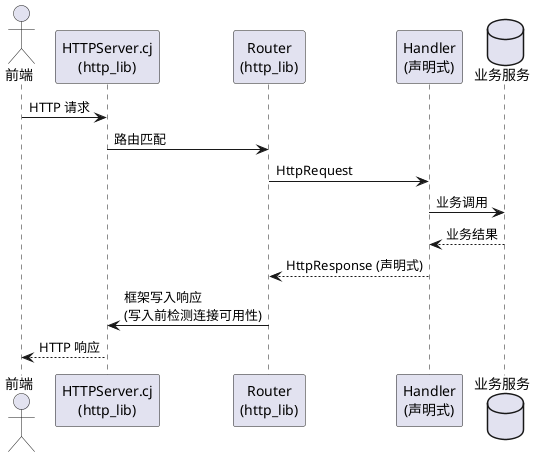
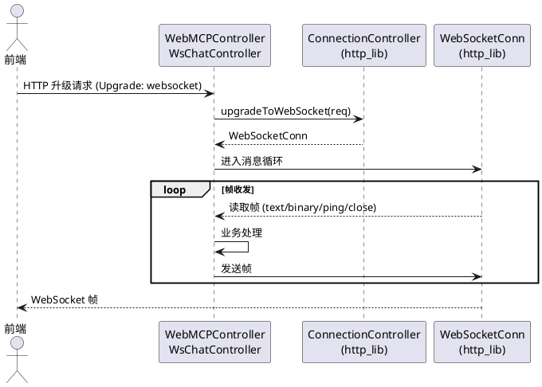
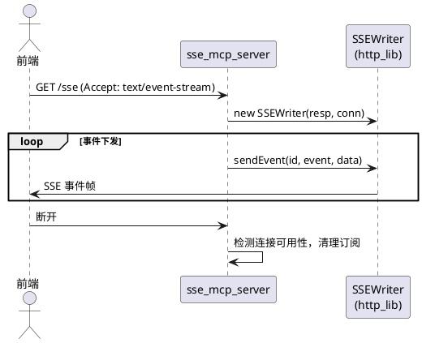
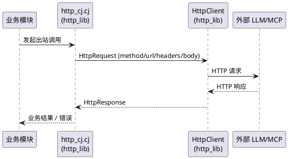
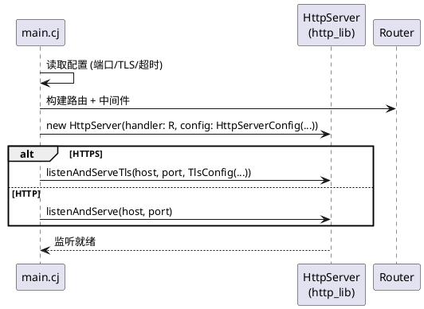
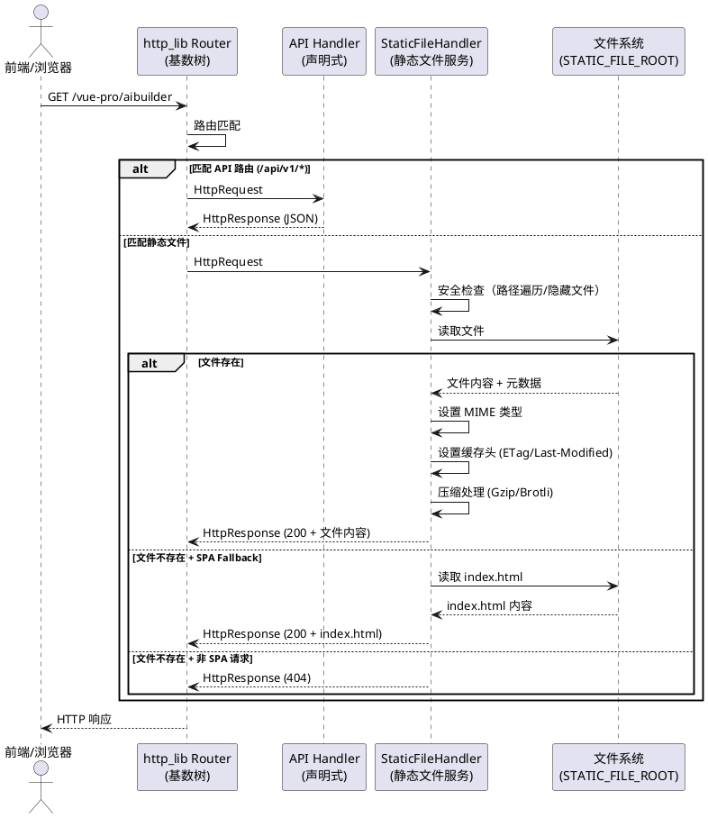

# HTTP 库迁移需求规格（stdx.net.http → http_lib）

# **1. 组件定位**

## **1.1 核心职责**
本组件负责将 agentskills-runtime 的 HTTP 服务层从 stdx.net.http 迁移至 http_lib，实现 HTTP/HTTPS 服务、WebSocket、SSE、HTTP 客户端、静态文件服务能力的统一承载，从根本上消除 10053 SocketException，并为 runtime 0.0.26+ 提供静态文件服务能力。

## **1.2 核心输入**
1. 上游前端/客户端的 HTTP/HTTPS 请求（REST API、WebSocket 升级请求、SSE 订阅请求）
2. 运行时内部发起的出站 HTTP 客户端调用（调用外部 LLM、MCP 服务、第三方 API）
3. cjpm.toml 配置文件（依赖声明、编译选项、目标平台 bin-dependencies）
4. TLS 证书与私钥文件（cert.pem / key.pem）
5. http_lib 及其依赖链源码（http_lib、quic_cj、kaca_json、jinguissl、jinguissl_core、kaca_cookies、compress4cj、channel_cj）
6. runtime `.env` 配置文件中的 `STATIC_FILE_ROOT` 静态文件根目录配置

## **1.3 核心输出**
1. 对前端/客户端的 HTTP/HTTPS 响应（JSON、SSE 事件流、WebSocket 帧）
2. 对外部系统的出站 HTTP 请求与响应处理结果
3. 连接状态变更通知（NEW/ACTIVE/IDLE/HIJACKED/CLOSED）
4. 框架错误日志（通过 errorLog 回调输出，可被应用层捕获）
5. 更新后的 cjpm.toml 配置文件
6. 静态文件响应（CSS/JS/HTML/图片/字体等静态资源的 HTTP 响应，含 ETag/Last-Modified/Cache-Control 头）

## **1.4 职责边界**
1. **不修改** fountain 框架代码（f_orm/f_data/f_config/f_util/f_ticktock/f_aspect/f_bean 等主项目使用模块保持原样）
2. **不迁移** 独立库（activemq4cj、cj_mail、cos-sdk、hyperion）的 stdx 依赖，保留其现状
3. **不实现** http_lib 内部协议解析逻辑（复用 http_lib 已实现的 HTTP/1.x、HTTP/2、WebSocket、SSE 能力）
4. **不引入** HTTP/3（QUIC）对外服务能力（本次仅本地化 quic_cj 依赖，不启用 HTTP/3 监听）
5. **不改变** 现有对外 REST API 路径、请求/响应 JSON 结构、WebSocket 消息协议、SSE 事件格式
6. **不负责** 数据库 schema 变更、业务逻辑重写、前端代码修改
7. **不实现** 图片优化管道（WebP/AVIF 转换）、CDN 集成、热重载文件监控等高级静态文件服务功能（本次仅实现基础静态文件服务）

# **2. 领域术语**

**10053 SocketException**
: Windows Sockets 错误码 10053，表示本地主机软件主动终止了已建立的连接；在本系统中表现为客户端连接已关闭时，服务端仍尝试向该 socket 写入响应数据，引发应用层无法捕获的异常。

**stdx.net.http**
: 仓颉扩展库 stdx 提供的 HTTP 服务端/客户端实现，依赖 C FFI，连接层为框架黑盒，应用层无法感知连接可用性。

**http_lib**
: 纯仓颉标准库（std）实现的 HTTP 协议封装库，零 stdx 依赖、零 C FFI，支持 HTTP/1.0/1.1/2，提供声明式响应 API 与连接生命周期管理能力。
: 备注：版本 cjc 1.1.3，向下兼容仓颉 SDK 1.0.5。

**声明式响应**
: Handler 以 `(HttpRequest) -> HttpResponse` 函数式签名返回响应对象，由框架统一负责响应写入与连接可用性检测的响应构建范式。
: 备注：与 stdx.net.http 的 `(HttpContext) -> Unit` 命令式副作用范式相对。

**ConnectionController**
: http_lib 提供的连接控制器接口，封装单条连接的升级（WebSocket）、状态查询（isConnected）、复用判断（canReuseTransport）等能力。

**SSEWriter**
: http_lib 内置的 Server-Sent Events 写入器，封装事件 ID、事件类型、数据分帧与 flush 语义。

**依赖链本地化**
: 将 http_lib 及其传递依赖的 git 仓库克隆至项目 libs 目录，并在 cjpm.toml 中以 path 依赖声明的策略，用于规避 cjpm 缓存冲突与版本漂移。

**EARS 格式**
: Easy Approach to Requirements Syntax，使用 WHEN/IF/THEN/WHILE/WHERE 等关键字结构化描述验收条件的需求规格格式。

**STATIC_FILE_ROOT**
: runtime `.env` 配置文件中的静态文件根目录配置项，指定 runtime 提供静态文件服务的文件系统根目录。参考 uctoo v3 的 `LIVE_DIRECTORY = ./assets`。
: 备注：默认值 `./public`，支持相对路径（相对于 runtime 工作目录）和绝对路径。

**SPA History Fallback**
: Vue/React 等 SPA 应用使用 HTML5 History 模式路由时，服务端对非文件请求返回 index.html 的策略，确保前端路由在刷新或直接访问时正常工作。
: 备注：当 `STATIC_FILE_ROOT` 配置了有效目录时，runtime 自动启用 SPA History Fallback。

**MIME 类型自动检测**
: 根据请求文件的扩展名自动设置 HTTP 响应的 Content-Type 头，如 `.css` → `text/css`、`.js` → `application/javascript`。
: 备注：参考 uctoo v3 的 `live-directory` 扩展名过滤机制。

# **3. 角色与边界**

## **3.1 核心角色**
- 前端应用（tiny-pro / vue-pro / UMI）：通过 HTTP/HTTPS、WebSocket、SSE 调用 agentskills-runtime 的 REST API 与实时通道；通过 runtime 静态文件服务加载 web-admin 构建产物（runtime ≥ 0.0.26）。
- 运行时业务模块（Agent 执行器、Skill 编排器、Crontab 调度器）：通过内部 HTTP 客户端调用外部 LLM、MCP 服务、第三方 API。
- 运维人员：负责 TLS 证书配置、服务启停、日志排查、10053 问题复现验证。

## **3.2 外部系统**
- 外部 LLM 服务（OpenAI 兼容接口等）：被运行时 HTTP 客户端调用。
- 外部 MCP 服务：被运行时 HTTP 客户端调用。
- http_lib 及其依赖链源码仓库：作为 path 依赖被项目引用。
- 仓颉编译工具链（cjc 1.0.5 + cjpm）：负责编译与依赖解析。

## **3.3 交互上下文**
```plantuml
@startuml
actor "前端应用" as FE
actor "运维人员" as OPS
box "agentskills-runtime" #LightBlue
    participant "HTTPServer.cj\n(http_lib)" as SRV
    participant "WebSocket/SSE\n(http_lib)" as WS
    participant "HTTPClient\n(http_lib)" as CLI
    participant "StaticFileHandler\n(静态文件服务)" as SFS
end box
participant "外部 LLM/MCP" as EXT
participant "http_lib 依赖链\n(libs/)" as LIB
participant "静态文件根目录\n(STATIC_FILE_ROOT)" as STATIC

FE --> SRV : HTTP/HTTPS REST API
FE --> WS : WebSocket 升级 / SSE 订阅
FE --> SFS : 静态文件请求\n(CSS/JS/HTML/图片/字体)
SRV --> FE : 声明式 HttpResponse
WS --> FE : WS 帧 / SSE 事件流
SFS --> FE : 静态文件响应\n(含 ETag/Cache-Control)
SFS --> STATIC : 读取文件

CLI --> EXT : 出站 HTTP 请求
EXT --> CLI : HTTP 响应

OPS --> SRV : 配置 TLS / 启停 / 日志
OPS --> SFS : 配置 STATIC_FILE_ROOT
SRV ..> LIB : path 依赖引用
WS ..> LIB : path 依赖引用
CLI ..> LIB : path 依赖引用
@enduml
```

# **4. DFX约束**

## **4.1 性能**
1. 迁移后核心 REST API 在同硬件、同并发条件下，P95 响应延迟不得劣于迁移前 stdx.net.http 基线的 110%。
2. WebSocket 消息往返延迟（含握手）P95 不得劣于迁移前基线的 110%。
3. SSE 首事件下发延迟（从订阅到首条 event）不得超过 500ms（本地环境）。
4. http_lib HttpServerConfig 的 readTimeout、writeTimeout、idleTimeout 必须显式配置，idleTimeout 默认取 60s。

## **4.2 可靠性**
1. **10053 根除目标**：在客户端主动断开、网络中断、Keep-Alive 超时三类场景下，服务端不得出现应用层无法捕获的 SocketException，框架须通过 errorLog 回调输出可观测日志。
2. 迁移后服务连续运行 24 小时，不得因连接管理缺陷导致进程崩溃或监听端口失效。
3. http_lib 的 ConnState 回调必须接入运行时日志，连接状态变更可追溯。
4. 出站 HTTP 客户端调用须支持重试与超时配置，单次请求默认超时 30s。

## **4.3 安全性**
1. HTTPS 服务须使用 http_lib 的 TlsConfig（基于 JinguiSSL，纯仓颉实现）加载证书，不得回退至 stdx.net.tls。
2. TLS 证书路径须通过配置注入，不得硬编码于源码。
3. 迁移后须保留现有 CORS 中间件语义，跨域策略与迁移前一致。
4. http_lib 内置安全头（HSTS/CSP 等）本次不强制启用，避免改变前端行为；如启用须经人工确认。
5. 静态文件服务须默认启用安全防护：路径遍历防护（禁止 `..` 路径）、X-Content-Type-Options: nosniff、隐藏文件过滤（以 `.` 开头的文件不提供服务）。

## **4.4 可维护性**
1. 迁移后源码中不得残留对 `stdx.net.http`、`stdx.net.tls`、`stdx.crypto.x509` 的 import（独立库除外）。
2. cjpm.toml 须显式声明 http_lib 及其本地化依赖的 path，不得保留 http_lib 相关的 git 依赖声明。
3. 连接异常、框架错误须通过 errorLog 回调统一输出至运行时日志体系（LoggerFactory）。
4. 迁移须保留可回滚性：通过 git 分支隔离，失败时可回退至 stdx.net.http 版本。

## **4.5 兼容性**
1. **对外 API 兼容**：所有现有 REST 路径、HTTP 方法、请求/响应 JSON 字段名与结构须保持不变，前端无感知。
2. **WebSocket 协议兼容**：现有 WebSocket 消息格式（ws_models.cj 定义）须保持不变。
3. **SSE 事件格式兼容**：现有 SSE 事件结构须保持不变。
4. **仓颉 SDK 兼容**：迁移后项目须在 cjc 1.0.5 下编译通过；http_lib 1.1.3 须向下兼容 1.0.5。
5. **目标平台兼容**：迁移后须在 x86_64-unknown-linux-gnu、x86_64-w64-mingw32、aarch64-apple-darwin 等已配置目标平台下编译通过。

# **5. 核心能力**

## **5.1 HTTPServer.cj 重写**

### **5.1.1 业务规则**
1. **规则：声明式 Handler 改造**
   - WHEN 开发者将现有 `(HttpContext) -> Unit` 命令式 Handler 迁移为 http_lib Handler
   - THEN 该 Handler 须改造为 `(HttpRequest) -> HttpResponse` 函数式签名，响应通过 `HttpResponse.json/status/body` 声明式构建
   - WHERE 迁移对象为 HTTPServer.cj 中所有路由处理逻辑
   - 验收条件：迁移后所有路由 Handler 返回 HttpResponse 对象，源码中不再出现 `context.responseBuilder.status().body()` 命令式调用链

2. **规则：路由器替换**
   - WHEN HTTPServer 初始化路由注册
   - THEN 须用 http_lib 内置 Router（基数树）替换自实现 DefaultHttpRequestDistributor，通过 `router.get/post/put/delete(path, handler)` 注册路由
   - 验收条件：源码中 DefaultHttpRequestDistributor 类被移除或弃用，路由注册走 http_lib Router

3. **规则：路径/查询参数解析**
   - WHEN 路由定义为 `/users/:id` 形式且请求命中该路由
   - THEN Handler 须通过 `req.pathParams["id"]` 获取路径参数，通过 `req.queryParam("q")` / `req.queryParams()` 获取查询参数
   - 验收条件：现有依赖路径参数的接口迁移后参数取值与迁移前一致

4. **规则：连接生命周期可观测**
   - WHEN HttpServerConfig 配置 connState 回调
   - THEN 连接发生 NEW/ACTIVE/IDLE/HIJACKED/CLOSED 状态变更时，回调须被触发并经 LoggerFactory 记录
   - 验收条件：服务运行期间日志可见连接状态变更记录

5. **规则：框架错误可捕获**
   - WHEN HttpServerConfig 配置 errorLog 回调且框架内部发生 socket 写入错误
   - THEN errorLog 回调须被触发，错误信息须进入运行时日志体系，不得仅以框架内部 WARN 形式丢弃
   - 验收条件：模拟客户端中途断开后，应用层日志可见 errorLog 输出，进程不崩溃

6. **禁止项：保留 stdx.net.http 服务端 API**
   - WHEN HTTPServer.cj 完成迁移
   - THEN 源码中禁止出现 `stdx.net.http.Server`、`ServerBuilder`、`HttpContext`、`FuncHandler`、`HttpRequestDistributor` 等 import 与引用
   - 验收条件：grep 源码无 stdx.net.http 服务端符号残留

### **5.1.2 交互流程**


### **5.1.3 异常场景**
1. **客户端中途断开**
   - 触发条件：服务端在准备写入响应时，客户端连接已被关闭（10053 触发场景）
   - 系统行为：http_lib 框架在写入前通过 Connection.isConnected 检测连接可用性；若不可用，跳过写入并通过 errorLog 回调输出日志，不抛出应用层异常
   - 用户感知：客户端无响应（已断开）；服务端日志可见 errorLog 记录，进程持续运行

2. **路由未命中**
   - 触发条件：请求路径未匹配任何已注册路由
   - 系统行为：http_lib Router 返回 404，响应体为 `{"error":"Not Found","path":"<请求路径>"}`
   - 用户感知：HTTP 404 + JSON 错误体，结构与迁移前一致

3. **Handler 抛出未捕获异常**
   - 触发条件：业务 Handler 执行过程中抛出异常
   - 系统行为：recoveryMiddleware 捕获异常，返回 HTTP 500，errorLog 记录异常堆栈
   - 用户感知：HTTP 500 + 错误信息；连接不泄漏

## **5.2 WebSocket 迁移**

### **5.2.1 业务规则**
1. **规则：升级方式替换**
   - WHEN 客户端发起 WebSocket 升级请求
   - THEN 须用 http_lib 的 `ConnectionController(conn).upgradeToWebSocket(req)` + `WebSocketConn(conn)` 替换 stdx 的 `WebSocket.upgradeFromServer(ctx)`
   - 验收条件：WebMCPController.cj、WsChatController.cj、ws_models.cj 中不再出现 `WebSocket.upgradeFromServer`

2. **规则：帧类型处理兼容**
   - WHEN WebSocket 连接收到文本/二进制/Ping/Pong/Close 帧
   - THEN 须通过 http_lib WebSocketConn 的帧读取 API 处理，帧类型语义与迁移前 stdx WebSocketFrameType 一致
   - 验收条件：现有 WebSocket 聊天、MCP 通道消息收发行为与迁移前一致

3. **规则：消息模型不变**
   - WHEN ws_models.cj 中的 WebSocket 消息结构被序列化/反序列化
   - THEN 消息 JSON 字段名与结构须保持与迁移前一致
   - 验收条件：前端 WebSocket 客户端无需修改即可正常通信

### **5.2.2 交互流程**


### **5.2.3 异常场景**
1. **升级握手失败**
   - 触发条件：升级请求不合法（缺少必要头、Sec-WebSocket-Key 错误等）
   - 系统行为：http_lib 返回 HTTP 400，errorLog 记录
   - 用户感知：HTTP 400，WebSocket 连接未建立

2. **连接异常断开**
   - 触发条件：WebSocket 连接在消息循环中网络中断
   - 系统行为：WebSocketConn 读取抛出可捕获异常，业务侧清理会话，ConnState 回调输出 CLOSED
   - 用户感知：前端触发 onclose；服务端日志可见 CLOSED 记录，无 10053

## **5.3 SSE 迁移**

### **5.3.1 业务规则**
1. **规则：SSEWriter 替换手动实现**
   - WHEN 客户端发起 SSE 订阅请求
   - THEN 须用 http_lib 的 `SSEWriter(resp, conn).sendEvent(...)` 替换 sse_mcp_server.cj 中的手动 SSE 分帧实现
   - 验收条件：sse_mcp_server.cj 中不再出现手动 `data: ...\n\n` 拼接逻辑

2. **规则：事件格式兼容**
   - WHEN SSEWriter 发送事件
   - THEN 事件的 id、event、data 字段须与迁移前 SSE 事件结构一致
   - 验收条件：现有 SSE 客户端解析事件行为不变

3. **规则：连接可用性检测**
   - WHILE SSE 长连接保持且服务端准备下发事件
   - THEN 须在写入前检测连接可用性，连接已断开时停止下发并清理订阅
   - 验收条件：客户端断开后服务端不再向其下发事件，无 10053

### **5.3.2 交互流程**


### **5.3.3 异常场景**
1. **客户端断开后继续下发**
   - 触发条件：SSE 订阅客户端已断开，服务端仍有待下发事件
   - 系统行为：SSEWriter 写入前检测连接，不可用则终止下发，释放订阅资源
   - 用户感知：无（客户端已离开）；服务端无 10053，日志记录订阅清理

## **5.4 HTTP 客户端替换**

### **5.4.1 业务规则**
1. **规则：客户端 API 替换**
   - WHEN 运行时业务模块发起出站 HTTP/HTTPS 调用
   - THEN 须用 http_lib 的 `HttpClient().get/post/send(req)` 替换 stdx 的 `ClientBuilder().build().send(req)`
   - 验收条件：http_cj.cj 中不再出现 `stdx.net.http.Client`、`ClientBuilder`、`TlsClientConfig`

2. **规则：请求构建替换**
   - WHEN 构建出站 HTTP 请求
   - THEN 须用 http_lib 的 `HttpRequestBuilder().get().withUrl(u).withJson(j).build()` 替换 stdx 的 HttpRequestBuilder
   - 验收条件：现有出站调用（LLM、MCP、第三方 API）请求 method/url/headers/body 与迁移前一致

3. **规则：响应头处理替换**
   - WHEN http_curl.cj、http_utils.cj、AIController.cj 读取 HTTP 响应头/请求头
   - THEN 须用 http_lib 的 HttpHeaders API 替换 stdx 的 HttpHeaders
   - 验收条件：头读取语义与迁移前一致

4. **规则：超时与重试**
   - WHEN 出站 HTTP 客户端发起请求
   - THEN 须支持单次请求超时配置（默认 30s）与重试策略
   - 验收条件：外部服务超时/失败时，客户端按配置重试或返回错误，不阻塞调用方

### **5.4.2 交互流程**


### **5.4.3 异常场景**
1. **外部服务不可达**
   - 触发条件：外部 LLM/MCP 服务网络不可达或超时
   - 系统行为：HttpClient 在超时阈值内返回错误，业务侧按现有错误处理逻辑处理
   - 用户感知：业务侧返回相应错误提示，不引发服务端崩溃

2. **TLS 握手失败**
   - 触发条件：出站 HTTPS 调用目标证书无效或握手失败
   - 系统行为：HttpClient 返回 TLS 错误，errorLog 记录
   - 用户感知：业务侧返回错误提示

## **5.5 main.cj 服务器初始化修改**

### **5.5.1 业务规则**
1. **规则：HttpServerConfig 适配**
   - WHEN main.cj 初始化 HTTP 服务
   - THEN 须使用 http_lib 的 HttpServerConfig 配置 readTimeout/writeTimeout/readHeaderTimeout/idleTimeout/drainTimeout，替换 stdx 的 ServerBuilder 链式配置
   - 验收条件：服务启动后超时参数生效，idleTimeout 默认 60s

2. **规则：TlsConfig 适配**
   - WHEN 启用 HTTPS 服务
   - THEN 须使用 http_lib 的 `TlsConfig(serverCertPath:, serverKeyPath:)` 替换 stdx 的 TlsServerConfig + X509Certificate + PrivateKey
   - 验收条件：HTTPS 服务可正常监听并完成 TLS 握手；证书路径通过配置注入

3. **规则：启动入口替换**
   - WHEN 启动 HTTP/HTTPS 服务
   - THEN 须用 `HttpServer(handler:, config:).listenAndServe(host, port)` / `listenAndServeTls(host, port)` 替换 `ServerBuilder().build().start()`
   - 验收条件：服务按配置监听端口，可接收请求

### **5.5.2 交互流程**


### **5.5.3 异常场景**
1. **端口占用**
   - 触发条件：配置的监听端口已被占用
   - 系统行为：HttpServer 启动失败，errorLog 输出错误，进程退出并给出明确提示
   - 用户感知：启动失败日志，端口冲突提示

2. **证书加载失败**
   - 触发条件：TlsConfig 指定的证书/私钥文件不存在或格式错误
   - 系统行为：HTTPS 启动失败，errorLog 输出证书加载错误
   - 用户感知：启动失败日志，证书路径提示

## **5.6 cjpm.toml 配置更新**

### **5.6.1 业务规则**
1. **规则：添加 http_lib 依赖**
   - WHEN 更新 cjpm.toml 的 [dependencies]
   - THEN 须添加 `http_lib = { path = "./libs/http_lib" }` 及其本地化依赖（quic_cj、kaca_json、jinguissl、jinguissl_core、kaca_cookies、compress4cj、channel_cj）的 path 声明
   - 验收条件：cjpm 依赖解析成功，所有 http_lib 依赖链通过 path 解析

2. **规则：移除 stdx.net.http 依赖**
   - WHEN 主项目源码不再引用 stdx.net.http
   - THEN cjpm.toml 中须移除对 stdx.net.http 的显式依赖声明（若存在）；独立库（activemq4cj/cj_mail/cos-sdk/hyperion）的 stdx 依赖保留
   - 验收条件：主项目编译不依赖 stdx.net.http；独立库仍可独立编译

3. **规则：保留目标平台 bin-dependencies**
   - WHEN 更新 cjpm.toml 的 [target.*.bin-dependencies]
   - THEN 须保留各目标平台的 stdx 动态库 path-option（因独立库仍依赖 stdx）；不得删除已配置的平台条目
   - 验收条件：各目标平台编译时 stdx 动态库可被定位

4. **禁止项：保留 http_lib git 依赖**
   - WHEN cjpm.toml 完成更新
   - THEN 禁止出现 http_lib 及其依赖链的 git 依赖声明，须全部改为 path
   - 验收条件：grep cjpm.toml 无 http_lib 相关 git 声明

### **5.6.2 异常场景**
1. **依赖解析失败**
   - 触发条件：path 指定的本地依赖目录不存在或缺少 cjpm.toml
   - 系统行为：cjpm 依赖解析报错，编译无法进行
   - 用户感知：明确的 path 不存在错误提示

## **5.7 http_lib 依赖链本地化**

### **5.7.1 业务规则**
1. **规则：克隆 6 个 git 依赖至 libs**
   - WHEN 执行依赖链本地化
   - THEN 须将 kaca_json、jinguissl、jinguissl_core、kaca_cookies、compress4cj、channel_cj 克隆至 `apps/agentskills-runtime/libs/` 对应子目录
   - 验收条件：libs 目录下存在上述 6 个依赖的本地副本，各副本含 cjpm.toml

2. **规则：改为 path 依赖**
   - WHEN 依赖本地化完成
   - THEN http_lib 与 quic_cj 的 cjpm.toml 中对上述依赖的引用须改为 path 指向本地副本（若 http_lib/quic_cj 内部声明为 git）
   - 验收条件：从主项目 cjpm.toml 出发，整条依赖链可通过 path 递归解析，无 git 网络请求

3. **规则：版本一致性**
   - WHILE 依赖链本地化完成且项目编译
   - THEN 各本地依赖副本的 cjc-version 须与项目兼容（http_lib 1.1.3 兼容 1.0.5；其余依赖须兼容 1.0.5）
   - 验收条件：全量编译通过，无版本冲突报错

### **5.7.2 异常场景**
1. **git 仓库不可达**
   - 触发条件：克隆时 gitcode.com 仓库不可访问
   - 系统行为：克隆失败，给出仓库地址与失败原因
   - 用户感知：明确的克隆失败提示，须人工介入（配置代理或更换源）

2. **依赖版本冲突**
   - 触发条件：本地化依赖的 cjc-version 与项目 1.0.5 不兼容
   - 系统行为：编译报版本冲突
   - 用户感知：版本冲突错误，须人工评估降级或升级

## **5.8 静态文件服务**

> runtime 0.0.26 新增能力：基于 http_lib 提供静态文件服务，参考 uctoo v3 的 `live-directory` 实现，使 runtime 能够直接托管 web-admin 构建产物等静态资源。

### **5.8.1 业务规则**

1. **REQ-SFS-01：静态文件目录配置**
   - WHEN runtime `.env` 文件中配置了 `STATIC_FILE_ROOT` 环境变量
   - THEN runtime 须读取该配置项作为静态文件服务的根目录，默认值为 `./public`
   - WHERE 参考 uctoo v3 的 `LIVE_DIRECTORY = ./assets`；支持相对路径（相对于 runtime 工作目录）和绝对路径
   - 验收条件：[`.env` 中设置 `STATIC_FILE_ROOT=./public`] → [runtime 从 `./public` 目录提供静态文件服务]
   - 验收条件：[`.env` 中设置 `STATIC_FILE_ROOT=/var/www/assets`] → [runtime 从 `/var/www/assets` 目录提供静态文件服务]
   - 验收条件：[`.env` 中未设置 `STATIC_FILE_ROOT`] → [runtime 使用默认值 `./public`，若该目录不存在则不注册静态文件路由]

2. **REQ-SFS-02：静态文件路由注册**
   - WHEN `STATIC_FILE_ROOT` 配置了有效目录且该目录存在
   - THEN runtime 须自动注册静态文件路由，路由前缀可配置（默认 `/`，即所有非 API 请求都尝试匹配静态文件）
   - WHERE API 路由（`/api/v1/*`）优先级高于静态文件路由；静态文件路由须在所有 API 路由注册之后注册
   - 验收条件：[`STATIC_FILE_ROOT=./public` 且目录存在] → [访问 `GET /vue-pro/aibuilder` 返回 `./public/vue-pro/aibuilder/index.html`]
   - 验收条件：[访问 `GET /api/v1/uctoo/health`] → [命中 API 路由，返回 JSON 响应，不被静态文件路由拦截]
   - 验收条件：[访问 `GET /non-existent-file.css`] → [文件不存在时，若为 SPA History Fallback 场景则返回 index.html，否则返回 404]

3. **REQ-SFS-03：SPA History Fallback**
   - WHEN `STATIC_FILE_ROOT` 配置了有效目录且请求路径未匹配到任何静态文件
   - IF 请求路径不以文件扩展名结尾（即路径不包含 `.` 或路径以 `/` 结尾）且请求方法为 GET
   - THEN runtime 须返回 `STATIC_FILE_ROOT/index.html`（Vue SPA 的 history 模式支持）
   - 验收条件：[访问 `GET /vue-pro/aibuilder`] → [若 `./public/vue-pro/aibuilder` 不是文件，返回 `./public/index.html`]
   - 验收条件：[访问 `GET /style.css` 且文件不存在] → [返回 HTTP 404，不触发 History Fallback]

4. **REQ-SFS-04：文件类型支持与 MIME 类型**
   - WHEN 静态文件请求命中一个文件
   - THEN runtime 须根据文件扩展名自动检测 MIME 类型并设置 Content-Type 响应头
   - WHERE 须支持以下文件类型：CSS（`text/css`）、JS（`application/javascript`）、JSON（`application/json`）、HTML（`text/html; charset=utf-8`）、图片（png/jpg/jpeg/gif/svg/ico/webp）、字体（woff/woff2/ttf/eot）；可配置扩展名白名单
   - 验收条件：[请求 `GET /style.css`] → [响应 Content-Type 为 `text/css`]
   - 验收条件：[请求 `GET /app.js`] → [响应 Content-Type 为 `application/javascript`]
   - 验收条件：[请求 `GET /logo.png`] → [响应 Content-Type 为 `image/png`]
   - 验收条件：[请求 `GET /font.woff2`] → [响应 Content-Type 为 `font/woff2`]

5. **REQ-SFS-05：缓存控制**
   - WHEN 静态文件请求命中一个文件
   - THEN runtime 须支持以下缓存控制机制：
     - ETag：基于文件内容哈希生成 ETag 头，支持 If-None-Match 条件请求（返回 304）
     - Last-Modified：基于文件修改时间生成 Last-Modified 头，支持 If-Modified-Since 条件请求（返回 304）
     - Cache-Control：可配置 Cache-Control 头（默认 `public, max-age=3600`）
     - Range Request：支持范围请求（Range 头），返回 206 Partial Content
   - 验收条件：[首次请求 `GET /style.css`] → [响应包含 ETag 和 Last-Modified 头]
   - 验收条件：[再次请求 `GET /style.css` 带 `If-None-Match: <etag>`] → [响应 HTTP 304 Not Modified，无响应体]
   - 验收条件：[请求 `GET /large-file.zip` 带 `Range: bytes=0-1023`] → [响应 HTTP 206，Content-Range 头正确]

6. **REQ-SFS-06：安全防护**
   - WHEN 静态文件服务启用时
   - THEN runtime 须默认启用以下安全防护：
     - 路径遍历防护：禁止包含 `..` 的路径，规范化后不得超出 `STATIC_FILE_ROOT` 目录
     - X-Content-Type-Options: nosniff：防止 MIME 类型嗅探
     - 隐藏文件过滤：以 `.` 开头的文件和目录不提供服务
   - 验收条件：[请求 `GET /../../../etc/passwd`] → [响应 HTTP 403 Forbidden，不泄露文件系统信息]
   - 验收条件：[请求 `GET /.env`] → [响应 HTTP 404 Not Found，隐藏文件不可访问]
   - 验收条件：[所有静态文件响应] → [包含 `X-Content-Type-Options: nosniff` 头]

7. **REQ-SFS-07：压缩支持**
   - WHEN 静态文件请求命中一个文件且请求头包含 `Accept-Encoding`
   - THEN runtime 须支持基于 Accept-Encoding 的 Gzip/Brotli 压缩响应
   - WHERE 可配置压缩级别和最小压缩阈值（默认 < 1KB 的文件不压缩）；仅对文本类型文件（CSS/JS/JSON/HTML/SVG/XML）启用压缩
   - 验收条件：[请求 `GET /style.css` 带 `Accept-Encoding: gzip`] → [响应 Content-Encoding 为 `gzip`，响应体为压缩数据]
   - 验收条件：[请求 `GET /logo.png` 带 `Accept-Encoding: gzip`] → [响应无 Content-Encoding，图片不压缩]
   - 验收条件：[请求 `GET /tiny.css`（文件 < 1KB）带 `Accept-Encoding: gzip`] → [响应无 Content-Encoding，小文件不压缩]

8. **禁止项：静态文件服务不得影响 API 路由**
   - WHEN 静态文件路由注册后
   - THEN 禁止静态文件路由拦截任何已注册的 API 路由（`/api/v1/*`），API 路由优先级始终高于静态文件路由
   - 验收条件：[API 路由与静态文件路径冲突时] → [API 路由优先匹配]

### **5.8.2 交互流程**



### **5.8.3 异常场景**

1. **STATIC_FILE_ROOT 目录不存在**
   - 触发条件：`.env` 中配置的 `STATIC_FILE_ROOT` 路径对应的目录不存在
   - 系统行为：runtime 启动时输出 WARN 日志，跳过静态文件路由注册，API 路由正常工作
   - 用户感知：静态文件请求返回 404；API 请求正常响应

2. **路径遍历攻击**
   - 触发条件：请求路径包含 `..` 或 URL 编码的路径遍历字符
   - 系统行为：路径规范化后检测到超出 `STATIC_FILE_ROOT` 目录，返回 HTTP 403
   - 用户感知：HTTP 403 Forbidden，不泄露文件系统信息

3. **文件读取权限不足**
   - 触发条件：`STATIC_FILE_ROOT` 目录下某文件无读取权限
   - 系统行为：返回 HTTP 403，日志记录权限错误
   - 用户感知：HTTP 403 Forbidden

4. **大文件内存溢出**
   - 触发条件：请求的静态文件超过内存安全阈值
   - 系统行为：使用流式传输（分块读取文件）或返回 HTTP 403（超过文件大小限制）
   - 用户感知：大文件正常下载或收到文件过大提示

5. **压缩处理失败**
   - 触发条件：Gzip/Brotli 压缩过程中发生错误
   - 系统行为：回退为未压缩响应，日志记录压缩失败
   - 用户感知：正常获取未压缩的文件内容

# **6. 数据约束**

## **6.1 HttpServerConfig**
1. **host**：服务监听地址，字符串，必填，默认 "0.0.0.0"
2. **port**：服务监听端口，整数，必填，取值范围 1-65535
3. **readTimeout**：读超时，Duration，必填，须显式配置
4. **writeTimeout**：写超时，Duration，必填，须显式配置
5. **idleTimeout**：Keep-Alive 空闲超时，Duration，必填，默认 60s
6. **connState**：连接状态回调，`(ConnState) -> Unit`，可选，配置后须接入日志
7. **errorLog**：错误日志回调，`(String) -> Unit`，可选，配置后须接入 LoggerFactory

## **6.2 TlsConfig**
1. **serverCertPath**：服务端证书 PEM 文件路径，字符串，启用 HTTPS 时必填，不得硬编码
2. **serverKeyPath**：服务端私钥 PEM 文件路径，字符串，启用 HTTPS 时必填，不得硬编码

## **6.3 路由定义**
1. **path**：路由路径，字符串，支持静态路径与 `:param` 动态参数
2. **method**：HTTP 方法，枚举（GET/POST/PUT/DELETE/PATCH），须与迁移前一致
3. **handler**：处理函数，签名 `(HttpRequest) -> HttpResponse`，必填

## **6.4 WebSocket 消息（ws_models）**
1. **消息结构**：JSON 字段名与结构须与迁移前完全一致
2. **帧类型**：text/binary/ping/pong/close，语义与迁移前一致

## **6.5 SSE 事件**
1. **id**：事件 ID，字符串，可选
2. **event**：事件类型，字符串，可选
3. **data**：事件数据，字符串，必填
4. **整体格式**：须符合 SSE 规范（`id:...\nevent:...\ndata:...\n\n`），与迁移前客户端解析一致

## **6.6 出站 HTTP 客户端配置**
1. **timeout**：单次请求超时，Duration，默认 30s
2. **retry**：重试次数，整数，默认 0（按业务侧配置）
3. **tls**：出站 TLS 配置，可选，默认信任系统证书

## **6.7 静态文件服务配置**
1. **STATIC_FILE_ROOT**：静态文件根目录，字符串，默认 `./public`，支持相对路径和绝对路径
2. **STATIC_FILE_URL_PREFIX**：静态文件路由前缀，字符串，默认 `/`（所有非 API 请求）
3. **STATIC_FILE_CACHE_MAX_AGE**：Cache-Control max-age 值，整数，默认 3600（秒）
4. **STATIC_FILE_COMPRESSION_ENABLED**：是否启用压缩，布尔值，默认 true
5. **STATIC_FILE_COMPRESSION_MIN_SIZE**：最小压缩阈值，整数，默认 1024（字节），小于此值的文件不压缩
6. **STATIC_FILE_COMPRESSION_LEVEL**：压缩级别，整数，默认 6（Gzip 1-9）
7. **STATIC_FILE_ALLOWED_EXTENSIONS**：允许的文件扩展名白名单，字符串数组，默认包含 css/js/json/html/htm/png/jpg/jpeg/gif/svg/ico/webp/woff/woff2/ttf/eot/xml/txt/pdf/map

## **6.8 静态文件响应头**
1. **Content-Type**：根据文件扩展名自动检测的 MIME 类型
2. **ETag**：基于文件内容哈希生成的实体标签，格式 `"<hash>"`
3. **Last-Modified**：文件最后修改时间，RFC 1123 格式
4. **Cache-Control**：缓存控制指令，默认 `public, max-age=3600`
5. **X-Content-Type-Options**：固定值 `nosniff`
6. **Content-Encoding**：压缩编码（gzip/br），仅当启用压缩且客户端支持时
7. **Accept-Ranges**：固定值 `bytes`，表示支持范围请求
8. **Content-Range**：范围请求响应的范围描述，格式 `bytes <start>-<end>/<total>`