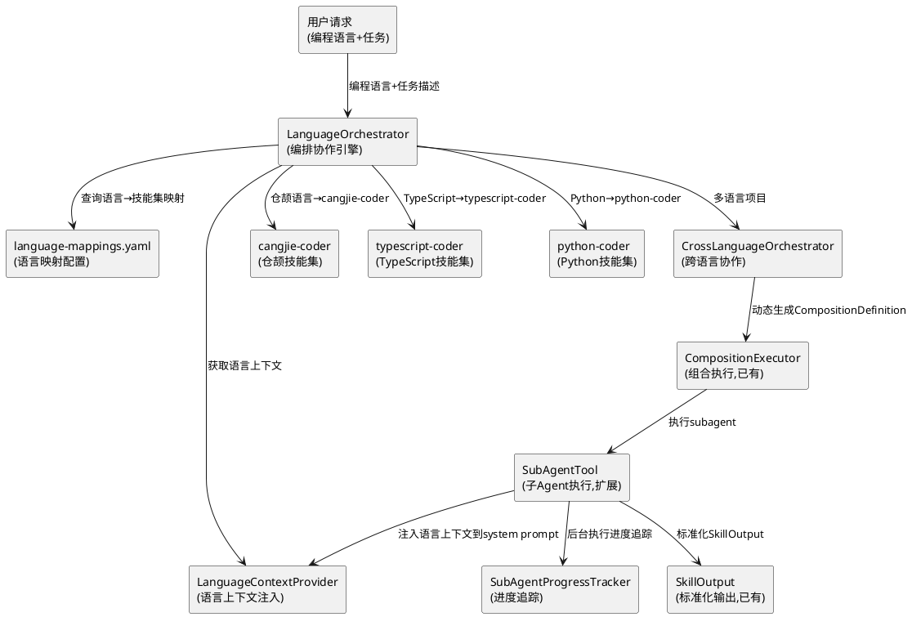
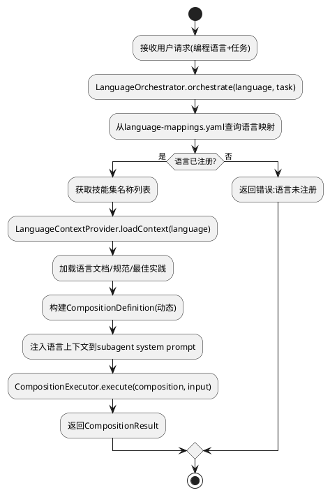
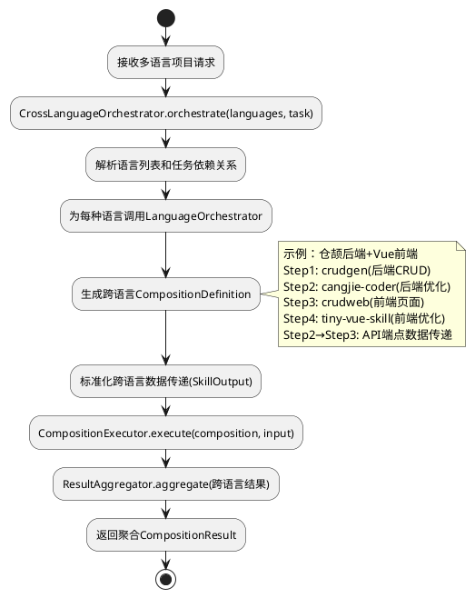
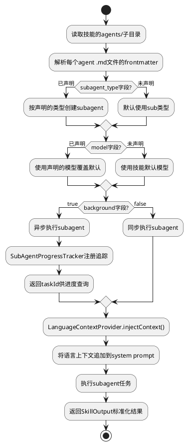
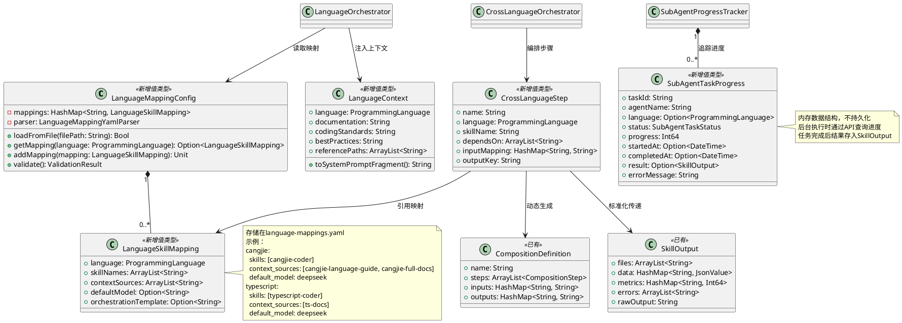
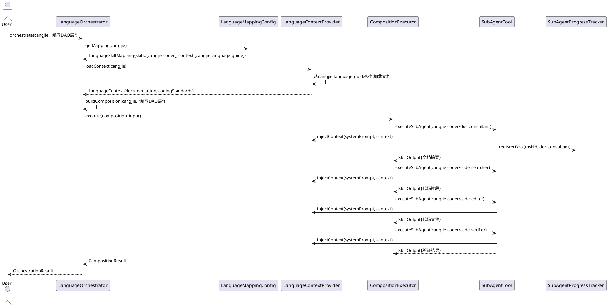
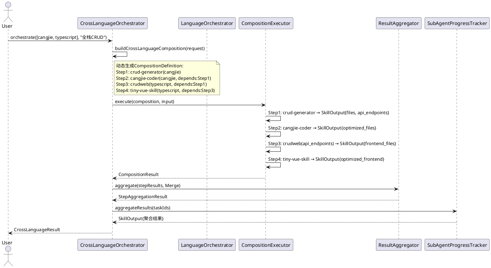

# 专用语言多Skills编排协作 - 技术设计文档

## 一、需求与存量功能关系分析

### 1.1 需求功能与存量功能对比

#### 1.1.1 已实现功能

| 需求功能 | 存量功能 | 代码位置 | 匹配度 |
|---------|---------|---------|--------|
| 技能组合执行 | CompositionExecutor + CompositionDefinition | src/skill/composition_executor.cj, composition_definition.cj | 85% |
| 组合YAML解析 | CompositionYamlParser | src/skill/composition_yaml_parser.cj | 90% |
| 步骤间数据映射 | InputMapper | src/skill/input_mapper.cj | 80% |
| 组合验证 | CompositionValidator | src/skill/composition_validator.cj | 85% |
| 依赖解析 | SkillDependencyResolver | src/skill/dependency_resolver.cj | 75% |
| 技能管理 | CompositeSkillToolManager | src/skill/composite_skill_tool_manager.cj | 90% |
| 技能到工具适配 | SkillToToolAdapter | src/skill/skill_to_tool_adapter.cj | 85% |
| 渐进式技能加载 | ProgressiveSkillLoader | src/skill/application/progressive_skill_loader.cj | 80% |
| SubAgent执行 | SubAgentTool | src/tool/sub_agent_tool.cj | 60% |
| Agent定义解析 | AgentDefinition + AgentDefinitionBuilder | src/core/agent/agent_definition.cj | 70% |
| cangjie-coder编排器 | SKILL.md v3.0.0 + 4个subagent | skills/cangjie-coder/ | 90% |
| DAG编排 | DagScheduler + DagTeamOrchestrator | src/agent_executor/dag_scheduler.cj, dag_team_orchestrator.cj | 70% |
| 结果聚合 | ResultAggregator | src/agent_executor/result_aggregator.cj | 75% |
| 全栈代码生成组合 | fullstack-codegen COMPOSITION.yaml | skills/fullstack-codegen/ | 65% |
| SkillOutput标准化 | SkillOutput + SkillInput | src/skill/skill_output.cj | 80% |

#### 1.1.2 需要扩展的功能

| 需求功能 | 存量功能 | 差异说明 | 扩展方向 |
|---------|---------|---------|---------|
| 语言→技能集映射 | 无 | 缺少编程语言到技能集的自动映射机制 | 新增LanguageOrchestrator + language-mappings.yaml |
| 语言上下文注入 | SubAgentTool无上下文注入 | subagent执行时无法自动注入语言相关资料 | 扩展SubAgentTool，新增LanguageContextProvider |
| 跨语言协作编排 | fullstack-codegen硬编码步骤 | 组合步骤固定，无法根据语言动态编排 | 新增CrossLanguageOrchestrator，基于语言映射动态生成组合 |
| subagent类型选择 | AgentDefinition仅支持5种类型 | 缺少语言专用subagent类型标识 | 扩展AgentType枚举，新增language_context字段 |
| subagent模型覆盖 | AgentDefinition.model已存在 | subagent .md文件中model字段已可声明 | 复用现有model字段，确保运行时正确应用 |
| subagent后台执行 | AgentDefinition.background已存在 | .md文件中background字段已可声明 | 复用现有background字段，新增异步执行和进度追踪 |
| 进度追踪 | 无 | subagent异步执行时无法追踪进度 | 新增SubAgentProgressTracker |

#### 1.1.3 需要新增的功能或接口

1. **LanguageOrchestrator**: 编排协作引擎核心类，根据编程语言自动选择和编排技能集
2. **LanguageMappingConfig**: 语言→技能集映射配置，通过YAML文件定义
3. **LanguageContextProvider**: 语言上下文注入器，自动加载编程语言资料和规范
4. **CrossLanguageOrchestrator**: 跨语言协作编排器，支持多语言项目的动态技能编排
5. **SubAgentProgressTracker**: subagent进度追踪器，支持后台执行和结果聚合
6. **language-mappings.yaml**: 语言映射配置文件
7. **typescript-coder技能**: TypeScript语言专用技能集（含agents子目录）
8. **python-coder技能**: Python语言专用技能集（含agents子目录）
9. **无新数据库表**: 本工程不涉及数据库新建表

### 1.2 存量功能详细分析

**CompositionExecutor**（src/skill/composition_executor.cj）：
- **接口契约**: execute(composition, input)执行组合定义，返回CompositionResult
- **业务规则**: 拓扑排序步骤→顺序执行→条件跳过→缓存→重试→结果汇总
- **扩展点**: LanguageOrchestrator可复用CompositionExecutor执行动态生成的组合定义
- **约束**: 当前组合定义需预先编写COMPOSITION.yaml，无法根据语言动态生成

**SubAgentTool**（src/tool/sub_agent_tool.cj）：
- **接口契约**: executeSubAgent(skillPath, question, inputFiles, outputDir, transcript)
- **业务规则**: 当前为占位实现，仅记录日志返回成功
- **扩展点**: 需新增language_context参数注入语言上下文；需新增subagent_type参数支持类型选择
- **约束**: 无异步执行能力，无进度回调，无语言上下文注入

**AgentDefinition**（src/core/agent/agent_definition.cj）：
- **接口契约**: 从.md文件frontmatter解析Agent定义，含agentType/model/background/permissions等
- **业务规则**: AgentType枚举定义MAIN/SUB/ANALYZER/COMPARATOR/GRADER
- **扩展点**: 可新增language_context字段存储语言上下文；可扩展AgentType支持语言专用类型
- **约束**: frontmatter解析已有完整流程，新增字段需同步修改AgentDefinitionBuilder

**cangjie-coder编排器模式**（skills/cangjie-coder/SKILL.md v3.0.0）：
- **接口契约**: 4个subagent(doc-consultant→code-searcher→code-editor→code-verifier)协作
- **业务规则**: 验证失败时自动修复闭环（最多3次重试）
- **扩展点**: 此模式可复用为其他语言技能集的编排模板
- **约束**: 当前仅支持仓颉语言，其他语言需创建对应的技能集和agents子目录

**fullstack-codegen组合**（skills/fullstack-codegen/COMPOSITION.yaml）：
- **接口契约**: loaddbinfo→crud-generator→cangjie-coder→code-gen-verifier
- **业务规则**: 步骤间通过${step.output.field}表达式传递数据
- **扩展点**: 可作为跨语言协作的参考模板，但需从硬编码改为动态生成
- **约束**: 步骤固定，无法根据前端语言动态选择crudweb或tiny-vue-skill

## 二、增量设计方案

### 2.1 实现模型

#### 2.1.1 上下文视图



#### 2.1.2 服务/组件总体架构

```plantuml
@startuml

package "language-skills-orchestration (P1-5 新增)" {
    component [LanguageOrchestrator\n(编排协作引擎)] as LO
    component [LanguageMappingConfig\n(语言映射配置)] as LMC
    component [LanguageContextProvider\n(语言上下文注入)] as LCP
    component [CrossLanguageOrchestrator\n(跨语言协作编排)] as CLO
    component [SubAgentProgressTracker\n(进度追踪)] as SPT
    component [LanguageMappingYamlParser\n(映射配置解析)] as LMYP
}

package "skill-composition-engine (P0-4 已有)" {
    component [CompositionExecutor] as CE
    component [CompositionYamlParser] as CYP
    component [CompositionDefinition] as CD
    component [InputMapper] as IM
    component [CompositionValidator] as CV
    component [SkillDependencyResolver] as SDR
}

package "cangjie-coder-agents (P0-5 已有)" {
    component [cangjie-coder SKILL.md] as CC
    component [doc-consultant.md] as DC
    component [code-searcher.md] as CS
    component [code-editor.md] as CE2
    component [code-verifier.md] as CV2
}

package "typescript-coder (P1-5 新增技能)" {
    component [typescript-coder SKILL.md] as TC
    component [ts-doc-consultant.md] as TDC
    component [ts-code-searcher.md] as TCS
    component [ts-code-editor.md] as TCE
    component [ts-code-verifier.md] as TCV
}

package "python-coder (P1-5 新增技能)" {
    component [python-coder SKILL.md] as PC
    component [py-doc-consultant.md] as PDC
    component [py-code-searcher.md] as PCS
    component [py-code-editor.md] as PCE
    component [py-code-verifier.md] as PCV
}

package "核心基础设施 (已有)" {
    component [CompositeSkillToolManager] as CSTM
    component [SkillToToolAdapter] as STA
    component [SubAgentTool] as SAT
    component [ProgressiveSkillLoader] as PSL
    component [AgentDefinition] as AD
    component [SkillOutput] as SO
    component [DagTeamOrchestrator] as DTO
    component [ResultAggregator] as RA
}

LO --> LMC : 读取映射配置
LO --> LCP : 获取语言上下文
LO --> CE : 委托组合执行
LO --> CSTM : 获取技能实例
CLO --> LO : 多语言编排
CLO --> CE : 动态生成CompositionDefinition
CLO --> RA : 聚合跨语言结果
SAT --> LCP : 注入语言上下文
SAT --> SPT : 异步进度追踪
SAT --> AD : 解析subagent定义
LMYP --> LMC : 解析YAML配置

@enduml
```



#### 2.1.3 实现设计文档

**单语言编排流程**：



**跨语言协作流程**：



**subagent配置增强流程**：



### 2.2 接口设计

#### 2.2.1 总体设计

| 接口分类 | 接口名称 | 稳定性 | 说明 |
|---------|---------|--------|------|
| 编排API | POST /api/v1/uctoo/language_orchestration/orchestrate | 实验 | 单语言编排执行 |
| 编排API | POST /api/v1/uctoo/language_orchestration/cross-language | 实验 | 跨语言协作编排 |
| 编排API | GET /api/v1/uctoo/language_orchestration/mappings | 实验 | 查询语言映射配置 |
| 编排API | POST /api/v1/uctoo/language_orchestration/mappings | 实验 | 新增语言映射配置 |
| 进度API | GET /api/v1/uctoo/language_orchestration/progress/:taskId | 实验 | 查询subagent执行进度 |
| 进度API | GET /api/v1/uctoo/language_orchestration/tasks | 实验 | 查询所有后台任务 |
| 内部接口 | LanguageOrchestrator.orchestrate() | 实验 | 单语言编排核心方法 |
| 内部接口 | CrossLanguageOrchestrator.orchestrate() | 实验 | 跨语言编排核心方法 |
| 内部接口 | LanguageContextProvider.loadContext() | 实验 | 加载语言上下文 |
| 内部接口 | LanguageContextProvider.injectContext() | 实验 | 注入上下文到system prompt |
| 内部接口 | SubAgentProgressTracker.track() | 实验 | 追踪subagent进度 |
| 内部接口 | SubAgentProgressTracker.aggregateResults() | 实验 | 聚合后台执行结果 |

#### 2.2.2 接口清单

**LanguageOrchestrator核心接口**：

```cangjie
public enum ProgrammingLanguage {
    | Cangjie
    | TypeScript
    | Python
    | Java
    | Go
    | Rust
    | Custom(String)
}

public class LanguageSkillMapping {
    public var language: ProgrammingLanguage
    public var skillNames: ArrayList<String>
    public var contextSources: ArrayList<String>
    public var defaultModel: Option<String>
    public var orchestrationTemplate: Option<String>
    public func toJsonValue(): JsonValue
}

public class OrchestrationRequest {
    public var language: ProgrammingLanguage
    public var task: String
    public var input: JsonValue
    public var modelOverride: Option<String>
    public var background: Bool
    public func toJsonValue(): JsonValue
}

public class OrchestrationResult {
    public var language: ProgrammingLanguage
    public var compositionName: String
    public var status: CompositionExecutionStatus
    public var stepResults: HashMap<String, StepExecutionResult>
    public var finalOutput: Option<SkillOutput>
    public var totalDurationMs: Int64
    public var languageContext: Option<String>
    public func toJsonValue(): JsonValue
}

public class LanguageOrchestrator {
    private let _skillManager: CompositeSkillToolManager
    private let _compositionExecutor: CompositionExecutor
    private let _contextProvider: LanguageContextProvider
    private let _mappingConfig: LanguageMappingConfig
    private let _progressTracker: SubAgentProgressTracker

    public init(skillManager!: CompositeSkillToolManager)

    public func orchestrate(request: OrchestrationRequest): Option<OrchestrationResult>
    public func orchestrate(language: ProgrammingLanguage, task: String, input: JsonValue): Option<OrchestrationResult>
    public func getMapping(language: ProgrammingLanguage): Option<LanguageSkillMapping>
    public func registerMapping(language: ProgrammingLanguage, mapping: LanguageSkillMapping): Bool
    public func listSupportedLanguages(): ArrayList<ProgrammingLanguage>
    public func buildComposition(language: ProgrammingLanguage, task: String): Option<CompositionDefinition>
}
```

**LanguageMappingConfig接口**：

```cangjie
public class LanguageMappingConfig {
    private let _mappings: HashMap<String, LanguageSkillMapping>
    private let _parser: LanguageMappingYamlParser

    public init(configPath!: String)
    public init()

    public func loadFromFile(filePath: String): Bool
    public func loadFromString(content: String): Bool
    public func getMapping(language: ProgrammingLanguage): Option<LanguageSkillMapping>
    public func addMapping(mapping: LanguageSkillMapping): Unit
    public func removeMapping(language: ProgrammingLanguage): Bool
    public func getAllMappings(): HashMap<String, LanguageSkillMapping>
    public func validate(): ValidationResult
    public func toJsonValue(): JsonValue
}

public class LanguageMappingYamlParser {
    public init()

    public func parseFromFile(filePath: String): Option<LanguageMappingConfig>
    public func parseFromString(content: String): Option<LanguageMappingConfig>
    public func validate(config: LanguageMappingConfig): CompositionValidationResult
}
```

**LanguageContextProvider接口**：

```cangjie
public class LanguageContext {
    public var language: ProgrammingLanguage
    public var documentation: String
    public var codingStandards: String
    public var bestPractices: String
    public var referencePaths: ArrayList<String>
    public func toJsonValue(): JsonValue
    public func toSystemPromptFragment(): String
}

public class LanguageContextProvider {
    private let _contexts: HashMap<String, LanguageContext>
    private let _skillManager: CompositeSkillToolManager

    public init(skillManager!: CompositeSkillToolManager)

    public func loadContext(language: ProgrammingLanguage): Option<LanguageContext>
    public func loadContextFromSkill(skillName: String): Option<LanguageContext>
    public func injectContext(systemPrompt: String, context: LanguageContext): String
    public func registerContext(language: ProgrammingLanguage, context: LanguageContext): Unit
    public func getContext(language: ProgrammingLanguage): Option<LanguageContext>
}
```

**CrossLanguageOrchestrator接口**：

```cangjie
public class CrossLanguageStep {
    public var name: String
    public var language: ProgrammingLanguage
    public var skillName: String
    public var dependsOn: ArrayList<String>
    public var inputMapping: HashMap<String, String>
    public var outputKey: String
    public func toJsonValue(): JsonValue
}

public class CrossLanguageRequest {
    public var languages: ArrayList<ProgrammingLanguage>
    public var task: String
    public var input: JsonValue
    public var steps: ArrayList<CrossLanguageStep>
    public var background: Bool
    public func toJsonValue(): JsonValue
}

public class CrossLanguageResult {
    public var languages: ArrayList<ProgrammingLanguage>
    public var compositionName: String
    public var status: CompositionExecutionStatus
    public var stepResults: HashMap<String, StepExecutionResult>
    public var finalOutput: Option<SkillOutput>
    public var crossLanguageData: HashMap<String, SkillOutput>
    public var totalDurationMs: Int64
    public func toJsonValue(): JsonValue
}

public class CrossLanguageOrchestrator {
    private let _languageOrchestrator: LanguageOrchestrator
    private let _compositionExecutor: CompositionExecutor
    private let _resultAggregator: ResultAggregator
    private let _progressTracker: SubAgentProgressTracker

    public init(languageOrchestrator!: LanguageOrchestrator)

    public func orchestrate(request: CrossLanguageRequest): Option<CrossLanguageResult>
    public func buildCrossLanguageComposition(request: CrossLanguageRequest): Option<CompositionDefinition>
    public func validateCrossLanguageData(steps: ArrayList<CrossLanguageStep>): ValidationResult
}
```

**SubAgentProgressTracker接口**：

```cangjie
public enum SubAgentTaskStatus {
    | Queued
    | Running
    | Completed
    | Failed
    | Cancelled
}

public class SubAgentTaskProgress {
    public var taskId: String
    public var agentName: String
    public var language: Option<ProgrammingLanguage>
    public var status: SubAgentTaskStatus
    public var progress: Int64
    public var startedAt: Option<DateTime>
    public var completedAt: Option<DateTime>
    public var result: Option<SkillOutput>
    public var errorMessage: String
    public func toJsonValue(): JsonValue
}

public class SubAgentProgressTracker {
    private let _tasks: HashMap<String, SubAgentTaskProgress>

    public init()

    public func registerTask(taskId: String, agentName: String): Unit
    public func updateProgress(taskId: String, progress: Int64): Bool
    public func completeTask(taskId: String, result: SkillOutput): Bool
    public func failTask(taskId: String, error: String): Bool
    public func cancelTask(taskId: String): Bool
    public func getProgress(taskId: String): Option<SubAgentTaskProgress>
    public func getActiveTasks(): ArrayList<SubAgentTaskProgress>
    public func aggregateResults(taskIds: ArrayList<String>): Option<SkillOutput>
    public func getOverallProgress(taskIds: ArrayList<String>): Int64
}
```

**SubAgentTool扩展参数**：

```cangjie
public class SubAgentTool <: NativeFuncTool {
    public static let NAME = "sub_agent_execute"
    
    public static let DESC = """
    Execute a sub-agent task with timing, transcript, language context, and progress tracking.
    Supports skill path, input files, output directory, language context injection,
    subagent type selection, model override, and background execution.
    """
    
    public init() {
        super(
            name: SubAgentTool.NAME,
            description: SubAgentTool.DESC,
            parameters: [
                ("skill_path", "Path to the skill directory to load", TypeSchema.Str),
                ("question", "Question or task for the sub-agent", TypeSchema.Str),
                ("input_files", "Array of input file paths", TypeSchema.Str),
                ("output_dir", "Output directory path", TypeSchema.Str),
                ("language_context", "Language context to inject into system prompt", TypeSchema.Str),
                ("subagent_type", "Type of subagent (sub/analyzer/comparator/grader)", TypeSchema.Str),
                ("model_override", "Override the default model for this subagent", TypeSchema.Str),
                ("background", "Execute subagent in background (true/false)", TypeSchema.Str),
                ("task_id", "Task ID for progress tracking (auto-generated if not provided)", TypeSchema.Str)
            ],
            retType: TypeSchema.Str,
            ...
        )
    }
}
```

**AgentDefinition扩展字段**：

```cangjie
public class AgentDefinition {
    public let name: String
    public let agentType: AgentType
    public let description: String
    public let version: String
    public let author: Option<String>
    public let tools: Array<String>
    public let model: Option<String>
    public let maxTurns: Int64
    public let memory: AgentMemory
    public let background: Bool
    public let permissions: Array<AgentPermission>
    public let color: Option<String>
    public let isolation: Option<String>
    public let aic: Option<String>
    public let identityStatus: String
    public let aipRegisteredAt: Option<DateTime>
    public let capabilities: Option<String>
    public let defaultInputTypes: Option<String>
    public let defaultOutputTypes: Option<String>
    public let discoverable: Bool
    public let systemPrompt: String
    public let sourcePath: Path
    public let baseDir: Path
    public let languageContext: Option<String>
    public let language: Option<String>
}
```

**subagent .md文件扩展frontmatter格式**：

```yaml
---
name: code-editor
agent_type: sub
description: 仓颉代码编辑Agent
version: 1.0.0
author: OpenCangjie Team
tools:
  - file_read
  - file_write
  - file_edit
model: deepseek
maxTurns: 100
memory: session
background: false
parent_id: MainAgent
language: cangjie
language_context: cangjie-language-guide,cangjie-full-docs
permissions:
  - database.uctoo.agents:read
  - database.uctoo.agent_tasks:write
---
```

### 2.3 数据模型

#### 2.3.1 设计目标

- 本工程不新建数据库表
- 语言映射配置通过YAML文件管理，运行时加载到内存
- subagent进度追踪使用内存数据结构（SubAgentProgressTracker），不持久化
- 跨语言数据传递复用已有的SkillOutput标准化格式
- 语言上下文从技能依赖的文档技能（如cangjie-language-guide）动态加载

#### 2.3.2 模型实现



**language-mappings.yaml配置文件结构**：

```yaml
language_mappings:
  cangjie:
    skills:
      - cangjie-coder
    context_sources:
      - cangjie-language-guide
      - cangjie-full-docs
    default_model: deepseek
    orchestration_template: cangjie-coder-flow

  typescript:
    skills:
      - typescript-coder
    context_sources:
      - ts-docs
    default_model: deepseek
    orchestration_template: typescript-coder-flow

  python:
    skills:
      - python-coder
    context_sources:
      - python-docs
    default_model: deepseek
    orchestration_template: python-coder-flow

cross_language_templates:
  fullstack-cangjie-vue:
    description: 仓颉后端+Vue前端全栈开发
    steps:
      - name: generate-backend
        language: cangjie
        skill: crud-generator
        output_key: backend_output
      - name: optimize-backend
        language: cangjie
        skill: cangjie-coder
        depends_on: [generate-backend]
        input:
          files: "${generate-backend.output.files}"
      - name: generate-frontend
        language: typescript
        skill: crudweb
        depends_on: [generate-backend]
        input:
          api_endpoints: "${generate-backend.output.api_endpoints}"
      - name: optimize-frontend
        language: typescript
        skill: tiny-vue-skill
        depends_on: [generate-frontend]
        input:
          files: "${generate-frontend.output.files}"
    outputs:
      backend_files: "${optimize-backend.output.files}"
      frontend_files: "${optimize-frontend.output.files}"
```

**uctoo-v4 模块开发规范约束**：
- PO类需使用 `@DataAssist[fields]` 和 `@QueryMappersGenerator["table_name"]` 注解
- PO类字段使用 `public var` 声明，可选字段使用 `Option<T>` 类型
- PO类需提供 `toJsonValue(): JsonValue` 和 `toJson(): String` 序列化方法
- DAO接口需使用 `@DAO` 注解并继承 `RootDAO`，声明 `prop executor: SqlExecutor`
- DAO查询方法返回 `Option<T>`（单条）或 `ArrayList<T>`（列表）或 `Pagination<T>`（分页）
- Service类方法返回 `APIResult<T>`，使用 `try { ... } catch (e: Exception) { ... }` 错误处理
- Controller方法签名统一为 `public func add(req: HttpRequest, res: HttpResponse): Unit`
- 包名规范：`magic.app.models.uctoo`、`magic.app.dao.uctoo`、`magic.app.services.uctoo`、`magic.app.controllers.uctoo`
- 导入规范：`import std.time.DateTime`、`import stdx.encoding.json.{JsonValue, JsonObject, JsonArray}`、`import std.collection.*`、`import f_orm.*`
- JSONB字段对应 `JsonValue` 类型，PO中用 `Option<String>` 存储，Service层负责序列化/反序列化

**DDL**：

> 本工程不新建数据库表。语言映射配置通过YAML文件管理，subagent进度追踪使用内存数据结构。

### 2.4 关键交互流程

**LanguageOrchestrator编排时序**：



**CrossLanguageOrchestrator跨语言时序**：



### 2.5 与已有基础设施的集成点

| 集成点 | 已有组件 | 集成方式 | 变更范围 |
|--------|---------|---------|---------|
| 技能组合执行 | CompositionExecutor | LanguageOrchestrator委托CompositionExecutor执行 | 不修改已有代码，仅调用 |
| 技能管理 | CompositeSkillToolManager | LanguageOrchestrator通过getSkill获取技能实例 | 不修改已有代码，仅调用 |
| SubAgent执行 | SubAgentTool | 扩展参数(language_context, subagent_type, model_override, background, task_id) | 扩展SubAgentTool，新增5个参数 |
| Agent定义 | AgentDefinition | 新增language和language_context字段 | 扩展AgentDefinition和AgentDefinitionBuilder |
| 结果聚合 | ResultAggregator | CrossLanguageOrchestrator委托ResultAggregator聚合 | 不修改已有代码，仅调用 |
| YAML解析 | CompositionYamlParser | 复用YAML解析能力解析language-mappings.yaml | 不修改已有代码，新增LanguageMappingYamlParser |
| 技能加载 | ProgressiveSkillLoader | 自动加载typescript-coder和python-coder技能 | 不修改已有代码，新增技能目录 |
| DAG编排 | DagTeamOrchestrator | 可选集成，LanguageOrchestrator可委托DAG编排 | 不修改已有代码，仅调用 |
| cangjie-coder | skills/cangjie-coder/ | 扩展agent .md文件frontmatter(language, language_context字段) | 扩展4个.md文件 |