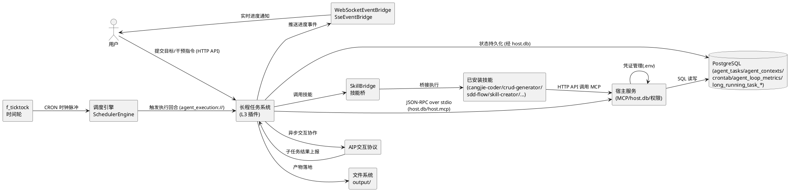
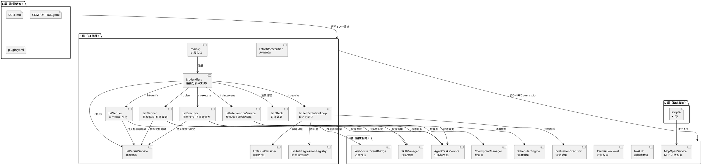
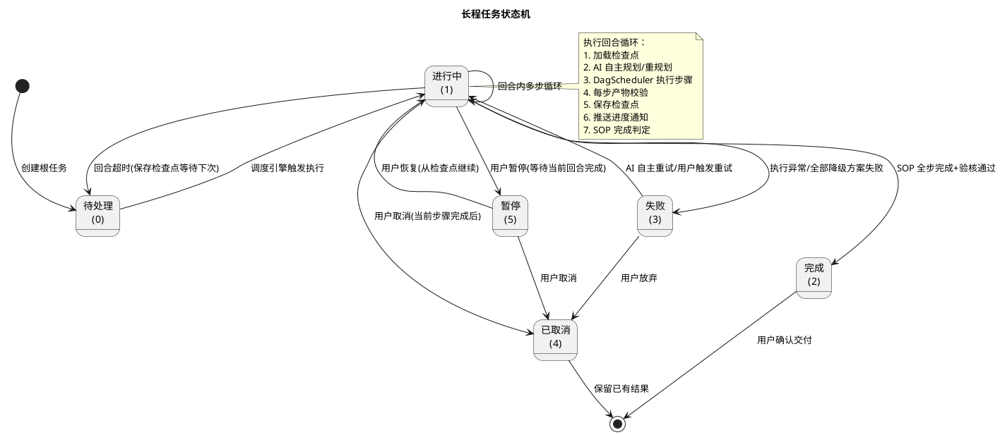
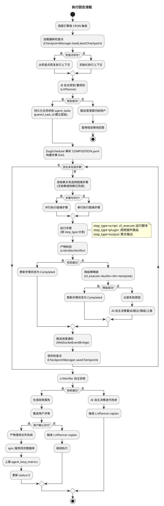
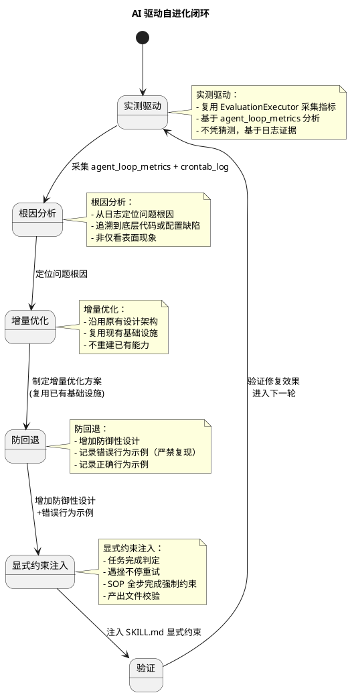
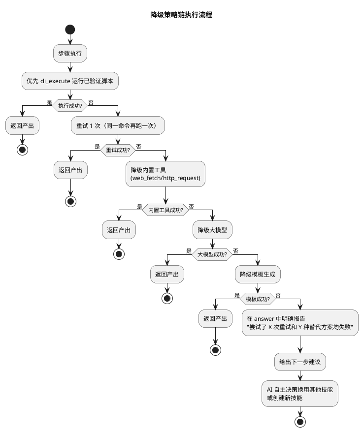
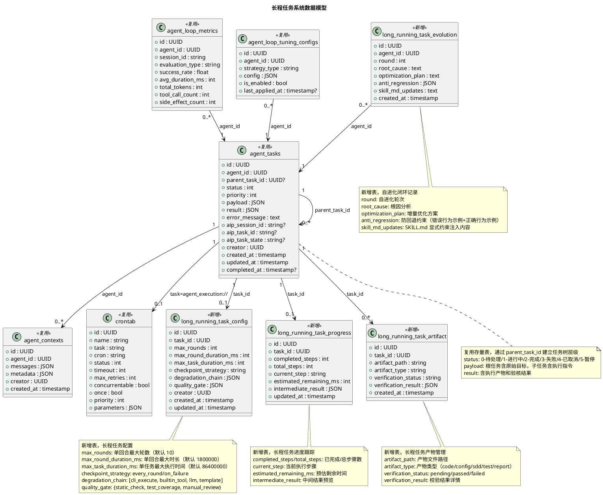

# AI 自主驱动长程任务系统技术设计文档

> 本文档将 spec.md 中定义的"AI 自主驱动长程任务系统"需求转化为可落地的技术设计方案。
> 设计原则：**确定性优先**（可确定性实现的逻辑用已有基础设施，需要推理/判断/创造的逻辑由 AI 驱动）、**复用优先**（复用已有 SchedulerEngine/DagScheduler/CheckpointManager/AIP/WebSocket/SkillBridge/三轨插件/评估调优等基础设施，不重新开发已有能力）、**L3 进程隔离**（以 mode:process 插件形式实现，故障隔离、动态启停）。

# 一、需求与存量功能关系分析

## 1.1 需求功能与存量功能对比

### 1.1.1 已实现功能

以下需求与存量代码完全匹配或高度相似，可直接复用，无需新增实现。

| 需求功能 | 存量功能 | 代码位置 | 匹配度 |
|---------|---------|---------|--------|
| 调度引擎按 CRON 触发执行回合（5.2 规则 1） | SchedulerEngine + f_ticktock 时间轮 + CronCompiler，按 crontab 表配置周期触发 | src/app/services/crontab/SchedulerEngine.cj:20-85 | 100% |
| 执行回合内多步循环 + 检查点保存（5.2 规则 2） | AgentExecutionExecutor 已实现多步循环（maxRounds=10），每轮加载检查点→执行 Agent→保存检查点→SOP 完成判定 | src/app/services/crontab/executor/AgentExecutionExecutor.cj:28-128 | 100% |
| 检查点持久化与故障恢复（5.2 规则 3、4.2 规则 1-2） | CheckpointManager.saveCheckpoint/loadLatestCheckpoint/listCheckpoints/deleteCheckpoint，落库 agent_contexts 表 | src/app/services/bridge/checkpoint_manager.cj:16-94 | 100% |
| 任务树层级与状态持久化（5.1 规则 5、6.1） | AgentTasksService + AgentTasksPO，含 parent_task_id/status/priority/payload/result/error_message/aip_session_id/aip_task_id/aip_task_state 全部字段 | src/app/services/uctoo/AgentTasksService.cj:28-80 | 100% |
| DAG 步骤编排与依赖调度（5.8 规则 3-5） | DagScheduler + DagPlanStatus/DagStepStatus/StepResult/DagScheduleResult，支持步骤状态机、依赖关系、并行执行 | src/agent_executor/dag_scheduler.cj:14-100 | 100% |
| YAML DAG 配置解析（5.8 规则 3） | yaml_dag_config_parser + dag_config，解析 steps/depends_on/step_type/input | src/agent_executor/yaml_dag_config_parser.cj、src/agent_executor/dag_config.cj | 100% |
| L3 进程隔离插件加载与故障隔离（5.7 规则 1-3） | CordisHostManager + PluginHostManager 三轨分发，mode:process 经 cordis-cj 拉起独立进程，autoRestart 崩溃自愈 | src/plugin/cordis_host_manager.cj:36-80、src/plugin/plugin_host_manager.cj:25-77 | 100% |
| 技能桥接与已安装技能调用（5.7 规则 2、5.1 规则 3） | SkillBridge.registerPluginSkills，按插件目录加载 SKILL.md 并注册到 SkillManager | src/plugin/skill_bridge.cj:26-80 | 100% |
| 实时进度推送 WebSocket/SSE（5.4 规则 1-3） | WebSocketEventBridge + SseEventBridge，已注册 agent_start/agent_end/agent_step/chat_model_end/tool_call_start/tool_call_end/sub_agent_start/sub_agent_end 全部事件 handler | src/app/services/bridge/websocket_event_bridge.cj:15-80、src/app/services/bridge/sse_event_bridge.cj | 100% |
| AIP 异步交互协作（4.5 规则 4、5.2 异常 7） | AipInteractionService + AipModeManager + AipConfigService + AicValidator + AcpsMqAdapter，符合 GB/Z 185.6 标准 | src/app/services/aip/AipInteractionService.cj:18-60 | 100% |
| 评估指标采集（5.4 规则 5、4.4 规则 3） | EvaluationExecutor + agent_loop_metrics 表（success_rate/avg_duration_ms/total_tokens/tool_call_count/side_effect_count） | src/app/services/crontab/executor/EvaluationExecutor.cj、sql/incremental/goai2026_p1_agent_loop.sql:17-57 | 100% |
| 调优策略配置（4.4 规则 4） | agent_loop_tuning_configs 表（strategy_type/config/is_enabled/last_applied_at），支持 prompt_optimization/tool_selection_optimization/execution_path_optimization | sql/incremental/goai2026_p1_agent_loop.sql:63-85 | 100% |
| 行级权限校验（4.3 规则 1、5.12 规则 2） | PermissionLevel + PermissionUtils + hasPermission，creator=userId 行级过滤 | src/app/core/PermissionLevel.cj、src/app/utils/PermissionUtils.cj | 100% |
| 幂等落库先查后写（5.12 规则 1） | PersistService.queryOne → INSERT/UPDATE，已在 due_diligence_agent 插件验证 | skills/due_diligence_agent/src/persist_service.cj:17-73 | 100% |
| MCP 开放服务调用（5.13 规则 9） | McpOpenService + McpOpenController + WebMCPProtocol，POST /api/v1/uctoo/mcp/open/call | src/app/services/mcp/McpOpenService.cj、src/app/controllers/uctoo/mcpopen/McpOpenController.cj | 100% |
| 6 步 SOP 全流程范式（5.8 规则 1） | 三个已跑通技能均采用 6 步 SOP：due_diligence_agent（validate→dd-fetch→penetrate→tier→generate→dd-save）、investment-research-assistant（fetch→clean→extract→generate→persist→output）、beichen-policy-assistant（profile→match→report→persist→output） | skills/due_diligence_agent/COMPOSITION.yaml、skills/investment-research-assistant/COMPOSITION.yaml、skills/beichen-policy-assistant/COMPOSITION.yaml | 100% |
| COMPOSITION.yaml 步骤编排声明（5.8 规则 3-4、6.7） | 三个技能均通过 steps 数组 + depends_on + step_type + input 声明 DAG，支持 ${step.output} 引用 | skills/due_diligence_agent/COMPOSITION.yaml:6-75 | 100% |
| D-P-H-E 四层分层架构（5.7 规则 7-11） | due_diligence_agent 已完整实现：D 层 scripts/*.py + P 层 src/*.cj（main/handlers/persist_service/effects）+ H 层宿主服务 + E 层 SKILL.md+COMPOSITION.yaml | skills/due_diligence_agent/{scripts/,src/,SKILL.md,COMPOSITION.yaml,plugin.yaml,cjpm.toml} | 100% |
| L3 插件工程结构（5.13 规则 10） | due_diligence_agent 含 cjpm.toml + main.cj（进程入口）+ dd_handlers.cj（路由分发+CRUD+自定义 handler）+ persist_service.cj（幂等读写）+ dd_effects.cj（可逆效果注册） | skills/due_diligence_agent/{cjpm.toml,src/main.cj,src/dd_handlers.cj,src/persist_service.cj,src/dd_effects.cj} | 100% |
| JSON-RPC over stdio 通信（5.13 规则 11） | PluginRuntime.run + ctx.invoke("host.db"/"host.mcp") + cordis-cj stdio 传输 | skills/due_diligence_agent/src/main.cj:15-29 | 100% |
| tableWhitelist 配置（5.13 规则 4） | plugin.yaml tableWhitelist 字段，列出全部需访问表，未配置时 host.db 调用被拒绝 | skills/due_diligence_agent/plugin.yaml:10-16 | 100% |

### 1.1.2 需要扩展的功能

以下需求与存量代码部分匹配，需要在现有基础上改造或扩展。

| 需求功能 | 存量功能 | 差异说明 | 扩展方向 |
|---------|---------|---------|---------|
| AI 自主目标解析与任务规划（5.1 规则 2-4） | AgentExecutionExecutor 已有多步循环，但循环内由 Agent.chat 驱动，未显式暴露"任务分解→技能选择→编排"的规划阶段；plan_react_executor 有 problem_decompose/subtask 但未与长程任务调度闭环 | 输入输出差异：存量 plan_react 输出 subtask 列表但不持久化到 agent_tasks 表；业务逻辑差异：存量规划在单次 chat 内完成，长程任务需跨回合持久化规划结果并支持动态重规划 | 扩展 AgentExecutionExecutor：在首轮加载目标后调用 plan_react 生成任务树并持久化到 agent_tasks（parent_task_id 建立层级），后续回合从检查点恢复规划上下文；新增 LrtPlanner 协调 plan_react 与 agent_tasks 持久化 |
| 动态重规划（5.1 规则 4） | plan_react_executor 支持问题分解，但不支持执行过程中基于环境变更/子任务失败的重规划 | 触发条件差异：存量规划仅初始触发，长程任务需在子任务失败、环境变更、用户调整目标时触发重规划；边界条件差异：重规划需保留已完成子任务结果，仅调整未执行部分 | 在 AgentExecutionExecutor 多步循环中增加重规划判定：检测子任务失败/环境变更/目标调整事件，触发 LrtPlanner.replan，基于已有结果增量调整规划 |
| 子任务派发与结果聚合（5.2 规则 4-5） | dag_team_orchestrator 支持子 Agent 编排，但未与 agent_tasks parent_task_id 持久化闭环 | 数据模型差异：存量 dag 编排结果在内存，长程任务需持久化到 agent_tasks 表通过 parent_task_id 关联；事件差异：子任务完成需自动上报并聚合到父任务 | 扩展 dag_team_orchestrator：派发子任务时创建 agent_tasks 子记录（parent_task_id 指向父任务），子任务完成回调更新子任务 result 字段并通知父任务 |
| 暂停/恢复/取消与用户干预（5.3 规则 1-6） | crontab 表有 status 字段（1-正常/2-禁用），agent_tasks 有 status 字段（0-5），但无统一干预 API 闭环（暂停等待当前回合完成、恢复从检查点继续、目标调整触发重规划） | 接口差异：存量无统一的 /lrt/intervene API；状态机差异：暂停需等待当前回合完成而非立即终止，目标调整需触发重规划而非简单状态变更 | 新增 LrtInterventionService：统一处理暂停（等待回合完成→crontab.status=2→agent_tasks.status=5）、恢复（crontab.status=1→从检查点继续）、取消（agent_tasks.status=4）、目标调整（触发 LrtPlanner.replan） |
| 进度事件类型扩展（5.4 规则 2） | WebSocketEventBridge 已注册 8 类事件（agent_start/end/step、chat_model_end/failure、tool_call_start/end、sub_agent_start/end），但缺少 step_start/step_complete/step_failed/checkpoint_saved/progress_update/subtask_dispatched/subtask_completed/goal_achieved 长程任务专用事件 | 事件粒度差异：存量事件面向单次 Agent 执行，长程任务需面向多回合多步骤；事件内容差异：长程任务进度需含已完成步骤数/总步骤数/预估剩余时间/中间结果预览 | 扩展 WebSocketEventBridge：新增 8 类长程任务专用事件 handler，复用 buildEventJson/pushEvent 基础设施，事件内容增加 stepIndex/totalSteps/estimatedRemaining/intermediateResult 字段 |
| 任务树可视化查询（5.4 规则 4） | AgentTasksService 有 getListWithFilter 分页查询，但无按 parent_task_id 递归构建任务树的 API | 查询差异：存量按 agent_id 分页查询，长程任务需按根任务 id 递归查询全部子任务并构建树形结构 | 扩展 AgentTasksService：新增 getTaskTree(rootTaskId) 方法，递归查询 parent_task_id 关联的全部子任务，构建树形结构返回 |
| AI 自主能力扩展（5.5 规则 1-6） | cangjie-coder/skill-creator/sdd-flow/crud-generator 技能已存在，但 AgentExecutionExecutor 未显式编排"技能不足时自主调用 cangjie-coder 编写代码→skill-creator 创建技能→sdd-flow 驱动 SDD 流程"的能力扩展闭环 | 编排差异：存量技能由 Agent.chat 内部工具调用驱动，长程任务需在规划阶段显式识别能力缺口并编排能力扩展子任务 | 在 LrtPlanner 规划阶段增加能力缺口检测：当目标所需技能不存在时，自主编排"skill-creator 创建技能"或"cangjie-coder 编写代码"子任务，经质量闸门后注册到 agent_skills |
| 质量闸门（5.5 规则 7、4.3 规则 2） | code-gen-verifier 技能存在，但未与 AgentExecutionExecutor 的代码生成流程闭环 | 流程差异：存量 code-gen-verifier 作为独立技能，长程任务需在 AI 自主生成代码后自动调用 code-gen-verifier 验证，未通过则触发修复循环 | 在 LrtPlanner 编排代码生成子任务时，强制追加 code-gen-verifier 验证子任务，未通过则触发 cangjie-coder 修复子任务，形成闭环 |
| 自主验核与交付（5.6 规则 1-6） | AgentExecutionExecutor 有 isSopCompleted 完成判定，但仅检查内容中是否包含完成标志，无结构化验核报告生成与用户评审闭环 | 判定差异：存量完成判定基于字符串匹配，长程任务需基于目标达成度/产物清单/测试结果/已知问题生成结构化验核报告；流程差异：存量完成后直接返回，长程任务需推送验核报告→用户评审→确认交付/迭代改进闭环 | 新增 LrtVerifier：任务执行完成后自主验核产物是否满足目标，生成结构化验核报告（目标达成度/产物清单/测试结果/已知问题/建议），推送用户评审，确认交付则产物落地+sync 同步，要求改进则触发 LrtPlanner.replan |
| 降级策略链（5.9 规则 1-7） | due_diligence_agent/investment-research-assistant 的 SKILL.md 已声明降级策略（脚本→内置工具→大模型→模板），但降级逻辑由 Agent.chat 内部决策，未显式声明为可配置的降级链 | 声明差异：存量降级策略在 SKILL.md 文本描述，长程任务需在 COMPOSITION.yaml 每步显式声明 degradation_chain 配置；执行差异：存量降级由 Agent 自主决策，长程任务需由 DagScheduler 按声明链依次尝试 | 扩展 COMPOSITION.yaml step schema：每步增加 degradation_chain 字段（cli_execute→builtin_tool→llm→template），DagScheduler 按链依次尝试，全部失败时报告尝试次数和失败原因 |
| 产物校验与防回退（5.10 规则 1-9） | investment-research-assistant 的 SKILL.md 已含产物校验和防回退约束（v9/v17/v18 修复记录），但约束以文本形式注入 SKILL.md，无统一校验框架 | 校验差异：存量校验由 Agent 自主执行，长程任务需由 DagScheduler 在每步执行后强制校验产出文件存在且非空；防回退差异：存量防回退约束在 SKILL.md 文本，长程任务需结构化记录错误行为示例和正确行为示例 | 扩展 DagScheduler：每步执行后调用 LrtArtifactVerifier 校验产出（文件存在+非空+日期匹配+内容校验），校验失败则补执行；新增 LrtAntiRegressionRegistry 结构化记录错误行为示例和正确行为示例，注入 SKILL.md |
| AI 驱动自进化闭环（5.11 规则 1-10） | EvaluationExecutor + agent_loop_metrics + agent_loop_tuning_configs 已实现评估采集和调优配置，但未形成"实测驱动→根因分析→增量优化→防回退→显式约束注入"的五环节闭环 | 闭环差异：存量评估为周期性触发（每小时），长程任务需基于评估结果自动驱动优化；环节差异：存量无根因分析、防回退、显式约束注入环节 | 新增 LrtSelfEvolutionLoop：复用 EvaluationExecutor 采集指标，新增根因分析（基于 agent_loop_metrics + crontab_log 日志）、增量优化方案生成、防回退约束注入 SKILL.md，形成五环节闭环 |
| 问题分级（5.11 规则 8） | crontab_log 有日志级别（INFO/WARN/ERROR），但无 P0/P1/P2/P3 问题分级和按优先级修复机制 | 分级差异：存量按日志级别分级，长程任务需按业务影响分级（P0 阻断/P1 严重/P2 中等/P3 低） | 新增 LrtIssueClassifier：基于日志和指标按 P0-P3 分级，LrtSelfEvolutionLoop 按优先级依次修复 |
| 前后端协同（5.11 规则 9） | sync 服务 + SyncManager + ChangeDetector 已实现文件系统与数据库双向同步，但前端产物重新构建（npm run build）需人工触发 | 协同差异：存量 sync 服务同步源代码，长程任务需在代码修复后自动触发前端重新构建 | 在 LrtSelfEvolutionLoop 修复前端代码后，自主编排"npm run build"子任务，经 cli_execute 执行，产物经 sync 服务同步 |

### 1.1.3 需要新增的功能或接口

以下需求在存量代码中完全没有对应实现，需新增。

#### 1.1.3.1 长程任务插件本体（L3 进程隔离轨）

- **功能点**：long-running-task L3 插件工程，含 main.cj（进程入口）+ lrt_handlers.cj（路由分发+CRUD+自定义 handler）+ lrt_persist_service.cj（幂等读写封装）+ lrt_effects.cj（可逆效果注册）
- **输入**：JSON-RPC over stdio 消息（method + path + body + userId + permissions）
- **输出**：JSON-RPC 响应（code + msg + data）
- **核心逻辑**：复用 due_diligence_agent 插件工程结构，注册 long-running-task 相关表 CRUD + 自定义路由（lrt-plan/lrt-execute/lrt-intervene/lrt-verify/lrt-evolve）
- **依赖**：ystyle::cordis_plugin、ystyle::cordis_core、jsonvalue、ystyle::jsonrpc、宿主 host.db/host.mcp

#### 1.1.3.2 长程任务规划服务（LrtPlanner）

- **功能点**：AI 自主目标解析、任务树分解、技能选择与编排、动态重规划
- **输入**：任务目标（自然语言）+ 环境状态（已安装技能、数据库结构、文件系统）+ 已有规划上下文（重规划时）
- **输出**：任务树（根任务 + 子任务列表，含 parent_task_id/payload/skill_sequence/acceptance_criteria）+ 技能编排序列
- **核心逻辑**：复用 plan_react_executor 的 problem_decompose/subtask 能力，扩展为持久化到 agent_tasks 表；技能发现复用 SkillManager；技能选择由 AI 自主决策（基于目标 + 技能描述 + 环境状态）
- **依赖**：plan_react_executor、SkillManager、AgentTasksService、CheckpointManager

#### 1.1.3.3 长程任务干预服务（LrtInterventionService）

- **功能点**：统一处理暂停/恢复/取消/强制取消/目标调整/追加约束
- **输入**：任务 ID + 干预类型（pause/resume/cancel/force_cancel/adjust_goal/add_constraint）+ 干预内容（目标调整时的新目标/追加约束）
- **输出**：操作结果（成功/失败 + 当前任务状态）
- **核心逻辑**：暂停→等待当前回合完成→crontab.status=2→agent_tasks.status=5；恢复→crontab.status=1→从检查点继续；取消→当前步骤完成后 agent_tasks.status=4；强制取消→立即终止 agent_tasks.status=4；目标调整→触发 LrtPlanner.replan
- **依赖**：AgentTasksService、CrontabDAO、CheckpointManager、LrtPlanner、WebSocketEventBridge

#### 1.1.3.4 长程任务验核服务（LrtVerifier）

- **功能点**：自主验核产物是否满足目标、生成结构化验核报告、用户评审闭环、产物交付
- **输入**：任务 ID + 原始目标 + 执行产物清单
- **输出**：验核报告（目标达成度/产物清单/测试结果/已知问题/建议后续动作）+ 交付状态
- **核心逻辑**：AI 自主比对产物与目标，生成结构化报告；推送用户评审；确认交付→产物落地文件系统→sync 服务同步数据库→上报 agent_loop_metrics；要求改进→触发 LrtPlanner.replan
- **依赖**：AgentTasksService、SyncManager、WebSocketEventBridge、agent_loop_metrics

#### 1.1.3.5 长程任务产物校验器（LrtArtifactVerifier）

- **功能点**：每步执行后校验产出文件存在且非空、日期匹配、内容校验；answer 前终检全部关键产物
- **输入**：步骤名 + 产出路径 + 预期日期 + 验收条件
- **输出**：校验结果（通过/失败 + 失败原因）
- **核心逻辑**：file_read 检查文件存在且非空；日期匹配校验（忽略旧日期文件）；内容校验（检查内容含本次执行数据）；校验失败触发补执行
- **依赖**：文件系统（经 cli_execute/file_read）

#### 1.1.3.6 长程任务防回退注册表（LrtAntiRegressionRegistry）

- **功能点**：结构化记录错误行为示例和正确行为示例，注入 SKILL.md 显式约束
- **输入**：问题 ID + 错误行为描述 + 正确行为描述 + 修复版本
- **输出**：SKILL.md 显式约束片段
- **核心逻辑**：每轮修复增加防御性设计和错误行为示例（严禁复现），通过显式约束注入 SKILL.md（任务完成判定、遇挫不停重试、SOP 全步完成强制约束、产出文件校验等）
- **依赖**：SKILL.md 文件系统

#### 1.1.3.7 长程任务自进化闭环（LrtSelfEvolutionLoop）

- **功能点**：实测驱动→根因分析→增量优化→防回退→显式约束注入五环节闭环
- **输入**：Agent ID + 评估时间范围
- **输出**：优化报告（根因/优化方案/修复记录/防回退约束）
- **核心逻辑**：复用 EvaluationExecutor 采集 agent_loop_metrics 指标；根因分析基于日志（crontab_log + agent_tasks.error_message）定位问题根因；增量优化方案复用已有基础设施；防回退经 LrtAntiRegressionRegistry 注入 SKILL.md；问题按 P0-P3 分级依次修复
- **依赖**：EvaluationExecutor、agent_loop_metrics、agent_loop_tuning_configs、LrtAntiRegressionRegistry、LrtIssueClassifier

#### 1.1.3.8 长程任务问题分级器（LrtIssueClassifier）

- **功能点**：基于日志和指标按 P0 阻断/P1 严重/P2 中等/P3 低分级
- **输入**：日志记录 + 评估指标
- **输出**：问题列表（含分级 + 根因 + 修复建议）
- **核心逻辑**：P0=任务完全阻断无法继续；P1=核心功能异常但有 workaround；P2=非核心功能异常；P3=优化建议
- **依赖**：crontab_log、agent_loop_metrics

#### 1.1.3.9 长程任务专用数据库表

- **功能点**：long_running_task_config（长程任务配置表，含执行回合上限/检查点策略/质量闸门配置/降级策略链配置）+ long_running_task_progress（长程任务进度表，含已完成步骤数/总步骤数/当前步骤/预估剩余时间/中间结果）+ long_running_task_artifact（长程任务产物表，含产物路径/类型/校验状态/验核结果）+ long_running_task_evolution（长程任务自进化记录表，含轮次/根因/优化方案/防回退约束）
- **输入**：DDL（sql/incremental/long_running_task.sql）
- **输出**：数据库表 + CRUD API（经 crudgen 生成）
- **核心逻辑**：遵循 uctoo-v4-module-development.md 通用模块开发流程，DDL 由人工执行
- **依赖**：PostgreSQL、crudgen、loaddbinfo

## 1.2 存量功能详细分析

### 1.2.1 AgentExecutionExecutor（执行回合循环）

**接口契约**：
- 入参：CrontabExecutionContext（含 taskUri=agent_execution://<agentId>、parameters、crontabId）
- 出参：ExecutionResult（success/failure + content + duration + summary）
- 异常：Agent 加载失败、Agent 数据为空、Agent 执行异常
- 副作用：更新 agent_tasks 状态、保存检查点到 agent_contexts、写入 crontab_log

**业务规则**：
1. 解析 taskUri 提取 agentId
2. 经 AgentRuntimeBridge.loadFromDatabase 加载 Agent
3. 多步循环（maxRounds=10）：每轮加载检查点→执行 Agent.chat→保存检查点→SOP 完成判定→未完成则继续
4. SOP 完成判定（isSopCompleted）：检查内容中是否包含完成标志（"## 完成总结"/"任务已完成"/"投研报告已生成"等）或内容较短且无工具调用格式
5. 完成后更新 agent_tasks.status=2，失败更新 status=3，取消更新 status=4

**扩展点**：
- maxRounds 可配置化（当前硬编码为 10）
- isSopCompleted 的完成标志可配置化（当前硬编码列表）
- 多步循环内未显式暴露"规划→执行→观察"三阶段，由 Agent.chat 内部隐式驱动

**约束**：
- 单次执行回超过 maxRounds 后退出循环（未显式保存检查点等待下次调度）
- 检查点保存异常被静默捕获（catch (_: Exception) {}），不影响执行流程
- 任务状态更新异步执行（spawn {}），不阻塞主流程

### 1.2.2 DagScheduler（DAG 步骤编排）

**接口契约**：
- 入参：DAG 配置（steps + depends_on + step_type + input）+ 执行上下文
- 出参：DagScheduleResult（planName + status + stepResults + totalDurationMs + completedSteps + failedSteps）
- 异常：DAG 构建失败（循环依赖）、步骤执行失败
- 副作用：步骤状态变更（Pending→Ready→Running→Completed/Failed/Skipped）

**业务规则**：
1. 解析 YAML DAG 配置构建步骤图
2. 按依赖关系拓扑排序，无依赖步骤可并行
3. 每步执行后更新 StepResult（status/output/errorMessage/durationMs）
4. 步骤失败不中断整个 DAG，由 DagPlanStatus 标记为 Failed

**扩展点**：
- step_type 支持 script/plugin/output，可扩展 llm/builtin
- 步骤间产出传递通过 ${step.output} 引用，支持路径模板和变量替换
- 条件执行（condition）支持跳过步骤

**约束**：
- DAG 不得存在循环依赖（构建时校验）
- 步骤产出在内存中传递，未持久化（长程任务需跨回合持久化）

### 1.2.3 CheckpointManager（检查点持久化）

**接口契约**：
- 入参：agentId + AgentExecution（含 messages/chatRound）+ taskId
- 出参：contextId（检查点 ID）
- 异常：序列化/反序列化异常、数据库写入异常
- 副作用：写入 agent_contexts 表（agent_id/messages/metadata）

**业务规则**：
1. 序列化 AgentExecution.messages 为 JSON
2. 构造 metadata（taskId/chatRound/savedAt）
3. 经 AgentContextsService.create 写入 agent_contexts 表
4. loadLatestCheckpoint 按 created_at DESC 查询最新检查点

**扩展点**：
- metadata 为 JSON 格式，可扩展任意元数据字段
- 检查点列表支持分页查询

**约束**：
- 检查点保存异常被静默捕获（返回空字符串），不影响执行流程
- 检查点加载异常被静默捕获（返回 None），调用方需处理 None 情况

### 1.2.4 CordisHostManager（L3 进程隔离轨宿主侧总控）

**接口契约**：
- 入参：plugin.yaml mode:process 条目（name/command/autoRestart/tableWhitelist/routes/protocol）
- 出参：PluginInstance 状态（InstanceStatus → PluginState 映射）
- 异常：插件进程崩溃、JSON-RPC 通信异常、配置解析异常
- 副作用：拉起独立进程、注册 host.db/host.mcp 服务代理、回写 agent_skills.runtime_status

**业务规则**：
1. 从 plugin.yaml 构造 cordis PluginEntry 期望状态
2. 经 PluginManager(stdio) + PluginHost(reconcile) 拉起独立进程
3. 安装状态变更监听器：InstanceStatus 变化时映射为 PluginState 并回写 agent_skills.runtime_status
4. 安装宿主服务钩子：host.db/host.log/host.cache 经 CordisHostServices 代理
5. 优雅停机：宿主退出时按依赖逆序 terminate 全部 process 插件

**扩展点**：
- autoRestart=true 时插件进程崩溃自动重启
- 日志汇聚：插件进程 stdout/stderr 经 cordis 采集转发宿主 LogUtils

**约束**：
- 传输固定 stdio（UDS 不启用）
- 插件故障不影响宿主和其他插件（进程隔离）

### 1.2.5 due_diligence_agent 插件（D-P-H-E 四层分层参考实现）

**接口契约**：
- 入参：JSON-RPC over stdio 消息（method + path + body + userId + permissions）
- 出参：JSON-RPC 响应（code + msg + data）
- 异常：路由未匹配、host.db 调用失败、host.mcp 调用失败
- 副作用：6 张表 CRUD + dd-fetch 采集聚合 + dd-save 幂等落库

**业务规则**：
1. D 层（scripts/*.py）：业务逻辑由 Python 脚本承载，经 cli_execute 调用，脚本通过 HTTP API 调用 H 层宿主 MCP 开放服务
2. P 层（src/*.cj）：仓颉进程隔离轨插件，main.cj 进程入口→DdHandlers.register 注册路由→DdEffects.register 注册可逆效果→PersistService 幂等读写
3. H 层（宿主服务）：仓颉宿主提供 MCP 开放服务 + host.db + 行级权限 + 审计日志，凭证仅存宿主 .env
4. E 层（SKILL.md + COMPOSITION.yaml）：SKILL.md 声明 SOP 和步骤说明，COMPOSITION.yaml 声明步骤编排和依赖关系

**扩展点**：
- 路由分发支持自定义路由（dd-fetch/dd-save）和标准 CRUD 路由
- PersistService 幂等读写封装可复用于其他插件
- DdEffects 可逆效果注册框架可复用于其他插件

**约束**：
- tableWhitelist 必须配置，否则 host.db 调用被拒绝
- permissions 空数组会触发行级权限过滤导致查不到数据
- Python 脚本不得禁用 SSL 校验（verify=False）
- MCP 调用须优先用 http_lib 库（已替代 stdx http）
# 二、增量设计方案

## 2.1 实现模型

### 2.1.1 上下文视图

长程任务系统作为 L3 进程隔离轨插件，经 CordisHostManager 拉起独立进程，通过 JSON-RPC over stdio 与宿主通信。上游接收用户目标和调度引擎时钟脉冲，下游经 host.db/host.mcp 访问宿主数据库和 MCP 开放服务，经 SkillBridge 调用已安装技能，经 WebSocketEventBridge/SseEventBridge 推送进度通知，经 AIP 交互协议与外部智能体协作。



**通信协议与调用频率**：
- 用户→长程任务系统：HTTP API（RESTful），低频（提交目标/干预时）
- 调度引擎→长程任务系统：CRON 触发，中频（按 CRON 表达式，默认每分钟）
- 长程任务系统→宿主：JSON-RPC over stdio，高频（每步执行、每次 DB 操作）
- 长程任务系统→WebSocket：WebSocket/SSE 推送，高频（每步状态变更）
- 长程任务系统→AIP：异步消息队列，中频（跨 Agent 协作时）

### 2.1.2 服务/组件总体架构

长程任务系统遵循 D-P-H-E 四层分层架构，以 L3 进程隔离轨插件形式实现。P 层插件内部按职责划分为规划、执行、干预、验核、自进化五个核心组件，复用宿主 H 层的数据库、MCP、权限基础设施，经 E 层 SKILL.md + COMPOSITION.yaml 声明 SOP 编排。



**模块划分及职责**：
- **main.cj**：L3 插件进程入口，经 PluginRuntime.run 拉起，注册 LrtHandlers 和 LrtEffects
- **LrtHandlers**：路由分发，支持 long_running_task_* 表 CRUD + 自定义路由（lrt-plan/lrt-execute/lrt-intervene/lrt-verify/lrt-evolve）
- **LrtPlanner**：AI 自主目标解析、任务树分解、技能选择与编排、动态重规划，复用 plan_react_executor
- **LrtExecutor**：执行回合循环、子任务派发与结果聚合，复用 AgentExecutionExecutor 多步循环 + DagScheduler DAG 编排
- **LrtInterventionService**：统一处理暂停/恢复/取消/强制取消/目标调整/追加约束
- **LrtVerifier**：自主验核产物、生成结构化验核报告、用户评审闭环、产物交付
- **LrtSelfEvolutionLoop**：实测驱动→根因分析→增量优化→防回退→显式约束注入五环节闭环
- **LrtArtifactVerifier**：每步产物校验（文件存在+非空+日期匹配+内容校验）
- **LrtAntiRegressionRegistry**：结构化记录错误行为示例和正确行为示例，注入 SKILL.md
- **LrtIssueClassifier**：基于日志和指标按 P0-P3 分级
- **LrtPersistService**：幂等读写封装（先查后写 + 行级权限 + 批量隔离），复用 due_diligence_agent PersistService 模式
- **LrtEffects**：可逆效果注册（卸载时逆序执行清理）

**配置项及取值策略**：
- `maxRounds`：单次执行回合最大轮数，默认 10，可经 plugin.yaml config 配置
- `maxRoundDurationMs`：单回合最大时长，默认 1800000（30 分钟），超时保存检查点进入下一回合
- `maxTaskDurationMs`：单任务最大执行时间，默认 86400000（24 小时），超时自动暂停并通知用户
- `maxConcurrentTasks`：同时执行的长程任务数上限，默认 100，超出进入优先级队列
- `checkpointStrategy`：检查点保存策略，默认 every_round（每回合保存），可选 on_failure（仅失败时）
- `degradationChain`：降级策略链，默认 [cli_execute, builtin_tool, llm, template]
- `qualityGate`：质量闸门配置，含 static_check/test_coverage/manual_review 三个开关

### 2.1.3 实现设计文档

#### 2.1.3.1 长程任务状态机

长程任务状态流转遵循以下状态机，status 字段存储于 agent_tasks 表。



**状态迁移触发条件与处理策略**：
- `pending→running`：调度引擎按 CRON 触发，AgentExecutionExecutor.execute 开始执行
- `running→running`：回合内多步循环，每轮加载检查点→执行→保存检查点→SOP 完成判定
- `running→completed`：SOP 全步完成 + LrtVerifier 验核通过，更新 status=2
- `running→failed`：执行异常或全部降级方案均失败，更新 status=3，记录 error_message
- `running→paused`：用户发起暂停，等待当前回合完成后更新 status=5，crontab.status=2
- `running→cancelled`：用户发起取消，当前步骤完成后更新 status=4，保留 result
- `running→pending`：回合超时（超过 maxRoundDurationMs），保存检查点，等待下次调度触发
- `paused→running`：用户发起恢复，crontab.status=1，从检查点继续执行
- `failed→running`：AI 自主决策重试或用户触发重试，从检查点恢复

#### 2.1.3.2 执行回合流程

每次调度引擎触发执行一个回合，回合内遵循"加载检查点→AI 自主规划→DAG 步骤执行→产物校验→保存检查点→进度通知→SOP 完成判定"的流程。



#### 2.1.3.3 AI 驱动自进化闭环

自进化闭环遵循"实测驱动→根因分析→增量优化→防回退→显式约束注入"五环节，持续迭代优化。



#### 2.1.3.4 降级策略链执行流程

每个执行步骤声明降级策略链，确保流程不中断。遵循"遇挫不停"原则：任何步骤失败必须先重试一次，重试仍失败才换方案。



## 2.2 接口设计

### 2.2.1 总体设计

长程任务系统接口分为三类：用户 API（HTTP RESTful，供用户提交目标/干预/查询）、插件 RPC（JSON-RPC over stdio，L3 插件与宿主通信）、内部服务接口（P 层组件间调用）。

| 接口分类 | 接口名 | 通信协议 | 稳定性等级 | 说明 |
|---------|--------|---------|-----------|------|
| 用户 API | POST /api/v1/uctoo/long_running_task/add | HTTP RESTful | 稳定 | 提交长程任务目标 |
| 用户 API | POST /api/v1/uctoo/long_running_task/intervene | HTTP RESTful | 稳定 | 暂停/恢复/取消/调整目标 |
| 用户 API | GET /api/v1/uctoo/long_running_task/tree/:rootId | HTTP RESTful | 稳定 | 查询任务树 |
| 用户 API | GET /api/v1/uctoo/long_running_task/progress/:taskId | HTTP RESTful | 稳定 | 查询任务进度 |
| 用户 API | GET /api/v1/uctoo/long_running_task/checkpoints/:taskId | HTTP RESTful | 稳定 | 查询检查点列表 |
| 用户 API | POST /api/v1/uctoo/long_running_task/verify/:taskId | HTTP RESTful | 稳定 | 触发自主验核 |
| 用户 API | POST /api/v1/uctoo/long_running_task/evolve/:agentId | HTTP RESTful | 实验 | 触发自进化闭环 |
| 插件 RPC | lrt-plan | JSON-RPC over stdio | 稳定 | AI 自主规划 |
| 插件 RPC | lrt-execute | JSON-RPC over stdio | 稳定 | 执行回合 |
| 插件 RPC | lrt-intervene | JSON-RPC over stdio | 稳定 | 用户干预 |
| 插件 RPC | lrt-verify | JSON-RPC over stdio | 稳定 | 自主验核 |
| 插件 RPC | lrt-evolve | JSON-RPC over stdio | 实验 | 自进化闭环 |
| 插件 RPC | long_running_task_* CRUD | JSON-RPC over stdio | 稳定 | 标准 CRUD |
| 内部服务 | LrtPlanner.plan/replan | 函数调用 | 稳定 | 规划/重规划 |
| 内部服务 | LrtExecutor.executeRound | 函数调用 | 稳定 | 执行回合 |
| 内部服务 | LrtArtifactVerifier.verify | 函数调用 | 稳定 | 产物校验 |
| 内部服务 | LrtSelfEvolutionLoop.run | 函数调用 | 实验 | 自进化闭环 |

**接口变更策略**：
- 稳定接口：向后兼容，字段新增不删除，变更需版本化
- 实验接口：可自由变更，正式发布前需稳定化
- CRUD 接口：由 crudgen 自动生成，遵循 uctoo-v4 API 规范

### 2.2.2 接口清单

#### 2.2.2.1 提交长程任务目标

**接口签名**：
```
POST /api/v1/uctoo/long_running_task/add
Content-Type: application/json
Authorization: Bearer <accessToken>

Request:
{
  "goal": string,              // 自然语言目标描述（必填）
  "priority": int,             // 优先级 1-5（可选，默认 3）
  "cron": string,              // CRON 表达式（可选，默认 "0 * * * * *" 每分钟）
  "constraints": object,       // 初始约束（可选）
  "agentId": string            // 指定 Agent ID（可选，默认使用主 Agent）
}

Response:
{
  "code": int,
  "msg": string,
  "data": {
    "taskId": string,          // 根任务 ID
    "agentId": string,         // 执行 Agent ID
    "crontabId": string,       // crontab 记录 ID
    "status": int,             // 初始状态（0-待处理）
    "createdAt": string
  }
}
```

**业务说明**：用户提交自然语言目标，系统创建根任务到 agent_tasks 表（status=0），创建 crontab 记录（task=agent_execution://<agentId>），由调度引擎按 CRON 触发执行。

**前置条件**：用户已认证，accessToken 有效。

**后置条件**：agent_tasks 表新增一条根任务记录，crontab 表新增一条调度记录，调度引擎加载新任务。

**异常映射**：
- 40001：目标描述为空
- 40002：CRON 表达式非法
- 40301：权限不足

**调用示例**：
```bash
curl -X POST https://javatoarktsapi.uctoo.com/api/v1/uctoo/long_running_task/add \
  -H "Authorization: Bearer <accessToken>" \
  -H "Content-Type: application/json" \
  -d '{"goal":"为用户管理模块生成完整 CRUD 并上线","priority":4}'
```

#### 2.2.2.2 用户干预

**接口签名**：
```
POST /api/v1/uctoo/long_running_task/intervene
Content-Type: application/json
Authorization: Bearer <accessToken>

Request:
{
  "taskId": string,            // 任务 ID（必填）
  "action": string,            // 干预类型：pause/resume/cancel/force_cancel/adjust_goal/add_constraint（必填）
  "content": object            // 干预内容（adjust_goal 时为新目标，add_constraint 时为新约束）
}

Response:
{
  "code": int,
  "msg": string,
  "data": {
    "taskId": string,
    "status": int,             // 当前任务状态
    "applied": bool            // 干预是否已应用
  }
}
```

**业务说明**：统一处理暂停/恢复/取消/强制取消/目标调整/追加约束。暂停等待当前回合完成后生效，恢复从检查点继续，目标调整触发重规划。

**前置条件**：任务存在且状态允许该干预操作（如已完成的任务不能暂停）。

**后置条件**：
- pause：crontab.status=2，agent_tasks.status=5（等待当前回合完成）
- resume：crontab.status=1，agent_tasks.status=1
- cancel：agent_tasks.status=4（保留 result）
- force_cancel：agent_tasks.status=4（立即终止）
- adjust_goal：触发 LrtPlanner.replan，基于新目标调整规划
- add_constraint：触发 LrtPlanner.replan，基于新约束调整规划

**异常映射**：
- 40401：任务不存在
- 40003：任务状态不允许该干预操作
- 40301：权限不足

#### 2.2.2.3 查询任务树

**接口签名**：
```
GET /api/v1/uctoo/long_running_task/tree/:rootId
Authorization: Bearer <accessToken>

Response:
{
  "code": int,
  "msg": string,
  "data": {
    "root": {                  // 根任务
      "id": string,
      "goal": string,
      "status": int,
      "priority": int,
      "progress": { "completedSteps": int, "totalSteps": int, "currentStep": string }
    },
    "children": [              // 子任务树（递归）
      {
        "id": string,
        "parentId": string,
        "payload": object,
        "status": int,
        "result": object,
        "children": [...]
      }
    ]
  }
}
```

**业务说明**：按根任务 ID 递归查询全部子任务（通过 parent_task_id 关联），构建树形结构返回，各节点含状态和进度信息。

**前置条件**：任务存在且用户有权限查看（行级权限过滤）。

**后置条件**：无副作用（只读查询）。

#### 2.2.2.4 lrt-plan（AI 自主规划）

**接口签名**：
```
JSON-RPC over stdio
method: "lrt-plan"
params: {
  "goal": string,              // 任务目标
  "agentId": string,           // Agent ID
  "taskId": string,            // 根任务 ID
  "context": object,           // 已有规划上下文（重规划时）
  "constraints": object        // 约束条件
}
result: {
  "taskTree": [                // 任务树
    {
      "taskId": string,
      "parentTaskId": string,
      "payload": object,       // 子任务内容
      "skillSequence": [string], // 技能编排序列
      "acceptanceCriteria": string  // 验收条件
    }
  ],
  "composition": object        // COMPOSITION.yaml 内容
}
```

**业务说明**：AI 自主目标解析、任务树分解、技能选择与编排。复用 plan_react_executor 的 problem_decompose/subtask 能力，扩展为持久化到 agent_tasks 表。

**前置条件**：Agent 已加载，目标非空。

**后置条件**：agent_tasks 表新增子任务记录（parent_task_id 指向根任务），COMPOSITION.yaml 生成或更新。

**异常映射**：
- 40001：目标模糊不可规划（AI 自主发起澄清提问）
- 40002：技能不可用（AI 自主决策创建新技能或换用替代技能）

#### 2.2.2.5 lrt-execute（执行回合）

**接口签名**：
```
JSON-RPC over stdio
method: "lrt-execute"
params: {
  "taskId": string,            // 任务 ID
  "agentId": string,           // Agent ID
  "composition": object,       // COMPOSITION.yaml 内容
  "checkpoint": object         // 检查点（恢复时）
}
result: {
  "round": int,                // 回合数
  "status": string,            // 回合状态
  "stepResults": [object],     // 步骤结果
  "checkpoint": object,        // 新检查点
  "sopCompleted": bool         // SOP 是否完成
}
```

**业务说明**：执行一个回合，回合内由 DagScheduler 按 COMPOSITION.yaml DAG 执行步骤，每步产物校验+降级策略链，回合后保存检查点+推送进度。

**前置条件**：任务状态为进行中（status=1），COMPOSITION.yaml 已生成。

**后置条件**：agent_tasks 状态更新，agent_contexts 新增检查点，crontab_log 记录执行日志，agent_loop_metrics 采集指标。

#### 2.2.2.6 lrt-verify（自主验核）

**接口签名**：
```
JSON-RPC over stdio
method: "lrt-verify"
params: {
  "taskId": string,            // 任务 ID
  "goal": string,              // 原始目标
  "artifacts": [string]        // 产物清单
}
result: {
  "report": {
    "goalAchievement": float,  // 目标达成度 0.0-1.0
    "artifacts": [object],     // 产物清单（含校验状态）
    "testResults": object,     // 测试结果
    "knownIssues": [string],   // 已知问题
    "suggestions": [string]    // 建议后续动作
  },
  "deliveryStatus": string     // delivered/improving/abandoned
}
```

**业务说明**：AI 自主比对产物与目标，生成结构化验核报告，推送用户评审。确认交付则产物落地+sync 同步，要求改进则触发重规划。

**前置条件**：任务 SOP 全步完成。

**后置条件**：验核报告持久化到 long_running_task_artifact 表，agent_loop_metrics 上报验核指标，产物落地文件系统（用户确认后）。

#### 2.2.2.7 lrt-evolve（自进化闭环）

**接口签名**：
```
JSON-RPC over stdio
method: "lrt-evolve"
params: {
  "agentId": string,           // Agent ID
  "timeRangeHours": int        // 评估时间范围（小时）
}
result: {
  "round": int,                // 自进化轮次
  "issues": [                  // 问题列表（按 P0-P3 分级）
    {
      "level": string,         // P0/P1/P2/P3
      "rootCause": string,     // 根因
      "fixAction": string,     // 修复动作
      "antiRegression": object // 防回退约束
    }
  ],
  "skillMdUpdates": [string]   // SKILL.md 显式约束注入内容
}
```

**业务说明**：执行自进化闭环五环节：实测驱动（复用 EvaluationExecutor）→根因分析→增量优化→防回退→显式约束注入 SKILL.md。

**前置条件**：Agent 存在且有执行历史（agent_loop_metrics 有记录）。

**后置条件**：SKILL.md 新增显式约束，agent_loop_tuning_configs 更新调优策略，long_running_task_evolution 记录自进化轮次。

## 2.3 数据模型

### 2.3.1 设计目标

**需支持的业务场景**：
1. 长程任务的创建、规划、执行、暂停/恢复/取消、验核、交付全生命周期
2. 任务树层级关系（根任务→子任务→叶节点）的持久化与递归查询
3. 执行回合的检查点保存与故障恢复
4. 进度跟踪与实时推送（已完成步骤数/总步骤数/当前步骤/预估剩余时间）
5. 产物管理与校验（产物路径/类型/校验状态/验核结果）
6. 自进化闭环记录（轮次/根因/优化方案/防回退约束）
7. 评估指标采集与调优策略配置（复用已有 agent_loop_metrics/agent_loop_tuning_configs）

**性能、容量、扩展性目标**：
- 单任务最大执行时间 24 小时，最大回合数 1000（可配置）
- 同时执行的长程任务数上限 100，任务队列支持 10000 个待执行任务
- 检查点保存延迟 ≤ 500ms，进度通知延迟 ≤ 1s
- 任务树递归查询延迟 ≤ 100ms（单层子任务数 ≤ 100）

**与存量数据的兼容策略**：
- 复用 agent_tasks 表（通过 parent_task_id 建立任务树层级，通过 aip_session_id/aip_task_id/aip_task_state 支持 AIP 协作）
- 复用 agent_contexts 表（检查点持久化，metadata 含 task_id/chat_round/saved_at）
- 复用 crontab 表（调度配置，task=agent_execution://<agentId>）
- 复用 agent_loop_metrics/agent_loop_tuning_configs 表（评估指标和调优配置）
- 新增 long_running_task_config/long_running_task_progress/long_running_task_artifact/long_running_task_evolution 四张表（长程任务专用配置和状态）

### 2.3.2 模型实现

长程任务系统数据模型分为两部分：复用存量表（agent_tasks/agent_contexts/crontab/agent_loop_metrics/agent_loop_tuning_configs）和新增表（long_running_task_config/long_running_task_progress/long_running_task_artifact/long_running_task_evolution）。



**核心领域对象**：
- **TaskGoal**：任务目标，用户自然语言描述，是长程任务的起点和验核依据
- **TaskTree**：任务树，通过 agent_tasks.parent_task_id 建立层级，根任务对应原始目标，叶节点对应原子操作
- **ExecutionRound**：执行回合，一次完整推理-执行-观察循环，由 AgentExecutionExecutor 多步循环驱动
- **Checkpoint**：检查点，执行回合结束时的完整状态快照，存储于 agent_contexts 表
- **SkillSequence**：技能编排序列，AI 自主选择的技能执行顺序，声明于 COMPOSITION.yaml
- **DegradationChain**：降级策略链，每步声明的工具优先级链（cli_execute→builtin_tool→llm→template）
- **Artifact**：产物，每步执行后的产出文件，经 LrtArtifactVerifier 校验
- **VerificationReport**：验核报告，含目标达成度/产物清单/测试结果/已知问题/建议
- **EvolutionRound**：自进化轮次，含根因/优化方案/防回退约束/显式约束注入

**对象创建和销毁策略**：
- TaskGoal：用户提交时创建，任务完成或放弃后归档
- TaskTree：LrtPlanner 规划时创建，重规划时增量调整（保留已完成子任务）
- ExecutionRound：调度引擎触发时创建，回合完成后归档到 crontab_log
- Checkpoint：每回合结束后保存，任务完成后保留（供故障恢复），可经配置定期清理
- Artifact：每步执行后创建，经校验后持久化到 long_running_task_artifact 表
- EvolutionRound：自进化闭环每轮执行时创建，永久保留（供审计追溯）

**持久化策略**：
- agent_tasks：复用存量表，经 AgentTasksService CRUD，遵循行级权限（creator=userId）
- agent_contexts：复用存量表，经 CheckpointManager 读写，metadata 含 task_id/chat_round/saved_at
- crontab：复用存量表，经 CrontabDAO CRUD，task=agent_execution://<agentId>
- agent_loop_metrics/agent_loop_tuning_configs：复用存量表，经 EvaluationExecutor 采集和调优
- long_running_task_config/progress/artifact/evolution：新增表，经 crudgen 生成标准 CRUD，DDL 在 sql/incremental/long_running_task.sql 由人工执行

## 2.4 插件配置与 SOP 编排声明

### 2.4.1 plugin.yaml 配置

长程任务系统以 L3 进程隔离轨插件形式实现，plugin.yaml 声明 mode:process，复用 due_diligence_agent 插件配置模式。

```yaml
# plugin.yaml（关键配置项，非完整文件）
name: long-running-task
version: 1.0.0
mode: process                    # L3 进程隔离轨
protocol: jsonrpc-stdio          # JSON-RPC over stdio 通信
command: ./target/release/bin/skill_long_running_task.exe
description: AI 自主驱动长程任务系统 L3 进程隔离轨插件
enabled: true
order: 10
autoRestart: true                # 进程崩溃自动重启
config:
  maxRounds: 10                  # 单回合最大轮数
  maxRoundDurationMs: 1800000    # 单回合最大时长（30 分钟）
  maxTaskDurationMs: 86400000    # 单任务最大执行时间（24 小时）
  maxConcurrentTasks: 100        # 同时执行的任务数上限
  checkpointStrategy: every_round  # 检查点保存策略
  degradationChain:              # 降级策略链
    - cli_execute
    - builtin_tool
    - llm
    - template
  qualityGate:                   # 质量闸门配置
    staticCheck: true
    testCoverage: true
    manualReview: false          # 非关键变更不强制人工评审
tableWhitelist:                  # 表白名单（必须配置）
  - agent_tasks
  - agent_contexts
  - crontab
  - crontab_log
  - agent_loop_metrics
  - agent_loop_tuning_configs
  - long_running_task_config
  - long_running_task_progress
  - long_running_task_artifact
  - long_running_task_evolution
  - aip_interaction_session
  - aip_interaction_task
routes:
  # long_running_task_config CRUD
  - method: POST
    path: /api/v1/uctoo/long_running_task_config/add
  - method: POST
    path: /api/v1/uctoo/long_running_task_config/edit
  - method: POST
    path: /api/v1/uctoo/long_running_task_config/del
  - method: GET
    path: /api/v1/uctoo/long_running_task_config/:id
  - method: GET
    path: /api/v1/uctoo/long_running_task_config/:limit/:page
  # 其他三张新增表 CRUD 同上（略）
  # 自定义路由
  - method: POST
    path: /api/v1/uctoo/long_running_task/add        # 提交目标
  - method: POST
    path: /api/v1/uctoo/long_running_task/intervene  # 用户干预
  - method: GET
    path: /api/v1/uctoo/long_running_task/tree/:rootId       # 任务树
  - method: GET
    path: /api/v1/uctoo/long_running_task/progress/:taskId   # 任务进度
  - method: GET
    path: /api/v1/uctoo/long_running_task/checkpoints/:taskId # 检查点列表
  - method: POST
    path: /api/v1/uctoo/long_running_task/verify/:taskId     # 触发验核
  - method: POST
    path: /api/v1/uctoo/long_running_task/evolve/:agentId    # 触发自进化
```

### 2.4.2 COMPOSITION.yaml 步骤编排

长程任务系统遵循 6 步 SOP 统一范式：目标解析→任务规划→调度执行→进度通知→能力扩展→验核交付。COMPOSITION.yaml 声明步骤编排和依赖关系形成 DAG。

```yaml
# COMPOSITION.yaml（6 步 SOP 编排声明）
name: long-running-task
description: AI 自主驱动长程任务系统 —— 目标解析→任务规划→调度执行→进度通知→能力扩展→验核交付
version: 1.0.0

steps:
  - name: parse-goal              # Step 1：目标解析
    step_type: script
    script: scripts/parse_goal.py
    depends_on: []
    input:
      goal: "${input.goal}"
      constraints: "${input.constraints}"
      outdir: "output/parsed"
    acceptance_criteria: "产出 goal_struct.json 含结构化目标"

  - name: plan-tasks              # Step 2：任务规划
    step_type: plugin
    plugin_route: "/api/v1/uctoo/long_running_task/lrt-plan"
    depends_on:
      - parse-goal
    input:
      goal_struct: "${parse-goal.output}/goal_struct.json"
      agent_id: "${input.agentId}"
      task_id: "${input.taskId}"
      outdir: "output/planned"
    acceptance_criteria: "产出 task_tree.json 含任务树和技能编排序列"

  - name: execute-rounds          # Step 3：调度执行
    step_type: plugin
    plugin_route: "/api/v1/uctoo/long_running_task/lrt-execute"
    depends_on:
      - plan-tasks
    input:
      task_tree: "${plan-tasks.output}/task_tree.json"
      composition: "${plan-tasks.output}/composition.yaml"
      checkpoint: "${input.checkpoint}"
      outdir: "output/executed"
    degradation_chain:            # 降级策略链
      - cli_execute
      - builtin_tool
      - llm
      - template
    acceptance_criteria: "SOP 全步完成且全部产物校验通过"

  - name: notify-progress         # Step 4：进度通知（与 Step 5 并行）
    step_type: script
    script: scripts/notify_progress.py
    depends_on:
      - execute-rounds
    input:
      task_id: "${input.taskId}"
      progress: "${execute-rounds.output}/progress.json"
    acceptance_criteria: "WebSocket/SSE 推送完成"

  - name: extend-capability       # Step 5：能力扩展（与 Step 4 并行）
    step_type: script
    script: scripts/extend_capability.py
    depends_on:
      - execute-rounds
    input:
      task_tree: "${plan-tasks.output}/task_tree.json"
      skill_gaps: "${execute-rounds.output}/skill_gaps.json"
      outdir: "output/extended"
    condition: "${execute-rounds.output}/skill_gaps.json 非空"
    acceptance_criteria: "能力缺口已填补（新技能已创建或代码已生成）"

  - name: verify-and-deliver      # Step 6：验核交付
    step_type: plugin
    plugin_route: "/api/v1/uctoo/long_running_task/lrt-verify"
    depends_on:
      - notify-progress
      - extend-capability
    input:
      task_id: "${input.taskId}"
      goal: "${input.goal}"
      artifacts: "${execute-rounds.output}/artifacts.json"
      outdir: "output/verified"
    acceptance_criteria: "验核报告已生成且用户已确认交付"

  - name: output-result
    step_type: output
    depends_on:
      - verify-and-deliver
    input:
      report_dir: "${verify-and-deliver.output}"
```

### 2.4.3 SKILL.md SOP 声明

SKILL.md 声明 6 步 SOP 和显式约束（防回退机制注入），参考 due_diligence_agent/investment-research-assistant 的 SKILL.md 模式。

```markdown
# SKILL.md（关键内容摘要，非完整文件）
---
name: long-running-task
description: AI 自主驱动长程任务系统 —— 接收用户高层目标，AI 自主规划并驱动从分钟级到天级的长程任务执行
version: "1.0.0"
allowed-tools: network, filesystem, cli
---

## 全流程 SOP

目标解析 → 任务规划 → 调度执行 → 进度通知 → 能力扩展 → 验核交付

## 显式约束（防回退机制注入）

### 任务完成判定
- 禁止因目录有旧文件就误判任务已完成
- 必须检查日期匹配 + 实际执行 SOP + 内容校验
- 旧日期文件不算未完成，必须生成用户要求日期的产出

### 遇挫不停重试
- 任何步骤失败必须先重试 1 次
- 重试仍失败才换替代方案
- 严禁遇挫即停、直接返回 answer

### SOP 全步完成强制约束
- 必须依次执行 Step 1→2→3→4→5→6
- 不得跳过中间步骤直接 answer
- answer 前必须终检全部关键产出物存在

### 产出文件校验
- 每步执行后必须校验产出文件存在且非空
- 缺失则补执行对应步骤
- 禁止提前终止

## 错误行为示例（严禁复现）

### 错误行为：遇挫即停
- v1 中步骤失败直接返回 answer 停止
- 正确行为：先重试 1 次，重试失败换方案，全部失败才报告

### 错误行为：误判任务完成
- v9 中目录有旧日期文件误判任务已完成
- 正确行为：校验日期匹配 + 内容为本次生成才算完成
```

## 2.5 实施路径

### 2.5.1 增量实施步骤

遵循"复用优先、增量演进"原则，分阶段实施：

**阶段 1：数据库表与 CRUD 基础设施**
1. 编写 DDL：sql/incremental/long_running_task.sql（4 张新增表）
2. 人工执行 DDL，运行 loaddbinfo → crudgen → crudweb 生成标准 CRUD
3. 验证 4 张表 CRUD API 可用

**阶段 2：L3 插件工程骨架**
1. 创建 skills/long-running-task/ 目录结构（参考 due_diligence_agent）
2. 编写 cjpm.toml + main.cj + lrt_handlers.cj + lrt_persist_service.cj + lrt_effects.cj
3. 编写 plugin.yaml + COMPOSITION.yaml + SKILL.md
4. 通知人工在单独 cmd 环境编译 cjpm build，反馈编译结果
5. 验证插件经 CordisHostManager 加载，CRUD 路由可用

**阶段 3：核心组件实现**
1. 实现 LrtPlanner（复用 plan_react_executor，扩展持久化到 agent_tasks）
2. 实现 LrtExecutor（复用 AgentExecutionExecutor 多步循环 + DagScheduler DAG 编排）
3. 实现 LrtInterventionService（暂停/恢复/取消/目标调整）
4. 实现 LrtArtifactVerifier（产物校验）
5. 实现 LrtVerifier（自主验核 + 用户评审闭环）
6. 验证 6 步 SOP 全流程可执行

**阶段 4：自进化闭环**
1. 实现 LrtIssueClassifier（P0-P3 分级）
2. 实现 LrtAntiRegressionRegistry（防回退注册表）
3. 实现 LrtSelfEvolutionLoop（五环节闭环）
4. 验证自进化闭环可基于实测日志驱动优化

**阶段 5：D 层脚本与 E 层声明**
1. 编写 scripts/parse_goal.py + scripts/notify_progress.py + scripts/extend_capability.py
2. 完善 COMPOSITION.yaml 步骤编排声明
3. 完善 SKILL.md SOP 声明和显式约束
4. 端到端验证全流程

### 2.5.2 复用清单

| 复用组件 | 复用方式 | 改动范围 |
|---------|---------|---------|
| SchedulerEngine | 直接复用，不改动 | 无 |
| AgentExecutionExecutor | 扩展多步循环，增加规划/重规划阶段 | 新增 LrtExecutor 包装 |
| CheckpointManager | 直接复用，不改动 | 无 |
| DagScheduler | 直接复用，扩展产物校验和降级链 | 新增 LrtArtifactVerifier 包装 |
| PluginHostManager | 直接复用，不改动 | 无 |
| CordisHostManager | 直接复用，不改动 | 无 |
| SkillBridge | 直接复用，不改动 | 无 |
| WebSocketEventBridge | 扩展事件类型，新增 8 类长程任务专用事件 | 新增 handler 注册 |
| AipInteractionService | 直接复用，不改动 | 无 |
| AgentTasksService | 扩展 getTaskTree 方法 | 新增方法 |
| EvaluationExecutor | 直接复用，不改动 | 无 |
| plan_react_executor | 复用 problem_decompose/subtask，扩展持久化 | 新增 LrtPlanner 包装 |
| due_diligence_agent 插件结构 | 复用工程结构模式（main/handlers/persist_service/effects） | 新建 long-running-task 插件 |
| PersistService 幂等读写 | 复用先查后写模式 | 新建 LrtPersistService |
| agent_loop_metrics/tuning_configs | 直接复用，不改动 | 无 |

### 2.5.3 风险与缓解

| 风险 | 影响 | 缓解策略 |
|------|------|---------|
| L3 插件编译失败 | 插件无法加载 | 通知人工在单独 cmd 环境编译，反馈编译结果；参考 due_diligence_agent cjpm.toml 配置 |
| AI 自主规划质量不稳定 | 任务分解不合理 | 复用 plan_react_executor 已验证的规划能力；通过 agent_loop_metrics 评估规划质量，经自进化闭环持续优化 |
| 检查点膨胀 | agent_contexts 表过大 | 配置定期清理策略（保留最近 N 个检查点）；metadata 含 task_id/chat_round 支持按任务清理 |
| 降级策略链全部失败 | 步骤无法完成 | 在 answer 中明确报告尝试次数和失败原因；AI 自主决策换用其他技能或创建新技能 |
| 自进化闭环引入回归 | 修复一个问题引入新问题 | 防回退机制：每轮修复增加错误行为示例和正确行为示例，注入 SKILL.md 显式约束 |
| 长程任务执行超 24 小时 | 任务自动暂停 | 配置 maxTaskDurationMs=86400000，超时自动暂停并通知用户，可恢复继续 |
| 并发任务数超 100 | 任务进入优先级队列 | 配置 maxConcurrentTasks=100，超出进入优先级队列等待，按 priority 调度 |

