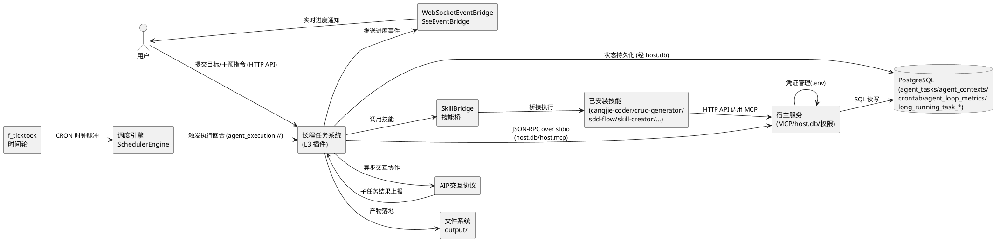
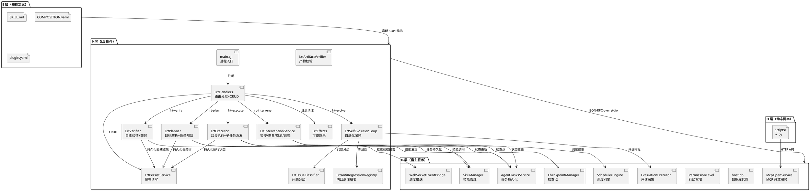
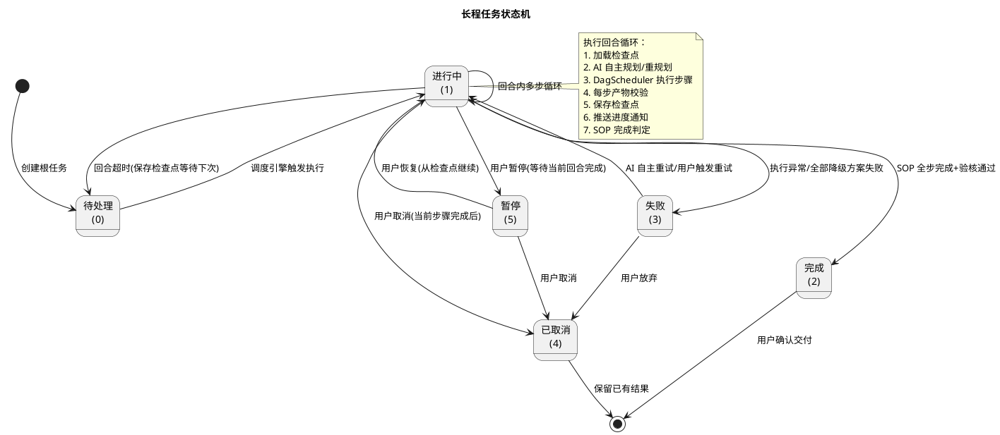
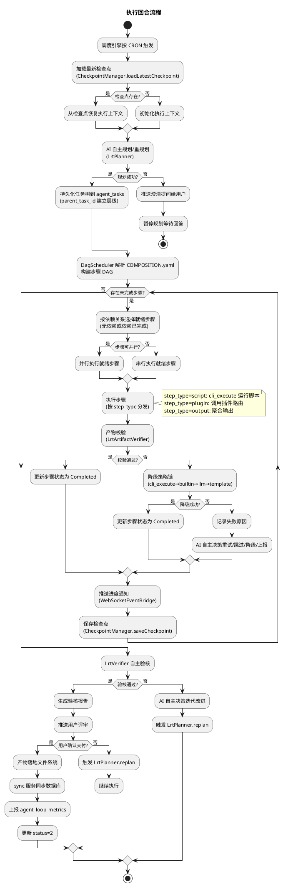
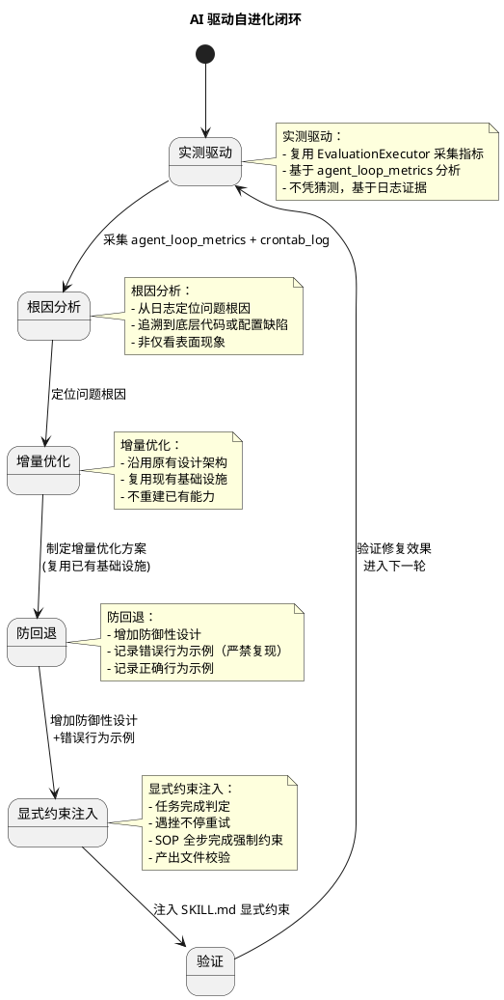
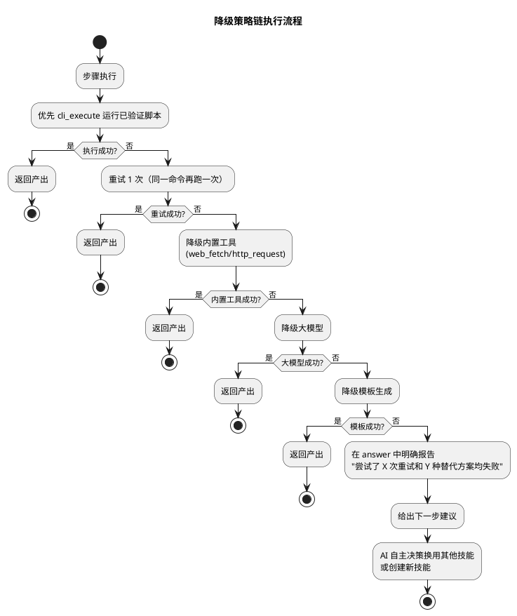
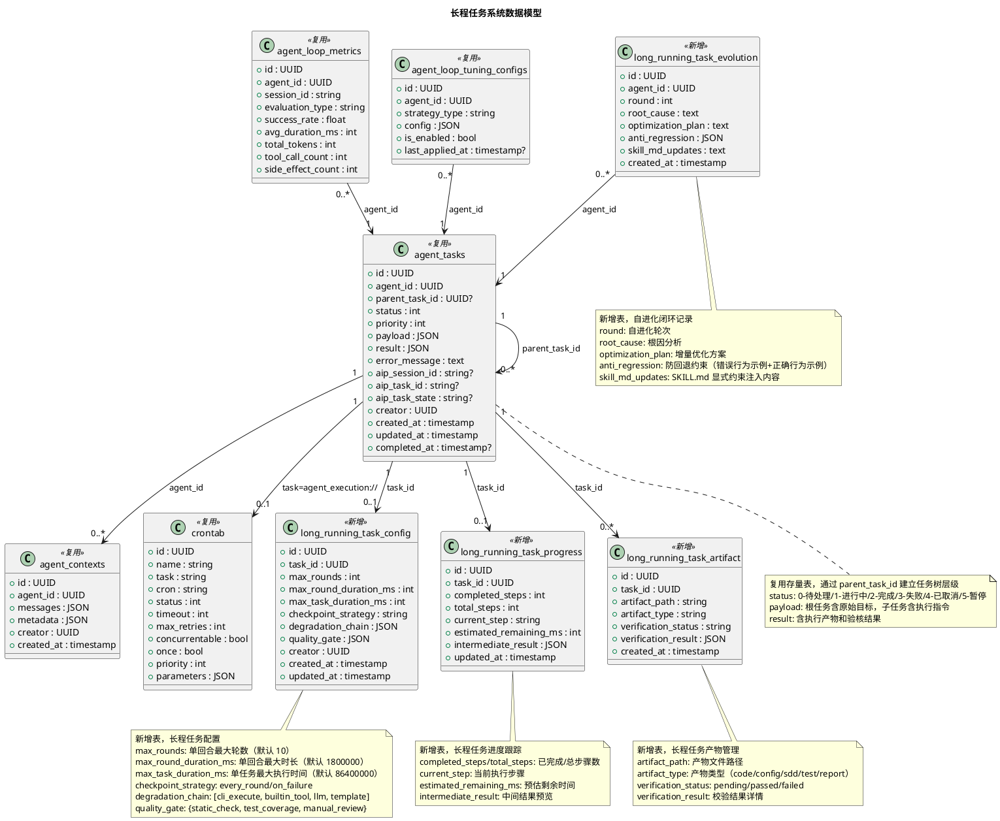

# AI 自主驱动长程任务系统技术设计文档

> 本文档将 spec.md 中定义的"AI 自主驱动长程任务系统"需求转化为可落地的技术设计方案。
> 设计原则：**确定性优先**（可确定性实现的逻辑用已有基础设施，需要推理/判断/创造的逻辑由 AI 驱动）、**复用优先**（复用已有 SchedulerEngine/DagScheduler/CheckpointManager/AIP/WebSocket/SkillBridge/三轨插件/评估调优等基础设施，不重新开发已有能力）、**L3 进程隔离**（以 mode:process 插件形式实现，故障隔离、动态启停）。

# 一、需求与存量功能关系分析

## 1.1 需求功能与存量功能对比

### 1.1.1 已实现功能

以下需求与存量代码完全匹配或高度相似，可直接复用，无需新增实现。

| 需求功能 | 存量功能 | 代码位置 | 匹配度 |
|---------|---------|---------|--------|
| 调度引擎按 CRON 触发执行回合（5.2 规则 1） | SchedulerEngine + f_ticktock 时间轮 + CronCompiler，按 crontab 表配置周期触发 | src/app/services/crontab/SchedulerEngine.cj:20-85 | 100% |
| 执行回合内多步循环 + 检查点保存（5.2 规则 2） | AgentExecutionExecutor 已实现多步循环（maxRounds=10），每轮加载检查点→执行 Agent→保存检查点→SOP 完成判定 | src/app/services/crontab/executor/AgentExecutionExecutor.cj:28-128 | 100% |
| 检查点持久化与故障恢复（5.2 规则 3、4.2 规则 1-2） | CheckpointManager.saveCheckpoint/loadLatestCheckpoint/listCheckpoints/deleteCheckpoint，落库 agent_contexts 表 | src/app/services/bridge/checkpoint_manager.cj:16-94 | 100% |
| 任务树层级与状态持久化（5.1 规则 5、6.1） | AgentTasksService + AgentTasksPO，含 parent_task_id/status/priority/payload/result/error_message/aip_session_id/aip_task_id/aip_task_state 全部字段 | src/app/services/uctoo/AgentTasksService.cj:28-80 | 100% |
| DAG 步骤编排与依赖调度（5.8 规则 3-5） | DagScheduler + DagPlanStatus/DagStepStatus/StepResult/DagScheduleResult，支持步骤状态机、依赖关系、并行执行；`executeStepWithValidation` 已内置验证→重试→降级 | src/agent_executor/dag_scheduler.cj:14-100、:462 | 70%（编排引擎可复用，但 `DagStepType = Skill\|Agent\|Condition\|Subplan`，按技能名查找执行，无 script/plugin/output 语义，见 1.2.2 与 2.4.4） |
| YAML DAG 配置解析（5.8 规则 3） | yaml_dag_config_parser + dag_config，解析 steps/depends_on/step_type/input | src/agent_executor/yaml_dag_config_parser.cj、src/agent_executor/dag_config.cj | 60%（`StepConfig` 无 `input` 字段，无 `${step.output}` 变量替换；`dag_scheduler.cj` 中所有 `${}` 均为日志插值，非产出引用） |
| L3 进程隔离插件加载与故障隔离（5.7 规则 1-3） | CordisHostManager + PluginHostManager 三轨分发，mode:process 经 cordis-cj 拉起独立进程，autoRestart 崩溃自愈 | src/plugin/cordis_host_manager.cj:36-80、src/plugin/plugin_host_manager.cj:25-77 | 100% |
| 技能桥接与已安装技能调用（5.7 规则 2、5.1 规则 3） | SkillBridge.registerPluginSkills，按插件目录加载 SKILL.md 并注册到 SkillManager | src/plugin/skill_bridge.cj:26-80 | 100% |
| 实时进度推送 WebSocket/SSE（5.4 规则 1-3） | WebSocketEventBridge + SseEventBridge，已注册 agent_start/agent_end/agent_step/chat_model_end/chat_model_failure/tool_call_start/tool_call_end/sub_agent_start/sub_agent_end/trace_start/trace_step/trace_token_usage/trace_end/evaluation_result/tuning_applied 全部事件 handler | src/app/services/bridge/websocket_event_bridge.cj:15-80、src/app/services/bridge/sse_event_bridge.cj | 100%（已注册事件比原文档列的 8 类更多，见 1.2.6） |
| AIP 异步交互协作（4.5 规则 4、5.2 异常 7） | AipInteractionService + AipModeManager + AipConfigService + AicValidator + AcpsMqAdapter，符合 GB/Z 185.6 标准 | src/app/services/aip/AipInteractionService.cj:18-60 | 100% |
| 评估指标采集（5.4 规则 5、4.4 规则 3） | EvaluationExecutor + agent_loop_metrics 表（success_rate/avg_duration_ms/total_tokens/tool_call_count/side_effect_count） | src/app/services/crontab/executor/EvaluationExecutor.cj、sql/incremental/goai2026_p1_agent_loop.sql:17-57 | 100% |
| 调优策略配置（4.4 规则 4） | agent_loop_tuning_configs 表（strategy_type/config/is_enabled/last_applied_at），支持 prompt_optimization/tool_selection_optimization/execution_path_optimization | sql/incremental/goai2026_p1_agent_loop.sql:63-85 | 100% |
| 行级权限校验（4.3 规则 1、5.12 规则 2） | PermissionLevel + PermissionUtils + hasPermission，creator=userId 行级过滤 | src/app/core/PermissionLevel.cj、src/app/utils/PermissionUtils.cj | 100% |
| 幂等落库先查后写（5.12 规则 1） | PersistService.queryOne → INSERT/UPDATE，已在 due_diligence_agent 插件验证 | skills/due_diligence_agent/src/persist_service.cj:17-73 | 100% |
| MCP 开放服务调用（5.13 规则 9） | McpOpenService + McpOpenController + WebMCPProtocol，POST /api/v1/uctoo/mcp/open/call | src/app/services/mcp/McpOpenService.cj、src/app/controllers/uctoo/mcpopen/McpOpenController.cj | 100% |
| 6 步 SOP 全流程范式（5.8 规则 1） | 三个已跑通技能均采用 6 步 SOP：due_diligence_agent（validate→dd-fetch→penetrate→tier→generate→dd-save）、investment-research-assistant（fetch→clean→extract→generate→persist→output）、beichen-policy-assistant（profile→match→report→persist→output） | skills/due_diligence_agent/COMPOSITION.yaml、skills/investment-research-assistant/COMPOSITION.yaml、skills/beichen-policy-assistant/COMPOSITION.yaml | 100% |
| COMPOSITION.yaml 步骤编排声明（5.8 规则 3-4、6.7） | 三个技能均通过 steps 数组 + depends_on + step_type + input 声明 DAG，支持 ${step.output} 引用 | skills/due_diligence_agent/COMPOSITION.yaml:6-75 | **声明 100%，执行 0%** —— 文件确实存在且格式一致，但 `composition_executor.cj` / `composition_yaml_parser.cj` 全项目无执行链路调用，且代码 schema 与文件格式不兼容。见 1.2.7 与选型 2.4.4 |
| D-P-H-E 四层分层架构（5.7 规则 7-11） | due_diligence_agent 已完整实现：D 层 scripts/*.py + P 层 src/*.cj（main/handlers/persist_service/effects）+ H 层宿主服务 + E 层 SKILL.md+COMPOSITION.yaml | skills/due_diligence_agent/{scripts/,src/,SKILL.md,COMPOSITION.yaml,plugin.yaml,cjpm.toml} | 100% |
| L3 插件工程结构（5.13 规则 10） | due_diligence_agent 含 cjpm.toml + main.cj（进程入口）+ dd_handlers.cj（路由分发+CRUD+自定义 handler）+ persist_service.cj（幂等读写）+ dd_effects.cj（可逆效果注册） | skills/due_diligence_agent/{cjpm.toml,src/main.cj,src/dd_handlers.cj,src/persist_service.cj,src/dd_effects.cj} | 100% |
| JSON-RPC over stdio 通信（5.13 规则 11） | PluginRuntime.run + ctx.invoke("host.db"/"host.mcp") + cordis-cj stdio 传输 | skills/due_diligence_agent/src/main.cj:15-29 | 100% |
| tableWhitelist 配置（5.13 规则 4） | plugin.yaml tableWhitelist 字段，列出全部需访问表，未配置时 host.db 调用被拒绝 | skills/due_diligence_agent/plugin.yaml:10-16 | 100% |

### 1.1.2 需要扩展的功能

以下需求与存量代码部分匹配，需要在现有基础上改造或扩展。

| 需求功能 | 存量功能 | 差异说明 | 扩展方向 |
|---------|---------|---------|---------|
| AI 自主目标解析与任务规划（5.1 规则 2-4） | AgentExecutionExecutor 已有多步循环，但循环内由 Agent.chat 驱动，未显式暴露"任务分解→技能选择→编排"的规划阶段；plan_react_executor 有 problem_decompose/subtask 但未与长程任务调度闭环 | 输入输出差异：存量 plan_react 输出 subtask 列表但不持久化到 agent_tasks 表；业务逻辑差异：存量规划在单次 chat 内完成，长程任务需跨回合持久化规划结果并支持动态重规划 | 扩展 AgentExecutionExecutor：在首轮加载目标后调用 plan_react 生成任务树并持久化到 agent_tasks（parent_task_id 建立层级），后续回合从检查点恢复规划上下文；新增 LrtPlanner 协调 plan_react 与 agent_tasks 持久化 |
| 动态重规划（5.1 规则 4） | plan_react_executor 支持问题分解，但不支持执行过程中基于环境变更/子任务失败的重规划 | 触发条件差异：存量规划仅初始触发，长程任务需在子任务失败、环境变更、用户调整目标时触发重规划；边界条件差异：重规划需保留已完成子任务结果，仅调整未执行部分 | 在 AgentExecutionExecutor 多步循环中增加重规划判定：检测子任务失败/环境变更/目标调整事件，触发 LrtPlanner.replan，基于已有结果增量调整规划 |
| 子任务派发与结果聚合（5.2 规则 4-5） | dag_team_orchestrator 支持子 Agent 编排，但未与 agent_tasks parent_task_id 持久化闭环 | 数据模型差异：存量 dag 编排结果在内存，长程任务需持久化到 agent_tasks 表通过 parent_task_id 关联；事件差异：子任务完成需自动上报并聚合到父任务 | 扩展 dag_team_orchestrator：派发子任务时创建 agent_tasks 子记录（parent_task_id 指向父任务），子任务完成回调更新子任务 result 字段并通知父任务 |
| 暂停/恢复/取消与用户干预（5.3 规则 1-6） | crontab 表有 status 字段（1-正常/2-禁用），agent_tasks 有 status 字段（0-5），但无统一干预 API 闭环（暂停等待当前回合完成、恢复从检查点继续、目标调整触发重规划） | 接口差异：存量无统一的 /lrt/intervene API；状态机差异：暂停需等待当前回合完成而非立即终止，目标调整需触发重规划而非简单状态变更 | 新增 LrtInterventionService：统一处理暂停（等待回合完成→crontab.status=2→agent_tasks.status=5）、恢复（crontab.status=1→从检查点继续）、取消（agent_tasks.status=4）、目标调整（触发 LrtPlanner.replan） |
| 进度事件类型扩展（5.4 规则 2） | WebSocketEventBridge 已注册 8 类事件（agent_start/end/step、chat_model_end/failure、tool_call_start/end、sub_agent_start/end），但缺少 step_start/step_complete/step_failed/checkpoint_saved/progress_update/subtask_dispatched/subtask_completed/goal_achieved 长程任务专用事件 | 事件粒度差异：存量事件面向单次 Agent 执行，长程任务需面向多回合多步骤；事件内容差异：长程任务进度需含已完成步骤数/总步骤数/预估剩余时间/中间结果预览 | 扩展 WebSocketEventBridge：新增 8 类长程任务专用事件 handler，复用 buildEventJson/pushEvent 基础设施，事件内容增加 stepIndex/totalSteps/estimatedRemaining/intermediateResult 字段 |
| 任务树可视化查询（5.4 规则 4） | AgentTasksService 有 getListWithFilter 分页查询，但无按 parent_task_id 递归构建任务树的 API | 查询差异：存量按 agent_id 分页查询，长程任务需按根任务 id 递归查询全部子任务并构建树形结构 | 扩展 AgentTasksService：新增 getTaskTree(rootTaskId) 方法，递归查询 parent_task_id 关联的全部子任务，构建树形结构返回 |
| AI 自主能力扩展（5.5 规则 1-6） | cangjie-coder/skill-creator/sdd-flow/crud-generator 技能已存在，但 AgentExecutionExecutor 未显式编排"技能不足时自主调用 cangjie-coder 编写代码→skill-creator 创建技能→sdd-flow 驱动 SDD 流程"的能力扩展闭环 | 编排差异：存量技能由 Agent.chat 内部工具调用驱动，长程任务需在规划阶段显式识别能力缺口并编排能力扩展子任务 | 在 LrtPlanner 规划阶段增加能力缺口检测：当目标所需技能不存在时，自主编排"skill-creator 创建技能"或"cangjie-coder 编写代码"子任务，经质量闸门后注册到 agent_skills |
| 质量闸门（5.5 规则 7、4.3 规则 2） | code-gen-verifier 技能存在，但未与 AgentExecutionExecutor 的代码生成流程闭环 | 流程差异：存量 code-gen-verifier 作为独立技能，长程任务需在 AI 自主生成代码后自动调用 code-gen-verifier 验证，未通过则触发修复循环 | 在 LrtPlanner 编排代码生成子任务时，强制追加 code-gen-verifier 验证子任务，未通过则触发 cangjie-coder 修复子任务，形成闭环 |
| 自主验核与交付（5.6 规则 1-6） | AgentExecutionExecutor 有 isSopCompleted 完成判定，但仅检查内容中是否包含完成标志，无结构化验核报告生成与用户评审闭环 | 判定差异：存量完成判定基于字符串匹配，长程任务需基于目标达成度/产物清单/测试结果/已知问题生成结构化验核报告；流程差异：存量完成后直接返回，长程任务需推送验核报告→用户评审→确认交付/迭代改进闭环 | 新增 LrtVerifier：任务执行完成后自主验核产物是否满足目标，生成结构化验核报告（目标达成度/产物清单/测试结果/已知问题/建议），推送用户评审，确认交付则产物落地+sync 同步，要求改进则触发 LrtPlanner.replan |
| 降级策略链（5.9 规则 1-7） | due_diligence_agent/investment-research-assistant 的 SKILL.md 已声明降级策略（脚本→内置工具→大模型→模板），但降级逻辑由 Agent.chat 内部决策，未显式声明为可配置的降级链 | 声明差异：存量降级策略在 SKILL.md 文本描述，长程任务需在 COMPOSITION.yaml 每步显式声明 degradation_chain 配置；执行差异：存量降级由 Agent 自主决策，长程任务需由 DagScheduler 按声明链依次尝试 | 扩展 COMPOSITION.yaml step schema：每步增加 degradation_chain 字段（cli_execute→builtin_tool→llm→template），DagScheduler 按链依次尝试，全部失败时报告尝试次数和失败原因 |
| 产物校验与防回退（5.10 规则 1-9） | investment-research-assistant 的 SKILL.md 已含产物校验和防回退约束（v9/v17/v18 修复记录），但约束以文本形式注入 SKILL.md，无统一校验框架 | 校验差异：存量校验由 Agent 自主执行，长程任务需由 DagScheduler 在每步执行后强制校验产出文件存在且非空；防回退差异：存量防回退约束在 SKILL.md 文本，长程任务需结构化记录错误行为示例和正确行为示例 | 扩展 DagScheduler：每步执行后调用 LrtArtifactVerifier 校验产出（文件存在+非空+日期匹配+内容校验），校验失败则补执行；新增 LrtAntiRegressionRegistry 结构化记录错误行为示例和正确行为示例，注入 SKILL.md |
| AI 驱动自进化闭环（5.11 规则 1-10） | EvaluationExecutor + agent_loop_metrics + agent_loop_tuning_configs 已实现评估采集和调优配置，但未形成"实测驱动→根因分析→增量优化→防回退→显式约束注入"的五环节闭环 | 闭环差异：存量评估为周期性触发（每小时），长程任务需基于评估结果自动驱动优化；环节差异：存量无根因分析、防回退、显式约束注入环节 | 新增 LrtSelfEvolutionLoop：复用 EvaluationExecutor 采集指标，新增根因分析（基于 agent_loop_metrics + crontab_log 日志）、增量优化方案生成、防回退约束注入 SKILL.md，形成五环节闭环 |
| 问题分级（5.11 规则 8） | crontab_log 有日志级别（INFO/WARN/ERROR），但无 P0/P1/P2/P3 问题分级和按优先级修复机制 | 分级差异：存量按日志级别分级，长程任务需按业务影响分级（P0 阻断/P1 严重/P2 中等/P3 低） | 新增 LrtIssueClassifier：基于日志和指标按 P0-P3 分级，LrtSelfEvolutionLoop 按优先级依次修复 |
| 前后端协同（5.11 规则 9） | sync 服务 + SyncManager + ChangeDetector 已实现文件系统与数据库双向同步，但前端产物重新构建（npm run build）需人工触发 | 协同差异：存量 sync 服务同步源代码，长程任务需在代码修复后自动触发前端重新构建 | 在 LrtSelfEvolutionLoop 修复前端代码后，自主编排"npm run build"子任务，经 cli_execute 执行，产物经 sync 服务同步 |

### 1.1.3 需要新增的功能或接口

以下需求在存量代码中完全没有对应实现，需新增。

#### 1.1.3.1 长程任务插件本体（L3 进程隔离轨）

- **功能点**：long-running-task L3 插件工程，含 main.cj（进程入口）+ lrt_handlers.cj（路由分发+CRUD+自定义 handler）+ lrt_persist_service.cj（幂等读写封装）+ lrt_effects.cj（可逆效果注册）
- **输入**：JSON-RPC over stdio 消息（method + path + body + userId + permissions）
- **输出**：JSON-RPC 响应（code + msg + data）
- **核心逻辑**：复用 due_diligence_agent 插件工程结构，注册 long-running-task 相关表 CRUD + 自定义路由（lrt-plan/lrt-execute/lrt-intervene/lrt-verify/lrt-evolve）
- **依赖**：ystyle::cordis_plugin、ystyle::cordis_core、jsonvalue、ystyle::jsonrpc、宿主 host.db/host.mcp

#### 1.1.3.2 长程任务规划服务（LrtPlanner）

- **功能点**：AI 自主目标解析、任务树分解、技能选择与编排、动态重规划
- **输入**：任务目标（自然语言）+ 环境状态（已安装技能、数据库结构、文件系统）+ 已有规划上下文（重规划时）
- **输出**：任务树（根任务 + 子任务列表，含 parent_task_id/payload/skill_sequence/acceptance_criteria）+ 技能编排序列
- **核心逻辑**：复用 plan_react_executor 的 problem_decompose/subtask 能力，扩展为持久化到 agent_tasks 表；技能发现复用 SkillManager；技能选择由 AI 自主决策（基于目标 + 技能描述 + 环境状态）
- **依赖**：plan_react_executor、SkillManager、AgentTasksService、CheckpointManager

#### 1.1.3.3 长程任务干预服务（LrtInterventionService）

- **功能点**：统一处理暂停/恢复/取消/强制取消/目标调整/追加约束
- **输入**：任务 ID + 干预类型（pause/resume/cancel/force_cancel/adjust_goal/add_constraint）+ 干预内容（目标调整时的新目标/追加约束）
- **输出**：操作结果（成功/失败 + 当前任务状态）
- **核心逻辑**：暂停→等待当前回合完成→crontab.status=2→agent_tasks.status=5；恢复→crontab.status=1→从检查点继续；取消→当前步骤完成后 agent_tasks.status=4；强制取消→立即终止 agent_tasks.status=4；目标调整→触发 LrtPlanner.replan
- **依赖**：AgentTasksService、CrontabDAO、CheckpointManager、LrtPlanner、WebSocketEventBridge

#### 1.1.3.4 长程任务验核服务（LrtVerifier）

- **功能点**：自主验核产物是否满足目标、生成结构化验核报告、用户评审闭环、产物交付
- **输入**：任务 ID + 原始目标 + 执行产物清单
- **输出**：验核报告（目标达成度/产物清单/测试结果/已知问题/建议后续动作）+ 交付状态
- **核心逻辑**：AI 自主比对产物与目标，生成结构化报告；推送用户评审；确认交付→产物落地文件系统→sync 服务同步数据库→上报 agent_loop_metrics；要求改进→触发 LrtPlanner.replan
- **依赖**：AgentTasksService、SyncManager、WebSocketEventBridge、agent_loop_metrics

#### 1.1.3.5 长程任务产物校验器（LrtArtifactVerifier）

- **功能点**：每步执行后校验产出文件存在且非空、日期匹配、内容校验；answer 前终检全部关键产物
- **输入**：步骤名 + 产出路径 + 预期日期 + 验收条件
- **输出**：校验结果（通过/失败 + 失败原因）
- **核心逻辑**：file_read 检查文件存在且非空；日期匹配校验（忽略旧日期文件）；内容校验（检查内容含本次执行数据）；校验失败触发补执行
- **依赖**：文件系统（经 cli_execute/file_read）

#### 1.1.3.6 长程任务防回退注册表（LrtAntiRegressionRegistry）

- **功能点**：结构化记录错误行为示例和正确行为示例，注入 SKILL.md 显式约束
- **输入**：问题 ID + 错误行为描述 + 正确行为描述 + 修复版本
- **输出**：SKILL.md 显式约束片段
- **核心逻辑**：每轮修复增加防御性设计和错误行为示例（严禁复现），通过显式约束注入 SKILL.md（任务完成判定、遇挫不停重试、SOP 全步完成强制约束、产出文件校验等）
- **依赖**：SKILL.md 文件系统

#### 1.1.3.7 长程任务自进化闭环（LrtSelfEvolutionLoop）

- **功能点**：实测驱动→根因分析→增量优化→防回退→显式约束注入五环节闭环
- **输入**：Agent ID + 评估时间范围
- **输出**：优化报告（根因/优化方案/修复记录/防回退约束）
- **核心逻辑**：复用 EvaluationExecutor 采集 agent_loop_metrics 指标；根因分析基于日志（crontab_log + agent_tasks.error_message）定位问题根因；增量优化方案复用已有基础设施；防回退经 LrtAntiRegressionRegistry 注入 SKILL.md；问题按 P0-P3 分级依次修复
- **依赖**：EvaluationExecutor、agent_loop_metrics、agent_loop_tuning_configs、LrtAntiRegressionRegistry、LrtIssueClassifier

#### 1.1.3.8 长程任务问题分级器（LrtIssueClassifier）

- **功能点**：基于日志和指标按 P0 阻断/P1 严重/P2 中等/P3 低分级
- **输入**：日志记录 + 评估指标
- **输出**：问题列表（含分级 + 根因 + 修复建议）
- **核心逻辑**：P0=任务完全阻断无法继续；P1=核心功能异常但有 workaround；P2=非核心功能异常；P3=优化建议
- **依赖**：crontab_log、agent_loop_metrics

#### 1.1.3.9 长程任务专用数据库表

- **功能点**：long_running_task_config（长程任务配置表，含执行回合上限/检查点策略/质量闸门配置/降级策略链配置）+ long_running_task_progress（长程任务进度表，含已完成步骤数/总步骤数/当前步骤/预估剩余时间/中间结果）+ long_running_task_artifact（长程任务产物表，含产物路径/类型/校验状态/验核结果）+ long_running_task_evolution（长程任务自进化记录表，含轮次/根因/优化方案/防回退约束）
- **输入**：DDL（sql/incremental/long_running_task.sql）
- **输出**：数据库表 + CRUD API（经 crudgen 生成）
- **核心逻辑**：遵循 uctoo-v4-module-development.md 通用模块开发流程，DDL 由人工执行
- **依赖**：PostgreSQL、crudgen、loaddbinfo

## 1.2 存量功能详细分析

### 1.2.1 AgentExecutionExecutor（执行回合循环）

**接口契约**：
- 入参：CrontabExecutionContext（含 taskUri=agent_execution://<agentId>、parameters、crontabId）
- 出参：ExecutionResult（success/failure + content + duration + summary）
- 异常：Agent 加载失败、Agent 数据为空、Agent 执行异常
- 副作用：更新 agent_tasks 状态、保存检查点到 agent_contexts、写入 crontab_log

**业务规则**：
1. 解析 taskUri 提取 agentId
2. 经 AgentRuntimeBridge.loadFromDatabase 加载 Agent
3. 多步循环（maxRounds=10）：每轮加载检查点→执行 Agent.chat→保存检查点→SOP 完成判定→未完成则继续
4. SOP 完成判定（isSopCompleted）：检查内容中是否包含完成标志（"## 完成总结"/"任务已完成"/"投研报告已生成"等）或内容较短且无工具调用格式
5. 完成后更新 agent_tasks.status=2，失败更新 status=3，取消更新 status=4

**扩展点**：
- maxRounds 可配置化（当前硬编码为 10）
- isSopCompleted 的完成标志可配置化（当前硬编码列表）
- 多步循环内未显式暴露"规划→执行→观察"三阶段，由 Agent.chat 内部隐式驱动

**约束**：
- 单次执行回超过 maxRounds 后退出循环（未显式保存检查点等待下次调度）
- 检查点保存异常被静默捕获（catch (_: Exception) {}），不影响执行流程
- 任务状态更新异步执行（spawn {}），不阻塞主流程

### 1.2.2 DagScheduler（DAG 步骤编排）

> **本小节为 2026-09-11 复核后的修正版**。原文档写"step_type 支持 script/plugin/output""步骤间产出通过 ${step.output} 引用"，与代码不符，已按实况重写。

**接口契约**：
- 入参：DAG 配置（steps + depends_on + stepType + targetRef + condition）+ 执行上下文
- 出参：DagScheduleResult（planName + status + stepResults + totalDurationMs + completedSteps + failedSteps）
- 异常：DAG 构建失败（循环依赖）、步骤执行失败
- 副作用：步骤状态变更（Pending→Ready→Running→Completed/Failed/Skipped）

**真实业务规则**（以 `src/agent_executor/dag_config.cj`、`dag_scheduler.cj` 为准）：
1. 解析 DAG 配置构建步骤图；`DagStepType = Skill | Agent | Condition | Subplan`（`dag_config.cj:9-14`）
2. 按依赖关系拓扑排序，无依赖步骤可并行
3. 步骤执行按 `targetRef` **按技能名查找并执行技能**（日志为 `Skill not found: ${step.targetRef}`），**不是**"跑脚本 / 调插件路由"
4. `StepConfig` 字段为 `name / stepType / targetRef / dependsOn / condition / outputs`——**没有 `input` 字段**
5. **没有 `${step.output}` 变量替换机制**：`dag_scheduler.cj` 中所有 `${}` 均为日志插值，非产出引用；步骤产出仅存于内存 `StepResult.output`
6. 步骤失败不中断整个 DAG，由 DagPlanStatus 标记为 Failed
7. 条件执行（`condition`）支持跳过步骤

**比原文档更强的两点（原文档低估了）**：
- `executeStepWithValidation`（`dag_scheduler.cj:462`）已内置**验证 → 重试 → 降级**链路，日志 "validation retries exhausted, executing degradation"。因此 1.1.2 中"扩展 DagScheduler 加降级链"可降级为"复用 + 配置化"。
- 已支持拓扑排序、并行执行、条件跳过三项能力。

**扩展点（新增，长程任务必须补齐）**：
- `DagStepType` 扩展 `Script`（经 `cli_execute` 执行 scripts/*.py）/ `Plugin`（经 plugin 路由调用）/ `Output`（产出聚合）
- `StepConfig` 增加 `input` 字段与**变量插值引擎**（支持 `${input.xxx}`、`${step-name.output}`、路径模板）
- 步骤产出跨回合持久化（长程任务必需，见 2.7 数据契约的 `run_context`）

**约束**：
- DAG 不得存在循环依赖（构建时校验）
- 步骤产出在内存中传递，未持久化（长程任务需跨回合持久化）
- 与技能在用的 COMPOSITION.yaml 格式不兼容（见 1.2.7 与选型 2.4.4）

### 1.2.3 CheckpointManager（检查点持久化）

**接口契约**：
- 入参：agentId + AgentExecution（含 messages/chatRound）+ taskId
- 出参：contextId（检查点 ID）
- 异常：序列化/反序列化异常、数据库写入异常
- 副作用：写入 agent_contexts 表（agent_id/messages/metadata）

**业务规则**：
1. 序列化 AgentExecution.messages 为 JSON
2. 构造 metadata（taskId/chatRound/savedAt）
3. 经 AgentContextsService.create 写入 agent_contexts 表
4. loadLatestCheckpoint 按 created_at DESC 查询最新检查点

**扩展点**：
- metadata 为 JSON 格式，可扩展任意元数据字段
- 检查点列表支持分页查询

**约束**：
- 检查点保存异常被静默捕获（返回空字符串），不影响执行流程
- 检查点加载异常被静默捕获（返回 None），调用方需处理 None 情况

### 1.2.4 CordisHostManager（L3 进程隔离轨宿主侧总控）

**接口契约**：
- 入参：plugin.yaml mode:process 条目（name/command/autoRestart/tableWhitelist/routes/protocol）
- 出参：PluginInstance 状态（InstanceStatus → PluginState 映射）
- 异常：插件进程崩溃、JSON-RPC 通信异常、配置解析异常
- 副作用：拉起独立进程、注册 host.db/host.mcp 服务代理、回写 agent_skills.runtime_status

**业务规则**：
1. 从 plugin.yaml 构造 cordis PluginEntry 期望状态
2. 经 PluginManager(stdio) + PluginHost(reconcile) 拉起独立进程
3. 安装状态变更监听器：InstanceStatus 变化时映射为 PluginState 并回写 agent_skills.runtime_status
4. 安装宿主服务钩子：host.db/host.log/host.cache 经 CordisHostServices 代理
5. 优雅停机：宿主退出时按依赖逆序 terminate 全部 process 插件

**扩展点**：
- autoRestart=true 时插件进程崩溃自动重启
- 日志汇聚：插件进程 stdout/stderr 经 cordis 采集转发宿主 LogUtils

**约束**：
- 传输固定 stdio（UDS 不启用）
- 插件故障不影响宿主和其他插件（进程隔离）

### 1.2.5 due_diligence_agent 插件（D-P-H-E 四层分层参考实现）

**接口契约**：
- 入参：JSON-RPC over stdio 消息（method + path + body + userId + permissions）
- 出参：JSON-RPC 响应（code + msg + data）
- 异常：路由未匹配、host.db 调用失败、host.mcp 调用失败
- 副作用：6 张表 CRUD + dd-fetch 采集聚合 + dd-save 幂等落库

**业务规则**：
1. D 层（scripts/*.py）：业务逻辑由 Python 脚本承载，经 cli_execute 调用，脚本通过 HTTP API 调用 H 层宿主 MCP 开放服务
2. P 层（src/*.cj）：仓颉进程隔离轨插件，main.cj 进程入口→DdHandlers.register 注册路由→DdEffects.register 注册可逆效果→PersistService 幂等读写
3. H 层（宿主服务）：仓颉宿主提供 MCP 开放服务 + host.db + 行级权限 + 审计日志，凭证仅存宿主 .env
4. E 层（SKILL.md + COMPOSITION.yaml）：SKILL.md 声明 SOP 和步骤说明，COMPOSITION.yaml 声明步骤编排和依赖关系

**扩展点**：
- 路由分发支持自定义路由（dd-fetch/dd-save）和标准 CRUD 路由
- PersistService 幂等读写封装可复用于其他插件
- DdEffects 可逆效果注册框架可复用于其他插件

**约束**：
- tableWhitelist 必须配置，否则 host.db 调用被拒绝
- permissions 空数组会触发行级权限过滤导致查不到数据
- Python 脚本不得禁用 SSL 校验（verify=False）
- MCP 调用须优先用 http_lib 库（已替代 stdx http）

### 1.2.6 WebSocket/SSE 事件桥（实时进度与可观测基础设施）

> 2026-09-11 复核新增。原文档称"已注册 8 类事件"，实际更多。

**已注册事件（以 `websocket_event_bridge.cj` 为准）**：

| 事件 | 用途 | 长程任务能否直接复用 |
|------|------|---------------------|
| `agent_start` / `agent_end` | Agent 执行起止 | ✅ 回合级进度 |
| `agent_step` | Agent 单步 | ✅ 步骤级进度 |
| `chat_model_end` / `chat_model_failure` | 大模型调用结束/失败 | ✅ Token 与失败观测 |
| `tool_call_start` / `tool_call_end` | 工具调用起止 | ✅ 工具可观测（见 1.2.11） |
| `sub_agent_start` / `sub_agent_end` | 子 Agent 起止 | ✅ 子任务进度 |
| `trace_start` / `trace_step` / `trace_token_usage` / `trace_end` | 链路追踪 | ✅ **可直接用作长程任务 trace，无需新增** |
| `evaluation_result` / `tuning_applied` | 评估结果与调优生效 | ✅ 自进化闭环观测 |

**基础设施**：`buildEventJson(eventType, data)` + `pushEvent(sessionId, json)` 已封装，新增事件只需注册 handler，无需改动推送通道。

**结论**：5.4 规则 2 需要的 `step_start/step_complete/step_failed/checkpoint_saved/progress_update/subtask_dispatched/subtask_completed/goal_achieved` 8 类事件仍需新增，但**推送通道与 JSON 组装完全复用**；其中"进度百分比/预估剩余"建议优先复用 `trace_step` 的既有字段，避免重复建模。

### 1.2.7 COMPOSITION.yaml 编排执行现状（P0 风险）

> 2026-09-11 复核新增。这是本次复核发现的最严重落地阻断项。

**事实 1：有解析器，有执行器，但没有接线。**
- `src/skill/composition_executor.cj`（`CompositionExecutor.execute`）、`src/skill/composition_yaml_parser.cj`（`CompositionYamlParser.parse`）**在整个项目中没有任何外部调用点**——grep 只在各自文件内出现（日志字符串），无 `CompositionExecutor(` 实例化。
- 全仓库唯一使用 `SkillCompositionsPO` 的地方是 `SkillCompositionsService`（CRUD API），即 COMPOSITION 目前只是"被数据库存储的声明文本"，不参与运行时调度。

**事实 1b：执行器本身比预想的完整，可复用部分不少。** `CompositionExecutor` 已实现（`composition_executor.cj:112-395`）：
- `topologicalSort` 拓扑排序 + 循环依赖检测（:124-140）
- 失败后续步骤标记 `Skipped`（:147-153）
- `executeStep` 的重试（:249 "failed, retrying..."）与条件跳过 `evaluateCondition`（:337）
- **步骤级缓存** `_cache` + `buildCacheKey`（:374）
- `buildFinalOutput` 产出聚合（:385）

**唯一的硬伤**：`executeStep` 按 `step.skillName` 经 `_skillManager.getSkill()` 查找并执行**技能**（:225-228，日志 `Skill not found: ${step.skillName}`）——**没有 script / plugin / output 三种执行语义**。加上解析器只认 `sequential/parallel/conditional`，两个硬伤叠加才导致格式不兼容。

**事实 2：代码 schema 与技能实际写的格式不兼容。**

| 维度 | 代码 schema（`composition_definition.cj:15-23`） | 技能实际写的 COMPOSITION.yaml |
|------|------|------|
| step_type 取值 | `sequential` / `parallel` / `conditional` | `script` / `plugin` / `output` |
| 步骤绑定 | `skill_name`（按技能名） | `script: scripts/xxx.py` 或 plugin 路由 |
| 输入 | `input_mapping` | `input` + `${step-name.output}` 引用 |
| 产物引用 | 无 | `${step.output}` |

**影响**：`tasks.md` 原 4.2「在 LrtExecutor 中集成 DagScheduler：解析 COMPOSITION.yaml 构建步骤 DAG」当前无法落地。

**处置**：见 2.4.4 编排执行方案选型（已选定方案 A）。

### 1.2.8 插件发现机制（"一切皆技能"融合机制）

> 2026-09-11 复核新增，澄清复核报告 P2-4 的疑问。

**结论：插件发现与技能多目录自动加载是同一套机制，不存在独立的插件扫描根。**

- **发现入口**：`PluginDiscoveryService.discover(skillBaseDirectories: Array<String>)`（`src/plugin/plugin_discovery_service.cj:29`）——入参就是**技能基目录数组**，与 `ProgressiveSkillLoader` 同源。
- **扫描逻辑**：遍历每个技能基目录的一级子目录，若子目录下存在 `plugin.yaml` 则解析为 `PluginManifestEntry`；与 `SKILL.md` 发现在**同一轮目录扫描**中完成，最后按 `order` 排序。
- **技能桥接**：`SkillBridge.registerPluginSkills(pluginDir, pluginName)`（`src/plugin/skill_bridge.cj:57`）复用存量技能管线，两路加载插件内的技能：
  1. 插件目录根下的 `SKILL.md`（三维一体主通道，经 `loadSkillFromPath` 直载——`loadSkillsFromDirectory` 仅扫子目录，覆盖不到根级文件）
  2. 插件子目录中的技能（`plugins/<name>/<skill>/SKILL.md`，经 `loadSkillsFromDirectory` 批量扫描）
- **纯 Service 插件**：无 `SKILL.md` 时注册数为 0，按纯服务插件处理。

**对长程任务的落地方向**：`skills/long-running-task/` 下同时放 `SKILL.md` + `COMPOSITION.yaml` + `plugin.yaml` 即被自动发现，无需额外注册；`tasks.md` 2.1 的验收标准应是"启动日志出现 `[PluginDiscoveryService] discovered plugin: long-running-task`"与"`[SkillBridge]` 注册技能数 ≥ 1"。

### 1.2.9 人在回路现状（WebHumanAgent 与审批工具）

> 2026-09-11 复核新增，对应新增需求"AI 提供可选方案供人类选择"。

**已有基础设施（可直接扩展，无需从零建设）**：

| 组件 | 位置 | 现状 |
|------|------|------|
| `WebHumanAgent` | `src/app/services/bridge/web_human_agent.cj:17` | `<: BaseAgent`，把"提问"作为一次 `chat()`；落 `agent_approvals` 记录（pending→approved/timeout），经 WebSocket 推送 `approval_request` 事件并阻塞等待（默认 300s，超时返回 Failed） |
| `AgentApprovalsPO` | `src/app/models/uctoo/AgentApprovalsPO.cj` | 11 字段：id/agentId/taskId/approvalType/content/status/userResponse/timeoutMs/creator/createdAt/updatedAt/deletedAt |
| `WebSocketSessionManager.sendApprovalRequest` | `src/app/services/bridge/websocket_session_manager.cj:64` | 推送 `approval_request`（含 approval_id/question/approval_type/timeout_ms），注册 `ApprovalWaiter` 阻塞等待 |
| `web_request_approval` 工具 | `src/tool/webmcp/web_request_approval_tool.cj:13` | 参数仅 `action` / `details` / `timeout`；返回"用户决策（approved/rejected）+ 可选评论"；经 `WebMCPToolHelper.executeToolCall` 做 SSE 推送 + 阻塞等待（硬编码 120s） |
| `web_notify` 工具 | `src/tool/webmcp/web_notify_tool.cj` | 单向通知（不等待） |

**关键缺口**：现有审批是**二元的**（批准/拒绝 + 文本评论），**没有"选项列表"概念**——`AgentApprovalsPO` 无 `options` 字段，`sendApprovalRequest` 的 payload 无 options 字段，`web_request_approval` 的参数也无 options。用户需求"AI 提供几个可选方案供人类参考和选择"必须在此基础上扩展，方案见 2.6。

### 1.2.10 数据契约现状（数据库结构与示例数据对大模型的可见性）

> 2026-09-11 复核新增，对应新增需求"大模型不完全清楚如何操作数据库"。

**事实：Agent/大模型侧目前没有任何内置数据库工具。** `BuiltinToolsRegistry.registerAll`（`src/tool/builtin_tools_registry.cj:12`）注册的工具为：
- 文件类：`FileRead/Write/Edit/Delete/Copy/Move/Search`、`DirectoryList/Create`
- 网络类：`HttpTool`、`WebFetchTool`、`HttpServerTool`
- 技能类：`SkillInitializer/SkillPackager/GetSkillContent`
- 代码生成类：`TemplateEngine/CodeSnippetGenerator`
- 执行类：`CliTool`、`PythonExecutor`、`Browser`、`SubAgent`、`EvalRunner`

**没有 DbTool / SqlTool / SchemaTool。** 大模型要落库，当前只有四条间接路径：

| 路径 | 载体 | 局限 |
|------|------|------|
| 自动生成的 CRUD REST 路由 | `http_tool` 调 `/api/v1/uctoo/<table>/add` 等 | 大模型不知道有哪些表、字段叫什么、必填项是什么 |
| `db_info` 表（结构元数据） | `DbInfoController` REST API | 存的是**为代码生成服务**的元数据（含 vue/react/arkui 组件类型、placeholder、weight 等 UI 字段），不是给大模型读的简洁契约；且需要大模型先知道要去调 `get-db-table-list` |
| D 层 Python 脚本 | `cli_execute` + `psycopg2` | 绕过宿主、与 5.13 规则 1「不直接接触数据库」冲突；且依赖脚本已存在 |
| 插件 `host.db` | cordis `CordisHostServices.executeDbOperation` | 仅**插件进程内**可用（受 `tableWhitelist` + 行级权限保护），Agent 主循环调不到 |

**结论**：长程任务是数据驱动的，但"表结构 + 字段语义 + 示例行 + 幂等键"这套**数据契约**目前对大模型基本不可见，是其 CRUD 不准的直接原因。设计方案见 2.7。

### 1.2.11 内置工具与测试基建现状

> 2026-09-11 复核新增，对应新增需求"内置工具可靠性需在长程任务落地前复核并独立测试"。

**内置工具清单**（`builtin_tools_registry.cj`）：见 1.2.10 所列 20 个工具。

**已知可靠性缺陷（已实测确认）**：
- `cli_execute` 的 `cwd` 参数为死代码：`cli_tool.cj` 计算了 `workingDir` 却从未传给 `newProcess`，`utils/os.cj` 的 `newProcess` 无 cwd 形参，`wrapForWindowsShell` 也未拼 `cd /d`。进程 CWD 恒为 runtime 根目录，导致相对路径脚本必然失败。Round2 已修复（见 `fix-round2.md`）。

**测试基建现状**：
- **无 `std.unittest` 用例**：全仓库 `src/` 下 grep `std.unittest` / `@Test` / `TestSuite` 无任何命中，即 `cjpm test` 从未建立。
- **有 HTTP/CLI 级黑盒测试套件**：`test-builtin-tools-v2/`，含 `cli-tests/`、`http-tests/`、`permission-tests/`、`error-tests/`、`run-all-tests.sh` + PowerShell runner + `reports/`。README 明确流程：`cjpm build` → `cjpm run` → 进测试目录执行。
- **有技能形态的工具测试声明**：`skills/test-cli-tools/SKILL.md`（声明 CLI/Python/Browser/HttpServer/SubAgent 五类测试用例）、`skills/test-file-tools/`、`skills/test-code-gen-tools/`——但均为 Markdown 声明，无自动断言。

**结论**：长程任务落地前应采用**黑盒 + 技能驱动**双轨复核（见 tasks 第 0 章），而不是先建 `cjpm test`（成本高、且在"人工编译"约束下不划算）。

### 1.2.12 日志与可观测现状（P1 可回溯缺陷）

> 2026-09-11 复核新增，对应新增需求"日志每次重启被覆盖，需加时间戳且不覆盖历史"。

| 项 | 实况 | 位置 |
|------|------|------|
| 主日志文件 | `./logs/agentskills-runtime.log`（可由环境变量 `LOG_FILE` 覆盖） | `src/app/main.cj:766` |
| 打开模式 | **`File(path, OpenMode.Write)` —— 每次启动截断，历史全丢** | `src/log/log_utils_impl.cj:72` |
| 具名日志 | `Config.agentLogDir = "./logs/agent-logs"`，`getNamedLogger` 同样用 `OpenMode.Write` | `src/log/log_utils_impl.cj:86-91`、`src/config/config.cj:101` |
| 轮转配置 | `log-config.json` 里配了 `rotate=true / maxsize=100M / daily=true`，但那是 **fountain 框架的 file appender**（写 `logs/uctoo-v4.log`），**与本项目的 `magic.log.LogUtils` 不是同一套**，对 `agentskills-runtime.log` 无效 | `src/app/core/log/log-config.json` |
| 工具审计日志 | `tool_audit_log.cj:129` 用的是 `OpenMode.Append` —— **正确做法，可作参照** | `src/tool/tool_audit_log.cj:129` |

**现网证据**：`logs/` 目录下存在 `agentskills-runtime copy.log` ~ `copy 8.log` 共 8 个人工备份文件——正是"被覆盖后不得不手工另存"的直接痕迹。

**设计方案**：见 2.5。

# 二、增量设计方案

## 2.1 实现模型

### 2.1.1 上下文视图

长程任务系统作为 L3 进程隔离轨插件，经 CordisHostManager 拉起独立进程，通过 JSON-RPC over stdio 与宿主通信。上游接收用户目标和调度引擎时钟脉冲，下游经 host.db/host.mcp 访问宿主数据库和 MCP 开放服务，经 SkillBridge 调用已安装技能，经 WebSocketEventBridge/SseEventBridge 推送进度通知，经 AIP 交互协议与外部智能体协作。


```plantuml
@startuml
left to right direction

actor "用户" as user
rectangle "调度引擎\nSchedulerEngine" as sched
rectangle "长程任务系统\n(L3 插件)" as lrt
database "PostgreSQL\n(agent_tasks/agent_contexts/\ncrontab/agent_loop_metrics/\nlong_running_task_*)" as db
rectangle "宿主服务\n(MCP/host.db/权限)" as host
rectangle "已安装技能\n(cangjie-coder/crud-generator/\nsdd-flow/skill-creator/...)" as skills
rectangle "SkillBridge\n技能桥" as bridge
rectangle "WebSocketEventBridge\nSseEventBridge" as ws
rectangle "AIP交互协议" as aip
rectangle "f_ticktock\n时间轮" as ticktock
rectangle "文件系统\noutput/" as fs

user --> lrt : 提交目标/干预指令 (HTTP API)
ticktock --> sched : CRON 时钟脉冲
sched --> lrt : 触发执行回合 (agent_execution://)
lrt --> host : JSON-RPC over stdio\n(host.db/host.mcp)
host --> db : SQL 读写
host --> host : 凭证管理(.env)
lrt --> bridge : 调用技能
bridge --> skills : 桥接执行
skills --> host : HTTP API 调用 MCP
lrt --> ws : 推送进度事件
ws --> user : 实时进度通知
lrt --> aip : 异步交互协作
aip --> lrt : 子任务结果上报
lrt --> fs : 产物落地
lrt --> db : 状态持久化 (经 host.db)
@enduml
```

**通信协议与调用频率**：
- 用户→长程任务系统：HTTP API（RESTful），低频（提交目标/干预时）
- 调度引擎→长程任务系统：CRON 触发，中频（按 CRON 表达式，默认每分钟）
- 长程任务系统→宿主：JSON-RPC over stdio，高频（每步执行、每次 DB 操作）
- 长程任务系统→WebSocket：WebSocket/SSE 推送，高频（每步状态变更）
- 长程任务系统→AIP：异步消息队列，中频（跨 Agent 协作时）

### 2.1.2 服务/组件总体架构

长程任务系统遵循 D-P-H-E 四层分层架构，以 L3 进程隔离轨插件形式实现。P 层插件内部按职责划分为规划、执行、干预、验核、自进化五个核心组件，复用宿主 H 层的数据库、MCP、权限基础设施，经 E 层 SKILL.md + COMPOSITION.yaml 声明 SOP 编排。


```plantuml
@startuml
package "E 层（技能定义）" as layerE {
  file "SKILL.md" as skillMd
  file "COMPOSITION.yaml" as composition
  file "plugin.yaml" as pluginYaml
}

package "P 层（L3 插件）" as layerP {
  component "LrtHandlers\n路由分发+CRUD" as handlers
  component "LrtPlanner\n目标解析+任务规划" as planner
  component "LrtExecutor\n回合执行+子任务派发" as executor
  component "LrtInterventionService\n暂停/恢复/取消/调整" as intervention
  component "LrtVerifier\n自主验核+交付" as verifier
  component "LrtSelfEvolutionLoop\n自进化闭环" as evolution
  component "LrtArtifactVerifier\n产物校验" as artifactVerify
  component "LrtAntiRegressionRegistry\n防回退注册表" as antiRegression
  component "LrtIssueClassifier\n问题分级" as classifier
  component "LrtPersistService\n幂等读写" as persist
  component "LrtEffects\n可逆效果" as effects
  component "main.cj\n进程入口" as main
}

package "D 层（动态脚本）" as layerD {
  file "scripts/\n*.py" as scripts
}

package "H 层（宿主服务）" as layerH {
  component "McpOpenService\nMCP 开放服务" as mcp
  component "host.db\n数据库代理" as hostDb
  component "PermissionLevel\n行级权限" as perm
  component "AgentTasksService\n任务持久化" as taskSvc
  component "CheckpointManager\n检查点" as ckpt
  component "WebSocketEventBridge\n进度推送" as wsBridge
  component "SchedulerEngine\n调度引擎" as schedEngine
  component "EvaluationExecutor\n评估采集" as evalExec
  component "SkillManager\n技能管理" as skillMgr
}

main --> handlers : 注册
handlers --> planner : lrt-plan
handlers --> executor : lrt-execute
handlers --> intervention : lrt-intervene
handlers --> verifier : lrt-verify
handlers --> evolution : lrt-evolve
planner --> persist : 持久化任务树
executor --> persist : 持久化执行状态
executor --> ckpt : 检查点
verifier --> persist : 持久化验核结果
evolution --> antiRegression : 防回退
evolution --> classifier : 问题分级
evolution --> evalExec : 评估指标
handlers --> persist : CRUD
handlers --> effects : 注册清理

planner --> skillMgr : 技能发现
executor --> skillMgr : 技能调用
planner --> taskSvc : 任务持久化
executor --> taskSvc : 状态更新
intervention --> taskSvc : 状态变更
intervention --> schedEngine : 调度控制
verifier --> wsBridge : 推送验核报告

scripts --> mcp : HTTP API
layerE --> layerP : 声明 SOP+编排
layerP --> layerH : JSON-RPC over stdio
@enduml
```

**模块划分及职责**：
- **main.cj**：L3 插件进程入口，经 PluginRuntime.run 拉起，注册 LrtHandlers 和 LrtEffects
- **LrtHandlers**：路由分发，支持 long_running_task_* 表 CRUD + 自定义路由（lrt-plan/lrt-execute/lrt-intervene/lrt-verify/lrt-evolve）
- **LrtPlanner**：AI 自主目标解析、任务树分解、技能选择与编排、动态重规划，复用 plan_react_executor
- **LrtExecutor**：执行回合循环、子任务派发与结果聚合，复用 AgentExecutionExecutor 多步循环 + DagScheduler DAG 编排
- **LrtInterventionService**：统一处理暂停/恢复/取消/强制取消/目标调整/追加约束
- **LrtVerifier**：自主验核产物、生成结构化验核报告、用户评审闭环、产物交付
- **LrtSelfEvolutionLoop**：实测驱动→根因分析→增量优化→防回退→显式约束注入五环节闭环
- **LrtArtifactVerifier**：每步产物校验（文件存在+非空+日期匹配+内容校验）
- **LrtAntiRegressionRegistry**：结构化记录错误行为示例和正确行为示例，注入 SKILL.md
- **LrtIssueClassifier**：基于日志和指标按 P0-P3 分级
- **LrtPersistService**：幂等读写封装（先查后写 + 行级权限 + 批量隔离），复用 due_diligence_agent PersistService 模式
- **LrtEffects**：可逆效果注册（卸载时逆序执行清理）

**配置项及取值策略**：
- `maxRounds`：单次执行回合最大轮数，默认 10，可经 plugin.yaml config 配置
- `maxRoundDurationMs`：单回合最大时长，默认 1800000（30 分钟），超时保存检查点进入下一回合
- `maxTaskDurationMs`：单任务最大执行时间，默认 86400000（24 小时），超时自动暂停并通知用户
- `maxConcurrentTasks`：同时执行的长程任务数上限，默认 100，超出进入优先级队列
- `checkpointStrategy`：检查点保存策略，默认 every_round（每回合保存），可选 on_failure（仅失败时）
- `degradationChain`：降级策略链，默认 [cli_execute, builtin_tool, llm, template]
- `qualityGate`：质量闸门配置，含 static_check/test_coverage/manual_review 三个开关

### 2.1.3 实现设计文档

#### 2.1.3.1 长程任务状态机

长程任务状态流转遵循以下状态机，status 字段存储于 agent_tasks 表。


```plantuml
@startuml
title 长程任务状态机

state "待处理\n(0)" as pending
state "进行中\n(1)" as running
state "完成\n(2)" as completed
state "失败\n(3)" as failed
state "已取消\n(4)" as cancelled
state "暂停\n(5)" as paused

[*] --> pending : 创建根任务

pending --> running : 调度引擎触发执行
running --> running : 回合内多步循环
running --> completed : SOP 全步完成+验核通过
running --> failed : 执行异常/全部降级方案失败
running --> paused : 用户暂停(等待当前回合完成)
running --> cancelled : 用户取消(当前步骤完成后)
running --> pending : 回合超时(保存检查点等待下次)

paused --> running : 用户恢复(从检查点继续)
paused --> cancelled : 用户取消

failed --> running : AI 自主重试/用户触发重试
failed --> cancelled : 用户放弃

completed --> [*] : 用户确认交付
cancelled --> [*] : 保留已有结果

note right of running
  执行回合循环：
  1. 加载检查点
  2. AI 自主规划/重规划
  3. DagScheduler 执行步骤
  4. 每步产物校验
  5. 保存检查点
  6. 推送进度通知
  7. SOP 完成判定
end note
@enduml
```

**状态迁移触发条件与处理策略**：
- `pending→running`：调度引擎按 CRON 触发，AgentExecutionExecutor.execute 开始执行
- `running→running`：回合内多步循环，每轮加载检查点→执行→保存检查点→SOP 完成判定
- `running→completed`：SOP 全步完成 + LrtVerifier 验核通过，更新 status=2
- `running→failed`：执行异常或全部降级方案均失败，更新 status=3，记录 error_message
- `running→paused`：用户发起暂停，等待当前回合完成后更新 status=5，crontab.status=2
- `running→cancelled`：用户发起取消，当前步骤完成后更新 status=4，保留 result
- `running→pending`：回合超时（超过 maxRoundDurationMs），保存检查点，等待下次调度触发
- `paused→running`：用户发起恢复，crontab.status=1，从检查点继续执行
- `failed→running`：AI 自主决策重试或用户触发重试，从检查点恢复

#### 2.1.3.2 执行回合流程

每次调度引擎触发执行一个回合，回合内遵循"加载检查点→AI 自主规划→DAG 步骤执行→产物校验→保存检查点→进度通知→SOP 完成判定"的流程。


```plantuml
@startuml
title 执行回合流程

start
:调度引擎按 CRON 触发;

:加载最新检查点\n(CheckpointManager.loadLatestCheckpoint);
if (检查点存在?) then (是)
  :从检查点恢复执行上下文;
else (否)
  :初始化执行上下文;
endif

:AI 自主规划/重规划\n(LrtPlanner);
if (规划成功?) then (是)
  :持久化任务树到 agent_tasks\n(parent_task_id 建立层级);
else (否)
  :推送澄清提问给用户;
  :暂停规划等待回答;
  stop
endif

:DagScheduler 解析 COMPOSITION.yaml\n构建步骤 DAG;

while (存在未完成步骤?) is (是)
  :按依赖关系选择就绪步骤\n(无依赖或依赖已完成);
  
  if (步骤可并行?) then (是)
    :并行执行就绪步骤;
  else (否)
    :串行执行就绪步骤;
  endif
  
  :执行步骤\n(按 step_type 分发);
  note right
    step_type=script: cli_execute 运行脚本
    step_type=plugin: 调用插件路由
    step_type=output: 聚合输出
  end note
  
  :产物校验\n(LrtArtifactVerifier);
  if (校验通过?) then (是)
    :更新步骤状态为 Completed;
  else (否)
    :降级策略链\n(cli_execute→builtin→llm→template);
    if (降级成功?) then (是)
      :更新步骤状态为 Completed;
    else (否)
      :记录失败原因;
      :AI 自主决策重试/跳过/降级/上报;
    endif
  endif
  
  :推送进度通知\n(WebSocketEventBridge);
  :保存检查点\n(CheckpointManager.saveCheckpoint);
endwhile (否)

:LrtVerifier 自主验核;
if (验核通过?) then (是)
  :生成验核报告;
  :推送用户评审;
  if (用户确认交付?) then (是)
    :产物落地文件系统;
    :sync 服务同步数据库;
    :上报 agent_loop_metrics;
    :更新 status=2;
  else (否)
    :触发 LrtPlanner.replan;
    :继续执行;
  endif
else (否)
  :AI 自主决策迭代改进;
  :触发 LrtPlanner.replan;
endif

stop
@enduml
```

#### 2.1.3.3 AI 驱动自进化闭环

自进化闭环遵循"实测驱动→根因分析→增量优化→防回退→显式约束注入"五环节，持续迭代优化。


```plantuml
@startuml
title AI 驱动自进化闭环

state "实测驱动" as test
state "根因分析" as rootCause
state "增量优化" as optimize
state "防回退" as antiRegress
state "显式约束注入" as inject
state "验证" as verify

[*] --> test

test --> rootCause : 采集 agent_loop_metrics + crontab_log
rootCause --> optimize : 定位问题根因
optimize --> antiRegress : 制定增量优化方案\n(复用已有基础设施)
antiRegress --> inject : 增加防御性设计\n+错误行为示例
inject --> verify : 注入 SKILL.md 显式约束
verify --> test : 验证修复效果\n进入下一轮

note right of test
  实测驱动：
  - 复用 EvaluationExecutor 采集指标
  - 基于 agent_loop_metrics 分析
  - 不凭猜测，基于日志证据
end note

note right of rootCause
  根因分析：
  - 从日志定位问题根因
  - 追溯到底层代码或配置缺陷
  - 非仅看表面现象
end note

note right of optimize
  增量优化：
  - 沿用原有设计架构
  - 复用现有基础设施
  - 不重建已有能力
end note

note right of antiRegress
  防回退：
  - 增加防御性设计
  - 记录错误行为示例（严禁复现）
  - 记录正确行为示例
end note

note right of inject
  显式约束注入：
  - 任务完成判定
  - 遇挫不停重试
  - SOP 全步完成强制约束
  - 产出文件校验
end note
@enduml
```

#### 2.1.3.4 降级策略链执行流程

每个执行步骤声明降级策略链，确保流程不中断。遵循"遇挫不停"原则：任何步骤失败必须先重试一次，重试仍失败才换方案。


```plantuml
@startuml
title 降级策略链执行流程

start
:步骤执行;

:优先 cli_execute 运行已验证脚本;
if (执行成功?) then (是)
  :返回产出;
  stop
else (否)
  :重试 1 次（同一命令再跑一次）;
  if (重试成功?) then (是)
    :返回产出;
    stop
  else (否)
    :降级内置工具\n(web_fetch/http_request);
    if (内置工具成功?) then (是)
      :返回产出;
      stop
    else (否)
      :降级大模型;
      if (大模型成功?) then (是)
        :返回产出;
        stop
      else (否)
        :降级模板生成;
        if (模板成功?) then (是)
          :返回产出;
          stop
        else (否)
          :在 answer 中明确报告\n"尝试了 X 次重试和 Y 种替代方案均失败";
          :给出下一步建议;
          :AI 自主决策换用其他技能\n或创建新技能;
          stop
        endif
      endif
    endif
  endif
endif
@enduml
```

## 2.2 接口设计

### 2.2.1 总体设计

长程任务系统接口分为三类：用户 API（HTTP RESTful，供用户提交目标/干预/查询）、插件 RPC（JSON-RPC over stdio，L3 插件与宿主通信）、内部服务接口（P 层组件间调用）。

| 接口分类 | 接口名 | 通信协议 | 稳定性等级 | 说明 |
|---------|--------|---------|-----------|------|
| 用户 API | POST /api/v1/uctoo/long_running_task/add | HTTP RESTful | 稳定 | 提交长程任务目标 |
| 用户 API | POST /api/v1/uctoo/long_running_task/intervene | HTTP RESTful | 稳定 | 暂停/恢复/取消/调整目标 |
| 用户 API | GET /api/v1/uctoo/long_running_task/tree/:rootId | HTTP RESTful | 稳定 | 查询任务树 |
| 用户 API | GET /api/v1/uctoo/long_running_task/progress/:taskId | HTTP RESTful | 稳定 | 查询任务进度 |
| 用户 API | GET /api/v1/uctoo/long_running_task/checkpoints/:taskId | HTTP RESTful | 稳定 | 查询检查点列表 |
| 用户 API | POST /api/v1/uctoo/long_running_task/verify/:taskId | HTTP RESTful | 稳定 | 触发自主验核 |
| 用户 API | POST /api/v1/uctoo/long_running_task/evolve/:agentId | HTTP RESTful | 实验 | 触发自进化闭环 |
| 插件 RPC | lrt-plan | JSON-RPC over stdio | 稳定 | AI 自主规划 |
| 插件 RPC | lrt-execute | JSON-RPC over stdio | 稳定 | 执行回合 |
| 插件 RPC | lrt-intervene | JSON-RPC over stdio | 稳定 | 用户干预 |
| 插件 RPC | lrt-verify | JSON-RPC over stdio | 稳定 | 自主验核 |
| 插件 RPC | lrt-evolve | JSON-RPC over stdio | 实验 | 自进化闭环 |
| 插件 RPC | long_running_task_* CRUD | JSON-RPC over stdio | 稳定 | 标准 CRUD |
| 内部服务 | LrtPlanner.plan/replan | 函数调用 | 稳定 | 规划/重规划 |
| 内部服务 | LrtExecutor.executeRound | 函数调用 | 稳定 | 执行回合 |
| 内部服务 | LrtArtifactVerifier.verify | 函数调用 | 稳定 | 产物校验 |
| 内部服务 | LrtSelfEvolutionLoop.run | 函数调用 | 实验 | 自进化闭环 |

**接口变更策略**：
- 稳定接口：向后兼容，字段新增不删除，变更需版本化
- 实验接口：可自由变更，正式发布前需稳定化
- CRUD 接口：由 crudgen 自动生成，遵循 uctoo-v4 API 规范

### 2.2.2 接口清单

#### 2.2.2.1 提交长程任务目标

**接口签名**：
```
POST /api/v1/uctoo/long_running_task/add
Content-Type: application/json
Authorization: Bearer <accessToken>

Request:
{
  "goal": string,              // 自然语言目标描述（必填）
  "priority": int,             // 优先级 1-5（可选，默认 3）
  "cron": string,              // CRON 表达式（可选，默认 "0 * * * * *" 每分钟）
  "constraints": object,       // 初始约束（可选）
  "agentId": string            // 指定 Agent ID（可选，默认使用主 Agent）
}

Response:
{
  "code": int,
  "msg": string,
  "data": {
    "taskId": string,          // 根任务 ID
    "agentId": string,         // 执行 Agent ID
    "crontabId": string,       // crontab 记录 ID
    "status": int,             // 初始状态（0-待处理）
    "createdAt": string
  }
}
```

**业务说明**：用户提交自然语言目标，系统创建根任务到 agent_tasks 表（status=0），创建 crontab 记录（task=agent_execution://<agentId>），由调度引擎按 CRON 触发执行。

**前置条件**：用户已认证，accessToken 有效。

**后置条件**：agent_tasks 表新增一条根任务记录，crontab 表新增一条调度记录，调度引擎加载新任务。

**异常映射**：
- 40001：目标描述为空
- 40002：CRON 表达式非法
- 40301：权限不足

**调用示例**：
```bash
curl -X POST https://javatoarktsapi.uctoo.com/api/v1/uctoo/long_running_task/add \
  -H "Authorization: Bearer <accessToken>" \
  -H "Content-Type: application/json" \
  -d '{"goal":"为用户管理模块生成完整 CRUD 并上线","priority":4}'
```

#### 2.2.2.2 用户干预

**接口签名**：
```
POST /api/v1/uctoo/long_running_task/intervene
Content-Type: application/json
Authorization: Bearer <accessToken>

Request:
{
  "taskId": string,            // 任务 ID（必填）
  "action": string,            // 干预类型：pause/resume/cancel/force_cancel/adjust_goal/add_constraint（必填）
  "content": object            // 干预内容（adjust_goal 时为新目标，add_constraint 时为新约束）
}

Response:
{
  "code": int,
  "msg": string,
  "data": {
    "taskId": string,
    "status": int,             // 当前任务状态
    "applied": bool            // 干预是否已应用
  }
}
```

**业务说明**：统一处理暂停/恢复/取消/强制取消/目标调整/追加约束。暂停等待当前回合完成后生效，恢复从检查点继续，目标调整触发重规划。

**前置条件**：任务存在且状态允许该干预操作（如已完成的任务不能暂停）。

**后置条件**：
- pause：crontab.status=2，agent_tasks.status=5（等待当前回合完成）
- resume：crontab.status=1，agent_tasks.status=1
- cancel：agent_tasks.status=4（保留 result）
- force_cancel：agent_tasks.status=4（立即终止）
- adjust_goal：触发 LrtPlanner.replan，基于新目标调整规划
- add_constraint：触发 LrtPlanner.replan，基于新约束调整规划

**异常映射**：
- 40401：任务不存在
- 40003：任务状态不允许该干预操作
- 40301：权限不足

#### 2.2.2.3 查询任务树

**接口签名**：
```
GET /api/v1/uctoo/long_running_task/tree/:rootId
Authorization: Bearer <accessToken>

Response:
{
  "code": int,
  "msg": string,
  "data": {
    "root": {                  // 根任务
      "id": string,
      "goal": string,
      "status": int,
      "priority": int,
      "progress": { "completedSteps": int, "totalSteps": int, "currentStep": string }
    },
    "children": [              // 子任务树（递归）
      {
        "id": string,
        "parentId": string,
        "payload": object,
        "status": int,
        "result": object,
        "children": [...]
      }
    ]
  }
}
```

**业务说明**：按根任务 ID 递归查询全部子任务（通过 parent_task_id 关联），构建树形结构返回，各节点含状态和进度信息。

**前置条件**：任务存在且用户有权限查看（行级权限过滤）。

**后置条件**：无副作用（只读查询）。

#### 2.2.2.4 lrt-plan（AI 自主规划）

**接口签名**：
```
JSON-RPC over stdio
method: "lrt-plan"
params: {
  "goal": string,              // 任务目标
  "agentId": string,           // Agent ID
  "taskId": string,            // 根任务 ID
  "context": object,           // 已有规划上下文（重规划时）
  "constraints": object        // 约束条件
}
result: {
  "taskTree": [                // 任务树
    {
      "taskId": string,
      "parentTaskId": string,
      "payload": object,       // 子任务内容
      "skillSequence": [string], // 技能编排序列
      "acceptanceCriteria": string  // 验收条件
    }
  ],
  "composition": object        // COMPOSITION.yaml 内容
}
```

**业务说明**：AI 自主目标解析、任务树分解、技能选择与编排。复用 plan_react_executor 的 problem_decompose/subtask 能力，扩展为持久化到 agent_tasks 表。

**前置条件**：Agent 已加载，目标非空。

**后置条件**：agent_tasks 表新增子任务记录（parent_task_id 指向根任务），COMPOSITION.yaml 生成或更新。

**异常映射**：
- 40001：目标模糊不可规划（AI 自主发起澄清提问）
- 40002：技能不可用（AI 自主决策创建新技能或换用替代技能）

#### 2.2.2.5 lrt-execute（执行回合）

**接口签名**：
```
JSON-RPC over stdio
method: "lrt-execute"
params: {
  "taskId": string,            // 任务 ID
  "agentId": string,           // Agent ID
  "composition": object,       // COMPOSITION.yaml 内容
  "checkpoint": object         // 检查点（恢复时）
}
result: {
  "round": int,                // 回合数
  "status": string,            // 回合状态
  "stepResults": [object],     // 步骤结果
  "checkpoint": object,        // 新检查点
  "sopCompleted": bool         // SOP 是否完成
}
```

**业务说明**：执行一个回合，回合内由 DagScheduler 按 COMPOSITION.yaml DAG 执行步骤，每步产物校验+降级策略链，回合后保存检查点+推送进度。

**前置条件**：任务状态为进行中（status=1），COMPOSITION.yaml 已生成。

**后置条件**：agent_tasks 状态更新，agent_contexts 新增检查点，crontab_log 记录执行日志，agent_loop_metrics 采集指标。

#### 2.2.2.6 lrt-verify（自主验核）

**接口签名**：
```
JSON-RPC over stdio
method: "lrt-verify"
params: {
  "taskId": string,            // 任务 ID
  "goal": string,              // 原始目标
  "artifacts": [string]        // 产物清单
}
result: {
  "report": {
    "goalAchievement": float,  // 目标达成度 0.0-1.0
    "artifacts": [object],     // 产物清单（含校验状态）
    "testResults": object,     // 测试结果
    "knownIssues": [string],   // 已知问题
    "suggestions": [string]    // 建议后续动作
  },
  "deliveryStatus": string     // delivered/improving/abandoned
}
```

**业务说明**：AI 自主比对产物与目标，生成结构化验核报告，推送用户评审。确认交付则产物落地+sync 同步，要求改进则触发重规划。

**前置条件**：任务 SOP 全步完成。

**后置条件**：验核报告持久化到 long_running_task_artifact 表，agent_loop_metrics 上报验核指标，产物落地文件系统（用户确认后）。

#### 2.2.2.7 lrt-evolve（自进化闭环）

**接口签名**：
```
JSON-RPC over stdio
method: "lrt-evolve"
params: {
  "agentId": string,           // Agent ID
  "timeRangeHours": int        // 评估时间范围（小时）
}
result: {
  "round": int,                // 自进化轮次
  "issues": [                  // 问题列表（按 P0-P3 分级）
    {
      "level": string,         // P0/P1/P2/P3
      "rootCause": string,     // 根因
      "fixAction": string,     // 修复动作
      "antiRegression": object // 防回退约束
    }
  ],
  "skillMdUpdates": [string]   // SKILL.md 显式约束注入内容
}
```

**业务说明**：执行自进化闭环五环节：实测驱动（复用 EvaluationExecutor）→根因分析→增量优化→防回退→显式约束注入 SKILL.md。

**前置条件**：Agent 存在且有执行历史（agent_loop_metrics 有记录）。

**后置条件**：SKILL.md 新增显式约束，agent_loop_tuning_configs 更新调优策略，long_running_task_evolution 记录自进化轮次。

## 2.3 数据模型

### 2.3.1 设计目标

**需支持的业务场景**：
1. 长程任务的创建、规划、执行、暂停/恢复/取消、验核、交付全生命周期
2. 任务树层级关系（根任务→子任务→叶节点）的持久化与递归查询
3. 执行回合的检查点保存与故障恢复
4. 进度跟踪与实时推送（已完成步骤数/总步骤数/当前步骤/预估剩余时间）
5. 产物管理与校验（产物路径/类型/校验状态/验核结果）
6. 自进化闭环记录（轮次/根因/优化方案/防回退约束）
7. 评估指标采集与调优策略配置（复用已有 agent_loop_metrics/agent_loop_tuning_configs）

**性能、容量、扩展性目标**：
- 单任务最大执行时间 24 小时，最大回合数 1000（可配置）
- 同时执行的长程任务数上限 100，任务队列支持 10000 个待执行任务
- 检查点保存延迟 ≤ 500ms，进度通知延迟 ≤ 1s
- 任务树递归查询延迟 ≤ 100ms（单层子任务数 ≤ 100）

**与存量数据的兼容策略**：
- 复用 agent_tasks 表（通过 parent_task_id 建立任务树层级，通过 aip_session_id/aip_task_id/aip_task_state 支持 AIP 协作）
- 复用 agent_contexts 表（检查点持久化，metadata 含 task_id/chat_round/saved_at）
- 复用 crontab 表（调度配置，task=agent_execution://<agentId>）
- 复用 agent_loop_metrics/agent_loop_tuning_configs 表（评估指标和调优配置）
- 新增 long_running_task_config/long_running_task_progress/long_running_task_artifact/long_running_task_evolution 四张表（长程任务专用配置和状态）

### 2.3.2 模型实现

长程任务系统数据模型分为两部分：复用存量表（agent_tasks/agent_contexts/crontab/agent_loop_metrics/agent_loop_tuning_configs）和新增表（long_running_task_config/long_running_task_progress/long_running_task_artifact/long_running_task_evolution）。


```plantuml
@startuml
title 长程任务系统数据模型

class agent_tasks <<复用>> {
  + id : UUID
  + agent_id : UUID
  + parent_task_id : UUID?
  + status : int
  + priority : int
  + payload : JSON
  + result : JSON
  + error_message : text
  + aip_session_id : string?
  + aip_task_id : string?
  + aip_task_state : string?
  + creator : UUID
  + created_at : timestamp
  + updated_at : timestamp
  + completed_at : timestamp?
}

class agent_contexts <<复用>> {
  + id : UUID
  + agent_id : UUID
  + messages : JSON
  + metadata : JSON
  + creator : UUID
  + created_at : timestamp
}

class crontab <<复用>> {
  + id : UUID
  + name : string
  + task : string
  + cron : string
  + status : int
  + timeout : int
  + max_retries : int
  + concurrentable : bool
  + once : bool
  + priority : int
  + parameters : JSON
}

class agent_loop_metrics <<复用>> {
  + id : UUID
  + agent_id : UUID
  + session_id : string
  + evaluation_type : string
  + success_rate : float
  + avg_duration_ms : int
  + total_tokens : int
  + tool_call_count : int
  + side_effect_count : int
}

class agent_loop_tuning_configs <<复用>> {
  + id : UUID
  + agent_id : UUID
  + strategy_type : string
  + config : JSON
  + is_enabled : bool
  + last_applied_at : timestamp?
}

class long_running_task_config <<新增>> {
  + id : UUID
  + task_id : UUID
  + max_rounds : int
  + max_round_duration_ms : int
  + max_task_duration_ms : int
  + checkpoint_strategy : string
  + degradation_chain : JSON
  + quality_gate : JSON
  + creator : UUID
  + created_at : timestamp
  + updated_at : timestamp
}

class long_running_task_progress <<新增>> {
  + id : UUID
  + task_id : UUID
  + completed_steps : int
  + total_steps : int
  + current_step : string
  + estimated_remaining_ms : int
  + intermediate_result : JSON
  + updated_at : timestamp
}

class long_running_task_artifact <<新增>> {
  + id : UUID
  + task_id : UUID
  + artifact_path : string
  + artifact_type : string
  + verification_status : string
  + verification_result : JSON
  + created_at : timestamp
}

class long_running_task_evolution <<新增>> {
  + id : UUID
  + agent_id : UUID
  + round : int
  + root_cause : text
  + optimization_plan : text
  + anti_regression : JSON
  + skill_md_updates : text
  + created_at : timestamp
}

agent_tasks "1" --> "0..*" agent_tasks : parent_task_id
agent_tasks "1" --> "0..*" agent_contexts : agent_id
agent_tasks "1" --> "0..1" crontab : task=agent_execution://
agent_tasks "1" --> "0..1" long_running_task_config : task_id
agent_tasks "1" --> "0..1" long_running_task_progress : task_id
agent_tasks "1" --> "0..*" long_running_task_artifact : task_id
agent_loop_metrics "0..*" --> "1" agent_tasks : agent_id
agent_loop_tuning_configs "0..*" --> "1" agent_tasks : agent_id
long_running_task_evolution "0..*" --> "1" agent_tasks : agent_id

note bottom of agent_tasks
  复用存量表，通过 parent_task_id 建立任务树层级
  status: 0-待处理/1-进行中/2-完成/3-失败/4-已取消/5-暂停
  payload: 根任务含原始目标，子任务含执行指令
  result: 含执行产物和验核结果
end note

note bottom of long_running_task_config
  新增表，长程任务配置
  max_rounds: 单回合最大轮数（默认 10）
  max_round_duration_ms: 单回合最大时长（默认 1800000）
  max_task_duration_ms: 单任务最大执行时间（默认 86400000）
  checkpoint_strategy: every_round/on_failure
  degradation_chain: [cli_execute, builtin_tool, llm, template]
  quality_gate: {static_check, test_coverage, manual_review}
end note

note bottom of long_running_task_progress
  新增表，长程任务进度跟踪
  completed_steps/total_steps: 已完成/总步骤数
  current_step: 当前执行步骤
  estimated_remaining_ms: 预估剩余时间
  intermediate_result: 中间结果预览
end note

note bottom of long_running_task_artifact
  新增表，长程任务产物管理
  artifact_path: 产物文件路径
  artifact_type: 产物类型（code/config/sdd/test/report）
  verification_status: pending/passed/failed
  verification_result: 校验结果详情
end note

note bottom of long_running_task_evolution
  新增表，自进化闭环记录
  round: 自进化轮次
  root_cause: 根因分析
  optimization_plan: 增量优化方案
  anti_regression: 防回退约束（错误行为示例+正确行为示例）
  skill_md_updates: SKILL.md 显式约束注入内容
end note
@enduml
```

**核心领域对象**：
- **TaskGoal**：任务目标，用户自然语言描述，是长程任务的起点和验核依据
- **TaskTree**：任务树，通过 agent_tasks.parent_task_id 建立层级，根任务对应原始目标，叶节点对应原子操作
- **ExecutionRound**：执行回合，一次完整推理-执行-观察循环，由 AgentExecutionExecutor 多步循环驱动
- **Checkpoint**：检查点，执行回合结束时的完整状态快照，存储于 agent_contexts 表
- **SkillSequence**：技能编排序列，AI 自主选择的技能执行顺序，声明于 COMPOSITION.yaml
- **DegradationChain**：降级策略链，每步声明的工具优先级链（cli_execute→builtin_tool→llm→template）
- **Artifact**：产物，每步执行后的产出文件，经 LrtArtifactVerifier 校验
- **VerificationReport**：验核报告，含目标达成度/产物清单/测试结果/已知问题/建议
- **EvolutionRound**：自进化轮次，含根因/优化方案/防回退约束/显式约束注入

**对象创建和销毁策略**：
- TaskGoal：用户提交时创建，任务完成或放弃后归档
- TaskTree：LrtPlanner 规划时创建，重规划时增量调整（保留已完成子任务）
- ExecutionRound：调度引擎触发时创建，回合完成后归档到 crontab_log
- Checkpoint：每回合结束后保存，任务完成后保留（供故障恢复），可经配置定期清理
- Artifact：每步执行后创建，经校验后持久化到 long_running_task_artifact 表
- EvolutionRound：自进化闭环每轮执行时创建，永久保留（供审计追溯）

**持久化策略**：
- agent_tasks：复用存量表，经 AgentTasksService CRUD，遵循行级权限（creator=userId）
- agent_contexts：复用存量表，经 CheckpointManager 读写，metadata 含 task_id/chat_round/saved_at
- crontab：复用存量表，经 CrontabDAO CRUD，task=agent_execution://<agentId>
- agent_loop_metrics/agent_loop_tuning_configs：复用存量表，经 EvaluationExecutor 采集和调优
- long_running_task_config/progress/artifact/evolution：新增表，经 crudgen 生成标准 CRUD，DDL 在 sql/incremental/long_running_task.sql 由人工执行

## 2.4 插件配置与 SOP 编排声明

### 2.4.1 plugin.yaml 配置

长程任务系统以 L3 进程隔离轨插件形式实现，plugin.yaml 声明 mode:process，复用 due_diligence_agent 插件配置模式。

```yaml
# plugin.yaml（关键配置项，非完整文件）
name: long-running-task
version: 1.0.0
mode: process                    # L3 进程隔离轨
protocol: jsonrpc-stdio          # JSON-RPC over stdio 通信
command: ./target/release/bin/skill_long_running_task.exe
description: AI 自主驱动长程任务系统 L3 进程隔离轨插件
enabled: true
order: 10
autoRestart: true                # 进程崩溃自动重启
config:
  maxRounds: 10                  # 单回合最大轮数
  maxRoundDurationMs: 1800000    # 单回合最大时长（30 分钟）
  maxTaskDurationMs: 86400000    # 单任务最大执行时间（24 小时）
  maxConcurrentTasks: 100        # 同时执行的任务数上限
  checkpointStrategy: every_round  # 检查点保存策略
  degradationChain:              # 降级策略链
    - cli_execute
    - builtin_tool
    - llm
    - template
  qualityGate:                   # 质量闸门配置
    staticCheck: true
    testCoverage: true
    manualReview: false          # 非关键变更不强制人工评审
tableWhitelist:                  # 表白名单（必须配置）
  - agent_tasks
  - agent_contexts
  - crontab
  - crontab_log
  - agent_loop_metrics
  - agent_loop_tuning_configs
  - long_running_task_config
  - long_running_task_progress
  - long_running_task_artifact
  - long_running_task_evolution
  - aip_interaction_session
  - aip_interaction_task
routes:
  # long_running_task_config CRUD
  - method: POST
    path: /api/v1/uctoo/long_running_task_config/add
  - method: POST
    path: /api/v1/uctoo/long_running_task_config/edit
  - method: POST
    path: /api/v1/uctoo/long_running_task_config/del
  - method: GET
    path: /api/v1/uctoo/long_running_task_config/:id
  - method: GET
    path: /api/v1/uctoo/long_running_task_config/:limit/:page
  # 其他三张新增表 CRUD 同上（略）
  # 自定义路由
  - method: POST
    path: /api/v1/uctoo/long_running_task/add        # 提交目标
  - method: POST
    path: /api/v1/uctoo/long_running_task/intervene  # 用户干预
  - method: GET
    path: /api/v1/uctoo/long_running_task/tree/:rootId       # 任务树
  - method: GET
    path: /api/v1/uctoo/long_running_task/progress/:taskId   # 任务进度
  - method: GET
    path: /api/v1/uctoo/long_running_task/checkpoints/:taskId # 检查点列表
  - method: POST
    path: /api/v1/uctoo/long_running_task/verify/:taskId     # 触发验核
  - method: POST
    path: /api/v1/uctoo/long_running_task/evolve/:agentId    # 触发自进化
```

### 2.4.2 COMPOSITION.yaml 步骤编排

长程任务系统遵循 6 步 SOP 统一范式：目标解析→任务规划→调度执行→进度通知→能力扩展→验核交付。COMPOSITION.yaml 声明步骤编排和依赖关系形成 DAG。

```yaml
# COMPOSITION.yaml（6 步 SOP 编排声明）
name: long-running-task
description: AI 自主驱动长程任务系统 —— 目标解析→任务规划→调度执行→进度通知→能力扩展→验核交付
version: 1.0.0

steps:
  - name: parse-goal              # Step 1：目标解析
    step_type: script
    script: scripts/parse_goal.py
    depends_on: []
    input:
      goal: "${input.goal}"
      constraints: "${input.constraints}"
      outdir: "output/parsed"
    acceptance_criteria: "产出 goal_struct.json 含结构化目标"

  - name: plan-tasks              # Step 2：任务规划
    step_type: plugin
    plugin_route: "/api/v1/uctoo/long_running_task/lrt-plan"
    depends_on:
      - parse-goal
    input:
      goal_struct: "${parse-goal.output}/goal_struct.json"
      agent_id: "${input.agentId}"
      task_id: "${input.taskId}"
      outdir: "output/planned"
    acceptance_criteria: "产出 task_tree.json 含任务树和技能编排序列"

  - name: execute-rounds          # Step 3：调度执行
    step_type: plugin
    plugin_route: "/api/v1/uctoo/long_running_task/lrt-execute"
    depends_on:
      - plan-tasks
    input:
      task_tree: "${plan-tasks.output}/task_tree.json"
      composition: "${plan-tasks.output}/composition.yaml"
      checkpoint: "${input.checkpoint}"
      outdir: "output/executed"
    degradation_chain:            # 降级策略链
      - cli_execute
      - builtin_tool
      - llm
      - template
    acceptance_criteria: "SOP 全步完成且全部产物校验通过"

  - name: notify-progress         # Step 4：进度通知（与 Step 5 并行）
    step_type: script
    script: scripts/notify_progress.py
    depends_on:
      - execute-rounds
    input:
      task_id: "${input.taskId}"
      progress: "${execute-rounds.output}/progress.json"
    acceptance_criteria: "WebSocket/SSE 推送完成"

  - name: extend-capability       # Step 5：能力扩展（与 Step 4 并行）
    step_type: script
    script: scripts/extend_capability.py
    depends_on:
      - execute-rounds
    input:
      task_tree: "${plan-tasks.output}/task_tree.json"
      skill_gaps: "${execute-rounds.output}/skill_gaps.json"
      outdir: "output/extended"
    condition: "${execute-rounds.output}/skill_gaps.json 非空"
    acceptance_criteria: "能力缺口已填补（新技能已创建或代码已生成）"

  - name: verify-and-deliver      # Step 6：验核交付
    step_type: plugin
    plugin_route: "/api/v1/uctoo/long_running_task/lrt-verify"
    depends_on:
      - notify-progress
      - extend-capability
    input:
      task_id: "${input.taskId}"
      goal: "${input.goal}"
      artifacts: "${execute-rounds.output}/artifacts.json"
      outdir: "output/verified"
    acceptance_criteria: "验核报告已生成且用户已确认交付"

  - name: output-result
    step_type: output
    depends_on:
      - verify-and-deliver
    input:
      report_dir: "${verify-and-deliver.output}"
```

### 2.4.3 SKILL.md SOP 声明

SKILL.md 声明 6 步 SOP 和显式约束（防回退机制注入），参考 due_diligence_agent/investment-research-assistant 的 SKILL.md 模式。

```markdown
# SKILL.md（关键内容摘要，非完整文件）
---
name: long-running-task
description: AI 自主驱动长程任务系统 —— 接收用户高层目标，AI 自主规划并驱动从分钟级到天级的长程任务执行
version: "1.0.0"
allowed-tools: network, filesystem, cli
---

## 全流程 SOP

目标解析 → 任务规划 → 调度执行 → 进度通知 → 能力扩展 → 验核交付

## 显式约束（防回退机制注入）

### 任务完成判定
- 禁止因目录有旧文件就误判任务已完成
- 必须检查日期匹配 + 实际执行 SOP + 内容校验
- 旧日期文件不算未完成，必须生成用户要求日期的产出

### 遇挫不停重试
- 任何步骤失败必须先重试 1 次
- 重试仍失败才换替代方案
- 严禁遇挫即停、直接返回 answer

### SOP 全步完成强制约束
- 必须依次执行 Step 1→2→3→4→5→6
- 不得跳过中间步骤直接 answer
- answer 前必须终检全部关键产出物存在

### 产出文件校验
- 每步执行后必须校验产出文件存在且非空
- 缺失则补执行对应步骤
- 禁止提前终止

## 错误行为示例（严禁复现）

### 错误行为：遇挫即停
- v1 中步骤失败直接返回 answer 停止
- 正确行为：先重试 1 次，重试失败换方案，全部失败才报告

### 错误行为：误判任务完成
- v9 中目录有旧日期文件误判任务已完成
- 正确行为：校验日期匹配 + 内容为本次生成才算完成
```

### 2.4.4 编排执行方案选型（已选定方案 A）

> 2026-09-11 新增。起因：复核发现 COMPOSITION.yaml 有声明无执行器、且代码 schema 与文件格式不兼容（1.2.7）。

**决策：采用方案 A —— 以技能实际在用的 `script / plugin / output` 格式为准。**

**决策依据（对齐 agentskills-runtime「技能优先、一切皆技能」设计哲学）**：
1. **不可变基础设施应服务于技能，而非让技能迁就基础设施。** 三个已跑通技能（`due_diligence_agent`、`investment-research-assistant`、`beichen-policy-assistant`）的 COMPOSITION.yaml 就是既有事实标准，改它们等于让业务适配框架，与技能优先相悖。
2. `composition_definition.cj` 的 `skill_name + sequential/parallel/conditional + input_mapping` 目前**只被 CRUD API 用于持久化**（`SkillCompositionsPO`），没有运行时消费者，改造它的影响面远小于改三个技能。
3. `script / plugin / output` 语义与 D-P-H-E 分层天然吻合：`script` → D 层 Python，`plugin` → P 层插件路由，`output` → E 层产物聚合。
4. `CompositionExecutor` 的骨架（拓扑排序/条件/重试/缓存/产出聚合，见 1.2.7 事实 1b）本身是好的，硬伤只在**解析器格式**与**步骤执行语义**两处——方案 A 只需替换这两处，不必连骨架一起重写。

**方案 A 的实现要点**：

| 项 | 设计 |
|------|------|
| 新增组件 | `LrtCompositionRunner`（长程任务编排执行器） |
| 输入 | 技能目录下的 `COMPOSITION.yaml`（`script/plugin/output` 格式）+ 编排级 `input` |
| **解析器** | 新增文件态解析器（`script`/`plugin`/`output` + `input` + `${step-name.output}`），**不复用** `composition_yaml_parser.cj`（只认 DB 存储态 schema） |
| **可复用部分（明确列出）** | 从 `CompositionExecutor` 复用：`topologicalSort` 拓扑排序与环检测、失败后续步骤 `Skipped` 传播、`evaluateCondition` 条件跳过、`buildCacheKey` 步骤级缓存、`buildFinalOutput` 产出聚合——必要时先抽取为共享工具函数再复用 |
| **必须替换的部分** | `executeStep` 的技能名查找语义 → 改为三路分发：`script` → `cli_execute`（**必须传 `cwd`**，见 1.2.11 缺陷）；`plugin` → 插件路由 HTTP 调用；`output` → 聚合（无副作用） |
| 变量引擎 | 实现 `${input.xxx}`、`${step-name.output}`、`${env.YYYYMMDD}` 三类插值；**引用未就绪产出时报错并指出缺失依赖**，不做静默空串替换 |
| 降级链 | 复用 `dag_scheduler.cj:462` 已内置的 `executeStepWithValidation`（验证→重试→降级），**配置化 `degradation_chain` 而不重写** |
| 已有代码处置 | `composition_definition.cj` / `composition_executor.cj` / `composition_yaml_parser.cj` **保持不动**，在文件头注释中标注为"DB 存储态 schema，与技能文件态 COMPOSITION.yaml 不同源，由 `SkillCompositionsService` 独占使用；其骨架能力由 `LrtCompositionRunner` 借鉴复用"，避免后续误接入 |
| DagScheduler 关系 | `LrtCompositionRunner` **不复用** DagScheduler 的 `DagStepType` 语义（二者不同源）；仅借鉴其并行调度与 `executeStepWithValidation` 验证重试降级能力 |

> **⚠️ 实现方式已变更（2026-09-15 收尾标注，对应 review 偏差 #4 / #5）**
> 本节表格里的两项能力**实际未按此实现**，后续按本节核对会误判为缺口，故就地标注：
> - **并行调度（spec 5.8.1 规则 5「无依赖步骤可并行」）** → 实为**纯串行**：`lrt_composition_runner.cj:1058` 用 `for` 顺序遍历就绪步骤。
>   这是**有意选择**：脚本步共享工作目录与同一批产物文件，并行会引入竞态且让"哪一步改了哪个文件"无法回溯；
>   长程任务的价值在**可复现、可审计**，不在吞吐。若将来确需并行，应先把每步的 cwd/产物命名空间隔离，再开并行。
> - **每步执行后校验产出（spec 5.8.1 规则 6）** → 实为**只作降级文案**：`:862` / `:871-874` 把 `acceptance_criteria` 拼进降级提示，
>   不做步骤级产出校验，缺陷后移到 `LrtArtifactVerifier` 的终检与 `LrtVerifier` 的产物验核。
>   理由是步骤产出形态差异极大（csv / md / 脚本 stdout），通用步骤级断言会大量误报；**收敛到终检**是当前唯一可靠的判定点。
> 如需改成与本节一致，请连同上面两处隔离/断言设计一并评估，不要只改调用点。

**被否决的方案（记录以备回溯）**：
- **方案 B**（改三个技能的 COMPOSITION.yaml 迁就代码 schema）：违反技能优先哲学，且要改三个已跑通技能的声明，回归风险大。**否决。**
- **方案 C**（COMPOSITION.yaml 仅作文档，不参与调度）：会使 spec 5.8 规则 7「禁止硬编码步骤顺序」降级为软约束，长程任务的"步骤可审计、可复现"失去承载。**否决。**

### 2.4.5 执行内核健壮性设计（LrtExecutor 与 ReactExecutor 的关系）

> 2026-09-11 新增。起因：复核发现长程任务链路与用户实时提交链路是两条，而 Round2 修复的提前终止问题正在实时链路上（P0-3）。

**两条链路的真实形态**：

| 链路 | 路径 | 步数上限 | 现状 |
|------|------|---------|------|
| **A. 长程任务链路**（本 SDD 描述） | crontab → `SchedulerEngine` → `AgentExecutionExecutor` → `agent.chat` → `ReactExecutor.run`（同步） | `maxRounds = 10`（硬编码） | 有检查点、有多回合，但 `isSopCompleted` 用魔法字符串判定完成 |
| **B. 用户实时提交链路** | WebMCP → `WebMCPProtocol.handleCompletionCompleteStream` → `agent.asyncChat` → `ReactExecutor.asyncRun`（异步） | `Config.maxReactNumber = 10` | **不经过 crontab，不经 AgentExecutionExecutor，无检查点**；Round2 修复的 4 个缺陷全在这条链上 |

**关键判断**：长程任务的"遇挫不停""禁止提前终止"（spec 5.9/5.10）要生效，**两条链路都必须承载**——用户在前端实时提交一个长目标，走的也是 B 链路。

**设计决策**：
1. **LrtExecutor 是编排层，不是 ReAct 替代品。** 它负责回合管理、检查点、重规划、派发；单回合内的多步推理仍由 `ReactExecutor` 承担。**不重写 ReAct 内核。**
2. **B 链路接入方式**：在 `WebMCPProtocol` 增加判定——若请求命中长程任务（提交的目标被 LrtPlanner 判定为多回合），则转由 `LrtExecutor` 驱动，并把 SSE 进度事件改由 `WebSocketEventBridge` 的长程任务事件推送；否则维持 `asyncChat` 原路径。
   - **不改动 `agent.asyncChat` 的既有语义**（4.5 兼容性约束），只在协议层做路由分流。
3. **执行内核健壮性基线（两条链路共享，Round2 已修 4 项，登记为基线）**：
   - 无标签输出 → 抛 `ParserException` → Repairable 重试，**不得**静默判为最终答案
   - `<answer>` 必须有显式开标签（`AsyncReactStep.hasAnswerOpenTag()` 护栏）
   - `cli_execute` 的 `cwd` 必须真实生效
   - Prompt 层强制"输出必须以标签开头"
   - **待办**：`Config.maxReactNumber` 与 `AgentExecutionExecutor.maxRounds` 统一为可配置（plugin.yaml `config.maxRounds`），建议默认提到 30
   - **待办**：废弃 `isSopCompleted` 魔法字符串判定，改由 `LrtArtifactVerifier` 结构化判定

## 2.5 可观测与可回溯设计（日志不覆盖 + 结构化 trace）

> 2026-09-11 新增。起因：主日志每次启动被 `OpenMode.Write` 截断（1.2.12）。

### 2.5.1 日志文件命名与保留

**目标**：runtime 每次启动的日志独立成文件，文件名带日期+时间戳，永不覆盖历史。

**设计方案**：
1. **文件名模板**：`<basename>-<yyyyMMdd>-<HHmmss>.log`，例如 `logs/agentskills-runtime-20260911-160530.log`。
   - 由 `AppConfig.logFile` 推导：`Path(logFile).parent` + `Path(logFile).fileNameWithoutExtension` + 时间戳 + 原扩展名。
   - 同秒重启冲突（极少但可能）：追加 `-1`、`-2` 序号。
2. **打开模式**：`OpenMode.Write` → **`OpenMode.Append`**。即便同名也不会截断（参照 `tool_audit_log.cj:129` 的正确写法）。
3. **兼容开关**：新增环境变量 `LOG_FILE_TIMESTAMPED`（默认 `true`）。置为 `false` 时沿用原固定文件名（供外部采集器已硬编码路径的场景平滑过渡）。
4. **软链/固定入口**：同时维护 `logs/agentskills-runtime.log` 指向当前活跃文件的**拷贝或符号链接**，保证既有"看最新日志"的习惯与脚本不失效。Windows 无符号链接权限时降级为启动时写一行 `current: <实际文件名>` 的 `logs/current-log.txt`。
5. **保留与清理**：新增 `LOG_RETENTION_DAYS`（默认 14）。启动时扫描日志目录，按文件名时间戳删除超期文件；**只删符合模板的文件**，不匹配模板的文件一律不动（避免误删人工备份的 `copy N.log`）。

**改动点**：
- `src/log/log_utils_impl.cj:62-77`（`buildLogger`）与 `:86-94`（`getNamedLogger`）两处 `OpenMode.Write` → `Append`，并在落地前生成带时间戳的文件名。
- `src/config/config.cj` 新增 `logFileTimestamped` / `logRetentionDays` 静态配置。
- `src/app/main.cj:766` 读取 `LOG_FILE` 时一并读取新环境变量。

### 2.5.2 结构化 trace（可回溯）

在文件可回溯之上，补"按任务回溯"的能力（长程任务跑 24 小时、跨几十回合，靠翻文件不可行）：

1. **trace_id 贯穿**：一次长程任务根任务创建时生成 `trace_id`（写入 `agent_tasks.payload.trace_id`），后续每个回合/步骤/工具调用的日志行均带 `trace_id=<id> task_id=<id> round=<n> step=<name>`。
2. **复用 `trace_start/trace_step/trace_token_usage/trace_end`**（1.2.6 已确认存在），不再另造事件。
3. **日志分级落盘**：`LogUtils.agentTrace(name, msg)` 已支持按名字落 `logs/agent-logs/<name>.log`，长程任务按 `lrt-<taskId>` 具名，天然实现"一任务一文件"。
4. **关键决策留痕**：规划结果、重规划原因、降级链尝试记录、人在回路的选择，必须各写一条结构化日志（JSON 行），供事后复盘与自进化闭环做根因分析（5.11）。

## 2.6 人在回路决策设计（AI 提供可选方案）

> 2026-09-11 新增。对应需求：AI 应提供几个可选方案，供人类参考和选择。

### 2.6.1 设计原则：声明在技能，能力在 runtime

- **技能声明"在哪问、问什么、给哪些选项模板"** —— 符合"一切皆技能"与技能优先哲学，不同业务域的决策点由技能作者定义。
- **runtime 提供"怎么问、怎么等、怎么把选择回灌给大模型"** —— 复用既有 `web_request_approval` + `WebMCPToolHelper` 的 SSE 往返与 `agent_approvals` 持久化（1.2.9），不新建通道。

### 2.6.2 技能侧声明（`SKILL.md` frontmatter 扩展）

在 `SKILL.md` 的 YAML frontmatter 增加 `decision-points` 段（**纯声明，runtime 只做读取与校验，不发明语义**）：

```yaml
decision-points:
  - id: data-source-selection
    when: "Step1 抓取前，当存在多个可用数据源时"
    question: "本次投研使用哪套数据源？"
    options:
      - id: official-api
        label: 官方行情 API
        description: 数据最准，需凭证，单次约 200 条
        tradeoff: 慢但准
      - id: public-web
        label: 公开网页抓取
        description: 无需凭证，覆盖广，需清洗
        tradeoff: 快但需清洗
      - id: cached
        label: 复用最近 24h 缓存
        description: 零成本，数据可能过期
        tradeoff: 最快但可能过期
    default: public-web            # 人类超时未选时的兜底（必须给出，保证长程任务不卡死）
    recommended: official-api      # AI 推荐项，前端高亮
    timeout_seconds: 300
  - id: persist-confirm
    when: "Step5 落库前"
    question: "确认写入 company/tasks 表？"
    options:
      - { id: proceed, label: 确认写入 }
      - { id: dry-run, label: 仅生成不落库 }
    default: dry-run
```

**约束（写进 spec 5.15）**：
- 每个 `decision-point` **必须**有 `default`，runtime 在超时/通道不可用时自动采用并记一条 `decision_timeout_default_applied` 日志——**长程任务不得因等待人类而无限阻塞**。
- `options` 至少 2 项；只有"确认/取消"语义时仍用普通审批，不得滥用决策点。
- `recommended` 必须是 `options` 中的合法 `id`；缺失则由 AI 在运行时指定。

### 2.6.3 runtime 侧实现（3 处改动）

| # | 改动 | 位置 |
|---|------|------|
| 1 | `web_request_approval` 工具新增可选参数 `options`（JSON 数组）、`default`（String）、`recommended`（String）；无 `options` 时行为完全不变（向后兼容） | `src/tool/webmcp/web_request_approval_tool.cj:32-83` |
| 2 | `AgentApprovalsPO` 新增 `options: Option<String>`（JSON 文本）、`selected_option: Option<String>`；`sendApprovalRequest` payload 增加 `options` / `default` / `recommended` | `src/app/models/uctoo/AgentApprovalsPO.cj`、`src/app/services/bridge/websocket_session_manager.cj:64-76` |
| 3 | `WebHumanAgent.chat` 支持从 `request` 中读 `options` 并透传；超时返回 `default`（而非直接 Failed） | `src/app/services/bridge/web_human_agent.cj:41-105` |

**前端**：`approval_request` 事件带 `options` 时渲染选项卡片（label + description + tradeoff，高亮 recommended），否则渲染原审批对话框。**前端不改造则自动降级为文本审批**——后端保证可用。

### 2.6.4 执行内核承载点（关键）

决策点必须在**同步与异步两条 ReAct 路径都可用**（见 2.4.5）：
- 同步路径（`ReactExecutor.run`）：`web_request_approval` 作为普通工具调用，天然阻塞等待。
- 异步路径（`ReactExecutor.asyncRun`）：需确认 `WebMCPToolHelper.executeToolCall` 的阻塞等待在 async 上下文中不丟响应（Round2 已发现该路径多处健壮性问题）。**tasks 0.4 需专门验证这一条。**

## 2.7 数据契约设计（让大模型准确 CRUD）

> 2026-09-11 新增。对应需求：大模型不完全清楚如何操作数据库、怎样 CRUD 准确数据。

### 2.7.1 问题定性

1.2.10 已确认：**Agent 侧无数据库工具，也无简洁的库表契约可见**。长程任务是数据驱动的（每步落库、幂等写、按主键更新），契约不可见 = 必然写错。

### 2.7.2 三层契约

| 层 | 载体 | 内容 | 谁维护 |
|---|------|------|--------|
| **L1 结构契约** | 技能内 `DATA_CONTRACT.yaml`（新文件，与 SKILL.md 同级） | 本技能用到的表：表名、字段（名/类型/是否必填/枚举值/外键指向）、**幂等键**（唯一约束组合）、示例行 1-2 条 | 技能作者（可由 `loaddbinfo` 生成骨架后人工裁剪） |
| **L2 能力契约** | runtime 内置（新增工具） | `db_schema_lookup(table)` 返回 L1 结构；`db_query/db_count` 受 `tableWhitelist` + 行级权限保护 | runtime 不可变基础设施层 |
| **L3 运行时上下文** | 每回合注入 system prompt | 本次任务已写入的主键、上一步产出在库中的 id、幂等键当前值 | runtime |

### 2.7.3 `DATA_CONTRACT.yaml` 示例

```yaml
tables:
  - name: company
    idempotent_key: [code]              # 幂等键：先查后写的依据
    columns:
      - { name: code,      type: string, required: true,  example: "600519", comment: 股票代码 }
      - { name: name,      type: string, required: true,  example: 贵州茅台 }
      - { name: industry,  type: string, required: false, example: 食品饮料 }
      - { name: updated_at,type: datetime, required: false, comment: 由宿主写入，勿手工指定 }
    write_rule: "先按 code 查询；命中则 UPDATE（保留 created_at），未命中则 INSERT"
  - name: tasks
    idempotent_key: [company_id, report_date]
    columns:
      - { name: company_id,  type: string, required: true, fk: company.id }
      - { name: report_date, type: date,   required: true, example: "2026-09-11" }
      - { name: content,     type: text,   required: true }
    write_rule: "先按 (company_id, report_date) 查询，命中则 UPDATE content"
sample_rows:                              # 关键示例数据，供大模型对齐格式
  company: { code: "600519", name: 贵州茅台, industry: 食品饮料 }
  tasks:   { company_id: "<company.id>", report_date: "2026-09-11", content: "..." }
```

### 2.7.4 注入策略（控制 token）

- **不整表注入**。按当前步骤 `step.input` 中声明的 `uses_tables` 字段，只注入该步用到的表（1-2 张）。
- 注入位置：ReAct system prompt 的 `可用数据契约` 小节，紧邻工具列表。
- 未声明 `uses_tables` 的步骤，不注入任何契约（避免污染上下文）。

> **⚠️ 实现方式已变更（2026-09-15 收尾标注，对应 review 偏差 #10）**
> 「注入位置 = ReAct system prompt」**实际未走 prompt**：`lrt_composition_runner.cj:694-709` 把 step 解析后的输入
> （含 `data_contract` 键）**注入到步骤的 resolved input**，再经命令行参数 `--data_contract` 交给 D 层脚本。
> 这是**有意选择**：长程任务的**大模型回合在宿主侧**（LrtExecutor 只驱动收敛循环，不重写 ReAct 内核，见 2.4.5），
> 插件进程内并没有可写的 system prompt；把整张契约塞进每回合 prompt 还会明显膨胀 token。
> 契约的实际消费者是**脚本**（脚本按契约做"先查后写"），不是模型，故注入点在脚本入参侧。
> 若要让模型也看到契约，正确做法是在**宿主** ReAct system prompt 侧追加一个小节，而不是改插件这里。

### 2.7.5 与既有能力的边界

- **不新增"任意 SQL 执行"工具**（违反 4.3 规则 4）。
- 优先复用插件 `host.db` 已有的 `tableWhitelist` + 行级权限 + `query/execute/count` 三种操作语义（`cordis_host_services.cj:156-330`），Agent 侧工具应**复用同一套白名单与行级过滤实现**，不做第二套。
- `db_info` 表继续服务代码生成，不作为大模型契约来源（字段噪声太大）。

> **⚠️ 实现方式已变更（2026-09-15 收尾标注，对应 review 偏差 #9）**
> 2.7 通篇把 `db_schema_lookup(table)` 写作「**工具**」（2.7.2 三层契约表「L2 能力契约」行、
> 2.8 阶段清单里 `DATA_CONTRACT.yaml 解析 + db_schema_lookup 工具 + 按步注入` 那一条）。
> **实际只落成宿主服务、没有 BuiltinTool 注册**：实现是 `host.db_schema_lookup`
> （`cordis_host_services.cj:73,160`），经 `ctx.invoke` 供**插件**调用，未出现在模型的工具列表里。
> 后果要如实记住：**模型无法直接调它**，所以「LLM 先查 schema 再写 SQL」这条链路在当前实现下是断的；
> 目前闭环方式是**脚本**按 `--data_contract` 拿契约（见 2.7.4 标注），模型不参与。
> 若要让模型直接调用，需在 runtime 的 BuiltinTool 注册处补一个薄封装（转发到同一 host 服务），
> 复用既有白名单与行级过滤——**不要新写第二套权限实现**。

## 2.8 实施路径

### 2.8.1 增量实施步骤

遵循"复用优先、增量演进"原则，分阶段实施：

**阶段 0：前置基线（2026-09-11 新增，必须先于阶段 1 完成）**
1. 执行内核健壮性基线：确认 Round2 四项修复已合入并编译通过；统一 `maxReactNumber` / `maxRounds` 为可配置项
2. 日志可回溯改造（2.5.1）：带时间戳文件名 + `OpenMode.Append` + 保留期清理
3. 内置工具可靠性复核（1.2.11）：以 `test-builtin-tools-v2` 为底座跑全量黑盒测试，重点验证 `cli_execute` 的 `cwd`
4. 编排执行器落地（2.4.4 方案 A）：`LrtCompositionRunner` 解析技能在用的 COMPOSITION.yaml 格式
5. **阶段 0 未通过不得进入阶段 1**——否则长程任务会在底层就跑不完

**阶段 1：数据库表与 CRUD 基础设施**
1. 编写 DDL：sql/incremental/long_running_task.sql（**2 张新增表**，见 2.8.4 复用 vs 新增决策）
2. 人工执行 DDL，运行 loaddbinfo → crudgen → crudweb 生成标准 CRUD
3. 验证 2 张表 CRUD API 可用

**阶段 2：L3 插件工程骨架**
1. 创建 skills/long-running-task/ 目录结构（参考 due_diligence_agent）
2. 编写 cjpm.toml + main.cj + lrt_handlers.cj + lrt_persist_service.cj + lrt_effects.cj
3. 编写 plugin.yaml + COMPOSITION.yaml + SKILL.md
4. 通知人工在单独 cmd 环境编译 cjpm build，反馈编译结果
5. 验证插件经 CordisHostManager 加载，CRUD 路由可用

**阶段 3：核心组件实现**
1. 实现 LrtPlanner（复用 plan_react_executor，扩展持久化到 agent_tasks）
2. 实现 LrtExecutor（复用 AgentExecutionExecutor 多步循环 + `LrtCompositionRunner` 编排）；**废弃 `isSopCompleted` 魔法字符串判定**
3. 实现 LrtInterventionService（暂停/恢复/取消/目标调整）
4. 实现 LrtArtifactVerifier（产物校验）
5. 实现 LrtVerifier（自主验核 + 用户评审闭环）
6. 验证 6 步 SOP 全流程可执行

**阶段 4：人在回路与数据契约（2026-09-11 新增）**
1. 扩展 `web_request_approval` 支持 `options` / `default` / `recommended`（2.6.3）
2. `AgentApprovalsPO` + `sendApprovalRequest` 支持选项；前端渲染选项卡片（未改造自动降级为文本审批）
3. `DATA_CONTRACT.yaml` 解析 + `db_schema_lookup` 工具 + 按步注入（2.7）
4. 在 `long-running-task` 技能与一个既有技能（建议 `investment-research-assistant`）上试点

**阶段 5：自进化闭环**
1. 实现 LrtIssueClassifier（P0-P3 分级）
2. 实现 LrtAntiRegressionRegistry（防回退注册表）
3. 实现 LrtSelfEvolutionLoop（五环节闭环）
4. 验证自进化闭环可基于实测日志驱动优化

**阶段 6：D 层脚本与 E 层声明**
1. 编写 scripts/parse_goal.py + scripts/notify_progress.py + scripts/extend_capability.py
2. 完善 COMPOSITION.yaml 步骤编排声明（方案 A 格式）
3. 完善 SKILL.md SOP 声明、显式约束与 `decision-points`
4. 端到端验证全流程

### 2.8.2 复用清单

| 复用组件 | 复用方式 | 改动范围 |
|---------|---------|---------|
| SchedulerEngine | 直接复用，不改动 | 无 |
| AgentExecutionExecutor | 扩展多步循环，增加规划/重规划阶段；**`maxRounds` 改为可配置、废弃 `isSopCompleted`** | 新增 LrtExecutor 包装 |
| CheckpointManager | 直接复用，不改动 | 无 |
| DagScheduler | **不直接复用其 `DagStepType` 语义**；借鉴拓扑排序/并行/条件跳过/`executeStepWithValidation` 四项能力 | 新建 `LrtCompositionRunner`（2.4.4 方案 A） |
| `composition_executor.cj` / `composition_yaml_parser.cj` | **不使用**（schema 与技能实际格式不兼容，1.2.7） | 仅加注释标注为 DB 存储态 |
| PluginHostManager | 直接复用，不改动 | 无 |
| CordisHostManager | 直接复用，不改动 | 无 |
| PluginDiscoveryService + SkillBridge | 直接复用，不改动（插件发现 = 技能多目录扫描，1.2.8） | 无 |
| WebSocketEventBridge | 扩展事件类型，新增 8 类长程任务专用事件；**优先复用已存在的 `trace_*` 事件** | 新增 handler 注册 |
| WebHumanAgent + `web_request_approval` | 扩展支持 `options`/`default`/`recommended` | 3 处改动（2.6.3） |
| `CordisHostServices` 的 `tableWhitelist` + 行级过滤 | 复用同一套实现，作为 Agent 侧数据工具的权限底座 | 新增 `db_schema_lookup` 等工具 |
| AipInteractionService | 直接复用，不改动 | 无 |
| AgentTasksService | 扩展 getTaskTree 方法 | 新增方法 |
| EvaluationExecutor | 直接复用，不改动 | 无 |
| plan_react_executor | 复用 problem_decompose/subtask，扩展持久化 | 新增 LrtPlanner 包装 |
| due_diligence_agent 插件结构 | 复用工程结构模式（main/handlers/persist_service/effects） | 新建 long-running-task 插件 |
| PersistService 幂等读写 | 复用先查后写模式 | 新建 LrtPersistService |
| `test-builtin-tools-v2` | 复用为内置工具可靠性测试底座 | 新增长程任务相关用例 |
| agent_loop_metrics/tuning_configs | 直接复用，不改动 | 无 |

### 2.8.3 风险与缓解

| 风险 | 影响 | 缓解策略 |
|------|------|---------|
| L3 插件编译失败 | 插件无法加载 | 通知人工在单独 cmd 环境编译，反馈编译结果；参考 due_diligence_agent cjpm.toml 配置 |
| AI 自主规划质量不稳定 | 任务分解不合理 | 复用 plan_react_executor 已验证的规划能力；通过 agent_loop_metrics 评估规划质量，经自进化闭环持续优化 |
| 检查点膨胀 | agent_contexts 表过大 | 配置定期清理策略（保留最近 N 个检查点）；metadata 含 task_id/chat_round 支持按任务清理 |
| 降级策略链全部失败 | 步骤无法完成 | 在 answer 中明确报告尝试次数和失败原因；AI 自主决策换用其他技能或创建新技能 |
| 自进化闭环引入回归 | 修复一个问题引入新问题 | 防回退机制：每轮修复增加错误行为示例和正确行为示例，注入 SKILL.md 显式约束 |
| 长程任务执行超 24 小时 | 任务自动暂停 | 配置 maxTaskDurationMs=86400000，超时自动暂停并通知用户，可恢复继续 |
| 并发任务数超 100 | 任务进入优先级队列 | 配置 maxConcurrentTasks=100，超出进入优先级队列等待，按 priority 调度 |
| **COMPOSITION.yaml 无执行器（1.2.7）** | **阶段 3 编排无法落地** | 阶段 0 先落地 `LrtCompositionRunner`（2.4.4 方案 A）；不复用 `composition_executor.cj` |
| **执行内核提前终止（P0-3）** | 长程任务第 4 步就结束 | 阶段 0 把 Round2 四项修复登记为基线并编译验证；统一步数上限为可配置 |
| **人在回路阻塞长程任务** | 等人类选择导致回合挂死 | 每个 `decision-point` 必须有 `default`；超时自动采用并记录日志（2.6.2） |
| **数据契约缺失导致写库错误** | 落库字段错、幂等键失效 | `DATA_CONTRACT.yaml` + 按步注入（2.7）；**不开放任意 SQL** |
| **日志被覆盖导致无法回溯** | 长程任务出问题只能重跑复现 | 阶段 0 完成 2.5.1 改造；`OpenMode.Append` + 时间戳文件名 |
| **crontab.status 未设 1 导致任务永不触发** | 长程任务创建后一直不动 | `CrontabPO.status` 默认 0 而调度只认 1（`SchedulerEngine.cj:114,169`）；创建时必须显式设 `status=1` |

### 2.8.4 复用 vs 新增决策（原"4 张新增表"的收敛）

> 2026-09-11 新增。起因：原设计新增 4 张表但无"为何不复用"论证，与用户原始需求"能靠配置数据解决的优先复用"存在张力。

| 原计划新增表 | 决策 | 依据 |
|---|---|---|
| `long_running_task_config`（执行回合上限/检查点策略/质量闸门/降级链） | **改为复用**：plugin.yaml 的 `config` 段 + 已有 `agent_loop_tuning_configs` | 本质是配置数据，plugin.yaml 已经按插件维度承载配置（`plugin_config.cj:80`），且天然随插件分发，无需独立表与 CRUD |
| `long_running_task_progress`（已完成步骤数/总步骤数/当前步骤/预估剩余/中间结果） | **改为复用**：`agent_tasks.payload` + `agent_contexts.metadata` | 进度是任务状态的一部分，已随检查点持久化；独立表会引入"状态两处写"的一致性问题 |
| `long_running_task_artifact`（产物路径/类型/校验状态/验核结果） | **保留新增** | 需要按 task_id 独立索引与按产物类型查询（验核报告要遍历产物清单、自进化要按校验状态筛选），塞进 `agent_tasks.result` 的 JSON 无法满足查询需求 |
| `long_running_task_evolution`（轮次/根因/优化方案/防回退约束） | **保留新增** | 自进化需要按轮次追加、按问题等级 P0-P3 检索、回溯历史修复记录；`agent_loop_metrics` 只存聚合指标不存文本方案，无法承载 |
| （新增）`agent_approvals` 扩展 options | **复用既有表 + 加字段** | 1.2.9 已确认表存在，加 `options` / `selected_option` 两列即可，不新建表 |

**结论**：新增表由 4 张收敛为 **2 张**（artifact、evolution），DDL 与 CRUD 工作量减半，且与"优先复用"的原始需求一致。

## 附录 A：已知工程坑（约束清单）

> 2026-09-11 从 spec 5.13 移入。这些是工程实现约束，不属于业务规则，集中在此便于维护。

1. **tableWhitelist 必须配置**：未配置时所有 `host.db` 调用被拒（`cordis_host_services.cj:168`）
2. **permissions 空数组**：会触发行级权限过滤导致查不到数据，须条件式设置
3. **SSL 校验**：Python 脚本不得 `verify=False`
4. **HTTP 库**：仓颉代码优先用 `http_lib`，不用 stdx http
5. **本地环境域名**：本地开发用 `127.0.0.1:443` 访问宿主返回 404，须用域名经 hosts 解析
6. **`std.env.getWorkingDirectory()` 返回 `Path` 而非 `String`**：与 String 混用（if 分支/三元/容器）必须 `.toString()`，否则报 "the two branches of this 'if' expression mismatch"
7. **`OpenMode.Write` 会截断**：写日志/审计必须用 `OpenMode.Append`（`tool_audit_log.cj:129` 是正确参照）
8. **`loadSkillsFromDirectory` 只扫子目录**：插件根级 `SKILL.md` 必须用 `loadSkillFromPath` 直载（`skill_bridge.cj:61-70`）
9. **cjc 自定义 cfg（如 `ohos`）必须在 compile-option `--cfg` 显式声明**：否则 1.1.3 报 "conditional compilation have not supported this condition"

