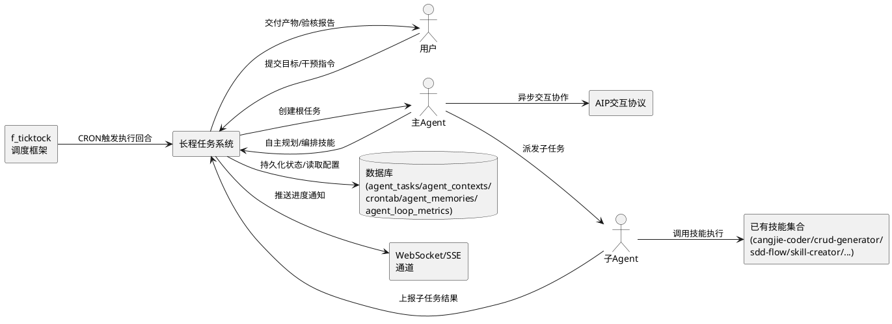
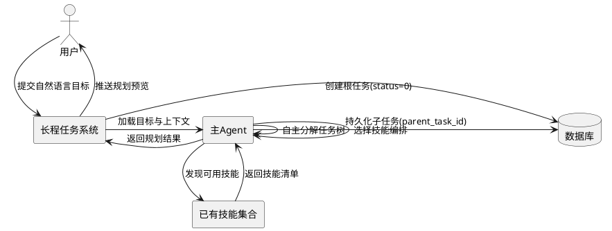
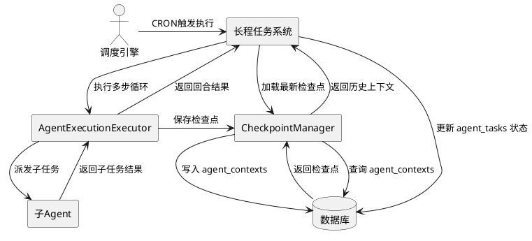
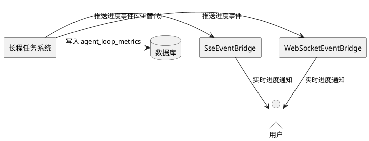
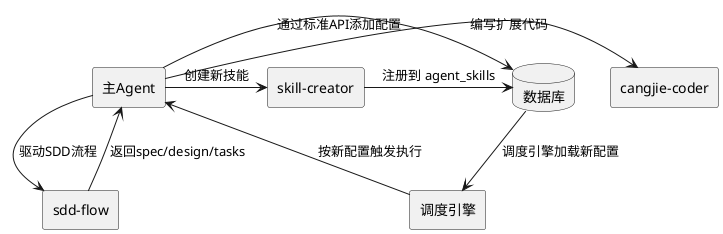
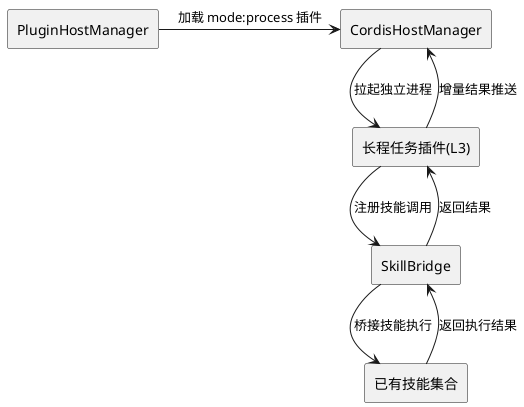
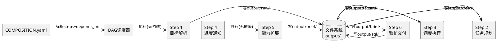
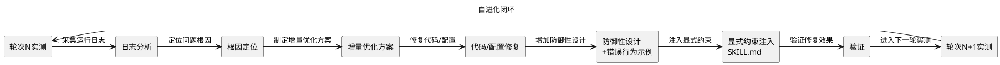
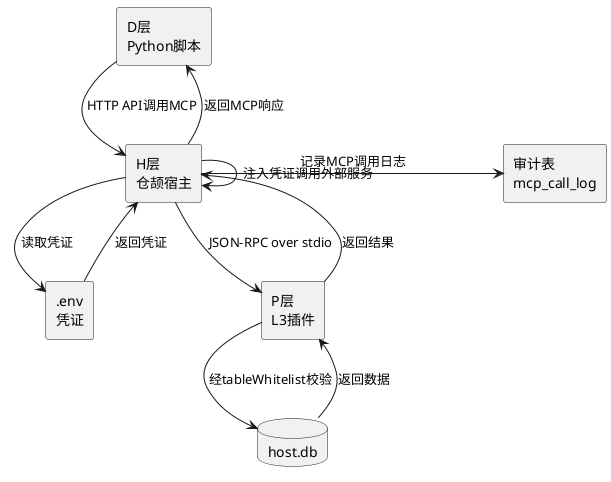

# AI 自主驱动长程任务系统需求规格

# **1. 组件定位**

## **1.1 核心职责**

本组件负责接收用户高层目标，由 AI 自主规划并驱动从分钟级到天级的长程任务执行，实现"人设目标、AI 自主规划与执行、人评审交付"的闭环。

## **1.2 核心输入**

1. 用户自然语言目标：用户提交的高层任务目标描述（如"为某业务生成完整的 CRUD 模块并上线"）
2. 用户干预指令：执行过程中的暂停/恢复/取消/调整目标/追加约束等指令
3. 调度引擎时钟脉冲：复用 crontab 调度引擎按 CRON 表达式触发的时钟信号
4. AIP 异步交互消息：符合 GB/Z 185.6 标准的智能体间异步交互消息
5. 子任务完成事件：子任务执行完成后的结果上报事件
6. 外部环境变更事件：文件系统变更、数据库变更、依赖变更等环境信号

## **1.3 核心输出**

1. 任务执行产物：代码文件、配置文件、SDD 文档（spec/design/tasks）、测试用例、验证报告等
2. 实时进度通知：通过 WebSocket/SSE 向用户推送任务进度、步骤状态、中间结果
3. 数据库状态变更：通过标准 API 向 agent_tasks/agent_contexts/crontab 等表写入驱动数据
4. 子任务派发指令：将分解后的子任务派发给子 Agent 或技能执行
5. 目标验核报告：任务完成后向用户交付的验核结果和产物清单
6. 评估指标上报：向 agent_loop_metrics 上报执行质量指标用于自优化

## **1.4 职责边界**

1. 不负责重新实现任务调度引擎，复用已有 crontab SchedulerEngine 和 f_ticktock 时间轮
2. 不负责重新实现检查点机制，复用已有 CheckpointManager 和 agent_contexts 表
3. 不负责重新实现 DAG 编排引擎，复用已有 DagScheduler 和 yaml_dag_config_parser
4. 不负责重新实现 Agent 执行器，复用已有 AgentExecutionExecutor 和 AgentRuntimeBridge
5. 不负责重新实现 AIP 交互协议，复用已有 aip_interaction_session/aip_interaction_task 表和服务
6. 不负责重新实现进度通知通道，复用已有 WebSocketEventBridge 和 SseEventBridge
7. 不负责重新实现技能系统，复用已有 SkillBridge 和 skills 目录下的全部技能
8. 不负责重新实现插件加载机制，复用已有三轨插件架构（Sync/Dylib/Process）
9. 不负责重新实现评估调优，复用已有 agent_loop_metrics 和 agent_loop_tuning_configs
10. 不负责具体业务逻辑的确定性实现，由 AI 自主决策驱动（确定性优先、AI 增强原则）

# **2. 领域术语**

**长程任务（Long-Running Task）**
: 一个由 AI 自主驱动、执行时间从分钟级到天级的任务，具有持久化状态、可中断恢复、可分解为子任务树、可验核交付的特性。

**任务目标（Task Goal）**
: 用户用自然语言描述的高层意图，是长程任务的起点和最终验核依据，不是具体的执行步骤。

**自主规划（Autonomous Planning）**
: AI 根据任务目标、当前环境状态和已有技能，自主分解任务、选择技能、编排执行流程的能力，而非按硬编码流程执行。

**任务树（Task Tree）**
: 长程任务通过 parent_task_id 建立的层级结构，根任务对应原始目标，叶节点对应原子操作，中间节点对应子目标。

**执行回合（Execution Round）**
: 长程任务的一次完整推理-执行-观察循环，由 AgentExecutionExecutor 的多步循环驱动，每回合后保存检查点。

**检查点（Checkpoint）**
: 长程任务在某个执行回合结束时的完整状态快照，存储于 agent_contexts 表，用于故障恢复和断点续执行。

**目标验核（Goal Verification）**
: 长程任务完成后，由 AI 自主或用户参与的对最终产物是否满足原始目标的验证过程，产生验核报告。

**技能编排（Skill Orchestration）**
: AI 根据子任务需求，从已安装技能中选择并组合技能执行序列的能力，技能是一等公民。

**规范驱动开发流程（SDD Flow）**
: 由 sdd-spec/sdd-design/sdd-task/sdd-test 技能组成的完整开发流程，可作为长程任务的子流程被编排。

**确定性优先原则（Determinism-First Principle）**
: 凡是可确定性实现的逻辑（CRUD、权限、调度、检查点）用已有基础设施代码实现，凡是需要推理、判断、创造的逻辑（任务分解、技能选择、代码生成）由 AI 驱动。

**L3 轨技能融合插件（L3 Skill-Fused Plugin）**
: 以进程隔离轨插件形式实现的长程任务能力包，通过 plugin.yaml 声明 mode:process，经 cordis-cj 集成实现故障隔离和动态启停。

**SOP 全流程模式（SOP Full-Flow Pattern）**
: 长程任务遵循的统一步骤范式，将复杂任务分解为有序的标准化步骤序列，每步都有明确的脚本/技能、输入、输出和验收条件，步骤间通过文件系统传递中间产物。三个已跑通技能的共性范式为 6 步：目标解析→任务规划→调度执行→进度通知→能力扩展→验核交付。

**D-P-H-E 四层分层架构（D-P-H-E Layered Architecture）**
: 长程任务系统的分层架构模式。D 层（动态脚本）承载业务逻辑，经 cli_execute 调用；P 层（L3 插件）提供进程隔离的 CRUD 和自定义 handler；H 层（宿主服务）提供 MCP 开放服务、数据库和权限基础设施；E 层（技能定义）通过 SKILL.md 和 COMPOSITION.yaml 声明 SOP 和步骤编排。

**降级策略链（Degradation Strategy Chain）**
: 每个执行步骤的分层降级策略，确保流程不中断。工具优先级：优先用 cli_execute 运行已验证脚本 → 降级用内置工具（web_fetch/http_request）→ 降级用大模型。遵循"遇挫不停"原则：任何步骤失败必须先重试一次，重试仍失败才换方案，不可直接返回停止。

**幂等落库（Idempotent Persistence）**
: 数据写入采用先查后写策略（命中 UPDATE / 未命中 INSERT），配合行级权限（creator=userId）和批量隔离（单条失败不中断批次），确保重复执行不产生重复数据。

**产物校验（Artifact Verification）**
: 每步执行后必须校验产出文件存在且非空的机制，通过 file_read 或 cli_execute 校验。answer 前必须终检全部关键产出物存在，缺失则补执行对应步骤，禁止提前终止。

**防回退机制（Anti-Regression Mechanism）**
: 每轮修复增加防御性设计和错误行为示例（严禁复现），通过显式约束注入 SKILL.md（任务完成判定、遇挫不停重试、SOP 全步完成强制约束、产出文件校验等），防止已修复问题复现。

**AI 驱动自进化闭环（AI-Driven Self-Evolution Loop）**
: 长程任务系统支持的自进化模式，由实测驱动→根因分析→增量优化→防回退→显式约束注入五个环节组成闭环。每轮优化基于实测日志证据而非猜测，从日志定位问题根因而非表面现象，沿用原有架构增量优化复用现有基础设施。

**COMPOSITION.yaml 步骤编排（COMPOSITION.yaml Step Orchestration）**
: 通过 COMPOSITION.yaml 的 steps 数组声明各步骤，depends_on 声明依赖关系形成 DAG，step_type 区分 script/plugin/output，input 中用 ${step.output} 引用上一步产出，支持条件执行和并行步骤。

# **3. 角色与边界**

## **3.1 核心角色**

- **用户（User）**：提交任务目标、在中途干预执行、评审最终产物并确认交付
- **主 Agent（MainAgent）**：接收目标、自主规划、编排技能和子 Agent、汇总结果、执行验核
- **子 Agent（SubAgent）**：由主 Agent 创建，承担任务树中子节点的执行，类型包括 analyzer/comparator/grader 等
- **调度引擎（SchedulerEngine）**：按 crontab 配置周期性触发长程任务的执行回合，无需人工干预

## **3.2 外部系统**

- **PostgreSQL 数据库**：持久化任务、上下文、消息、记忆、调度配置、评估指标等全部状态
- **f_ticktock 调度框架**：提供时间轮和 CRON 编译器，驱动调度引擎触发任务执行
- **已有技能集合**：cangjie-coder/crud-generator/sdd-flow/skill-creator 等全部已安装技能
- **已有插件系统**：三轨插件架构（Sync/Dylib/Process），提供插件加载、路由注册、技能桥接能力
- **AIP 交互协议**：符合 GB/Z 185.6 标准的智能体间异步交互，支持跨 Agent 协作
- **WebSocket/SSE 通道**：向用户实时推送任务进度和中间结果
- **文件系统**：任务产物的落地存储，经 sync 服务与数据库双向同步

## **3.3 交互上下文**



# **4. DFX约束**

## **4.1 性能**

1. 单个长程任务最大执行时间：24 小时（可配置），超时后自动暂停并通知用户
2. 单次执行回合最大时长：30 分钟（可配置），超时后保存检查点并进入下一回合
3. 检查点保存延迟 ≤ 500ms（复用已有 CheckpointManager 性能）
4. 进度通知延迟 ≤ 1s（复用已有 WebSocketEventBridge 性能）
5. 任务派发到子 Agent 启动延迟 ≤ 2s
6. 同时执行的长程任务数上限：100（可配置），超出进入优先级队列等待
7. 任务队列支持最多 10000 个待执行任务

## **4.2 可靠性**

1. 长程任务状态必须持久化到 agent_tasks 表，进程重启后可从最新检查点恢复执行
2. 每个执行回合结束后必须保存检查点到 agent_contexts 表，失败回退到上一检查点
3. 子任务失败不得导致父任务立即失败，由 AI 自主决策重试/跳过/降级/上报
4. 调度引擎可用性目标 99.9%（复用已有 crontab 调度引擎可靠性）
5. 任务执行异常必须记录完整错误信息到 agent_tasks.error_message 和 crontab_log
6. 优雅关闭时，正在执行的回合必须等待完成或保存检查点后退出，最长等待 30 秒
7. AIP 异步交互模式下，网络中断恢复后必须能继续任务执行而非从头开始

## **4.3 安全性**

1. 长程任务执行必须复用现有行级权限校验机制，不得绕过 PermissionLevel 权限
2. AI 自主生成的代码必须经过人工评审或自动化质量闸（静态检查/测试覆盖）后方可合并
3. AI 自主创建的技能必须经过 skill-creator 标准流程生成并注册，不得绕过技能注册表
4. AI 自主操作数据库必须通过标准 CRUD API，不得直接执行任意 SQL
5. 关键操作（代码合并、生产部署、数据删除）必须经用户确认后方可执行
6. 任务产物中的敏感信息（密钥、凭证）必须脱敏后才能写入日志和进度通知

## **4.4 可维护性**

1. 长程任务执行全过程必须输出结构化日志，包含任务ID、回合数、步骤名、耗时等关键信息
2. 必须提供任务状态查询 API，可查询任意长程任务的当前状态、进度、子任务树、检查点列表
3. 必须复用已有 agent_loop_metrics 评估体系，自动采集成功率/Token消耗/耗时/工具调用次数
4. 必须复用已有 agent_loop_tuning_configs 调优体系，基于评估结果自动优化执行策略
5. 长程任务的规划过程和决策依据必须可追溯，支持事后复盘和审计

## **4.5 兼容性**

1. 长程任务系统必须与已有 AgentExecutionExecutor 完全兼容，不破坏现有 Agent 执行流程
2. 长程任务系统必须与已有 crontab 调度引擎完全兼容，不破坏现有计划任务调度
3. 长程任务系统必须与已有插件三轨架构完全兼容，支持以 L3 进程隔离轨插件形式加载
4. 长程任务系统必须与已有 AIP 交互协议完全兼容，支持与外部智能体的异步协作
5. 长程任务系统必须与已有技能系统完全兼容，可调用 skills 目录下的全部已安装技能

# **5. 核心能力**

## **5.1 AI 自主目标解析与任务规划**

### **5.1.1 业务规则**

1. **目标接收**：用户提交自然语言目标后，系统必须创建一个根任务记录到 agent_tasks 表，status=0（待处理），payload 包含原始目标描述
   - 验收条件：[用户提交目标"为某业务生成 CRUD 模块"] → [agent_tasks 表新增一条记录，payload 含原始目标]

2. **自主规划**：主 Agent 必须根据目标、当前环境状态和已有技能，自主分解任务树并选择技能编排，而非按硬编码流程执行
   - 验收条件：[目标为"生成 CRUD 模块"] → [AI 自主分解为"分析数据库结构→生成代码→生成测试→验证"子任务，并选择 crud-generator/sdd-test 技能]

3. **技能发现**：AI 规划时必须能发现并选择已安装的全部技能，包括 cangjie-coder/crud-generator/sdd-flow/skill-creator 等
   - 验收条件：[skills 目录下存在 N 个已安装技能] → [AI 规划时可引用全部 N 个技能]

4. **动态重规划**：执行过程中若环境变化或子任务失败，AI 必须能自主调整后续规划，而非僵化执行原计划
   - 验收条件：[子任务"生成代码"失败且不可重试] → [AI 自主决策调整为"分析失败原因→修复→重试"或"换用其他技能"]

5. **规划持久化**：任务树和规划结果必须持久化到 agent_tasks 表（通过 parent_task_id 建立层级），进程重启后可恢复
   - 验收条件：[AI 完成规划生成 M 个子任务] → [agent_tasks 表新增 M 条子任务记录，parent_task_id 指向根任务]

6. **禁止项**：AI 自主规划禁止绕过已有技能系统直接操作文件系统，必须通过技能或标准 API
   - 验收条件：[AI 需要生成代码] → [必须调用 cangjie-coder 或 crud-generator 技能，不得直接写文件]

### **5.1.2 交互流程**



### **5.1.3 异常场景**

1. **目标模糊不可规划**
   - 触发条件：用户提交的目标过于模糊，AI 无法分解为可执行子任务
   - 系统行为：AI 自主向用户发起澄清提问，暂停规划等待回答
   - 用户感知：收到澄清问题通知，回答后规划继续

2. **技能不可用**
   - 触发条件：规划所需的技能未安装或处于禁用状态
   - 系统行为：AI 自主决策是否通过 skill-creator 创建新技能，或换用替代技能，或上报用户
   - 用户感知：收到技能不可用通知和 AI 的处理方案

3. **规划过程中环境变更**
   - 触发条件：规划过程中数据库结构、文件系统或依赖发生变更
   - 系统行为：AI 重新加载环境状态，基于新状态调整规划
   - 用户感知：收到规划调整通知，可查看调整前后对比

## **5.2 长程任务调度与执行**

### **5.2.1 业务规则**

1. **调度驱动**：长程任务必须通过 crontab 表配置驱动调度引擎触发执行，复用已有 SchedulerEngine 和 f_ticktock 时间轮
   - 验收条件：[创建长程任务] → [crontab 表新增对应记录，task=agent_execution://<agentId>，由调度引擎按 CRON 触发]

2. **执行回合循环**：每次调度触发执行一个回合，回合内由 AgentExecutionExecutor 多步循环执行，每回合后保存检查点
   - 验收条件：[调度引擎触发执行] → [AgentExecutionExecutor 执行一轮多步循环，结束后保存检查点到 agent_contexts]

3. **检查点恢复**：进程重启后，调度引擎触发任务执行时必须先加载最新检查点，从断点续执行而非从头开始
   - 验收条件：[任务执行到第 N 回合后进程重启] → [下次执行从第 N 回合的检查点恢复，不重复已完成步骤]

4. **子任务派发**：主 Agent 必须能将子任务派发给子 Agent 执行，子任务通过 parent_task_id 关联父任务
   - 验收条件：[主 Agent 决策执行子任务] → [创建子 Agent 并派发子任务，子任务 parent_task_id 指向父任务]

5. **子任务结果聚合**：子任务完成后，结果必须自动上报并聚合到父任务，由 AI 决策后续动作
   - 验收条件：[子任务完成返回结果] → [结果写入子任务 result 字段，主 Agent 收到通知并决策下一步]

6. **并发控制**：同一长程任务的子任务可并发执行，但必须遵守 crontab.concurrentable 配置的并发策略
   - 验收条件：[concurrentable=false] → [同一任务的新触发等待前一次执行完成]

7. **禁止项**：禁止重新实现任务调度引擎和检查点机制，必须复用已有基础设施
   - 验收条件：[长程任务调度] → [使用已有 SchedulerEngine，不新建调度器]

### **5.2.2 交互流程**



### **5.2.3 异常场景**

1. **执行回合超时**
   - 触发条件：单次执行回超过 30 分钟（可配置）
   - 系统行为：保存当前检查点，标记回合超时，等待下次调度触发从检查点恢复
   - 用户感知：收到回合超时通知，任务状态为进行中（等待下次回合）

2. **子 Agent 执行失败**
   - 触发条件：子 Agent 执行返回失败状态或异常
   - 系统行为：记录错误信息，由主 AI 自主决策重试/跳过/降级/上报
   - 用户感知：收到子任务失败通知和 AI 的处理决策

3. **检查点损坏**
   - 触发条件：agent_contexts 中的检查点数据格式损坏或反序列化失败
   - 系统行为：回退到上一个有效检查点，记录警告日志
   - 用户感知：收到检查点回退通知，任务从更早的断点恢复

## **5.3 暂停/恢复/取消与用户干预**

### **5.3.1 业务规则**

1. **暂停任务**：用户可暂停长程任务，系统在当前回合完成后暂停，保存检查点，停止后续调度触发
   - 验收条件：[用户发起暂停] → [当前回合完成后 agent_tasks.status 更新为暂停，crontab.status 更新为禁用]

2. **恢复任务**：用户可恢复暂停的任务，系统从最新检查点继续执行，重新启用调度
   - 验收条件：[用户发起恢复] → [crontab.status 更新为启用，下次调度触发从检查点恢复执行]

3. **优雅取消**：用户可取消长程任务，系统完成当前步骤后取消，保留已有结果，标记任务为已取消
   - 验收条件：[用户发起取消] → [当前步骤完成后 agent_tasks.status 更新为已取消，result 保留已有结果]

4. **强制取消**：用户可强制取消长程任务，立即终止执行，标记任务为已取消
   - 验收条件：[用户发起强制取消] → [立即终止执行，agent_tasks.status 更新为已取消]

5. **目标调整**：用户可在执行过程中调整目标或追加约束，AI 必须基于新目标重新规划
   - 验收条件：[用户追加约束"必须使用某框架"] → [AI 基于新约束调整后续规划]

6. **干预渠道**：暂停/恢复/取消/调整必须通过标准 API 和 WebSocket 均可触发
   - 验收条件：[通过 API 或 WebSocket 发起暂停] → [任务正确暂停]

7. **禁止项**：禁止在暂停/取消过程中丢弃已有检查点和中间结果
   - 验收条件：[暂停任务] → [agent_contexts 中的检查点保留，不删除]

### **5.3.2 交互流程**

```plantuml
@startuml
actor "用户" as user
rectangle "长程任务系统" as lrt
rectangle "调度引擎" as sched
database "数据库" as db

user -> lrt : 发起暂停/恢复/取消
lrt -> db : 查询当前任务状态
alt 暂停
    lrt -> sched : 等待当前回合完成
    lrt -> db : 更新 agent_tasks.status=暂停
    lrt -> db : 更新 crontab.status=禁用
else 恢复
    lrt -> db : 更新 crontab.status=启用
    lrt -> sched : 恢复调度触发
else 取消
    lrt -> db : 更新 agent_tasks.status=已取消
end
lrt --> user : 返回操作结果
@enduml
```

### **5.3.3 异常场景**

1. **暂停时回合未完成**
   - 触发条件：用户发起暂停时，当前回合正在执行中
   - 系统行为：等待当前回合完成或超时后再暂停，保存检查点
   - 用户感知：收到"等待当前回合完成后暂停"的通知

2. **恢复时检查点丢失**
   - 触发条件：用户发起恢复时，检查点已被清理或损坏
   - 系统行为：提示用户检查点不可用，由用户决策从头开始或放弃
   - 用户感知：收到检查点丢失通知和选项

## **5.4 实时进度通知与可观测性**

### **5.4.1 业务规则**

1. **进度推送**：任务执行过程中必须通过 WebSocket/SSE 实时推送进度事件，复用已有 WebSocketEventBridge 和 SseEventBridge
   - 验收条件：[任务执行产生进度变化] → [WebSocket/SSE 推送进度事件给用户]

2. **进度事件类型**：必须支持 step_start/step_complete/step_failed/checkpoint_saved/progress_update/subtask_dispatched/subtask_completed/goal_achieved 等事件类型
   - 验收条件：[子任务派发] → [推送 subtask_dispatched 事件，含子任务信息]

3. **进度内容**：进度必须包含已完成步骤数/总步骤数、当前步骤描述、预估剩余时间、中间结果预览
   - 验收条件：[任务执行到第 N 步] → [进度含 N/总步骤数、当前步骤描述、预估剩余时间]

4. **任务树可视化**：必须提供任务树状态查询 API，返回根任务和全部子任务的当前状态和层级关系
   - 验收条件：[查询任务树] → [返回含根任务和子任务的树形结构，各节点含状态信息]

5. **评估指标采集**：必须复用已有 agent_loop_metrics 自动采集成功率/Token消耗/耗时/工具调用次数/副作用数量
   - 验收条件：[任务执行完成] → [agent_loop_metrics 表新增评估记录]

6. **禁止项**：禁止重新实现进度通知通道，必须复用已有 WebSocketEventBridge 和 SseEventBridge
   - 验收条件：[进度通知] → [使用已有 WebSocketEventBridge，不新建通知通道]

### **5.4.2 交互流程**



### **5.4.3 异常场景**

1. **WebSocket 连接中断**
   - 触发条件：用户网络中断导致 WebSocket 连接断开
   - 系统行为：进度事件缓存到数据库，用户重连后补发缺失事件
   - 用户感知：重连后收到断连期间的进度补发

2. **进度推送延迟超限**
   - 触发条件：进度通知延迟超过 1s
   - 系统行为：记录警告日志，不影响任务执行
   - 用户感知：进度更新略有延迟

## **5.5 AI 自主能力扩展**

### **5.5.1 业务规则**

1. **自主编写代码**：当已有技能不足以完成任务时，AI 必须能自主编写代码扩展能力，通过 cangjie-coder 技能生成仓颉代码
   - 验收条件：[任务需要新功能且无现成技能] → [AI 调用 cangjie-coder 编写代码实现功能]

2. **自主创建技能**：AI 必须能通过 skill-creator 技能自主创建新技能，扩展技能库
   - 验收条件：[任务需要可复用能力] → [AI 调用 skill-creator 创建新技能并注册到 agent_skills 表]

3. **自主生成插件**：AI 必须能自主生成 L3 轨进程隔离插件，通过 plugin.yaml 声明 mode:process 配置
   - 验收条件：[任务需要独立能力包] → [AI 生成 plugin.yaml(mode:process) 和插件代码，经 cordis-cj 加载]

4. **自主驱动 SDD 流程**：AI 必须能自主驱动规范驱动开发流程，通过 sdd-spec/sdd-design/sdd-task/sdd-test 生成 SDD 文档
   - 验收条件：[任务需要新模块] → [AI 调用 sdd-flow 生成 spec/design/tasks 文档并实现代码]

5. **自主操作数据库**：AI 必须能通过标准 CRUD API 向数据库添加数据，驱动计划任务、动态工作流等
   - 验收条件：[AI 需要配置新计划任务] → [通过 crontab 标准 API 新增记录，调度引擎自动加载]

6. **自主驱动调度**：AI 必须能通过向 crontab 表添加配置数据驱动调度引擎，实现动态工作流
   - 验收条件：[AI 决策需要周期性执行某操作] → [向 crontab 表新增记录，调度引擎按 CRON 触发]

7. **质量闸门**：AI 自主生成的代码和技能必须经过质量闸门（静态检查/测试覆盖/人工评审）后方可使用
   - 验收条件：[AI 生成代码] → [经过静态检查和测试覆盖验证，关键变更经人工评审后方可合并]

8. **禁止项**：AI 自主扩展能力禁止绕过 skill-creator 和标准 API 直接修改技能目录和数据库
   - 验收条件：[AI 创建新技能] → [通过 skill-creator 标准流程，不直接写 skills 目录]

### **5.5.2 交互流程**



### **5.5.3 异常场景**

1. **生成的代码编译失败**
   - 触发条件：AI 自主生成的代码无法通过编译
   - 系统行为：AI 自主分析编译错误，调用 cangjie-coder 修复，重试有限次后上报用户
   - 用户感知：收到代码编译失败通知和 AI 的修复尝试

2. **创建的技能无效**
   - 触发条件：AI 创建的新技能执行时异常或不符合预期
   - 系统行为：记录错误到 agent_skills.last_error，AI 自主决策修复或禁用
   - 用户感知：收到技能异常通知

3. **质量闸门拒绝**
   - 触发条件：AI 生成的代码未通过质量闸门（测试覆盖不足/静态检查失败）
   - 系统行为：AI 自主补充测试或修复问题后重新提交闸门
   - 用户感知：收到质量闸门拒绝通知和 AI 的修复动作

## **5.6 目标验核与交付**

### **5.6.1 业务规则**

1. **自主验核**：长程任务执行完成后，AI 必须自主对最终产物是否满足原始目标进行验核，生成验核报告
   - 验收条件：[任务执行完成] → [AI 自主验核产物是否满足目标，生成验核报告]

2. **验核内容**：验核报告必须包含目标达成度、产物清单、测试结果、已知问题、建议后续动作
   - 验收条件：[验核完成] → [报告含目标达成度、产物清单、测试结果、已知问题、建议]

3. **用户评审**：验核报告必须提交给用户评审，用户可确认交付、要求改进或放弃
   - 验收条件：[验核报告生成] → [推送给用户评审，用户可确认/改进/放弃]

4. **迭代改进**：用户要求改进时，AI 必须基于反馈调整规划并继续执行，形成闭环
   - 验收条件：[用户要求改进"增加某功能"] → [AI 基于反馈调整规划并执行]

5. **产物交付**：用户确认交付后，产物必须落地到文件系统并经 sync 服务同步到数据库
   - 验收条件：[用户确认交付] → [产物落地文件系统，sync 服务同步到数据库]

6. **验核指标上报**：验核结果必须上报到 agent_loop_metrics，用于后续任务的执行策略自优化
   - 验收条件：[验核完成] → [agent_loop_metrics 新增记录，含成功率/Token消耗等指标]

7. **禁止项**：禁止在用户未确认前将产物合并到主分支或部署到生产环境
   - 验收条件：[产物生成] → [在用户确认前不合并主分支、不部署生产]

### **5.6.2 交互流程**

```plantuml
@startuml
rectangle "主Agent" as main
rectangle "长程任务系统" as lrt
actor "用户" as user
database "数据库" as db
rectangle "sync服务" as sync

main -> main : 自主验核产物
main -> lrt : 生成验核报告
lrt -> user : 推送验核报告
alt 用户确认交付
    user -> lrt : 确认交付
    lrt -> sync : 产物落地文件系统
    sync -> db : 同步到数据库
    lrt -> db : 上报 agent_loop_metrics
else 用户要求改进
    user -> lrt : 反馈改进意见
    lrt -> main : 调整规划继续执行
else 用户放弃
    user -> lrt : 放弃任务
    lrt -> db : 标记任务已放弃
end
@enduml
```

### **5.6.3 异常场景**

1. **验核不通过且无法改进**
   - 触发条件：AI 验核发现目标未达成且经多次迭代仍无法满足
   - 系统行为：向用户报告未达成原因、已完成部分、建议人工介入点
   - 用户感知：收到未达成报告，可选择人工介入或放弃

2. **产物落地失败**
   - 触发条件：产物写入文件系统或 sync 同步失败
   - 系统行为：重试有限次后上报用户，保留产物在数据库中
   - 用户感知：收到落地失败通知，可手动提取产物

## **5.7 L3 轨技能融合插件实现与 D-P-H-E 分层架构**

### **5.7.1 业务规则**

1. **插件形态**：长程任务系统必须以 L3 轨进程隔离插件形式实现，通过 plugin.yaml 声明 mode:process
   - 验收条件：[加载长程任务插件] → [plugin.yaml 含 mode:process，经 cordis-cj 进程隔离加载]

2. **技能融合**：插件必须通过 SkillBridge 与已有技能系统融合，可调用 skills 目录下的全部技能
   - 验收条件：[插件执行需调用技能] → [经 SkillBridge 调用目标技能，不重新实现]

3. **故障隔离**：L3 轨进程隔离必须保证长程任务插件故障不影响宿主和其他插件
   - 验收条件：[长程任务插件异常崩溃] → [宿主和其他插件正常运行，插件自动重启]

4. **动态启停**：长程任务插件必须支持动态启停，通过 plugin.yaml 的 enabled 字段和 autoRestart 配置控制
   - 验收条件：[设置 enabled=false] → [插件停止；设置 enabled=true] → [插件重新启动]

5. **配置驱动**：插件行为必须通过 plugin.yaml 的 config 字段和数据库配置驱动，不硬编码业务逻辑
   - 验收条件：[修改 plugin.yaml config 或数据库配置] → [插件行为相应调整，无需重新编译]

6. **技能编排声明**：插件必须通过 COMPOSITION.yaml 声明技能编排流程，支持步骤依赖和条件执行
   - 验收条件：[插件加载] → [读取 COMPOSITION.yaml 构建技能编排流程，按依赖关系执行]

7. **D-P-H-E 四层分层**：长程任务系统必须遵循 D-P-H-E 四层分层架构，各层职责明确
   - 验收条件：[长程任务执行] → [D 层脚本承载业务逻辑，P 层插件提供 CRUD+handler，H 层宿主提供 MCP+DB+权限，E 层 SKILL.md+COMPOSITION.yaml 声明 SOP]

8. **D 层动态脚本**：业务逻辑由 Python 脚本承载，经 cli_execute 调用，脚本通过 HTTP API 调用 H 层宿主服务
   - 验收条件：[执行业务逻辑] → [cli_execute 运行 Python 脚本，脚本经 HTTP API 调用宿主 MCP 开放服务]

9. **P 层 L3 插件**：仓颉进程隔离轨插件提供 CRUD + 自定义 handler + 幂等落库，plugin.yaml 声明 mode:process
   - 验收条件：[插件配置] → [plugin.yaml 含 mode:process、tableWhitelist、routes、autoRestart=true]

10. **H 层宿主服务**：仓颉宿主提供 MCP 开放服务 + host.db + 行级权限 + 审计日志，凭证仅存宿主 .env
    - 验收条件：[插件/脚本调用宿主] → [经 MCP 开放服务，凭证由宿主管理，插件与脚本不接触凭证本体]

11. **E 层技能定义**：SKILL.md 声明 SOP 和步骤说明，COMPOSITION.yaml 声明步骤编排和依赖关系
    - 验收条件：[技能加载] → [读取 SKILL.md 获取 SOP 说明，读取 COMPOSITION.yaml 获取步骤编排]

12. **禁止项**：禁止以 L1 内嵌轨或 L2 动态库轨形式实现，必须使用 L3 进程隔离轨
    - 验收条件：[plugin.yaml mode] → [必须为 process，不为 sync 或 dylib]

### **5.7.2 交互流程**



### **5.7.3 异常场景**

1. **插件进程崩溃**
   - 触发条件：L3 轨长程任务插件进程异常退出
   - 系统行为：CordisHostManager 自动重启插件（autoRestart=true），从最新检查点恢复
   - 用户感知：收到插件重启通知，任务从检查点继续

2. **技能桥接失败**
   - 触发条件：SkillBridge 调用目标技能时技能不存在或执行异常
   - 系统行为：记录错误，AI 自主决策换用其他技能或创建新技能
   - 用户感知：收到技能调用失败通知和 AI 的处理决策

3. **插件配置错误**
   - 触发条件：plugin.yaml 或 COMPOSITION.yaml 格式错误或配置不合法
   - 系统行为：插件加载失败，记录详细错误日志，不影响宿主
   - 用户感知：收到插件加载失败通知和错误详情

## **5.8 采用技能融合插件机制的 SOP 全流程编排模式**

### **5.8.1 业务规则**

1. **6 步统一范式**：长程任务必须遵循 6 步 SOP 统一范式：目标解析→任务规划→调度执行→进度通知→能力扩展→验核交付，每步都有明确的脚本/技能、输入、输出和验收条件
   - 验收条件：[创建长程任务] → [分解为 6 步 SOP，每步含脚本/技能、输入、输出、验收条件]

2. **步骤间产物传递**：步骤间通过文件系统传递中间产物，目录结构遵循 output/{阶段}/{标识} 规范（如 output/raw→output/clean→output/factors→output/brief→output/sql）
   - 验收条件：[Step N 完成] → [产出写入 output/{阶段}/ 目录，Step N+1 从该目录读取输入]

3. **COMPOSITION.yaml 声明编排**：步骤编排必须通过 COMPOSITION.yaml 的 steps 数组声明，depends_on 声明依赖关系形成 DAG，step_type 区分 script/plugin/output
   - 验收条件：[插件加载] → [解析 COMPOSITION.yaml 构建 DAG，按依赖关系执行步骤]

4. **步骤引用上步产出**：input 中用 ${step.output} 引用上一步产出，支持路径模板和变量替换
   - 验收条件：[Step N+1 的 input 含 ${step-N.output}] → [运行时替换为 Step N 的实际产出路径]

5. **并行与条件执行**：DAG 支持无依赖关系的步骤并行执行，支持条件表达式控制步骤是否执行
   - 验收条件：[Step A 和 Step B 无依赖关系] → [可并行执行；Step C 含 condition] → [条件满足时执行]

6. **步骤验收条件**：每步必须声明验收条件，执行后校验产出是否符合预期，不符合则触发重试或降级
   - 验收条件：[Step N 声明验收条件] → [执行后校验产出，不符合则重试或降级]

7. **禁止项**：禁止硬编码步骤执行顺序，必须通过 COMPOSITION.yaml 的 depends_on 声明依赖关系
   - 验收条件：[步骤编排] → [通过 COMPOSITION.yaml depends_on 声明，不硬编码顺序]

### **5.8.2 交互流程**



### **5.8.3 异常场景**

1. **COMPOSITION.yaml 解析失败**
   - 触发条件：COMPOSITION.yaml 格式错误或依赖关系存在循环
   - 系统行为：记录错误日志，DAG 构建失败，任务标记为失败
   - 用户感知：收到编排配置错误通知和错误详情

2. **步骤间产物传递失败**
   - 触发条件：上一步产出文件不存在或格式不匹配下一步输入要求
   - 系统行为：触发产物校验失败处理，重试或降级上一步
   - 用户感知：收到产物传递失败通知和 AI 的处理决策

## **5.9 降级策略链与遇挫不停**

### **5.9.1 业务规则**

1. **工具优先级链**：每个执行步骤必须声明工具优先级：优先用 cli_execute 运行已验证脚本 → 降级用内置工具（web_fetch/http_request）→ 降级用大模型
   - 验收条件：[步骤执行] → [优先 cli_execute 脚本，脚本不可用时降级内置工具，内置工具不可用时降级大模型]

2. **遇挫不停原则**：任何步骤失败必须先重试一次（同一命令再跑一次确认是否偶发），重试仍失败才换方案，严禁遇挫即停
   - 验收条件：[步骤失败] → [先重试 1 次，重试仍失败才换替代方案，不可直接返回 answer 停止]

3. **替代方案链**：重试仍失败时必须尝试替代方案（如脚本失败→降级 web_fetch→手工整理），替代方案也失败时在 answer 中明确报告尝试次数和失败原因
   - 验收条件：[重试失败] → [尝试替代方案，替代方案也失败时报告"尝试了 X 次重试和 Y 种替代方案均失败"]

4. **LLM 降级**：LLM 不可用时降级为模板生成，不中断流程
   - 验收条件：[LLM_API_KEY 未配置] → [降级为模板化生成，产出保持同结构以衔接下游]

5. **数据库连接降级**：数据库连接失败时降级为生成 SQL 文件（--sql-only），不中断流程
   - 验收条件：[数据库连接失败] → [降级生成 SQL 文件，人工导入数据库即可]

6. **编码错误降级**：cli_execute stdout 编码失败时返回替换后的字符串（非空），按替代方案清单尝试其他路径
   - 验收条件：[stdout 编码失败] → [返回替换后字符串，按替代方案尝试其他路径]

7. **部分失败隔离**：批量执行时单个条目失败不中断批次，记录错误字段继续处理其他条目
   - 验收条件：[批量执行中条目 A 失败] → [记录 A 的 error 字段，继续执行条目 B/C/...]

8. **禁止项**：禁止未实际尝试重试和替代方案就返回 answer 停止
   - 验收条件：[步骤失败] → [必须先重试+换方案，严禁直接 answer 停止]

### **5.9.2 交互流程**

```plantuml
@startuml
rectangle "步骤执行" as step
rectangle "cli_execute\n(已验证脚本)" as cli
rectangle "内置工具\n(web_fetch/http)" as builtin
rectangle "大模型" as llm
rectangle "模板降级" as template

step -> cli : 优先尝试
alt cli 成功
    cli --> step : 返回产出
else cli 失败
    step -> step : 重试1次
    alt 重试成功
        step --> step : 继续
    else 重试失败
        step -> builtin : 降级内置工具
        alt builtin 成功
            builtin --> step : 返回产出
        else builtin 失败
            step -> llm : 降级大模型
            alt llm 成功
                llm --> step : 返回产出
            else llm 失败
                step -> template : 降级模板
                template --> step : 返回产出
            end
        end
    end
end
@enduml
```

### **5.9.3 异常场景**

1. **全部降级方案均失败**
   - 触发条件：cli_execute、内置工具、大模型、模板全部失败
   - 系统行为：在 answer 中明确报告"尝试了 X 次重试和 Y 种替代方案均失败"，给出下一步建议
   - 用户感知：收到完整失败报告和下一步建议（而非只说"失败"就停）

2. **降级产出格式不匹配**
   - 触发条件：降级方案产出的数据结构与下游步骤期望的输入格式不匹配
   - 系统行为：AI 自主调整产出格式以衔接下游，或调整下游步骤的输入期望
   - 用户感知：收到格式调整通知，流程继续

## **5.10 产物校验与防回退机制**

### **5.10.1 业务规则**

1. **每步产物校验**：每步执行后必须用 file_read 或 cli_execute 校验产出文件存在且非空
   - 验收条件：[Step N 执行完成] → [校验 output/{阶段}/{标识} 存在且非空，不存在则补执行]

2. **answer 前终检**：生成最终 answer 前必须确认全部关键产出物均已存在，缺失则继续执行缺失步骤
   - 验收条件：[准备返回 answer] → [终检 output/brief/ 和 output/sql/ 等关键产物存在，缺失则补执行]

3. **SOP 全步完成强制约束**：禁止提前终止，必须依次执行全部步骤，不得在任何中间步骤后直接跳到 answer 总结
   - 验收条件：[SOP 含 6 步] → [必须依次执行 Step 1→2→3→4→5→6，不得跳过中间步骤]

4. **任务完成判定**：不能因目录有旧文件就误判任务已完成，必须检查日期匹配+实际执行 SOP+内容校验
   - 验收条件：[目录有旧日期文件] → [忽略旧文件，继续执行 SOP 直至生成用户要求日期的产出]

5. **日期匹配校验**：必须检查产出文件的日期是否匹配用户要求，旧日期文件不算完成
   - 验收条件：[用户要 2026-08-10 的产出] → [output/brief/2026-08-11.md（旧）不算完成，必须生成 2026-08-10.md]

6. **内容校验**：打开产出文件检查内容是否包含本次执行的数据，非空文件且非旧内容才算完成
   - 验收条件：[产出文件存在] → [检查内容含本次数据（如具体数值），非旧内容才算完成]

7. **防回退显式约束注入**：每轮修复必须增加防御性设计和错误行为示例（严禁复现），通过显式约束注入 SKILL.md
   - 验收条件：[修复问题 X] → [SKILL.md 增加错误行为示例（严禁复现）和正确行为示例]

8. **错误行为示例**：对已修复的典型错误行为，必须记录错误行为示例和正确行为示例，防止复现
   - 验收条件：[v9 修复任务完成判定] → [SKILL.md 含错误行为示例（误判完成）和正确行为示例（校验后完成）]

9. **禁止项**：禁止只看目录有文件就误判任务完成，禁止跳过中间步骤直接 answer
   - 验收条件：[目录有文件] → [必须校验日期匹配+内容为本次生成，不算完成则继续执行]

### **5.10.2 交互流程**

```plantuml
@startuml
rectangle "Step N 执行" as step
rectangle "产物校验" as verify
rectangle "file_read\n/cli_execute" as tool
rectangle "补执行" as retry
rectangle "继续Step N+1" as next

step -> verify : 校验产出
verify -> tool : 检查文件存在且非空
alt 校验通过
    tool --> verify : 文件存在且非空
    verify -> next : 继续下一步
else 校验失败
    tool --> verify : 文件缺失或为空
    verify -> retry : 补执行Step N
    retry -> verify : 重新校验
end
@enduml
```

### **5.10.3 异常场景**

1. **产物校验反复失败**
   - 触发条件：补执行后产物仍不存在或为空
   - 系统行为：触发降级策略链，尝试替代方案生成产物
   - 用户感知：收到校验失败通知和 AI 的降级处理

2. **旧文件干扰判定**
   - 触发条件：目录中存在旧日期的产出文件，导致误判任务已完成
   - 系统行为：忽略旧文件，继续执行 SOP 直至生成用户要求日期的产出
   - 用户感知：收到旧文件忽略通知，流程继续

## **5.11 AI 驱动自进化闭环**

### **5.11.1 业务规则**

1. **实测驱动**：每轮优化必须基于实测日志证据，不凭猜测，日志分析定位问题而非主观判断
   - 验收条件：[优化轮次 N] → [基于 N-1 轮实测日志分析，如 6457 行 5.16MB 日志分析]

2. **根因分析**：从日志中定位问题根因，而非只看表面现象，追溯到底层代码或配置缺陷
   - 验收条件：[日志显示工具未注册] → [根因分析到工具从未实现，而非仅记录"工具不存在"]

3. **增量优化**：沿用原有设计架构进行增量优化，复用现有基础设施，不重建已有能力
   - 验收条件：[优化项 OPT-N] → [复用已有架构和基础设施，不重新开发已有能力]

4. **防回退机制**：每轮修复增加防御性设计和错误行为示例（严禁复现），通过显式约束注入 SKILL.md
   - 验收条件：[修复问题 X] → [增加防御性设计+错误行为示例+正确行为示例]

5. **显式约束注入**：SKILL.md 中逐步增加显式约束（任务完成判定、遇挫不停重试、SOP 全步完成强制约束、产出文件校验等）
   - 验收条件：[发现 agent 行为偏差] → [SKILL.md 增加对应显式约束，防止偏差复现]

6. **降级链设计**：每步都有明确的降级策略，确保流程不中断
   - 验收条件：[步骤执行] → [声明降级链：脚本→内置工具→大模型→模板]

7. **产物校验**：每步执行后必须校验产出文件存在且非空，answer 前终检全部关键产物
   - 验收条件：[步骤完成] → [校验产出存在且非空；answer 前] → [终检全部关键产物]

8. **问题分级**：问题按 P0 阻断/P1 严重/P2 中等/P3 低分级，按优先级依次修复
   - 验收条件：[发现问题] → [分级为 P0/P1/P2/P3，P0 优先修复]

9. **前后端协同**：前端产物需重新构建部署，代码修复正确但产物未重新构建会导致修复未生效
   - 验收条件：[前端代码修复] → [执行 npm run build 重新构建 dist/，否则修复未生效]

10. **自进化闭环**：实测驱动→根因分析→增量优化→防回退→显式约束注入五个环节形成闭环，持续迭代
    - 验收条件：[轮次 N 完成] → [进入轮次 N+1 的实测驱动，形成自进化闭环]

11. **禁止项**：禁止凭猜测优化，禁止只修表面不追根因，禁止重建已有基础设施
    - 验收条件：[优化] → [基于日志证据，追溯根因，复用已有基础设施]

### **5.11.2 交互流程**



### **5.11.3 异常场景**

1. **根因定位失败**
   - 触发条件：日志信息不足以定位根因，或根因涉及多个系统交互
   - 系统行为：AI 自主扩大日志采集范围，或增加调试日志辅助定位
   - 用户感知：收到根因定位困难通知，AI 请求补充信息

2. **修复引入新问题**
   - 触发条件：修复一个问题后引入新的问题（回归）
   - 系统行为：防回退机制触发，新增错误行为示例，下一轮迭代修复新问题
   - 用户感知：收到新问题通知，进入下一轮迭代

## **5.12 幂等落库模式**

### **5.12.1 业务规则**

1. **先查后写**：数据写入采用先查后写策略，命中则 UPDATE，未命中则 INSERT，确保重复执行不产生重复数据
   - 验收条件：[重复执行写入] → [命中记录 UPDATE，未命中 INSERT，不产生重复]

2. **行级权限**：INSERT 时显式设置 creator=userId，确保行级权限过滤正确
   - 验收条件：[写入数据] → [creator 字段设为当前 userId，行级权限过滤生效]

3. **批量隔离**：单条失败不中断批次，记录错误字段继续处理其他条目
   - 验收条件：[批量写入中条目 A 失败] → [记录 A 的错误，继续写入 B/C/...]

4. **判重规则**：各表必须声明判重字段组合，如企业表 credit_code+enterprise_name，股权表 enterprise_id+shareholder_name+penetration_level
   - 验收条件：[写入企业数据] → [按 credit_code+enterprise_name 判重，命中 UPDATE 未命中 INSERT]

5. **审计留痕**：所有数据写入操作必须记录审计日志，含操作人、时间、操作类型、影响记录
   - 验收条件：[写入数据] → [审计日志记录操作人/时间/类型/影响记录]

6. **禁止项**：禁止绕过先查后写直接 INSERT，禁止绕过行级权限设置 creator
   - 验收条件：[写入数据] → [必须先查后写，必须设置 creator=userId]

### **5.12.2 交互流程**

```plantuml
@startuml
rectangle "写入请求" as req
rectangle "判重查询" as query
database "数据库" as db
rectangle "UPDATE\n(命中)" as update
rectangle "INSERT\n(未命中)" as insert
rectangle "审计日志" as audit

req -> query : 按判重字段查询
query -> db : SELECT
alt 命中
    db --> query : 返回已有记录
    query -> update : UPDATE
    update -> db : UPDATE记录
else 未命中
    db --> query : 返回空
    query -> insert : INSERT(creator=userId)
    insert -> db : INSERT记录
end
db -> audit : 记录审计日志
@enduml
```

### **5.12.3 异常场景**

1. **判重字段缺失**
   - 触发条件：写入数据缺少判重字段（如缺少 credit_code）
   - 系统行为：记录警告日志，按剩余字段判重或拒绝写入
   - 用户感知：收到判重字段缺失警告

2. **行级权限冲突**
   - 触发条件：UPDATE 时发现记录的 creator 与当前 userId 不匹配
   - 系统行为：拒绝更新，记录权限冲突日志
   - 用户感知：收到权限不足提示

## **5.13 动态语言与仓颉基础设施协作**

### **5.13.1 业务规则**

1. **D 层与 H 层协作**：D 层 Python 脚本通过 HTTP API 调用 H 层仓颉宿主的 MCP 开放服务，不直接接触数据库
   - 验收条件：[Python 脚本需操作数据库] → [经 HTTP API 调用宿主 MCP 开放服务，不直接连数据库]

2. **凭证管理隔离**：凭证（如天眼查 Token）仅存宿主 .env，插件与脚本不接触凭证本体
   - 验收条件：[需使用凭证] → [由宿主管理凭证，插件/脚本经 MCP 调用时宿主注入凭证]

3. **审计留痕**：所有 MCP 调用记录到审计表（如 due_diligence_mcp_call_log），含工具名/入参/耗时/状态
   - 验收条件：[MCP 调用] → [审计表新增记录，含工具名/入参/耗时/状态]

4. **tableWhitelist 配置**：插件必须配置 tableWhitelist，否则所有 host.db 调用被拒绝并报"no table whitelist configured for plugin"
   - 验收条件：[插件配置] → [plugin.yaml 含 tableWhitelist，列出全部需访问的表]

5. **permissions 配置**：permissions 空数组会触发行级权限过滤导致查不到数据，须条件式设置
   - 验收条件：[插件需查全部数据] → [permissions 非空数组或条件式设置]

6. **SSL 校验**：Python 脚本不得禁用 SSL 校验（verify=False），须正常使用 SSL
   - 验收条件：[Python 脚本 HTTPS 请求] → [verify=True 或默认，不禁用 SSL]

7. **HTTP 库选择**：MCP 调用须优先用 http_lib 库（已替代 stdx http），仓颉代码中优先使用 http_lib
   - 验收条件：[仓颉代码 HTTP 请求] → [使用 http_lib 库，不使用 stdx http]

8. **本地开发环境**：本地开发环境访问宿主服务须用域名（如 https://javatoarktsapi.uctoo.com），用 127.0.0.1:443 会返回 404
   - 验收条件：[本地开发访问宿主] → [使用域名经 hosts 解析，不用 127.0.0.1:443]

9. **MCP 调用协议**：调用宿主 MCP 工具用 POST /api/v1/uctoo/mcp/open/call，Authorization: Bearer 携带 accessToken
   - 验收条件：[调用 MCP 工具] → [POST /api/v1/uctoo/mcp/open/call，Header 含 Authorization: Bearer]

10. **L3 插件工程结构**：L3 进程隔离轨插件为独立 executable 工程，含 cjpm.toml、main.cj（进程入口）、handlers.cj（路由分发+CRUD+自定义 handler）、persist_service.cj（幂等读写封装）、effects.cj（可逆效果注册）
    - 验收条件：[L3 插件工程] → [含 cjpm.toml + main.cj + handlers.cj + persist_service.cj + effects.cj]

11. **JSON-RPC over stdio**：L3 插件与宿主通过 JSON-RPC over stdio 通信，崩溃自愈（autoRestart=true）
    - 验收条件：[插件与宿主通信] → [JSON-RPC over stdio，崩溃后 autoRestart 自动重启]

12. **禁止项**：禁止 Python 脚本直连数据库绕过宿主，禁止禁用 SSL 校验，禁止插件不配置 tableWhitelist
    - 验收条件：[协作执行] → [脚本经 MCP API，SSL 启用，tableWhitelist 已配置]

### **5.13.2 交互流程**



### **5.13.3 异常场景**

1. **tableWhitelist 未配置**
   - 触发条件：插件未配置 tableWhitelist 或配置缺失
   - 系统行为：所有 host.db 调用被拒绝，报"no table whitelist configured for plugin"
   - 用户感知：收到 tableWhitelist 配置错误通知

2. **凭证无效或过期**
   - 触发条件：宿主 .env 中的凭证无效或已过期
   - 系统行为：MCP 调用返回鉴权失败，明确提示"凭证无效或过期"
   - 用户感知：收到凭证无效通知，需更新 .env 中的凭证

3. **本地环境 404**
   - 触发条件：本地开发用 127.0.0.1:443 访问宿主服务
   - 系统行为：返回 404，提示使用域名经 hosts 解析
   - 用户感知：收到 404 错误和域名使用建议

# **6. 数据约束**

## **6.1 长程任务（agent_tasks 复用）**

1. **id**：任务唯一标识，UUID，由数据库自动生成
2. **agent_id**：关联执行该任务的 Agent ID，必须存在于 agents 表
3. **parent_task_id**：父任务 ID，NULL 表示根任务，非 NULL 必须指向已存在的 agent_tasks 记录
4. **status**：任务状态，取值范围 0-待处理/1-进行中/2-完成/3-失败/4-已取消/5-暂停，状态流转必须符合状态机规则
5. **priority**：任务优先级，取值范围 1-5，数值越大优先级越高，影响调度顺序
6. **payload**：任务内容，JSON 格式，根任务含原始目标描述，子任务含具体执行指令
7. **result**：任务结果，JSON 格式，任务完成后写入，含执行产物和验核结果
8. **error_message**：错误信息，任务失败时写入，含失败原因和上下文
9. **aip_session_id**：AIP 交互会话 ID，异步协作模式下关联 aip_interaction_session 表
10. **aip_task_id**：AIP 任务标识符，符合 GB/Z 185.6 任务结构
11. **aip_task_state**：AIP 任务状态，取值 accepted/rejected/completed/failed/cancelled/in_progress

## **6.2 检查点（agent_contexts 复用）**

1. **id**：检查点唯一标识，UUID，由数据库自动生成
2. **agent_id**：关联 Agent ID，必须存在于 agents 表
3. **messages**：消息历史，JSON 数组格式，含对话历史和工具调用记录
4. **metadata**：元数据，JSON 格式，必须含 task_id（关联任务）、chat_round（回合数）、saved_at（保存时间）

## **6.3 调度配置（crontab 复用）**

1. **task**：任务标识，格式为 agent_execution://<agentId>，由 AgentExecutionExecutor 解析
2. **cron**：CRON 表达式，6 位格式（秒 分 时 日 月 周），必须可被 f_ticktock 编译
3. **status**：调度状态，1-正常/2-禁用，暂停任务时设为 2，恢复时设为 1
4. **timeout**：执行超时时间（秒），0 表示不限制，建议长程任务设为 1800（30 分钟）
5. **max_retries**：最大重试次数，0 表示不重试
6. **concurrentable**：是否允许并发执行，长程任务建议设为 false
7. **once**：是否为一次性任务，长程任务建议设为 false（多回合执行）
8. **priority**：任务优先级，数值越大优先级越高
9. **parameters**：任务执行参数，JSON 格式，含执行回合配置

## **6.4 评估指标（agent_loop_metrics 复用）**

1. **agent_id**：关联 Agent ID，必须存在于 agents 表
2. **evaluation_type**：评估类型，取值 session/agent/global
3. **success_rate**：成功率，取值范围 0.0-1.0
4. **avg_duration_ms**：平均执行耗时（毫秒）
5. **total_tokens**：总 Token 消耗
6. **tool_call_count**：工具调用次数
7. **side_effect_count**：副作用数量

## **6.5 调优配置（agent_loop_tuning_configs 复用）**

1. **agent_id**：关联 Agent ID，必须存在于 agents 表
2. **strategy_type**：策略类型，取值 prompt_optimization/tool_selection_optimization/execution_path_optimization
3. **config**：策略配置，JSON 格式，含具体调优参数
4. **is_enabled**：是否启用，true 表示启用该调优策略

## **6.6 插件配置（plugin.yaml）**

1. **name**：插件名，必须为 long-running-task
2. **mode**：加载轨，必须为 process（L3 进程隔离轨）
3. **command**：插件可执行文件路径，指向预编译的插件二进制
4. **enabled**：是否启用，true 表示加载该插件
5. **autoRestart**：是否自动重启，true 表示进程崩溃后自动重启
6. **config**：插件配置，JSON 格式，含执行回合上限、检查点策略、质量闸门配置等
7. **tableWhitelist**：配置表白名单，必须配置，否则 host.db 调用被拒绝，列出插件需访问的全部表名
8. **routes**：声明所有路由，含 CRUD 路由（add/edit/del/empty-recycle-bin/:id/:limit/:page）和自定义路由（如 dd-fetch/dd-save）
9. **protocol**：通信协议，必须为 jsonrpc-stdio（L3 插件与宿主通过 JSON-RPC over stdio 通信）

## **6.7 步骤编排配置（COMPOSITION.yaml）**

1. **name**：编排名，必须与技能名一致
2. **version**：编排版本号
3. **steps**：步骤数组，每个步骤含 name/step_type/depends_on/input 四个必需字段
4. **step.name**：步骤名，唯一标识，用于 depends_on 引用
5. **step.step_type**：步骤类型，取值 script（脚本执行）/plugin（插件路由调用）/output（输出聚合）
6. **step.depends_on**：依赖步骤名数组，声明 DAG 依赖关系，空数组表示无依赖（可并行）
7. **step.script**：脚本路径（step_type=script 时必填），指向 scripts/ 目录下的脚本文件
8. **step.plugin_route**：插件路由路径（step_type=plugin 时必填），指向 plugin.yaml routes 中声明的自定义路由
9. **step.input**：步骤输入参数，JSON 格式，支持 ${input.xxx} 引用编排输入、${step-name.output} 引用上一步产出
10. **step.depends_on 传递性**：依赖关系具有传递性，A 依赖 B、B 依赖 C，则 A 隐式依赖 C，DAG 不得存在循环依赖
