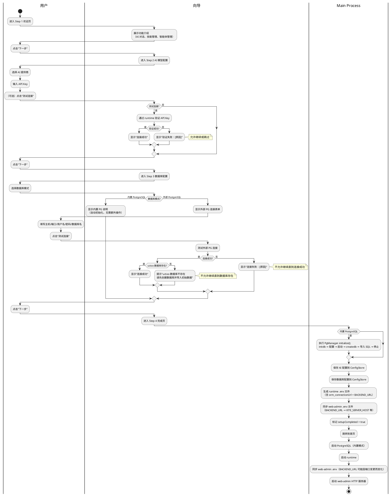
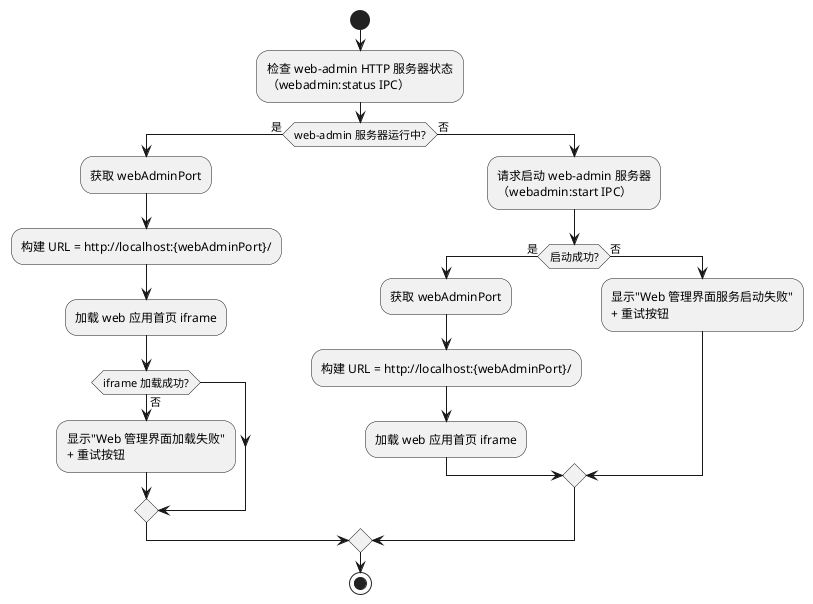
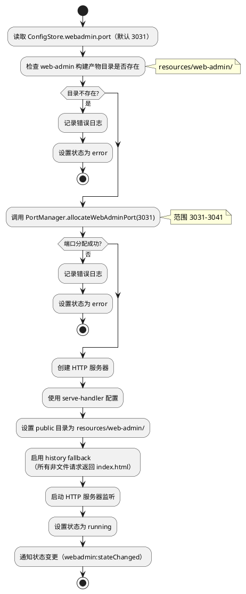

# agentskills-runtime PC 桌面客户端技术设计文档

> **文档定位**：本文档为 agentskills-runtime PC 桌面客户端的技术设计文档（design.md），定义"怎么做"，为后续 `tasks.md`（任务清单）提供实现基线。
>
> **生成日期**：2026-08-06 | **版本**：v2.5
> **规范目录**：`apps/agentskills-runtime/.codeartsdoer/specs/pc_desktop_client/`
> **需求基线**：`spec.md` v2.5
> **技术选型依据**：`pc_desktop_client_research_report.md`
> **v2.5 变更说明**：在 v2.4 基础上重构 runtime 集成策略 — ①新增 RuntimeIntegrator 模块设计（electron/modules/runtime-integrator.ts）：负责 runtime 发布版压缩包解压、集成目录版本检测、.env 自动生成、降级下载（SDK downloadRuntime 降级为版本升级和修复方案）；②runtime 集成目录从 SDK node_modules 迁移到用户数据目录（`%APPDATA%/agentskills/runtime/`）；③安装包新增 runtime 压缩包资源（`agentskills-runtime-win-x64.tar.gz`，约 380MB 压缩/1.27GB 解压）；④启动状态机从"DownloadRuntime"重构为"IntegrateRuntime"（解压→验证→降级下载）；⑤安装包体积约束从"完整版 ≤ 300MB"调整为"含 runtime 压缩包约 600-800MB"；⑥冷启动时间从"≤ 90s"调整为"≤ 60s"；⑦移除"精简版安装包"概念，统一为包含 runtime 的完整安装包；⑧更新 electron-builder.json 配置（新增 runtime tar.gz extraResources）；⑨更新安装部署、启动初始化、runtime 生命周期管理等章节的设计；⑩新增 runtime:* IPC 通道（runtime:integrate/runtime:integrateStatus）
> **v2.4 变更说明**：在 v2.3 基础上新增顶层设计原则和登录态共享/运行时依赖管理 — ①新增"顶层设计原则"章节（6 条原则：PC 客户端是"壳"、web 项目是业务功能主体、web 项目通过 runtime API/CLI/SDK 操作 runtime、runtime 按已有架构持续迭代、遵循 UMI 全栈模型同构设计、登录态共享）；②新增 AuthBridge 模块设计（electron/modules/auth-bridge.ts）：iframe postMessage 监听、登录状态管理、access_token safeStorage 持久化、IPC 通道注册；③新增 DependencyManager 模块设计（electron/modules/dep-manager.ts）：OpenSSL 检测/自动安装/内置 DLL、运行时环境依赖检查；④新增 auth:* IPC 通道（auth:loginStateChanged/auth:getToken/auth:saveToken/auth:clearToken）；⑤新增 dep:* IPC 通道（dep:checkOpenSSL/dep:installOpenSSL/dep:checkAll）；⑥更新 HomeView.vue 设计（登录态监听和 UI 响应）；⑦更新模块变更清单和数据模型
> **v2.3 变更说明**：在 v2.2 基础上修正 runtime 静态文件服务认知 — ①新增 RuntimeVersionDetector 模块设计（检测 runtime 版本，≥ 0.0.26 优先使用 runtime 静态文件服务，< 0.0.26 降级到内置 HTTP 服务器）；②修正 aibuilder URL 构建策略（runtime ≥ 0.0.26 时为 `http://127.0.0.1:{runtimePort}/vue-pro/aibuilder`，< 0.0.26 时为 `http://localhost:{webAdminPort}/vue-pro/aibuilder`）；③修正 WebAdminServer 为条件启动（仅在 runtime < 0.0.26 时启动）；④修正 web-admin 构建产物嵌入方式（优先放入 runtime STATIC_FILE_ROOT 目录）；⑤修正 web-admin .env 配置管理方式（runtime 提供静态服务时 VITE_ 变量在构建时注入）；⑥修正启动流程（新增版本检测步骤）

---

# 一、需求与存量功能关系分析

## 1.1 需求功能与存量功能对比

### 1.1.1 已实现功能

| 需求功能 | 存量功能 | 代码位置 | 匹配度 |
|---------|---------|---------|--------|
| Electron 主进程模块化架构 | 16 个模块已实现（runtime/config/tray/window/ipc/updater/pgsql 等） | `electron/main/index.ts`、`electron/modules/` | 100% |
| Runtime 进程生命周期管理（spawn/kill/healthCheck） | RuntimeManager 类完整实现 start/stop/restart/getInfo | `electron/modules/runtime.ts:22-230` | 75% |
| Runtime 健康检查（定时轮询） | RuntimeHealthCheck 类实现 5s 间隔轮询 + 自动重启 | `electron/modules/runtime-health.ts:26-100` | 100% |
| Runtime 崩溃恢复（5 分钟 3 次保护） | RuntimeCrashRecovery 类实现崩溃监控 + 日志保存 | `electron/modules/runtime-crash.ts:14-98` | 100% |
| Runtime 版本管理与升级（备份/回滚） | RuntimeVersionManager 类实现 checkLatestVersion/upgrade/rollback | `electron/modules/runtime-version.ts:24-232` | 75% |
| 配置持久化（config.json + 加密存储） | ConfigStore 类实现 load/save/set + CryptoUtils 加密 | `electron/modules/config.ts:77-206` | 50% |
| .env 文件生成（含 orm_connectionUrl） | EnvGenerator 类实现 generate/generateForRuntime，已包含 orm_connectionUrl 生成 | `electron/modules/env-generator.ts:27-134` | 50% |
| PostgreSQL 初始化（initdb/配置/createdb/导入SQL） | PgManager 类实现 initialize 8 步流程 | `electron/modules/pgsql.ts:106-205` | 85% |
| PostgreSQL 启停管理（pg_ctl start/stop） | PgManager 类实现 start/stop/restart | `electron/modules/pgsql.ts:283-323` | 90% |
| PostgreSQL 备份恢复（pg_dump/psql restore） | PgManager 类实现 backup/restore | `electron/modules/pgsql.ts:345-391` | 75% |
| PostgreSQL 外部连接测试 | PgManager 类实现 testConnection（pg_isready + psql） | `electron/modules/pgsql.ts:392-441` | 85% |
| PostgreSQL 状态管理与推送 | PgManager 类实现 onStateChange/notifyStateChange + stateListeners | `electron/modules/pgsql.ts:47-65` | 90% |
| 系统托盘常驻与右键菜单 | TrayManager 类实现 createTray/updateContextMenu/setRuntimeStatus | `electron/modules/tray.ts:14-236` | 90% |
| 系统原生通知 | Notifier 类实现多种通知场景 | `electron/modules/notifier.ts:16-154` | 100% |
| 窗口管理（状态持久化/隐藏到托盘） | WindowManager 类实现 createMainWindow/saveWindowState/hideToTray | `electron/modules/window.ts:45-201` | 100% |
| 单实例锁 | `app.requestSingleInstanceLock()` + second-instance 事件处理 | `electron/main/index.ts:48-51,391-398` | 100% |
| 开机自启动 | AutoLauncher 类实现 enable/disable/toggle/syncWithConfig | `electron/modules/auto-launch.ts:14-79` | 100% |
| 自定义协议注册（agentskills://） | ProtocolHandler 类实现 register/handleUrl | `electron/modules/protocol.ts:9-66` | 100% |
| 客户端自动更新 | AutoUpdater 类封装 electron-updater | `electron/modules/updater.ts:16-134` | 100% |
| Electron IPC 通信框架 | IPCHandler 类统一注册/分发/错误处理 | `electron/modules/ipc.ts:11-56` | 100% |
| Preload 安全暴露接口 | contextBridge.exposeInMainWorld 注册 electronAPI | `electron/preload/index.ts:1-73` | 75% |
| 路由系统（hash 模式 + 首次启动守卫） | 6 条路由 + beforeEach 守卫检测 setupCompleted | `src/router/index.ts:1-67` | 75% |
| 首页 iframe 加载 aibuilder | HomeView.vue 实现 iframe + sandbox + allow 配置 | `src/views/HomeView.vue:1-169` | 50% |
| Runtime 状态监听与自动刷新 | HomeView.vue 通过 IPC 监听 runtime:stateChanged | `src/views/HomeView.vue:84-88` | 75% |
| 配置向导（3 步流程） | SetupView.vue 实现欢迎/AI 配置/完成 3 步 | `src/views/setup/SetupView.vue:1-181` | 50% |
| Runtime 监控视图 | RuntimeStatus.vue 显示状态/操作按钮 | `src/views/runtime/RuntimeStatus.vue:1-85` | 75% |
| PostgreSQL 管理视图（状态/备份恢复/连接测试） | PgsqlView.vue 实现 3 Tab（状态/备份恢复/连接测试） | `src/views/pgsql/PgsqlView.vue:1-246` | 75% |
| Pinia Store 状态管理 | useRuntimeStore + usePgsqlStore | `src/store/modules/runtime.ts`、`pgsql.ts` | 75% |
| electron-builder NSIS 打包配置 | electron-builder.json 配置 NSIS/portable/DMG/AppImage | `electron-builder.json:1-96` | 90% |
| 渲染进程 IPC 封装层 | `src/electron/ipc.ts` 封装 electronAPI 调用 | `src/electron/ipc.ts:1-56` | 100% |
| 渲染进程类型定义 | `src/electron/types.ts` 定义 IPCResult/RuntimeInfo/AppConfig 等 | `src/electron/types.ts:1-128` | 50% |
| PostgreSQL IPC 通道注册 | registerPgsqlIPC 注册 7 个通道（init/start/stop/status/backup/restore/testConnection） | `electron/main/index.ts:292-323` | 85% |
| PostgreSQL 状态桥接 | setupPgsqlStateBridge 实现 pgsql:stateChanged 推送 | `electron/main/index.ts:325-334` | 100% |
| 应用退出时停止 PostgreSQL | before-quit 事件中调用 pgManager.stop() | `electron/main/index.ts:404-410` | 100% |

### 1.1.2 需要扩展的功能

| 需求功能 | 存量功能 | 差异说明 | 扩展方向 |
|---------|---------|---------|---------|
| **[PG] PostgreSQL 初始化流程对齐 spec v2.1** | PgManager.initialize() 使用 `-U postgres` + `--auth-local=md5` + `--auth-host=md5`；spec v2.1 要求 `-U uctoo` + `--auth-host=scram-sha-256` + `--auth-local=scram-sha-256` | 用户名从 `postgres` 改为 `uctoo`；认证方式从 `md5` 改为 `scram-sha-256`；需新增 `uctoo` 用户密码自动生成并存储到 configStore | 修改 initialize()：initdb 参数改为 `-U uctoo --auth-host=scram-sha-256 --auth-local=scram-sha-256`；修改 createdb/psql 命令用户为 `uctoo`；新增密码自动生成并调用 `configStore.setPgsqlPassword()` |
| **[PG] PostgreSQL 备份使用 pg_dump -Fc 自定义格式** | PgManager.backup() 使用 `pg_dump -f` 导出为纯 SQL 文本格式 | spec v2.1 要求使用 `pg_dump -Fc` 自定义格式归档，恢复时使用 `pg_restore` 而非 `psql` | 修改 backup()：使用 `pg_dump -Fc` 替代 `pg_dump -f`，输出 `.backup` 文件；修改 restore()：使用 `pg_restore` 替代 `psql -f` |
| **[PG] PostgreSQL 端口冲突自动分配** | PgManager.startInternal() 调用 `PortManager.allocatePgsqlPort(5432)`，但端口变更后未更新 config 和 .env | 端口变更后需同步更新 configStore.pgsql.port 和 runtime .env 中 orm_connectionUrl | startInternal() 分配新端口后调用 `configStore.setPgsqlPort()` 和 `envGenerator.generateForRuntime()` 更新连接串 |
| **[PG] runtime .env orm_connectionUrl 自动更新** | EnvGenerator.generate() 已生成 orm_connectionUrl，但未在 PostgreSQL 初始化完成/数据库模式切换时自动触发 | spec v2.1 REQ-PGDB-06 要求在初始化完成、内外切换、连接信息修改后自动更新 .env | 新增 `pgsql:updateEnvUrl` IPC 通道；在 PgManager.initialize() 完成后、数据库模式切换后自动调用 envGenerator.generateForRuntime() |
| **[PG] AppConfig 中 pgsql 配置组扩展** | config.ts 的 AppConfig.pgsql 仅包含 `port/autoStart/passwordEncrypted`；spec v2.1 要求完整的 pgsql 配置（mode/embedded/external） | 缺少 `pgsql.mode`（embedded/external）、`pgsql.embedded.dataDir/autoBackup/backupDir`、`pgsql.external.host/port/user/passwordEncrypted/database` | 扩展 AppConfig.pgsql 为 PgsqlConfig 嵌套结构；新增 setPgsqlMode/setExternalPgsql 等方法 |
| **[PG] PgsqlView.vue 增强** | PgsqlView.vue 已实现 3 Tab 基本功能，但缺少数据库大小显示、连接数监控、备份列表管理、自动备份配置 | spec v2.1 REQ-PGDB-07 要求状态监控（连接数/数据库大小）；REQ-PGDB-04 要求备份列表管理和自动备份配置 | 扩展状态 Tab：增加连接数和数据库大小显示；扩展备份恢复 Tab：增加备份列表、自动备份开关；增加 PostgreSQL 版本显示 |
| **[架构] 配置向导扩展为 4 步（欢迎→AI Key→数据库→完成）** | SetupView.vue 当前为 3 步；setup.ts 包含 `executeDatabaseStep/executeSSLStep/executeNetworkStep` | v2.1 恢复数据库配置步骤（Step 3），移除 SSL 和网络配置步骤；Step 3 需支持内置/外部 PostgreSQL 选择 | 重构 SetupView.vue：Step 1 欢迎页→Step 2 AI Key 配置→Step 3 数据库配置（内置/外部选择）→Step 4 完成；修改 setup.ts：保留 executeDatabaseStep（重写为内置/外部模式），移除 executeSSLStep/executeNetworkStep |
| **[架构] web-admin 构建产物嵌入 PC 客户端** | electron-builder.json 的 `extraResources` 包含 pgsql/bin、sql、defaults，不包含 web-admin 构建产物 | v2.2 要求 web-admin 构建产物嵌入 `resources/web-admin/` 目录 | 修改 electron-builder.json 新增 `extraResources` 条目：`{ "from": "resources/web-admin", "to": "web-admin" }` |
| **[v2.2] 首页 aibuilder URL 修正 — 从 runtime 端口改为 webAdminPort** | HomeView.vue 的 `aibuilderUrl` 计算属性使用 `http://127.0.0.1:${runtimePort}/vue-pro/aibuilder`，依赖 runtime 提供静态资源服务 | v2.2 明确 runtime 不提供 web-admin 静态资源服务；aibuilder 应从 PC 客户端内置 web-admin HTTP 服务器加载：生产模式 `http://localhost:{webAdminPort}/vue-pro/aibuilder`，dev 模式 `http://localhost:3031/vue-pro/aibuilder` | 重构 `aibuilderUrl` 计算属性：dev 模式直接使用 `localhost:3031`；生产模式从 webadmin IPC 获取 webAdminPort；移除对 runtimePort 的依赖 |
| **[v2.2] EnvGenerator 增强 — 新增 web-admin .env 生成能力** | EnvGenerator 当前仅生成 runtime .env，不支持 web-admin .env | v2.2 要求 PC 客户端同时管理 runtime .env 和 web-admin .env，BACKEND_URL 变更时自动同步 web-admin 配置项（VITE_SERVER_HOST 等） | 新增 `generateForWebAdmin()` 方法：根据 runtime BACKEND_URL 生成 web-admin .env（含 VITE_SERVER_HOST/VITE_BACKEND_URL/VITE_WS_URL/VITE_OPENAI_BASE_URL/VITE_AGENT_ROOT/VITE_MOCK_HOST/VITE_MOCK_SERVER_HOST）；新增 `syncWebAdminEnv()` 方法：读取 runtime .env 中 BACKEND_URL，同步更新 web-admin .env |
| **[v2.2] ConfigStore 扩展 — 新增 webadmin 配置组** | config.ts 的 AppConfig 不包含 webadmin 配置 | v2.2 需要管理 web-admin HTTP 服务器配置（port/autoStart） | 新增 AppConfig.webadmin 为 WebAdminConfig 嵌套结构（port: number = 3031, autoStart: boolean = true）；新增 setWebAdmin/getWebAdmin 方法 |
| **[v2.2] SetupView.vue completeSetup 增强 — 同步 web-admin .env** | setup.ts 的 completeSetup() 仅调用 envGenerator.generateForRuntime()，不生成 web-admin .env | v2.2 要求向导完成后同时生成 runtime .env 和 web-admin .env | 修改 completeSetup()：在 generateForRuntime() 后调用 envSyncManager.syncWebAdminEnv() |
| **[UIR] App.vue 布局重构 — 从顶部水平导航改为左侧竖向导航** | App.vue 使用 `flex-column` + 顶部 `nav-bar` + 底部 `status-bar`；首页时 `v-if="!isHomePage"` 隐藏导航和状态栏 | 完全不符合 v2.1 要求：①首页隐藏导航（禁止）；②顶部水平导航（禁止）；③无四区域导航结构；④底部状态栏需移除 | 完全重构 App.vue：从 `flex-column` 改为 `flex-row`（左侧导航 + 右侧内容）；新增 AppSidebar 组件实现四区域导航；移除首页隐藏逻辑；移除底部状态栏 |
| **[UIR] 首页 runtime 未启动时的等待/启动 UI** | HomeView.vue 占位页包含"启动 Runtime"按钮 + 跳转链接（Runtime 监控/系统设置） | 占位页包含跳转链接（违反禁止项）；缺少应用名称、runtime 状态说明、启动进度指示、超时处理 | 重构占位页为友好等待界面：移除跳转链接；增加应用名称、runtime 状态说明、启动进度指示、一键启动按钮、超时错误提示 |
| **[UIR] 首页 iframe 全屏展示** | HomeView.vue 的 iframe-container 使用 `margin: -16px` 抵消父容器 padding | 改为左侧导航布局后 padding 策略需调整；首页路由下主内容区需移除 padding | 首页路由下主内容区移除 padding；iframe 使用 `position: absolute; top:0; left:0; width:100%; height:100%` 全屏展示 |
| **[UIR] 路由扩展 — 新增技能管理/智能体管理路由** | router/index.ts 仅有 `/`, `/setup`, `/runtime`, `/pgsql`, `/settings`, `/about` 六条路由 | 缺少 `/skills`（技能管理）和 `/agents`（智能体管理）路由 | 新增 `/skills` 和 `/agents` 路由；保留 `/pgsql` 路由 |
| **[UIR] 导航栏拖拽区域调整** | App.vue 当前在 `.nav-bar` 上设置 `-webkit-app-region: drag` | 改为左侧导航后，拖拽区域需调整到导航栏顶部 Logo 区域 | 导航栏顶部 Logo 区域设置 `drag`，导航项区域设置 `no-drag` |
| **[IPC] AppConfig 类型扩展** | config.ts 的 AppConfig 包含 `pgsql`（简化版）和 `ssl` 字段 | v2.2 需要扩展 `pgsql` 为完整嵌套结构（含 mode/embedded/external）；移除 `ssl` 字段；新增 `ui.navWidth` 和 `ui.navCollapsed` 字段；新增 `webadmin` 配置组 | 从 AppConfig 移除 `ssl` 字段；扩展 `pgsql` 为 PgsqlConfig 嵌套结构；新增 `ui.navWidth` 和 `ui.navCollapsed` 字段；新增 `webadmin` 为 WebAdminConfig 嵌套结构 |
| **[Config] 移除 SSL 独立配置** | config.ts 包含 `ssl` 配置组（enabled/certFile/keyFile）；IPC 注册 `ssl:getConfig/setConfig/validateCert` | v2.2 明确 SSL 由 runtime .env 管理，PC 客户端不提供独立 SSL 界面 | 移除 config.ts 中的 `ssl` 字段和 `setSSL()` 方法；移除 IPC 中 `ssl:*` 通道；简化 env-generator.ts 中的 SSL 生成逻辑（仅写入 .env，不由 PC 客户端管理） |
| **[v2.5] Runtime 集成策略重构 — 从 SDK 下载改为压缩包解压** | RuntimeManager 通过 SDK `downloadRuntime()` 首次下载 runtime 到 node_modules 目录；runtime:install IPC 通道触发 SDK 下载 | v2.5 要求 runtime 发布版压缩包内嵌到安装包，首次启动时自动解压到 `%APPDATA%/agentskills/runtime/`；SDK `downloadRuntime()` 降级为版本升级和降级修复方案；runtime 集成目录从 SDK node_modules 迁移到用户数据目录 | 新增 RuntimeIntegrator 模块（runtime-integrator.ts）：负责压缩包解压、集成目录版本检测、.env 自动生成、降级下载；修改 RuntimeManager：runtime 二进制路径优先从用户数据目录查找，回退到 SDK node_modules；修改 runtime:install IPC 通道语义：从"下载安装"改为"解压集成或降级下载" |
| **[v2.5] electron-builder.json 新增 runtime 压缩包资源** | electron-builder.json 的 `extraResources` 不包含 runtime 压缩包 | v2.5 要求安装包内嵌 `agentskills-runtime-win-x64.tar.gz`（约 380MB 压缩） | 修改 electron-builder.json 新增 `extraResources` 条目：`{ "from": "resources/runtime/agentskills-runtime-win-x64.tar.gz", "to": "runtime/agentskills-runtime-win-x64.tar.gz" }` |
| **[v2.5] RuntimeVersionManager 升级路径更新** | RuntimeVersionManager.upgrade() 通过 SDK `downloadRuntime()` 下载新版本到 SDK node_modules 目录 | v2.5 要求升级时下载到用户数据目录（`%APPDATA%/agentskills/runtime/`），备份旧版本到 `%APPDATA%/agentskills/runtime-backup/` | 修改 upgrade()：下载目标改为用户数据目录；备份旧版本到 runtime-backup 目录；回滚时从 runtime-backup 恢复 |
| **[v2.2] Preload 新增 webadmin 和 envsync 命名空间** | preload/index.ts 不包含 webadmin 和 envsync 命名空间 | v2.2 新增 webadmin:start/stop/status 和 envsync:getRuntimeEnv/setRuntimeEnv/syncWebAdminEnv/getSyncStatus IPC 通道 | 新增 webadmin 命名空间（start/stop/status）；新增 envsync 命名空间（getRuntimeEnv/setRuntimeEnv/syncWebAdminEnv/getSyncStatus）；移除 ssl 命名空间 |

### 1.1.3 需要新增的功能或接口

**WebAdminServer 模块（`electron/modules/webadmin-server.ts`）**：
- Electron Main Process 内置轻量 HTTP 服务器，托管 web-admin 构建产物
- 输入：web-admin 构建产物目录路径（`resources/web-admin/`）、端口号（默认 3031）
- 输出：HTTP 服务器实例、运行状态（running/stopped/error）、实际端口
- 核心逻辑：使用 `serve-handler` 或 `express` 启动 HTTP 服务器；支持 Vue SPA history fallback（所有非文件请求返回 index.html）；端口冲突时自动分配（范围 3031-3041）
- 依赖：PortManager（端口分配）、Logger（日志）、ConfigStore（配置读取）
- 生命周期：随客户端启动而启动，随客户端退出而停止；必须在 runtime 之后启动（web-admin .env 需要读取 runtime 的 BACKEND_URL）

**EnvSyncManager 模块（`electron/modules/env-sync.ts`）**：
- 管理 runtime .env 和 web-admin .env 双配置文件的读写和同步
- 输入：runtime .env 路径、web-admin .env 路径、配置同步映射表
- 输出：同步结果（成功/失败、更新的配置项列表）
- 核心逻辑：
  - `readRuntimeEnv(keys?)`：读取 runtime .env 中指定配置项
  - `writeRuntimeEnv(keyValueMap)`：写入 runtime .env 配置项
  - `readWebAdminEnv(keys?)`：读取 web-admin .env 中指定配置项
  - `syncWebAdminEnv()`：根据 runtime .env 中 BACKEND_URL 同步更新 web-admin .env 中的 VITE_SERVER_HOST 等配置项
  - 配置同步映射：BACKEND_URL → VITE_SERVER_HOST/VITE_BACKEND_URL/VITE_AGENT_ROOT/VITE_MOCK_HOST/VITE_MOCK_SERVER_HOST（直接同步）；BACKEND_URL + `/api/v1/uctoo/webmcp/mcp` → VITE_WS_URL/VITE_OPENAI_BASE_URL（拼接路径后同步）
- 依赖：EnvGenerator（.env 读写）、ConfigStore（配置读取）、Logger（日志）
- 触发时机：首次启动配置向导完成后、用户在设置界面修改 runtime 服务地址后、runtime 端口变更后、runtime BACKEND_URL 模式切换后

**数据库配置向导步骤（Step 3）**：
- 内置 PostgreSQL 模式选择（默认推荐）
  - 输入：用户确认使用内置 PostgreSQL
  - 输出：自动初始化 PostgreSQL（initdb → 配置 → createdb → 导入 SQL）
- 外部 PostgreSQL 模式
  - 输入：主机地址、端口、用户名、密码、数据库名
  - 输出：连接测试结果（成功/失败 + 原因 + uctoo 数据库是否存在）
- 依赖：PgManager.initialize()、PgManager.testConnection()、configStore.setPgsqlMode()

**pgsql:updateEnvUrl IPC 通道**：
- 输入：无（从 configStore 读取当前 pgsql 配置）
- 输出：更新后的 .env 文件路径
- 核心逻辑：根据 pgsql.mode（embedded/external）构建 orm_connectionUrl，调用 envGenerator.generateForRuntime() 更新 .env
- 依赖：configStore、envGenerator

**webadmin:* IPC 通道**：
- `webadmin:start`：启动 web-admin HTTP 服务器
- `webadmin:stop`：停止 web-admin HTTP 服务器
- `webadmin:status`：查询 web-admin HTTP 服务器状态（running/port/url/error）
- `webadmin:stateChanged`：web-admin HTTP 服务器状态变更推送（Main → Renderer）

**envsync:* IPC 通道**：
- `envsync:getRuntimeEnv`：获取 runtime .env 中的指定配置项
- `envsync:setRuntimeEnv`：设置 runtime .env 中的配置项
- `envsync:syncWebAdminEnv`：根据 runtime .env 的 BACKEND_URL 同步更新 web-admin .env
- `envsync:getSyncStatus`：获取最近一次同步状态

**左侧竖向导航组件**：
- AppSidebar.vue — 四区域导航组件（Logo 区、核心功能区、系统管理区、底部区）
- 导航项组件（NavItem）— 图标 + 文字 + 选中/悬停状态
- 导航栏折叠模式（窗口尺寸过小时切换为图标模式）
- 输入：当前路由路径、导航配置列表；输出：路由跳转事件

**导航图标方案**：
- 图标库集成（Lucide Icons Vue）— 轻量 SVG 图标库
- 7 个导航项图标映射与状态样式
- 图标加载失败降级方案

**CSS 架构**：
- CSS 变量定义（颜色、间距、字体、导航栏尺寸等）
- 导航栏样式规范（背景色、选中态、悬停态、分隔线）
- 主内容区布局规范（首页全屏 vs 其他页面 padding）
- 窗口最小尺寸约束

**首页等待/启动界面**：
- Runtime 未启动时的友好等待 UI 组件
- 启动进度指示（spinner + 状态文字）
- 启动超时错误提示 + 查看日志按钮
- aibuilder iframe 加载失败提示 + 重试按钮
- dev 模式下开发服务器未启动提示

**AI Key 测试连接接口**：
- 通过 runtime 代理验证 API Key 有效性
- 输入：provider + apiKey + baseUrl（可选）
- 输出：验证结果（成功/失败 + 原因）

**web-admin 构建集成脚本**：
- 构建流程：`pnpm --filter web-admin build` → 复制 dist → `resources/web-admin/`
- 输入：web-admin/web 项目路径
- 输出：resources/web-admin/ 目录下的静态资源

**AuthBridge 模块（`electron/modules/auth-bridge.ts`）**【v2.4 新增】：
- Electron Main Process 模块，负责 iframe postMessage 监听、登录状态管理、access_token safeStorage 持久化
- 输入：iframe 中 web-admin 通过 postMessage 发送的登录状态变更事件（auth:loginStateChanged）
- 输出：登录状态信息（loggedIn/accessToken/userInfo）、IPC 通道响应（auth:getToken/auth:saveToken/auth:clearToken）
- 核心逻辑：
  - `setupMessageListener(webContents)`：在 BrowserWindow 的 webContents 上注册 `window-message` 事件监听，接收 iframe 通过 postMessage 发送的登录状态变更消息
  - `handleLoginStateChanged(data)`：处理登录状态变更事件，提取 access_token 和用户信息，调用 safeStorage 持久化 token，更新 ConfigStore 中的 auth 配置，通过 `auth:loginStateChanged` IPC 通道推送到渲染进程
  - `handleLogout()`：处理登出事件，清除 safeStorage 中的 token，清除 ConfigStore 中的 auth 配置，推送登出状态到渲染进程
  - `saveToken(accessToken)`：使用 `safeStorage.encryptString(accessToken)` 加密存储 access_token 到磁盘
  - `getToken()`：使用 `safeStorage.decryptString()` 解密读取 access_token，验证 token 有效性
  - `clearToken()`：清除 safeStorage 中存储的 access_token
  - `restoreLoginState()`：客户端启动时从 safeStorage 读取 token 并验证有效性，有效则恢复登录态，无效则标记为未登录
  - postMessage 消息格式验证：验证 `event.origin`（仅接受 aibuilder iframe 来源）、验证 `data.type`（仅处理 `auth:loginStateChanged` 类型）
  - safeStorage 降级处理：safeStorage 不可用时降级到内存存储（本次会话有效，重启后需重新登录）
- 依赖：Electron safeStorage API、ConfigStore（auth 配置读写）、Logger（日志）
- IPC 通道注册：`auth:loginStateChanged`（Main → Renderer 推送）、`auth:getToken`（Renderer → Main）、`auth:saveToken`（Renderer → Main）、`auth:clearToken`（Renderer → Main）
- 触发时机：BrowserWindow 创建后注册消息监听；客户端启动时恢复登录态；iframe 中用户登录/登出时触发状态变更

**DependencyManager 模块（`electron/modules/dep-manager.ts`）**【v2.4 新增】：
- Electron Main Process 模块，负责运行时环境依赖检测、安装和配置
- 输入：依赖检测请求（dep:checkOpenSSL/dep:checkAll）、依赖安装请求（dep:installOpenSSL）
- 输出：依赖状态信息（就绪/未就绪/异常）、安装结果（成功/失败/原因）
- 核心逻辑：
  - `checkOpenSSL()`：检测 OpenSSL 依赖是否就绪
    - 检查 PATH 环境变量中是否包含 libssl/libcrypto DLL
    - 检查 runtime bin 目录中是否包含 OpenSSL DLL（libssl-x.dll、libcrypto-x.dll 等）
    - 返回 `{ ready: boolean; source: "system" | "bundled" | "none"; path?: string; version?: string }`
  - `installOpenSSL()`：安装/配置 OpenSSL 依赖
    - 从安装包的 `openssl/` 目录复制 OpenSSL DLL 到 runtime 的 bin 目录
    - 确保 runtime 的 PATH 环境变量中包含 OpenSSL DLL 所在目录
    - 更新 ConfigStore 中 `dep.openSSLBundled` 和 `dep.openSSLPath` 配置
    - 返回 `{ success: boolean; error?: string; path?: string }`
  - `checkAll()`：检测所有运行时环境依赖是否就绪
    - 检测 PostgreSQL 状态（通过 PgManager.getInfo() 获取）
    - 检测 OpenSSL 状态（通过 checkOpenSSL() 获取）
    - 返回 `{ postgresql: DepStatus; openssl: DepStatus; allReady: boolean }`
  - `handleRuntimeStartFailure(error)`：runtime 启动失败时自动检测是否因依赖缺失导致
    - 解析错误信息，判断是否为 OpenSSL DLL 缺失（如 "The specified module could not be found"）
    - 如为 OpenSSL 缺失，自动触发 installOpenSSL() 并重试启动
  - OpenSSL DLL 内置策略：
    - 安装包 `resources/openssl/` 目录预置 OpenSSL DLL（libssl-3-x64.dll、libcrypto-3-x64.dll 等）
    - 安装时复制到 runtime 的 bin 目录（`node_modules/@opencangjie/skills/dist/runtime/win-x64/release/bin/`）
    - 或通过设置 PATH 环境变量使 runtime 可加载 OpenSSL DLL
  - 依赖检测时机：客户端启动时（在启动 runtime 之前）、runtime 启动失败时、用户手动触发时
- 依赖：ConfigStore（dep 配置读写）、Paths（路径管理）、Logger（日志）、PgManager（PostgreSQL 状态查询）
- IPC 通道注册：`dep:checkOpenSSL`（Renderer → Main）、`dep:installOpenSSL`（Renderer → Main）、`dep:checkAll`（Renderer → Main）
- 触发时机：客户端启动时自动检测；runtime 启动失败时自动检测；用户在设置界面点击"检查环境"按钮时

**auth:* IPC 通道**【v2.4 新增】：
- `auth:loginStateChanged`：登录状态变更推送（Main → Renderer），数据包含 `{ loggedIn: boolean; userInfo?: UserInfo }`
- `auth:getToken`：获取存储的 access_token（Renderer → Main），返回 `{ success: boolean; token?: string; error?: string }`
- `auth:saveToken`：保存 access_token 到 safeStorage（Renderer → Main），入参 `{ token: string }`，返回 `{ success: boolean; error?: string }`
- `auth:clearToken`：清除存储的 access_token（Renderer → Main），返回 `{ success: boolean }`

**dep:* IPC 通道**【v2.4 新增】：
- `dep:checkOpenSSL`：检测 OpenSSL 依赖是否就绪（Renderer → Main），返回 `{ ready: boolean; source: string; path?: string; version?: string }`
- `dep:installOpenSSL`：安装 OpenSSL 依赖（Renderer → Main），返回 `{ success: boolean; error?: string; path?: string }`
- `dep:checkAll`：检测所有运行时依赖是否就绪（Renderer → Main），返回 `{ postgresql: DepStatus; openssl: DepStatus; allReady: boolean }`

**RuntimeIntegrator 模块（`electron/modules/runtime-integrator.ts`）**【v2.5 新增】：
- Electron Main Process 模块，负责 runtime 发布版压缩包解压、集成目录管理、版本检测、.env 自动生成、降级下载
- 输入：runtime 压缩包路径（`resources/runtime/agentskills-runtime-win-x64.tar.gz`）、集成目标目录（`%APPDATA%/agentskills/runtime/`）、.env.example 路径
- 输出：集成状态（integrated/extracting/failed/none）、runtime 版本信息、.env 配置文件路径
- 核心逻辑：
  - `checkIntegrationStatus()`：检测 runtime 集成目录状态
    - 检查 `%APPDATA%/agentskills/runtime/` 目录是否存在且包含完整 runtime 发布版文件
    - 检查 `.env` 配置文件是否已生成
    - 检查 runtime 二进制文件是否可执行
    - 返回 `{ status: "integrated" | "partial" | "none"; version?: string; envExists: boolean; binaryPath?: string }`
  - `integrateFromArchive(archivePath, onProgress?)`：从压缩包解压 runtime 到集成目录
    - 验证压缩包文件完整性（文件大小、格式检查）
    - 创建集成目录（若不存在）
    - 使用 `tar` 解压 `agentskills-runtime-win-x64.tar.gz` 到 `%APPDATA%/agentskills/runtime/`
    - 提供解压进度回调（`onProgress(percent: number)`）
    - 解压完成后自动调用 `generateDefaultEnv()` 生成默认 .env 配置
    - 返回 `{ success: boolean; version?: string; error?: string; envGenerated: boolean }`
  - `generateDefaultEnv()`：基于 `.env.example` 生成默认 `.env` 配置文件
    - 读取集成目录下的 `.env.example` 文件
    - 填充默认配置值（PORT=8080、HOST=0.0.0.0、BACKEND_URL=http://localhost:8080）
    - 生成 `orm_connectionUrl`（根据 ConfigStore 中 pgsql 配置）
    - 生成 `AUTH_CORE_SECRET`（随机生成）
    - 写入 `.env` 文件到集成目录
    - 返回 `{ success: boolean; envPath?: string; error?: string }`
  - `fallbackDownload(onProgress?)`：降级到 SDK `downloadRuntime()` 从网络下载 runtime
    - 触发条件：压缩包解压失败或压缩包损坏
    - 调用 SDK `RuntimeManager.downloadRuntime()` 下载 runtime
    - 下载完成后将文件复制到用户数据目录集成路径
    - 生成默认 .env 配置
    - 返回 `{ success: boolean; version?: string; error?: string; source: "network" }`
  - `getIntegratedRuntimePath()`：获取已集成的 runtime 二进制路径
    - 优先返回用户数据目录路径（`%APPDATA%/agentskills/runtime/bin/`）
    - 回退到 SDK node_modules 路径（`node_modules/@opencangjie/skills/dist/runtime/win-x64/release/bin/`）
    - 返回 `{ path: string; source: "integrated" | "sdk" }`
  - `cleanupExtraction()`：清理解压临时文件
    - 删除 `%APPDATA%/agentskills/temp/runtime-extract/` 目录
    - 在解压完成或失败后调用
- 依赖：ConfigStore（配置读取）、EnvGenerator（.env 生成）、Paths（路径管理）、Logger（日志）、`@opencangjie/skills` SDK（降级下载）
- IPC 通道注册：`runtime:integrate`（Renderer → Main，触发压缩包解压）、`runtime:integrateStatus`（Renderer → Main，查询集成状态）、`runtime:integrateProgress`（Main → Renderer 推送，解压进度）
- 触发时机：首次启动时自动检测并触发集成；runtime 集成目录不存在时触发；用户手动触发重新集成时

## 1.2 存量功能详细分析

### 1.2.1 Electron 主进程架构

**接口契约**：
- 入口 `electron/main/index.ts` 负责模块注册和应用初始化
- 16 个模块通过单例模式导出（`export const xxx = new XxxClass()`）
- IPC 通道通过 `ipcHandler.registerHandler(channel, handler)` 统一注册
- 所有 IPC 返回值包装为 `{ success: boolean, data?: T, error?: string }`

**业务规则**：
- 模块间通过直接引用协作（如 runtimeManager.onStateChange → trayManager.setRuntimeStatus）
- 应用退出时按序停止：healthCheck → runtime → pgsql → webadmin → tray → quit（v2.2 新增 webadmin 停止步骤）
- 单实例锁在应用启动时检查，第二个实例通过 `second-instance` 事件激活已有窗口

**扩展点**：
- IPC 注册函数按职责分组（registerSystemIPC/registerRuntimeIPC/registerPgsqlIPC 等），新增模块只需新增注册函数
- v2.2 新增 registerWebAdminIPC 和 registerEnvSyncIPC 注册函数

**约束**：
- 主进程代码必须使用 TypeScript，编译为 CommonJS（electron-vite 配置）
- `@opencangjie/skills` SDK 通过 `createRequire(import.meta.url)` 引入（ESM 环境下兼容 CJS 模块）

### 1.2.2 PgManager — PostgreSQL 进程管理

**接口契约**：
- `initialize()` → `void`：首次初始化 PostgreSQL（8 步流程：initdb → 配置 postgresql.conf → 配置 pg_hba.conf → 启动 → 设置密码 → createdb → 导入 SQL → 停止）
- `start()` → `PgsqlInfo`：启动 PostgreSQL 服务（pg_ctl start）
- `stop()` → `boolean`：停止 PostgreSQL 服务（pg_ctl stop）
- `restart()` → `PgsqlInfo`：重启 PostgreSQL 服务
- `getInfo()` → `PgsqlInfo`：获取当前状态（state/port/dataDir）
- `isInitialized()` → `boolean`：检查是否已初始化（检测 PG_VERSION 文件）
- `isInstalled()` → `boolean`：检查 PostgreSQL 二进制是否存在
- `backup(options?)` → `string`：备份数据库（pg_dump），返回备份文件路径
- `restore(file)` → `void`：从备份文件恢复数据库（psql）
- `testConnection(options)` → `{ success, error?, version? }`：测试外部 PostgreSQL 连接
- `onStateChange(listener)` → `() => void`：状态变更订阅

**业务规则**：
- PostgreSQL 二进制路径通过 `Paths.getPgsqlBinPath()` 获取（安装目录 `resources/pgsql/bin/`）
- 数据目录通过 `Paths.pgsqlData` 获取（`%APPDATA%/agentskills/pgdata/`）
- 端口分配通过 `PortManager.allocatePgsqlPort(5432)` 自动分配
- 密码通过 `CryptoUtils.generateRandomPassword(16)` 自动生成
- 状态变更通过 `stateListeners` 数组通知订阅者
- 执行命令通过 `execCommand()` 封装 spawn，设置 PGDATA/PGLIB/PGHOST/PGPORT 环境变量

**扩展点**：
- 当前 initialize() 使用 `postgres` 用户和 `md5` 认证，需改为 `uctoo` 用户和 `scram-sha-256` 认证
- 当前 backup() 使用纯 SQL 文本格式，需改为 `pg_dump -Fc` 自定义格式
- 当前 restore() 使用 `psql -f`，需改为 `pg_restore`
- 缺少 `pgsql:updateEnvUrl` 能力，需在初始化/模式切换后自动更新 .env

**约束**：
- PostgreSQL 进程为外部子进程，PC 客户端通过 `pg_ctl` 管理其生命周期
- Windows 平台可执行文件需添加 `.exe` 后缀
- 命令执行需设置 `windowsHide: true` 避免弹出控制台窗口
- initdb 需要数据目录不存在或为空，否则会失败

### 1.2.3 RuntimeManager — Runtime 进程管理

**接口契约**：
- `start(options?)` → `RuntimeInfo`：启动 runtime 进程，返回状态信息
- `stop()` → `boolean`：优雅停止（5s 超时后强制 kill）
- `restart(options?)` → `RuntimeInfo`：停止后等待 1s 再启动
- `getInfo()` → `RuntimeInfo`：获取当前状态（state/pid/port/version/startTime）
- `onStateChange(listener)` → `() => void`：状态变更订阅

**业务规则**：
- runtime 二进制路径优先从用户数据目录查找（`%APPDATA%/agentskills/runtime/bin/`），回退到 SDK node_modules 目录【v2.5 变更：原优先从 SDK node_modules 查找，回退到用户数据目录】
- 端口冲突时通过 `PortManager.allocateRuntimePort(8080)` 自动分配
- 进程启动时设置 `SKILL_INSTALL_PATH` 环境变量
- stdout/stderr 重定向到 electron-log

**扩展点**：
- 当前直接 `spawn` runtime 二进制，可改为通过 SDK `RuntimeManager.start()` 启动
- 健康检查端点当前为 `/api/v1/uctoo/hello`，可配置为 `/api/v1/uctoo/health`
- **v2.5 新增扩展点**：runtime 集成目录从 SDK node_modules 迁移到用户数据目录，需通过 RuntimeIntegrator 模块管理集成路径；SDK `downloadRuntime()` 降级为版本升级和降级修复方案

**约束**：
- runtime 进程为仓颉编译的原生二进制，PC 客户端无法调试其内部逻辑
- 进程退出时需区分"用户主动停止"和"异常崩溃"
- **v2.2 重要约束**：runtime < 0.0.26 不提供 web-admin 静态资源服务，PC 客户端需自行托管；runtime ≥ 0.0.26 提供静态文件服务（STATIC_FILE_ROOT），PC 客户端应优先使用 runtime 静态文件服务
- **v2.5 重要约束**：runtime 集成目录位于用户数据目录（`%APPDATA%/agentskills/runtime/`），从安装包内嵌压缩包解压获得；SDK node_modules 中的 runtime 仅作为开发环境和降级方案使用

### 1.2.4 ConfigStore — 配置管理

**接口契约**：
- `get()` → `AppConfig`：获取完整配置
- `set(updates)` → `void`：合并更新并持久化
- `setAI(provider, apiKey)` → `void`：设置 AI 配置（apiKey 加密存储）
- `getAIApiKey()` → `string`：解密获取 API Key
- `isSetupCompleted()` → `boolean`：检查是否完成首次配置
- `setPgsql(port, autoStart)` → `void`：设置 PostgreSQL 配置
- `setPgsqlPassword(password)` → `void`：加密存储 PostgreSQL 密码
- `getPgsqlPassword()` → `string`：解密获取 PostgreSQL 密码
- `setSSL(enabled, certFile, keyFile)` → `void`：设置 SSL 配置（v2.2 移除）

**业务规则**：
- 配置文件路径：`%APPDATA%/agentskills/config.json`
- API Key 使用 `CryptoUtils.encrypt/decrypt` 加密存储
- 首次加载时若配置文件不存在，使用 DEFAULT_CONFIG

**约束**：
- 当前 AppConfig.pgsql 仅包含 `port/autoStart/passwordEncrypted`，v2.2 需扩展为完整嵌套结构
- 当前 AppConfig 包含 `ssl` 字段，v2.2 需移除
- 缺少 `pgsql.mode`（embedded/external）和外部 PostgreSQL 配置字段
- 缺少 `ui.navWidth` 和 `ui.navCollapsed` 字段
- **v2.2 新增约束**：缺少 `webadmin` 配置组（port/autoStart）
- **v2.5 新增约束**：缺少 `runtime.integratedVersion`（已集成 runtime 版本号）和 `runtime.integratedSource`（集成来源：archive/network/sdk）配置字段，需新增以跟踪 runtime 集成状态

### 1.2.5 EnvGenerator — .env 文件生成

**接口契约**：
- `generate(envConfig?)` → `string`：生成 runtime .env 文件内容
- `generateAndSave(envConfig?)` → `string`：生成并保存到默认路径
- `generateForRuntime(envConfig?)` → `string`：生成并保存到 runtime 发布版目录

**业务规则**：
- 自动从 configStore 读取 pgsql.port、pgsql 密码、runtime.port/host 等配置
- 生成 `orm_connectionUrl` 格式：`postgresql://<user>:<password>@<host>:<port>/<database>`
- SSL 配置根据 config.ssl.enabled 决定是否写入（v2.2 移除 ssl 配置后需简化）
- 当前 dbUser 默认为 `postgres`（v2.2 需改为 `uctoo`）

**约束**：
- 当前仅支持内置 PostgreSQL 连接串生成，v2.2 需支持外部 PostgreSQL 连接串
- 当前 SSL 生成逻辑依赖 config.ssl，v2.2 移除 ssl 配置后需简化
- 缺少在 PostgreSQL 初始化/模式切换后自动触发的机制
- **v2.2 新增约束**：当前不支持 web-admin .env 生成，需新增 `generateForWebAdmin()` 方法
- **v2.2 新增约束**：当前不包含 BACKEND_URL 配置项生成，需新增
- **v2.5 新增约束**：runtime .env 路径从 SDK node_modules 迁移到用户数据目录（`%APPDATA%/agentskills/runtime/.env`），`generateForRuntime()` 的目标路径需更新；解压完成后需支持基于 `.env.example` 自动生成默认 `.env`（由 RuntimeIntegrator 调用）

### 1.2.6 HomeView.vue — 当前首页实现

**接口契约**：
- 首页直接加载 web 发布版首页（web 应用根路径），不再依赖 runtime 状态
- 输出 web 应用 iframe 或加载错误提示
- 通过 `webadmin:status` / `webadmin:start` IPC 获取并确保 web-admin HTTP 服务器运行
- 通过 `window.electronAPI.on('webadmin:stateChanged')` 监听服务器状态变化

**业务规则**：
- `webUrl` 计算属性：`http://localhost:{webAdminPort}/`（web 应用根路径，webAdminPort 默认 3031）
- 首页加载只依赖 web-admin 静态资源服务（WebAdminServer）；若未运行则自动尝试启动（`webadmin:start`）
- 即使 runtime / PostgreSQL 未启动，web 应用首页也能正常显示，只是无法从 runtime API 加载业务数据
- runtime 服务状态不在首页展示，改由左侧导航"Runtime"菜单项的状态图标展示
- iframe 配置了 `sandbox` 和 `allow` 属性（剪贴板读写、弹窗、表单）

**约束**：
- 首页与 runtime / PostgreSQL 状态解耦：不查询 runtime 状态、不等待 runtime 启动、不显示启动/等待界面
- 若 web-admin HTTP 服务器启动失败（构建产物缺失或端口分配失败），显示错误提示 + 重试按钮
- dev 模式下 URL 应为 `http://localhost:3031/`（指向 web-admin vite 开发服务器）

### 1.2.7 App.vue — 当前布局实现

**接口契约**：
- 根组件，提供导航栏 + 主内容区 + 状态栏三段式布局
- 导航栏通过 `v-if="isElectronApp && !isHomePage"` 控制显隐
- 状态栏通过 `v-if="isElectronApp && !isHomePage"` 控制显隐
- 通过 `window.electronAPI.on('navigate')` 监听主进程导航事件

**业务规则**：
- `isHomePage` 计算属性判断当前路由是否为 `/`
- 首页时导航栏和状态栏均隐藏，主内容区添加 `full-screen` class
- 导航项使用 `router-link` + `router-link-active` class 高亮

**约束**：
- 当前 `-webkit-app-region: drag` 设置在整个 nav-bar 上，重构后需调整到 Logo 区域
- 首页隐藏导航栏的行为必须移除（v2.2 禁止项）

### 1.2.8 SetupView.vue — 当前配置向导实现

**接口契约**：
- 3 步向导流程（step ref 控制）
- Step 1：欢迎页
- Step 2：AI 配置（provider + apiKey）
- Step 3：完成页（触发数据库初始化 + 配置保存）

**业务规则**：
- Step 3 的 `completeSetup()` 调用 `pgsql.init()` 初始化数据库
- 完成后跳转到 `#/`

**约束**：
- v2.2 需扩展为 4 步（新增 Step 3 数据库配置）
- Step 3 数据库配置需支持内置/外部 PostgreSQL 选择
- 缺少 AI Key 测试连接功能
- 缺少 Anthropic/Ollama 提供商选项
- **v2.2 新增约束**：completeSetup() 需同步生成 web-admin .env

### 1.2.9 PgsqlView.vue — 当前 PostgreSQL 管理视图

**接口契约**：
- 3 Tab 布局：状态 Tab、备份恢复 Tab、连接测试 Tab
- 状态 Tab：显示运行状态、端口、数据目录 + 操作按钮（初始化/启动/停止/刷新）
- 备份恢复 Tab：立即备份按钮 + 恢复文件路径输入 + 恢复按钮
- 连接测试 Tab：外部 PostgreSQL 连接信息表单 + 测试按钮
- 通过 `usePgsqlStore` 管理 PostgreSQL 状态

**业务规则**：
- 使用 `pgsqlStore.startPolling()` 定期轮询 PostgreSQL 状态（5s 间隔）
- 监听 `pgsql:stateChanged` 事件实时更新状态
- 备份/恢复/连接测试通过 `window.electronAPI.pgsql.*` IPC 调用

**约束**：
- 缺少数据库大小和连接数显示
- 缺少备份列表管理
- 缺少自动备份配置
- 缺少 PostgreSQL 版本显示
- 备份使用纯 SQL 格式，需改为 `-Fc` 自定义格式

### 1.2.10 router/index.ts — 当前路由实现

**接口契约**：
- 使用 `createWebHashHistory`（hash 模式）
- 6 条路由：`/`、`/setup`、`/runtime`、`/pgsql`、`/settings`、`/about`
- 路由守卫：检测 `config:isSetupCompleted`，未完成则跳转 `/setup`

**业务规则**：
- `/setup` 路由标记 `meta.requiresSetup = false`，不受守卫拦截
- 其他路由均受首次启动检测守卫保护

**约束**：
- hash 模式不可更改（Electron 本地文件加载需要）
- 缺少 `/skills` 和 `/agents` 路由

### 1.2.11 electron-builder.json — 当前打包配置

**接口契约**：
- appId: `com.uctoo.agentskills-runtime-pc`
- NSIS 安装包 + Portable 绿色版
- extraResources 包含 pgsql/bin、pgsql/lib、pgsql/share、sql、defaults、tray-icon

**约束**：
- 当前 extraResources 已包含 pgsql 目录和 sql 目录，v2.2 保留
- 缺少 web-admin 构建产物嵌入配置
- 安装包图标使用 tray-icon.png，需替换为专用应用图标
- **v2.5 新增约束**：缺少 runtime 发布版压缩包嵌入配置（`resources/runtime/agentskills-runtime-win-x64.tar.gz`），需新增 extraResources 条目

---

# 一-A、顶层设计原则

> **写作指导**：本章节定义 PC 桌面客户端在整个 agentskills-runtime 体系中的定位和设计边界，是所有技术设计方案的决策依据。当设计方案存在歧义时，以本章节原则为准。本章节内容来源于 spec.md v2.4 第 2 章。

## 原则 1：PC 客户端是"壳"，不实现业务功能

**设计约束**：
- PC 客户端中不实现具体业务功能（技能管理、智能体管理、用户管理等），业务功能全部由 web-admin 项目实现
- PC 客户端可通过 iframe 提供跳转到 web 项目特定业务模块的快捷入口
- PC 客户端主要实现数据库、运行时环境依赖等 web 项目/runtime 项目正常运行所需的桌面端环境
- 独立的登录界面属于业务功能，PC 客户端不实现，复用 web-admin 登录功能

**架构影响**：
- HomeView.vue 通过 iframe 加载 aibuilder，不实现独立的业务 UI
- SkillsView/AgentsView 作为 iframe 内跳转快捷入口或占位视图，不实现独立业务逻辑
- 新增功能需求时优先评估是否应在 web-admin 中实现

## 原则 2：web 项目是业务功能主体

**设计约束**：
- web-admin 是具体业务功能面向用户提供服务的主要应用
- 利用 web 项目的开发快捷特性，便于在 web 项目中开发的尽量在 web 项目中实现
- PC 客户端中的业务交互场景优先考虑在 web-admin 中实现，PC 客户端仅提供 iframe 容器

**架构影响**：
- PC 客户端渲染进程的 Vue 组件尽量轻量，仅负责布局、导航和状态展示
- 业务数据操作通过 iframe 中的 web-admin 进行，或通过 Pinia ORM 模型调用 runtime API

## 原则 3：web 项目通过 runtime 的 API/CLI/SDK 操作 runtime

**设计约束**：
- web-admin 中的 66 个 Pinia ORM 模型直接调用 runtime API
- PC 客户端如需直接调用 runtime API，应参考 web-admin 的 UMI 架构 store 设计
- PC 客户端对 runtime 的操作应通过 SDK 或 runtime RESTful API，不绕过既有接口

**架构影响**：
- RuntimeManager 通过 `@opencangjie/skills` SDK 管理 runtime 生命周期
- RuntimeIntegrator 负责从安装包内嵌压缩包解压 runtime 到用户数据目录（v2.5 新增）
- PC 客户端通过 runtime RESTful API 进行健康检查和配置管理
- 不直接 spawn runtime 二进制（除 SDK 未覆盖场景）
- SDK `downloadRuntime()` 降级为 runtime 版本升级和降级修复方案（v2.5 变更）

## 原则 4：runtime 按 API/CLI/SDK/MCP 架构持续迭代

**设计约束**：
- PC 客户端不改变 runtime 的架构和接口
- PC 客户端对 runtime 的集成应遵循 runtime 已有的接口规范
- runtime 新增能力应通过 API/CLI/SDK/MCP 方式暴露，PC 客户端通过既有方式接入

**架构影响**：
- PC 客户端不为 runtime 定义新的接口协议
- PC 客户端不修改 runtime 的内部架构
- runtime 版本升级时 PC 客户端通过 SDK/API 适配，不修改 runtime 二进制

## 原则 5：遵循 UMI 全栈模型同构设计

**设计约束**：
- web-admin 使用 Pinia ORM + @pinia-orm/axios 实现 UMI 全栈模型同构
- 如果 PC 客户端需要直接调用 runtime API，应复用 web-admin 的 store 模型定义
- 参考 `web-admin/src/store/models/uctoo/` 中的 66 个模型文件
- 保持前端数据模型与后端数据模型的一致性

**架构影响**：
- PC 客户端渲染进程可复用 web-admin 的 Pinia ORM 模型定义
- PC 客户端不重新定义与 web-admin 重复的数据模型
- 数据模型变更应与 web-admin 保持同步

## 原则 6：登录态共享

**设计约束**：
- 用户在 PC 客户端的登录应复用 web 项目中的登录功能
- web 项目登录成功后的登录态（access_token）和用户权限信息应与 PC 客户端共享和同步
- 推荐方案：登录在 iframe（web 项目）中完成，PC 客户端通过 postMessage 监听登录状态变化
- PC 客户端不实现独立的登录界面（遵循原则 1）
- PC 客户端根据登录状态控制导航和 UI 显示

**架构影响**：
- 新增 AuthBridge 模块处理 iframe postMessage 监听和登录状态管理
- access_token 存储到 Electron safeStorage 实现持久化
- 导航栏根据登录状态显示不同 UI（已登录显示用户信息，未登录显示登录提示）
- IPC 通道 auth:* 支持渲染进程与主进程之间的登录状态通信

---

# 二、增量设计方案

## 2.1 实现模型

### 2.1.1 上下文视图

```plantuml
@startuml
!define COMPONENT_COLOR #E3F2FD
!define RUNTIME_COLOR #FFF3E0
!define EXTERNAL_COLOR #F3E5F5
!define PGSQL_COLOR #E8F5E9
!define WEBSERVER_COLOR #E8F5E9

actor "toC 用户" as user
actor "开发者" as dev

package "agentskills-runtime-pc\n(Electron 桌面客户端)" as pc {
  rectangle "Renderer Process\n(Vue 3 + AppSidebar + iframe)" as renderer #COMPONENT_COLOR
  rectangle "Main Process\n(Electron + @opencangjie/skills SDK)" as main #COMPONENT_COLOR
  rectangle "WebAdmin HTTP Server\n(内置轻量服务器)" as webserver #WEBSERVER_COLOR
  rectangle "Preload\n(contextBridge)" as preload #COMPONENT_COLOR
}

package "agentskills-runtime\n(仓颉二进制)" as runtime #RUNTIME_COLOR {
  rectangle "RESTful API\n(health/config/skills/agents)" as api
  rectangle "数据库连接\n(openGauss/PostgreSQL)" as db
}

package "web-admin/web\n(Vue 3 构建产物)" as webadmin #EXTERNAL_COLOR {
  rectangle "aibuilder 模块\n(AI 对话/技能/智能体)" as aibuilder
}

database "PostgreSQL\n(内置/外部)" as pgdb #PGSQL_COLOR

cloud "AI 模型提供商 API" as ai #EXTERNAL_COLOR
cloud "GitHub Releases API" as github #EXTERNAL_COLOR

user --> renderer : 双击启动/导航操作
renderer --> preload : IPC 调用
preload --> main : ipcRenderer.invoke
main --> runtime : SDK RuntimeManager\n(start/stop)
main --> runtime : RuntimeIntegrator\n(解压集成/降级下载)【v2.5 新增】
main --> pgdb : 内置 PG 管理\n(initdb/pg_ctl/backup)
main --> webserver : 启动/停止\nweb-admin HTTP 服务器
webserver --> webadmin : 托管构建产物\n(serve-handler)
renderer --> webserver : iframe 加载 aibuilder\nhttp://localhost:{webAdminPort}/vue-pro/aibuilder
renderer --> runtime : API 调用\n(RESTful/WebSocket/MCP)
runtime --> ai : 代理调用 AI API
runtime --> db : openGauss 驱动连接\n(orm_connectionUrl)
db --> pgdb : PostgreSQL 协议连接
main --> github : 检查更新
dev --> renderer : dev 模式\nlocalhost:3031

note right of runtime : runtime 不提供\nweb-admin 静态资源服务
note right of webserver : PC 客户端内置\nHTTP 服务器托管\nweb-admin 构建产物

**v2.5 关键变更**：
- runtime 发布版压缩包（`agentskills-runtime-win-x64.tar.gz`，约 380MB 压缩/1.27GB 解压）内嵌到安装包中
- 首次启动时通过 RuntimeIntegrator 模块自动解压到用户数据目录（`%APPDATA%/agentskills/runtime/`）
- SDK `downloadRuntime()` 降级为 runtime 版本升级和降级修复方案（压缩包解压失败时使用）
- 安装包体积从 ≤300MB 调整为 600-800MB（含 runtime 压缩包）
- 冷启动时间从 ≤90s 调整为 ≤60s（无需网络下载 runtime）

@enduml
```

**v2.3 关键修正**：
- runtime ≥ 0.0.26 包含静态文件服务能力，可托管 web-admin 构建产物
- WebAdmin HTTP Server 仅在 runtime < 0.0.26 时作为降级方案启动
- iframe 加载 aibuilder 的 URL 根据 runtime 版本动态选择：
  - runtime ≥ 0.0.26：`http://127.0.0.1:{runtimePort}/vue-pro/aibuilder`
  - runtime < 0.0.26：`http://localhost:{webAdminPort}/vue-pro/aibuilder`
- dev 模式下 iframe 直接加载 web-admin vite 开发服务器 `http://localhost:3031/vue-pro/aibuilder`

### 2.1.2 服务/组件总体架构

```plantuml
@startuml
!define MAIN_COLOR #E3F2FD
!define RENDERER_COLOR #FFF8E1
!define PRELOAD_COLOR #F1F8E9
!define PGSQL_COLOR #E8F5E9
!define WEBSERVER_COLOR #E8F5E9

package "Main Process" as main #MAIN_COLOR {
  component [RuntimeManager] as rm
  component [RuntimeHealthCheck] as rhc
  component [RuntimeCrashRecovery] as rcr
  component [RuntimeVersionManager] as rvm
  component [RuntimeIntegrator] as rint #RUNTIME_COLOR
  component [PgManager] as pgm #PGSQL_COLOR
  component [WebAdminServer] as was #WEBSERVER_COLOR
  component [EnvSyncManager] as esm #WEBSERVER_COLOR
  component [AuthBridge] as ab #EXTERNAL_COLOR
  component [DependencyManager] as dm #EXTERNAL_COLOR
  component [ConfigStore] as cs
  component [EnvGenerator] as eg
  component [SetupWizardService] as sws
  component [WindowManager] as wm
  component [TrayManager] as tm
  component [Notifier] as nt
  component [AutoLauncher] as al
  component [ProtocolHandler] as ph
  component [AutoUpdater] as au
  component [IPCHandler] as ipc
  component [Logger] as log
  component [PortManager] as pm
  component [CryptoUtils] as cu
}

package "Preload" as preload #PRELOAD_COLOR {
  component [contextBridge] as cb
}

package "Renderer Process" as renderer #RENDERER_COLOR {
  component [App.vue] as app
  component [AppSidebar] as sidebar
  component [HomeView] as home
  component [SetupView] as setup
  component [RuntimeStatus] as rtview
  component [PgsqlView] as pgview #PGSQL_COLOR
  component [SettingsView] as settings
  component [AboutView] as about
  component [SkillsView] as skills
  component [AgentsView] as agents
  component [Router] as router
  component [Pinia Stores] as stores
  component [IPC Adapter] as ipcAdapter
}

rm --> rhc : 启动/停止健康检查
rm --> rcr : 注册崩溃监听
rm --> rint : 获取 runtime 路径【v2.5 新增】
rm --> pm : 端口分配
rm --> log : 日志输出
rint --> eg : 生成 .env【v2.5 新增】
rint --> cs : 读取配置【v2.5 新增】
rint --> log : 日志输出【v2.5 新增】
pgm --> pm : 端口分配
pgm --> cu : 密码加密/解密
pgm --> log : 日志输出
was --> pm : 端口分配
was --> log : 日志输出
was --> cs : 读取 webadmin 配置
esm --> eg : 生成 .env
esm --> cs : 读取配置
esm --> log : 日志输出
cs --> cu : 加密/解密
ab --> cu : safeStorage\n加密/解密 token
ab --> cs : auth 配置读写
ab --> log : 日志输出
dm --> cs : dep 配置读写
dm --> log : 日志输出
dm --> pgm : PostgreSQL 状态查询
cs --> eg : 触发 .env 生成
sws --> cs : 保存配置
sws --> eg : 生成 runtime .env
sws --> esm : 同步 web-admin .env
sws --> pgm : 初始化 PostgreSQL
wm --> tm : 设置 hideToTray
rm --> tm : 更新 runtime 状态
pgm --> tm : 更新 PostgreSQL 状态
was --> tm : 更新 webadmin 状态
rm --> nt : 通知状态变更
pgm --> nt : 通知 PG 状态变更
ipc --> rm : runtime:start/stop/restart/integrate/integrateStatus【v2.5 新增】
ipc --> pgm : pgsql:init/start/stop/backup/restore/testConnection/updateEnvUrl
ipc --> was : webadmin:start/stop/status
ipc --> esm : envsync:getRuntimeEnv/setRuntimeEnv/syncWebAdminEnv/getSyncStatus
ipc --> ab : auth:loginStateChanged/auth:getToken/auth:saveToken/auth:clearToken
ipc --> dm : dep:checkOpenSSL/dep:installOpenSSL/dep:checkAll
ipc --> cs : config:get/set
ipc --> wm : system:openExternal
ipc --> au : updater:check/download
ipc --> al : autoLaunch:toggle

cb --> ipcAdapter : exposeInMainWorld
sidebar --> router : 路由跳转
home --> ipcAdapter : runtime.start/status\nwebadmin.status
home --> stores : runtime 状态\nwebadmin 状态\nauth 登录状态
setup --> ipcAdapter : setup:ai/database/complete
pgview --> ipcAdapter : pgsql.init/start/stop/backup/restore/testConnection
pgview --> stores : pgsql 状态
stores --> ipcAdapter : IPC 调用

@enduml
```

**v2.2 新增组件**：
- **WebAdminServer**：Electron Main Process 内置轻量 HTTP 服务器，托管 web-admin 构建产物，为 iframe 提供 aibuilder 页面
- **EnvSyncManager**：管理 runtime .env 和 web-admin .env 双配置文件的读写和同步

**v2.4 新增组件**：
- **AuthBridge**：Electron Main Process 模块，负责 iframe postMessage 监听、登录状态管理、access_token safeStorage 持久化
- **DependencyManager**：Electron Main Process 模块，负责运行时环境依赖检测（OpenSSL 等）、安装和配置

**v2.5 新增组件**：
- **RuntimeIntegrator**：Electron Main Process 模块，负责 runtime 发布版压缩包解压、集成目录管理、版本检测、.env 自动生成、降级下载（SDK downloadRuntime 降级为版本升级和修复方案）

### 2.1.3 实现设计文档

#### 2.1.3.1 应用启动状态机

```plantuml
@startuml
[*] --> CheckSingleInstance : 双击启动

CheckSingleInstance --> CheckFirstLaunch : 单实例锁获取成功
CheckSingleInstance --> [*] : 已有实例运行\n激活窗口后退出

CheckFirstLaunch --> ShowSetupWizard : 无 config.json
CheckFirstLaunch --> CheckPgsqlStatus : config.json 存在

CheckPgsqlStatus --> CheckDependencies : 检查依赖状态【v2.4 新增】
CheckDependencies --> StartPgsql : 所有依赖就绪
CheckDependencies --> InstallOpenSSL : OpenSSL 未就绪【v2.4 新增】
InstallOpenSSL --> CheckDependencies : OpenSSL 安装完成
InstallOpenSSL --> DepInstallFailed : OpenSSL 安装失败【v2.4 新增】
DepInstallFailed --> ShowMainWindow : 显示依赖安装失败提示\n提供重试选项

ShowSetupWizard --> SetupStep1_Welcome : 进入向导
SetupStep1_Welcome --> SetupStep2_AIKey : 下一步
SetupStep2_AIKey --> SetupStep3_Database : 下一步
SetupStep3_Database --> SetupStep4_Complete : 下一步

SetupStep3_Database --> PgsqlEmbedded_Init : 选择内置 PostgreSQL
SetupStep3_Database --> PgsqlExternal_Test : 选择外部 PostgreSQL

PgsqlEmbedded_Init --> SetupStep4_Complete : 初始化成功
PgsqlExternal_Test --> SetupStep3_Database : 连接测试失败\n返回修改
PgsqlExternal_Test --> SetupStep4_Complete : 连接测试成功

SetupStep4_Complete --> GenerateRuntimeEnv : 生成 runtime .env\n（含 orm_connectionUrl + BACKEND_URL）
GenerateRuntimeEnv --> SyncWebAdminEnv : 同步 web-admin .env\n（BACKEND_URL → VITE_SERVER_HOST 等）
SyncWebAdminEnv --> CheckPgsqlStatus : 向导完成

CheckPgsqlStatus --> StartPgsql : 内置 PG 且未运行
CheckPgsqlStatus --> CheckRuntimeInstalled : 外部 PG 或 PG 已运行

StartPgsql --> CheckRuntimeInstalled : PostgreSQL 已就绪
StartPgsql --> PgsqlStartFailed : PostgreSQL 启动失败

PgsqlStartFailed --> ShowMainWindow : 显示启动失败提示\n提供重试选项

CheckRuntimeInstalled --> IntegrateRuntime : runtime 未集成【v2.5 重构】
CheckRuntimeInstalled --> StartRuntime : runtime 已集成

IntegrateRuntime --> ExtractRuntimeArchive : 压缩包存在【v2.5 新增】
IntegrateRuntime --> FallbackDownloadRuntime : 压缩包不存在或损坏【v2.5 新增】
ExtractRuntimeArchive --> GenerateDefaultEnv : 解压成功【v2.5 新增】
ExtractRuntimeArchive --> FallbackDownloadRuntime : 解压失败【v2.5 新增】
GenerateDefaultEnv --> StartRuntime : .env 生成完成【v2.5 新增】
FallbackDownloadRuntime --> StartRuntime : 下载完成【v2.5 重构：降级方案】
FallbackDownloadRuntime --> IntegrateFailed : 下载失败【v2.5 新增】
IntegrateFailed --> ShowMainWindow : 显示集成失败提示\n提供重试和手动下载选项【v2.5 新增】

StartRuntime --> WaitForHealthy : 启动进程
WaitForHealthy --> SyncWebAdminEnvOnStart : 健康检查通过\n（BACKEND_URL 可能因端口变更而变化）
SyncWebAdminEnvOnStart --> StartWebAdminServer : 同步 web-admin .env
StartWebAdminServer --> ShowMainWindow : web-admin HTTP 服务器就绪
WaitForHealthy --> StartTimeout : 30s 超时

StartTimeout --> ShowMainWindow : 显示超时提示\n提供重试和查看日志

StartWebAdminServer --> WebAdminPortConflict : 端口冲突
WebAdminPortConflict --> StartWebAdminServer : 自动分配新端口（3031-3041）

ShowMainWindow --> RestoreLoginState : 恢复登录态【v2.4 新增】
RestoreLoginState --> Running : 从 safeStorage 读取 token\n验证有效性\n推送登录状态到渲染进程

Running --> RuntimeCrashed : runtime 异常退出
RuntimeCrashed --> AutoRestart : 崩溃次数 < 3/5min
RuntimeCrashed --> CrashLimitReached : 崩溃次数 ≥ 3/5min

AutoRestart --> Running : 重启成功
AutoRestart --> CrashLimitReached : 重启失败

CrashLimitReached --> Running : 用户手动重启

Running --> PgsqlCrashed : PostgreSQL 异常停止
PgsqlCrashed --> AutoRestartPgsql : 自动重启 PG
PgsqlCrashed --> NotifyPgsqlError : 连续异常停止

AutoRestartPgsql --> Running : PG 重启成功

Running --> AppQuitting : 用户退出
AppQuitting --> StopWebAdminServer : 停止 web-admin HTTP 服务器
StopWebAdminServer --> [*] : 优雅停止 runtime\n优雅停止 PostgreSQL\n保存窗口状态

DownloadFailed --> ShowMainWindow : 显示下载失败提示\n提供重试按钮

**v2.5 启动流程重构**：
- 启动顺序：PostgreSQL → 运行时依赖检测 → **runtime 集成检测与解压（RuntimeIntegrator）**→ runtime → 检测 runtime 版本 → ... → 恢复登录态 → 首页 iframe 加载 aibuilder
- runtime 集成流程重构：从"SDK downloadRuntime() 网络下载"改为"安装包内嵌压缩包解压"
  1. 检测 runtime 集成目录（`%APPDATA%/agentskills/runtime/`）是否已存在完整 runtime 发布版文件
  2. 若不存在，从安装包资源目录解压 `agentskills-runtime-win-x64.tar.gz` 到集成目录
  3. 解压完成后基于 `.env.example` 自动生成默认 `.env` 配置文件
  4. 若压缩包解压失败，降级到 SDK `downloadRuntime()` 从网络下载
- 冷启动时间从 ≤90s 调整为 ≤60s（无需网络下载 runtime）
- runtime 集成目录从 SDK node_modules 迁移到用户数据目录

@enduml
```

**v2.3 启动流程修正**：
- 启动顺序：PostgreSQL → runtime → 检测 runtime 版本 → 若 runtime ≥ 0.0.26 则使用 runtime 静态文件服务；若 runtime < 0.0.26 则同步 web-admin .env → 启动 web-admin HTTP 服务器 → 首页 iframe 加载 aibuilder
- web-admin HTTP 服务器仅在 runtime < 0.0.26 时启动（降级方案）
- runtime ≥ 0.0.26 时 web-admin 构建产物放入 STATIC_FILE_ROOT 目录，由 runtime 提供服务
- 退出顺序：web-admin HTTP 服务器（仅降级模式）→ runtime → PostgreSQL

**v2.4 启动流程增强**：
- 启动顺序新增步骤：PostgreSQL → **运行时依赖检测（depManager.checkAll()）**→ runtime → 检测 runtime 版本 → ... → **恢复登录态（authBridge.restoreLoginState()）**→ 首页 iframe 加载 aibuilder
- runtime 启动前检测 OpenSSL 依赖，未就绪时自动安装
- runtime 启动失败时自动检测是否因依赖缺失导致，尝试自动修复
- 主界面显示前从 safeStorage 恢复登录态，推送登录状态到渲染进程

**v2.5 启动流程重构**：
- 启动顺序新增步骤：PostgreSQL → 运行时依赖检测 → **runtime 集成检测与解压（runtimeIntegrator.checkIntegrationStatus() / integrateFromArchive()）**→ runtime → ...
- runtime 集成目录从 SDK node_modules 迁移到用户数据目录（`%APPDATA%/agentskills/runtime/`）
- 首次启动时自动从安装包内嵌压缩包解压 runtime，无需网络下载
- 解压完成后自动基于 `.env.example` 生成默认 `.env` 配置
- 压缩包解压失败时降级到 SDK `downloadRuntime()` 从网络下载

#### 2.1.3.2 配置向导流程



#### 2.1.3.3 首页 web 应用加载策略



**v2.6 关键修正**：
- 首页直接加载 web 发布版首页（web 应用根路径 `http://localhost:{webAdminPort}/`），不再加载 `/vue-pro/aibuilder`
- 首页与 runtime / PostgreSQL 状态解耦：不依赖 runtime 版本检测、不等待 runtime 启动、不显示启动/等待界面
- 即使 runtime 未启动，web 应用首页也可正常显示（仅业务数据为空）
- runtime / PostgreSQL 服务状态通过左侧导航菜单项的状态图标展示（useRuntimeStore / usePgsqlStore 轮询）

#### 2.1.3.4 PostgreSQL 初始化流程

```plantuml
@startuml
|PgManager|
start
:检查 PostgreSQL 是否已初始化;

if (已初始化?) then (是)
  :设置状态为 stopped;
  stop
else (否)
endif

:检查 PostgreSQL 二进制是否存在;
note right: resources/pgsql/bin/initdb.exe

:创建数据目录（若不存在）;

== Step 1: initdb ==
:执行 initdb -D <dataDir> -U uctoo\n--auth-host=scram-sha-256\n--auth-local=scram-sha-256\n--encoding=UTF8 --locale=C;
if (initdb 成功?) then (否)
  :抛出异常\n（磁盘空间不足/权限不足）;
  stop
endif

== Step 2: 配置 postgresql.conf ==
:修改 postgresql.conf\nlisten_addresses = '127.0.0.1'\nport = 5432\nmax_connections = 50\nshared_buffers = 128MB\nlogging_collector = on;

== Step 3: 配置 pg_hba.conf ==
:写入 pg_hba.conf\nlocal all all scram-sha-256\nhost all all 127.0.0.1/32 scram-sha-256;

== Step 4: 启动 PostgreSQL ==
:执行 pg_ctl start -D <dataDir> -l <logFile>;

== Step 5: 设置 uctoo 用户密码 ==
:自动生成随机密码;
:执行 ALTER USER uctoo PASSWORD '<password>';
:加密存储密码到 ConfigStore;

== Step 6: 创建 uctoo 数据库 ==
:执行 createdb -h 127.0.0.1 -p 5432 -U uctoo uctoo;

== Step 7: 导入初始数据 ==
:执行 psql -h 127.0.0.1 -p 5432 -U uctoo -d uctoo\n-f uctoov4InitData.sql;

== Step 8: 停止 PostgreSQL ==
:执行 pg_ctl stop -D <dataDir>;

:设置状态为 stopped;
:通知初始化完成;

stop
@enduml
```

#### 2.1.3.5 双 .env 配置同步流程

```plantuml
@startuml
|EnvSyncManager|
start

:读取 runtime .env 中 BACKEND_URL;

if (BACKEND_URL 存在?) then (否)
  :使用默认值 http://localhost:8080;
endif

:解析 BACKEND_URL 值;

== 构建 web-admin .env 配置映射 ==

:VITE_SERVER_HOST = BACKEND_URL（直接同步）;
:VITE_BACKEND_URL = BACKEND_URL（直接同步）;
:VITE_AGENT_ROOT = BACKEND_URL（直接同步）;
:VITE_MOCK_HOST = BACKEND_URL（直接同步）;
:VITE_MOCK_SERVER_HOST = BACKEND_URL（直接同步）;
:VITE_WS_URL = BACKEND_URL + "/api/v1/uctoo/webmcp/mcp"（拼接路径）;
:VITE_OPENAI_BASE_URL = BACKEND_URL + "/api/v1/uctoo/webmcp/mcp"（拼接路径）;
:VITE_CONTEXT = "/vue-pro/"（固定值）;
:VITE_OPENAI_API_KEY = "sk-dummy-key"（占位值）;

:调用 EnvGenerator.generateForWebAdmin();
:写入 web-admin .env 文件;

:返回同步结果\n（updatedKeys 列表）;

stop
@enduml
```

#### 2.1.3.6 WebAdminServer 启动流程



## 2.2 接口设计

### 2.2.1 总体设计

接口分为以下分类：

| 分类 | 通道前缀 | 方向 | 稳定性 | 说明 |
|------|---------|------|--------|------|
| Runtime 管理 | `runtime:` | Renderer → Main | 稳定 | runtime 生命周期管理 + 集成管理（v2.5 新增集成接口） |
| PostgreSQL 管理 | `pgsql:` | Renderer → Main | 稳定 | PostgreSQL 初始化/启停/备份恢复/连接测试 |
| 配置管理 | `config:` | Renderer → Main | 稳定 | 客户端配置读写 |
| 系统操作 | `system:` | Renderer → Main | 稳定 | 应用信息、外部链接、路径 |
| 自动更新 | `updater:` | Renderer → Main | 稳定 | 客户端版本更新 |
| 开机自启 | `autoLaunch:` | Renderer → Main | 稳定 | 开机自启动管理 |
| 设置向导 | `setup:` | Renderer → Main | 稳定 | 首次配置向导 |
| **web-admin HTTP 服务器** | **`webadmin:`** | **Renderer → Main** | **稳定** | **web-admin HTTP 服务器管理（v2.2 新增）** |
| **双 .env 配置同步** | **`envsync:`** | **Renderer → Main** | **稳定** | **runtime .env 和 web-admin .env 配置同步（v2.2 新增）** |
| **登录态管理** | **`auth:`** | **双向** | **稳定** | **登录状态共享与 token 管理（v2.4 新增）** |
| **运行时依赖管理** | **`dep:`** | **Renderer → Main** | **稳定** | **运行时环境依赖检测与安装（v2.4 新增）** |
| 状态推送 | `runtime:stateChanged` | Main → Renderer | 稳定 | runtime 状态变更通知 |
| 状态推送 | `pgsql:stateChanged` | Main → Renderer | 稳定 | PostgreSQL 状态变更通知 |
| **状态推送** | **`webadmin:stateChanged`** | **Main → Renderer** | **稳定** | **web-admin HTTP 服务器状态变更通知（v2.2 新增）** |
| **状态推送** | **`auth:loginStateChanged`** | **Main → Renderer** | **稳定** | **登录状态变更通知（来自 iframe postMessage）（v2.4 新增）** |
| 更新推送 | `updater:progress` | Main → Renderer | 稳定 | 更新下载进度 |

**v2.2 移除的接口**：
- `ssl:*` — PC 客户端不再提供独立 SSL 配置
- `setup:ssl` — 向导不再包含 SSL 配置步骤
- `setup:network` — 向导不再包含网络配置步骤（采用默认值）

**v2.1 恢复/新增的接口**：
- `pgsql:init` — 恢复：初始化内置 PostgreSQL
- `pgsql:start` — 恢复：启动内置 PostgreSQL
- `pgsql:stop` — 恢复：停止内置 PostgreSQL
- `pgsql:status` — 恢复：查询 PostgreSQL 状态
- `pgsql:backup` — 恢复：备份数据库
- `pgsql:restore` — 恢复：恢复数据库
- `pgsql:testConnection` — 恢复：测试外部 PostgreSQL 连接
- `pgsql:stateChanged` — 恢复：PostgreSQL 状态变更推送
- `pgsql:updateEnvUrl` — 新增：更新 runtime .env 中 orm_connectionUrl
- `setup:database` — 恢复：向导数据库配置步骤

**v2.2 新增的接口**：
- `webadmin:start` — 新增：启动 web-admin HTTP 服务器
- `webadmin:stop` — 新增：停止 web-admin HTTP 服务器
- `webadmin:status` — 新增：查询 web-admin HTTP 服务器状态
- `webadmin:stateChanged` — 新增：web-admin HTTP 服务器状态变更推送
- `envsync:getRuntimeEnv` — 新增：获取 runtime .env 配置项
- `envsync:setRuntimeEnv` — 新增：设置 runtime .env 配置项
- `envsync:syncWebAdminEnv` — 新增：同步 runtime .env 到 web-admin .env
- `envsync:getSyncStatus` — 新增：获取最近一次同步状态

**v2.4 新增的接口**：
- `auth:loginStateChanged` — 新增：登录状态变更推送（Main → Renderer，来自 iframe postMessage）
- `auth:getToken` — 新增：获取存储的 access_token
- `auth:saveToken` — 新增：保存 access_token 到 safeStorage
- `auth:clearToken` — 新增：清除存储的 access_token
- `dep:checkOpenSSL` — 新增：检测 OpenSSL 依赖是否就绪
- `dep:installOpenSSL` — 新增：安装 OpenSSL 依赖
- `dep:checkAll` — 新增：检测所有运行时依赖是否就绪

**v2.5 新增的接口**：
- `runtime:integrate` — 新增：触发 runtime 压缩包解压集成（取代原 runtime:install 的首次安装语义）
- `runtime:integrateStatus` — 新增：查询 runtime 集成状态（integrated/partial/none + 版本 + .env 是否存在）
- `runtime:integrateProgress` — 新增：runtime 集成进度推送（Main → Renderer，解压百分比 + 阶段）

### 2.2.2 接口清单

#### Runtime 管理接口

**`runtime:start`**
- 签名：`runtime:start(params?: { port?: number; env?: Record<string, string> }) → IPCResult<RuntimeInfo>`
- 业务说明：启动 runtime 进程，若端口冲突则自动分配
- 前置条件：runtime 已安装（否则需先调用 `runtime:install`）；PostgreSQL 已就绪
- 后置条件：runtime 进程启动，健康检查开始
- 异常映射：`Runtime not installed` → 需先安装；`Port allocation failed` → 端口分配失败

**`runtime:stop`**
- 签名：`runtime:stop() → IPCResult<boolean>`
- 业务说明：优雅停止 runtime 进程（5s 超时后强制终止）
- 前置条件：runtime 处于运行状态
- 后置条件：runtime 进程退出，健康检查停止

**`runtime:restart`**
- 签名：`runtime:restart(params?: { port?: number; env?: Record<string, string> }) → IPCResult<RuntimeInfo>`
- 业务说明：重启 runtime 进程
- 前置条件：runtime 已安装
- 后置条件：runtime 重新启动

**`runtime:status`**
- 签名：`runtime:status() → IPCResult<RuntimeInfo>`
- 业务说明：查询 runtime 当前状态
- 后置条件：无副作用

**`runtime:install`**
- 签名：`runtime:install(options?: any) → IPCResult<{ alreadyInstalled?: boolean; success?: boolean; version?: string; error?: string }>`
- 业务说明：安装 runtime（v2.5 语义变更：优先从安装包内嵌压缩包解压，解压失败时降级到 SDK downloadRuntime 从网络下载；原语义为"通过 SDK 下载安装"）
- 前置条件：runtime 未安装或集成目录不存在
- 后置条件：runtime 二进制文件就位到用户数据目录（`%APPDATA%/agentskills/runtime/`），.env 配置已生成

**`runtime:logs`**
- 签名：`runtime:logs(options?: any) → IPCResult<Array<{ name: string; path: string }>>`
- 业务说明：获取最近的 runtime 日志文件列表

**`runtime:versionInfo`**
- 签名：`runtime:versionInfo() → IPCResult<VersionInfo>`
- 业务说明：获取当前和最新版本信息

**`runtime:checkUpdate`**
- 签名：`runtime:checkUpdate() → IPCResult<VersionInfo>`
- 业务说明：检查 runtime 新版本

**`runtime:upgrade`**
- 签名：`runtime:upgrade() → IPCResult<boolean>`
- 业务说明：升级 runtime 到最新版本（含备份/回滚）

**`runtime:stateChanged`**（Main → Renderer 推送）
- 签名：`runtime:stateChanged(info: RuntimeInfo)`
- 业务说明：runtime 状态变更时推送到渲染进程

**`runtime:integrate`**【v2.5 新增】
- 签名：`runtime:integrate(options?: { force?: boolean }) → IPCResult<RuntimeIntegrateResult>`
- 业务说明：触发 runtime 压缩包解压集成。若集成目录已存在且 `force` 为 false，则跳过解压；若 `force` 为 true，则重新解压覆盖。解压失败时自动降级到 SDK downloadRuntime 从网络下载
- 前置条件：安装包资源目录包含 `agentskills-runtime-win-x64.tar.gz` 压缩包（或网络可用用于降级下载）
- 后置条件：runtime 发布版文件解压到 `%APPDATA%/agentskills/runtime/`，`.env` 配置文件已自动生成
- 异常映射：`Archive not found` → 压缩包不存在，降级到网络下载；`Extraction failed` → 解压失败（磁盘空间不足/压缩包损坏），提供重试和网络下载选项；`Network download failed` → 降级下载也失败

**`runtime:integrateStatus`**【v2.5 新增】
- 签名：`runtime:integrateStatus() → IPCResult<RuntimeIntegrateStatus>`
- 业务说明：查询 runtime 集成状态（集成目录是否存在、版本、.env 是否已生成、runtime 二进制路径）
- 后置条件：无副作用
- 返回值：`{ status: "integrated" | "partial" | "none"; version?: string; envExists: boolean; binaryPath?: string; source: "archive" | "network" | "sdk" }`

**`runtime:integrateProgress`**（Main → Renderer 推送）【v2.5 新增】
- 签名：`runtime:integrateProgress(progress: { stage: "extracting" | "generating-env" | "downloading" | "completed" | "failed"; percent: number; message?: string })`
- 业务说明：runtime 集成进度推送，包含当前阶段（解压/生成配置/降级下载/完成/失败）和百分比

#### PostgreSQL 管理接口

**`pgsql:init`**
- 签名：`pgsql:init() → IPCResult<PgsqlInitResult>`
- 业务说明：初始化内置 PostgreSQL（initdb → 配置 → createdb → 导入 SQL）
- 前置条件：PostgreSQL 二进制已安装；数据目录未初始化
- 后置条件：PostgreSQL 数据集群创建完成，uctoo 数据库和初始数据就绪，密码存储到 ConfigStore
- 异常映射：`initdb failed` → 初始化失败（磁盘空间/权限不足）；`SQL import failed` → 数据导入失败

**`pgsql:start`**
- 签名：`pgsql:start() → IPCResult<PgsqlInfo>`
- 业务说明：启动内置 PostgreSQL 服务（pg_ctl start）
- 前置条件：PostgreSQL 已初始化
- 后置条件：PostgreSQL 服务运行中
- 异常映射：`Port conflict` → 端口冲突，自动分配新端口；`Data dir corrupted` → 数据目录损坏

**`pgsql:stop`**
- 签名：`pgsql:stop() → IPCResult<boolean>`
- 业务说明：停止内置 PostgreSQL 服务（pg_ctl stop -m fast，10s 超时后 -m immediate）
- 前置条件：PostgreSQL 处于运行状态
- 后置条件：PostgreSQL 服务已停止

**`pgsql:status`**
- 签名：`pgsql:status() → IPCResult<PgsqlStatusResult>`
- 业务说明：查询 PostgreSQL 运行状态、版本、连接数、数据库大小
- 后置条件：无副作用

**`pgsql:backup`**
- 签名：`pgsql:backup(options?: { path?: string }) → IPCResult<PgsqlBackupResult>`
- 业务说明：通过 pg_dump -Fc 备份 uctoo 数据库为自定义格式归档
- 前置条件：PostgreSQL 运行中
- 后置条件：备份文件生成到备份目录
- 异常映射：`pg_dump failed` → 备份失败

**`pgsql:restore`**
- 签名：`pgsql:restore(options: { path: string }) → IPCResult<boolean>`
- 业务说明：通过 pg_restore 从备份归档恢复 uctoo 数据库
- 前置条件：PostgreSQL 运行中；备份文件存在
- 后置条件：数据库恢复完成
- 异常映射：`pg_restore failed` → 恢复失败；`File not found` → 备份文件不存在

**`pgsql:testConnection`**
- 签名：`pgsql:testConnection(config: ExternalPgsqlConfig) → IPCResult<PgsqlTestResult>`
- 业务说明：测试外部 PostgreSQL 连接（连通性 + 认证 + uctoo 数据库存在性）
- 前置条件：无
- 后置条件：无副作用
- 异常映射：`Connection refused` → 连接被拒绝；`Authentication failed` → 认证失败；`Database not exist` → 数据库不存在

**`pgsql:updateEnvUrl`**
- 签名：`pgsql:updateEnvUrl() → IPCResult<string>`
- 业务说明：根据当前 pgsql 配置（mode/embedded/external）更新 runtime .env 中 orm_connectionUrl
- 前置条件：ConfigStore 中 pgsql 配置已保存
- 后置条件：runtime .env 文件中 orm_connectionUrl 已更新
- 调用时机：PostgreSQL 初始化完成后、数据库模式切换后、外部连接信息修改后

**`pgsql:stateChanged`**（Main → Renderer 推送）
- 签名：`pgsql:stateChanged(status: PgsqlStatusResult)`
- 业务说明：PostgreSQL 状态变更时推送到渲染进程

#### web-admin HTTP 服务器管理接口（v2.2 新增）

**`webadmin:start`**
- 签名：`webadmin:start() → IPCResult<WebAdminStartResult>`
- 业务说明：启动 web-admin HTTP 服务器，托管 web-admin 构建产物
- 前置条件：web-admin 构建产物目录存在（`resources/web-admin/`）；runtime .env 已生成（BACKEND_URL 可用）
- 后置条件：web-admin HTTP 服务器运行中，iframe 可加载 aibuilder
- 异常映射：`Port allocation failed` → 端口分配失败（3031-3041 均被占用）；`Web-admin dist not found` → 构建产物目录不存在

**`webadmin:stop`**
- 签名：`webadmin:stop() → IPCResult<boolean>`
- 业务说明：停止 web-admin HTTP 服务器
- 前置条件：web-admin HTTP 服务器处于运行状态
- 后置条件：web-admin HTTP 服务器已停止

**`webadmin:status`**
- 签名：`webadmin:status() → IPCResult<WebAdminStatusResult>`
- 业务说明：查询 web-admin HTTP 服务器运行状态、端口、URL
- 后置条件：无副作用

**`webadmin:stateChanged`**（Main → Renderer 推送）
- 签名：`webadmin:stateChanged(status: WebAdminStatusResult)`
- 业务说明：web-admin HTTP 服务器状态变更时推送到渲染进程

#### 双 .env 配置同步接口（v2.2 新增）

**`envsync:getRuntimeEnv`**
- 签名：`envsync:getRuntimeEnv(keys?: string[]) → IPCResult<Record<string, string>>`
- 业务说明：获取 runtime .env 中的指定配置项（不传 keys 则返回全部）
- 前置条件：runtime .env 文件存在
- 后置条件：无副作用
- 异常映射：`Env file not found` → runtime .env 文件不存在

**`envsync:setRuntimeEnv`**
- 签名：`envsync:setRuntimeEnv(keyValues: Record<string, string>) → IPCResult<boolean>`
- 业务说明：设置 runtime .env 中的配置项并持久化
- 前置条件：runtime .env 文件存在
- 后置条件：runtime .env 文件已更新
- 异常映射：`Env file not found` → runtime .env 文件不存在；`Write failed` → 写入失败

**`envsync:syncWebAdminEnv`**
- 签名：`envsync:syncWebAdminEnv() → IPCResult<EnvSyncResult>`
- 业务说明：根据 runtime .env 中 BACKEND_URL 同步更新 web-admin .env 中的 VITE_SERVER_HOST 等配置项
- 前置条件：runtime .env 文件存在且包含 BACKEND_URL
- 后置条件：web-admin .env 文件中相关配置项已更新
- 调用时机：配置向导完成后、用户修改 runtime 服务地址后、runtime 端口变更后
- 异常映射：`BACKEND_URL not found` → runtime .env 中缺少 BACKEND_URL；`Write failed` → web-admin .env 写入失败

**`envsync:getSyncStatus`**
- 签名：`envsync:getSyncStatus() → IPCResult<EnvSyncStatus>`
- 业务说明：获取最近一次同步状态（时间、结果、更新的配置项列表）
- 后置条件：无副作用

#### 登录态管理接口（v2.4 新增）

**`auth:loginStateChanged`**（Main → Renderer 推送）
- 签名：`auth:loginStateChanged(data: { loggedIn: boolean; userInfo?: UserInfo })`
- 业务说明：iframe 中用户登录/登出后，通过 postMessage 接收状态变更，推送到渲染进程
- 后置条件：渲染进程更新导航栏 UI（显示用户信息或登录提示）
- 触发时机：iframe 中 web-admin 登录/登出时；客户端启动恢复登录态时

**`auth:getToken`**
- 签名：`auth:getToken() → IPCResult<{ token?: string; valid: boolean }>`
- 业务说明：从 Electron safeStorage 中获取存储的 access_token，并验证有效性
- 后置条件：无副作用
- 异常映射：`safeStorage not available` → safeStorage 不可用；`Token decryption failed` → token 解密失败

**`auth:saveToken`**
- 签名：`auth:saveToken(token: string) → IPCResult<boolean>`
- 业务说明：将 access_token 加密存储到 Electron safeStorage
- 前置条件：safeStorage 可用（`safeStorage.isEncryptionAvailable() === true`）
- 后置条件：access_token 加密存储到磁盘，ConfigStore 中 auth.loggedIn 更新为 true
- 异常映射：`safeStorage not available` → safeStorage 不可用，降级到内存存储

**`auth:clearToken`**
- 签名：`auth:clearToken() → IPCResult<boolean>`
- 业务说明：清除 safeStorage 中存储的 access_token，清除 ConfigStore 中 auth 配置
- 后置条件：登录态已清除，渲染进程收到 auth:loginStateChanged({ loggedIn: false })

#### 运行时依赖管理接口（v2.4 新增）

**`dep:checkOpenSSL`**
- 签名：`dep:checkOpenSSL() → IPCResult<OpenSSLCheckResult>`
- 业务说明：检测 OpenSSL 依赖是否就绪（检查系统 PATH 和 runtime bin 目录）
- 后置条件：无副作用
- 返回值：`{ ready: boolean; source: "system" | "bundled" | "none"; path?: string; version?: string }`

**`dep:installOpenSSL`**
- 签名：`dep:installOpenSSL() → IPCResult<OpenSSLInstallResult>`
- 业务说明：从安装包内置的 OpenSSL DLL 复制到 runtime bin 目录，配置 PATH 环境变量
- 前置条件：安装包 `resources/openssl/` 目录包含 OpenSSL DLL
- 后置条件：runtime bin 目录包含 OpenSSL DLL，ConfigStore 中 dep.openSSLBundled 更新为 true
- 异常映射：`DLL copy failed` → DLL 复制失败（磁盘空间/权限不足）；`OpenSSL directory not found` → 内置 OpenSSL 目录不存在

**`dep:checkAll`**
- 签名：`dep:checkAll() → IPCResult<DepCheckAllResult>`
- 业务说明：检测所有运行时环境依赖是否就绪（PostgreSQL + OpenSSL）
- 后置条件：无副作用
- 返回值：`{ postgresql: DepStatus; openssl: DepStatus; allReady: boolean }`

#### 配置管理接口

**`config:get`**
- 签名：`config:get(key: string) → IPCResult<any>`
- 业务说明：获取指定配置项

**`config:set`**
- 签名：`config:set(key: string, value: any) → IPCResult<boolean>`
- 业务说明：设置指定配置项并持久化

**`config:getAll`**
- 签名：`config:getAll() → IPCResult<AppConfig>`
- 业务说明：获取完整配置

**`config:isSetupCompleted`**
- 签名：`config:isSetupCompleted() → IPCResult<boolean>`
- 业务说明：检查是否完成首次配置

**`config:getUI`**
- 签名：`config:getUI() → IPCResult<UIConfig>`
- 业务说明：获取 UI 相关配置

**`config:setUI`**
- 签名：`config:setUI(autoLaunch: boolean) → IPCResult<boolean>`
- 业务说明：设置 UI 配置

#### 设置向导接口

**`setup:ai`**
- 签名：`setup:ai(options: { provider: string; apiKey: string }) → IPCResult<WizardStepResult>`
- 业务说明：保存 AI 模型配置（API Key 加密存储）

**`setup:database`**
- 签名：`setup:database(options: { mode: "embedded" | "external"; external?: ExternalPgsqlConfig }) → IPCResult<WizardStepResult>`
- 业务说明：保存数据库配置；内置模式触发自动初始化；外部模式测试连接
- 前置条件：AI 配置已完成
- 后置条件：数据库配置保存到 ConfigStore；内置模式完成 PostgreSQL 初始化

**`setup:complete`**
- 签名：`setup:complete() → IPCResult<WizardStepResult>`
- 业务说明：完成向导，生成 runtime .env 文件（含 orm_connectionUrl + BACKEND_URL），同步 web-admin .env，标记 setupCompleted

#### 系统操作接口

**`system:getAppInfo`**
- 签名：`system:getAppInfo() → IPCResult<AppInfo>`
- 业务说明：获取应用名称、版本、平台、路径等信息

**`system:openExternal`**
- 签名：`system:openExternal(url: string) → IPCResult<void>`
- 业务说明：在系统默认浏览器中打开链接

**`system:openPath`**
- 签名：`system:openPath(path: string) → IPCResult<void>`
- 业务说明：在文件管理器中显示路径

**`system:getPaths`**
- 签名：`system:getPaths() → IPCResult<Record<string, string>>`
- 业务说明：获取应用数据目录、日志目录、PostgreSQL 数据目录等路径

#### 自动更新接口

**`updater:check`**
- 签名：`updater:check() → IPCResult<{ checking: boolean }>`

**`updater:download`**
- 签名：`updater:download() → IPCResult<{ downloading: boolean }>`

**`updater:install`**
- 签名：`updater:install() → IPCResult<boolean>`

**`updater:info`**
- 签名：`updater:info() → IPCResult<{ available: boolean; info: UpdateInfo; downloading: boolean }>`

**`updater:progress`**（Main → Renderer 推送）
- 签名：`updater:progress(progress: { percent: number; transferred: number; total: number })`

#### 开机自启接口

**`autoLaunch:isEnabled`**
- 签名：`autoLaunch:isEnabled() → IPCResult<boolean>`

**`autoLaunch:enable`**
- 签名：`autoLaunch:enable() → IPCResult<boolean>`

**`autoLaunch:disable`**
- 签名：`autoLaunch:disable() → IPCResult<boolean>`

**`autoLaunch:toggle`**
- 签名：`autoLaunch:toggle() → IPCResult<boolean>`

## 2.3 数据模型

### 2.3.1 设计目标

1. 支持 toC 用户"零配置"启动（除 AI Key 和数据库选择外全部默认值）
2. 配置数据与 runtime .env 分离：客户端配置存储在 `config.json`，runtime 配置通过 `.env` 文件管理
3. 敏感信息（API Key、数据库密码）加密存储
4. v2.1 恢复 `pgsql` 配置组为完整嵌套结构，移除 `ssl` 配置组，新增 `ui` 导航配置
5. **v2.2 新增 `webadmin` 配置组**：管理 web-admin HTTP 服务器配置
6. **v2.2 新增双 .env 配置同步**：PC 客户端同时管理 runtime .env 和 web-admin .env
7. **v2.5 新增 runtime 集成状态管理**：跟踪 runtime 集成目录状态（已集成/部分集成/未集成）、集成来源（压缩包解压/网络下载/SDK）、集成版本号

### 2.3.2 模型实现

```plantuml
@startuml

class AppConfig {
  setupCompleted: boolean
  runtime: RuntimeConfig
  ai: AIConfig
  pgsql: PgsqlConfig
  webadmin: WebAdminConfig
  proxy: ProxyConfig
  ui: UIConfig
  update: UpdateConfig
  auth: AuthConfig
  dep: DepConfig
}

class RuntimeConfig {
  port: number = 8080
  host: string = "127.0.0.1"
  autoStart: boolean = true
  autoRestart: boolean = true
  integratedVersion: string = ""【v2.5 新增】
  integratedSource: "archive" | "network" | "sdk" | "" = ""【v2.5 新增】
}

class AIConfig {
  defaultProvider: string = ""
  apiKeyEncrypted: string = ""
  providers: AIProviderMap
}

class AIProviderMap {
  openai: AIProviderEntry
  anthropic: AIProviderEntry
  zhipu: AIProviderEntry
  qwen: AIProviderEntry
  deepseek: AIProviderEntry
  ollama: AIProviderEntry
}

class AIProviderEntry {
  apiKey: string (encrypted)
  baseUrl: string = ""
  model: string = ""
}

class PgsqlConfig {
  mode: "embedded" | "external" = "embedded"
  embedded: EmbeddedPgsqlConfig
  external: ExternalPgsqlConfig
}

class EmbeddedPgsqlConfig {
  port: number = 5432
  dataDir: string = "%APPDATA%/agentskills/pgdata/"
  passwordEncrypted: string = ""
  autoStart: boolean = true
  autoBackup: boolean = true
  backupDir: string = "%APPDATA%/agentskills/backups/"
}

class ExternalPgsqlConfig {
  host: string = ""
  port: number = 5432
  user: string = ""
  passwordEncrypted: string = ""
  database: string = "uctoo"
}

class WebAdminConfig {
  port: number = 3031
  autoStart: boolean = true
}

class ProxyConfig {
  enabled: boolean = false
  type: "http" | "socks5" = "http"
  host: string = ""
  port: number = 0
}

class UIConfig {
  autoLaunch: boolean = false
  minimizeToTray: boolean = true
  language: "zh-CN" | "en-US" = "zh-CN"
  navWidth: number = 220
  navCollapsed: boolean = false
}

class UpdateConfig {
  autoCheck: boolean = true
  channel: "stable" | "beta" = "stable"
}

class AuthConfig {
  loggedIn: boolean = false
  userInfo: UserInfo?
  tokenStorageReady: boolean = true
}

class UserInfo {
  id: number
  username: string
  avatar: string?
  roles: string[]
  permissions: string[]
}

class DepConfig {
  openSSLBundled: boolean = false
  openSSLPath: string = ""
}

class RuntimeInfo {
  state: RuntimeState
  pid: number?
  port: number?
  version: string?
  startTime: number?
}

class RuntimeState {
  stopped
  starting
  running
  stopping
  error
}

class PgsqlInfo {
  state: PgsqlState
  pid: number?
  port: number?
  version: string?
  dataDir: string?
  mode: "embedded" | "external"
  connections: number?
  dbSize: string?
}

class PgsqlState {
  stopped
  starting
  running
  stopping
  error
  not-initialized
}

class WebAdminInfo {
  state: WebAdminState
  port: number?
  url: string?
  error: string?
}

class WebAdminState {
  stopped
  starting
  running
  error
}

class PgsqlInitResult {
  success: boolean
  step: string
  error: string?
  dataDir: string
}

class PgsqlBackupResult {
  success: boolean
  path: string
  size: number
  error: string?
}

class PgsqlTestResult {
  success: boolean
  error: string?
  databaseExists: boolean
  version: string?
}

class WebAdminStartResult {
  success: boolean
  port: number
  error: string?
}

class WebAdminStatusResult {
  running: boolean
  port: number?
  url: string?
  error: string?
}

class EnvSyncResult {
  success: boolean
  updatedKeys: string[]
  error: string?
}

class EnvSyncStatus {
  lastSyncTime: number?
  lastResult: EnvSyncResult?
}

class OpenSSLCheckResult {
  ready: boolean
  source: "system" | "bundled" | "none"
  path: string?
  version: string?
}

class OpenSSLInstallResult {
  success: boolean
  error: string?
  path: string?
}

class DepStatus {
  name: string
  ready: boolean
  status: "ready" | "not-ready" | "unknown"
  message: string?
}

class DepCheckAllResult {
  postgresql: DepStatus
  openssl: DepStatus
  allReady: boolean
}

class RuntimeIntegrateResult {
  success: boolean
  version: string?
  error: string?
  envGenerated: boolean
  source: "archive" | "network"
}

class RuntimeIntegrateStatus {
  status: "integrated" | "partial" | "none"
  version: string?
  envExists: boolean
  binaryPath: string?
  source: "archive" | "network" | "sdk"
}

class RuntimeIntegrateProgress {
  stage: "extracting" | "generating-env" | "downloading" | "completed" | "failed"
  percent: number
  message: string?
}

class VersionInfo {
  current: string?
  latest: string?
  updateAvailable: boolean
}

class WizardStepResult {
  success: boolean
  error: string?
  data: any?
}

AppConfig *-- RuntimeConfig
AppConfig *-- AIConfig
AppConfig *-- PgsqlConfig
AppConfig *-- WebAdminConfig
AppConfig *-- ProxyConfig
AppConfig *-- UIConfig
AppConfig *-- UpdateConfig
AppConfig *-- AuthConfig
AppConfig *-- DepConfig
AIConfig *-- AIProviderMap
AIProviderMap *-- AIProviderEntry
PgsqlConfig *-- EmbeddedPgsqlConfig
PgsqlConfig *-- ExternalPgsqlConfig
AuthConfig *-- UserInfo

RuntimeInfo --> RuntimeState
PgsqlInfo --> PgsqlState
WebAdminInfo --> WebAdminState

@enduml
```



**核心领域对象说明**：

| 对象 | 生命周期 | 持久化策略 | 说明 |
|------|---------|-----------|------|
| AppConfig | 应用生命周期 | `%APPDATA%/agentskills/config.json` | 客户端全局配置 |
| PgsqlConfig | 应用生命周期 | 嵌入 AppConfig | PostgreSQL 数据库配置（内置/外部） |
| WebAdminConfig | 应用生命周期 | 嵌入 AppConfig | web-admin HTTP 服务器配置（v2.2 新增） |
| AuthConfig | 应用生命周期 | 嵌入 AppConfig | 登录状态配置（v2.4 新增） |
| DepConfig | 应用生命周期 | 嵌入 AppConfig | 运行时依赖配置（v2.4 新增） |
| UserInfo | 登录会话生命周期 | 嵌入 AuthConfig | 用户信息（v2.4 新增） |
| RuntimeInfo | runtime 进程生命周期 | 内存（实时状态） | runtime 进程状态快照 |
| PgsqlInfo | PostgreSQL 进程生命周期 | 内存（实时状态） | PostgreSQL 进程状态快照 |
| WebAdminInfo | web-admin HTTP 服务器生命周期 | 内存（实时状态） | web-admin HTTP 服务器状态快照（v2.2 新增） |
| VersionInfo | 查询时生成 | 内存 | 版本对比信息 |
| RuntimeIntegrateResult | 集成操作完成时生成 | 内存 | runtime 集成操作结果（v2.5 新增） |
| RuntimeIntegrateStatus | 查询时生成 | 内存 | runtime 集成状态快照（v2.5 新增） |
| RuntimeIntegrateProgress | 集成过程中推送 | 内存 | runtime 集成进度信息（v2.5 新增） |
| WindowState | 窗口生命周期 | `%APPDATA%/agentskills/window-state.json` | 窗口位置/大小 |
| runtime .env 文件 | 压缩包解压后自动生成 | 用户数据目录 `%APPDATA%/agentskills/runtime/.env` | runtime 运行时配置（含 orm_connectionUrl、BACKEND_URL）（v2.5 路径变更：从 SDK node_modules 迁移到用户数据目录） |
| web-admin .env 文件 | 向导完成时生成/运行时同步 | web-admin 构建产物目录 `.env` | web-admin 前端运行时配置（含 VITE_SERVER_HOST 等）（v2.2 新增） |

## 2.4 目录结构设计

```
agentskills-runtime-pc/
├── build/                          # 构建资源
│   ├── installer.nsh               # NSIS 自定义安装脚本
│   └── icon.ico                    # 应用图标（Windows）
├── electron/                       # Electron 主进程代码
│   ├── main/
│   │   └── index.ts                # 主进程入口（v2.2 新增 registerWebAdminIPC/registerEnvSyncIPC）
│   ├── modules/                    # 功能模块
│   │   ├── auto-launch.ts          # 开机自启动
│   │   ├── auth-bridge.ts          # 登录态桥接（v2.4 新增）
│   │   ├── config.ts               # 配置管理（v2.2 扩展 pgsql 配置 + 新增 webadmin 配置）
│   │   ├── dep-manager.ts          # 运行时依赖管理（v2.4 新增）
│   │   ├── env-generator.ts        # .env 文件生成（v2.2 增强：新增 generateForWebAdmin + BACKEND_URL 生成）
│   │   ├── env-sync.ts             # 双 .env 配置同步（v2.2 新增）
│   │   ├── ipc.ts                  # IPC 通信框架
│   │   ├── notifier.ts             # 系统通知
│   │   ├── pgsql.ts                # PostgreSQL 管理（v2.1 保留并增强）
│   │   ├── protocol.ts             # 自定义协议
│   │   ├── runtime.ts              # Runtime 进程管理
│   │   ├── runtime-crash.ts        # Runtime 崩溃恢复
│   │   ├── runtime-health.ts       # Runtime 健康检查
│   │   ├── runtime-integrator.ts   # Runtime 集成管理（v2.5 新增：压缩包解压/版本检测/降级下载）
│   │   ├── runtime-version.ts      # Runtime 版本管理
│   │   ├── setup.ts                # 配置向导服务（v2.2 恢复数据库步骤 + 同步 web-admin .env）
│   │   ├── tray.ts                 # 系统托盘
│   │   ├── updater.ts              # 自动更新
│   │   ├── webadmin-server.ts      # web-admin HTTP 服务器（v2.2 新增）
│   │   └── window.ts               # 窗口管理
│   ├── utils/                      # 工具函数
│   │   ├── crypto.ts               # 加密工具
│   │   ├── logger.ts               # 日志工具
│   │   ├── paths.ts                # 路径管理
│   │   ├── port.ts                 # 端口管理（v2.2 新增 allocateWebAdminPort）
│   │   └── process.ts              # 进程工具
│   └── preload/
│       └── index.ts                # Preload 脚本（v2.2 新增 webadmin/envsync 命名空间，移除 ssl；v2.4 新增 auth/dep 命名空间）
├── resources/                      # 打包资源
│   ├── pgsql/                      # PostgreSQL 二进制分发包（v2.1 保留）
│   │   ├── bin/                    # initdb/pg_ctl/postgres/createdb/psql/pg_dump/pg_restore/pg_isready
│   │   ├── lib/                    # PostgreSQL 库文件
│   │   └── share/                  # PostgreSQL 共享文件（locale 等）
│   ├── sql/                        # SQL 初始化脚本（v2.1 保留）
│   │   └── uctoov4InitData.sql     # uctoo 数据库 Schema + 初始数据
│   ├── defaults/
│   │   └── default-config.json     # 默认配置模板
│   ├── web-admin/                  # web-admin 构建产物（v2.2 新增）
│   │   ├── index.html              # Vue SPA 入口
│   │   ├── assets/                 # JS/CSS/图片等静态资源
│   │   └── .env                    # web-admin 运行时环境变量（由 PC 客户端生成/更新）
│   ├── openssl/                    # OpenSSL DLL（v2.4 新增）
│   │   ├── libssl-3-x64.dll       # OpenSSL SSL 库
│   │   └── libcrypto-3-x64.dll    # OpenSSL Crypto 库
│   ├── runtime/                    # Runtime 发布版压缩包（v2.5 新增）
│   │   └── agentskills-runtime-win-x64.tar.gz  # runtime 发布版（约 380MB 压缩/1.27GB 解压）
│   ├── tray-icon.png               # 托盘图标
│   └── icon.ico                    # 应用图标
├── src/                            # 渲染进程代码
│   ├── App.vue                     # 根组件（v2.1 重构为左侧导航布局）
│   ├── main.ts                     # 渲染进程入口
│   ├── router/
│   │   └── index.ts                # 路由配置（v2.1 扩展）
│   ├── store/
│   │   └── modules/
│   │       ├── runtime.ts          # Runtime Pinia Store
│   │       ├── pgsql.ts            # PostgreSQL Pinia Store（v2.1 保留并增强）
│   │       ├── webadmin.ts         # WebAdmin Pinia Store（v2.2 新增）
│   │       └── auth.ts             # Auth Pinia Store（v2.4 新增）
│   ├── views/
│   │   ├── HomeView.vue            # 首页（v2.2 修正 aibuilderUrl：从 runtime 端口改为 webAdminPort）
│   │   ├── setup/
│   │   │   └── SetupView.vue       # 配置向导（v2.1 扩展：4 步含数据库配置）
│   │   ├── runtime/
│   │   │   └── RuntimeStatus.vue   # Runtime 监控
│   │   ├── pgsql/
│   │   │   └── PgsqlView.vue       # PostgreSQL 管理（v2.1 保留并增强）
│   │   ├── skills/
│   │   │   └── SkillsView.vue      # 技能管理（v2.1 新增）
│   │   ├── agents/
│   │   │   └── AgentsView.vue      # 智能体管理（v2.1 新增）
│   │   ├── settings/
│   │   │   └── SettingsView.vue    # 系统设置
│   │   └── AboutView.vue           # 关于
│   ├── components/                 # 公共组件（v2.1 新增）
│   │   ├── AppSidebar.vue          # 左侧竖向导航栏
│   │   ├── NavItem.vue             # 导航项组件
│   │   └── RuntimeWaitView.vue     # Runtime 等待/启动界面
│   ├── styles/                     # CSS 架构（v2.1 新增）
│   │   ├── variables.css           # CSS 变量定义
│   │   ├── sidebar.css             # 导航栏样式
│   │   └── layout.css              # 布局样式
│   └── electron/
│       ├── ipc.ts                  # IPC 封装层（v2.2 新增 webadmin/envsync 调用；v2.4 新增 auth/dep 调用）
│       └── types.ts                # 类型定义（v2.2 扩展 webadmin/envsync 类型，移除 ssl 类型；v2.4 新增 auth/dep 类型）
├── electron-builder.json           # 打包配置（v2.2 新增 web-admin extraResources；v2.4 新增 openssl extraResources）
├── package.json
├── tsconfig.json
└── vite.config.ts
```

## 2.5 UI 组件设计

### 2.5.1 App.vue 布局重构

**当前布局**（顶部水平导航 + 首页隐藏导航）→ **目标布局**（左侧竖向导航 + 常驻显示）

```
┌─────────────────────────────────────────────────────────┐
│ ┌──────────┬──────────────────────────────────────────┐ │
│ │ Logo区    │                                          │ │
│ │ 🤖 ASR   │         窗口拖拽区域                       │ │
│ │ ──────── │    （-webkit-app-region: drag）            │ │
│ │ 核心功能区 │                                          │ │
│ │ 🏠 首页   │                                          │ │
│ │ ⚡ 技能   │         主内容区                           │ │
│ │ 🤖 智能体 │    （<router-view />）                    │ │
│ │ ──────── │                                          │ │
│ │ 系统管理区 │    首页时：aibuilder iframe 全屏          │ │
│ │ ⚙️ Runtime│    其他页：padding: 16px 的常规布局       │ │
│ │ 🗄️ 数据库│                                          │ │
│ │ ──────── │                                          │ │
│ │ 底部区    │                                          │ │
│ │ ⚙️ 设置   │                                          │ │
│ │ ℹ️ 关于   │                                          │ │
│ └──────────┴──────────────────────────────────────────┘ │
└─────────────────────────────────────────────────────────┘
```

**App.vue 结构设计**：

```
<div id="app-container" class="app-layout">
  <AppSidebar />                    <!-- 左侧导航栏，始终显示 -->
  <main class="main-content" :class="{ 'no-padding': isHomePage }">
    <router-view />                 <!-- 主内容区 -->
  </main>
</div>
```

**关键 CSS 变量**：

```css
:root {
  --nav-width: 220px;
  --nav-collapsed-width: 64px;
  --nav-bg-color: #1e1e2e;
  --nav-text-color: #cdd6f4;
  --nav-hover-bg: #313244;
  --nav-active-bg: #45475a;
  --nav-active-text: #89b4fa;
  --nav-separator-color: #313244;
  --nav-logo-height: 48px;
  --nav-item-height: 40px;
  --nav-item-gap: 4px;
  --nav-item-padding: 0 16px;
  --nav-icon-size: 20px;
  --content-bg-color: #ffffff;
  --brand-color: #1976d2;
}
```

### 2.5.2 AppSidebar 组件

**职责**：左侧竖向导航栏，包含四个区域

**Props**：无（通过 `useRoute()` 获取当前路由）

**导航配置数据结构**：

```typescript
interface NavItemConfig {
  path: string
  label: string
  icon: string          // Lucide 图标名
  group: 'logo' | 'core' | 'system' | 'bottom'
}
```

**导航项列表**：

| 路径 | 标签 | 图标 | 分组 |
|------|------|------|------|
| `/` | 首页 | `home` | core |
| `/skills` | 技能 | `zap` | core |
| `/agents` | 智能体 | `bot` | core |
| `/runtime` | Runtime | `activity` | system |
| `/pgsql` | 数据库 | `database` | system |
| `/settings` | 设置 | `settings` | bottom |
| `/about` | 关于 | `info` | bottom |

**区域分隔**：
- Logo 区与核心功能区：无分隔线（Logo 区自带底部间距）
- 核心功能区与系统管理区：水平分隔线
- 系统管理区与底部区：水平分隔线

**拖拽区域**：
- Logo 区（高度 48px）：`-webkit-app-region: drag`
- 导航项区域：`-webkit-app-region: no-drag`

**折叠模式**：
- 窗口宽度 < 800px 时自动切换为图标模式（仅显示图标，隐藏文字）
- 导航栏宽度从 220px 缩小为 64px
- 折叠状态下悬停显示 tooltip

### 2.5.3 NavItem 组件

**职责**：单个导航项，显示图标 + 文字，处理选中/悬停状态

**Props**：

```typescript
interface NavItemProps {
  path: string
  label: string
  icon: string
  collapsed?: boolean
}
```

**状态样式**：
- 默认：图标 `#cdd6f4`，文字 `#cdd6f4`，背景透明
- 悬停：背景 `#313244`
- 选中：背景 `#45475a`，图标和文字 `#89b4fa`，左侧 3px 品牌色竖条

### 2.5.4 HomeView 重构

**v2.6 核心变更**：

1. **webUrl 计算属性修正**（v2.6 关键修正）：首页直接加载 web 发布版首页（web 应用根路径），不再依赖 runtime 状态：

```typescript
const webAdminPort = ref(3031)

const webUrl = computed(() => {
  // 首页直接加载 web 应用根路径，由 PC 客户端内置 web-admin HTTP 服务器托管
  return `http://localhost:${webAdminPort.value}/`
})
```

2. **首页与 runtime / PostgreSQL 状态解耦**：
   - 首页不再查询 runtime 状态、不再等待 runtime 启动、不再显示启动/等待界面
   - 即使 runtime / PostgreSQL 未启动，web 应用首页也能正常显示（仅业务数据为空）
   - runtime / PostgreSQL 服务状态改由左侧导航菜单项的状态图标展示（见 2.5.2 NavItem 状态点）

2. **新增 web-admin HTTP 服务器状态查询与自动启动**：

```typescript
async function ensureWebAdminRunning() {
  const statusResult = await window.electronAPI.webadmin.status()
  if (statusResult.success && statusResult.data?.state === 'running') {
    webAdminPort.value = statusResult.data.port || 3031
    return true
  }
  // 未运行则自动启动
  const startResult = await window.electronAPI.webadmin.start()
  if (startResult.success && startResult.data?.port) {
    webAdminPort.value = startResult.data.port
    return true
  }
  return false
}
```

3. **iframe 全屏展示**：iframe 使用 `position: absolute; top:0; left:0; width:100%; height:100%` 全屏展示

4. **首页不再显示 runtime 启动/等待界面**：runtime / PostgreSQL 服务状态通过左侧导航菜单项状态图标展示（AppSidebar 轮询 useRuntimeStore / usePgsqlStore，5s 间隔）

5. **iframe 加载失败处理**：显示"Web 管理界面加载失败，请检查 web 静态资源服务状态"提示 + 重试按钮

6. **dev 模式服务器未启动提示**：iframe 加载超时后显示开发环境提示

7. **登录态监听与 UI 响应**【v2.4 新增】：
   - HomeView 通过 IPC 监听 `auth:loginStateChanged` 事件，接收登录状态变更
   - 已登录时：无需特殊处理（iframe 内 web 应用已展示登录态）
   - 未登录时：iframe 内 web-admin 会自动显示登录页面，PC 客户端无需额外处理
   - 导航栏由 AppSidebar 组件根据登录状态控制 UI 显示（已登录显示用户头像/名称，未登录显示登录提示）

### 2.5.5 SetupView 扩展

**v2.2 向导步骤**：

| 步骤 | 内容 | 必选/可选 |
|------|------|----------|
| Step 1 | 欢迎页（功能介绍 + 零配置说明） | 必选 |
| Step 2 | AI 模型 API Key 配置（多提供商 + 测试连接） | 必选（可跳过） |
| Step 3 | 数据库配置（内置 PostgreSQL / 外部 PostgreSQL） | 必选 |
| Step 4 | 完成并启动（初始化 PG + 生成 runtime .env + 同步 web-admin .env + 标记 setupCompleted） | 必选 |

**Step 2 AI 配置扩展**：
- 新增提供商选项：OpenAI、Anthropic、智谱 AI、通义千问、DeepSeek、Ollama
- 新增 API Base URL 输入框（可选）
- 新增模型选择（可选）
- 新增"测试连接"按钮（通过 runtime 代理验证）
- 支持配置多个提供商

**Step 3 数据库配置（v2.1 恢复）**：
- **内置 PostgreSQL（默认推荐）**：
  - 显示说明文字："PC 客户端将自动管理 PostgreSQL 数据库实例，无需额外操作"
  - 显示默认配置信息：端口 5432、用户 uctoo、数据目录
  - 无需用户输入，点击"下一步"即可
- **外部 PostgreSQL**：
  - 主机地址输入框（必填）
  - 端口输入框（默认 5432）
  - 用户名输入框（必填）
  - 密码输入框（必填）
  - 数据库名输入框（默认 uctoo）
  - "测试连接"按钮：验证连通性 + 认证 + uctoo 数据库是否存在
  - 连接测试失败不允许继续

**Step 4 完成页（v2.5 增强）**：
- 内置模式：自动执行 PgManager.initialize()，显示初始化进度
- 保存 AI 配置 → 保存数据库配置 → **检测/解压 runtime 集成包（RuntimeIntegrator.integrateFromArchive()）**→ 生成 runtime .env（含 orm_connectionUrl + BACKEND_URL）→ 同步 web-admin .env（BACKEND_URL → VITE_SERVER_HOST 等）→ 标记 setupCompleted

### 2.5.6 PgsqlView 增强

**v2.1 增强内容**：

**状态 Tab 增强**：
- 新增 PostgreSQL 版本显示
- 新增 uctoo 数据库大小显示
- 新增当前连接数显示
- 新增数据库模式指示（内置/外部）
- 保留操作按钮：初始化/启动/停止/重启/刷新

**备份恢复 Tab 增强**：
- 备份格式改为 pg_dump -Fc 自定义格式（`.backup` 文件）
- 新增备份列表显示（从备份目录读取）
- 新增自动备份开关
- 新增删除备份功能
- 备份文件命名规则：`uctoo_YYYYMMDD_HHmmss.backup`
- 恢复时自动停止 runtime → 恢复 → 重启 runtime

**连接测试 Tab**：
- 保留现有外部 PostgreSQL 连接测试功能
- 新增 uctoo 数据库存在性检测结果展示

### 2.5.7 新增视图

**SkillsView.vue**（技能管理）：
- 可作为 iframe 内跳转快捷入口
- 或通过 `createClient` SDK 调用 runtime API 展示技能列表
- 路由路径：`/skills`

**AgentsView.vue**（智能体管理）：
- 同 SkillsView，作为 iframe 内跳转快捷入口或独立视图
- 路由路径：`/agents`

## 2.6 CSS 架构设计

### 2.6.1 CSS 变量定义

```css
/* styles/variables.css */
:root {
  /* 导航栏 */
  --nav-width: 220px;
  --nav-collapsed-width: 64px;
  --nav-bg-color: #1e1e2e;
  --nav-text-color: #cdd6f4;
  --nav-hover-bg: #313244;
  --nav-active-bg: #45475a;
  --nav-active-text: #89b4fa;
  --nav-separator-color: #313244;
  --nav-logo-height: 48px;
  --nav-item-height: 40px;
  --nav-item-gap: 4px;
  --nav-item-padding: 0 16px;
  --nav-icon-size: 20px;
  --nav-border-radius: 6px;

  /* 主内容区 */
  --content-bg-color: #ffffff;
  --content-padding: 16px;
  --content-text-color: #333333;

  /* 品牌色 */
  --brand-primary: #1976d2;
  --brand-primary-light: #42a5f5;
  --brand-primary-dark: #1565c0;

  /* 状态色 */
  --color-success: #4caf50;
  --color-warning: #ff9800;
  --color-error: #f44336;
  --color-info: #2196f3;

  /* 间距 */
  --spacing-xs: 4px;
  --spacing-sm: 8px;
  --spacing-md: 16px;
  --spacing-lg: 24px;
  --spacing-xl: 32px;

  /* 字体 */
  --font-family: -apple-system, BlinkMacSystemFont, 'Segoe UI', Roboto, 'Helvetica Neue', sans-serif;
  --font-size-sm: 12px;
  --font-size-base: 14px;
  --font-size-lg: 16px;
  --font-size-xl: 20px;

  /* 窗口约束 */
  --window-min-width: 800px;
  --window-min-height: 600px;
}
```

### 2.6.2 布局样式

```css
/* styles/layout.css */
.app-layout {
  display: flex;
  flex-direction: row;
  height: 100vh;
  overflow: hidden;
}

.main-content {
  flex: 1;
  padding: var(--content-padding);
  overflow-y: auto;
  background: var(--content-bg-color);
}

.main-content.no-padding {
  padding: 0;
  position: relative;
}
```

### 2.6.3 导航栏样式

```css
/* styles/sidebar.css */
.app-sidebar {
  width: var(--nav-width);
  height: 100vh;
  background: var(--nav-bg-color);
  color: var(--nav-text-color);
  display: flex;
  flex-direction: column;
  user-select: none;
  flex-shrink: 0;
  transition: width 0.2s ease;
}

.app-sidebar.collapsed {
  width: var(--nav-collapsed-width);
}

.sidebar-logo {
  height: var(--nav-logo-height);
  display: flex;
  align-items: center;
  padding: 0 var(--nav-item-padding);
  -webkit-app-region: drag;
  gap: var(--spacing-sm);
}

.sidebar-nav-items {
  -webkit-app-region: no-drag;
  display: flex;
  flex-direction: column;
  gap: var(--nav-item-gap);
  padding: 0 var(--spacing-sm);
}

.sidebar-separator {
  height: 1px;
  background: var(--nav-separator-color);
  margin: var(--spacing-sm) var(--spacing-md);
}
```

## 2.7 构建与发布设计

### 2.7.1 构建流程

```
1. 构建 web-admin 前端
   pnpm --filter web-admin build
   → 输出：apps/web-admin/web/dist/

2. 复制 web-admin 构建产物到 PC 客户端资源目录
   cp -r apps/web-admin/web/dist/ → apps/agentskills-runtime-pc/resources/web-admin/

3. 复制 runtime 发布版压缩包到 PC 客户端资源目录【v2.5 新增】
   cp apps/agentskills-runtime/release/agentskills-runtime-win-x64.tar.gz → apps/agentskills-runtime-pc/resources/runtime/

4. 构建 PC 客户端渲染进程
   cd apps/agentskills-runtime-pc && pnpm build
   → vue-tsc 类型检查
   → vite build（渲染进程）
   → electron-builder（打包安装包）

5. electron-builder 打包
   → asar 打包 dist/ 和 dist-electron/
   → extraResources 复制 pgsql/bin、pgsql/lib、pgsql/share、sql、web-admin/、defaults/、tray-icon.png、runtime/（含 tar.gz 压缩包）【v2.5 新增 runtime/】
   → 生成 NSIS 安装包 + Portable 绿色版
```

### 2.7.2 electron-builder.json 变更

**v2.2 保留的 extraResources**：
- `resources/pgsql/bin` → `pgsql/bin` — PostgreSQL 二进制分发包
- `resources/pgsql/lib` → `pgsql/lib` — PostgreSQL 库文件
- `resources/pgsql/share` → `pgsql/share` — PostgreSQL 共享文件
- `resources/sql` → `sql` — 数据库初始化 SQL 脚本
- `resources/defaults` → `defaults` — 默认配置模板
- `resources/tray-icon.png` → `tray-icon.png` — 托盘图标

**v2.2 新增的 extraResources**：
- `resources/web-admin` → `web-admin` — web-admin 构建产物（含 index.html、assets/、.env）

**v2.4 新增的 extraResources**：
- `resources/openssl` → `openssl` — OpenSSL DLL（libssl-3-x64.dll、libcrypto-3-x64.dll 等）

**v2.5 新增的 extraResources**：
- `resources/runtime/agentskills-runtime-win-x64.tar.gz` → `runtime/agentskills-runtime-win-x64.tar.gz` — runtime 发布版压缩包（约 380MB 压缩，解压后约 1.27GB）

**v2.2 移除的 extraResources**：无

### 2.7.3 安装包体积估算

| 组件 | v2.5 体积 | 说明 |
|------|----------|------|
| Electron 壳 | ~80-100MB | Chromium + Node.js |
| Vue 前端构建产物 | ~5-10MB | asar 打包 |
| web-admin 构建产物 | ~5-10MB | Vue 3 构建输出 |
| runtime 发布版压缩包 | ~380MB | agentskills-runtime-win-x64.tar.gz（解压后约 1.27GB）（v2.5 新增） |
| PostgreSQL 二进制分发包 | ~50MB | initdb/pg_ctl/postgres/pg_dump 等 |
| OpenSSL DLL | ~5-10MB | libssl-3-x64.dll、libcrypto-3-x64.dll |
| SQL 初始化脚本 | ~5MB | uctoov4InitData.sql |
| 默认配置和资源 | ~5MB | .env.default + 图标 |
| **安装包总计（压缩前）** | **~535-575MB** | 含 runtime 压缩包 |
| **安装包总计（electron-builder maximum 压缩后）** | **~600-800MB** | NSIS 安装包实际体积 |
| **安装后磁盘占用** | **~2GB** | 含 runtime 解压后 ~1.27GB + PostgreSQL ~100MB + Electron + 其他 ~630MB |

### 2.7.4 版本发布策略

| 版本类型 | 更新内容 | 更新方式 |
|---------|---------|---------|
| 客户端更新 | Electron 壳 + Vue 前端 | electron-updater 差量更新 |
| Runtime 更新 | 仓颉二进制 | SDK downloadRuntime + 备份/回滚（v2.5：下载到用户数据目录，备份旧版本到 runtime-backup） |
| web-admin 更新 | Vue 3 构建产物 | 随客户端更新发布（嵌入安装包） |
| PostgreSQL 更新 | 二进制分发包 | 随客户端更新发布（嵌入安装包） |
| Runtime 压缩包更新 | agentskills-runtime-win-x64.tar.gz | 随客户端更新发布（嵌入安装包，v2.5 新增） |

## 2.8 模块变更清单

### 2.8.1 需要修改的模块

| 模块 | 变更类型 | 变更内容 |
|------|---------|---------|
| `electron/modules/pgsql.ts` | 增强 | initdb 参数改为 `-U uctoo --auth-host=scram-sha-256`；backup 改为 `pg_dump -Fc`；restore 改为 `pg_restore`；新增 `updateEnvUrl()` 方法；端口变更后更新 config 和 .env |
| `electron/modules/config.ts` | 扩展 | 移除 `ssl` 配置组；扩展 `pgsql` 为 PgsqlConfig 嵌套结构（mode/embedded/external）；新增 `webadmin` 为 WebAdminConfig 嵌套结构（port/autoStart）；新增 `setPgsqlMode/setExternalPgsql/setWebAdmin` 方法；新增 `ui.navWidth`、`ui.navCollapsed`；新增 `ai.providers` 多提供商支持；新增 `update` 配置组；**v2.4 新增**：新增 `auth` 为 AuthConfig 嵌套结构（loggedIn/userInfo/tokenStorageReady）；新增 `dep` 为 DepConfig 嵌套结构（openSSLBundled/openSSLPath） |
| `electron/modules/env-generator.ts` | 增强 | 移除 SSL 配置生成逻辑（仅写入 .env 默认值）；增强 orm_connectionUrl 生成支持外部 PostgreSQL；新增根据 pgsql.mode 自动选择连接串逻辑；**v2.2 新增**：新增 `generateForWebAdmin()` 方法生成 web-admin .env；新增 BACKEND_URL 配置项生成；新增 `syncWebAdminEnv()` 方法 |
| `electron/modules/setup.ts` | 重构 | 保留 `executeDatabaseStep`（重写为内置/外部模式）；移除 `executeSSLStep`、`executeNetworkStep`；仅保留 `executeAIStep`、`executeDatabaseStep` 和 `completeSetup`；**v2.2 新增**：completeSetup() 中新增调用 envSyncManager.syncWebAdminEnv() |
| `electron/main/index.ts` | 更新 | 保留 `registerPgsqlIPC` 函数；新增 `pgsql:updateEnvUrl` 通道注册；**v2.2 新增**：新增 `registerWebAdminIPC` 函数（webadmin:start/stop/status）；新增 `registerEnvSyncIPC` 函数（envsync:getRuntimeEnv/setRuntimeEnv/syncWebAdminEnv/getSyncStatus）；新增 `setupWebAdminStateBridge` 函数；移除 `registerSetupIPC` 中的 ssl 相关注册；保留 `setupPgsqlStateBridge`；保留 `before-quit` 中的 `pgManager.stop()`；**v2.2 新增**：`before-quit` 中新增 `webAdminServer.stop()`；**v2.4 新增**：新增 `registerAuthIPC` 函数（auth:loginStateChanged/auth:getToken/auth:saveToken/auth:clearToken）；新增 `registerDepIPC` 函数（dep:checkOpenSSL/dep:installOpenSSL/dep:checkAll）；新增 `authBridge.restoreLoginState()` 调用（启动时恢复登录态）；新增 `depManager.checkAll()` 调用（启动时检测依赖）；**v2.5 新增**：新增 `registerRuntimeIntegrateIPC` 函数（runtime:integrate/runtime:integrateStatus）；新增 `runtimeIntegrator.checkIntegrationStatus()` 调用（启动时检测 runtime 集成状态）；新增 `runtimeIntegrator.integrateFromArchive()` 调用（首次启动时解压 runtime 压缩包）；新增 `runtime:integrateProgress` 推送通道 |
| `electron/preload/index.ts` | 更新 | 保留 `pgsql` 命名空间；移除 `ssl` 命名空间；新增 `pgsql.updateEnvUrl` 方法暴露；**v2.2 新增**：新增 `webadmin` 命名空间（start/stop/status）；新增 `envsync` 命名空间（getRuntimeEnv/setRuntimeEnv/syncWebAdminEnv/getSyncStatus）；**v2.4 新增**：新增 `auth` 命名空间（getToken/saveToken/clearToken/onLoginStateChanged）；新增 `dep` 命名空间（checkOpenSSL/installOpenSSL/checkAll）；**v2.5 新增**：新增 `runtime.integrate` 方法暴露；新增 `runtime.integrateStatus` 方法暴露；新增 `runtime.onIntegrateProgress` 事件监听 |
| `electron/utils/port.ts` | 扩展 | **v2.2 新增**：新增 `allocateWebAdminPort(defaultPort)` 方法，端口范围 3031-3041 |
| `src/electron/types.ts` | 更新 | 保留并扩展 `PgsqlStatusResult`/`PgsqlInitResult`/`PgsqlBackupResult`/`PgsqlTestResult` 类型；移除 `ssl` 相关类型；新增 `UIConfig`、`UpdateConfig`、`PgsqlConfig`、`EmbeddedPgsqlConfig`、`ExternalPgsqlConfig` 类型；**v2.2 新增**：新增 `WebAdminConfig`、`WebAdminInfo`、`WebAdminStartResult`、`WebAdminStatusResult`、`EnvSyncResult`、`EnvSyncStatus` 类型；**v2.4 新增**：新增 `AuthConfig`、`UserInfo`、`DepConfig`、`OpenSSLCheckResult`、`OpenSSLInstallResult`、`DepStatus`、`DepCheckAllResult` 类型；**v2.5 新增**：新增 `RuntimeIntegrateResult`、`RuntimeIntegrateStatus`、`RuntimeIntegrateProgress` 类型 |
| `src/electron/ipc.ts` | 更新 | 保留 `pgsql` 相关调用；移除 `ssl` 相关调用；新增 `pgsql.updateEnvUrl` 调用；**v2.2 新增**：新增 `webadmin` 相关调用（start/stop/status）；新增 `envsync` 相关调用（getRuntimeEnv/setRuntimeEnv/syncWebAdminEnv/getSyncStatus）；**v2.4 新增**：新增 `auth` 相关调用（getToken/saveToken/clearToken/onLoginStateChanged）；新增 `dep` 相关调用（checkOpenSSL/installOpenSSL/checkAll）；**v2.5 新增**：新增 `runtime.integrate` 调用；新增 `runtime.integrateStatus` 调用；新增 `runtime.onIntegrateProgress` 事件监听 |
| `src/App.vue` | 重构 | 从 `flex-column` 改为 `flex-row`；引入 AppSidebar；移除首页隐藏逻辑；移除底部状态栏 |
| `src/views/HomeView.vue` | 重构 | **v2.2 关键修正**：aibuilderUrl 从 runtime 端口改为 webAdminPort；新增 web-admin HTTP 服务器状态查询；扩展 dev 模式 URL 分支；重构占位页为友好等待界面；移除跳转链接；**v2.4 新增**：新增 auth:loginStateChanged 监听，根据登录状态控制 UI |
| `src/views/setup/SetupView.vue` | 扩展 | 新增 Step 3 数据库配置步骤（内置/外部 PostgreSQL 选择）；移除 SSL 配置逻辑；扩展 AI 提供商选项；新增测试连接按钮 |
| `src/views/pgsql/PgsqlView.vue` | 增强 | 状态 Tab 增加版本/数据库大小/连接数显示；备份恢复 Tab 改用 -Fc 格式、增加备份列表和自动备份配置；连接测试 Tab 增加 uctoo 数据库存在性提示 |
| `src/store/modules/pgsql.ts` | 增强 | 新增 `restore` action；新增 `updateEnvUrl` action；增强 `PgsqlInfo` 类型（增加 connections/dbSize/mode） |
| `src/store/modules/webadmin.ts` | 新增 | **v2.2 新增**：WebAdmin Pinia Store，管理 web-admin HTTP 服务器状态 |
| `src/router/index.ts` | 扩展 | 新增 `/skills` 和 `/agents` 路由；保留 `/pgsql` 路由 |
| `electron-builder.json` | 更新 | 保留 pgsql 相关 extraResources；**v2.2 新增**：新增 web-admin 构建产物 extraResources；**v2.4 新增**：新增 openssl DLL extraResources；**v2.5 新增**：新增 runtime 发布版压缩包 extraResources（`resources/runtime/agentskills-runtime-win-x64.tar.gz` → `runtime/`） |
| `electron/modules/tray.ts` | 更新 | 更新托盘菜单项（保留 PostgreSQL 状态指示和操作菜单；移除 SSL 相关菜单；**v2.2 新增**：新增 web-admin HTTP 服务器状态指示） |

### 2.8.2 需要新增的模块

| 模块 | 类型 | 说明 |
|------|------|------|
| `electron/modules/webadmin-server.ts` | 主进程模块 | **v2.2 新增**：web-admin HTTP 服务器（serve-handler/express），托管 web-admin 构建产物，支持 Vue SPA history fallback，端口自动分配（3031-3041） |
| `electron/modules/env-sync.ts` | 主进程模块 | **v2.2 新增**：双 .env 配置同步管理器，读取/写入 runtime .env，生成/更新 web-admin .env，BACKEND_URL 变更时自动同步 web-admin 配置 |
| `electron/modules/auth-bridge.ts` | 主进程模块 | **v2.4 新增**：登录态桥接模块，iframe postMessage 监听，登录状态管理，access_token safeStorage 持久化，IPC 通道注册 |
| `electron/modules/dep-manager.ts` | 主进程模块 | **v2.4 新增**：运行时依赖管理模块，OpenSSL 检测/自动安装/内置 DLL，运行时环境依赖检查 |
| `electron/modules/runtime-integrator.ts` | 主进程模块 | **v2.5 新增**：Runtime 集成管理模块，负责 runtime 发布版压缩包解压到用户数据目录（`%APPDATA%/agentskills/runtime/`）、集成目录版本检测、基于 `.env.example` 自动生成 `.env` 配置、压缩包解压失败时降级到 SDK `downloadRuntime()` 从网络下载、集成进度推送 |
| `src/components/AppSidebar.vue` | 组件 | 左侧竖向导航栏（四区域布局，含数据库管理导航项；v2.6 新增 Runtime/数据库菜单项服务状态图标，轮询 useRuntimeStore/usePgsqlStore） |
| `src/components/NavItem.vue` | 组件 | 导航项组件（图标 + 文字 + 状态；v2.6 新增 status 属性渲染服务状态点） |
| `src/components/RuntimeWaitView.vue` | 组件 | Runtime 等待/启动界面（v2.6 起首页不再使用，runtime 状态改由导航状态图标展示） |
| `src/views/skills/SkillsView.vue` | 视图 | 技能管理页面 |
| `src/views/agents/AgentsView.vue` | 视图 | 智能体管理页面 |
| `src/store/modules/webadmin.ts` | Store | **v2.2 新增**：WebAdmin Pinia Store，管理 web-admin HTTP 服务器状态 |
| `src/store/modules/auth.ts` | Store | **v2.4 新增**：Auth Pinia Store，管理登录状态、用户信息 |
| `src/styles/variables.css` | 样式 | CSS 变量定义 |
| `src/styles/sidebar.css` | 样式 | 导航栏样式 |
| `src/styles/layout.css` | 样式 | 布局样式 |

### 2.8.3 需要移除的模块

| 模块 | 原因 |
|------|------|
| `ssl` 相关代码（config.ts 中的 ssl 字段、IPC 中的 ssl 通道、preload 中的 ssl 命名空间、setup.ts 中的 executeSSLStep） | v2.2 PC 客户端不提供独立 SSL 配置界面，SSL 由 runtime .env 管理 |
| `setup:network` 相关代码（setup.ts 中的 executeNetworkStep、IPC 中的 setup:network 通道） | v2.2 向导不再包含网络配置步骤，采用默认值 |
