# agentskills-runtime PC 桌面客户端需求规格文档

> **文档定位**：本文档为 agentskills-runtime PC 桌面客户端的正式需求规格文档（spec.md），定义"做什么"，为后续 `design.md`（技术设计）和 `tasks.md`（任务清单）提供需求基线。
>
> **生成日期**：2026-08-06 | **版本**：v2.6
> **规范目录**：`apps/agentskills-runtime/.codeartsdoer/specs/pc_desktop_client/`
> **技术选型依据**：`pc_desktop_client_research_report.md`
> **v2.6 变更说明**：在 v2.5 基础上重构首页加载策略和 runtime 状态展示 — ①首页改为直接加载 web 发布版首页（web 应用根路径 `http://localhost:{webAdminPort}/`），不再加载 `/vue-pro/aibuilder`；②首页与 runtime / PostgreSQL 状态解耦：即使 runtime 未启动，web 应用首页也可正常显示（仅业务数据为空），首页不再显示 runtime 启动/等待界面，不再依赖 runtime 版本检测与服务降级逻辑；③web-admin 静态资源服务统一由 PC 客户端内置 WebAdminServer 提供（运行时注入 `window.__APP_ENV__` 配置），不再按 runtime 版本条件启停；④runtime / PostgreSQL 服务状态改为在左侧导航"Runtime"/"数据库"菜单项旁以服务状态图标（状态点）展示，通过 useRuntimeStore/usePgsqlStore 轮询与事件更新；⑤更新 6.6 首页 web 应用加载、6.7 左侧竖向导航、12.1 验收标准等章节
> **v2.5 变更说明**：在 v2.4 基础上重构 runtime 集成策略 — ①runtime 发布版压缩包（`agentskills-runtime-win-x64.tar.gz`，约 380MB 压缩/1.27GB 解压）内嵌到 PC 客户端安装包中，安装时自动解压到指定集成目录，取代原"首次启动时通过 SDK downloadRuntime() 网络下载"方案；②安装流程新增 runtime 压缩包解压步骤，解压后自动完成 .env 默认配置文件生成和 runtime 服务自动运行；③SDK `downloadRuntime()` 降级为 runtime 版本升级和降级修复方案，不再是首次获取 runtime 的主要途径；④安装包体积约束从"完整版 ≤ 300MB"调整为"含 runtime 压缩包约 1.6GB"；⑤冷启动时间从"≤ 90 秒（含 runtime 安装和 PostgreSQL 初始化）"调整为"≤ 60 秒（含 runtime 解压验证和 PostgreSQL 初始化）"，热启动保持"≤ 15 秒"；⑥移除"精简版安装包"概念，统一为包含 runtime 的完整安装包；⑦更新安装部署、启动初始化、runtime 生命周期管理等章节的业务规则和交互流程；⑧更新体积约束和验收标准
> **v2.4 变更说明**：在 v2.3 基础上新增顶层设计原则和登录态共享需求 — ①新增"顶层设计原则"章节（6 条原则：PC 客户端是"壳"、web 项目是业务功能主体、web 项目通过 runtime API/CLI/SDK 操作 runtime、runtime 按已有架构持续迭代、遵循 UMI 全栈模型同构设计、登录态共享）；②新增 REQ-AUTH-01（登录态共享：PC 客户端通过 iframe 复用 web-admin 登录功能，postMessage 监听登录状态）；③新增 REQ-AUTH-02（登录态持久化：access_token 存储到 Electron safeStorage，自动恢复和过期引导）；④新增 REQ-DEP-01（OpenSSL 运行时依赖管理：检测/自动安装/内置 OpenSSL DLL）；⑤新增 REQ-DEP-02（运行时环境依赖管理：一键式安装和整合所有桌面端依赖）；⑥新增开发规范引用章节；⑦更新里程碑和验收标准
> **v2.3 变更说明**：在 v2.2 基础上修正 runtime 静态文件服务认知 — ①修正"runtime 不提供 web-admin 静态资源服务"的绝对化描述为条件化描述（runtime ≥ 0.0.26 提供静态文件服务，runtime < 0.0.26 不提供）；②新增 runtime 版本检测逻辑（PC 客户端启动时检测 runtime 版本，≥ 0.0.26 优先使用 runtime 静态文件服务，< 0.0.26 降级到内置 HTTP 服务器）；③修正 aibuilder URL 构建方式（runtime ≥ 0.0.26 时为 `http://127.0.0.1:{runtimePort}/vue-pro/aibuilder`，runtime < 0.0.26 时为 `http://localhost:{webAdminPort}/vue-pro/aibuilder`，dev 模式为 `http://localhost:3031/vue-pro/aibuilder`）；④修正 web-admin 构建产物嵌入方式（优先方案：放入 runtime 的 `STATIC_FILE_ROOT` 目录由 runtime 提供服务；降级方案：PC 客户端内置 HTTP 服务器托管）；⑤修正 web-admin .env 配置管理方式（runtime 提供静态服务时 VITE_ 前缀变量在构建时注入；PC 客户端内置服务器提供时可在运行时动态生成 .env）

---

# **1. 组件定位**

## **1.1 核心职责**

本组件负责封装 agentskills-runtime 为桌面应用，将 runtime 发布版压缩包内嵌到安装包中实现安装即用（取代首次启动网络下载方案），通过 `@opencangjie/skills` SDK 管理 runtime 生命周期（SDK `downloadRuntime()` 降级为版本升级和修复方案），管理内置 PostgreSQL 数据库实例确保 runtime 运行前提，检测 runtime 版本以决定 web-admin 静态资源服务方式（runtime ≥ 0.0.26 优先使用 runtime 静态文件服务，< 0.0.26 降级到内置 HTTP 服务器），管理 runtime 和 web-admin 双 .env 配置同步，通过 iframe 展示 aibuilder 界面并复用 web-admin 登录功能实现登录态共享，管理运行时环境依赖（PostgreSQL、OpenSSL 等），实现 toC 用户开箱即用。

## **1.2 核心输入**

1. **用户操作指令**：双击桌面图标启动、系统托盘操作、配置向导输入、导航栏路由切换
2. **`@opencangjie/skills` SDK**：提供 runtime 启动、停止、状态查询、版本升级等能力（`downloadRuntime()` 降级为版本升级和修复方案）
3. **runtime 发布版压缩包**：预置在安装包中的 `agentskills-runtime-win-x64.tar.gz`（约 380MB 压缩，解压后约 1.27GB），安装时自动解压到指定集成目录
4. **runtime 进程状态事件**：runtime 启动/停止/崩溃状态变更通知
5. **runtime RESTful API 响应**：健康检查、配置读写等 API 响应
6. **PostgreSQL 二进制分发包**：预置在安装包中的 PostgreSQL 可执行文件（initdb、pg_ctl、postgres、pg_dump、pg_restore 等）
7. **数据库初始化 SQL 脚本**：uctoo 数据库 Schema 和初始数据（uctoov4InitData.sql）
8. **web-admin 构建产物**：web-admin/web 的 Vue 3 构建输出，由 PC 客户端内置 HTTP 服务器托管
9. **web-admin .env 配置**：web-admin 前端应用的运行时环境变量配置
10. **web-admin 登录状态事件**：iframe 中 web-admin 通过 postMessage 发送的登录状态变更通知（access_token、用户信息、权限信息）

## **1.3 核心输出**

1. **桌面应用窗口**：左侧竖向导航 + 主内容区（首页 aibuilder iframe / 其他管理视图）
2. **runtime 集成目录**：安装时从压缩包解压的 runtime 发布版完整文件（二进制、配置模板、依赖库等），位于用户数据目录下的指定集成路径
3. **runtime 进程管理**：启动、停止、重启 runtime 子进程
4. **PostgreSQL 服务管理**：初始化、启动、停止内置 PostgreSQL 数据库实例
5. **数据库连接配置**：runtime `.env` 文件中 `orm_connectionUrl` 的自动生成与更新
6. **系统托盘图标与菜单**：runtime 状态指示、PostgreSQL 状态指示、快速操作
7. **系统通知**：runtime 启动/停止/崩溃、PostgreSQL 启动/停止等事件通知
8. **配置文件**：客户端配置持久化（`config.json`）、runtime `.env` 文件生成、web-admin `.env` 文件生成
9. **数据库备份文件**：通过 pg_dump 生成的数据库备份归档
10. **web-admin HTTP 服务器**：Electron Main Process 内置的轻量 HTTP 服务器，仅在 runtime < 0.0.26 时作为降级方案启动，托管 web-admin 构建产物，为 iframe 提供 aibuilder 页面
11. **双 .env 配置同步**：runtime .env 与 web-admin .env 之间的配置项自动同步
12. **runtime 版本检测**：PC 客户端启动时检测 runtime 版本，决定 web-admin 静态资源服务方式
13. **登录态共享**：PC 客户端接收并存储 web-admin 的登录状态信息，控制导航和 UI 显示
14. **运行时环境依赖管理**：检测、安装和配置 runtime 运行所需的桌面端环境依赖（PostgreSQL、OpenSSL 等）

## **1.4 职责边界**

本组件**不负责**以下事项：

- **不直接管理 SSL 证书**：runtime 的 `.env` 文件管理 SSL 配置，PC 客户端不提供独立的 SSL 配置界面
- **不替代 web-admin 前端功能**：PC 客户端通过 iframe 加载 aibuilder，技能管理、智能体管理等业务功能由 aibuilder 模块提供
- **不直接操作 runtime 二进制**：PC 客户端通过 SDK CLI/API 管理 runtime，不直接 spawn runtime 可执行文件（除 SDK 未覆盖的场景）
- **不提供代码编辑器功能**：本组件定位为"AI 智能体运行时管理面板"，非代码编辑器
- **不管理外部 PostgreSQL 实例的运维**：当用户选择外部 PostgreSQL 时，PC 客户端仅负责连接配置和测试，不负责外部实例的启动/停止/备份等运维操作
- **不修改 web-admin 源代码**：PC 客户端通过构建产物集成 web-admin，仅管理 web-admin 的 `.env` 配置文件，不修改 web-admin 的源代码或构建产物内容
- **不修改 runtime 源代码**：PC 客户端仅管理 runtime 的 `.env` 配置文件和生命周期，不修改 runtime 二进制或源代码
- **不实现独立的登录界面**：遵循"PC 客户端是壳"原则，登录功能复用 web-admin 的登录界面，PC 客户端不实现独立的登录页面
- **不实现具体业务功能**：PC 客户端是整合 web-admin 和 runtime 在桌面端快捷安装部署的壳，具体业务功能全部由 web-admin 项目实现

> **重要说明**：runtime 是纯仓颉编程语言的 AI 驱动开发框架，本身并不集成 PostgreSQL 数据库。runtime 中的数据库驱动（openGauss 驱动，兼容 PostgreSQL 协议）只是连接数据库的驱动程序。runtime 能够正常启动运行的前提依赖是：必须有一个可以正常运行、可以连接访问的 PostgreSQL 数据库，且该数据库必须已初始化 uctoo 数据库并导入了初始数据。因此，PC 客户端必须负责内置 PostgreSQL 的集成管理，确保 runtime 运行前提得到满足。

---

# **2. 顶层设计原则**

> **写作指导**：本章节定义 PC 桌面客户端在整个 agentskills-runtime 体系中的定位和设计边界，是所有需求规格和技术设计的决策依据。当需求或设计方案存在歧义时，以本章节原则为准。

## **2.1 原则 1：PC 客户端是"壳"，不实现业务功能**

agentskills-runtime-pc 是整合 web-admin 和 agentskills-runtime 在桌面端快捷安装部署的壳。

- PC 客户端中可以提供跳转到 web 项目特定业务模块的快捷入口（通过 iframe）
- 尽量不在 PC 客户端中实现具体业务功能
- PC 客户端主要实现数据库、数据库数据等 web 项目、runtime 项目正常运行所需的桌面端环境
- 业务功能全部由 web-admin 项目实现，PC 客户端通过 iframe 嵌入

**决策示例**：
- ✅ PC 客户端实现 PostgreSQL 初始化/启停管理（桌面端环境）
- ✅ PC 客户端实现 OpenSSL 依赖检测和安装（桌面端环境）
- ✅ PC 客户端通过 iframe 加载 aibuilder 页面（快捷入口）
- ❌ PC 客户端不实现独立的技能管理界面（业务功能，由 web-admin 提供）
- ❌ PC 客户端不实现独立的登录界面（业务功能，复用 web-admin 登录）

## **2.2 原则 2：web 项目是业务功能主体**

web-admin 主要实现用户可视化界面对 agentskills-runtime 的全部功能的管理和使用。

- web-admin 是具体业务功能面向用户提供服务的主要应用
- 利用 web 项目的开发快捷特性，便于在 web 项目中开发的尽量在 web 项目中实现
- PC 客户端中的业务交互场景优先考虑在 web-admin 中实现，PC 客户端仅提供 iframe 容器

**决策示例**：
- ✅ 用户管理、权限配置等业务功能在 web-admin 中实现
- ✅ AI 对话、技能执行等核心业务在 aibuilder 中实现
- ❌ PC 客户端不重复实现 web-admin 已有的业务功能

## **2.3 原则 3：web 项目通过 runtime 的 API/CLI/SDK 操作 runtime**

web-admin 通过 `@opencangjie/skills` SDK 集成 runtime。

- web-admin 中的 66 个 Pinia ORM 模型（uctoo_user、agents、tasks 等）直接调用 runtime API
- PC 客户端如需直接调用 runtime API，应参考 web-admin 的 UMI 架构 store 设计
- PC 客户端对 runtime 的操作应通过 SDK 或 runtime RESTful API，不绕过既有接口

**决策示例**：
- ✅ PC 客户端通过 SDK 管理 runtime 生命周期
- ✅ PC 客户端通过 runtime API 进行健康检查
- ✅ web-admin 前端通过 Pinia ORM 模型调用 runtime API
- ❌ PC 客户端不直接 spawn runtime 二进制（除 SDK 未覆盖场景）

## **2.4 原则 4：runtime 按 API/CLI/SDK/MCP 架构持续迭代**

runtime 对外提供的能力按 API、CLI、SDK、MCP 等已有架构和规范持续迭代。

- PC 客户端不改变 runtime 的架构和接口
- PC 客户端对 runtime 的集成应遵循 runtime 已有的接口规范
- runtime 新增能力应通过 API/CLI/SDK/MCP 方式暴露，PC 客户端通过既有方式接入

**决策示例**：
- ✅ PC 客户端使用 runtime RESTful API 进行健康检查和配置管理
- ✅ PC 客户端使用 SDK CLI 命令管理 runtime 生命周期
- ❌ PC 客户端不为 runtime 定义新的接口协议
- ❌ PC 客户端不修改 runtime 的内部架构

## **2.5 原则 5：遵循 UMI 全栈模型同构设计**

web-admin 使用 Pinia ORM + @pinia-orm/axios 实现 UMI 全栈模型同构。

- 如果 PC 客户端需要直接调用 runtime API，应复用 web-admin 的 store 模型定义
- 参考 `web-admin/src/store/models/uctoo/` 中的 66 个模型文件
- 保持前端数据模型与后端数据模型的一致性

**决策示例**：
- ✅ PC 客户端渲染进程复用 web-admin 的 Pinia ORM 模型定义
- ✅ PC 客户端通过 Pinia ORM 模型调用 runtime API
- ❌ PC 客户端不重新定义与 web-admin 重复的数据模型

## **2.6 原则 6：登录态共享**

用户在 PC 客户端的登录应复用 web 项目中的登录功能。

- web 项目登录成功后的登录态（access_token）和用户权限信息应与 PC 客户端共享和同步
- 推荐方案：登录在 iframe（web 项目）中完成，PC 客户端通过 postMessage 监听登录状态变化
- PC 客户端不实现独立的登录界面（遵循原则 1）
- PC 客户端根据登录状态控制导航和 UI 显示

**决策示例**：
- ✅ 用户在 iframe 中完成登录（复用 web-admin 登录功能）
- ✅ PC 客户端通过 postMessage 接收登录状态
- ✅ PC 客户端根据登录状态控制 UI（如未登录时显示登录提示）
- ❌ PC 客户端不实现独立的登录页面
- ❌ PC 客户端不实现独立的用户注册功能

---

# **3. 领域术语**

**agentskills-runtime**
: 基于仓颉语言实现的 AI 智能体技能运行时内核，编译为原生二进制，提供 RESTful API、MCP、WebSocket 等接口。
: 备注：简称"runtime"，是 UCToo v4 体系的智能体内核。runtime 正常运行依赖可连接的 PostgreSQL 数据库。

**@opencangjie/skills SDK**
: agentskills-runtime 的 JavaScript SDK，npm 包名 `@opencangjie/skills`，提供 CLI 命令和编程 API 管理 runtime 生命周期。
: 备注：SDK 安装后 runtime 发布版位于 `node_modules/@opencangjie/skills/dist/runtime/{platform}/release/`。v2.5 起，`downloadRuntime()` 降级为 runtime 版本升级和降级修复方案，首次获取 runtime 改为从安装包内嵌的压缩包解压。

**aibuilder**
: web-admin/web 中的 AI Builder 模块，提供 AI 对话、技能管理、智能体管理等核心业务功能，路由路径 `/vue-pro/aibuilder`。
: 备注：PC 客户端首页通过 iframe 加载此模块。

**web-admin**
: agentskills-runtime 的 web 端管理项目（`apps/web-admin/web/`），Vue 3 前端应用，端口 3031。
: 备注：web-admin 与 runtime 是独立项目。runtime ≥ 0.0.26 提供静态文件服务能力，可将 web-admin 构建产物放入 `STATIC_FILE_ROOT` 目录由 runtime 提供服务；runtime < 0.0.26 时 PC 客户端需内置 HTTP 服务器托管 web-admin 构建产物。

**RuntimeManager**
: SDK 提供的编程 API 类，用于下载、安装、启动、停止 runtime。
: 备注：PC 客户端 Electron 主进程通过此类管理 runtime。v2.5 起，`downloadRuntime()` 方法主要用于 runtime 版本升级和降级修复场景，首次安装改为从内嵌压缩包解压。

**runtime 集成包**
: 内嵌在 PC 客户端安装包中的 runtime 发布版压缩包（`agentskills-runtime-win-x64.tar.gz`），包含 runtime 二进制、配置模板、依赖库等完整发布文件。安装时自动解压到用户数据目录下的指定集成路径。
: 备注：压缩包约 380MB，解压后约 1.27GB。v2.5 新增概念，取代原"首次启动时通过 SDK downloadRuntime() 网络下载"方案。

**SkillsClient**
: SDK 提供的编程 API 类，用于技能管理（安装、搜索、执行）。
: 备注：PC 客户端可通过此类或 runtime API 管理技能。

**内置 PostgreSQL**
: PC 客户端安装包预置的 PostgreSQL 二进制分发包，由 PC 客户端 Electron Main Process 负责初始化、启动和停止。
: 备注：runtime 运行的必要前提。使用 openGauss 驱动（兼容 PostgreSQL 协议）连接。

**外部 PostgreSQL**
: 用户自行部署或已有的 PostgreSQL 数据库实例，PC 客户端仅负责连接配置和连通性测试。
: 备注：适用于已有数据库基础设施的团队用户。

**orm_connectionUrl**
: runtime `.env` 文件中的数据库连接串配置项，格式为 PostgreSQL 连接串。
: 备注：PC 客户端在 PostgreSQL 初始化或配置完成后自动更新此配置项。

**uctoov4InitData.sql**
: uctoo 数据库的初始化 SQL 脚本，包含 Schema 定义和初始数据。
: 备注：首次启动时由 PC 客户端自动导入到内置 PostgreSQL。

**web-admin HTTP 服务器**
: PC 客户端 Electron Main Process 内置的轻量 HTTP 服务器，用于托管 web-admin 构建产物，为 iframe 提供 aibuilder 页面访问。
: 备注：仅在 runtime < 0.0.26 时作为降级方案启动。runtime ≥ 0.0.26 时优先使用 runtime 的静态文件服务，不启动内置 HTTP 服务器。默认端口 3031。

**runtime 版本检测**
: PC 客户端启动时检测 runtime 版本号，根据版本决定 web-admin 静态资源服务方式的机制。
: 备注：runtime ≥ 0.0.26 支持静态文件服务（STATIC_FILE_ROOT），PC 客户端优先使用 runtime 提供服务；runtime < 0.0.26 不支持静态文件服务，PC 客户端降级到内置 HTTP 服务器。

**双 .env 配置同步**
: PC 客户端同时管理 runtime .env 和 web-admin .env 两个独立配置文件，并在 runtime 的 BACKEND_URL 变更时自动同步更新 web-admin 的相关配置项。
: 备注：runtime 和 web-admin 是独立项目，各自有独立的 .env 配置文件。

**runtime .env**
: runtime 的环境变量配置文件，位于 runtime 集成目录下（用户数据目录 `%APPDATA%/agentskills/runtime/` 下的 `.env`），由 PC 客户端在 runtime 压缩包解压后基于 `.env.example` 自动生成，PC 客户端负责更新其中的配置项。
: 备注：关键配置包括 PORT、HOST、BACKEND_URL、orm_connectionUrl、AUTH_CORE_SECRET、SOPHNET_API_KEY 等。v2.5 起，runtime 集成目录从 SDK node_modules 迁移到用户数据目录下的独立路径。

**web-admin .env**
: web-admin 前端应用的环境变量配置文件，位于 web-admin 项目根目录（`web-admin/web/.env`），PC 客户端负责生成和更新其中的配置项。
: 备注：关键配置包括 VITE_CONTEXT、VITE_SERVER_HOST、VITE_BACKEND_URL、VITE_WS_URL、VITE_OPENAI_BASE_URL 等。

**登录态共享**
: PC 客户端与 web-admin 之间共享用户登录状态的机制。用户在 iframe 中完成 web-admin 登录后，web-admin 通过 postMessage 将登录状态（access_token、用户信息、权限信息）通知 PC 客户端，PC 客户端据此控制导航和 UI 显示。
: 备注：PC 客户端不实现独立登录界面，遵循"PC 客户端是壳"原则。

**access_token**
: web-admin 登录成功后由 runtime 签发的 JWT 令牌，用于后续 API 调用的身份认证。
: 备注：PC 客户端通过 postMessage 从 iframe 接收此令牌，并存储到 Electron safeStorage 中实现持久化。

**postMessage 通信**
: PC 客户端渲染进程与 iframe 中 web-admin 页面之间的跨窗口通信机制，用于传递登录状态变更等事件。
: 备注：遵循 Window.postMessage API 规范，PC 客户端监听 `message` 事件接收 web-admin 发送的消息。

**Electron safeStorage**
: Electron 提供的安全存储 API，使用操作系统级别的加密机制（Windows DPAPI、macOS Keychain）保护敏感数据。
: 备注：PC 客户端使用 safeStorage 加密存储 access_token 等敏感信息。

**OpenSSL 运行时依赖**
: runtime 在 Windows 上运行 WebSocket 通信所需的 OpenSSL 库（libssl、libcrypto 等 DLL 文件）。
: 备注：PC 客户端负责检测系统是否已安装 OpenSSL，如未安装则自动安装或内置 OpenSSL DLL 到 runtime 的 bin 目录。

**运行时环境依赖**
: runtime 和 web-admin 在桌面端正常运行所需的全部环境依赖，包括 PostgreSQL 数据库、OpenSSL 库、SSL 证书等。
: 备注：PC 客户端负责一键式安装和整合所有运行时环境依赖。

---

# **4. 角色与边界**

## **4.1 核心角色**

- **toC 个人用户**：无命令行经验、无 Node.js 环境的普通用户，期望"下载安装 → 双击启动 → 配置 AI Key → 使用"，无需自行安装和管理数据库
- **小团队用户**：具备基础 IT 能力，希望快速部署到团队机器，可能使用外部 PostgreSQL 实例
- **开发者（现有）**：命令行熟练、Node.js 环境完备，继续使用 web-admin 或 SDK（不强制迁移到 PC 客户端）

## **4.2 外部系统**

- **agentskills-runtime（仓颉二进制）**：PC 客户端通过 SDK 管理其生命周期，runtime 提供 RESTful API、MCP、WebSocket 等接口。runtime ≥ 0.0.26 提供静态文件服务能力（STATIC_FILE_ROOT），可托管 web-admin 构建产物；runtime < 0.0.26 不提供静态文件服务
- **web-admin/web（Vue 3 前端）**：PC 客户端集成其构建产物，由 Electron Main Process 内置 HTTP 服务器托管，PC 客户端通过 iframe 加载 aibuilder，并通过 postMessage 实现登录态共享
- **AI 模型提供商 API**：PC 客户端不直接调用，通过 runtime 间接调用（配置向导中通过 runtime 验证接口代理验证 API Key）
- **自动更新服务**：GitHub Releases API 或自建静态文件服务器，用于客户端和 runtime 版本更新
- **PostgreSQL 数据库实例**：runtime 运行的必要依赖。PC 客户端可管理内置 PostgreSQL 实例（初始化/启停/备份），也可配置连接外部 PostgreSQL 实例

## **4.3 交互上下文**

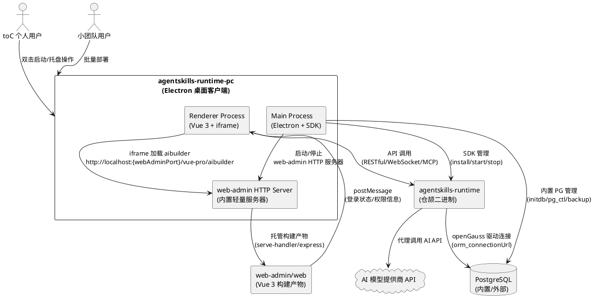

---

# **5. DFX约束**

## **5.1 性能**

1. 冷启动时间（含 runtime 解压验证和 PostgreSQL 初始化）：≤ 60 秒（runtime 已内嵌在安装包中，无需网络下载）
2. 热启动时间（常规启动，runtime 和 PostgreSQL 已初始化）：≤ 15 秒（从双击图标到主界面可交互）
3. runtime 健康检查响应：≤ 2 秒
4. PostgreSQL 启动时间：≤ 10 秒
5. 客户端空闲状态内存占用：≤ 250MB（含 Electron + runtime + PostgreSQL）
6. 客户端活跃状态内存占用：≤ 500MB
7. CPU 空闲状态占用：≤ 5%
8. 安装包体积：约 1.6GB（含 runtime 压缩包 ~380MB + PostgreSQL 二进制 ~50MB + Electron 壳 ~80MB + web-admin 构建产物 ~10MB + OpenSSL DLL ~10MB + 其他资源 ~10MB，经 electron-builder maximum 压缩后预计 600-800MB）
9. 安装后磁盘占用：约 2GB（含 runtime 解压后 ~1.27GB + PostgreSQL ~100MB + Electron + 其他 ~630MB）

## **5.2 可靠性**

1. runtime 崩溃后自动恢复时间：≤ 10 秒
2. 连续崩溃保护：5 分钟内崩溃 3 次后停止自动重启，提示用户
3. 配置文件加密存储敏感信息（API Key）
4. 客户端退出时确保 runtime 和 PostgreSQL 优雅停止
5. PostgreSQL 数据目录损坏时，支持通过备份恢复或重新初始化
6. 登录态持久化后，客户端重启应能自动恢复登录状态（token 未过期时）

## **5.3 安全性**

1. Electron 安全配置：`contextIsolation: true`、`nodeIntegration: false`、`sandbox: true`
2. 渲染进程无法直接访问文件系统，需通过 IPC 代理
3. runtime API 默认监听本地回环地址（`127.0.0.1`）
4. 内置 PostgreSQL 默认仅监听本地回环地址（`127.0.0.1`），默认用户 `uctoo`，默认密码仅在本地存储
5. API Key 等敏感配置加密存储，不明文写入日志
6. iframe 配置 `sandbox` 属性限制权限
7. 数据库备份文件加密存储（可选）
8. access_token 使用 Electron safeStorage 加密存储，不明文写入配置文件或日志
9. postMessage 通信需验证消息来源（origin），防止跨站消息伪造

## **5.4 可维护性**

1. 使用 `electron-log` 实现分级日志（error/warn/info/debug）
2. 日志自动轮转，单文件 ≤ 10MB，保留最近 7 天
3. 日志目录：`%APPDATA%/agentskills/logs/`
4. 支持在主界面查看实时日志
5. PostgreSQL 日志纳入统一日志管理

## **5.5 兼容性**

1. 首版支持：Windows 10 x64 及以上
2. 后续支持：macOS 12 (Monterey) x64/ARM64、Ubuntu 22.04 x64 及以上
3. OpenTiny Vue 组件在 Electron 渲染进程中正常渲染
4. Vue Router 在 Electron 环境中正常工作（hash 模式）
5. 内置 PostgreSQL 版本与 openGauss 驱动协议兼容（PostgreSQL 12+ 协议）

---

# **6. 核心能力**

## **6.1 安装与部署**

### **6.1.1 业务规则**

1. **双击安装包安装**：用户双击安装包文件，系统启动 NSIS 安装向导，引导用户完成安装路径选择和安装过程，无需预装任何运行时环境（Node.js、pnpm 等）
   a. 验收条件：[全新 Windows 机器双击安装包] → [安装成功，桌面出现图标，无需预装任何软件]
   b. 验收条件：[安装过程] → [自动解压 Electron 应用、runtime 发布版压缩包、PostgreSQL 二进制分发包、SQL 脚本、默认配置文件、web-admin 构建产物、OpenSSL DLL（如内置）]

2. **runtime 压缩包内嵌与解压**：安装包内嵌 runtime 发布版压缩包 `agentskills-runtime-win-x64.tar.gz`（约 380MB 压缩，解压后约 1.27GB），安装时自动解压到用户数据目录下的指定集成路径（`%APPDATA%/agentskills/runtime/`），解压完成后自动基于 `.env.example` 生成默认 `.env` 配置文件
   a. 验收条件：[安装完成后] → [用户数据目录下包含完整的 runtime 发布版文件，.env 配置文件已自动生成]
   b. 验收条件：[runtime 解压目录结构] → [包含 runtime 二进制、.env.example、.env（已生成默认配置）、依赖库等完整发布文件]

3. **静默安装支持**：静默安装模式被启用时，支持通过命令行参数 `--mode unattended` 执行无人值守安装，使用默认安装路径和配置
   a. 验收条件：[执行 `--mode unattended` 安装] → [使用默认路径完成安装，无需用户交互]

4. **卸载清理**：用户执行卸载操作时，系统停止 runtime 和 PostgreSQL 进程，并提供数据保留选项
   a. 验收条件：[执行卸载] → [停止 runtime 和 PostgreSQL 进程，默认保留用户数据（配置文件、数据库数据、日志、runtime 集成目录），可选完全清理]

5. **安装包内容**：安装包包含 Electron 主程序、Vue 前端构建产物（`app.asar`）、runtime 发布版压缩包（`agentskills-runtime-win-x64.tar.gz`）、PostgreSQL 二进制分发包（initdb/pg_ctl/postgres/pg_dump/pg_restore 等）、SQL 初始化脚本、默认配置模板、应用图标和资源、OpenSSL DLL（如内置）、web-admin 构建产物
   a. 验收条件：[安装包内容] → [包含 runtime 压缩包、PostgreSQL 二进制、OpenSSL DLL、web-admin 构建产物、SQL 脚本和默认配置，安装后可直接使用]

6. **安装包体积**：安装包约 1.6GB（含 runtime 压缩包 ~380MB），经 electron-builder maximum 压缩后预计 600-800MB
   a. 验收条件：[构建安装包] → [安装包体积在 600-800MB 范围内（electron-builder maximum 压缩后）]

### **6.1.2 交互流程**

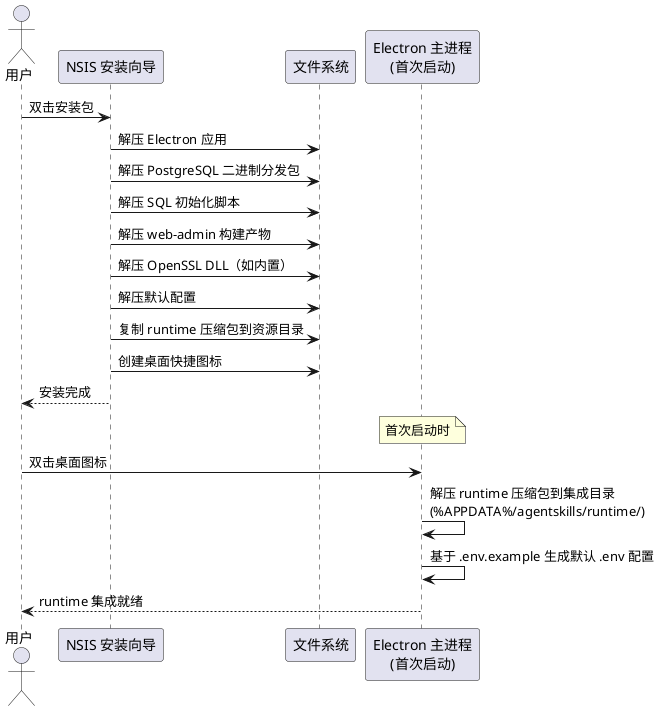

### **6.1.3 异常场景**

1. **磁盘空间不足**
   a. 触发条件：安装目标磁盘剩余空间 < 3GB（需容纳安装包解压 + runtime 解压 + PostgreSQL 数据）
   b. 系统行为：安装向导提示磁盘空间不足，建议更换安装路径
   c. 用户感知：安装向导显示"磁盘空间不足，至少需要 3GB 可用空间"提示

2. **安装路径权限不足**
   a. 触发条件：用户选择的安装路径无写入权限
   b. 系统行为：安装向导提示权限不足，建议以管理员权限运行或更换路径
   c. 用户感知：安装向导显示"权限不足"提示

3. **runtime 压缩包解压失败**
   a. 触发条件：首次启动时 runtime 压缩包解压过程中断（磁盘空间不足、文件损坏等）
   b. 系统行为：显示解压失败提示，提供重试选项；如压缩包损坏，提供通过 SDK `downloadRuntime()` 从网络下载的降级选项
   c. 用户感知：显示"Runtime 集成包解压失败：[原因]"提示 + 重试按钮 + 网络下载降级选项

## **6.2 启动与初始化**

### **6.2.1 业务规则**

1. **双击桌面图标启动**：用户双击桌面图标或快捷方式，系统启动 Electron 主进程，初始化 PostgreSQL（若使用内置且未初始化），检测并解压 runtime 集成包（若首次启动且 runtime 未解压），生成 runtime .env 默认配置，通过 SDK 启动 runtime，启动 web-admin HTTP 服务器，同步双 .env 配置，恢复登录态（若 token 有效），显示主界面
   a. 验收条件：[双击桌面图标] → [Electron 主进程启动 → 初始化/启动 PostgreSQL → 检测/解压 runtime 集成包 → 生成 .env 配置 → SDK 启动 runtime → 同步 .env 配置 → 启动 web-admin HTTP 服务器 → 恢复登录态 → 主界面显示]

2. **首次启动检测与向导触发**：系统检测到首次启动（无用户配置文件）时，自动进入配置向导流程，引导用户完成必要配置
   a. 验收条件：[首次启动（无 config.json）] → [自动进入配置向导]
   b. 验收条件：[向导完成后] → [生成配置文件，后续启动跳过向导]

3. **单实例锁**：确保同一时刻只有一个客户端实例运行。若用户尝试启动第二个实例，则激活已运行实例的主窗口并退出新实例
   a. 验收条件：[启动第二个实例] → [激活已运行实例窗口，新实例退出]

4. **开机自启动**：开机自启动功能被启用时，操作系统启动时自动启动客户端（最小化到系统托盘）。默认关闭，用户可在设置中开启
   a. 验收条件：[开启开机自启 + 系统重启] → [客户端自动启动并最小化到托盘]

5. **runtime 集成包解压**：首次启动时检测 runtime 集成目录（`%APPDATA%/agentskills/runtime/`）是否已存在完整 runtime 发布版文件，若不存在则从安装包内嵌的 `agentskills-runtime-win-x64.tar.gz` 压缩包解压到集成目录，解压完成后基于 `.env.example` 生成默认 `.env` 配置文件
   a. 验收条件：[首次启动且 runtime 集成目录不存在] → [自动解压 runtime 压缩包到集成目录，显示解压进度，解压完成后生成 .env 配置]
   b. 验收条件：[runtime 集成目录已存在] → [跳过解压步骤，直接使用已有 runtime]
   c. 验收条件：[解压失败] → [提供重试选项，以及通过 SDK `downloadRuntime()` 从网络下载的降级选项]

6. **runtime 自动启动**：客户端启动且 runtime 已就绪（集成目录存在）且 PostgreSQL 已就绪时，通过 SDK 自动启动 runtime 进程
   a. 验收条件：[runtime 已就绪且 PostgreSQL 已就绪时启动客户端] → [自动启动 runtime，等待健康检查通过后显示主界面]

7. **启动顺序约束**：runtime 启动前必须确保 PostgreSQL 数据库已就绪（内置 PostgreSQL 已启动且 uctoo 数据库已初始化，或外部 PostgreSQL 连接测试通过）且运行时环境依赖已满足（如 OpenSSL 已就绪）且 runtime 集成目录已就绪（压缩包已解压或已有 runtime 文件）
   a. 验收条件：[PostgreSQL 未就绪时尝试启动 runtime] → [先完成 PostgreSQL 初始化/启动，再启动 runtime]
   b. 验收条件：[OpenSSL 未就绪时尝试启动 runtime] → [先完成 OpenSSL 依赖安装/配置，再启动 runtime]
   c. 验收条件：[runtime 集成目录未就绪时尝试启动 runtime] → [先完成 runtime 压缩包解压，再启动 runtime]

### **6.2.2 交互流程**

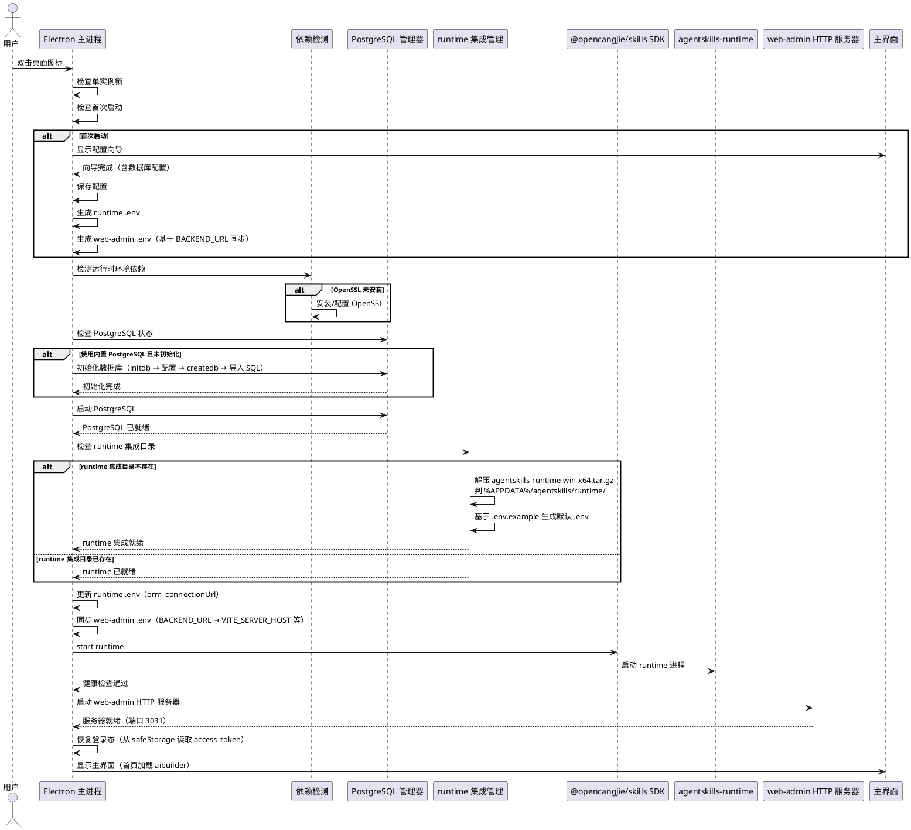

### **6.2.3 异常场景**

1. **runtime 压缩包解压失败**
   a. 触发条件：首次启动时 runtime 压缩包解压过程中断（磁盘空间不足、压缩包损坏等）
   b. 系统行为：显示解压失败提示，提供重试选项；如压缩包损坏，提供通过 SDK `downloadRuntime()` 从网络下载的降级选项
   c. 用户感知：主界面显示"Runtime 集成包解压失败：[原因]"提示 + 重试按钮 + 网络下载降级选项

2. **runtime 启动超时**
   a. 触发条件：runtime 进程启动后 30 秒内健康检查未通过
   b. 系统行为：停止等待，显示启动失败提示
   c. 用户感知：主界面显示"Runtime 启动超时，请检查日志"提示 + 查看日志按钮

3. **runtime 端口冲突**
   a. 触发条件：默认端口 8080 被占用
   b. 系统行为：自动分配可用端口（范围 8080-8180），将新端口写入 `.env` 配置
   c. 用户感知：runtime 正常启动，使用自动分配的端口

4. **PostgreSQL 初始化失败**
   a. 触发条件：initdb 执行失败（磁盘空间不足、权限不足等）
   b. 系统行为：显示初始化失败提示，提供重试和手动指定数据目录选项
   c. 用户感知：主界面显示"数据库初始化失败"提示 + 重试按钮

5. **PostgreSQL 启动失败**
   a. 触发条件：pg_ctl 启动 PostgreSQL 失败（端口冲突、数据目录损坏等）
   b. 系统行为：显示启动失败提示，提供重试和查看日志选项
   c. 用户感知：主界面显示"数据库启动失败"提示 + 查看日志按钮

6. **OpenSSL 依赖缺失导致 runtime 启动失败**
   a. 触发条件：Windows 系统未安装 OpenSSL，runtime 因缺少 libssl/libcrypto DLL 无法启动
   b. 系统行为：自动检测并安装 OpenSSL 依赖，或内置 OpenSSL DLL 到 runtime bin 目录，重试启动
   c. 用户感知：显示"正在安装 OpenSSL 运行时依赖"提示，安装完成后 runtime 正常启动

## **6.3 配置向导**

### **6.3.1 业务规则**

1. **向导化首次配置**：首次启动触发配置向导，按以下步骤引导用户完成配置：

   | 步骤 | 内容 | 必选/可选 |
   |------|------|----------|
   | Step 1 | 欢迎页（功能介绍） | 必选 |
   | Step 2 | AI 模型 API Key 配置 | 必选 |
   | Step 3 | 数据库配置（内置 PostgreSQL / 外部 PostgreSQL） | 必选 |
   | Step 4 | 完成并启动 | 必选 |

   a. 验收条件：[首次启动] → [显示 4 步配置向导]
   b. 验收条件：[向导完成] → [配置保存，PostgreSQL 初始化/配置完成，runtime 自动启动]

2. **AI 模型配置**：用户进入配置向导 Step 2 时，支持以下 AI 模型提供商的 API Key 配置：
   - 支持的提供商：OpenAI、Anthropic、智谱 AI、通义千问、DeepSeek、Ollama（本地）
   - 每个提供商独立配置 API Key、API Base URL（可选）、模型选择
   - 提供"测试连接"按钮验证 API Key 有效性（通过 runtime 代理验证）
   - 支持配置多个提供商，设定默认提供商
   a. 验收条件：[配置 API Key 并点击测试] → [通过 runtime 验证 API Key 有效性，返回成功/失败结果]

3. **数据库配置**：用户进入配置向导 Step 3 时，选择数据库部署方式：
   - **内置 PostgreSQL（默认推荐）**：PC 客户端自动管理 PostgreSQL 实例，用户无需额外操作
     - 自动初始化：initdb → 修改配置（监听地址、端口）→ createdb uctoo → 导入 uctoov4InitData.sql
     - 默认端口：5432
     - 默认用户：uctoo
     - 默认密码：自动生成并存储在本地配置中
   - **外部 PostgreSQL**：用户已有 PostgreSQL 实例，提供连接信息
     - 需填写：主机地址、端口、用户名、密码、数据库名
     - 提供"测试连接"按钮验证数据库连通性和 uctoo 数据库是否存在
     - 若 uctoo 数据库不存在，提示用户需先手动创建并导入初始数据
   a. 验收条件：[选择内置 PostgreSQL 并完成向导] → [自动初始化并启动 PostgreSQL，创建 uctoo 数据库，导入初始数据]
   b. 验收条件：[选择外部 PostgreSQL 并填写连接信息] → [测试连接成功后保存配置]
   c. 验收条件：[外部 PostgreSQL 连接测试失败] → [显示失败原因，不允许继续直到连接成功或切换为内置]

4. **零配置优先**：除 AI 模型 API Key 外，数据库配置默认使用内置 PostgreSQL，其余配置采用合理默认值：
   - runtime 端口：默认 8080
   - runtime 监听地址：默认 `127.0.0.1`（仅本地）
   - PostgreSQL 端口：默认 5432
   - PostgreSQL 监听地址：默认 `127.0.0.1`
   - SSL：默认关闭
   a. 验收条件：[向导使用默认内置 PostgreSQL + 配置 AI Key 后完成] → [PostgreSQL 自动初始化，runtime 使用默认配置正常启动]

5. **配置持久化与重置**：配置向导的结果持久化到本地配置文件，并支持：
   - 通过设置界面修改任意配置项
   - 一键重置为默认配置
   - 重新进入配置向导
   - runtime .env 和 web-admin .env 双配置文件同步管理
   a. 验收条件：[通过设置界面修改配置] → [配置保存成功，runtime .env 和 web-admin .env 按需同步更新，runtime 和 PostgreSQL 按需重启]

6. **禁止项**：
   - 禁止在配置向导中要求用户配置 SSL 证书（runtime 的 .env 文件管理）
   - 禁止在配置向导中实现独立的登录步骤（登录在 iframe 中完成，遵循原则 6）
   a. 验收条件：[配置向导] → [不包含 SSL 配置步骤和登录步骤]

### **6.3.2 交互流程**

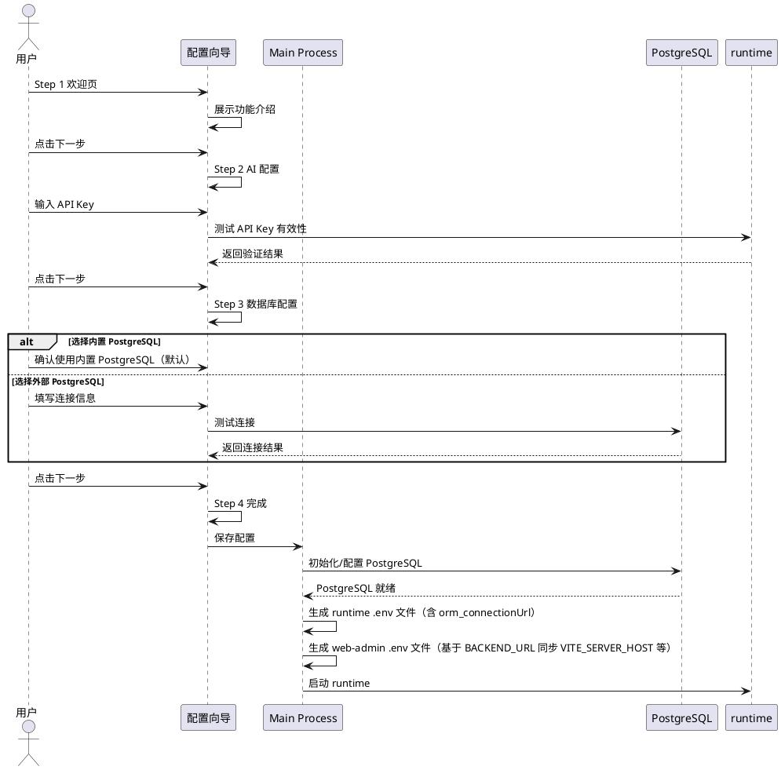

### **6.3.3 异常场景**

1. **API Key 验证失败**
   a. 触发条件：用户输入的 API Key 无效或网络不通
   b. 系统行为：显示验证失败原因（无效 Key、网络错误等），允许用户继续或跳过
   c. 用户感知：向导显示"API Key 验证失败：[原因]"提示

2. **runtime 验证服务不可用**
   a. 触发条件：runtime 尚未启动，无法代理 API Key 验证
   b. 系统行为：跳过实时验证，提示用户"启动 runtime 后可验证 API Key"
   c. 用户感知：向导显示"Runtime 未启动，API Key 将在启动后验证"提示

3. **内置 PostgreSQL 初始化失败**
   a. 触发条件：initdb 或 createdb 执行失败（磁盘空间不足、权限不足、端口冲突等）
   b. 系统行为：显示初始化失败原因，提供重试选项
   c. 用户感知：向导显示"数据库初始化失败：[原因]"提示 + 重试按钮

4. **外部 PostgreSQL 连接测试失败**
   a. 触发条件：填写的外部 PostgreSQL 连接信息不正确或数据库不可达
   b. 系统行为：显示连接失败原因（连接超时、认证失败、数据库不存在等）
   c. 用户感知：向导显示"数据库连接失败：[原因]"提示，不允许继续直到连接成功或切换为内置

5. **外部 PostgreSQL 中 uctoo 数据库不存在**
   a. 触发条件：外部 PostgreSQL 连接成功但 uctoo 数据库不存在
   b. 系统行为：提示用户需先在外部 PostgreSQL 中创建 uctoo 数据库并导入初始数据，提供 SQL 脚本路径提示
   c. 用户感知：向导显示"uctoo 数据库不存在，请先创建数据库并导入初始数据"提示

## **6.4 PostgreSQL 集成管理**

### **6.4.1 业务规则**

1. **REQ-PGDB-01：PostgreSQL 二进制分发包预置**：PC 客户端安装包预置 PostgreSQL 二进制分发包，包含以下可执行文件：
   - `initdb`：数据库集群初始化工具
   - `pg_ctl`：数据库服务启停管理工具
   - `postgres`：数据库服务主进程
   - `createdb`：数据库创建工具
   - `psql`：命令行客户端（用于导入 SQL 脚本）
   - `pg_dump`：数据库备份工具
   - `pg_restore`：数据库恢复工具
   - 预置位置：安装目录下 `pgsql/bin/`、`pgsql/lib/`、`pgsql/share/`
   a. 验收条件：[安装完成后] → [安装目录下包含完整的 PostgreSQL 二进制分发包，所有可执行文件可正常运行]
   b. 验收条件：[执行 initdb --version] → [返回 PostgreSQL 版本信息]

2. **REQ-PGDB-02：首次启动自动初始化数据库**：当用户选择内置 PostgreSQL 且数据库尚未初始化时，PC 客户端自动执行以下初始化流程：
   - **Step 1 - initdb**：执行 `initdb -D <data_dir> -U uctoo --auth-host=scram-sha-256 --auth-local=scram-sha-256`，初始化数据库集群
   - **Step 2 - 修改配置**：修改 `postgresql.conf`，设置 `listen_addresses = '127.0.0.1'`、`port = 5432`；修改 `pg_hba.conf`，配置本地访问权限
   - **Step 3 - 启动 PostgreSQL**：执行 `pg_ctl start -D <data_dir> -l <log_file>`
   - **Step 4 - createdb**：执行 `createdb -h 127.0.0.1 -p 5432 -U uctoo uctoo`，创建 uctoo 数据库
   - **Step 5 - 导入初始数据**：执行 `psql -h 127.0.0.1 -p 5432 -U uctoo -d uctoo -f <uctoov4InitData.sql>`，导入 Schema 和初始数据
   - **Step 6 - 设置默认密码**：为 uctoo 用户设置密码并存储到客户端配置中
   a. 验收条件：[首次启动选择内置 PostgreSQL] → [自动完成 initdb → 配置 → 启动 → createdb → 导入 SQL 全流程]
   b. 验收条件：[初始化完成后] → [uctoo 数据库存在，包含完整的 Schema 和初始数据]
   c. 验收条件：[初始化过程中某步骤失败] → [显示失败步骤和原因，支持从失败步骤重试]

3. **REQ-PGDB-03：PostgreSQL 服务启停管理**：PC 客户端负责内置 PostgreSQL 实例的生命周期管理：
   - **启动**：客户端启动时，若配置为内置 PostgreSQL，自动通过 `pg_ctl start` 启动 PostgreSQL 服务
   - **停止**：客户端退出时，通过 `pg_ctl stop -m fast` 优雅停止 PostgreSQL 服务（等待当前查询完成，最多 10 秒超时后使用 `-m immediate` 强制停止）
   - **重启**：支持通过设置界面或托盘菜单手动重启 PostgreSQL 服务
   - **状态检测**：通过 `pg_ctl status` 检测 PostgreSQL 运行状态
   a. 验收条件：[客户端启动且配置为内置 PostgreSQL] → [自动启动 PostgreSQL 服务]
   b. 验收条件：[客户端退出] → [优雅停止 PostgreSQL 服务]
   c. 验收条件：[手动点击重启 PostgreSQL] → [停止并重新启动 PostgreSQL 服务]

4. **REQ-PGDB-04：数据库备份与恢复**：PC 客户端提供内置 PostgreSQL 的备份和恢复功能：
   - **备份**：通过 `pg_dump` 导出 uctoo 数据库为自定义格式归档文件（`-Fc` 参数），存储到用户指定的路径或默认备份目录（`%APPDATA%/agentskills/backups/`）
   - **恢复**：通过 `pg_restore` 从备份归档文件恢复 uctoo 数据库
   - **自动备份**：支持定时自动备份（默认每天一次，可在设置中配置）
   - **备份管理**：在设置界面提供备份列表查看、手动备份、手动恢复、删除备份等操作
   a. 验收条件：[点击"备份数据库"] → [生成备份文件，文件名包含时间戳，存储到备份目录]
   b. 验收条件：[点击"恢复数据库"并选择备份文件] → [停止 runtime → 恢复数据库 → 重启 runtime]
   c. 验收条件：[自动备份触发] → [后台执行 pg_dump，完成后通知用户]

5. **REQ-PGDB-05：外部 PostgreSQL 连接配置与测试**：当用户选择使用外部 PostgreSQL 时，PC 客户端提供连接配置和测试功能：
   - **连接信息配置**：主机地址、端口、用户名、密码、数据库名
   - **连接测试**：验证数据库连通性、认证有效性、uctoo 数据库是否存在
   - **配置切换**：支持在内置 PostgreSQL 和外部 PostgreSQL 之间切换，切换时需重新配置连接信息并测试
   a. 验收条件：[填写外部 PostgreSQL 连接信息并点击测试] → [验证连通性和认证，返回成功/失败结果]
   b. 验收条件：[从内置切换为外部 PostgreSQL] → [停止内置 PostgreSQL → 配置外部连接 → 测试连接 → 更新 .env]

6. **REQ-PGDB-06：runtime .env 数据库连接配置自动更新**：PC 客户端在以下场景自动更新 runtime `.env` 文件中的 `orm_connectionUrl` 配置项：
   - 首次初始化内置 PostgreSQL 完成后
   - 从内置 PostgreSQL 切换为外部 PostgreSQL 后
   - 从外部 PostgreSQL 切换回内置 PostgreSQL 后
   - 外部 PostgreSQL 连接信息修改后
   - `orm_connectionUrl` 格式：`postgresql://uctoo:<password>@127.0.0.1:5432/uctoo`（内置）或 `postgresql://<user>:<password>@<host>:<port>/<database>`（外部）
   a. 验收条件：[内置 PostgreSQL 初始化完成] → [runtime .env 中 orm_connectionUrl 自动更新为内置 PostgreSQL 连接串]
   b. 验收条件：[切换为外部 PostgreSQL 并测试成功] → [runtime .env 中 orm_connectionUrl 自动更新为外部 PostgreSQL 连接串]
   c. 验收条件：[orm_connectionUrl 更新后重启 runtime] → [runtime 使用新的数据库连接串正常连接数据库]

7. **REQ-PGDB-07：PostgreSQL 状态监控**：PC 客户端提供内置 PostgreSQL 的运行状态监控：
   - **状态指示**：在系统托盘菜单和 Runtime 监控页面显示 PostgreSQL 运行状态（运行中/已停止/异常）
   - **连接数监控**：显示当前数据库连接数
   - **数据库大小**：显示 uctoo 数据库占用磁盘空间
   - **异常告警**：PostgreSQL 异常停止时通过系统通知提醒用户
   a. 验收条件：[PostgreSQL 运行中] → [托盘菜单和监控页面显示"运行中"状态]
   b. 验收条件：[PostgreSQL 异常停止] → [系统通知提醒用户，提供重启选项]

### **6.4.2 交互流程**

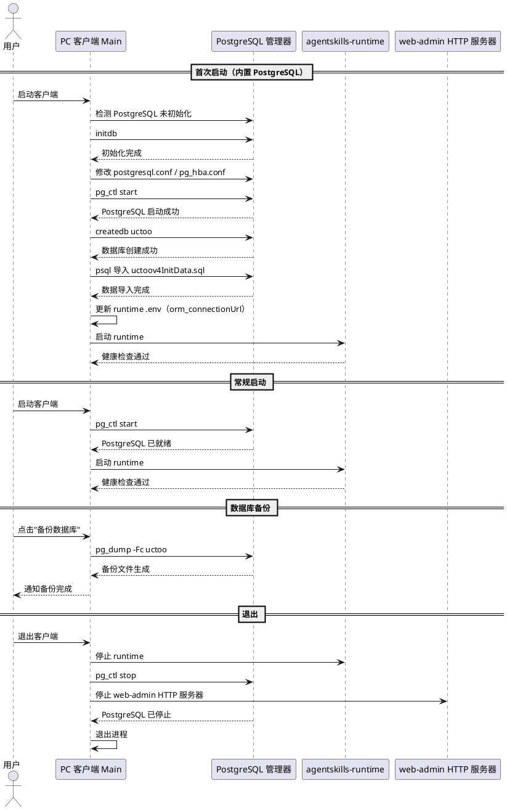

### **6.4.3 异常场景**

1. **initdb 执行失败**
   a. 触发条件：磁盘空间不足、数据目录权限不足、数据目录已存在且非空
   b. 系统行为：显示 initdb 错误输出，提供清理数据目录重试或更换数据目录选项
   c. 用户感知：显示"数据库初始化失败：[initdb 错误信息]"提示 + 重试按钮

2. **PostgreSQL 端口冲突**
   a. 触发条件：默认端口 5432 被其他 PostgreSQL 实例占用
   b. 系统行为：自动分配可用端口（范围 5432-5442），更新配置文件和 .env
   c. 用户感知：PostgreSQL 正常启动，使用自动分配的端口

3. **SQL 导入失败**
   a. 触发条件：uctoov4InitData.sql 文件损坏或 SQL 语句执行错误
   b. 系统行为：显示导入失败步骤和错误信息，提供重新导入选项
   c. 用户感知：显示"数据导入失败：[SQL 错误信息]"提示 + 重试按钮

4. **PostgreSQL 异常停止**
   a. 触发条件：PostgreSQL 进程异常退出（如 OOM、数据损坏）
   b. 系统行为：自动重启 PostgreSQL（最多 3 次），连续异常后停止重启并通知用户
   c. 用户感知：系统通知"数据库异常停止"，主界面提供"重启数据库"按钮

5. **备份文件损坏**
   a. 触发条件：恢复时选择的备份文件损坏或不兼容
   b. 系统行为：显示恢复失败原因，建议选择其他备份文件
   c. 用户感知：显示"备份文件损坏，无法恢复"提示

6. **外部 PostgreSQL 连接中断**
   a. 触发条件：运行过程中外部 PostgreSQL 变为不可达
   b. 系统行为：runtime 报告数据库连接错误，PC 客户端通知用户并提供重新配置选项
   c. 用户感知：系统通知"数据库连接中断"，主界面提供"重新配置"和"切换为内置"选项

## **6.5 Runtime 生命周期管理**

### **6.5.1 业务规则**

1. **Runtime 集成包解压与就绪**：首次启动时，PC 客户端检测 runtime 集成目录（`%APPDATA%/agentskills/runtime/`）是否已存在完整 runtime 发布版文件，若不存在则从安装包内嵌的 `agentskills-runtime-win-x64.tar.gz` 压缩包解压到集成目录，解压完成后基于 `.env.example` 生成默认 `.env` 配置文件
   a. 验收条件：[首次启动且 runtime 集成目录不存在] → [自动解压 runtime 压缩包，显示解压进度，解压完成后生成 .env 配置]
   b. 验收条件：[runtime 集成目录已存在] → [跳过解压步骤，直接使用已有 runtime]

2. **Runtime 降级安装（SDK downloadRuntime）**：当 runtime 压缩包解压失败或 runtime 集成目录损坏时，PC 客户端通过 SDK 的 `downloadRuntime()` 方法从网络下载并安装 runtime 作为降级方案。此外，SDK `downloadRuntime()` 也用于 runtime 版本升级场景
   a. 验收条件：[runtime 压缩包解压失败] → [提供通过 SDK downloadRuntime() 从网络下载的降级选项]
   b. 验收条件：[runtime 版本升级] → [通过 SDK downloadRuntime() 下载新版本 runtime]

3. **Runtime 自动启动**：客户端启动且 runtime 已就绪（集成目录存在）且 PostgreSQL 已就绪时，通过 SDK 的 `start` 命令启动 runtime 进程
   a. 验收条件：[runtime 已安装且 PostgreSQL 已就绪] → [SDK 启动 runtime，等待健康检查通过]
   b. 验收条件：[端口冲突] → [自动分配可用端口（8080-8180）]

3. **Runtime 健康检查**：runtime 进程处于运行状态时，每 5 秒轮询 `/api/v1/uctoo/health` 端点检查 runtime 健康状态
   a. 验收条件：[runtime 运行中] → [每 5 秒健康检查，状态实时显示在托盘和主界面]
   b. 验收条件：[连续 3 次健康检查失败] → [自动尝试重启 runtime（最多 3 次）]

4. **Runtime 优雅停止**：客户端退出时，先通过 SDK 向 runtime 发送停止信号，等待最多 5 秒后若未退出则强制终止进程
   a. 验收条件：[客户端退出] → [runtime 优雅停止，确保当前请求处理完成]

5. **Runtime 崩溃恢复**：runtime 进程异常退出（非用户主动停止）时，收集崩溃日志，通过系统通知提醒用户，并在主界面提供"一键重启"按钮
   a. 验收条件：[runtime 崩溃] → [自动重启（最多 3 次），通知用户，崩溃日志保存到 `%APPDATA%/agentskills/logs/`]
   b. 验收条件：[连续崩溃（5 分钟内 3 次）] → [停止自动重启，提示用户检查日志]

6. **Runtime 版本管理**：支持查看当前 runtime 版本，并支持 runtime 版本升级
   a. 验收条件：[升级 runtime] → [自动备份当前版本 → 下载新版本 → 替换 → 重启 → 验证健康]
   b. 验收条件：[升级失败] → [自动回滚到备份版本]

7. **SDK 集成方式**：PC 客户端通过 `@opencangjie/skills` SDK 管理 runtime，runtime 集成目录位于：
   - 生产环境（主方案）：用户数据目录（`%APPDATA%/agentskills/runtime/`），从安装包内嵌压缩包解压获得
   - 生产环境（降级方案）：SDK `downloadRuntime()` 下载到 SDK node_modules 目录（`node_modules/@opencangjie/skills/dist/runtime/win-x64/release/`），用于压缩包解压失败或版本升级场景
   - 开发环境：SDK node_modules 目录（`node_modules/@opencangjie/skills/dist/runtime/win-x64/release/`）
   a. 验收条件：[生产环境首次启动] → [从安装包内嵌压缩包解压 runtime 到用户数据目录]
   b. 验收条件：[生产环境 runtime 解压失败] → [降级到 SDK downloadRuntime() 从网络下载]
   c. 验收条件：[开发环境启动] → [从 SDK node_modules 路径加载 runtime]

### **6.5.2 交互流程**

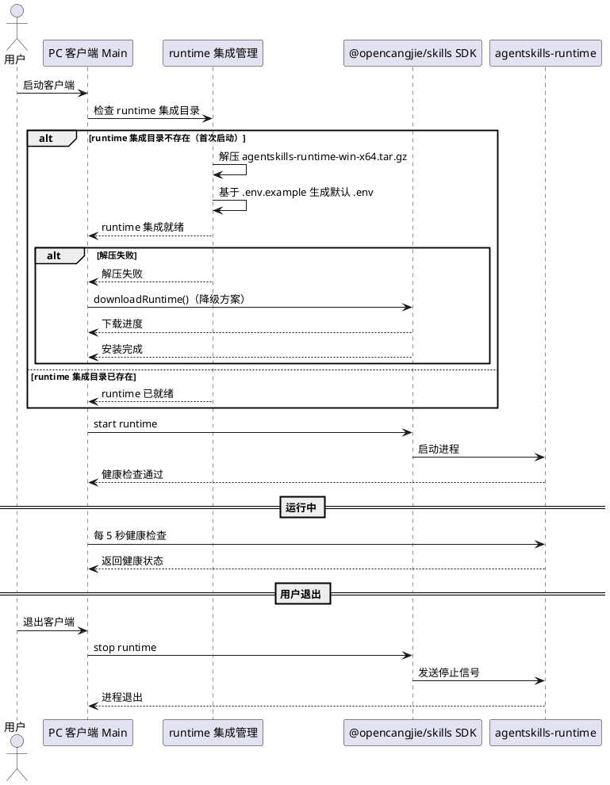

### **6.5.3 异常场景**

1. **runtime 压缩包解压失败**
   a. 触发条件：首次启动时 runtime 压缩包解压过程中断（磁盘空间不足、压缩包损坏、权限不足等）
   b. 系统行为：显示解压失败提示，提供重试选项；如压缩包损坏，提供通过 SDK `downloadRuntime()` 从网络下载的降级选项
   c. 用户感知：显示"Runtime 集成包解压失败：[原因]"提示 + 重试按钮 + "从网络下载"降级选项

2. **runtime 降级下载网络超时**
   a. 触发条件：runtime 压缩包解压失败后，通过 SDK `downloadRuntime()` 从网络下载时网络中断或超时
   b. 系统行为：暂停下载，提示用户重试或配置镜像源
   c. 用户感知：显示"下载超时"提示 + 重试按钮 + 镜像源配置选项

2. **runtime 启动后立即崩溃**
   a. 触发条件：runtime 进程启动后立即退出（如配置错误、端口冲突、DLL 缺失、数据库不可达）
   b. 系统行为：收集崩溃日志，自动重启（最多 3 次），连续崩溃后停止重启
   c. 用户感知：系统通知"Runtime 异常退出"，主界面提供"一键重启"和"查看日志"按钮

3. **runtime 健康检查持续失败**
   a. 触发条件：runtime 进程存在但健康检查连续 3 次失败
   b. 系统行为：自动重启 runtime（最多 3 次），重启失败后通知用户
   c. 用户感知：系统通知"Runtime 健康检查失败"，主界面显示"一键重启"按钮

4. **runtime 因数据库不可达启动失败**
   a. 触发条件：runtime 启动时无法连接 PostgreSQL 数据库（orm_connectionUrl 配置错误或 PostgreSQL 未启动）
   b. 系统行为：检测到数据库连接错误，提示用户检查数据库状态，提供"启动数据库"或"重新配置数据库"选项
   c. 用户感知：显示"Runtime 启动失败：数据库不可达"提示 + 修复选项

5. **runtime 因 OpenSSL 依赖缺失启动失败**
   a. 触发条件：Windows 系统缺少 OpenSSL DLL，runtime 启动时加载 libssl/libcrypto 失败
   b. 系统行为：自动检测 OpenSSL 依赖缺失，安装或配置 OpenSSL 后重试启动
   c. 用户感知：显示"正在修复 OpenSSL 运行时依赖"提示，修复完成后 runtime 正常启动

## **6.6 首页 web 应用加载**

### **6.6.1 业务规则**

1. **web 首页 URL 构建**：
   - 首页直接加载 web 发布版首页（web 应用根路径），由 PC 客户端内置 web-admin HTTP 服务器（WebAdminServer）托管 web-admin 构建产物
   - 生产模式：`http://localhost:{webAdminPort}/`，其中 `webAdminPort` 为 WebAdminServer 分配的端口（默认 3031）
   - 开发模式（dev）：`http://localhost:3031/`，其中 `3031` 为 web-admin 开发服务器端口
   a. 验收条件：[生产模式] → [首页 iframe 加载 `http://localhost:{webAdminPort}/`，显示 web 应用首页]
   b. 验收条件：[dev 模式下] → [首页 iframe 加载 `http://localhost:3031/`]

2. **首页不依赖 runtime / PostgreSQL 状态**：web 应用首页与 runtime 以及 PostgreSQL 是否启动没有必然关联：
   - 即使 runtime 未启动，web 应用首页也可以正常显示页面，只是无法从 runtime 服务端 API 加载到业务数据
   - 即使 PostgreSQL 未启动，web 应用首页也可以正常显示页面
   - 首页加载只依赖 web-admin 静态资源服务（WebAdminServer）是否运行；若未运行，客户端尝试自动启动，启动失败才显示错误提示
   a. 验收条件：[runtime 未启动时进入首页] → [web 应用首页正常显示，仅业务数据为空]
   b. 验收条件：[PostgreSQL 未启动时进入首页] → [web 应用首页正常显示]

3. **runtime 状态展示位置**：runtime 服务状态在左侧导航"Runtime"菜单项旁边以服务状态图标（状态点）展示，数据库服务状态在"数据库"菜单项旁边展示，不在首页显示 runtime 启动/等待相关内容
   a. 验收条件：[左侧导航栏] → [Runtime 菜单项旁显示服务状态点，数据库菜单项旁显示服务状态点]
   b. 验收条件：[runtime 运行中] → [Runtime 状态点为绿色"运行中"]
   c. 验收条件：[runtime 未运行] → [Runtime 状态点为灰色"已停止"]

4. **web-admin 构建产物集成**：
   - PC 客户端集成 web-admin/web 的构建产物（`pnpm build` 输出），复制到 `resources/web-admin/` 目录
   - 开发模式：iframe 加载 web-admin 开发服务器（`http://localhost:3031`）
   - 生产模式：PC 客户端内置 HTTP 服务器（WebAdminServer）托管 web-admin 构建产物，iframe 加载 `http://localhost:{webAdminPort}/`
   a. 验收条件：[开发模式] → [iframe 从 localhost:3031 加载 web 首页]
   b. 验收条件：[生产模式] → [iframe 从 PC 客户端内置 HTTP 服务器加载 web 首页]

5. **web-admin .env 配置管理**：
   - PC 客户端负责生成和管理 web-admin 的 `.env` 配置文件
   - web-admin .env 中的 `VITE_SERVER_HOST`、`VITE_BACKEND_URL`、`VITE_WS_URL`、`VITE_OPENAI_BASE_URL`、`VITE_AGENT_ROOT`、`VITE_MOCK_HOST`、`VITE_MOCK_SERVER_HOST` 等配置项的值来源于 runtime 的 `BACKEND_URL`
   - 当 runtime 的 `BACKEND_URL` 变更时，PC 客户端自动同步更新 web-admin .env 中的相关配置项
   - WebAdminServer 在返回 index.html 时注入 `window.__APP_ENV__` 运行时配置（由 `envSyncManager.readRuntimeEnv()` 生成）
   a. 验收条件：[runtime BACKEND_URL 变更] → [web-admin .env 中 VITE_SERVER_HOST 等配置项自动同步更新，WebAdminServer 注入的 __APP_ENV__ 同步更新]

6. **web-admin HTTP 服务器管理**：PC 客户端在 Electron Main Process 中启动轻量 HTTP 服务器（WebAdminServer），托管 web-admin 构建产物
   - 服务器默认端口：3031（与 web-admin 开发服务器端口一致，避免跨端口问题）
   - 端口冲突时自动分配可用端口（范围 3031-3041）
   - 服务器随客户端启动而启动，随客户端退出而停止
   - 服务器根目录指向 `resources/web-admin/` 构建产物目录
   a. 验收条件：[客户端启动] → [web-admin HTTP 服务器自动启动，iframe 可加载 web 首页]
   b. 验收条件：[默认端口 3031 被占用] → [自动分配可用端口，iframe 使用新端口加载 web 首页]
   c. 验收条件：[客户端退出] → [web-admin HTTP 服务器优雅停止]

7. **iframe 全屏展示**：web 应用 iframe 在主内容区全屏展示，无多余内边距和边框，宽度和高度填满主内容区域（100% 宽高）
   a. 验收条件：[web 首页加载后] → [iframe 填满主内容区域，无可见边距和边框]

8. **iframe 安全与权限**：
   - iframe 配置 `sandbox` 属性，允许 `allow-same-origin allow-scripts allow-forms allow-popups allow-modals allow-downloads`
   - iframe 允许剪贴板读写权限（`allow="clipboard-read; clipboard-write"`）
   a. 验收条件：[web 页面内操作] → [剪贴板读写、弹窗、表单提交等功能正常]

9. **禁止项**：
   - 禁止在首页显示 runtime 启动/等待相关提示内容（runtime 状态移至左侧导航状态图标展示）
   - 禁止在 runtime 未启动时显示占位页替代 web 应用首页
   - 禁止在 runtime 未启动时跳转到其他页面
   a. 验收条件：[runtime 未启动时] → [首页正常显示 web 应用首页，不显示启动提示、不跳转]

### **6.6.2 交互流程**

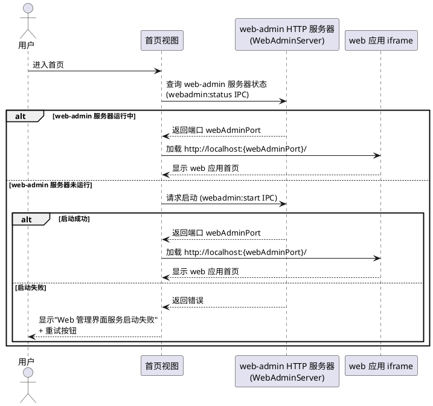

### **6.6.3 异常场景**

1. **web 首页 iframe 加载失败**
   a. 触发条件：web-admin HTTP 服务器已启动但 web 首页 URL 不可达（如 web-admin 构建产物缺失、路径配置错误）
   b. 系统行为：显示加载失败提示，提供重试按钮
   c. 用户感知：页面显示"Web 管理界面加载失败，请检查 web 静态资源服务状态"提示 + 重试按钮

2. **web-admin HTTP 服务器启动失败**
   a. 触发条件：内置 HTTP 服务器端口冲突且自动分配失败，或 web-admin 构建产物目录不存在
   b. 系统行为：显示服务器启动失败提示，提供重试和检查日志选项
   c. 用户感知：页面显示"Web 管理界面服务启动失败"提示 + 重试按钮

3. **dev 模式下 web-admin 开发服务器未启动**
   a. 触发条件：dev 模式下 `localhost:3031` 不可达
   b. 系统行为：iframe 加载超时后显示开发环境提示
   c. 用户感知：页面显示"开发服务器未启动，请先启动 web-admin 开发服务器（端口 3031）"提示

## **6.7 左侧竖向导航**

### **6.7.1 业务规则**

1. **导航栏布局结构**：
   - 导航栏位于应用窗口左侧，宽度 200-240px
   - 导航栏始终常驻显示（包括首页），不因路由切换而隐藏
   - 导航栏分为四个区域（从上到下）：
     - **顶部区域**：应用 Logo + 应用名称（如 "AgentSkills"）+ 用户头像/登录状态指示
     - **核心功能区**：首页（AI Builder 对话）、技能管理、智能体管理
     - **系统管理区**：Runtime 监控、数据库管理
     - **底部区域**：系统设置、关于
   a. 验收条件：[任意路由页面] → [左侧导航栏始终显示，宽度 200-240px]
   b. 验收条件：[首页路由] → [左侧导航栏正常显示，不再隐藏]
   c. 验收条件：[用户已登录] → [导航栏顶部区域显示用户头像/名称]
   d. 验收条件：[用户未登录] → [导航栏顶部区域显示登录提示]

2. **导航项样式**：
   - 每个导航项采用"图标 + 文字"样式，竖向排列
   - 导航项之间有合理间距（8-12px）
   - 核心功能区和系统管理区之间有分隔线
   a. 验收条件：[导航栏渲染] → [每个导航项显示图标和文字，区域间有分隔线]

3. **导航项选中与交互状态**：
   - 当前路由对应的导航项显示选中状态（背景高亮 + 文字/图标颜色变化）
   - 鼠标悬停时显示悬停状态（背景微高亮）
   a. 验收条件：[点击导航项] → [对应路由跳转，导航项显示选中高亮]
   b. 验收条件：[鼠标悬停导航项] → [显示悬停背景高亮]

4. **主内容区布局**：
   - 主内容区占满导航栏右侧的剩余空间
   - 主内容区高度填满窗口高度
   - 首页 aibuilder iframe 在主内容区内全屏展示
   a. 验收条件：[主内容区] → [填满导航栏右侧剩余空间，无多余边距]

5. **状态栏处理**：原底部状态栏移除，版本信息等状态信息在"关于"页面或导航栏底部区域展示
   a. 验收条件：[应用界面] → [无独立底部状态栏，版本信息在导航栏底部或关于页面展示]

6. **整体配色**：
   - 导航栏采用简洁现代的低饱和度配色
   - 导航栏背景色与主内容区有适度区分（如导航栏略深于主内容区）
   - 选中状态使用品牌色（如蓝色系）高亮
   a. 验收条件：[导航栏] → [低饱和度配色，背景色与主内容区有区分，选中项使用品牌色]

7. **导航栏拖拽区域**：
   - 导航栏顶部区域（Logo + 应用名称）作为窗口拖拽区域（`-webkit-app-region: drag`）
   - 导航项区域不可拖拽（`-webkit-app-region: no-drag`）
   a. 验收条件：[拖拽 Logo 区域] → [窗口可移动]
   b. 验收条件：[点击导航项] → [不触发窗口拖拽]

8. **登录状态感知**：导航栏根据用户登录状态显示不同的 UI 元素：
   - 已登录：顶部区域显示用户头像和用户名，核心功能区导航项可正常使用
   - 未登录：顶部区域显示"请登录"提示，点击后引导用户在 iframe 中完成登录
   a. 验收条件：[用户已登录] → [导航栏显示用户信息，所有导航项可正常使用]
   b. 验收条件：[用户未登录] → [导航栏显示登录提示，点击后 iframe 跳转到登录页面]

9. **服务状态图标（状态点）**：系统管理区导航项（Runtime、数据库）右侧显示服务状态图标（小圆点），实时反映 runtime 和 PostgreSQL 服务状态：
   - Runtime 菜单项：绿色 = 运行中、橙色闪烁 = 启动中、红色 = 异常、灰色 = 已停止
   - 数据库菜单项：绿色 = 运行中、橙色闪烁 = 启动中、红色 = 异常、灰色 = 已停止/未初始化
   - 状态来源：`useRuntimeStore` / `usePgsqlStore` 定期轮询（5s 间隔）+ `runtime:stateChanged` / `pgsql:stateChanged` 事件
   - 状态点带悬停提示（title），说明当前状态文案（运行中/启动中/异常/已停止）
   a. 验收条件：[左侧导航栏] → [Runtime 菜单项旁显示服务状态点，数据库菜单项旁显示服务状态点]
   b. 验收条件：[runtime 运行中] → [Runtime 状态点为绿色"运行中"]
   c. 验收条件：[runtime 启动中] → [Runtime 状态点为橙色闪烁"启动中"]
   d. 验收条件：[runtime 异常退出] → [Runtime 状态点为红色"异常"]
   e. 验收条件：[runtime 未运行] → [Runtime 状态点为灰色"已停止"]

10. **禁止项**：
    - 禁止在首页时隐藏导航栏
    - 禁止使用顶部水平导航布局
    - 禁止在首页显示 runtime 启动/等待相关内容（runtime 状态通过导航栏状态图标展示）
    a. 验收条件：[首页路由] → [左侧导航栏正常显示]
    b. 验收条件：[任意路由] → [导航栏位于左侧竖向排列，非顶部水平排列]
    c. 验收条件：[首页] → [不显示 runtime 启动/等待内容，仅显示 web 应用首页]

**导航项与路由映射**：

| 导航项 | 路由路径 | 所属区域 | 说明 |
|--------|---------|---------|------|
| 首页 | `/` | 核心功能区 | web 应用首页（iframe 加载 web 发布版首页） |
| 技能管理 | `/skills` | 核心功能区 | 技能列表与管理（可作为 iframe 内跳转快捷入口） |
| 智能体管理 | `/agents` | 核心功能区 | 智能体列表与管理（可作为 iframe 内跳转快捷入口） |
| Runtime 监控 | `/runtime` | 系统管理区 | Runtime 状态与日志（导航项右侧带服务状态图标） |
| 数据库管理 | `/pgsql` | 系统管理区 | PostgreSQL 状态监控、备份恢复（导航项右侧带服务状态图标） |
| 系统设置 | `/settings` | 底部区域 | 配置管理（AI Key、数据库、代理、开机自启等） |
| 关于 | `/about` | 底部区域 | 版本信息与更新 |

> **说明**：技能管理和智能体管理导航项的具体路由可根据 aibuilder 模块的集成方式确定。若 aibuilder 通过 iframe 加载，则技能/智能体管理可通过 iframe 内部导航实现，左侧导航栏的对应项可控制 iframe 内跳转或作为快捷入口。

### **6.7.2 交互流程**

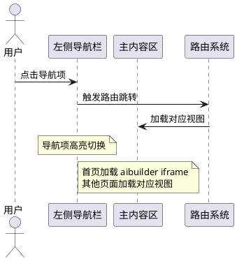

### **6.7.3 异常场景**

1. **窗口尺寸过小**
   a. 触发条件：窗口宽度小于导航栏宽度 + 最小内容区宽度（如 < 800px）
   b. 系统行为：导航栏可折叠为图标模式（仅显示图标，隐藏文字），或限制窗口最小尺寸
   c. 用户感知：导航栏自动切换为紧凑模式或窗口不可继续缩小

2. **导航项对应路由加载失败**
   a. 触发条件：点击导航项后目标视图加载异常
   b. 系统行为：显示加载错误提示，导航栏保持可用
   c. 用户感知：主内容区显示"页面加载失败"提示，可点击其他导航项切换

## **6.8 导航图标**

### **6.8.1 业务规则**

1. **图标风格**：所有导航项图标采用统一的线性简洁风格（outline/linear style），图标线条粗细一致（推荐 1.5-2px stroke），图标尺寸统一（推荐 20-24px）
   a. 验收条件：[导航栏渲染] → [所有图标风格统一，线性简洁，尺寸一致]

2. **图标来源**：推荐使用 SVG 图标或图标字体库（如 Lucide Icons、Material Design Icons、Remix Icon），图标应来自同一图标库，确保风格一致
   a. 验收条件：[图标实现] → [所有图标来自同一图标库或统一设计的 SVG]

3. **图标与导航项对应**：

   | 导航项 | 推荐图标语义 | 说明 |
   |--------|------------|------|
   | 首页（AI Builder） | 对话气泡 / AI 星标 | 表达 AI 对话核心功能 |
   | 技能管理 | 闪电 / 插件 | 表达技能/插件概念 |
   | 智能体管理 | 机器人 / 用户+齿轮 | 表达智能体/Agent 概念 |
   | Runtime 监控 | 脉搏 / 仪表盘 | 表达运行时监控 |
   | 数据库管理 | 数据库 / 存储堆栈 | 表达数据库管理 |
   | 系统设置 | 齿轮 | 表达系统配置 |
   | 关于 | 信息圆圈 / 问号 | 表达帮助/信息 |

   a. 验收条件：[每个导航项] → [显示与功能语义匹配的图标]

4. **图标状态样式**：
   - 默认状态：中性色（如灰色 `#666`）
   - 选中状态：品牌色（如蓝色 `#1976d2`）+ 填充变体或颜色加粗
   - 悬停状态：与默认状态同色系但略深，或与选中状态同色但透明度降低
   a. 验收条件：[导航项默认] → [图标为中性灰色]
   b. 验收条件：[导航项选中] → [图标变为品牌色蓝色]

5. **禁止项**：
   - 禁止混用不同风格的图标（如部分线性部分填充）
   - 禁止使用文字替代图标
   a. 验收条件：[导航栏] → [所有图标风格统一，无混用现象]

### **6.8.2 交互流程**

（导航图标为静态视觉元素，无独立交互流程，随导航项交互状态变化）

### **6.8.3 异常场景**

1. **图标资源加载失败**
   a. 触发条件：图标字体或 SVG 文件加载失败
   b. 系统行为：导航项显示文字降级方案（无图标仅文字），不影响导航功能
   c. 用户感知：导航项仅显示文字，功能正常可用

## **6.9 系统集成**

### **6.9.1 业务规则**

1. **系统托盘常驻**：系统在托盘区域显示应用图标，提供右键菜单：
   - 显示/隐藏主窗口
   - Runtime 状态指示（运行中/已停止/异常）
   - PostgreSQL 状态指示（运行中/已停止）
   - 快速操作：启动/停止 runtime、重启 runtime、启动/停止 PostgreSQL
   - 打开配置界面
   - 打开日志目录
   - 开机自启动开关
   - 关于/检查更新
   - 退出
   a. 验收条件：[客户端启动后] → [系统托盘显示应用图标，右键菜单功能正常]

2. **系统通知**：发生以下事件时，通过操作系统原生通知机制通知用户：
   - runtime 启动成功/失败
   - runtime 崩溃与恢复
   - PostgreSQL 启动成功/失败
   - PostgreSQL 异常停止
   - 数据库备份完成/失败
   - 自动更新可用/下载完成
   - 登录态过期
   a. 验收条件：[runtime 崩溃] → [系统通知提醒用户]
   b. 验收条件：[PostgreSQL 异常停止] → [系统通知提醒用户]
   c. 验收条件：[登录态过期] → [系统通知提醒用户重新登录]

3. **窗口管理**：
   - 主窗口关闭时最小化到系统托盘（不退出）
   - 支持通过托盘图标或快捷键激活主窗口
   - 窗口大小和位置持久化，重启后恢复
   a. 验收条件：[关闭主窗口] → [最小化到托盘，runtime、PostgreSQL 和 web-admin HTTP 服务器继续运行]
   b. 验收条件：[重启客户端] → [窗口大小和位置恢复]

4. **深度系统集成**：
   - 注册自定义协议（`agentskills://`），支持从浏览器唤起客户端
   a. 验收条件：[浏览器访问 `agentskills://xxx`] → [唤起 PC 客户端]

### **6.9.2 交互流程**

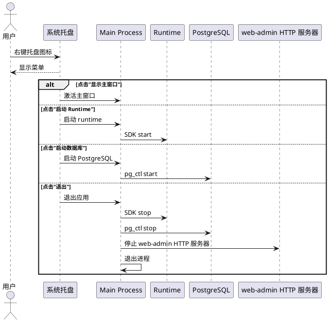

### **6.9.3 异常场景**

1. **托盘图标创建失败**
   a. 触发条件：系统托盘区域不可用（如某些 Linux 桌面环境）
   b. 系统行为：跳过托盘创建，主窗口关闭行为改为直接退出
   c. 用户感知：无托盘图标，关闭窗口即退出应用

## **6.10 自动更新**

### **6.10.1 业务规则**

1. **客户端自动更新**：检测到新版本可用时，提示用户下载更新，支持差量更新以减少下载体积
   a. 验收条件：[检测到新版本] → [提示用户下载，支持差量更新]
   b. 验收条件：[更新失败] → [提供手动下载链接]

2. **Runtime 自动更新**：检测到 runtime 新版本可用时，提示用户升级 runtime，升级前自动备份当前版本
   a. 验收条件：[runtime 新版本可用] → [提示升级，自动备份 → 下载 → 替换 → 重启 → 验证]
   b. 验收条件：[升级失败] → [自动回滚到备份版本]

### **6.10.2 交互流程**

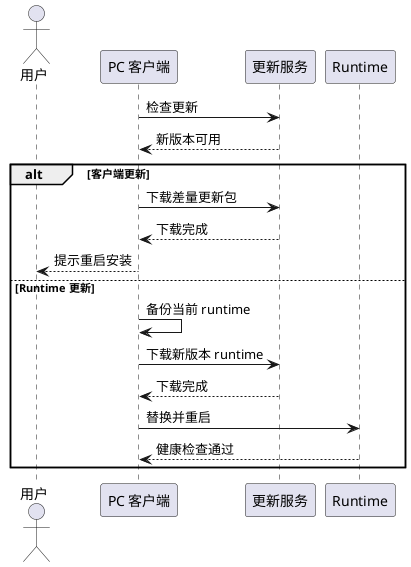

### **6.10.3 异常场景**

1. **更新下载中断**
   a. 触发条件：下载更新包时网络中断
   b. 系统行为：暂停下载，提示用户重试
   c. 用户感知：显示"下载中断"提示 + 重试按钮

2. **Runtime 升级后健康检查失败**
   a. 触发条件：新版本 runtime 启动后健康检查未通过
   b. 系统行为：自动回滚到备份版本，通知用户升级失败
   c. 用户感知：系统通知"Runtime 升级失败，已回滚到上一版本"

## **6.11 前端复用与适配**

### **6.11.1 业务规则**

1. **Vue 3 前端代码复用**：复用 `web-admin/web` 的 Vue 3 前端代码作为 Electron 渲染进程内容，复用范围包括 views/、store/models/、components/、router/、locale/。复用方式：通过 monorepo workspace 或 git submodule 引入，避免代码复制
   a. 验收条件：[web-admin 前端代码更新] → [PC 客户端自动获取最新代码]

2. **API 适配层**：提供 Electron 适配层，将前端 API 调用从 Web 模式适配为桌面模式：
   - API baseURL 从远程服务器地址改为本地 runtime 地址（`http://127.0.0.1:{动态端口}`）
   - 浏览器不支持的文件操作改为通过 IPC 调用 Main Process 的 `fs` 模块
   - 环境变量注入：`VITE_SERVER_HOST` 指向本地 runtime 地址（通过 web-admin .env 管理）
   - **重要**：web-admin 的环境变量通过 web-admin .env 配置文件管理，而非通过 runtime 端口推导
   a. 验收条件：[前端 API 调用] → [请求发送到 web-admin .env 中 VITE_SERVER_HOST 指定的 runtime 地址]

3. **新增桌面端专属视图**：在复用前端代码基础上，新增以下桌面端专属视图：
   - 配置向导视图（`/setup` 路由）
   - Runtime 状态监控视图（进程信息、健康状态、资源占用）
   - 数据库管理视图（PostgreSQL 状态、备份恢复）
   - 系统设置视图（AI Key 配置、数据库配置、代理配置、开机自启等）
   a. 验收条件：[访问 /setup] → [显示配置向导视图]
   b. 验收条件：[访问 /runtime] → [显示 Runtime 监控视图]
   c. 验收条件：[访问 /pgsql] → [显示数据库管理视图]

4. **IPC 通信接口**：通过 Electron IPC 机制（`contextBridge + preload`）定义渲染进程与主进程的通信接口：

   | IPC 通道 | 方向 | 用途 |
   |---------|------|------|
   | `runtime:start` | Renderer → Main | 启动 runtime |
   | `runtime:stop` | Renderer → Main | 停止 runtime |
   | `runtime:restart` | Renderer → Main | 重启 runtime |
   | `runtime:status` | Renderer → Main | 查询 runtime 状态 |
   | `runtime:install` | Renderer → Main | 安装 runtime |
   | `runtime:logs` | Renderer → Main | 获取 runtime 日志 |
   | `runtime:stateChanged` | Main → Renderer | runtime 状态变更推送 |
   | `pgsql:init` | Renderer → Main | 初始化内置 PostgreSQL |
   | `pgsql:start` | Renderer → Main | 启动内置 PostgreSQL |
   | `pgsql:stop` | Renderer → Main | 停止内置 PostgreSQL |
   | `pgsql:status` | Renderer → Main | 查询 PostgreSQL 状态 |
   | `pgsql:backup` | Renderer → Main | 备份数据库 |
   | `pgsql:restore` | Renderer → Main | 恢复数据库 |
   | `pgsql:testConnection` | Renderer → Main | 测试外部 PostgreSQL 连接 |
   | `pgsql:stateChanged` | Main → Renderer | PostgreSQL 状态变更推送 |
   | `webadmin:start` | Renderer → Main | 启动 web-admin HTTP 服务器 |
   | `webadmin:stop` | Renderer → Main | 停止 web-admin HTTP 服务器 |
   | `webadmin:status` | Renderer → Main | 查询 web-admin HTTP 服务器状态 |
   | `webadmin:stateChanged` | Main → Renderer | web-admin HTTP 服务器状态变更推送 |
   | `envsync:syncWebAdminEnv` | Renderer → Main | 同步 runtime .env 到 web-admin .env |
   | `envsync:getRuntimeEnv` | Renderer → Main | 获取 runtime .env 配置项 |
   | `envsync:getWebAdminEnv` | Renderer → Main | 获取 web-admin .env 配置项 |
   | `auth:loginStateChanged` | Main → Renderer | 登录状态变更推送（来自 iframe postMessage） |
   | `auth:getToken` | Renderer → Main | 获取存储的 access_token |
   | `auth:clearToken` | Renderer → Main | 清除存储的 access_token |
   | `config:get` | Renderer → Main | 获取配置项 |
   | `config:set` | Renderer → Main | 设置配置项 |
   | `config:isSetupCompleted` | Renderer → Main | 检查是否完成配置 |
   | `system:getAppInfo` | Renderer → Main | 获取应用信息 |
   | `system:openExternal` | Renderer → Main | 打开外部链接 |
   | `system:openPath` | Renderer → Main | 在文件管理器中显示 |
   | `updater:check` | Renderer → Main | 检查更新 |
   | `updater:download` | Renderer → Main | 下载更新 |
   | `updater:install` | Renderer → Main | 安装更新 |
   | `autoLaunch:isEnabled` | Renderer → Main | 查询开机自启状态 |
   | `autoLaunch:toggle` | Renderer → Main | 切换开机自启 |
   | `dep:checkOpenSSL` | Renderer → Main | 检测 OpenSSL 依赖是否就绪 |
   | `dep:installOpenSSL` | Renderer → Main | 安装 OpenSSL 依赖 |
   | `dep:checkAll` | Renderer → Main | 检测所有运行时依赖是否就绪 |

   a. 验收条件：[Renderer 调用 IPC] → [Main Process 正确响应，参数校验生效]

### **6.11.2 交互流程**

（前端复用与适配为技术实现层面，无独立用户交互流程）

### **6.11.3 异常场景**

1. **IPC 通信超时**
   a. 触发条件：Main Process 未响应 IPC 调用（如主进程阻塞）
   b. 系统行为：Renderer 端显示超时提示，提供重试选项
   c. 用户感知：界面显示"操作超时，请重试"提示

## **6.12 双 .env 配置同步**

### **6.12.1 业务规则**

1. **REQ-ENVSYNC-01：双 .env 配置文件管理**：PC 客户端同时管理两个独立的 .env 配置文件：
   - **runtime .env**：位于 SDK 安装目录（`node_modules/@opencangjie/skills/dist/runtime/win-x64/release/.env`），由 SDK 从 `.env.example` 自动生成，PC 客户端负责更新其中的配置项
   - **web-admin .env**：位于 web-admin 项目根目录（`web-admin/web/.env`），PC 客户端负责生成和更新其中的配置项
   - **重要**：runtime 和 web-admin 是两个完全独立的项目，各自有独立的 .env 配置文件，PC 客户端负责维护两者之间的配置同步
   a. 验收条件：[客户端启动] → [runtime .env 和 web-admin .env 均存在且配置项正确]
   b. 验收条件：[runtime .env 不存在] → [PC 客户端通过 SDK 生成默认 runtime .env]
   c. 验收条件：[web-admin .env 不存在] → [PC 客户端根据 runtime 配置生成默认 web-admin .env]

2. **REQ-ENVSYNC-02：runtime .env 关键配置项**：PC 客户端管理 runtime .env 中的以下关键配置项：
   - `PORT`：runtime API 监听端口，默认 `8080`
   - `HOST`：runtime API 绑定地址，默认 `0.0.0.0`
   - `BACKEND_URL`：决定 HTTP/HTTPS 模式和外部访问地址（如 `http://localhost:8080` 或 `https://javatoarktsapi.uctoo.com`）
   - `CERT_FILE_NAME` / `KEY_FILE_NAME`：SSL 证书路径（由 BACKEND_URL 是否为 https 决定）
   - `orm_connectionUrl`：数据库连接 URL
   - `AUTH_CORE_SECRET`：JWT 密钥
   - `SOPHNET_API_KEY` 等：AI 模型 API Key
   - `SKILL_INSTALL_PATH`：技能安装路径
   a. 验收条件：[runtime .env 生成后] → [包含以上所有关键配置项，值与 PC 客户端配置一致]

3. **REQ-ENVSYNC-03：web-admin .env 关键配置项**：PC 客户端管理 web-admin .env 中的以下关键配置项：
   - `VITE_CONTEXT`：应用上下文路径，默认 `/vue-pro/`
   - `VITE_SERVER_HOST`：runtime API 地址（来源于 runtime 的 `BACKEND_URL`）
   - `VITE_BACKEND_URL`：后端 API URL（来源于 runtime 的 `BACKEND_URL`）
   - `VITE_WS_URL`：WebSocket/MCP 地址（来源于 `BACKEND_URL` + `/api/v1/uctoo/webmcp/mcp`）
   - `VITE_OPENAI_BASE_URL`：LLM API 地址（来源于 `BACKEND_URL` + `/api/v1/uctoo/webmcp/mcp`）
   - `VITE_AGENT_ROOT`：后端根地址（来源于 runtime 的 `BACKEND_URL`）
   - `VITE_MOCK_HOST`：Mock 服务地址（来源于 runtime 的 `BACKEND_URL`）
   - `VITE_MOCK_SERVER_HOST`：Mock 服务地址（来源于 runtime 的 `BACKEND_URL`）
   - `VITE_OPENAI_API_KEY`：占位 API Key（默认 `sk-dummy-key`，实际 API Key 通过 runtime 代理使用）
   a. 验收条件：[web-admin .env 生成后] → [包含以上所有关键配置项，VITE_SERVER_HOST 等值与 runtime BACKEND_URL 一致]

4. **REQ-ENVSYNC-04：配置项同步映射**：当 runtime 的 `BACKEND_URL` 变更时，PC 客户端自动同步更新 web-admin .env 中的以下配置项：

   | runtime .env 配置项 | web-admin .env 配置项 | 同步规则 |
   |---------------------|----------------------|---------|
   | `BACKEND_URL` | `VITE_SERVER_HOST` | 直接同步 |
   | `BACKEND_URL` | `VITE_BACKEND_URL` | 直接同步 |
   | `BACKEND_URL` + `/api/v1/uctoo/webmcp/mcp` | `VITE_WS_URL` | 拼接路径后同步 |
   | `BACKEND_URL` + `/api/v1/uctoo/webmcp/mcp` | `VITE_OPENAI_BASE_URL` | 拼接路径后同步 |
   | `BACKEND_URL` | `VITE_AGENT_ROOT` | 直接同步 |
   | `BACKEND_URL` | `VITE_MOCK_HOST` | 直接同步 |
   | `BACKEND_URL` | `VITE_MOCK_SERVER_HOST` | 直接同步 |

   a. 验收条件：[runtime BACKEND_URL 从 `http://localhost:8080` 变更为 `https://javatoarktsapi.uctoo.com`] → [web-admin .env 中 VITE_SERVER_HOST 等配置项自动更新为新地址]
   b. 验收条件：[runtime BACKEND_URL 变更后重启 runtime] → [web-admin 通过新配置正确连接到 runtime]
   c. 验收条件：[runtime BACKEND_URL 变更后 web-admin HTTP 服务器重启] → [iframe 中的 aibuilder 使用新配置连接 runtime]

5. **REQ-ENVSYNC-05：配置同步触发时机**：PC 客户端在以下场景自动触发双 .env 配置同步：
   - 首次启动配置向导完成后
   - 用户在设置界面修改 runtime 服务地址后
   - runtime 端口变更后（自动分配新端口时）
   - runtime BACKEND_URL 模式切换后（HTTP ↔ HTTPS）
   a. 验收条件：[配置向导完成] → [runtime .env 和 web-admin .env 均已生成且配置同步]
   b. 验收条件：[设置界面修改 runtime 地址] → [web-admin .env 中相关配置项自动更新]

6. **REQ-ENVSYNC-06：web-admin .env 生成方式**：PC 客户端通过以下方式管理 web-admin .env：
   - **构建时注入**：在 web-admin 构建时通过环境变量注入默认值
   - **运行时动态生成**：PC 客户端启动时根据 runtime 配置动态生成或更新 web-admin .env 文件
   - **运行时覆盖**：对于已构建的 web-admin 产物，PC 客户端通过 web-admin HTTP 服务器的动态配置注入机制覆盖环境变量
   a. 验收条件：[web-admin 构建产物中 .env 配置与 runtime 配置不一致] → [PC 客户端通过运行时覆盖机制确保配置正确]

### **6.12.2 交互流程**

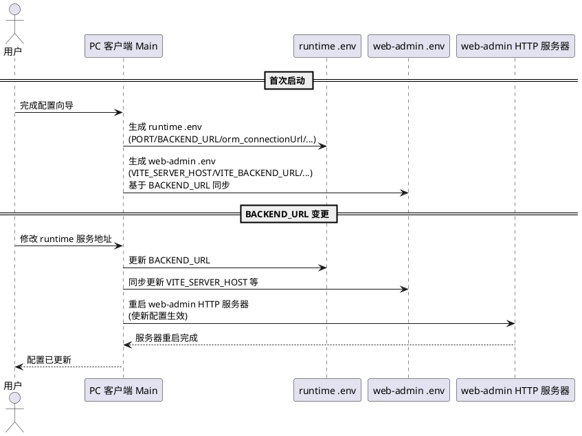

### **6.12.3 异常场景**

1. **runtime .env 文件损坏或缺失**
   a. 触发条件：runtime .env 文件不存在或格式错误
   b. 系统行为：通过 SDK 重新生成默认 runtime .env，提示用户重新配置
   c. 用户感知：提示"Runtime 配置文件异常，已恢复默认配置，请重新设置"

2. **web-admin .env 文件损坏或缺失**
   a. 触发条件：web-admin .env 文件不存在或格式错误
   b. 系统行为：根据当前 runtime .env 中的 BACKEND_URL 重新生成 web-admin .env
   c. 用户感知：提示"Web 管理界面配置文件异常，已自动修复"

3. **配置同步后 web-admin 连接失败**
   a. 触发条件：BACKEND_URL 变更后 web-admin 无法连接到新地址
   b. 系统行为：提示用户检查 runtime 状态和地址配置，提供回滚选项
   c. 用户感知：提示"配置更新后 Web 管理界面连接失败，请检查 Runtime 状态"

## **6.13 登录态共享**

### **6.13.1 业务规则**

1. **REQ-AUTH-01：登录态共享**：PC 客户端首页 iframe 加载 web-admin 的 aibuilder 页面，用户在 iframe 中完成登录（复用 web-admin 的登录功能），登录成功后 web-admin 通过 postMessage 通知 PC 客户端
   - PC 客户端首页 iframe 加载 web-admin 的 aibuilder 页面
   - 用户在 iframe 中完成登录（复用 web-admin 的登录功能，遵循原则 6）
   - 登录成功后，web-admin 通过 `window.parent.postMessage()` 通知 PC 客户端
   - PC 客户端渲染进程通过 `window.addEventListener('message', ...)` 监听登录状态变化
   - PC 客户端接收登录状态信息，包含：`access_token`（JWT 令牌）、用户信息（用户名、头像等）、权限信息（角色、权限列表）
   - PC 客户端根据登录状态控制导航和 UI（如未登录时显示登录提示，已登录时显示用户信息）
   - postMessage 消息格式定义：

     ```json
     {
       "type": "auth:loginStateChanged",
       "data": {
         "loggedIn": true,
         "accessToken": "eyJhbGciOiJIUzI1NiIs...",
         "userInfo": {
           "id": 1,
           "username": "admin",
           "avatar": "https://...",
           "roles": ["admin"],
           "permissions": ["*"]
         }
       }
     }
     ```

   a. 验收条件：[用户在 iframe 中完成登录] → [web-admin 通过 postMessage 发送登录状态，PC 客户端接收并更新 UI]
   b. 验收条件：[PC 客户端接收到登录状态] → [导航栏显示用户头像和用户名，所有导航项可正常使用]
   c. 验收条件：[用户未登录] → [导航栏显示登录提示，点击后 iframe 跳转到 web-admin 登录页面]
   d. 验收条件：[用户在 iframe 中退出登录] → [web-admin 通过 postMessage 发送登出状态，PC 客户端清除登录信息并更新 UI]

2. **REQ-AUTH-02：登录态持久化**：PC 客户端将 access_token 存储到 Electron 的 safeStorage 中，下次启动时自动恢复登录态，token 过期时引导用户重新登录
   - PC 客户端将 access_token 存储到 Electron 的 `safeStorage` API 中（使用操作系统级加密：Windows DPAPI）
   - 下次启动客户端时，自动从 safeStorage 读取 access_token 并验证有效性
   - token 有效时，自动恢复登录态，用户无需重新登录
   - token 过期或无效时，引导用户在 iframe 中重新登录（导航栏显示登录提示）
   - 用户主动退出登录时，清除 safeStorage 中存储的 access_token
   - PC 客户端将用户信息（用户名、头像、角色等）存储到本地配置中，用于启动时快速显示 UI（无需等待 iframe 加载）
   a. 验收条件：[用户登录成功后关闭并重启客户端] → [自动恢复登录态，导航栏显示用户信息，无需重新登录]
   b. 验收条件：[token 过期后启动客户端] → [导航栏显示登录提示，引导用户在 iframe 中重新登录]
   c. 验收条件：[用户点击退出登录] → [清除 safeStorage 中的 access_token，清除本地用户信息，导航栏显示登录提示]
   d. 验收条件：[safeStorage 中的 access_token 加密存储] → [配置文件和日志中不包含明文 access_token]

3. **postMessage 通信安全**：
   - PC 客户端监听 postMessage 时必须验证消息来源（`event.origin`），仅接受来自 aibuilder iframe 的消息
   - 消息类型必须包含 `type` 字段，PC 客户端仅处理已知的消息类型（`auth:loginStateChanged`）
   - 禁止将 access_token 传递给不受信任的 iframe 或外部页面
   a. 验收条件：[收到非 aibuilder 来源的 postMessage] → [PC 客户端忽略该消息]
   b. 验收条件：[收到未知类型的 postMessage] → [PC 客户端忽略该消息]

4. **登录态与 runtime API 调用**：
   - PC 客户端如需直接调用 runtime API（如健康检查、配置管理等非业务接口），使用 runtime 本地访问权限（`127.0.0.1`），无需 access_token
   - PC 客户端如需调用 runtime 业务 API（如技能管理、智能体管理等），应通过 iframe 中的 web-admin 进行，或使用 access_token 进行认证
   - 遵循原则 3：web 项目通过 runtime 的 API/CLI/SDK 操作 runtime
   a. 验收条件：[PC 客户端调用 runtime 健康检查 API] → [无需 access_token，直接调用]
   b. 验收条件：[PC 客户端调用 runtime 业务 API] → [使用 access_token 认证，或通过 iframe 中的 web-admin 进行]

5. **禁止项**：
   - 禁止 PC 客户端实现独立的登录界面（遵循原则 1 和原则 6）
   - 禁止 PC 客户端实现独立的用户注册功能（遵循原则 1）
   - 禁止将 access_token 明文写入配置文件或日志
   a. 验收条件：[PC 客户端] → [不包含独立登录页面和注册页面]
   b. 验收条件：[日志文件和配置文件] → [不包含明文 access_token]

### **6.13.2 交互流程**

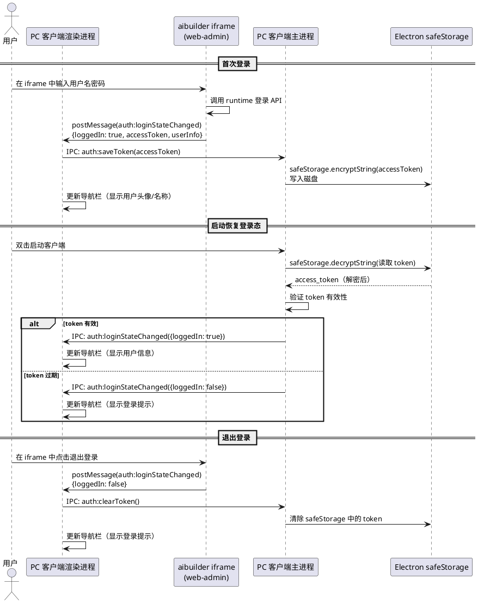

### **6.13.3 异常场景**

1. **postMessage 消息来源验证失败**
   a. 触发条件：收到非 aibuilder iframe 来源的 postMessage 消息
   b. 系统行为：忽略该消息，记录警告日志
   c. 用户感知：无感知，不影响正常使用

2. **access_token 存储失败**
   a. 触发条件：safeStorage API 不可用（如操作系统加密服务异常）
   b. 系统行为：降级到内存存储（本次会话有效，重启后需重新登录），提示用户
   c. 用户感知：系统通知"安全存储不可用，登录状态仅在本次会话有效"

3. **token 过期后 API 调用失败**
   a. 触发条件：PC 客户端使用过期 token 调用 runtime API
   b. 系统行为：runtime 返回 401 错误，PC 客户端清除过期 token，引导用户重新登录
   c. 用户感知：导航栏显示登录提示，系统通知"登录已过期，请重新登录"

4. **iframe 中 web-admin 登录页面加载失败**
   a. 触发条件：runtime 未启动或 aibuilder URL 不可达，无法加载登录页面
   b. 系统行为：显示 runtime 未启动提示，提供启动按钮
   c. 用户感知：首页显示"Runtime 未启动"提示 + 启动按钮

5. **safeStorage 解密失败**
   a. 触发条件：safeStorage 中存储的 token 数据损坏或操作系统加密密钥变更
   b. 系统行为：清除损坏的 token 数据，视为未登录状态
   c. 用户感知：导航栏显示登录提示，需重新登录

## **6.14 运行时环境依赖管理**

### **6.14.1 业务规则**

1. **REQ-DEP-01：OpenSSL 运行时依赖管理**：runtime 在 Windows 上需要 OpenSSL 库支持 WebSocket 通信，PC 客户端应确保 OpenSSL 依赖就绪
   - PC 客户端启动时检测系统是否已安装 OpenSSL（检查 PATH 中是否包含 libssl/libcrypto DLL，或检查 runtime bin 目录中是否包含 OpenSSL DLL）
   - 如系统已安装 OpenSSL 且 runtime 可正常加载，无需额外操作
   - 如系统未安装 OpenSSL，PC 客户端自动安装或内置 OpenSSL DLL 到 runtime 的 bin 目录
   - 内置方式：将 OpenSSL DLL（libssl-x.dll、libcrypto-x.dll 等）打包到安装包的 `openssl/` 目录，安装时复制到 runtime 的 bin 目录
   - 确保 runtime 的 PATH 中包含 OpenSSL DLL 所在目录（通过设置 PATH 环境变量或将 DLL 放置在 runtime 可加载的位置）
   - 支持手动指定 OpenSSL DLL 路径（高级设置）
   a. 验收条件：[Windows 系统未安装 OpenSSL 时启动客户端] → [自动检测并安装/配置 OpenSSL 依赖，runtime 正常启动]
   b. 验收条件：[Windows 系统已安装 OpenSSL 时启动客户端] → [检测到 OpenSSL 已就绪，无需额外操作]
   c. 验收条件：[OpenSSL 安装/配置失败] → [提示用户手动安装 OpenSSL 或检查配置]

2. **REQ-DEP-02：运行时环境依赖管理**：PC 客户端负责确保 runtime 运行所需的全部桌面端环境依赖
   - PC 客户端负责管理的运行时环境依赖包括：
     - **PostgreSQL 数据库**：内置 PostgreSQL 二进制分发包，由 PC 客户端管理初始化/启停
     - **OpenSSL 库**：Windows 上 runtime WebSocket 通信所需的加密库
     - **SSL 证书**：runtime HTTPS 模式所需的证书文件（由 runtime .env 管理，PC 客户端不直接管理）
   - 一键式安装和整合所有依赖：用户安装 PC 客户端后，所有运行时环境依赖应自动就绪，无需用户手动安装
   - 依赖检测：PC 客户端启动时自动检测所有运行时依赖是否就绪，未就绪的依赖自动安装或配置
   - 依赖状态展示：在系统设置或 Runtime 监控页面展示运行时环境依赖的状态（就绪/未就绪/异常）
   a. 验收条件：[全新 Windows 机器安装并启动客户端] → [所有运行时环境依赖自动就绪，runtime 可正常启动]
   b. 验收条件：[依赖检测页面] → [展示 PostgreSQL、OpenSSL 等依赖的就绪状态]
   c. 验收条件：[某个依赖异常] → [提供修复选项（重新安装/重新配置）]

3. **依赖检测时机**：PC 客户端在以下时机检测运行时环境依赖：
   - 客户端启动时（在启动 runtime 之前）
   - runtime 启动失败时（自动检测是否因依赖缺失导致）
   - 用户手动触发依赖检测时（在设置界面提供"检查环境"按钮）
   a. 验收条件：[客户端启动] → [在启动 runtime 前自动检测所有依赖]
   b. 验收条件：[runtime 启动失败] → [自动检测依赖状态，提示缺失的依赖]

4. **禁止项**：
   - 禁止要求用户手动安装运行时依赖（遵循"开箱即用"原则）
   - 禁止在依赖缺失时静默忽略（必须提示用户并提供修复选项）
   a. 验收条件：[依赖缺失] → [PC 客户端提示用户并提供自动修复选项，不静默忽略]

### **6.14.2 交互流程**

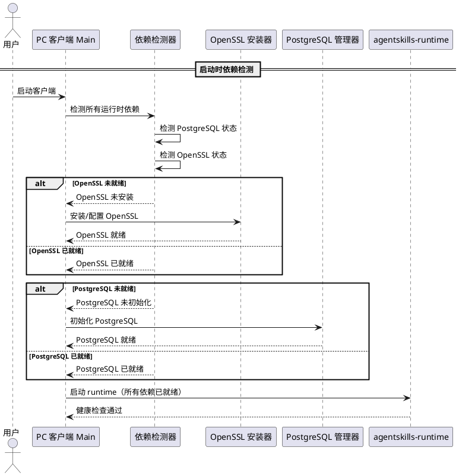

### **6.14.3 异常场景**

1. **OpenSSL 安装失败**
   a. 触发条件：OpenSSL DLL 复制失败（磁盘空间不足、权限不足等）
   b. 系统行为：显示安装失败提示，提供重试选项和手动下载链接
   c. 用户感知：显示"OpenSSL 运行时依赖安装失败"提示 + 重试按钮 + 手动下载链接

2. **OpenSSL 版本不兼容**
   a. 触发条件：系统已安装的 OpenSSL 版本与 runtime 不兼容
   b. 系统行为：提示用户版本不兼容，提供内置兼容版本 OpenSSL 安装选项
   c. 用户感知：显示"系统 OpenSSL 版本不兼容"提示 + 安装内置版本按钮

3. **运行时依赖检测超时**
   a. 触发条件：依赖检测过程中某个步骤长时间无响应
   b. 系统行为：超时后跳过该依赖检测，标记为"未知"状态，继续启动流程
   c. 用户感知：依赖状态显示"未知"，runtime 尝试启动

4. **runtime 因依赖缺失启动失败后自动修复**
   a. 触发条件：runtime 启动失败，错误信息表明缺少 OpenSSL DLL
   b. 系统行为：自动触发 OpenSSL 依赖检测和安装，安装完成后重试启动 runtime
   c. 用户感知：显示"正在修复运行时依赖"提示，修复完成后 runtime 正常启动

---

# **7. 数据约束**

## **7.1 客户端配置文件**

**存储位置**：`%APPDATA%/agentskills/config.json`

1. **setupCompleted**：`boolean`，是否完成首次配置向导，默认 `false`
2. **runtime.port**：`number`，runtime 监听端口，默认 `8080`
3. **runtime.host**：`string`，runtime 监听地址，默认 `"127.0.0.1"`
4. **runtime.autoStart**：`boolean`，客户端启动时是否自动启动 runtime，默认 `true`
5. **runtime.autoRestart**：`boolean`，runtime 崩溃时是否自动重启，默认 `true`
6. **ai.defaultProvider**：`string`，默认 AI 提供商，默认 `""`
7. **ai.apiKeyEncrypted**：`string (encrypted)`，加密存储的 AI API Key
8. **pgsql.mode**：`"embedded" | "external"`，数据库模式，默认 `"embedded"`
9. **pgsql.embedded.port**：`number`，内置 PostgreSQL 端口，默认 `5432`
10. **pgsql.embedded.dataDir**：`string`，内置 PostgreSQL 数据目录，默认 `"%APPDATA%/agentskills/pgdata/"`
11. **pgsql.embedded.passwordEncrypted**：`string (encrypted)`，内置 PostgreSQL uctoo 用户密码（加密存储）
12. **pgsql.embedded.autoBackup**：`boolean`，是否启用自动备份，默认 `true`
13. **pgsql.embedded.backupDir**：`string`，备份文件存储目录，默认 `"%APPDATA%/agentskills/backups/"`
14. **pgsql.external.host**：`string`，外部 PostgreSQL 主机地址，默认 `""`
15. **pgsql.external.port**：`number`，外部 PostgreSQL 端口，默认 `5432`
16. **pgsql.external.user**：`string`，外部 PostgreSQL 用户名，默认 `""`
17. **pgsql.external.passwordEncrypted**：`string (encrypted)`，外部 PostgreSQL 密码（加密存储）
18. **pgsql.external.database**：`string`，外部 PostgreSQL 数据库名，默认 `"uctoo"`
19. **proxy.enabled**：`boolean`，是否启用代理，默认 `false`
20. **proxy.type**：`"http" | "socks5"`，代理类型，默认 `"http"`
21. **proxy.host**：`string`，代理主机，默认 `""`
22. **proxy.port**：`number`，代理端口，默认 `0`
23. **ui.autoLaunch**：`boolean`，开机自启，默认 `false`
24. **ui.minimizeToTray**：`boolean`，关闭时最小化到托盘，默认 `true`
25. **ui.language**：`"zh-CN" | "en-US"`，界面语言，默认 `"zh-CN"`
26. **ui.navWidth**：`number`，左侧导航栏宽度（px），默认 `220`
27. **ui.navCollapsed**：`boolean`，导航栏是否折叠（图标模式），默认 `false`
28. **update.autoCheck**：`boolean`，自动检查更新，默认 `true`
29. **update.channel**：`"stable" | "beta"`，更新通道，默认 `"stable"`
30. **auth.loggedIn**：`boolean`，用户是否已登录，默认 `false`
31. **auth.userInfo**：`object | null`，用户信息（用户名、头像、角色等），默认 `null`
32. **auth.tokenStorageReady**：`boolean`，safeStorage 是否可用，默认 `true`
33. **dep.openSSLBundled**：`boolean`，是否已内置 OpenSSL DLL，默认 `false`
34. **dep.openSSLPath**：`string`，OpenSSL DLL 路径（如内置），默认 `""`

## **7.2 Runtime 配置文件（.env）**

**存储位置**：runtime 集成目录下 `.env` 文件（`%APPDATA%/agentskills/runtime/.env`），由 PC 客户端在 runtime 压缩包解压后基于 `.env.example` 自动生成

客户端通过配置向导生成 `.env` 文件，关键配置项：

1. **orm_connectionUrl**：数据库连接串，由 PC 客户端根据 PostgreSQL 配置自动生成
   - 内置模式：`postgresql://uctoo:<password>@127.0.0.1:5432/uctoo`
   - 外部模式：`postgresql://<user>:<password>@<host>:<port>/<database>`
2. **HOST**：runtime 监听地址，默认 `0.0.0.0`
3. **PORT**：runtime 监听端口，默认 `8080`
4. **BACKEND_URL**：runtime 外部访问地址，决定 HTTP/HTTPS 模式，默认 `http://localhost:8080`
5. **CERT_FILE_NAME**：SSL 证书文件路径（BACKEND_URL 为 https 时需要）
6. **KEY_FILE_NAME**：SSL 密钥文件路径（BACKEND_URL 为 https 时需要）
7. **AUTH_CORE_SECRET**：JWT 密钥，首次生成后持久化
8. **SOPHNET_API_KEY** 等：AI 模型 API Key，由配置向导生成
9. **SKILL_INSTALL_PATH**：技能安装路径，默认 `%APPDATA%/agentskills/skills/`
10. **其余配置**：采用 runtime 默认值

## **7.3 web-admin 配置文件（.env）**

**存储位置**：web-admin 项目根目录 `.env` 文件（`web-admin/web/.env`）

PC 客户端负责生成和更新 web-admin .env 文件，关键配置项：

1. **VITE_CONTEXT**：应用上下文路径，默认 `/vue-pro/`
2. **VITE_SERVER_HOST**：runtime API 地址，来源于 runtime 的 `BACKEND_URL`，默认 `http://localhost:8080`
3. **VITE_BACKEND_URL**：后端 API URL，来源于 runtime 的 `BACKEND_URL`，默认 `http://localhost:8080`
4. **VITE_WS_URL**：WebSocket/MCP 地址，来源于 `BACKEND_URL` + `/api/v1/uctoo/webmcp/mcp`，默认 `http://localhost:8080/api/v1/uctoo/webmcp/mcp`
5. **VITE_OPENAI_BASE_URL**：LLM API 地址（通过 WebMCP），来源于 `BACKEND_URL` + `/api/v1/uctoo/webmcp/mcp`，默认 `http://localhost:8080/api/v1/uctoo/webmcp/mcp`
6. **VITE_OPENAI_API_KEY**：占位 API Key，默认 `sk-dummy-key`（实际 API Key 通过 runtime 代理使用）
7. **VITE_AGENT_ROOT**：后端根地址，来源于 runtime 的 `BACKEND_URL`，默认 `http://localhost:8080`
8. **VITE_MOCK_HOST**：Mock 服务地址，来源于 runtime 的 `BACKEND_URL`，默认 `http://localhost:8080`
9. **VITE_MOCK_SERVER_HOST**：Mock 服务地址，来源于 runtime 的 `BACKEND_URL`，默认 `http://localhost:8080`

**配置同步规则**：当 runtime 的 `BACKEND_URL` 变更时，VITE_SERVER_HOST、VITE_BACKEND_URL、VITE_WS_URL、VITE_OPENAI_BASE_URL、VITE_AGENT_ROOT、VITE_MOCK_HOST、VITE_MOCK_SERVER_HOST 必须同步更新。

## **7.4 PostgreSQL 数据目录**

**存储位置**：`%APPDATA%/agentskills/pgdata/`（默认，可配置）

1. **数据目录**：PostgreSQL 数据集群目录（initdb 生成），包含数据库文件、配置文件（postgresql.conf、pg_hba.conf）
2. **日志文件**：PostgreSQL 运行日志，存储在数据目录下 `log/` 子目录
3. **WAL 日志**：事务日志，存储在数据目录下 `pg_wal/` 子目录

## **7.5 数据库备份文件**

**存储位置**：`%APPDATA%/agentskills/backups/`（默认，可配置）

1. **备份文件格式**：PostgreSQL 自定义格式归档（`-Fc`），文件扩展名 `.backup`
2. **文件命名规则**：`uctoo_YYYYMMDD_HHmmss.backup`
3. **自动备份保留策略**：保留最近 7 天的备份文件，自动清理过期备份

## **7.6 日志数据**

**存储位置**：`%APPDATA%/agentskills/logs/`

1. **main.log**：Electron 主进程日志，单文件 ≤ 10MB，保留 7 天
2. **renderer.log**：渲染进程日志，同上
3. **runtime.log**：runtime 进程 stdout/stderr，同上
4. **pgsql.log**：PostgreSQL 运行日志（通过 pg_ctl -l 参数指定），同上

## **7.7 临时数据**

1. **runtime 压缩包解压临时文件**：`%APPDATA%/agentskills/temp/runtime-extract/`，解压完成后删除临时文件
2. **runtime 降级下载临时文件**：`%APPDATA%/agentskills/temp/download/`，仅当压缩包解压失败降级到 SDK downloadRuntime() 时使用，下载完成后删除
3. **Electron 缓存**：`%APPDATA%/agentskills/cache/`，随客户端生命周期

## **7.8 登录态数据**

1. **access_token**：存储在 Electron safeStorage 中（加密），使用操作系统级加密（Windows DPAPI）
2. **用户信息**：存储在 config.json 的 `auth.userInfo` 字段中（用户名、头像、角色等非敏感信息）
3. **登录状态**：存储在 config.json 的 `auth.loggedIn` 字段中（boolean）

## **7.9 数据安全要求**

1. **API Key 加密存储**：使用 `electron-store` + `safeStorage` API 加密
2. **数据库密码加密存储**：PostgreSQL 用户密码使用 `safeStorage` API 加密存储在 config.json 中
3. **access_token 加密存储**：使用 Electron `safeStorage` API 加密存储，不明文写入配置文件或日志
4. **日志脱敏**：日志中不输出 API Key、数据库密码、access_token 等敏感信息
5. **本地访问限制**：runtime 默认监听 `127.0.0.1`，内置 PostgreSQL 默认监听 `127.0.0.1`，仅本地可访问
6. **备份文件安全**：备份文件包含完整数据库数据，存储在用户数据目录下，受操作系统文件权限保护
7. **postMessage 安全**：监听 postMessage 时验证消息来源（origin），防止跨站消息伪造

---

# **8. 约束条件**

## **8.1 技术约束**

| 约束项 | 约束内容 | 理由 |
|--------|---------|------|
| 技术栈 | Electron + Vue 3 + TypeScript | 最大化复用现有基础设施 |
| 构建工具 | electron-vite | Vite 生态，HMR 快，与现有 Vite 配置一致 |
| 打包工具 | electron-builder | 支持 NSIS/DMG/AppImage，社区标准 |
| SDK | `@opencangjie/skills`（Node.js SDK） | 现有 SDK，Electron 主进程原生集成 |
| 前端框架 | Vue 3 + OpenTiny Vue + Pinia ORM | 复用 web-admin/web 现有前端代码 |
| IPC 安全 | contextBridge + preload，contextIsolation: true | Electron 安全最佳实践 |
| 路由模式 | vue-router hash 模式 | Electron 加载本地文件不支持 history 模式 |
| 导航布局 | 左侧竖向常驻导航栏 | 桌面客户端标准 UI 模式 |
| 图标方案 | SVG 图标或统一图标字体库 | 确保图标风格统一和可维护性 |
| Runtime 管理 | 通过 `@opencangjie/skills` SDK | 不直接 spawn runtime 二进制（除 SDK 未覆盖场景） |
| 数据库 | PostgreSQL（内置二进制分发包） | runtime 依赖 PostgreSQL 数据库，openGauss 驱动兼容 PostgreSQL 协议 |
| 登录态共享 | iframe postMessage + Electron safeStorage | 复用 web-admin 登录功能，安全存储 token |
| 运行时依赖 | 内置 OpenSSL DLL + PostgreSQL 二进制 | 确保 runtime 运行所需桌面端环境一键就绪 |

## **8.2 复用约束**

| 复用对象 | 来源 | 复用方式 | 改动量约束 |
|---------|------|---------|-----------|
| Vue 前端代码 | `web-admin/web/src/` | monorepo workspace 或 git submodule | 仅适配 API baseURL 和 IPC 调用 |
| Pinia ORM 模型 | `web-admin/web/src/store/models/` | 同上 | 无改动 |
| OpenTiny Vue 组件 | npm 包 | 直接依赖 | 无改动 |
| `@opencangjie/skills` SDK | npm 包 | 直接依赖 | 无改动 |
| runtime 二进制 | `apps/agentskills-runtime/release/agentskills-runtime-win-x64.tar.gz` | 安装包内嵌压缩包，首次启动时解压到用户数据目录 | 无改动 |
| aibuilder 模块 | `web-admin/web` 的 aibuilder 视图 | PC 客户端内置 HTTP 服务器托管构建产物，iframe 加载 | 无改动 |
| web-admin 构建产物 | `web-admin/web` 的 `pnpm build` 输出 | 嵌入 PC 客户端，由内置 HTTP 服务器托管 | 无改动 |
| PostgreSQL 二进制 | 开源 PostgreSQL 分发包 | 预置到安装包 `pgsql/` 目录 | 无改动 |
| SQL 初始化脚本 | uctoo 数据库 Schema + 初始数据 | 预置到安装包 `sql/` 目录 | 无改动 |
| OpenSSL DLL | 开源 OpenSSL 二进制分发包 | 预置到安装包 `openssl/` 目录，安装时复制到 runtime bin 目录 | 无改动 |
| web-admin 登录功能 | `web-admin/web` 的登录模块 | iframe 中复用，通过 postMessage 共享登录态 | web-admin 需新增 postMessage 发送逻辑 |

## **8.3 体积约束**

| 组件 | 体积估算 | 说明 |
|------|---------|------|
| Electron 壳（Chromium + Node.js） | ~80-100MB | 压缩后 |
| Vue 前端构建产物 | ~5-10MB | asar 打包 |
| runtime 发布版压缩包 | ~380MB | agentskills-runtime-win-x64.tar.gz（解压后约 1.27GB） |
| PostgreSQL 二进制分发包 | ~50MB | initdb/pg_ctl/postgres/pg_dump 等 |
| SQL 初始化脚本 | ~5MB | uctoov4InitData.sql |
| 默认配置和资源 | ~5MB | .env.default + 图标 |
| web-admin 构建产物 | ~5-10MB | Vue 3 构建输出 |
| OpenSSL DLL | ~5-10MB | libssl/libcrypto 等 |
| **安装包总计（压缩前）** | **~535-575MB** | 含 runtime 压缩包 |
| **安装包总计（electron-builder maximum 压缩后）** | **~600-800MB** | NSIS 安装包实际体积 |
| **安装后磁盘占用** | **~2GB** | 含 runtime 解压后 ~1.27GB + PostgreSQL ~100MB + Electron + 其他 ~630MB |

## **8.4 不做的事项（Out of Scope）**

| 不做的事项 | 理由 |
|-----------|------|
| 独立 SSL 证书配置界面 | runtime 的 .env 文件管理 SSL，用户可直接编辑 .env |
| 独立登录界面 | 遵循"PC 客户端是壳"原则，登录复用 web-admin 登录功能 |
| 独立用户注册功能 | 遵循"PC 客户端是壳"原则，注册由 web-admin 提供 |
| SQLite 数据库支持 | 兼容性风险高，作为 v2 演进方向 |
| Tauri 方案 | 首版优先 Electron 快速交付，Tauri 作为 v2 轻量化方向 |
| macOS/Linux 支持（首版） | 首版聚焦 Windows，跨平台作为后续里程碑 |
| 多用户/多租户 | 面向 toC 个人用户，单用户场景 |
| 云端同步 | 首版不支持配置和数据的云端同步 |
| 导航栏可拖拽调整宽度 | 首版固定宽度，可调整宽度作为后续优化 |
| 暗色主题 | 首版仅支持亮色主题，暗色主题作为后续优化 |
| 外部 PostgreSQL 实例的运维管理 | PC 客户端仅负责连接配置和测试，不负责外部实例的启停/备份 |
| NestJS 安装服务集成 | PC 客户端不启动独立 NestJS 进程，安装逻辑由 Electron Main Process 承担 |
| 修改 runtime 架构或接口 | 遵循原则 4，runtime 按已有架构持续迭代 |
| 精简版安装包（不含 runtime） | v2.5 起统一为包含 runtime 压缩包的完整安装包，不再提供精简版，以确保开箱即用体验 |

---

# **9. 接口需求**

## **9.1 外部接口**

### **9.1.1 agentskills-runtime RESTful API**

客户端通过 HTTP 调用 runtime 的 RESTful API（默认本地 `http://127.0.0.1:{port}`）：

| 接口 | 方法 | 用途 | 调用方 |
|------|------|------|--------|
| `/api/v1/uctoo/health` | GET | 健康检查 | Main Process（定时轮询） |
| `/api/v1/uctoo/hello` | GET | 获取 runtime 版本信息 | Main Process（版本检测） |
| `/api/v1/uctoo/config` | GET/PUT | 系统配置管理 | Renderer（通过 IPC 代理） |
| `/api/v1/uctoo/skills` | GET/POST | 技能管理 | Renderer（通过 IPC 代理） |
| `/api/v1/uctoo/agents` | GET/POST | 智能体管理 | Renderer（通过 IPC 代理） |
| `/api/v1/uctoo/auth/login` | POST | 用户登录 | iframe 中 web-admin |
| `/api/v1/uctoo/auth/logout` | POST | 用户退出登录 | iframe 中 web-admin |
| `/api/v1/uctoo/auth/refresh` | POST | 刷新 token | iframe 中 web-admin |
| `/api/v1/uctoo/webmcp/mcp` | WS/SSE | MCP/WebSocket 接口 | web-admin 前端（通过 VITE_WS_URL 配置） |
| WebSocket Chat | WS | AI 对话 | Renderer（直连） |
| MCP Server | Stdio/SSE | 模型上下文协议 | 外部 MCP 客户端 |

> **注意**：runtime 不提供 web-admin 静态资源服务（runtime < 0.0.26），`/vue-pro/aibuilder` 路径由 PC 客户端内置的 web-admin HTTP 服务器提供，而非 runtime。runtime ≥ 0.0.26 时由 runtime 静态文件服务提供。

### **9.1.2 web-admin HTTP 服务器接口**

PC 客户端内置的 web-admin HTTP 服务器提供以下接口：

| 接口 | 方法 | 用途 | 调用方 |
|------|------|------|--------|
| `/vue-pro/aibuilder` | GET | AI Builder 页面 | Renderer（首页 iframe 直连） |
| `/vue-pro/*` | GET | web-admin 静态资源 | Renderer（iframe 内资源加载） |

> **说明**：web-admin HTTP 服务器由 Electron Main Process 启动和管理，与 runtime 完全独立。默认端口 3031。

### **9.1.3 PostgreSQL 命令行接口**

客户端通过子进程调用 PostgreSQL 可执行文件管理内置数据库实例：

| 命令 | 用途 | 调用方 |
|------|------|--------|
| `initdb` | 初始化数据库集群 | Main Process（首次启动） |
| `pg_ctl start/stop/status` | 启停 PostgreSQL 服务 | Main Process（生命周期管理） |
| `createdb` | 创建 uctoo 数据库 | Main Process（首次启动） |
| `psql` | 执行 SQL 脚本导入 | Main Process（首次启动） |
| `pg_dump` | 数据库备份 | Main Process（备份功能） |
| `pg_restore` | 数据库恢复 | Main Process（恢复功能） |

### **9.1.4 AI 模型提供商 API**

客户端通过 runtime 间接调用 AI 模型 API，不直接调用。配置向导中需验证 API Key 有效性时，通过 runtime 的配置验证接口代理。

### **9.1.5 自动更新服务**

| 接口 | 协议 | 用途 |
|------|------|------|
| GitHub Releases API | HTTPS | 获取最新版本信息和下载链接 |
| 静态文件服务器 | HTTPS | 下载更新包和差量文件 |

### **9.1.6 iframe postMessage 通信接口**

PC 客户端渲染进程与 iframe 中 web-admin 页面之间的通信接口：

| 消息类型 | 方向 | 数据格式 | 用途 |
|---------|------|---------|------|
| `auth:loginStateChanged` | web-admin → PC 客户端 | `{ loggedIn: boolean, accessToken?: string, userInfo?: object }` | 登录状态变更通知 |

> **说明**：PC 客户端通过 `window.addEventListener('message', ...)` 监听 iframe 发送的消息，必须验证 `event.origin`。

## **9.2 内部接口**

### **9.2.1 Electron IPC 接口**

渲染进程与主进程通过 Electron IPC 通信，接口定义见 6.11 节。

**PostgreSQL 管理 IPC 接口**：

| IPC 通道 | 方向 | 签名 | 用途 |
|---------|------|------|------|
| `pgsql:init` | Renderer → Main | `() → IPCResult<PgsqlInitResult>` | 初始化内置 PostgreSQL（initdb → 配置 → createdb → 导入 SQL） |
| `pgsql:start` | Renderer → Main | `() → IPCResult<boolean>` | 启动内置 PostgreSQL 服务 |
| `pgsql:stop` | Renderer → Main | `() → IPCResult<boolean>` | 停止内置 PostgreSQL 服务 |
| `pgsql:status` | Renderer → Main | `() → IPCResult<PgsqlStatusResult>` | 查询 PostgreSQL 运行状态 |
| `pgsql:backup` | Renderer → Main | `(options?: { path?: string }) → IPCResult<PgsqlBackupResult>` | 备份数据库 |
| `pgsql:restore` | Renderer → Main | `(options: { path: string }) → IPCResult<boolean>` | 从备份恢复数据库 |
| `pgsql:testConnection` | Renderer → Main | `(config: ExternalPgsqlConfig) → IPCResult<PgsqlTestResult>` | 测试外部 PostgreSQL 连接 |
| `pgsql:stateChanged` | Main → Renderer | `(status: PgsqlStatusResult)` | PostgreSQL 状态变更推送 |

**PostgreSQL IPC 类型定义**：

- **PgsqlInitResult**：`{ success: boolean; step: string; error?: string; dataDir: string }`
- **PgsqlStatusResult**：`{ running: boolean; pid?: number; port?: number; dataDir?: string; mode: "embedded" | "external"; connections?: number; dbSize?: string }`
- **PgsqlBackupResult**：`{ success: boolean; path: string; size: number; error?: string }`
- **PgsqlTestResult**：`{ success: boolean; error?: string; databaseExists: boolean; version?: string }`
- **ExternalPgsqlConfig**：`{ host: string; port: number; user: string; password: string; database: string }`

**web-admin HTTP 服务器 IPC 接口**：

| IPC 通道 | 方向 | 签名 | 用途 |
|---------|------|------|------|
| `webadmin:start` | Renderer → Main | `() → IPCResult<WebAdminStartResult>` | 启动 web-admin HTTP 服务器 |
| `webadmin:stop` | Renderer → Main | `() → IPCResult<boolean>` | 停止 web-admin HTTP 服务器 |
| `webadmin:status` | Renderer → Main | `() → IPCResult<WebAdminStatusResult>` | 查询 web-admin HTTP 服务器状态 |
| `webadmin:stateChanged` | Main → Renderer | `(status: WebAdminStatusResult)` | web-admin HTTP 服务器状态变更推送 |

**web-admin HTTP 服务器 IPC 类型定义**：

- **WebAdminStartResult**：`{ success: boolean; port: number; error?: string }`
- **WebAdminStatusResult**：`{ running: boolean; port?: number; url?: string; error?: string }`

**双 .env 配置同步 IPC 接口**：

| IPC 通道 | 方向 | 签名 | 用途 |
|---------|------|------|------|
| `envsync:syncWebAdminEnv` | Renderer → Main | `() → IPCResult<EnvSyncResult>` | 根据 runtime .env 的 BACKEND_URL 同步更新 web-admin .env |
| `envsync:getRuntimeEnv` | Renderer → Main | `(keys?: string[]) → IPCResult<Record<string, string>>` | 获取 runtime .env 中的指定配置项 |
| `envsync:getWebAdminEnv` | Renderer → Main | `(keys?: string[]) → IPCResult<Record<string, string>>` | 获取 web-admin .env 中的指定配置项 |

**双 .env 配置同步 IPC 类型定义**：

- **EnvSyncResult**：`{ success: boolean; updatedKeys: string[]; error?: string }`

**登录态共享 IPC 接口**：

| IPC 通道 | 方向 | 签名 | 用途 |
|---------|------|------|------|
| `auth:loginStateChanged` | Main → Renderer | `(state: AuthState)` | 登录状态变更推送（来自 iframe postMessage） |
| `auth:getToken` | Renderer → Main | `() → IPCResult<string>` | 获取存储的 access_token（解密后） |
| `auth:saveToken` | Renderer → Main | `(token: string) → IPCResult<boolean>` | 保存 access_token 到 safeStorage |
| `auth:clearToken` | Renderer → Main | `() → IPCResult<boolean>` | 清除 safeStorage 中的 access_token |
| `auth:getUserInfo` | Renderer → Main | `() → IPCResult<UserInfo>` | 获取本地存储的用户信息 |

**登录态共享 IPC 类型定义**：

- **AuthState**：`{ loggedIn: boolean; accessToken?: string; userInfo?: UserInfo }`
- **UserInfo**：`{ id: number; username: string; avatar?: string; roles: string[]; permissions: string[] }`

**运行时依赖管理 IPC 接口**：

| IPC 通道 | 方向 | 签名 | 用途 |
|---------|------|------|------|
| `dep:checkOpenSSL` | Renderer → Main | `() → IPCResult<DepCheckResult>` | 检测 OpenSSL 依赖是否就绪 |
| `dep:installOpenSSL` | Renderer → Main | `() → IPCResult<DepInstallResult>` | 安装 OpenSSL 依赖 |
| `dep:checkAll` | Renderer → Main | `() → IPCResult<AllDepCheckResult>` | 检测所有运行时依赖是否就绪 |

**运行时依赖管理 IPC 类型定义**：

- **DepCheckResult**：`{ ready: boolean; name: string; version?: string; path?: string; error?: string }`
- **DepInstallResult**：`{ success: boolean; name: string; version?: string; path?: string; error?: string }`
- **AllDepCheckResult**：`{ dependencies: DepCheckResult[]; allReady: boolean }`

**IPC 安全要求**：
- 所有 IPC 通道通过 `contextBridge.exposeInMainWorld` 注册
- 渲染进程无法直接访问 Node.js API
- IPC 调用需参数校验，防止注入攻击

### **9.2.2 `@opencangjie/skills` SDK 接口**

Main Process 通过 SDK 管理运行时：

| SDK 方法/CLI | 用途 |
|-------------|------|
| `npx skills install-runtime` / `downloadRuntime()` | 下载并安装 runtime 二进制发行版（v2.5 起降级为版本升级和压缩包解压失败时的修复方案） |
| `npx skills start` | 启动 runtime 进程 |
| `npx skills stop` | 停止 runtime 进程 |
| `npx skills status` | 查询 runtime 状态 |
| `RuntimeManager`（编程 API） | 下载、安装、启动、停止 runtime（v2.5 起 downloadRuntime() 主要用于版本升级和降级修复） |
| `SkillsClient`（编程 API） | 技能管理（安装、搜索、执行） |

---

# **10. 开发规范引用**

PC 客户端开发应遵循以下项目规范文档：

| 规范文档 | 路径 | 适用范围 |
|---------|------|---------|
| 模块开发指南 | `apps/agentskills-runtime/docs/uctoo-v4/uctoo-v4-module-development.md` | runtime 模块开发流程、CRUD 代码生成、数据库变更规范 |
| API 规范 | `apps/agentskills-runtime/docs/uctoo-v4/uctoo-v4-api-specification.md` | runtime RESTful API 设计规范、接口命名约定 |
| 数据库设计规范 | `apps/agentskills-runtime/docs/uctoo-v4/uctoo-database-design-specification.md` | PostgreSQL 数据库表设计、命名规范、DDL 变更流程 |
| 架构规范 | `apps/agentskills-runtime/docs/uctoo-v4/uctoo-v4-architecture.md` | 三层架构（Controllers → Services → Models）、UMI 全栈模型同构设计 |
| 用户权限系统 | `apps/agentskills-runtime/docs/uctoo-v4/user-permission-system.md` | RBAC3 权限体系、角色权限模型、通配符权限设计 |

> **重要**：PC 客户端开发应严格遵循上述规范文档中定义的架构和接口约定。当 PC 客户端需要直接调用 runtime API 时，应参考 API 规范和架构规范；当 PC 客户端需要理解用户权限模型时，应参考用户权限系统文档。

---

# **11. 里程碑规划**

| 里程碑 | 目标 | 工期 | 核心能力覆盖 |
|--------|------|------|-------------|
| M1 基础骨架 | Electron + Vue 3 最小可用骨架 + 左侧导航布局 | 2 周 | 6.7, 6.8, 6.11 |
| M2 Runtime 集成 | 通过 SDK 管理 runtime 生命周期 + 首页 aibuilder 加载 | 2 周 | 6.5, 6.6, 6.11 |
| M3 PostgreSQL 集成 | 内置 PostgreSQL 初始化/启停/备份恢复 + 外部连接配置 + .env 自动更新 | 2 周 | 6.4 |
| M4 web-admin 集成 | 内置 HTTP 服务器托管 web-admin + 双 .env 配置同步 | 1.5 周 | 6.6, 6.12 |
| M5 登录态共享 | iframe 登录复用 + postMessage 通信 + safeStorage 持久化 | 1.5 周 | 6.13 |
| M6 运行时依赖管理 | OpenSSL 依赖检测/安装 + 一键式环境依赖整合 | 1 周 | 6.14 |
| M7 配置向导 | 首次启动向导化配置（4 步：欢迎→AI Key→数据库→完成） | 1 周 | 6.3 |
| M8 系统集成 | 系统托盘、通知、窗口管理、单实例锁、开机自启 | 1.5 周 | 6.9 |
| M9 自动更新 | 客户端和 runtime 自动更新 | 1 周 | 6.10 |
| M10 打包分发 | NSIS 安装包构建、体积优化（含 PostgreSQL 二进制 + OpenSSL DLL） | 1 周 | 6.1 |
| M11 体验打磨 | toC 产品体验标准、异常处理完善 | 1 周 | 全模块 |
| M12 跨平台（可选） | macOS、Linux 支持 | 2 周 | DFX 兼容性扩展 |

**首版（Windows）预计 15.5 周**，含跨平台 17.5 周。

> **v2.4 里程碑变化说明**：相比 v2.3，新增 M5 登录态共享里程碑（1.5 周）和 M6 运行时依赖管理里程碑（1 周），原 M5-M9 依次后移为 M7-M11。总工期从 13 周调整为 15.5 周。

---

# **12. 验收标准**

## **12.1 核心验收场景**

| 编号 | 场景 | 预期结果 |
|------|------|---------|
| AC-01 | 全新 Windows 机器，双击安装包 | 安装成功，桌面出现图标，无需预装任何软件，安装包包含 runtime 压缩包 |
| AC-02 | 双击桌面图标启动 | 自动解压 runtime 集成包（首次启动），初始化/启动 PostgreSQL，通过 SDK 启动 runtime，检测并安装运行时依赖，显示主界面 |
| AC-03 | 首次启动进入配置向导 | 4 步向导完成，配置 AI Key 和数据库（内置/外部） |
| AC-04 | 向导选择内置 PostgreSQL 并完成 | 自动初始化 PostgreSQL（initdb → 配置 → createdb → 导入 SQL），runtime .env 中 orm_connectionUrl 自动更新 |
| AC-05 | 向导选择外部 PostgreSQL 并完成 | 测试连接成功，runtime .env 中 orm_connectionUrl 自动更新为外部连接串 |
| AC-06 | 向导完成后进入主界面 | 左侧导航栏常驻，首页通过 iframe 加载 web 应用首页（来自内置 HTTP 服务器） |
| AC-07 | 关闭主窗口 | 最小化到系统托盘，runtime、PostgreSQL、web-admin HTTP 服务器继续运行 |
| AC-08 | 托盘右键退出 | 优雅停止 runtime、PostgreSQL 和 web-admin HTTP 服务器，客户端退出 |
| AC-09 | runtime 崩溃 | 自动重启，通知用户，主界面显示恢复状态 |
| AC-10 | PostgreSQL 异常停止 | 系统通知提醒用户，提供重启数据库选项 |
| AC-11 | 检测到更新 | 提示下载，差量更新，重启后版本升级 |
| AC-12 | 进入首页 | 左侧导航栏常驻显示，主内容区通过 iframe 全屏加载 web 应用首页（来自内置 HTTP 服务器 `http://localhost:{webAdminPort}/`） |
| AC-13 | dev 模式下进入首页 | iframe 加载 `http://localhost:3031/`，web 应用首页正常显示 |
| AC-14 | runtime 未启动时进入首页 | web 应用首页正常显示，仅业务数据为空；左侧导航 Runtime 菜单项显示"已停止"状态点 |
| AC-15 | 点击左侧导航栏各导航项 | 路由正确跳转，导航项高亮切换，主内容区加载对应视图 |
| AC-16 | 首页 iframe 内操作 | 剪贴板读写、弹窗、表单提交等功能正常 |
| AC-17 | 首次启动时 runtime 集成包解压 | 自动从安装包内嵌压缩包解压 runtime 到集成目录，显示解压进度，解压完成后自动生成 .env 配置 |
| AC-17a | runtime 压缩包解压失败 | 提供重试选项和通过 SDK downloadRuntime() 从网络下载的降级选项 |
| AC-18 | 点击"备份数据库" | 生成备份文件，文件名包含时间戳，存储到备份目录 |
| AC-19 | 点击"恢复数据库"并选择备份文件 | 停止 runtime → 恢复数据库 → 重启 runtime |
| AC-20 | 在设置中切换数据库模式（内置↔外部） | 连接测试通过后，.env 中 orm_connectionUrl 自动更新，runtime 重启后正常连接 |
| AC-21 | 客户端启动后 web-admin HTTP 服务器自动启动 | 内置 HTTP 服务器在 3031 端口（或自动分配的端口）运行，iframe 可正常加载 aibuilder |
| AC-22 | web-admin HTTP 服务器端口冲突 | 自动分配可用端口（3031-3041），iframe 使用新端口加载 aibuilder |
| AC-23 | 在设置中修改 runtime BACKEND_URL | web-admin .env 中 VITE_SERVER_HOST 等配置项自动同步更新，重启 web-admin HTTP 服务器后 aibuilder 使用新配置 |
| AC-24 | runtime .env 和 web-admin .env 配置一致性检查 | 两个 .env 文件中相关配置项值一致，web-admin 前端可正确连接 runtime |
| AC-25 | 用户在 iframe 中完成登录 | web-admin 通过 postMessage 发送登录状态，PC 客户端接收后导航栏显示用户头像和用户名 |
| AC-26 | 用户登录后关闭并重启客户端 | 自动从 safeStorage 恢复登录态，导航栏显示用户信息，无需重新登录 |
| AC-27 | token 过期后启动客户端 | 导航栏显示登录提示，引导用户在 iframe 中重新登录 |
| AC-28 | 用户在 iframe 中退出登录 | PC 客户端清除 safeStorage 中的 token，导航栏显示登录提示 |
| AC-29 | Windows 系统未安装 OpenSSL 时启动客户端 | 自动检测并安装/配置 OpenSSL 依赖，runtime 正常启动 |
| AC-30 | 全新 Windows 机器安装并启动客户端 | 所有运行时环境依赖（PostgreSQL、OpenSSL）自动就绪，runtime 从内嵌压缩包解压就绪，正常启动 |
| AC-31 | 依赖检测页面 | 展示 PostgreSQL、OpenSSL 等依赖的就绪状态 |

## **12.2 体积验收**

| 指标 | 目标 |
|------|------|
| 安装包体积（electron-builder maximum 压缩后） | 600-800MB（含 runtime 压缩包 ~380MB） |
| 安装后磁盘占用 | ≤ 2GB（含 runtime 解压后 ~1.27GB） |

## **12.3 UI 验收**

| 指标 | 目标 |
|------|------|
| 导航栏位置 | 左侧竖向，宽度 200-240px |
| 导航栏常驻 | 所有路由页面均显示导航栏 |
| 首页 aibuilder | iframe 全屏展示，无多余边距，URL 为 `http://localhost:{webAdminPort}/vue-pro/aibuilder` |
| 图标风格 | 统一线性简洁风格，选中/悬停状态有视觉反馈 |
| 导航切换响应 | ≤ 100ms |
| 数据库管理视图 | PostgreSQL 状态、备份恢复功能正常展示 |
| 登录状态指示 | 导航栏顶部区域显示用户头像（已登录）或登录提示（未登录） |

## **12.4 架构验收**

| 指标 | 目标 |
|------|------|
| Runtime 管理方式 | 通过 `@opencangjie/skills` SDK 管理，非直接 spawn |
| Runtime 集成方式 | 安装包内嵌 runtime 压缩包，首次启动时解压到用户数据目录；SDK downloadRuntime() 降级为版本升级和修复方案 |
| PostgreSQL 管理 | PC 客户端管理内置 PostgreSQL（初始化/启停/备份），配置外部 PostgreSQL 连接 |
| SSL 管理 | PC 客户端不提供独立 SSL 配置界面，runtime .env 管理 |
| 配置向导步骤 | 4 步（欢迎 → AI Key → 数据库配置 → 完成） |
| web-admin 集成 | 构建产物嵌入 PC 客户端，由内置 HTTP 服务器托管（runtime 不提供 web-admin 静态资源服务） |
| 数据库连接配置 | runtime .env 中 orm_connectionUrl 由 PC 客户端自动生成和更新 |
| 双 .env 配置同步 | PC 客户端管理 runtime .env 和 web-admin .env，BACKEND_URL 变更时自动同步 web-admin 配置 |
| aibuilder 访问地址 | `http://localhost:{webAdminPort}/vue-pro/aibuilder`（非 runtime 端口） |
| 登录态共享 | iframe 中复用 web-admin 登录功能，postMessage 通知 PC 客户端，safeStorage 持久化 token |
| 运行时依赖管理 | PC 客户端检测并安装运行时依赖（PostgreSQL、OpenSSL），一键式环境就绪 |
| 顶层设计原则遵循 | PC 客户端是"壳"不实现业务功能，业务功能由 web-admin 提供，遵循 UMI 全栈模型同构设计 |

---

**文档结束**

> 本文档定义了 agentskills-runtime PC 桌面客户端的完整需求规格（v2.5），在 v2.4 基础上重构了 runtime 集成策略：将 runtime 发布版压缩包内嵌到安装包中，安装时自动解压到指定集成目录，取代原"首次启动时通过 SDK downloadRuntime() 网络下载"方案；SDK downloadRuntime() 降级为 runtime 版本升级和降级修复方案；移除精简版安装包概念；更新安装部署、启动初始化、runtime 生命周期管理等章节；更新体积约束和验收标准。确认无误后，可启动 `spec-design-agent` 更新技术设计文档 `design.md`。
