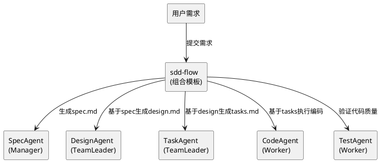

# SDD规范驱动开发技能集 - 技术设计文档

## 一、需求与存量功能关系分析

### 1.1 已实现功能

| 需求功能 | 存量功能 | 代码位置 | 匹配度 |
|---------|---------|---------|--------|
| Agent动态生成 | 从agents.md动态加载和生成Agent | src/dsl/ | 75% |
| 技能加载 | ProgressiveSkillLoader | src/skill/skill_loader.cj | 100% |
| 文件操作工具 | file_read/file_write | src/tool/file_tools.cj | 100% |
| cangjie-coder | 代码生成技能 | skills/cangjie-coder/ | 75% |

### 1.2 需要新增的功能

| 需求功能 | 说明 | 扩展方向 |
|---------|------|---------|
| SpecAgent技能 | 需求规格生成 | 新建skills/sdd-spec/SKILL.md |
| DesignAgent技能 | 技术设计生成 | 新建skills/sdd-design/SKILL.md |
| TaskAgent技能 | 任务分解生成 | 新建skills/sdd-task/SKILL.md |
| TestAgent技能 | 测试验证 | 新建skills/sdd-test/SKILL.md |
| SDD流程编排 | sdd-flow组合模板 | 新建COMPOSITION.yaml |

## 二、增量设计方案

### 2.1 实现模型



### 2.2 接口设计

**sdd-flow COMPOSITION.yaml**：
```yaml
composition:
  name: sdd-flow
  description: SDD规范驱动开发全流程
  steps:
    - name: generate-spec
      skill: sdd-spec
      agent_type: spec-agent
      input:
        requirement: ${args.requirement}
        project_path: ${args.project_path}
    - name: generate-design
      skill: sdd-design
      agent_type: design-agent
      depends_on: [generate-spec]
      input:
        spec_path: ${generate-spec.output.spec_path}
    - name: generate-tasks
      skill: sdd-task
      agent_type: task-agent
      depends_on: [generate-design]
      input:
        design_path: ${generate-design.output.design_path}
    - name: execute-code
      skill: cangjie-coder
      agent_type: coder-worker
      depends_on: [generate-tasks]
      input:
        tasks_path: ${generate-tasks.output.tasks_path}
    - name: verify-code
      skill: sdd-test
      agent_type: qa-worker
      depends_on: [execute-code]
      input:
        code_path: ${execute-code.output.code_path}
  output:
    spec_path: ${generate-spec.output.spec_path}
    design_path: ${generate-design.output.design_path}
    tasks_path: ${generate-tasks.output.tasks_path}
    code_path: ${execute-code.output.code_path}
    verification_report: ${verify-code.output.report_path}
```

### 2.3 数据模型

本工程不涉及数据库表变更，主要是技能文件的创建。

**目标目录结构**：
```
skills/
├── sdd-spec/
│   └── SKILL.md
├── sdd-design/
│   └── SKILL.md
├── sdd-task/
│   └── SKILL.md
├── sdd-test/
│   └── SKILL.md
└── sdd-flow/
    ├── SKILL.md
    └── COMPOSITION.yaml
```