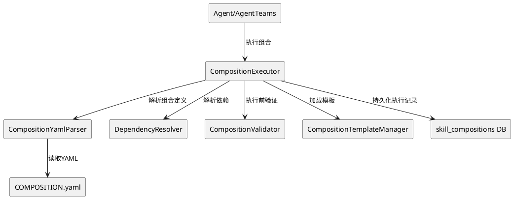
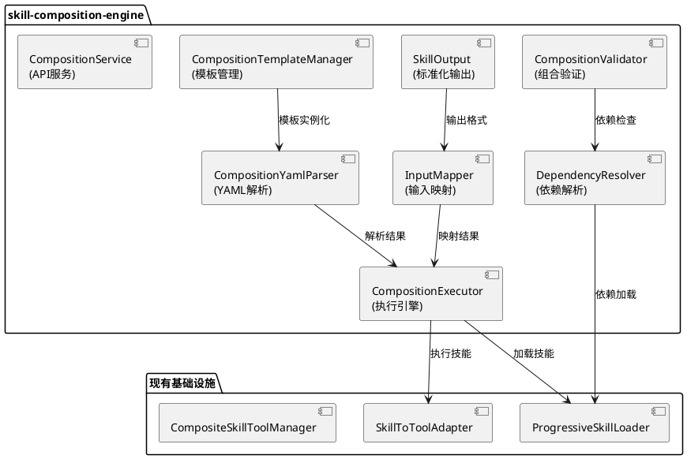
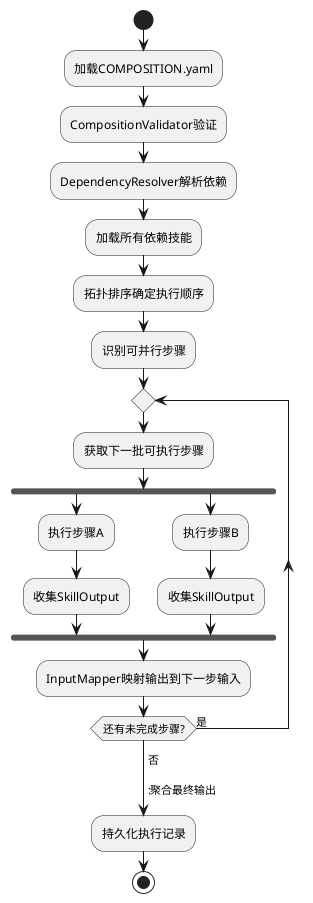

# 技能组合引擎 - 技术设计文档

## 一、需求与存量功能关系分析

### 1.1 需求功能与存量功能对比

#### 1.1.1 已实现功能

| 需求功能 | 存量功能 | 代码位置 | 匹配度 |
|---------|---------|---------|--------|
| 技能加载 | ProgressiveSkillLoader渐进式加载 | src/skill/skill_loader.cj | 75% |
| 技能转工具 | SkillToToolAdapter | src/skill/skill_to_tool_adapter.cj | 75% |
| 组合技能工具管理 | CompositeSkillToolManager | src/skill/composite_skill_tool_manager.cj | 50% |
| SKILL.md标准 | 已建立SKILL.md格式规范 | skills/*/SKILL.md | 100% |
| 技能依赖声明 | SKILL.md中dependencies字段 | skills/cangjie-coder/SKILL.md | 50% |

#### 1.1.2 需要扩展的功能

| 需求功能 | 存量功能 | 差异说明 | 扩展方向 |
|---------|---------|---------|---------|
| 组合定义语言 | 无COMPOSITION.yaml | 技能组合无法声明式定义 | 新增CompositionYamlParser |
| 技能间数据传递 | 无标准化数据传递 | 技能输出无法自动传递给下一个技能 | 新增SkillOutput和InputMapper |
| 组合执行引擎 | CompositeSkillToolManager基础 | 仅管理工具列表，无串行/并行/条件执行 | 扩展为CompositionExecutor |
| 技能依赖解析 | dependencies字段仅声明 | 无自动解析和加载 | 新增DependencyResolver |
| 组合模板 | 无模板系统 | 常见组合模式无法复用 | 新增CompositionTemplateManager |
| 组合验证 | 无验证机制 | 执行前无法检测问题 | 新增CompositionValidator |

#### 1.1.3 需要新增的功能或接口

1. **CompositionYamlParser**: COMPOSITION.yaml解析器
2. **SkillOutput/SkillInput**: 标准化技能输入输出
3. **InputMapper**: 输入映射表达式解析
4. **CompositionExecutor**: 串行/并行/条件分支执行引擎
5. **DependencyResolver**: 技能依赖自动解析
6. **CompositionValidator**: 组合验证
7. **CompositionTemplateManager**: 组合模板管理
8. **数据库表**: skill_compositions、composition_executions

### 1.2 存量功能详细分析

**CompositeSkillToolManager**（src/skill/composite_skill_tool_manager.cj）：
- **接口契约**: 管理多个技能工具的组合
- **业务规则**: 将多个SkillToToolAdapter注册到ToolManager
- **扩展点**: 可扩展为支持串行/并行/条件执行
- **约束**: 当前仅管理工具列表，无执行编排能力

**SkillToToolAdapter**（src/skill/skill_to_tool_adapter.cj）：
- **接口契约**: 将技能适配为Tool接口
- **业务规则**: 技能的SKILL.md定义转换为Tool的参数和描述
- **扩展点**: 可扩展为支持SkillOutput格式
- **约束**: 当前输出为字符串，无结构化数据传递

## 二、增量设计方案

### 2.1 实现模型

#### 2.1.1 上下文视图



#### 2.1.2 服务/组件总体架构



#### 2.1.3 实现设计文档

**组合执行流程**：



### 2.2 接口设计

#### 2.2.1 总体设计

| 接口分类 | 接口名称 | 稳定性 | 说明 |
|---------|---------|--------|------|
| 组合管理API | POST /api/v1/uctoo/skill_compositions/add | 稳定 | 创建组合 |
| 组合管理API | GET /api/v1/uctoo/skill_compositions/:id | 稳定 | 查询组合 |
| 组合执行API | POST /api/v1/uctoo/skill_compositions/:id/execute | 稳定 | 执行组合 |
| 执行记录API | GET /api/v1/uctoo/composition_executions/:limit/:page | 稳定 | 查询执行记录 |
| 内部接口 | CompositionExecutor.execute() | 实验 | 执行组合 |
| 内部接口 | DependencyResolver.resolve() | 实验 | 解析依赖 |

#### 2.2.2 接口清单

**CompositionExecutor内部接口**：

```cangjie
public class CompositionExecutor {
    public func execute(composition: SkillComposition, input: JsonValue): Option<CompositionResult>
    public func executeStep(step: CompositionStep, input: JsonValue): Option<SkillOutput>
    public func validateComposition(composition: SkillComposition): ValidationResult
}
```

**InputMapper内部接口**：

```cangjie
import std.collection.HashMap

public class InputMapper {
    public func map(output: SkillOutput, mapping: JsonValue): JsonValue
    public func resolveExpression(expression: String, context: HashMap<String, SkillOutput>): Option<JsonValue>
}
```

### 2.3 数据模型

**DDL**：

> **复核修订说明**（2026-07-24 design-review.md）：
> - 所有id/外键字段从BIGSERIAL/BIGINT改为uuid，与uctooDB.sql规范对齐
> - 所有时间字段从TIMESTAMP改为timestamptz(6)，与uctooDB.sql规范对齐
> - creator从BIGINT改为uuid，与uctooDB.sql规范对齐
> - composition_id改为uuid，关联skill_compositions.id
> - 补充COMMENT ON COLUMN和COMMENT ON TABLE

```sql
CREATE TABLE "public"."skill_compositions" (
    "id" uuid NOT NULL DEFAULT gen_random_uuid(),
    "name" varchar(100) COLLATE "pg_catalog"."default" NOT NULL,
    "description" varchar(1024) COLLATE "pg_catalog"."default",
    "definition" jsonb NOT NULL,
    "source_path" varchar(500) COLLATE "pg_catalog"."default",
    "template_ref" varchar(100) COLLATE "pg_catalog"."default",
    "is_template" bool NOT NULL DEFAULT false,
    "sync_status" varchar(20) COLLATE "pg_catalog"."default" NOT NULL DEFAULT 'synced'::character varying,
    "creator" uuid,
    "created_at" timestamptz(6) NOT NULL DEFAULT CURRENT_TIMESTAMP,
    "updated_at" timestamptz(6) NOT NULL DEFAULT CURRENT_TIMESTAMP,
    "deleted_at" timestamptz(6)
)
;

COMMENT ON COLUMN "public"."skill_compositions"."id" IS '组合唯一标识';
COMMENT ON COLUMN "public"."skill_compositions"."name" IS '组合名称';
COMMENT ON COLUMN "public"."skill_compositions"."description" IS '组合描述';
COMMENT ON COLUMN "public"."skill_compositions"."definition" IS '组合定义(JSONB)，包含步骤和依赖关系';
COMMENT ON COLUMN "public"."skill_compositions"."source_path" IS 'COMPOSITION.yaml源文件路径';
COMMENT ON COLUMN "public"."skill_compositions"."template_ref" IS '引用的模板名称';
COMMENT ON COLUMN "public"."skill_compositions"."is_template" IS '是否为模板';
COMMENT ON COLUMN "public"."skill_compositions"."sync_status" IS '同步状态：synced/pending/error';
COMMENT ON COLUMN "public"."skill_compositions"."creator" IS '创建人';
COMMENT ON COLUMN "public"."skill_compositions"."created_at" IS '创建时间';
COMMENT ON COLUMN "public"."skill_compositions"."updated_at" IS '更新时间';
COMMENT ON COLUMN "public"."skill_compositions"."deleted_at" IS '删除时间';
COMMENT ON TABLE "public"."skill_compositions" IS '技能组合定义表。存储技能的声明式组合定义。';

CREATE TABLE "public"."composition_executions" (
    "id" uuid NOT NULL DEFAULT gen_random_uuid(),
    "composition_id" uuid NOT NULL REFERENCES "public"."skill_compositions"(id),
    "status" varchar(20) COLLATE "pg_catalog"."default" NOT NULL DEFAULT 'running'::character varying,
    "step_results" jsonb,
    "final_output" jsonb,
    "cache_hits" int4 NOT NULL DEFAULT 0,
    "duration_ms" int4,
    "creator" uuid,
    "created_at" timestamptz(6) NOT NULL DEFAULT CURRENT_TIMESTAMP,
    "updated_at" timestamptz(6) NOT NULL DEFAULT CURRENT_TIMESTAMP,
    "completed_at" timestamptz(6),
    "deleted_at" timestamptz(6)
)
;

COMMENT ON COLUMN "public"."composition_executions"."id" IS '执行记录唯一标识';
COMMENT ON COLUMN "public"."composition_executions"."composition_id" IS '关联skill_compositions表id';
COMMENT ON COLUMN "public"."composition_executions"."status" IS '执行状态：running/completed/failed';
COMMENT ON COLUMN "public"."composition_executions"."step_results" IS '各步骤执行结果(JSONB)';
COMMENT ON COLUMN "public"."composition_executions"."final_output" IS '最终输出(JSONB)';
COMMENT ON COLUMN "public"."composition_executions"."cache_hits" IS '缓存命中次数';
COMMENT ON COLUMN "public"."composition_executions"."duration_ms" IS '总执行耗时(毫秒)';
COMMENT ON COLUMN "public"."composition_executions"."creator" IS '创建人';
COMMENT ON COLUMN "public"."composition_executions"."created_at" IS '创建时间';
COMMENT ON COLUMN "public"."composition_executions"."updated_at" IS '更新时间';
COMMENT ON COLUMN "public"."composition_executions"."completed_at" IS '完成时间';
COMMENT ON COLUMN "public"."composition_executions"."deleted_at" IS '删除时间';
COMMENT ON TABLE "public"."composition_executions" IS '技能组合执行记录表。存储组合的每次执行情况。';

CREATE INDEX idx_compositions_name ON "public"."skill_compositions"(name);
CREATE INDEX idx_executions_composition ON "public"."composition_executions"(composition_id);
```