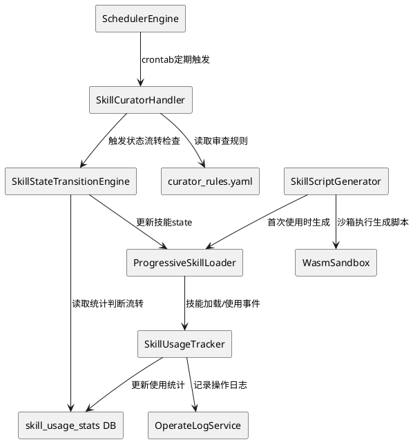
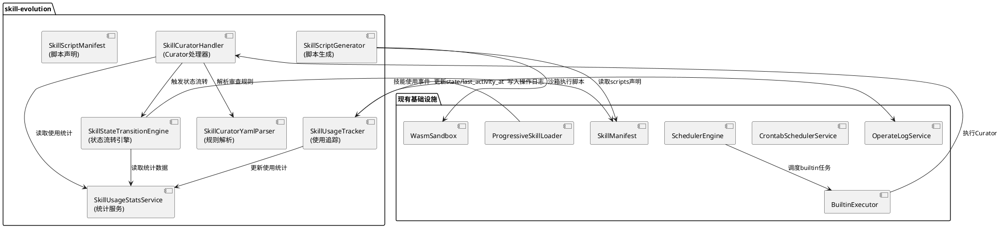
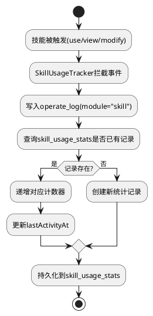
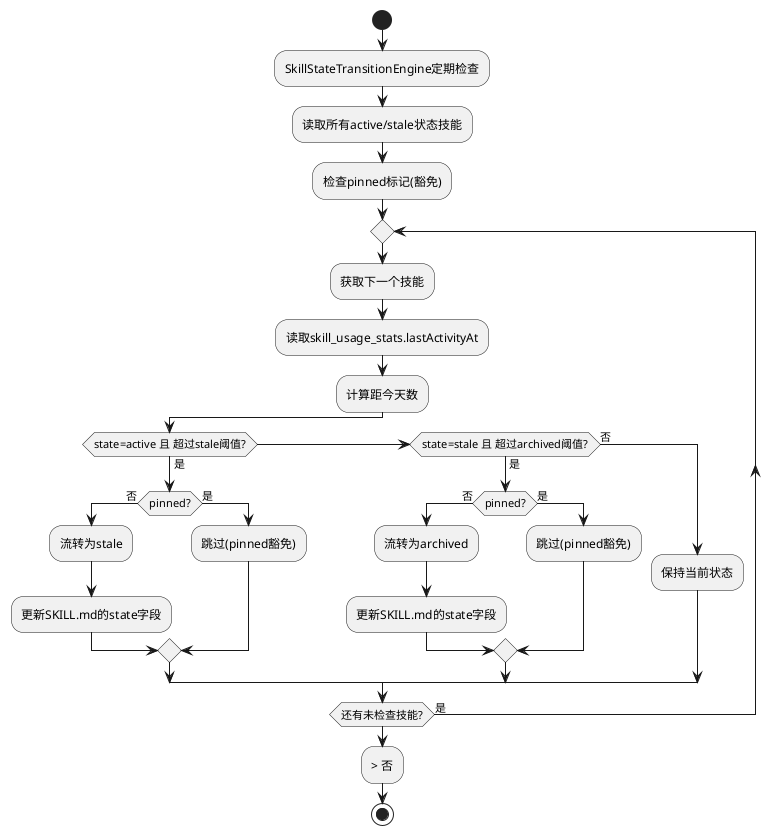
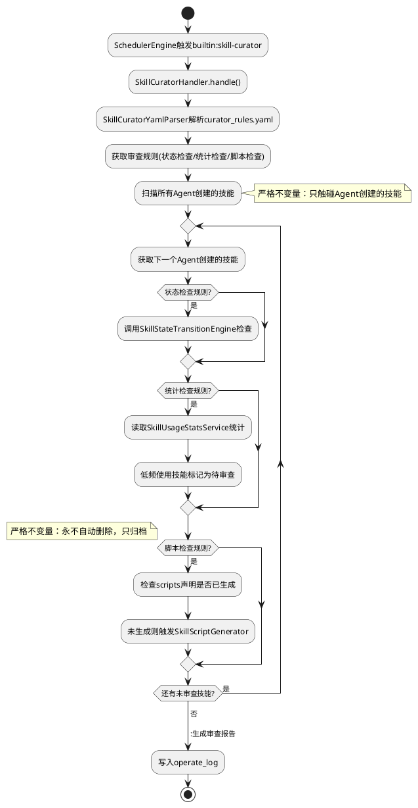
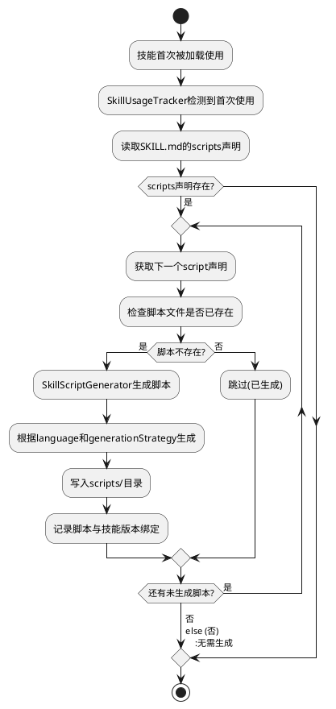

# 技能自进化闭环 - 技术设计文档

## 一、需求与存量功能关系分析

### 1.1 需求功能与存量功能对比

#### 1.1.1 已实现功能

| 需求功能 | 存量功能 | 代码位置 | 匹配度 |
|---------|---------|---------|--------|
| 操作日志记录 | OperateLogPO/OperateLogService | src/app/models/uctoo/OperateLogPO.cj | 80% |
| 定期任务调度 | CrontabSchedulerService/SchedulerEngine | src/app/services/crontab/SchedulerEngine.cj | 90% |
| 内置任务执行器 | BuiltinExecutor/BuiltinTaskHandler | src/app/services/crontab/executor/BuiltinExecutor.cj | 95% |
| WASM沙箱执行 | WasmSandbox/SecurityPolicy | src/skill/security/wasm_sandbox.cj | 85% |
| 技能加载 | ProgressiveSkillLoader | src/skill/application/progressive_skill_loader.cj | 70% |
| 技能元数据 | SkillManifest/SkillMetadata | src/skill/domain/models/skill_manifest.cj | 60% |
| 技能组合执行 | CompositionExecutor | src/skill/composition_executor.cj | 30% |

#### 1.1.2 需要扩展的功能

| 需求功能 | 存量功能 | 差异说明 | 扩展方向 |
|---------|---------|---------|---------|
| 技能使用统计 | OperateLog仅记录操作日志 | 无技能维度的聚合统计 | 新增skill_usage_stats表和SkillUsageStatsService |
| 技能状态字段 | SkillManifest无state字段 | SKILL.md中无state/last_activity_at | 扩展SkillManifest增加state和last_activity_at |
| 定期审查调度 | CrontabScheduler完整 | 缺少skill-curator内置任务 | 新增SkillCuratorHandler注册为builtin任务 |
| 脚本声明 | SkillManifest有scriptsDirExists | 无scripts声明和动态生成 | 扩展SkillManifest增加scripts声明字段 |

#### 1.1.3 需要新增的功能或接口

1. **SkillUsageStatsPO/SkillUsageStatsDAO/SkillUsageStatsService**: 技能使用统计持久化与查询
2. **SkillUsageTracker**: 技能使用追踪器，拦截技能执行事件并更新统计
3. **SkillStateTransitionEngine**: 技能状态流转引擎，基于使用频率自动转换active→stale→archived
4. **SkillCuratorHandler**: Curator审查处理器，实现BuiltinTaskHandler接口
5. **SkillCuratorYamlParser**: Curator审查规则YAML配置解析器
6. **SkillScriptGenerator**: 技能脚本动态生成器
7. **数据库表**: skill_usage_stats、curator_rules配置文件

### 1.2 存量功能详细分析

**OperateLogService**（src/app/services/uctoo/OperateLogService.cj）：
- **接口契约**: 操作日志的CRUD，含分页过滤查询
- **业务规则**: 记录module/operate/route/params等操作信息
- **扩展点**: module字段可标记为"skill"，operate字段可标记为"use/view/modify"，作为统计原始数据源
- **约束**: 仅记录操作流水，无聚合统计能力

**SchedulerEngine**（src/app/services/crontab/SchedulerEngine.cj）：
- **接口契约**: 基于Ticktock的CRON调度引擎，支持任务注册/触发/重载
- **业务规则**: 通过ExecutorRegistry分发到Script/Http/Builtin等执行器
- **扩展点**: BuiltinExecutor支持动态注册BuiltinTaskHandler，Curator可直接注册
- **约束**: 需在initExecutors()中注册，或通过BuiltinExecutor.registerBuiltinTask()动态注册

**WasmSandbox**（src/skill/security/wasm_sandbox.cj）：
- **接口契约**: 基于能力的沙箱执行，支持filesystem/network/command等能力限制
- **业务规则**: SecurityPolicy验证 + ResourceQuotaManager资源限制 + CapabilityManager能力校验
- **扩展点**: executeSkill()可直接执行动态生成的脚本
- **约束**: 当前为占位实现，需对接真实WASM运行时

**SkillManifest**（src/skill/domain/models/skill_manifest.cj）：
- **接口契约**: SKILL.md解析后的领域模型，含name/description/metadata等
- **业务规则**: 包含scriptsDirExists/referencesDirExists/assetsDirExists布尔标记
- **扩展点**: 可增加state/last_activity_at/scripts声明字段
- **约束**: 字段为不可变(let)，扩展需修改init构造函数

## 二、增量设计方案

### 2.1 实现模型

#### 2.1.1 上下文视图



#### 2.1.2 服务/组件总体架构



#### 2.1.3 技能使用追踪流程



#### 2.1.4 状态自动流转流程



#### 2.1.5 Curator审查流程



#### 2.1.6 脚本动态生成流程



### 2.2 接口设计

#### 2.2.1 总体设计

| 接口分类 | 接口名称 | 稳定性 | 说明 |
|---------|---------|--------|------|
| 使用统计API | GET /api/v1/uctoo/skill_usage_stats/:skillName | 稳定 | 查询技能使用统计 |
| 使用统计API | GET /api/v1/uctoo/skill_usage_stats/limit/:limit/page/:page | 稳定 | 分页查询所有统计 |
| 使用统计API | POST /api/v1/uctoo/skill_usage_stats/record | 稳定 | 记录使用事件 |
| 状态流转API | POST /api/v1/uctoo/skill_usage_stats/transition/check | 稳定 | 手动触发状态检查 |
| 状态流转API | POST /api/v1/uctoo/skill_usage_stats/transition/:skillName | 实验 | 手动触发单个技能流转 |
| Curator API | POST /api/v1/uctoo/skill_usage_stats/curator/trigger | 稳定 | 手动触发Curator审查 |
| 内部接口 | SkillUsageTracker.recordUsage() | 稳定 | 记录技能使用 |
| 内部接口 | SkillStateTransitionEngine.checkAndTransition() | 实验 | 状态流转检查 |
| 内部接口 | SkillCuratorHandler.handle() | 稳定 | Curator审查执行 |
| 内部接口 | SkillScriptGenerator.generateIfMissing() | 实验 | 脚本动态生成 |

#### 2.2.2 接口清单

**SkillUsageTracker内部接口**：

```cangjie
public class SkillUsageTracker {
    private let operateLogService: OperateLogService
    private let skillUsageStatsService: SkillUsageStatsService

    public init(operateLogService!: OperateLogService, skillUsageStatsService!: SkillUsageStatsService)

    public func recordUsage(skillName: String, usageType: SkillUsageType, creatorId: String): APIResult<SkillUsageStatsPO>
    public func getUsageStats(skillName: String): APIResult<SkillUsageStatsPO>
    public func getTopUsedSkills(limit: Int64): APIResult<ArrayList<SkillUsageStatsPO>>
}

public enum SkillUsageType {
    | Use
    | View
    | Modify
}
```

**SkillStateTransitionEngine内部接口**：

```cangjie
public class SkillStateTransitionEngine {
    private let skillUsageStatsService: SkillUsageStatsService
    private let transitionConfig: SkillTransitionConfig

    public init(skillUsageStatsService!: SkillUsageStatsService, transitionConfig!: SkillTransitionConfig)

    public func checkAndTransition(skillName: String): APIResult<Option<SkillState>>
    public func checkAllActiveSkills(): APIResult<ArrayList<String>>
    public func isPinned(skillName: String): Bool
    public func getState(skillName: String): Option<SkillState>
}

public enum SkillState {
    | Active
    | Stale
    | Archived
}

public class SkillTransitionConfig {
    public var staleThresholdDays: Int64
    public var archivedThresholdDays: Int64
    public var enabled: Bool
}
```

**SkillCuratorHandler内部接口**：

```cangjie
public class SkillCuratorHandler <: BuiltinTaskHandler {
    private let curatorYamlParser: SkillCuratorYamlParser
    private let stateTransitionEngine: SkillStateTransitionEngine
    private let skillUsageStatsService: SkillUsageStatsService
    private let scriptGenerator: SkillScriptGenerator

    public init(curatorYamlParser!: SkillCuratorYamlParser, stateTransitionEngine!: SkillStateTransitionEngine, skillUsageStatsService!: SkillUsageStatsService, scriptGenerator!: SkillScriptGenerator)

    public func handle(context: CrontabExecutionContext): ExecutionResult
}
```

**SkillCuratorYamlParser内部接口**：

```cangjie
public class SkillCuratorYamlParser {
    public init()

    public func parse(yamlContent: String): Option<CuratorRuleSet>
    public func parseFromFile(filePath: String): Option<CuratorRuleSet>
}

public class CuratorRuleSet {
    public var schedule: String
    public var rules: ArrayList<CuratorRule>
    public var scope: CuratorScope
}

public class CuratorRule {
    public var name: String
    public var `type`: String
    public var condition: String
    public var action: String
    public var enabled: Bool
}

public class CuratorScope {
    public var onlyAgentCreated: Bool
    public var excludePinned: Bool
    public var targetStates: Array<String>
}
```

**SkillScriptGenerator内部接口**：

```cangjie
public class SkillScriptGenerator {
    private let wasmSandbox: WasmSandbox

    public init(wasmSandbox!: WasmSandbox)

    public func generateIfMissing(skillName: String, scriptDecl: ScriptDeclaration): APIResult<String>
    public func generateAllMissing(skillName: String, scriptDecls: Array<ScriptDeclaration>): APIResult<ArrayList<String>>
}

public class ScriptDeclaration {
    public var name: String
    public var description: String
    public var language: String
    public var generationStrategy: String
    public var capabilities: Array<String>
    public var version: String
}
```

### 2.3 数据模型

**DDL**：

```sql
CREATE TABLE "public"."skill_usage_stats" (
    "id" uuid NOT NULL DEFAULT gen_random_uuid(),
    "skill_name" varchar(64) COLLATE "pg_catalog"."default" NOT NULL,
    "use_count" int4 NOT NULL DEFAULT 0,
    "view_count" int4 NOT NULL DEFAULT 0,
    "modify_count" int4 NOT NULL DEFAULT 0,
    "last_activity_at" timestamptz(6),
    "state" varchar(20) COLLATE "pg_catalog"."default" NOT NULL DEFAULT 'active'::character varying,
    "pinned" bool NOT NULL DEFAULT false,
    "creator_type" varchar(20) COLLATE "pg_catalog"."default",
    "script_generation_status" jsonb,
    "creator" uuid,
    "created_at" timestamptz(6) NOT NULL DEFAULT CURRENT_TIMESTAMP,
    "updated_at" timestamptz(6) NOT NULL DEFAULT CURRENT_TIMESTAMP,
    "deleted_at" timestamptz(6)
)
;

COMMENT ON COLUMN "public"."skill_usage_stats"."id" IS '统计记录唯一标识';
COMMENT ON COLUMN "public"."skill_usage_stats"."skill_name" IS '技能名称，关联SKILL.md的name字段';
COMMENT ON COLUMN "public"."skill_usage_stats"."use_count" IS '使用次数';
COMMENT ON COLUMN "public"."skill_usage_stats"."view_count" IS '查看次数';
COMMENT ON COLUMN "public"."skill_usage_stats"."modify_count" IS '修改次数';
COMMENT ON COLUMN "public"."skill_usage_stats"."last_activity_at" IS '最后活动时间';
COMMENT ON COLUMN "public"."skill_usage_stats"."state" IS '技能状态：active/stale/archived';
COMMENT ON COLUMN "public"."skill_usage_stats"."pinned" IS '是否固定(固定技能豁免自动流转)';
COMMENT ON COLUMN "public"."skill_usage_stats"."creator_type" IS '创建者类型：system/agent(仅agent创建的技能受Curator管理)';
COMMENT ON COLUMN "public"."skill_usage_stats"."script_generation_status" IS '脚本生成状态(JSONB)，记录各脚本的生成状态和版本绑定';
COMMENT ON COLUMN "public"."skill_usage_stats"."creator" IS '创建人';
COMMENT ON COLUMN "public"."skill_usage_stats"."created_at" IS '创建时间';
COMMENT ON COLUMN "public"."skill_usage_stats"."updated_at" IS '更新时间';
COMMENT ON COLUMN "public"."skill_usage_stats"."deleted_at" IS '删除时间';
COMMENT ON TABLE "public"."skill_usage_stats" IS '技能使用统计表。记录每个技能的使用频率和状态，支持自进化闭环。';

CREATE UNIQUE INDEX idx_skill_usage_stats_name ON "public"."skill_usage_stats"(skill_name);
CREATE INDEX idx_skill_usage_stats_state ON "public"."skill_usage_stats"(state);
CREATE INDEX idx_skill_usage_stats_last_activity ON "public"."skill_usage_stats"(last_activity_at);
CREATE INDEX idx_skill_usage_stats_creator_type ON "public"."skill_usage_stats"(creator_type);
```

### 2.4 SKILL.md扩展字段

在SKILL.md的YAML frontmatter中增加以下字段：

```yaml
---
name: example-skill
description: ...
state: active          # 新增：技能状态 active/stale/archived，默认active
last_activity_at: ...  # 新增：最后活动时间，由系统自动维护
pinned: false          # 新增：是否固定，固定技能豁免自动流转
scripts:               # 新增：脚本声明列表
  - name: analyze
    description: 分析数据脚本
    language: python
    generation_strategy: llm-generate
    capabilities:
      - filesystem_read
    version: "1.0.0"
---
```

### 2.5 curator_rules.yaml配置格式

```yaml
schedule: "0 2 * * *"    # 每天凌晨2点执行
scope:
  only_agent_created: true  # 严格不变量：只触碰Agent创建的技能
  exclude_pinned: true      # 排除固定技能
  target_states:
    - active
    - stale
rules:
  - name: stale-check
    type: state-transition
    condition: "last_activity_at > 30d AND state == 'active'"
    action: "transition_to_stale"
    enabled: true

  - name: archive-check
    type: state-transition
    condition: "last_activity_at > 90d AND state == 'stale'"
    action: "transition_to_archived"
    enabled: true

  - name: script-generation-check
    type: script-check
    condition: "scripts_declared AND NOT scripts_generated"
    action: "generate_scripts"
    enabled: true

  - name: low-usage-review
    type: usage-review
    condition: "use_count < 3 AND created_at > 7d"
    action: "flag_for_review"
    enabled: true
```

### 2.6 Curator注册为Crontab任务

Curator通过现有CrontabScheduler机制注册为builtin任务：

1. 系统启动时在SchedulerEngine.initExecutors()中注册SkillCuratorHandler
2. 在crontab表中插入builtin:skill-curator类型的定时任务
3. CrontabScheduler按cron表达式定期触发SkillCuratorHandler.handle()

### 2.7 不变量保证

| 不变量 | 实现机制 |
|--------|---------|
| 只触碰Agent创建的技能 | CuratorScope.onlyAgentCreated=true，查询时过滤creator_type='agent' |
| 永不自动删除（只归档） | CuratorRule的action仅允许transition_to_stale/transition_to_archived/flag_for_review/generate_scripts，无delete动作 |
| Pinned技能豁免流转 | SkillStateTransitionEngine.isPinned()检查，流转前判断 |
| 流转规则可配置 | curator_rules.yaml外部配置，运行时解析 |