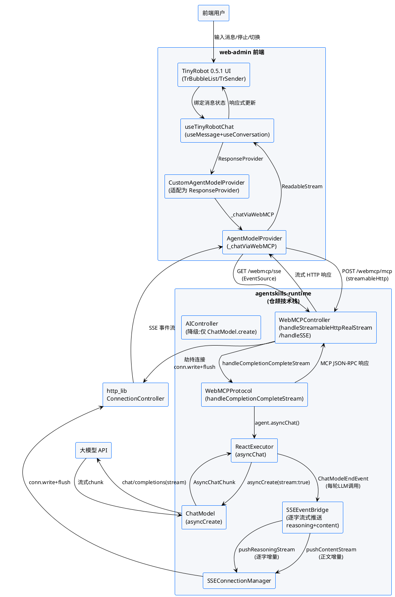
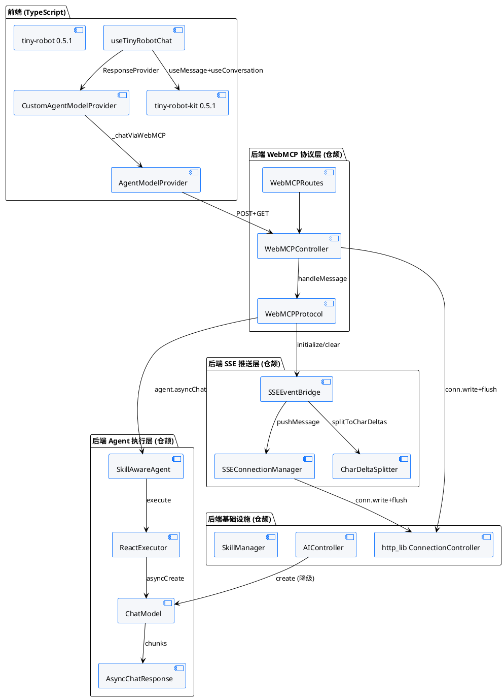
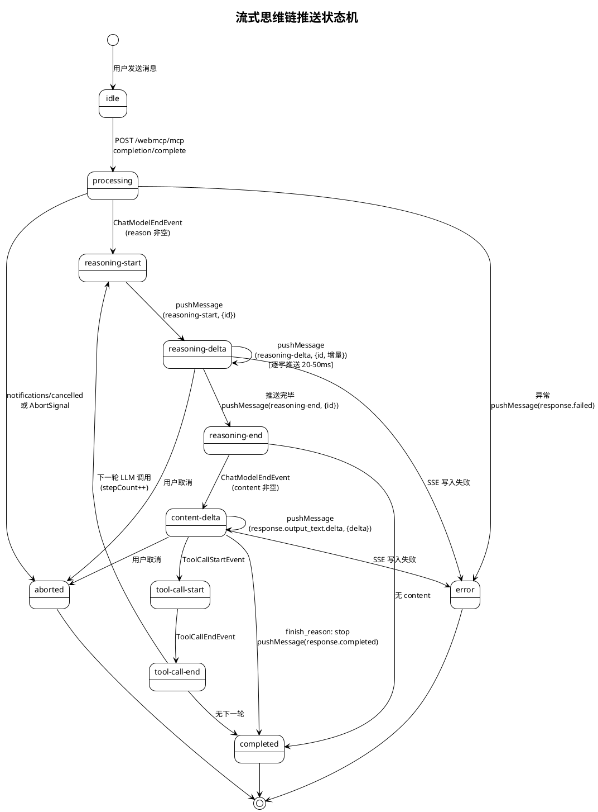
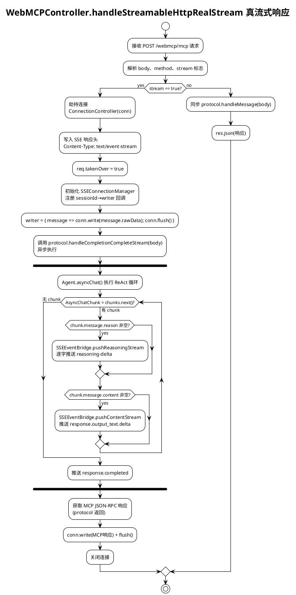
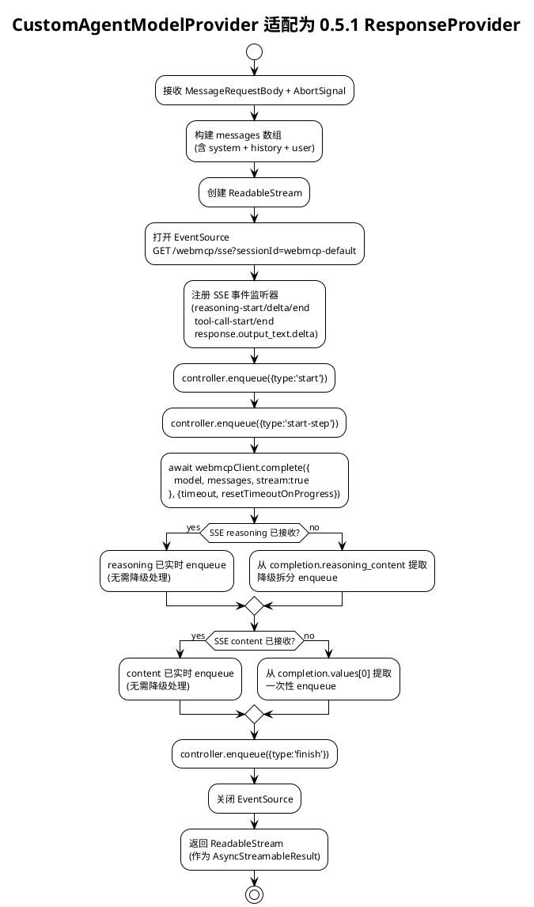
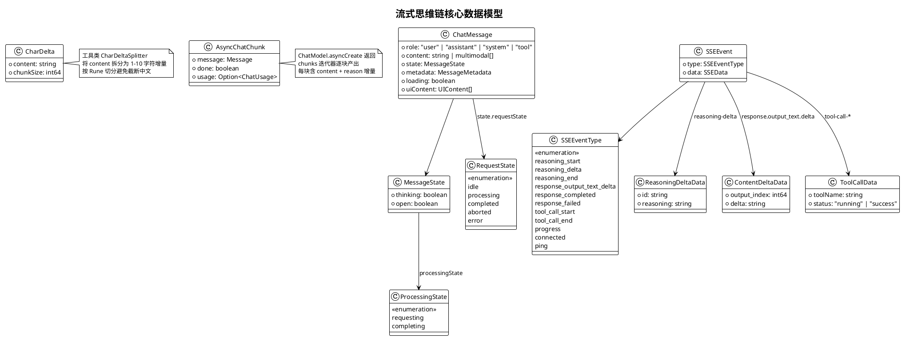
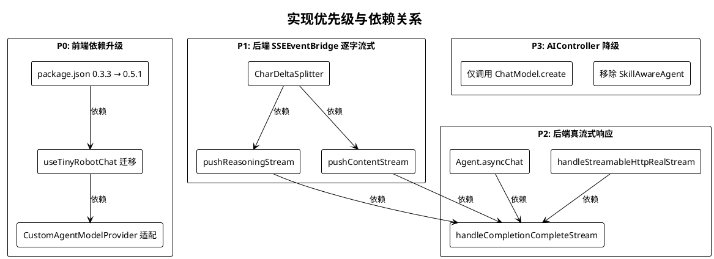

# 流式思维链升级实现方案（design.md）

> 本文档将 `spec.md` 中"流式思维链升级"需求转化为可落地的技术设计。
> 范围：前端 `@opentiny/tiny-robot-kit` 0.3.3 → 0.5.1 升级 + 后端 agentskills-runtime WebMCP 接口流式思维链增强 + AIController 降级 + http_lib 真流式响应。
> 不涉及数据库 schema 变更，不涉及新业务模块引入。

---

# 一、需求与存量功能关系分析

## 1.1 需求功能与存量功能对比

### 1.1.1 已实现功能

| 需求功能 | 存量功能 | 代码位置 | 匹配度 |
|---------|---------|---------|--------|
| WebMCP 协议层 completion/complete 方法 | 已实现 handleCompletionComplete，支持 messages/stream 参数解析、SkillAwareAgent 调用、reasoning_content 独立字段转发 | `src/app/services/webmcp/WebMCPProtocol.cj:1154-1357` | 75% |
| SSE 端点 + 连接管理器 | 已实现 handleSSE 端点（基于 http_lib ConnectionController 劫持连接，conn.write+flush 真流式），SSEConnectionManager 管理 sessionId→writer 回调 | `src/app/controllers/uctoo/webmcp/WebMCPController.cj:623-695`、`src/tool/webmcp/SSEConnectionManager.cj` | 100% |
| SSE 事件桥接器（ChatModelEndEvent → reasoning 推送） | 已实现 SSEEventBridge 单例，注册 ChatModelEndEventHandler 推送 reasoning-start/reasoning-delta/reasoning-end，注册 ToolCallStart/EndEventHandler 推送工具状态 | `src/app/services/bridge/sse_event_bridge.cj` | 50% |
| 前端 SSE EventSource 监听 reasoning 事件 | 已在 AgentModelProvider._chatViaWebMCP 中实现 EventSource 监听 reasoning-start/reasoning-delta/reasoning-end/tool-call-start/tool-call-end，并 enqueue 到 ReadableStream | `apps/web-admin/web/src/lib/webmcp-sdk/packages/next-sdk/agent/AgentModelProvider.ts:1132-1230` | 75% |
| 前端聊天统一走 WebMCP completion/complete | 已实现 _chatViaWebMCP 通过 webmcpClient.complete 发送请求，支持 stream:true | `apps/web-admin/web/src/lib/webmcp-sdk/packages/next-sdk/agent/AgentModelProvider.ts:1054-1330` | 75% |
| MCP 协议 JSON-RPC 2.0 响应格式 | 已实现 createSuccessResponse 返回 {jsonrpc:"2.0", result:{completion:{values,total,hasMore}}} | `src/app/services/webmcp/WebMCPProtocol.cj:1336-1356` | 100% |
| progress 保活定时器 | 已实现 spawn 定时器每 15 秒推送 progress SSE 事件 | `src/app/services/webmcp/WebMCPProtocol.cj:1273-1284` | 100% |
| SSE 心跳保活 | 已实现 spawn 定时器每 15 秒推送 `: ping` 注释行 | `src/app/controllers/uctoo/webmcp/WebMCPController.cj:661-673` | 100% |
| http_lib ConnectionController 连接劫持 | 已实现 ConnectionController.takeover() + conn.write() + conn.flush() 裸字节流写入 | `libs/http_lib/src/server/hijacker.cj` | 100% |
| ChatModel 异步 API（asyncCreate） | 已定义 ChatModel.asyncCreate 返回 AsyncChatResponse，含 chunks 迭代器 | `src/core/model/chat_model.cj:37`、`src/core/model/async_chat_response.cj` | 75% |
| AIController OpenAI 兼容接口 | 已实现 handleChatCompletions/handleResponses，独立初始化 SkillAwareAgent + ReactExecutor | `src/app/controllers/uctoo/ai/AIController.cj` | 50% |
| 前端 useTinyRobotChat 会话管理 | 已实现 useConversation + messageManager，支持 autoSave、switchConversation、abortRequest | `apps/web-admin/web/src/lib/webmcp-sdk/packages/next-remoter/src/composable/useTinyRobotChat.ts` | 50% |

### 1.1.2 需要扩展的功能

| 需求功能 | 存量功能 | 差异说明 | 扩展方向 |
|---------|---------|---------|---------|
| tiny-robot-kit 0.5.1 ResponseProvider 模式 | 0.3.3 AIClient 模式（useTinyRobotChat 使用 `new AIClient({providerImplementation})`） | 0.5.1 移除 AIClient，改为 useMessage({responseProvider})；RequestState 枚举变更（idle/processing/completed/aborted/error）；thinkingPlugin 默认注册处理 reasoning_content | 迁移 useTinyRobotChat 至 useMessage + ResponseProvider；CustomAgentModelProvider 适配为 ResponseProvider 函数签名；删除 STATUS 旧枚举引用 |
| SSEEventBridge 逐字流式推送 | 当前在 ChatModelEndEventHandler 中一次性推送完整 reasoning_content（`sseMgr.pushMessage(sid, "reasoning-delta", 完整reasoning)`） | 整段推送无法实现逐字显示动画效果；spec 要求 1-10 字符增量、20-50ms 间隔 | 新增 splitToCharDeltas 工具函数拆分 reasoning 为字符增量数组；循环推送 reasoning-delta 并 sleep(20-50ms)；保留 reasoning-start/reasoning-end 包络 |
| SSEEventBridge 正文增量推送 | 当前仅推送 reasoning，不推送正文 content 增量；正文等待 agent.chat() 返回后一次性返回 | spec 要求通过 `response.output_text.delta` SSE 事件实时推送正文增量 | 新增 ChatModelEndEventHandler 中对 content 的拆分推送逻辑；事件类型 `response.output_text.delta` |
| WebMCPController.handleStreamableHttp 真流式 | 当前使用 `spawn { let response = protocol.handleMessage(body); res.send(response) }` 假流式，一次性返回完整 JSON | spec 要求通过 http_lib ConnectionController 劫持连接，conn.write+flush 逐步推送 | 改造 handleStreamableHttp：劫持连接后写入 SSE 响应头，调用 protocol.handleStreamableMessage 异步迭代 chunks 并逐步 conn.write+flush，最后写入 MCP JSON-RPC 响应 |
| WebMCPProtocol.handleCompletionComplete 异步流式 | 当前使用同步 `agent.chat(agentRequest)` 阻塞等待完整响应 | spec 要求使用 ChatModel.asyncCreate 获取 AsyncChatResponse，通过 chunks 迭代器逐块处理 | 新增 handleCompletionCompleteStream 异步分支：使用 agent.asyncChat 或直接 asyncCreate，迭代 chunks 并通过 SSEEventBridge 推送 |
| 前端 useTinyRobotChat 0.5.1 API 迁移 | 当前使用 0.3.3 的 AIClient + useConversation + messageManager | 0.5.1 API 变更：useMessage 替代 messageManager；responseProvider 替代 providerImplementation；plugins 数组替代 events.onReceiveData | 重写 useTinyRobotChat：使用 useMessage({responseProvider, plugins:[thinkingPlugin, lengthPlugin]})；保留会话管理逻辑；适配 abortRequest |
| AIController 降级为 OpenAI 兼容辅助接口 | 当前 AIController 独立初始化 SkillAwareAgent + ReactExecutor + TieredMemory，与 WebMCP 重复实现 ReAct 执行 | spec 要求 AIController 不再包含 SkillAwareAgent 和 ReactExecutor 初始化，仅直接调用 ChatModel | 改造 AIController：移除 SkillAwareAgent/ReactExecutor/TieredMemory 字段；handleChatCompletions 直接调用 _chatModel.create；保留 OpenAI 兼容响应格式但不增强流式思维链 |
| ReAct 多轮独立思维链块 | 当前 SSEEventBridge 使用全局 _reasoningStepCount 计数，但每轮 LLM 调用的 reasoning 块 id 格式为 `reasoning-sse-{stepCount}` | 已支持多轮独立 id，但需确认 ReAct 每轮 LLM 调用都触发 ChatModelEndEvent | 验证 ReactExecutor 每轮 LLM 调用均触发 ChatModelEndEvent；如不触发需在 ReactExecutor 中补充事件发布 |

### 1.1.3 需要新增的功能或接口

#### 1.1.3.1 后端仓颉新增

| 功能点 | 输入 | 输出 | 核心逻辑 | 依赖模块 |
|-------|------|------|---------|---------|
| `splitToCharDeltas(content, chunkSize)` 工具函数 | content: String, chunkSize: Int64（默认 5） | Array<String>（字符增量数组） | 按 chunkSize 切分字符串为增量块；处理多字节字符（仓颉 String 按 Rune 切分）；空字符串返回空数组 | 无 |
| `pushReasoningStream(sseMgr, sid, reasoningId, reason, intervalMs)` 方法 | sseMgr: SSEConnectionManager, sid: String, reasoningId: String, reason: String, intervalMs: Int64 | Unit（副作用：推送 SSE 事件） | 调用 splitToCharDeltas 拆分 reason；循环 pushMessage(reasoning-delta, 增量)；每轮 sleep(intervalMs)；异常时停止推送并记录日志 | SSEConnectionManager |
| `pushContentStream(sseMgr, sid, content)` 方法 | sseMgr: SSEConnectionManager, sid: String, content: String | Unit（副作用：推送 SSE 事件） | 拆分 content 为增量块；循环 pushMessage("response.output_text.delta", {output_index:0, delta:增量}) | SSEConnectionManager |
| `WebMCPProtocol.handleCompletionCompleteStream` 异步流式分支 | obj: JsonObject | String（MCP JSON-RPC 响应） | 解析 messages/stream 参数；初始化 SSEEventBridge；使用 agent.asyncChat 获取 AsyncChatResponse；迭代 chunks 通过 SSEEventBridge 推送 reasoning+content；完成后返回 MCP 响应 | SSEEventBridge、AsyncChatResponse、Agent |
| `WebMCPController.handleStreamableHttpRealStream` 真流式分支 | req: HttpRequest, res: HttpResponse | Unit（副作用：流式 HTTP 响应） | 劫持连接写入 SSE 响应头；调用 protocol.handleStreamableMessage 迭代 chunks；逐步 conn.write+flush；最后写入 MCP JSON-RPC 响应 | http_lib ConnectionController、WebMCPProtocol |
| `Agent.asyncChat` 异步聊天方法（如不存在） | agentRequest: AgentRequest | AsyncAgentResponse（含 chunks 迭代器） | 异步执行 ReAct 循环，每轮 LLM 调用产生 AsyncChatChunk；通过 EventHandlerManager 发布 ChatModelEndEvent | ReactExecutor、ChatModel.asyncCreate |

#### 1.1.3.2 前端 TypeScript 新增

| 功能点 | 输入 | 输出 | 核心逻辑 | 依赖模块 |
|-------|------|------|---------|---------|
| `CustomAgentModelProvider` 适配为 ResponseProvider | MessageRequestBody + AbortSignal | AsyncStreamableResult<ChatCompletionChunk> | 将现有 _chatViaWebMCP 包装为 ResponseProvider 签名；返回 ReadableStream<ChatCompletionChunk>；支持 AbortSignal 取消 | AgentModelProvider、@opentiny/tiny-robot-kit 0.5.1 |
| `useTinyRobotChat` 0.5.1 迁移 | systemPrompt, llmConfig, emit | {messages, inputMessage, sendMessage, abortRequest, ...} | 使用 useMessage({responseProvider, plugins:[thinkingPlugin, lengthPlugin]})；使用 useConversation 管理会话；适配 0.5.1 RequestState | @opentiny/tiny-robot-kit 0.5.1 |
| `package.json` 依赖升级 | 无 | 无 | 将 @opentiny/tiny-robot、@opentiny/tiny-robot-kit、@opentiny/tiny-robot-svgs 从 0.3.3 升级到 0.5.1 | pnpm |

## 1.2 存量功能详细分析

### 1.2.1 SSEEventBridge（sse_event_bridge.cj）

**接口契约**：
- `initialize(sseManager: ?SSEConnectionManager, sessionId: String): Unit` — 注入 SSE 连接管理器和会话 ID，注册全局事件处理器
- `clear(): Unit` — 清理 SSE 关联，重置步骤计数器
- 单例模式：`SSEEventBridge.instance`

**业务规则**：
- 在 `WebMCPProtocol.handleCompletionComplete` 中 `agent.chat()` 调用前 initialize，调用后 clear
- ChatModelEndEventHandler 从 `evt.chatResponse.message.reason` 提取 reasoning_content
- 使用全局 `_reasoningStepCount` 计数器为每个 reasoning 块生成唯一 id `reasoning-sse-{stepCount}`
- 推送前检查 `sseMgr.hasConnection(sid)` 避免无效推送

**约束**：
- 全局单例 + ReentrantMutex 保护并发访问
- 全局事件处理器只注册一次（AtomicBool _registered）
- **当前缺陷**：reasoning-delta 一次性推送完整 reasoning_content 字符串（line 122-124），不满足逐字流式要求
- **当前缺陷**：不推送正文 content 增量，仅推送 reasoning
- **当前缺陷**：依赖同步 agent.chat() 触发 ChatModelEndEvent，无法实现真流式

### 1.2.2 WebMCPProtocol.handleCompletionComplete（WebMCPProtocol.cj:1154-1357）

**接口契约**：
- 输入：JsonObject（MCP completion/complete 请求）
- 输出：String（MCP JSON-RPC 2.0 响应）
- 副作用：调用 agent.chat()、推送 SSE 事件、异步同步 Agent 状态到数据库

**业务规则**：
1. 解析 params.messages 提取 user/system 消息
2. 合并前端 system 消息 + 后端技能知识库 buildAgentSystemPrompt()
3. 加载历史上下文（CheckpointManager.loadLatestCheckpoint）
4. 启动 progress 定时器（每 15 秒）
5. 初始化 SSEEventBridge
6. **同步调用 `agent.chat(agentRequest)`** 阻塞等待完整响应
7. 清理 SSEEventBridge、停止 progress 定时器
8. 提取 reasoning_content 转发到 completion 独立字段
9. 异步同步 Agent 状态到数据库

**约束**：
- 同步阻塞：agent.chat() 可能耗时 15 分钟（ReAct 多轮工具调用）
- 依赖 progress SSE 事件防止前端超时
- **当前缺陷**：同步 agent.chat() 无法实现真流式，reasoning 仅在每轮 LLM 调用完成时触发 ChatModelEndEvent 推送，正文等待全部完成后一次性返回

### 1.2.3 WebMCPController.handleStreamableHttp（WebMCPController.cj:137-235）

**接口契约**：
- 输入：HttpRequest（POST /api/v1/uctoo/webmcp/mcp）
- 输出：HttpResponse（JSON-RPC 响应）
- 副作用：调用 WebMCPProtocol.handleMessage

**业务规则**：
1. 解析 body、设置 CORS 头
2. 解析 method，notifications/* 提前返回
3. 复用/创建 WebMCPProtocol 会话
4. 解析 stream 标志
5. **流式分支**：`spawn { let response = protocol.handleMessage(body); res.send(response) }` — 假流式
6. 非流式分支：同步 handleMessage + res.json

**约束**：
- **当前缺陷**：流式分支使用 spawn + res.send 一次性返回完整 JSON，不是真流式
- **当前缺陷**：裸写 `Connection: close` 头让浏览器按裸字节流解析，但实际是单次 send
- 真流式需通过 http_lib ConnectionController 劫持连接 + conn.write+flush

### 1.2.4 AIController（AIController.cj）

**接口契约**：
- `handleChatCompletions(req, res): Unit` — POST /api/v1/ai/chat/completions
- `handleResponses(req, res): Unit` — POST /api/v1/ai/responses
- 构造函数：`init(chatModel: ChatModel, skillManager: SkillManager)` — 初始化 SkillAwareAgent + ReactExecutor + TieredMemory

**业务规则**：
- 独立初始化 SkillAwareAgent（与 WebMCPProtocol 重复）
- 支持 stream/非 stream 分支
- 解析 OpenAI 格式 messages

**约束**：
- **当前缺陷**：与 WebMCPProtocol 重复实现 ReAct 执行逻辑（SkillAwareAgent + ReactExecutor）
- spec 要求降级为仅直接调用 ChatModel，不增强流式思维链
- 保留 OpenAI 兼容响应格式供第三方客户端调用

### 1.2.5 AgentModelProvider._chatViaWebMCP（前端 TypeScript）

**接口契约**：
- 输入：chatMethod (streamText/generateText), {model, maxSteps, messages, system}
- 输出：Promise<any>（含 stream ReadableStream 或完整响应）
- 副作用：创建 EventSource、调用 webmcpClient.complete、enqueue 到 ReadableStream

**业务规则**：
1. 初始化 mcpClients + mcpTools
2. 选择有 complete 方法的 webmcpClient（优先 remote-mcp-server）
3. 从 MCP URL 推导 SSE URL（/mcp → /sse?sessionId=webmcp-default）
4. 流式分支：创建 ReadableStream，打开 EventSource 监听 reasoning-start/delta/end + tool-call-start/end
5. controller.enqueue({type:'start'}) + {type:'start-step'})
6. `await webmcpClient.complete({model, messages, stream:true})` — 等待完整响应
7. 关闭 EventSource，补发 reasoning-end（如未正常结束）
8. 降级兼容：如 SSE 未推送 reasoning，从 complete 响应提取 reasoning_content 并拆分 enqueue
9. 从 completion.values[0] 提取正文 content

**约束**：
- 已实现 SSE 双通道监听（POST complete + GET EventSource）
- 已实现降级兼容（从 completion 响应提取 reasoning_content）
- **当前缺陷**：使用 0.3.3 AIClient 模式，需迁移到 0.5.1 ResponseProvider
- **当前缺陷**：依赖后端 completion 响应一次性返回正文，未消费 `response.output_text.delta` SSE 事件
- timeout: 3600000（1小时），resetTimeoutOnProgress: true，maxTotalTimeout: 7200000（2小时）

### 1.2.6 useTinyRobotChat（前端 TypeScript）

**接口契约**：
- 输入：{systemPrompt, llmConfig, emit}
- 输出：{agent, customAgentProvider, client, messageManager, messages, sendMessage, abortRequest, ...}
- 副作用：创建 AIClient + useConversation + messageManager

**业务规则**：
1. 创建 CustomAgentModelProvider
2. `new AIClient({providerImplementation: customAgentProvider, provider:'custom'})` — 0.3.3 模式
3. useConversation({client, autoSave:true, events:{onReceiveData}})
4. messageManager 提供 messageState/inputMessage/sendMessage/abortRequest/messages
5. abortRequest 包装：先通过 cancelChat() 发送 cancel 信号到后端，再调用 _abortRequest()

**约束**：
- **当前缺陷**：使用 0.3.3 AIClient 模式，需迁移到 0.5.1 useMessage + ResponseProvider
- **当前缺陷**：使用 events.onReceiveData 阻止默认渲染，需改为 plugins 模式
- autoSave: true，但未配置 autoSaveThrottle（0.5.1 默认 500ms）

### 1.2.7 ChatModel.asyncCreate + AsyncChatResponse

**接口契约**：
- `ChatModel.asyncCreate(request: ChatRequest): AsyncChatResponse` — 异步 API
- `AsyncChatResponse.chunks: Iterator<AsyncChatChunk>` — chunk 迭代器
- `AsyncChatChunk.message: Message` — 含 content 和 reason 字段
- `AsyncChatChunk.done: Bool` — 是否结束
- `AsyncChatResponse.next(): Option<AsyncChatChunk>` — 迭代下一个 chunk

**业务规则**：
- chunks 迭代器逐块返回 LLM 响应
- 每块 chunk.message.content 为正文增量
- 每块 chunk.message.reason 为思维链增量（如模型支持）
- chunk.done=true 时迭代结束

**约束**：
- 已定义接口，但 ReactExecutor 是否使用 asyncCreate 需验证
- **关键依赖**：真流式要求 ReactExecutor 内部调用 ChatModel.asyncCreate 而非 create

---

# 二、增量设计方案

## 2.1 实现模型

### 2.1.1 上下文视图



**通信协议与调用频率**：
- 前端 → WebMCPController：HTTP POST（每用户消息 1 次）+ EventSource GET（每会话 1 次长连接）
- WebMCPController → WebMCPProtocol：进程内函数调用（每请求 1 次）
- WebMCPProtocol → ReactExecutor：进程内函数调用（每请求 1 次）
- ReactExecutor → ChatModel：进程内函数调用（每轮 LLM 调用 1 次）
- ChatModel → 大模型 API：HTTPS POST stream（每轮 LLM 调用 1 次）
- SSEEventBridge → SSEConnectionManager：进程内函数调用（每 chunk 1 次，逐字推送高频）
- SSEConnectionManager → http_lib：conn.write+flush（每 SSE 事件 1 次）

### 2.1.2 服务/组件总体架构



**模块划分与职责**：
- **前端 Hook 层**：useTinyRobotChat 负责会话管理、消息状态、abortRequest；CustomAgentModelProvider 适配为 0.5.1 ResponseProvider 签名
- **前端 AgentProvider 层**：AgentModelProvider._chatViaWebMCP 负责 WebMCP 协议通信、SSE EventSource 监听、ReadableStream 构建
- **后端 WebMCP 协议层**：WebMCPController 处理 HTTP 路由 + 连接劫持；WebMCPProtocol 处理 MCP 方法分发 + Agent 调用
- **后端 Agent 执行层**：ReactExecutor 执行 ReAct 循环；SkillAwareAgent 包装技能感知；ChatModel.asyncCreate 提供异步流式 API
- **后端 SSE 推送层**：SSEEventBridge 将 Agent 事件转换为 SSE 事件；SSEConnectionManager 管理连接；CharDeltaSplitter 拆分字符增量
- **后端基础设施**：http_lib 提供连接劫持和裸字节流写入；AIController 降级为 OpenAI 兼容辅助接口

### 2.1.3 实现设计文档

#### 2.1.3.1 流式思维链状态机



**状态转换触发条件与处理策略**：
- `idle → processing`：前端 POST completion/complete 请求到达
- `processing → reasoning-start`：ReactExecutor 每轮 LLM 调用完成触发 ChatModelEndEvent，且 `evt.chatResponse.message.reason` 非空
- `reasoning-delta` 自循环：CharDeltaSplitter 将 reasoning 拆分为 1-10 字符增量，每轮 sleep(20-50ms)
- `reasoning-end → content-delta`：同一 ChatModelEndEvent 中 content 非空时推送正文增量
- `tool-call-start → tool-call-end`：ReAct 工具调用执行完毕
- `→ reasoning-start`（下一轮）：ReAct 循环继续，stepCount++
- `→ completed`：finish_reason: stop 或无下一轮 LLM 调用
- `→ aborted`：前端 AbortSignal 或 MCP notifications/cancelled
- `→ error`：SSE 写入异常或大模型 API 错误

#### 2.1.3.2 真流式响应活动图



#### 2.1.3.3 前端 ResponseProvider 适配活动图



## 2.2 接口设计

### 2.2.1 总体设计

**接口分类依据**：按调用方与被调方的关系分为三类：
1. **前端 → 后端 HTTP 接口**：WebMCP 协议端点，遵循 JSON-RPC 2.0 格式
2. **后端进程内接口**：仓颉类/接口方法调用，遵循仓颉类型系统
3. **前端模块间接口**：TypeScript 函数/类导出，遵循 0.5.1 API 签名

**接口变更策略**：
- 后端接口：新增方法不破坏存量；handleStreamableHttp 内部改造为真流式但 HTTP 契约不变
- 前端接口：useTinyRobotChat 返回值结构保持兼容；CustomAgentModelProvider 签名变更为 ResponseProvider
- AIController：保留 OpenAI 兼容响应格式，内部实现降级

| 接口名 | 类别 | 稳定性 | 变更类型 |
|-------|------|-------|---------|
| POST /api/v1/uctoo/webmcp/mcp | HTTP | 稳定 | 内部实现改造（假流式→真流式），HTTP 契约不变 |
| GET /api/v1/uctoo/webmcp/sse | HTTP | 稳定 | 新增 response.output_text.delta 事件类型 |
| SSEEventBridge.pushReasoningStream | 仓颉进程内 | 新增 | 新增方法 |
| SSEEventBridge.pushContentStream | 仓颉进程内 | 新增 | 新增方法 |
| CharDeltaSplitter.splitToCharDeltas | 仓颉进程内 | 新增 | 新增工具类 |
| WebMCPProtocol.handleCompletionCompleteStream | 仓颉进程内 | 新增 | 新增异步流式分支 |
| WebMCPController.handleStreamableHttpRealStream | 仓颉进程内 | 新增 | 新增真流式分支 |
| Agent.asyncChat | 仓颉进程内 | 新增/扩展 | 如不存在则新增，如存在则确认异步行为 |
| CustomAgentModelProvider (ResponseProvider) | TypeScript | 变更 | 签名从 AIClient 模式适配为 ResponseProvider |
| useTinyRobotChat | TypeScript | 兼容 | 内部迁移到 useMessage，返回值结构保持兼容 |
| AIController.handleChatCompletions | HTTP | 稳定 | 内部降级（移除 SkillAwareAgent），HTTP 契约不变 |

### 2.2.2 接口清单

#### 2.2.2.1 CharDeltaSplitter（新增工具类）

**接口签名**（仓颉）：
```cangjie
public class CharDeltaSplitter {
    /// 按 chunkSize 切分字符串为字符增量数组
    /// 处理多字节字符（按 Rune 切分，避免截断中文字符）
    /// 空字符串返回空数组
    ///
    /// 仓颉规范约束：
    /// 1. 仓颉 String 为 UTF-8 编码，字节切片 content[0..chunkSize] 会截断
    ///    多字节中文字符（如 "中" 占 3 字节），禁止直接对 String 使用字节切片
    ///    做按字符切分。必须先调用 content.toRuneArray() 转换为 Array<Rune>，
    ///    再按 chunkSize 切分 Rune 数组，最后用 String.fromRuneArray(slice)
    ///    还原为字符串增量块。
    /// 2. 仓颉默认参数约束：带默认值的参数（chunkSize: Int64 = 5）必须排在
    ///    无默认值参数（content: String）之后，当前签名满足此约束。
    /// 3. 返回类型 Array<String>：仓颉 Array 为定长数组，构建时需先计算
    ///    Rune 数组长度 ceil(runeCount / chunkSize)，再用 Array<String>(size, {_ => ""})
    ///    初始化并按索引赋值。禁止使用 ArrayList<String>.append（仓颉 ArrayList
    ///    没有 append/add/push 方法）。
    public static func split(content: String, chunkSize: Int64 = 5): Array<String>
}
```

**业务说明**：将完整的 reasoning_content 或 content 字符串拆分为多个 1-10 字符的增量块，供 SSEEventBridge 逐字推送。

**实现要点**（仓颉）：
```cangjie
public static func split(content: String, chunkSize: Int64 = 5): Array<String> {
    if (content.isEmpty()) {
        return Array<String>(0, {_ => ""})
    }
    // 仓颉规范：必须按 Rune 切分，字节切片会截断中文
    let runes = content.toRuneArray()
    let runeCount = Int64(runes.size)
    // 计算增量块数量
    let blockCount = if (runeCount % chunkSize == 0) {
        runeCount / chunkSize
    } else {
        runeCount / chunkSize + 1
    }
    let result = Array<String>(Int64(blockCount), {_ => ""})
    var idx: Int64 = 0
    while (idx < blockCount) {
        let start = idx * chunkSize
        let end = if (start + chunkSize <= runeCount) {
            start + chunkSize
        } else {
            runeCount
        }
        // 切分 Rune 数组并还原为字符串
        let slice = runes[Int64(start)..<Int64(end)]
        result[idx] = String.fromRuneArray(slice)
        idx++
    }
    return result
}
```

**前置条件**：content 为有效字符串（可为空）
**后置条件**：返回的增量块拼接后等于原 content；每块长度 ≤ chunkSize（按 Rune 计数）
**异常映射**：无异常抛出，空输入返回空数组

#### 2.2.2.2 SSEEventBridge.pushReasoningStream（新增方法）

**接口签名**（仓颉）：
```cangjie
public func pushReasoningStream(
    sseMgr: SSEConnectionManager,
    sessionId: String,
    reasoningId: String,
    reason: String,
    chunkSize: Int64 = 5,
    intervalMs: Int64 = 30
): Unit
```

**业务说明**：将完整的 reasoning_content 拆分为逐字增量，通过多个 reasoning-delta SSE 事件推送，模拟大模型逐字输出效果。

**仓颉规范约束**：
1. **`sleep` 接收 `Duration` 而非 `Int64`**：仓颉标准库 `sleep` 函数签名为 `sleep(d: Duration): Unit`，禁止直接传 `intervalMs`（Int64）。方法内部必须写 `sleep(Duration.millisecond * intervalMs)`。参考 `WebMCPProtocol.cj:1276` 现有写法 `sleep(Duration.second * 15)`。
2. **JSON 转义责任**：推送 reasoning-delta 前，增量字符串必须经过 JSON 转义。禁止使用手工 `replace` 链（遗漏 Unicode 控制字符 `\u0000-\u001F`，存在注入风险）。应使用仓颉标准库的 `JsonString(value).toString()` 进行标准化转义，或抽取 `escapeJson(str: String): String` 工具方法并覆盖全部控制字符。
3. **默认参数位置**：`chunkSize: Int64 = 5` 和 `intervalMs: Int64 = 30` 为带默认值参数，必须排在无默认值参数（sseMgr, sessionId, reasoningId, reason）之后，当前签名满足此约束。

**前置条件**：
- sseMgr 已初始化
- sessionId 非空且 sseMgr.hasConnection(sessionId) == true
- reasoningId 唯一（格式 `reasoning-sse-{stepCount}`）
- reason 非空

**后置条件**：
- 推送 1 个 reasoning-start 事件
- 推送 N 个 reasoning-delta 事件（N = 增量块数量）
- 推送 1 个 reasoning-end 事件
- 每个 reasoning-delta 间隔 `Duration.millisecond * intervalMs`

**异常映射**：
- SSE 连接断开 → 跳过推送，记录 warn 日志
- pushMessage 异常 → 捕获异常，停止后续推送，记录 error 日志

#### 2.2.2.3 SSEEventBridge.pushContentStream（新增方法）

**接口签名**（仓颉）：
```cangjie
public func pushContentStream(
    sseMgr: SSEConnectionManager,
    sessionId: String,
    content: String,
    outputIndex: Int64 = 0
): Unit
```

**业务说明**：将正文 content 拆分为增量块，通过 `response.output_text.delta` SSE 事件实时推送。

**仓颉规范约束**：
1. **默认参数位置**：`outputIndex: Int64 = 0` 为带默认值参数，排在无默认值参数（sseMgr, sessionId, content）之后，满足仓颉默认参数约束。
2. **JSON 转义责任**：推送 `response.output_text.delta` 前，增量字符串 delta 必须经过 JSON 转义。禁止手工 `replace` 链（遗漏 Unicode 控制字符 `\u0000-\u001F`，存在注入风险）。应使用仓颉标准库的 `JsonString(value).toString()` 标准化转义，或复用 `pushReasoningStream` 中抽取的 `escapeJson(str: String): String` 工具方法。
3. **data 字段格式**：`response.output_text.delta` 事件的 data 必须为 `{"output_index":${outputIndex},"delta":"${escapedDelta}"}`，其中 delta 为正文增量字符串（非完整正文）。

**前置条件**：
- sseMgr 已初始化且 hasConnection
- content 非空

**后置条件**：推送 N 个 `response.output_text.delta` 事件，data 含 output_index 和 delta

**异常映射**：同 pushReasoningStream

#### 2.2.2.4 WebMCPProtocol.handleCompletionCompleteStream（新增方法）

**接口签名**（仓颉）：
```cangjie
private func handleCompletionCompleteStream(obj: JsonObject): String
```

**业务说明**：异步流式处理 completion/complete 请求，使用 Agent.asyncChat 获取 AsyncChatResponse，迭代 chunks 通过 SSEEventBridge 实时推送 reasoning 和 content 增量。

**仓颉规范约束（AsyncChatResponse 迭代器副作用）** ★关键：
1. `AsyncChatResponse.next()` 方法有**累加副作用**：内部会执行 `content.append(chunk.message.content)`，将每个 chunk 的正文累加到内部 StringBuilder。迭代完成后 `asyncResponse.message` 才可安全读取（内部 `_message` 已设置）。**禁止在迭代过程中读取 `asyncResponse.message`**，此时 `_message` 尚未更新。
2. `AsyncChatResponse.next()` 在 `chunks.next()` 返回 None（迭代器耗尽）时会 `throw UnsupportedException("Unreachable")`（见 `async_chat_response.cj:106`）。调用方**必须用 `try-catch` 包裹迭代循环**，或在 `chunk.done == true` 时主动 break 退出循环，避免触发该异常。
3. `AsyncChatResponse.chunks` 是**一次性迭代器**，迭代完成后不可重复消费。降级分支（Agent.asyncChat 不支持时）不可再迭代 `chunks`，必须降级为同步 `agent.chat()` 并通过 SSEEventBridge 整段推送。
4. `next()` 在 `chunk.message.role != this.role` 时会 `throw ModelException("Inconsistent message role")`，调用方应捕获此异常并降级处理。

**正确迭代模式**（仓颉）：
```cangjie
let asyncResponse = agent.asyncChat(agentRequest)
var responseContent = ""
var reasoningContent = ""
try {
    while (true) {
        match (asyncResponse.next()) {
            case Some(chunk) =>
                // chunk.message.content 为正文增量
                if (!chunk.message.content.isEmpty()) {
                    responseContent += chunk.message.content
                    SSEEventBridge.instance.pushContentStream(
                        sseMgr, sessionId, chunk.message.content
                    )
                }
                // chunk.message.reason 为思维链增量（如模型支持）
                if (let Some(reason) <- chunk.message.reason) {
                    if (!reason.isEmpty()) {
                        reasoningContent += reason
                        SSEEventBridge.instance.pushReasoningStream(
                            sseMgr, sessionId, reasoningId, reason
                        )
                    }
                }
                if (chunk.done) {
                    break  // ← 关键：chunk.done == true 时必须主动 break
                }
            case None =>
                break  // 迭代器正常结束
        }
    }
} catch (e: UnsupportedException) {
    // 迭代器耗尽触发的 Unreachable 异常，安全忽略
    LogUtils.debug("AsyncChatResponse iteration completed")
} catch (e: Exception) {
    LogUtils.error("AsyncChatResponse iteration error: ${e.message}")
    // 降级处理
}
```

**前置条件**：
- obj 为合法 MCP completion/complete 请求
- _agent 已初始化
- _sseConnectionManager 已注入

**后置条件**：
- ReAct 执行期间通过 SSE 实时推送 reasoning-delta + response.output_text.delta
- 返回符合 MCP 协议的 JSON-RPC 2.0 响应（completion.values 数组）
- SSEEventBridge 已清理

**异常映射**：
- Agent.asyncChat 不支持 → 降级调用 handleCompletionComplete 同步分支
- 大模型 API 错误 → 返回 MCP error 响应，SSE 推送 response.failed
- 超时 → 返回 MCP error 响应（timeout）
- `UnsupportedException`（迭代器耗尽）→ 安全忽略，迭代正常结束
- `ModelException`（消息角色不一致）→ 记录 error 日志，降级为同步 chat()

#### 2.2.2.5 WebMCPController.handleStreamableHttpRealStream（新增方法）

**接口签名**（仓颉）：
```cangjie
private func handleStreamableHttpRealStream(req: HttpRequest, res: HttpResponse, body: String): Unit
```

**业务说明**：利用 http_lib ConnectionController 劫持连接，实现真流式 HTTP 响应。SSE 事件通过 conn.write+flush 逐步推送，最后写入 MCP JSON-RPC 响应。

**仓颉规范约束**：
1. **`spawn` 闭包捕获语义**：仓颉 `spawn { ... }` 创建新协程，闭包内捕获的外部变量若为 `var` 则存在并发修改风险。闭包内引用的 `req`、`res`、`body`、`controller`、`conn`、`sessionId` 等应为 `let` 不可变绑定；若需在协程间共享可变状态（如停止标志），必须使用 `AtomicBool` / `Ref<T>` 等线程安全容器，禁止直接捕获 `var`。
2. **连接生命周期**：劫持连接后，主请求处理流程不得再操作 `res`（此时由 `conn.write()` 直接写入裸字节流）。`conn.write()` + `conn.flush()` 必须成对调用，确保 SSE 事件立即送达浏览器缓冲区。
3. **异常不外泄**：`spawn` 块内的异常必须捕获并记录日志，禁止让异常逃逸导致协程静默崩溃（无错误堆栈）。

**前置条件**：
- req.connection 非空（可劫持）
- body 为合法 MCP 请求

**后置条件**：
- 连接被劫持（req.takenOver = true）
- SSE 事件实时推送到前端
- MCP 响应最后写入并关闭连接

**异常映射**：
- 连接劫持失败 → 降级调用 handleStreamableHttp 假流式分支
- conn.write 异常 → 记录 error 日志，关闭连接

#### 2.2.2.6 Agent.asyncChat（新增/扩展方法）

**接口签名**（仓颉）：
```cangjie
public func asyncChat(request: AgentRequest): AsyncAgentResponse
```

**业务说明**：异步执行 ReAct 循环，每轮 LLM 调用使用 ChatModel.asyncCreate 获取 AsyncChatResponse，通过 EventHandlerManager 发布 ChatModelEndEvent。

**前置条件**：Agent 已初始化（executor + chatModel + skillManager）

**后置条件**：
- 返回 AsyncAgentResponse，含 chunks 迭代器
- 每轮 LLM 调用触发 ChatModelEndEvent（含 reasoning + content）
- 工具调用触发 ToolCallStartEvent/ToolCallEndEvent

**异常映射**：
- ChatModel.asyncCreate 不支持 → 降级为同步 chat()
- ReAct 循环异常 → 抛出 AgentException

#### 2.2.2.7 CustomAgentModelProvider（前端 ResponseProvider 适配）

**接口签名**（TypeScript）：
```typescript
// 0.5.1 ResponseProvider 签名
type ResponseProvider = (
  requestBody: MessageRequestBody,
  abortSignal: AbortSignal
) => AsyncStreamableResult<ChatCompletionChunk>

// CustomAgentModelProvider 适配
class CustomAgentModelProvider {
  // 转换为 ResponseProvider 函数
  toResponseProvider(): ResponseProvider
}
```

**业务说明**：将现有基于 AIClient 的 CustomAgentModelProvider 适配为 0.5.1 ResponseProvider 函数签名，内部调用 AgentModelProvider._chatViaWebMCP 构建 ReadableStream。

**前置条件**：llmConfig 已配置（含 baseURL 指向 WebMCP 端点）

**后置条件**：返回的 ReadableStream 产出 ChatCompletionChunk（含 reasoning_content + content）

**异常映射**：
- WebMCP 请求失败 → ReadableStream enqueue error chunk
- AbortSignal 触发 → 关闭 EventSource，结束 ReadableStream

#### 2.2.2.8 useTinyRobotChat（前端 0.5.1 迁移）

**接口签名**（TypeScript）：
```typescript
// 返回值结构保持兼容（存量调用方无感知）
interface UseTinyRobotChatReturn {
  agent: CustomAgentModelProvider['agent']
  customAgentProvider: CustomAgentModelProvider
  messages: Ref<ChatMessage[]>
  inputMessage: Ref<string>
  sendMessage: () => void
  abortRequest: () => void
  handleSendMessage: (input: string, attachments?: any[], skillProcessor?) => Promise<boolean>
  createConversation: () => void
  switchConversation: (id: string) => void
  deleteConversation: (id: string) => void
  getCurrentConversation: () => Conversation | null
  // ... 其他兼容字段
}

export const useTinyRobotChat = (options: useTinyRobotOption): UseTinyRobotChatReturn
```

**业务说明**：内部从 0.3.3 AIClient + useConversation + messageManager 迁移到 0.5.1 useMessage + useConversation + ResponseProvider + plugins。返回值结构保持兼容，存量调用方无需修改。

**前置条件**：tiny-robot-kit 已升级到 0.5.1

**后置条件**：
- useMessage 注册 thinkingPlugin + lengthPlugin
- 大模型返回 reasoning_content 时 thinkingPlugin 自动维护 state.thinking + state.open
- autoSaveThrottle: 500ms

**异常映射**：
- 0.5.1 API 不兼容 → 编译期 TypeScript 类型检查报错
- 存量 LocalStorage 数据格式不兼容 → 0.5.1 Storage Strategy 降级处理

## 2.3 数据模型

### 2.3.1 设计目标

**需要支持的业务场景**：
1. 流式思维链逐字显示（reasoning_content 拆分为 1-10 字符增量）
2. 正文实时流式显示（content 增量推送）
3. ReAct 多轮独立思维链块（每轮唯一 reasoningId）
4. 会话隔离与后台运行保留（每会话独立 Message Engine）
5. 自动保存节流（500ms 间隔）
6. 存量 LocalStorage 数据兼容读取

**性能、容量、扩展性目标**：
- 单会话消息数 ≤ 1000 条
- reasoning-delta 推送间隔 20-50ms
- SSE 连接保活 15 秒心跳
- progress 保活 15 秒间隔

**与存量数据的兼容策略**：
- MCP 协议响应格式不变（JSON-RPC 2.0 + completion.values）
- SSE 事件格式扩展（新增 response.output_text.delta，存量事件不变）
- 前端 LocalStorage 数据格式由 0.5.1 Storage Strategy 处理，提供降级兼容

### 2.3.2 模型实现



**核心领域对象**：
- **ChatMessage**：前端消息对象，0.5.1 由 useMessage 管理，含 state（thinking/open）和 uiContent（思考过程折叠面板）
- **RequestState**：0.5.1 请求状态枚举，替代 0.3.3 的 STATUS 枚举
- **SSEEvent**：后端推送的 SSE 事件，type 区分事件类型，data 为 JSON 字符串
- **AsyncChatChunk**：ChatModel.asyncCreate 返回的流式 chunk，每块含 message.content 和 message.reason 增量
- **CharDelta**：字符增量工具类，将完整字符串拆分为逐字增量块

**对象之间的关系**：
- ChatMessage 组合 MessageState（1:1）
- SSEEvent 关联 ReasoningDeltaData / ContentDeltaData / ToolCallData（多态，按 type 区分）
- AsyncChatChunk 聚合 Message（1:1）

**对象创建和销毁策略**：
- ChatMessage：由 useMessage 在用户发送消息和大模型响应时创建；切换会话不销毁，由 Storage 持久化
- SSEEvent：由 SSEEventBridge 在 ReAct 执行过程中创建，推送后即销毁（无状态）
- AsyncChatChunk：由 ChatModel.asyncCreate 创建，通过 chunks 迭代器逐块产出，迭代结束自动销毁

**持久化策略**：
- ChatMessage + 会话元数据：前端 LocalStorage（默认）或 IndexedDB（可替换策略），autoSaveThrottle 500ms
- AsyncChatChunk：不持久化，流式消费即弃
- SSEEvent：不持久化，推送即弃
- 后端 Agent 状态：异步同步到数据库（AgentRuntimeBridge.syncToDatabase），不影响流式推送

---

## 2.4 关键设计决策

### 2.4.1 为什么选择 SSE 双通道而非单通道流式 HTTP

**决策**：保留前端 POST completion/complete + GET EventSource 双通道架构，而非改造为单通道流式 HTTP（SSE in POST response）。

**理由**：
1. 存量前端 AgentModelProvider 已实现双通道监听（line 1132-1230），改造成本低
2. MCP 协议要求 completion/complete 返回 JSON-RPC 2.0 响应，单通道流式 HTTP 需在响应体中混合 SSE 事件 + JSON-RPC 响应，破坏协议兼容
3. EventSource 是浏览器原生 API，自动重连和事件解析比 ReadableStream 更可靠
4. 后端 handleStreamableHttp 真流式改造仍需进行（解决假流式问题），但流式内容为 MCP 响应本身（如分块 JSON），SSE 事件仍通过独立 /sse 端点推送

**约束**：
- 后端 handleStreamableHttp 真流式：通过 conn.write+flush 逐步推送 MCP 响应（如分块 JSON-RPC），而非一次性 res.send
- SSE 事件仍通过 /sse 端点独立推送（reasoning-delta + response.output_text.delta + tool-call）
- 前端 EventSource 监听 /sse 端点，POST complete 请求等待 MCP 响应

### 2.4.2 为什么 SSEEventBridge 逐字推送而非整段推送

**决策**：将 SSEEventBridge 的 reasoning-delta 推送从整段改为逐字（1-10 字符增量，20-50ms 间隔）。

**理由**：
1. spec 4.1 性能约束明确要求"思维链推送粒度必须为逐字或逐词，不得整段一次性推送"
2. 逐字推送模拟大模型逐字输出效果，用户体验更佳
3. 整段推送导致前端"思考过程"面板一次性出现全部内容，无动画效果
4. 实现成本低：仅需新增 CharDeltaSplitter 工具类 + 循环推送 + sleep

**约束**：
- chunkSize 默认 5 字符（可配置）
- intervalMs 默认 30ms（可配置，spec 要求 20-50ms 范围）
- 按 Rune 切分避免截断中文字符
- SSE 连接断开时停止推送，不阻塞 ReAct 执行

### 2.4.3 为什么 AIController 降级而非移除

**决策**：AIController 保留作为 OpenAI 兼容辅助接口，但移除 SkillAwareAgent + ReactExecutor 初始化，仅直接调用 ChatModel.create。

**理由**：
1. spec 4.5 兼容性约束要求"AIController 作为 OpenAI 兼容辅助接口保留，不得移除"
2. 第三方 OpenAI 兼容客户端（如 Cursor、Continue）依赖 /api/v1/ai/chat/completions 端点
3. 移除 SkillAwareAgent 避免与 WebMCPProtocol 重复实现 ReAct 执行逻辑
4. AIController 不增强流式思维链，避免与 WebMCP 接口能力重复

**约束**：
- AIController.handleChatCompletions 仅调用 _chatModel.create，不调用 agent.chat
- 响应格式保持 OpenAI 兼容（choices[].delta.content）
- 不推送 reasoning_content（第三方客户端不依赖思维链）

### 2.4.4 为什么使用 ChatModel.asyncCreate 而非同步 create

**决策**：后端流式处理使用 ChatModel.asyncCreate 获取 AsyncChatResponse，通过 chunks 迭代器逐块处理。

**理由**：
1. spec 5.4.1 业务规则明确要求"使用 asyncChat 获取 AsyncChatResponse，通过 chunks 迭代器逐块处理，不得使用同步 ChatModel.create 阻塞"
2. 同步 create 阻塞等待完整响应，无法实现真流式（reasoning + content 在响应完成后才可用）
3. asyncCreate 返回的 chunks 迭代器逐块产出增量，可在每块到达时通过 SSEEventBridge 推送
4. AsyncChatResponse 已定义接口（chat_model.cj:37 + async_chat_response.cj），存量基础设施可复用

**约束**：
- 如 ChatModel 实现未提供 asyncCreate，降级为同步 create + SSEEventBridge 整段推送（兼容旧模型）
- ReactExecutor 内部需调用 asyncCreate 而非 create（如不改造，则 SSEEventBridge 仍依赖 ChatModelEndEvent 触发）
- chunks 迭代器消费完毕后触发 finish_reason: stop

### 2.4.5 为什么前端 useTinyRobotChat 返回值保持兼容

**决策**：useTinyRobotChat 内部从 0.3.3 AIClient 迁移到 0.5.1 useMessage + ResponseProvider，但返回值结构保持兼容。

**理由**：
1. 存量调用方（聊天界面组件）依赖 useTinyRobotChat 返回的 messages/sendMessage/abortRequest 等字段
2. 返回值结构变更将导致大量存量组件代码修改，风险高
3. 0.5.1 useMessage 提供的 messages/sendMessage/abortRequest 与 0.3.3 messageManager 语义一致，可直接映射
4. 内部实现迁移对外无感知，降低升级风险

**约束**：
- 返回值字段名和类型保持兼容（messages: Ref<ChatMessage[]>, sendMessage: () => void, abortRequest: () => void）
- 内部使用 0.5.1 useMessage + useConversation + thinkingPlugin + lengthPlugin
- autoSaveThrottle: 500ms（0.5.1 默认值）

---

## 2.5 异常处理与降级策略

### 2.5.1 后端降级链

| 异常场景 | 降级策略 | 用户感知 |
|---------|---------|---------|
| ChatModel.asyncCreate 不支持 | 降级为同步 create，SSEEventBridge 在 ChatModelEndEvent 触发时整段推送 reasoning | 思维链整段显示（无逐字动画），正文一次性显示 |
| http_lib 连接劫持失败（req.connection 为 None） | 降级为 spawn + res.send 假流式，SSE 事件仍通过 /sse 端点推送 | 思维链通过 SSE 正常显示，MCP 响应一次性返回 |
| Agent.asyncChat 不支持 | 降级调用同步 agent.chat，SSEEventBridge 依赖 ChatModelEndEvent 推送 | 同上 |
| SSE 连接断开 | SSEEventBridge 跳过推送，记录 warn 日志，ReAct 执行不受影响 | 前端 EventSource.onerror，已接收内容保留，MCP 响应正常返回 |
| 大模型 API 流式响应解析失败 | 记录 error 日志，SSE 推送 response.failed 事件 | 前端显示"模型请求失败"错误提示 |
| ReAct 执行超时（readTimeout 2 分钟） | HTTP 客户端抛出超时异常，SSE 推送错误事件 | 前端显示"请求超时"，已接收内容保留 |

### 2.5.2 前端降级链

| 异常场景 | 降级策略 | 用户感知 |
|---------|---------|---------|
| 0.5.1 API 不兼容（编译报错） | 按 0.5.1 API 迁移代码，TypeScript 类型检查引导修复 | 开发者修复后正常 |
| 存量 LocalStorage 数据格式不兼容 | 0.5.1 Storage Strategy 读取失败时返回空会话列表 | 用户刷新后历史会话丢失，需重新创建 |
| SSE reasoning 未推送（旧后端兼容） | 从 completion.reasoning_content 提取，拆分 enqueue 到 ReadableStream | 思维链在 MCP 响应返回后一次性显示 |
| SSE 连接错误（EventSource.onerror） | 已接收内容保留，等待 MCP 响应返回 | 思维链可能不完整，正文完整显示 |
| AbortSignal 触发（用户点击停止） | 关闭 EventSource，结束 ReadableStream，发送 notifications/cancelled | 请求中止，已接收内容保留 |

### 2.5.3 AIController 降级

| 异常场景 | 降级策略 | 用户感知 |
|---------|---------|---------|
| 前端误调用 /api/v1/ai/chat/completions | AIController 正常响应但不包含 reasoning_content 流式推送 | 聊天功能正常但无思维链显示 |
| ChatModel.create 失败 | 返回 OpenAI 兼容错误响应 | 第三方客户端显示错误 |

---

## 2.6 验收标准映射

| spec 验收条件 | 设计方案对应点 |
|--------------|--------------|
| 升级后 package.json 三个包版本均为 0.5.1 | 2.2.2.8 useTinyRobotChat 迁移 + package.json 升级 |
| 0.5.1 thinkingPlugin 默认注册且处理 reasoning_content | 2.2.2.8 useMessage({plugins:[thinkingPlugin, lengthPlugin]}) |
| useMessage 的 options 从 {client:AIClient} 变为 {responseProvider} | 2.2.2.7 CustomAgentModelProvider.toResponseProvider() |
| 代码中不存在 STATUS.INIT/STATUS.PROCESSING 等旧枚举引用 | 2.3.2 RequestState 枚举替代 |
| 前端网络请求面板聊天请求统一指向 /webmcp/mcp | 2.1.1 上下文视图（前端 → WebMCPController） |
| 同时存在 POST /webmcp/mcp 和 GET /webmcp/sse 两个连接 | 2.4.1 SSE 双通道决策 |
| SSEEventBridge 推送多个 reasoning-delta 事件，每个仅含少量字符增量 | 2.2.2.1 CharDeltaSplitter + 2.2.2.2 pushReasoningStream |
| ReAct 执行 N 轮 LLM 调用，前端显示 N 个独立思考过程块 | 2.1.3.1 状态机（reasoning-start 自循环，stepCount++） |
| 前端收到 tool-call-start → reasoning-delta → tool-call-end 事件序列 | 2.1.3.1 状态机（tool-call-start → tool-call-end → reasoning-start） |
| handleStreamableHttp 通过 conn.write()+flush() 逐步推送 | 2.2.2.5 handleStreamableHttpRealStream |
| 后端使用 asyncResponse.chunks 迭代器逐块读取 | 2.2.2.4 handleCompletionCompleteStream + 2.2.2.6 Agent.asyncChat |
| 流式响应返回 MCP JSON-RPC 2.0 格式 | 2.2.2.4 handleCompletionCompleteStream 后置条件 |
| ReAct 执行时间超过 15 秒，前端每 15 秒收到 progress SSE 事件 | 存量 progress 定时器保留（WebMCPProtocol.cj:1273-1284） |
| AIController 不包含 SkillAwareAgent 和 ReactExecutor 初始化 | 2.4.3 AIController 降级决策 |
| 切换会话不触发 abortActiveRequest，后台请求继续 | 2.3.2 会话隔离 + useConversation 保留后台 Engine |
| autoSaveThrottle 500ms | 2.2.2.8 useTinyRobotChat 后置条件 |

---

## 2.7 实现优先级与依赖关系



**实现顺序**：
1. **P0（前端依赖升级）**：先升级 tiny-robot-kit 到 0.5.1，迁移 useTinyRobotChat 和 CustomAgentModelProvider，确保前端编译通过
2. **P1（后端 SSEEventBridge 逐字流式）**：新增 CharDeltaSplitter + pushReasoningStream + pushContentStream，改造 SSEEventBridge ChatModelEndEventHandler
3. **P2（后端真流式响应）**：新增 Agent.asyncChat + handleCompletionCompleteStream + handleStreamableHttpRealStream，改造 handleStreamableHttp 调用真流式分支
4. **P3（AIController 降级）**：移除 SkillAwareAgent + ReactExecutor，改为仅调用 ChatModel.create

**关键路径**：P0 → P1 → P2（P3 可并行）

---

## 2.8 风险与缓解

| 风险 | 影响 | 缓解措施 |
|-----|------|---------|
| 0.5.1 API 与 0.3.3 差异过大，迁移成本高 | 前端编译失败，聊天功能不可用 | 先在分支验证 0.5.1 API 兼容性；保留 0.3.3 回退能力；分阶段迁移 |
| 0.4.x 回退问题在 0.5.1 复现 | 思维链不显示或显示异常 | 验证 0.5.1 thinkingPlugin 默认注册；对比 0.4.x 回退原因；如未修复记录新 issue |
| Agent.asyncChat 不存在或行为不符预期 | 后端真流式无法实现 | 降级为同步 agent.chat + SSEEventBridge 整段推送；后续补齐 asyncChat |
| http_lib 连接劫持在某些环境失败 | 真流式降级为假流式 | 降级分支保留 spawn + res.send；SSE 事件仍通过 /sse 端点推送 |
| 逐字推送间隔 20-50ms 导致长思维链推送耗时过长 | 用户等待思维链显示完成 | chunkSize 可配置（默认 5）；超长思维链（>10000 字符）可动态增大 chunkSize |
| 存量 LocalStorage 数据格式不兼容 0.5.1 | 用户刷新后历史会话丢失 | 0.5.1 Storage Strategy 提供数据迁移；降级返回空会话列表 |
| SSE 连接被代理/防火墙超时断开 | 流式输出中断 | 15 秒 ping 心跳保活；EventSource 自动重连 |
