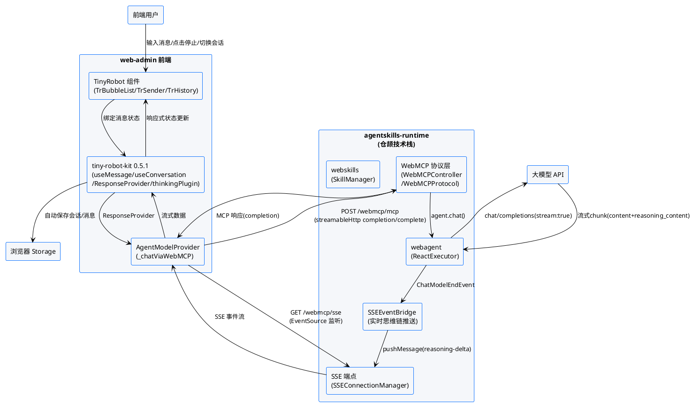
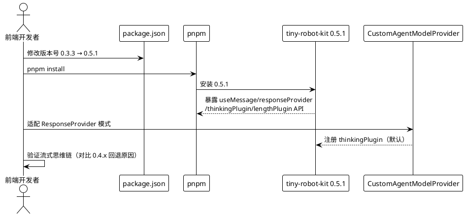
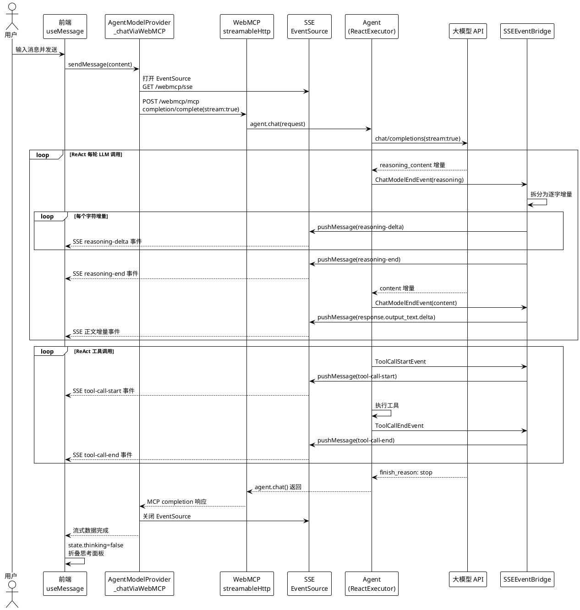
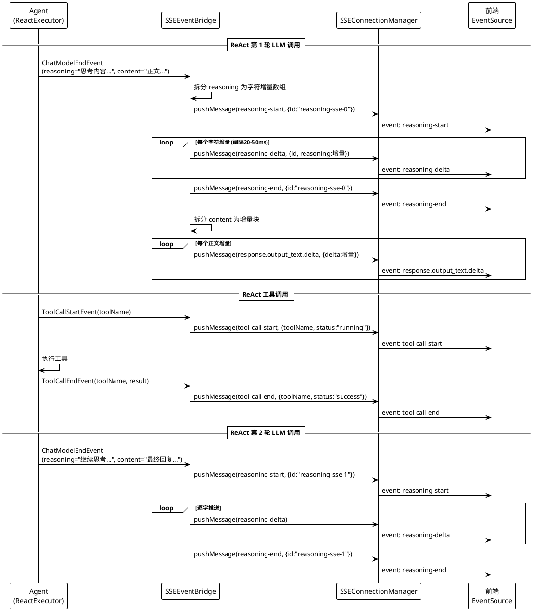
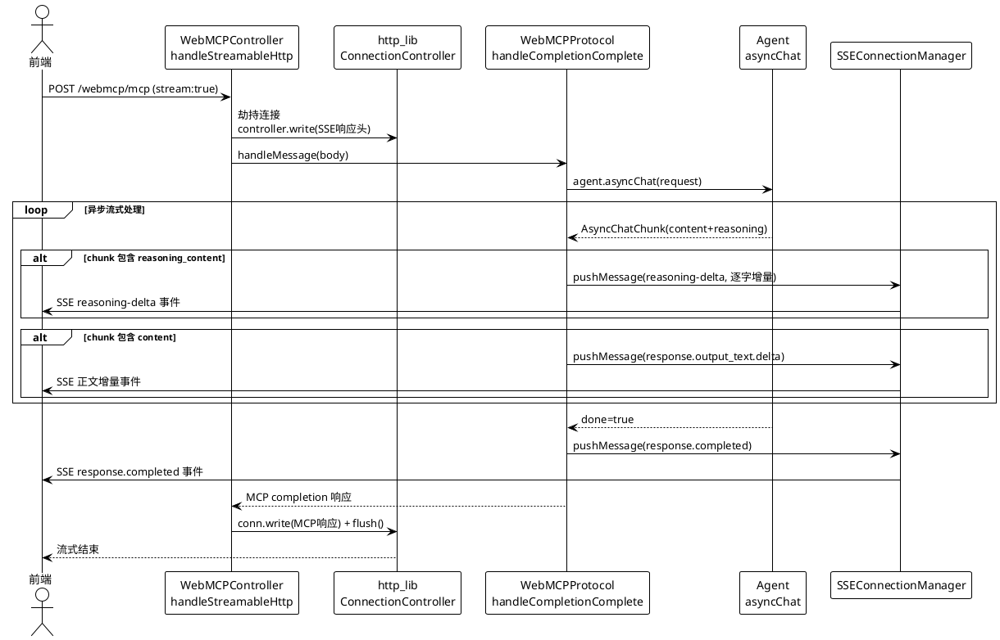
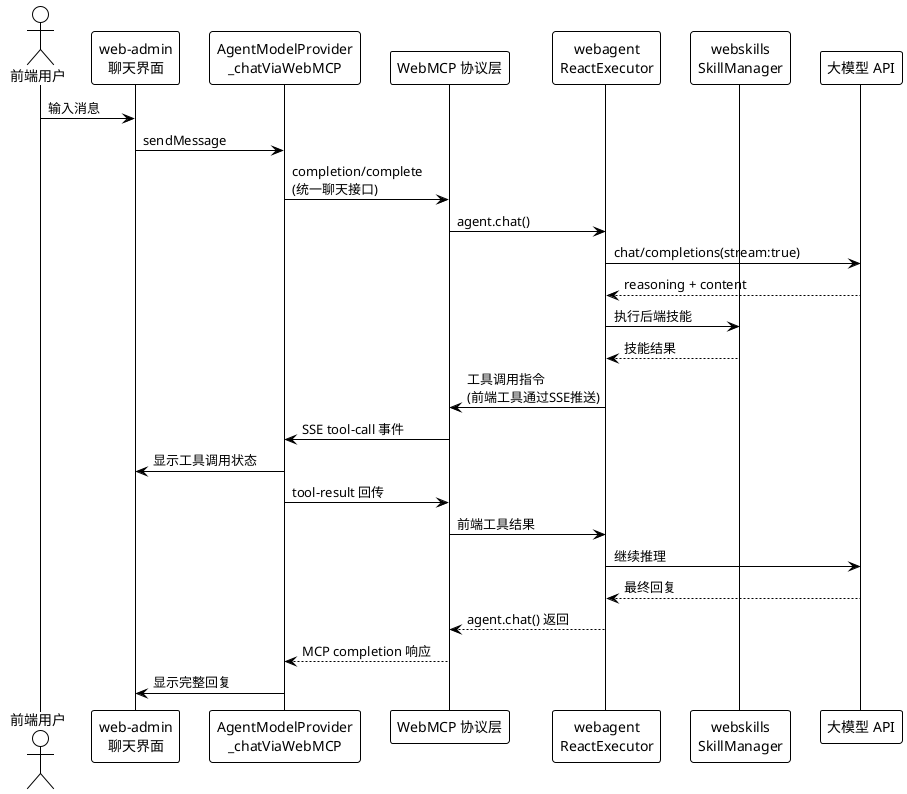
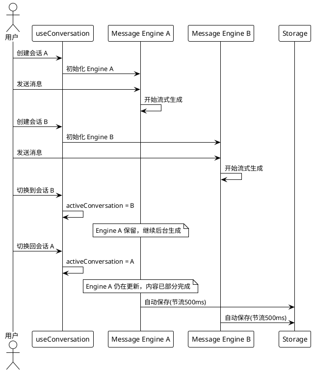

# **1. 组件定位**

## **1.1 核心职责**
本组件负责升级本地依赖的 @opentiny/tiny-robot-kit 从 0.3.3 到 0.5.1，并统一扩展 agentskills-runtime 的 WebMCP 接口实现大模型思维链（reasoning_content）的流式逐字逐句显示，使聊天接口与 webmcp+webagent+webskills 仓颉技术栈统一。

## **1.2 核心输入**
1. **用户聊天消息**：用户在前端聊天界面输入的文本消息，通过 WebMCP 协议 completion/complete 方法发送到后端
2. **大模型流式响应 chunk**：大模型 API 返回的 SSE 流式数据块，包含 content（正文内容）和 reasoning_content（思维链内容）字段
3. **取消请求信号**：用户点击"停止生成"按钮时通过 MCP notifications/cancelled 发出的中止信号
4. **会话切换指令**：用户在历史会话列表中切换会话的操作指令
5. **工具调用结果回传**：前端执行完 WebMCP 工具后通过 /api/v1/uctoo/webmcp/tool-result 端点回传的结果
6. **模型配置参数**：模型名称、API 地址、API Key 等大模型连接配置

## **1.3 核心输出**
1. **流式思维链内容**：大模型思考过程的 reasoning_content 逐字逐句通过 SSE 推送到前端，实时显示在"思考过程"折叠面板中
2. **流式正文内容**：大模型回复的 content 逐字逐句通过 SSE 推送到前端，实时显示在助手消息气泡中
3. **工具调用状态推送**：ReAct 执行过程中工具调用的开始、结束状态通过 SSE 实时推送
4. **消息状态变更**：请求状态（idle/processing/completing/completed/aborted/error）的实时变更通知
5. **持久化会话数据**：会话元数据和历史消息保存到 Storage Strategy（LocalStorage/IndexedDB）
6. **MCP 协议标准响应**：completion/complete 返回符合 MCP 协议标准的 JSON-RPC 2.0 格式响应

## **1.4 职责边界**
1. **不负责**大模型 API 的直接调用和鉴权——由后端 agentskills-runtime 通过 ChatModel 代理转发到 OpenAI 兼容接口
2. **不负责**ReAct 推理循环的执行逻辑——由后端 AgentExecutor（ReactExecutor）负责
3. **不负责**技能加载、工具注册——由现有 SkillManager 和 webskills 技术栈处理
4. **不负责**用户认证和权限控制——由现有 auth 中间件处理
5. **不负责**数据库 schema 变更——本升级仅涉及前端依赖版本和后端 WebMCP 接口流式响应增强
6. **不负责**AIController 的独立增强——AIController 降级为 OpenAI 兼容辅助接口，主要聊天统一走 WebMCP 接口

# **2. 领域术语**

**流式输出（Streaming Output）**
: 大模型在生成回复过程中，将内容分成多个数据块（chunk）逐步返回，而非等待全部生成完毕后一次性返回的输出方式。

**思维链（Reasoning / Thinking Chain）**
: 大模型在生成最终回复之前产生的思考过程文本，通常通过响应中的 reasoning_content 字段返回，展示模型"如何思考"得出结论。

**WebMCP 协议（Web Model Context Protocol）**
: agentskills-runtime 实现的基于 HTTP 的模型上下文协议，替代原开源项目 NestJS 实现，使用仓颉编程语言实现，提供 completion/complete、tools/call 等标准 MCP 方法。

**streamableHttp 传输**
: MCP 协议的 HTTP 流式传输方式，前端通过 StreamableHTTPClientTransport 连接后端 /api/v1/uctoo/webmcp/mcp 端点，支持流式响应。

**Message Engine（消息引擎）**
: tiny-robot-kit 0.5.1 中负责管理单会话消息生命周期、请求状态、流式合并和取消请求的核心运行时单元。

**ResponseProvider（响应提供者）**
: tiny-robot-kit 0.5.1 中将业务后端或模型服务转换为统一响应流的适配边界，接收请求体和 AbortSignal，产出 ChatCompletion chunk。

**thinkingPlugin（思考插件）**
: tiny-robot-kit 0.5.1 中默认注册的消息处理插件，当响应 chunk 包含 reasoning_content 时，维护消息的 thinking 和 open 状态。

**SSEEventBridge（SSE 事件桥接器）**
: agentskills-runtime 中将 ReAct 执行过程中的 ChatModelEndEvent、ToolCallStartEvent、ToolCallEndEvent 转换为 SSE 事件推送到前端的桥接器，实现实时思维链显示。

**SSEConnectionManager（SSE 连接管理器）**
: 管理 SSE 连接的注册、移除和消息推送的基础设施，每个 sessionId 对应一个 SSE 写入回调，通过 conn.write()+flush() 推送事件。

**http_lib（仓颉 HTTP 通信库）**
: 替代原 stdx 通信组件的全仓颉源码 HTTP 通信库，提供 ConnectionController、WebSocketConn 等定制通信能力，支持连接劫持和裸字节流写入。

**webmcp+webagent+webskills 技术栈**
: agentskills-runtime 的仓颉技术栈体系，webmcp 提供 MCP 协议通信层，webagent 提供 Agent 执行能力，webskills 提供技能管理，替代原开源项目的 NestJS 实现。

**ReAct 执行循环**
: agentskills-runtime 中 Agent 的推理-行动循环，每轮包含 LLM 调用（可能产生 reasoning）和工具调用，直到生成最终回复。

**AbortSignal（取消信号）**
: Web 标准的请求取消机制，用户点击"停止生成"时触发，通过 MCP notifications/cancelled 传递到后端。

# **3. 角色与边界**

## **3.1 核心角色**
- **前端用户**：在 web-admin 聊天界面输入消息、查看流式回复和思维链、点击停止生成、切换历史会话的终端用户
- **系统管理员**：配置大模型 API 连接参数（MODEL_CONFIG、ATOMGIT_BASE_URL 等）、管理 Agent 定义的运维人员

## **3.2 外部系统**
- **agentskills-runtime 后端**：通过 WebMCP 协议接收前端聊天请求，执行 ReAct 推理循环，调用大模型 API，通过 SSE 流式推送思维链和正文内容
- **大模型 API 服务**：OpenAI 兼容的聊天补全接口（如 DeepSeek、昇腾/AtomGit），支持 stream:true 流式返回 reasoning_content
- **@opentiny/tiny-robot-kit 0.5.1**：前端 AI 对话数据处理工具包，提供 useMessage、useConversation、ResponseProvider、Storage Strategy、Plugins 能力
- **@opentiny/tiny-robot 0.5.1**：前端 AI 交互组件库，提供 TrBubbleList、TrSender、TrHistory 等聊天 UI 组件
- **http_lib 仓颉 HTTP 库**：提供连接劫持、裸字节流写入、SSE 流式推送能力，替代原 stdx 通信组件
- **浏览器 Storage**：LocalStorage / IndexedDB，用于会话元数据和历史消息的持久化存储

## **3.3 交互上下文**

# **4. DFX约束**

## **4.1 性能**
1. **流式首字延迟**：用户发送消息后，首个 reasoning-delta 或正文 SSE 事件到达前端的时间必须 ≤ 3 秒（大模型 API 响应时间除外）
2. **思维链推送粒度**：reasoning_content 的推送粒度必须为逐字或逐词，不得整段一次性推送（后端 SSEEventBridge 现有实现为整段推送，需优化为逐字流式）
3. **正文流式推送**：正文 content 必须通过 SSE 实时逐块推送，不得等待 agent.chat() 完成后一次性返回（现有 handleStreamableHttp 为假流式，需改为真流式）
4. **自动保存节流**：流式输出期间 LocalStorage 自动保存的节流间隔默认 500ms，避免每个 chunk 都触发持久化写入
5. **内存占用**：单个会话的消息 Engine 常驻内存时，消息数组不得超过 1000 条；切换会话后非当前 Engine 应及时清理

## **4.2 可靠性**
1. **请求取消确定性**：用户点击"停止生成"后，前端 AbortSignal 必须通过 MCP notifications/cancelled 传递到后端，后端必须中止正在执行的大模型 API 调用和 ReAct 循环
2. **会话隔离保证**：多个会话拥有独立的消息 Engine，切换会话不得取消仍在后台生成的其他会话请求
3. **断线恢复能力**：页面刷新后，会话列表和历史消息必须从 Storage 中完整恢复；正在生成的请求刷新后视为中止
4. **超时协同约束**：runtime HTTP 客户端 readTimeout（2 分钟）必须 < 前端 AbortController timeout（10 分钟），确保 runtime 能在前端超时前返回
5. **SSE 连接保活**：SSE 连接必须通过 ping 心跳（每 15 秒）保持活跃，防止代理和防火墙超时断开
6. **progress 事件保活**：ReAct 执行期间必须每 15 秒推送 progress SSE 事件，防止前端 resetTimeoutOnProgress 超时

## **4.3 安全性**
1. **API Key 保护**：大模型 API Key 不得暴露到前端构建产物，必须通过 agentskills-runtime 后端代理转发
2. **流式内容转义**：SSE 推送的 reasoning_content 和 content 必须经过 JSON 转义，防止注入攻击
3. **会话数据隔离**：不同用户的会话数据必须隔离，不得跨用户访问

## **4.4 可维护性**
1. **日志可观测**：后端流式推送的每个 reasoning-delta、tool-call-start、tool-call-end 事件必须记录调试日志，包含 sessionId、stepCount、内容长度
2. **错误可追踪**：流式输出过程中发生的异常必须记录完整错误堆栈，并向前端推送错误事件而非静默丢弃
3. **版本可追溯**：tiny-robot-kit 升级后的 API 使用情况必须有文档记录，标注与 0.3.3 的差异点和 0.4.x 回退原因
4. **统一接口可维护**：聊天接口统一走 WebMCP 协议层，不得在 AIController 和 WebMCP 中重复实现聊天逻辑

## **4.5 兼容性**
1. **前端依赖版本兼容**：升级后的 tiny-robot-kit 0.5.1 API 必须与现有 CustomAgentModelProvider、useTinyRobotChat 的调用方式兼容，或提供适配层
2. **WebMCP 协议兼容**：升级后的流式响应必须保持 MCP 协议 JSON-RPC 2.0 格式，现有非流式调用方不受影响
3. **AIController 兼容保留**：AIController 作为 OpenAI 兼容辅助接口保留，不得移除，但不再作为主要聊天接口增强
4. **浏览器兼容**：SSE 流式输出必须兼容 Chrome、Edge、Firefox 主流浏览器；IndexedDB 存储策略必须支持降级到 LocalStorage
5. **存量数据兼容**：升级前已有的 LocalStorage 会话数据必须能被 0.5.1 的 Storage Strategy 正确读取
6. **http_lib 兼容**：流式响应增强必须基于 http_lib 的 ConnectionController 和 conn.write()+flush() 能力，不得回退到 stdx 通信组件

# **5. 核心能力**

## **5.1 tiny-robot 依赖升级（0.3.3 → 0.5.1）**

### **5.1.1 业务规则**
1. **版本升级规则**：必须将 @opentiny/tiny-robot、@opentiny/tiny-robot-kit、@opentiny/tiny-robot-svgs 三个包统一升级到 0.5.1，禁止混版本
   a. 验收条件：[升级后 package.json 中三个包版本均为 0.5.1] → [pnpm install 成功且无 peer dependency 警告]
2. **0.4.x 回退原因记录**：必须记录之前从 0.4.x 回退到 0.3.3 的原因（思维链未能实现），并验证 0.5.1 已修复该问题
   a. 验收条件：[0.5.1 的 thinkingPlugin 默认注册且处理 reasoning_content] → [思维链显示功能正常，不再需要回退]
3. **API 迁移规则**：必须将前端 useMessage 调用从 0.3.3 的 AIClient 模式迁移到 0.5.1 的 ResponseProvider 模式
   a. 验收条件：[useMessage 的 options 从 { client: AIClient } 变为 { responseProvider } ] → [消息发送、流式接收、取消请求功能正常]
4. **插件注册规则**：必须保留 0.5.1 默认注册的 thinkingPlugin 和 lengthPlugin，不得禁用 thinkingPlugin
   a. 验收条件：[大模型返回 reasoning_content 时] → [前端"思考过程"折叠面板自动展开并显示思维链内容]
5. **禁止项**：禁止保留 0.3.3 的 STATUS 枚举和 MessageState 接口，必须使用 0.5.1 的 RequestState（idle/processing/completed/aborted/error）
   a. 验收条件：[代码中不存在 STATUS.INIT/STATUS.PROCESSING 等旧枚举引用] → [编译通过且类型检查无错误]

### **5.1.2 交互流程**

### **5.1.3 异常场景**
1. **依赖安装冲突**
   a. 触发条件：0.5.1 的 peer dependency（vue >=3.0.0）与项目 Vue 版本不兼容
   b. 系统行为：pnpm install 报错并提示版本冲突
   c. 用户感知：开发者看到 peer dependency 警告，需确认 Vue 版本满足要求
2. **0.4.x 回退问题复现**
   a. 触发条件：0.5.1 的 thinkingPlugin 仍存在 0.4.x 时的思维链显示问题
   b. 系统行为：思维链不显示或显示异常
   c. 用户感知：需对比 0.4.x 回退原因，确认 0.5.1 已修复；如未修复需记录新 issue
3. **API 不兼容**
   a. 触发条件：0.3.3 的 AIClient 接口在 0.5.1 中已移除或变更
   b. 系统行为：TypeScript 编译报错，提示类型不匹配
   c. 用户感知：开发者看到编译错误，需按 0.5.1 API 迁移代码
4. **存量数据格式不兼容**
   a. 触发条件：0.3.3 存储的 LocalStorage 会话数据格式与 0.5.1 Storage Strategy 不兼容
   b. 系统行为：0.5.1 Storage Strategy 读取失败，返回空会话列表
   c. 用户感知：用户刷新后历史会话丢失，需重新创建会话

## **5.2 WebMCP 接口统一流式思维链**

### **5.2.1 业务规则**
1. **统一聊天接口规则**：前端聊天必须统一通过 WebMCP 协议 completion/complete 方法发送请求，不得同时使用 AIController 和 WebMCP 两套聊天接口
   a. 验收条件：[前端网络请求面板] → [聊天请求统一指向 /api/v1/uctoo/webmcp/mcp，不出现 /api/v1/ai/chat/completions]
2. **SSE 双通道流式规则**：前端必须同时建立两个通道——streamableHttp POST 通道发送 completion/complete 请求，SSE GET 通道（EventSource）接收 reasoning-delta、tool-call 等实时事件
   a. 验收条件：[前端发送聊天消息] → [同时存在 POST /webmcp/mcp 和 GET /webmcp/sse 两个连接]
3. **reasoning_content 逐字流式推送规则**：后端 SSEEventBridge 必须将完整的 reasoning_content 拆分为逐字或逐词的增量块，通过多个 reasoning-delta SSE 事件推送，不得整段一次性推送
   a. 验收条件：[SSEEventBridge 收到 reasoning 内容] → [推送多个 reasoning-delta 事件，每个事件仅包含少量字符增量，前端看到逐字显示效果]
4. **正文流式推送规则**：后端必须在 ReAct 执行过程中通过 SSE 实时推送正文 content 增量，不得等待 agent.chat() 完成后一次性返回完整响应
   a. 验收条件：[ReAct 执行过程中 LLM 产生 content] → [通过 SSE response.output_text.delta 事件实时推送增量到前端]
5. **ReAct 多轮思维链规则**：ReAct 执行循环中每轮 LLM 调用产生的 reasoning_content 必须作为独立的思维链块推送，每个块有唯一 id
   a. 验收条件：[ReAct 执行 N 轮 LLM 调用] → [前端显示 N 个独立的"思考过程"块，每个块有唯一 thinkId]
6. **工具调用状态推送规则**：SSEEventBridge 必须推送 tool-call-start 和 tool-call-end 事件，与 reasoning 事件交替推送，保持 ReAct 执行过程的完整可观测性
   a. 验收条件：[ReAct 执行工具调用] → [前端收到 tool-call-start → reasoning-delta → tool-call-end 的事件序列]
7. **禁止项**：禁止在前端通过 AI SDK 直接调用大模型 API 获取 reasoning_content，必须通过 agentskills-runtime WebMCP 接口代理转发
   a. 验收条件：[前端网络请求面板] → [不出现直接到大模型 API 的请求，所有请求都指向 agentskills-runtime WebMCP 端点]

### **5.2.2 交互流程**

### **5.2.3 异常场景**
1. **大模型不支持 reasoning_content**
   a. 触发条件：大模型 API 不返回 reasoning_content 字段（如 DeepSeek-V3 非推理模型）
   b. 系统行为：thinkingPlugin 不触发，SSEEventBridge 不推送 reasoning 事件，消息 state.thinking 保持 undefined
   c. 用户感知：前端不显示"思考过程"面板，仅显示正文内容
2. **SSE 连接中断**
   a. 触发条件：流式输出过程中 SSE 连接断开或服务器关闭连接
   b. 系统行为：前端 EventSource.onerror 触发，已接收的部分内容保留，completion/complete 请求继续等待
   c. 用户感知：思维链显示可能不完整，但 completion 响应返回后正文内容完整显示
3. **completion/complete 请求超时**
   a. 触发条件：agent.chat() 执行时间超过前端 AbortController timeout（10 分钟）
   b. 系统行为：前端 abort 发送 notifications/cancelled，后端中止 ReAct 循环
   c. 用户感知：前端显示"请求超时"错误提示，已接收的 SSE 内容保留
4. **reasoning_content 解析失败**
   a. 触发条件：后端推送的 SSE 事件格式不符合预期或 JSON 解析失败
   b. 系统行为：前端跳过该 chunk，记录错误日志，继续处理后续 chunk
   c. 用户感知：思维链显示可能不完整，但正文内容不受影响
5. **思维链内容过长**
   a. 触发条件：reasoning_content 超过 10000 字符
   b. 系统行为：前端"思考过程"面板支持滚动查看，默认折叠后显示前 200 字符预览
   c. 用户感知：用户可点击展开查看完整思维链，滚动浏览

## **5.3 SSEEventBridge 逐字流式优化**

### **5.3.1 业务规则**
1. **逐字推送规则**：SSEEventBridge 必须将完整的 reasoning_content 拆分为逐字或逐词的增量块，通过多个 reasoning-delta 事件推送，而非一次性推送整段内容
   a. 验收条件：[SSEEventBridge 收到 reasoning 内容"思考过程..."] → [推送多个 reasoning-delta 事件，每个事件仅包含 1-10 个字符增量]
   b. **仓颉 Rune 切分约束**：仓颉 String 为 UTF-8 编码，直接用 `content[0..chunkSize]` 字节切片会截断多字节中文字符。必须先调用 `content.toRuneArray()` 转换为 `Array<Rune>`，再按 chunkSize 切分 Rune 数组，最后用 `String.fromRuneArray(slice)` 还原为字符串增量块。
2. **推送间隔规则**：逐字推送的间隔时间必须可控，默认每个 chunk 间隔 20-50ms，模拟大模型逐字输出效果
   a. 验收条件：[前端接收 reasoning-delta 事件] → [能看到逐字显示的动画效果，而非一次性出现]
   b. **仓颉 Duration 转换约束**：仓颉标准库 `sleep` 接收 `Duration` 类型而非 `Int64`，禁止直接写 `sleep(intervalMs)`，必须写 `sleep(Duration.millisecond * intervalMs)`。参考 `WebMCPProtocol.cj:1276` 现有写法 `sleep(Duration.second * 15)`。
3. **超长思维链动态调整规则**：当 reasoning_content 长度超过 5000 字符时，逐字推送总耗时将超过 30 秒（按默认 chunkSize=5、intervalMs=30ms 计算 = 60 秒），远超前端 `resetTimeoutOnProgress` 的 15 秒 progress 保活间隔。因此必须动态调整 chunkSize 和 intervalMs
   a. 验收条件：[reasoning_content 长度 > 5000 字符] → [chunkSize 自动增大为 `max(5, length/200)`，intervalMs 降为 20ms，确保总推送耗时不超过 30 秒]
   b. 验收条件：[reasoning_content 长度 ≤ 5000 字符] → [使用默认 chunkSize=5、intervalMs=30ms，保持逐字动画效果]
4. **ReAct 多轮独立推送规则**：ReAct 执行循环中每轮 LLM 调用的 reasoning_content 必须作为独立的思维链块推送，每个块有唯一 reasoningId（reasoning-sse-{stepCount}）
   a. 验收条件：[ReAct 执行 3 轮 LLM 调用] → [前端收到 3 组 reasoning-start/reasoning-delta/reasoning-end 事件，每组 id 唯一]
5. **正文增量推送规则**：SSEEventBridge 必须新增对正文 content 的增量推送，通过 response.output_text.delta SSE 事件实时推送，而非等待 agent.chat() 完成后一次性返回
   a. 验收条件：[ReAct 执行过程中 LLM 产生 content 增量] → [通过 SSE response.output_text.delta 事件实时推送]
6. **工具调用状态推送规则**：SSEEventBridge 必须继续推送 tool-call-start 和 tool-call-end 事件，与 reasoning 和 content 事件交替推送
   a. 验收条件：[ReAct 执行工具调用] → [前端收到 tool-call-start → reasoning-delta → tool-call-end 的事件序列]
7. **仓颉 JSON 转义约束**：SSE 推送的 reasoning_content 和 content 增量必须经过 JSON 转义，防止注入攻击。**禁止使用手工 `replace` 链**（遗漏 Unicode 控制字符 `\u0000-\u001F`），应使用仓颉标准库的 `JsonString(value).toString()` 标准化转义，或抽取 `escapeJson(str: String): String` 工具方法覆盖全部控制字符
8. **禁止项**：禁止在 ChatModelEndEventHandler 中一次性推送完整 reasoning_content 字符串
   a. 验收条件：[SSEEventBridge 代码] → [不出现 sseMgr.pushMessage(sid, "reasoning-delta", 完整reasoning) 的整段推送]

### **5.3.2 交互流程**

### **5.3.3 异常场景**
1. **SSE 连接已断开**
   a. 触发条件：推送 reasoning-delta 时 SSEConnectionManager.hasConnection 返回 false
   b. 系统行为：SSEEventBridge 跳过推送，记录警告日志
   c. 用户感知：前端已断开连接，不收到推送，completion 响应仍可正常返回
2. **reasoning 内容为空**
   a. 触发条件：ChatModelEndEvent 的 chatResponse.message.reason 为 None 或空字符串
   b. 系统行为：SSEEventBridge 不推送任何 reasoning 事件
   c. 用户感知：前端不显示"思考过程"面板
3. **逐字推送过程中异常**
   a. 触发条件：逐字推送过程中 SSEConnectionManager.pushMessage 抛出异常
   b. 系统行为：SSEEventBridge 捕获异常，停止后续推送，记录错误日志
   c. 用户感知：思维链显示不完整，但 ReAct 执行不受影响

## **5.4 WebMCP completion/complete 流式响应增强**

### **5.4.1 业务规则**
1. **真流式响应规则**：WebMCPController.handleStreamableHttp 必须利用 http_lib 的 ConnectionController 实现真正的流式 HTTP 响应，不得使用 spawn + res.send() 的假流式模式
   a. 验收条件：[handleStreamableHttp 处理流式请求] → [通过 conn.write()+flush() 逐步推送响应，而非一次性 res.send() 完整响应]
2. **asyncChat 使用规则**：后端流式处理必须使用 ChatModel.asyncCreate 获取 AsyncChatResponse，通过 chunks 迭代器逐块处理，不得使用同步 ChatModel.create 阻塞
   a. 验收条件：[后端处理流式请求] → [使用 asyncResponse.chunks 迭代器逐块读取，每块通过 SSE 推送]
3. **SSE 事件格式统一规则**：流式响应必须遵循统一的 SSE 事件格式：reasoning-start、reasoning-delta、reasoning-end、response.output_text.delta、response.completed、tool-call-start、tool-call-end、progress
   a. 验收条件：[前端 SSE 事件监听器] → [能正确解析所有事件类型并分别更新思维链、正文和工具调用状态]
4. **MCP 协议响应兼容规则**：流式响应完成后必须返回符合 MCP 协议标准的 JSON-RPC 2.0 格式响应（completion.values 数组），与非流式响应格式一致
   a. 验收条件：[流式响应完成] → [返回 { jsonrpc:"2.0", result:{ completion:{ values:[...], total, hasMore } } } 格式]
5. **progress 保活规则**：ReAct 执行期间必须每 15 秒通过 SSE 推送 progress 事件，防止前端 resetTimeoutOnProgress 超时
   a. 验收条件：[ReAct 执行时间超过 15 秒] → [前端每 15 秒收到 progress SSE 事件]
6. **禁止项**：禁止在流式接口中使用同步 ChatModel.create 阻塞等待完整响应
   a. 验收条件：[流式接口代码] → [不出现 _chatModel.create() 同步调用，仅出现 _chatModel.asyncCreate()]

### **5.4.2 交互流程**

### **5.4.3 异常场景**
1. **asyncCreate 不支持**
   a. 触发条件：ChatModel 实现未提供 asyncCreate 方法
   b. 系统行为：降级为同步 create，通过 SSEEventBridge 推送 reasoning，completion 响应一次性返回
   c. 用户感知：思维链可逐字显示（通过 SSEEventBridge），但正文一次性显示
2. **连接劫持失败**
   a. 触发条件：http_lib ConnectionController 无法劫持连接（req.connection 为 None）
   b. 系统行为：降级为 spawn + res.send() 假流式模式，SSE 事件仍通过独立 SSE 端点推送
   c. 用户感知：思维链通过 SSE 端点正常显示，completion 响应一次性返回
3. **大模型 API 流式响应解析失败**
   a. 触发条件：大模型返回的 SSE 数据格式不符合 OpenAI 规范
   b. 系统行为：后端记录错误日志，通过 SSE 推送 response.failed 事件
   c. 用户感知：前端显示"模型请求失败"错误提示
4. **后端 ReAct 执行超时**
   a. 触发条件：ReAct 循环执行时间超过 readTimeout（2 分钟）
   b. 系统行为：HTTP 客户端抛出超时异常，通过 SSE 推送错误事件
   c. 用户感知：前端显示"请求超时"错误提示，已接收的部分内容保留

## **5.5 统一聊天接口与工具组合调用**

### **5.5.1 业务规则**
1. **聊天接口统一规则**：前端聊天必须统一通过 WebMCP 协议 completion/complete 方法发送请求，AIController 作为 OpenAI 兼容辅助接口保留但不作为主要聊天接口
   a. 验收条件：[前端聊天请求] → [统一走 /api/v1/uctoo/webmcp/mcp completion/complete，不走 /api/v1/ai/chat/completions]
2. **工具组合调用统一规则**：ReAct 执行过程中的工具调用必须统一通过 WebMCP 协议层处理，前端工具通过 /api/v1/uctoo/webmcp/tool-result 回传结果，后端工具通过 SkillManager 执行
   a. 验收条件：[ReAct 调用工具] → [前端工具通过 WebMCP tool-result 回传，后端工具通过 SkillManager 执行，结果统一通过 SSE 推送]
3. **webmcp+webagent+webskills 技术栈统一规则**：聊天接口必须与 webagent（Agent 执行）和 webskills（技能管理）统一在 WebMCP 协议层，不得在 AIController 中重复实现 Agent 执行逻辑
   a. 验收条件：[AIController 代码] → [不包含 SkillAwareAgent 和 ReactExecutor 的初始化，仅直接调用 ChatModel]
4. **AIController 兼容保留规则**：AIController 作为 OpenAI 兼容接口保留，供第三方 OpenAI 兼容客户端调用，但不增强流式思维链能力
   a. 验收条件：[第三方 OpenAI 兼容客户端调用 /api/v1/ai/chat/completions] → [能正常获取聊天响应，但不包含 reasoning_content 流式推送]
5. **禁止项**：禁止在 AIController 和 WebMCPProtocol 中重复实现 ReAct 执行和思维链推送逻辑
   a. 验收条件：[AIController 代码] → [不包含 SSEEventBridge 初始化和 agent.chat() 调用，仅直接调用 ChatModel]

### **5.5.2 交互流程**

### **5.5.3 异常场景**
1. **AIController 被误调用**
   a. 触发条件：前端误调用 /api/v1/ai/chat/completions 而非 WebMCP 接口
   b. 系统行为：AIController 正常响应但不包含 reasoning_content 流式推送
   c. 用户感知：聊天功能正常但无思维链显示，需检查前端调用路径
2. **工具调用结果回传失败**
   a. 触发条件：前端工具执行后回传 /webmcp/tool-result 失败
   b. 系统行为：后端 PendingToolCallManager 超时，ReAct 循环报错
   c. 用户感知：前端显示"工具执行超时"错误提示
3. **webmcp+webagent+webskills 技术栈不一致**
   a. 触发条件：WebMCP 协议层与 webagent 或 webskills 版本不兼容
   b. 系统行为：Agent 初始化或技能加载失败
   c. 用户感知：前端显示"服务初始化失败"错误提示

## **5.6 会话管理与持久化**

### **5.6.1 业务规则**
1. **会话隔离规则**：每个会话必须拥有独立的消息 Engine，会话间的消息和请求状态不得相互影响
   a. 验收条件：[会话 A 正在生成，切换到会话 B] → [会话 B 的消息和状态独立，会话 A 在后台继续生成]
2. **后台运行保留规则**：切换会话时，仍在 processing 状态的 Engine 必须保留，不得销毁或打断
   a. 验收条件：[会话 A 正在生成，切换到会话 B 再切回 A] → [会话 A 的生成过程未被中断，内容继续更新]
3. **自动保存规则**：当 autoSaveMessages 为 true 时，消息变化必须触发自动保存，节流间隔由 autoSaveThrottle 控制
   a. 验收条件：[流式输出期间消息持续更新] → [每 500ms 触发一次保存，而非每个 chunk 都保存]
4. **存储策略可替换规则**：LocalStorage 策略必须可替换为 IndexedDB 策略，上层会话逻辑无需改动
   a. 验收条件：[将 storage 从 localStorageStrategyFactory 改为 indexedDBStorageStrategyFactory] → [会话功能正常，数据存储到 IndexedDB]
5. **禁止项**：禁止在切换会话时自动取消仍在生成的后台请求，取消必须由用户显式触发
   a. 验收条件：[切换会话操作] → [不触发 abortActiveRequest，后台请求继续]

### **5.6.2 交互流程**

### **5.6.3 异常场景**
1. **LocalStorage 配额超限**
   a. 触发条件：会话和消息数据超过 LocalStorage 的 5-10MB 限制
   b. 系统行为：自动保存失败，记录错误日志
   c. 用户感知：提示"存储空间不足，建议切换到 IndexedDB 或清理历史会话"
2. **IndexedDB 不可用**
   a. 触发条件：浏览器不支持 IndexedDB 或被禁用（如隐私模式）
   b. 系统行为：降级到 LocalStorage 策略
   c. 用户感知：用户无感知，数据存储到 LocalStorage
3. **会话数据损坏**
   a. 触发条件：Storage 中的会话数据格式损坏或版本不兼容
   b. 系统行为：跳过损坏的会话，加载其他正常会话
   c. 用户感知：部分历史会话可能丢失，其他会话正常

# **6. 数据约束**

## **6.1 ChatMessage（聊天消息）**
1. **role**：消息角色，取值范围为 "user" | "assistant" | "system" | "tool"，必填
2. **content**：消息正文内容，类型为 string 或多模态数组，必填
3. **state**：消息运行时状态对象，可选；包含 thinking（boolean，是否正在思考）和 open（boolean，思考面板是否展开）
4. **metadata**：消息元数据对象，可选；包含 createdAt（创建时间戳）、updatedAt（更新时间戳）等
5. **loading**：消息是否处于加载状态，boolean，可选；流式输出期间为 true，完成后移除
6. **uiContent**：UI 显示格式内容数组，可选；包含 text、collapsible-text（思考过程）、tool、image 等类型的显示组件

## **6.2 ChatCompletion Chunk（流式响应块）**
1. **id**：响应块标识，string，必填
2. **object**：对象类型，取值 "chat.completion.chunk"，必填
3. **created**：创建时间戳，number，必填
4. **model**：模型名称，string，必填
5. **choices**：选择数组，必填；每个 choice 包含：
   - **index**：选择索引，number，必填
   - **delta**：增量内容对象，包含 role、content、reasoning_content 字段，可选
   - **finish_reason**：结束原因，取值 "stop" | "length" | null，必填
6. **reasoning_content**：思维链增量内容，string，可选；存在于 delta 中时触发 thinkingPlugin

## **6.3 SSE 事件（服务器推送事件）**
1. **reasoning-start**：思维链开始事件，data 包含 id（思维链块唯一标识，格式 reasoning-sse-{stepCount}）
2. **reasoning-delta**：思维链增量事件，data 包含 id 和 reasoning（增量内容字符串，1-10 个字符）
3. **reasoning-end**：思维链结束事件，data 包含 id
4. **response.output_text.delta**：正文增量事件，data 包含 output_index（Int64，正文输出索引，从 0 开始）和 delta（**正文增量字符串，非完整正文**；每个 delta 为当前 chunk 新产生的正文内容，前端需累加拼接为完整正文）。参考 `AIController.cj:212-214` 现有实现 `{"type":"response.output_text.delta","output_index":0,"delta":"${escapeJson(content)}"}`，其中 `content` 为 chunk 增量内容。
5. **response.completed**：响应完成事件，data 包含 response 对象（role、content、finish_reason）
6. **response.failed**：响应失败事件，data 包含 error 对象（message）
7. **tool-call-start**：工具调用开始事件，data 包含 toolName 和 status（"running"）
8. **tool-call-end**：工具调用结束事件，data 包含 toolName 和 status（"success"）
9. **progress**：进度保活事件，data 包含 progress（进度值），每 15 秒推送一次防止前端超时
10. **connected**：SSE 连接建立事件，data 包含 sessionId
11. **ping**：SSE 心跳事件，每 15 秒推送一次保持连接活跃

## **6.4 RequestState（请求状态）**
1. **requestState**：请求状态，取值 "idle" | "processing" | "completed" | "aborted" | "error"，必填
2. **processingState**：处理子状态，取值 "requesting" | "completing" | undefined；requestState 为 processing 时必填
3. **isProcessing**：是否正在处理，boolean；requestState 为 processing 时为 true
4. **messages**：当前会话消息数组，ChatMessage[]，必填

## **6.5 UseMessageOptions（消息引擎配置）**
1. **responseProvider**：响应提供者函数，接收 MessageRequestBody 和 AbortSignal，返回 AsyncStreamableResult，必填
2. **initialMessages**：初始消息列表，ChatMessage[]，可选，默认空数组
3. **plugins**：插件数组，MessageEnginePlugin[]，可选；默认注册 thinkingPlugin 和 lengthPlugin
4. **requestMessageFields**：请求消息保留字段白名单，string[]，可选
5. **requestMessageFieldsExclude**：请求消息排除字段黑名单，string[]，可选，默认排除 state、metadata、loading
6. **onCompletionChunk**：自定义 chunk 处理回调，可选

## **6.6 UseConversationOptions（会话管理配置）**
1. **useMessageOptions**：消息引擎配置，UseMessageOptions，必填
2. **storage**：存储策略工厂函数，可选；默认 LocalStorage 策略
3. **autoSaveMessages**：是否自动保存消息，boolean，可选，默认 false
4. **autoSaveThrottle**：自动保存节流间隔，number，可选，默认 500ms

## **6.7 WebMCP completion/complete 请求（MCP 协议）**
1. **jsonrpc**：协议版本，取值 "2.0"，必填
2. **id**：请求标识，string 或 number，必填
3. **method**：方法名，取值 "completion/complete"，必填
4. **params**：参数对象，必填；包含：
   - **messages**：消息数组，包含 role 和 content 字段，必填
   - **model**：模型名称，string，可选
   - **stream**：是否流式响应，boolean，可选，默认 true
5. **reasoning_content**：思维链内容，string，可选；作为 completion 响应的独立字段转发（前端降级兼容使用）

## **6.8 WebMCP completion/complete 响应（MCP 协议）**
1. **jsonrpc**：协议版本，取值 "2.0"，必填
2. **id**：请求标识，与请求一致，必填
3. **result**：结果对象，必填；包含：
   - **completion**：完成对象，包含 values（字符串数组）、total（数量）、hasMore（是否还有更多）
   - **reasoning_content**：思维链内容，string，可选；独立字段转发供前端降级兼容
4. **error**：错误对象，可选；包含 code（错误码）和 message（错误信息）
