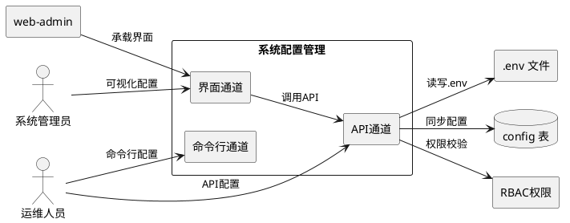
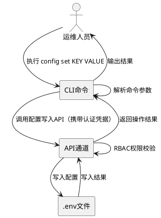
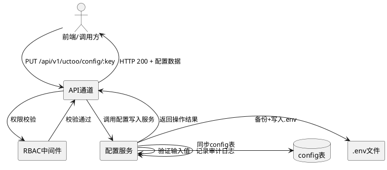
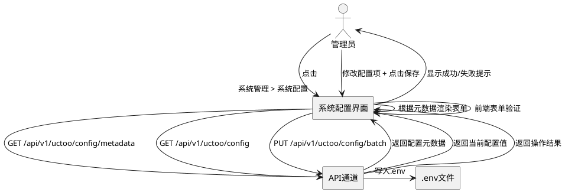
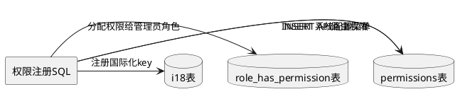

# 系统配置管理需求规格

**版本**: v1.0.0  
**创建日期**: 2026-07-18  
**最后更新**: 2026-07-18  
**状态**: 待设计和实现  
**关联模块**: agentskills-runtime、web-admin  
**基线版本**: 当前开发版本

---

# **1. 组件定位**

## **1.1 核心职责**

本组件负责对 agentskills-runtime 的 .env 配置文件进行全生命周期管理，提供命令行、API、可视化界面三种配置方式，实现配置的读取、修改、验证和持久化。

## **1.2 核心输入**

1. **命令行配置请求**：通过 CLI 命令传入的配置键值对，来源为运维人员或自动化脚本
2. **API 配置请求**：通过 RESTful API 传入的配置读写请求，来源为前端可视化界面或其他系统集成调用
3. **可视化界面操作**：通过 web-admin 管理后台的操作指令，来源为管理员用户
4. **.env 文件变更事件**：外部直接编辑 .env 文件后触发的变更检测信号

## **1.3 核心输出**

1. **配置读取响应**：返回当前 .env 文件中指定配置项或全部配置项的值
2. **配置写入结果**：配置修改后返回操作成功/失败状态及验证结果
3. **配置变更通知**：配置变更后通知相关模块刷新运行时配置
4. **数据库同步记录**：config 表与 .env 文件同步后的状态记录

## **1.4 职责边界**

1. **负责**：.env 配置文件的读取、写入、验证；命令行/API/界面三种配置通道的实现；config 表与 .env 文件的一致性同步；配置项的分组分类管理；配置变更的审计日志
2. **不负责**：
   - 不负责应用程序内部对配置值的使用逻辑（各模块自行读取所需配置）
   - 不负责数据库基础 CRUD 操作的底层实现（复用 f_orm 框架和 crudgen 生成的标准模块）
   - 不负责文件系统的底层读写（复用现有文件操作工具）
   - 不负责用户认证鉴权的底层实现（复用现有 RBAC 权限体系）
   - 不负责首次安装时的配置向导流程（已有 install.html 实现）
   - 不负责操作系统级别的环境变量管理

---

# **2. 领域术语**

**系统配置项（ConfigItem）**
: .env 文件中的一个配置键值对，包含键名、值、注释、分组等元信息。是系统配置管理的核心操作对象。

**配置分组（ConfigGroup）**
: 按业务功能对配置项进行分类的逻辑分组，如"日志配置""数据库配置""模型配置""API密钥配置"等。用于在可视化界面中组织配置项的展示。

**配置通道（ConfigChannel）**
: 对 .env 文件进行配置操作的方式，包括命令行通道（CLI）、API 通道（RESTful API）、界面通道（Web 可视化）。三种通道最终都通过 API 通道与 .env 文件交互。

**敏感配置项（SensitiveConfigItem）**
: 包含 API 密钥、密码、Token 等敏感信息的配置项。在读取和展示时必须脱敏处理，在写入时需额外验证。

**配置同步（ConfigSync）**
: config 数据库表与 .env 文件之间配置项的双向一致性同步机制，确保两侧配置数据最终一致。

**配置元数据（ConfigMetadata）**
: 描述配置项的元信息，包括配置项的分组、类型（string/int/bool/url/password）、是否敏感、默认值、验证规则、描述说明等。用于驱动可视化界面的表单渲染和输入验证。

**配置变更审计（ConfigAudit）**
: 记录配置变更的操作者、时间、变更前值、变更后值等信息，用于安全审计和变更追溯。

**.env 文件路径（EnvFilePath）**
: .env 配置文件在文件系统中的位置。开发环境位于项目根目录，生产环境位于 runtime 安装目录。不同操作系统和安装方式的路径可能不同。

---

# **3. 角色与边界**

## **3.1 核心角色**

| 角色 | 职责 | 交互方式 |
|------|------|----------|
| **系统管理员** | 通过可视化界面或命令行管理系统配置，具有配置读写的完整权限 | Web 界面 / CLI |
| **运维人员** | 通过命令行或 API 执行批量配置变更，主要用于自动化部署场景 | CLI / API |
| **开发者** | 在开发环境中直接编辑 .env 文件进行配置调试 | 文件编辑 / CLI |

## **3.2 外部系统**

| 系统 | 职责 | 交互方式 |
|------|------|----------|
| **agentskills-runtime** | 提供 .env 文件读写 API 的仓颉服务端实现 | RESTful API |
| **web-admin（tiny-pro）** | 提供系统配置可视化管理界面 | Vue 3 组件 + API 调用 |
| **PostgreSQL（config 表）** | 存储配置项的结构化数据，与 .env 文件保持同步 | f_orm DAO 操作 |
| **RBAC 权限体系** | 控制配置读写操作的访问权限 | permissions 表 + 中间件 |

## **3.3 交互上下文**



---

# **4. DFX约束**

## **4.1 性能**

1. 单个配置项读取响应时间 ≤ 100ms（P99）
2. 单个配置项写入响应时间 ≤ 200ms（P99）
3. 全量配置项读取响应时间 ≤ 500ms（P99）
4. 批量配置项写入（≤50项）响应时间 ≤ 2s（P99）
5. 配置同步操作不得阻塞主线程

## **4.2 可靠性**

1. 配置写入操作必须原子性：要么全部写入成功，要么全部回滚
2. .env 文件写入前必须创建备份，写入失败时自动恢复备份
3. config 表与 .env 文件同步失败时必须记录详细日志，支持手动重试
4. 配置变更后必须通知相关模块刷新运行时配置（热更新或提示重启）

## **4.3 安全性**

1. 所有配置读写操作必须经过 RBAC 权限校验
2. 敏感配置项（API Key、密码等）在 API 响应中必须脱敏显示（仅显示前4位和后4位，中间用 * 替代）
3. 敏感配置项的写入操作必须记录审计日志
4. .env 文件必须设置适当的文件系统权限，防止未授权访问
5. 配置 API 必须通过 HTTPS 传输

## **4.4 可维护性**

1. 配置项元数据（分组、类型、验证规则等）必须可配置，支持新增配置项的动态注册
2. 配置变更操作必须记录审计日志，包含操作者、时间、变更前后值
3. 提供配置项的导入/导出功能，便于环境迁移
4. 配置模块必须遵循 runtime 项目的标准 CRUD 模块开发流程

## **4.5 兼容性**

1. .env 文件格式必须与现有格式完全兼容，不得破坏现有注释和结构
2. config 表结构变更必须向后兼容，新增字段使用默认值
3. API 接口版本化（/api/v1/），保持向后兼容
4. 生产环境 .env 文件路径必须支持不同操作系统（Windows、macOS、Linux）和不同安装方式
5. API 路径采用 crudgen 从 config 表生成的标准模块路径 `/api/v1/uctoo/config`，已验证与 runtime 项目中已有的 API 路由无冲突（现有相近路由为 `/api/v1/uctoo/aip_service_config`，路径完全不同，不会产生路由匹配冲突）

---

# **5. 核心能力**

## **5.1 .env 配置文件读写**

### **5.1.1 业务规则**

1. **配置项读取规则**：
   - When 用户请求读取配置项，the system shall 返回 .env 文件中对应键名的值
   - 支持按分组读取、按键名精确读取、全量读取三种模式
   - 读取结果必须包含配置项的元数据（分组、类型、描述等）
   - 敏感配置项读取时必须脱敏

2. **配置项写入规则**：
   - When 用户请求写入配置项，the system shall 验证输入值的合法性后写入 .env 文件
   - 写入操作必须保持 .env 文件的注释和格式不变
   - 写入前必须创建 .env 文件备份
   - 写入成功后必须同步更新 config 表
   - 写入操作必须记录审计日志

3. **配置项验证规则**：
   - URL 类型配置项必须验证格式合法性（如 DATABASE_URL、BACKEND_URL）
   - 端口号配置项必须为 1-65535 范围内的整数
   - 布尔类型配置项必须为 true/false
   - 路径类型配置项必须验证路径存在性（可选）
   - API Key 类型配置项写入时不验证内容，但必须标记为敏感

4. **.env 文件路径解析规则**：
   - 开发环境：使用项目根目录下的 .env 文件（相对路径）
   - 生产环境：根据操作系统和安装方式解析 .env 文件路径
   - 必须支持通过环境变量或启动参数覆盖默认 .env 文件路径
   - 当 .env 文件不存在时，必须返回明确错误信息，禁止自动创建空文件

5. **禁止项**：
   - 禁止删除 .env 文件中已有的配置项（只能修改值或标记为禁用）
   - 禁止修改 .env 文件中的注释内容
   - 禁止在未备份的情况下直接写入 .env 文件

### **5.1.2 交互流程**

```plantuml
@startuml
actor "用户" as user
rectangle "系统配置管理" as configMgr
rectangle ".env文件" as envFile
database "config表" as db

== 读取配置 ==
user -> configMgr : 请求读取配置项
configMgr -> envFile : 读取.env文件
envFile --> configMgr : 返回配置内容
configMgr -> configMgr : 敏感项脱敏处理
configMgr --> user : 返回配置数据

== 写入配置 ==
user -> configMgr : 请求写入配置项
configMgr -> configMgr : 验证输入值
configMgr -> envFile : 备份.env文件
configMgr -> envFile : 写入.env文件
envFile --> configMgr : 写入结果
configMgr -> db : 同步更新config表
configMgr -> configMgr : 记录审计日志
configMgr --> user : 返回操作结果
@enduml
```

### **5.1.3 异常场景**

1. **.env 文件不存在**
   - 触发条件：请求读写配置时，.env 文件路径指向的文件不存在
   - 系统行为：返回明确错误信息，提示 .env 文件路径和可能的原因
   - 用户感知：错误码 CONFIG_ENV_FILE_NOT_FOUND，提示"配置文件不存在，请检查安装路径"

2. **.env 文件写入失败**
   - 触发条件：磁盘空间不足、文件权限不足、文件被占用
   - 系统行为：自动恢复备份文件，记录错误日志
   - 用户感知：错误码 CONFIG_WRITE_FAILED，提示"配置写入失败，已恢复备份"

3. **配置值验证失败**
   - 触发条件：输入值不符合配置项的类型或格式要求
   - 系统行为：拒绝写入，返回具体验证错误信息
   - 用户感知：错误码 CONFIG_VALIDATION_FAILED，提示具体字段和验证规则

4. **.env 文件格式损坏**
   - 触发条件：.env 文件包含无法解析的内容
   - 系统行为：记录警告日志，尝试解析可识别的行，跳过无法解析的行
   - 用户感知：部分配置项可能无法读取，错误码 CONFIG_PARSE_ERROR

## **5.2 命令行配置通道**

### **5.2.1 业务规则**

1. **命令格式规则**：
   - When 用户通过命令行执行配置操作，the system shall 提供符合 runtime 项目 CLI 规范的命令
   - 读取配置：`config get <key>` 或 `config list [--group <group>]`
   - 写入配置：`config set <key> <value>`
   - 删除配置（标记禁用）：`config unset <key>`
   - 导出配置：`config export [--format json|env]`
   - 导入配置：`config import --file <path> [--format json|env]`

2. **命令行权限规则**：
   - 命令行操作必须经过 RBAC 权限校验
   - 命令行执行时必须提供认证凭据（Token 或用户名/密码）
   - 未认证的命令行操作必须返回 401 错误

3. **命令行输出规则**：
   - 读取操作输出格式化的配置信息（表格或 JSON）
   - 写入操作输出操作结果（成功/失败 + 变更详情）
   - 支持通过 `--json` 参数切换为 JSON 格式输出

### **5.2.2 交互流程**



### **5.2.3 异常场景**

1. **认证失败**
   - 触发条件：命令行未提供认证凭据或凭据无效
   - 系统行为：拒绝执行，提示认证方式
   - 用户感知：错误码 AUTH_FAILED，提示"请提供有效的认证凭据"

2. **权限不足**
   - 触发条件：当前用户无配置读写权限
   - 系统行为：拒绝执行，提示所需权限
   - 用户感知：错误码 PERMISSION_DENIED，提示"当前用户无系统配置管理权限"

## **5.3 API 配置通道**

### **5.3.1 业务规则**

1. **API 路由规则**：
   - When 前端或其他系统调用配置 API，the system shall 提供符合 runtime 项目 RESTful 规范的 API
   - 读取全部配置：`GET /api/v1/uctoo/config`
   - 读取指定分组配置：`GET /api/v1/uctoo/config?group=<group>`
   - 读取单个配置项：`GET /api/v1/uctoo/config/:key`
   - 写入配置项：`PUT /api/v1/uctoo/config/:key`
   - 批量写入配置：`PUT /api/v1/uctoo/config/batch`
   - 获取配置元数据：`GET /api/v1/uctoo/config/metadata`

2. **API 权限规则**：
   - 所有 API 必须经过 RBAC 权限校验
   - 读取操作需要 `config:read` 权限
   - 写入操作需要 `config:write` 权限
   - API 路由权限必须在 permissions 表中注册

3. **API 响应规则**：
   - 成功响应返回 HTTP 200 和配置数据
   - 创建/更新成功返回 HTTP 200 和变更后的配置数据
   - 验证失败返回 HTTP 400 和具体错误信息
   - 权限不足返回 HTTP 403
   - 配置项不存在返回 HTTP 404

4. **配置元数据规则**：
   - API 必须提供配置元数据接口，返回每个配置项的分组、类型、是否敏感、默认值、验证规则、描述
   - 元数据用于驱动前端可视化界面的表单渲染

### **5.3.2 交互流程**



### **5.3.3 异常场景**

1. **API 路由未注册权限**
   - 触发条件：API 路由未在 permissions 表中注册
   - 系统行为：返回 403，记录告警日志
   - 用户感知：错误码 PERMISSION_DENIED

2. **并发写入冲突**
   - 触发条件：多个请求同时修改同一配置项
   - 系统行为：使用乐观锁或文件锁保证写入顺序，后写入者覆盖先写入者
   - 用户感知：最终配置值以最后写入的请求为准

3. **配置服务不可用**
   - 触发条件：.env 文件不可访问或数据库连接异常
   - 系统行为：返回 503，记录错误日志
   - 用户感知：错误码 SERVICE_UNAVAILABLE，提示"配置服务暂时不可用"

## **5.4 可视化配置界面**

### **5.4.1 业务规则**

1. **界面入口规则**：
   - When 管理员登录 web-admin 管理后台，the system shall 在"系统管理"一级菜单下显示"系统配置"二级菜单
   - "系统配置"菜单必须在 permissions 表中注册
   - 菜单权限必须分配给管理员角色

2. **界面布局规则**：
   - 界面采用分组 Tab 布局，与安装配置向导（install.html）类似
   - 分组包括：日志配置、环境配置、数据库配置、SSL配置、模型配置、API密钥配置、技能配置、邮件配置、存储配置、Token配置
   - 每个分组内按配置项类型渲染对应的表单控件（文本框、密码框、数字输入、开关、下拉选择等）
   - 敏感配置项使用密码输入框，显示时脱敏

3. **界面交互规则**：
   - 界面通过调用 API 配置通道实现所有配置操作
   - 修改配置项后需点击"保存"按钮提交变更
   - 保存前必须进行前端表单验证
   - 保存成功后显示成功提示
   - 保存失败后显示具体错误信息
   - 支持配置项的"恢复默认值"操作

4. **界面技术规则**：
   - 界面必须使用 web-admin 项目的 tiny-pro 框架实现
   - 界面组件必须遵循 tiny-pro 的组件规范和样式规范
   - 界面路由必须符合 web-admin 的路由规范

### **5.4.2 交互流程**



### **5.4.3 异常场景**

1. **API 调用失败**
   - 触发条件：网络异常或服务端错误
   - 系统行为：前端捕获异常，显示错误提示
   - 用户感知：提示"配置保存失败，请稍后重试"

2. **配置值加载失败**
   - 触发条件：首次进入页面时配置值加载失败
   - 系统行为：显示加载失败提示，提供"重试"按钮
   - 用户感知：提示"配置加载失败"，可点击重试

3. **权限不足**
   - 触发条件：当前用户无系统配置管理权限
   - 系统行为：隐藏"系统配置"菜单项或显示无权限提示
   - 用户感知：无法看到或进入系统配置页面

## **5.5 config 表与 .env 文件一致性同步**

### **5.5.1 业务规则**

1. **同步策略规则**：
   - When 配置项通过任意通道发生变更，the system shall 同步更新 config 表和 .env 文件，保持两侧数据最终一致
   - 采用"数据库为主、文件为辅"的同步策略：.env 文件为配置的真实来源（source of truth），config 表为配置的结构化镜像
   - 同步方向：.env 文件变更 → 同步到 config 表（单向主同步）；config 表变更 → 同步到 .env 文件（反向同步，仅通过 API 触发）

2. **同步时机规则**：
   - 写入同步：通过 API 写入配置时，同时更新 .env 文件和 config 表（双写）
   - 启动同步：runtime 启动时，从 .env 文件全量加载配置并同步到 config 表
   - 定时同步：周期性检测 .env 文件变更，同步差异到 config 表（复用现有文件系统变更检测机制）

3. **同步冲突规则**：
   - 当 .env 文件与 config 表同一配置项的值不一致时，以 .env 文件的值为准
   - 同步时必须记录同步日志，包含同步方向、变更项、变更前后值

4. **config 表扩展规则**：
   - config 表必须新增字段以支持与 .env 文件的一一对应关系
   - 新增字段包括：env_key（对应 .env 文件中的键名）、config_group（配置分组）、config_type（配置类型）、is_sensitive（是否敏感）、default_value（默认值）、validation_rule（验证规则）、description（描述说明）
   - 已有 config 表数据必须通过迁移脚本适配新结构

5. **禁止项**：
   - 禁止在没有 .env 文件对应项的情况下在 config 表中创建系统配置记录
   - 禁止在同步过程中修改 .env 文件的注释和空行

### **5.5.2 交互流程**

```plantuml
@startuml
actor "用户/API" as user
rectangle "配置服务" as service
rectangle ".env文件" as envFile
database "config表" as db

== 双写同步（API写入时） ==
user -> service : 写入配置项
service -> envFile : 写入.env文件
service -> db : 同步写入config表
service --> user : 返回操作结果

== 启动同步（runtime启动时） ==
service -> envFile : 读取全部配置
service -> db : 全量upsert到config表

== 定时同步（周期性检测） ==
service -> envFile : 检测文件变更
service -> db : 增量同步差异
@enduml
```

### **5.5.3 异常场景**

1. **同步失败**
   - 触发条件：.env 文件写入成功但 config 表写入失败，或反之
   - 系统行为：记录同步失败日志，标记同步状态为 error，支持手动重试
   - 用户感知：配置值可能不一致，同步状态显示为"异常"

2. **.env 文件被外部修改**
   - 触发条件：运维人员直接编辑 .env 文件
   - 系统行为：定时检测到变更后，自动同步到 config 表
   - 用户感知：config 表数据自动更新，无需手动操作

3. **config 表数据被直接修改**
   - 触发条件：通过数据库工具直接修改 config 表数据
   - 系统行为：不自动反向同步到 .env 文件（防止意外覆盖）
   - 用户感知：需通过 API 触发手动同步

## **5.6 权限与菜单管理**

### **5.6.1 业务规则**

1. **菜单注册规则**：
   - When 系统配置功能上线，the system shall 在 permissions 表中注册"系统配置"二级菜单
   - 菜单注册 SQL 必须输出到 `sql/incremental/` 目录
   - "系统配置"菜单的 parent_id 必须指向"系统管理"一级菜单
   - 必须同时注册菜单下的 API 路由权限

2. **权限分配规则**：
   - "系统配置"菜单权限必须分配给管理员角色
   - 配置读取权限（config:read）和写入权限（config:write）必须分别注册
   - API 路由权限必须注册到 API 路由父级下

3. **i18n 国际化规则**：
   - 必须在 i18 表中注册"系统配置"菜单的国际化 key
   - 中文：menu.systemManager.systemConfig = 系统配置
   - 英文：menu.systemManager.systemConfig = System Config

### **5.6.2 交互流程**



### **5.6.3 异常场景**

1. **菜单ID冲突**
   - 触发条件：INSERT 的菜单 ID 已存在
   - 系统行为：SQL 使用 ON CONFLICT DO NOTHING 避免冲突
   - 用户感知：无影响，已有菜单继续使用

2. **父级菜单不存在**
   - 触发条件："系统管理"一级菜单不存在
   - 系统行为：SQL 执行失败，需先创建一级菜单
   - 用户感知：菜单层级不正确

---

# **6. 数据约束**

## **6.1 配置项元数据（ConfigMetadata）**

1. **envKey**：对应 .env 文件中的键名，如 LOG_LEVEL、DATABASE_URL。必须与 .env 文件中的键名完全一致，区分大小写
2. **configGroup**：配置分组标识，取值范围为：logging（日志配置）、environment（环境配置）、database（数据库配置）、ssl（SSL配置）、model（模型配置）、api_key（API密钥配置）、skill（技能配置）、mail（邮件配置）、storage（存储配置）、token（Token配置）、other（其他配置）
3. **configType**：配置项类型，取值范围为：string（字符串）、int（整数）、bool（布尔）、url（URL地址）、password（密码/密钥）、path（文件路径）、json（JSON对象）
4. **isSensitive**：是否为敏感配置项，取值范围为：true（敏感，需脱敏显示）、false（非敏感，正常显示）
5. **defaultValue**：配置项的默认值，当 .env 文件中未配置时使用的默认值
6. **validationRule**：验证规则描述，如 "port:1-65535"、"url"、"bool:true|false"、"not_empty"
7. **description**：配置项的中文描述说明，用于界面展示
8. **displayOrder**：在分组内的显示排序，数值越小越靠前
9. **editable**：是否允许通过界面编辑，取值范围为：true（可编辑）、false（只读，如 NODE_ENV 在生产环境不应修改）

## **6.2 config 表扩展字段**

1. **env_key**：对应 .env 文件中的键名，必须唯一，与 ConfigMetadata.envKey 一一对应
2. **config_group**：配置分组标识，与 ConfigMetadata.configGroup 一致
3. **config_type**：配置项类型，与 ConfigMetadata.configType 一致
4. **is_sensitive**：是否为敏感配置项，与 ConfigMetadata.isSensitive 一致
5. **default_value**：默认值，与 ConfigMetadata.defaultValue 一致
6. **validation_rule**：验证规则，与 ConfigMetadata.validationRule 一致
7. **description**：描述说明，与 ConfigMetadata.description 一致
8. **display_order**：显示排序，与 ConfigMetadata.displayOrder 一致
9. **editable**：是否可编辑，与 ConfigMetadata.editable 一致
10. **last_synced_at**：最后同步时间，记录 config 表与 .env 文件最后一致的时间

## **6.3 配置审计日志（ConfigAuditLog）**

1. **id**：审计日志唯一标识，UUID
2. **configKey**：变更的配置项键名
3. **oldValue**：变更前的值（敏感项脱敏）
4. **newValue**：变更后的值（敏感项脱敏）
5. **operationType**：操作类型，取值：create（创建）、update（更新）、delete（删除）
6. **channel**：操作通道，取值：cli（命令行）、api（API）、web（界面）
7. **operatorId**：操作者用户ID
8. **operatorName**：操作者用户名
9. **createdAt**：操作时间

## **6.4 permissions 表菜单数据**

1. **系统配置菜单**：permission_name = '系统配置'，type = 1（菜单），parent_id = 系统管理菜单ID，path = '/system/config'，component = 'system/config/index'，locale = 'menu.systemManager.systemConfig'
2. **配置读取API权限**：permission_name = '/api/v1/uctoo/config'，type = 3（路由），method = 'GET'
3. **配置写入API权限**：permission_name = '/api/v1/uctoo/config/:key'，type = 3（路由），method = 'PUT'
4. **批量配置写入API权限**：permission_name = '/api/v1/uctoo/config/batch'，type = 3（路由），method = 'PUT'
5. **配置元数据API权限**：permission_name = '/api/v1/uctoo/config/metadata'，type = 3（路由），method = 'GET'