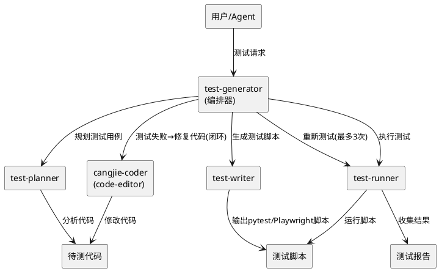
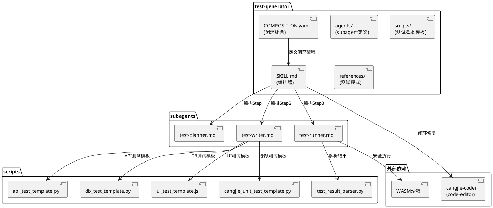
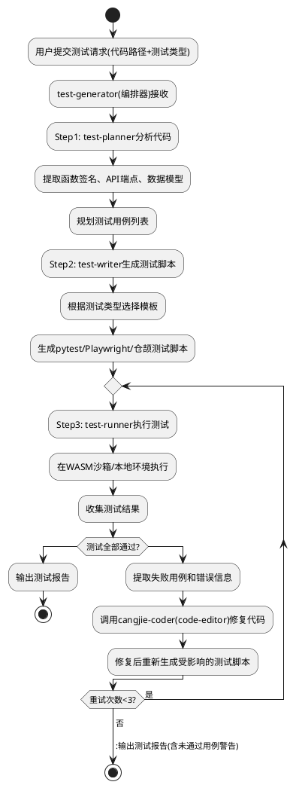
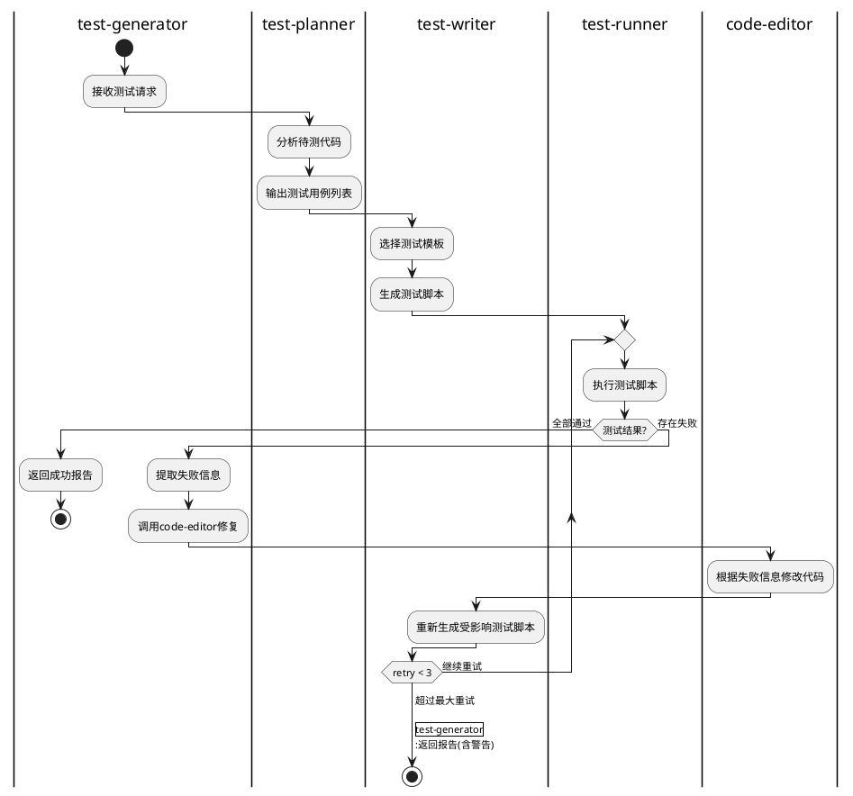

# 测试脚本动态生成技能 - 技术设计文档

## 一、需求与存量功能关系分析

### 1.1 需求功能与存量功能对比

#### 1.1.1 已实现功能

| 需求功能 | 存量功能 | 代码位置 | 匹配度 |
|---------|---------|---------|--------|
| subagent机制 | cangjie-coder已有agents/子目录 | skills/cangjie-coder/agents/ | 100% |
| SKILL.md编排器模式 | cangjie-coder已实现编排器 | skills/cangjie-coder/SKILL.md | 100% |
| scripts子目录 | cangjie-coder已有scripts/ | skills/cangjie-coder/scripts/ | 100% |
| 验证闭环(3次重试) | code-verifier已有修复闭环 | skills/cangjie-coder/agents/code-verifier.md | 75% |
| COMPOSITION.yaml | fullstack-codegen已有组合模板 | skills/fullstack-codegen/COMPOSITION.yaml | 75% |
| WASM沙箱 | 运行时已有安全执行环境 | src/sandbox/ | 100% |
| SubAgentTool | 子Agent执行工具 | src/tool/ | 100% |
| cli_execute工具 | 命令行执行工具 | src/tool/cli_tool.cj | 100% |
| file_read/file_write | 文件操作工具 | src/tool/file_tools.cj | 100% |

#### 1.1.2 需要扩展的功能

| 需求功能 | 存量功能 | 差异说明 | 扩展方向 |
|---------|---------|---------|---------|
| test-planner subagent | 无 | 缺少测试规划Agent | 新增test-planner.md |
| test-writer subagent | 无 | 缺少测试脚本生成Agent | 新增test-writer.md |
| test-runner subagent | 无 | 缺少测试执行Agent | 新增test-runner.md |
| 测试脚本模板 | 无 | 缺少pytest/Playwright脚本模板 | 新增scripts/目录 |
| 测试反馈闭环 | code-verifier有修复闭环 | 闭环对象不同：代码验证→测试修复 | 新增COMPOSITION.yaml定义闭环 |
| 多框架测试支持 | cangjie_test_runner.py仅仓颉 | 需扩展Python/JS测试 | 新增多框架脚本 |

#### 1.1.3 需要新增的功能或接口

1. **skills/test-generator/SKILL.md**: 测试生成技能主定义（编排器模式）
2. **skills/test-generator/agents/test-planner.md**: 测试规划subagent定义
3. **skills/test-generator/agents/test-writer.md**: 测试脚本生成subagent定义
4. **skills/test-generator/agents/test-runner.md**: 测试执行subagent定义
5. **skills/test-generator/scripts/api_test_template.py**: API测试脚本模板
6. **skills/test-generator/scripts/db_test_template.py**: 数据库测试脚本模板
7. **skills/test-generator/scripts/ui_test_template.js**: Playwright UI测试脚本模板
8. **skills/test-generator/scripts/cangjie_unit_test_template.py**: 仓颉单元测试脚本模板
9. **skills/test-generator/scripts/test_result_parser.py**: 测试结果解析器
10. **skills/test-generator/COMPOSITION.yaml**: 测试反馈闭环组合定义
11. **skills/test-generator/references/test_patterns.md**: 测试模式参考

### 1.2 存量功能详细分析

**cangjie-coder agents子目录**（skills/cangjie-coder/agents/）：
- **接口契约**: 每个agent通过YAML frontmatter声明（name、agent_type、description、tools、model等）
- **业务规则**: subagent通过parent_id关联到主Agent，权限最小化
- **扩展点**: test-generator可复用相同的声明模式和编排器模式
- **约束**: 每个subagent只负责一个明确的任务

**code-verifier修复闭环**（skills/cangjie-coder/agents/code-verifier.md）：
- **接口契约**: 验证失败时生成修复建议，触发code-editor修复
- **业务规则**: 最多3次重试，超过后输出结果（含警告）
- **扩展点**: test-generator的测试反馈闭环可复用相同的重试模式
- **约束**: 闭环对象从"代码编译错误"变为"测试用例失败"

**COMPOSITION.yaml组合模板**（skills/fullstack-codegen/COMPOSITION.yaml）：
- **接口契约**: 声明式定义步骤、依赖、输入映射
- **业务规则**: steps按depends_on拓扑排序执行
- **扩展点**: test-generator可定义测试→修复→重测的循环组合
- **约束**: 当前COMPOSITION.yaml不支持循环步骤，需通过SKILL.md编排器实现闭环

## 二、增量设计方案

### 2.1 实现模型

#### 2.1.1 上下文视图



#### 2.1.2 服务/组件总体架构



#### 2.1.3 实现设计文档

**test-generator编排流程**：



**测试反馈闭环详细流程**：



### 2.2 接口设计

#### 2.2.1 SKILL.md编排器定义

```yaml
---
name: test-generator
description: 测试脚本动态生成技能（编排器模式）。分析待验证代码，规划测试用例，生成Python/JS测试脚本，执行测试并反馈修复闭环。支持API测试(pytest)、数据库测试(psycopg2/pytest)、前端UI测试(Playwright)、仓颉单元测试(unittest)。测试失败时自动反馈给code-editor修复，最多3次重试。
version: 1.0.0
author: OpenCangjie Team
dependencies:
  - cangjie-coder
agents:
  - test-planner
  - test-writer
  - test-runner
scripts:
  - api_test_template.py
  - db_test_template.py
  - ui_test_template.js
  - cangjie_unit_test_template.py
  - test_result_parser.py
---
```

#### 2.2.2 subagent定义

**test-planner.md**：
```yaml
---
name: test-planner
agent_type: sub
description: 测试规划Agent，分析待验证代码并规划测试用例
version: 1.0.0
author: OpenCangjie Team
tools:
  - file_read
  - file_search
  - directory_list
model: deepseek
maxTurns: 50
memory: session
background: false
parent_id: MainAgent
permissions:
  - database.uctoo.agents:read
---
```

**test-writer.md**：
```yaml
---
name: test-writer
agent_type: sub
description: 测试脚本生成Agent，根据测试用例生成Python/JS测试脚本
version: 1.0.0
author: OpenCangjie Team
tools:
  - file_read
  - file_write
  - file_search
model: deepseek
maxTurns: 100
memory: session
background: false
parent_id: MainAgent
permissions:
  - database.uctoo.agents:read
  - database.uctoo.agent_tasks:write
---
```

**test-runner.md**：
```yaml
---
name: test-runner
agent_type: sub
description: 测试执行Agent，执行测试脚本并收集结果
version: 1.0.0
author: OpenCangjie Team
tools:
  - file_read
  - cli_execute
model: deepseek
maxTurns: 100
memory: session
background: false
parent_id: MainAgent
permissions:
  - database.uctoo.agents:read
  - database.uctoo.agent_tasks:write
  - database.uctoo.agent_tasks:execute
---
```

#### 2.2.3 subagent输入输出契约

**test-planner**：

输入：
```json
{
  "code_path": "src/api/http_server.cj",
  "test_types": ["api", "unit"],
  "project_path": "/path/to/project"
}
```

输出：
```json
{
  "test_cases": [
    {
      "id": "TC-001",
      "type": "api",
      "target": "startServer",
      "description": "验证HTTP服务器启动",
      "expected_result": "服务器在指定端口监听",
      "framework": "pytest",
      "priority": "high"
    },
    {
      "id": "TC-002",
      "type": "unit",
      "target": "validatePort",
      "description": "验证端口号校验逻辑",
      "expected_result": "无效端口号返回None",
      "framework": "cangjie_unittest",
      "priority": "medium"
    }
  ],
  "code_analysis": {
    "functions": ["startServer", "validatePort"],
    "api_endpoints": [],
    "data_models": [],
    "dependencies": ["std.net.http"]
  }
}
```

**test-writer**：

输入：
```json
{
  "test_cases": [
    {
      "id": "TC-001",
      "type": "api",
      "target": "startServer",
      "framework": "pytest",
      "expected_result": "服务器在指定端口监听"
    }
  ],
  "code_path": "src/api/http_server.cj",
  "project_path": "/path/to/project",
  "output_dir": "/path/to/project/tests"
}
```

输出：
```json
{
  "scripts": [
    {
      "test_case_id": "TC-001",
      "file_path": "tests/test_http_server_api.py",
      "framework": "pytest",
      "language": "python"
    }
  ]
}
```

**test-runner**：

输入：
```json
{
  "scripts": [
    {
      "file_path": "tests/test_http_server_api.py",
      "framework": "pytest"
    }
  ],
  "project_path": "/path/to/project",
  "timeout_seconds": 300
}
```

输出：
```json
{
  "result": "pass|partial|fail",
  "total": 5,
  "passed": 4,
  "failed": 1,
  "errors": 0,
  "details": [
    {
      "test_case_id": "TC-001",
      "status": "pass",
      "duration_ms": 120
    },
    {
      "test_case_id": "TC-002",
      "status": "fail",
      "error_message": "AssertionError: expected None, got Some(8080)",
      "line_number": 25,
      "duration_ms": 85
    }
  ],
  "duration_ms": 1500,
  "retry_count": 0
}
```

#### 2.2.4 COMPOSITION.yaml闭环定义

```yaml
name: test-generator
description: 测试脚本动态生成与反馈闭环
version: 1.0.0

steps:
  - name: plan-tests
    skill: test-generator
    step_type: agent
    agent: test-planner
    depends_on: []
    input:
      code_path: "${input.code_path}"
      test_types: "${input.test_types}"
      project_path: "${input.project_path}"

  - name: write-tests
    skill: test-generator
    step_type: agent
    agent: test-writer
    depends_on:
      - plan-tests
    input:
      test_cases: "${plan-tests.output.test_cases}"
      code_path: "${input.code_path}"
      project_path: "${input.project_path}"
      output_dir: "${input.output_dir}"

  - name: run-tests
    skill: test-generator
    step_type: agent
    agent: test-runner
    depends_on:
      - write-tests
    input:
      scripts: "${write-tests.output.scripts}"
      project_path: "${input.project_path}"
      timeout_seconds: 300

  - name: fix-and-retest
    skill: cangjie-coder
    step_type: skill
    depends_on:
      - run-tests
    condition: "${run-tests.output.result} == 'fail'"
    input:
      action: "fix"
      files: "${input.code_path}"
      error_context: "${run-tests.output.details}"
    retry:
      max_retries: 3
      retry_on: "fail"
      next_step: write-tests

outputs:
  test_report: "${run-tests.output}"
  code_fixed: "${fix-and-retest.output}"
  total_retries: "${fix-and-retest.retry_count}"
```

### 2.3 数据模型

本工程不涉及数据库表变更，主要是技能文件（SKILL.md、agents/、scripts/、references/、COMPOSITION.yaml）的创建。

**目标目录结构**：
```
skills/test-generator/
├── SKILL.md                            # 主技能定义（编排器模式）
├── COMPOSITION.yaml                    # 测试反馈闭环组合定义
├── agents/                             # subagent定义
│   ├── test-planner.md                 # 测试规划Agent
│   ├── test-writer.md                  # 测试脚本生成Agent
│   └── test-runner.md                  # 测试执行Agent
├── scripts/                            # 测试脚本模板和工具
│   ├── api_test_template.py            # API测试模板(pytest+requests)
│   ├── db_test_template.py             # 数据库测试模板(psycopg2+pytest)
│   ├── ui_test_template.js             # UI测试模板(Playwright)
│   ├── cangjie_unit_test_template.py   # 仓颉单元测试模板
│   └── test_result_parser.py           # 测试结果解析器
└── references/                         # 测试模式参考
    └── test_patterns.md                # 测试模式和最佳实践
```

### 2.4 关键设计决策

#### 2.4.1 测试反馈闭环实现方式

**决策**: 通过SKILL.md编排器实现闭环，而非COMPOSITION.yaml循环步骤。

**理由**:
1. 当前COMPOSITION.yaml不支持循环步骤定义，`retry`字段为扩展设计
2. SKILL.md编排器由大模型遵循执行，天然支持条件判断和循环
3. 与cangjie-coder的修复闭环模式保持一致
4. COMPOSITION.yaml作为声明式补充，未来由CompositionExecutor支持循环后可迁移

#### 2.4.2 测试脚本执行环境

**决策**: test-runner通过cli_execute调用pytest/playwright命令，非WASM沙箱内执行。

**理由**:
1. pytest/playwright需要访问系统Python/Node.js运行时，WASM沙箱不支持
2. WASM沙箱适用于确定性脚本（如语法检查），不适用于测试框架运行
3. 通过cli_execute可控制超时和资源限制
4. 安全性通过Agent权限系统保障，非沙箱隔离

#### 2.4.3 多框架测试脚本生成策略

**决策**: test-writer根据test-planner输出的framework字段选择对应模板，填充具体测试逻辑。

**理由**:
1. 模板化生成保证脚本结构规范和可执行性
2. 不同框架的脚本结构差异大（pytest类 vs Playwright页面对象模式），模板可封装差异
3. test-writer的LLM能力负责将测试用例逻辑填充到模板中
4. 模板可随项目演进持续优化

#### 2.4.4 与cangjie-coder的协作边界

**决策**: 测试反馈闭环中代码修复调用cangjie-coder技能的code-editor subagent，test-generator不直接修改被测代码。

**理由**:
1. 代码修改应遵循cangjie-coder的四步工作流（查阅→检索→编辑→验证）
2. 避免test-generator重复实现代码编辑逻辑
3. 通过技能依赖声明（dependencies: cangjie-coder）实现松耦合
4. 修复后的代码由cangjie-coder的code-verifier验证，保证代码质量