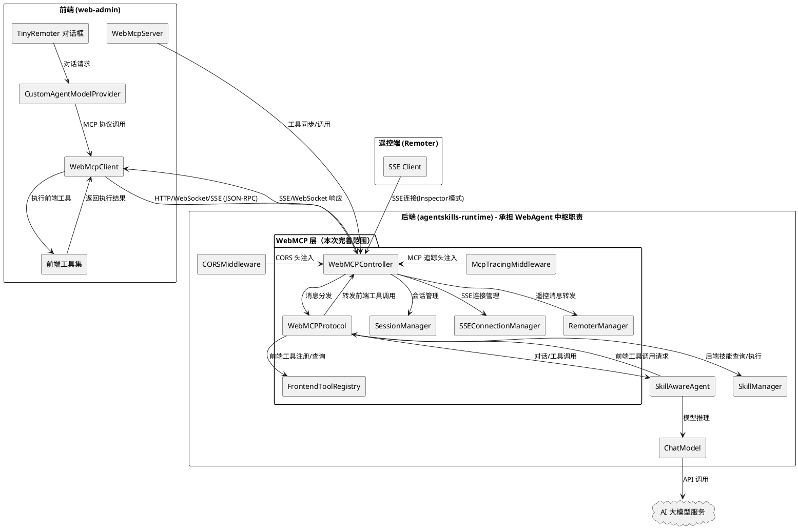
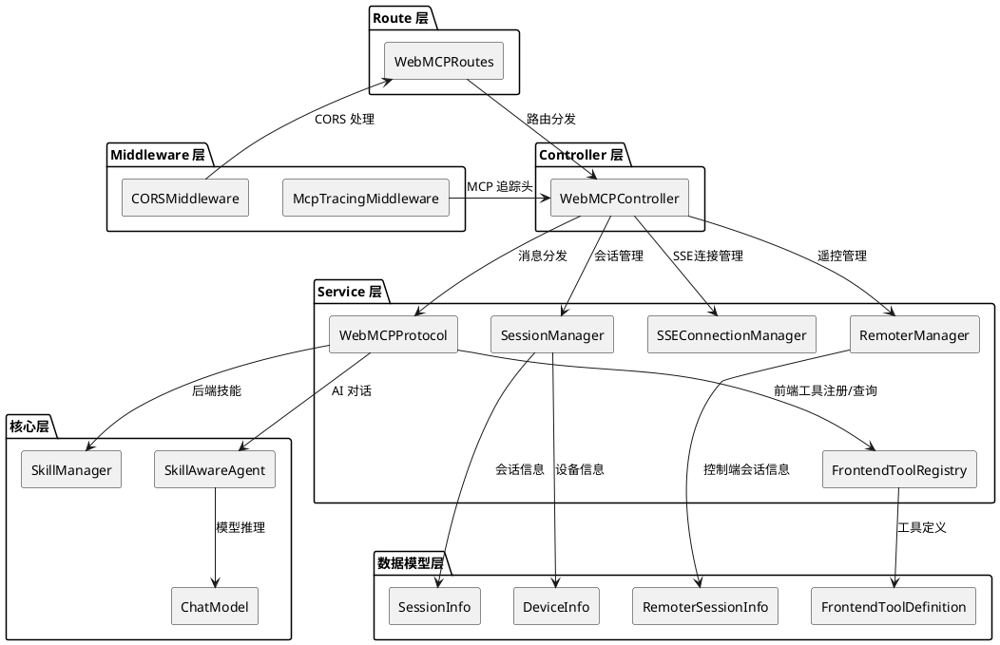
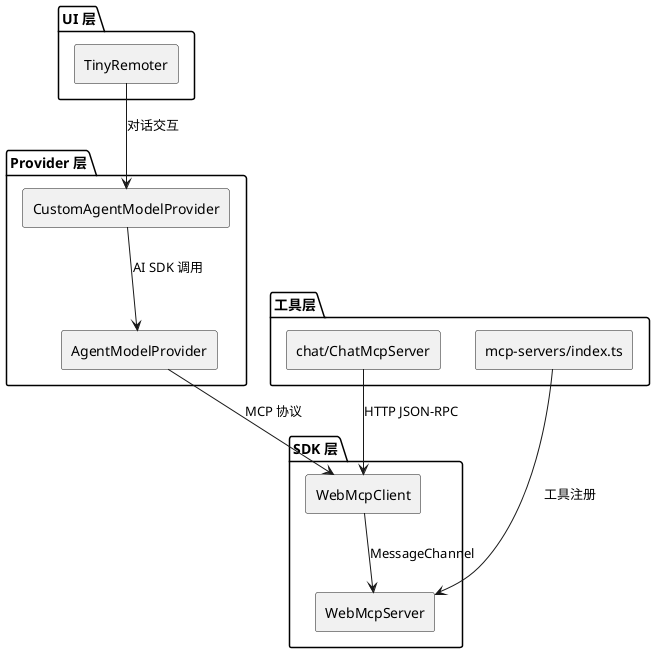

# WebMCP 完善 - 实现方案文档

# **1. 实现模型**

## **1.1 上下文视图**

### 1.1.1 系统上下文

WebMCP 完善项目位于 agentskills-runtime（仓颉后端）与 web-admin（Vue3 前端）的通信层，是 AI Agent 通过 MCP 标准协议控制 Web 应用的核心桥梁。agentskills-runtime 在架构上承担了原 OpenTiny NEXT 生态中 WebAgent（智能代理中枢）的全部职责，无需引入独立的 WebAgent Node.js 服务。



### 1.1.2 现有问题与设计目标

| 问题编号 | 现有问题 | 设计目标 |
|---------|---------|---------|
| 问题1 | SSE 流式响应未实现，使用 `spawn + res.send()` 发送完整响应体 | 实现 SSE 格式逐块推送，使用 `data: {json}\n\n` 格式 |
| 问题2 | `sendMessage` 方法返回"不支持直接模型调用"而不调用 AI | 调用 SkillAwareAgent.chat() 返回 AI 推理结果 |
| 问题3 | 前端工具注册使用非标准 `registerTool` 方法名 | 使用标准 `tools/register` 方法，新增 FrontendToolRegistry |
| 问题4 | StreamableHTTP 所有请求共享硬编码 `webmcp-default` sessionId | 为每个连接生成 UUID v4 sessionId，支持会话恢复 |
| 问题5 | `tools/call` 仅查找后端技能，忽略前端工具 | 先查后端技能，未找到则查前端工具注册表并转发 |
| 问题6 | 使用废弃方法名 `getTools`、`invokeTool` | 统一使用 `tools/list`、`tools/call`，废弃方法加警告 |
| 问题7 | 缺少 SSE 传输端点 | 新增 GET /sse 和 POST /messages 端点 |
| 问题8 | 缺少会话管理 REST API | 新增 sessions、tools、client、remoter 等 API |
| 问题9 | 无会话清理机制 | 实现 WebSocket 断连清理和 StreamableHTTP 超时清理 |
| 问题10 | CORS 处理分散在各方法中 | 统一由 CORSMiddleware 处理，移除控制器内重复 CORS 代码 |
| 问题11 | 缺少 SSE Inspector/Proxy 双模式 | 实现 SSE 连接的 Inspector 模式（监控已有会话）和 Proxy 模式（创建新代理连接） |
| 问题12 | 缺少 Remoter 遥控消息转发 | 实现 RemoterManager，支持遥控端通过 SSE 连接被控端并转发消息 |
| 问题13 | 缺少 Ping 健康检查端点 | 实现 GET /ping，对所有会话执行连通性检查并清理无响应会话 |
| 问题14 | 缺少 MCP 追踪头 | 在 /mcp 端点响应中附加 X-MCP-Request-ID、X-MCP-Method、X-Processing-Start |
| 问题15 | /mcp 端点仅支持 POST 方法 | 补充 GET（SSE流式）和 DELETE（关闭会话）方法支持 |
| 问题16 | 缺少设备信息采集 | 从请求头采集 IP、User-Agent、语言、来源等信息存储到会话 |
| 问题17 | 缺少被控端/控制端会话分离 | 实现独立的客户端会话列表和控制端会话列表 |
| 问题18 | 健康检查端点不完善 | 实现 /health、/health/detailed、/health/metrics 三级健康检查 |

## **1.2 服务/组件总体架构**

### 1.2.1 后端架构分层



### 1.2.2 前端架构分层



### 1.2.3 新增/修改组件清单

| 组件 | 类型 | 文件路径 | 说明 |
|------|------|---------|------|
| FrontendToolRegistry | 新增 | `src/app/services/webmcp/FrontendToolRegistry.cj` | 前端工具注册表，管理前端工具的注册、查询和注销 |
| SessionInfo | 新增 | `src/app/services/webmcp/SessionInfo.cj` | 会话信息数据结构，包含 sessionId、clientId、状态、时间戳、设备信息、传输类型 |
| DeviceInfo | 新增 | `src/app/services/webmcp/DeviceInfo.cj` | 设备信息数据结构，包含 IP、User-Agent、语言、来源 |
| SessionManager | 新增 | `src/app/services/webmcp/SessionManager.cj` | 会话管理器，负责会话创建、查询、超时清理，区分被控端和控制端会话 |
| SSEConnectionManager | 新增 | `src/app/services/webmcp/SSEConnectionManager.cj` | SSE 连接管理器，管理 SSE 长连接的创建、心跳、消息推送和断连清理 |
| RemoterManager | 新增 | `src/app/services/webmcp/RemoterManager.cj` | 遥控管理器，管理控制端会话，实现 Inspector/Proxy 模式和消息转发 |
| RemoterSessionInfo | 新增 | `src/app/services/webmcp/RemoterSessionInfo.cj` | 控制端会话信息，包含控制端 sessionId、关联的被控端 sessionId、设备信息 |
| McpTracingMiddleware | 新增 | `src/app/middleware/webmcp/McpTracingMiddleware.cj` | MCP 追踪中间件，注入 X-MCP-Request-ID、X-MCP-Method、X-Processing-Start 响应头 |
| WebMCPController | 修改 | `src/app/controllers/uctoo/webmcp/WebMCPController.cj` | 重构 SSE 流式响应、会话管理、CORS 统一处理、Inspector/Proxy 模式、Ping 检查、设备信息采集、GET/DELETE /mcp 支持 |
| WebMCPProtocol | 修改 | `src/app/services/webmcp/WebMCPProtocol.cj` | 新增 tools/register、SSE 流式、前端工具调用闭环、方法名统一、sendMessage AI 对话闭环 |
| WebMCPRoutes | 修改 | `src/app/routes/webmcp/WebMCPRoutes.cj` | 新增 SSE 端点、会话管理 API、Ping 端点、健康检查端点、CORS 中间件集成、GET/DELETE /mcp 路由 |
| App.vue | 修改 | `apps/web-admin/web/src/App.vue` | 修改工具同步方法名为 `tools/register`，优化前端工具调用处理 |
| mcp-servers/index.ts | 修改 | `apps/web-admin/web/src/mcp-servers/index.ts` | 调整工具注册协议，使用标准 MCP 方法名 |

## **1.3 实现设计文档**

### 1.3.1 REQ-01：SSE 流式响应实现

#### 实现思路

当前 `handleStreamableHttp` 方法在流式模式下使用 `spawn + res.send()` 发送完整响应体，违反 SSE 规范。需要参考 `AIController.handleStreamChat` 的实现模式，使用 `ChatModel.asyncCreate()` 获取流式响应，以 `data: {json}\n\n` 格式逐块推送。

#### 架构决策

1. **SSE 输出格式**：采用标准 SSE 格式，每条消息以 `data: ` 前缀和 `\n\n` 后缀分隔，结束标记为 `data: [DONE]\n\n`
2. **流式数据源**：使用 `ChatModel.asyncCreate()` 获取 `AsyncChatResponse`，遍历 `chunks` 迭代器逐块推送；若 asyncCreate 不可用，降级为同步调用后模拟流式输出
3. **响应 Content-Type**：流式响应设置 `Content-Type: text/event-stream`，非流式保持 `application/json`
4. **参考实现**：复用 `AIController.handleStreamChat` 的 SSE 构建逻辑
5. **流式响应头**：设置 `Cache-Control: no-cache`、`Connection: keep-alive`、`X-Accel-Buffering: no`（禁止 Nginx 缓冲）

#### 需要修改的文件

| 文件 | 修改内容 |
|------|---------|
| `WebMCPProtocol.cj` | 新增 `handleStreamCompletion()` 方法，实现流式 AI 响应生成和 SSE 格式输出 |
| `WebMCPController.cj` | 重构 `handleStreamableHttp()` 中的流式分支，调用 Protocol 的流式方法并写入 SSE 响应 |

#### 关键代码结构设计

**WebMCPProtocol 新增方法：**

```cangjie
// WebMCPProtocol.cj

/**
 * 处理流式对话请求，返回 SSE 格式的流式数据
 * @param userMessage 用户消息内容
 * @param requestId JSON-RPC 请求 ID
 * @return SSE 格式的完整响应字符串（data: {...}\n\n 格式）
 */
public func handleStreamCompletion(userMessage: String, requestId: Option<JsonValue>): String {
    let sb = StringBuilder()
    
    // 1. 调用 SkillAwareAgent 或 ChatModel 获取响应
    if (let Some(agent) <- _agent) {
        // 使用 Agent 同步调用，模拟流式输出
        let agentRequest = AgentRequest(userMessage)
        let agentResponse = agent.chat(agentRequest)
        let content = agentResponse.content
        
        // 2. 将完整响应拆分为 SSE 事件块
        // 按语义分块（每 20 个字符一块，模拟流式效果）
        let chunkSize = 20
        var pos = 0
        while (pos < content.size) {
            let end = if (pos + chunkSize < content.size) { pos + chunkSize } else { content.size }
            let chunk = content[pos..end]
            
            let chunkObj = JsonObject()
            chunkObj.put("type", JsonString("response.output_text.delta"))
            chunkObj.put("output_index", JsonInt(0))
            chunkObj.put("delta", JsonString(chunk))
            
            sb.append("data: ${chunkObj.toString()}\n\n")
            pos = end
        }
    } else if (let Some(cm) <- _chatModel) {
        // 降级到 ChatModel
        let request = ChatRequest([Message(MessageRole.User, userMessage)], temperature: None, stop: None, tools: [])
        let chatResponse = cm.create(request)
        let content = chatResponse.message.content
        
        let chunkObj = JsonObject()
        chunkObj.put("type", JsonString("response.output_text.delta"))
        chunkObj.put("output_index", JsonInt(0))
        chunkObj.put("delta", JsonString(content))
        
        sb.append("data: ${chunkObj.toString()}\n\n")
    } else {
        // 错误响应
        let errorObj = JsonObject()
        errorObj.put("type", JsonString("error"))
        errorObj.put("error", JsonString("Chat model not available"))
        sb.append("data: ${errorObj.toString()}\n\n")
    }
    
    // 3. 发送结束标记
    sb.append("data: [DONE]\n\n")
    
    return sb.toString()
}

/**
 * 处理流式 sendMessage 请求
 */
private func handleStreamSendMessage(obj: JsonObject): String {
    let requestId = obj.get("id")
    let params = obj.get("params")
    
    // 解析 params.message
    var userMessage = ""
    if (params.isSome()) {
        let paramsVal = params.getOrThrow()
        if (paramsVal is JsonObject) {
            let paramsObj = paramsVal.asObject()
            let message = paramsObj.get("message")
            if (message.isSome()) {
                let messageVal = message.getOrThrow()
                if (messageVal is JsonString) {
                    userMessage = messageVal.asString().getValue()
                }
            }
        }
    }
    
    return handleStreamCompletion(userMessage, requestId)
}
```

**WebMCPController 流式响应改造：**

```cangjie
// WebMCPController.cj - handleStreamableHttp 方法中的流式分支

if (isStream) {
    res.status(200)
       .header("Content-Type", "text/event-stream")
       .header("Cache-Control", "no-cache")
       .header("Connection", "keep-alive")
       .header("X-Accel-Buffering", "no")
    
    // 直接调用 Protocol 的流式方法，获取完整 SSE 格式响应
    let sseResponse = protocol.handleStreamCompletion(userMessage, requestId)
    res.send(sseResponse)
}
```

#### 数据流

```
前端 → POST /mcp (stream=true, method=completion/complete)
  → WebMCPController.handleStreamableHttp()
    → 解析 stream=true 标志
    → 设置 SSE 响应头 (Content-Type: text/event-stream)
    → WebMCPProtocol.handleStreamCompletion()
      → SkillAwareAgent.chat() 或 ChatModel.create()
        → 获取完整 AI 响应内容
      → 将响应拆分为 SSE 事件块
        → 每个 chunk: "data: {"type":"response.output_text.delta","delta":"..."}\n\n"
      → 结束标记: "data: [DONE]\n\n"
    → res.send(sseResponse)
  → 前端接收 SSE 流
```

#### 与现有代码的集成点

- 复用 `SkillAwareAgent.chat()` 的同步接口（当前已实现），后续可优化为流式接口
- 复用 `ChatModel.create()` 的同步接口作为降级方案
- 复用 `AIController.escapeJson()` 方法用于 JSON 字符串转义（如果存在）
- `handleStreamableHttp()` 中的 `parseStreamFlag()` 方法已实现流式标志解析，可直接复用

---

### 1.3.2 REQ-02：AI 对话闭环

#### 实现思路

当前 `handleSendMessage` 方法在非流式模式下返回固定文本"WebMCP protocol does not support direct model calls"，未调用 AI 模型。需要修改为调用 `SkillAwareAgent.chat()` 进行 AI 推理，与 `handleCompletionComplete` 共享相同的 Agent 实例和对话逻辑。

#### 架构决策

1. **统一对话入口**：`sendMessage` 和 `completion/complete` 共享同一个 `SkillAwareAgent` 实例，确保多轮对话上下文一致
2. **消息格式转换**：`sendMessage` 的 `params.message` 字段直接作为用户消息；`completion/complete` 的 `params.messages` 数组取最后一条 role=user 的消息
3. **降级策略**：Agent 不可用时降级到 `ChatModel`，ChatModel 也不可用时返回 -32603 错误
4. **流式支持**：`sendMessage` 的 `stream=true` 分支调用流式方法，`stream=false` 分支调用同步方法
5. **对话历史加载**：复用 `handleCompletionComplete` 中的 `CheckpointManager` 加载历史上下文逻辑

#### 需要修改的文件

| 文件 | 修改内容 |
|------|---------|
| `WebMCPProtocol.cj` | 重写 `handleSendMessage()` 方法，调用 SkillAwareAgent.chat()；提取公共对话逻辑到 `_processChatRequest()` 方法 |

#### 关键代码结构设计

```cangjie
// WebMCPProtocol.cj

/**
 * 公共对话处理方法
 * @param userMessage 用户消息
 * @param isStream 是否流式
 * @param requestId 请求 ID
 * @return 对话响应内容（非流式）或 SSE 格式响应（流式）
 */
private func _processChatRequest(userMessage: String, isStream: Bool, requestId: Option<JsonValue>): String {
    if (isStream) {
        return handleStreamCompletion(userMessage, requestId)
    }
    
    // 同步模式
    var responseContent = ""
    
    if (let Some(agent) <- _agent) {
        // 加载历史上下文
        let checkpointManager = CheckpointManager()
        var conversation: ?Conversation = None
        if (!_agentId.isEmpty()) {
            if (let Some(historyMessages) <- checkpointManager.loadLatestCheckpoint(_agentId)) {
                if (historyMessages.size > 0) {
                    conversation = Some(Conversation())
                    var i = 0
                    while (i < historyMessages.size - 1) {
                        if (i + 1 < historyMessages.size) {
                            conversation.getOrThrow().addChatRound(historyMessages[i], historyMessages[i + 1])
                        }
                        i = i + 2
                    }
                }
            }
        }
        
        let agentRequest = AgentRequest(userMessage, conversation: conversation)
        let agentResponse = agent.chat(agentRequest)
        responseContent = agentResponse.content
        
        // 异步同步 Agent 状态
        spawn {
            try {
                AgentRuntimeBridge.instance.syncToDatabase(agent.name, agent)
            } catch (_: Exception) {}
        }
    } else if (let Some(cm) <- _chatModel) {
        let request = ChatRequest([Message(MessageRole.User, userMessage)], temperature: None, stop: None, tools: [])
        let chatResponse = cm.create(request)
        responseContent = chatResponse.message.content
    } else {
        return createErrorResponse("Chat model not available", requestId)
    }
    
    // 构建符合 MCP 协议的响应
    let result = JsonObject()
    result.put("messageId", JsonString("msg_${requestId}"))
    result.put("streaming", JsonBool(false))
    result.put("response", JsonString(responseContent))
    
    return createSuccessResponse(result, requestId)
}

/**
 * 重写 handleSendMessage 方法
 */
private func handleSendMessage(obj: JsonObject): String {
    let requestId = obj.get("id")
    let params = obj.get("params")
    
    if (params.isNone()) {
        return createErrorResponse("Missing 'params' field", requestId)
    }
    
    let paramsVal = params.getOrThrow()
    if (!(paramsVal is JsonObject)) {
        return createErrorResponse("Invalid 'params' field type", requestId)
    }
    
    let paramsObj = paramsVal.asObject()
    let message = paramsObj.get("message")
    
    if (message.isNone()) {
        return createErrorResponse("Missing 'message' field", requestId)
    }
    
    let messageVal = message.getOrThrow()
    if (!(messageVal is JsonString)) {
        return createErrorResponse("Invalid 'message' field type", requestId)
    }
    
    let messageStr = messageVal.asString().getValue()
    
    // 解析 stream 标志
    var isStream = true
    let stream = paramsObj.get("stream")
    if (stream.isSome()) {
        let streamVal = stream.getOrThrow()
        if (streamVal is JsonBool) {
            isStream = streamVal.asBool().getValue()
        }
    }
    
    return _processChatRequest(messageStr, isStream, requestId)
}
```

#### 数据流

```
前端 → POST /mcp (method=sendMessage, params: {message, stream})
  → WebMCPProtocol.handleSendMessage()
    → _processChatRequest(message, stream)
      → [stream=true] handleStreamCompletion() → SSE 格式响应
      → [stream=false] SkillAwareAgent.chat() → 同步响应
    → 构建 JSON-RPC 响应
```

---

### 1.3.3 REQ-03：前端工具注册与同步机制

#### 实现思路

当前前端使用非标准方法名 `registerTool` 同步工具到后端，后端也没有 `tools/register` 方法的处理逻辑。需要：1）后端新增 `FrontendToolRegistry` 组件管理前端工具；2）在 `WebMCPProtocol` 中新增 `tools/register` 方法处理；3）前端修改同步方法名为 `tools/register`。

#### 架构决策

1. **独立注册表**：新增 `FrontendToolRegistry` 类，独立于 `SkillManager` 管理前端工具，职责单一
2. **会话级隔离**：每个 `WebMCPProtocol` 实例持有一个 `FrontendToolRegistry`，前端工具按会话隔离
3. **工具合并策略**：`tools/list` 响应时合并后端技能（来自 SkillManager）和前端工具（来自 FrontendToolRegistry），前端工具带 `annotations.isFrontendTool: true` 标记
4. **注册到 Agent**：前端工具注册时同步调用 `SkillAwareAgent.addFrontendTool()` 将工具注册到 Agent 的工具管理器中，使 Agent 能感知前端工具

#### 新增文件

| 文件 | 功能描述 |
|------|---------|
| `src/app/services/webmcp/FrontendToolRegistry.cj` | 前端工具注册表，提供 register、unregister、getTool、getAllTools、clear 方法 |

#### 需要修改的文件

| 文件 | 修改内容 |
|------|---------|
| `WebMCPProtocol.cj` | 新增 `handleToolsRegister()` 方法；修改 `handleGetTools()` 合并前端工具；新增 `_frontendToolRegistry` 成员变量 |
| `App.vue` | 修改 `syncFrontendToolsToBackend()` 中的方法名从 `registerTool` 改为 `tools/register` |

#### 关键代码结构设计

**FrontendToolDefinition 与 FrontendToolRegistry：**

```cangjie
// FrontendToolRegistry.cj

package magic.app.services.webmcp

import stdx.encoding.json.{JsonValue, JsonObject, JsonString, JsonBool, JsonArray}
import std.collection.{HashMap, ArrayList}

/**
 * 前端工具定义
 * 存储前端通过 tools/register 注册的工具元数据
 */
public class FrontendToolDefinition {
    public let name: String
    public let title: String
    public let description: String
    public let inputSchema: JsonObject
    public let route: String
    public let annotations: JsonObject
    
    public init(name: String, title: String, description: String, inputSchema: JsonObject, route: String, annotations: JsonObject) {
        this.name = name
        this.title = title
        this.description = description
        this.inputSchema = inputSchema
        this.route = route
        this.annotations = annotations
    }
    
    /// 转换为 MCP 协议格式的工具对象
    public func toMcpToolJson(): JsonObject {
        let obj = JsonObject()
        obj.put("name", JsonString(name))
        obj.put("description", JsonString(description))
        obj.put("inputSchema", inputSchema)
        
        let ann = JsonObject()
        ann.put("isFrontendTool", JsonBool(true))
        if (!route.isEmpty()) {
            ann.put("route", JsonString(route))
        }
        // 合并原始 annotations
        for ((key, value) in annotations.getFields()) {
            if (key != "isFrontendTool" && key != "route") {
                ann.put(key, value)
            }
        }
        obj.put("annotations", ann)
        
        return obj
    }
}

/**
 * 前端工具注册表
 */
public class FrontendToolRegistry {
    private var _tools = HashMap<String, FrontendToolDefinition>()
    
    public func register(tool: FrontendToolDefinition): Unit { ... }
    public func unregister(name: String): Unit { ... }
    public func getTool(name: String): ?FrontendToolDefinition { ... }
    public func getAllTools(): ArrayList<FrontendToolDefinition> { ... }
    public func clear(): Unit { ... }
    public func contains(name: String): Bool { ... }
    public prop size: Int64 { get() { _tools.size } }
}
```

**WebMCPProtocol 新增方法：**

```cangjie
// WebMCPProtocol.cj

private let _frontendToolRegistry = FrontendToolRegistry()

/**
 * 处理 tools/register 请求
 */
private func handleToolsRegister(obj: JsonObject): String {
    let requestId = obj.get("id")
    let params = obj.get("params")
    
    if (params.isNone()) {
        return createErrorResponse("Missing 'params' field", requestId)
    }
    
    let paramsVal = params.getOrThrow()
    if (!(paramsVal is JsonObject)) {
        return createErrorResponse("Invalid 'params' field type", requestId)
    }
    
    let paramsObj = paramsVal.asObject()
    let tool = paramsObj.get("tool")
    
    if (tool.isNone()) {
        return createErrorResponse("Missing 'tool' field in params", requestId)
    }
    
    let toolVal = tool.getOrThrow()
    if (!(toolVal is JsonObject)) {
        return createErrorResponse("Invalid 'tool' field type", requestId)
    }
    
    let toolObj = toolVal.asObject()
    
    // 校验必填字段
    let nameOpt = toolObj.get("name")
    let descOpt = toolObj.get("description")
    let schemaOpt = toolObj.get("inputSchema")
    
    if (nameOpt.isNone() || !(nameOpt.getOrThrow() is JsonString)) {
        return createErrorResponse("Missing or invalid required field: name", requestId)
    }
    if (descOpt.isNone() || !(descOpt.getOrThrow() is JsonString)) {
        return createErrorResponse("Missing or invalid required field: description", requestId)
    }
    if (schemaOpt.isNone() || !(schemaOpt.getOrThrow() is JsonObject)) {
        return createErrorResponse("Missing or invalid required field: inputSchema", requestId)
    }
    
    let name = nameOpt.getOrThrow().asString().getValue()
    let title = if (let Some(t) <- toolObj.get("title")) {
        if (t is JsonString) { t.asString().getValue() } else { name }
    } else { name }
    let description = descOpt.getOrThrow().asString().getValue()
    let inputSchema = schemaOpt.getOrThrow().asObject()
    
    var route = ""
    if (let Some(r) <- toolObj.get("route")) {
        if (r is JsonString) { route = r.asString().getValue() }
    }
    
    var annotations = JsonObject()
    if (let Some(a) <- toolObj.get("annotations")) {
        if (a is JsonObject) { annotations = a.asObject() }
    }
    
    let toolDef = FrontendToolDefinition(name, title, description, inputSchema, route, annotations)
    _frontendToolRegistry.register(toolDef)
    
    LogUtils.info("WebMCP: registered frontend tool '${name}' with route '${route}'")
    
    let result = JsonObject()
    result.put("success", JsonBool(true))
    result.put("message", JsonString("Tool registered successfully"))
    
    return createSuccessResponse(result, requestId)
}

/**
 * 修改 handleGetTools 方法，合并前端工具
 */
private func handleGetTools(obj: JsonObject): String {
    let requestId = obj.get("id")
    
    let toolArray = JsonArray()
    
    // 添加后端技能
    if (let Some(sm) <- _skillManager) {
        let skills = sm.availableSkills
        let keys = skills.keys()
        for (key in keys) {
            if (let Some(skill) <- skills.get(key)) {
                if (sm.isSkillEnabled(key)) {
                    toolArray.add(skillToJson(skill))
                }
            }
        }
    }
    
    // 添加前端工具（带 isFrontendTool 标记）
    let frontendTools = _frontendToolRegistry.getAllTools()
    for (tool in frontendTools) {
        toolArray.add(tool.toMcpToolJson())
    }
    
    let result = JsonObject()
    result.put("tools", toolArray)
    
    return createSuccessResponse(result, requestId)
}
```

**前端修改：**

```typescript
// App.vue - syncFrontendToolsToBackend 方法修改

// 修改前：method: 'registerTool'
// 修改后：method: 'tools/register'

const request = JSON.stringify({
  jsonrpc: '2.0',
  id: Date.now().toString() + '-' + name,
  method: 'tools/register',  // 使用标准 MCP 方法名
  params: { tool: toolDefinition }
})
```

#### 数据流

```
前端 → POST /mcp (method=tools/register, params: {tool: {name, description, inputSchema, route}})
  → WebMCPProtocol.handleToolsRegister()
    → FrontendToolRegistry.register(toolDef)
    → 返回 JSON-RPC 成功响应

前端 → POST /mcp (method=tools/list)
  → WebMCPProtocol.handleGetTools()
    → SkillManager.availableSkills → 后端技能列表
    → FrontendToolRegistry.getAllTools() → 前端工具列表（带 isFrontendTool 标记）
    → 合并返回
```

---

### 1.3.4 REQ-04：StreamableHTTP 会话标识动态化

#### 实现思路

当前 `handleStreamableHttp` 方法中 sessionId 硬编码为 `"webmcp-default"`，所有 StreamableHTTP 请求共享同一个 `WebMCPProtocol` 实例。需要：1）为每个新连接生成 UUID v4 sessionId；2）支持客户端通过请求头或参数携带已有 sessionId 恢复会话；3）新增 `SessionManager` 统一管理会话。

#### 架构决策

1. **SessionManager 独立组件**：会话管理逻辑从 Controller 中解耦，由 SessionManager 统一负责创建、查询、清理
2. **sessionId 传递方式**：通过 HTTP 请求头 `Mcp-Session-Id` 传递（符合 MCP 协议规范），也支持 `stream-session-id` 请求头和 JSON-RPC 请求体中的 `params.sessionId`
3. **会话恢复**：客户端携带已有 sessionId 时，复用对应的 WebMCPProtocol 实例，保持对话历史连续性
4. **initialize 方法生成 sessionId**：在 `initialize` 方法中生成 sessionId 并返回给客户端，后续请求携带该 ID
5. **响应头返回 sessionId**：每次 StreamableHTTP 响应都在 `Mcp-Session-Id` 响应头中返回当前会话 ID

#### 新增文件

| 文件 | 功能描述 |
|------|---------|
| `src/app/services/webmcp/SessionInfo.cj` | 会话信息数据结构 |
| `src/app/services/webmcp/DeviceInfo.cj` | 设备信息数据结构 |
| `src/app/services/webmcp/SessionManager.cj` | 会话管理器 |

#### 需要修改的文件

| 文件 | 修改内容 |
|------|---------|
| `WebMCPController.cj` | 移除硬编码 sessionId，使用 SessionManager 管理会话；从请求头读取 sessionId；响应头返回 Mcp-Session-Id |
| `WebMCPProtocol.cj` | 修改 `handleInitialize()` 生成 UUID sessionId 并返回 |

#### 关键代码结构设计

**DeviceInfo：**

```cangjie
// DeviceInfo.cj

package magic.app.services.webmcp

/**
 * 设备信息数据结构
 * 从请求头中采集客户端设备信息
 */
public class DeviceInfo {
    public var ip: String           // 来自 x-forwarded-for
    public var userAgent: String    // 来自 user-agent
    public var acceptLanguage: String  // 来自 accept-language
    public var referer: String      // 来自 referer
    
    public init(ip: String, userAgent: String, acceptLanguage: String, referer: String) {
        this.ip = ip
        this.userAgent = userAgent
        this.acceptLanguage = acceptLanguage
        this.referer = referer
    }
    
    public init() {
        this.ip = ""
        this.userAgent = ""
        this.acceptLanguage = ""
        this.referer = ""
    }
    
    public func toJson(): JsonObject {
        let obj = JsonObject()
        obj.put("ip", JsonString(ip))
        obj.put("userAgent", JsonString(userAgent))
        obj.put("acceptLanguage", JsonString(acceptLanguage))
        obj.put("referer", JsonString(referer))
        return obj
    }
}
```

**SessionInfo：**

```cangjie
// SessionInfo.cj

package magic.app.services.webmcp

import std.time.DateTime

/**
 * 会话信息数据结构
 */
public class SessionInfo {
    public let sessionId: String
    public var clientId: String
    public var status: String         // "active" | "idle" | "closed"
    public let createdAt: Int64
    public var lastActivityAt: Int64
    public let protocol: WebMCPProtocol
    public let type: String           // "SSE" | "StreamableHTTP" | "WebSocket"
    public var user: String           // 用户信息（由上游鉴权中间件注入）
    public let device: DeviceInfo     // 设备信息
    
    public init(sessionId: String, clientId: String, protocol: WebMCPProtocol, type: String, device: DeviceInfo) {
        this.sessionId = sessionId
        this.clientId = clientId
        this.status = "active"
        this.protocol = protocol
        this.type = type
        this.user = ""
        this.device = device
        
        let now = DateTime.now()
        let epoch = DateTime.UnixEpoch
        let ms = (now - epoch).toMilliseconds()
        this.createdAt = ms
        this.lastActivityAt = ms
    }
    
    public func updateActivity(): Unit {
        let now = DateTime.now()
        let epoch = DateTime.UnixEpoch
        this.lastActivityAt = (now - epoch).toMilliseconds()
    }
    
    public func toJson(): JsonObject {
        let obj = JsonObject()
        obj.put("sessionId", JsonString(sessionId))
        obj.put("clientId", JsonString(clientId))
        obj.put("status", JsonString(status))
        obj.put("type", JsonString(type))
        obj.put("user", JsonString(user))
        obj.put("device", device.toJson())
        return obj
    }
}
```

**SessionManager：**

```cangjie
// SessionManager.cj

package magic.app.services.webmcp

import magic.log.LogUtils
import std.collection.{HashMap, ArrayList}
import std.time.DateTime
import f_util.UUID

/**
 * 会话管理器
 */
public class SessionManager {
    private var _sessions = HashMap<String, SessionInfo>()
    private let _maxSessions: Int32
    private let _sessionTimeoutMs: Int64
    
    public init(maxSessions!: Int32 = 100, sessionTimeoutMs!: Int64 = 86400000) {
        this._maxSessions = maxSessions
        this._sessionTimeoutMs = sessionTimeoutMs
    }
    
    /// 创建新会话
    public func createSession(protocol: WebMCPProtocol, device: DeviceInfo, type: String): String {
        let sessionId = UUID.random().toString()
        let sessionInfo = SessionInfo(sessionId, "", protocol, type, device)
        _sessions.add(sessionId, sessionInfo)
        LogUtils.info("SessionManager: created session ${sessionId} (type=${type})")
        return sessionId
    }
    
    /// 获取会话信息
    public func getSession(sessionId: String): ?SessionInfo { _sessions.get(sessionId) }
    
    /// 检查会话是否存在
    public func hasSession(sessionId: String): Bool { _sessions.contains(sessionId) }
    
    /// 移除会话
    public func removeSession(sessionId: String): Unit {
        if (_sessions.contains(sessionId)) {
            _sessions.remove(sessionId)
            LogUtils.info("SessionManager: removed session ${sessionId}")
        }
    }
    
    /// 更新会话活动时间
    public func updateActivity(sessionId: String): Unit {
        if (let Some(info) <- _sessions.get(sessionId)) {
            info.updateActivity()
        }
    }
    
    /// 获取所有会话
    public func getAllSessions(): ArrayList<SessionInfo> {
        let result = ArrayList<SessionInfo>()
        for ((_, info) in _sessions) { result.add(info) }
        return result
    }
    
    /// 获取所有会话 ID
    public func getAllSessionIds(): ArrayList<String> {
        let result = ArrayList<String>()
        for ((id, _) in _sessions) { result.add(id) }
        return result
    }
    
    /// 获取活跃会话数量
    public func getActiveSessionCount(): Int32 { Int32(_sessions.size) }
    
    /// 检查是否可以创建新会话
    public func canCreateSession(): Bool { Int32(_sessions.size) < _maxSessions }
    
    /// 重置指定会话
    public func resetSession(sessionId: String): Bool {
        if (let Some(info) <- _sessions.get(sessionId)) {
            info.status = "active"
            info.updateActivity()
            return true
        }
        return false
    }
    
    /// 检查会话是否存活
    public func checkSessionAlive(sessionId: String): Bool {
        _sessions.contains(sessionId)
    }
    
    /// 按 sessionId 后缀匹配
    public func findBySuffix(suffix: String): ?SessionInfo {
        if (suffix.size >= 6) {
            for ((id, info) in _sessions) {
                if (id.endsWith(suffix)) {
                    return info
                }
            }
        }
        return _sessions.get(suffix)
    }
    
    /// 清理过期会话
    public func cleanupExpiredSessions(): Unit {
        let now = DateTime.now()
        let epoch = DateTime.UnixEpoch
        let nowMs = (now - epoch).toMilliseconds()
        
        let expiredKeys = ArrayList<String>()
        for ((sessionId, info) in _sessions) {
            if (nowMs - info.lastActivityAt > _sessionTimeoutMs) {
                expiredKeys.add(sessionId)
            }
        }
        
        for (key in expiredKeys) {
            removeSession(key)
            LogUtils.info("SessionManager: expired session cleaned up: ${key}")
        }
    }
    
    /// 重置所有会话
    public func resetAllSessions(): Unit {
        for ((_, info) in _sessions) {
            info.status = "active"
            info.updateActivity()
        }
        LogUtils.info("SessionManager: all sessions reset")
    }
}
```

**WebMCPController 改造：**

```cangjie
// WebMCPController.cj

private let _sessionManager = SessionManager()

public func handleStreamableHttp(req: HttpRequest, res: HttpResponse): Unit {
    // 1. 从请求头获取 sessionId
    var sessionId = ""
    let mcpSessionId = req.header("Mcp-Session-Id")
    if (mcpSessionId.isSome() && !mcpSessionId.getOrThrow().isEmpty()) {
        sessionId = mcpSessionId.getOrThrow()
    }
    
    // 也检查 stream-session-id 头
    if (sessionId.isEmpty()) {
        let streamSessionId = req.header("stream-session-id")
        if (streamSessionId.isSome() && !streamSessionId.getOrThrow().isEmpty()) {
            sessionId = streamSessionId.getOrThrow()
        }
    }
    
    // 2. 获取或创建会话
    let protocol = if (!sessionId.isEmpty() && _sessionManager.hasSession(sessionId)) {
        _sessionManager.updateActivity(sessionId)
        _sessionManager.getSession(sessionId).getOrThrow().protocol
    } else {
        // 新连接，检查最大会话数
        if (!_sessionManager.canCreateSession()) {
            res.status(503).json("{\"error\": \"Maximum session limit reached\"}")
            return
        }
        let newProtocol = WebMCPProtocol(_skillManager, _chatModel, getMainAgentDef())
        let device = _extractDeviceInfo(req)
        let newSessionId = _sessionManager.createSession(newProtocol, device, "StreamableHTTP")
        newProtocol.setSessionInfo(newSessionId, "")
        sessionId = newSessionId
        newProtocol
    }
    
    // 3. 处理请求...
    
    // 4. 在响应头中返回 sessionId
    res.header("Mcp-Session-Id", sessionId)
}
```

#### 数据流

```
前端 → POST /mcp (首次请求，无 Mcp-Session-Id 头)
  → WebMCPController.handleStreamableHttp()
    → SessionManager.createSession() → 生成 UUID sessionId
    → 创建 WebMCPProtocol 实例
    → 响应头包含 Mcp-Session-Id: uuid-xxxx

前端 → POST /mcp (后续请求，携带 Mcp-Session-Id: uuid-xxxx)
  → WebMCPController.handleStreamableHttp()
    → SessionManager.getSession(uuid-xxxx) → 复用 WebMCPProtocol 实例
    → SessionManager.updateActivity(uuid-xxxx)
    → 保持对话历史连续
```

---

### 1.3.5 REQ-05：前端工具调用闭环

#### 实现思路

当前 `handleInvokeTool` 方法仅查找后端技能，未找到时直接返回"工具未找到"错误。需要：1）在 `tools/call` 处理中，先查后端技能，未找到则查 `FrontendToolRegistry`；2）如果是前端工具，通过 JSON-RPC 请求转发到前端执行；3）等待前端返回执行结果后注入 Agent 上下文。

#### 架构决策

1. **两阶段查找**：`tools/call` 先查后端技能（SkillManager），未找到再查前端工具（FrontendToolRegistry）
2. **前端工具调用通道**：通过 SSE/WebSocket 向前端发送 `tools/call` 类型的 JSON-RPC 请求，前端执行后通过 HTTP POST 回传结果
3. **超时机制**：前端工具调用设置 180 秒超时，超时返回错误
4. **调用标识**：每次前端工具调用生成唯一 `callId`，用于结果回传关联
5. **同步等待模式**：前端工具调用采用同步等待模式，Controller 阻塞等待前端回传结果（通过 Future/Promise 机制）

#### 需要修改的文件

| 文件 | 修改内容 |
|------|---------|
| `WebMCPProtocol.cj` | 修改 `handleInvokeTool()` 增加前端工具查找和转发逻辑 |
| `WebMCPController.cj` | 新增前端工具调用结果回传处理方法；新增 PendingToolCall 管理器 |
| `WebMCPRoutes.cj` | 新增工具调用结果回传路由 |

#### 关键代码结构设计

**WebMCPProtocol 修改：**

```cangjie
// WebMCPProtocol.cj

private func handleInvokeTool(obj: JsonObject): String {
    let requestId = obj.get("id")
    let params = obj.get("params")
    
    // ... 参数解析逻辑 ...
    
    let toolNameStr = toolNameVal.asString().getValue()
    
    // 阶段1：查找后端技能
    if (let Some(sm) <- _skillManager) {
        let skillOpt = sm.getSkill(toolNameStr)
        if (skillOpt.isSome()) {
            if (!sm.isSkillEnabled(toolNameStr)) {
                return createErrorResponse("Tool is not enabled: ${toolNameStr}", requestId)
            }
            // 调用后端技能（现有逻辑）
            return _invokeBackendSkill(skillOpt.getOrThrow(), argsMap, requestId)
        }
    }
    
    // 阶段2：查找前端工具
    if (let Some(toolDef) <- _frontendToolRegistry.getTool(toolNameStr)) {
        return _invokeFrontendTool(toolDef, argsMap, requestId)
    }
    
    // 未找到
    return createErrorResponse("Tool not found: ${toolNameStr}", requestId)
}

/**
 * 构建前端工具调用响应
 * 返回包含 isFrontendTool 标记的响应，由前端 SDK 拦截并执行
 */
private func _invokeFrontendTool(
    toolDef: FrontendToolDefinition, 
    argsMap: HashMap<String, JsonValue>, 
    requestId: Option<JsonValue>
): String {
    let callId = UUID.random().toString()
    
    // 构建输入参数 JSON
    let argsJsonObject = JsonObject()
    for ((key, value) in argsMap) {
        argsJsonObject.put(key, value)
    }
    
    // 构建前端工具调用响应
    let result = JsonObject()
    result.put("isFrontendTool", JsonBool(true))
    result.put("toolName", JsonString(toolDef.name))
    result.put("route", JsonString(toolDef.route))
    result.put("input", argsJsonObject)
    result.put("callId", JsonString(callId))
    
    LogUtils.info("WebMCP: forwarding frontend tool call '${toolDef.name}' with callId '${callId}'")
    
    return createSuccessResponse(result, requestId)
}
```

**WebMCPController 新增前端工具调用结果回传：**

```cangjie
// WebMCPController.cj

/// 等待中的前端工具调用（callId -> 回调函数）
private var _pendingToolCalls = HashMap<String, (String) -> Unit>()

/**
 * 处理前端工具调用结果回传
 * 路由：POST /api/v1/uctoo/webmcp/tool-result
 */
public func handleToolResult(req: HttpRequest, res: HttpResponse): Unit {
    let body = req.body
    if (body.isEmpty()) {
        res.status(400).json("{\"error\": \"Empty request body\"}")
        return
    }
    
    try {
        let jsonValue = JsonValue.fromStr(body)
        if (jsonValue is JsonObject) {
            let obj = jsonValue.asObject()
            let callIdOpt = obj.get("callId")
            let resultOpt = obj.get("result")
            
            if (callIdOpt.isSome()) {
                let callId = callIdOpt.getOrThrow().toString()
                
                // 查找等待中的调用
                if (let Some(callback) <- _pendingToolCalls.get(callId)) {
                    let resultStr = if (resultOpt.isSome()) { resultOpt.getOrThrow().toString() } else { "" }
                    callback(resultStr)
                    _pendingToolCalls.remove(callId)
                    
                    res.status(200).json("{\"success\": true}")
                } else {
                    res.status(404).json("{\"error\": \"Tool call not found or expired\"}")
                }
            }
        }
    } catch (e: Exception) {
        res.status(500).json("{\"error\": \"${e.message}\"}")
    }
}
```

#### 数据流

```
前端 → POST /mcp (method=completion/complete, message="查询用户列表")
  → WebMCPProtocol.handleCompletionComplete()
    → SkillAwareAgent.chat()
      → Agent 决策：需要调用 query_users 前端工具
    → Agent 响应中包含前端工具调用信息
  → 返回包含 isFrontendTool=true 的响应

前端收到 isFrontendTool=true 的响应
  → App.vue handleToolCallResult() 拦截
  → 执行前端工具 query_users
  → 获取执行结果

前端 → POST /api/v1/uctoo/webmcp/tool-result (callId, result)
  → WebMCPController.handleToolResult()
    → 查找等待中的调用回调
    → 将结果注入 Agent 上下文
    → Agent 继续推理生成最终响应
```

---

### 1.3.6 REQ-06：MCP 协议方法名统一

#### 实现思路

当前代码中 `handleMethod` 方法同时支持新旧方法名（`getTools`/`tools/list`、`invokeTool`/`tools/call`），但未对废弃方法名发出警告。需要：1）将标准方法名作为主入口；2）废弃方法名正常处理但记录 WARN 日志；3）在响应中添加 `deprecationWarning` 字段。

#### 架构决策

1. **方法路由表**：使用映射表将废弃方法名映射到标准方法名，统一处理逻辑
2. **警告机制**：废弃方法名调用时记录 WARN 日志，并在响应中添加 `deprecationWarning` 字段
3. **禁止新增非标准方法**：所有新方法必须遵循 `domain/action` 格式

#### 需要修改的文件

| 文件 | 修改内容 |
|------|---------|
| `WebMCPProtocol.cj` | 重构 `handleMethod()` 方法，增加废弃方法名映射和警告逻辑 |

#### 关键代码结构设计

```cangjie
// WebMCPProtocol.cj

// 废弃方法名映射表
private static let DEPRECATED_METHODS: HashMap<String, String> = ...

static init() {
    DEPRECATED_METHODS.add("getTools", "tools/list")
    DEPRECATED_METHODS.add("listTools", "tools/list")
    DEPRECATED_METHODS.add("invokeTool", "tools/call")
    DEPRECATED_METHODS.add("tools/invoke", "tools/call")
    DEPRECATED_METHODS.add("registerTool", "tools/register")
}

private func handleMethod(method: String, obj: JsonObject): String {
    // 检查是否是废弃方法名
    if (DEPRECATED_METHODS.contains(method)) {
        let standardMethod = DEPRECATED_METHODS.get(method).getOrThrow()
        LogUtils.warn("Deprecated method '${method}', use '${standardMethod}' instead")
        
        // 转换为标准方法名处理
        let response = handleStandardMethod(standardMethod, obj)
        
        // 在响应中添加废弃警告
        return _addDeprecationWarning(response, method, standardMethod)
    }
    
    // 标准方法名处理
    return handleStandardMethod(method, obj)
}

private func handleStandardMethod(method: String, obj: JsonObject): String {
    match (method) {
        case "initialize" => handleInitialize(obj)
        case "tools/list" => handleGetTools(obj)
        case "tools/call" => handleInvokeTool(obj)
        case "tools/register" => handleToolsRegister(obj)
        case "sendMessage" => handleSendMessage(obj)
        case "completion/complete" => handleCompletionComplete(obj)
        case "listSessions" => handleListSessions(obj)
        case "closeSession" => handleCloseSession(obj)
        case "notifications/cancelled" | "notifications/progress" | "notifications/message" | "notifications/initialized" =>
            handleNotification(method, obj)
        case _ => createErrorResponse("Unknown method: ${method}")
    }
}

/**
 * 在响应中添加废弃警告
 */
private func _addDeprecationWarning(response: String, deprecatedMethod: String, standardMethod: String): String {
    try {
        let jsonValue = JsonValue.fromStr(response)
        if (jsonValue is JsonObject) {
            let obj = jsonValue.asObject()
            // 如果有 result 字段，在 result 中添加警告
            let resultOpt = obj.get("result")
            if (resultOpt.isSome() && resultOpt.getOrThrow() is JsonObject) {
                let result = resultOpt.getOrThrow().asObject()
                let warning = JsonObject()
                warning.put("deprecated", JsonBool(true))
                warning.put("method", JsonString(deprecatedMethod))
                warning.put("useInstead", JsonString(standardMethod))
                result.put("deprecationWarning", warning)
            }
            return obj.toString()
        }
    } catch (_: Exception) {}
    return response
}
```

---

### 1.3.7 REQ-07：SSE 传输端点

#### 实现思路

MCP 协议定义了 SSE 传输方式，需要提供独立的 SSE 端点。参考 WebAgent 的 `useProxyHandles` 实现，提供 GET /sse 建立 SSE 长连接，POST /messages 发送消息。SSE 连接支持 Inspector/Proxy 双模式（详见 REQ-11）。

#### 架构决策

1. **SSE 连接管理**：使用 `SSEConnectionManager` 存储 SSE 连接的写入器，以 sessionId 为键
2. **心跳机制**：SSE 连接每 30 秒发送心跳注释 `: ping\n\n` 保持连接
3. **消息端点**：POST /messages 接收 JSON-RPC 请求，处理后通过关联的 SSE 通道推送响应
4. **会话关联**：SSE 连接通过查询参数 `sessionId` 关联到正确的会话

#### 新增文件

| 文件 | 功能描述 |
|------|---------|
| `src/app/services/webmcp/SSEConnectionManager.cj` | SSE 连接管理器 |

#### 需要修改的文件

| 文件 | 修改内容 |
|------|---------|
| `WebMCPController.cj` | 新增 `handleSSEConnection()` 和 `handleSSEMessage()` 方法 |
| `WebMCPRoutes.cj` | 新增 GET /sse 和 POST /messages 路由 |

#### 关键代码结构设计

**SSEConnectionManager：**

```cangjie
// SSEConnectionManager.cj

package magic.app.services.webmcp

import magic.log.LogUtils
import std.collection.{HashMap, ArrayList}

/**
 * SSE 连接写入器接口
 * 抽象 SSE 消息写入能力
 */
public interface SSEWriter {
    func write(data: Array<UInt8>): Unit
    func isClosed(): Bool
}

/**
 * SSE 连接管理器
 */
public class SSEConnectionManager {
    private var _connections = HashMap<String, SSEWriter>()
    
    public func addConnection(sessionId: String, writer: SSEWriter): Unit {
        _connections.add(sessionId, writer)
        LogUtils.info("SSEConnectionManager: added SSE connection for session ${sessionId}")
    }
    
    public func removeConnection(sessionId: String): Unit {
        _connections.remove(sessionId)
    }
    
    public func getConnection(sessionId: String): ?SSEWriter {
        _connections.get(sessionId)
    }
    
    /// 通过 SSE 连接推送消息
    public func pushMessage(sessionId: String, event: String, data: String): Bool {
        if (let Some(writer) <- _connections.get(sessionId)) {
            try {
                let message = "event: ${event}\ndata: ${data}\n\n"
                writer.write(message.toArray())
                return true
            } catch (e: Exception) {
                LogUtils.error("SSEConnectionManager: failed to push message to ${sessionId}: ${e.message}")
                _connections.remove(sessionId)
                return false
            }
        }
        return false
    }
    
    /// 发送心跳
    public func sendHeartbeat(sessionId: String): Bool {
        if (let Some(writer) <- _connections.get(sessionId)) {
            try {
                writer.write(": ping\n\n".toArray())
                return true
            } catch (e: Exception) {
                _connections.remove(sessionId)
                return false
            }
        }
        return false
    }
    
    /// 获取所有活跃 SSE 连接的 sessionId
    public func getActiveConnectionIds(): ArrayList<String> {
        let result = ArrayList<String>()
        for ((sessionId, _) in _connections) { result.add(sessionId) }
        return result
    }
    
    /// 检查连接是否存在
    public func hasConnection(sessionId: String): Bool { _connections.contains(sessionId) }
}
```

**WebMCPController SSE 处理方法：**

```cangjie
// WebMCPController.cj

private let _sseConnectionManager = SSEConnectionManager()

/**
 * 处理 SSE 连接请求（Inspector/Proxy 双模式，详见 REQ-11）
 */
public func handleSSEConnection(req: HttpRequest, res: HttpResponse): Unit {
    // 详见 REQ-11 中的完整实现
}

/**
 * 处理 SSE 消息端点请求
 */
public func handleSSEMessage(req: HttpRequest, res: HttpResponse): Unit {
    // 1. 从查询参数获取 sessionId
    let sessionIdOpt = req.queryParam("sessionId")
    if (sessionIdOpt.isNone()) {
        res.status(400).json("{\"error\": \"No transport found\"}")
        return
    }
    let sessionId = sessionIdOpt.getOrThrow()
    
    // 2. 获取对应的 Protocol 实例
    let sessionInfoOpt = _sessionManager.getSession(sessionId)
    if (sessionInfoOpt.isNone()) {
        res.status(404).json("{\"error\": \"SESSION_ERROR\", \"message\": \"会话未找到或已断开\"}")
        return
    }
    
    let sessionInfo = sessionInfoOpt.getOrThrow()
    let protocol = sessionInfo.protocol
    
    // 3. 处理 JSON-RPC 请求
    let body = req.body
    let response = protocol.handleMessage(body)
    
    // 4. 通过 SSE 通道推送响应
    _sseConnectionManager.pushMessage(sessionId, "message", response)
    
    // 5. 同时推送到关联的所有 Inspector 连接
    let remoters = _remoterManager.getRemotersForClient(sessionId)
    for (remoter in remoters) {
        _sseConnectionManager.pushMessage(remoter.sessionId, "message", response)
    }
    
    // 6. 返回 202 Accepted
    res.status(202).send("Accepted")
}
```

---

### 1.3.8 REQ-08：会话管理 REST API

#### 实现思路

当前仅有 `/sessions/count` 和 `/health` 两个管理端点。需要补充完整的会话管理 REST API，包括会话列表、重置、工具列表、客户端信息等。API 路径需兼容原 WebAgent 的 API 路径规范。

#### 需要修改的文件

| 文件 | 修改内容 |
|------|---------|
| `WebMCPController.cj` | 新增 `handleClientList()`、`handleRemoterList()`、`handleResetAll()`、`handleListToolsAPI()`、`handleGetClientInfoAPI()` 方法 |
| `WebMCPRoutes.cj` | 新增对应的 REST API 路由 |

#### 关键代码结构设计

```cangjie
// WebMCPController.cj

/**
 * GET /api/v1/uctoo/webmcp/list
 * 获取所有被控端（客户端）会话列表
 * 兼容 WebAgent API 格式
 */
public func handleClientList(req: HttpRequest, res: HttpResponse): Unit {
    let sessions = _sessionManager.getAllSessions()
    let result = JsonObject()
    
    for (info in sessions) {
        let sessionObj = JsonObject()
        sessionObj.put("user", JsonString(info.user))
        sessionObj.put("device", info.device.toJson())
        sessionObj.put("type", JsonString(info.type))
        result.put(info.sessionId, sessionObj)
    }
    
    res.status(200).json(result.toJsonString())
}

/**
 * GET /api/v1/uctoo/webmcp/remoter
 * 获取所有控制端会话列表
 */
public func handleRemoterList(req: HttpRequest, res: HttpResponse): Unit {
    let remoters = _remoterManager.getAllRemoterSessions()
    let result = JsonObject()
    
    for ((id, info) in remoters) {
        let remoterObj = JsonObject()
        remoterObj.put("user", JsonString(info.user))
        remoterObj.put("client", JsonString(info.clientSessionId))
        remoterObj.put("device", info.device.toJson())
        remoterObj.put("type", JsonString(info.type))
        result.put(id, remoterObj)
    }
    
    res.status(200).json(result.toJsonString())
}

/**
 * GET /api/v1/uctoo/webmcp/reset
 * 重置所有客户端与控制端会话
 */
public func handleResetAll(req: HttpRequest, res: HttpResponse): Unit {
    _sessionManager.resetAllSessions()
    _remoterManager.removeAllRemoters()
    res.status(200).json("{}")
}

/**
 * GET /api/v1/uctoo/webmcp/tools?sessionId=xxx
 * 获取指定会话的可用工具列表
 */
public func handleListToolsAPI(req: HttpRequest, res: HttpResponse): Unit {
    let sessionIdOpt = req.queryParam("sessionId")
    
    if (sessionIdOpt.isNone()) {
        res.status(200).json("{\"result\": \"sessionId is required\"}")
        return
    }
    
    let sessionId = sessionIdOpt.getOrThrow()
    let sessionInfoOpt = _sessionManager.getSession(sessionId)
    
    if (sessionInfoOpt.isNone()) {
        res.status(200).json("{\"result\": \"No client found for session ID ${sessionId}\"}")
        return
    }
    
    let protocol = sessionInfoOpt.getOrThrow().protocol
    let toolsJson = protocol.getTools()
    
    let result = JsonObject()
    result.put("result", toolsJson)
    res.status(200).json(result.toJsonString())
}

/**
 * GET /api/v1/uctoo/webmcp/client?sessionId=xxx
 * 查询指定客户端会话信息（支持后6位匹配）
 */
public func handleGetClientInfoAPI(req: HttpRequest, res: HttpResponse): Unit {
    let sessionIdOpt = req.queryParam("sessionId")
    
    if (sessionIdOpt.isNone()) {
        res.status(200).json("{\"status\": 400, \"error\": \"MISSING_SESSION_ID\", \"message\": \"sessionId is required\"}")
        return
    }
    
    let queryId = sessionIdOpt.getOrThrow()
    let sessionInfoOpt = _sessionManager.findBySuffix(queryId)
    
    if (sessionInfoOpt.isNone()) {
        res.status(200).json("{\"status\": 400, \"error\": \"SESSION_NOT_FOUND\", \"message\": \"No session found for ID ${queryId}\"}")
        return
    }
    
    let info = sessionInfoOpt.getOrThrow()
    let data = JsonObject()
    data.put("sessionId", JsonString(info.sessionId))
    data.put("user", JsonString(info.user))
    data.put("device", info.device.toJson())
    data.put("type", JsonString(info.type))
    
    res.status(200).json("{\"status\": 0, \"data\": ${data.toJsonString()}}")
}
```

**WebMCPRoutes 新增路由：**

```cangjie
// WebMCPRoutes.cj

private func registerManagementRoutes(): Unit {
    // 被控端会话列表
    _router.get("/api/v1/uctoo/webmcp/list", { req, res =>
        _controller.handleClientList(req, res)
    })
    
    // 控制端会话列表
    _router.get("/api/v1/uctoo/webmcp/remoter", { req, res =>
        _controller.handleRemoterList(req, res)
    })
    
    // 重置所有会话
    _router.get("/api/v1/uctoo/webmcp/reset", { req, res =>
        _controller.handleResetAll(req, res)
    })
    
    // 会话重置（指定 sessionId）
    _router.post("/api/v1/uctoo/webmcp/sessions/{sessionId}/reset", { req, res =>
        _controller.handleResetSessionAPI(req, res)
    })
    
    // 工具列表查询
    _router.get("/api/v1/uctoo/webmcp/tools", { req, res =>
        _controller.handleListToolsAPI(req, res)
    })
    
    // 客户端信息查询
    _router.get("/api/v1/uctoo/webmcp/client", { req, res =>
        _controller.handleGetClientInfoAPI(req, res)
    })
    
    // 兼容路径
    _router.get("/api/v1/webmcp/list", { req, res =>
        _controller.handleClientList(req, res)
    })
    _router.get("/api/v1/webmcp/remoter", { req, res =>
        _controller.handleRemoterList(req, res)
    })
    _router.get("/api/v1/webmcp/reset", { req, res =>
        _controller.handleResetAll(req, res)
    })
    _router.get("/api/v1/webmcp/tools", { req, res =>
        _controller.handleListToolsAPI(req, res)
    })
    _router.get("/api/v1/webmcp/client", { req, res =>
        _controller.handleGetClientInfoAPI(req, res)
    })
}
```

---

### 1.3.9 REQ-09：会话清理机制

#### 实现思路

当前 WebSocket 连接断开时有清理逻辑，但 StreamableHTTP 会话没有超时清理机制。需要在 `SessionManager` 中实现：1）WebSocket 断连时立即清理；2）StreamableHTTP 会话超时清理（24小时无活动）；3）最大会话数限制。

#### 架构决策

1. **定时清理**：在 SessionManager 中启动定时任务，每 5 分钟扫描一次过期会话
2. **最大会话数**：默认 100 个，超过时返回 503 错误
3. **资源释放**：清理会话时同步清理 SSE 连接和 Remoter 关联

#### 需要修改的文件

| 文件 | 修改内容 |
|------|---------|
| `SessionManager.cj` | 实现 `cleanupExpiredSessions()` 定时清理逻辑和最大会话数检查 |
| `WebMCPController.cj` | WebSocket 断连时调用 `SessionManager.removeSession()`；新连接时检查最大会话数；启动定时清理任务 |

#### 关键代码结构设计

```cangjie
// WebMCPController.cj - 启动定时清理任务

public init(skillManager: SkillManager, chatModel: ChatModel, agentLoadManager: AgentLoadManager) {
    this._skillManager = skillManager
    this._chatModel = chatModel
    this._agentLoadManager = agentLoadManager
    
    // 启动会话清理定时任务（每5分钟）
    spawn {
        while (true) {
            sleep(Duration.second * 300)
            try {
                _sessionManager.cleanupExpiredSessions()
            } catch (e: Exception) {
                LogUtils.error("Session cleanup error: ${e.message}")
            }
        }
    }
}

// WebSocket 断连清理
public func handleConnection(ctx: HttpContext): Unit {
    // ... 现有逻辑 ...
    
    // 清理会话
    _sessionManager.removeSession(sessionId)
    _sseConnectionManager.removeConnection(sessionId)
    LogUtils.info("WebMCP WebSocket session closed: ${sessionId}")
}
```

---

### 1.3.10 REQ-10：CORS 与 OPTIONS 预检请求统一处理

#### 实现思路

当前 CORS 处理分散在 `WebMCPController.handleStreamableHttp()` 中手动设置。系统已有 `CORSMiddleware` 全局中间件，但 WebMCP 路由可能未经过该中间件。需要：1）确保 WebMCP 路由注册在 CORSMiddleware 之后；2）移除控制器中重复的 CORS 代码；3）确保 OPTIONS 预检请求正确处理。

#### 架构决策

1. **统一 CORS 处理**：所有 WebMCP 端点的 CORS 头由 `CORSMiddleware` 统一注入，控制器不再手动设置
2. **中间件顺序**：WebMCP 路由必须在 CORSMiddleware 之后注册，确保所有请求经过 CORS 处理
3. **OPTIONS 处理**：由 CORSMiddleware 统一处理 OPTIONS 预检请求，返回 204 + CORS 头
4. **WebMCP 特殊 CORS**：对 `/api/v1/uctoo/webmcp/*` 和 `/api/v1/webmcp/*` 路径无条件放行 CORS（与 WebAgent 行为一致）

#### 需要修改的文件

| 文件 | 修改内容 |
|------|---------|
| `WebMCPController.cj` | 移除 `handleStreamableHttp()` 中手动设置的 CORS 头代码 |
| `WebMCPRoutes.cj` | 确保路由注册在 CORSMiddleware 之后；新增 WebMCP 专用 CORS 中间件 |
| `main.cj` | 确认 WebMCP 路由注册顺序在 CORSMiddleware 之后 |

#### 修改内容概述

**WebMCPController 移除 CORS 代码：**

```cangjie
// 修改前：
res.header("Access-Control-Allow-Origin", "*")
   .header("Access-Control-Allow-Methods", "POST, OPTIONS")
   .header("Access-Control-Allow-Headers", "*")

// 修改后：删除以上代码，由 CORSMiddleware 统一处理
```

**WebMCPRoutes 新增 CORS 中间件：**

```cangjie
// WebMCPRoutes.cj

/**
 * WebMCP 专用 CORS 中间件
 * 对 /webmcp/* 路径无条件放行 CORS
 */
private func webmcpCorsMiddleware(req: HttpRequest, res: HttpResponse, next: () -> Unit): Unit {
    res.header("Access-Control-Allow-Origin", "*")
       .header("Access-Control-Allow-Methods", "GET, POST, PUT, DELETE, OPTIONS")
       .header("Access-Control-Allow-Headers", "*")
       .header("Access-Control-Max-Age", "86400")
    
    if (req.method == "OPTIONS") {
        res.status(204).send("")
        return
    }
    
    next()
}
```

---

### 1.3.11 REQ-11：WebAgent 架构适配

#### 实现思路

原 OpenTiny NEXT 生态中 WebAgent 作为独立的 Node.js/Express.js 服务运行，负责 MCP 代理中枢的全部职责。在本项目中，agentskills-runtime（仓颉语言）统一承担了 WebAgent 的角色，需要补充实现 WebAgent 的以下核心功能：SSE Inspector/Proxy 双模式、Remoter 遥控消息转发、Ping 健康检查、MCP 追踪头、StreamableHTTP 完整方法支持、设备信息采集、被控端/控制端会话分离、健康检查端点完善。

#### 架构决策

1. **不引入独立 WebAgent**：agentskills-runtime 统一承担 WebAgent 职责，避免部署复杂度
2. **前端直连后端**：WebMcpClient 直接连接 agentskills-runtime 的 /mcp 端点
3. **SSE 双模式**：通过是否携带 sessionId 查询参数区分 Inspector 和 Proxy 模式
4. **会话分类**：SessionManager 管理被控端会话（clientSessions），RemoterManager 管理控制端会话（remoterSessions）
5. **SSE 连接管理**：新增 SSEConnectionManager 独立管理 SSE 长连接的生命周期
6. **遥控管理**：新增 RemoterManager 管理控制端会话和消息转发
7. **MCP 追踪**：新增 McpTracingMiddleware 中间件统一注入追踪头
8. **设备信息**：在 SessionInfo 中扩展 device 字段，从请求头采集
9. **API 兼容**：所有端点同时注册 `/api/v1/uctoo/webmcp/*` 和 `/api/v1/webmcp/*` 两条路径

#### 新增文件

| 文件 | 功能描述 |
|------|---------|
| `src/app/services/webmcp/SSEConnectionManager.cj` | SSE 连接管理器，管理 SSE 长连接的创建、心跳、消息推送和断连清理 |
| `src/app/services/webmcp/RemoterManager.cj` | 遥控管理器，管理控制端会话，实现 Inspector/Proxy 模式和消息转发 |
| `src/app/services/webmcp/RemoterSessionInfo.cj` | 控制端会话信息数据结构 |
| `src/app/middleware/webmcp/McpTracingMiddleware.cj` | MCP 追踪中间件，注入追踪头 |

#### 需要修改的文件

| 文件 | 修改内容 |
|------|---------|
| `WebMCPController.cj` | 新增 Inspector/Proxy 模式处理、Ping 检查、设备信息采集、GET/DELETE /mcp 支持、健康检查端点 |
| `WebMCPRoutes.cj` | 新增 /ping、/list、/remoter、/reset、/client、/health/* 等端点 |
| `SessionInfo.cj` | 扩展 device 字段、type 字段、user 字段 |
| `SessionManager.cj` | 区分被控端/控制端会话，支持按类型查询 |

#### 关键代码结构设计

**RemoterSessionInfo：**

```cangjie
// RemoterSessionInfo.cj

package magic.app.services.webmcp

import stdx.encoding.json.{JsonObject, JsonString}

/**
 * 控制端会话信息
 */
public class RemoterSessionInfo {
    public let sessionId: String           // 控制端 sessionId
    public let clientSessionId: String     // 关联的被控端 sessionId
    public var user: String                // 用户信息
    public let device: DeviceInfo          // 设备信息
    public let type: String                // 传输类型：SSE | StreamableHTTP
    public let createdAt: Int64            // 创建时间
    
    public init(sessionId: String, clientSessionId: String, user: String, device: DeviceInfo, type: String) {
        this.sessionId = sessionId
        this.clientSessionId = clientSessionId
        this.user = user
        this.device = device
        this.type = type
        
        let now = DateTime.now()
        let epoch = DateTime.UnixEpoch
        this.createdAt = (now - epoch).toMilliseconds()
    }
    
    public func toJson(): JsonObject {
        let obj = JsonObject()
        obj.put("user", JsonString(user))
        obj.put("client", JsonString(clientSessionId))
        obj.put("device", device.toJson())
        obj.put("type", JsonString(type))
        return obj
    }
}
```

**RemoterManager：**

```cangjie
// RemoterManager.cj

package magic.app.services.webmcp

import magic.log.LogUtils
import std.collection.{HashMap, ArrayList}

/**
 * 遥控管理器
 * 管理控制端会话，实现 Inspector/Proxy 模式和消息转发
 */
public class RemoterManager {
    /// 控制端会话映射表（remoterSessionId -> RemoterSessionInfo）
    private var _remoterSessions = HashMap<String, RemoterSessionInfo>()
    
    /// 被控端到控制端的映射（clientSessionId -> [remoterSessionId, ...]）
    private var _clientToRemoters = HashMap<String, ArrayList<String>>()
    
    /// 注册控制端会话
    public func registerRemoter(remoterSessionId: String, clientSessionId: String, user: String, device: DeviceInfo, type: String): Unit {
        let info = RemoterSessionInfo(remoterSessionId, clientSessionId, user, device, type)
        _remoterSessions.add(remoterSessionId, info)
        
        // 更新被控端到控制端的映射
        if (!_clientToRemoters.contains(clientSessionId)) {
            _clientToRemoters.add(clientSessionId, ArrayList<String>())
        }
        _clientToRemoters.get(clientSessionId).getOrThrow().add(remoterSessionId)
        
        LogUtils.info("RemoterManager: registered remoter ${remoterSessionId} for client ${clientSessionId}")
    }
    
    /// 移除控制端会话
    public func removeRemoter(remoterSessionId: String): Unit {
        if (let Some(info) <- _remoterSessions.get(remoterSessionId)) {
            _remoterSessions.remove(remoterSessionId)
            if (let Some(remoters) <- _clientToRemoters.get(info.clientSessionId)) {
                remoters.remove(remoterSessionId)
            }
        }
    }
    
    /// 移除所有控制端会话
    public func removeAllRemoters(): Unit {
        _remoterSessions.clear()
        _clientToRemoters.clear()
        LogUtils.info("RemoterManager: all remoters removed")
    }
    
    /// 获取指定被控端的所有控制端
    public func getRemotersForClient(clientSessionId: String): ArrayList<RemoterSessionInfo> {
        let result = ArrayList<RemoterSessionInfo>()
        if (let Some(remoterIds) <- _clientToRemoters.get(clientSessionId)) {
            for (id in remoterIds) {
                if (let Some(info) <- _remoterSessions.get(id)) {
                    result.add(info)
                }
            }
        }
        return result
    }
    
    /// 获取所有控制端会话
    public func getAllRemoterSessions(): HashMap<String, RemoterSessionInfo> {
        _remoterSessions
    }
    
    /// 检查被控端是否有控制端
    public func hasRemotersForClient(clientSessionId: String): Bool {
        if (let Some(remoterIds) <- _clientToRemoters.get(clientSessionId)) {
            return remoterIds.size > 0
        }
        return false
    }
}
```

**McpTracingMiddleware：**

```cangjie
// McpTracingMiddleware.cj

package magic.app.middleware.webmcp

import magic.app.core.http.{HttpRequest, HttpResponse}
import magic.log.LogUtils
import f_util.UUID
import std.time.DateTime

/**
 * MCP 追踪中间件
 * 为 /mcp 端点的响应注入追踪头
 */
public class McpTracingMiddleware {
    /**
     * 处理 MCP 追踪头注入
     * 在响应中附加 X-MCP-Request-ID、X-MCP-Method、X-Processing-Start
     */
    public static func injectTracingHeaders(req: HttpRequest, res: HttpResponse, method: String): Unit {
        let timestamp = DateTime.now().toUnixTimestamp()
        let randomPart = UUID.random().toString().substring(0, 8)
        let requestId = "mcp_${timestamp}_${randomPart}"
        let processingStart = DateTime.now().toString()
        
        res.header("X-MCP-Request-ID", requestId)
        res.header("X-MCP-Method", method)
        res.header("X-Processing-Start", processingStart)
        
        LogUtils.debug("MCP tracing: requestId=${requestId}, method=${method}")
    }
}
```

**WebMCPController 新增方法（SSE Inspector/Proxy 双模式）：**

```cangjie
// WebMCPController.cj

private let _remoterManager = RemoterManager()

/**
 * 处理 SSE 连接（Inspector/Proxy 双模式）
 * 
 * Proxy 模式：客户端未携带 sessionId，创建新的 SSE 代理连接
 * Inspector 模式：客户端携带被控端 sessionId，关联到已有会话
 */
public func handleSSEConnection(req: HttpRequest, res: HttpResponse): Unit {
    // 1. 检查是否携带 sessionId 查询参数
    let targetSessionIdOpt = req.queryParam("sessionId")
    
    // 2. 检查 sse-session-id 请求头
    var sseSessionId = ""
    let sseSessionIdOpt = req.header("sse-session-id")
    if (sseSessionIdOpt.isSome() && !sseSessionIdOpt.getOrThrow().isEmpty()) {
        sseSessionId = sseSessionIdOpt.getOrThrow()
    }
    
    // 3. 设置 SSE 响应头
    res.status(200)
       .header("Content-Type", "text/event-stream")
       .header("Cache-Control", "no-cache")
       .header("Connection", "keep-alive")
       .header("X-Accel-Buffering", "no")
    
    if (targetSessionIdOpt.isSome() && !targetSessionIdOpt.getOrThrow().isEmpty()) {
        // === Inspector 模式：关联到已有被控端会话 ===
        let clientSessionId = targetSessionIdOpt.getOrThrow()
        
        if (!_sessionManager.hasSession(clientSessionId)) {
            res.status(400).json("{\"error\": \"No client found for session ID ${clientSessionId}\"}")
            return
        }
        
        // 生成控制端 sessionId
        let remoterSessionId = if (sseSessionId.isEmpty()) {
            UUID.random().toString()
        } else {
            sseSessionId
        }
        
        let device = _extractDeviceInfo(req)
        
        // 注册控制端会话
        _remoterManager.registerRemoter(remoterSessionId, clientSessionId, "anonymous", device, "SSE")
        
        // 发送 endpoint 事件
        let writer = _createSSEWriter(res)
        let endpointData = "/api/v1/uctoo/webmcp/messages?sessionId=${clientSessionId}"
        writer.write("event: endpoint\ndata: ${endpointData}\n\n".toArray())
        
        // 存储连接
        _sseConnectionManager.addConnection(remoterSessionId, writer)
        
        LogUtils.info("WebMCP SSE Inspector mode: remoter ${remoterSessionId} connected to client ${clientSessionId}")
        
        // 心跳循环
        _startHeartbeatLoop(remoterSessionId, writer)
    } else {
        // === Proxy 模式：创建新的 SSE 代理连接 ===
        if (!_sessionManager.canCreateSession()) {
            res.status(503).json("{\"error\": \"Maximum session limit reached\"}")
            return
        }
        
        let sessionId = if (sseSessionId.isEmpty()) {
            UUID.random().toString()
        } else {
            sseSessionId
        }
        
        let protocol = WebMCPProtocol(_skillManager, _chatModel, getMainAgentDef())
        protocol.setSessionInfo(sessionId, "")
        
        let device = _extractDeviceInfo(req)
        _sessionManager.createSession(protocol, device, "SSE")
        
        // 发送 endpoint 事件
        let writer = _createSSEWriter(res)
        let endpointData = "/api/v1/uctoo/webmcp/messages?sessionId=${sessionId}"
        writer.write("event: endpoint\ndata: ${endpointData}\n\n".toArray())
        
        // 存储连接
        _sseConnectionManager.addConnection(sessionId, writer)
        
        LogUtils.info("WebMCP SSE Proxy mode: new session ${sessionId}")
        
        // 心跳循环
        _startHeartbeatLoop(sessionId, writer)
    }
}

/**
 * 启动 SSE 心跳循环
 */
private func _startHeartbeatLoop(sessionId: String, writer: SSEWriter): Unit {
    spawn {
        while (true) {
            sleep(Duration.second * 30)
            if (writer.isClosed()) {
                _sseConnectionManager.removeConnection(sessionId)
                _remoterManager.removeRemoter(sessionId)
                break
            }
            if (!_sseConnectionManager.sendHeartbeat(sessionId)) {
                _sseConnectionManager.removeConnection(sessionId)
                _remoterManager.removeRemoter(sessionId)
                break
            }
        }
    }
}
```

**WebMCPController 新增方法（Ping 健康检查）：**

```cangjie
// WebMCPController.cj

/**
 * 处理 Ping 健康检查
 * GET /api/v1/uctoo/webmcp/ping
 */
public func handlePing(req: HttpRequest, res: HttpResponse): Unit {
    try {
        let cleanedClientSessions = ArrayList<String>()
        let cleanedRemoterSessions = ArrayList<String>()
        
        // 检查所有被控端会话
        let allSessionIds = _sessionManager.getAllSessionIds()
        for (sessionId in allSessionIds) {
            let sessionInfoOpt = _sessionManager.getSession(sessionId)
            if (sessionInfoOpt.isSome()) {
                let info = sessionInfoOpt.getOrThrow()
                // SSE 会话检查 SSE 连接是否存活
                if (info.type == "SSE" && !_sseConnectionManager.hasConnection(sessionId)) {
                    _sessionManager.removeSession(sessionId)
                    cleanedClientSessions.add(sessionId)
                }
                // StreamableHTTP 会话检查是否超时（由定时任务处理）
                // WebSocket 会话由断连回调处理
            }
        }
        
        // 检查所有控制端会话
        let allRemoters = _remoterManager.getAllRemoterSessions()
        for ((remoterId, info) in allRemoters) {
            if (!_sseConnectionManager.hasConnection(remoterId)) {
                _remoterManager.removeRemoter(remoterId)
                cleanedRemoterSessions.add(remoterId)
            }
        }
        
        // 构建响应
        let result = JsonObject()
        let clientArr = JsonArray()
        for (id in cleanedClientSessions) { clientArr.add(JsonString(id)) }
        let remoterArr = JsonArray()
        for (id in cleanedRemoterSessions) { remoterArr.add(JsonString(id)) }
        result.put("clientSessions", clientArr)
        result.put("remoterSessions", remoterArr)
        
        res.status(200).json(result.toJsonString())
    } catch (e: Exception) {
        LogUtils.error("Ping check failed: ${e.message}")
        res.status(500).json("{\"error\": \"Ping check failed\", \"message\": \"${e.message}\"}")
    }
}
```

**WebMCPController 新增方法（GET/DELETE /mcp）：**

```cangjie
// WebMCPController.cj

/**
 * 处理 GET /mcp（SSE 流式连接）
 * 当 Accept: text/event-stream 时建立 SSE 连接
 */
public func handleMcpGet(req: HttpRequest, res: HttpResponse): Unit {
    let acceptOpt = req.header("Accept")
    
    if (acceptOpt.isSome() && acceptOpt.getOrThrow().contains("text/event-stream")) {
        // SSE 流式连接 - 检查是否携带 mcp-session-id
        let mcpSessionIdOpt = req.header("mcp-session-id")
        
        if (mcpSessionIdOpt.isSome() && !mcpSessionIdOpt.getOrThrow().isEmpty()) {
            // 携带 sessionId，检查是否为 Inspector 模式
            let sessionId = mcpSessionIdOpt.getOrThrow()
            
            if (_sessionManager.hasSession(sessionId)) {
                // Inspector 模式：关联到已有会话
                // 通过查询参数传递给 SSE 处理
                // 临时设置查询参数后调用 handleSSEConnection
                handleSSEConnection(req, res)
            } else {
                res.status(400).json("{\"error\": \"Invalid or missing session ID\"}")
            }
        } else {
            // Proxy 模式：创建新 SSE 连接
            handleSSEConnection(req, res)
        }
    } else {
        // 非流式 GET，返回 405
        res.status(405).json("{\"jsonrpc\":\"2.0\",\"error\":{\"code\":-32000,\"message\":\"Method not allowed\"}}")
    }
}

/**
 * 处理 DELETE /mcp（关闭会话）
 */
public func handleMcpDelete(req: HttpRequest, res: HttpResponse): Unit {
    let mcpSessionIdOpt = req.header("mcp-session-id")
    
    if (mcpSessionIdOpt.isNone() || mcpSessionIdOpt.getOrThrow().isEmpty()) {
        res.status(400).json("{\"error\": \"Invalid or missing session ID\"}")
        return
    }
    
    let sessionId = mcpSessionIdOpt.getOrThrow()
    
    // 清理会话
    _sessionManager.removeSession(sessionId)
    _sseConnectionManager.removeConnection(sessionId)
    
    // 清理关联的控制端
    let remoters = _remoterManager.getRemotersForClient(sessionId)
    for (remoter in remoters) {
        _sseConnectionManager.removeConnection(remoter.sessionId)
        _remoterManager.removeRemoter(remoter.sessionId)
    }
    
    LogUtils.info("WebMCP session closed via DELETE: ${sessionId}")
    
    res.status(200).json("{\"success\": true, \"message\": \"Session closed\"}")
}
```

**WebMCPController 新增方法（设备信息采集）：**

```cangjie
// WebMCPController.cj

/**
 * 从请求中提取设备信息
 */
private func _extractDeviceInfo(req: HttpRequest): DeviceInfo {
    var ip = ""
    let ipOpt = req.header("x-forwarded-for")
    if (ipOpt.isSome()) { ip = ipOpt.getOrThrow() }
    
    var userAgent = ""
    let uaOpt = req.header("user-agent")
    if (uaOpt.isSome()) { userAgent = uaOpt.getOrThrow() }
    
    var acceptLanguage = ""
    let alOpt = req.header("accept-language")
    if (alOpt.isSome()) { acceptLanguage = alOpt.getOrThrow() }
    
    var referer = ""
    let refOpt = req.header("referer")
    if (refOpt.isSome()) { referer = refOpt.getOrThrow() }
    
    DeviceInfo(ip, userAgent, acceptLanguage, referer)
}
```

**WebMCPController 新增方法（健康检查端点）：**

```cangjie
// WebMCPController.cj

/**
 * GET /health
 * 基础健康检查
 */
public func handleHealthCheck(req: HttpRequest, res: HttpResponse): Unit {
    let data = JsonObject()
    data.put("name", JsonString("agentskills-runtime WebMCP"))
    data.put("version", JsonString("1.0.0"))
    data.put("status", JsonString("running"))
    
    let now = DateTime.now()
    let epoch = DateTime.UnixEpoch
    data.put("uptime", JsonInt((now - epoch).toSeconds()))
    data.put("environment", JsonString("production"))
    
    let endpoints = JsonObject()
    endpoints.put("health", JsonString("/health"))
    endpoints.put("sessions", JsonString("/api/v1/uctoo/webmcp/list"))
    endpoints.put("remoters", JsonString("/api/v1/uctoo/webmcp/remoter"))
    endpoints.put("tools", JsonString("/api/v1/uctoo/webmcp/tools"))
    endpoints.put("sse", JsonString("/api/v1/uctoo/webmcp/sse"))
    endpoints.put("messages", JsonString("/api/v1/uctoo/webmcp/messages"))
    endpoints.put("mcp", JsonString("/api/v1/uctoo/webmcp/mcp"))
    endpoints.put("ping", JsonString("/api/v1/uctoo/webmcp/ping"))
    endpoints.put("metrics", JsonString("/health/metrics"))
    data.put("endpoints", endpoints)
    
    let result = JsonObject()
    result.put("success", JsonBool(true))
    result.put("data", data)
    
    res.status(200).json(result.toJsonString())
}

/**
 * GET /health/detailed
 * 详细健康信息
 */
public func handleDetailedHealth(req: HttpRequest, res: HttpResponse): Unit {
    let result = JsonObject()
    result.put("status", JsonString("healthy"))
    result.put("version", JsonString("1.0.0"))
    result.put("activeSessions", JsonInt(Int64(_sessionManager.getActiveSessionCount())))
    result.put("sseConnections", JsonInt(Int64(_sseConnectionManager.getActiveConnectionIds().size)))
    
    res.status(200).json(result.toJsonString())
}

/**
 * GET /health/metrics
 * 运行指标
 */
public func handleMetrics(req: HttpRequest, res: HttpResponse): Unit {
    let system = JsonObject()
    let process = JsonObject()
    process.put("uptime", JsonInt((DateTime.now() - DateTime.UnixEpoch).toSeconds()))
    process.put("activeSessions", JsonInt(Int64(_sessionManager.getActiveSessionCount())))
    process.put("sseConnections", JsonInt(Int64(_sseConnectionManager.getActiveConnectionIds().size)))
    system.put("process", process)
    
    let data = JsonObject()
    data.put("system", system)
    
    let result = JsonObject()
    result.put("success", JsonBool(true))
    result.put("data", data)
    
    res.status(200).json(result.toJsonString())
}
```

**WebMCPRoutes 完整路由注册：**

```cangjie
// WebMCPRoutes.cj

public func register(): Unit {
    registerWebSocketRoutes()
    registerHttpRoutes()
    registerSSERoutes()
    registerManagementRoutes()
    registerHealthRoutes()
    registerWebAgentCompatRoutes()
    LogUtils.info("WebMCP routes registered successfully")
}

private func registerSSERoutes(): Unit {
    // SSE 连接端点
    _router.get("/api/v1/uctoo/webmcp/sse", { req, res =>
        _controller.handleSSEConnection(req, res)
    })
    
    // SSE 消息端点
    _router.post("/api/v1/uctoo/webmcp/messages", { req, res =>
        _controller.handleSSEMessage(req, res)
    })
}

private func registerManagementRoutes(): Unit {
    // Ping 健康检查
    _router.get("/api/v1/uctoo/webmcp/ping", { req, res =>
        _controller.handlePing(req, res)
    })
    
    // 被控端会话列表
    _router.get("/api/v1/uctoo/webmcp/list", { req, res =>
        _controller.handleClientList(req, res)
    })
    
    // 控制端会话列表
    _router.get("/api/v1/uctoo/webmcp/remoter", { req, res =>
        _controller.handleRemoterList(req, res)
    })
    
    // 重置所有会话
    _router.get("/api/v1/uctoo/webmcp/reset", { req, res =>
        _controller.handleResetAll(req, res)
    })
    
    // 会话重置（指定 sessionId）
    _router.post("/api/v1/uctoo/webmcp/sessions/{sessionId}/reset", { req, res =>
        _controller.handleResetSessionAPI(req, res)
    })
    
    // 工具列表查询
    _router.get("/api/v1/uctoo/webmcp/tools", { req, res =>
        _controller.handleListToolsAPI(req, res)
    })
    
    // 客户端信息查询
    _router.get("/api/v1/uctoo/webmcp/client", { req, res =>
        _controller.handleGetClientInfoAPI(req, res)
    })
    
    // 前端工具调用结果回传
    _router.post("/api/v1/uctoo/webmcp/tool-result", { req, res =>
        _controller.handleToolResult(req, res)
    })
    
    // /mcp GET 方法（SSE 流式连接）
    _router.get("/api/v1/uctoo/webmcp/mcp", { req, res =>
        _controller.handleMcpGet(req, res)
    })
    
    // /mcp DELETE 方法（关闭会话）
    _router.delete("/api/v1/uctoo/webmcp/mcp", { req, res =>
        _controller.handleMcpDelete(req, res)
    })
}

private func registerHealthRoutes(): Unit {
    _router.get("/health", { req, res =>
        _controller.handleHealthCheck(req, res)
    })
    _router.get("/health/detailed", { req, res =>
        _controller.handleDetailedHealth(req, res)
    })
    _router.get("/health/metrics", { req, res =>
        _controller.handleMetrics(req, res)
    })
}

private func registerWebAgentCompatRoutes(): Unit {
    // 兼容原 WebAgent API 路径（/api/v1/webmcp/*）
    _router.get("/api/v1/webmcp/ping", { req, res => _controller.handlePing(req, res) })
    _router.get("/api/v1/webmcp/list", { req, res => _controller.handleClientList(req, res) })
    _router.get("/api/v1/webmcp/remoter", { req, res => _controller.handleRemoterList(req, res) })
    _router.get("/api/v1/webmcp/reset", { req, res => _controller.handleResetAll(req, res) })
    _router.get("/api/v1/webmcp/tools", { req, res => _controller.handleListToolsAPI(req, res) })
    _router.get("/api/v1/webmcp/client", { req, res => _controller.handleGetClientInfoAPI(req, res) })
    _router.get("/api/v1/webmcp/sse", { req, res => _controller.handleSSEConnection(req, res) })
    _router.post("/api/v1/webmcp/messages", { req, res => _controller.handleSSEMessage(req, res) })
    _router.get("/api/v1/webmcp/mcp", { req, res => _controller.handleMcpGet(req, res) })
    _router.post("/api/v1/webmcp/mcp", { req, res => _controller.handleStreamableHttp(req, res) })
    _router.delete("/api/v1/webmcp/mcp", { req, res => _controller.handleMcpDelete(req, res) })
}
```

#### 数据流

**SSE Inspector 模式（遥控端连接被控端）：**

```
遥控端 → GET /sse?sessionId=client-session-id
  → WebMCPController.handleSSEConnection()
    → SessionManager.hasSession(client-session-id) → 验证被控端存在
    → RemoterManager.registerRemoter(remoterId, clientSessionId, ...)
    → SSEConnectionManager.addConnection(remoterId, writer)
    → 发送 endpoint 事件: "event: endpoint\ndata: /messages?sessionId=clientSessionId\n\n"
    → 心跳循环启动

遥控端 → POST /messages?sessionId=client-session-id (JSON-RPC)
  → WebMCPController.handleSSEMessage()
    → SessionManager.getSession(clientSessionId) → 获取被控端 Protocol
    → Protocol.handleMessage(body) → 处理请求
    → SSEConnectionManager.pushMessage(remoterId, "message", response)
    → 同时推送到被控端关联的所有 Inspector SSE 连接
```

**SSE Proxy 模式（新建 SSE 代理连接）：**

```
客户端 → GET /sse (无 sessionId)
  → WebMCPController.handleSSEConnection()
    → SessionManager.createSession() → 生成 sessionId
    → 创建 WebMCPProtocol 实例
    → SSEConnectionManager.addConnection(sessionId, writer)
    → 发送 endpoint 事件
    → 心跳循环启动

客户端 → POST /messages?sessionId=xxx (JSON-RPC)
  → WebMCPController.handleSSEMessage()
    → SessionManager.getSession(sessionId) → 获取 Protocol
    → Protocol.handleMessage(body) → 处理请求
    → SSEConnectionManager.pushMessage(sessionId, "message", response)
```

**Ping 健康检查：**

```
管理员 → GET /ping
  → WebMCPController.handlePing()
    → 遍历所有被控端会话
      → SSE 会话：检查 SSEConnectionManager.hasConnection()
      → 无连接的会话被清理
    → 遍历所有控制端会话
      → 检查 SSE 连接是否存活
      → 无连接的控制端被清理
    → 返回 { clientSessions: [...], remoterSessions: [...] }
```

**MCP 追踪头注入：**

```
客户端 → POST /mcp (JSON-RPC)
  → WebMCPController.handleStreamableHttp()
    → McpTracingMiddleware.injectTracingHeaders(req, res, method)
      → 生成 X-MCP-Request-ID: mcp_{timestamp}_{random}
      → 设置 X-MCP-Method: initialize/tools/list/...
      → 设置 X-Processing-Start: ISO 8601 时间戳
    → ... 正常处理 ...
    → 响应中已包含追踪头
```

**StreamableHTTP 完整方法支持：**

```
GET /mcp (Accept: text/event-stream) → 建立 SSE 流式连接
POST /mcp → JSON-RPC 请求处理
DELETE /mcp (mcp-session-id: xxx) → 关闭指定会话
```

---

# **2. 接口设计**

## **2.1 总体设计**

WebMCP 接口遵循 JSON-RPC 2.0 规范，通过 HTTP POST（StreamableHTTP）或 WebSocket 传输。新增 SSE 传输通道提供独立的 GET/POST 端点。会话管理 REST API 使用标准 HTTP 方法。所有端点同时注册 `/api/v1/uctoo/webmcp/*` 和 `/api/v1/webmcp/*` 两条路径以兼容原 WebAgent API。

### 2.1.1 传输方式

| 传输方式 | 端点 | 适用场景 |
|---------|------|---------|
| StreamableHTTP | POST /api/v1/uctoo/webmcp/mcp | 主要传输方式，支持流式和非流式 |
| StreamableHTTP GET | GET /api/v1/uctoo/webmcp/mcp (Accept: text/event-stream) | SSE 流式连接 |
| StreamableHTTP DELETE | DELETE /api/v1/uctoo/webmcp/mcp | 关闭指定会话 |
| WebSocket | GET /api/v1/uctoo/webmcp/mcp | 双向实时通信 |
| SSE | GET /api/v1/uctoo/webmcp/sse + POST /api/v1/uctoo/webmcp/messages | SSE 传输通道 |

### 2.1.2 会话标识传递

| 传递方式 | 说明 |
|---------|------|
| HTTP 请求头 `Mcp-Session-Id` | StreamableHTTP 模式（推荐） |
| HTTP 请求头 `stream-session-id` | 连接时指定已有会话 |
| SSE 请求头 `sse-session-id` | SSE 连接复用会话标识 |
| SSE 查询参数 `?sessionId=xxx` | SSE 传输模式 / Inspector 模式 |
| WebSocket 连接初始化 | 首次 initialize 响应中返回 |

### 2.1.3 MCP 追踪头

| 响应头 | 格式 | 说明 |
|--------|------|------|
| X-MCP-Request-ID | `mcp_{timestamp}_{random}` | 请求唯一标识 |
| X-MCP-Method | `initialize` / `tools/list` 等 | MCP 方法名 |
| X-Processing-Start | ISO 8601 时间戳 | 请求处理开始时间 |

## **2.2 接口清单**

### 2.2.1 MCP 协议方法（JSON-RPC）

#### initialize

```
请求：
{
  "jsonrpc": "2.0",
  "method": "initialize",
  "params": {
    "clientId": "uctoo-web-client",
    "protocolVersion": "2025-11-25",
    "capabilities": { ... }
  },
  "id": "1"
}

响应：
{
  "jsonrpc": "2.0",
  "result": {
    "sessionId": "uuid-xxxx-xxxx-xxxx",
    "protocolVersion": "2025-11-25",
    "capabilities": {
      "tools": { "list": true, "invoke": true },
      "streaming": true,
      "sessionPersistence": true
    },
    "serverInfo": {
      "name": "WebMCP Server",
      "version": "1.0.0"
    }
  },
  "id": "1"
}
```

#### tools/register

```
请求：
{
  "jsonrpc": "2.0",
  "method": "tools/register",
  "params": {
    "tool": {
      "name": "query_users",
      "title": "查询用户列表",
      "description": "查询系统中的用户列表",
      "inputSchema": {
        "type": "object",
        "properties": { ... },
        "additionalProperties": false
      },
      "annotations": {
        "route": "/users",
        "isFrontendTool": true
      }
    }
  },
  "id": "2"
}

响应：
{
  "jsonrpc": "2.0",
  "result": {
    "success": true,
    "message": "Tool registered successfully"
  },
  "id": "2"
}
```

#### tools/list

```
请求：
{
  "jsonrpc": "2.0",
  "method": "tools/list",
  "params": {},
  "id": "3"
}

响应：
{
  "jsonrpc": "2.0",
  "result": {
    "tools": [
      {
        "name": "http_request",
        "description": "发送 HTTP 请求",
        "inputSchema": { ... }
      },
      {
        "name": "query_users",
        "description": "查询系统中的用户列表",
        "inputSchema": { ... },
        "annotations": {
          "isFrontendTool": true,
          "route": "/users"
        }
      }
    ]
  },
  "id": "3"
}
```

#### tools/call

```
请求（调用后端技能）：
{
  "jsonrpc": "2.0",
  "method": "tools/call",
  "params": {
    "toolName": "http_request",
    "args": { "method": "GET", "url": "http://..." }
  },
  "id": "4"
}

响应（后端技能执行结果）：
{
  "jsonrpc": "2.0",
  "result": {
    "content": [{ "type": "text", "text": "..." }],
    "isError": false
  },
  "id": "4"
}

请求（调用前端工具）：
{
  "jsonrpc": "2.0",
  "method": "tools/call",
  "params": {
    "toolName": "query_users",
    "args": { "page": 1, "size": 10 }
  },
  "id": "5"
}

响应（前端工具调用转发）：
{
  "jsonrpc": "2.0",
  "result": {
    "isFrontendTool": true,
    "toolName": "query_users",
    "route": "/users",
    "input": { "page": 1, "size": 10 },
    "callId": "call-uuid-xxxx"
  },
  "id": "5"
}
```

#### sendMessage（流式）

```
请求：
{
  "jsonrpc": "2.0",
  "method": "sendMessage",
  "params": {
    "message": "查询用户列表",
    "stream": true
  },
  "id": "6"
}

响应（SSE 格式）：
Content-Type: text/event-stream

data: {"type":"response.output_text.delta","output_index":0,"delta":"根据"}

data: {"type":"response.output_text.delta","output_index":0,"delta":"您的"}

data: {"type":"response.output_text.delta","output_index":0,"delta":"请求"}

data: [DONE]
```

#### sendMessage（非流式）

```
请求：
{
  "jsonrpc": "2.0",
  "method": "sendMessage",
  "params": {
    "message": "查询用户列表",
    "stream": false
  },
  "id": "7"
}

响应：
{
  "jsonrpc": "2.0",
  "result": {
    "messageId": "msg_7",
    "streaming": false,
    "response": "根据您的请求，我已查询到用户列表..."
  },
  "id": "7"
}
```

### 2.2.2 SSE 传输端点

#### GET /api/v1/uctoo/webmcp/sse

建立 SSE 长连接，支持 Inspector/Proxy 双模式。

```
请求（Proxy 模式 - 无 sessionId）：GET /api/v1/uctoo/webmcp/sse

响应：
Content-Type: text/event-stream

event: endpoint
data: /api/v1/uctoo/webmcp/messages?sessionId=uuid-xxxx

: ping

: ping
```

```
请求（Inspector 模式 - 携带被控端 sessionId）：GET /api/v1/uctoo/webmcp/sse?sessionId=existing-id

响应：
Content-Type: text/event-stream

event: endpoint
data: /api/v1/uctoo/webmcp/messages?sessionId=existing-id
```

#### POST /api/v1/uctoo/webmcp/messages

通过 SSE 通道发送 JSON-RPC 请求。

```
请求：POST /api/v1/uctoo/webmcp/messages?sessionId=uuid-xxxx
Content-Type: application/json

{
  "jsonrpc": "2.0",
  "method": "tools/list",
  "params": {},
  "id": "1"
}

响应：HTTP 202 Accepted

（SSE 通道推送）
event: message
data: {"jsonrpc":"2.0","result":{"tools":[...]},"id":"1"}
```

### 2.2.3 StreamableHTTP 完整方法

#### GET /api/v1/uctoo/webmcp/mcp

```
请求：GET /api/v1/uctoo/webmcp/mcp
请求头：Accept: text/event-stream

响应：SSE 流式连接（同 /sse 端点行为）
```

#### DELETE /api/v1/uctoo/webmcp/mcp

```
请求：DELETE /api/v1/uctoo/webmcp/mcp
请求头：mcp-session-id: uuid-xxxx

响应：
{
  "success": true,
  "message": "Session closed"
}
```

### 2.2.4 会话管理 REST API

#### GET /api/v1/uctoo/webmcp/list

```
响应（兼容 WebAgent 格式）：
{
  "uuid-session-1": {
    "user": "anonymous",
    "device": {
      "ip": "127.0.0.1",
      "userAgent": "Mozilla/5.0",
      "acceptLanguage": "en-US",
      "referer": "http://localhost:3000"
    },
    "type": "SSE"
  }
}
```

#### GET /api/v1/uctoo/webmcp/remoter

```
响应：
{
  "remoter-session-1": {
    "user": "anonymous",
    "client": "uuid-session-1",
    "device": { ... },
    "type": "SSE"
  }
}
```

#### GET /api/v1/uctoo/webmcp/ping

```
响应：
{
  "clientSessions": ["cleaned-id-1"],
  "remoterSessions": []
}
```

#### GET /api/v1/uctoo/webmcp/reset

```
响应：{}
```

#### GET /api/v1/uctoo/webmcp/tools?sessionId=xxx

```
响应：
{
  "result": [
    {
      "name": "example.tool",
      "description": "Example tool",
      "inputSchema": {}
    }
  ]
}
```

#### GET /api/v1/uctoo/webmcp/client?sessionId=xxx

```
响应（成功）：
{
  "status": 0,
  "data": {
    "sessionId": "uuid-xxxx",
    "user": "anonymous",
    "device": { ... },
    "type": "SSE"
  }
}

响应（未找到）：
{
  "status": 400,
  "error": "SESSION_NOT_FOUND",
  "message": "No session found for ID xxx"
}
```

### 2.2.5 健康检查端点

#### GET /health

```
响应：
{
  "success": true,
  "data": {
    "name": "agentskills-runtime WebMCP",
    "version": "1.0.0",
    "status": "running",
    "uptime": 3600,
    "endpoints": {
      "health": "/health",
      "sessions": "/api/v1/uctoo/webmcp/list",
      "ping": "/api/v1/uctoo/webmcp/ping",
      "sse": "/api/v1/uctoo/webmcp/sse",
      "mcp": "/api/v1/uctoo/webmcp/mcp"
    }
  }
}
```

#### GET /health/detailed

```
响应：
{
  "status": "healthy",
  "version": "1.0.0",
  "activeSessions": 5,
  "sseConnections": 3
}
```

#### GET /health/metrics

```
响应：
{
  "success": true,
  "data": {
    "system": {
      "process": {
        "uptime": 3600,
        "activeSessions": 5,
        "sseConnections": 3
      }
    }
  }
}
```

---

# **4. 数据模型**

## **4.1 设计目标**

1. **会话隔离**：每个会话拥有独立的 Agent 实例、对话历史和工具上下文
2. **前端工具管理**：前端工具按会话隔离，支持注册、查询、注销
3. **超时清理**：支持基于时间戳的会话超时自动清理
4. **类型安全**：使用仓颉强类型系统确保数据结构安全
5. **会话分类**：区分被控端会话和控制端会话，支持独立查询
6. **设备信息采集**：从请求头采集客户端设备信息
7. **API 兼容**：数据模型输出格式兼容原 WebAgent API 响应格式

## **4.2 模型实现**

### 4.2.1 DeviceInfo（设备信息）

```cangjie
// src/app/services/webmcp/DeviceInfo.cj

package magic.app.services.webmcp

import stdx.encoding.json.{JsonObject, JsonString, JsonArray}

/**
 * 设备信息数据结构
 * 从请求头中采集客户端设备信息
 */
public class DeviceInfo {
    public var ip: String           // 来自 x-forwarded-for
    public var userAgent: String    // 来自 user-agent
    public var acceptLanguage: String  // 来自 accept-language
    public var referer: String      // 来自 referer
    
    public init(ip: String, userAgent: String, acceptLanguage: String, referer: String) {
        this.ip = ip
        this.userAgent = userAgent
        this.acceptLanguage = acceptLanguage
        this.referer = referer
    }
    
    public init() {
        this.ip = ""
        this.userAgent = ""
        this.acceptLanguage = ""
        this.referer = ""
    }
    
    public func toJson(): JsonObject {
        let obj = JsonObject()
        // ip 可能是逗号分隔的多个 IP（来自 x-forwarded-for）
        if (ip.contains(",")) {
            let ipArr = JsonArray()
            for (part in ip.split(",")) {
                ipArr.add(JsonString(part.trim()))
            }
            obj.put("ip", ipArr)
        } else {
            obj.put("ip", JsonString(ip))
        }
        obj.put("userAgent", JsonString(userAgent))
        obj.put("acceptLanguage", JsonString(acceptLanguage))
        obj.put("referer", JsonString(referer))
        return obj
    }
}
```

### 4.2.2 SessionInfo（会话信息）

```cangjie
// src/app/services/webmcp/SessionInfo.cj

package magic.app.services.webmcp

import std.time.DateTime
import stdx.encoding.json.{JsonObject, JsonString}

/**
 * 会话信息数据结构
 * 存储单个 WebMCP 会话的元数据和状态
 */
public class SessionInfo {
    /// 会话唯一标识（UUID v4）
    public let sessionId: String
    
    /// 客户端标识
    public var clientId: String
    
    /// 会话状态：active | idle | closed
    public var status: String
    
    /// 创建时间（毫秒时间戳）
    public let createdAt: Int64
    
    /// 最后活动时间（毫秒时间戳）
    public var lastActivityAt: Int64
    
    /// 关联的协议处理器实例
    public let protocol: WebMCPProtocol
    
    /// 传输类型：SSE | StreamableHTTP | WebSocket
    public let type: String
    
    /// 用户信息（由上游鉴权中间件注入）
    public var user: String
    
    /// 设备信息
    public let device: DeviceInfo
    
    public init(sessionId: String, clientId: String, protocol: WebMCPProtocol, type: String, device: DeviceInfo) {
        this.sessionId = sessionId
        this.clientId = clientId
        this.status = "active"
        this.protocol = protocol
        this.type = type
        this.user = ""
        this.device = device
        
        let now = DateTime.now()
        let epoch = DateTime.UnixEpoch
        let ms = (now - epoch).toMilliseconds()
        this.createdAt = ms
        this.lastActivityAt = ms
    }
    
    public func updateActivity(): Unit {
        let now = DateTime.now()
        let epoch = DateTime.UnixEpoch
        this.lastActivityAt = (now - epoch).toMilliseconds()
    }
    
    /// 转换为 JSON 对象（兼容 WebAgent /list API 格式）
    public func toJson(): JsonObject {
        let obj = JsonObject()
        obj.put("user", JsonString(user))
        obj.put("device", device.toJson())
        obj.put("type", JsonString(type))
        return obj
    }
    
    /// 转换为详细 JSON 对象（包含 sessionId）
    public func toDetailJson(): JsonObject {
        let obj = toJson()
        obj.put("sessionId", JsonString(sessionId))
        obj.put("clientId", JsonString(clientId))
        obj.put("status", JsonString(status))
        return obj
    }
}
```

### 4.2.3 FrontendToolDefinition（前端工具定义）

```cangjie
// src/app/services/webmcp/FrontendToolRegistry.cj

package magic.app.services.webmcp

import stdx.encoding.json.{JsonValue, JsonObject, JsonString, JsonBool, JsonArray}
import std.collection.{HashMap, ArrayList}

/**
 * 前端工具定义
 */
public class FrontendToolDefinition {
    public let name: String
    public let title: String
    public let description: String
    public let inputSchema: JsonObject
    public let route: String
    public let annotations: JsonObject
    
    public init(name: String, title: String, description: String, inputSchema: JsonObject, route: String, annotations: JsonObject) {
        this.name = name
        this.title = title
        this.description = description
        this.inputSchema = inputSchema
        this.route = route
        this.annotations = annotations
    }
    
    /// 转换为 MCP 协议格式的工具对象
    public func toMcpToolJson(): JsonObject {
        let obj = JsonObject()
        obj.put("name", JsonString(name))
        obj.put("description", JsonString(description))
        obj.put("inputSchema", inputSchema)
        
        let ann = JsonObject()
        ann.put("isFrontendTool", JsonBool(true))
        if (!route.isEmpty()) {
            ann.put("route", JsonString(route))
        }
        for ((key, value) in annotations.getFields()) {
            if (key != "isFrontendTool" && key != "route") {
                ann.put(key, value)
            }
        }
        obj.put("annotations", ann)
        
        return obj
    }
}

/**
 * 前端工具注册表
 */
public class FrontendToolRegistry {
    private var _tools = HashMap<String, FrontendToolDefinition>()
    
    public func register(tool: FrontendToolDefinition): Unit {
        if (_tools.contains(tool.name)) { _tools.remove(tool.name) }
        _tools.add(tool.name, tool)
    }
    
    public func unregister(name: String): Unit { _tools.remove(name) }
    public func getTool(name: String): ?FrontendToolDefinition { _tools.get(name) }
    
    public func getAllTools(): ArrayList<FrontendToolDefinition> {
        let result = ArrayList<FrontendToolDefinition>()
        for ((_, tool) in _tools) { result.add(tool) }
        return result
    }
    
    public func clear(): Unit { _tools.clear() }
    public func contains(name: String): Bool { _tools.contains(name) }
    public prop size: Int64 { get() { _tools.size } }
}
```

### 4.2.4 RemoterSessionInfo（控制端会话信息）

```cangjie
// src/app/services/webmcp/RemoterSessionInfo.cj

package magic.app.services.webmcp

import std.time.DateTime
import stdx.encoding.json.{JsonObject, JsonString}

/**
 * 控制端会话信息
 */
public class RemoterSessionInfo {
    public let sessionId: String
    public let clientSessionId: String
    public var user: String
    public let device: DeviceInfo
    public let type: String
    public let createdAt: Int64
    
    public init(sessionId: String, clientSessionId: String, user: String, device: DeviceInfo, type: String) {
        this.sessionId = sessionId
        this.clientSessionId = clientSessionId
        this.user = user
        this.device = device
        this.type = type
        
        let now = DateTime.now()
        let epoch = DateTime.UnixEpoch
        this.createdAt = (now - epoch).toMilliseconds()
    }
    
    /// 转换为 JSON 对象（兼容 WebAgent /remoter API 格式）
    public func toJson(): JsonObject {
        let obj = JsonObject()
        obj.put("user", JsonString(user))
        obj.put("client", JsonString(clientSessionId))
        obj.put("device", device.toJson())
        obj.put("type", JsonString(type))
        return obj
    }
}
```

### 4.2.5 SessionManager（会话管理器）

```cangjie
// src/app/services/webmcp/SessionManager.cj

package magic.app.services.webmcp

import magic.log.LogUtils
import std.collection.{HashMap, ArrayList}
import std.time.DateTime
import f_util.UUID

/**
 * 会话管理器
 */
public class SessionManager {
    private var _sessions = HashMap<String, SessionInfo>()
    private let _maxSessions: Int32
    private let _sessionTimeoutMs: Int64
    
    public init(maxSessions!: Int32 = 100, sessionTimeoutMs!: Int64 = 86400000) {
        this._maxSessions = maxSessions
        this._sessionTimeoutMs = sessionTimeoutMs
    }
    
    public func createSession(protocol: WebMCPProtocol, device: DeviceInfo, type: String): String {
        let sessionId = UUID.random().toString()
        let sessionInfo = SessionInfo(sessionId, "", protocol, type, device)
        _sessions.add(sessionId, sessionInfo)
        LogUtils.info("SessionManager: created session ${sessionId} (type=${type})")
        return sessionId
    }
    
    public func getSession(sessionId: String): ?SessionInfo { _sessions.get(sessionId) }
    public func hasSession(sessionId: String): Bool { _sessions.contains(sessionId) }
    
    public func removeSession(sessionId: String): Unit {
        if (_sessions.contains(sessionId)) {
            _sessions.remove(sessionId)
            LogUtils.info("SessionManager: removed session ${sessionId}")
        }
    }
    
    public func updateActivity(sessionId: String): Unit {
        if (let Some(info) <- _sessions.get(sessionId)) { info.updateActivity() }
    }
    
    public func getAllSessions(): ArrayList<SessionInfo> {
        let result = ArrayList<SessionInfo>()
        for ((_, info) in _sessions) { result.add(info) }
        return result
    }
    
    public func getAllSessionIds(): ArrayList<String> {
        let result = ArrayList<String>()
        for ((id, _) in _sessions) { result.add(id) }
        return result
    }
    
    public func getActiveSessionCount(): Int32 { Int32(_sessions.size) }
    public func canCreateSession(): Bool { Int32(_sessions.size) < _maxSessions }
    
    public func resetSession(sessionId: String): Bool {
        if (let Some(info) <- _sessions.get(sessionId)) {
            info.status = "active"
            info.updateActivity()
            return true
        }
        return false
    }
    
    public func checkSessionAlive(sessionId: String): Bool { _sessions.contains(sessionId) }
    
    /// 按 sessionId 后缀匹配
    public func findBySuffix(suffix: String): ?SessionInfo {
        if (suffix.size >= 6) {
            for ((id, info) in _sessions) {
                if (id.endsWith(suffix)) { return info }
            }
        }
        return _sessions.get(suffix)
    }
    
    public func cleanupExpiredSessions(): Unit {
        let now = DateTime.now()
        let epoch = DateTime.UnixEpoch
        let nowMs = (now - epoch).toMilliseconds()
        
        let expiredKeys = ArrayList<String>()
        for ((sessionId, info) in _sessions) {
            if (nowMs - info.lastActivityAt > _sessionTimeoutMs) {
                expiredKeys.add(sessionId)
            }
        }
        
        for (key in expiredKeys) {
            removeSession(key)
            LogUtils.info("SessionManager: expired session cleaned up: ${key}")
        }
    }
    
    public func resetAllSessions(): Unit {
        for ((_, info) in _sessions) {
            info.status = "active"
            info.updateActivity()
        }
        LogUtils.info("SessionManager: all sessions reset")
    }
}
```

### 4.2.6 WebMCPProtocol 内部数据结构变更

```cangjie
// WebMCPProtocol.cj 新增成员变量

/// 前端工具注册表（会话级隔离）
private let _frontendToolRegistry = FrontendToolRegistry()

/// 废弃方法名映射表
private static let DEPRECATED_METHODS: HashMap<String, String> = ...

/// 会话是否已初始化
private var _initialized: Bool = false
```

### 4.2.7 WebMCPController 内部数据结构变更

```cangjie
// WebMCPController.cj 变更

// 移除：private var _sessions = HashMap<String, WebMCPProtocol>()
// 新增：
private let _sessionManager = SessionManager()
private let _sseConnectionManager = SSEConnectionManager()
private let _remoterManager = RemoterManager()
private var _pendingToolCalls = HashMap<String, (String) -> Unit>()
```

### 4.2.8 前端数据结构变更

```typescript
// App.vue - syncFrontendToolsToBackend 方法参数结构变更

// 修改前：
method: 'registerTool'

// 修改后：
method: 'tools/register'

// 工具定义结构保持不变：
interface ToolDefinition {
  name: string
  title: string
  description: string
  inputSchema: object
  annotations: {
    route: string
    isFrontendTool: true
  }
}
```
