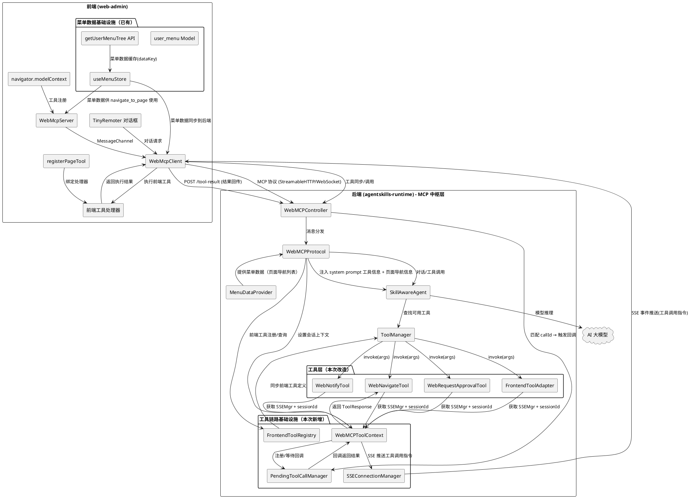
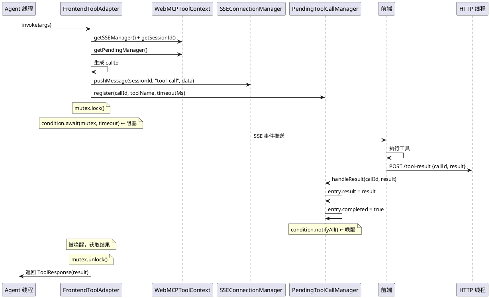
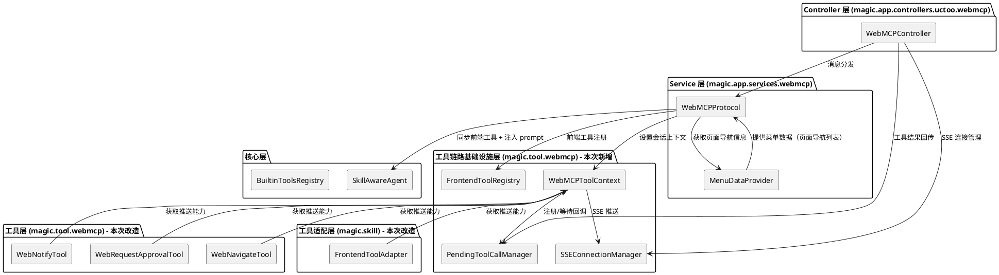

# WebMCP 工具链路闭环 - 实现方案文档

# **1. 实现模型**

## **1.1 上下文视图**

### 1.1.1 系统上下文

WebMCP 工具链路闭环项目补全 agentskills-runtime 作为 WebMCP 中枢层时，前端 MCP 工具调用链路中缺失的环节。核心使命是实现 Agent 通过 MCP 协议调用前端注册工具的完整闭环：工具发现 → 工具调用请求转发 → 前端执行 → 结果回传 → Agent 继续推理。

**核心技术路线**：遵循 WebMCP 标准，Agent 通过 MCP 协议操作前端注册的 Web 工具。agentskills-runtime 替代 WebAgent 作为 MCP 中枢层。前端工具（entity 查询、页面导航等）通过 MCP 协议注册，Agent 通过 MCP 协议调用。agentskills-runtime 负责：接收 Agent 工具调用 → SSE 推送到前端 → 等待结果回传 → 返回给 Agent。

**当前代码状态（已回退到 webmcp-tool-chain 之前）**：

后端代码中以下组件均不存在，需要全新开发：
1. `SSEConnectionManager` — SSE 连接管理器，不存在
2. `FrontendToolRegistry` — 前端工具注册表，不存在
3. `PendingToolCallManager` — 待处理工具调用管理器，不存在
4. `WebMCPToolContext` — 工具执行上下文，不存在
5. `MenuDataProvider` — 菜单数据提供者，不存在
6. `tools/register` 处理逻辑 — 前端工具注册到后端，不存在
7. `/tool-result` 端点 — 工具结果回传，不存在

后端代码中以下组件存在但功能不完整：
8. WebMCP 工具（web_navigate/web_notify/web_request_approval）的 `invoke` 方法仅返回静态文本，未通过 SSE 推送指令到前端
9. FrontendToolAdapter 的 `invoke` 方法也仅返回静态文本
10. buildAgentSystemPrompt 未注入前端工具信息和页面导航信息
11. WebMCPProtocol 未处理 tools/register 方法

前端代码已有部分基础设施：
12. `user_menu.ts` 已有 `dataKey: 'data'`（已完成）
13. `useMenuStore` 已有 `flatMenuList`（已完成）
14. `mcp-servers/index.ts` 已有 `buildNavigateDescription()` 使用菜单数据（已完成）
15. `App.vue` 已有 `tool_call` 消息处理和 `/tool-result` 回传逻辑（已完成）
16. `syncFrontendToolsToBackend()` 已有工具同步逻辑（已完成）



### 1.1.2 现有问题与设计目标

| 问题编号 | 现有问题 | 设计目标 |
|---------|---------|---------|
| 问题1 | SSEConnectionManager 不存在，无法向 SSE 客户端推送消息 | 新增 SSEConnectionManager，管理 SSE 连接和消息推送 |
| 问题2 | FrontendToolRegistry 不存在，无法存储前端注册的工具定义 | 新增 FrontendToolRegistry，存储前端工具元数据 |
| 问题3 | WebMCP 工具 invoke 仅返回静态文本，未通过 SSE 推送指令到前端 | invoke 通过 SSE 推送指令并阻塞等待前端回传结果 |
| 问题4 | FrontendToolAdapter invoke 仅返回静态文本 | invoke 通过 SSE 推送到前端执行并等待结果 |
| 问题5 | 工具实例不持有 SSEConnectionManager 引用，无法推送 SSE 消息 | 引入 WebMCPToolContext 依赖注入机制 |
| 问题6 | 仓颉 Tool.invoke 是同步方法，无法阻塞等待异步结果 | 使用 ReentrantMutex + Condition 实现同步阻塞等待 |
| 问题7 | 前端工具注册到后端后未同步到 Agent ToolManager | tools/register 时同步注册到 SkillAwareAgent |
| 问题8 | buildAgentSystemPrompt 未注入前端工具信息和页面导航信息 | 注入完整的工具使用说明和基于菜单数据的页面导航信息 |
| 问题9 | PendingToolCallManager 不存在，工具调用无法等待异步结果 | 新增 PendingToolCallManager，管理回调注册、触发、超时清理 |
| 问题10 | /tool-result 端点不存在，前端无法回传工具执行结果 | 新增 /tool-result 端点，接收前端回传结果并触发回调 |
| 问题11 | 后端内置工具与前端工具使用不同调用链路 | 统一使用 SSE 推送 → 前端执行 → /tool-result 回传链路 |
| 问题12 | MenuDataProvider 不存在，后端无法获取菜单数据 | 新增 MenuDataProvider，从数据库查询用户可访问的页面菜单 |

## **1.2 服务/组件总体架构**

### 1.2.1 核心架构决策

#### 决策1：包依赖方向与类放置策略

**问题**：之前的设计将 WebMCPToolContext 和 PendingToolCallManager 放在 `magic.app.services.webmcp` 包中，导致 `magic.tool.webmcp` 包中的 WebNavigateTool 等工具类需要 import `magic.app.services.webmcp`，形成循环依赖。

**方案**：将 WebMCPToolContext、PendingToolCallManager、SSEConnectionManager、FrontendToolRegistry 等被工具层和服务层共同使用的类放在 `magic.tool.webmcp` 包中。`magic.app.services.webmcp` 包中的 WebMCPProtocol 可以 import `magic.tool.webmcp` 中的类。

**包依赖方向**：
```
magic.tool.webmcp          ← 基础设施层（WebMCPToolContext、PendingToolCallManager、SSEConnectionManager、FrontendToolRegistry、WebNavigateTool 等）
    ↑
magic.app.services.webmcp  ← 服务层（WebMCPProtocol、MenuDataProvider）
    ↑
magic.app.controllers      ← 控制器层（WebMCPController）
```

**关键约束**：
- `magic.tool.webmcp` 不能 import `magic.app.services.webmcp`
- `magic.app.services.webmcp` 可以 import `magic.tool.webmcp`
- 仓颉语言中同包内的类默认可见，不需要显式 import

#### 决策2：WebMCPToolContext 依赖注入机制

**问题**：WebMCP 工具通过 `BuiltinToolsRegistry.registerAll(toolManager)` 以无参构造方式注册，工具实例不持有 SSEConnectionManager、sessionId 等运行时上下文。

**方案**：引入 `WebMCPToolContext` 全局单例，工具 invoke 时通过全局单例获取当前会话的 SSE 推送能力和 sessionId。

**选择**：采用 **全局单例 + sessionId 查询** 模式。原因：
- 仓颉语言不支持 ThreadLocal
- 工具实例由 BuiltinToolsRegistry 在启动时创建，无法传入会话级参数
- Agent 执行工具时在单线程上下文中运行，可通过全局单例获取当前会话信息

```plantuml
@startuml
skinparam componentStyle rectangle

package "magic.tool.webmcp 包" {
  [WebMCPToolContext] as Ctx
  Ctx : +instance: WebMCPToolContext (全局单例)
  Ctx : +setSessionContext(sessionId, sseMgr, pendingMgr)
  Ctx : +getSessionId(): ?String
  Ctx : +getSSEManager(): ?SSEConnectionManager
  Ctx : +getPendingManager(): ?PendingToolCallManager
  Ctx : +clearSessionContext()
}

package "magic.app.services.webmcp 包" {
  [WebMCPProtocol] as Proto
}

package "magic.tool.webmcp 包" {
  [WebNavigateTool] as Tool
}

Proto -right-> Ctx : 调用前设置上下文
Tool -up-> Ctx : 获取 SSEMgr + sessionId

@enduml
```

#### 决策3：同步阻塞等待模式

**问题**：仓颉 Tool.invoke 是同步方法 `func invoke(args: HashMap<String, JsonValue>): ToolResponse`，但前端工具执行是异步的（SSE 推送 → 前端执行 → HTTP 回传结果）。

**方案**：使用 `ReentrantMutex + Condition` 实现同步阻塞等待。工具 invoke 在推送 SSE 指令后，注册回调到 PendingToolCallManager，然后通过 Condition.await 阻塞当前线程，等待回调触发时 Condition.notify 唤醒。

**仓颉语言约束**：
- Condition 需要 ReentrantMutex 配合使用：`let mutex = ReentrantMutex(); let condition = mutex.condition()`
- Duration 用 `Duration.second * N` 格式
- HashMap 用 `add()` 而不是 `put()`



#### 决策4：PendingToolCallManager 独立组件

**问题**：当前代码中不存在 PendingToolCallManager，工具调用无法等待异步结果。

**方案**：新增独立的 `PendingToolCallManager` 组件，使用 `ReentrantMutex + Condition` 实现阻塞等待机制。通过 WebMCPToolContext 注入给工具使用。WebMCPController 的 handleToolResult 方法委托给 PendingToolCallManager 处理。

#### 决策5：统一 SSE 事件类型为 tool_call

**问题**：前端 App.vue 已有 `tool_call` 消息处理逻辑（`message.method === 'tool_call'`），后端应与此格式对齐。

**方案**：统一所有工具调用（包括后端内置工具和前端注册工具）的 SSE 推送格式为 `tool_call` 事件类型，数据中包含 `toolName` 字段区分具体工具。这与前端 App.vue 已有的 `tool_call` 消息监听代码兼容。

#### 决策6：后端内置工具与前端工具统一调用链路

**问题**：后端内置工具（web_navigate/web_notify/web_request_approval）在 WebMCP 标准中应该是前端注册的 MCP 工具，但当前阶段前端尚未将这些功能注册为前端工具。

**方案**：保留后端内置工具作为过渡方案，但其 invoke 方法改造为与前端工具相同的调用链路（SSE 推送 → 前端执行 → /tool-result 回传），确保架构一致性。后续可迁移为前端注册工具。

### 1.2.2 后端架构分层



### 1.2.3 新增/修改组件清单

| 组件 | 类型 | 文件路径 | 包名 | 说明 |
|------|------|---------|------|------|
| SSEConnectionManager | 新增 | `src/tool/webmcp/SSEConnectionManager.cj` | `magic.tool.webmcp` | SSE 连接管理器，管理 SSE 连接的注册、移除和消息推送 |
| FrontendToolRegistry | 新增 | `src/tool/webmcp/FrontendToolRegistry.cj` | `magic.tool.webmcp` | 前端工具注册表，存储前端注册的工具元数据 |
| WebMCPToolContext | 新增 | `src/tool/webmcp/WebMCPToolContext.cj` | `magic.tool.webmcp` | 全局单例，为 WebMCP 工具提供 SSE 推送能力和会话上下文 |
| PendingToolCallManager | 新增 | `src/tool/webmcp/PendingToolCallManager.cj` | `magic.tool.webmcp` | 待处理工具调用管理器，管理回调注册、触发、超时清理 |
| WebMCPToolHelper | 新增 | `src/tool/webmcp/WebMCPToolHelper.cj` | `magic.tool.webmcp` | 工具调用辅助类，提取 WebNavigateTool/WebNotifyTool/WebRequestApprovalTool/FrontendToolAdapter 共用的 SSE 推送+阻塞等待逻辑，避免代码重复 |
| MenuDataProvider | 新增 | `src/app/services/webmcp/MenuDataProvider.cj` | `magic.app.services.webmcp` | 菜单数据提供者，复用 PermissionsService.getUserMenuTree 从数据库 permissions 表查询用户可访问的页面菜单 |
| WebNavigateTool | 修改 | `src/tool/webmcp/web_navigate_tool.cj` | `magic.tool.webmcp` | invoke 改为通过 SSE 推送指令并阻塞等待前端结果 |
| WebNotifyTool | 修改 | `src/tool/webmcp/web_notify_tool.cj` | `magic.tool.webmcp` | invoke 改为通过 SSE 推送指令并阻塞等待前端结果 |
| WebRequestApprovalTool | 修改 | `src/tool/webmcp/web_request_approval_tool.cj` | `magic.tool.webmcp` | invoke 改为通过 SSE 推送指令并阻塞等待前端审批结果 |
| FrontendToolAdapter | 修改 | `src/skill/frontend_tool_adapter.cj` | `magic.skill` | invoke 改为通过 SSE 推送到前端执行并等待结果 |
| WebMCPProtocol | 修改 | `src/app/services/webmcp/WebMCPProtocol.cj` | `magic.app.services.webmcp` | 新增 tools/register 处理；调用 Agent 前设置 WebMCPToolContext；buildAgentSystemPrompt 注入工具信息和页面导航信息 |
| WebMCPController | 修改 | `src/app/controllers/uctoo/webmcp/WebMCPController.cj` | `magic.app.controllers.uctoo.webmcp` | 新增 /tool-result 端点；新增 SSE 连接管理；初始化基础设施并注入 Protocol |
| SkillAwareAgent | 修改 | `src/skill/skill_aware_agent.cj` | `magic.skill` | addFrontendTool 改造为通过 SSE 推送执行 |

### 1.2.4 前端菜单数据架构

web-admin 项目使用动态路由系统，路由配置保存在 agentskills-runtime 的数据库 `permissions` 表中。用户登录后通过 `POST /api/v1/uctoo/permissions/user/menu` 获取有权限访问的菜单信息。

**现有前端菜单数据链路（已完成）：**

```
permissions 表（数据库）
  → POST /api/v1/uctoo/permissions/user/menu（后端 API）
    → user_menu Model（pinia-orm Model 定义，已有 dataKey: 'data'）
      → getUserMenuTree()（API 调用方法，已添加 dataKey）
        → useMenuStore（Pinia store，已有 menuList/flatMenuList）
```

**设计原则**：webmcp-tool-chain 需要使用前端菜单和路由数据时，应**复用和完善优化已有的基础设施**，而不是重新开发。具体来说：
- 前端菜单数据已通过 `getUserMenuTree` 方法获取并缓存（已有 dataKey: 'data'）
- Agent 的 system prompt 中注入的页面导航信息应来自后端 MenuDataProvider（本次新增）
- `navigate_to_page` 前端工具的可用页面列表已来自菜单数据（已有 buildNavigateDescription）
- `web_navigate` 后端工具的可用路由列表应来自 MenuDataProvider（本次新增）

## **1.3 实现设计文档**

### 1.3.1 REQ-TC-01：前端工具注册到 Agent ToolManager

#### 实现思路

当前前端通过 `syncFrontendToolsToBackend()` 发送 `tools/register` JSON-RPC 请求到后端，但后端 WebMCPProtocol 的 handleMethod 中没有处理 `tools/register` 方法。需要：1）WebMCPProtocol 新增 handleRegisterTool 方法处理 tools/register 请求；2）新增 FrontendToolRegistry 存储前端工具元数据；3）注册到 FrontendToolRegistry 后同步调用 SkillAwareAgent.addFrontendTool()；4）前端工具注销时同步从 Agent ToolManager 移除。

#### 架构决策

1. **新增 FrontendToolRegistry**：放在 `magic.tool.webmcp` 包中，存储前端注册的工具定义（名称、描述、inputSchema、route 等）
2. **同步注册**：WebMCPProtocol.handleRegisterTool() 中注册到 FrontendToolRegistry 后，立即调用 Agent.addFrontendTool() 同步到 ToolManager
3. **FrontendToolAdapter.invoke 改造**：与 WebMCP 工具相同，通过 WebMCPToolContext 获取 SSE 推送能力，推送指令到前端执行并阻塞等待结果
4. **重名冲突处理**：前端工具与后端技能同名时，跳过同步并记录 WARN 日志
5. **Agent 不可用降级**：Agent 实例不可用时仅注册到 FrontendToolRegistry，待 Agent 初始化后补同步

#### 需要新增的文件

| 文件 | 包名 | 功能描述 |
|------|------|---------|
| `src/tool/webmcp/FrontendToolRegistry.cj` | `magic.tool.webmcp` | 前端工具注册表，存储前端注册的工具元数据 |

#### 需要修改的文件

| 文件 | 修改内容 |
|------|---------|
| `WebMCPProtocol.cj` | 新增 handleRegisterTool() 方法处理 tools/register 请求；新增 _frontendToolRegistry 成员变量；新增 _syncFrontendToolToAgent() 方法 |

#### 关键代码结构设计

**FrontendToolRegistry：**

```cangjie
// FrontendToolRegistry.cj

package magic.tool.webmcp

import std.collection.{HashMap, ArrayList}
import stdx.encoding.json.{JsonObject}
import magic.log.LogUtils

/**
 * 前端工具定义
 * 存储前端通过 MCP 协议注册的工具元数据
 */
public class FrontendToolDefinition {
    public let name: String
    public let title: String
    public let description: String
    public let inputSchema: JsonObject
    public let route: String
    public let annotations: ?JsonObject

    public init(name: String, title: String, description: String, inputSchema: JsonObject, route: String, annotations: ?JsonObject) {
        this.name = name
        this.title = title
        this.description = description
        this.inputSchema = inputSchema
        this.route = route
        this.annotations = annotations
    }
}

/**
 * 前端工具注册表
 * 存储前端通过 MCP 协议注册的工具定义
 * 供 WebMCPProtocol 同步到 Agent ToolManager 使用
 */
public class FrontendToolRegistry {
    private var _tools = HashMap<String, FrontendToolDefinition>()

    /// 注册前端工具
    public func register(toolDef: FrontendToolDefinition): Unit { ... }

    /// 注销前端工具
    public func unregister(name: String): Unit { ... }

    /// 获取所有已注册的前端工具
    public func getAllTools(): ArrayList<FrontendToolDefinition> { ... }

    /// 获取指定名称的前端工具
    public func getTool(name: String): ?FrontendToolDefinition { ... }

    /// 检查工具是否已注册
    public func contains(name: String): Bool { ... }
}
```

**WebMCPProtocol.handleRegisterTool：**

```cangjie
// WebMCPProtocol.cj - 新增方法

private func handleRegisterTool(obj: JsonObject): String {
    let requestId = obj.get("id")
    let params = obj.get("params")

    // ... 解析 params.tool 中的工具定义 ...

    let toolDef = FrontendToolDefinition(name, title, description, inputSchema, route, annotations)

    // 注册到 FrontendToolRegistry
    if (let Some(registry) <- _frontendToolRegistry) {
        registry.register(toolDef)
    }

    // 同步到 Agent ToolManager
    _syncFrontendToolToAgent(toolDef)

    let result = JsonObject()
    result.put("success", JsonBool(true))
    result.put("message", JsonString("Tool registered successfully"))

    return createSuccessResponse(result, requestId)
}

/**
 * 将前端工具同步注册到 Agent ToolManager
 */
private func _syncFrontendToolToAgent(toolDef: FrontendToolDefinition): Unit {
    if (let Some(agent) <- _agent) {
        // 检查重名冲突（通过公开的 toolManager 属性访问，不要直接访问 _toolManager 私有成员）
        let existingTool = agent.toolManager.findTool(toolDef.name)
        if (existingTool.isSome()) {
            LogUtils.warn("前端工具 ${toolDef.name} 与已有工具重名，跳过同步")
            return
        }

        agent.addFrontendTool(
            toolDef.name,
            title: Some(toolDef.title),
            description: Some(toolDef.description),
            route: Some(toolDef.route),
            inputSchema: Some(toolDef.inputSchema)
        )
        LogUtils.info("WebMCP: synced frontend tool '${toolDef.name}' to Agent ToolManager")
    } else {
        LogUtils.warn("WebMCP: Agent not available, frontend tool '${toolDef.name}' only registered to FrontendToolRegistry")
    }
}
```

#### 数据流

```
前端 syncFrontendToolsToBackend() → tools/register {tool: query_entity_list}
  → WebMCPProtocol.handleRegisterTool()
    → FrontendToolRegistry.register(query_entity_list)
    → _syncFrontendToolToAgent(query_entity_list)
      → SkillAwareAgent.addFrontendTool(name, title, desc, route, inputSchema)
        → ToolManager.addTool(FrontendToolAdapter(...))
    → LLM 在推理时可发现 query_entity_list 工具
```

---

### 1.3.2 REQ-TC-02：前端工具调用指令转发

#### 实现思路

当前 WebMCP 工具（web_navigate、web_notify、web_request_approval）和 FrontendToolAdapter 的 invoke 方法仅提取参数后返回静态文本字符串，未通过 SSE 推送任何指令到前端。需要改造为：1）通过 WebMCPToolContext 获取 SSEConnectionManager 和 sessionId；2）生成 callId；3）通过 SSE 推送工具执行指令（统一使用 `tool_call` 事件类型）；4）注册回调到 PendingToolCallManager；5）阻塞等待前端回传结果。

#### 架构决策

1. **WebMCPToolContext 全局单例**：工具 invoke 时通过 `WebMCPToolContext.instance` 获取当前会话的 SSEConnectionManager、sessionId 和 PendingToolCallManager
2. **统一 SSE 事件类型**：所有工具调用（后端内置和前端注册）统一使用 `tool_call` 事件类型，数据中包含 `toolName` 字段区分具体工具
3. **callId 格式**：`call_{timestamp}_{random8位}`，确保唯一性
4. **超时配置**：web_navigate 和 web_notify 默认 30 秒，web_request_approval 默认 120 秒，前端工具默认 30 秒
5. **SSE 推送失败处理**：pushMessage 返回 false 时，直接返回错误 ToolResponse，不阻塞等待

#### 需要新增的文件

| 文件 | 包名 | 功能描述 |
|------|------|---------|
| `src/tool/webmcp/WebMCPToolContext.cj` | `magic.tool.webmcp` | 全局单例，提供 SSE 推送能力和会话上下文给 WebMCP 工具 |
| `src/tool/webmcp/PendingToolCallManager.cj` | `magic.tool.webmcp` | 待处理工具调用管理器，管理回调注册、触发、超时清理 |
| `src/tool/webmcp/SSEConnectionManager.cj` | `magic.tool.webmcp` | SSE 连接管理器，管理 SSE 连接的注册、移除和消息推送 |
| `src/tool/webmcp/WebMCPToolHelper.cj` | `magic.tool.webmcp` | 工具调用辅助类，提取 SSE 推送 + 阻塞等待公共逻辑，供 WebNavigateTool/WebNotifyTool/WebRequestApprovalTool/FrontendToolAdapter 复用 |

#### 需要修改的文件

| 文件 | 修改内容 |
|------|---------|
| `src/tool/webmcp/web_navigate_tool.cj` | invoke 方法改造：构建参数 → 调用 WebMCPToolHelper.executeToolCall("web_navigate", args, 30000, "") |
| `src/tool/webmcp/web_notify_tool.cj` | invoke 方法改造：构建参数 → 调用 WebMCPToolHelper.executeToolCall("web_notify", args, 30000, "") |
| `src/tool/webmcp/web_request_approval_tool.cj` | invoke 方法改造：构建参数 → 调用 WebMCPToolHelper.executeToolCall("web_request_approval", args, 120000, "") |
| `src/skill/frontend_tool_adapter.cj` | invoke 方法改造：调用 WebMCPToolHelper.executeToolCall(_name, args, 30000, _route)，需 import magic.tool.webmcp.WebMCPToolHelper |

#### 关键代码结构设计

**SSEConnectionManager：**

```cangjie
// SSEConnectionManager.cj

package magic.tool.webmcp

import std.collection.{HashMap}
import std.sync.{ReentrantMutex}
import magic.log.LogUtils

/**
 * SSE 连接管理器
 * 管理 SSE 连接的注册、移除和消息推送
 * 每个会话（sessionId）对应一个 SSE 连接
 */
public class SSEConnectionManager {
    /// sessionId -> SSE 写入回调
    private var _connections = HashMap<String, (String) -> Unit>()
    private let _mutex = ReentrantMutex()

    /// 注册 SSE 连接
    public func registerConnection(sessionId: String, writer: (String) -> Unit): Unit { ... }

    /// 移除 SSE 连接
    public func removeConnection(sessionId: String): Unit { ... }

    /// 向指定会话推送 SSE 消息
    /// 返回 true 表示推送成功，false 表示连接不存在或推送失败
    public func pushMessage(sessionId: String, eventType: String, data: String): Bool { ... }

    /// 检查指定会话的 SSE 连接是否存在
    public func hasConnection(sessionId: String): Bool { ... }
}
```

**WebMCPToolContext：**

```cangjie
// WebMCPToolContext.cj

package magic.tool.webmcp

import std.sync.{ReentrantMutex}

/**
 * WebMCP 工具执行上下文
 * 全局单例，为 WebMCP 工具提供 SSE 推送能力和会话上下文
 *
 * 放置在 magic.tool.webmcp 包中，避免 magic.tool.webmcp import magic.app.services.webmcp 导致循环依赖
 *
 * 使用模式：
 * 1. WebMCPProtocol 在调用 Agent.chat() 前设置当前会话上下文
 * 2. 工具 invoke 时通过 instance 获取上下文
 * 3. Agent.chat() 返回后清除上下文
 */
public class WebMCPToolContext {
    /// 全局单例
    public static let instance = WebMCPToolContext()

    /// 当前会话 ID
    private var _sessionId: String = ""

    /// SSE 连接管理器
    private var _sseManager: ?SSEConnectionManager = None

    /// 待处理工具调用管理器
    private var _pendingManager: ?PendingToolCallManager = None

    /// 互斥锁保护并发访问
    private let _mutex = ReentrantMutex()

    /// 设置当前会话上下文（由 WebMCPProtocol 在调用 Agent 前调用）
    public func setSessionContext(
        sessionId: String,
        sseManager: SSEConnectionManager,
        pendingManager: PendingToolCallManager
    ): Unit { ... }

    /// 清除当前会话上下文（由 WebMCPProtocol 在 Agent 调用返回后调用）
    public func clearSessionContext(): Unit { ... }

    /// 获取当前会话 ID
    public func getSessionId(): ?String { ... }

    /// 获取 SSE 连接管理器
    public func getSSEManager(): ?SSEConnectionManager { ... }

    /// 获取待处理工具调用管理器
    public func getPendingManager(): ?PendingToolCallManager { ... }
}
```

**PendingToolCallManager：**

```cangjie
// PendingToolCallManager.cj

package magic.tool.webmcp

import magic.log.LogUtils
import std.collection.{HashMap, ArrayList}
import std.sync.{ReentrantMutex, Condition}
import std.time.DateTime

/**
 * 待处理工具调用条目
 * 包含阻塞等待机制
 */
public class PendingToolCallEntry {
    public let callId: String
    public let toolName: String
    public let createdAt: Int64
    public let timeoutMs: Int64

    /// 互斥锁和条件变量，用于阻塞等待
    public let mutex = ReentrantMutex()
    public let condition = Condition()

    /// 工具执行结果
    public var result: String = ""

    /// 是否已完成（成功或超时）
    public var completed: Bool = false

    /// 是否超时
    public var timedOut: Bool = false

    public init(callId: String, toolName: String, timeoutMs: Int64) {
        this.callId = callId
        this.toolName = toolName
        this.timeoutMs = timeoutMs
        // createdAt 使用当前时间戳（毫秒）
    }
}

/**
 * 待处理工具调用管理器
 * 管理工具调用的回调注册、触发和超时清理
 */
public class PendingToolCallManager {
    /// callId -> PendingToolCallEntry
    private var _entries = HashMap<String, PendingToolCallEntry>()
    private let _mutex = ReentrantMutex()

    /// 注册待处理工具调用
    /// 返回 entry，调用方通过 entry.mutex/condition 阻塞等待
    public func register(callId: String, toolName: String, timeoutMs: Int64): PendingToolCallEntry { ... }

    /// 处理前端回传的工具调用结果
    /// 返回 true 表示成功匹配并触发回调
    public func handleResult(callId: String, result: String): Bool { ... }

    /// 检查 callId 是否存在
    public func contains(callId: String): Bool { ... }

    /// 移除指定 callId
    public func remove(callId: String): Unit { ... }

    /// 清理超时条目
    public func cleanupTimedOut(): Unit { ... }
}
```

**WebMCPToolHelper 工具调用辅助类：**

为避免 WebNavigateTool、WebNotifyTool、WebRequestApprovalTool、FrontendToolAdapter 四个类重复编写"获取上下文 → 生成 callId → SSE 推送 → 注册回调 → 阻塞等待 → 返回结果"的相同逻辑，提取公共逻辑到 WebMCPToolHelper 静态辅助类。该类放在 `magic.tool.webmcp` 包中，同包内的 WebNavigateTool 等工具默认可见无需 import；FrontendToolAdapter 在 `magic.skill` 包中需要 import。

```cangjie
// WebMCPToolHelper.cj

package magic.tool.webmcp

import magic.core.tool.{ToolResponse, ToolException}
import std.collection.{HashMap}
import std.sync.{ReentrantMutex, Condition}
import std.time.DateTime
import stdx.encoding.json.{JsonValue, JsonObject, JsonString}
import magic.log.LogUtils

/**
 * WebMCP 工具调用辅助类
 * 提取 WebNavigateTool/WebNotifyTool/WebRequestApprovalTool/FrontendToolAdapter 共用的
 * SSE 推送 + 阻塞等待逻辑，避免代码重复
 */
public class WebMCPToolHelper {
    /**
     * 执行 WebMCP 工具调用（SSE 推送指令 → 阻塞等待前端回传结果）
     * @param toolName 工具名称
     * @param args 工具调用参数
     * @param timeoutMs 超时时间（毫秒）
     * @param route 前端工具的目标页面路由（后端内置工具传空字符串）
     * @return ToolResponse 包含前端回传的结果或错误信息
     */
    public static func executeToolCall(toolName: String, args: HashMap<String, JsonValue>, timeoutMs: Int64, route: String): ToolResponse {
        // 1. 获取工具执行上下文
        let ctx = WebMCPToolContext.instance
        let sessionIdOpt = ctx.getSessionId()
        let sseManagerOpt = ctx.getSSEManager()
        let pendingManagerOpt = ctx.getPendingManager()

        if (sessionIdOpt.isNone() || sseManagerOpt.isNone() || pendingManagerOpt.isNone()) {
            return ToolResponse("{\"error\":\"前端连接不可用，无法执行${toolName}操作\"}", isError: true)
        }

        let sessionId = sessionIdOpt.getOrThrow()
        let sseManager = sseManagerOpt.getOrThrow()
        let pendingManager = pendingManagerOpt.getOrThrow()

        // 2. 生成 callId
        let callId = _generateCallId()

        // 3. 构建 SSE 推送数据（统一使用 tool_call 事件类型）
        let argsObj = JsonObject()
        for ((key, value) in args) {
            argsObj.put(key, value)
        }

        let dataObj = JsonObject()
        dataObj.put("toolName", JsonString(toolName))
        dataObj.put("arguments", argsObj)
        dataObj.put("callId", JsonString(callId))
        if (!route.isEmpty()) {
            dataObj.put("route", JsonString(route))
        }
        let dataStr = dataObj.toString()

        // 4. 通过 SSE 推送指令
        let pushed = sseManager.pushMessage(sessionId, "tool_call", dataStr)
        if (!pushed) {
            return ToolResponse("{\"error\":\"操作推送失败，请刷新页面重试\",\"toolName\":\"${toolName}\"}", isError: true)
        }

        // 5. 注册回调并阻塞等待
        LogUtils.info("WebMCPToolHelper: tool_call pushed, toolName=${toolName}, callId=${callId}, timeoutMs=${timeoutMs.toString()}")
        let entry = pendingManager.register(callId, toolName, timeoutMs)

        entry.mutex.lock()
        while (!entry.completed) {
            entry.condition.await(entry.mutex, Duration.millisecond * timeoutMs)
            if (!entry.completed) {
                // 超时
                entry.completed = true
                entry.timedOut = true
                entry.result = "{\"error\":\"${toolName}操作超时，未收到前端响应\",\"callId\":\"${callId}\"}"
                pendingManager.remove(callId)
                LogUtils.warn("WebMCPToolHelper: tool_call timed out, toolName=${toolName}, callId=${callId}")
                break
            }
        }
        let result = entry.result
        entry.mutex.unlock()

        // 6. 返回结果
        if (entry.timedOut) {
            return ToolResponse(result, isError: true)
        }
        LogUtils.info("WebMCPToolHelper: tool_call completed, toolName=${toolName}, callId=${callId}")
        return ToolResponse(result, isError: false)
    }

    /// 生成 callId：call_{timestamp}_{random8位}
    private static func _generateCallId(): String {
        let ts = DateTime.now().toUnixMillis().toString()
        let rand = (DateTime.now().toUnixMillis() % 100000000).toString()
        "call_${ts}_${rand}"
    }
}
```

**WebNavigateTool invoke 改造：**

```cangjie
// web_navigate_tool.cj - invoke 方法改造

override public func invoke(args: HashMap<String, JsonValue>): ToolResponse {
    let url = WebNavigateTool.extractString(args, "url")
    if (url.isEmpty()) {
        throw ToolException("Parameter 'url' is required")
    }
    let title = WebNavigateTool.extractString(args, "title")

    // 构建参数
    let argsMap = HashMap<String, JsonValue>()
    argsMap.add("url", JsonString(url))
    if (!title.isEmpty()) {
        argsMap.add("title", JsonString(title))
    }

    // 通过 WebMCPToolHelper 统一执行 SSE 推送 + 阻塞等待
    WebMCPToolHelper.executeToolCall("web_navigate", argsMap, 30000, "")
}
```

**FrontendToolAdapter invoke 改造：**

```cangjie
// frontend_tool_adapter.cj - invoke 方法改造

override public func invoke(args: HashMap<String, JsonValue>): ToolResponse {
    // 通过 WebMCPToolHelper 统一执行 SSE 推送 + 阻塞等待
    // FrontendToolAdapter 在 magic.skill 包中，需要 import magic.tool.webmcp.WebMCPToolHelper
    WebMCPToolHelper.executeToolCall(_name, args, 30000, _route)
}
```

#### 数据流

```
Agent LLM 决策调用 web_navigate(url="https://example.com")
  → SkillAwareAgent.chat() 内部调用 ToolManager.findTool("web_navigate")
  → WebNavigateTool.invoke(args) 被调用
    → WebMCPToolHelper.executeToolCall("web_navigate", args, 30000, "")
      → WebMCPToolContext.instance 获取 sessionId + SSEManager + PendingManager
      → 生成 callId = "call_{ts}_{random8}"
      → SSEManager.pushMessage(sessionId, "tool_call", {toolName, arguments, callId})
        → SSE 事件推送到前端
      → PendingManager.register(callId, "web_navigate", 30000)
      → Condition.await() 阻塞等待

前端 SSE 监听器收到 event: tool_call
  → 根据 toolName 执行对应工具操作
  → POST /api/v1/uctoo/webmcp/tool-result {callId, result}
    → WebMCPController.handleToolResult()
      → PendingToolCallManager.handleResult(callId, result)
        → Condition.notifyAll() 唤醒等待线程

WebMCPToolHelper.executeToolCall 被唤醒
  → 获取 result
  → 返回 ToolResponse(result)
→ Agent LLM 继续推理
```

---

### 1.3.3 REQ-TC-03：工具调用结果等待与回调机制

#### 实现思路

当前代码中不存在 PendingToolCallManager 和 /tool-result 端点，工具调用无法等待异步结果。需要：1）新增 PendingToolCallManager，使用 ReentrantMutex + Condition 实现阻塞等待；2）工具 invoke 推送 SSE 指令后注册回调；3）前端回传结果时通过 handleResult 触发回调唤醒等待线程；4）新增 /tool-result 端点接收前端回传结果。

#### 架构决策

1. **PendingToolCallManager 独立组件**：放在 `magic.tool.webmcp` 包中，管理回调注册、触发和超时清理
2. **ReentrantMutex + Condition 阻塞**：每个 PendingToolCallEntry 持有独立的 mutex 和 condition，工具 invoke 线程通过 condition.await 阻塞，handleResult 线程通过 condition.notifyAll 唤醒
3. **超时处理**：await 时传入超时时间，超时后标记 timedOut 并返回超时错误
4. **WebMCPController 委托**：新增 handleToolResult 方法委托给 PendingToolCallManager.handleResult 处理

#### 需要修改的文件

| 文件 | 修改内容 |
|------|---------|
| `WebMCPController.cj` | 新增 PendingToolCallManager 成员变量；新增 handleToolResult 方法处理 /tool-result 请求；新增 SSEConnectionManager 成员变量 |

#### 关键代码结构设计

**WebMCPController 改造：**

```cangjie
// WebMCPController.cj

/// 待处理工具调用管理器
private let _pendingToolCallManager = PendingToolCallManager()

/// SSE 连接管理器
private let _sseConnectionManager = SSEConnectionManager()

/**
 * 处理前端工具调用结果回传
 * 路由：POST /api/v1/uctoo/webmcp/tool-result
 */
public func handleToolResult(req: HttpRequest, res: HttpResponse): Unit {
    let body = req.body
    if (body.isEmpty()) {
        res.status(400).json("{\"error\": \"Empty request body\"}")
        return
    }

    try {
        let jsonValue = JsonValue.fromStr(body)
        if (jsonValue is JsonObject) {
            let obj = jsonValue.asObject()
            let callIdOpt = obj.get("callId")
            let resultOpt = obj.get("result")

            if (callIdOpt.isNone()) {
                res.status(400).json("{\"error\": \"Missing required field: callId\"}")
                return
            }

            let callId = callIdOpt.getOrThrow().toString()

            if (resultOpt.isNone()) {
                res.status(400).json("{\"error\": \"Missing required field: result\"}")
                return
            }

            let resultStr = resultOpt.getOrThrow().toString()

            if (_pendingToolCallManager.handleResult(callId, resultStr)) {
                res.status(200).json("{\"success\": true}")
            } else {
                res.status(404).json("{\"error\": \"未找到对应的工具调用\"}")
            }
        } else {
            res.status(400).json("{\"error\": \"Invalid JSON format\"}")
        }
    } catch (e: Exception) {
        LogUtils.error("handleToolResult error: ${e.message}")
        res.status(500).json("{\"error\": \"${e.message}\"}")
    }
}

/// 获取 PendingToolCallManager 实例（供 WebMCPProtocol 初始化 WebMCPToolContext 使用）
public func getPendingToolCallManager(): PendingToolCallManager {
    _pendingToolCallManager
}

/// 获取 SSEConnectionManager 实例
public func getSSEConnectionManager(): SSEConnectionManager {
    _sseConnectionManager
}
```

#### 数据流

```
工具 invoke → PendingToolCallManager.register(callId, toolName, timeoutMs)
  → 创建 PendingToolCallEntry(callId, mutex, condition)
  → entry.mutex.lock() → condition.await(mutex, timeout) → 阻塞

前端 → POST /tool-result {callId, result}
  → WebMCPController.handleToolResult()
    → PendingToolCallManager.handleResult(callId, resultStr)
      → entry.mutex.lock() → entry.result = result → entry.completed = true → condition.notifyAll()
    → 返回 200 OK

工具 invoke 被唤醒
  → 检查 entry.completed → 获取 entry.result → 返回 ToolResponse
```

---

### 1.3.4 REQ-TC-04：Agent System Prompt 工具信息注入

#### 实现思路

当前 `buildAgentSystemPrompt()` 方法仅注入后端技能的知识库信息，未注入前端工具的使用说明和页面导航信息。需要改造为同时注入三类信息：1）后端技能；2）前端注册的工具；3）基于菜单数据的页面导航信息。

**关键设计原则**：页面导航信息应来自已有的菜单数据基础设施（`permissions` 表 → `getUserMenuTree` API → 前端 store 缓存），而非硬编码或重新开发。后端通过 `MenuDataProvider` 从数据库 `permissions` 表查询当前用户有权限访问的菜单数据，提取页面路由列表注入 system prompt。

#### 架构决策

1. **三类信息分区注入**：system prompt 中按 "## 后端技能"、"## 前端页面工具"、"## 可访问的页面导航" 三个分区注入
2. **页面导航信息来自菜单数据**：通过 `MenuDataProvider` 从数据库 `permissions` 表查询用户可访问的菜单，提取路由路径和页面标题，注入 system prompt
3. **动态更新**：每次调用 buildAgentSystemPrompt 时从 FrontendToolRegistry 和 MenuDataProvider 实时读取，确保最新
4. **工具信息格式**：每个工具包含名称、功能描述、参数说明和使用场景；页面导航信息包含路由路径和页面标题

#### 需要新增的文件

| 文件 | 包名 | 功能描述 |
|------|------|---------|
| `src/app/services/webmcp/MenuDataProvider.cj` | `magic.app.services.webmcp` | 菜单数据提供者，从数据库 permissions 表查询用户可访问的页面菜单 |

#### 需要修改的文件

| 文件 | 修改内容 |
|------|---------|
| `WebMCPProtocol.cj` | 改造 `buildAgentSystemPrompt()` 方法，注入前端工具信息和页面导航信息；新增 MenuDataProvider 引用 |

#### 关键代码结构设计

**MenuDataProvider：**

**关键设计原则**：MenuDataProvider 必须复用已有的 `PermissionsService.getUserMenuTree(userId)` 方法查询菜单数据，而不是重新实现 SQL 查询逻辑。`PermissionsService.getUserMenuTree` 已实现了完整的"用户角色 → 权限名称 → 菜单权限"查询链路（含菜单通配符 `menu:*` 处理），返回 `ArrayList<PermissionsPO>`。MenuDataProvider 将 `PermissionsPO` 转换为 `MenuItem`，并构建树形结构。

```cangjie
// MenuDataProvider.cj

package magic.app.services.webmcp

import magic.log.LogUtils
import magic.app.services.uctoo.PermissionsService
import magic.app.models.uctoo.PermissionsPO
import std.collection.{ArrayList, HashMap}

/**
 * 菜单数据项
 * 表示用户可访问的一个页面菜单项
 */
public class MenuItem {
    public let path: String       // 页面路由路径，如 "/database/uctoo/entity"
    public let title: String      // 页面标题，如 "实体管理"
    public let icon: String       // 图标
    public let parentId: ?String  // 父菜单 ID
    public let children: ArrayList<MenuItem>  // 子菜单

    public init(path: String, title: String, icon: String, parentId: ?String) { ... }
}

/**
 * 菜单数据提供者
 * 复用 PermissionsService.getUserMenuTree 从数据库 permissions 表查询用户可访问的页面菜单
 * 供 Agent system prompt 注入页面导航信息
 */
public class MenuDataProvider {
    private let _permissionsService = PermissionsService()

    /**
     * 查询指定用户有权限访问的菜单列表
     * 复用 PermissionsService.getUserMenuTree(userId) 查询，将 PermissionsPO 转换为 MenuItem 并构建树形结构
     * 与前端 POST /api/v1/uctoo/permissions/user/menu 端点使用相同的数据源和查询逻辑
     */
    public func getUserMenuTree(userId: String): ArrayList<MenuItem> {
        // 1. 调用 PermissionsService.getUserMenuTree(userId) 获取 ArrayList<PermissionsPO>
        // 2. 将 PermissionsPO 转换为 MenuItem（path 来自 PermissionsPO.path，title 来自 PermissionsPO.title）
        // 3. 根据 parentId 构建树形结构
        // 4. 返回树形结构的根节点列表
    }

    /**
     * 将菜单树扁平化为路由路径列表
     * 用于注入 Agent system prompt
     */
    public func flattenMenuPaths(menuTree: ArrayList<MenuItem>): ArrayList<MenuItem> { ... }
}
```

**buildAgentSystemPrompt 改造：**

```cangjie
// WebMCPProtocol.cj

/// 菜单数据提供者引用
private var _menuDataProvider: ?MenuDataProvider = None

/**
 * 注入菜单数据提供者
 */
public func setMenuDataProvider(provider: MenuDataProvider): Unit {
    this._menuDataProvider = Some(provider)
}

/**
 * 构建 Agent 系统提示词
 * 注入后端技能、前端工具和页面导航信息
 */
private func buildAgentSystemPrompt(): String {
    let sb = StringBuilder()

    sb.append("你是一个智能助手，可以通过工具与前端 Web 应用交互。\n\n")

    sb.append("【重要说明】\n")
    sb.append("1. 你可以直接使用框架内置的 http_request 工具来发送 HTTP 请求。\n")
    sb.append("2. 当用户需要调用后端 API 时，请直接使用 http_request 工具。\n")
    sb.append("3. 当需要导航到特定页面时，请使用 navigate_to_page 或 web_navigate 工具。\n\n")

    // === 后端技能 ===
    if (let Some(sm) <- _skillManager) {
        let skills = sm.availableSkills.values().toArray()
        if (!skills.isEmpty()) {
            sb.append("【已安装的技能知识库】\n")
            for (skill in skills) {
                sb.append("### " + skill.name + "\n")
                sb.append(skill.description + "\n\n")
            }
        }
    }

    // === 前端页面工具 ===
    if (let Some(registry) <- _frontendToolRegistry) {
        let frontendTools = registry.getAllTools()
        if (frontendTools.size > 0) {
            sb.append("【前端页面工具】\n")
            sb.append("前端注册了以下工具，可在对应页面执行操作：\n\n")
            for (tool in frontendTools) {
                sb.append("- **${tool.name}**: ${tool.description}")
                if (!tool.route.isEmpty()) {
                    sb.append("（页面: ${tool.route}）")
                }
                sb.append("\n")
            }
            sb.append("\n")
        }
    }

    // === 可访问的页面导航 ===
    if (let Some(provider) <- _menuDataProvider) {
        // _userId 由 WebMCPController 在 setSessionInfo 时传入（从 req.getLocals("userId") 获取）
        let menuTree = provider.getUserMenuTree(_userId)
        let flatMenus = provider.flattenMenuPaths(menuTree)
        if (flatMenus.size > 0) {
            sb.append("【可访问的页面导航】\n")
            sb.append("用户可以访问以下页面，使用 navigate_to_page 或 web_navigate 工具跳转：\n\n")
            for (menu in flatMenus) {
                sb.append("- **${menu.path}**: ${menu.title}\n")
            }
            sb.append("\n")
        }
    }

    return sb.toString()
}
```

#### 数据流

```
WebMCPProtocol.processChatContent(userMessage)
  → buildAgentSystemPrompt()
    → SkillManager.availableSkills → 后端技能列表
    → FrontendToolRegistry.getAllTools() → 前端工具列表
    → MenuDataProvider.getUserMenuTree(userId) → 用户可访问的菜单树
      → MenuDataProvider.flattenMenuPaths() → 扁平化的页面路由列表
    → 拼接完整 system prompt（后端技能 + 前端工具 + 页面导航）
    → 【集成 WebNavigateTool 动态描述】
      → 将扁平化菜单格式化为字符串（如 "/database/uctoo/entity（实体管理）\n..."）
      → agent.toolManager.findTool("web_navigate") 获取工具
      → 使用 is 检查后 as 转换为 WebNavigateTool
      → 调用 webNavTool.updateDescription(formattedPagesString) 更新工具描述
  → SkillAwareAgent.chat(AgentRequest(userMessage, systemPrompt: prompt))
  → Agent LLM 推理时可感知所有工具和可导航的页面
```

---

### 1.3.5 REQ-TC-05：前端工具调用结果回传

#### 实现思路

当前 /tool-result 端点不存在，前端无法回传工具执行结果。需要：1）WebMCPController 新增 handleToolResult 方法处理 /tool-result 请求；2）校验 callId 和 result 必填字段；3）委托给 PendingToolCallManager.handleResult 处理；4）未知 callId 返回 404。

#### 架构决策

1. **/tool-result 端点**：WebMCPController 新增 handleToolResult 方法，处理 POST /api/v1/uctoo/webmcp/tool-result 请求
2. **handleToolResult 委托**：委托给 PendingToolCallManager.handleResult()，由其完成 callId 匹配、回调触发和 Condition 唤醒
3. **校验增强**：增加 callId 和 result 必填字段校验，未知 callId 返回 404
4. **前端兼容**：/tool-result 端点的请求/响应格式与前端 App.vue 已有的 handleToolCallResult 回传逻辑兼容

#### 需要修改的文件

| 文件 | 修改内容 |
|------|---------|
| `WebMCPController.cj` | 新增 handleToolResult 方法处理 /tool-result 请求 |

（代码结构设计已在 1.3.3 中给出）

---

### 1.3.6 REQ-TC-06：WebMCPProtocol 上下文设置集成

#### 实现思路

WebMCPToolContext 需要在 Agent 执行工具调用前设置当前会话上下文，在 Agent 调用返回后清除。这个设置点在 WebMCPProtocol 的 completion/complete 处理方法中，即调用 SkillAwareAgent.chat() 之前。

#### 需要修改的文件

| 文件 | 修改内容 |
|------|---------|
| `WebMCPProtocol.cj` | completion/complete 处理中调用 Agent 前设置 WebMCPToolContext；调用返回后清除上下文；新增 SSEConnectionManager 和 PendingToolCallManager 引用；新增 setInfrastructure() 方法 |

#### 关键代码结构设计

```cangjie
// WebMCPProtocol.cj

/// SSE 连接管理器引用（由 Controller 注入）
private var _sseConnectionManager: ?SSEConnectionManager = None

/// 待处理工具调用管理器引用（由 Controller 注入）
private var _pendingToolCallManager: ?PendingToolCallManager = None

/// 前端工具注册表引用（由 Controller 注入）
private var _frontendToolRegistry: ?FrontendToolRegistry = None

/**
 * 注入 SSE 连接管理器、待处理工具调用管理器和前端工具注册表
 * 由 WebMCPController 在创建 Protocol 实例后调用
 */
public func setInfrastructure(sseManager: SSEConnectionManager, pendingManager: PendingToolCallManager, frontendToolRegistry: FrontendToolRegistry): Unit {
    this._sseConnectionManager = Some(sseManager)
    this._pendingToolCallManager = Some(pendingManager)
    this._frontendToolRegistry = Some(frontendToolRegistry)
}

/**
 * 处理 completion/complete 请求（核心方法）
 * 在调用 Agent 前设置 WebMCPToolContext
 */
private func handleCompletionComplete(obj: JsonObject): String {
    // ... 现有参数解析逻辑 ...

    // 设置工具执行上下文
    if (let Some(sseMgr) <- _sseConnectionManager) {
        if (let Some(ptcMgr) <- _pendingToolCallManager) {
            WebMCPToolContext.instance.setSessionContext(
                _sessionId, sseMgr, ptcMgr
            )
        }
    }

    try {
        if (let Some(agent) <- _agent) {
            // ... 现有 Agent 调用逻辑 ...
            let agentRequest = AgentRequest(userMessage, conversation: conversation)
            let agentResponse = agent.chat(agentRequest)
            responseContent = agentResponse.content

            spawn {
                try {
                    AgentRuntimeBridge.instance.syncToDatabase(agent.name, agent)
                } catch (_: Exception) {}
            }
        } else if (let Some(cm) <- _chatModel) {
            // ... 降级到 ChatModel ...
        }
    } catch (e: Error) {
        LogUtils.error("WebMCP chat error: ${e.toString()}")
        responseContent = "Error: Failed to generate response"
    } finally {
        // 清除工具执行上下文
        WebMCPToolContext.instance.clearSessionContext()
    }

    // ... 返回响应 ...
}
```

**WebMCPController 初始化 Protocol 时注入基础设施：**

```cangjie
// WebMCPController.cj

// 创建新 Protocol 实例时注入 SSE、PendingToolCallManager 和 FrontendToolRegistry
private func _createProtocol(): WebMCPProtocol {
    let protocol = WebMCPProtocol(_skillManager, _chatModel, getMainAgentDef())
    protocol.setInfrastructure(_sseConnectionManager, _pendingToolCallManager, _frontendToolRegistry)
    protocol.setMenuDataProvider(_menuDataProvider)
    return protocol
}
```

**所有创建 WebMCPProtocol 实例的位置都需要调用 setInfrastructure：**

```cangjie
// WebMCPController.cj - handleStreamableHttp 中
// userId 从 req.getLocals("userId") 获取（参考 AgentsController.cj 的模式）
let userId = req.getLocals("userId")
var userIdStr = ""
if (let Some(u) <- userId) {
    let sOpt = u as String
    if (let Some(s) <- sOpt) { userIdStr = s }
}

let p = WebMCPProtocol(_skillManager, _chatModel, getMainAgentDef())
p.setInfrastructure(_sseConnectionManager, _pendingToolCallManager, _frontendToolRegistry)
p.setMenuDataProvider(_menuDataProvider)
p.setSessionInfo(sessionId, "", userIdStr)  // userIdStr 供 MenuDataProvider 查询用户菜单

// WebMCPController.cj - handleConnection(HttpContext) 中
// WebSocket 连接场景：userId 从握手阶段的 HTTP 请求中获取（通过 query 参数或 header）
// 若无法获取 userId，传空字符串，buildAgentSystemPrompt 时跳过菜单注入
let protocol = WebMCPProtocol(_skillManager, _chatModel, getMainAgentDef())
protocol.setInfrastructure(_sseConnectionManager, _pendingToolCallManager, _frontendToolRegistry)
protocol.setMenuDataProvider(_menuDataProvider)
protocol.setSessionInfo(sessionId, "", userIdStr)
```

**setSessionInfo 方法签名变更**：

```cangjie
// WebMCPProtocol.cj - setSessionInfo 方法签名变更（新增 userId 参数）
public func setSessionInfo(sessionId: String, clientId: String, userId: String): Unit {
    this._sessionId = sessionId
    this._clientId = clientId
    this._userId = userId  // 新增成员变量 private var _userId: String = ""
}
```

---

### 1.3.7 REQ-TC-06（补充）：后端内置工具的重新定位

#### 实现思路

后端内置工具（web_navigate、web_notify、web_request_approval）在 WebMCP 标准中应该是前端注册的 MCP 工具。但当前阶段前端尚未将这些功能注册为前端工具，因此保留后端内置工具作为过渡方案。其 invoke 方法改造为与前端工具相同的调用链路（SSE 推送 → 前端执行 → /tool-result 回传），确保架构一致性。

**关键改进**：`web_navigate` 工具的可用页面列表应来自 `MenuDataProvider` 提供的菜单数据，而非硬编码。这样 Agent 在调用 `web_navigate` 时可以感知用户实际有权限访问的页面路由。

#### 架构决策

1. **统一调用链路**：后端内置工具和前端注册工具都使用 SSE 推送 → 前端执行 → /tool-result 回传的链路
2. **统一 SSE 事件类型**：所有工具调用统一使用 `tool_call` 事件类型，数据中通过 `toolName` 字段区分
3. **前端兼容**：前端 App.vue 已有 `tool_call` 消息处理逻辑（`message.method === 'tool_call'`），根据 `toolName` 字段分发到不同的处理器
4. **页面路由来自菜单数据**：`web_navigate` 工具的 description 中动态注入用户可访问的页面路由列表，来自 `MenuDataProvider`
5. **后续迁移**：未来可将 web_navigate/web_notify/web_request_approval 迁移为前端注册的 MCP 工具，后端移除对应的 Tool 类

#### 需要修改的文件

| 文件 | 修改内容 |
|------|---------|
| `web_navigate_tool.cj` | 工具 description 动态注入可用页面列表（来自 MenuDataProvider）；invoke 改为 SSE 推送 |

---

### 1.3.8 REQ-TC-07：前端 next-sdk 标准协议对接

#### 实现思路

前端 App.vue 已有完整的 WebMcpClient 代理模式连接逻辑、tool_call 消息处理和 /tool-result 回传逻辑。后端需要确保与前端 next-sdk 的协议格式兼容。

#### 架构决策

1. **WebMcpClient 代理模式兼容**：后端 WebMCPController 的 streamableHttp 端点已支持前端 WebMcpClient.connect({agent: true, url: '...'}) 连接
2. **tools/register 方法处理**：WebMCPProtocol 新增 handleRegisterTool 方法处理前端 syncFrontendToolsToBackend 发送的 tools/register 请求
3. **tool_call 消息格式兼容**：后端 SSE 推送的 tool_call 消息格式与前端 App.vue 已有的 `message.method === 'tool_call'` 处理逻辑兼容
4. **/tool-result 端点兼容**：后端 /tool-result 端点的请求/响应格式与前端 App.vue 已有的 fetch 回传逻辑兼容
5. **不引入独立 WebAgent Node.js 服务**：agentskills-runtime 自身充当 MCP 中枢层

---

### 1.3.9 REQ-TC-08：前端菜单数据与工具集成

#### 实现思路

前端菜单数据基础设施已完善（user_menu.ts 已有 dataKey: 'data'，useMenuStore 已有 flatMenuList，mcp-servers/index.ts 已有 buildNavigateDescription）。后端需要新增 MenuDataProvider 从数据库查询菜单数据，供 system prompt 注入和 web_navigate 工具使用。

#### 架构决策

1. **复用已有基础设施**：不重新开发菜单数据获取逻辑，前端使用已有的 getUserMenuTree 方法和 useMenuStore，后端新增 MenuDataProvider 从数据库查询
2. **前端已有**：navigate_to_page 工具的可用页面列表已来自菜单数据（buildNavigateDescription）
3. **后端新增**：MenuDataProvider **复用 `PermissionsService.getUserMenuTree(userId)`** 从数据库 permissions 表查询菜单数据（不重新实现 SQL 查询），供 system prompt 注入和 web_navigate 工具使用
4. **数据源一致**：前端和后端使用相同的 permissions 表数据源，确保页面导航信息一致

## **2.1 总体设计**

WebMCP 工具链路闭环的接口设计遵循以下原则：
1. **SSE 推送格式统一**：所有工具调用统一使用 `tool_call` 事件类型，与前端 App.vue 已有的 tool_call 消息监听代码兼容
2. **/tool-result 端点兼容**：与前端 App.vue 已有的 fetch 回传逻辑完全兼容
3. **WebMCPToolContext 对工具透明**：工具通过全局单例获取上下文，无需修改工具注册方式
4. **菜单数据复用已有基础设施**：页面导航信息来自 `permissions` 表 → `getUserMenuTree` API → 前端 store 缓存，不重新开发
5. **包依赖方向正确**：`magic.tool.webmcp` 不 import `magic.app.services.webmcp`，避免循环依赖

### 2.1.1 SSE 推送事件类型

| 事件类型 | 推送方 | 数据格式 | 说明 |
|---------|--------|---------|------|
| `tool_call` | WebNavigateTool / WebNotifyTool / WebRequestApprovalTool / FrontendToolAdapter | `{toolName, arguments, callId, route?}` | 统一的工具调用指令 |

### 2.1.2 工具调用超时配置

| 工具类型 | 默认超时时间 | 说明 |
|---------|------------|------|
| web_navigate | 30 秒 | 页面导航通常较快完成 |
| web_notify | 30 秒 | 通知显示通常较快完成 |
| web_request_approval | 120 秒 | 需要用户审批，等待时间较长 |
| 前端工具（FrontendToolAdapter） | 30 秒 | 前端工具执行通常较快 |

## **2.2 接口清单**

### 2.2.1 SSEConnectionManager 接口

```cangjie
public class SSEConnectionManager {
    public func registerConnection(sessionId: String, writer: (String) -> Unit): Unit
    public func removeConnection(sessionId: String): Unit
    public func pushMessage(sessionId: String, eventType: String, data: String): Bool
    public func hasConnection(sessionId: String): Bool
}
```

### 2.2.2 FrontendToolRegistry 接口

```cangjie
public class FrontendToolDefinition {
    public let name: String
    public let title: String
    public let description: String
    public let inputSchema: JsonObject
    public let route: String
    public let annotations: ?JsonObject
}

public class FrontendToolRegistry {
    public func register(toolDef: FrontendToolDefinition): Unit
    public func unregister(name: String): Unit
    public func getAllTools(): ArrayList<FrontendToolDefinition>
    public func getTool(name: String): ?FrontendToolDefinition
    public func contains(name: String): Bool
}
```

### 2.2.3 WebMCPToolContext 接口

```cangjie
public class WebMCPToolContext {
    public static let instance: WebMCPToolContext

    public func setSessionContext(sessionId: String, sseManager: SSEConnectionManager, pendingManager: PendingToolCallManager): Unit
    public func clearSessionContext(): Unit
    public func getSessionId(): ?String
    public func getSSEManager(): ?SSEConnectionManager
    public func getPendingManager(): ?PendingToolCallManager
}
```

### 2.2.4 PendingToolCallManager 接口

```cangjie
public class PendingToolCallEntry {
    public let callId: String
    public let toolName: String
    public let createdAt: Int64
    public let timeoutMs: Int64
    public let mutex: ReentrantMutex
    public let condition: Condition
    public var result: String
    public var completed: Bool
    public var timedOut: Bool
}

public class PendingToolCallManager {
    public func register(callId: String, toolName: String, timeoutMs: Int64): PendingToolCallEntry
    public func handleResult(callId: String, result: String): Bool
    public func contains(callId: String): Bool
    public func remove(callId: String): Unit
    public func cleanupTimedOut(): Unit
}
```

### 2.2.5 SSE 推送数据格式

#### 统一 tool_call 指令

```
event: tool_call
data: {"toolName":"web_navigate","arguments":{"url":"https://example.com","title":"示例页面"},"callId":"call_1718700000000_a1b2c3d4"}
```

```
event: tool_call
data: {"toolName":"web_notify","arguments":{"message":"操作成功","type":"success","duration":3000},"callId":"call_1718700000000_e5f6g7h8"}
```

```
event: tool_call
data: {"toolName":"web_request_approval","arguments":{"action":"删除用户","details":"将删除用户张三的所有数据","timeout":60},"callId":"call_1718700000000_i9j0k1l2"}
```

```
event: tool_call
data: {"toolName":"query_entity_list","arguments":{"page":1,"pageSize":10},"callId":"call_1718700000000_m3n4o5p6","route":"/database/uctoo/entity"}
```

### 2.2.6 /tool-result 请求格式

```
POST /api/v1/uctoo/webmcp/tool-result
Content-Type: application/json

{
  "callId": "call_1718700000000_a1b2c3d4",
  "result": "{\"success\":true,\"data\":{\"url\":\"https://example.com\",\"loaded\":true}}"
}
```

**错误结果回传：**

```json
{
  "callId": "call_1718700000000_a1b2c3d4",
  "result": "{\"success\":false}",
  "error": "Navigation failed: invalid URL"
}
```

### 2.2.7 WebMCPProtocol 新增/修改接口

```cangjie
// WebMCPProtocol.cj 新增方法
public func setInfrastructure(sseManager: SSEConnectionManager, pendingManager: PendingToolCallManager, frontendToolRegistry: FrontendToolRegistry): Unit
public func setMenuDataProvider(provider: MenuDataProvider): Unit

// WebMCPProtocol.cj 修改方法签名（新增 userId 参数）
// 原签名：public func setSessionInfo(sessionId: String, clientId: String): Unit
// 新签名：
public func setSessionInfo(sessionId: String, clientId: String, userId: String): Unit
```

### 2.2.8 WebMCPToolHelper 接口

```cangjie
public class WebMCPToolHelper {
    /// 执行 WebMCP 工具调用（SSE 推送指令 → 阻塞等待前端回传结果）
    /// @param toolName 工具名称
    /// @param args 工具调用参数
    /// @param timeoutMs 超时时间（毫秒）
    /// @param route 前端工具的目标页面路由（后端内置工具传空字符串）
    /// @return ToolResponse 包含前端回传的结果或错误信息
    public static func executeToolCall(toolName: String, args: HashMap<String, JsonValue>, timeoutMs: Int64, route: String): ToolResponse
}
```

### 2.2.9 MenuDataProvider 接口

```cangjie
public class MenuItem {
    public let path: String       // 页面路由路径
    public let title: String      // 页面标题
    public let icon: String       // 图标
    public let parentId: ?String  // 父菜单 ID
    public let children: ArrayList<MenuItem>  // 子菜单
}

public class MenuDataProvider {
    /// 查询指定用户有权限访问的菜单列表
    /// 复用 PermissionsService.getUserMenuTree(userId) 查询，将 PermissionsPO 转换为 MenuItem 并构建树形结构
    /// 与前端 POST /api/v1/uctoo/permissions/user/menu 端点使用相同的数据源和查询逻辑
    public func getUserMenuTree(userId: String): ArrayList<MenuItem>

    /// 将菜单树扁平化为路由路径列表
    public func flattenMenuPaths(menuTree: ArrayList<MenuItem>): ArrayList<MenuItem>
}
```

---

# **4. 数据模型**

## **4.1 设计目标**

为 WebMCP 工具链路闭环提供数据模型支撑，确保工具调用链路中数据的完整性和一致性。

## **4.2 模型实现**

### 4.2.1 PendingToolCallEntry

| 字段 | 类型 | 说明 |
|------|------|------|
| callId | String | 工具调用唯一标识，格式 `call_{timestamp}_{random8位}` |
| toolName | String | 工具名称 |
| createdAt | Int64 | 创建时间（毫秒时间戳） |
| timeoutMs | Int64 | 超时时间（毫秒） |
| mutex | ReentrantMutex | 互斥锁，用于阻塞等待 |
| condition | Condition | 条件变量，用于阻塞/唤醒 |
| result | String | 工具执行结果（JSON 字符串） |
| completed | Bool | 是否已完成 |
| timedOut | Bool | 是否超时 |

### 4.2.2 WebMCPToolContext 状态

| 字段 | 类型 | 说明 |
|------|------|------|
| _sessionId | String | 当前会话标识 |
| _sseManager | ?SSEConnectionManager | SSE 连接管理器引用 |
| _pendingManager | ?PendingToolCallManager | 待处理工具调用管理器引用 |

### 4.2.3 SSE tool_call 数据格式

| 字段 | 类型 | 必填 | 说明 |
|------|------|------|------|
| toolName | String | 是 | 工具名称 |
| arguments | Object | 是 | 工具调用参数 |
| callId | String | 是 | 工具调用唯一标识 |
| route | String | 否 | 前端工具的目标页面路由（仅前端工具携带） |

### 4.2.4 /tool-result 请求格式

| 字段 | 类型 | 必填 | 说明 |
|------|------|------|------|
| callId | String | 是 | 与 SSE 推送指令中的 callId 对应 |
| result | Object | 是 | 工具执行结果数据 |
| error | String | 否 | 工具执行错误信息（执行失败时提供） |

### 4.2.5 FrontendToolDefinition

| 字段 | 类型 | 必填 | 说明 |
|------|------|------|------|
| name | String | 是 | 工具名称，全局唯一标识 |
| title | String | 是 | 工具标题，用于展示 |
| description | String | 是 | 工具功能描述，供 LLM 理解工具用途 |
| inputSchema | JsonObject | 是 | 工具输入参数的 JSON Schema 定义 |
| route | String | 否 | 工具所属的前端页面路由（routeConfig 中声明） |
| annotations | ?JsonObject | 否 | 工具注解信息 |

### 4.2.6 MenuItem（菜单数据项）

| 字段 | 类型 | 说明 |
|------|------|------|
| path | String | 页面路由路径，如 `/database/uctoo/entity` |
| title | String | 页面标题，如 "实体管理" |
| icon | String | 图标标识 |
| parentId | ?String | 父菜单 ID，顶级菜单为 None |
| children | ArrayList\<MenuItem\> | 子菜单列表 |

### 4.2.7 菜单数据流转关系

```
数据库 permissions 表（数据源）
  ├─→ 后端 API: POST /api/v1/uctoo/permissions/user/menu
  │     ├─→ 前端 getUserMenuTree()（已有 dataKey: 'data'，自动缓存到 pinia-orm）
  │     │     ├─→ useMenuStore.menuList（手动缓存，供路由系统使用）
  │     │     ├─→ useMenuStore.flatMenuList（扁平化，供 navigate_to_page 工具使用）
  │     │     └─→ pinia-orm user_menu store（ORM 缓存，供其他组件查询）
  │     └─→ 前端 registerNavigateTool（已有 buildNavigateDescription，动态生成可用页面列表）
  │
  └─→ 后端 MenuDataProvider.getUserMenuTree(userId)（本次新增）
        ├─→ buildAgentSystemPrompt()（注入页面导航信息到 system prompt）
        └─→ web_navigate 工具 description（动态注入可用页面列表）
```

### 4.2.8 包依赖关系图

```
┌─────────────────────────────────────────────────────────────────┐
│  magic.app.controllers.uctoo.webmcp                             │
│  ┌───────────────────────────────────────────────────────────┐  │
│  │  WebMCPController                                         │  │
│  │  - handleStreamableHttp()                                 │  │
│  │  - handleConnection()                                     │  │
│  │  - handleToolResult() [新增]                              │  │
│  │  - _pendingToolCallManager [新增]                         │  │
│  │  - _sseConnectionManager [新增]                           │  │
│  └───────────────────────────────────────────────────────────┘  │
│         │ import                          │ import               │
│         ↓                                  ↓                     │
│  ┌──────────────────────┐    ┌─────────────────────────────┐   │
│  │ magic.app.services   │    │ magic.tool.webmcp           │   │
│  │ .webmcp              │    │                             │   │
│  │                      │    │  SSEConnectionManager [新增] │   │
│  │ WebMCPProtocol       │←───│  FrontendToolRegistry [新增]│   │
│  │ MenuDataProvider     │    │  WebMCPToolContext [新增]    │   │
│  │                      │    │  PendingToolCallManager[新增]│   │
│  │                      │    │  WebNavigateTool (改造)      │   │
│  │                      │    │  WebNotifyTool (改造)        │   │
│  │                      │    │  WebRequestApprovalTool(改造)│   │
│  └──────────────────────┘    └─────────────────────────────┘   │
│                                      ↑                          │
│  ┌──────────────────────┐            │ import                   │
│  │ magic.skill          │────────────┘                          │
│  │                      │                                      │
│  │ FrontendToolAdapter  │                                      │
│  │ SkillAwareAgent      │                                      │
│  └──────────────────────┘                                      │
└─────────────────────────────────────────────────────────────────┘

关键约束：
- magic.tool.webmcp 不能 import magic.app.services.webmcp
- magic.app.services.webmcp 可以 import magic.tool.webmcp
- magic.skill 可以 import magic.tool.webmcp
- 同包内的类默认可见，不需要显式 import
```
