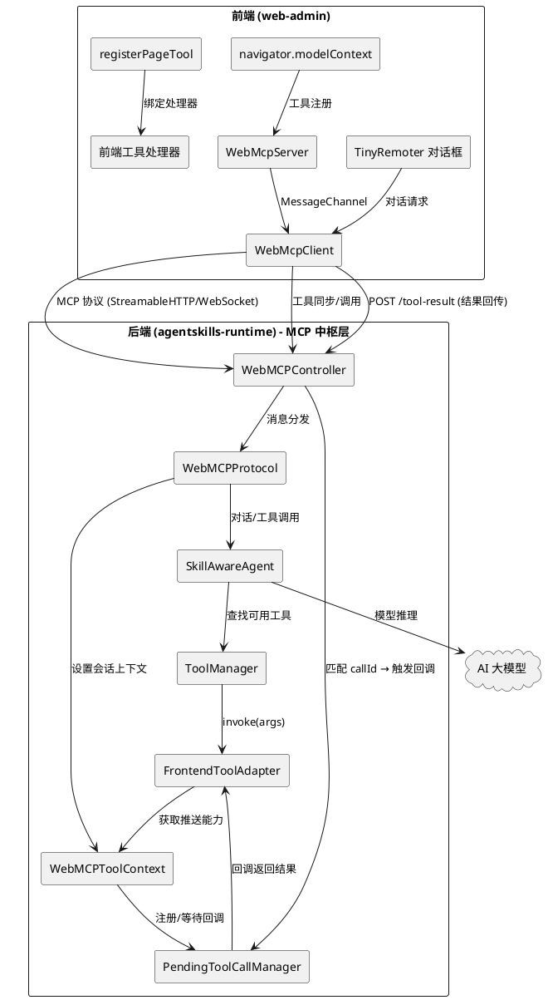
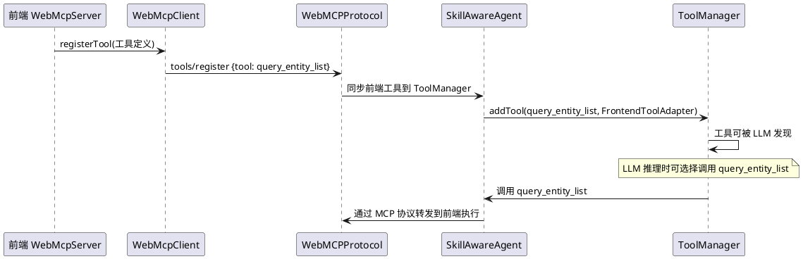
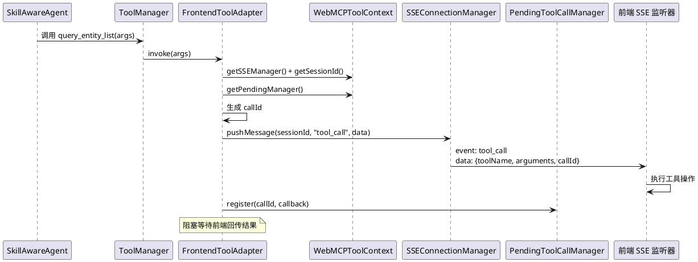
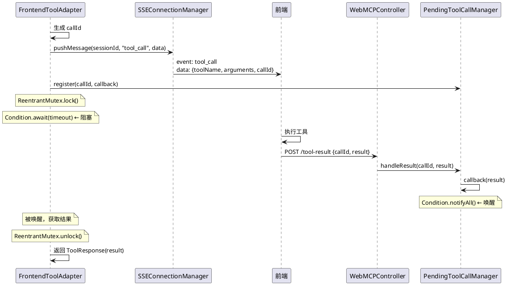
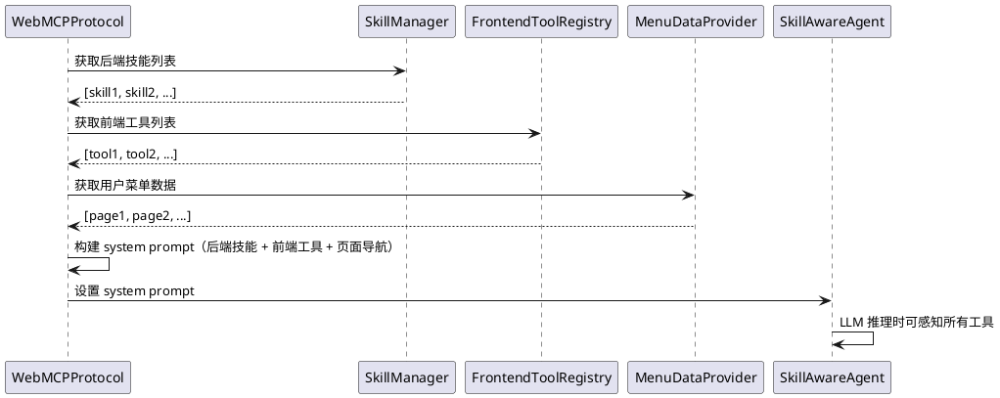
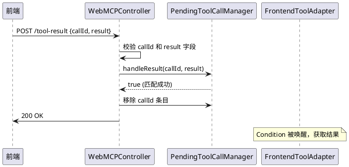
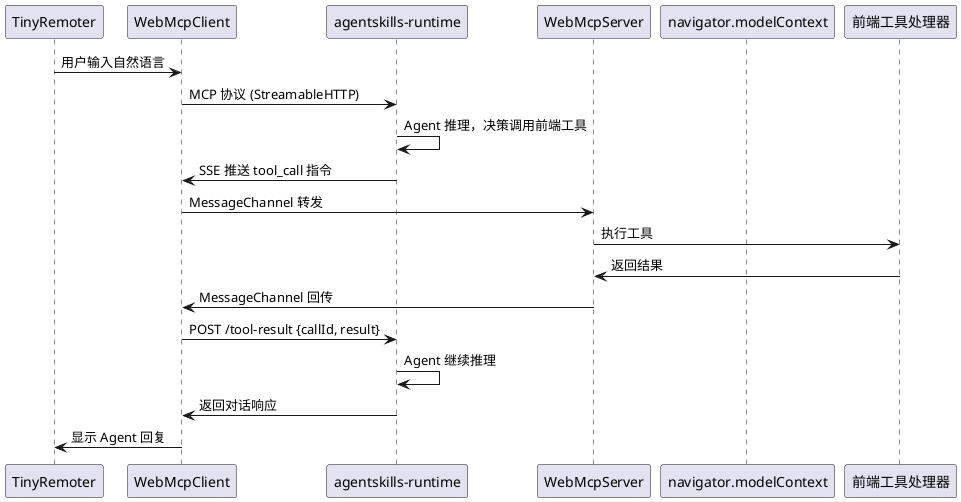

# WebMCP 工具链路闭环 - 需求规格文档

## 1. 组件定位

### 1.1 核心职责

本组件负责补全 agentskills-runtime 作为 WebMCP 中枢层时，前端 MCP 工具调用链路中缺失的环节，实现 Agent 通过 MCP 协议调用前端注册工具的完整闭环：工具发现 → 工具调用请求转发 → 前端执行 → 结果回传 → Agent 继续推理。

### 1.2 核心输入

1. **Agent LLM 的工具调用决策**：SkillAwareAgent 在推理过程中决定调用前端注册的 MCP 工具（如 entity 查询、页面导航等）时产生的工具调用请求（含工具名和参数）
2. **前端通过 MCP 协议注册的工具定义**：前端 WebMcpServer 通过 `navigator.modelContext.registerTool` 或 `WebMcpServer.registerTool` 注册的工具元数据（名称、描述、输入模式、路由信息），经由 MessageChannel 传输到 agentskills-runtime
3. **前端工具执行结果**：前端执行工具后通过 MCP 协议回传的结果数据
4. **前端用户审批响应**：用户对需要审批的前端工具操作的批准或拒绝

### 1.3 核心输出

1. **转发到前端执行的工具调用指令**：Agent 决定调用前端工具时，agentskills-runtime 通过 MCP 协议将工具调用请求转发到前端 WebMcpClient/WebMcpServer 执行
2. **注入 Agent 的前端工具定义**：前端注册的工具对 Agent LLM 可见，可被 LLM 在推理时发现和决策调用
3. **回传给 Agent 的工具执行结果**：前端工具执行完成后，结果通过 MCP 协议回传到 agentskills-runtime，注入 Agent 推理上下文

### 1.4 职责边界

- **不负责**：前端工具的具体业务逻辑（entity 查询、页面导航等由前端页面组件承担）
- **不负责**：前端工具的注册和定义（由前端 WebMcpServer 和 `navigator.modelContext` 承担，本组件仅接收和存储注册信息）
- **不负责**：AI 模型的推理逻辑（由 SkillAwareAgent 承担，本组件仅提供工具调用链路）
- **不负责**：前端 UI 渲染和用户交互（由 web-admin 承担）
- **不负责**：MCP 协议的基础传输（SSE/WebSocket/StreamableHTTP 连接管理由 WebMCPController 已实现的 WebSocket 和 streamableHttp 端点承担）
- **不负责**：后端内置技能的执行（由 SkillManager 承担，本组件仅处理前端工具的调用链路）
- **不负责**：引入独立的 WebAgent Node.js 服务（agentskills-runtime 自身充当 MCP 中枢层，替代 WebAgent 角色）

---

## 2. 领域术语

**WebMCP 标准架构**
: Agent → MCP Server（agentskills-runtime 充当）→ StreamableHTTP/WebSocket/MessageChannel → 前端浏览器 → 工具执行 → 结果回传 → MCP Server → Agent 的标准协议流程。在本项目中，agentskills-runtime 替代了原版开源项目中 WebAgent（Node.js）的 MCP 中枢层角色。

**前端 MCP 工具**
: 注册在前端 Web 应用中的工具，由前端页面组件执行（如 entity 查询、页面导航、消息通知等），通过 MCP 协议暴露给 Agent。在 WebMCP 标准中，页面导航、通知等功能应该是前端注册的 MCP 工具，而不是后端内置工具。

**工具调用链路闭环**
: 从 Agent LLM 决定调用前端工具 → agentskills-runtime 通过 MCP 协议转发调用请求到前端 → 前端执行工具 → 前端回传结果到 agentskills-runtime → 结果注入 Agent 上下文 → Agent 继续推理的完整流程。

**MessageChannel 传输**
: 前端 WebMcpClient 与 WebMcpServer 之间的通信通道，由 `createMessageChannelPairTransport()` 创建。serverTransport 供 WebMcpServer 连接，clientTransport 供 WebMcpClient 连接，两者通过 MessageChannel 配对通信。

**navigator.modelContext**
: 浏览器原生 WebMCP 接口，用于在前端页面中注册工具。通过 `initializeBuiltinWebMCP()` 激活后，低版本浏览器也可获得 Polyfill 支持。工具在页面 onMounted 时注册，onUnmounted 时注销，实现按需加载。

**registerPageTool**
: @opentiny/next-sdk 提供的 API，在业务页面中注册工具处理器（handler），与全局 `navigator.modelContext.registerTool` 声明的工具定义配合使用。页面挂载时注册，卸载时清理。

**routeConfig**
: 前端工具的声明式路由配置，指定工具所属的目标页面路由。当 Agent 调用该工具时，SDK 自动驱动路由跳转到目标页面，确保工具 handler 已就绪后再执行。

**callId**
: 前端工具调用的唯一标识符，由 agentskills-runtime 生成，贯穿工具调用请求转发和结果回传的全过程，用于关联请求和响应。

**PendingToolCallManager**
: 待处理工具调用管理器，管理前端工具调用的回调注册、结果匹配、超时清理。当 Agent 调用前端工具时注册回调，前端回传结果时通过 callId 匹配并触发回调。

**WebMCPToolContext**
: WebMCP 工具执行上下文，为工具调用提供 SSE 推送能力和会话信息。由于仓颉 Tool.invoke 是同步方法且工具实例在启动时创建，通过全局单例模式在运行时注入会话上下文。此组件必须放在 `magic.tool.webmcp` 包中，避免 `magic.tool.webmcp` import `magic.app.services.webmcp` 导致循环依赖。

**TinyRemoter**
: @opentiny/next-remoter 提供的 AI 对话框组件，支持 PC 端和手机端，作为用户与 AI Agent 交互的界面。用户通过自然语言输入指令，TinyRemoter 通过 WebMcpClient 将请求发送到 agentskills-runtime。

**WebMcpClient 代理模式**
: WebMcpClient 的核心创新功能，开启 `agent: true` 后，将当前连接的 WebMcpServer 端代理至 Web Agent 服务器（agentskills-runtime），使网页变为受控端，供其他 MCP Client 进行远程连接和操控。开启 `builtin: true` 后，自动建立原生 JSON-RPC 拦截层，将 MCP 请求代理给浏览器的 `navigator.modelContextTesting` 执行。

---

## 3. 角色与边界

### 3.1 核心角色

- **AI Agent（SkillAwareAgent）**：在推理过程中决策调用前端 MCP 工具，接收工具执行结果并继续推理
- **前端用户**：通过 TinyRemoter 对话框与 AI Agent 交互，前端页面组件执行工具操作并回传结果

### 3.2 外部系统

- **web-admin（Vue3 前端）**：通过 WebMcpClient/WebMcpServer 与本组件通信，注册前端工具、接收工具调用指令、执行工具并回传结果
- **WebMCPController**：提供 streamableHttp 和 WebSocket 端点接收前端 MCP 请求，管理会话和协议处理器实例
- **SkillAwareAgent / ToolManager**：Agent 的工具管理器，本组件将前端工具注册到其中使 LLM 可发现和调用
- **@opentiny/next-sdk**：前端 SDK，提供 WebMcpServer、WebMcpClient、registerPageTool、navigator.modelContext、initializeBuiltinWebMCP 等标准接口
- **@opentiny/next-remoter**：前端 AI 对话框组件，提供 TinyRemoter 组件

### 3.3 交互上下文

---

## 4. DFX约束

### 4.1 性能

- 前端工具调用指令通过 SSE 推送到前端的延迟：≤ 500ms（从 Agent 工具调用到 SSE 消息发出）
- 前端工具结果回传到后端回调触发的延迟：≤ 200ms（从 /tool-result 请求到达到回调执行）
- 前端工具同步到 Agent ToolManager 的完成时间：≤ 1秒（10个工具以内）

### 4.2 可靠性

- 工具调用指令推送失败时（SSE 连接不存在），必须返回明确的错误信息给 Agent，不得静默失败
- 前端工具调用超时时间：普通工具为 30 秒，需要用户审批的工具为 120 秒
- 工具调用超时后必须返回超时错误给 Agent，Agent 可决定重试或换用其他方式

### 4.3 安全性

- SSE 推送的工具调用指令必须包含 callId，前端回传结果时必须携带相同的 callId，防止结果错配
- 前端工具调用结果回传端点（/tool-result）必须校验 callId 的有效性，拒绝未知 callId 的结果

### 4.4 可维护性

- 所有前端工具调用和结果回传必须记录结构化日志（DEBUG 级别记录完整消息体，INFO 级别记录工具名和 callId）
- 工具调用链路的每个环节（Agent 调用 → SSE 推送 → 前端执行 → 结果回传 → 回调触发）必须有可追踪的日志标识

### 4.5 兼容性

- 前端工具调用指令的 SSE 消息格式必须与前端 WebMcpClient 已有的消息监听代码兼容
- /tool-result 端点的请求/响应格式必须与前端已有的结果回传逻辑兼容
- 前端工具注册和调用必须遵循 WebMCP 标准协议（@opentiny/next-sdk 的 WebMcpServer/WebMcpClient 接口契约）
- 前端工具调用链路必须兼容 next-sdk 的 `navigator.modelContext` 标准接口和 `initializeBuiltinWebMCP()` Polyfill

### 4.6 仓颉代码开发约束

- 所有仓颉（.cj）代码必须使用 **cangjie-coder 技能** 编写
- 仓颉语言中同包内的类默认可见，不需要显式 import，否则会产生循环依赖
- **包依赖方向约束**：`magic.tool.webmcp` 不应 import `magic.app.services.webmcp`（会导致循环依赖）。如果 WebMCPToolContext 等基础设施类需要被 `magic.tool.webmcp` 使用，应放在 `magic.tool.webmcp` 包中
- 数据库列名使用 snake_case，仓颉代码使用 camelCase
- `type` 是仓颉保留关键字，需用反引号转义
- 仓颉 String 的 trim 方法是 `trimAscii()`
- 仓颉 Duration 用 `Duration.second * N` 格式
- 仓颉 HashMap 用 `add()` 而不是 `put()`
- Condition 需要 ReentrantMutex 配合使用

---

## 5. 核心能力

### 5.1 前端工具注册到 Agent ToolManager

#### 5.1.1 业务规则

1. **工具同步触发规则**：When 前端通过 MCP 协议注册工具到 FrontendToolRegistry，the WebMCPProtocol shall 将该工具定义同步注册到 SkillAwareAgent 的 ToolManager 中，使 LLM 能发现和调用该工具

   a. 验收条件：[前端注册工具"query_entity_list"到 FrontendToolRegistry] → [Agent 的 ToolManager 中也存在"query_entity_list"工具，LLM 在推理时可选择调用该工具]

2. **工具定义转换规则**：When 将前端工具同步到 Agent ToolManager，the 系统 shall 将 FrontendToolDefinition 转换为 ToolManager 可识别的工具格式（包含 name、description、inputSchema），工具执行时通过 MCP 协议转发到前端执行并等待结果回传

   a. 验收条件：[前端工具"query_entity_list"同步到 ToolManager] → [ToolManager 中的工具定义包含 name="query_entity_list"、description、inputSchema，调用时通过 SSE 推送到前端执行]

3. **工具注销同步规则**：When 前端工具从 FrontendToolRegistry 中注销，the 系统 shall 同步从 Agent ToolManager 中移除该工具

   a. 验收条件：[前端注销工具"query_entity_list"] → [Agent 的 ToolManager 中不再包含"query_entity_list"工具]

4. **工具重名冲突规则**：If 前端工具与后端技能同名，the 系统 shall 保留后端技能，跳过前端工具的同步，并在日志中记录 WARN 级别信息

   a. 验收条件：[前端注册工具"http_request"与后端技能重名] → [ToolManager 中保留后端的 http_request 技能，日志记录"前端工具 http_request 与后端技能重名，跳过同步"]

5. **禁止项**：禁止前端注册的工具仅存在于 FrontendToolRegistry 而不同步到 Agent ToolManager

   a. 验收条件：[前端工具注册成功] → [必须同步到 Agent ToolManager，不得仅存储在 FrontendToolRegistry 中]

#### 5.1.2 交互流程

#### 5.1.3 异常场景

1. **Agent 实例不可用**

   a. 触发条件：tools/register 时 SkillAwareAgent 实例尚未初始化或为空

   b. 系统行为：工具仅注册到 FrontendToolRegistry，待 Agent 初始化后补同步；日志记录 WARN 级别信息

   c. 用户感知：工具注册后可能需要等待 Agent 初始化完成后才能被 LLM 发现

2. **ToolManager 注册失败**

   a. 触发条件：前端工具格式不兼容 ToolManager 的注册要求

   b. 系统行为：跳过该工具的同步，日志记录错误信息，不影响其他工具的注册

   c. 用户感知：该工具在 Agent 对话中不可用

### 5.2 前端工具调用指令转发

#### 5.2.1 业务规则

1. **前端工具调用转发规则**：When Agent 通过 ToolManager 调用前端注册的工具，the 工具执行层 shall 通过 MCP 协议将工具调用请求转发到前端执行，而非在本地执行

   a. 验收条件：[Agent 调用前端工具"query_entity_list"] → [agentskills-runtime 通过 SSE 向前端推送工具调用指令，前端执行后返回结果]

2. **SSE 推送格式规则**：When 转发前端工具调用指令，the 工具执行层 shall 通过 SSEConnectionManager.pushMessage 向前端推送工具调用事件，事件类型为 `tool_call`，数据包含工具名、参数和 callId

   a. 验收条件：[Agent 调用前端工具"query_entity_list"传入参数 {page: 1}] → [前端 SSE 监听器收到 `event: tool_call\ndata: {"toolName":"query_entity_list","arguments":{"page":1},"callId":"call_xxx"}\n\n` 消息]

3. **SSE 连接不可用时的错误处理规则**：If 工具调用时对应会话的 SSE 连接不存在或已关闭，the 工具执行层 shall 返回工具调用失败错误，错误信息包含"前端连接不可用"

   a. 验收条件：[Agent 调用前端工具但 SSE 连接已断开] → [工具返回 ToolResponse 包含错误信息"前端连接不可用，无法执行工具操作"]

4. **WebMCPToolContext 上下文注入规则**：When WebMCPProtocol 调用 Agent.chat() 前，the Protocol shall 在 WebMCPToolContext 中设置当前会话的 SSEConnectionManager、sessionId 和 PendingToolCallManager，使工具 invoke 方法能获取推送能力

   a. 验收条件：[Protocol 调用 Agent.chat()] → [WebMCPToolContext.instance 中包含当前会话的 SSEManager、sessionId 和 PendingManager]

5. **WebMCPToolContext 上下文清理规则**：When Agent.chat() 调用返回后，the Protocol shall 清除 WebMCPToolContext 中的当前会话上下文

   a. 验收条件：[Agent.chat() 返回后] → [WebMCPToolContext.instance 中的会话上下文被清除]

6. **WebMCPToolContext 包依赖方向规则**：The WebMCPToolContext 类 shall 放置在 `magic.tool.webmcp` 包中，确保 `magic.tool.webmcp` 包不需要 import `magic.app.services.webmcp` 包，避免循环依赖

   a. 验收条件：[检查 WebMCPToolContext 所在包] → [WebMCPToolContext 位于 `magic.tool.webmcp` 包，`magic.tool.webmcp` 包中的文件不 import `magic.app.services.webmcp` 包中的类]

7. **禁止项**：禁止前端工具的 invoke 方法在本地执行并返回静态文本，必须通过 MCP 协议转发到前端执行

   a. 验收条件：[Agent 调用任意前端工具] → [必须通过 SSE 向前端推送工具调用指令，不得仅返回"工具已执行"等静态文本]

#### 5.2.2 交互流程

#### 5.2.3 异常场景

1. **SSE 连接不存在**

   a. 触发条件：前端工具调用 pushMessage 时，对应 sessionId 的 SSE 连接不在 SSEConnectionManager 中

   b. 系统行为：工具返回包含错误信息的 ToolResponse，Agent 收到错误后可决定重试或换用其他方式

   c. 用户感知：Agent 回复"无法执行该操作，请检查页面连接状态"

2. **SSE 推送写入失败**

   a. 触发条件：pushMessage 调用时 SSE 连接的写入流已关闭或异常

   b. 系统行为：SSEConnectionManager 自动移除该连接并返回 false，工具返回错误 ToolResponse

   c. 用户感知：Agent 回复"操作推送失败，请刷新页面重试"

3. **WebMCPToolContext 未设置**

   a. 触发条件：工具 invoke 时 WebMCPToolContext 中没有当前会话上下文（如 Protocol 未正确设置）

   b. 系统行为：工具返回错误 ToolResponse，提示"前端连接不可用"

   c. 用户感知：Agent 回复"无法执行该操作，前端连接未建立"

### 5.3 工具调用结果等待与回调

#### 5.3.1 业务规则

1. **回调注册规则**：When 前端工具通过 SSE 向前端推送调用指令后，the 工具执行层 shall 在 PendingToolCallManager 中注册一个回调，以 callId 为键，等待前端回传结果

   a. 验收条件：[前端工具推送调用指令后] → [PendingToolCallManager 中存在以该次调用 callId 为键的回调条目]

2. **结果回传匹配规则**：When 前端通过 /tool-result 端点回传工具执行结果，the WebMCPController shall 以 callId 为键在 PendingToolCallManager 中查找对应回调并触发

   a. 验收条件：[前端回传 callId="call_xxx" 的工具结果] → [PendingToolCallManager 中 callId="call_xxx" 的回调被触发，结果传递给等待中的工具调用]

3. **工具调用阻塞等待规则**：While 前端工具正在执行中（从推送指令到收到结果），the 工具执行层 shall 阻塞等待前端回传结果，不得立即返回

   a. 验收条件：[需要审批的前端工具推送审批请求后] → [工具 invoke 方法阻塞等待，直到前端回传审批结果或超时]

4. **超时处理规则**：If 前端工具调用超过配置的超时时间未返回结果，the 工具执行层 shall 返回超时错误 ToolResponse 并清理 PendingToolCallManager 中的回调

   a. 验收条件：[普通前端工具调用超过30秒未收到前端结果] → [工具返回 ToolResponse 包含超时错误信息，PendingToolCallManager 中对应 callId 被移除]

5. **未知 callId 拒绝规则**：If /tool-result 端点收到未知 callId（不在 PendingToolCallManager 中），the WebMCPController shall 返回 404 错误

   a. 验收条件：[前端回传 callId="unknown_id" 的结果] → [返回 HTTP 404 错误，提示"未找到对应的工具调用"]

6. **同步阻塞等待实现规则**：由于仓颉 Tool.invoke 是同步方法，the 工具执行层 shall 使用 ReentrantMutex + Condition 实现同步阻塞等待，在 SSE 推送指令后注册回调，通过 Condition.await 阻塞当前线程，等待回调触发时 Condition.notify 唤醒

   a. 验收条件：[前端工具 invoke 方法推送指令后] → [当前线程通过 Condition.await 阻塞，前端回传结果后 Condition.notify 唤醒线程，工具返回结果]

7. **禁止项**：禁止 PendingToolCallManager 映射表在工具调用流程中从未被填充

   a. 验收条件：[任意前端工具被调用] → [必须在推送 SSE 指令后调用 PendingToolCallManager.register 注册回调]

#### 5.3.2 交互流程

#### 5.3.3 异常场景

1. **前端未回传结果**

   a. 触发条件：前端收到工具调用指令但未执行或未回传结果（如页面崩溃、网络中断）

   b. 系统行为：工具调用超时后返回超时错误，清理 PendingToolCallManager 中的回调

   c. 用户感知：Agent 回复"操作超时，未收到前端响应"

2. **callId 冲突**

   a. 触发条件：两个工具调用生成了相同的 callId（极低概率）

   b. 系统行为：后注册的回调覆盖先前的回调，先前调用的结果可能错配

   c. 用户感知：Agent 回复的内容可能与预期不符

### 5.4 Agent System Prompt 工具信息注入

#### 5.4.1 业务规则

1. **前端工具信息注入规则**：When 构建 Agent 的系统提示词且 FrontendToolRegistry 中存在已注册的前端工具，the WebMCPProtocol shall 在 system prompt 中注入前端工具的使用说明

   a. 验收条件：[FrontendToolRegistry 中有3个前端工具] → [system prompt 中包含这3个前端工具的名称、描述和使用说明]

2. **工具信息格式规则**：注入的工具信息必须包含工具名称、功能描述、输入参数说明和使用场景，格式清晰便于 LLM 理解

   a. 验收条件：[查看 system prompt 中的工具信息] → [每个工具包含名称、描述、参数列表和使用场景说明]

3. **动态更新规则**：When 前端工具注册或注销时，the Agent 的 system prompt 中注入的工具信息 shall 在下一次对话时更新

   a. 验收条件：[前端注册新工具后发送对话请求] → [Agent 的 system prompt 中包含新注册的工具信息]

4. **页面导航信息注入规则**：When 构建 Agent 的系统提示词，the WebMCPProtocol shall 在 system prompt 中注入用户可访问的页面导航信息，信息来源为数据库 permissions 表查询的菜单数据

   a. 验收条件：[用户有权限访问5个页面] → [system prompt 中包含这5个页面的路由路径和标题]

5. **禁止项**：禁止 buildAgentSystemPrompt 仅注入后端技能信息而不注入前端工具信息

   a. 验收条件：[buildAgentSystemPrompt 方法被调用] → [必须同时包含后端技能和前端工具的信息]

#### 5.4.2 交互流程

#### 5.4.3 异常场景

1. **FrontendToolRegistry 为空**

   a. 触发条件：构建 system prompt 时 FrontendToolRegistry 中没有已注册的前端工具

   b. 系统行为：仅注入后端技能信息和页面导航信息，不注入前端工具信息

   c. 用户感知：Agent 不知道前端有可用工具

### 5.5 前端工具调用结果回传

#### 5.5.1 业务规则

1. **结果回传端点规则**：The WebMCPController shall 提供 POST /api/v1/uctoo/webmcp/tool-result 端点，接收前端回传的工具执行结果

   a. 验收条件：[前端发送 POST /tool-result 请求包含 callId 和 result 字段] → [服务端接收并处理结果]

2. **callId 匹配规则**：When /tool-result 端点收到工具执行结果，the WebMCPController shall 以 callId 为键在 PendingToolCallManager 中查找对应回调并触发，将结果传递给等待中的工具调用

   a. 验收条件：[/tool-result 请求的 callId 与 PendingToolCallManager 中的条目匹配] → [对应回调被触发，工具调用获得结果]

3. **回调清理规则**：When 回调被触发后，the WebMCPController shall 从 PendingToolCallManager 中移除该 callId 条目，防止重复触发

   a. 验收条件：[callId 对应的回调被触发后] → [PendingToolCallManager 中不再包含该 callId]

4. **结果格式规则**：前端回传的工具执行结果必须包含 callId（字符串，必填）和 result（对象，必填）字段，error（字符串，可选）字段用于表示执行失败

   a. 验收条件：[/tool-result 请求缺少 callId 字段] → [返回 400 错误提示"Missing required field: callId"]

5. **禁止项**：禁止 /tool-result 端点因 PendingToolCallManager 为空而始终返回 404

   a. 验收条件：[有工具调用注册了回调后前端回传结果] → [/tool-result 端点能正确匹配并触发回调]

#### 5.5.2 交互流程

#### 5.5.3 异常场景

1. **callId 不存在**

   a. 触发条件：/tool-result 请求的 callId 在 PendingToolCallManager 中不存在（可能已超时被清理或从未注册）

   b. 系统行为：返回 HTTP 404 错误，提示"未找到对应的工具调用"

   c. 用户感知：前端控制台显示工具结果回传失败的错误信息

2. **结果格式错误**

   a. 触发条件：/tool-result 请求的 body 不是合法 JSON 或缺少必填字段

   b. 系统行为：返回 HTTP 400 错误，提示缺少的字段名

   c. 用户感知：前端控制台显示请求格式错误信息

3. **回调执行异常**

   a. 触发条件：回调函数执行过程中抛出异常

   b. 系统行为：捕获异常，记录错误日志，返回 HTTP 500 错误，从 PendingToolCallManager 中移除该 callId

   c. 用户感知：工具调用可能超时，Agent 回复"工具执行异常"

### 5.6 后端 WebMCP 内置工具的重新定位

#### 5.6.1 业务规则

1. **后端内置工具评估规则**：When 评估 web_navigate、web_notify、web_request_approval 等后端内置 WebMCP 工具的存在必要性，the 系统 shall 遵循 WebMCP 标准架构，确认这些功能是否应改为前端注册的 MCP 工具

   a. 验收条件：[评估 web_navigate 工具] → [在 WebMCP 标准中，页面导航应该是前端通过 navigator.modelContext.registerTool 注册的 MCP 工具，而非后端内置工具]

2. **后端内置工具过渡策略规则**：If 当前阶段需要保留后端内置工具以兼容已有功能，the 系统 shall 确保这些工具的 invoke 方法也通过 MCP 协议转发到前端执行（与前端工具调用链路一致），而非在本地执行

   a. 验收条件：[Agent 调用 web_navigate 工具] → [工具 invoke 通过 SSE 推送导航指令到前端执行，前端执行导航后回传结果]

3. **后端内置工具与前端工具统一链路规则**：The 后端内置 WebMCP 工具和前端注册的 MCP 工具 shall 使用相同的工具调用链路（SSE 推送 → 前端执行 → 结果回传），确保架构一致性

   a. 验收条件：[Agent 分别调用 web_navigate 和 query_entity_list] → [两者都通过相同的 SSE 推送 → 前端执行 → /tool-result 回传链路]

4. **禁止项**：禁止后端内置 WebMCP 工具的 invoke 方法仅返回静态文本而不向前端推送执行指令

   a. 验收条件：[Agent 调用 web_navigate 工具] → [必须通过 SSE 向前端推送导航指令，不得仅返回"Navigated to: xxx"等静态文本]

### 5.7 前端 next-sdk 标准协议对接

#### 5.7.1 业务规则

1. **WebMcpClient 代理模式对接规则**：When 前端 WebMcpClient 以代理模式（agent: true）连接 agentskills-runtime，the 系统 shall 作为 MCP 中枢层，接收前端注册的工具定义并代理工具调用请求

   a. 验收条件：[前端 WebMcpClient.connect({agent: true, url: '...'})] → [agentskills-runtime 接收前端工具注册，Agent 可发现并调用前端工具]

2. **navigator.modelContext 标准接口兼容规则**：The 前端工具注册和调用 shall 兼容浏览器原生 `navigator.modelContext` 接口和 `initializeBuiltinWebMCP()` Polyfill，确保在不同浏览器版本下均可正常工作

   a. 验收条件：[前端使用 navigator.modelContext.registerTool 注册工具] → [工具通过 MessageChannel 传输到 agentskills-runtime，Agent 可发现并调用]

3. **routeConfig 路由感知规则**：When 前端工具声明了 routeConfig（指定所属页面路由），the 系统 shall 在工具调用时确保前端已跳转到目标页面，工具 handler 已就绪后再执行

   a. 验收条件：[前端工具声明 routeConfig: {route: '/entity'}] → [Agent 调用该工具时，前端先跳转到 /entity 页面，工具 handler 就绪后执行]

4. **registerPageTool 分离式注册兼容规则**：The 系统 shall 兼容 next-sdk 的 registerPageTool 分离式注册模式，即工具定义（metadata）全局声明，工具处理器（handler）在页面内按需绑定

   a. 验收条件：[前端使用 registerPageTool 绑定工具处理器] → [Agent 调用该工具时，前端页面内的处理器被执行并返回结果]

5. **TinyRemoter 对话框集成规则**：The 系统 shall 支持前端通过 TinyRemoter 组件与 AI Agent 交互，用户通过自然语言输入指令，TinyRemoter 通过 WebMcpClient 将请求发送到 agentskills-runtime

   a. 验收条件：[用户在 TinyRemoter 中输入"帮我查看实体列表"] → [Agent 调用前端 query_entity_list 工具，前端执行后返回结果，Agent 回复用户]

6. **禁止项**：禁止引入独立的 WebAgent Node.js 服务，agentskills-runtime 自身充当 MCP 中枢层

   a. 验收条件：[检查系统架构] → [不存在独立的 WebAgent Node.js 服务，agentskills-runtime 直接与前端的 WebMcpClient/WebMcpServer 通信]

#### 5.7.2 交互流程

#### 5.7.3 异常场景

1. **浏览器不支持 navigator.modelContext**

   a. 触发条件：用户使用的浏览器不支持原生 navigator.modelContext 接口

   b. 系统行为：前端通过 `initializeBuiltinWebMCP()` 自动注入 Polyfill，确保接口可用

   c. 用户感知：功能正常使用，无感知差异

2. **前端页面路由跳转失败**

   a. 触发条件：routeConfig 指定的目标页面路由跳转失败（如路由不存在）

   b. 系统行为：前端返回工具调用错误，Agent 收到错误后可换用其他方式

   c. 用户感知：Agent 回复"无法跳转到目标页面"

### 5.8 前端菜单数据与工具集成

#### 5.8.1 业务规则

1. **菜单数据缓存规则**：When 前端通过 getUserMenuTree API 获取用户菜单数据，the 系统 shall 将菜单数据缓存到 pinia-orm store，供 Agent 和前端工具使用

   a. 验收条件：[用户登录后获取菜单数据] → [菜单数据缓存到 pinia-orm user_menu store，可通过 useAxiosRepo(user_menu).all() 查询]

2. **navigate_to_page 工具菜单数据集成规则**：When 前端注册 navigate_to_page 工具，the 系统 shall 将用户可访问的页面列表注入工具描述，页面列表来自缓存的菜单数据

   a. 验收条件：[navigate_to_page 工具注册时] → [工具描述包含用户可访问的页面路由列表，列表来自菜单数据]

3. **web_navigate 工具菜单数据集成规则**：When 后端构建 web_navigate 工具描述，the 系统 shall 将用户可访问的页面列表注入工具描述，页面列表来自数据库 permissions 表查询的菜单数据

   a. 验收条件：[web_navigate 工具描述构建时] → [工具描述包含用户可访问的页面路由列表，列表来自 MenuDataProvider]

4. **菜单数据复用规则**：The 前端菜单数据链路 shall 复用已有的基础设施（permissions 表 → getUserMenuTree API → pinia-orm store），不得重新开发

   a. 验收条件：[检查菜单数据获取链路] → [使用已有的 getUserMenuTree API 和 pinia-orm store，不引入新的数据获取方式]

5. **禁止项**：禁止在工具描述中硬编码页面列表，必须来自菜单数据

   a. 验收条件：[检查 navigate_to_page 和 web_navigate 工具描述] → [页面列表来自动态菜单数据，不是硬编码]

---

## 6. 数据约束

### 6.1 SSE 推送的前端工具调用指令

1. **event**：必填，字符串，事件类型，前端工具调用为 `tool_call`
2. **data**：必填，JSON 对象字符串，包含工具执行所需的参数和 callId
3. **callId**：必填，字符串，格式为 `call_{timestamp}_{random8位}`，工具调用的唯一标识

### 6.2 tool_call 指令数据

1. **toolName**：必填，字符串，前端注册的工具名称
2. **arguments**：必填，对象，工具调用的输入参数，结构与工具 inputSchema 定义一致
3. **callId**：必填，字符串，工具调用唯一标识
4. **route**：可选，字符串，前端工具所属页面路由（routeConfig 中声明）

### 6.3 /tool-result 请求

1. **callId**：必填，字符串，与 SSE 推送指令中的 callId 对应
2. **result**：必填，对象，工具执行结果数据
3. **error**：可选，字符串，工具执行错误信息（执行失败时提供）

### 6.4 PendingToolCallManager 条目

1. **键**：callId 字符串，与 SSE 推送指令中的 callId 对应
2. **值**：PendingToolCallEntry 对象，包含 callId、toolName、createdAt、timeoutMs、mutex、condition、result、completed、timedOut 字段

### 6.5 WebMCPToolContext 上下文

1. **sessionId**：字符串，当前会话标识
2. **sseManager**：SSEConnectionManager 引用，提供 SSE 消息推送能力
3. **pendingManager**：PendingToolCallManager 引用，提供回调注册和结果匹配能力

### 6.6 前端工具注册信息

1. **name**：必填，字符串，工具名称，全局唯一标识
2. **title**：可选，字符串，工具标题，用于展示
3. **description**：必填，字符串，工具功能描述，供 LLM 理解工具用途
4. **inputSchema**：必填，对象，工具输入参数的 JSON Schema 定义
5. **route**：可选，字符串，工具所属的前端页面路由（routeConfig 中声明）
6. **annotations**：可选，对象，工具注解信息

---

## 7. 需求追踪矩阵

| 需求ID | 对应缺陷 | 优先级 | 需求标题 |
|--------|---------|--------|---------|
| REQ-TC-01 | 缺陷1 | P0 | 前端工具注册到 Agent ToolManager |
| REQ-TC-02 | 缺陷2 | P0 | 前端工具调用指令转发 |
| REQ-TC-03 | 缺陷3 | P0 | 工具调用结果等待与回调机制 |
| REQ-TC-04 | 缺陷4 | P0 | Agent System Prompt 工具信息注入 |
| REQ-TC-05 | 缺陷5 | P0 | 前端工具调用结果回传 |
| REQ-TC-06 | 缺陷6 | P1 | 后端 WebMCP 内置工具的重新定位 |
| REQ-TC-07 | 缺陷7 | P1 | 前端 next-sdk 标准协议对接 |
| REQ-TC-08 | 缺陷8 | P1 | 前端菜单数据与工具集成 |

---

## 8. EARS 格式需求清单

### REQ-TC-01：前端工具注册到 Agent ToolManager [P0]

**Event-Driven**：When 前端通过 tools/register 方法注册工具到 FrontendToolRegistry，the WebMCPProtocol shall 将该工具定义同步注册到 SkillAwareAgent 的 ToolManager 中。

**Event-Driven**：When 将前端工具同步到 Agent ToolManager，the 系统 shall 将 FrontendToolDefinition 转换为 ToolManager 可识别的工具格式，工具执行时通过 MCP 协议转发到前端执行并等待结果回传。

**Event-Driven**：When 前端工具从 FrontendToolRegistry 中注销，the 系统 shall 同步从 Agent ToolManager 中移除该工具。

**Unwanted Behaviour**：If 前端工具与后端技能同名，the 系统 shall 保留后端技能，跳过前端工具的同步，并在日志中记录 WARN 级别信息。

**Unwanted Behaviour**：If Agent 实例不可用，the 系统 shall 将工具仅注册到 FrontendToolRegistry，待 Agent 初始化后补同步。

### REQ-TC-02：前端工具调用指令转发 [P0]

**Ubiquitous**：The 前端工具执行层 shall 通过 MCP 协议将工具调用请求转发到前端执行，而非在本地执行。

**Event-Driven**：When Agent 通过 ToolManager 调用前端注册的工具，the 工具执行层 shall 通过 SSEConnectionManager.pushMessage 向前端推送工具调用指令事件。

**Event-Driven**：When WebMCPProtocol 调用 Agent.chat() 前，the Protocol shall 在 WebMCPToolContext 中设置当前会话的 SSEConnectionManager、sessionId 和 PendingToolCallManager。

**Event-Driven**：When Agent.chat() 调用返回后，the Protocol shall 清除 WebMCPToolContext 中的当前会话上下文。

**Ubiquitous**：The WebMCPToolContext 类 shall 放置在 `magic.tool.webmcp` 包中，确保 `magic.tool.webmcp` 包不需要 import `magic.app.services.webmcp` 包，避免循环依赖。

**Unwanted Behaviour**：If SSE 连接不存在或已关闭，the 工具执行层 shall 返回包含错误信息的 ToolResponse，告知 Agent 前端连接不可用。

**Unwanted Behaviour**：If SSE 推送写入失败，the 工具执行层 shall 返回包含错误信息的 ToolResponse，告知 Agent 操作推送失败。

**Unwanted Behaviour**：If WebMCPToolContext 未设置，the 工具执行层 shall 返回包含错误信息的 ToolResponse，告知 Agent 前端连接未建立。

### REQ-TC-03：工具调用结果等待与回调机制 [P0]

**Event-Driven**：When 前端工具通过 SSE 向前端推送调用指令后，the 工具执行层 shall 在 PendingToolCallManager 中注册以 callId 为键的回调，等待前端回传结果。

**Event-Driven**：When 前端通过 /tool-result 端点回传工具执行结果，the WebMCPController shall 以 callId 为键在 PendingToolCallManager 中查找对应回调并触发。

**State-Driven**：While 前端工具正在执行中，the 工具执行层 shall 使用 ReentrantMutex + Condition 阻塞等待前端回传结果，不得立即返回。

**Unwanted Behaviour**：If 前端工具调用超过配置的超时时间未返回结果，the 工具执行层 shall 返回超时错误 ToolResponse 并清理 PendingToolCallManager 中的回调。

**Unwanted Behaviour**：If /tool-result 端点收到未知 callId，the WebMCPController shall 返回 HTTP 404 错误。

**Event-Driven**：When 回调被触发后，the WebMCPController shall 从 PendingToolCallManager 中移除该 callId 条目，防止重复触发。

### REQ-TC-04：Agent System Prompt 工具信息注入 [P0]

**Ubiquitous**：The buildAgentSystemPrompt 方法 shall 在 Agent 的系统提示词中同时注入后端技能、前端工具的使用说明和用户可访问的页面导航信息。

**Event-Driven**：When 构建 Agent 的系统提示词且 FrontendToolRegistry 中存在已注册的前端工具，the WebMCPProtocol shall 注入前端工具的使用说明。

**Event-Driven**：When 构建 Agent 的系统提示词，the WebMCPProtocol shall 通过 MenuDataProvider 从数据库查询用户可访问的菜单数据，注入页面导航信息。

**Event-Driven**：When 前端工具注册或注销时，the Agent 的 system prompt 中注入的工具信息 shall 在下一次对话时更新。

### REQ-TC-05：前端工具调用结果回传 [P0]

**Ubiquitous**：The WebMCPController shall 提供 POST /api/v1/uctoo/webmcp/tool-result 端点，接收前端回传的工具执行结果。

**Event-Driven**：When /tool-result 端点收到工具执行结果，the WebMCPController shall 以 callId 为键在 PendingToolCallManager 中查找对应回调并触发。

**Unwanted Behaviour**：If /tool-result 请求缺少 callId 或 result 必填字段，the WebMCPController shall 返回 HTTP 400 错误。

**Unwanted Behaviour**：If /tool-result 请求的 callId 在 PendingToolCallManager 中不存在，the WebMCPController shall 返回 HTTP 404 错误。

**Unwanted Behaviour**：If 回调执行过程中抛出异常，the WebMCPController shall 捕获异常、记录错误日志、返回 HTTP 500 错误，并从 PendingToolCallManager 中移除该 callId。

### REQ-TC-06：后端 WebMCP 内置工具的重新定位 [P1]

**Ubiquitous**：The 后端内置 WebMCP 工具和前端注册的 MCP 工具 shall 使用相同的工具调用链路（SSE 推送 → 前端执行 → 结果回传），确保架构一致性。

**Event-Driven**：When Agent 调用后端内置 WebMCP 工具（web_navigate、web_notify、web_request_approval），the 工具 invoke 方法 shall 通过 SSE 推送执行指令到前端，而非在本地执行。

**Unwanted Behaviour**：If 后端内置 WebMCP 工具的 invoke 方法仅返回静态文本而不向前端推送执行指令，the 系统 shall 视此为架构缺陷并修正。

### REQ-TC-07：前端 next-sdk 标准协议对接 [P1]

**Event-Driven**：When 前端 WebMcpClient 以代理模式（agent: true）连接 agentskills-runtime，the 系统 shall 作为 MCP 中枢层，接收前端注册的工具定义并代理工具调用请求。

**Ubiquitous**：The 前端工具注册和调用 shall 兼容浏览器原生 `navigator.modelContext` 接口和 `initializeBuiltinWebMCP()` Polyfill。

**Event-Driven**：When 前端工具声明了 routeConfig（指定所属页面路由），the 系统 shall 在工具调用时确保前端已跳转到目标页面，工具 handler 已就绪后再执行。

**Ubiquitous**：The 系统 shall 兼容 next-sdk 的 registerPageTool 分离式注册模式。

**Ubiquitous**：The 系统 shall 支持前端通过 TinyRemoter 组件与 AI Agent 交互。

**Unwanted Behaviour**：If 引入独立的 WebAgent Node.js 服务，the 系统 shall 视此为架构违规，agentskills-runtime 自身充当 MCP 中枢层。

### REQ-TC-08：前端菜单数据与工具集成 [P1]

**Event-Driven**：When 前端通过 getUserMenuTree API 获取用户菜单数据，the 系统 shall 将菜单数据缓存到 pinia-orm store，供 Agent 和前端工具使用。

**Event-Driven**：When 前端注册 navigate_to_page 工具，the 系统 shall 将用户可访问的页面列表注入工具描述，页面列表来自缓存的菜单数据。

**Event-Driven**：When 后端构建 web_navigate 工具描述，the 系统 shall 将用户可访问的页面列表注入工具描述，页面列表来自数据库 permissions 表查询的菜单数据。

**Ubiquitous**：The 前端菜单数据链路 shall 复用已有的基础设施（permissions 表 → getUserMenuTree API → pinia-orm store），不得重新开发。

**Unwanted Behaviour**：If 工具描述中硬编码页面列表而非来自菜单数据，the 系统 shall 视此为架构缺陷并修正。
