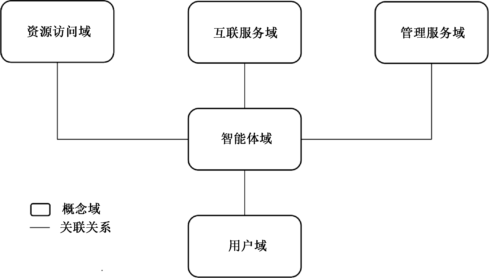
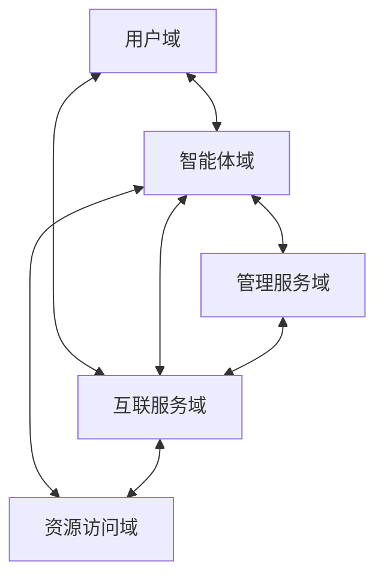
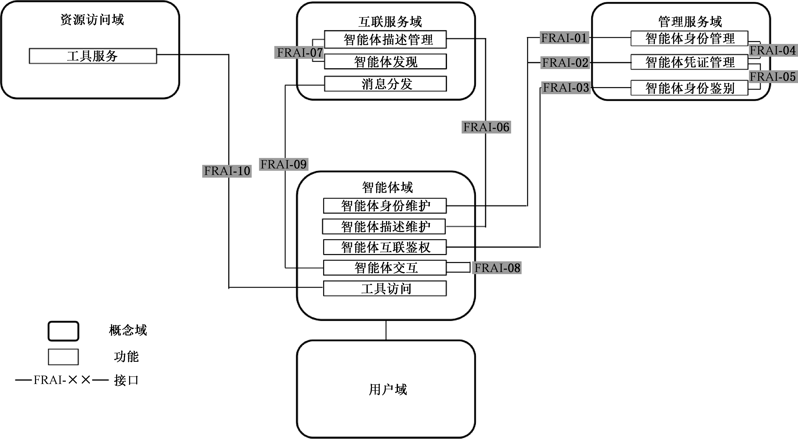
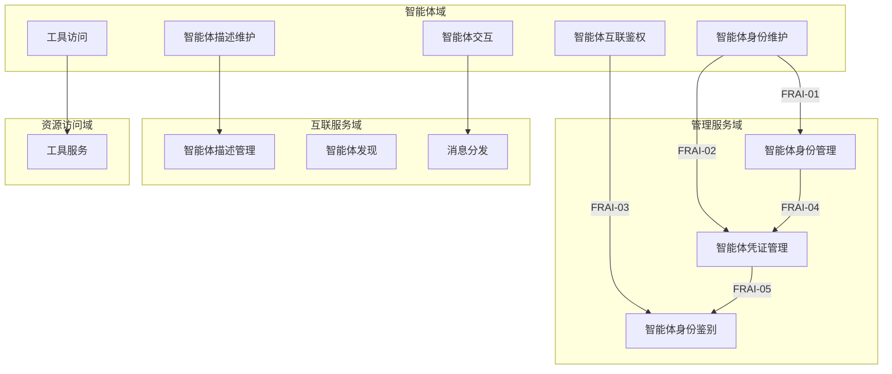
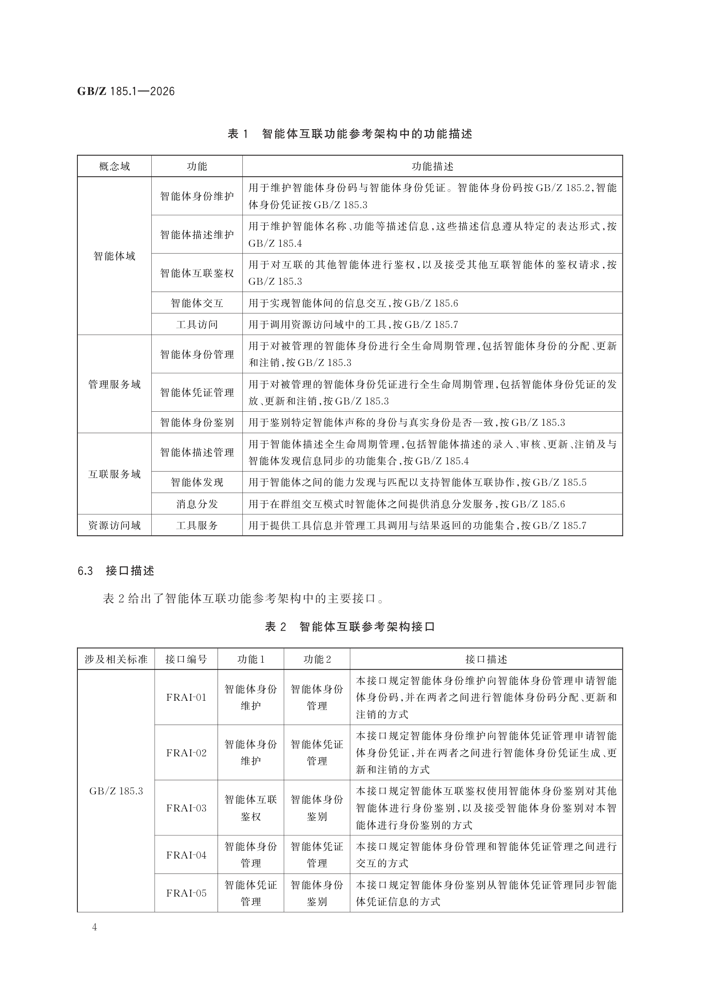
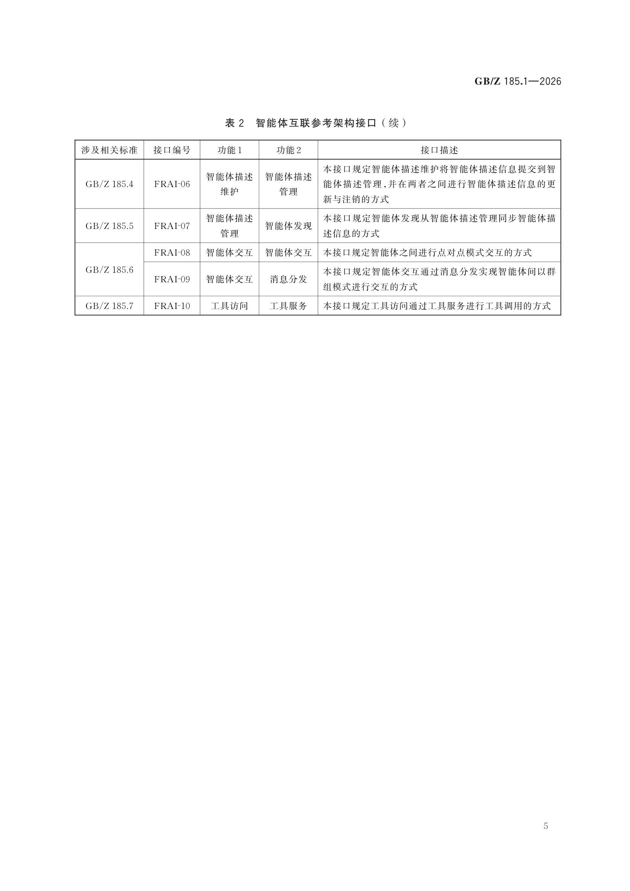
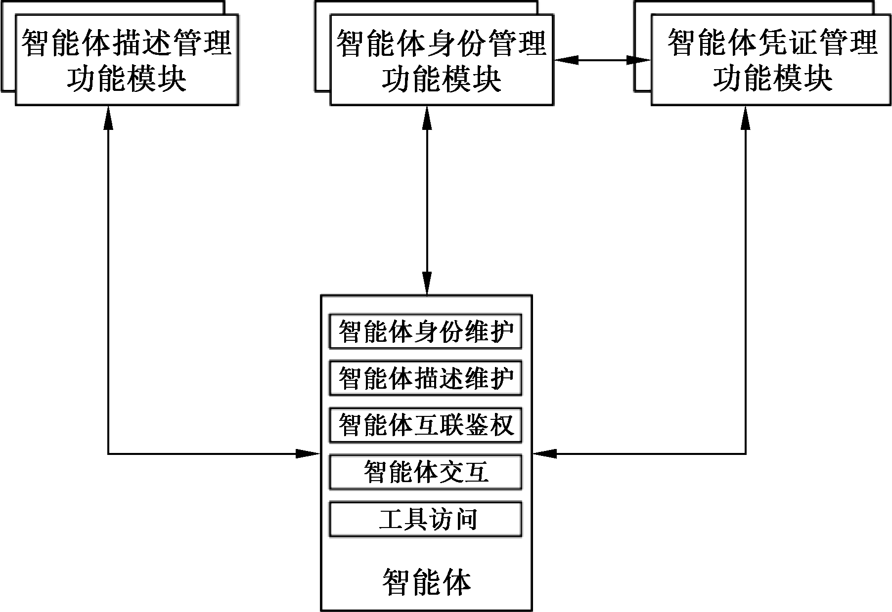
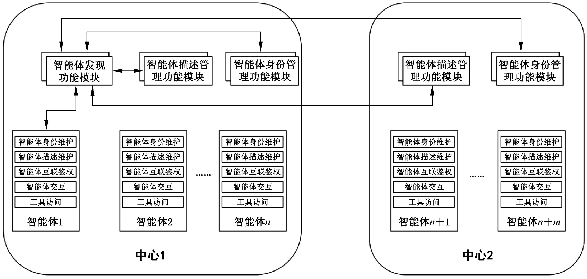
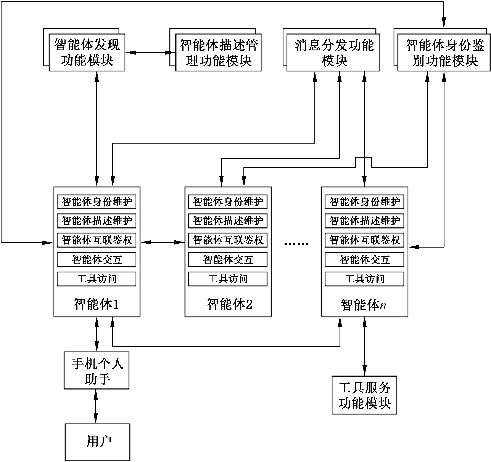
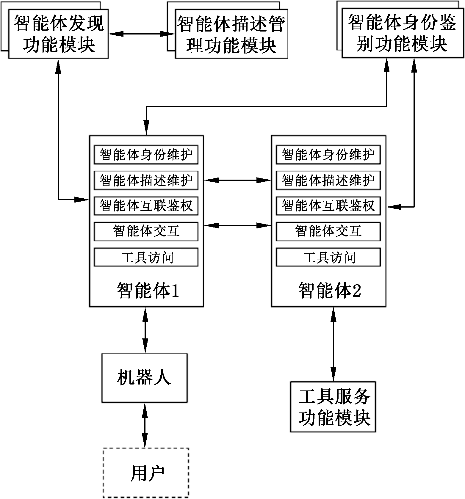

# GBZ 185.1-2026

<!-- Page 1 -->

ICS 35.100
CCS L 79
中 华 人 民 共 和 国 国 家 标 准 化 指 导 性 技 术 文 件
GB/Z 185.1—2026
人工智能 智能体互联
第 部分 总体架构
1
：
Artificial intelligence—Agent interconnection—Part 1： General architecture
2026⁃05⁃22 发布
国 家 市 场 监 督 管 理 总 局
发 布
国 家 标 准 化 管 理 委 员 会

<!-- Page 3 -->

GB/Z 185.1—2026
目 次
前言··························································································································Ⅲ
引言··························································································································Ⅳ
1 范围·······················································································································1
2 规范性引用文件········································································································1
3 术语和定义··············································································································1
4 缩略语····················································································································2
5 智能体互联概念模型··································································································2
6 智能体互联功能参考架构····························································································3
附录 A（ 资料性） 智能体互联的典型场景··········································································6
参考文献····················································································································10
Ⅰ

<!-- Page 5 -->

GB/Z 185.1—2026
前 言
本文件为规范类指导性技术文件。
本文件按照 GB/T 1.1—2020《标准化工作导则 第 1 部分：标准化文件的结构和起草规则》的规
定起草。
本文件是 GB/Z 185《人工智能 智能体互联》的第 1 部分。GB/Z 185 已经发布了以下部分：
——第 1 部分：总体架构；
——第 2 部分：身份码；
——第 3 部分：身份管理；
——第 4 部分：智能体描述；
——第 5 部分：智能体发现；
——第 6 部分：智能体交互；
——第 7 部分：智能体工具调用。
请注意本文件的某些内容可能涉及专利。本文件的发布机构不承担识别专利的责任。
本文件由全国信息技术标准化技术委员会（SAC/TC 28）提出并归口。
本文件起草单位：中国电子技术标准化研究院、北京邮电大学、小米通讯技术有限公司、华为技术
有限公司、蚂蚁科技集团股份有限公司、中移互联网有限公司、阿里云计算有限公司、北京浩瀚深度信
息技术股份有限公司、北京快手科技有限公司、成都理工大学、中移动信息技术有限公司、联想（北京）
有限公司、青岛港国际股份有限公司、亚信科技（中国）有限公司、北京火山引擎科技有限公司、中兴通
讯股份有限公司、江苏金服数字集团人工智能科技有限公司、浪潮通信信息系统有限公司、超聚变数字
技术股份有限公司、南京理工大学、浪潮通用软件有限公司、北京兴云数科技术有限公司、中国移动通
信集团有限公司、厦门市美亚柏科信息安全研究所有限公司、中国移动通信集团广东有限公司、杭州海
康威视数字技术股份有限公司、昆仑数智科技有限责任公司、咪咕文化科技有限公司、中电信数智科技
有限公司、中移（杭州）信息技术有限公司、晨晞数智（北京）科技有限公司、北京宝兰德软件股份有限公
司、上海玄武信息科技有限公司、上海三六零智语科技有限公司、中国互联网络信息中心、北京数原数
字化城市研究中心、海信集团控股股份有限公司。
本文件主要起草人：范科峰、刘军、徐洋、屈恒、曹晓琦、彭晋、朱亚军、高歌、许锡明、徐浩、庞韶敏、
谷晨、程晗蕾、孙昊、李斌、张熙、郭乙运、张联华、杜宁、赵孝武、管俊明、崔洪志、刘劲楠、戚湧、丁一凡、
刘海军、曹汐、阙锦龙、商亮、胡健超、尚云云、马丽萌、刘子豪、付涛、邵俊谦、詹年科、杨登峰、李建慧、
秦文聪、姚健康、吴宇震、陆仲达、张超、蔺向楠。
Ⅲ

<!-- Page 6 -->

GB/Z 185.1—2026
引 言
随着人工智能技术迅猛发展，智能体作为人工智能从概念转化为实际生产力的关键载体，在各领
域应用日益广泛，对赋能新型工业化、塑造新质生产力作用显著。然而，当前智能体产业发展面临诸多
挑战，不同智能体间存在互联互通互操作难题，在基于协议的智能体互联领域，国际上已有 MCP、
A2A、ANP 等智能体通信协议，但并未形成行业完全共识的方案，亟需制定适合国内智能体产业发展
的行业统一共识方案。
为系统化解决上述问题，引导和规范智能体互联技术发展，提升智能体系统的互操作性、可组合性
与整体产业效能，特制定本指导性技术文件。GB/Z 185《人工智能 智能体互联》旨在规定智能体互
联的技术要求和流程，其编制遵循系统性、先进性和可操作性原则，为智能体之间实现跨平台、跨架构
的互联、互通、互操作提供统一的技术框架和标准依据，GB/Z 185 拟由七个部分构成。
——第 1 部分：总体架构。目的在于给出智能体互联环境中的概念模型、功能模型。
——第 2 部分：身份码。目的在于给出智能体身份码定义和应用，给出身份码代码结构和分配原
则的建议。
——第 3 部分：身份管理。目的在于给出智能体互联环境中的身份管理框架和全生命周期过程，
描述身份管理的技术要求。
——第 4 部分：智能体描述。目的在于给出智能体的描述方法，提供智能体描述注册、变更和发布
的参考流程。
——第 5 部分：智能体发现。目的在于给出智能体互联的发现流程。
——第 6 部分：智能体交互。目的在于给出智能体海量互联时的交互模式，描述交互基础元素及
接口定义。
——第 7 部分：智能体工具调用。目的在于给出基于大模型的智能体调用工具的标准化架构、流
程及工具描述，支持智能体与外部工具的无缝集成。
Ⅳ

<!-- Page 7 -->

GB/Z 185.1—2026
人工智能 智能体互联
第 1部分：总体架构
1 范围
本文件给出了智能体互联的概念模型和功能参考架构。
本文件适用于为智能体互联的设计提供参考和指导。
2 规范性引用文件
下列文件中的内容通过文中的规范性引用而构成本文件必不可少的条款。其中，注日期的引用文
件，仅该日期对应的版本适用于本文件；不注日期的引用文件，其最新版本（包括所有的修改单）适用于
本文件。
GB/Z 185.2 人工智能 智能体互联 第 2 部分：身份码
GB/Z 185.3 人工智能 智能体互联 第 3 部分：身份管理
GB/Z 185.4 人工智能 智能体互联 第 4 部分：智能体描述
GB/Z 185.5 人工智能 智能体互联 第 5 部分：智能体发现
GB/Z 185.6 人工智能 智能体互联 第 6 部分：智能体交互
GB/Z 185.7 人工智能 智能体互联 第 7 部分：智能体工具调用
GB/T 41867—2022 信息技术 人工智能 术语
3 术语和定义
GB/T 41867—2022 界定的以及下列术语和定义适用于本文件。
3.1
智能体 agent
感知环境，并主动采取行动以实现特定目标的实体。
注： 本文件中的智能体特指人工智能智能体，一般为软件系统。
3.2
智能体身份注册服务方 agent identity registration service provider
处理智能体身份注册请求、执行智能体身份核验并管理智能体身份账户的实体。
注： 能存在多个智能体身份注册服务方。
3.3
智能体身份码 agent identity code
由智能体身份注册服务方分配给智能体，用于在特定系统环境或跨系统环境中对智能体进行识
别、验证与管理的标识符。
3.4
智能体凭证 agent credential
包含智能体身份属性声明、防篡改的，用于身份鉴别的数据集合。
1

<!-- Page 8 -->

GB/Z 185.1—2026
3.5
智能体互联 agent interconnection
智能体通过标准协议或接口等方式，与其他智能体连接共同完成任务的过程。
注： 智能体互联包含智能体与工具的连接。
3.6
工具 tool
提供特定功能且可被使用的设备、软件或系统。
[来源：ISO/IEC 23000⁃15：2016，3.5.4]
4 缩略语
下列缩略语适用于本文件。
FRAI：功能参考架构接口（Function Reference Architecture Interface）
5 智能体互联概念模型
5.1 概念模型
智能体互联概念模型由用户域、智能体域、管理服务域、互联服务域及资源访问域共 5 个概念域组
成（见图 1），各概念域间的连线表示域与域之间存在信息交互关系。
图 1 智能体互联概念模型

5.2 概念域
5.2.1 用户域
用户域是智能体互联中发起任务和接收结果的用户集合。任务的发起方和结果的接收方能是个
人或者机构。
5.2.2 智能体域
智能体域是不同类型智能体的智能体身份维护、智能体描述维护、智能体互联鉴权、智能体交互和
工具访问的功能集合。
2

<!-- Page 9 -->

GB/Z 185.1—2026
5.2.3 管理服务域
管理服务域是智能体互联中智能体身份管理、智能体凭证管理和智能体身份鉴别的功能集合，为
智能体互联中智能体身份等相关信息提供管理服务。
5.2.4 互联服务域
互联服务域是智能体互联中智能体描述管理、智能体发现和消息分发的功能集合，为智能体互联
中的互联协作提供服务。
5.2.5 资源访问域
资源访问域是为智能体提供工具服务等资源服务的功能集合，被智能体访问和调用。
6 智能体互联功能参考架构
6.1 概述
智能体互联功能参考架构是以概念模型为基础，给出各概念域具体的功能组成，并且给出功能层
面的接口关系，见图 2。智能体互联功能组合构成的典型场景见附录 A。
图 2 智能体互联功能参考架构

6.2 功能描述
智能体互联功能参考架构中各个概念域功能描述见表 1。
3

<!-- Page 10 -->

GB/Z 185.1—2026
表 1 智能体互联功能参考架构中的功能描述
概念域 功能 功能描述
用于维护智能体身份码与智能体身份凭证。智能体身份码按GB/Z 185.2，智能
智能体身份维护
体身份凭证按GB/Z 185.3
用于维护智能体名称、功能等描述信息，这些描述信息遵从特定的表达形式，按
智能体描述维护
GB/Z 185.4
智能体域
用于对互联的其他智能体进行鉴权，以及接受其他互联智能体的鉴权请求，按
智能体互联鉴权
GB/Z 185.3
智能体交互 用于实现智能体间的信息交互，按GB/Z 185.6
工具访问 用于调用资源访问域中的工具，按GB/Z 185.7
用于对被管理的智能体身份进行全生命周期管理，包括智能体身份的分配、更新
智能体身份管理
和注销，按GB/Z 185.3
管理服务域 用于对被管理的智能体身份凭证进行全生命周期管理，包括智能体身份凭证的发
智能体凭证管理
放、更新和注销，按GB/Z 185.3
智能体身份鉴别 用于鉴别特定智能体声称的身份与真实身份是否一致，按GB/Z 185.3
用于智能体描述全生命周期管理，包括智能体描述的录入、审核、更新、注销及与
智能体描述管理
智能体发现信息同步的功能集合，按GB/Z 185.4
互联服务域
智能体发现 用于智能体之间的能力发现与匹配以支持智能体互联协作，按GB/Z 185.5
消息分发 用于在群组交互模式时智能体之间提供消息分发服务，按GB/Z 185.6
资源访问域 工具服务 用于提供工具信息并管理工具调用与结果返回的功能集合，按GB/Z 185.7
6.3 接口描述
表 2 给出了智能体互联功能参考架构中的主要接口。
表 2 智能体互联参考架构接口
涉及相关标准 接口编号 功能1 功能2 接口描述
本接口规定智能体身份维护向智能体身份管理申请智能
智能体身份 智能体身份
FRAI⁃01 体身份码，并在两者之间进行智能体身份码分配、更新和
维护 管理
注销的方式
本接口规定智能体身份维护向智能体凭证管理申请智能
智能体身份 智能体凭证
FRAI⁃02 体身份凭证，并在两者之间进行智能体身份凭证生成、更
维护 管理
新和注销的方式
GB/Z 185.3 本接口规定智能体互联鉴权使用智能体身份鉴别对其他
智能体互联 智能体身份
FRAI⁃03 智能体进行身份鉴别，以及接受智能体身份鉴别对本智
鉴权 鉴别
能体进行身份鉴别的方式
智能体身份 智能体凭证 本接口规定智能体身份管理和智能体凭证管理之间进行
FRAI⁃04
管理 管理 交互的方式
智能体凭证 智能体身份 本接口规定智能体身份鉴别从智能体凭证管理同步智能
FRAI⁃05
管理 鉴别 体凭证信息的方式
4

| 概念域   | 功能      | 功能描述                                                            |
| ----- | ------- | --------------------------------------------------------------- |
| 智能体域  | 智能体身份维护 | 用于维护智能体身份码与智能体身份凭证。智能体身份码按GB/Z 185.2，智能
体身份凭证按GB/Z 185.3        |
|       | 智能体描述维护 | 用于维护智能体名称、功能等描述信息，这些描述信息遵从特定的表达形式，按
GB/Z 185.4                  |
|       | 智能体互联鉴权 | 用于对互联的其他智能体进行鉴权，以及接受其他互联智能体的鉴权请求，按
GB/Z 185.3                   |
|       | 智能体交互   | 用于实现智能体间的信息交互，按GB/Z 185.6                                       |
|       | 工具访问    | 用于调用资源访问域中的工具，按GB/Z 185.7                                       |
| 管理服务域 | 智能体身份管理 | 用于对被管理的智能体身份进行全生命周期管理，包括智能体身份的分配、更新
和注销，按GB/Z 185.3             |
|       | 智能体凭证管理 | 用于对被管理的智能体身份凭证进行全生命周期管理，包括智能体身份凭证的发
放、更新和注销，按GB/Z 185.3         |
|       | 智能体身份鉴别 | 用于鉴别特定智能体声称的身份与真实身份是否一致，按GB/Z 185.3                             |
| 互联服务域 | 智能体描述管理 | 用于智能体描述全生命周期管理，包括智能体描述的录入、审核、更新、注销及与
智能体发现信息同步的功能集合，按GB/Z 185.4 |
|       | 智能体发现   | 用于智能体之间的能力发现与匹配以支持智能体互联协作，按GB/Z 185.5                           |
|       | 消息分发    | 用于在群组交互模式时智能体之间提供消息分发服务，按GB/Z 185.6                             |
| 资源访问域 | 工具服务    | 用于提供工具信息并管理工具调用与结果返回的功能集合，按GB/Z 185.7                           |

| 涉及相关标准     | 接口编号    | 功能1      | 功能2      | 接口描述                                                          |
| ---------- | ------- | -------- | -------- | ------------------------------------------------------------- |
| GB/Z 185.3 | FRAI⁃01 | 智能体身份
维护 | 智能体身份
管理 | 本接口规定智能体身份维护向智能体身份管理申请智能
体身份码，并在两者之间进行智能体身份码分配、更新和
注销的方式      |
|            | FRAI⁃02 | 智能体身份
维护 | 智能体凭证
管理 | 本接口规定智能体身份维护向智能体凭证管理申请智能
体身份凭证，并在两者之间进行智能体身份凭证生成、更
新和注销的方式    |
|            | FRAI⁃03 | 智能体互联
鉴权 | 智能体身份
鉴别 | 本接口规定智能体互联鉴权使用智能体身份鉴别对其他
智能体进行身份鉴别，以及接受智能体身份鉴别对本智
能体进行身份鉴别的方式 |
|            | FRAI⁃04 | 智能体身份
管理 | 智能体凭证
管理 | 本接口规定智能体身份管理和智能体凭证管理之间进行
交互的方式                                |
|            | FRAI⁃05 | 智能体凭证
管理 | 智能体身份
鉴别 | 本接口规定智能体身份鉴别从智能体凭证管理同步智能
体凭证信息的方式                             |

<!-- Page 11 -->

GB/Z 185.1—2026
表 2 智能体互联参考架构接口（续）
涉及相关标准 接口编号 功能1 功能2 接口描述
本接口规定智能体描述维护将智能体描述信息提交到智
智能体描述 智能体描述
GB/Z 185.4 FRAI⁃06 能体描述管理，并在两者之间进行智能体描述信息的更
维护 管理
新与注销的方式
智能体描述 本接口规定智能体发现从智能体描述管理同步智能体描
GB/Z 185.5 FRAI⁃07 智能体发现
管理 述信息的方式
FRAI⁃08 智能体交互 智能体交互 本接口规定智能体之间进行点对点模式交互的方式
GB/Z 185.6 本接口规定智能体交互通过消息分发实现智能体间以群
FRAI⁃09 智能体交互 消息分发
组模式进行交互的方式
GB/Z 185.7 FRAI⁃10 工具访问 工具服务 本接口规定工具访问通过工具服务进行工具调用的方式
5

| 涉及相关标准     | 接口编号    | 功能1      | 功能2      | 接口描述                                                      |
| ---------- | ------- | -------- | -------- | --------------------------------------------------------- |
| GB/Z 185.4 | FRAI⁃06 | 智能体描述
维护 | 智能体描述
管理 | 本接口规定智能体描述维护将智能体描述信息提交到智
能体描述管理，并在两者之间进行智能体描述信息的更
新与注销的方式 |
| GB/Z 185.5 | FRAI⁃07 | 智能体描述
管理 | 智能体发现    | 本接口规定智能体发现从智能体描述管理同步智能体描
述信息的方式                           |
| GB/Z 185.6 | FRAI⁃08 | 智能体交互    | 智能体交互    | 本接口规定智能体之间进行点对点模式交互的方式                                    |
|            | FRAI⁃09 | 智能体交互    | 消息分发     | 本接口规定智能体交互通过消息分发实现智能体间以群
组模式进行交互的方式                       |
| GB/Z 185.7 | FRAI⁃10 | 工具访问     | 工具服务     | 本接口规定工具访问通过工具服务进行工具调用的方式                                  |

<!-- Page 12 -->

GB/Z 185.1—2026
附 录 A
（资料性）
智能体互联的典型场景
A.1 智能体注册场景
智能体互联的智能体注册场景见图 A.1。
图 A.1 智能体注册场景参考流程图
具体流程介绍如下。
a） 智能体在互联前，首先向智能体身份管理功能模块发起身份注册请求。智能体身份管理功能
模块审核注册材料，通过后分配一个智能体身份码，并返回给智能体。智能体通过智能体身
份维护功能模块存储并维护此智能体身份码。智能体身份码见 GB/Z 185.2。
b） 智能体在获得智能体身份码后，向智能体凭证管理功能模块申请发放智能体凭证。智能体凭
证管理功能模块接收到请求后，向智能体身份管理功能模块核验该智能体信息的真实性与有
效性，并在审核通过后，向智能体发放智能体凭证。智能体通过智能体身份维护功能模块存
储并维护此智能体凭证。智能体身份注册过程和智能体凭证发放过程见 GB/Z 185.3。
c） 智能体向智能体描述管理功能模块发起描述信息注册请求。智能体描述管理功能模块审核
注册材料，通过后完成智能体描述信息的存储与管理。智能体描述注册过程见 GB/Z 185.4。
A.2 跨中心智能体发现场景
跨中心智能体发现指在不同智能体身份注册服务方完成身份注册和管理的智能体之间进行能力
发现与匹配的过程，是跨中心智能体互联的前提。其典型场景见图 A.2。
6

<!-- Page 13 -->

GB/Z 185.1—2026
图 A.2　跨中心智能体发现场景参考流程图
具体流程介绍如下。
a） 中心 的智能体发现功能模块向本中心的智能体身份管理功能模块发起权限申请。
1
1
| 取并存储其管理的智能体（如图中智能体         |                                  | 1~智能体 n）的描述信息。      |                 |         |     |
| -------------------------- | -------------------------------- | ------------------- | --------------- | ------- | --- |
| c） 中心 的智能体发现功能模块向中心        |                                  | 的智能体身份管理功能模块发起权限申请。 |                 |         |     |
| 1                          |                                  | 2                   |                 |         |     |
| d） 权限审核通过后，中心              | 的智能体发现功能模块与中心                    |                     | 的智能体描述管理功能模块交互， |         |     |
|                            | 1                                |                     | 2               |         |     |
| 获取并存储其管理的智能体（如图中智能体        |                                  | n+1~智能体             | n+m）的描述信息。      |         |     |
| e） 中心 1 的智能体               | 1 向本中心智能体发现功能模块提交所需协作智能体的能力要求。中心 |                     |                 |         | 1   |
| 的智能体发现功能模块在其维护的描述信息库（包含智能体 |                                  |                     | 1~智能体 n+m       | 的描述信息）中 |     |
进行匹配查询，将符合能力要求的智能体信息返回给智能体1。智能体发现过程见GB/Z 185.5。
A.3　手机终端的智能体互联场景
图 A.3　手机终端的智能体互联场景参考流程图
7

<!-- Page 14 -->

GB/Z 185.1—2026
具体流程介绍如下。
a） 用户通过手机个人助手提交任务请求并接收最终结果。个人助手可存储并管理与任务相关
的必要个人信息，以提供个性化服务。
b） 手机个人助手对任务进行初步分析，将其调度至具备相应处理能力的智能体（如图中智能体
1，可部署于终端或者云端）。双方在任务处理过程中可进行多次交互，智能体 1 最终将处理
结果返回给手机个人助手。
c） 智能体 1 向智能体发现功能模块提交所需协作智能体的能力要求。智能体发现功能模块在
其维护的描述信息库中进行匹配查询，将符合要求的智能体列表返回给智能体 1。
d） 智能体发现功能模块需与智能体描述管理功能模块同步，确保其维护的智能体描述库信息的
完整性和准确性。智能体发现过程见 GB/Z 185.5。
e） 智能体 1 从返回的列表中选择目标协作智能体（如图中智能体 2~智能体 n），并与之进行双
向身份鉴别。该鉴别过程可由智能体自身完成（智能体互联鉴权功能），或在需要时委托智能
体身份鉴别功能模块执行。只有通过鉴别的智能体方可参与后续协作。智能体身份凭证与
智能体身份鉴别过程见 GB/Z 185.3。
f） 智能体 1 选择通过群组模式与通过验证的协作智能体进行交互。交互经由消息分发功能模
块完成。智能体间的交互方式有多种，见 GB/Z 185.6。
g） 任务执行过程中，智能体可根据需要调用工具库中的工具。智能体调用工具见 GB/Z 185.7。
A.4 机器人的智能体互联场景
机器人的智能体互联场景参考流程如下所述，见图 A.4。
图 A.4 机器人的智能体互联场景参考流程图
具体流程介绍如下。
a） 用户可作为任务发起方，向机器人提交任务请求并接收最终结果。机器人亦可基于其环境感
知能力，自主生成并触发内部任务。
b） 机器人对任务进行初步分析与分解，将其调度至具备相应处理能力的智能体（如图中智能体 1）。
双方在任务处理过程中可进行多次交互，智能体 1 最终将处理结果返回给机器人。
c） 智能体 1 向智能体发现功能模块提交所需协作智能体的能力要求。智能体发现功能模块在
其维护的描述信息库中进行匹配查询，将符合要求的智能体列表返回给智能体 1。
8

<!-- Page 15 -->

GB/Z 185.1—2026
d） 智能体发现功能模块需与智能体描述管理功能模块同步，确保其维护的智能体描述库信息的
完整性和准确性。智能体发现过程见 GB/Z 185.5。
e） 智能体 1 从返回的列表中选择目标协作智能体（如图中智能体 2），并与之进行双向身份鉴
别。该鉴别过程可由智能体自身完成（智能体互联鉴权功能），或在需要时委托智能体身份鉴
别功能模块执行。只有通过鉴别的智能体方可参与后续协作。智能体身份凭证与智能体身
份鉴别过程见 GB/Z 185.3。
f） 智能体 1 选择点对点模式与通过验证的协作智能体进行信息交互与任务协作。智能体间的
交互方式有多种，见 GB/Z 185.6。
g） 任务执行过程中，智能体可根据需要调用工具库中的工具。智能体调用工具见 GB/Z 185.7。
9

<!-- Page 16 -->

GB/Z 185.1—2026
参 考 文 献
[1] GB/T 33474—2016 物联网 参考体系结构
[2] ISO/IEC 22989：2022 Information technology—Artificial intelligence—Artificial intelligence
concepts and terminology
[3] ISO/IEC 23000⁃15：2016 Information technology—Multimedia application format （MPEG⁃
A)—Part 15：Multimedia preservation application format
———————————
10