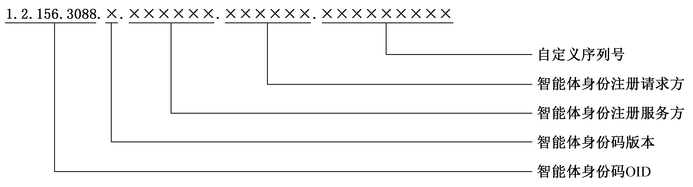
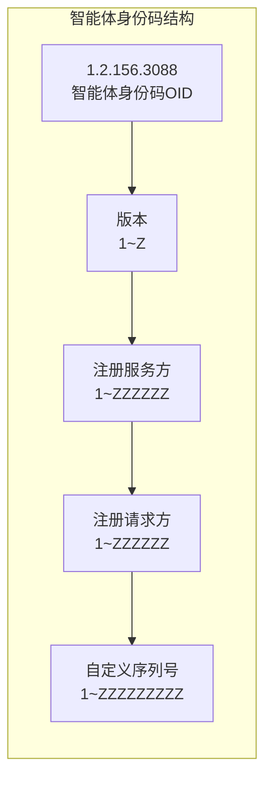
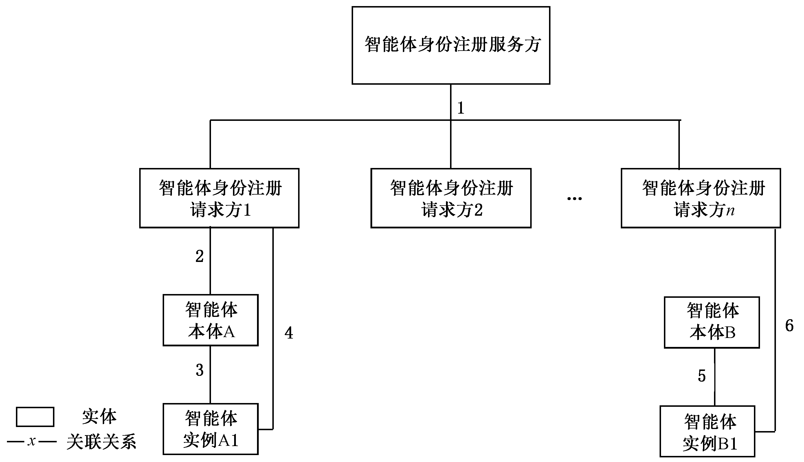

# GBZ 185.2-2026

<!-- Page 1 -->

ICS 35.100
CCS L 79
中 华 人 民 共 和 国 国 家 标 准 化 指 导 性 技 术 文 件
GB/Z 185.2—2026
人工智能 智能体互联
第 部分 身份码
2
：
Artificial intelligence—Agent interconnection—Part 2： Identity code
2026⁃05⁃22 发布
国 家 市 场 监 督 管 理 总 局
发 布
国 家 标 准 化 管 理 委 员 会

<!-- Page 3 -->

GB/Z 185.2—2026
目 次
前言··························································································································Ⅲ
引言··························································································································Ⅳ
1 范围·······················································································································1
2 规范性引用文件········································································································1
3 术语和定义··············································································································1
4 缩略语····················································································································2
5 智能体身份码编码规则·······························································································2
6 智能体身份码分配与管理要求······················································································3
附录 A（ 资料性） 智能体身份码相关实体··········································································4
附录 B（ 资料性） 国际智能体获取智能体身份码方式····························································5
附录 C（ 资料性） 智能体身份码示例·················································································6
参考文献·····················································································································7
Ⅰ

<!-- Page 5 -->

GB/Z 185.2—2026
前 言
本文件为规范类指导性技术文件。
本文件按照 GB/T 1.1—2020《标准化工作导则 第 1 部分：标准化文件的结构和起草规则》的规
定起草。
本文件是 GB/Z 185《人工智能 智能体互联》的第 2 部分。GB/Z 185 已经发布了以下部分：
——第 1 部分：总体架构；
——第 2 部分：身份码；
——第 3 部分：身份管理；
——第 4 部分：智能体描述；
——第 5 部分：智能体发现；
——第 6 部分：智能体交互；
——第 7 部分：智能体工具调用。
请注意本文件的某些内容可能涉及专利。本文件的发布机构不承担识别专利的责任。
本文件由全国信息技术标准化技术委员会（SAC/TC 28）提出并归口。
本文件起草单位：北京邮电大学、中国电子技术标准化研究院、华为技术有限公司、蚂蚁科技集团
股份有限公司、阿里云计算有限公司、北京浩瀚深度信息技术股份有限公司、华北电力科学研究院有限
责任公司、中移互联网有限公司、江苏金服数字集团人工智能科技有限公司、厦门市美亚柏科信息安全
研究所有限公司、浪潮通信信息系统有限公司、中国移动通信集团有限公司、北京快手科技有限公司、
昆仑数智科技有限责任公司、中国电力科学研究院有限公司、超聚变数字技术股份有限公司、浪潮云信
息技术股份公司、北京火山引擎科技有限公司、浙江大华技术股份有限公司、咪咕文化科技有限公司、
南京理工大学、浪潮软件科技有限公司、亚信科技（中国）有限公司、中兴通讯股份有限公司、中移
（杭州）信息技术有限公司、中移雄安信息通信科技有限公司、中国移动通信集团广东有限公司、北京奇
虎科技有限公司、北京宝兰德软件股份有限公司、浪潮通用软件有限公司、晨晞数智（北京）科技有限
公司。
本文件主要起草人：刘军、董建、高歌、朱锦涛、林国涛、徐浩、庞韶敏、徐小天、王嘉、管俊明、阙锦龙、
杨语澈、张传刚、曹汐、谷晨、尚云云、李琰、刘劲楠、郑佳佳、杜宁、孔维生、马丽萌、郝冠亚、王珂琛、
张联华、赵孝武、谢小燕、郑庆国、陆仲达、蓝万顺、丁一凡、杨滢轩、邵俊谦、刘昭。
Ⅲ

<!-- Page 6 -->

GB/Z 185.2—2026
引 言
随着人工智能技术迅猛发展，智能体作为人工智能从概念转化为实际生产力的关键载体，在各领
域应用日益广泛，对赋能新型工业化、塑造新质生产力作用显著。然而，当前智能体产业发展面临诸多
挑战，不同智能体间存在互联互通互操作难题，在基于协议的智能体互联领域，国际上已有 MCP、
A2A、ANP 等智能体通信协议，但并未形成行业完全共识的方案，亟需制定适合国内智能体产业发展
的行业统一共识方案。
为系统化解决上述问题，引导和规范智能体互联技术发展，提升智能体系统的互操作性、可组合性
与整体产业效能，特制定本指导性技术文件。GB/Z 185《人工智能 智能体互联》旨在规定智能体互
联的技术要求和流程，其编制遵循系统性、先进性和可操作性原则，为智能体之间实现跨平台、跨架构
的互联、互通、互操作提供统一的技术框架和标准依据，GB/Z 185 拟由七个部分构成。
——第 1 部分：总体架构。目的在于给出智能体互联环境中的概念模型、功能模型。
——第 2 部分：身份码。目的在于给出智能体身份码定义和应用，给出身份码代码结构和分配原
则的建议。
——第 3 部分：身份管理。目的在于给出智能体互联环境中的身份管理框架和全生命周期过程，
描述身份管理的技术要求。
——第 4 部分：智能体描述。目的在于给出智能体的描述方法，提供智能体描述注册、变更和发布
的参考流程。
——第 5 部分：智能体发现。目的在于给出智能体互联的发现流程。
——第 6 部分：智能体交互。目的在于给出智能体海量互联时的交互模式，描述交互基础元素及
接口定义。
——第 7 部分：智能体工具调用。目的在于给出基于大模型的智能体调用工具的标准化架构、流
程及工具描述，支持智能体与外部工具的无缝集成。
Ⅳ

<!-- Page 7 -->

GB/Z 185.2—2026
人工智能 智能体互联
第 2部分：身份码
1 范围
本文件规定了智能体身份码的编码规则、分配与管理要求。
本文件适用于智能体互联中智能体身份码制定与应用。
2 规范性引用文件
下列文件中的内容通过文中的规范性引用而构成本文件必不可少的条款。其中，注日期的引用文
件，仅该日期对应的版本适用于本文件；不注日期的引用文件，其最新版本（包括所有的修改单）适用于
本文件。
GB/Z 185.1—2026 人工智能 智能体互联 第 1 部分：总体架构
GB/T 26231 信息技术 开放系统互连 对象标识符（OID）的国家编号体系和操作规程
3 术语和定义
GB/Z 185.1—2026 界定的以及下列术语和定义适用于本文件。
3.1
智能体本体 agent ontology
实现特定功能，与智能体描述配套的可执行程序。
注： 一般使用智能体注册服务注册智能体本体，注册后供实例化使用。
3.2
智能体实例 agent instance
智能体本体创建的、具有独立状态和生命周期的实体。
3.3
智能体身份注册服务方 agent identity registration service provider
处理智能体身份注册请求、执行智能体身份核验并管理智能体身份账户的实体。
注： 可能存在多个智能体身份注册服务方。
3.4
智能体身份注册请求方 agent identity registration requester
向智能体身份注册服务方发起智能体身份注册请求，并承担相应责任的实体。
3.5
智能体身份码 agent identity code
由智能体身份注册服务方分配给智能体的，用于在特定系统环境或跨系统环境中对智能体进行识
别、验证与管理的标识符。
3.6
智能体身份码版本 agent identity code version
标识智能体身份码编码规则与内容结构。
注： 智能体身份码版本是智能体身份码内容结构的组成部分，通常由1位标识符表示。
1

<!-- Page 8 -->

GB/Z 185.2—2026
4 缩略语
下列缩略语适用于本文件。
OID：对象标识符（Object Identifier）
5 智能体身份码编码规则
5.1 标识结构
智能体身份码编码规则遵循 GB/T 26231 的有关规定，采用分层结构的 OID 标识体系。智能体
身份码标识采用多层节点标识符顺序组成，每位标识符采用阿拉伯数字（0~9）或英文字母（A~Z）表
示，字母不区分大小写，中间不留空格。
标识的组成部分从左至右依次为：智能体身份码 OID、智能体身份码版本、智能体身份注册服务
方、智能体身份注册请求方、自定义序列号，之间以小数点“.”分隔。具体结构见图 1。各组成部分间的
相关关系见附录 A。
图 1 智能体身份码编码规则

5.2 智能体身份码OID
智能体身份码前缀由 OID 标识管理部门统一分配和管理，作为智能体身份码在全局标识体系中
的根标识和解析智能体身份信息的起点，固定为：1.2.156.3088。国际智能体获取智能体身份码的三种
典型方式见附录 B。
智能体身份码内容由各级节点运营机构依据本文件制定的智能体身份码内容结构进行编制，应保
证不重复。智能体身份码编码内容实现参考见附录 C。
5.3 智能体身份码版本
区分智能体身份码编码规则的版本代码，标识范围为 1~Z，可标识 35 个版本，当前文件约定的智
能体身份码版本号为 1。
5.4 智能体身份注册服务方
一般存在多个智能体身份注册服务方，结合前缀中的国家/地区代码，可标识并确定具体的服务
方，智能体身份注册服务方应为组织，其身份码由主管部门分配。标识范围为 1~ZZZZZZ，可标识约
20 亿个服务方。
5.5 智能体身份注册请求方
每个智能体身份注册请求方的标识由智能体身份注册服务方分配，智能体身份注册请求方可以是
2

<!-- Page 9 -->

GB/Z 185.2—2026
组织，也可以是个人。标识范围为 1~ZZZZZZ，可标识约 20 亿个请求方。
5.6 自定义序列号
自定义序列号要求如下。
a） 由智能体身份注册服务方自行设定，也可按业务种类或其他规则进行编号，应保证唯一性和
全生命周期的可追溯性。
b） 智能体身份注册服务方审核通过后，宜给智能体分配一个用于区分智能体本体的序列号；宜
使用 1~ZZZZZZZZZ 的标识范围，可标识约 101 万亿个本体。
c） 智能体身份注册服务方宜给智能体分配一个智能体实例序列号，以标识由智能体本体创建的
实例。当注册对象为本体本身时，其实例序列号以特定字符 0 标识。宜使用 1~ZZZZZZZZZ
的标识范围，可标识约 101 万亿个实例。
6 智能体身份码分配与管理要求
对于智能体身份码的分配与管理：
a） 废弃的智能体身份注册服务方编码不应重新分配；
b） 当智能体本体发生核心功能发生变更时，智能体身份注册请求方宜申请更新智能体本体序
列号；
c） 当智能体存在多版本共存服务时，应为智能体本体分配不同的序列号；
d） 一个智能体身份码只能对应一个智能体；
e） 智能体身份注册服务方作为自定义序列号的责任主体，应负责其定义、分配与管理工作。
3

<!-- Page 10 -->

GB/Z 185.2—2026
附 录 A
（资料性）
智能体身份码相关实体
智能体身份码相关实体的关联关系如图 A.1 所示。
图A.1 智能体身份码相关实体间的关联关系图
智能体身份码相关实体间关联关系的具体描述见表 A.1。
表 A.1 相关实体关系描述
关系
实体 实体 关联关系描述
序号
智能体身份注册服 智能体身份注册 智能体身份注册服务方向智能体身份注册请求方提供身份注册、核
1
务方 请求方 验及管理服务
智能体身份注册请求方1向智能体身份注册服务方提交智能体本体
智能体身份注册请 A的注册申请。审核通过后，智能体身份注册服务方为其分配智能
2 智能体本体A
求方1 体身份码，此时智能体身份码中的智能体实例序列号以特定字符0
标识该身份对应于智能体本体本身
智能体实例A1是智能体本体A实例化后的执行实体，一个智能体
3 智能体本体A 智能体实例A1
本体可以创建多个智能体实例
智能体身份注册请求方1基于已获得的智能体本体A智能体身份
智能体身份注册请
4 智能体实例A1 码，向智能体身份注册服务方提交智能体实例A1的注册申请，以获
求方1
取该实例的智能体身份码。一般情况下，该过程可自动化实现
5 智能体本体B 智能体实例B1 智能体实例B1是智能体本体B实例化后的执行实体
智能体身份注册请求方n直接为智能体实例B1向智能体身份注册
智能体身份注册请 服务方提交注册申请。审核通过后，智能体身份注册服务方首先为
6 智能体实例B1
求方n 智能体本体B分配智能体身份码；随后，基于该本体智能体身份码，
为智能体实例B1生成并分配其对应的智能体身份码
4

| 关系
序号 | 实体           | 实体          | 关联关系描述                                                                                                             |
| ----- | ------------ | ----------- | ------------------------------------------------------------------------------------------------------------------ |
| 1     | 智能体身份注册服
务方  | 智能体身份注册
请求方 | 智能体身份注册服务方向智能体身份注册请求方提供身份注册、核
验及管理服务                                                                               |
| 2     | 智能体身份注册请
求方1 | 智能体本体A      | 智能体身份注册请求方1向智能体身份注册服务方提交智能体本体
A的注册申请。审核通过后，智能体身份注册服务方为其分配智能
体身份码，此时智能体身份码中的智能体实例序列号以特定字符0
标识该身份对应于智能体本体本身          |
| 3     | 智能体本体A       | 智能体实例A1     | 智能体实例A1是智能体本体A实例化后的执行实体，一个智能体
本体可以创建多个智能体实例                                                                        |
| 4     | 智能体身份注册请
求方1 | 智能体实例A1     | 智能体身份注册请求方1基于已获得的智能体本体A智能体身份
码，向智能体身份注册服务方提交智能体实例A1的注册申请，以获
取该实例的智能体身份码。一般情况下，该过程可自动化实现                            |
| 5     | 智能体本体B       | 智能体实例B1     | 智能体实例B1是智能体本体B实例化后的执行实体                                                                                            |
| 6     | 智能体身份注册请
求方n | 智能体实例B1     | 智能体身份注册请求方n直接为智能体实例B1向智能体身份注册
服务方提交注册申请。审核通过后，智能体身份注册服务方首先为
智能体本体B分配智能体身份码；随后，基于该本体智能体身份码，
为智能体实例B1生成并分配其对应的智能体身份码 |

<!-- Page 11 -->

GB/Z 185.2—2026
附 录 B
（资料性）
国际智能体获取智能体身份码方式
国际智能体获取智能体身份码的三种方式。
a） 国际智能体可向经主管部门认可的智能体身份注册服务方申请注册，获得智能体身份码。
b） 海外机构可依据本文件及相关管理规定，向主管部门申请成为智能体身份注册服务方。在获
得批准后，该机构将获得由主管部门分配的唯一身份注册服务方身份码，具备注册服务资质。
随后，国际智能体可在此海外机构完成身份注册，获得智能体身份码。
c） 海外机构可在其所在国家或地区建立智能体身份管理体系。该体系的核心节点与本文件体
系的核心节点（3088 节点）通过双边或多边协议建立互信互认关系。在互认框架下，该海外
体系应采用本文件的身份码编码规则为其下属的国际智能体分配智能体身份码。
5

<!-- Page 12 -->

GB/Z 185.2—2026
附　录　C
（资料性）
智能体身份码示例
1.2.156.3088.1.1.34C2.478BDF.3GF546
| a） 顶级弧：1   | 表示 ISO；  |     |     |     |     |     |
| ---------- | -------- | --- | --- | --- | --- | --- |
| b） 次级弧：2   | 表示国家成员体； |     |     |     |     |     |
| c） 第 级：156 | 表示中国；    |     |     |     |     |     |
3
4
| e） 第 5 级：表示智能体身份码版本为    |                   |                     | 1；   |          |                |     |
| ----------------------- | ----------------- | ------------------- | ---- | -------- | -------------- | --- |
| f） 第 6 级：1              | 表示一个智能体身份码注册服务方公司 |                     |      | A；       |                |     |
| g） 第 7 级：34C2           | 表示公司              | A 分配给一个智能体身份码请求方研究院 |      |          | B 的标识；         |     |
| h） 第 8 级（自定义序列号）：478BDF |                   |                     | 表示公司 | A 分配给研究院 | B 请求的一个智能体本体的序 |     |
列号标识；
的序列号标识。
6

<!-- Page 13 -->

GB/Z 185.2—2026
参 考 文 献
[1] GB/T 17710—2008 信息技术 安全技术 校验字符系统
[2] GB/T 17969.1—2015 信息技术 开放系统互连 OSI 登记机构的操作规程 第 1 部分：
一般规程和国际对象标识符树的顶级弧
[3] GB/T 17969.3—2025 信息技术 开放系统互连 OSI 登记机构的操作规程 第 3 部分：
ISO 和 ITU⁃T 联合管理的顶级弧下的客体标识符弧的登记
[4] GB/T 17969.5—2000 信息技术 开放系统互连 OSI 登记机构的操作规程 第 5 部分：
VT 控制客体定义的登记表
[5] GB/T 17969.6—2025 信息技术 开放系统互连 OSI 登记机构的操作规程 第 6 部分：
应用过程和应用实体的登记
[6] GB/T 17969.8—2024 信息技术 对象标识符登记机构操作规程 第 8 部分：通用唯一标
识符（UUIDs）的生成及其在对象标识符中的使用
[7] GB/T 26231—2017 信息技术 开放系统互连 对象标识符（OID）的国家编号体系和操作
规程
[8] GB/T 33477—2016 党政机关电子公文标识规范
———————————
7