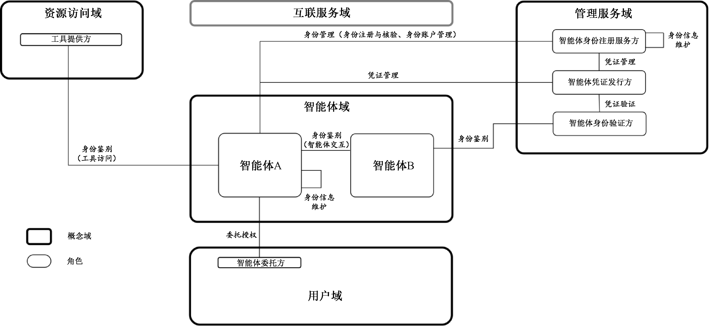
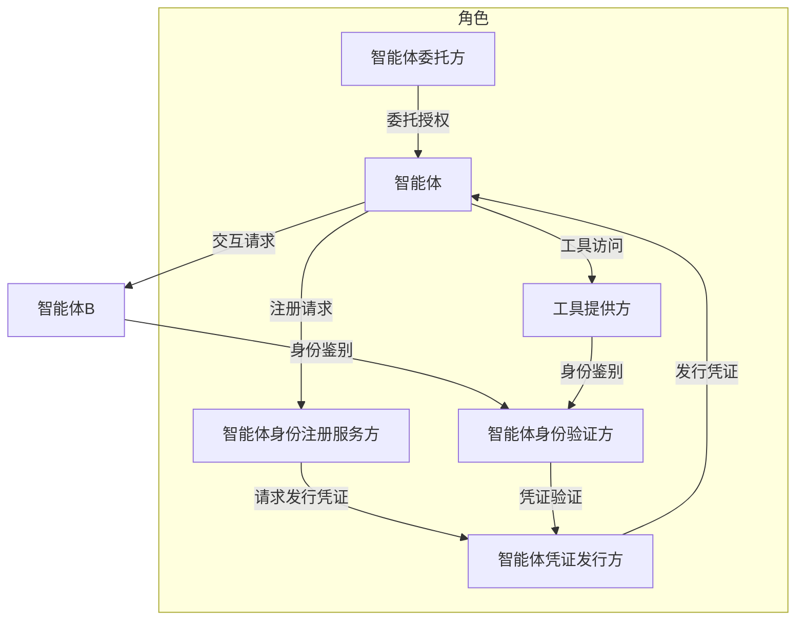
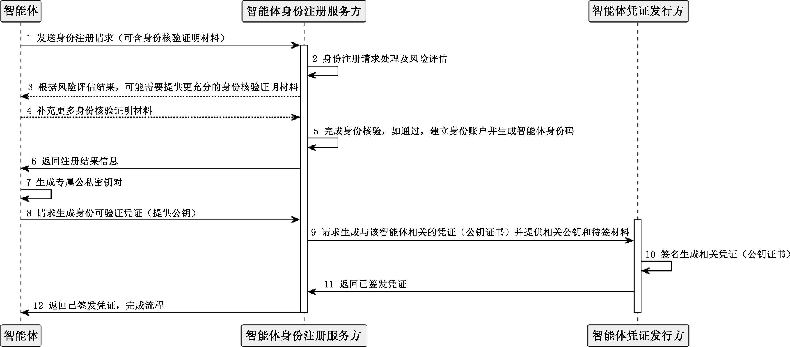
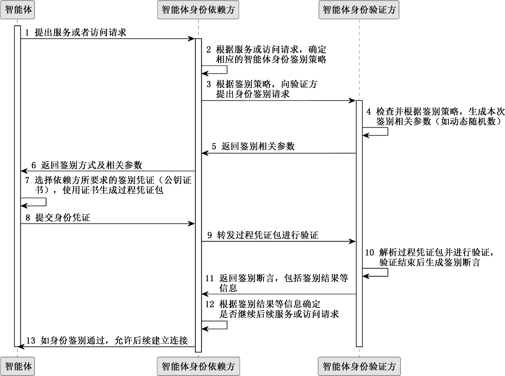

# GBZ 185.3-2026

<!-- Page 1 -->

ICS 35.100
CCS L 79
中 华 人 民 共 和 国 国 家 标 准 化 指 导 性 技 术 文 件
GB/Z 185.3—2026
人工智能 智能体互联
第 部分 身份管理
3
：
Artificial intelligence—Agent interconnection—Part 3： Identity management
2026⁃05⁃22 发布
国 家 市 场 监 督 管 理 总 局
发 布
国 家 标 准 化 管 理 委 员 会

<!-- Page 3 -->

GB/Z 185.3—2026
目 次
前言··························································································································Ⅲ
引言··························································································································Ⅳ
1 范围·······················································································································1
2 规范性引用文件········································································································1
3 术语和定义··············································································································1
4 缩略语····················································································································2
5 智能体身份管理框架··································································································2
6 身份注册及核验········································································································3
7 身份账户管理···········································································································4
8 凭证管理·················································································································5
9 身份鉴别·················································································································6
附录 A（ 资料性） 智能体身份注册及核验的实现示例···························································8
附录 B（ 资料性） 智能体身份核验证明材料示例································································10
附录 C（ 资料性） 智能体身份鉴别的实现示例···································································11
参考文献····················································································································13
Ⅰ

<!-- Page 5 -->

GB/Z 185.3—2026
前 言
本文件为规范类指导性技术文件。
本文件按照 GB/T 1.1—2020《标准化工作导则 第 1 部分：标准化文件的结构和起草规则》的规
定起草。
本文件是 GB/Z 185《人工智能 智能体互联》的第 3 部分。GB/Z 185 已经发布了以下部分：
——第 1 部分：总体架构；
——第 2 部分：身份码；
——第 3 部分：身份管理；
——第 4 部分：智能体描述；
——第 5 部分：智能体发现；
——第 6 部分：智能体交互；
——第 7 部分：智能体工具调用。
请注意本文件的某些内容可能涉及专利。本文件的发布机构不承担识别专利的责任。
本文件由全国信息技术标准化技术委员会（SAC/TC 28）提出并归口。
本文件起草单位：中国电子技术标准化研究院、蚂蚁科技集团股份有限公司、中移互联网有限公
司、北京邮电大学、阿里云计算有限公司、华为技术有限公司、华北电力科学研究院有限责任公司、北京
浩瀚深度信息技术股份有限公司、中金金融认证中心有限公司、中兴通讯股份有限公司、北京快手科技
有限公司、江苏金服数字集团人工智能科技有限公司、浪潮通信信息系统有限公司、昆仑数智科技有限
责任公司、浙江大华技术股份有限公司、北京兴云数科技术有限公司、亚信科技（中国）有限公司、中移
九天人工智能科技（北京）有限公司、成都理工大学、北京火山引擎科技有限公司、中国移动通信集团有
限公司、南京理工大学、青岛港国际股份有限公司、北京宝兰德软件股份有限公司、厦门市美亚柏科信
息安全研究所有限公司、中移（杭州）信息技术有限公司、杭州高新区（滨江）区块链与数据安全研究院、
中移雄安信息通信科技有限公司、中国移动通信集团广东有限公司、晨晞数智（北京）科技有限公司、
浪潮通用软件有限公司、咪咕文化科技有限公司。
本文件主要起草人：张士宗、孙曦、鲍薇、刘军、高歌、庄仁峰、文军、徐浩、朱锦涛、张熙、闫冬、卢令令、
庞韶敏、李闯、赵孝武、谷晨、管俊明、茹宏格、袁明明、尚云云、孔维生、李玉国、张联华、孙昊、程晗蕾、
杜宁、刘伟东、戚湧、郭乙运、陆仲达、阙锦龙、谢小燕、魏遵博、杨佳丽、朱建、邵俊谦、丁一凡、刘卫文、
陈波、马丽萌。
Ⅲ

<!-- Page 6 -->

GB/Z 185.3—2026
引 言
随着人工智能技术迅猛发展，智能体作为人工智能从概念转化为实际生产力的关键载体，在各领
域应用日益广泛，对赋能新型工业化、塑造新质生产力作用显著。然而，当前智能体产业发展面临诸多
挑战，不同智能体间存在互联互通互操作难题，在基于协议的智能体互联领域，国际上已有 MCP、
A2A、ANP 等智能体通信协议，但并未形成行业完全共识的方案，亟需制定适合国内智能体产业发展
的行业统一共识方案。
为系统化解决上述问题，引导和规范智能体互联技术发展，提升智能体系统的互操作性、可组合性
与整体产业效能，特制定本指导性技术文件。GB/Z 185《人工智能 智能体互联》旨在规定智能体互
联的技术要求和流程，其编制遵循系统性、先进性和可操作性原则，为智能体之间实现跨平台、跨架构
的互联、互通、互操作提供统一的技术框架和标准依据，GB/Z 185 拟由七个部分构成。
——第 1 部分：总体架构。目的在于给出智能体互联环境中的概念模型、功能模型。
——第 2 部分：身份码。目的在于给出智能体身份码定义和应用，给出身份码代码结构和分配原
则的建议。
——第 3 部分：身份管理。目的在于给出智能体互联环境中的身份管理框架和全生命周期过程，
描述身份管理的技术要求。
——第 4 部分：智能体描述。目的在于给出智能体的描述方法，提供智能体描述注册、变更和发布
的参考流程。
——第 5 部分：智能体发现。目的在于给出智能体互联的发现流程。
——第 6 部分：智能体交互。目的在于给出智能体海量互联时的交互模式，描述交互基础元素及
接口定义。
——第 7 部分：智能体工具调用。目的在于给出基于大模型的智能体调用工具的标准化架构、流
程及工具描述，支持智能体与外部工具的无缝集成。
Ⅳ

<!-- Page 7 -->

GB/Z 185.3—2026
人工智能 智能体互联
第 3部分：身份管理
1 范围
本文件规定了智能体在互联环境中的身份管理框架及要求，涵盖了智能体身份注册及核验、身份
账户管理、凭证管理、身份鉴别等。
本文件适用于智能体身份管理功能/系统的开发、应用及测评。
2 规范性引用文件
下列文件中的内容通过文中的规范性引用而构成本文件必不可少的条款。其中，注日期的引用文
件，仅该日期对应的版本适用于本文件；不注日期的引用文件，其最新版本（包括所有的修改单）适用于
本文件。
GB/Z 185.2—2026 人工智能 智能体互联 第 2 部分：身份码
GB/T 25069—2022 信息安全技术 术语
GB/T 41867—2022 信息技术 人工智能 术语
GB/T 45288.1—2025 人工智能 大模型 第 1 部分：通用要求
3 术语和定义
GB/T 45288.1—2025、GB/T 25069—2022 和 GB/T 41867—2022 界定的以及下列术语和定义适
用于本文件。
3.1
智能体身份 agent identity
可验证的数字身份，用于标识一个智能体。
3.2
智能体委托方 agent delegator
授权智能体代表其执行任务的实体。
3.3
智能体身份依赖方 agent identity relying party
依赖对智能体进行身份鉴别的结果决定是否建立信任关系的实体。
3.4
智能体身份注册服务方 agent identity registration service provider
处理智能体身份注册请求、执行智能体身份核验并管理智能体身份账户的实体。
3.5
智能体凭证发行方 agent credential issuer
负责为智能体生成、发行并管理身份凭证的实体。
3.6
智能体身份验证方 agent identity verifier
能够对智能体身份合法性进行验证的实体。
1

<!-- Page 8 -->

GB/Z 185.3—2026
3.7
智能体凭证 agent credential
由智能体凭证发行方签发的、用于身份鉴别的、经过防篡改处理的数据集合。
3.8
智能体身份账户 agent identity account
智能体身份注册服务方为通过身份核验的智能体所建立的记录集合。
注： 身份账户是智能体身份在智能体身份注册服务方管理系统中的载体，以分配的智能体身份码为标识，关联了该
智能体已通过核验的身份证明材料、已绑定的智能体凭证等。
3.9
过程凭证包 process credential package
在身份鉴别过程中，由智能体动态生成的、用于证明其身份的数据集合。
4 缩略语
下列缩略语适用于本文件。
HSM：硬件安全模块（Hardware Security Module）
TEE：可信执行环境（Trusted Execution Environment）
5 智能体身份管理框架
智能体身份管理框架如图 1 所示。
图 1 智能体身份管理框架

框架中包括了下述主要角色。
——智能体委托方：委托并授权智能体代表其在特定业务场景下开展活动，对智能体的行为承担
最终责任，通常是人类用户或者组织机构。
——智能体：接受智能体委托方授权并代表智能体委托方开展活动，并维护和管理自身的身份信
息，包括智能体身份码和智能体凭证等。
——工具提供方：当智能体对工具发起基于协议的访问请求时，对智能体身份进行鉴别，并依赖于
2

<!-- Page 9 -->

GB/Z 185.3—2026
身份鉴别结果以及对智能体的访问权限管理，提供相应的工具服务。完整的智能体工具调用
服务可参照 GB/Z 185.7—2026。
——智能体身份注册服务方：在身份注册与核验中，处理智能体身份注册请求并执行智能体身份
核验过程，核验通过后为智能体创建身份账户并分配相应智能体身份码和发行智能体凭证。
在完成智能体身份注册后，对智能体身份账户进行维护和管理。
——智能体凭证发行方：负责为智能体生成、发行并管理智能体凭证。该方可与智能体身份注册
服务方同属一个机构，也可为独立的第三方机构。
——智能体身份验证方：在身份鉴别过程中，负责验证智能体所出示智能体凭证的真实性、完整性
和有效性。验证过程中，智能体身份验证方可能会与智能体凭证发行方进行交互，以完成对
智能体凭证的有效性验证。
框架中包括了下述主要流程。
——智能体身份管理可进一步分为：
• 身份注册与核验：该活动描述了对智能体进行身份注册的过程，即为智能体创建身份，是
后续智能体身份管理和应用的前提，见第 6 章；
• 身份账户管理：该活动描述了对智能体进行身份账户管理的过程，包括身份更新、身份锁
定与解锁以及身份注销等，见第 7 章。
——凭证管理：该活动描述了对与智能体身份关联的智能体凭证进行发行及管理的过程，包括凭
证发行、凭证更新、凭证锁定与解锁以及凭证注销等。除了通过智能体身份注册服务方发行
和管理智能体凭证之外，智能体还可直接向智能体凭证发行方申请和管理智能体凭证。见
第 8 章。
——身份鉴别：该活动描述了智能体如何向其他实体证明其身份，包括在智能体交互的场景以及
工具访问的场景等。见第 9 章。
注： 在图1中，智能体A向智能体B发起交互请求时，智能体B对智能体A的身份进行鉴别，并根据身份鉴别结果进
行后续的互联鉴权，以确定是否接受智能体A的交互请求并提供相应的服务或者资源等。
6 身份注册及核验
6.1 通用流程
智能体身份注册与核验的通用流程如下：
a） 身份注册发起：智能体委托方在对智能体进行委托授权后，向智能体身份注册服务方发起注
册请求，请求中提交关于该智能体的注册信息，如智能体的功能描述、支持的任务列表及版本
号等；
b） 风险评估与证据要求确定：智能体身份注册服务方分析收到的注册信息，评估其潜在风险，并
基于评估情况确定本次注册所需要核验的身份证明材料组合；
c） 身份证据提交与核验：智能体身份注册服务方从智能体委托方、智能体等多个来源收集所需
要的证明材料，并对证明材料进行核实与验证；
d） 身份建立及凭证发行：在身份核验通过后，智能体身份注册服务方为智能体创建一个身份账
户，并分配智能体身份码，可按照 GB/Z 185.2—2026 分配身份码，同时，向智能体凭证发行方
发起请求，为该智能体生成相应的智能体凭证；
e） 身份账户激活：智能体身份注册服务方将智能体身份码和关联智能体凭证返回给智能体，同
时将该智能体的身份账户激活，完成身份注册与核验流程。
注： 身份注册、核验及凭证发行的实现参考见附录A。
3

<!-- Page 10 -->

GB/Z 185.3—2026
6.2 身份核验证明材料
可用于智能体身份核验的证明材料包括但不限于：系统构成的相关证明材料、委托授权的相关证
明材料、行为边界的相关证明材料及其他证明材料等。
注： 具体的示例材料见附录B。
7 身份账户管理
7.1 通则
身份账户管理如下：
a） 智能体身份注册服务方应支持身份注册、身份更新、身份注销等流程；
b） 智能体身份注册服务方宜支持身份锁定、身份解锁等流程；
c） 智能体身份注册服务方宜制定明确规则，以界定智能体发生变更时触发身份更新还是作为新
智能体重新注册。
7.2 身份更新
对于身份更新：
a） 智能体身份注册服务方应支持智能体主动发起的身份更新流程，流程中宜包含智能体委托方
的确认信息；
b） 身份更新流程中，智能体身份码应保持不变；
c） 对身份账户的任何更新操作应经过相应的授权认证并生成相应日志记录，且采用技术措施防
止日志被非授权篡改；
d） 智能体宜支持智能体身份注册服务方主动发起的身份更新流程；
e） 当智能体发生变更时（如核心代码、功能列表、权限范围、运行环境等发生变化），智能体宜发
起身份更新流程。
7.3 身份锁定与解锁
对于身份锁定与解锁：
a） 当身份账户被置为锁定状态时，智能体身份注册服务方和智能体凭证发行方应拒绝与该账户
相关的凭证发行、凭证更新等请求，凭证在验证时应被视为无效；
b） 对身份账户的锁定解锁操作应经过相应的授权认证并生成相应日志记录，且采用技术措施防
止日志被非授权篡改；
c） 智能体身份注册服务方宜支持智能体主动发起的身份锁定和身份解锁流程，流程中宜包含智
能体委托方的确认信息；
d） 智能体宜支持智能体身份注册服务方主动发起的身份锁定和身份解锁流程。
7.4 身份注销
对于身份注销：
a） 智能体应支持身份注册服务方主动发起的身份注销流程；
b） 智能体身份注册服务方系统中，身份注销时，应同时注销与该身份账户关联的智能体凭证；
c） 智能体身份注册服务方系统中，身份注销后，应归档该身份账户相关的注册信息、历史版本、
活动日志及审计记录，并设置明确的保存期限；
4

<!-- Page 11 -->

GB/Z 185.3—2026
d） 智能体身份注册服务方宜支持智能体主动发起的身份注销流程，流程中宜包含智能体委托方
的确认信息。
8 凭证管理
8.1 通则
凭证管理如下：
a） 智能体身份注册服务方和智能体凭证发行方应支持凭证发行、凭证更新、凭证注销等流程；
b） 智能体身份注册服务方和智能体凭证发行方宜支持凭证锁定、凭证解锁等流程。
8.2 凭证发行
对于凭证发行：
a） 智能体凭证发行方宜支持智能体身份注册服务方发起的凭证发行流程；
b） 智能体凭证发行方宜支持智能体直接向其发起的凭证发行流程；
c） 智能体凭证宜经过智能体凭证发行方的数字签名，以确保其真实性和完整性，宜使用符合已
发布的国家标准或行业标准的算法和密钥长度；
d） 智能体凭证宜包含明确的有效期，且其生命周期不长于其所关联的身份账户的生命周期。
8.3 凭证更新
对于凭证更新：
a） 智能体凭证发行方和智能体身份注册服务方应支持因智能体身份账户更新触发的相关凭证
更新；
b） 智能体凭证发行方和智能体身份注册服务方宜支持智能体直接发起的凭证更新请求，流程中
宜包含智能体委托方的确认信息；
c） 智能体凭证发行方和智能体身份注册服务方宜为生命周期较短的智能体凭证提供自动化的、
周期性的更新机制。
8.4 凭证锁定与解锁
对于凭证的锁定和解锁：
a） 每次锁定或解锁操作，智能体凭证发行方应记录明确的原因代码，用于审计和状态查询；
b） 智能体凭证发行方应支持智能体身份验证方查询智能体凭证的锁定状态；
c） 处于锁定状态的智能体凭证，在验证时，智能体身份验证方应将其视为无效；
d） 智能体宜支持智能体凭证发行方和智能体身份注册服务方发起的凭证锁定与解锁流程；
e） 智能体凭证发行方和智能体身份注册服务方宜支持智能体或智能体委托方发起的凭证锁定
与解锁流程。
8.5 凭证注销
对于凭证注销：
a） 智能体应支持智能体凭证发行方和智能体身份注册服务方主动发起的凭证注销流程；
b） 当关联的身份账户被注销时，智能体身份注册服务方应向智能体凭证发行方发起凭证注销
流程；
c） 智能体凭证发行方应支持智能体身份验证方查询智能体凭证的注销状态；
5

<!-- Page 12 -->

GB/Z 185.3—2026
d） 智能体凭证发行方和智能体身份注册服务方宜支持智能体主动发起的凭证注销流程，流程中
宜包含智能体委托方的确认信息。
9 身份鉴别
9.1 通用流程
智能体互联过程中涉及身份鉴别的场景可能包括：
——智能体 A 向另一个智能体 B 发起互联请求，智能体 B 要对智能体 A 所声称的身份进行确
认，并依赖于身份鉴别的结果来确定是否继续互联请求，并提供相关的服务或资源；
——智能体向工具提供方发起基于协议的工具访问请求，工具提供方对智能体身份进行鉴别，并
依赖于身份鉴别的结果提供相应的工具服务。
对依赖于身份鉴别结果来决定后续互联活动的实体，本文件中统一使用智能体身份依赖方来进行
描述。
智能体身份鉴别的通用流程如下。
a） 服务请求并触发身份鉴别流程：智能体向智能体身份依赖方发起服务交互请求，智能体身份
依赖方根据其访问控制策略，对智能体进行身份鉴别。
b） 凭证出示：根据智能体身份依赖方的要求，智能体使用相应的智能体凭证，生成可验证的过程
凭证包，并提交给智能体身份依赖方。智能体身份依赖方如无法独立验证，可提交给智能体
身份验证方进行验证。
c） 凭证验证：智能体身份验证方对接收到的过程凭证包进行验证，过程中可与智能体凭证发行
方进行交互（如获取智能体凭证发行方的公钥或者查询智能体凭证的有效性等）。该过程可
包含以下一个或多个步骤：
1） 完整性与真实性验证：通过密码学手段（如数字签名）验证智能体凭证未被篡改，且确实
由其声明的智能体凭证发行方所签发；
2） 时效性验证：检查智能体凭证是否在有效期内；
3） 状态验证：检查智能体凭证是否已被其发行方注销或锁定；
4） 受众与范围验证：验证智能体凭证的预期接收方是否是当前智能体身份依赖方或智能体
身份验证方，以及智能体凭证授予的范围是否与请求的操作相符；
5） 委托链验证：验证智能体凭证中包含的从智能体委托方到智能体的委托授权是否真实
有效。
d） 鉴别断言生成：凭证验证完成后，智能体身份验证方生成一个包含身份鉴别结果的身份鉴别
断言。除身份鉴别结果外，断言中也可包含其他经过验证的可信信息，如智能体委托方信息、
功能范围等。
e） 服务授权与会话建立：智能体身份验证方将身份鉴别断言传递给智能体身份依赖方，智能体
身份依赖方基于该断言中的身份鉴别结果，并结合自身的授权策略，做出最终决策。如果授
权通过，智能体身份依赖方与智能体之间建立一个经过鉴别的、安全的会话，并开始服务
交互。
注： 身份鉴别的实现参考见附录C。
9.2 技术要求
为支持 9.1 流程如下。
a） 凭证出示过程中：
6

<!-- Page 13 -->

GB/Z 185.3—2026
1） 智能体应能根据智能体身份依赖方或智能体身份验证方的具体要求，选择智能体凭证并
生成过程凭证包，以证明其身份；
2） 智能体宜具备生成动态过程凭证的能力，例如，可将随机数、时间戳或挑战值等动态信息
通过数字签名方式打包到过程凭证中，用于智能体身份验证方的后续验证；
3） 智能体宜能感知当前的交互上下文（如交易风险等级、对方实体身份、历史交互记录等），
并动态调整出示智能体凭证的类型和组合，实现风险自适应的凭证出示。
b） 凭证验证过程中：
1） 智能体身份验证方应能验证所出示智能体凭证的完整性和真实性，如验证智能体凭证的
数字签名时能追溯到一个或多个可信的智能体凭证发行方根证书，形成完整的信任链验
证，其中根证书应由国家认可的电子认证服务机构签发，应符合国家主管部门智能体公
钥证书管理的有关规定；
2） 智能体身份验证方宜具备检查智能体凭证状态的能力，对于已锁定或者注销的智能体凭
证应予拒绝，如无法实时核验智能体凭证状态，宜能根据预设的安全策略决定接受或
拒绝；
3） 智能体身份验证方宜验证智能体凭证的接收方与当前智能体身份依赖方的匹配性，并宜
验证智能体凭证中声明的授权范围与当前请求的操作意图是否一致，防止权限滥用或越
权攻击；
4） 验证方宜验证智能体凭证中包含的从智能体委托方到智能体的授权委托信息，并确保智
能体的行为是在一个有效的授权背景下进行的。
c） 鉴别断言生成中：
1） 智能体身份验证方为智能体身份依赖方生成的鉴别断言应是防篡改、防伪造的，如验证
方生成的鉴别断言应经过其自身的数字签名以确保断言的防篡改性和来源的不可否
认性；
2） 鉴别断言内容应包含明确的鉴别结果（如成功、失败、需进一步验证等），可包含被验证的
智能体身份码、关键身份属性摘要、验证时间戳以及本次鉴别的唯一标识符等信息，以支
持智能体身份依赖方进行细粒度的授权决策；
3） 智能体身份验证方宜动态评估本次交互的风险情况，并根据风险自适应地调整验证的严
格程度，如在识别到高风险时，可要求智能体出示额外的智能体凭证信息；
4） 断言中可包含基于本次鉴别结果给出的安全策略建议，供智能体身份依赖方决策参考。
7

<!-- Page 14 -->

GB/Z 185.3—2026
附 录 A
（资料性）
智能体身份注册及核验的实现示例
本附录提供了一个智能体身份注册、核验及凭证发行（基于公钥证书）的实现流程，如图 A.1 所示。
图A.1 智能体身份注册、核验及凭证发行流程示例
具体流程介绍如下。
1） 智能体（或智能体委托方）向智能体身份注册服务方发起身份注册请求，请求中包括关于智能
体的描述信息，也可包含关于智能体的身份核验证明材料。
2） 智能体身份注册服务方对注册请求进行处理，并根据智能体的能力和任务范围进行相应的风
险评估，评估范围可包括但不限于：智能体的系统构成是否符合预设规范、功能边界是否清晰
且处于可控范围、运行环境是否满足安全基线要求等。
3） 根据风险评估结果，可能需要发起方提供更充分的身份核验证明材料。
4） 智能体（或智能体委托方）进一步补充所要求的更多身份核验证明材料。
5） 智能体身份注册服务方对身份核验证明材料的真实性、完整性、充分性进行验证，并完成身份
核验。核验完成后，如果核验通过，则为本次申请的智能体生成相应的智能体身份码并建立
身份账户。
6） 返回注册结果信息。如果核验未通过，则结束本次身份注册流程。如果核验通过，进入下一步。
7） 智能体借助内置或集成的硬件安全模块 HSM 生成专属公私密钥对。其中，私钥仅由智能体
持有，并进行安全存储（如存储在安全芯片或者可信执行环境 TEE 中），公钥将用于后续的凭
证生成。
8） 智能体向智能体身份注册服务方请求生成与身份相关联的可验证凭证并提供公钥。本附录
方案中的智能体凭证是基于公钥证书实现。
9） 智能体身份注册服务方向智能体凭证发行方请求为该智能体签发智能体凭证（符合 GB/T 20518
的公钥证书），并提供相关证书和待签的智能体信息，可包括但不限于：智能体身份码、系统构
成、功能清单、智能体委托方信息、权限等级等。
8

<!-- Page 15 -->

GB/Z 185.3—2026
10） 智能体凭证发行方为智能体签发公钥证书作为智能体凭证。
11） 智能体凭证发行方将智能体凭证返回给智能体身份注册服务方。
12） 智能体身份注册服务方将智能体凭证返回给智能体，完成流程。智能体对公钥证书进行存
储，用于后续身份鉴别流程等。
9

<!-- Page 16 -->

GB/Z 185.3—2026
附 录 B
（资料性）
智能体身份核验证明材料示例
本附录列举了在智能体身份注册及核验阶段，可用来证明智能体身份的材料示例。实际应用过程
中可根据需要组合进行使用，或者引入其他的证明材料。
可用作智能体身份核验的证明材料示例如下。
a） 系统构成的相关证明材料，如：
1） 智能体核心代码、模型和算法的唯一哈希或指纹；
2） 构建和集成过程的版本溯源记录；
3） 运行环境（如操作系统、硬件 ID、容器环境等）唯一标识摘要；
4） 已登记的系统组件清单和依赖模块列表等。
b） 委托授权的相关证明材料，如：
1） 明确指向智能体委托方的数字授权或委托声明；
2） 智能体委托方⁃智能体关系绑定的历史记录和变更痕迹；
3） 可用于识别智能体委托方的信息，如智能体委托方联系方式等。
c） 行为边界的相关证明材料，如：
1） 智能体用途、权限边界、操作目标、可访问资源等的结构化声明；
2） 任务、目标、接口定义和行为意图说明文件；
3） 已授权行为范围与时间、空间等方面的动态约束描述等。
d） 其他证明材料，如：
1） 第三方认证证书（如安全、能力、合规评测等）；
2） 来源平台、开发团队、运营主体等背景及其历史声誉记录等。
10

<!-- Page 17 -->

GB/Z 185.3—2026
附 录 C
（资料性）
智能体身份鉴别的实现示例
本附录提供了一个基于公钥证书作为智能体凭证的智能体身份鉴别实现流程，如图 C.1 所示。
图C.1 智能体身份鉴别流程示例
具体流程介绍如下。
1） 智能体对任务进行拆解后，开始与其他智能体或服务提供方发起请求。此时其他智能体或者
服务提供方需对智能体身份进行鉴别，并依赖于鉴别结果来确定是否继续提供服务，即作为
智能体身份依赖方。智能体请求中一般会包括可支持的身份鉴别策略，如智能体凭证类
型等。
2） 智能体身份依赖方根据服务或者访问的请求内容，依据相应的风险评估要求和智能体身份鉴
别策略支持情况，确定相应的身份鉴别策略，本附录示例中选择了基于公钥证书的智能体凭
证进行鉴别。
3） 智能体身份依赖方依据鉴别策略，向智能体身份验证方提出身份鉴别请求。
4） 智能体身份验证方根据鉴别策略，生成本次鉴别的相关参数。本附录示例中，智能体身份验
证方会为本次身份鉴别流程生成一个动态随机数。
5） 智能体身份验证方向智能体身份依赖方返回身份鉴别的相关参数。
6） 智能体身份依赖方向智能体返回所确定的身份鉴别策略以及相关参数。
7） 智能体根据智能体身份依赖方所要求的身份鉴别策略，选择相应的智能体凭证（符合GB/T 20518
的公钥证书），并基于该公钥证书对应的私钥，签名生成本次身份鉴别的过程凭证包，所签信
11

<!-- Page 18 -->

GB/Z 185.3—2026
息可包括但不限于：验证方生成的动态随机数、本次交互的场景信息等。
8） 智能体向智能体身份依赖方提交身份鉴别的过程凭证包。
9） 智能体身份依赖方向智能体身份验证方转发身份鉴别的过程凭证包。
10） 智能体身份验证方解析过程凭证包，从中提取智能体的公钥证书并验证其有效性后，基于智
能体公钥进一步验证签名数据是否未被篡改，包括动态随机数是否一致、智能体凭证中记录
的智能体权限范围与属性特征等。验证结束后，生成包含了鉴别结果的断言。
11） 将鉴别断言返回给智能体身份依赖方。
12） 智能体身份依赖方根据鉴别结果和其他信息，来决策是否与该智能体继续后续服务或者访
问请求。
13） 如果身份鉴别通过，建立后续服务交互连接，完成任务。
12

<!-- Page 19 -->

GB/Z 185.3—2026
参 考 文 献
[1] GB/Z 185.7—2026 人工智能 智能体互联 第 7 部分：智能体工具调用
[2] GB/T 20518 信息安全技术 公钥基础设施 数字证书格式
[3] GB/T 25056—2018 信息安全技术 证书认证系统密码及其相关安全技术规范
[4] GB/T 36633—2018 信息安全技术 网络用户身份鉴别技术指南
[5] ISO/IEC 24760⁃1 Information security，cybersecurity and privacy protection—A framework
for identity management—Part 1：Core concepts and terminology
[6] ISO/IEC 24760⁃2 Information security，cybersecurity and privacy protection—A framework
for identity management—Part 2：Reference architecture and requirements
[7] ISO/IEC 24760⁃3 Information security，cybersecurity and privacy protection—A framework
for identity management—Part 3：Practice
[8] ISO/IEC TS 29003：2018 Information technology—Security techniques—Identity proofing
———————————
13