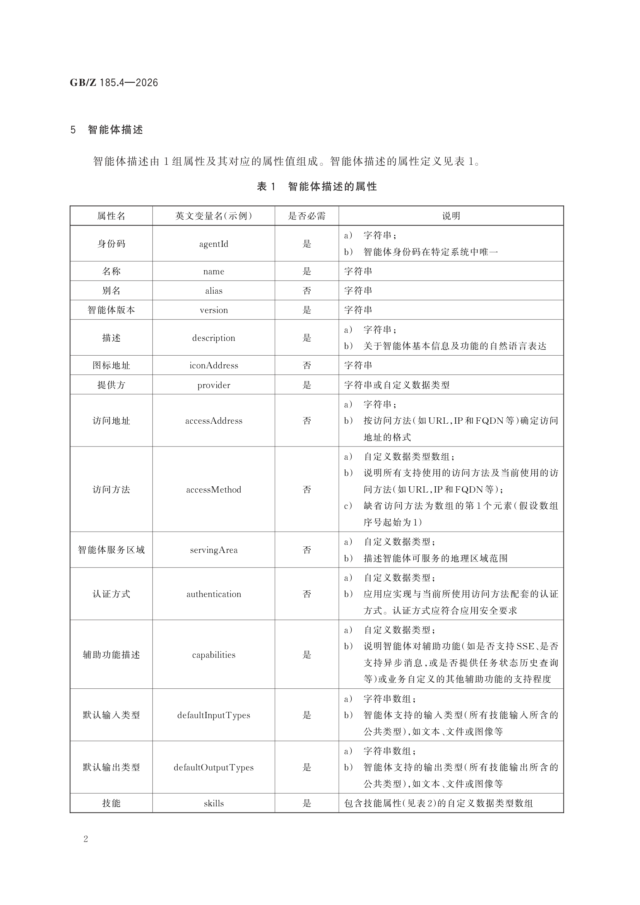
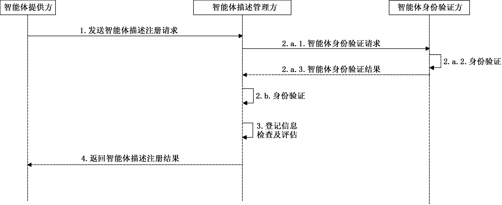
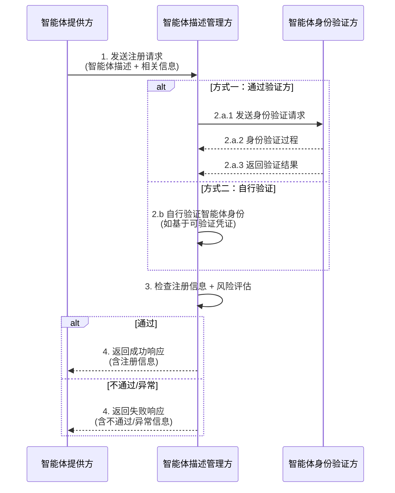
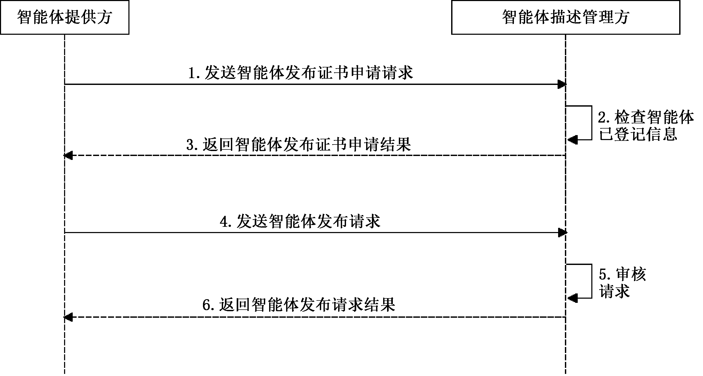
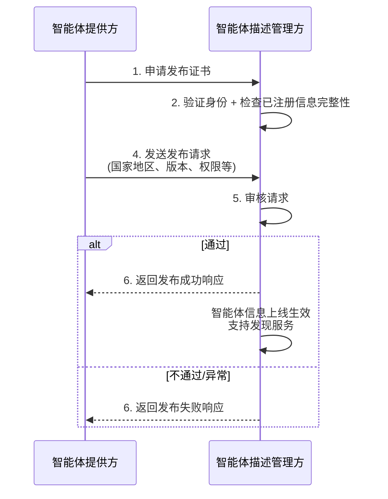
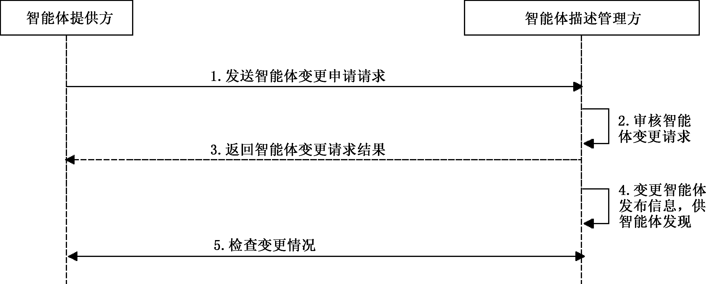
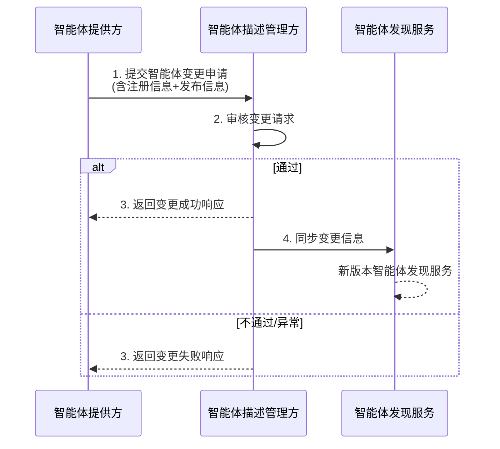

# GBZ 185.4-2026

<!-- Page 1 -->

ICS 35.100
CCS L 79
中 华 人 民 共 和 国 国 家 标 准 化 指 导 性 技 术 文 件
GB/Z 185.4—2026
人工智能 智能体互联
第 部分 智能体描述
4
：
Artificial intelligence—Agent interconnection—
Part 4： Agent description
2026⁃05⁃22 发布
国 家 市 场 监 督 管 理 总 局
发 布
国 家 标 准 化 管 理 委 员 会

<!-- Page 3 -->

GB/Z 185.4—2026
目 次
前言··························································································································Ⅲ
引言··························································································································Ⅳ
1 范围·······················································································································1
2 规范性引用文件········································································································1
3 术语和定义··············································································································1
4 缩略语····················································································································1
5 智能体描述··············································································································2
6 智能体描述的注册·····································································································3
7 智能体描述的发布·····································································································4
8 智能体描述的变更·····································································································5
Ⅰ

<!-- Page 5 -->

GB/Z 185.4—2026
前 言
本文件为规范类指导性技术文件。
本文件按照 GB/T 1.1—2020《标准化工作导则 第 1 部分：标准化文件的结构和起草规则》的规
定起草。
本文件是 GB/Z 185《人工智能 智能体互联》的第 4 部分。GB/Z 185 已经发布了以下部分：
——第 1 部分：总体架构；
——第 2 部分：身份码；
——第 3 部分：身份管理；
——第 4 部分：智能体描述；
——第 5 部分：智能体发现；
——第 6 部分：智能体交互；
——第 7 部分：智能体工具调用。
请注意本文件的某些内容可能涉及专利。本文件的发布机构不承担识别专利的责任。
本文件由全国信息技术标准化技术委员会（SAC/TC 28）提出并归口。
本文件起草单位：中国电子技术标准化研究院、华为技术有限公司、北京邮电大学、蚂蚁科技集团
股份有限公司、阿里云计算有限公司、中移互联网有限公司、小米通讯技术有限公司、中兴通讯股份有
限公司、江苏金服数字集团人工智能科技有限公司、中移（杭州）信息技术有限公司、北京浩瀚深度信息
技术股份有限公司、中移九天人工智能科技（北京）有限公司、昆仑数智科技有限责任公司、中国电力科
学研究院有限公司、联通数据智能有限公司、浪潮通信信息系统有限公司、京东方科技集团股份有限公
司、科大讯飞股份有限公司、浙江大华技术股份有限公司、亚信科技（中国）有限公司、联想（北京）有限
公司、咪咕文化科技有限公司、北京火山引擎科技有限公司、浪潮软件科技有限公司、南京理工大学、
中国移动通信集团有限公司、北京宝兰德软件股份有限公司、浪潮通用软件有限公司、成都理工大学、
晨晞数智（北京）科技有限公司、神州数码信息服务集团股份有限公司。
本文件主要起草人：徐洋、曹晓琦、鲍薇、田野、彭书萍、徐浩、黄冕、李珂、邱浚漾、高歌、张宏伟、
管俊明、庞韶敏、杨语澈、尚子钦、秦日臻、尚云云、李琰、李坤彦、梁秉豪、姜幸群、杨彤晖、孔维生、张联华、
李斌、马丽萌、王靖萱、王珂琛、戚湧、詹年科、丁一凡、陆仲达、邵俊谦、李坤。
Ⅲ

<!-- Page 6 -->

GB/Z 185.4—2026
引 言
随着人工智能技术迅猛发展，智能体作为人工智能从概念转化为实际生产力的关键载体，在各领
域应用日益广泛，对赋能新型工业化、塑造新质生产力作用显著。然而，当前智能体产业发展面临诸多
挑战，不同智能体间存在互联互通互操作难题，在基于协议的智能体互联领域，国际上已有 MCP、
A2A、ANP 等智能体通信协议，但并未形成行业完全共识的方案，亟需制定适合国内智能体产业发展
的行业统一共识方案。
为系统化解决上述问题，引导和规范智能体互联技术发展，提升智能体系统的互操作性、可组合性
与整体产业效能，特制定本指导性技术文件。GB/Z 185《人工智能 智能体互联》旨在规定智能体互
联的技术要求和流程，其编制遵循系统性、先进性和可操作性原则，为智能体之间实现跨平台、跨架构
的互联、互通、互操作提供统一的技术框架和标准依据，拟由七个部分构成。
——第 1 部分：总体架构。目的在于给出智能体互联环境中的概念模型、功能模型。
——第 2 部分：身份码。目的在于给出智能体身份码定义和应用，给出身份码代码结构和分配原
则的建议。
——第 3 部分：身份管理。目的在于给出智能体互联环境中的身份管理框架和全生命周期过程，
描述身份管理的技术要求。
——第 4 部分：智能体描述。目的在于给出智能体的描述方法，提供智能体描述注册、变更和发布
的参考流程。
——第 5 部分：智能体发现。目的在于给出智能体互联的发现流程。
——第 6 部分：智能体交互。目的在于给出智能体海量互联时的交互模式，描述交互基础元素及
接口定义。
——第 7 部分：智能体工具调用。目的在于给出基于大模型的智能体调用工具的标准化架构、流
程及工具描述，支持智能体与外部工具的无缝集成。
Ⅳ

<!-- Page 7 -->

GB/Z 185.4—2026
人工智能 智能体互联
第 4部分：智能体描述
1 范围
本文件给出了智能体描述的方法，提供了智能体描述注册、变更和发布的参考流程。
本文件适用于人工智能智能体及其互联、协同方案的设计、实现和测试。
2 规范性引用文件
下列文件中的内容通过文中的规范性引用而构成本文件必不可少的条款。其中，注日期的引用文
件，仅该日期对应的版本适用于本文件；不注日期的引用文件，其最新版本（包括所有的修改单）适用于
本文件。
GB/Z 185.1—2026 人工智能 智能体互联 第 1 部分：总体架构
GB/Z 185.5—2026 人工智能 智能体互联 第 5 部分：智能体发现
GB/T 41867—2022 信息技术 人工智能 术语
3 术语和定义
GB/Z 185.1—2026 和 GB/T 41867—2022 界定的以及下列术语和定义适用于本文件。
3.1
智能体描述 agent description
用以描述智能体名称、功能等的机器及人类可理解的信息。
3.2
智能体提供方 agent provider
生产、维护或利用智能体提供服务的机构或个人。
3.3
智能体描述管理方 agent description manager
提供智能体描述的注册、变更与发布等功能的实体。
3.4
技能 skill
智能体的功能。
示例：某自动化办公智能体提供对用户授权文件中的信息的问答功能。
4 缩略语
下列缩略语适用于本文件。
FQDN：完全限定域名（Fully Qualified Domain Name）
IP：互联网协议（Internet Protocol）
URL：统一资源定位符（Uniform Resource Locator）
1

<!-- Page 8 -->

GB/Z 185.4—2026
5 智能体描述
智能体描述由 1 组属性及其对应的属性值组成。智能体描述的属性定义见表 1。
表 1 智能体描述的属性
属性名 英文变量名（示例） 是否必需 说明
a） 字符串；
身份码 agentId 是
b） 智能体身份码在特定系统中唯一
名称 name 是 字符串
别名 alias 否 字符串
智能体版本 version 是 字符串
a） 字符串；
描述 description 是
b） 关于智能体基本信息及功能的自然语言表达
图标地址 iconAddress 否 字符串
提供方 provider 是 字符串或自定义数据类型
a） 字符串；
访问地址 accessAddress 否 b） 按访问方法（如URL，IP和FQDN等）确定访问
地址的格式
a） 自定义数据类型数组；
b） 说明所有支持使用的访问方法及当前使用的访
访问方法 accessMethod 否 问方法（如URL，IP和FQDN等）；
c） 缺省访问方法为数组的第1个元素（假设数组
序号起始为1）
a） 自定义数据类型；
智能体服务区域 servingArea 否
b） 描述智能体可服务的地理区域范围
a） 自定义数据类型；
认证方式 authentication 否 b） 应用应实现与当前所使用访问方法配套的认证
方式。认证方式应符合应用安全要求
a） 自定义数据类型；
b） 说明智能体对辅助功能（如是否支持SSE、是否
辅助功能描述 capabilities 是
支持异步消息，或是否提供任务状态历史查询
等）或业务自定义的其他辅助功能的支持程度
a） 字符串数组；
默认输入类型 defaultInputTypes 是 b） 智能体支持的输入类型（所有技能输入所含的
公共类型），如文本、文件或图像等
a） 字符串数组；
默认输出类型 defaultOutputTypes 是 b） 智能体支持的输出类型（所有技能输出所含的
公共类型），如文本、文件或图像等
技能 skills 是 包含技能属性（见表2）的自定义数据类型数组
2

| 属性名     | 英文变量名（示例）          | 是否必需 | 说明                                                                                        |
| ------- | ------------------ | ---- | ----------------------------------------------------------------------------------------- |
| 身份码     | agentId            | 是    | a） 字符串；
b） 智能体身份码在特定系统中唯一                                                                 |
| 名称      | name               | 是    | 字符串                                                                                       |
| 别名      | alias              | 否    | 字符串                                                                                       |
| 智能体版本   | version            | 是    | 字符串                                                                                       |
| 描述      | description        | 是    | a） 字符串；
b） 关于智能体基本信息及功能的自然语言表达                                                            |
| 图标地址    | iconAddress        | 否    | 字符串                                                                                       |
| 提供方     | provider           | 是    | 字符串或自定义数据类型                                                                               |
| 访问地址    | accessAddress      | 否    | a） 字符串；
b） 按访问方法（如URL，IP和FQDN等）确定访问
地址的格式                                                 |
| 访问方法    | accessMethod       | 否    | a） 自定义数据类型数组；
b） 说明所有支持使用的访问方法及当前使用的访
问方法（如URL，IP和FQDN等）；
c） 缺省访问方法为数组的第1个元素（假设数组
序号起始为1） |
| 智能体服务区域 | servingArea        | 否    | a） 自定义数据类型；
b） 描述智能体可服务的地理区域范围                                                            |
| 认证方式    | authentication     | 否    | a） 自定义数据类型；
b） 应用应实现与当前所使用访问方法配套的认证
方式。认证方式应符合应用安全要求                                      |
| 辅助功能描述  | capabilities       | 是    | a） 自定义数据类型；
b） 说明智能体对辅助功能（如是否支持SSE、是否
支持异步消息，或是否提供任务状态历史查询
等）或业务自定义的其他辅助功能的支持程度           |
| 默认输入类型  | defaultInputTypes  | 是    | a） 字符串数组；
b） 智能体支持的输入类型（所有技能输入所含的
公共类型），如文本、文件或图像等                                        |
| 默认输出类型  | defaultOutputTypes | 是    | a） 字符串数组；
b） 智能体支持的输出类型（所有技能输出所含的
公共类型），如文本、文件或图像等                                        |
| 技能      | skills             | 是    | 包含技能属性（见表2）的自定义数据类型数组                                                                     |

<!-- Page 9 -->

GB/Z 185.4—2026
表 2 技能的属性
属性名 英文变量名（示例） 是否必需 说明
a） 字符串；
标识 skillId 是 b） 技能标识在特定范围内（如单智能体或某系统）保持唯一；
c） 按业务和部署环境要求，技能标识应遵从特定格式
名字 skillName 是 字符串
a） 字符串；
技能描述 skillDescription 是
b） 描述技能的自然语言表达
a） 字符串数组；
标签 tags 是
b） 说明技能所属的类别或特征等
a） 字符串数组；
样例 examples 否
b） 此技能的使用样例，如包含典型输入、输出示例
a） 字符串数组；
输入类型 inputTypes 是
b） 技能支持的输入类型，如文本或图像等
a） 字符串数组；
输出类型 outputTypes 是
b） 技能支持的输出类型，如文本或图像等
a） 自定义数据类型数组；
b） 使用此技能的条件或依赖（如技能运行时依赖的软硬件环
运行依赖 dependencies 否
境、配置，或物理环境等）；
c） 留作系统实现时自行定义和使用
6 智能体描述的注册
智能体描述的注册流程见图 1。
注： 图中2.a.1~2.a.3所示过程与2.b所示过程为可选过程，二选一即可。
图 1 智能体描述注册过程

3

| 属性名  | 英文变量名（示例）        | 是否必需 | 说明                                                                         |
| ---- | ---------------- | ---- | -------------------------------------------------------------------------- |
| 标识   | skillId          | 是    | a） 字符串；
b） 技能标识在特定范围内（如单智能体或某系统）保持唯一；
c） 按业务和部署环境要求，技能标识应遵从特定格式            |
| 名字   | skillName        | 是    | 字符串                                                                        |
| 技能描述 | skillDescription | 是    | a） 字符串；
b） 描述技能的自然语言表达                                                     |
| 标签   | tags             | 是    | a） 字符串数组；
b） 说明技能所属的类别或特征等                                                 |
| 样例   | examples         | 否    | a） 字符串数组；
b） 此技能的使用样例，如包含典型输入、输出示例                                         |
| 输入类型 | inputTypes       | 是    | a） 字符串数组；
b） 技能支持的输入类型，如文本或图像等                                             |
| 输出类型 | outputTypes      | 是    | a） 字符串数组；
b） 技能支持的输出类型，如文本或图像等                                             |
| 运行依赖 | dependencies     | 否    | a） 自定义数据类型数组；
b） 使用此技能的条件或依赖（如技能运行时依赖的软硬件环
境、配置，或物理环境等）；
c） 留作系统实现时自行定义和使用 |

<!-- Page 10 -->

GB/Z 185.4—2026
智能体描述的注册流程如下。
a） 智能体提供方应为智能体提供描述，并向智能体描述管理方发送注册请求（图 1 中步骤 1），
请求信息：
1） 宜包含注册的对象，智能体程序包或智能体实例；
2） 宜包含智能体描述，符合第 5 章的要求；
3） 宜包含智能体描述管理方所需的其他信息（如智能体程序包的版本、智能体的可发现或
可用条件等）。
b） 智能体描述管理方应验证智能体提供方身份的真实性，宜验证智能体的身份（图 1 中步骤 2），
宜选择以下方式之一：
1） 向智能体身份验证方发送身份验证请求并获得身份验证结果（图 1 中步骤 2.a）；
2） 智能体描述管理方自行验证智能体身份（如基于可验证凭证）（图 1 中步骤 2.b）。
c） 基于验证结果，智能体描述管理方应检查注册请求信息（图 1 中步骤 3），宜评估风险：
1） 对注册请求信息的检查，宜根据智能体描述管理方所在地或服务目标区域适用的法律、
标准或智能体描述管理方自行制定的要求执行；
2） 智能体描述管理方可自行测试或向智能体提供方索取智能体描述中声明的功能、性能、
安全、运行依赖等相关测试数据或证明材料；
3） 风险的类别、内容，分析及判别过程等可由智能体描述管理方自身定义并实现。
d） 智能体描述管理方应向智能体提供方返回结果响应（图 1 中步骤 4）：
1） 如通过风险评估，返回成功响应，宜附带注册信息（如智能体描述管理方为智能体生成的
标识、归类等信息），由智能体描述管理方自行定义及实现；
2） 如智能体描述注册信息检查不通过或风险评估不通过时，返回失败响应，宜附带不通过
信息；
3） 如过程中智能体描述管理方发生内部系统异常，返回失败，宜附带异常信息。
7 智能体描述的发布
智能体提供方自行或通过智能体描述管理方发布智能体描述，用于智能体发现（发现过程的定义
按 GB/Z 185.5—2026）。智能体描述的发布流程见图 2。
注： 智能体提供方自行发布智能体描述，是使智能体描述信息在可被访问（如通过.well⁃known地址）。
图 2 智能体描述发布流程

4

<!-- Page 11 -->

GB/Z 185.4—2026
智能体描述的发布流程如下。
a） 在智能体发布前，智能体提供方宜向智能体描述管理方申请发布证书（图 2 中步骤 1）：
1） 证书应能证明智能体已注册信息的完整性及智能体描述管理方（发布者）的真实性；
2） 证书宜包含公钥或证书摘要等必要信息。
b） 智能体描述管理方验证申请方身份的真实性，检查智能体已注册信息的完整性、实时性等（图 2
中步骤 2），检查指标可由智能体描述管理方定义。
c） 为发布智能体，智能体提供方应向智能体描述管理方发送发布请求（图 2 中步骤 4），后者可
向智能体提供方索取附加信息以备审核，如：
1） 发布国家和地区；
2） 是否为开放测试版本；
3） 付费要求；
4） 权限要求和说明（权限、设备、数据要求以及相应理由）；
5） 电子版权证书；
6） 智能体描述管理方或法律法规要求的其他信息。
d） 智能体描述管理方审核请求（图 2 中步骤 5）：
1） 如通过，应返回智能体发布请求成功响应（图 2 中步骤 6）；
2） 如不通过，应返回智能体发布请求失败响应（图 2 中步骤 6）；
3） 如审核过程中智能体描述管理方系统内发生异常，应返回智能体发布请求失败响应（图 2
中步骤 6）。
e） 返回发布成功的响应后，智能体描述管理方应实施智能体信息上线生效的工作。生效后，智
能体描述管理方支持对所发布智能体的发现。
8 智能体描述的变更
智能体提供方变更在智能体描述管理方发布的智能体，过程见图 3。
图 3 智能体变更过程

智能体描述的变更流程如下。
a） 智能体提供方向智能体描述管理方提交智能体变更申请（图 3 中步骤 1），应包含第 6 章 a）要
求的信息。如变更同时需发布智能体，应包含第 7 章 c）的信息。
b） 智能体描述管理方应审核智能体变更请求（图 3 中步骤 2）。
5

<!-- Page 12 -->

GB/Z 185.4—2026
c） 返回智能体变更请求结果（图 3 中步骤 3）：
1） 如通过，应返回智能体变更请求成功响应；
2） 如不通过，应返回智能体变更请求失败响应；
3） 如审核过程中智能体描述管理方系统内发生异常，应返回智能体变更请求失败响应。
d） 变更成功时，智能体描述管理方宜对新版本智能体提供发现服务（图 3 中步骤 4）。
注： 当智能体描述管理方系统与智能体发现服务独立实现时，发现服务与智能体描述管理方同步智能体变更
信息，以备发现。
e） 智能体提供方可检查变更情况（如尝试发现过程）（图 3 中步骤 5）。此过程可选。
———————————
6