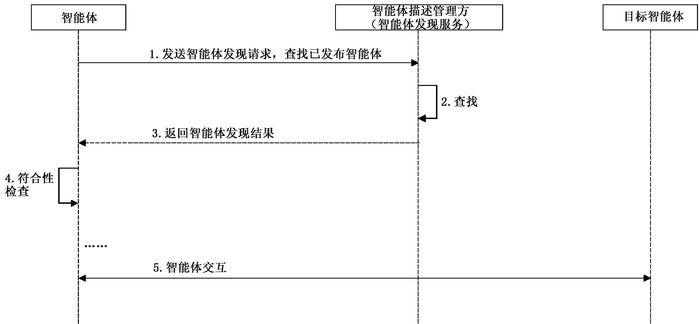
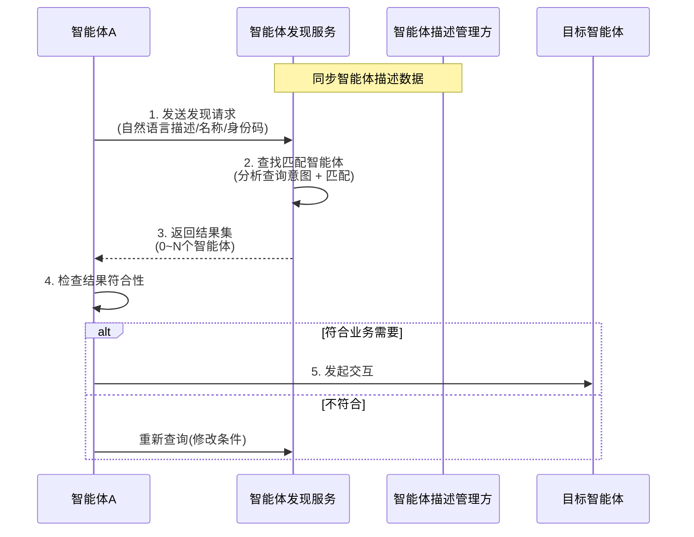
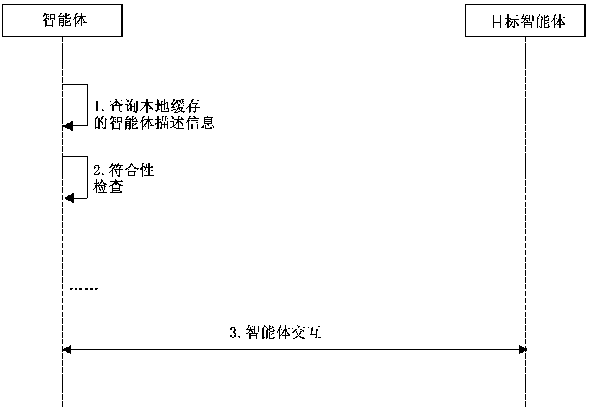
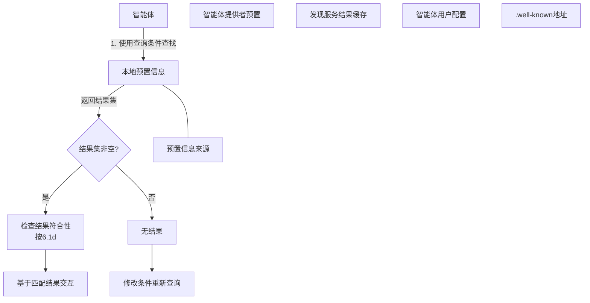

# GBZ 185.5-2026

<!-- Page 1 -->

ICS 35.100
CCS L 79
中 华 人 民 共 和 国 国 家 标 准 化 指 导 性 技 术 文 件
GB/Z 185.5—2026
人工智能 智能体互联
第 部分 智能体发现
5
：
Artificial intelligence—Agent interconnection—
Part 5： Agent discovery
2026⁃05⁃22 发布
国 家 市 场 监 督 管 理 总 局
发 布
国 家 标 准 化 管 理 委 员 会

<!-- Page 3 -->

GB/Z 185.5—2026
目 次
前言··························································································································Ⅲ
引言··························································································································Ⅳ
1 范围·······················································································································1
2 规范性引用文件········································································································1
3 术语和定义··············································································································1
4 缩略语····················································································································1
5 通则·······················································································································1
6 智能体发现方式········································································································2
6.1 基于智能体发现服务的发现流程·············································································2
6.2 基于预置信息的发现流程······················································································3
Ⅰ

<!-- Page 5 -->

GB/Z 185.5—2026
前 言
本文件为规范类指导性技术文件。
本文件按照 GB/T 1.1—2020《标准化工作导则 第 1 部分：标准化文件的结构和起草规则》的规
定起草。
本文件是 GB/Z 185《人工智能 智能体互联》的第 5 部分。GB/Z 185 已经发布了以下部分：
——第 1 部分：总体架构；
——第 2 部分：身份码；
——第 3 部分：身份管理；
——第 4 部分：智能体描述；
——第 5 部分：智能体发现；
——第 6 部分：智能体交互；
——第 7 部分：智能体工具调用。
请注意本文件的某些内容可能涉及专利。本文件的发布机构不承担识别专利的责任。
本文件由全国信息技术标准化技术委员会（SAC/TC 28）提出并归口。
本文件起草单位：中国电子技术标准化研究院、华为技术有限公司、北京邮电大学、北京浩瀚深度
信息技术股份有限公司、小米通讯技术有限公司、蚂蚁科技集团股份有限公司、中移互联网有限公司、
阿里云计算有限公司、昆仑数智科技有限责任公司、江苏金服数字集团人工智能科技有限公司、亚信科
技（中国）有限公司、联通数据智能有限公司、咪咕文化科技有限公司、中兴通讯股份有限公司、中移九
天人工智能科技（北京）有限公司、中国电力科学研究院有限公司、北京兴云数科技术有限公司、浙江大
华技术股份有限公司、中移（杭州）信息技术有限公司、联想（北京）有限公司、京东方科技集团股份有限
公司、杭州高新区（滨江）区块链与数据安全研究院、浪潮通信信息系统有限公司、南京理工大学、浪潮
云信息技术股份公司、中国移动通信集团有限公司、厦门市美亚柏科信息安全研究所有限公司、成都理
工大学、浪潮软件科技有限公司、北京火山引擎科技有限公司、晨晞数智（北京）科技有限公司、浪潮通
用软件有限公司、北京宝兰德软件股份有限公司。
本文件主要起草人：董建、曹晓琦、李晨、聂永丰、李茜茜、刘海涛、孙立军、杜宁、庞韶敏、李珂、
方强、徐浩、苗宗利、陆仲达、张宏伟、李琰、魏遵博、高歌、管俊明、尚云云、张联华、李坤彦、马丽萌、
曹汐、朱政、秦日臻、孔维生、尚子钦、李斌、姜幸群、王靖萱、戚湧、梁秉豪、郑佳佳、李坤、蔺向楠、孙昊、
阙锦龙、程晗蕾、王珂琛。
Ⅲ

<!-- Page 6 -->

GB/Z 185.5—2026
引 言
随着人工智能技术迅猛发展，智能体作为人工智能从概念转化为实际生产力的关键载体，在各领
域应用日益广泛，对赋能新型工业化、塑造新质生产力作用显著。然而，当前智能体产业发展面临诸多
挑战，不同智能体间存在互联互通互操作难题，在基于协议的智能体互联领域，国际上已有 MCP、
A2A、ANP 等智能体通信协议，但并未形成行业完全共识的方案，亟需制定适合国内智能体产业发展
的行业统一共识方案。
为系统化解决上述问题，引导和规范智能体互联技术发展，提升智能体系统的互操作性、可组合性
与整体产业效能，特制定本指导性技术文件。GB/Z 185《人工智能 智能体互联》旨在规定智能体互
联的技术要求和流程，其编制遵循系统性、先进性和可操作性原则，为智能体之间实现跨平台、跨架构
的互联、互通、互操作提供统一的技术框架和标准依据，GB/Z 185 拟由七个部分构成。
——第 1 部分：总体架构。目的在于给出智能体互联环境中的概念模型、功能模型。
——第 2 部分：身份码。目的在于给出智能体身份码定义和应用，给出身份码代码结构和分配原
则的建议。
——第 3 部分：身份管理。目的在于给出智能体互联环境中的身份管理框架和全生命周期过程，
描述身份管理的技术要求。
——第 4 部分：智能体描述。目的在于给出智能体的描述方法，提供智能体描述注册、变更和发布
的参考流程。
——第 5 部分：智能体发现。目的在于给出智能体互联的发现流程。
——第 6 部分：智能体交互。目的在于给出智能体海量互联时的交互模式，描述交互基础元素及
接口定义。
——第 7 部分：智能体工具调用。目的在于给出基于大模型的智能体调用工具的标准化架构、流
程及工具描述，支持智能体与外部工具的无缝集成。
Ⅳ

<!-- Page 7 -->

GB/Z 185.5—2026
人工智能 智能体互联
第 5部分：智能体发现
1 范围
本文件确立了用于智能体互联的智能体发现的流程。
本文件适用于人工智能智能体互联、协同方案的设计、实现和测试。
2 规范性引用文件
下列文件中的内容通过文中的规范性引用而构成本文件必不可少的条款。其中，注日期的引用文
件，仅该日期对应的版本适用于本文件；不注日期的引用文件，其最新版本（包括所有的修改单）适用于
本文件。
GB/Z 185.1—2026 人工智能 智能体互联 第 1 部分：总体架构
GB/Z 185.4—2026 人工智能 智能体互联 第 4 部分：智能体描述
GB/T 41867—2022 信息技术 人工智能 术语
3 术语和定义
GB/T 41867—2022、GB/Z 185.1—2026 和 GB/Z 185.4—2026 界定的以及下列术语和定义适用
于本文件。
3.1
智能体发现 agent discovery
匹配并获得符合业务要求的 1 个或多个智能体描述的过程。
3.2
智能体发现服务 agent discovery service
实现或提供智能体发现功能的过程。
4 缩略语
下列缩略语适用于本文件。
API：应用程序接口（Application Programming Interface）
GUI：图形用户界面（Graphical User Interface）
LUI：语言用户界面（Language User Interface）
5 通则
本文件定义智能体发现机制，包含基于智能体发现服务的发现（见 6.1）和基于预置信息的发现（见
6.2）。在实现智能体互联时，可任选 1 种或 2 种，并实施有效的衔接。
1

<!-- Page 8 -->

GB/Z 185.5—2026
6 智能体发现方式
6.1 基于智能体发现服务的发现流程
智能体描述管理方应提供智能体发现服务，并提供智能体发现接口，响应智能体发现请求。发现
流程示意如图 1 所示。
注： 在某些系统中，智能体发现服务与智能体描述管理方系统各自由独立的软件系统实现。发现服务应与智能体
描述管理方同步智能体描述数据，保证智能体描述信息的准确性和时效性。
图 1 基于智能体发现服务的发现流程

基于智能体发现服务的发现流程如下。
a） 智能体向智能体发现服务发送智能体发现请求（图 1 中步骤 1）：
1） 发现条件可由智能体生成或人工设置；
2） 发现条件宜将 GB/Z 185.4—2026 表 1 定义的自然语言描述作为必要条件，同时可组合
包含智能体名称、身份码等一种或多种其他信息；
3） 智能体发现服务宜至少提供 1 种查询接口，如 API、GUI或 LUI。
b） 收到请求后，智能体发现服务在已发布的智能体中查找符合要求的智能体（图 1 中步骤 2）：
1） 结果集可包含 0 个、1 个或多个条目，1 个条目对应 1 个智能体；
2） 结果集中的任 1条目，应至少包含智能体的名称或其他任何可被用作符合性检查的信息；
示例：智能体发现服务分析查询条件（如自然语言描述的功能、性能、状态、安全约束或付费信息）识别查
询意图，再与目标智能体匹配，确定符合条件的目标智能体。
3） 按业务需要，智能体发现服务宜依据已注册智能体的可被发现配置，仅返回配置为允许
发现的智能体，不返回配置为不可发现的智能体；
4） 按业务需要，智能体发现服务宜遵循已注册智能体的可用性要求，如付费使用，或仅供特
定用户群使用等相关信息。
c） 智能体发现服务对发现请求返回结果集（图 1 中步骤 3）。
d） 智能体检查结果集中所列智能体对当前业务的符合性（图 1 中步骤 4）：
1） 如返回的智能体符合业务需要，宜按需对目标智能体发起交互；
2） 如无智能体描述返回或返回的智能体不符合业务需要，可修改查询条件后，重新发起查
询请求[见 6.1 a）]。
2

<!-- Page 9 -->

GB/Z 185.5—2026
e） 智能体基于业务匹配结果进行交互（图 1 中步骤 5）。
6.2 基于预置信息的发现流程
基于预置信息的智能体发现过程如图 2 所示。
图 2 基于预置信息的发现流程

基于预置信息的发现流程如下。
a） 智能体使用查询条件从本地预置信息中查找智能体（图 2 中步骤 1），返回结果集：
1） 查询条件可由智能体生成或人工设置；
2） 本地查找的过程可由智能体提供者实现，或由智能体规划和执行。
b） 预置的智能体信息应符合业务安全要求，可来自以下任何 1 种途径：
1） 智能体提供者预置；
2） 智能体访问智能体发现服务后返回的结果集的缓存，此时智能体宜按业务要求检查或保
证描述的时效性（如周期性向智能体发现服务确认缓存智能体的可用性）；
3） 智能体用户配置；
4） .well⁃known 地址。
注： .well⁃known是WEB服务器上的标准化目录，用于存放特定类型的文件（如WEB网站介绍、配置、证
书等）。
c） 查询结果集非空时，智能体按 6.1 d）检查结果集中智能体对当前业务的符合性（图 2 中
步骤 2）。
d） 智能体基于业务匹配结果进行交互（图 2 中步骤 3）。
———————————
3